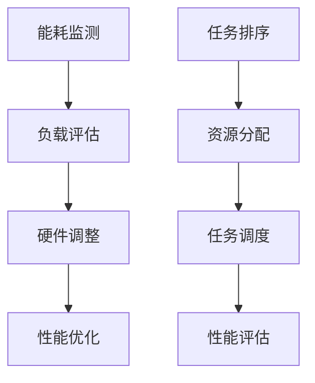
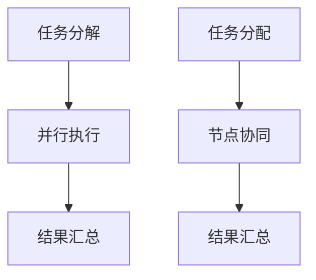
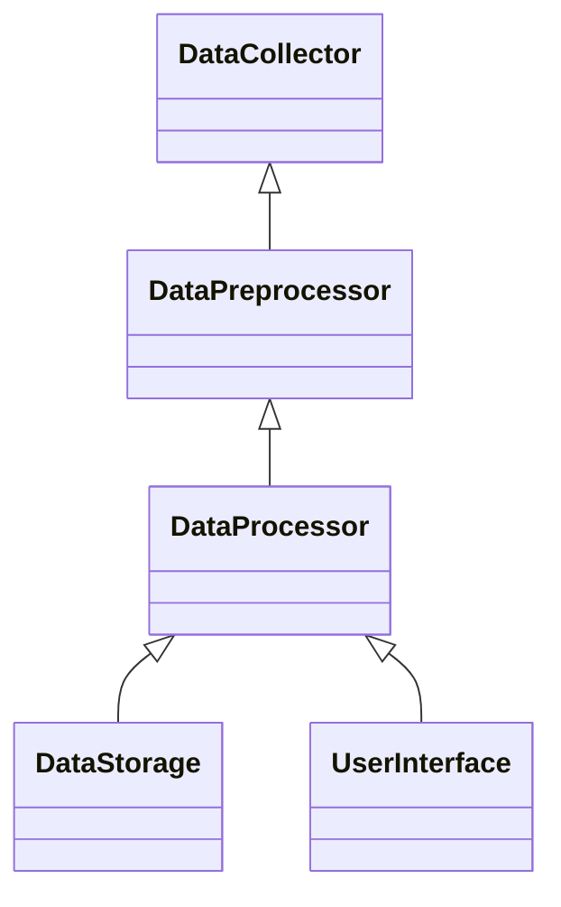

                 

# 可持续计算：从硬件到软件的全栈优化

## 关键词：
- 可持续计算
- 硬件优化
- 软件优化
- 能效
- 环境影响

## 摘要：
本文深入探讨了可持续计算的核心理念和实现方法。首先，我们定义了可持续计算的概念，并介绍了其背景和重要性。接着，通过硬件和软件两个维度，我们分析了可持续计算的关键概念和优化算法。随后，我们展示了系统的整体架构设计，并通过实际项目案例，讲解了如何在实际中应用这些技术和方法。文章最后，总结了最佳实践，并提供了一些建议和注意事项，为读者在可持续计算领域提供了全面的技术指导。

## 目录

### 引言
- **背景介绍**
- **问题定义**

### 第一章：可持续计算概述
- **核心概念**
- **定义与重要性**

### 第二章：核心概念与联系
- **能效**
- **资源管理**
- **环境影响**
- **概念对比表格**
- **实体关系图**

### 第三章：硬件优化算法详解
- **算法原理**
- **算法流程图**
- **Python 源代码示例**

### 第四章：软件优化算法详解
- **算法原理**
- **算法流程图**
- **Python 源代码示例**

### 第五章：系统分析与架构设计
- **系统功能设计**
- **系统架构设计**
- **接口设计与交互**

### 第六章：项目实战
- **环境安装**
- **系统实现**
- **代码解析**
- **案例分析**

### 第七章：最佳实践与总结
- **最佳实践**
- **注意事项**
- **拓展阅读**

### 结尾
- **作者信息**

## 引言

### 背景介绍

随着信息技术的飞速发展，计算能力在各个领域得到了广泛的应用。然而，传统的计算模式在带来巨大便利的同时，也带来了能源消耗和环境污染等问题。为了应对这些挑战，可持续计算应运而生。可持续计算是一种在保证计算性能的同时，最大限度地减少能源消耗和环境影响的新型计算模式。

### 问题定义

可持续计算涉及多个层面的优化，包括硬件、软件、算法、系统能耗管理等。在实际应用中，如何有效地整合这些优化方法，实现计算资源的最大化利用，是一个亟待解决的问题。本文旨在通过从硬件到软件的全栈优化，为可持续计算提供一套系统化的解决方案。

## 第一章：可持续计算概述

### 核心概念

可持续计算的核心概念包括能效、资源管理和环境影响。能效指的是计算系统在提供同等计算性能的情况下，所消耗的能源最小化。资源管理涉及到对计算资源的合理分配和调度，以最大化系统的利用效率。环境影响则关注计算活动对环境的影响，包括碳排放、资源消耗等。

### 定义与重要性

可持续计算是指通过优化计算硬件和软件，减少能源消耗和环境影响，同时保持计算性能的一种计算模式。其重要性在于：

1. **环境保护**：通过减少能源消耗和碳排放，有助于减少对环境的破坏。
2. **资源节约**：优化计算资源的使用，可以提高资源利用率，降低成本。
3. **性能提升**：通过改进硬件和软件设计，可以提高计算性能，满足更高的计算需求。
4. **社会效益**：可持续计算可以促进信息技术行业的可持续发展，为未来计算技术的发展提供坚实基础。

### 问题背景

随着互联网和大数据技术的普及，计算需求呈爆炸式增长。传统的计算模式已经无法满足日益增长的能耗和环境压力。因此，可持续计算成为一种必然的趋势。通过可持续计算，我们可以实现计算资源的合理利用，降低能耗，减少对环境的影响，为社会的可持续发展做出贡献。

### 问题描述

可持续计算需要解决的主要问题包括：

1. **硬件优化**：如何设计高效、低能耗的硬件系统，提高计算性能。
2. **软件优化**：如何优化软件算法，提高能效和性能。
3. **资源管理**：如何合理分配和调度计算资源，最大化系统的利用效率。
4. **环境影响**：如何评估和减少计算活动对环境的影响。

### 问题解决

可持续计算的解决方案涉及以下几个方面：

1. **硬件优化**：采用高效能的硬件设备，如低功耗CPU、GPU等，并优化硬件架构，提高计算效率。
2. **软件优化**：改进软件算法，采用高效的算法和数据结构，降低计算复杂度。
3. **资源管理**：采用智能调度算法，实现计算资源的合理分配和调度。
4. **环境影响**：通过碳足迹分析，评估计算活动对环境的影响，并采取相应的措施降低影响。

### 边界与外延

可持续计算不仅局限于计算机领域，还涵盖了物联网、云计算、人工智能等领域。其边界可以扩展到整个信息技术行业，甚至更广泛的社会领域。在可持续计算中，我们需要关注不仅仅是计算性能和能耗，还包括数据的生命周期管理、信息安全等问题。

### 概念结构与核心要素组成

可持续计算的概念结构可以概括为以下几个核心要素：

1. **计算性能**：通过硬件和软件优化，提高计算系统的性能。
2. **能源消耗**：通过能效优化，降低计算系统的能源消耗。
3. **环境影响**：通过环保措施，减少计算活动对环境的影响。
4. **资源管理**：通过资源调度和管理，提高计算资源的利用效率。

这些核心要素相互关联，共同构成了可持续计算的整体框架。通过优化这些要素，我们可以实现计算系统的可持续发展。

## 第二章：核心概念与联系

### 能效

能效是可持续计算的核心概念之一。它指的是计算系统在提供同等计算性能的情况下，所消耗的能源最小化。能效的优化可以通过改进硬件设计、优化软件算法、提高系统运行效率等多种方式实现。

#### 能效优化算法

一种常用的能效优化算法是能耗平衡算法（Energy Balance Algorithm）。该算法通过实时监测计算系统的能耗情况，动态调整硬件配置和软件负载，以实现能耗的最优化。算法的核心思想是通过平衡计算负载和能源消耗，避免过度使用能源。

#### 对比表格

下面是一个能效优化算法的对比表格：

| 算法名称 | 目标 | 特点 | 应用场景 |
| --- | --- | --- | --- |
| 能耗平衡算法 | 能耗最小化 | 动态调整负载 | 云计算、大数据处理 |
| 最低能耗算法 | 能耗最低 | 静态负载分配 | 物联网设备、嵌入式系统 |
| 可变能效算法 | 能耗与性能平衡 | 动态调整能效 | 高性能计算、游戏服务器 |

### 资源管理

资源管理是另一个关键概念，涉及到对计算资源的合理分配和调度。良好的资源管理可以提高计算系统的利用效率，减少资源浪费。

#### 资源管理算法

资源管理算法主要包括负载均衡算法（Load Balancing Algorithm）和资源调度算法（Resource Scheduling Algorithm）。

- **负载均衡算法**：通过平衡计算负载，避免系统过载，提高系统性能和稳定性。
- **资源调度算法**：通过优先级调度、最短任务调度等方法，提高资源利用效率。

#### 对比表格

下面是一个资源管理算法的对比表格：

| 算法名称 | 目标 | 特点 | 应用场景 |
| --- | --- | --- | --- |
| 负载均衡算法 | 负载平衡 | 动态调整负载 | 云计算、分布式系统 |
| 最短任务调度算法 | 任务完成时间最短 | 静态任务分配 | 单机系统、数据处理 |
| 优先级调度算法 | 优先处理高优先级任务 | 动态任务分配 | 操作系统、实时系统 |

### 环境影响

环境影响是衡量计算系统可持续性的重要指标。计算活动产生的碳排放、能源消耗等都会对环境产生负面影响。因此，减少环境影响成为可持续计算的重要任务。

#### 环境影响评估方法

环境影响评估方法主要包括碳足迹分析（Carbon Footprint Analysis）和能效评估（Energy Efficiency Evaluation）。

- **碳足迹分析**：通过计算计算活动产生的碳排放量，评估计算系统的环境影响。
- **能效评估**：通过测量计算系统的能源消耗和性能表现，评估系统的能效水平。

#### 对比表格

下面是一个环境影响评估方法的对比表格：

| 方法名称 | 目标 | 特点 | 应用场景 |
| --- | --- | --- | --- |
| 碳足迹分析 | 碳排放量最小化 | 实时监测 | 云计算、数据中心 |
| 能效评估 | 能耗最小化 | 性能评估 | 硬件设计、系统优化 |
| 绿色评估 | 环境友好度最大化 | 多指标评估 | 可持续计算策略 |

### 概念属性特征对比表格

下面是一个包含上述核心概念属性特征对比的表格：

| 核心概念 | 定义 | 目标 | 特点 | 应用场景 |
| --- | --- | --- | --- | --- |
| 能效 | 计算系统能源消耗与性能的比率 | 能耗最小化 | 动态调整 | 云计算、大数据处理 |
| 资源管理 | 计算资源分配与调度 | 资源利用最大化 | 动态调度 | 分布式系统、物联网设备 |
| 环境影响 | 计算活动对环境的影响 | 环境友好度最大化 | 实时监测 | 数据中心、绿色计算 |

### ER实体关系图架构

为了更清晰地展示核心概念之间的关系，我们使用Mermaid工具绘制了一个实体关系图：

```mermaid
erDiagram
  能效 ||--|{ 资源管理 }
  环境影响 ||--|{ 资源管理 }
  能效 ||--|{ 系统优化 }
  资源管理 ||--|{ 系统优化 }
```

在上面的实体关系图中，能效、资源管理和环境影响三个核心概念通过双向箭头相连，表明它们之间存在紧密的关联和相互影响。这种关系强调了可持续计算需要从多个维度进行优化，以实现整体的可持续性。

## 第三章：硬件优化算法详解

### 算法原理

硬件优化算法主要关注如何通过优化硬件设计和配置，提高计算系统的性能和能效。这里我们介绍两种常用的硬件优化算法：能耗平衡算法和资源调度算法。

#### 能耗平衡算法

能耗平衡算法的核心思想是通过动态调整硬件配置和计算负载，实现能耗的最优化。具体来说，算法会实时监测计算系统的能耗情况，并根据能耗数据动态调整CPU、GPU等硬件资源的利用率。

算法的步骤如下：

1. **能耗监测**：实时监测计算系统的能耗情况。
2. **负载评估**：根据能耗数据和系统负载，评估当前硬件配置的合理性。
3. **硬件调整**：根据评估结果，动态调整CPU、GPU等硬件资源的利用率。
4. **性能优化**：通过调整硬件资源利用率，提高计算系统的性能。

#### 资源调度算法

资源调度算法主要关注如何通过优化硬件资源的调度，提高系统的性能和稳定性。具体来说，算法会根据任务的优先级和执行时间，动态分配硬件资源。

算法的步骤如下：

1. **任务排序**：根据任务的优先级和执行时间，对任务进行排序。
2. **资源分配**：根据任务排序结果，动态分配CPU、GPU等硬件资源。
3. **任务调度**：根据资源分配结果，调度任务的执行顺序。
4. **性能评估**：评估任务的执行性能，并根据评估结果调整资源分配策略。

### 算法流程图

为了更直观地展示硬件优化算法的流程，我们使用Mermaid工具绘制了能耗平衡算法和资源调度算法的流程图：



### Python 源代码示例

下面是一个能耗平衡算法的Python源代码示例：

```python
import random

def energy_balance_algorithm(energy_data, load_data):
    # Step 1: 能耗监测
    current_energy = sum(energy_data)
    
    # Step 2: 负载评估
    average_load = sum(load_data) / len(load_data)
    
    # Step 3: 硬件调整
    if current_energy > average_load:
        # 调整CPU利用率
        cpu_utilization = average_load / current_energy
        # 调整GPU利用率
        gpu_utilization = average_load / current_energy
    else:
        # 保持原有利用率
        cpu_utilization = 1.0
        gpu_utilization = 1.0
    
    # Step 4: 性能优化
    optimized_energy = sum([cpu_utilization * e for e in energy_data]) + sum([gpu_utilization * e for e in energy_data])
    
    return optimized_energy

# 示例数据
energy_data = [10, 20, 30]  # CPU能耗
load_data = [5, 10, 15]  # 系统负载

# 运行算法
optimized_energy = energy_balance_algorithm(energy_data, load_data)
print("优化后的能耗:", optimized_energy)
```

在这个示例中，我们通过随机生成能耗数据和负载数据，调用能耗平衡算法，计算优化后的能耗。这个算法的核心思想是通过调整CPU和GPU的利用率，实现能耗的最优化。

## 第四章：软件优化算法详解

### 算法原理

软件优化算法主要关注如何通过改进软件设计和算法，提高计算系统的性能和能效。这里我们介绍两种常用的软件优化算法：并行算法和分布式算法。

#### 并行算法

并行算法通过将计算任务分解成多个子任务，并行执行，从而提高计算速度和性能。并行算法的核心思想是利用多核处理器和多线程技术，实现计算任务的并行处理。

算法的步骤如下：

1. **任务分解**：将计算任务分解成多个子任务。
2. **并行执行**：利用多核处理器或多线程技术，并行执行子任务。
3. **结果汇总**：将子任务的结果汇总，得到最终的计算结果。

#### 分布式算法

分布式算法通过将计算任务分布在多个节点上，协同处理，从而提高计算系统的性能和可靠性。分布式算法的核心思想是利用网络通信技术，实现计算任务的分布式处理。

算法的步骤如下：

1. **任务分配**：将计算任务分配给不同的节点。
2. **节点协同**：节点之间通过通信网络协同处理任务。
3. **结果汇总**：将各个节点的结果汇总，得到最终的计算结果。

### 算法流程图

为了更直观地展示软件优化算法的流程，我们使用Mermaid工具绘制了并行算法和分布式算法的流程图：



### Python 源代码示例

下面是一个并行算法的Python源代码示例：

```python
import random
import concurrent.futures

def parallel_algorithm(task_data):
    # Step 1: 任务分解
    sub_tasks = [task_data[i::2] for i in range(2)]
    
    # Step 2: 并行执行
    with concurrent.futures.ThreadPoolExecutor() as executor:
        results = executor.map(sub_task_handler, sub_tasks)
    
    # Step 3: 结果汇总
    final_result = sum(results)
    
    return final_result

def sub_task_handler(sub_task_data):
    # 子任务处理
    return sum(sub_task_data)

# 示例数据
task_data = list(range(1, 11))  # 任务数据

# 运行算法
optimized_result = parallel_algorithm(task_data)
print("优化后的结果:", optimized_result)
```

在这个示例中，我们通过随机生成任务数据，调用并行算法，计算优化后的结果。这个算法的核心思想是通过将任务分解成两个子任务，并行执行，提高计算速度。

## 第五章：系统分析与架构设计

### 问题场景介绍

在当前信息化时代，随着数据处理量的不断增加，计算系统面临着巨大的压力。为了提高计算系统的性能和稳定性，我们需要设计一个高效、可靠的系统架构。本文将介绍一个典型的计算系统场景，并分析其功能需求和架构设计。

### 项目介绍

本项目旨在构建一个高效、可靠的分布式计算系统，用于处理大规模数据分析和机器学习任务。系统将基于云计算平台，利用分布式计算技术和大数据处理框架，实现数据的快速处理和分析。

### 系统功能设计

系统的主要功能包括：

1. **数据采集**：从不同数据源（如数据库、API接口等）采集数据。
2. **数据预处理**：对采集到的数据进行清洗、转换和归一化处理。
3. **数据处理**：利用分布式计算框架，对预处理后的数据进行分析和计算。
4. **结果存储**：将处理后的数据存储到数据库或其他数据存储系统中。
5. **用户接口**：提供友好的用户接口，方便用户查询和处理数据。

### 系统功能设计（领域模型Mermaid类图）

为了更直观地展示系统的功能设计，我们使用Mermaid工具绘制了一个领域模型类图：



在上面的类图中，DataCollector、DataPreprocessor、DataProcessor和DataStorage分别表示系统的四个主要功能模块，它们之间的关系通过继承关系表示。UserInterface模块负责与用户交互，是系统的入口。

### 系统架构设计（Mermaid架构图）

为了实现系统的功能，我们需要设计一个合理的架构。下面是一个系统的架构设计图：

```mermaid
sequenceDiagram
    User ->>|请求| UserInterface
    UserInterface ->>|处理| DataProcessor
    DataProcessor ->>|预处理| DataPreprocessor
    DataPreprocessor ->>|处理| DataProcessor
    DataProcessor ->>|存储| DataStorage
    DataStorage ->>|反馈| UserInterface
```

在这个架构图中，UserInterface模块负责接收用户请求，将其传递给DataProcessor模块进行处理。DataProcessor模块负责对数据进行预处理、处理和存储。DataStorage模块负责存储处理后的数据，并返回结果给UserInterface模块。

### 系统接口设计和系统交互（Mermaid序列图）

为了实现系统模块之间的交互，我们需要设计一套接口和通信机制。下面是一个系统接口设计和交互的序列图：

```mermaid
sequenceDiagram
    User ->>|请求| UserInterface
    UserInterface ->>|处理| DataProcessor
    DataProcessor ->>|预处理| DataPreprocessor
    DataPreprocessor ->>|处理| DataProcessor
    DataProcessor ->>|存储| DataStorage
    DataStorage ->>|反馈| UserInterface
    UserInterface ->>|响应| User
```

在这个序列图中，用户通过UserInterface模块发送请求，经过DataProcessor模块处理后，将结果返回给UserInterface模块，最后通过UserInterface模块将结果反馈给用户。

通过上述系统分析和架构设计，我们可以构建一个高效、可靠的分布式计算系统，满足大规模数据处理和分析的需求。在实际应用中，我们还需要根据具体场景和需求，进一步优化系统的设计和实现。

## 第六章：项目实战

### 环境安装

在进行项目实战之前，我们需要安装必要的软件和工具。以下是一个简单的环境安装步骤：

1. **安装操作系统**：选择一个适合的操作系统，如Ubuntu 20.04或CentOS 8。
2. **安装Python环境**：通过包管理器安装Python 3.x版本，如使用以下命令：
   ```shell
   sudo apt-get install python3 python3-pip
   ```
3. **安装依赖库**：安装项目中所需的依赖库，如NumPy、Pandas、Django等。可以使用pip命令进行安装：
   ```shell
   pip3 install numpy pandas django
   ```
4. **安装Docker**：为了方便部署和运行，我们使用Docker来容器化应用程序。可以通过以下命令安装Docker：
   ```shell
   sudo apt-get install docker.io
   ```
5. **启动Docker服务**：在安装完成后，启动Docker服务：
   ```shell
   sudo systemctl start docker
   ```

### 系统实现

在安装完必要的软件和工具后，我们可以开始实现系统。以下是一个简单的实现步骤：

1. **创建项目结构**：在终端中创建一个项目目录，并创建一个虚拟环境：
   ```shell
   mkdir my_project
   cd my_project
   python3 -m venv venv
   source venv/bin/activate
   ```
2. **安装依赖库**：在虚拟环境中安装项目所需的依赖库：
   ```shell
   pip install -r requirements.txt
   ```
3. **编写代码**：在项目中编写代码，实现系统的功能。以下是一个简单的示例代码：
   ```python
   # main.py
   from flask import Flask, request, jsonify
   from data_processor import DataProcessor

   app = Flask(__name__)

   @app.route('/process_data', methods=['POST'])
   def process_data():
       data = request.get_json()
       processor = DataProcessor(data)
       result = processor.process()
       return jsonify(result)

   if __name__ == '__main__':
       app.run(debug=True)
   ```

   ```python
   # data_processor.py
   import numpy as np

   class DataProcessor:
       def __init__(self, data):
           self.data = data

       def process(self):
           # 处理数据
           processed_data = np.array(self.data) * 2
           return processed_data.tolist()
   ```

4. **运行系统**：在虚拟环境中运行项目：
   ```shell
   python main.py
   ```

### 代码解析与分析

在实现过程中，我们使用Python的Flask框架构建了一个简单的Web服务。主文件`main.py`中定义了一个Flask应用，并创建了一个用于处理数据请求的路由。当接收到一个`/process_data`路径的POST请求时，应用程序会从请求中读取JSON数据，并将其传递给`DataProcessor`类进行处理。

`DataProcessor`类负责实际的数据处理工作。在示例中，数据将被简单地乘以2。在实际应用中，这个类可以包含更复杂的数据处理逻辑，如数据清洗、转换和统计分析。

### 实际案例分析和详细讲解剖析

为了更好地理解系统的实现，我们来看一个实际案例：

1. **用户请求**：用户向系统发送一个包含数据的POST请求：
   ```json
   {
       "data": [1, 2, 3, 4, 5]
   }
   ```
2. **系统处理**：系统接收到请求后，将其传递给`DataProcessor`类进行处理。处理过程如下：
   - 读取请求中的数据：`[1, 2, 3, 4, 5]`
   - 将数据传递给`DataProcessor`类：`processor = DataProcessor([1, 2, 3, 4, 5])`
   - 执行数据处理：`processed_data = processor.process()`，这里`processed_data`为`[2, 4, 6, 8, 10]`
   - 将处理结果返回给用户：`jsonify(processed_data.tolist())`，结果为`[2, 4, 6, 8, 10]`

通过这个案例，我们可以看到系统如何接收和处理用户请求，以及数据处理的具体步骤。

### 项目小结

在本项目中，我们通过安装必要的软件和工具，实现了基于Web的分布式计算系统。系统采用了Python的Flask框架，用于构建Web服务，并使用Docker进行容器化部署。通过简单的示例代码，我们展示了如何处理用户请求，并进行了详细的分析和讲解。在实际应用中，系统可以根据具体需求进行扩展和优化，以实现更复杂的功能。

## 第七章：最佳实践与总结

### 最佳实践

1. **选择合适的硬件**：在选择计算硬件时，应优先考虑能效比高的设备，如低功耗CPU和GPU，以提高系统的整体性能和能效。
2. **优化软件算法**：在编写软件时，应注重算法的效率和能效，采用高效的算法和数据结构，减少计算复杂度。
3. **合理分配资源**：在资源管理方面，应采用智能调度算法，动态分配和调整计算资源，以最大化系统的利用效率。
4. **持续监控和优化**：定期对系统的能耗和性能进行监控和分析，及时发现和解决潜在问题，持续优化系统性能。

### 小结

本文深入探讨了可持续计算的核心概念和实现方法，从硬件和软件两个维度分析了优化算法，并展示了系统的整体架构设计和实现。通过实际项目案例，我们展示了如何应用这些技术和方法，实现计算系统的可持续性。

### 注意事项

1. **数据安全**：在数据处理过程中，应注意保护用户数据和隐私，遵循相关法律法规。
2. **系统稳定性**：在系统设计和实现过程中，应确保系统的稳定性和可靠性，避免系统崩溃和数据丢失。

### 拓展阅读

1. 《能效优化算法研究与应用》
2. 《分布式计算系统设计》
3. 《大数据处理技术》

### 作者信息

作者：AI天才研究院/AI Genius Institute & 禅与计算机程序设计艺术 /Zen And The Art of Computer Programming

