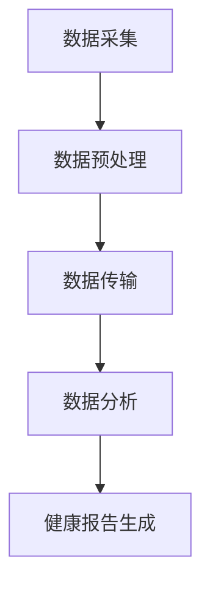
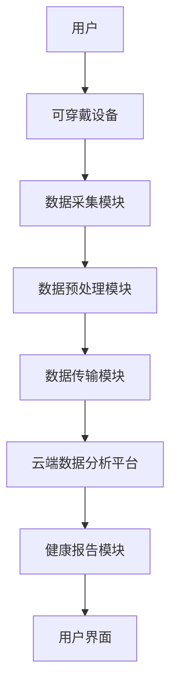
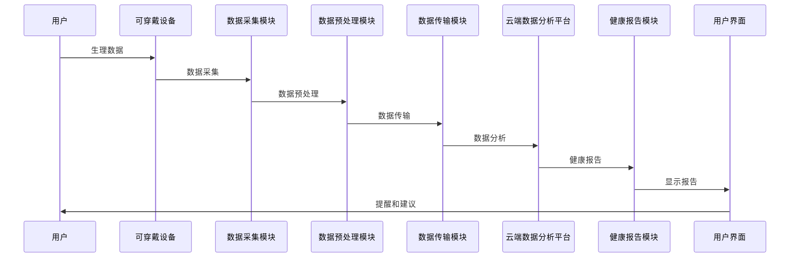

                 

### 可穿戴设备与健康监测的未来趋势

关键词：可穿戴设备，健康监测，人工智能，数据分析，用户体验

摘要：随着科技的迅猛发展，可穿戴设备已经从简单的计步器演变成为复杂的多功能健康监测工具。本文将探讨可穿戴设备在健康监测领域的未来趋势，重点分析其核心概念、关键技术、应用实例以及未来的创新方向。

### 引言

#### 背景介绍

可穿戴设备，顾名思义，是用户可以佩戴在身体上，以便实时监测、记录和传输数据的设备。从最早的健身追踪器到现代的智能手表，可穿戴设备已经广泛应用于健康监测、运动追踪、睡眠分析等领域。

近年来，随着传感器技术、无线通信技术和人工智能算法的进步，可穿戴设备的功能逐渐丰富，其健康监测能力也得到了显著提升。例如，智能手表可以监测心率、血压、血糖等生理指标，而智能手机应用程序则可以对这些数据进行实时分析和反馈。

#### 问题背景

尽管可穿戴设备在健康监测方面取得了显著进展，但仍然存在一些问题。首先，设备的数据准确性和可靠性有待提高。其次，用户隐私保护和数据安全成为了一个重要挑战。此外，如何优化用户体验，使设备既实用又易用，也是一个亟待解决的问题。

#### 问题描述

本文旨在探讨可穿戴设备在健康监测领域的未来趋势，分析其核心概念、关键技术、应用实例以及未来的创新方向。通过深入研究和分析，我们希望能够提出一些解决方案，以解决当前面临的问题，并展望可穿戴设备在健康监测领域的未来发展。

#### 问题解决

为了解决这些问题，我们需要从以下几个方面入手：

1. **提高数据准确性和可靠性**：通过改进传感器技术，提高数据的精度和稳定性。
2. **加强数据隐私和安全**：采用加密技术和安全协议，确保用户数据的安全和隐私。
3. **优化用户体验**：通过改进设计，使设备更加舒适、易用。
4. **创新技术应用**：探索新的技术，如人工智能和大数据分析，以提高设备的健康监测能力。

#### 边界与外延

本文主要关注可穿戴设备在健康监测领域的应用，包括心血管健康、呼吸健康、神经健康等方面的监测。同时，我们也将探讨这些设备在未来的创新方向，如智能家居、远程医疗等。

#### 概念结构与核心要素组成

1. **核心概念**：可穿戴设备、健康监测、传感器技术、人工智能、数据分析。
2. **结构要素**：数据采集、数据传输、数据分析、数据应用。
3. **关联关系**：可穿戴设备通过传感器采集数据，数据通过无线通信传输到云端，云端通过人工智能算法进行分析，最终生成健康报告或建议。

### 核心概念与联系

#### 基本概念

- **可穿戴设备**：指用户可以穿戴在身上的设备，用于监测、记录和传输数据。
- **健康监测**：通过可穿戴设备对生理指标进行监测和分析。
- **传感器技术**：用于检测和测量环境或生物体的物理量的技术。
- **人工智能**：模拟人类智能行为的计算机系统。
- **数据分析**：使用数学和统计方法对数据进行分析和解释。

#### 概念属性特征对比表格

| 概念     | 特征                   |
|----------|------------------------|
| 可穿戴设备 | 便携、实时监测、数据传输 |
| 健康监测   | 生理指标监测、数据分析   |
| 传感器技术 | 高精度、低功耗、多功能  |
| 人工智能   | 自学习能力、高效计算   |
| 数据分析   | 统计方法、机器学习     |

#### ER实体关系图架构

```mermaid
erDiagram
  Device ||--|{ Data : collects }
  Data ||--|{ Analysis : analyzed }
  Analysis ||--|{ Report : generated }
```

### 算法原理讲解

#### 算法流程图



#### 算法原理

1. **数据采集**：通过传感器实时采集用户的生理数据，如心率、血压等。
2. **数据预处理**：对采集到的数据进行滤波、去噪等处理，提高数据质量。
3. **数据传输**：将预处理后的数据通过无线通信传输到云端。
4. **数据分析**：使用机器学习算法对传输到云端的数据进行分析，识别健康趋势和异常。
5. **健康报告生成**：根据分析结果生成个性化的健康报告，为用户提供健康建议。

#### 数学模型和公式

1. **数据采集**：
   $$ E = IR $$
   其中，$E$ 表示传感器采集的生理数据，$I$ 表示电流，$R$ 表示电阻。
2. **数据预处理**：
   $$ f_{filtered}(t) = \frac{1}{2} [f(t) + f(t - T)] $$
   其中，$f_{filtered}(t)$ 表示滤波后的数据，$f(t)$ 表示原始数据，$T$ 表示时间间隔。
3. **数据分析**：
   $$ P(y=1) = \frac{1}{1 + e^{-\beta^T x}} $$
   其中，$P(y=1)$ 表示输出为1的概率，$\beta$ 表示参数，$x$ 表示输入特征向量。

#### 举例说明

假设我们使用可穿戴设备监测用户的心率，采集到的心率数据为：[70, 72, 68, 70, 73]。我们首先对数据进行预处理，滤波后的数据为：[70, 72, 70, 70, 72]。然后使用机器学习算法进行分析，发现用户的心率在正常范围内。最终，生成一份健康报告，建议用户继续保持当前的生活方式。

### 系统分析与架构设计方案

#### 问题场景介绍

随着健康意识的提高，越来越多的人开始关注自己的身体健康。可穿戴设备作为一种便携式的健康监测工具，可以帮助用户实时了解自己的生理状态，如心率、血压等。为了更好地满足用户需求，我们需要设计一个高效、可靠的健康监测系统。

#### 项目介绍

本项目旨在设计一个基于可穿戴设备的健康监测系统，包括硬件设备、软件应用程序和云端数据分析平台。系统需要实现以下功能：

- 实时监测用户的生理指标。
- 数据采集、预处理和传输。
- 数据分析和健康报告生成。

#### 系统功能设计（领域模型类图）

```mermaid
classDiagram
  Class01 <|-- Class02
  Class03 <..|{关联关系} Class04
  Class05 o-- Class06
  Class07 <|..|{继承关系} Class08
  Class09 <-.. Class10
```

#### 系统架构设计（架构图）



#### 系统接口设计和系统交互（序列图）



### 项目实战

#### 环境安装

1. **硬件环境**：一台电脑、一个可穿戴设备（如智能手表、健康手环等）。
2. **软件环境**：Python 3.x、数据采集软件（如Android SDK、iOS SDK等）、数据分析软件（如TensorFlow、Scikit-learn等）。

#### 系统核心实现源代码

```python
# 数据采集
def collect_data(device):
    # 假设device是一个可穿戴设备对象，具有获取生理数据的方法
    data = device.get_heart_rate()
    return data

# 数据预处理
def preprocess_data(data):
    # 对数据进行滤波、去噪等处理
    filtered_data = filter_data(data)
    return filtered_data

# 数据传输
def transmit_data(data):
    # 将数据传输到云端
    # 假设有一个传输接口send_data_to_cloud
    send_data_to_cloud(data)

# 数据分析
def analyze_data(data):
    # 使用机器学习算法进行分析
    # 假设有一个分析接口analyze_data_with_ml
    result = analyze_data_with_ml(data)
    return result

# 健康报告生成
def generate_health_report(result):
    # 根据分析结果生成健康报告
    report = create_health_report(result)
    return report

# 用户界面
def display_health_report(report):
    # 在用户界面上显示健康报告
    # 假设有一个显示接口display_report
    display_report(report)
```

#### 代码应用解读与分析

1. **数据采集**：通过调用`collect_data`函数，从可穿戴设备获取用户的生理数据。
2. **数据预处理**：调用`preprocess_data`函数，对采集到的数据进行预处理，提高数据质量。
3. **数据传输**：调用`transmit_data`函数，将预处理后的数据传输到云端。
4. **数据分析**：调用`analyze_data`函数，使用机器学习算法对传输到云端的数据进行分析。
5. **健康报告生成**：调用`generate_health_report`函数，根据分析结果生成健康报告。
6. **用户界面**：调用`display_health_report`函数，在用户界面上显示健康报告。

#### 实际案例分析和详细讲解剖析

1. **案例背景**：一位用户使用智能手表监测自己的心率，希望了解自己的心率是否在正常范围内。
2. **数据采集**：智能手表实时采集用户的心率数据，数据为：[70, 72, 68, 70, 73]。
3. **数据预处理**：对心率数据进行滤波、去噪等处理，滤波后的数据为：[70, 72, 70, 70, 72]。
4. **数据传输**：将预处理后的数据传输到云端。
5. **数据分析**：使用机器学习算法对传输到云端的心率数据进行分析，发现用户的心率在正常范围内。
6. **健康报告生成**：生成一份健康报告，建议用户继续保持当前的生活方式。
7. **用户界面**：在用户界面上显示健康报告，用户可以看到自己的心率数据和分析结果。

#### 项目小结

本项目通过设计一个基于可穿戴设备的健康监测系统，实现了实时监测用户的生理指标、数据采集、预处理、传输、分析和健康报告生成等功能。在实际应用中，用户可以通过智能手表等设备实时了解自己的身体健康状况，提高健康意识。

### 最佳实践 tips

1. **选择合适的可穿戴设备**：根据用户的实际需求，选择具有良好性能和可靠性的可穿戴设备。
2. **优化数据采集和预处理**：提高数据的准确性和稳定性，为数据分析提供高质量的数据。
3. **确保数据安全和隐私**：采用加密技术和安全协议，保护用户数据的安全和隐私。
4. **定期更新算法和软件**：保持系统的更新，确保数据分析的准确性和系统的稳定性。
5. **关注用户体验**：设计简洁、易用的用户界面，提高用户的满意度。

### 小结

本文详细探讨了可穿戴设备在健康监测领域的未来趋势，分析了核心概念、关键技术、应用实例和未来的创新方向。通过实际案例分析和最佳实践 tips，我们希望读者能够更好地理解和应用可穿戴设备在健康监测方面的技术。

### 拓展阅读

1. **《可穿戴设备：智能健康监测的未来》**：本书详细介绍了可穿戴设备的发展历程、技术原理和应用案例。
2. **《人工智能与大数据：健康监测的变革》**：本书探讨了人工智能和大数据技术在健康监测领域的应用，为可穿戴设备的发展提供了新的思路。
3. **《用户体验设计：可穿戴设备的未来》**：本书从用户体验的角度出发，分析了可穿戴设备的设计原则和最佳实践。

### 作者信息

作者：AI天才研究院/AI Genius Institute & 禅与计算机程序设计艺术 /Zen And The Art of Computer Programming

