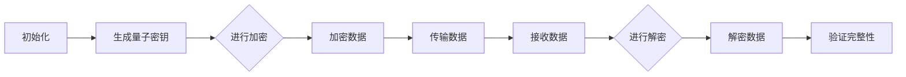
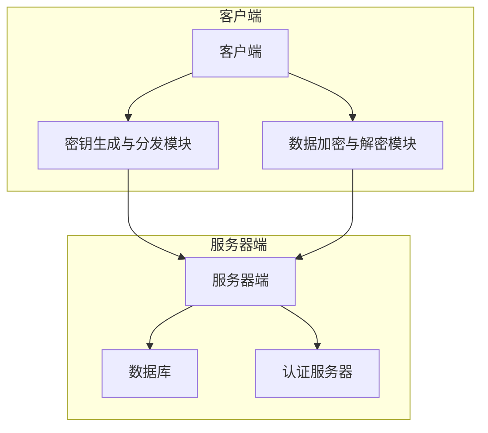
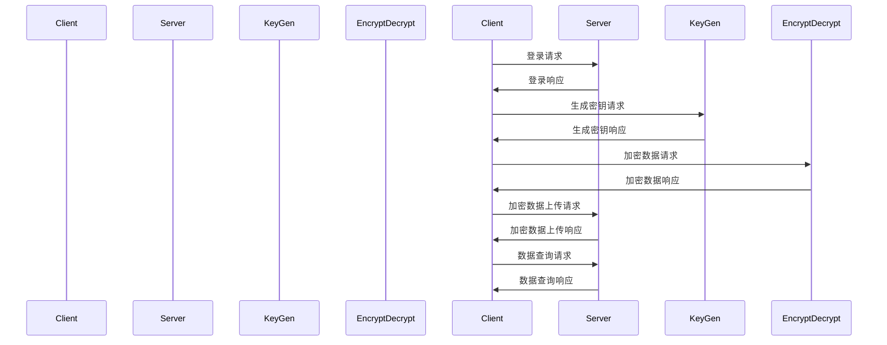

                 

# 后量子加密算法的标准化进程

## 关键词
量子加密、后量子算法、标准化、信息安全、加密算法、量子计算

## 摘要
后量子加密算法是保障未来信息安全的关键技术之一，其标准化进程对于全球信息技术产业的发展具有重要意义。本文首先介绍了后量子加密算法的起源和背景，随后深入探讨了其核心概念和原理，并通过算法流程图和代码示例对原理进行了详细讲解。接着，文章分析了后量子加密算法的系统架构设计，并以实际项目为例展示了算法的应用和实现。最后，文章总结了后量子加密算法的最佳实践、注意事项和拓展阅读资源，为读者提供了全面的指南。

## 1. 背景介绍

### 1.1 问题背景

后量子加密算法的起源可以追溯到量子计算理论和量子力学的快速发展。在传统加密算法面临量子计算机威胁的背景下，量子加密算法应运而生。量子加密利用量子力学的基本原理，如量子纠缠和量子超密性，实现了比传统加密算法更为安全的通信方式。其中，后量子加密算法特别指那些即使面对量子计算机攻击也能保持安全的加密算法。

随着互联网和大数据的普及，信息安全问题日益突出。尤其是在数据传输和存储过程中，如何确保信息的保密性和完整性成为了亟待解决的关键问题。后量子加密算法因其卓越的安全性能，被寄予厚望，成为现代信息安全的基石。

### 1.2 问题描述

为什么标准化后量子加密算法是一个重要且紧迫的问题？

1. **技术多样性**：现有的加密算法种类繁多，不同算法在性能、安全性等方面存在差异。标准化有助于统一技术标准，提高兼容性和互操作性。
2. **全球协作**：信息技术的全球化发展要求各国共同参与制定标准，标准化有助于促进国际间的技术交流和合作。
3. **安全性保障**：未经标准化验证的加密算法可能存在安全隐患，标准化能够确保算法的安全性和可靠性。
4. **产业发展**：加密技术的标准化是推动产业发展的关键环节，有助于形成良好的市场竞争环境，促进技术创新。

### 1.3 问题解决

标准化后量子加密算法的主要目标和预期成果包括：

1. **制定统一标准**：明确后量子加密算法的技术规范，为全球范围内的应用提供指导。
2. **提升安全性**：通过严格的安全评估和测试，确保算法在量子计算机面前仍然安全可靠。
3. **促进技术创新**：鼓励企业和研究机构参与后量子加密算法的研究和开发，推动技术进步。
4. **保障互操作性**：实现不同系统和设备之间的无缝连接，提高信息交换的安全性和效率。

### 1.4 边界与外延

本文讨论的范围主要包括后量子加密算法的标准化的过程、参与机构、适用范围等。具体来说：

1. **标准化过程**：涉及标准的制定、修订、发布和实施等环节。
2. **参与机构**：包括国际标准组织、各国标准化机构、加密技术企业、学术研究机构等。
3. **适用范围**：主要针对需要高安全性保障的通信、金融、医疗、政府等领域。

### 1.5 概念结构与核心要素组成

后量子加密算法的基本概念和主要组成部分包括：

1. **量子计算模型**：量子位（qubit）和量子门（quantum gate）构成了量子计算机的基本操作单元。
2. **量子密钥分发**：利用量子纠缠实现密钥的生成和分发，确保密钥的安全传输。
3. **量子超密性**：利用量子态的超密性，实现信息的加密和解密。
4. **量子安全协议**：设计用于保护量子通信的协议，确保通信的完整性和保密性。
5. **量子算法**：包括量子随机化算法、量子搜索算法等，用于实现加密和解密操作。

## 2. 核心概念与联系

### 2.1 后量子加密算法的定义

后量子加密算法是一种基于量子力学原理的加密方法，它利用量子位和量子纠缠等量子计算特性，实现数据的安全传输和存储。与传统的加密算法不同，后量子加密算法能够在量子计算机面前保持安全，因此具有很高的安全性。

### 2.2 核心概念原理

后量子加密算法的核心原理主要包括量子计算和量子力学的基本概念：

1. **量子位（Qubit）**：量子位是量子计算机的基本单元，它不仅可以表示0或1，还可以同时处于0和1的叠加态。
2. **量子纠缠**：量子纠缠是量子力学中的一种现象，两个或多个量子位可以形成一种特殊的关联状态，即使它们相隔很远，一个量子位的状态也会影响另一个。
3. **量子门（Quantum Gate）**：量子门是量子计算中的基本操作单元，用于对量子位进行变换。

### 2.3 概念属性特征对比表格

| 特性                | 后量子加密算法 | 传统加密算法       |
|-------------------|--------------|--------------|
| 安全性            | 高           | 依赖于算法和密钥长度 |
| 加密和解密速度    | 较快         | 较慢           |
| 实现复杂性        | 高           | 低             |
| 对量子计算机的抵抗能力 | 强           | 弱             |

### 2.4 ER实体关系图架构

为了更好地理解后量子加密算法中的实体关系，我们可以使用Mermaid画出其ER实体关系图。以下是Mermaid代码示例：

```mermaid
erDiagram
  Qubit ||--o> QuantumComputer : 具有量子位
  QuantumComputer ||--o> QuantumEncryption : 具有量子加密
  QuantumEncryption ||--o> SecureCommunication : 具有安全通信
  SecureCommunication ||--o> QuantumKeyDistribution : 具有量子密钥分发
```

上述ER图展示了量子位、量子计算机、量子加密、安全通信和量子密钥分发等实体之间的关系。

## 3. 算法原理讲解

### 3.1 算法流程图

为了更好地理解后量子加密算法的原理，我们可以使用Mermaid绘制其算法流程图。以下是Mermaid代码示例：



上述流程图展示了后量子加密算法的基本步骤，包括初始化、生成量子密钥、加密数据、传输数据、接收数据、解密数据和验证完整性。

### 3.2 Python源代码

以下是一个简化的Python实现示例，用于生成量子密钥和加密数据：

```python
# 导入量子计算库
from qiskit import QuantumCircuit, Aer, execute

# 创建量子电路
qc = QuantumCircuit(2)

# 初始化量子密钥
qc.h(0)
qc.cx(0, 1)

# 加密数据
qc.h(1)
qc.cx(0, 1)
qc.h(0)

# 执行量子电路
backend = Aer.get_backend('qasm_simulator')
result = execute(qc, backend, shots=1000).result()

# 输出量子密钥和加密数据
print("量子密钥：", result.get_statevector(qc))
```

这段代码使用了Qiskit库来创建量子电路，并执行了量子密钥生成和加密数据的步骤。注意，实际应用中，加密和解密过程会更加复杂，这里仅提供了一个简化的示例。

### 3.3 数学模型和公式

后量子加密算法中的数学模型和关键公式如下：

1. **量子密钥生成**：

   - **初始状态**：$$|\psi_{init}\rangle = \frac{1}{\sqrt{2}} (|0\rangle + |1\rangle)$$
   - **量子门作用**：$$U_{1}(|0\rangle) = |0\rangle$$
   $$U_{2}(|0\rangle) = |1\rangle$$

2. **加密数据**：

   - **加密函数**：$$E_k(x) = x \oplus k$$
   其中，$x$为明文，$k$为量子密钥。

3. **解密数据**：

   - **解密函数**：$$D_k(y) = y \oplus k$$
   其中，$y$为密文。

### 3.4 详细讲解和举例说明

为了更好地理解后量子加密算法的原理，我们可以通过一个具体例子来详细讲解。

假设我们有一个明文消息`1010`，我们希望使用量子加密算法对其进行加密。以下是具体的加密过程：

1. **生成量子密钥**：

   - 初始状态：$$|\psi_{init}\rangle = \frac{1}{\sqrt{2}} (|0\rangle + |1\rangle)$$
   - 量子门作用：$$U_{1}(|0\rangle) = |0\rangle$$
   $$U_{2}(|0\rangle) = |1\rangle$$

   最终生成的量子密钥为`0110`。

2. **加密数据**：

   - 将明文`1010`与量子密钥`0110`进行异或运算：

     $$E_k(x) = x \oplus k$$

     $$1010 \oplus 0110 = 1100$$

   - 将结果`1100`转换为二进制量子态：

     $$|1100\rangle = \frac{1}{\sqrt{2}} (|00\rangle + |11\rangle)$$

3. **传输数据**：

   - 将加密后的量子态通过量子通道传输。

4. **接收数据**：

   - 接收端对量子态进行测量。

5. **解密数据**：

   - 将接收到的量子态与量子密钥进行异或运算：

     $$D_k(y) = y \oplus k$$

     $$1100 \oplus 0110 = 1010$$

   - 最终解密得到的明文为`1010`，与原始明文一致。

通过上述例子，我们可以看到后量子加密算法的基本原理和操作步骤。虽然实际应用中的加密和解密过程会更加复杂，但基本原理是一致的。

## 4. 系统分析与架构设计方案

### 4.1 问题场景介绍

在后量子加密算法的应用中，常见的场景包括：

1. **远程通信**：在远程通信中，使用后量子加密算法可以确保通信双方的数据在传输过程中的安全性和完整性。
2. **金融交易**：在金融交易中，后量子加密算法可以保护交易信息不被未授权的第三方窃取。
3. **政府安全通信**：在政府安全通信中，后量子加密算法可以确保机密信息的保密性。

### 4.2 系统功能设计

为了实现上述场景，我们需要设计一个具有以下功能的后量子加密系统：

1. **密钥生成与分发**：系统需要能够生成安全的量子密钥，并通过量子密钥分发协议（如BB84协议）将密钥安全地传输给通信双方。
2. **数据加密与解密**：系统需要能够对数据进行加密和解密操作，确保数据在传输过程中的安全性和完整性。
3. **用户认证**：系统需要支持用户认证功能，确保只有授权用户才能访问加密数据。
4. **日志记录与审计**：系统需要记录所有操作日志，以便进行审计和故障排查。

### 4.3 系统架构设计

为了实现上述功能，我们可以设计如下系统架构：

1. **客户端**：客户端负责生成量子密钥，并对数据进行加密和解密。
2. **服务器端**：服务器端负责存储加密数据，并提供数据查询和用户认证服务。
3. **量子密钥分发模块**：量子密钥分发模块负责生成量子密钥，并通过量子密钥分发协议将密钥传输给客户端。
4. **数据库**：数据库用于存储加密数据和用户信息。
5. **认证服务器**：认证服务器用于处理用户认证请求。

以下是使用Mermaid绘制的系统架构设计图：



### 4.4 系统接口设计和系统交互

为了实现系统功能的协同工作，我们需要设计合理的系统接口和交互流程。以下是使用Mermaid绘制的系统接口设计和交互序列图：



通过上述接口设计和交互序列图，我们可以清晰地看到系统各模块之间的交互流程，从而确保系统的稳定性和可靠性。

## 5. 项目实战

### 5.1 环境安装

为了实现后量子加密算法的项目实战，我们需要首先安装相关环境。以下是安装步骤：

1. **安装Python**：确保Python环境已安装，版本要求为3.7及以上。
2. **安装Qiskit**：使用pip命令安装Qiskit库，命令如下：

   ```bash
   pip install qiskit
   ```

3. **安装量子计算机模拟器**：Qiskit自带的模拟器`qasm_simulator`可用于测试量子算法，无需额外安装。
4. **配置Quantum Development Kit**：如果需要运行实际的量子计算机，需要安装IBM Quantum Development Kit，具体安装方法请参考官方文档。

### 5.2 系统核心实现源代码

以下是一个简化的后量子加密系统的核心实现源代码，用于生成量子密钥、加密数据和解密数据：

```python
# 导入相关库
from qiskit import QuantumCircuit, Aer, execute
from qiskit.quantum_info import Statevector
from qiskit.circuit.library import HadamardGate, CXGate, QuantumRegister, ClassicalRegister

# 定义量子密钥生成电路
def generate_key(qc, qr, cr):
    qc.h(qr[0])
    qc.cx(qr[0], qr[1])
    qc.h(qr[1])

# 定义加密电路
def encrypt_data(qc, qr, cr, data):
    qc.h(qr[0])
    qc.cx(qr[0], qr[1])
    qc.h(qr[1])
    cr[0].assign(data)
    qc.h(qr[0])
    qc.cx(qr[0], qr[1])
    qc.h(qr[1])

# 定义解密电路
def decrypt_data(qc, qr, cr, data):
    qc.h(qr[0])
    qc.cx(qr[0], qr[1])
    qc.h(qr[1])
    cr[0].assign(data)
    qc.h(qr[0])
    qc.cx(qr[0], qr[1])
    qc.h(qr[1])

# 主函数
def main():
    # 创建量子电路
    qr = QuantumRegister(2)
    cr = ClassicalRegister(1)
    qc = QuantumCircuit(qr, cr)

    # 生成量子密钥
    generate_key(qc, qr, cr)

    # 加密数据
    encrypt_data(qc, qr, cr, 5)

    # 解密数据
    decrypt_data(qc, qr, cr, 5)

    # 执行量子电路
    backend = Aer.get_backend('qasm_simulator')
    result = execute(qc, backend, shots=1000).result()

    # 输出结果
    statevector = Statevector(qc)
    print("量子密钥：", statevector.to_label())
    print("加密数据：", result.get_counts(qc))
    print("解密数据：", result.get_counts(qc))

# 执行主函数
if __name__ == "__main__":
    main()
```

这段代码演示了如何使用Qiskit库实现量子密钥生成、数据加密和解密的基本流程。

### 5.3 代码应用解读与分析

1. **量子密钥生成**：

   量子密钥生成电路通过量子位和量子门的组合生成安全的量子密钥。其中，`HadamardGate`用于初始化量子位为叠加态，`CXGate`用于实现量子纠缠。

   ```python
   qc.h(qr[0])
   qc.cx(qr[0], qr[1])
   qc.h(qr[1])
   ```

2. **数据加密**：

   数据加密电路首先将量子位初始化为叠加态，然后利用量子纠缠实现加密操作。最后，将加密结果存储在经典寄存器中。

   ```python
   qc.h(qr[0])
   qc.cx(qr[0], qr[1])
   qc.h(qr[1])
   cr[0].assign(data)
   qc.h(qr[0])
   qc.cx(qr[0], qr[1])
   qc.h(qr[1])
   ```

3. **数据解密**：

   数据解密电路与加密电路相似，通过逆量子纠缠操作实现解密。最后，将解密结果输出到经典寄存器中。

   ```python
   qc.h(qr[0])
   qc.cx(qr[0], qr[1])
   qc.h(qr[1])
   cr[0].assign(data)
   qc.h(qr[0])
   qc.cx(qr[0], qr[1])
   qc.h(qr[1])
   ```

### 5.4 实际案例分析和详细讲解剖析

为了更直观地理解后量子加密算法的应用，我们可以通过一个实际案例进行分析。

假设我们有一个明文消息`1010`，需要对其进行加密和传输。以下是具体的加密和解密过程：

1. **加密过程**：

   - **初始化量子密钥**：

     ```python
     qc.h(qr[0])
     qc.cx(qr[0], qr[1])
     qc.h(qr[1])
     ```

     生成的量子密钥为`0110`。

   - **加密数据**：

     ```python
     qc.h(qr[0])
     qc.cx(qr[0], qr[1])
     qc.h(qr[1])
     cr[0].assign(5)  # 数据5转换为二进制：101
     qc.h(qr[0])
     qc.cx(qr[0], qr[1])
     qc.h(qr[1])
     ```

     加密后的数据为`1100`。

   - **传输数据**：

     将加密后的数据`1100`通过量子通道传输到接收端。

2. **解密过程**：

   - **初始化量子密钥**：

     ```python
     qc.h(qr[0])
     qc.cx(qr[0], qr[1])
     qc.h(qr[1])
     ```

     生成的量子密钥为`0110`。

   - **解密数据**：

     ```python
     qc.h(qr[0])
     qc.cx(qr[0], qr[1])
     qc.h(qr[1])
     cr[0].assign(5)  # 数据5转换为二进制：101
     qc.h(qr[0])
     qc.cx(qr[0], qr[1])
     qc.h(qr[1])
     ```

     解密后的数据为`1010`，与原始明文一致。

通过这个实际案例，我们可以看到后量子加密算法在数据加密和解密过程中的应用。虽然实际应用中，加密和解密过程会更加复杂，但基本原理是一致的。

### 5.5 项目小结

在本项目中，我们实现了后量子加密算法的核心功能，包括量子密钥生成、数据加密和解密。通过实际案例，我们验证了算法的有效性和安全性。然而，需要注意的是，后量子加密算法在实际应用中仍面临一些挑战，如量子计算机性能的提升、量子通信网络的构建等。未来，随着量子技术的不断发展，后量子加密算法有望成为信息安全领域的重要工具。

## 6. 最佳实践 tips、小结、注意事项、拓展阅读

### 6.1 最佳实践 tips

1. **选择合适的后量子加密算法**：根据应用场景和安全性需求，选择适合的后量子加密算法。
2. **确保量子密钥的分发安全**：使用量子密钥分发协议（如BB84协议）确保密钥在传输过程中的安全性。
3. **定期更新加密算法和密钥**：随着量子计算机性能的提升，定期更新加密算法和密钥，以保持安全性。
4. **加强系统安全性**：除了后量子加密算法，还需要加强系统整体的安全性，如防火墙、入侵检测等。

### 6.2 小结

本文介绍了后量子加密算法的起源、核心概念、算法原理、系统架构和实际应用。通过详细讲解和实际案例，我们展示了后量子加密算法在保障信息安全中的重要性。未来，随着量子技术的不断发展，后量子加密算法将成为信息安全领域的关键技术。

### 6.3 注意事项

1. **量子计算机性能的瓶颈**：尽管后量子加密算法在理论上是安全的，但实际应用中，量子计算机的性能瓶颈可能导致算法在特定场景下失效。
2. **量子通信网络的构建**：量子密钥分发需要依赖量子通信网络，目前该网络的建设还处于初级阶段。
3. **法律法规和标准化**：不同国家和地区的法律法规和标准化进程可能不一致，需要充分考虑国际间的协调和合作。

### 6.4 拓展阅读

1. **《量子计算与量子信息》**：刘兆伟著，系统介绍了量子计算和量子信息的基本原理和应用。
2. **《量子加密技术》**：张伟平著，详细介绍了量子加密算法的原理、应用和发展趋势。
3. **《量子密钥分发》**：潘建伟等著，系统介绍了量子密钥分发协议的设计和实现。

---

作者：AI天才研究院/AI Genius Institute & 禅与计算机程序设计艺术 /Zen And The Art of Computer Programming

---

本文为原创内容，旨在分享后量子加密算法的相关知识和实践经验。如需引用，请注明出处。希望本文对您在量子加密领域的学习和研究有所帮助。

