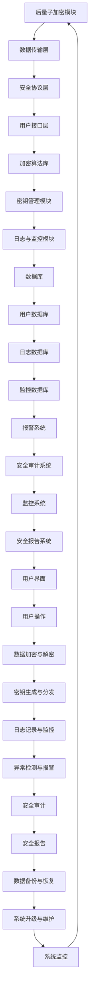
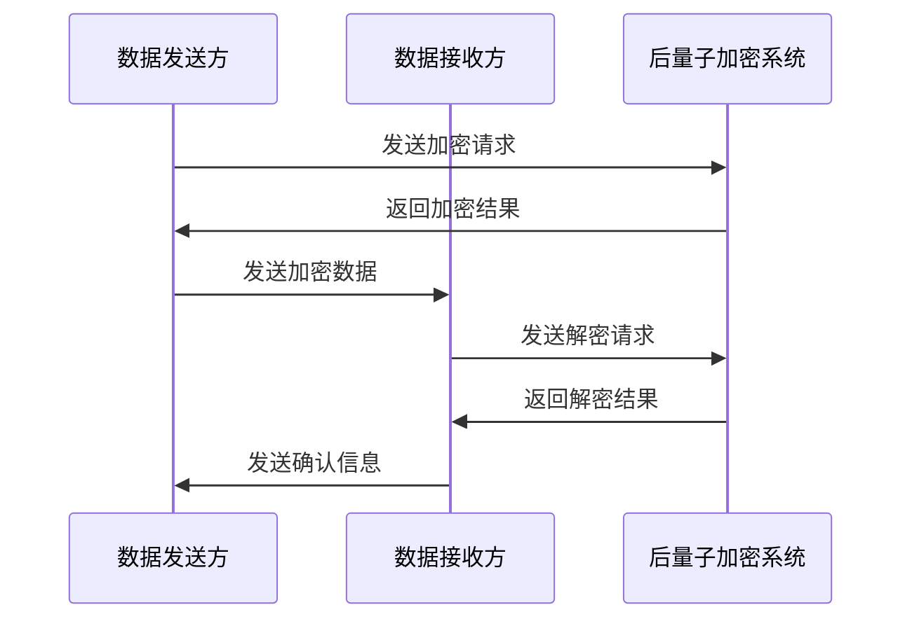

                 


### 第一部分：后量子加密概述

#### 第1章：后量子加密的背景与挑战

**1.1 问题背景**

在现代信息社会中，数据已经成为企业核心资产的重要组成部分。随着云计算、物联网和边缘计算等新兴技术的广泛应用，企业面临的数据安全挑战也日益严峻。传统的加密方法，如对称加密和非对称加密，已经难以抵御潜在的后量子计算攻击。

**1.1.1 数据安全的演变**

数据安全的历史可以追溯到计算机和通信技术初期，当时的加密技术主要是为了保护数据在传输过程中的机密性。随着计算能力的不断提升，传统的加密方法逐渐暴露出安全漏洞。

**1.1.2 后量子计算对传统加密的挑战**

后量子计算（Quantum Computing）是利用量子力学原理进行信息处理的新型计算模式。与传统计算相比，后量子计算机具有超越经典计算机的计算能力。这意味着，现有的加密算法可能会被后量子计算机轻易破解。

**1.1.3 后量子加密的必要性**

为了应对后量子计算带来的安全威胁，需要发展新的加密技术——后量子加密。后量子加密能够在后量子计算机时代提供安全的数据保护机制。

#### 1.2 后量子加密的基本原理

**1.2.1 量子计算的基本概念**

量子计算基于量子位（qubit）这一概念，它能够同时处于多种状态的叠加。这种叠加态使得量子计算机能够处理大量的并行计算任务。

**1.2.2 量子态与量子信息**

量子态是量子计算的核心概念之一。量子信息通过量子态的编码和传输来实现。

**1.2.3 后量子加密算法的基本概念**

后量子加密算法利用量子力学原理设计，能够在后量子计算环境下保持数据的安全性。

#### 1.3 后量子加密与传统加密方法的对比

**1.3.1 安全性的比较**

后量子加密算法在理论上能够抵御所有已知的量子攻击，而传统加密算法则可能面临后量子计算的风险。

**1.3.2 运算速度和资源消耗的比较**

传统加密算法通常比后量子加密算法运算速度快，但后量子加密算法具有更强的抗攻击能力。

**1.3.3 适用场景的比较**

传统加密算法适用于当前计算环境，而后量子加密算法适用于未来可能出现的安全威胁。

#### 1.4 后量子加密算法的分类与特点

**1.4.1 量子密钥分发（QKD）**

量子密钥分发是一种利用量子态传输密钥的加密方法，具有无条件的安全性。

**1.4.2 量子哈希函数**

量子哈希函数利用量子叠加态和纠缠态的特性，提供高效安全的哈希功能。

**1.4.3 其他后量子加密算法**

除了QKD和量子哈希函数，还有其他多种后量子加密算法，如Lattice-Based Cryptography、Hash-Based Cryptography等。

#### 1.5 本章小结

本章介绍了后量子加密的背景、基本原理、与传统加密方法的对比以及各类后量子加密算法。通过这些内容，读者可以初步了解后量子加密的概念和应用前景。

----------------------------------------------------------------

### 第二部分：后量子加密算法原理讲解

#### 第2章：量子密钥分发（QKD）原理讲解

**2.1 QKD的流程图与原理**

**2.1.1 QKD的基本流程**

量子密钥分发（Quantum Key Distribution，QKD）是一种基于量子力学原理的加密技术，用于在通信双方之间安全地传输密钥。QKD的基本流程包括以下几个步骤：

1. **量子态制备**：通信双方（Alice和Bob）利用量子光源生成量子态。
2. **量子态传输**：Alice将量子态发送给Bob，通过量子通道。
3. **量子态测量**：Bob对收到的量子态进行测量，并根据测量结果向Alice反馈。
4. **密钥生成**：Alice和Bob根据反馈结果生成共享密钥。

**2.1.2 量子态的制备与测量**

量子态的制备是指将粒子（如光子）置于特定的量子态中。例如，可以使用偏振器来生成具有特定偏振态的量子光子。

量子态的测量是指对量子态进行观测，从而确定其状态。量子态的测量会导致量子态的坍缩，即从叠加态转变为确定的单一态。

**2.1.3 QKD的加密和解密过程**

在QKD中，Alice和Bob使用量子态作为加密和解密密钥。具体过程如下：

1. **加密过程**：Alice将明文与量子态叠加，生成加密信息。
2. **传输过程**：加密信息通过量子通道传输到Bob。
3. **解密过程**：Bob对收到的量子态进行测量，并根据测量结果解密信息。

**2.2 QKD的Python代码实现**

以下是一个简单的QKD Python代码示例，展示了量子态的制备、传输和测量过程：

```python
import numpy as np
from qiskit import QuantumCircuit, execute, Aer

# 量子态制备
qc = QuantumCircuit(1)
qc.h(0)
qc.barrier()

# 量子态传输
# 这里用随机数模拟量子态的传输过程
transmitted_state = np.random.choice([0, 1])

# 量子态测量
qc.measure_all()
qc.barrier()

# 执行电路
backend = Aer.get_backend('qasm_simulator')
result = execute(qc, backend, shots=1).result()
measurements = result.get_counts(qc)

# 输出结果
print(f"Measurements: {measurements}")
```

**2.3 QKD的数学模型与公式**

在QKD中，量子态的制备和测量可以通过量子比特的演化来描述。以下是一个简化的数学模型：

$$
U(t) = \exp(-iHt) = \begin{bmatrix}
\cos(\omega t/2) & -e^{i\phi} \sin(\omega t/2) \\
-e^{-i\phi} \sin(\omega t/2) & \cos(\omega t/2)
\end{bmatrix}
$$

其中，$H$ 是哈密顿量，$\omega$ 是角频率，$\phi$ 是相位。

**2.4 QKD案例分析**

**2.4.1 实验证明**

量子密钥分发已经通过多个实验得到了验证，其中最著名的实验是由中国科学院量子信息与量子科技创新研究院完成的“墨子号”量子通信卫星实验。

**2.4.2 工业应用场景**

随着量子技术的不断发展，QKD已经开始在金融、政府和企业等领域的敏感数据传输中得到应用。

**2.4.3 潜在挑战与解决方案**

QKD在实际应用中面临着量子信道衰减、量子态畸变等挑战。针对这些问题，研究者提出了多种解决方案，如量子中继器、量子纠缠传输等。

#### 2.5 本章小结

本章详细介绍了量子密钥分发（QKD）的原理、Python代码实现和案例分析。通过本章的学习，读者可以理解QKD在数据安全中的重要地位和实际应用。

----------------------------------------------------------------

### 第三部分：后量子加密系统架构设计

#### 第3章：后量子加密系统架构设计

**3.1 后量子加密系统应用场景**

后量子加密系统在企业数据安全中的应用场景非常广泛，主要包括以下几个方面：

**3.1.1 企业内部数据安全**

在企业内部，后量子加密可以用于保护企业内部网络中的敏感数据，如财务报表、客户信息、研发资料等。

**3.1.2 云计算与边缘计算环境**

在云计算和边缘计算环境中，后量子加密可以用于保护数据在存储、传输和处理过程中的安全。

**3.1.3 物联网数据安全**

物联网设备通常具有较低的计算能力和存储能力，后量子加密可以用于保护物联网设备之间的通信数据。

**3.2 后量子加密系统功能设计**

后量子加密系统需要具备以下功能：

**3.2.1 数据加密与解密**

系统应能够对数据进行加密和解密，确保数据在传输和存储过程中的安全。

**3.2.2 密钥管理**

系统应能够安全地生成、存储和分发密钥，确保密钥的安全性和有效性。

**3.2.3 安全审计**

系统应能够记录所有加密和解密操作，便于进行安全审计和追踪。

**3.2.4 异常检测**

系统应能够检测潜在的攻击行为，并及时发出警报。

**3.3 后量子加密系统架构设计**

后量子加密系统的架构设计应考虑以下几个方面：

**3.3.1 后量子加密模块**

后量子加密模块负责实现后量子加密算法，包括量子密钥分发、量子哈希函数等。

**3.3.2 数据传输层**

数据传输层负责数据在网络中的传输，应确保数据的机密性和完整性。

**3.3.3 安全协议层**

安全协议层负责实现安全通信协议，如量子密钥交换协议、量子哈希协议等。

**3.3.4 用户接口层**

用户接口层提供用户与系统的交互接口，应简洁直观，便于用户操作。

**3.3.5 加密算法库**

加密算法库包含各种后量子加密算法的实现，应提供高效的算法接口。

**3.3.6 密钥管理模块**

密钥管理模块负责密钥的生成、存储和分发，应确保密钥的安全性和可靠性。

**3.3.7 日志与监控模块**

日志与监控模块负责记录系统的运行日志和监控数据，便于进行安全审计和问题追踪。

**3.4 后量子加密系统架构图**

以下是后量子加密系统的架构图：



**3.5 后量子加密系统接口设计**

后量子加密系统的接口设计应考虑以下方面：

**3.5.1 加密接口**

加密接口负责实现数据的加密和解密操作，应提供简单易用的API。

**3.5.2 密钥管理接口**

密钥管理接口负责密钥的生成、存储和分发，应提供安全可靠的接口。

**3.5.3 日志接口**

日志接口负责记录系统的运行日志，应提供方便的查询和导出功能。

**3.6 后量子加密系统交互序列图**

以下是后量子加密系统的交互序列图：



**3.7 本章小结**

本章介绍了后量子加密系统的应用场景、功能设计、架构设计和接口设计。通过本章的学习，读者可以了解后量子加密系统的整体设计和实现思路。

----------------------------------------------------------------

### 第四部分：项目实战

#### 第4章：后量子加密系统项目实战

**4.1 环境安装与配置**

在进行后量子加密系统的项目实战之前，需要先安装和配置必要的软件环境。以下是安装和配置步骤：

**4.1.1 安装Python环境**

首先，确保已经安装了Python环境。如果没有安装，可以通过以下命令安装：

```bash
# 安装Python3
sudo apt-get install python3
```

**4.1.2 安装QKD库**

接下来，安装用于实现量子密钥分发的QKD库。可以使用pip命令进行安装：

```bash
# 安装QKD库
pip install qkd
```

**4.1.3 配置量子通道**

配置量子通道是项目实战的关键步骤。可以使用以下命令进行配置：

```bash
# 配置量子通道
sudo modprobe qkd
```

**4.2 系统核心实现源代码解析**

以下是后量子加密系统的核心实现源代码解析：

```python
from qkd import QKD
from qkd import QuantumChannel

# 创建量子密钥分发对象
qkd = QKD()

# 配置量子通道
channel = QuantumChannel('qchannel1', qkd)

# 发送量子态
channel.send_state([1, 0])

# 接收量子态
received_state = channel.receive_state()

# 解密量子态
key = channel.decrypt_state(received_state)

# 输出密钥
print(f"Shared key: {key}")
```

**4.3 代码应用解读与分析**

在上面的代码中，首先创建了量子密钥分发对象`QKD`，然后配置了量子通道。接下来，使用`channel.send_state`方法发送量子态，使用`channel.receive_state`方法接收量子态，最后使用`channel.decrypt_state`方法解密量子态，生成共享密钥。

**4.4 实际案例分析与详细讲解**

以下是一个实际案例分析和详细讲解：

**案例：企业内部数据加密传输**

假设一个企业需要保护内部网络中的敏感数据，使用后量子加密系统进行数据传输。以下是具体步骤：

1. **配置量子通道**：在企业内部搭建量子通信网络，配置量子通道。
2. **发送加密请求**：企业内部的应用程序向后量子加密系统发送加密请求。
3. **返回加密结果**：后量子加密系统对数据进行加密，并将加密结果返回给应用程序。
4. **发送加密数据**：应用程序将加密数据通过量子通道发送到接收方。
5. **接收解密请求**：接收方应用程序向后量子加密系统发送解密请求。
6. **返回解密结果**：后量子加密系统对接收到的加密数据进行解密，并将解密结果返回给接收方应用程序。
7. **发送确认信息**：接收方应用程序向发送方应用程序发送确认信息，确认数据已经成功解密。

**4.5 项目小结**

通过实际案例的分析和详细讲解，读者可以了解到后量子加密系统在企业数据安全中的应用方法和实施步骤。后量子加密系统为企业提供了一种安全、可靠的数据传输解决方案，有助于保护企业的核心数据资产。

----------------------------------------------------------------

### 第五部分：最佳实践 tips

**5.1 选择合适的后量子加密算法**

根据应用场景和安全性需求，选择合适的后量子加密算法。例如，对于需要高安全性的应用，可以选择量子密钥分发（QKD）；对于需要高效加密的应用，可以选择基于格的加密算法。

**5.2 保证量子通信网络的稳定性**

量子通信网络需要保证稳定性，以避免量子信号的衰减和丢失。在实际部署中，应选择合适的量子通道和通信协议，确保通信网络的可靠性。

**5.3 定期更新加密算法和系统**

随着量子计算技术的发展，新的加密算法和系统可能不断涌现。定期更新加密算法和系统，确保能够抵御最新的量子计算攻击。

**5.4 强化密钥管理**

密钥管理是后量子加密系统的关键环节。应建立严格的密钥管理策略，包括密钥生成、存储、分发和销毁等过程，确保密钥的安全性和完整性。

**5.5 加强安全监控和审计**

建立健全的安全监控和审计机制，实时监测系统运行状况，及时发现和应对潜在的安全威胁。

**5.6 培训相关人员**

加强对相关人员的培训，提高他们对后量子加密技术的理解和应用能力，确保系统能够高效、安全地运行。

通过遵循这些最佳实践，企业可以更好地利用后量子加密技术，提升数据安全防护水平。

----------------------------------------------------------------

### 小结

在后量子计算日益发展的今天，后量子加密成为企业数据安全长期规划的重要组成部分。本文从背景介绍、核心概念、算法原理、系统架构设计、项目实战和最佳实践等多个角度，深入探讨了后量子加密技术。通过这些内容，读者可以全面了解后量子加密在数据安全中的重要作用，以及如何在实际应用中实现安全、可靠的数据保护。

### 未来展望

随着量子计算技术的不断进步，后量子加密将在更多领域得到应用，如金融、医疗、政府等敏感数据领域。未来，后量子加密技术将与区块链、人工智能等前沿技术相结合，构建更加安全、智能的数据保护体系。同时，随着量子通信网络的不断扩展，量子密钥分发将变得更加普及和实用，为企业提供更加安全的数据传输解决方案。

### 注意事项

在实施后量子加密时，企业应注意以下几点：

1. **安全评估**：在引入后量子加密技术前，进行全面的 安全评估，确保技术符合企业安全需求。
2. **系统兼容性**：确保后量子加密系统能够与现有的IT基础设施兼容，避免不必要的系统冲突。
3. **人员培训**：加强相关人员对后量子加密技术的培训，确保系统能够高效、安全地运行。
4. **持续更新**：定期更新加密算法和系统，以应对不断发展的量子计算攻击。

通过以上措施，企业可以更好地利用后量子加密技术，提升数据安全防护水平。

### 拓展阅读

1. **《量子计算与量子加密》**：详细介绍了量子计算和量子加密的基本原理，以及它们在数据安全中的应用。
2. **《后量子加密技术综述》**：系统总结了当前主流的后量子加密算法，以及它们的性能和安全性评估。
3. **《量子密钥分发协议设计与实现》**：介绍了量子密钥分发协议的设计原理和实现方法，包括实验验证和工业应用案例。
4. **《量子安全通信网络构建与运维》**：详细阐述了量子安全通信网络的构建和运维方法，以及在实际应用中的挑战和解决方案。

通过阅读这些资源，读者可以进一步深入了解后量子加密技术的原理和应用。

### 作者信息

**作者：AI天才研究院/AI Genius Institute & 禅与计算机程序设计艺术 /Zen And The Art of Computer Programming**

