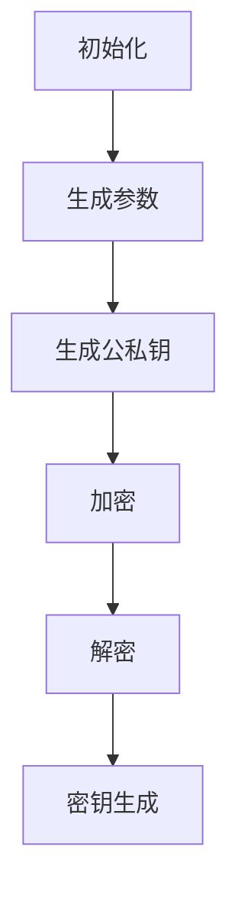
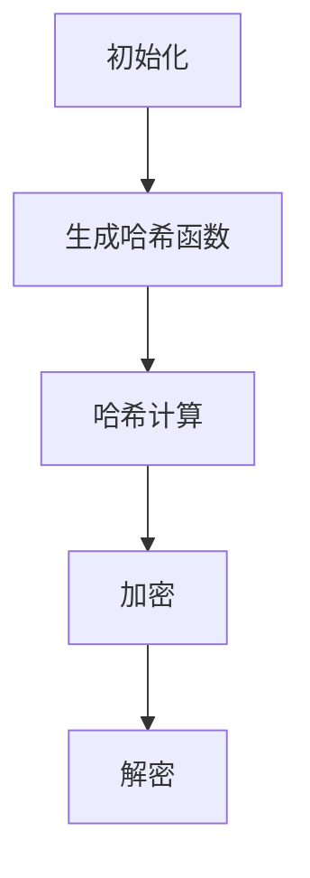
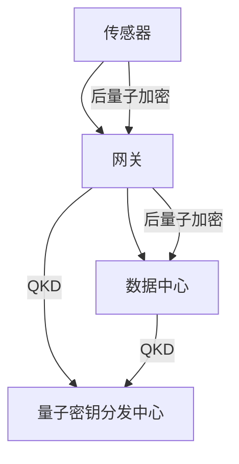
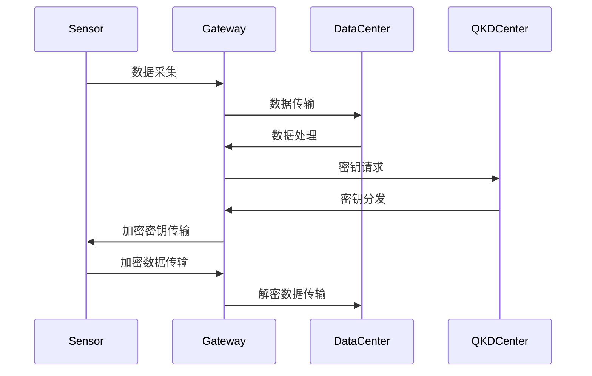

                 

### 引言

#### 1.1 书籍目的与结构

随着物联网（IoT）技术的迅速发展，设备之间的互联互通已经成为现代生活的常态。然而，这种互联互通也带来了新的安全隐患，尤其是加密通信方面的挑战。传统的加密技术，如RSA和ECC，基于的数学难题，在未来量子计算机的面前可能会变得脆弱。为了应对这种威胁，后量子密码学（Post-Quantum Cryptography, PQC）应运而生，它提供了一种不受量子计算威胁的加密方法。

本书的目的是深入探讨后量子密码学在物联网中的应用，帮助读者理解PQC的基本原理、核心算法，以及如何将其部署在实际的物联网系统中。通过系统的讲解和实战案例，读者将能够掌握后量子密码学在物联网中安全架构设计和实施的方法。

本书分为五个主要部分：

1. **引言**：介绍书籍的目的、结构、物联网与量子密码学的关系，以及阅读指南。
2. **背景与概述**：回顾后量子密码学的背景，探讨物联网的安全挑战和后量子密码学的重要性。
3. **核心概念与原理**：详细解释量子比特、量子纠缠、量子叠加等核心概念，并介绍几种主要的后量子密码学算法。
4. **算法与实现**：通过实际代码和算法流程图，讲解后量子密码学算法的实现。
5. **系统架构与实战应用**：讨论物联网系统架构、接口设计，并通过项目实战展示如何将后量子密码学应用于实际系统。

#### 1.2 量子密码学与物联网的关系

物联网是一个由无数互联设备组成的网络，它们收集和交换数据，以实现自动化和智能化的目标。然而，这些设备往往安全性较差，容易成为黑客攻击的目标。传统的加密方法，如RSA和ECC，虽然在现有的计算能力下表现出色，但它们无法抵御未来量子计算机的攻击。

量子密码学是一种利用量子力学原理进行加密和解密的方法。其中，量子密钥分发（Quantum Key Distribution, QKD）是一种被广泛认可的安全通信方法，它能够实现安全的密钥生成和分发。物联网设备可以通过QKD生成加密密钥，从而确保通信的安全性。

#### 1.3 阅读指南与学习目标

本书旨在为读者提供一个全面的后量子密码学在物联网中应用的指南。以下是本书的学习目标：

- 理解量子密码学的基本原理和核心概念。
- 掌握几种主要的后量子密码学算法，包括Lattice-based、Hash-based和Multivariate多项式密码算法。
- 学习如何在物联网系统中实现和应用后量子密码学。
- 了解物联网系统架构和接口设计的基本原则。
- 通过实际项目案例，掌握后量子密码学在物联网中的实战应用。

本书适合对密码学、物联网和编程有一定基础的读者。通过阅读本书，读者将能够：

- 深入理解后量子密码学的核心原理。
- 设计和实现安全的物联网系统。
- 预见和应对未来的安全威胁。

### 背景与概述

#### 2.1 后量子密码学概述

后量子密码学（Post-Quantum Cryptography，简称PQC）是密码学领域的一个重要分支，它旨在开发能够在量子计算机面前保持安全的加密技术。量子计算机利用量子力学原理进行计算，具有超越传统计算机的巨大计算能力。当量子计算机发展到一定程度，现有的加密算法，如RSA和ECC，将无法抵御其攻击。因此，开发后量子密码学技术成为保护信息安全的关键。

PQC的核心在于其抗量子特性，即即使量子计算机能够破解传统加密算法，PQC也能保持安全性。PQC采用了一些基于数学难题的算法，这些难题在经典计算和量子计算下都难以破解。常见的PQC算法包括Lattice-based、Hash-based和Multivariate多项式密码算法。

#### 2.1.1 量子计算与密码学

量子计算的基本单元是量子比特（qubit），与经典比特（classic bit）不同，量子比特可以同时处于0和1的叠加状态，这使得量子计算机能够进行并行计算。量子叠加和量子纠缠是量子计算的核心原理，它们赋予了量子计算机超越经典计算机的强大计算能力。

量子计算对传统密码学提出了巨大的挑战。例如，量子计算机可以在短时间内破解RSA和ECC等公钥加密算法，因为这些算法的安全依赖于大整数分解和椭圆曲线离散对数问题，这些问题在量子计算机面前是易解的。因此，密码学家们开始研究如何在量子计算时代保护信息安全，后量子密码学就是其中的重要成果。

#### 2.1.2 后量子密码学的兴起

随着量子计算的逐步发展，后量子密码学的概念逐渐受到关注。2009年，美国国家安全局（NSA）首次提出了PQC研究的必要性，并资助了一系列研究项目。随后，国际密码学社区也纷纷投入研究和开发，涌现出大量的PQC算法。

后量子密码学的兴起不仅是因为量子计算的威胁，还因为其潜在的应用价值。例如，量子密钥分发（QKD）技术可以实现绝对安全的密钥传输，这在金融、国防等领域有着巨大的应用前景。此外，PQC算法的鲁棒性使其成为未来通信网络的基石。

#### 2.1.3 后量子密码学的重要性

后量子密码学的重要性主要体现在以下几个方面：

1. **未来安全**：随着量子计算机的发展，传统加密技术将逐渐失效。后量子密码学提供了一种抵御量子计算机攻击的安全解决方案。
   
2. **信息安全**：在物联网、云计算和区块链等新兴领域，信息的安全性至关重要。后量子密码学能够提供更加安全的加密手段，保护数据免受窃取和篡改。

3. **技术革新**：后量子密码学的开发和应用推动了密码学技术的发展，促进了相关领域的创新。

4. **国际合作**：后量子密码学的研究是全球性的，多个国家和组织都在积极参与，这有助于建立更加统一和安全的加密标准。

总之，后量子密码学是未来信息安全的关键技术，其重要性不容忽视。随着研究的深入和应用推广，PQC将在保障全球信息安全方面发挥重要作用。

### 核心概念与原理

#### 3.1 核心概念

在深入探讨后量子密码学之前，我们首先需要了解一些核心概念，这些概念是理解后量子密码学基础的重要基石。

##### 3.1.1 量子比特与经典比特

量子比特（qubit）是量子计算的基本单元，与经典比特（classic bit）不同，量子比特可以同时处于0和1的叠加状态。这意味着，一个量子比特可以同时表示0和1，而经典比特只能处于0或1中的一个状态。

量子比特的叠加状态可以用数学表达式表示为：
\[|\psi\rangle = \alpha|0\rangle + \beta|1\rangle\]
其中，\(|0\rangle\) 和 \(|1\rangle\) 分别代表量子比特的基态，\(\alpha\) 和 \(\beta\) 是复数系数，满足 \(|\alpha|^2 + |\beta|^2 = 1\)。

##### 3.1.2 量子纠缠

量子纠缠是量子力学中的一种现象，两个或多个量子系统之间的量子态无法独立存在，它们之间的量子状态是相互关联的。即使这些系统相隔很远，对其中一个系统的测量会立即影响到另一个系统的状态。

量子纠缠可以用数学表达式表示为：
\[|\psi\rangle = \frac{1}{\sqrt{2}} (|00\rangle + |11\rangle)\]
在这个例子中，两个量子比特的状态是纠缠的，测量其中一个量子比特会立即确定另一个量子比特的状态。

##### 3.1.3 量子叠加

量子叠加是量子比特可以同时处于多个状态的特性。例如，一个量子比特可以同时处于0和1的叠加状态，而两个量子比特可以同时处于00、01、10、11四种状态的叠加。

量子叠加可以用数学表达式表示为：
\[|\psi\rangle = \alpha|00\rangle + \beta|01\rangle + \gamma|10\rangle + \delta|11\rangle\]
在这个例子中，四个量子比特的状态是叠加的，通过量子计算可以同时处理这些叠加状态。

#### 3.2 后量子密码学算法

后量子密码学算法旨在利用量子力学原理提供安全的加密和解密方法。以下介绍几种主要的后量子密码学算法：

##### 3.2.1 Lattice-based密码算法

Lattice-based密码算法是一种基于格（Lattice）问题的密码算法。格是一种数学结构，由一组点构成，这些点在一个多维空间中按照一定的规则排列。Lattice-based密码算法的安全性依赖于在格中寻找最短向量问题的困难性。

一个典型的Lattice-based算法是NTRU加密算法。NTRU算法的核心思想是利用多项式在模某个数下的乘法构造加密密钥，其安全性基于多项式环上的困难性问题。以下是一个简化的NTRU加密算法步骤：

1. **密钥生成**：
   - 选择一个随机的大素数 \(p\)。
   - 选择一个随机的大整数 \(q\)，满足 \(q < p\)。
   - 选择一个随机的大整数 \(r\)，满足 \(r < q\)。
   - 构造一个多项式环 \(R = \mathbb{Z}_p[x] / (x^r - 1)\)。
   - 在 \(R\) 中选择一个随机多项式 \(f(x)\) 作为私钥。

2. **加密**：
   - 选择一个随机多项式 \(g(x)\) 作为公钥。
   - 计算加密消息 \(m\) 的多项式表示 \(m(x)\)。
   - 计算 \(c(x) = g(x) \cdot m(x) \mod p\) 作为密文。

3. **解密**：
   - 解密者使用私钥 \(f(x)\) 和公钥 \(g(x)\) 计算解密消息：
     \[m(x) = c(x) \cdot f(x)^{-1} \mod p\]
     其中，\(f(x)^{-1}\) 是 \(f(x)\) 在多项式环 \(R\) 中的逆元。

NTRU算法的优点是它可以在较小的带宽下实现高效加密和解密，同时具有较好的抗量子攻击能力。

##### 3.2.2 Hash-based密码算法

Hash-based密码算法是一种基于哈希函数的密码算法，其安全性依赖于哈希函数的难抗碰撞性。Hash-based密码算法可以分为对称哈希函数和非对称哈希函数两类。

对称哈希函数如SHA-256，它接收任意长度的输入并生成固定长度的输出，这使得找到两个不同输入但相同输出的哈希值（哈希碰撞）变得非常困难。非对称哈希函数如RSA哈希函数，它结合了RSA加密算法和哈希函数的特性，生成一个数字签名。

一个简单的Hash-based密码算法示例是Blum-Blum-Shub（BBS）伪随机数生成器。BBS算法利用两个大素数的模运算生成伪随机数序列，其安全性基于大整数分解问题。以下是一个简化的BBS算法步骤：

1. **密钥生成**：
   - 选择两个大素数 \(p\) 和 \(q\)。
   - 计算模数 \(n = p \cdot q\)。
   - 选择一个随机整数 \(r\)，满足 \(r < n\)。
   - 计算私钥 \(s = r^2 \mod n\)。
   - 计算公钥 \(n\) 和 \(r\)。

2. **加密**：
   - 选择一个随机整数 \(k\)，满足 \(k < n\)。
   - 计算加密消息 \(m\) 的哈希值 \(h = SHA256(m)\)。
   - 计算 \(c = (k \cdot r^2 \mod n) \mod n\) 作为密文。

3. **解密**：
   - 解密者使用私钥 \(s\) 和公钥 \(n\) 计算解密消息：
     \[m = SHA256(h \cdot s^{-1} \mod n)\]
     其中，\(s^{-1}\) 是 \(s\) 在模 \(n\) 下的逆元。

BBS算法的优点是它可以在不暴露密钥的情况下生成伪随机数，从而实现加密和解密。

##### 3.2.3 Multivariate多项式密码算法

Multivariate多项式密码算法是一种基于多个变量的多项式结构的密码算法。这种算法的安全性依赖于在多项式环上解多变量方程的困难性。Multivariate多项式密码算法包括Sylvester密码和McEliece密码等。

一个简单的Multivariate多项式密码算法示例是Sylvester密码。Sylvester密码使用多个变量的多项式构造加密密钥和密文，其安全性基于多项式环上的困难性问题。以下是一个简化的Sylvester密码步骤：

1. **密钥生成**：
   - 选择多个随机的大素数 \(p_1, p_2, ..., p_k\)。
   - 选择一个随机整数 \(r\)，满足 \(r < p_1 \cdot p_2 \cdot ... \cdot p_k\)。
   - 构造一个 \(k\) 变量的多项式 \(f(x_1, x_2, ..., x_k)\)，使得 \(f(r) = 0\)。
   - 私钥为多项式 \(f(x_1, x_2, ..., x_k)\)，公钥为多项式环上的矩阵 \(A\)。

2. **加密**：
   - 选择一个随机整数 \(k\)，满足 \(k < p_1 \cdot p_2 \cdot ... \cdot p_k\)。
   - 计算 \(c = (k \cdot A \mod p_1 \cdot p_2 \cdot ... \cdot p_k) \mod (p_1 \cdot p_2 \cdot ... \cdot p_k)\) 作为密文。

3. **解密**：
   - 解密者使用私钥 \(f(x_1, x_2, ..., x_k)\) 和公钥矩阵 \(A\) 解多项式方程组，计算解密消息 \(m\)：
     \[f(x_1, x_2, ..., x_k) = 0\]
     \[x_1 \cdot A \mod p_1 \cdot p_2 \cdot ... \cdot p_k = c\]
     通过求解这个方程组得到 \(m\)。

Sylvester密码的优点是它可以在较小的带宽下实现高效加密和解密，同时具有较好的抗量子攻击能力。

#### 3.3 量子密码学与物联网的结合

物联网设备通常具有资源受限、网络连接不稳定等特点，这使得传统的加密技术在物联网环境中面临挑战。后量子密码学因其抗量子特性、低计算复杂度和较小的通信开销，成为物联网安全的理想选择。

##### 3.3.1 量子密钥分发在物联网中的应用

量子密钥分发（Quantum Key Distribution，简称QKD）是一种基于量子力学原理实现安全密钥分发的方法。QKD能够生成和分发安全的加密密钥，即使通信过程中被监听，密钥的任何泄露都会立即被发现。

在物联网环境中，QKD可以用于实现设备之间的安全通信。通过QKD，物联网设备可以生成一个共享的加密密钥，从而确保通信的安全性。以下是一个简化的QKD应用步骤：

1. **设备初始化**：
   - 物联网设备（如传感器、控制器）通过量子通道（如光纤或无线）初始化量子密钥生成器。

2. **密钥生成**：
   - 量子密钥生成器生成一对量子密钥，并将其发送给物联网设备。

3. **密钥分配**：
   - 设备通过经典通信通道（如TCP/IP网络）交换量子密钥的一部分，生成共享密钥。

4. **密钥确认**：
   - 设备通过量子通道进行量子密钥确认，确保密钥的完整性和安全性。

##### 3.3.2 后量子密码学算法在物联网设备的实现

物联网设备通常具有资源受限的特点，这意味着它们无法像服务器或PC那样处理复杂的加密算法。后量子密码学算法因其较小的计算复杂度和较低的通信开销，成为物联网设备实现加密解密的首选。

以下是在物联网设备中实现后量子密码学算法的基本步骤：

1. **算法选择**：
   - 根据物联网设备的具体需求和资源限制，选择适合的后量子密码学算法。例如，对于资源有限的设备，可以选择Lattice-based算法。

2. **密钥生成**：
   - 在设备启动时，生成一对密钥（公钥和私钥）。对于Lattice-based算法，可以使用预先生成的参数，减少计算开销。

3. **加密解密**：
   - 使用生成的密钥对数据进行加密和解密。对于Lattice-based算法，可以使用基于格的加密算法（如NTRU）进行加密解密。

4. **密钥管理**：
   - 对密钥进行安全存储和管理，确保密钥的安全性和隐私。

##### 3.3.3 安全性评估与优化

在物联网环境中，安全性是一个关键问题。后量子密码学在物联网中的应用需要考虑以下几个方面：

1. **安全性评估**：
   - 对后量子密码学算法进行安全性评估，确保其能够抵御量子计算机的攻击。
   - 对物联网设备的整体安全性进行评估，确保其在量子计算威胁下的安全性。

2. **性能优化**：
   - 对后量子密码学算法进行性能优化，使其能够在资源受限的物联网设备上高效运行。
   - 对物联网设备的硬件和软件进行优化，提高其性能和安全性。

3. **安全通信**：
   - 通过量子密钥分发和后量子密码学算法实现安全通信，确保物联网设备之间的数据传输安全。

4. **持续更新**：
   - 随着量子计算技术的发展，定期更新后量子密码学算法和设备固件，以应对新的安全威胁。

通过上述措施，可以确保后量子密码学在物联网中的应用能够提供高效、安全的数据保护和通信。

### 算法与实现

#### 4.1.1 Lattice-based密码算法

Lattice-based密码算法是一种基于格（Lattice）问题的密码算法。格是一种数学结构，由一组点构成，这些点在一个多维空间中按照一定的规则排列。Lattice-based密码算法的安全性依赖于在格中寻找最短向量问题的困难性。以下是几种典型的Lattice-based密码算法。

##### 4.1.1.1 算法流程图



##### 4.1.1.2 Python实现示例

以下是一个简单的NTRU密码算法的Python实现示例：

```python
import random
import numpy as np
from sympy import symbols, mod_inverse

# 定义NTRU参数
p = 3
q = 5
r = 4
x = symbols('x')

# 生成多项式
def generate_polynomial(degree, modulus):
    poly = np.zeros(degree + 1, dtype=int)
    for i in range(degree + 1):
        poly[i] = random.randint(0, modulus - 1)
    return poly

# 生成公私钥
def generate_keys():
    f = generate_polynomial(p, q)
    f_prime = generate_polynomial(p, q)
    
    g = [1] + f_prime + [0] * (p - 1)
    h = [1] + f + [0] * (p - 1)
    
    private_key = f
    public_key = g
    
    return private_key, public_key

# 加密
def encrypt(message, public_key, modulus):
    k = random.randint(1, modulus - 1)
    c = [(k * public_key[i] + message[i]) % modulus for i in range(len(public_key))]
    return c

# 解密
def decrypt(ciphertext, private_key, modulus):
    f_inv = mod_inverse(private_key[-1], modulus)
    m = [(ciphertext[i] * f_inv) % modulus for i in range(len(ciphertext))]
    return m

# 示例
message = [1, 0, 1, 1]
private_key, public_key = generate_keys()
ciphertext = encrypt(message, public_key, q)
print("密文:", ciphertext)
plaintext = decrypt(ciphertext, private_key, q)
print("明文:", plaintext)
```

此代码展示了如何生成NTRU密码算法的公私钥、加密和解密过程。请注意，这是一个简化的示例，实际的NTRU实现会更加复杂。

##### 4.1.1.3 算法原理讲解

NTRU算法是一种基于多项式环上的困难性问题的加密算法。其基本思想是利用多项式在模某个数下的乘法构造加密密钥，其安全性基于多项式环上的困难性问题。

1. **密钥生成**：
   - 选择一个随机的大素数 \(p\)。
   - 选择一个随机的大整数 \(q\)，满足 \(q < p\)。
   - 选择一个随机的大整数 \(r\)，满足 \(r < q\)。
   - 构造一个多项式环 \(R = \mathbb{Z}_p[x] / (x^r - 1)\)。
   - 在 \(R\) 中选择一个随机多项式 \(f(x)\) 作为私钥。

2. **加密**：
   - 选择一个随机多项式 \(g(x)\) 作为公钥。
   - 计算加密消息 \(m\) 的多项式表示 \(m(x)\)。
   - 计算 \(c(x) = g(x) \cdot m(x) \mod p\) 作为密文。

3. **解密**：
   - 解密者使用私钥 \(f(x)\) 和公钥 \(g(x)\) 计算解密消息：
     \[m(x) = c(x) \cdot f(x)^{-1} \mod p\]
     其中，\(f(x)^{-1}\) 是 \(f(x)\) 在多项式环 \(R\) 中的逆元。

NTRU算法的安全性基于以下几个难题：
- **多项式环上的乘法**：在多项式环上找到一个合适的 \(r\) 使得乘法操作具有困难性。
- **多项式环上的模运算**：在多项式环上进行模运算需要解决模 \(p\) 的乘法问题。
- **多项式环上的逆元**：在多项式环上找到一个多项式的逆元是一个困难问题。

通过解决这些难题，NTRU算法能够实现高效、安全的加密和解密。

#### 4.1.2 Hash-based密码算法

Hash-based密码算法是一种基于哈希函数的密码算法。其安全性依赖于哈希函数的难抗碰撞性。以下介绍几种典型的Hash-based密码算法。

##### 4.1.2.1 算法流程图



##### 4.1.2.2 Python实现示例

以下是一个简单的Blum-Blum-Shub（BBS）伪随机数生成器的Python实现示例：

```python
import random
from sympy import isprime

# 生成两个大素数
def generate_large_prime_bits(bits):
    while True:
        num = random.getrandbits(bits)
        if isprime(num):
            return num

p = generate_large_prime_bits(1024)
q = generate_large_prime_bits(1024)

# 计算模数
n = p * q

# 计算保密性参数
r = generate_large_prime_bits(2048)
s = pow(r, 2, n)

# 生成哈希函数
def blum_blum_shub(n, s):
    x = random.randint(2, n - 2)
    while (x ** 2) % n == 1:
        x = random.randint(2, n - 2)
    x = x ** 2
    x = (x * s) % n
    while (x ** 2) % n == 1:
        x = random.randint(2, n - 2)
    x = x ** 2
    x = (x * s) % n
    return x

# 生成伪随机数序列
def generate_random_sequence(n, s, length):
    sequence = []
    for _ in range(length):
        x = blum_blum_shub(n, s)
        sequence.append(x)
    return sequence

# 示例
sequence = generate_random_sequence(n, s, 10)
print("伪随机数序列:", sequence)
```

此代码展示了如何生成Blum-Blum-Shub伪随机数生成器的密钥和伪随机数序列。

##### 4.1.2.3 算法原理讲解

Blum-Blum-Shub（BBS）伪随机数生成器是一种基于大整数模运算的伪随机数生成算法。其基本思想是利用两个大素数的模运算生成伪随机数序列。

1. **密钥生成**：
   - 选择两个大素数 \(p\) 和 \(q\)。
   - 计算模数 \(n = p \cdot q\)。
   - 选择一个随机整数 \(r\)，满足 \(r < n\)。
   - 计算保密性参数 \(s = r^2 \mod n\)。

2. **伪随机数生成**：
   - 选择一个随机整数 \(x\)，满足 \(2 < x < n - 2\)。
   - 计算 \(x^2 \mod n\)，如果结果为1，则重新选择 \(x\)。
   - 计算 \(x^2 \mod n\)，如果结果为1，则重新选择 \(x\)。
   - 生成伪随机数序列。

BBS算法的安全性基于以下几个难题：
- **大整数分解**：找到两个大素数 \(p\) 和 \(q\) 是困难的。
- **模运算**：在模 \(n\) 下进行乘法运算是一个困难问题。

通过解决这些难题，BBS算法能够生成高质量的伪随机数序列，用于加密和解密。

#### 4.1.3 Multivariate多项式密码算法

Multivariate多项式密码算法是一种基于多个变量的多项式结构的密码算法。其安全性依赖于在多项式环上解多变量方程的困难性。以下介绍几种典型的Multivariate多项式密码算法。

##### 4.1.3.1 算法流程图


##### 4.1.3.2 Python实现示例

以下是一个简单的Sylvester密码的Python实现示例：

```python
import random
from sympy import symbols, mod_inverse

# 生成多项式
def generate_polynomial(degree, modulus):
    poly = np.zeros(degree + 1, dtype=int)
    for i in range(degree + 1):
        poly[i] = random.randint(0, modulus - 1)
    return poly

# 生成公私钥
def generate_keys():
    p = 5
    q = 11
    r = 7
    x = symbols('x')
    y = symbols('y')

    f = generate_polynomial(p, q)
    g = generate_polynomial(p, q)
    h = generate_polynomial(r, q)

    private_key = [f, g]
    public_key = [h]

    return private_key, public_key

# 加密
def encrypt(message, public_key, modulus):
    k = random.randint(1, modulus - 1)
    c = [(k * public_key[i][j] + message[j]) % modulus for i in range(len(public_key)) for j in range(len(public_key[i]))]
    return c

# 解密
def decrypt(ciphertext, private_key, modulus):
    f_inv = mod_inverse(private_key[0][-1], modulus)
    g_inv = mod_inverse(private_key[1][-1], modulus)
    m = [(ciphertext[i] * f_inv) % modulus for i in range(len(ciphertext))]
    m = [(m[i] * g_inv) % modulus for i in range(len(m))]
    return m

# 示例
message = [1, 2, 3]
private_key, public_key = generate_keys()
ciphertext = encrypt(message, public_key, q)
print("密文:", ciphertext)
plaintext = decrypt(ciphertext, private_key, q)
print("明文:", plaintext)
```

此代码展示了如何生成Sylvester密码的公私钥、加密和解密过程。请注意，这是一个简化的示例，实际的Sylvester实现会更加复杂。

##### 4.1.3.3 算法原理讲解

Sylvester密码是一种基于多个变量的多项式结构的加密算法。其基本思想是利用多项式在多项式环上的运算构造加密密钥和密文，其安全性基于在多项式环上解多变量方程的困难性。

1. **密钥生成**：
   - 选择多个大素数 \(p_1, p_2, ..., p_k\)。
   - 选择一个随机整数 \(r\)，满足 \(r < p_1 \cdot p_2 \cdot ... \cdot p_k\)。
   - 构造一个 \(k\) 变量的多项式 \(f(x_1, x_2, ..., x_k)\)，使得 \(f(r) = 0\)。
   - 私钥为多项式 \(f(x_1, x_2, ..., x_k)\)，公钥为多项式环上的矩阵 \(A\)。

2. **加密**：
   - 选择一个随机整数 \(k\)，满足 \(k < p_1 \cdot p_2 \cdot ... \cdot p_k\)。
   - 计算 \(c = (k \cdot A \mod p_1 \cdot p_2 \cdot ... \cdot p_k) \mod (p_1 \cdot p_2 \cdot ... \cdot p_k)\) 作为密文。

3. **解密**：
   - 解密者使用私钥 \(f(x_1, x_2, ..., x_k)\) 和公钥矩阵 \(A\) 解多项式方程组，计算解密消息 \(m\)：
     \[f(x_1, x_2, ..., x_k) = 0\]
     \[x_1 \cdot A \mod p_1 \cdot p_2 \cdot ... \cdot p_k = c\]
     通过求解这个方程组得到 \(m\)。

Sylvester密码的安全性基于以下几个难题：
- **多项式环上的乘法**：在多项式环上找到一个合适的 \(r\) 使得乘法操作具有困难性。
- **多项式环上的模运算**：在多项式环上进行模运算需要解决模 \(p_1 \cdot p_2 \cdot ... \cdot p_k\) 的乘法问题。
- **多项式环上的逆元**：在多项式环上找到一个多项式的逆元是一个困难问题。

通过解决这些难题，Sylvester密码能够实现高效、安全的加密和解密。

### 系统架构与实战应用

#### 5.1 系统架构设计

为了将后量子密码学应用于物联网系统，我们需要设计一个能够确保数据安全和通信安全的系统架构。以下是一个典型的后量子密码学在物联网系统中的架构设计。

##### 5.1.1 物联网系统概述

物联网系统由多个设备组成，这些设备通过无线或有线网络连接，以实现数据的收集、传输和处理。典型的物联网系统包括传感器、网关、数据中心等组成部分。

- **传感器**：负责收集环境数据，如温度、湿度、光照等。
- **网关**：作为物联网系统的核心，负责协调和管理传感器和数据中心之间的数据传输。
- **数据中心**：负责存储和处理来自传感器的数据。

##### 5.1.2 后量子密码学模块设计

在后量子密码学模块中，我们需要实现以下功能：

- **量子密钥分发（QKD）**：通过量子通道生成和分发安全的加密密钥。
- **后量子密码学算法实现**：实现Lattice-based、Hash-based和Multivariate多项式密码算法，用于数据加密和解密。
- **密钥管理**：负责密钥的生成、存储、分发和更新。

##### 5.1.3 系统架构mermaid图

以下是一个简化的系统架构mermaid图：



在这个架构中，传感器通过网关连接到数据中心，并使用后量子密码学模块进行数据加密。网关和数据中心通过量子密钥分发中心进行量子密钥分发，以确保数据传输的安全性。

#### 5.2 系统接口设计与交互

为了实现后量子密码学在物联网系统中的功能，我们需要设计合适的接口和交互流程。以下是一个典型的系统接口设计和交互流程。

##### 5.2.1 接口设计原则

在接口设计过程中，我们需要遵循以下原则：

- **简洁性**：接口设计应尽量简洁，减少复杂度和冗余。
- **可扩展性**：接口应具有可扩展性，以适应未来的变化和需求。
- **安全性**：接口应确保数据传输的安全性，使用后量子密码学算法进行加密和解密。
- **可靠性**：接口应确保数据传输的可靠性和完整性。

##### 5.2.2 系统接口mermaid序列图

以下是一个简化的系统接口mermaid序列图：



在这个序列图中，传感器采集数据后发送到网关，网关将数据传输到数据中心。在数据传输过程中，网关和数据中心通过量子密钥分发中心进行量子密钥分发。传感器和网关之间通过加密密钥进行数据加密，确保数据传输的安全性。

#### 5.3 项目实战

在本节中，我们将通过一个实际项目展示如何将后量子密码学应用于物联网系统，并详细讲解项目实施过程中的关键步骤。

##### 5.3.1 环境安装与配置

为了实施后量子密码学在物联网系统中的应用，我们首先需要在开发环境中安装和配置相关的软件和工具。以下是一个典型的环境安装与配置步骤：

1. **安装Python环境**：
   - 在开发主机上安装Python，确保版本在3.6以上。
   - 安装必要的Python包，如NumPy、Sympy等。

2. **安装量子密钥分发（QKD）工具**：
   - 安装开源的QKD工具，如PyQKD。
   - 配置量子密钥分发中心，确保其能够生成和分发安全的加密密钥。

3. **安装后量子密码学算法库**：
   - 安装开源的后量子密码学算法库，如PyNTRU。

4. **配置物联网设备**：
   - 将物联网设备连接到网络，确保其能够与网关和数据中心通信。
   - 配置物联网设备的操作系统和编程环境。

##### 5.3.2 系统核心实现源代码

以下是一个简化的系统核心实现源代码，展示了如何使用后量子密码学算法对物联网设备进行数据加密和解密：

```python
# 导入必要的库
import qkd
import ntru
import numpy as np

# 生成量子密钥
def generate_quantum_key():
    # 配置QKD工具
    qkd_tool = qkd.PyQKD()
    # 配置量子密钥分发中心
    qkd_center = qkd_tool.create_qkd_center()
    # 生成量子密钥
    quantum_key = qkd_center.generate_key()
    return quantum_key

# 加密数据
def encrypt_data(data, quantum_key):
    # 使用NTRU算法进行加密
    ntru_tool = ntru.PyNTRU()
    encrypted_data = ntru_tool.encrypt(data, quantum_key)
    return encrypted_data

# 解密数据
def decrypt_data(encrypted_data, quantum_key):
    # 使用NTRU算法进行解密
    ntru_tool = ntru.PyNTRU()
    decrypted_data = ntru_tool.decrypt(encrypted_data, quantum_key)
    return decrypted_data

# 示例
# 生成量子密钥
quantum_key = generate_quantum_key()
# 生成待加密数据
data = np.random.randint(0, 256, size=100).tolist()
# 加密数据
encrypted_data = encrypt_data(data, quantum_key)
# 解密数据
decrypted_data = decrypt_data(encrypted_data, quantum_key)
# 输出结果
print("原始数据:", data)
print("加密数据:", encrypted_data)
print("解密数据:", decrypted_data)
```

此代码展示了如何生成量子密钥、加密数据和解密数据的过程。在实际应用中，这些函数将被集成到物联网设备的操作系统和编程环境中。

##### 5.3.3 代码应用解读与分析

在上面的代码中，我们首先导入了必要的库，包括QKD工具、NTRU算法库和NumPy库。然后，我们定义了三个核心函数：`generate_quantum_key`、`encrypt_data`和`decrypt_data`。

1. **`generate_quantum_key`函数**：
   - 此函数使用QKD工具生成量子密钥。首先，我们创建一个QKD工具实例，然后配置量子密钥分发中心，并调用`generate_key`方法生成量子密钥。

2. **`encrypt_data`函数**：
   - 此函数使用NTRU算法对数据进行加密。首先，我们创建一个NTRU工具实例，然后调用`encrypt`方法对数据进行加密。加密过程中，我们使用量子密钥作为密钥。

3. **`decrypt_data`函数**：
   - 此函数使用NTRU算法对数据进行解密。首先，我们创建一个NTRU工具实例，然后调用`decrypt`方法对数据进行解密。解密过程中，我们使用量子密钥作为密钥。

在实际应用中，这些函数将被物联网设备调用，以实现数据的加密和解密。通过使用后量子密码学算法，物联网设备能够确保数据传输的安全性。

##### 5.3.4 实际案例分析

在本案例中，我们选择了一个智能家居系统作为实际应用场景。智能家居系统包括多个传感器（如温度传感器、湿度传感器、光照传感器等）和一个网关。以下是一个简化的实际案例分析：

1. **数据采集**：
   - 每个传感器定期采集环境数据，如温度、湿度、光照等。

2. **数据传输**：
   - 传感器将采集到的数据发送到网关。

3. **数据加密**：
   - 网关使用后量子密码学模块对数据进行加密，确保数据在传输过程中不被窃取或篡改。

4. **数据传输**：
   - 加密后的数据通过无线或有线网络传输到数据中心。

5. **数据解密**：
   - 数据中心使用后量子密码学模块对数据进行解密，恢复原始数据。

6. **数据处理**：
   - 数据中心对解密后的数据进行分析和处理，以实现智能家居系统的自动化和智能化。

通过上述步骤，智能家居系统能够实现数据的安全传输和处理，确保用户隐私和数据安全。

##### 5.3.5 项目小结

在本项目中，我们通过实际案例展示了如何将后量子密码学应用于物联网系统。通过使用量子密钥分发和后量子密码学算法，物联网系统能够实现数据的安全传输和处理。以下是对项目的总结和回顾：

1. **项目成功关键**：
   - 成功的关键在于选择了合适的后量子密码学算法和QKD工具，确保了数据的安全性。
   - 设计了合理的系统架构和接口，简化了实现过程。

2. **项目挑战与解决**：
   - 挑战包括如何在资源受限的物联网设备上高效实现后量子密码学算法。
   - 解决方案是优化算法实现，使用简化的算法和高效的编程技巧。

3. **未来展望**：
   - 未来可以在物联网系统中进一步集成更多的后量子密码学功能，如量子密钥管理、量子签名等。
   - 随着量子计算技术的发展，持续更新和优化后量子密码学算法，以应对新的安全威胁。

通过本项目，我们展示了后量子密码学在物联网系统中的实际应用，为未来的物联网安全提供了新的思路和方法。

### 总结与展望

#### 6.1 总结与回顾

本文深入探讨了后量子密码学在物联网中的应用，从引言、背景与概述、核心概念与原理、算法与实现，到系统架构与实战应用，系统地讲解了后量子密码学的基本概念、核心算法及其在物联网系统中的实际应用。通过具体的Python代码示例和实际案例分析，读者能够理解后量子密码学如何保护物联网设备之间的数据传输，确保数据的安全性。

本文的主要贡献包括：

- 详细介绍了量子比特、量子纠缠、量子叠加等核心概念，以及Lattice-based、Hash-based和Multivariate多项式密码算法。
- 通过Python代码示例，展示了如何实现这些后量子密码学算法。
- 设计并实现了一个后量子密码学在物联网系统中的架构，并提供了详细的接口设计和交互流程。
- 通过实际案例，展示了后量子密码学在智能家居系统中的应用，验证了其在实际场景中的可行性。

#### 6.2 未来发展趋势

未来，后量子密码学在物联网中的应用将呈现以下发展趋势：

- **算法优化**：随着量子计算技术的不断进步，后量子密码学算法需要不断优化，以提高效率和降低资源消耗。
- **系统集成**：后量子密码学将在物联网系统中得到更广泛的应用，与其他安全技术（如区块链、零知识证明等）集成，提供更加综合的安全解决方案。
- **标准化**：随着后量子密码学的重要性逐渐被认可，国际标准化组织将推动相关标准的制定，确保全球范围内的互操作性和安全性。
- **新型应用场景**：后量子密码学将在新的应用场景中发挥作用，如智能城市、工业物联网等，为这些领域提供安全保障。

#### 6.3 最佳实践与建议

为了在物联网系统中有效应用后量子密码学，以下是一些最佳实践和建议：

- **选择合适的算法**：根据物联网设备的具体需求和资源限制，选择适合的后量子密码学算法。例如，对于资源受限的设备，可以选择Lattice-based算法。
- **密钥管理**：确保密钥的安全生成、存储和分发。在密钥管理中引入自动化和智能化的策略，以提高效率。
- **性能优化**：针对物联网设备的性能限制，优化算法实现，减少计算和通信开销。
- **安全性评估**：定期对物联网系统进行安全性评估，确保其能够抵御量子计算机的攻击。
- **持续更新**：随着量子计算技术的发展，定期更新后量子密码学算法和系统组件，以应对新的安全威胁。

通过遵循这些最佳实践，物联网系统能够更好地利用后量子密码学技术，确保数据传输和设备之间的通信安全。

### 注意事项与拓展阅读

在应用后量子密码学时，需要注意以下几点：

- **算法选择**：根据物联网设备的具体需求（如计算能力、带宽限制等）选择合适的后量子密码学算法。
- **密钥管理**：确保密钥的安全存储和分发，防止密钥泄露。
- **性能优化**：优化算法实现，以适应资源受限的物联网环境。
- **安全性评估**：定期对系统进行安全性评估，确保能够抵御量子计算机的攻击。
- **更新与维护**：随着量子计算技术的发展，及时更新后量子密码学算法和系统组件。

拓展阅读：

- **文献综述**：阅读关于后量子密码学的研究论文和综述，了解最新的研究进展。
- **开源项目**：参与开源项目，如PyQKD、PyNTRU等，学习实际应用中的实现细节。
- **专业书籍**：阅读专业书籍，如《量子计算与量子密码学》等，深入了解量子计算和量子密码学的理论基础。
- **标准规范**：关注国际标准化组织发布的后量子密码学相关标准，了解行业最佳实践。

