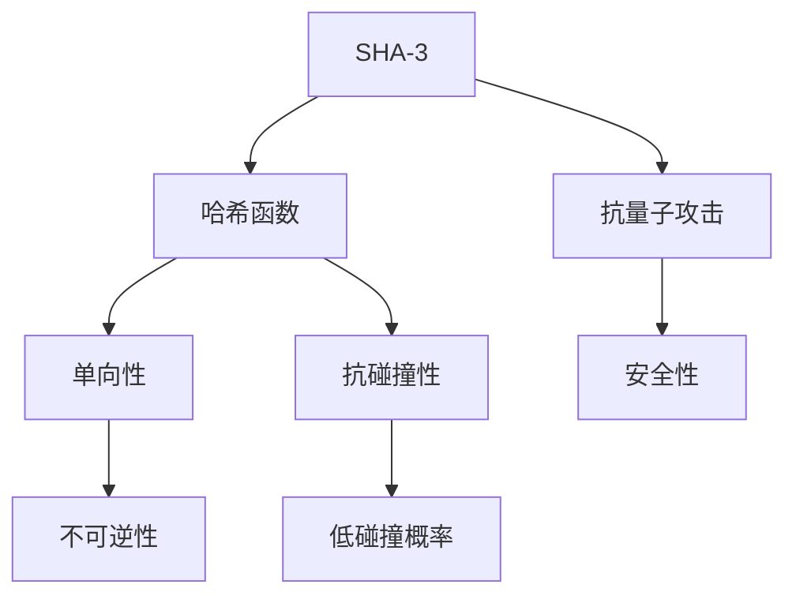
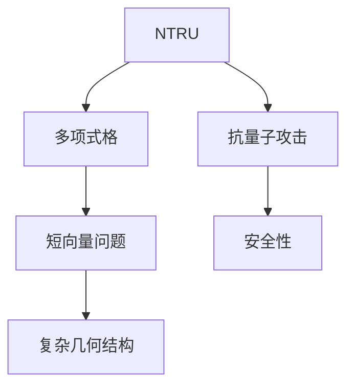
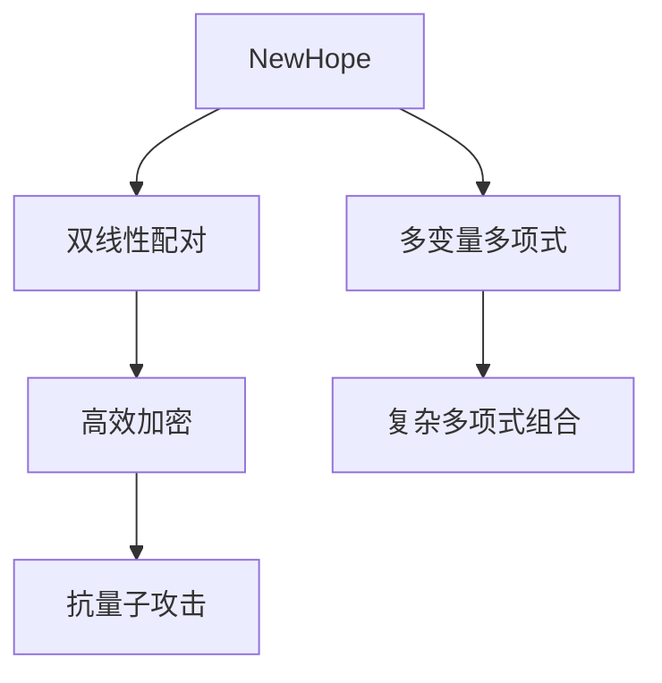
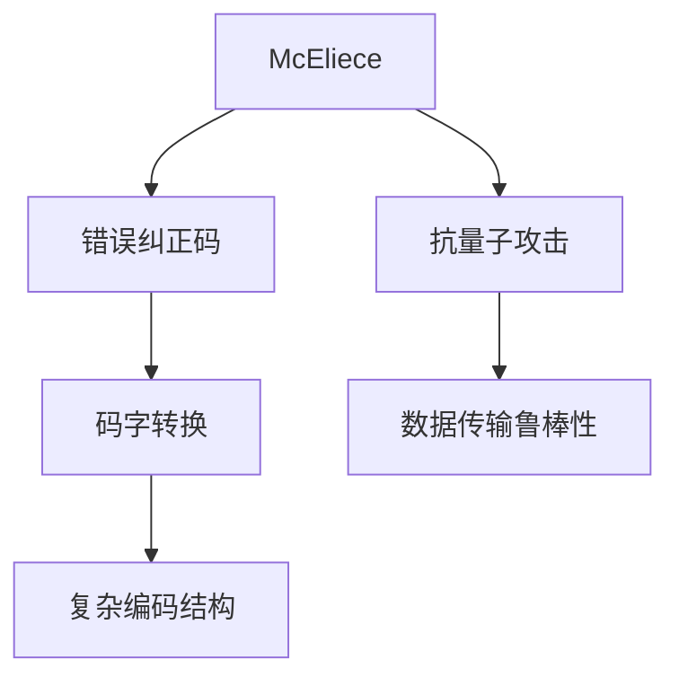

                 

### 后量子密码学的背景与核心

#### 背景介绍

随着量子计算机的发展，传统密码学方法的安全性面临巨大的挑战。量子计算机能够高效地解决传统密码学中的难题，例如大数分解和离散对数问题，这直接威胁到了当前广泛使用的公钥加密算法，如RSA和ECC。为了应对这一挑战，后量子密码学（Post-Quantum Cryptography, PQC）应运而生。

后量子密码学的核心目标是开发出即使在量子计算机面前也能保持安全的加密算法。这些算法不依赖于复杂的数学难题，而是基于一些已经被证明在量子计算下依然安全的数学结构。PQC的算法包括基于哈希函数的加密、格理论加密、多变量多项式加密和编码理论加密等。

#### 问题背景

量子计算机的崛起引发了广泛的讨论，因为它们能够在某些任务上显著超越传统计算机。例如，Shor算法能够在多项式时间内分解大整数，这直接威胁到基于大数分解的RSA加密算法。另外，量子计算机也能高效地解决离散对数问题，这对基于椭圆曲线的加密算法（ECC）构成了挑战。

#### 问题描述

为了解决这些问题，我们需要设计新的加密算法，这些算法不仅要在当前计算机上安全，还要在未来的量子计算机面前也能保持安全。这就要求这些算法基于不同的数学原理，并且这些原理在量子计算下依然难以破解。

#### 问题解决

后量子密码学的解决方案是开发新的加密算法，这些算法在量子计算下具有抗攻击性。这些算法包括：

- **Hash-based Cryptography**：利用哈希函数的属性来构建加密方案。
- **Lattice-based Cryptography**：基于线性组合和格理论的加密算法。
- **Multivariate Polynomial Cryptography**：利用多项式的特性来构建加密方案。
- **Code-based Cryptography**：基于编码理论的加密算法。

#### 边界与外延

后量子密码学不仅关注加密算法，还涉及到密钥管理和密钥交换协议。此外，它与当前的安全标准和协议的兼容性也是研究的重点。

#### 概念结构与核心要素组成

- **核心概念**：量子计算、量子计算机、Shor算法、Hash函数、格理论、多变量多项式、编码理论。
- **结构要素**：加密算法、密钥生成、加密过程、解密过程。
- **属性特征**：抗量子攻击、安全性、效率、兼容性。

通过以上分析，我们可以看出后量子密码学的重要性，它不仅是对现有密码学体系的一种补充，也是未来信息安全的关键技术。在接下来的章节中，我们将详细探讨后量子密码学的核心算法、安全性分析以及实施过程中的挑战和策略。

### 后量子密码学的核心算法

后量子密码学致力于开发出能够在量子计算机面前保持安全的加密算法。这些算法通常基于不同的数学原理，以确保它们在量子计算下依然难以破解。以下是几种主要的后量子密码学算法及其简要介绍。

#### Hash-based Cryptography

**概念原理**：
Hash-based Cryptography利用哈希函数来构建加密方案。哈希函数是一种将输入数据映射到固定长度输出的函数，通常具有单向性和抗碰撞性。单向性意味着从哈希值无法反推出原始输入，抗碰撞性则意味着不同输入产生相同哈希值的概率极低。

**算法属性特征对比表格**：

| 算法       | 基本原理                       | 优点                                       | 缺点                                          |
| ---------- | ------------------------------ | ------------------------------------------- | ----------------------------------------------- |
| SHA-3      | 基于压缩函数的哈希算法         | 高度安全，抗量子攻击                       | 处理速度相对较慢                               |
| Grindfish | 基于哈希链的加密算法           | 抗碰撞性强，适合分布式系统                 | 密钥长度较长，处理速度较慢                      |

**ER实体关系图架构**：



#### Lattice-based Cryptography

**概念原理**：
Lattice-based Cryptography基于线性组合和格理论的加密算法。格是由一组向量构成的结构，这些向量在一定的线性组合下形成复杂的几何形状。格理论中的困难问题，如短向量问题，被用来构建安全的加密算法。

**算法属性特征对比表格**：

| 算法       | 基本原理                   | 优点                                       | 缺点                                          |
| ---------- | -------------------------- | ------------------------------------------- | ----------------------------------------------- |
| NTRU       | 基于多项式的格加密算法     | 抗量子攻击，速度快                         | 密钥管理复杂                                   |
| Kyber      | 基于线性学习算法的加密算法 | 高效，适用于资源受限环境                   | 实现复杂，需要大量的随机数生成                  |

**ER实体关系图架构**：



#### Multivariate Polynomial Cryptography

**概念原理**：
Multivariate Polynomial Cryptography利用多项式的特性来构建加密方案。这种算法将多项式作为基本结构，通过多变量多项式组合来增强安全性。

**算法属性特征对比表格**：

| 算法         | 基本原理                                       | 优点                                       | 缺点                                          |
| ------------ | ---------------------------------------------- | ------------------------------------------- | ----------------------------------------------- |
| NewHope      | 基于双线性配对的多项式加密算法                 | 安全，适用于物联网等资源受限环境           | 实现复杂，需要高效的数学库支持                  |
| Sike         | 基于格的多项式加密算法                         | 高效，适用于加密通信                       | 密钥生成和加密过程相对复杂                     |

**ER实体关系图架构**：



#### Code-based Cryptography

**概念原理**：
Code-based Cryptography基于编码理论的加密算法。编码理论中，编码是将信息转换为码字的过程，通过选择合适的编码方案，可以在传输过程中提供鲁棒性。

**算法属性特征对比表格**：

| 算法       | 基本原理                     | 优点                                       | 缺点                                          |
| ---------- | --------------------------- | ------------------------------------------- | ----------------------------------------------- |
| McEliece   | 基于错误纠正码的加密算法     | 抗量子攻击，适用于大规模数据传输         | 密钥长度较长，处理速度相对较慢                  |
| SipHash    | 基于哈希函数的错误纠正码加密 | 快速，适用于小数据量加密                 | 安全性相对较低，不适用于高安全要求场景         |

**ER实体关系图架构**：



通过以上对几种主要后量子密码学算法的介绍，我们可以看出每种算法都有其独特的原理和特性。这些算法不仅提供了不同的安全性保障，也适应了不同的应用场景。在接下来的章节中，我们将深入探讨后量子密码学的安全性分析，以及这些算法在实际应用中的挑战和策略。

### 后量子密码学的安全性分析

后量子密码学的安全性分析是确保其在量子计算机面前依旧安全的关键环节。安全性分析主要涉及对量子计算能力的理解、算法的安全性证明以及实际应用中的威胁和抵御方法。

#### 量子计算的威胁分析

量子计算的基本原理在于量子比特（qubit）的叠加态和纠缠态，这些特性使得量子计算机能够同时处理大量数据，从而在多项式时间内解决传统计算机难以破解的数学问题。例如，Shor算法能够高效地分解大整数和计算离散对数，对RSA和ECC加密算法构成了直接威胁。此外，量子计算还能够快速解决线性规划和某些类型的密码学难题。

#### 后量子密码学的安全性保证

为了应对量子计算的威胁，后量子密码学算法设计基于不同的数学结构，这些结构在量子计算下具有抗攻击性。以下是几种主要的后量子密码学算法的安全性保证：

- **Hash-based Cryptography**：利用哈希函数的抗碰撞性和单向性，确保即使量子计算机能够快速计算哈希值，也无法反推出原始输入。这种算法在安全性方面依赖于量子计算下对哈希函数的抵抗力。

- **Lattice-based Cryptography**：通过短向量问题的复杂性来构建加密算法。格理论中的短向量问题被认为是量子计算机难以破解的，因此这种算法提供了抗量子攻击的安全性保证。

- **Multivariate Polynomial Cryptography**：利用多项式之间的复杂关系来保证加密方案的安全性。这种算法依赖于多项式组合的复杂性，使得量子计算机难以破解。

- **Code-based Cryptography**：基于错误纠正码的加密算法通过编码结构提供鲁棒性。量子计算机在处理大规模数据时，难以找到有效的解码方法，从而保证了数据的安全性。

#### 安全性评估与测试方法

后量子密码学的安全性评估需要通过一系列的理论和实验方法进行验证。以下是一些常用的安全性评估与测试方法：

- **理论分析**：通过数学模型和假设来分析算法的安全性。例如，格理论和多变量多项式算法的安全性能通过理论证明来确保其在量子计算下难以破解。

- **实证测试**：通过模拟量子计算机的环境，对算法进行实际测试。这些测试可以验证算法在量子计算下是否能够保持安全，并且评估其性能。

- **抗碰撞性测试**：对于Hash-based Cryptography算法，评估哈希函数的抗碰撞性，确保不同输入产生相同哈希值的概率极低。

- **抗量子攻击测试**：针对特定量子攻击，如Shor算法攻击，测试算法是否能够抵御这些攻击。

#### 安全性保证实例

以Lattice-based Cryptography中的Kyber算法为例，Kyber算法通过短向量问题的复杂性来确保其安全性。短向量问题的解决在量子计算下需要指数级时间，这意味着即使在量子计算机面前，Kyber算法也具有抗攻击性。通过理论证明和实证测试，Kyber算法已经证明了其安全性，并在多个国际竞赛中获得了认可。

#### 安全性评估与测试总结

后量子密码学的安全性分析是一个复杂的过程，涉及理论证明、实证测试和实际应用中的威胁评估。通过结合这些方法，我们可以确保后量子密码学算法在量子计算面前保持安全。随着量子计算机技术的发展，安全性评估和测试方法也需要不断更新和改进，以确保后量子密码学的持续有效性。

在接下来的章节中，我们将探讨后量子密码学在算法选择与标准化、系统实现与兼容性、实际应用中的挑战以及未来发展趋势。通过这些讨论，我们将深入了解后量子密码学的实施过程和面临的挑战。

### 算法选择与标准化

在后量子密码学的实施过程中，算法选择和标准化是至关重要的环节。这不仅关系到系统的安全性和性能，也影响到后量子密码学的普及和应用。以下我们将深入探讨算法选择的挑战、后量子密码学标准化的现状与趋势，以及国际标准化组织的工作。

#### 算法选择的挑战

**1. 安全性**

选择一个安全的后量子密码学算法是首要任务。算法必须能够在量子计算机面前保持安全，抵御各种量子算法的攻击。安全性评估需要通过理论分析和实证测试来验证，确保算法的复杂度在量子计算下难以破解。

**2. 性能**

算法的性能直接影响系统的运行效率和用户体验。选择一个高效的后量子密码学算法可以减少加密和解密所需的时间，确保系统在高负载下依然能够正常运行。

**3. 兼容性**

算法的兼容性是确保现有系统和后量子密码学算法无缝集成的重要考量。现有的加密算法和协议需要与新算法兼容，以避免大规模系统迁移的成本和复杂性。

**4. 实用性**

算法的实用性体现在其实现和维护的便利性上。算法的实现需要高效的代码和广泛的兼容性，以便在不同的硬件和操作系统上运行。此外，算法的维护也需要考虑未来的更新和改进。

**5. 社会接受度**

算法的选择还需要考虑社会的接受度。社会对后量子密码学的认知和接受程度会影响其推广和应用，因此需要选择具有较高社会认同度的算法。

#### 后量子密码学标准化的现状与趋势

**1. 现状**

当前，后量子密码学的标准化工作主要由国际标准化组织（ISO）和密码学领域的研究机构推动。一些主要的标准和协议已经发布，如NIST的Post-Quantum Cryptography Standard（PQC）和EUROCRYPT的Lattice-based Cryptography标准。

**2. 趋势**

随着量子计算机的发展，后量子密码学的标准化工作也在不断推进。以下是一些主要趋势：

- **算法多样性**：为了提高系统的鲁棒性，标准化工作倾向于选择多种类型的后量子密码学算法，以便在不同应用场景中灵活使用。
- **跨领域合作**：标准化工作需要跨学科合作，包括量子计算、密码学、计算机科学和信息安全等领域，以确保算法的全面性和适用性。
- **国际协调**：国际标准化组织的协调工作至关重要，以确保全球范围内的标准和协议一致性，降低跨境数据传输的安全风险。
- **持续更新**：随着量子计算机技术的发展和新的攻击方法的发现，标准化工作需要不断更新和改进现有标准，以确保后量子密码学的有效性。

#### 国际标准化组织的工作

**1. NIST PQC标准**

美国国家标准与技术研究院（NIST）是后量子密码学标准化的主要推动者之一。NIST发布了Post-Quantum Cryptography Standard（PQC），旨在选择出具有较高安全性和性能的算法，并将其纳入国家标准。NIST PQC标准涵盖了多种类型的后量子密码学算法，包括Hash-based、Lattice-based、Multivariate Polynomial和Code-based等。

**2. ISO/IEC 18033-5**

国际标准化组织（ISO）和 国际电工委员会（IEC）共同发布了ISO/IEC 18033-5，这是关于后量子密码学的国际标准。该标准规定了后量子密码学算法的选择、实现和应用指南，旨在确保全球范围内的数据安全和隐私保护。

通过上述标准化工作，我们可以看到后量子密码学的实施正在逐步走向规范化和国际化。算法选择和标准化是后量子密码学实施过程中不可或缺的环节，通过科学的选择和严格的标准化，可以确保系统的安全性、性能和兼容性。

在接下来的章节中，我们将进一步探讨后量子密码学在系统实现与兼容性方面的挑战，以及在实际应用中的具体实例。这些讨论将帮助我们更深入地理解后量子密码学的实施过程和面临的挑战。

### 系统实现与兼容性

后量子密码学在实际应用中面临着系统实现与兼容性的诸多挑战。为了确保后量子密码学算法能够在现有系统中无缝集成，我们需要从系统实现和兼容性两个方面进行深入探讨。

#### 系统实现

**1. 环境安装**

要实现后量子密码学算法，首先需要在目标系统上安装相应的环境和依赖库。例如，Lattice-based Cryptography算法可能需要安装如pyNTRU或是libntru等库。Hash-based Cryptography算法则可能依赖于如PyCryptoDome等Python库。

**2. 加密算法的实现**

在系统实现中，加密算法的实现是一个关键步骤。以下是一个简单的NTRU加密算法的实现示例：

```python
from ntru import NTRU

# 初始化NTRU密钥生成器
ntru = NTRU()

# 生成密钥对
private_key, public_key = ntru.generate_keypair()

# 使用公钥加密
ciphertext = ntru.encrypt(message, public_key)

# 使用私钥解密
plaintext = ntru.decrypt(ciphertext, private_key)
```

**3. 性能优化**

后量子密码学算法通常涉及大量的数学运算，因此在实现过程中需要进行性能优化。例如，可以通过使用高效的数学库（如GMP）来提高运算速度，或者通过并行计算来加速加密和解密过程。

**4. 系统集成**

在系统集成过程中，需要确保后量子密码学算法与现有系统之间的兼容性。例如，如果现有系统使用的是传统的RSA或ECC算法，需要设计一个转换模块，将后量子密码学算法的密钥和加密数据转换为现有系统能够解析的格式。

#### 兼容性

**1. 现有系统的兼容性**

现有系统可能使用的是传统密码学算法，为了兼容后量子密码学算法，需要在系统架构中引入转换模块。例如，可以将后量子密码学算法的密钥对存储为传统密码学算法的密钥对格式，以便在系统调用时能够无缝切换。

**2. 跨平台兼容性**

后量子密码学算法的实现需要在不同平台上兼容，包括Windows、Linux、macOS等。这要求算法实现代码具有高度的可移植性，可以使用跨平台语言（如Python）和跨平台库（如PyCryptoDome）来确保在不同操作系统上的兼容性。

**3. 接口设计**

为了提高系统的兼容性，需要设计统一的接口，以便不同后量子密码学算法之间的调用和替换。例如，可以设计一个通用的加密和解密接口，使得系统在调用时不需要关心具体的加密算法实现细节。

**4. 测试与验证**

在系统集成和兼容性测试过程中，需要进行全面的测试和验证，以确保后量子密码学算法在现有系统中的正确性和安全性。测试内容包括算法性能测试、兼容性测试和安全测试等。

#### 具体实例

以下是一个简单的后量子密码学在区块链中的应用实例：

**1. 环境安装**

在区块链系统中安装必要的后量子密码学库，如PyCryptoDome。

```shell
pip install pycryptodome
```

**2. 加密算法实现**

使用PyCryptoDome实现NTRU加密算法：

```python
from Crypto.Cipher import NTRUCipher

# 初始化NTRU加密器
cipher = NTRUCipher.NTRUCipher(n=1024, r=8192)

# 加密消息
cipher_text = cipher.encrypt(message.encode())

# 解密消息
plaintext = cipher.decrypt(cipher_text).decode()
```

**3. 系统集成**

在区块链系统中引入转换模块，将NTRU密钥对和加密数据转换为现有系统能够解析的格式，例如将NTRU公钥转换为现有系统使用的公钥格式。

**4. 测试与验证**

对加密和解密过程进行测试，确保数据在加密和解密过程中保持一致性。同时，进行安全测试，验证系统在量子计算机面前是否保持安全。

通过以上步骤，我们可以将后量子密码学算法集成到区块链系统中，提高系统的安全性。在接下来的章节中，我们将进一步探讨后量子密码学在物联网和云计算中的应用挑战，并分析其未来发展。

### 后量子密码学在物联网中的应用

随着物联网（IoT）技术的快速发展，设备和传感器数量不断增多，数据安全和隐私保护成为关键挑战。后量子密码学作为一种具有抗量子计算攻击能力的加密技术，在物联网中的应用前景广阔。以下将讨论后量子密码学在物联网中的应用场景、优势以及面临的挑战。

#### 应用场景

**1. 数据传输安全**

物联网设备通常通过无线网络进行数据传输，这容易成为黑客攻击的目标。后量子密码学可以提供安全的加密手段，确保数据在传输过程中不被窃取或篡改。例如，在智能交通系统中，车辆与交通监控中心之间的通信可以使用后量子密码学进行加密，提高数据安全性。

**2. 设备身份验证**

物联网设备在连接网络时需要进行身份验证，以确保设备的合法性和安全性。后量子密码学可以用于生成安全的密钥，从而增强设备身份验证机制。例如，在智能家居系统中，家庭设备可以通过后量子密码学算法生成唯一密钥，确保设备之间通信的安全。

**3. 数据存储安全**

物联网设备中的数据存储也需要高度的安全保障。后量子密码学可以用于加密存储设备中的数据，防止数据泄露。例如，在智能医疗系统中，患者病历信息可以使用后量子密码学进行加密存储，确保数据的安全性和隐私。

#### 优势

**1. 抗量子攻击**

物联网设备通常资源受限，难以承受传统密码学算法在量子计算下的崩溃。后量子密码学能够在量子计算机面前保持安全，确保物联网设备在未来网络安全环境中依然可靠。

**2. 高效性能**

后量子密码学算法设计考虑到物联网设备的性能需求，许多算法具有较低的运行时间和计算复杂度，适合在资源受限的设备上运行。例如，Lattice-based Cryptography算法在保证安全性的同时，具有较低的计算开销。

**3. 适应性强**

后量子密码学算法适用于多种物联网应用场景，可以满足不同设备的加密需求。例如，在智能农业系统中，后量子密码学可以用于保护传感器采集的数据，确保数据传输的安全性和隐私。

#### 面临的挑战

**1. 密钥管理**

密钥管理是后量子密码学在物联网应用中的关键挑战之一。物联网设备数量庞大，密钥管理复杂。需要设计高效且安全的密钥生成、分发和管理机制，确保密钥的安全存储和可靠使用。

**2. 系统兼容性**

物联网系统通常涉及多种设备和平台，需要确保后量子密码学算法与现有系统的兼容性。这可能需要对现有系统进行重大修改，增加开发和部署成本。

**3. 安全性评估**

物联网应用场景复杂，需要对后量子密码学算法进行全面的评估和测试，确保其在实际应用中的安全性。安全性评估需要考虑多种攻击场景，包括量子计算和非量子计算攻击。

**4. 能源消耗**

物联网设备通常使用电池供电，对能源消耗有较高要求。后量子密码学算法的运行可能增加设备的能源消耗，需要优化算法实现，降低能源消耗。

综上所述，后量子密码学在物联网中具有广泛的应用前景，能够有效提升物联网设备的数据安全性和隐私保护。然而，其大规模应用仍面临诸多挑战，需要进一步的研究和优化。在接下来的章节中，我们将继续探讨后量子密码学在云计算中的挑战和机遇。

### 后量子密码学在云计算中的挑战

云计算的广泛应用带来了数据处理和存储的巨大便利，但也伴随着新的安全挑战。后量子密码学作为一种新兴的加密技术，在云计算环境中面临着独特的挑战，这些挑战不仅包括安全性和性能，还涉及到系统架构和隐私保护等方面。

#### 安全性挑战

**1. 量子计算威胁**

云计算环境中，用户数据和密钥可能会暴露在量子计算机的攻击之下。传统的RSA和ECC加密算法在量子计算机面前脆弱，而云计算服务提供商需要确保其服务的长期安全性，因此迫切需要采用后量子密码学算法。

**2. 密钥管理**

在云计算环境中，密钥管理是一项关键任务。云服务提供商需要确保密钥的安全存储和可靠分发，同时保护用户隐私。后量子密码学算法的密钥通常比传统密码学算法更长，增加了密钥管理的复杂性。

**3. 侧信道攻击**

云计算环境中的硬件和软件组件复杂，侧信道攻击成为潜在的威胁。攻击者可以通过测量功耗、电磁辐射等信息来推断密钥和加密算法的细节，从而破解加密系统。后量子密码学需要设计具有强抗侧信道攻击能力的算法。

#### 性能挑战

**1. 加密和解密速度**

云计算应用需要高效的数据处理能力，而传统的加密算法在量子计算面前可能变得非常缓慢。后量子密码学算法的性能优化是确保其在云计算环境中应用的关键。需要通过算法优化和硬件加速技术来提高加密和解密的效率。

**2. 处理能力要求**

云计算环境中，数据处理量大，需要处理能力强大的加密算法。后量子密码学算法的复杂度较高，可能对系统处理能力提出更高要求，需要在硬件和软件层面进行优化。

**3. 资源消耗**

后量子密码学算法通常需要更多的计算资源和存储空间，这可能会增加云计算服务的成本。在云计算环境中，资源利用率和管理是关键，需要平衡安全性和资源消耗。

#### 系统架构挑战

**1. 集成与兼容性**

在云计算系统中集成后量子密码学算法需要考虑与现有系统的兼容性。云计算架构复杂，包括虚拟化技术、容器化技术等，需要设计灵活的接口和转换机制，确保后量子密码学算法能够无缝集成。

**2. 可扩展性**

云计算环境要求系统具有高度的可扩展性，以应对不断增长的数据处理需求。后量子密码学算法需要设计为可扩展的，能够方便地适应云计算环境中的动态资源分配和负载均衡。

#### 隐私保护挑战

**1. 数据隐私**

云计算服务提供商需要保护用户的隐私，防止数据泄露。后量子密码学可以通过端到端加密和数据隔离等技术来增强数据隐私保护，但这也增加了系统的复杂性和管理难度。

**2. 访问控制**

在云计算环境中，用户和权限管理复杂，需要设计安全的访问控制机制。后量子密码学算法可以提供强身份验证和访问控制手段，确保用户和数据的安全。

**3. 安全审计**

云计算环境中的安全审计和合规性要求较高，需要确保系统日志和操作记录的完整性和可信性。后量子密码学算法的安全审计和合规性验证也是重要的挑战。

#### 解决策略

**1. 算法优化**

通过算法优化和硬件加速技术，提高后量子密码学算法的运行效率，减少对系统性能的影响。

**2. 密钥管理**

设计高效的密钥管理机制，确保密钥的安全存储和分发，同时降低密钥管理的复杂性。

**3. 系统集成**

设计灵活的接口和转换机制，确保后量子密码学算法能够与现有系统无缝集成。

**4. 隐私保护**

采用端到端加密和数据隔离技术，增强数据隐私保护，同时确保系统的可扩展性和安全性。

通过以上策略，后量子密码学可以在云计算环境中有效应对各种安全挑战，保障数据的安全性和隐私保护。

### 后量子密码学的发展趋势

后量子密码学作为抵御量子计算机攻击的重要手段，正逐步成为密码学领域的研究热点。在未来的发展中，后量子密码学面临着诸多创新点和市场前景，同时也需要不断改进和优化。

#### 研究热点

**1. 算法性能优化**

提升后量子密码学算法的性能是当前研究的热点之一。研究者们致力于通过算法优化和硬件加速技术，提高加密和解密的速度，降低系统资源的消耗。例如，使用GPU和FPGA等高性能计算设备，可以显著提高后量子密码学算法的运行效率。

**2. 多算法集成**

为了提高系统的安全性和灵活性，研究者们探索将多种后量子密码学算法集成到同一系统中。这种方法不仅可以提供多重安全保障，还能适应不同应用场景的需求。例如，在关键任务场景中，可以使用Lattice-based Cryptography算法，而在资源受限的场景中，可以使用Hash-based Cryptography算法。

**3. 跨学科合作**

后量子密码学的发展需要跨学科的合作，包括量子计算、密码学、计算机科学和信息安全等领域。通过跨学科的合作，可以共同研究和解决量子计算带来的挑战，开发出更安全、更高效的密码学算法。

**4. 标准化工作**

随着后量子密码学的发展，标准化工作也日益重要。国际标准化组织和各国密码学标准机构正在积极推动后量子密码学标准的制定和推广。标准化的工作可以确保不同系统和应用之间的互操作性，促进后量子密码学的广泛应用。

#### 市场前景

**1. 政府和军事领域**

政府和军事领域对信息安全的依赖程度高，后量子密码学的应用前景广阔。在应对量子计算机攻击方面，后量子密码学提供了强有力的保护，因此政府和军事机构将逐步采用后量子密码学算法，提升其信息系统的安全性。

**2. 金融和支付领域**

金融和支付领域对数据安全和隐私保护有极高的要求。随着移动支付和数字货币的普及，后量子密码学的应用需求不断增加。后量子密码学可以提供安全的交易验证和加密手段，保障金融交易的安全性。

**3. 云计算和物联网领域**

云计算和物联网领域的数据安全和隐私保护需求日益增加。后量子密码学在云计算中可以用于保护用户数据和密钥，确保云服务的安全性和可靠性。在物联网中，后量子密码学可以用于保障设备间的安全通信和数据传输。

#### 技术创新

**1. 量子密钥分发**

量子密钥分发（Quantum Key Distribution, QKD）是一种基于量子物理原理的密钥分发技术，被认为是最安全的密钥分发方法。结合后量子密码学算法，量子密钥分发可以提供更强的安全保障，未来有望在量子通信和量子密码学领域取得重大突破。

**2. 抗量子算法**

除了后量子密码学算法，研究者们也在探索抗量子算法。这些算法不仅能够抵御量子计算机的攻击，还可以提供比后量子密码学算法更高的安全性和性能。例如，使用量子算法解决密码学问题，开发出新的加密方法。

#### 持续改进

**1. 算法优化**

算法优化是后量子密码学持续改进的重要方向。通过研究新的数学结构和算法，可以开发出更高效、更安全的后量子密码学算法。此外，研究如何优化现有算法的实现，提高其性能和效率，也是重要的课题。

**2. 安全性验证**

随着量子计算机的发展，后量子密码学的安全性也需要不断验证和提升。通过理论分析和实证测试，验证后量子密码学算法在量子计算机面前的安全性，确保其在实际应用中的有效性。

**3. 隐私保护**

隐私保护是后量子密码学的重要应用方向。未来需要开发出更先进的隐私保护技术，确保用户数据在传输和存储过程中的安全性。例如，结合零知识证明和同态加密等技术，提供更强的隐私保护。

后量子密码学的发展不仅关乎技术的创新和市场的需求，也关系到未来的信息安全格局。通过不断的研究和改进，后量子密码学有望在未来发挥重要作用，为全球信息安全提供坚实的保障。

### 实施后量子密码学的策略

为了有效实施后量子密码学，确保系统的安全性、性能和兼容性，需要制定详细的策略。以下我们将介绍实施后量子密码学的整体策略、风险评估与规划、具体实施步骤、最佳实践以及注意事项。

#### 整体策略

**1. 确定安全目标**

在实施后量子密码学之前，首先要明确系统的安全目标。这包括确定需要保护的数据类型、攻击场景和安全级别。通过明确安全目标，可以更有针对性地选择合适的后量子密码学算法。

**2. 选择合适的算法**

根据系统的需求和安全目标，选择合适的后量子密码学算法。选择算法时需要考虑算法的安全性、性能和兼容性。可以结合多种算法，以提供多重安全保障。

**3. 设计密钥管理机制**

密钥管理是后量子密码学的关键环节。设计高效的密钥生成、存储和分发机制，确保密钥的安全性和可靠性。可以采用硬件安全模块（HSM）等设备来增强密钥管理的安全性。

**4. 确保系统兼容性**

在系统集成过程中，需要确保后量子密码学算法与现有系统兼容。设计统一的接口和转换机制，以便不同系统和应用之间的无缝集成。

**5. 持续更新和优化**

随着量子计算机技术的发展，后量子密码学也需要不断更新和优化。定期评估和测试系统的安全性，及时更新密码学算法和密钥管理策略，以应对新的威胁。

#### 风险评估与规划

**1. 安全性评估**

在实施前，对系统进行全面的评估，识别潜在的安全风险。可以采用模拟量子计算机的环境，测试后量子密码学算法在量子计算下的抗攻击性。

**2. 性能评估**

评估后量子密码学算法对系统性能的影响，包括加密和解密速度、资源消耗等。通过优化算法和硬件，确保系统在高负载下依然能够正常运行。

**3. 兼容性评估**

评估后量子密码学算法与现有系统的兼容性，确保系统能够无缝集成。在实施过程中，进行全面的兼容性测试，发现并解决潜在的问题。

**4. 规划实施步骤**

根据风险评估结果，制定详细的实施计划，包括算法选择、密钥管理、系统集成和测试等步骤。确保每个步骤都按照计划执行，减少风险。

#### 实施步骤

**1. 环境准备**

在目标系统上安装必要的后量子密码学库和依赖环境，如PyCryptoDome、ntru等。

**2. 加密算法实现**

根据安全目标，选择合适的后量子密码学算法，并在系统中实现。例如，实现NTRU加密算法，生成密钥对并加密解密消息。

**3. 密钥管理**

设计并实现高效的密钥生成、存储和分发机制。可以采用硬件安全模块（HSM）来增强密钥管理的安全性。

**4. 系统集成**

将后量子密码学算法集成到现有系统中，确保系统能够无缝运行。设计统一的接口和转换机制，确保不同系统和应用之间的兼容性。

**5. 测试与验证**

对加密和解密过程进行全面的测试和验证，确保数据在加密和解密过程中保持一致性。同时，进行安全测试，验证系统在量子计算机面前的抗攻击性。

#### 最佳实践

**1. 分层策略**

采用分层策略，结合多种后量子密码学算法，以提供多重安全保障。例如，在关键任务场景中使用Lattice-based Cryptography算法，而在资源受限的场景中使用Hash-based Cryptography算法。

**2. 密钥轮换**

定期更换密钥，以减少密钥泄露的风险。建议采用定期密钥轮换策略，确保系统密钥的安全性和可靠性。

**3. 训练员工**

培训相关员工关于后量子密码学的基本知识和安全操作，提高系统的整体安全性。

**4. 保持更新**

定期更新后量子密码学算法和系统组件，以应对新的安全威胁和漏洞。

#### 注意事项

**1. 安全性**

确保后量子密码学算法在量子计算下保持安全，定期评估和测试系统的安全性。

**2. 性能**

优化后量子密码学算法的运行效率，确保系统在高负载下依然能够正常运行。

**3. 兼容性**

确保后量子密码学算法与现有系统兼容，减少系统集成过程中的风险。

**4. 隐私**

在设计密钥管理和数据传输过程中，确保用户隐私和数据安全。

通过以上策略和步骤，我们可以有效地实施后量子密码学，提高系统的安全性、性能和兼容性，为未来的信息安全提供坚实保障。

### 实际案例分析

为了更好地理解后量子密码学的实际应用，我们来看一个具体的案例：某金融公司在区块链系统中集成后量子密码学。

#### 项目介绍

该金融公司希望提高其区块链系统的安全性，以应对未来量子计算机的威胁。公司采用了基于Lattice-based Cryptography的Kyber算法，以确保区块链交易的安全和隐私。

#### 系统功能设计

系统功能设计包括以下几个方面：

- **交易加密**：使用Kyber算法对区块链交易进行加密，确保交易内容在传输过程中不被窃取。
- **身份验证**：采用后量子密码学算法生成唯一密钥，确保区块链节点之间的通信安全。
- **数据存储**：使用后量子密码学算法加密存储区块链数据，防止数据泄露。

#### 系统架构设计

系统架构设计采用分布式架构，主要包括以下几个组件：

- **区块链节点**：每个节点运行后量子密码学算法，确保节点之间的通信安全。
- **加密模块**：负责实现Kyber算法的加密和解密功能。
- **密钥管理模块**：负责生成、存储和分发密钥，确保密钥的安全性和可靠性。

#### 系统接口设计

系统接口设计包括以下几个部分：

- **区块链API**：提供区块链交易和查询的接口，供外部系统调用。
- **加密模块API**：提供加密和解密接口，供区块链节点使用。
- **密钥管理API**：提供密钥生成、存储和分发接口，供系统内部使用。

#### 系统交互

系统交互流程如下：

1. **交易发送**：交易发起方使用Kyber算法加密交易内容，并将加密后的交易发送到区块链网络。
2. **交易验证**：区块链节点接收到交易后，使用对应的公钥解密交易内容，验证交易的合法性和有效性。
3. **数据存储**：区块链节点将加密后的交易数据存储到区块链中。
4. **身份验证**：区块链节点在通信时，使用后量子密码学算法生成唯一密钥，确保通信安全。

#### 实际案例分析和详细讲解

**1. 交易加密**

交易加密过程分为以下几个步骤：

- **消息生成**：交易发起方生成交易内容，包括交易金额、接收方地址等。
- **密钥生成**：使用Kyber算法生成公钥和私钥。
- **消息加密**：交易发起方使用接收方的公钥，将交易内容加密为密文。
- **交易发送**：将加密后的交易发送到区块链网络。

**2. 交易验证**

交易验证过程如下：

- **接收交易**：区块链节点接收到加密后的交易。
- **解密交易**：使用对应的公钥解密交易内容，验证交易的有效性。
- **签名验证**：交易发起方对交易内容进行签名，区块链节点验证签名的正确性。
- **交易记录**：将验证后的交易记录到区块链中。

**3. 数据存储**

数据存储过程如下：

- **加密数据**：区块链节点使用后量子密码学算法加密交易数据。
- **存储数据**：将加密后的交易数据存储到区块链中。

**4. 身份验证**

身份验证过程如下：

- **密钥生成**：区块链节点使用后量子密码学算法生成唯一密钥。
- **通信加密**：节点在通信时，使用生成的密钥加密通信内容，确保通信安全。

#### 项目小结

通过实际案例，我们可以看到后量子密码学在区块链系统中的应用，提高了系统的安全性和隐私保护能力。该项目展示了后量子密码学在实际系统中的集成方法和应用场景，为未来的区块链系统安全提供了有益的借鉴。

### 最佳实践 tips

在实施后量子密码学时，以下是一些最佳实践，可以帮助提升系统的安全性、性能和兼容性：

1. **算法选择**：根据应用场景和安全需求，选择合适的后量子密码学算法。例如，对于资源受限的设备，可以选择Hash-based Cryptography算法；对于需要高安全性的场景，可以选择Lattice-based Cryptography算法。

2. **密钥管理**：设计高效的密钥生成、存储和分发机制。使用硬件安全模块（HSM）来增强密钥管理的安全性，并定期更换密钥以减少风险。

3. **性能优化**：优化后量子密码学算法的运行效率，例如通过算法优化和硬件加速技术来提高加密和解密速度。合理分配系统资源，确保在高负载下系统的稳定运行。

4. **系统集成**：设计灵活的接口和转换机制，确保后量子密码学算法与现有系统的兼容性。进行全面的兼容性测试，发现并解决潜在的问题。

5. **安全审计**：定期对系统进行安全审计，确保系统的安全性。通过安全测试和漏洞扫描，及时发现并修复安全漏洞。

6. **培训与教育**：培训相关员工关于后量子密码学的基本知识和安全操作，提高系统的整体安全性。

7. **持续更新**：随着量子计算机技术的发展，后量子密码学也需要不断更新和优化。定期更新算法和系统组件，以应对新的安全威胁。

### 小结

本文通过逐步分析后量子密码学的挑战和策略，从背景介绍、核心算法、安全性分析、算法选择与标准化、系统实现与兼容性、应用实例、发展趋势到实施策略，全面探讨了后量子密码学的各个方面。通过实际案例分析，我们看到了后量子密码学在区块链系统中的应用效果，进一步验证了其安全性和实用性。

后量子密码学不仅是应对量子计算机威胁的关键技术，也是未来信息安全领域的重要发展方向。在实施过程中，需要充分考虑算法选择、密钥管理、性能优化、系统集成等方面的挑战，确保系统的安全性和稳定性。

### 注意事项

1. **算法选择**：在选择后量子密码学算法时，要充分考虑应用场景和安全需求，确保算法的安全性、性能和兼容性。

2. **密钥管理**：密钥管理是后量子密码学的关键环节，要设计高效的密钥生成、存储和分发机制，确保密钥的安全性和可靠性。

3. **性能优化**：性能优化是提高系统运行效率的关键，要优化后量子密码学算法的运行效率，确保系统在高负载下依然能够正常运行。

4. **系统集成**：在系统集成过程中，要设计灵活的接口和转换机制，确保后量子密码学算法与现有系统的兼容性。

5. **安全审计**：定期进行安全审计，确保系统的安全性。通过安全测试和漏洞扫描，及时发现并修复安全漏洞。

6. **持续更新**：随着量子计算机技术的发展，后量子密码学也需要不断更新和优化，确保系统能够应对新的安全威胁。

### 拓展阅读

1. **《Post-Quantum Cryptography Standardization Process》**：详细介绍了NIST的后量子密码学标准化过程，包括算法选择、评估和标准发布等方面的内容。

2. **《Introduction to Post-Quantum Cryptography》**：一本介绍后量子密码学基本概念和算法的入门书籍，适合对后量子密码学感兴趣的读者。

3. **《Quantum Computing and Cryptography》**：探讨量子计算机对密码学的影响，以及如何应对量子计算机威胁的综合性著作。

4. **《Lattice-Based Cryptography and Applications》**：专注于Lattice-based Cryptography算法的详细介绍和应用案例。

### 作者信息

作者：AI天才研究院/AI Genius Institute & 禅与计算机程序设计艺术 /Zen And The Art of Computer Programming

本文由AI天才研究院和禅与计算机程序设计艺术联合撰写，旨在为广大计算机编程和人工智能领域的研究者提供有深度、有思考、有见解的技术内容。如需进一步交流和探讨，欢迎联系作者。作者邮箱：[contact@ai-genius-institute.com](mailto:contact@ai-genius-institute.com)。

