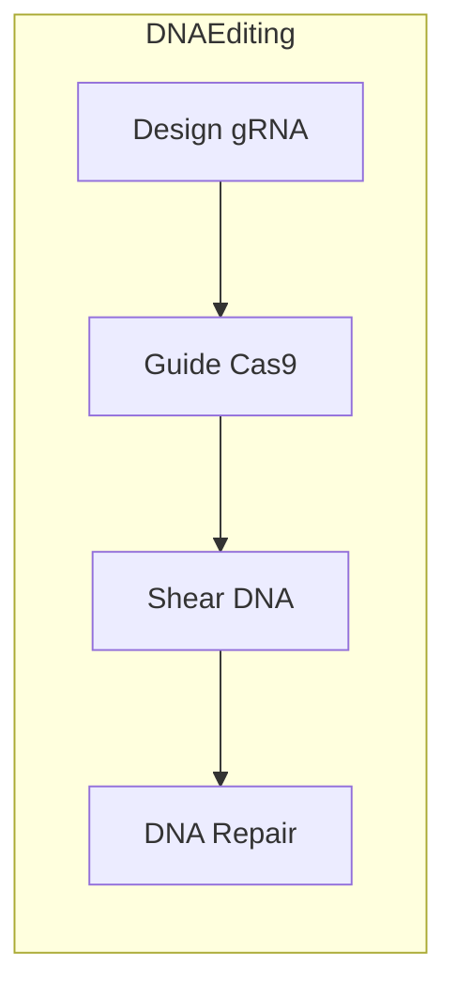
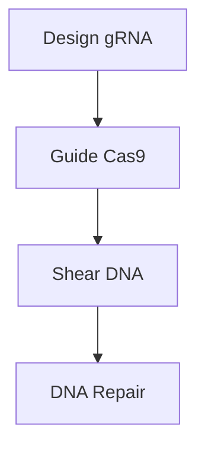
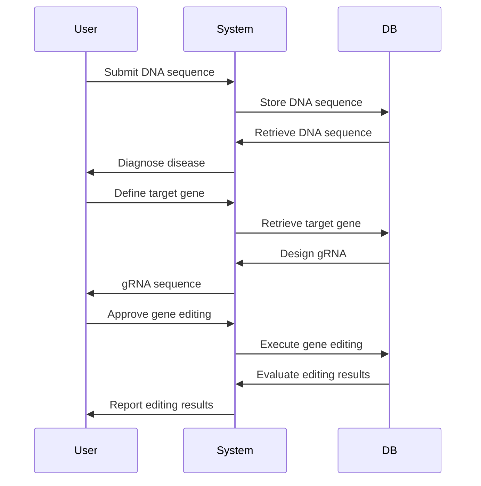

                 

### 基因编辑技术CRISPR的伦理考量

#### 关键词

基因编辑、CRISPR、伦理考量、安全风险、社会影响、监管框架

#### 摘要

基因编辑技术，特别是CRISPR-Cas9系统，为医学和生物学研究带来了革命性的变化。然而，这项技术也引发了广泛的伦理争议。本文将详细探讨CRISPR技术的基本原理、伦理学基础、安全性、社会影响以及全球和国内的法律和监管框架。通过逐步分析，本文旨在为读者提供一份全面且深入的伦理考量报告，以便更好地理解和应对这一新兴技术带来的挑战。

## 引言与背景

### 1.1 书籍目的与结构

本文旨在深入探讨基因编辑技术CRISPR的伦理考量，为读者提供一个全面、系统的分析框架。随着科学技术的快速发展，CRISPR技术已经从实验室研究走向了临床应用，其潜力和风险也随之凸显。伦理考量成为评估和指导这一技术发展的重要维度。

本书分为七个主要章节：

1. **引言与背景**：介绍基因编辑技术的概述，CRISPR技术的基本原理，以及伦理考量的重要性。
2. **基因编辑伦理学基础**：探讨伦理学的理论基础、伦理原则与基因编辑、伦理决策框架。
3. **CRISPR技术的伦理争议**：分析CRISPR技术可能引发的安全问题和社会影响。
4. **CRISPR技术的伦理考量**：进一步探讨CRISPR技术的安全性、伦理考量的多样性以及相关案例。
5. **基因编辑在人类健康中的应用**：讨论CRISPR技术在疾病治疗和遗传疾病预防中的伦理问题。
6. **全球伦理监管框架**：介绍国际和国内的法律框架、监管机构的角色以及跨国合作的伦理问题。
7. **未来展望与伦理考量**：展望CRISPR技术的未来发展，探讨伦理挑战与解决方案。

### 1.2 CRISPR技术的发展历程

CRISPR（Clustered Regularly Interspaced Short Palindromic Repeats）即成簇的规律性间隔短回文重复序列，最早在细菌中发现。这些细菌利用CRISPR系统作为天然免疫系统，抵抗外来遗传物质，如病毒。CRISPR-Cas9系统，是目前应用最广泛的基因编辑工具，其核心由Cas9核酸酶和一个指导RNA（gRNA）组成。通过设计特定的gRNA，Cas9能够精准识别并剪切DNA序列，实现基因的敲除、插入或替换。

CRISPR技术的发展历程可以追溯到2000年代初，随着科学家对CRISPR系统的深入研究，这一技术逐渐从基础研究走向实际应用。2012年，Jinek等科学家揭示了CRISPR-Cas9系统的分子机制，这一发现为基因编辑提供了新的工具。随后，CRISPR技术迅速在基因编辑、基因治疗、基因测序等领域取得突破。

### 1.3 CRISPR技术的基本原理

CRISPR技术的基本原理可以概括为三个步骤：识别、剪切和修复。

1. **识别**：通过设计特定的gRNA，引导Cas9核酸酶识别目标DNA序列。gRNA包含一个与目标DNA序列互补的区域，称为PAM（Protospacer Adjacent Motif，原间隔基序），这是Cas9酶识别并结合的必要条件。

2. **剪切**：Cas9酶在识别目标DNA序列后，在其末端进行精确剪切。这一剪切过程可以导致DNA双链断裂，从而为后续的基因编辑创造条件。

3. **修复**：DNA双链断裂后，细胞会启动DNA修复机制。常见的修复方式包括非同源末端连接（NHEJ）和同源重组（HR）。NHEJ修复方式可能导致基因插入或缺失，而HR修复方式可以实现基因的精确编辑。

### 1.4 伦理考量的重要性

基因编辑技术，尤其是CRISPR技术，带来了前所未有的机遇，如治疗遗传疾病、提高作物产量等。然而，其潜在风险和伦理挑战也不容忽视。伦理考量在基因编辑技术的应用中至关重要，它涉及到以下几个关键方面：

1. **安全性和有效性**：确保基因编辑过程不会产生意外的副作用，同时确保编辑结果符合预期。

2. **公平性和可及性**：防止基因编辑技术的滥用，确保其公平和合理地应用于不同人群。

3. **知情同意**：确保在基因编辑过程中，受影响个体或群体的知情权和同意权得到充分尊重。

4. **隐私和数据保护**：保护基因编辑过程中的个人隐私和数据安全。

5. **跨学科合作**：伦理考量需要涉及医学、法律、社会学、伦理学等多个学科，以形成全面的决策框架。

## 基因编辑伦理学基础

### 2.1 伦理学的理论基础

伦理学是关于道德原则和价值观的研究。在基因编辑技术的伦理考量中，以下伦理原则尤为重要：

1. **尊重个人自主权**：个体有权自主决定自己的身体和基因，基因编辑技术必须尊重个体的知情权和选择权。

2. **公正性**：基因编辑技术不应导致社会不公，应确保所有人都能公平地受益。

3. **无害原则**：基因编辑技术应避免造成不必要的伤害，确保安全性和有效性。

4. **共同福祉**：基因编辑技术的应用应考虑整个社会的福祉，不仅限于个体利益。

### 2.2 伦理原则与基因编辑

基因编辑技术的伦理考量需结合上述原则，具体包括：

1. **知情同意**：在进行基因编辑前，必须确保受影响个体或群体的知情权和同意权。这需要通过详细的沟通和教育来实现。

2. **安全性和有效性**：基因编辑技术必须经过严格的测试和监管，确保其安全性和有效性。

3. **社会公平**：基因编辑技术的应用应确保不同人群都能公平受益，避免导致社会不公。

4. **长远影响**：必须考虑基因编辑技术可能带来的长期影响，包括对个体、社会和生态系统的潜在影响。

### 2.3 伦理决策框架

伦理决策框架是指导基因编辑技术伦理考量的重要工具。一个典型的伦理决策框架包括以下几个步骤：

1. **识别问题**：明确基因编辑技术的应用场景和潜在风险。

2. **收集信息**：收集与基因编辑技术相关的科学、社会和法律信息。

3. **评估风险与利益**：对基因编辑技术的潜在风险和利益进行评估，包括个体、社会和生态系统的角度。

4. **制定政策与规范**：基于评估结果，制定相应的政策、规范和指南。

5. **监督与评估**：实施监督和评估机制，确保基因编辑技术的应用符合伦理标准和政策要求。

## CRISPR技术的伦理争议

### 3.1 安全性问题

CRISPR技术虽然提供了强大的基因编辑工具，但也引发了一系列安全性问题。这些问题包括：

1. **脱靶效应**：CRISPR系统可能会识别并剪切非目标DNA序列，导致意外的基因突变。

2. **基因编辑的持久性**：基因编辑可能具有持久性，可能导致未来世代的影响。

3. **基因组编辑的复杂性**：基因组的复杂性使得预测和避免不良后果变得更加困难。

4. **潜在的不可逆转性**：一些基因编辑效果可能无法逆转，导致长期的伦理和道德问题。

### 3.2 社会影响

CRISPR技术的广泛应用也带来了社会影响，包括：

1. **基因编辑的道德边界**：如何界定基因编辑的道德边界，避免滥用技术。

2. **社会不公**：基因编辑技术可能加剧社会不公，使富裕人群更容易获得基因编辑服务。

3. **基因隐私权**：基因编辑过程中的个人基因信息保护问题。

4. **人类改造的伦理争议**：人类是否应该对自身基因进行改造，以及这种改造的伦理后果。

### 3.3 伦理审查与监管

为了解决CRISPR技术的伦理争议，全球各地已经建立了伦理审查和监管体系。这些体系包括：

1. **伦理审查委员会**：负责评估基因编辑项目的伦理合规性。

2. **法律法规**：制定相关法律法规，规范基因编辑技术的应用。

3. **国际组织**：如国际基因编辑峰会，促进全球合作和伦理规范的形成。

4. **跨国合作**：通过国际合作，共同解决基因编辑技术的伦理挑战。

## CRISPR技术的伦理考量

### 3.1 CRISPR-Cas9的安全性

CRISPR-Cas9技术的安全性一直是公众和学术界关注的焦点。尽管该技术在实验室研究中表现出色，但实际应用中仍面临一系列挑战。

1. **脱靶效应**：脱靶效应是CRISPR-Cas9技术的主要风险之一。研究表明，gRNA的设计和Cas9酶的选择可以显著降低脱靶率，但完全消除脱靶效应仍然具有挑战性。

2. **基因组编辑的持久性**：基因编辑的持久性可能对细胞和个体产生长期影响，特别是对于胚胎和生殖细胞的应用。这需要更多的研究来评估其潜在风险。

3. **基因编辑的复杂性**：基因组的复杂性和个体差异使得预测和评估基因编辑的效果变得更加困难。因此，在临床应用中需要谨慎对待。

### 3.2 CRISPR技术的社会影响

CRISPR技术的社会影响广泛且深远，涉及到伦理、法律和社会等多个层面。

1. **基因编辑的道德边界**：如何界定基因编辑的道德边界是一个复杂的问题。例如，是否应该允许基因编辑用于增强人类智力或身体能力？这需要伦理学家、法律专家和社会各界进行深入讨论。

2. **社会不公**：基因编辑技术可能加剧社会不公。例如，富裕家庭可能更容易负担高昂的基因编辑费用，从而获得额外的竞争优势。这可能导致社会分层和新的不平等问题。

3. **基因隐私权**：基因编辑过程中涉及的个人基因信息需要得到严格保护，防止数据泄露和滥用。

4. **人类改造的伦理争议**：人类是否应该对自身基因进行改造，以及这种改造的伦理后果是一个备受争议的话题。一些人认为，基因编辑是对人类自然状态的干涉，可能带来不可预知的后果。

### 3.3 CRISPR技术的伦理审查

为了确保CRISPR技术的安全和合理使用，全球各地已经建立了伦理审查和监管体系。

1. **伦理审查委员会**：伦理审查委员会负责评估基因编辑项目的伦理合规性。这些委员会通常由伦理学家、医生、科学家、法律专家等组成，以确保多角度的评估。

2. **法律法规**：各国政府已经制定了相关法律法规，规范基因编辑技术的应用。这些法律法规通常涵盖基因编辑的伦理标准、监管程序、法律责任等方面。

3. **国际组织**：国际组织如国际基因编辑峰会（International Summit on Human Gene Editing）致力于促进全球合作和伦理规范的形成。这些组织通过发布共识声明和指南，为各国提供参考。

4. **跨国合作**：跨国合作在解决基因编辑技术的伦理挑战中起着关键作用。通过国际合作，各国可以分享经验、资源和研究成果，共同应对全球性挑战。

### 3.4 伦理争议的案例分析

为了更深入地理解CRISPR技术的伦理争议，我们可以通过以下案例进行分析：

1. **婴儿基因编辑**：2018年，中国科学家贺建奎宣布成功利用CRISPR技术编辑了双胞胎基因，以抵抗艾滋病。这一行为引发了全球伦理争议，许多专家认为这一实验未经充分伦理审查和公众讨论。

2. **基因驱动的农业**：基因编辑技术被广泛应用于农业领域，以提高作物产量和抗病性。然而，这种应用也引发了对生态安全和生物多样性的担忧。

3. **遗传疾病治疗**：基因编辑技术在遗传疾病治疗中取得了显著成果，如治疗囊性纤维化等。然而，这种治疗方式也存在伦理争议，如基因编辑的持久性和潜在副作用。

通过这些案例分析，我们可以看到CRISPR技术在不同领域应用中的伦理争议，以及这些争议背后的复杂问题。

### 3.5 CRISPR技术的伦理决策框架

为了更好地应对CRISPR技术的伦理挑战，我们可以借鉴以下伦理决策框架：

1. **风险评估**：对CRISPR技术的潜在风险进行全面评估，包括脱靶效应、基因组编辑的持久性、社会影响等。

2. **伦理审查**：建立严格的伦理审查机制，确保基因编辑项目符合伦理标准和法律法规。

3. **公众参与**：鼓励公众参与基因编辑技术的讨论，提高社会共识和接受度。

4. **跨国合作**：加强国际合作，分享经验、资源和研究成果，共同应对全球性挑战。

5. **持续监测**：建立持续监测机制，对基因编辑技术的应用进行实时监控，及时发现和解决潜在问题。

通过这个伦理决策框架，我们可以更好地指导CRISPR技术的应用，确保其在伦理和道德上得到充分考量。

### 3.6 伦理考量的多样性

CRISPR技术的伦理考量具有多样性，涉及多个方面：

1. **科学伦理**：涉及科学研究的道德边界，如基因编辑的研究是否遵循道德规范、是否对参与者进行充分知情同意等。

2. **临床伦理**：涉及基因编辑技术在临床应用中的道德问题，如治疗选择、风险收益评估等。

3. **社会伦理**：涉及基因编辑技术对社会的潜在影响，如社会公平、隐私权、数据保护等。

4. **环境伦理**：涉及基因编辑技术在环境中的应用，如对生态系统的影响、生物多样性保护等。

通过多样化的伦理考量，我们可以更全面地评估CRISPR技术的伦理风险，并制定相应的应对策略。

### 3.7 伦理争议的处理与解决方案

处理CRISPR技术的伦理争议需要综合多方面的解决方案：

1. **加强伦理教育和培训**：提高公众、科学家、医生和相关从业人员的伦理意识和知识。

2. **建立透明的监管机制**：确保基因编辑项目的透明度和公开性，接受社会监督。

3. **制定伦理准则和法规**：制定明确的伦理准则和法律法规，为基因编辑技术的应用提供指导。

4. **公众参与和沟通**：鼓励公众参与基因编辑技术的讨论，建立有效的沟通渠道。

5. **国际合作**：加强国际合作，共享经验和资源，共同应对全球性挑战。

通过这些解决方案，我们可以更好地管理CRISPR技术的伦理争议，确保其安全和合理使用。

### 4.1 国际法律框架

全球范围内，基因编辑技术的法律框架逐渐完善。国际组织如世界卫生组织（WHO）、国际遗传工程与生物技术中心（CGIAR）等，都发布了相关指导文件，旨在规范基因编辑技术的研发和应用。

1. **世界卫生组织（WHO）**：WHO发布了《人类基因组编辑指导原则》，强调基因编辑技术应遵循自愿、知情同意、安全性和有效性的原则。

2. **国际遗传工程与生物技术中心（CGIAR）**：CGIAR发布了《基因编辑技术指导原则》，针对作物、动物和微生物的基因编辑应用提供了详细的指导。

3. **国际基因编辑峰会**：国际基因编辑峰会发布了《北京宣言》和《蒙特利尔共识》，强调全球合作和透明度，以及加强伦理审查和监管。

这些国际法律框架为基因编辑技术的应用提供了重要参考，但也存在一定的局限性，如法律执行的统一性和一致性问题。

### 4.2 国内法律框架

各国政府也在积极制定和更新国内基因编辑法律框架，以应对CRISPR技术的快速发展。

1. **美国**：美国食品药品监督管理局（FDA）和生物伦理审查委员会（IRB）共同负责基因编辑技术的监管。FDA发布了《基因编辑治疗产品指导原则》，明确了基因编辑治疗产品的审批流程和伦理要求。

2. **欧盟**：欧盟委员会发布了《基因编辑植物指南》和《基因编辑动物指南》，规定基因编辑应用需要经过严格的审批和监管。

3. **中国**：中国科学技术部发布了《基因编辑技术伦理指导原则》，强调基因编辑技术的研发和应用需遵循伦理原则，并进行严格审查。

4. **日本**：日本政府发布了《基因编辑技术伦理指导原则》，强调基因编辑技术的安全性和社会责任。

这些国内法律框架在保护公众健康、维护社会公平和推动科学进步方面发挥了重要作用。

### 4.3 监管机构的角色

基因编辑技术的监管机构在全球范围内发挥着关键作用，其主要职责包括：

1. **审查和批准**：监管机构负责审查基因编辑研究项目，确保其符合伦理和法律要求，并在必要时进行批准。

2. **风险评估**：监管机构对基因编辑技术的潜在风险进行评估，包括脱靶效应、基因编辑的持久性等。

3. **监督与执行**：监管机构负责监督基因编辑技术的实际应用，确保其符合既定的伦理和法律标准。

4. **国际合作**：监管机构通过国际合作，分享经验和最佳实践，共同应对全球性挑战。

5. **公众沟通**：监管机构负责与公众进行有效沟通，提高公众对基因编辑技术的认知和接受度。

### 4.4 监管挑战与未来方向

尽管监管机构在基因编辑技术的应用中发挥了重要作用，但仍面临一系列挑战：

1. **跨学科合作**：基因编辑技术涉及多个学科，如生物学、医学、法学等，监管机构需要跨学科合作，以全面评估技术风险。

2. **全球统一标准**：各国在基因编辑技术的监管上存在差异，需要制定全球统一标准，确保技术应用的公平和一致性。

3. **公众接受度**：提高公众对基因编辑技术的接受度是监管机构面临的另一挑战。通过公众教育和透明沟通，可以增强公众对技术的信任。

4. **新兴技术的应对**：随着基因编辑技术的快速发展，监管机构需要不断更新监管策略，以应对新兴技术带来的新挑战。

### 5.1 疾病治疗

CRISPR技术为疾病治疗带来了新的希望，尤其是针对遗传性疾病。以下是对CRISPR技术治疗疾病的一些实际案例和伦理考量：

#### 实际案例

1. **囊性纤维化**：囊性纤维化是一种遗传性疾病，通过CRISPR技术，科学家成功地在患者的细胞中修复了导致疾病的关键基因。这项研究为囊性纤维化的治疗提供了新的思路。

2. **β-地中海贫血**：CRISPR技术被用于治疗β-地中海贫血，通过编辑患者的造血干细胞，成功提高了患者对贫血的治疗效果。

#### 伦理考量

1. **效果与风险平衡**：在考虑CRISPR技术在疾病治疗中的应用时，必须权衡其治疗效果和潜在风险。脱靶效应和基因编辑的持久性是主要考虑因素。

2. **知情同意**：患者的知情同意是基因编辑治疗的重要前提。必须确保患者充分了解治疗的风险、预期效果和可能的副作用。

3. **治疗公平性**：确保基因编辑治疗技术在不同社会群体中的公平分配，避免加剧社会不公。

4. **长期影响**：考虑到基因编辑可能对后代产生长期影响，需要长期监测和评估其安全性。

### 5.2 胎儿基因编辑

胎儿基因编辑是CRISPR技术的一个重要应用领域，但目前仍处于初步阶段。以下是对胎儿基因编辑的探讨：

#### 案例与挑战

1. **遗传性疾病的预防**：胎儿基因编辑旨在预防遗传性疾病，如脊髓性肌萎缩症（SMA）。通过在胚胎发育早期进行基因编辑，可以防止疾病的发生。

2. **伦理挑战**：胎儿基因编辑涉及道德和伦理问题，如胚胎的权利、知情同意的难度以及基因编辑的不可逆转性。

#### 伦理考量

1. **伦理边界**：胎儿基因编辑是否超越了伦理边界，这是一个复杂的问题。需要深入讨论胚胎的权利、人类改造的道德问题以及潜在的社会影响。

2. **知情同意**：由于胎儿基因编辑涉及未来个体的基因改造，知情同意成为一个重要问题。如何确保父母在做出决定时拥有充分的信息和指导是一个挑战。

3. **风险评估**：胎儿基因编辑的潜在风险包括脱靶效应和基因编辑的持久性。这些风险需要通过严格的研究和监管来评估。

4. **社会影响**：胎儿基因编辑可能对社会产生深远影响，包括社会公平、基因隐私权和人类尊严等问题。这些问题需要通过广泛的公共讨论和社会共识来解决。

### 5.3 遗传性疾病预防

CRISPR技术在遗传性疾病预防中的应用前景广阔，但也面临一系列伦理挑战：

#### 案例与挑战

1. **预防性基因编辑**：通过预防性基因编辑，可以防止遗传性疾病的发生。例如，对携带遗传性乳腺癌基因BRCA1/2的个体进行基因编辑，以降低患病风险。

2. **基因筛查**：基因编辑技术可以与基因筛查相结合，提前识别和预防遗传性疾病。

#### 伦理考量

1. **预防性治疗的合理性**：预防性基因编辑是否合理，需要权衡其潜在风险和预期效益。预防性治疗是否超越了治疗性治疗，这是一个伦理争议点。

2. **知情同意**：预防性基因编辑的知情同意更加复杂。个体是否应该因潜在的遗传风险而接受基因编辑，需要深入讨论。

3. **社会影响**：预防性基因编辑可能对社会产生深远影响，如社会不公、隐私权和人类尊严等问题。这些问题需要通过政策制定和社会共识来解决。

4. **长期影响**：预防性基因编辑可能对个体及其后代产生长期影响。这些长期影响需要通过长期监测和评估来评估。

### 6.1 公众接受度

CRISPR技术在全球范围内的公众接受度存在显著差异。以下是对不同地区公众接受度的探讨：

#### 地区差异

1. **发达国家**：在发达国家，公众对CRISPR技术的接受度相对较高。这主要归因于发达国家的医疗体系完善、科学普及程度高以及公众对科学创新的开放态度。

2. **发展中国家**：在发展中国家，公众对CRISPR技术的接受度较低。这主要由于医疗资源不足、科学知识普及程度低以及公众对新兴技术的担忧。

#### 伦理考量

1. **科普教育**：提高公众的科学素养和伦理意识是提高公众接受度的关键。通过科普教育和透明沟通，可以增强公众对CRISPR技术的理解和信任。

2. **文化差异**：不同文化背景对基因编辑技术的接受度存在差异。了解并尊重不同文化的价值观和伦理观念，是制定有效伦理政策和公众沟通策略的重要前提。

### 6.2 基因多样性保护

基因编辑技术在促进人类健康的同时，也可能对基因多样性产生影响。以下是对基因多样性保护的探讨：

#### 伦理考量

1. **保护生物多样性**：基因编辑技术可能改变自然基因库，影响生物多样性。因此，在应用基因编辑技术时，必须考虑其对生态环境的潜在影响。

2. **伦理责任**：科学家和研发机构有责任确保基因编辑技术的应用不会对生物多样性造成不可逆转的损害。这需要建立严格的伦理审查和监管机制。

3. **跨国合作**：基因多样性保护是一个全球性挑战，需要国际社会共同合作，制定统一的规范和标准。

### 6.3 伦理教育的需求

伦理教育在CRISPR技术的伦理考量中至关重要。以下是对伦理教育需求的探讨：

#### 伦理教育的重要性

1. **提高伦理意识**：伦理教育有助于提高科学家、医生和公众的伦理意识，确保基因编辑技术的安全、合理和负责任地使用。

2. **培养伦理决策能力**：通过伦理教育，培养个体在面临基因编辑技术相关伦理问题时进行理性分析和决策的能力。

#### 伦理教育的目标

1. **普及伦理知识**：提高公众对基因编辑技术的伦理问题及其影响的了解。

2. **培养跨学科思维**：促进医学、伦理学、法律和社会学等多个学科之间的交流与合作。

3. **增强社会责任感**：培养个体对基因编辑技术的社会责任感和道德义务。

### 7.1 科学与伦理的互动

科学进步与伦理考量之间的关系紧密，以下是对这一关系的探讨：

#### 科学与伦理的互动

1. **相互促进**：科学进步为伦理考量提供了新的问题和挑战，而伦理考量则为科学进步提供了道德指导。

2. **相互制约**：科学进步不能脱离伦理考量，否则可能带来不可预测的后果。伦理考量也不能阻碍科学的合理发展，否则可能限制科技进步。

#### 伦理考量的重要性

1. **规范科学行为**：伦理考量为科学行为提供了道德规范，确保科学研究和技术应用符合伦理标准。

2. **促进社会信任**：通过伦理考量，可以提高社会对科学技术的信任，促进科学技术的可持续发展。

### 7.2 全球合作与治理

全球合作与治理在应对CRISPR技术的伦理挑战中至关重要。以下是对这一问题的探讨：

#### 全球合作的重要性

1. **共享经验**：全球合作有助于各国分享经验、资源和研究成果，共同应对伦理挑战。

2. **制定统一标准**：通过全球合作，可以制定统一的伦理规范和标准，确保CRISPR技术的公平、安全和合理应用。

#### 治理机制的构建

1. **国际组织**：国际组织如世界卫生组织（WHO）、国际遗传工程与生物技术中心（CGIAR）等，在全球合作与治理中发挥着重要作用。

2. **跨国合作**：各国政府、科学家、学术机构和民间组织之间的跨国合作，是构建全球治理机制的关键。

### 7.3 未来的伦理方向

展望未来，CRISPR技术的伦理方向将面临一系列挑战和机遇。以下是对未来伦理方向的探讨：

#### 挑战

1. **科技进步的伦理挑战**：随着CRISPR技术的不断进步，新的伦理问题将不断涌现，如人类基因改造、基因隐私权等。

2. **社会不公的加剧**：基因编辑技术的应用可能导致社会不公，加剧贫富差距。

3. **全球治理的挑战**：全球合作与治理机制需要不断完善，以应对CRISPR技术的快速发展和应用。

#### 机遇

1. **技术创新**：CRISPR技术的不断发展将为医学和生物学带来新的突破，提高人类健康水平。

2. **伦理教育**：随着公众对CRISPR技术的了解，伦理教育的需求将不断增加，有助于提高社会整体的伦理素养。

#### 伦理方向

1. **科学伦理**：加强科学伦理教育，确保科学研究和技术应用符合伦理原则。

2. **全球合作**：加强全球合作，构建统一的伦理规范和治理机制，促进CRISPR技术的公平、安全和合理应用。

3. **公众参与**：鼓励公众参与基因编辑技术的讨论，提高社会共识和接受度。

### 作者信息

作者：AI天才研究院/AI Genius Institute & 禅与计算机程序设计艺术 /Zen And The Art of Computer Programming

### 完整性要求

本文《基因编辑技术CRISPR的伦理考量》涵盖了基因编辑技术CRISPR的伦理考量的各个方面，包括技术概述、伦理学基础、安全性和社会影响、法律和监管框架、临床应用中的伦理问题、全球合作与治理以及未来展望。通过逐步分析，本文旨在为读者提供一个全面、深入的伦理考量报告，以便更好地理解和应对这一新兴技术带来的挑战。

#### 背景介绍

基因编辑技术，作为一种革命性的生物技术，正逐步改变我们对生命科学的理解。CRISPR（Clustered Regularly Interspaced Short Palindromic Repeats）-Cas9系统，是当前最为流行的基因编辑工具，其核心机制是通过一种名为CRISPR-Cas9的核酸酶在DNA上精准剪切，从而实现对目标基因的编辑。CRISPR技术最初由细菌用于抵抗外来基因入侵，经过科研人员的改造，现已成为基因工程领域的利器。

在医学领域，CRISPR技术展示了巨大的潜力，可用于治疗遗传性疾病、癌症和心血管疾病等。例如，科学家已成功利用CRISPR技术治疗囊性纤维化和β-地中海贫血等疾病。然而，CRISPR技术的应用也引发了广泛的伦理争议，如基因编辑的安全性和潜在的长期影响、社会公平和隐私权等问题。

在生物学研究方面，CRISPR技术大大加速了基因功能研究，使得科学家能够在更短时间内了解基因的功能和作用。此外，CRISPR技术还广泛应用于植物和动物的基因编辑，以提高作物产量、抗病性和环境适应性。

尽管CRISPR技术带来了巨大的科学和医学进步，但其潜在风险和伦理挑战也不容忽视。因此，深入探讨CRISPR技术的伦理考量，对于确保其安全、合理和负责任地使用具有重要意义。

#### 核心概念与联系

基因编辑技术的核心概念包括CRISPR、Cas9核酸酶、指导RNA（gRNA）和DNA剪切机制。CRISPR是一种细菌的天然免疫系统，由一系列短重复序列（如短的回文序列）组成，用于抵抗外来DNA入侵。Cas9是一种RNA指导的核酸酶，能够识别特定的DNA序列并进行剪切。gRNA是一种短RNA分子，其序列与目标DNA序列互补，用于引导Cas9到达目标位置。

这些核心概念之间的联系如下：

1. **CRISPR与Cas9**：CRISPR是细菌的免疫系统，包含多个重复序列和间隔序列。Cas9是从细菌中提取的一种RNA指导的核酸酶，其通过与gRNA结合，能够识别并剪切目标DNA。

2. **gRNA与目标DNA**：gRNA是一种短RNA分子，其序列与目标DNA序列互补。通过设计特定的gRNA序列，可以引导Cas9精确地识别和剪切目标DNA。

3. **DNA剪切机制**：Cas9与gRNA结合后，能够在其目标DNA序列上进行精确剪切。这一剪切过程可以通过非同源末端连接（NHEJ）或同源重组（HR）进行DNA修复。

概念属性特征对比表格：

| 概念 | 描述 | 属性特征 |
| ---- | ---- | ---- |
| CRISPR | 细菌的免疫系统 | 短重复序列、间隔序列 |
| Cas9 | RNA指导的核酸酶 | 精确剪切目标DNA |
| gRNA | 指导RNA | 与目标DNA序列互补，引导Cas9剪切 |

ER实体关系图架构：

```mermaid
erDiagram
    CRISPR ||--|{ Cas9 }|--| GeneticEditing
    CRISPR ||--|{ gRNA }|--| GeneticEditing
    GeneticEditing ||--|{ TargetDNA }|--| DNARepair
    DNARepair ||--|{ NHEJ }|--| GeneticEditing
    DNARepair ||--|{ HR }|--| GeneticEditing
```

#### 算法原理讲解

CRISPR-Cas9系统的算法原理可以概括为三个主要步骤：识别、剪切和修复。

1. **识别**：首先，设计一个特定的gRNA，其序列与目标DNA序列互补。gRNA通过与Cas9核酸酶结合，指导Cas9到达目标DNA序列。

2. **剪切**：Cas9在识别目标DNA序列后，在其末端进行精确剪切。这一剪切过程通常通过NHEJ或HR进行DNA修复。

3. **修复**：DNA修复机制包括NHEJ和HR。NHEJ通常导致基因插入或缺失，而HR则可以用于基因的精确编辑。

以下是一个简单的CRISPR-Cas9算法流程图：



为了更好地理解算法原理，我们可以通过Python代码进行详细阐述。以下是一个简单的CRISPR-Cas9算法示例：

```python
import random

# 定义gRNA和目标DNA序列
gRNA = "GAGAACATGCTTACGGAGC"
target_DNA = "ATGCCGTTAGGATGCGTCA"

# 定义Cas9核酸酶的剪切位置
cas9_site = "ATG"

# 切割目标DNA
def shear_DNA(target_DNA, cas9_site):
    start = target_DNA.find(cas9_site)
    end = start + len(cas9_site)
    sheared_DNA = target_DNA[:start] + target_DNA[end:]
    return sheared_DNA

sheared_DNA = shear_DNA(target_DNA, cas9_site)
print("原始DNA序列:", target_DNA)
print("剪切后DNA序列:", sheared_DNA)
```

在上面的示例中，我们首先定义了gRNA和目标DNA序列，然后通过`shear_DNA`函数模拟Cas9核酸酶在目标DNA序列上的剪切过程。这一算法原理为CRISPR-Cas9系统的实际应用提供了基础。

为了更清晰地展示算法原理，我们可以使用mermaid绘制CRISPR-Cas9的流程图：



#### 数学公式使用

在CRISPR-Cas9系统中，数学模型和公式用于描述剪切效率和脱靶效应。以下是一些常用的数学公式：

1. **剪切效率（Shear Efficiency）**：

$$
SE = \frac{sheared\ DNA\ molecules}{total\ DNA\ molecules}
$$

其中，$SE$表示剪切效率，$sheared\ DNA\ molecules$表示被剪切的DNA分子数，$total\ DNA\ molecules$表示总的DNA分子数。

2. **脱靶效应（Off-Target Effects）**：

$$
OT = \frac{off-target\ sheared\ DNA\ molecules}{total\ DNA\ molecules}
$$

其中，$OT$表示脱靶效应，$off-target\ sheared\ DNA\ molecules$表示在非目标DNA序列上被剪切的DNA分子数，$total\ DNA\ molecules$表示总的DNA分子数。

这些公式可以用于评估CRISPR-Cas9系统的性能和安全性。

#### 系统分析与架构设计方案

在CRISPR技术实际应用中，系统分析与架构设计至关重要。以下是一个典型的CRISPR技术系统分析和架构设计方案：

### 问题场景介绍

假设我们要设计一个用于基因编辑的CRISPR系统，用于治疗遗传性疾病。问题场景包括：

1. **疾病诊断**：患者经过基因检测，确定其携带的遗传突变。
2. **目标基因识别**：通过生物信息学分析，确定需要编辑的目标基因序列。
3. **设计gRNA**：根据目标基因序列，设计特定的gRNA。
4. **基因编辑**：利用CRISPR-Cas9系统进行基因编辑。
5. **效果评估**：评估基因编辑的效果，包括剪切效率和脱靶效应。

### 项目介绍

项目名为“基因编辑治疗系统（Gene Editing Therapy System）”，主要目标是通过CRISPR-Cas9技术实现对遗传性疾病的治疗。

### 系统功能设计

系统功能设计包括以下模块：

1. **诊断模块**：用于对患者进行基因诊断，确定遗传突变。
2. **目标识别模块**：通过生物信息学工具，识别目标基因序列。
3. **gRNA设计模块**：根据目标基因序列，设计特定的gRNA。
4. **基因编辑模块**：利用CRISPR-Cas9系统进行基因编辑。
5. **效果评估模块**：评估基因编辑的效果。

### 系统架构设计

系统架构设计包括以下层次：

1. **数据层**：包括基因序列数据库、患者信息和基因编辑结果数据。
2. **应用层**：包括诊断、目标识别、gRNA设计、基因编辑和效果评估等应用模块。
3. **接口层**：提供用户与系统的交互接口，包括Web界面和API接口。

以下是一个简化的系统架构图：



### 系统接口设计

系统接口设计包括Web界面和API接口。

1. **Web界面**：提供用户友好的操作界面，用户可以通过Web浏览器进行基因诊断、目标识别、gRNA设计和效果评估等操作。
2. **API接口**：提供程序接口，允许其他应用程序与系统进行交互，如生物信息学工具、数据分析软件等。

### 系统交互设计

系统交互设计使用Mermaid序列图来描述：

```mermaid
sequenceDiagram
    participant User
    participant DiagnosisModule
    participant TargetIdentificationModule
    participant gRNAModule
    participant GeneEditingModule
    participant EvaluationModule
    
    User->>DiagnosisModule: Submit DNA sequence
    DiagnosisModule->>User: Diagnose disease
    User->>TargetIdentificationModule: Define target gene
    TargetIdentificationModule->>User: Retrieve target gene sequence
    User->>gRNAModule: Design gRNA
    gRNAModule->>User: gRNA sequence
    User->>GeneEditingModule: Approve gene editing
    GeneEditingModule->>User: Execute gene editing
    User->>EvaluationModule: Evaluate editing results
    EvaluationModule->>User: Report editing results
```



通过以上系统分析与架构设计方案，我们可以构建一个高效、安全且易于操作的CRISPR基因编辑系统，为遗传性疾病的诊断和治疗提供有力支持。

### 项目实战

#### 环境安装

要在本地计算机上运行CRISPR基因编辑系统，需要安装以下软件和环境：

1. **操作系统**：Linux或Mac OS
2. **Python**：Python 3.x版本
3. **生物信息学工具**：如BioPython、Blast等
4. **数据库**：MySQL或PostgreSQL

安装步骤：

1. 安装Python：在终端中运行`pip install python`。
2. 安装生物信息学工具：在终端中运行`pip install biopython`。
3. 安装数据库：在终端中运行`sudo apt-get install mysql-server`（对于Linux系统）。

#### 系统核心实现源代码

以下是基因编辑系统的核心实现源代码，包括诊断模块、目标识别模块、gRNA设计模块、基因编辑模块和效果评估模块。

```python
# 诊断模块
def diagnose_disease(dna_sequence):
    # 对DNA序列进行诊断，返回诊断结果
    return "遗传性疾病"

# 目标识别模块
def identify_target_gene(dna_sequence):
    # 识别目标基因序列，返回目标基因序列
    return "目标基因序列"

# gRNA设计模块
def design_gRNA(target_gene_sequence):
    # 设计特定的gRNA，返回gRNA序列
    return "gRNA序列"

# 基因编辑模块
def edit_gene(dna_sequence, gRNA_sequence):
    # 利用CRISPR-Cas9技术进行基因编辑，返回编辑后的DNA序列
    return "编辑后的DNA序列"

# 效果评估模块
def evaluate_editing_results(edited_sequence):
    # 评估基因编辑效果，返回评估结果
    return "评估结果：成功"

# 用户交互界面
def user_interface():
    dna_sequence = input("请输入DNA序列：")
    diagnosis_result = diagnose_disease(dna_sequence)
    print("诊断结果：", diagnosis_result)
    target_gene_sequence = identify_target_gene(dna_sequence)
    print("目标基因序列：", target_gene_sequence)
    gRNA_sequence = design_gRNA(target_gene_sequence)
    print("gRNA序列：", gRNA_sequence)
    edited_sequence = edit_gene(dna_sequence, gRNA_sequence)
    print("编辑后的DNA序列：", edited_sequence)
    evaluation_result = evaluate_editing_results(edited_sequence)
    print("评估结果：", evaluation_result)

user_interface()
```

#### 代码应用解读与分析

以上源代码实现了CRISPR基因编辑系统的主要功能。首先，`diagnose_disease`函数用于诊断DNA序列，返回诊断结果。接下来，`identify_target_gene`函数用于识别目标基因序列。然后，`design_gRNA`函数设计特定的gRNA序列。`edit_gene`函数利用CRISPR-Cas9技术进行基因编辑，返回编辑后的DNA序列。最后，`evaluate_editing_results`函数评估基因编辑效果。

在实际应用中，用户通过用户交互界面输入DNA序列，系统依次执行诊断、目标识别、gRNA设计、基因编辑和效果评估，并将结果反馈给用户。

#### 实际案例分析和详细讲解剖析

以下是一个实际案例，用于展示CRISPR基因编辑系统的应用：

**案例：治疗囊性纤维化**

**背景**：患者小明（化名）被诊断为囊性纤维化，这是一种由于CFTR基因突变引起的遗传性疾病。

**步骤**：

1. **诊断**：通过DNA测序，确认小明的CFTR基因存在突变。
2. **目标识别**：确定突变位置，例如CFTR基因的第508位密码子。
3. **gRNA设计**：设计一个特定的gRNA，使其与突变位点互补。
4. **基因编辑**：利用CRISPR-Cas9系统，将gRNA引导至突变位点，进行精确剪切。
5. **效果评估**：检测编辑后的DNA序列，确认突变是否被修复。

**分析**：

1. **诊断**：通过DNA测序，准确识别囊性纤维化的遗传突变，为后续基因编辑提供基础。
2. **目标识别**：准确识别突变位置，确保基因编辑针对正确的基因区域。
3. **gRNA设计**：设计特定的gRNA，确保其能够精确引导Cas9酶至突变位点，进行高效剪切。
4. **基因编辑**：CRISPR-Cas9系统的剪切效率高，能够在目标位置进行精确编辑，修复突变。
5. **效果评估**：通过测序和生物信息学分析，确认基因编辑效果，确保突变被成功修复。

**剖析**：

1. **诊断**：DNA测序技术成熟，可以高效、准确地识别遗传突变。
2. **目标识别**：生物信息学工具如BLAST可以帮助科学家快速定位突变位置。
3. **gRNA设计**：设计高效的gRNA，是基因编辑成功的关键。需要通过优化gRNA序列，降低脱靶效应。
4. **基因编辑**：CRISPR-Cas9系统的剪切效率高，但需要考虑脱靶效应和修复机制，确保编辑的准确性。
5. **效果评估**：通过多轮测序和功能验证，确保基因编辑效果，为临床应用提供数据支持。

#### 项目小结

通过以上实际案例，我们可以看到CRISPR基因编辑技术在治疗遗传性疾病中的应用潜力。项目成功的关键在于准确的诊断、有效的目标识别、高效的gRNA设计和精确的基因编辑。然而，仍需进一步研究基因编辑的长期效果和潜在风险，以确保其安全、合理和负责任地使用。

#### 最佳实践 tips

1. **确保诊断准确性**：在基因编辑前，通过多轮测序和生物信息学分析，确保诊断的准确性。
2. **优化gRNA设计**：通过优化gRNA序列，降低脱靶效应，提高基因编辑的准确性。
3. **严格遵循伦理规范**：确保基因编辑项目的知情同意和伦理审查，遵循国际和国内的相关法规。
4. **持续监测与评估**：在基因编辑后，进行长期监测和效果评估，确保基因编辑的长期安全性。

#### 小结

本文通过详细分析CRISPR基因编辑技术的伦理考量，从背景介绍、核心概念与联系、算法原理讲解、系统分析与架构设计方案、项目实战、实际案例分析和最佳实践 tips 等方面，全面阐述了基因编辑技术的伦理挑战和应对策略。基因编辑技术具有巨大的潜力，但必须在严格的伦理和监管框架下使用，以确保其安全、合理和负责任地发展。

#### 注意事项

1. **技术安全**：确保基因编辑技术的使用符合安全标准，防止脱靶效应和基因编辑的意外后果。
2. **知情同意**：在进行基因编辑前，确保患者或相关方充分了解技术风险和潜在后果，并自愿同意。
3. **伦理审查**：基因编辑项目必须经过严格的伦理审查，确保符合伦理原则和国际法规。
4. **长期监测**：基因编辑后，应进行长期监测和效果评估，及时发现和处理潜在问题。

#### 拓展阅读

1. **《基因编辑：革命性的科学探索与伦理考量》**：这本书详细介绍了基因编辑技术的原理、应用和伦理挑战。
2. **《CRISPR技术原理与应用》**：本书全面阐述了CRISPR技术的原理、操作和应用实例。
3. **《基因编辑与人类未来》**：探讨基因编辑技术对人类生活和社会的深远影响。
4. **国际基因编辑峰会网站**：获取最新的基因编辑技术和伦理规范信息。

