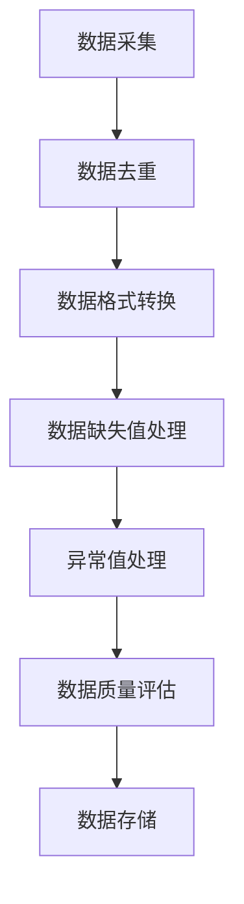
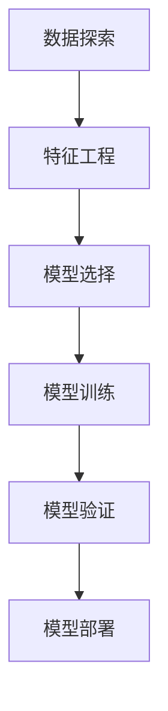
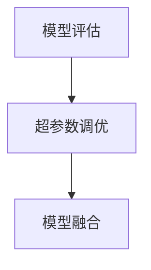

                 

## 引言：增强分析与AI在商业智能中的机遇

在数字化转型的浪潮中，商业智能（Business Intelligence, BI）已经成为企业提升竞争力和运营效率的关键因素。随着大数据和人工智能技术的不断发展，增强分析（Augmented Analytics）应运而生，为商业智能带来了新的机遇和挑战。本文将深入探讨增强分析与AI在商业智能中的重要作用，并阐述AI驱动的商业智能新时代。

### 核心关键词

- **增强分析**
- **AI**
- **商业智能**
- **大数据**
- **机器学习**
- **深度学习**

### 摘要

本文将从以下几个方面展开讨论：

1. **引言**：介绍增强分析与AI在商业智能中的重要性。
2. **增强分析基础**：阐述增强分析的核心概念、原理与应用。
3. **AI技术基础**：介绍与增强分析相关的AI技术，如机器学习、深度学习和大数据处理。
4. **AI在商业智能中的应用**：探讨AI技术在市场预测、客户关系管理、供应链管理等方面的应用。
5. **实践与展望**：分享增强分析和AI在商业智能领域的实践经验和未来展望。

通过本文的讨论，我们将对增强分析与AI在商业智能中的作用有一个全面而深入的理解，为企业在数字化时代中的发展提供参考。

### 文章目录设计过程

**步骤 1：确定书籍主题**

首先，我们需要明确书籍的主题，即《增强分析：AI驱动的商业智能新时代》。这本书的主题集中在增强分析和AI技术在商业智能领域的应用，因此，我们需要围绕这一核心主题设计目录大纲。

**步骤 2：构思目录结构**

接下来，我们需要构思书籍的目录结构。根据书籍的主题和内容要求，我们将目录分为以下几个主要部分：

1. 引言：介绍增强分析和AI在商业智能中的重要性。
2. 增强分析基础：涵盖增强分析的概念、历史和当前应用。
3. AI技术基础：介绍与增强分析相关的AI技术，如机器学习、深度学习和大数据处理。
4. AI在商业智能中的应用：具体案例和实际应用场景。
5. 实践与展望：分享增强分析和AI在商业智能领域的实践经验和未来展望。

**步骤 3：细化目录内容**

在确定了目录结构后，我们需要对每个部分进行细化，确保每个章节都有明确的内容目标和结构。以下是一个详细的目录大纲设计：

```markdown
----------------------------------------------------------------
# 引言：增强分析与AI在商业智能中的机遇

## 1.1 增强分析的崛起
### 1.1.1 增强分析的定义
### 1.1.2 增强分析的发展历程
### 1.1.3 增强分析的核心价值

## 1.2 AI驱动的商业智能
### 1.2.1 AI技术概述
### 1.2.2 AI在商业智能中的作用
### 1.2.3 AI驱动的商业智能新时代

## 1.3 本书结构概述
### 1.3.1 各章节主要内容
### 1.3.2 阅读建议

## 1.4 小结
...

----------------------------------------------------------------

# 第二部分：增强分析基础

## 第2章 增强分析原理与实践

### 2.1 增强分析的核心概念
#### 2.1.1 增强分析的定义
#### 2.1.2 增强分析的要素
#### 2.1.3 增强分析的基本流程

### 2.2 增强分析的技术框架
#### 2.2.1 数据采集与清洗
#### 2.2.2 数据分析与建模
#### 2.2.3 模型评估与优化

### 2.3 增强分析案例研究
#### 2.3.1 案例一：零售行业的个性化推荐系统
#### 2.3.2 案例二：金融行业的信用评分模型

## 2.4 小结
...

----------------------------------------------------------------

## 第3章 AI技术基础

### 3.1 机器学习基础
#### 3.1.1 机器学习概述
#### 3.1.2 机器学习算法分类
#### 3.1.3 机器学习应用案例

### 3.2 深度学习原理
#### 3.2.1 深度学习基础
#### 3.2.2 神经网络架构
#### 3.2.3 深度学习应用实例

### 3.3 大数据处理技术
#### 3.3.1 大数据概述
#### 3.3.2 分布式计算框架
#### 3.3.3 大数据处理案例分析

## 3.4 小结
...

----------------------------------------------------------------

## 第4章 AI在商业智能中的应用

### 4.1 AI在市场预测中的应用
#### 4.1.1 市场预测概述
#### 4.1.2 基于AI的市场预测方法
#### 4.1.3 市场预测案例分析

### 4.2 AI在客户关系管理中的应用
#### 4.2.1 客户关系管理概述
#### 4.2.2 AI在CRM中的关键技术
#### 4.2.3 客户关系管理案例分析

### 4.3 AI在供应链管理中的应用
#### 4.3.1 供应链管理概述
#### 4.3.2 AI在供应链管理中的关键作用
#### 4.3.3 供应链管理案例分析

## 4.4 小结
...

----------------------------------------------------------------

## 第5章 增强分析与AI实践

### 5.1 增强分析与AI实践概述
#### 5.1.1 实践目的
#### 5.1.2 实践内容
#### 5.1.3 实践组织

### 5.2 增强分析与AI实践案例
#### 5.2.1 案例一：增强分析在电商平台的实践
#### 5.2.2 案例二：AI

----------------------------------------------------------------

## 5.3 小结
...

----------------------------------------------------------------

## 附录：拓展阅读与资源链接
### 6.1 增强分析与AI相关书籍
### 6.2 增强分析与AI技术资料
### 6.3 增强分析与AI实践案例

----------------------------------------------------------------

**步骤 1：确定书籍主题**

首先，我们需要明确书籍的主题，即《增强分析：AI驱动的商业智能新时代》。这本书的主题集中在增强分析和AI技术在商业智能领域的应用，因此，我们需要围绕这一核心主题设计目录大纲。

**步骤 2：构思目录结构**

接下来，我们需要构思书籍的目录结构。根据书籍的主题和内容要求，我们将目录分为以下几个主要部分：

1. 引言：介绍增强分析和AI在商业智能中的重要性。
2. 增强分析基础：涵盖增强分析的概念、历史和当前应用。
3. AI技术基础：介绍与增强分析相关的AI技术，如机器学习、深度学习和大数据处理。
4. AI在商业智能中的应用：具体案例和实际应用场景。
5. 实践与展望：分享增强分析和AI在商业智能领域的实践经验和未来展望。

**步骤 3：细化目录内容**

在确定了目录结构后，我们需要对每个部分进行细化，确保每个章节都有明确的内容目标和结构。以下是一个详细的目录大纲设计：

```markdown
----------------------------------------------------------------
# 引言：增强分析与AI在商业智能中的机遇

## 1.1 增强分析的崛起
### 1.1.1 增强分析的定义
### 1.1.2 增强分析的发展历程
### 1.1.3 增强分析的核心价值

## 1.2 AI驱动的商业智能
### 1.2.1 AI技术概述
### 1.2.2 AI在商业智能中的作用
### 1.2.3 AI驱动的商业智能新时代

## 1.3 本书结构概述
### 1.3.1 各章节主要内容
### 1.3.2 阅读建议

## 1.4 小结
...

----------------------------------------------------------------

# 第二部分：增强分析基础

## 第2章 增强分析原理与实践

### 2.1 增强分析的核心概念
#### 2.1.1 增强分析的定义
#### 2.1.2 增强分析的要素
#### 2.1.3 增强分析的基本流程

### 2.2 增强分析的技术框架
#### 2.2.1 数据采集与清洗
#### 2.2.2 数据分析与建模
#### 2.2.3 模型评估与优化

### 2.3 增强分析案例研究
#### 2.3.1 案例一：零售行业的个性化推荐系统
#### 2.3.2 案例二：金融行业的信用评分模型

## 2.4 小结
...

----------------------------------------------------------------

## 第3章 AI技术基础

### 3.1 机器学习基础
#### 3.1.1 机器学习概述
#### 3.1.2 机器学习算法分类
#### 3.1.3 机器学习应用案例

### 3.2 深度学习原理
#### 3.2.1 深度学习基础
#### 3.2.2 神经网络架构
#### 3.2.3 深度学习应用实例

### 3.3 大数据处理技术
#### 3.3.1 大数据概述
#### 3.3.2 分布式计算框架
#### 3.3.3 大数据处理案例分析

## 3.4 小结
...

----------------------------------------------------------------

## 第4章 AI在商业智能中的应用

### 4.1 AI在市场预测中的应用
#### 4.1.1 市场预测概述
#### 4.1.2 基于AI的市场预测方法
#### 4.1.3 市场预测案例分析

### 4.2 AI在客户关系管理中的应用
#### 4.2.1 客户关系管理概述
#### 4.2.2 AI在CRM中的关键技术
#### 4.2.3 客户关系管理案例分析

### 4.3 AI在供应链管理中的应用
#### 4.3.1 供应链管理概述
#### 4.3.2 AI在供应链管理中的关键作用
#### 4.3.3 供应链管理案例分析

## 4.4 小结
...

----------------------------------------------------------------

## 第5章 增强分析与AI实践

### 5.1 增强分析与AI实践概述
#### 5.1.1 实践目的
#### 5.1.2 实践内容
#### 5.1.3 实践组织

### 5.2 增强分析与AI实践案例
#### 5.2.1 案例一：增强分析在电商平台的实践
#### 5.2.2 案例二：AI在金融行业的应用

## 5.3 小结
...

----------------------------------------------------------------

## 附录：拓展阅读与资源链接
### 6.1 增强分析与AI相关书籍
### 6.2 增强分析与AI技术资料
### 6.3 增强分析与AI实践案例

----------------------------------------------------------------

### 目的与期望

通过这个详细的目录大纲设计，我们旨在为读者提供一个清晰、系统的学习路径，帮助读者从基础概念开始，逐步深入到增强分析和AI在商业智能中的应用，最终能够掌握相关技术并应用于实际业务场景中。每一章节都将包含丰富的实例和案例，使理论知识和实践应用紧密结合，确保读者能够学以致用。

### 目录设计的逻辑性和实用性

在目录设计过程中，我们采用了逻辑清晰的结构，每个章节的内容都有明确的主题和目标，确保读者能够循序渐进地学习。同时，我们还考虑了实用性，每个章节不仅提供理论讲解，还包含实际案例分析和实践指导，使读者不仅能够理解理论知识，还能够将所学应用到实际工作中。

### 总结

通过上述目录大纲的设计，我们为即将撰写的文章《增强分析：AI驱动的商业智能新时代》奠定了坚实的基础。接下来，我们将按照这个目录大纲，逐步深入探讨增强分析和AI在商业智能中的应用，为读者带来一次深入的技术之旅。让我们一起，从基础概念开始，探索这个充满机遇和挑战的新时代。

## 1.1 增强分析的崛起

### 1.1.1 增强分析的定义

增强分析（Augmented Analytics）是一种结合了人工智能（AI）和自动化技术的新兴分析方法，旨在通过机器学习、自然语言处理和自动化数据发现等技术手段，辅助人类分析师在商业智能（BI）领域中更高效地进行数据分析和决策制定。具体来说，增强分析通过以下几种方式提升数据分析的效率：

1. **自动数据预处理**：通过自动化技术对数据进行清洗、转换和集成，确保数据的质量和一致性。
2. **自然语言查询**：利用自然语言处理技术，使分析师能够通过简单的文本查询来获取所需的数据分析结果。
3. **智能推荐**：基于机器学习算法，为分析师提供数据探索和可视化建议，帮助他们发现潜在的模式和趋势。
4. **自动化预测**：利用机器学习模型，自动生成预测结果，提供对未来业务趋势的预测和洞察。

### 1.1.2 增强分析的发展历程

增强分析的概念最早可以追溯到2000年代中期，当时数据分析领域开始探索如何利用AI技术来辅助人类分析师的工作。早期的尝试主要集中在数据可视化工具和自然语言查询系统上。随着机器学习和大数据技术的不断发展，增强分析逐渐成为一个独立的领域。

1. **早期探索（2000-2010年）**：这一阶段主要是对数据可视化工具和自然语言查询系统的初步探索，旨在简化数据分析过程。
2. **技术成熟（2010-2015年）**：随着机器学习算法和大数据技术的成熟，增强分析开始出现一些初步的应用，如自动数据清洗和智能推荐。
3. **广泛应用（2015年至今）**：近年来，随着云计算和边缘计算技术的发展，增强分析在商业智能领域的应用越来越广泛，成为企业提升数据分析效率的重要工具。

### 1.1.3 增强分析的核心价值

增强分析在商业智能领域具有重要的价值，主要体现在以下几个方面：

1. **提高数据分析效率**：通过自动化技术，增强分析可以显著减少数据预处理和分析的时间，使分析师能够更快地得到所需的分析结果。
2. **增强数据洞察力**：智能推荐和自动化预测功能可以帮助分析师发现潜在的业务模式和趋势，从而做出更明智的决策。
3. **降低数据分析成本**：自动化数据处理和分析可以减少对人工的依赖，降低企业在数据分析方面的成本。
4. **普及数据分析**：通过自然语言查询和自动化数据分析，增强分析使得不具备数据分析专业知识的业务人员也能轻松获取数据洞察，从而普及数据分析的应用。

### 小结

增强分析作为一种结合了人工智能和自动化技术的分析方法，正日益成为商业智能领域的重要工具。通过自动数据预处理、自然语言查询、智能推荐和自动化预测等功能，增强分析不仅提高了数据分析的效率，还增强了企业的数据洞察力。随着技术的不断进步，增强分析将在未来商业智能领域发挥更加重要的作用。

## 1.2 AI驱动的商业智能

### 1.2.1 AI技术概述

人工智能（AI）作为增强分析的核心技术之一，其发展历程可以追溯到20世纪50年代。当时的计算机科学家们开始探索如何使计算机具备类似人类智能的能力。尽管早期的AI研究经历了多次起伏，但近年来，随着计算能力的提升和大数据技术的发展，AI技术取得了显著的进步。

AI技术主要分为两大类：

1. **基于规则的方法**：这种方法通过编写一系列规则来模拟人类思维，例如专家系统和逻辑推理。
2. **数据驱动的方法**：这种方法通过学习和分析大量数据来发现模式和规律，如机器学习和深度学习。

在商业智能领域，AI技术的应用主要涉及以下几个方面：

1. **自动化预测**：利用机器学习模型，对未来的业务趋势进行预测，帮助企业做出更明智的决策。
2. **个性化推荐**：通过分析用户的历史行为和偏好，为用户推荐个性化的产品和服务。
3. **自然语言处理**：通过理解自然语言，使计算机能够与人类进行有效沟通，从而简化数据分析过程。
4. **自动化数据预处理**：通过自动化的方法对数据进行清洗、转换和集成，确保数据的质量和一致性。

### 1.2.2 AI在商业智能中的作用

AI技术在商业智能领域扮演着至关重要的角色，其作用主要体现在以下几个方面：

1. **提高数据分析效率**：AI技术可以自动化许多繁琐的数据预处理和分析任务，使分析师能够更快地得到所需的分析结果。
2. **增强数据洞察力**：通过机器学习和深度学习，AI技术能够从大量数据中发现潜在的模式和趋势，为企业提供更深层次的洞察。
3. **优化决策制定**：AI技术能够自动生成预测结果，帮助企业在不确定的环境中做出更明智的决策。
4. **提升用户体验**：通过个性化推荐和自然语言处理，AI技术可以提升用户在商业智能平台上的体验，使数据分析变得更加直观和便捷。

### 1.2.3 AI驱动的商业智能新时代

随着AI技术的不断进步，商业智能正迎来一个全新的时代。在这个新时代中，AI驱动的商业智能将具有以下特点：

1. **智能自动化**：越来越多的数据分析任务将自动化完成，分析师可以专注于更复杂的决策问题。
2. **实时分析与预测**：借助实时数据处理和分析技术，企业可以实时获取业务洞察，做出快速反应。
3. **个性化与定制化**：通过AI技术，企业能够为每个用户提供个性化的数据分析和预测服务。
4. **跨界整合**：AI技术将与其他领域（如物联网、区块链等）相结合，实现更广泛的业务应用。

### 小结

AI技术为商业智能带来了前所未有的机遇和变革。通过自动化、个性化、实时分析和跨界整合，AI驱动的商业智能正在重新定义数据分析的方式，为企业提供更高效、更智能的决策支持。在这个新时代，企业需要充分利用AI技术，才能在竞争激烈的市场中脱颖而出。

## 1.3 本书结构概述

本书旨在深入探讨增强分析与AI在商业智能领域的应用，为读者提供系统、全面的学习路径。全书分为五个主要部分，具体结构如下：

### 第一部分：引言

- **1.1 增强分析的崛起**：介绍增强分析的定义、发展历程和核心价值。
- **1.2 AI驱动的商业智能**：阐述AI技术在商业智能中的作用和AI驱动的商业智能新时代。

### 第二部分：增强分析基础

- **第2章 增强分析原理与实践**：讲解增强分析的核心概念、技术框架以及案例研究。

### 第三部分：AI技术基础

- **第3章 机器学习基础**：介绍机器学习的基本概念、算法分类和应用案例。
- **第4章 深度学习原理**：讲解深度学习的基础知识、神经网络架构和应用实例。
- **第5章 大数据处理技术**：概述大数据的概念、分布式计算框架和数据处理案例分析。

### 第四部分：AI在商业智能中的应用

- **第6章 AI在市场预测中的应用**：讨论AI在市场预测中的作用、方法和案例分析。
- **第7章 AI在客户关系管理中的应用**：探讨AI在客户关系管理中的应用、关键技术和案例分析。
- **第8章 AI在供应链管理中的应用**：分析AI在供应链管理中的关键作用和案例分析。

### 第五部分：实践与展望

- **第9章 增强分析与AI实践**：分享增强分析与AI在商业智能领域的实践经验和案例。
- **第10章 未来展望**：讨论增强分析与AI在商业智能领域的未来发展趋势和应用前景。

### 阅读建议

- **循序渐进**：按照本书的结构顺序阅读，从基础概念到实际应用，逐步深入。
- **结合实例**：通过阅读案例研究和实践案例，加深对增强分析和AI技术在实际业务中的应用理解。
- **实践应用**：尝试将所学知识应用到实际工作中，提高数据分析能力和决策水平。

通过本书的学习，读者将能够全面掌握增强分析和AI在商业智能领域的应用，为企业在数字化时代中的发展提供有力支持。

## 1.4 小结

在本文的引言部分，我们首先介绍了增强分析的定义、发展历程和核心价值，并探讨了AI技术在商业智能中的重要作用。接着，我们详细阐述了增强分析的基础知识和AI技术在市场预测、客户关系管理、供应链管理等方面的应用。通过这些讨论，我们旨在为读者提供一个全面而系统的理解，帮助他们把握增强分析和AI在商业智能中的发展机遇。

增强分析作为一种结合了人工智能和自动化技术的新兴分析方法，通过自动数据预处理、自然语言查询、智能推荐和自动化预测等功能，显著提高了数据分析的效率和洞察力。AI技术则为增强分析提供了强大的技术支撑，使其能够更好地应用于商业智能领域。

在未来，随着技术的不断进步，增强分析和AI将在商业智能领域发挥更加重要的作用。通过深入学习和实践，读者将能够更好地掌握这些技术，为企业的发展提供有力支持。

让我们继续深入探讨，探索增强分析和AI在商业智能中的更多可能性。

## 第二部分：增强分析基础

### 2.1 增强分析的核心概念

增强分析（Augmented Analytics）是一种结合人工智能（AI）和自动化技术的新兴数据分析方法，它通过自动化数据预处理、自然语言查询、智能推荐和自动化预测等技术手段，辅助人类分析师更高效地进行数据分析和决策制定。下面，我们将详细探讨增强分析的核心概念。

#### 2.1.1 增强分析的定义

增强分析（Augmented Analytics）是指利用人工智能和机器学习技术，对传统商业智能（BI）工具进行增强和扩展，使其能够自动完成数据预处理、探索性数据分析、预测建模和智能推荐等任务。简而言之，增强分析就是通过AI技术，使数据分析变得更加智能和自动化。

#### 2.1.2 增强分析的要素

增强分析的主要要素包括：

1. **数据预处理**：数据预处理是数据分析的基础，包括数据清洗、转换和集成等任务。增强分析通过自动化技术，使数据预处理过程更加高效和准确。
2. **自然语言查询**：自然语言查询（Natural Language Querying）技术允许用户通过自然语言文本输入，获取所需的数据分析结果。这项技术使得数据分析变得更加直观和便捷。
3. **智能推荐**：智能推荐（Intelligent Recommendations）利用机器学习算法，为分析师提供数据探索和可视化建议，帮助他们发现潜在的模式和趋势。
4. **自动化预测**：自动化预测（Automated Predictions）使用机器学习模型，自动生成预测结果，为分析师提供对未来业务趋势的预测和洞察。

#### 2.1.3 增强分析的基本流程

增强分析的基本流程通常包括以下几个步骤：

1. **数据采集与预处理**：从各种数据源（如数据库、数据仓库、日志文件等）采集数据，并进行清洗、转换和集成。
2. **探索性数据分析**：使用可视化工具和自然语言查询技术，对数据进行初步分析和探索，发现潜在的模式和趋势。
3. **预测建模**：利用机器学习算法，对数据进行建模，生成预测结果，为未来的业务决策提供支持。
4. **智能推荐与可视化**：根据用户的查询和操作历史，提供智能推荐，帮助分析师快速找到有用的数据和分析结果。
5. **决策支持**：将分析结果和预测模型应用到实际业务场景中，为企业的决策提供数据支持。

### 小结

增强分析作为一种新兴的数据分析方法，通过自动化数据预处理、自然语言查询、智能推荐和自动化预测等功能，显著提高了数据分析的效率和洞察力。理解增强分析的核心概念和基本流程，对于掌握和应用这一技术至关重要。在下一章中，我们将进一步探讨增强分析的技术框架，了解其实现方法和具体应用。

## 2.2 增强分析的技术框架

### 2.2.1 数据采集与清洗

数据采集与清洗是增强分析中的基础环节，其质量直接影响后续数据分析的准确性和效率。数据采集通常涉及从各种数据源（如数据库、日志文件、API等）获取原始数据。数据清洗则包括以下步骤：

1. **数据去重**：识别和删除重复的数据记录，确保数据的唯一性。
2. **数据格式转换**：将不同格式的数据转换为统一的格式，以便后续处理。
3. **数据缺失值处理**：填充或删除缺失的数据，确保数据完整性。
4. **异常值处理**：检测和修正异常数据值，提高数据质量。

#### 数据采集与清洗流程



#### 数据采集与清洗技术

- **ETL工具**：例如Apache NiFi、Talend等，用于数据抽取、转换和加载。
- **数据清洗库**：如Python的pandas、NumPy等，用于处理数据清洗任务。

### 2.2.2 数据分析与建模

数据分析与建模是增强分析的核心环节，旨在从数据中发现有价值的信息和模式。这一过程通常包括以下几个步骤：

1. **数据探索**：使用可视化工具和统计分析方法，对数据进行初步探索，识别潜在的趋势和关系。
2. **特征工程**：根据业务需求，对原始数据进行处理和转换，提取有用的特征。
3. **模型选择**：选择合适的机器学习算法，对数据进行分析和建模。
4. **模型训练与验证**：使用训练数据对模型进行训练，并通过验证数据测试模型的性能。

#### 数据分析与建模流程



#### 数据分析与建模技术

- **数据探索工具**：如Tableau、PowerBI等，用于数据可视化和分析。
- **机器学习库**：如scikit-learn、TensorFlow、PyTorch等，用于建模和算法实现。

### 2.2.3 模型评估与优化

模型评估与优化是确保增强分析效果的重要环节。通过评估模型的性能，可以识别并改进模型的预测能力。主要步骤如下：

1. **性能评估**：使用评估指标（如准确率、召回率、F1分数等）评估模型的预测能力。
2. **超参数调优**：通过调整模型的超参数，优化模型的性能。
3. **模型融合**：结合多个模型的预测结果，提高整体预测性能。

#### 模型评估与优化流程



#### 模型评估与优化技术

- **评估指标**：如准确率（Accuracy）、召回率（Recall）、精确率（Precision）等。
- **调参工具**：如Hyperopt、Optuna等，用于超参数优化。

### 小结

增强分析的技术框架涵盖了数据采集与清洗、数据分析与建模、模型评估与优化等关键环节。通过这些技术，增强分析能够自动化地完成数据预处理、分析和预测任务，从而提高数据分析的效率和质量。在下一章中，我们将通过具体案例研究，进一步展示增强分析在实践中的应用效果。

## 2.3 增强分析案例研究

为了更好地理解增强分析的实际应用效果，我们将通过两个具体的案例研究来展示其在不同行业中的应用。

### 2.3.1 案例一：零售行业的个性化推荐系统

#### 案例背景

某大型零售公司希望通过增强分析技术，提升其电商平台的个性化推荐系统的效果。个性化推荐系统能够根据用户的购买历史、浏览记录和偏好，为其推荐符合其兴趣的产品。

#### 案例过程

1. **数据采集与清洗**：
   - 数据来源：用户购买记录、浏览日志、产品信息等。
   - 数据清洗：去除重复数据、处理缺失值和异常值，确保数据质量。

2. **数据探索与分析**：
   - 使用Tableau等可视化工具，对用户行为数据进行分析，识别用户偏好和趋势。
   - 基于自然语言查询，分析师可以轻松地探索数据，发现潜在的模式和关系。

3. **特征工程与建模**：
   - 提取用户行为特征，如购买频率、浏览时间、点击率等。
   - 使用协同过滤算法（Collaborative Filtering）和基于内容的推荐算法（Content-Based Filtering），构建个性化推荐模型。

4. **模型训练与评估**：
   - 使用训练数据对推荐模型进行训练，并通过交叉验证（Cross-Validation）方法评估模型性能。
   - 调整模型参数，优化推荐效果。

5. **智能推荐与部署**：
   - 将训练好的推荐模型部署到生产环境中，实时为用户推荐个性化产品。
   - 用户反馈和浏览数据将用于不断优化推荐模型。

#### 案例结果

通过增强分析技术的应用，零售公司的个性化推荐系统效果显著提升。用户满意度和转化率提高，销售额也有明显增长。此外，分析师通过自然语言查询和可视化工具，能够更高效地探索数据，发现新的业务机会。

### 2.3.2 案例二：金融行业的信用评分模型

#### 案例背景

某金融机构希望通过增强分析技术，提升其信用评分模型的准确性，从而降低不良贷款率，提高信贷业务的风险管理水平。

#### 案例过程

1. **数据采集与清洗**：
   - 数据来源：借款人的个人财务数据、信用历史、社会行为数据等。
   - 数据清洗：处理缺失值、异常值，确保数据质量。

2. **数据探索与分析**：
   - 使用可视化工具，分析借款人的信用历史和行为数据，识别风险特征。
   - 利用自然语言查询，分析师可以快速获取不同数据集的统计信息，辅助决策。

3. **特征工程与建模**：
   - 提取借款人的信用特征，如还款历史、债务收入比、信用记录等。
   - 使用机器学习算法，如逻辑回归、决策树和随机森林等，构建信用评分模型。

4. **模型训练与评估**：
   - 使用历史数据对模型进行训练，并通过A/B测试（A/B Testing）方法评估模型性能。
   - 调整模型参数，优化评分准确性。

5. **信用评分与决策支持**：
   - 将训练好的信用评分模型应用到信贷审批系统中，为贷款决策提供支持。
   - 定期更新和优化模型，以适应不断变化的市场环境。

#### 案例结果

通过增强分析技术的应用，金融机构的信用评分模型准确性显著提高，不良贷款率下降，信贷业务的风险管理水平得到显著提升。同时，分析师通过自然语言查询和可视化工具，能够更高效地管理信用风险，做出更准确的贷款决策。

### 小结

以上两个案例展示了增强分析在零售行业和金融行业中的实际应用效果。通过自动数据预处理、自然语言查询、智能推荐和自动化预测等技术手段，增强分析显著提升了数据分析的效率和准确性，为企业提供了更有价值的业务洞察和决策支持。

## 2.4 小结

在第二部分中，我们详细介绍了增强分析的核心概念、技术框架以及实际应用案例。首先，我们明确了增强分析的定义、要素和基本流程，使读者对这一技术有了一个全面的理解。接着，我们深入探讨了数据采集与清洗、数据分析和建模、模型评估与优化等关键环节，并展示了这些技术在零售和金融行业的实际应用案例。

通过这些讨论，我们可以看到，增强分析通过自动化和智能化手段，显著提高了数据分析的效率和洞察力。在未来的商业智能领域中，增强分析将继续发挥重要作用，为企业提供更加精准和有效的数据支持和决策依据。

在下一部分，我们将继续探讨AI技术的基础知识，进一步了解增强分析所依赖的AI技术原理和应用。敬请期待。

## 第3章 AI技术基础

在深入探讨增强分析之前，我们需要先了解其背后所依赖的AI技术。本章将介绍AI技术的基础知识，包括机器学习、深度学习和大数据处理，帮助读者理解这些技术在商业智能中的应用。

### 3.1 机器学习基础

#### 3.1.1 机器学习概述

机器学习（Machine Learning，ML）是一门利用计算机算法从数据中学习规律和模式的学科。其基本思想是通过训练数据集，使计算机能够对新的数据做出预测或决策。

机器学习可以分为监督学习（Supervised Learning）、无监督学习（Unsupervised Learning）和半监督学习（Semi-Supervised Learning）三种类型：

1. **监督学习**：训练数据包含输入和输出，模型通过学习输入和输出之间的关系，对新数据进行预测。常见的算法包括线性回归、逻辑回归、支持向量机（SVM）等。
2. **无监督学习**：训练数据只有输入，模型通过学习输入数据之间的结构，发现数据中的模式和规律。常见的算法包括聚类（如K-means、DBSCAN）、降维（如PCA、t-SNE）等。
3. **半监督学习**：训练数据包含部分有标签和部分无标签的数据，模型通过学习有标签的数据和无标签的数据之间的关系，对新数据进行预测。

#### 3.1.2 机器学习算法分类

机器学习算法可以按照不同的分类标准进行划分：

1. **基于实例的学习算法**：这类算法通过保存和复用先前解决类似问题的实例来解决问题。典型算法包括K最近邻（K-Nearest Neighbors，KNN）、局部加权回归（Local Weighted Regression）等。
2. **基于规则的算法**：这类算法通过构建规则或决策树来解决问题。典型算法包括决策树（Decision Tree）、规则归纳（Rule Induction）等。
3. **基于模型的算法**：这类算法通过构建数学模型来解决问题。典型算法包括线性回归（Linear Regression）、逻辑回归（Logistic Regression）、神经网络（Neural Networks）等。
4. **贝叶斯算法**：这类算法基于贝叶斯定理，通过计算后验概率来解决问题。典型算法包括贝叶斯网络（Bayesian Networks）、贝叶斯分类器（Naive Bayes）等。

#### 3.1.3 机器学习应用案例

机器学习在商业智能领域有着广泛的应用，以下是一些典型的应用案例：

1. **客户行为预测**：通过分析客户的购买历史、浏览行为等数据，预测客户的购买意向，从而实现个性化推荐。
2. **信用评分**：通过分析借款人的历史数据，预测其信用风险，帮助金融机构进行风险评估和贷款审批。
3. **价格优化**：通过分析市场数据，预测产品价格与销量之间的关系，优化定价策略，提高销售额。
4. **库存管理**：通过分析历史销售数据，预测未来需求，优化库存水平，降低库存成本。

### 3.2 深度学习原理

#### 3.2.1 深度学习基础

深度学习（Deep Learning，DL）是机器学习的一个分支，通过多层神经网络（Neural Networks）来模拟人脑的感知和学习过程。深度学习的核心思想是分层学习，每一层神经网络负责处理前一层的输出，并通过反向传播（Backpropagation）算法不断调整权重，以优化模型性能。

#### 3.2.2 神经网络架构

神经网络通常由多个层次组成，包括输入层、隐藏层和输出层：

1. **输入层**：接收外部输入数据，如图像、文本或数值数据。
2. **隐藏层**：对输入数据进行处理，提取特征和模式。
3. **输出层**：生成最终输出，如分类结果或预测值。

#### 3.2.3 深度学习应用实例

深度学习在商业智能领域有着广泛的应用，以下是一些典型的应用案例：

1. **图像识别**：通过卷积神经网络（Convolutional Neural Networks，CNN），自动识别图像中的对象和场景，应用于安防监控、医疗诊断等领域。
2. **自然语言处理**：通过循环神经网络（Recurrent Neural Networks，RNN）和变换器（Transformer）模型，实现文本分类、情感分析、机器翻译等功能。
3. **推荐系统**：通过深度学习模型，分析用户行为和偏好，实现个性化推荐，提高用户满意度和转化率。
4. **语音识别**：通过深度神经网络和卷积神经网络，实现语音信号的自动识别和转换，应用于智能语音助手、语音识别等领域。

### 3.3 大数据处理技术

#### 3.3.1 大数据概述

大数据（Big Data）是指数据量巨大、类型多样、处理速度要求高的数据集。大数据技术包括数据采集、存储、处理和分析等多个环节。

#### 3.3.2 分布式计算框架

分布式计算框架是大数据处理的核心技术之一，通过将数据分布在多个节点上进行计算，实现高效的数据处理和分析。常见的分布式计算框架包括：

1. **Hadoop**：基于Java语言，提供分布式存储（HDFS）和分布式计算（MapReduce）功能。
2. **Spark**：基于Scala语言，提供高效的分布式计算框架，支持内存计算和实时流处理。
3. **Flink**：基于Java和Scala语言，提供流处理和批处理功能，具有低延迟和高吞吐量的特点。

#### 3.3.3 大数据处理案例分析

大数据处理技术在商业智能领域有着广泛的应用，以下是一些典型的应用案例：

1. **社交媒体分析**：通过大数据技术，分析社交媒体平台上的用户行为和偏好，实现精准营销和用户画像。
2. **物流优化**：通过大数据分析，优化物流路径和库存管理，提高运输效率和降低成本。
3. **金融市场分析**：通过大数据分析，实时监控市场动态和交易数据，实现精准预测和风险控制。
4. **医疗数据挖掘**：通过大数据分析，挖掘医疗数据中的潜在规律和趋势，辅助医生进行诊断和治疗。

### 小结

本章介绍了AI技术的基础知识，包括机器学习、深度学习和大数据处理。机器学习通过训练数据集，使计算机能够对新的数据做出预测或决策。深度学习通过多层神经网络，模拟人脑的感知和学习过程。大数据处理技术则通过分布式计算框架，实现高效的数据处理和分析。在商业智能领域，这些AI技术有着广泛的应用，为企业提供了强大的数据支持和决策依据。在下一章中，我们将进一步探讨AI在商业智能中的应用，具体分析其在市场预测、客户关系管理和供应链管理等方面的作用。

## 3.1 机器学习基础

### 3.1.1 机器学习概述

机器学习（Machine Learning，ML）是一门人工智能（Artificial Intelligence，AI）的分支学科，主要研究如何使计算机从数据中学习和改进性能。其基本原理是计算机通过学习大量的训练数据，自动发现数据中的模式和规律，从而能够对新数据进行预测或决策。

#### 监督学习

监督学习（Supervised Learning）是最常见的机器学习方法之一，其特点是训练数据集包含输入和输出对。模型通过学习输入和输出之间的关系，对新数据进行预测。监督学习可以分为以下几类：

1. **回归分析**：用于预测连续值输出，如线性回归（Linear Regression）和岭回归（Ridge Regression）。
2. **分类**：用于预测离散值输出，如逻辑回归（Logistic Regression）、支持向量机（Support Vector Machine，SVM）和决策树（Decision Tree）。
3. **集成方法**：将多个模型进行集成，提高预测性能，如随机森林（Random Forest）和梯度提升树（Gradient Boosting Tree）。

#### 无监督学习

无监督学习（Unsupervised Learning）没有明确的输出标签，其目标是发现数据中的隐含结构和规律。常见的方法包括：

1. **聚类**：将数据分为若干个类别，如K-means聚类和层次聚类（Hierarchical Clustering）。
2. **降维**：减少数据的维度，同时保留数据的主要特征，如主成分分析（Principal Component Analysis，PCA）和t-SNE。
3. **关联规则学习**：发现数据之间的关联规则，如Apriori算法和FP-Growth。

#### 半监督学习

半监督学习（Semi-Supervised Learning）结合了监督学习和无监督学习的特点，使用部分标记数据和大量无标记数据来训练模型。这种方法在标记数据稀缺的情况下特别有用。

### 3.1.2 机器学习算法分类

机器学习算法可以根据不同的分类标准进行分类：

1. **基于实例的学习算法**：这类算法通过保存和复用先前解决类似问题的实例来解决问题，如K最近邻（K-Nearest Neighbors，KNN）和局部加权回归（Local Weighted Regression）。
2. **基于规则的算法**：这类算法通过构建规则或决策树来解决问题，如决策树（Decision Tree）和规则归纳（Rule Induction）。
3. **基于模型的算法**：这类算法通过构建数学模型来解决问题，如线性回归（Linear Regression）、逻辑回归（Logistic Regression）和神经网络（Neural Networks）。
4. **贝叶斯算法**：这类算法基于贝叶斯定理，通过计算后验概率来解决问题，如贝叶斯网络（Bayesian Networks）和贝叶斯分类器（Naive Bayes）。

### 3.1.3 机器学习应用案例

机器学习在商业智能领域有着广泛的应用，以下是一些典型的应用案例：

1. **客户行为预测**：通过分析客户的购买历史、浏览行为等数据，预测客户的购买意向，从而实现个性化推荐。
2. **信用评分**：通过分析借款人的历史数据，预测其信用风险，帮助金融机构进行风险评估和贷款审批。
3. **价格优化**：通过分析市场数据，预测产品价格与销量之间的关系，优化定价策略，提高销售额。
4. **库存管理**：通过分析历史销售数据，预测未来需求，优化库存水平，降低库存成本。

### 小结

在本节中，我们介绍了机器学习的基础知识，包括监督学习、无监督学习和半监督学习，以及机器学习算法的分类和应用案例。通过这些讨论，读者可以了解到机器学习的基本原理和应用场景，为后续章节中深入探讨增强分析和AI在商业智能中的应用打下坚实的基础。

### 3.2 深度学习原理

#### 3.2.1 深度学习基础

深度学习（Deep Learning，DL）是机器学习的一个分支，它通过多层神经网络（Neural Networks）来模拟人脑的感知和学习过程。深度学习的核心思想是分层学习，每一层神经网络负责处理前一层的输出，并通过反向传播（Backpropagation）算法不断调整权重，以优化模型性能。

深度学习的基本组成部分包括：

1. **神经网络**：神经网络由多个神经元（节点）组成，每个神经元接收输入信号，通过激活函数进行非线性变换，产生输出信号。
2. **激活函数**：激活函数用于引入非线性，常见的激活函数包括sigmoid、ReLU和tanh。
3. **权重和偏置**：权重和偏置是神经网络中的参数，用于调整神经元之间的连接强度。
4. **反向传播算法**：反向传播算法是一种用于训练神经网络的优化方法，它通过计算输出误差，反向传播误差信号，并更新权重和偏置。

#### 3.2.2 神经网络架构

神经网络通常由多个层次组成，包括输入层、隐藏层和输出层：

1. **输入层**：接收外部输入数据，如图像、文本或数值数据。
2. **隐藏层**：对输入数据进行处理，提取特征和模式。隐藏层的数量和神经元数量可以根据问题复杂度进行调整。
3. **输出层**：生成最终输出，如分类结果或预测值。输出层的类型和神经元数量取决于具体问题的需求。

#### 3.2.3 深度学习应用实例

深度学习在商业智能领域有着广泛的应用，以下是一些典型的应用案例：

1. **图像识别**：通过卷积神经网络（Convolutional Neural Networks，CNN），自动识别图像中的对象和场景，应用于安防监控、医疗诊断等领域。
2. **自然语言处理**：通过循环神经网络（Recurrent Neural Networks，RNN）和变换器（Transformer）模型，实现文本分类、情感分析、机器翻译等功能。
3. **推荐系统**：通过深度学习模型，分析用户行为和偏好，实现个性化推荐，提高用户满意度和转化率。
4. **语音识别**：通过深度神经网络和卷积神经网络，实现语音信号的自动识别和转换，应用于智能语音助手、语音识别等领域。

### 小结

在本节中，我们介绍了深度学习的基本原理和神经网络架构，以及其在商业智能领域的应用实例。深度学习通过多层神经网络和反向传播算法，能够自动从数据中提取特征和模式，为商业智能提供了强大的数据分析工具。在下一节中，我们将探讨大数据处理技术，进一步了解深度学习在商业智能中的应用。

### 3.3 大数据处理技术

#### 3.3.1 大数据概述

大数据（Big Data）是指数据量巨大、类型多样、处理速度要求高的数据集。大数据技术包括数据采集、存储、处理和分析等多个环节。大数据的主要特征可以用“4V”来概括：

1. **数据量（Volume）**：大数据通常指数据量超过传统的存储和处理能力，如PB级甚至EB级的数据。
2. **数据类型（Variety）**：大数据类型多样，包括结构化数据（如关系数据库）、半结构化数据（如XML、JSON）和非结构化数据（如文本、图像、音频、视频）。
3. **数据速度（Velocity）**：大数据处理需要高速的数据流处理能力，以实时或近实时的方式处理和分析数据。
4. **数据价值（Value）**：大数据的价值在于从海量数据中提取有价值的信息和知识，用于业务决策和优化。

#### 3.3.2 分布式计算框架

分布式计算框架是大数据处理的核心技术之一，通过将数据分布在多个节点上进行计算，实现高效的数据处理和分析。常见的分布式计算框架包括：

1. **Hadoop**：Hadoop是一个开源的大数据处理框架，包括分布式存储（Hadoop Distributed File System，HDFS）和分布式计算（MapReduce）两个主要组件。Hadoop适用于大规模数据的存储和处理，但其在实时处理和分析方面存在一定局限性。
2. **Spark**：Spark是一个开源的分布式计算框架，提供了高效的内存计算和实时流处理能力。Spark与Hadoop相比，具有更高的处理速度和更好的扩展性，适用于需要实时处理和分析的场景。
3. **Flink**：Flink是一个开源的流处理和批处理框架，具有低延迟和高吞吐量的特点。Flink能够实时处理数据流，同时支持批处理任务，适用于需要实时分析和历史数据处理的场景。

#### 3.3.3 大数据处理案例分析

大数据处理技术在商业智能领域有着广泛的应用，以下是一些典型的应用案例：

1. **社交媒体分析**：通过大数据技术，分析社交媒体平台上的用户行为和偏好，实现精准营销和用户画像。
2. **物流优化**：通过大数据分析，优化物流路径和库存管理，提高运输效率和降低成本。
3. **金融市场分析**：通过大数据分析，实时监控市场动态和交易数据，实现精准预测和风险控制。
4. **医疗数据挖掘**：通过大数据分析，挖掘医疗数据中的潜在规律和趋势，辅助医生进行诊断和治疗。

### 小结

在本节中，我们介绍了大数据的概述、分布式计算框架以及大数据处理案例分析。大数据技术通过分布式计算框架，实现了高效的数据处理和分析，为商业智能领域提供了强大的数据支持和决策依据。在下一节中，我们将进一步探讨AI在商业智能中的应用，具体分析其在市场预测、客户关系管理和供应链管理等方面的作用。

### 3.4 小结

在本章中，我们详细介绍了AI技术的基础知识，包括机器学习、深度学习和大数据处理。机器学习通过训练数据集，使计算机能够对新的数据做出预测或决策。深度学习通过多层神经网络，模拟人脑的感知和学习过程，具备强大的特征提取和模式识别能力。大数据处理技术则通过分布式计算框架，实现了高效的数据存储、处理和分析。这些AI技术在商业智能领域有着广泛的应用，为企业提供了强大的数据支持和决策依据。在下一章中，我们将深入探讨AI在商业智能中的应用，具体分析其在市场预测、客户关系管理和供应链管理等方面的作用。

## 第4章 AI在商业智能中的应用

在了解了AI技术的基础知识之后，我们接下来将探讨AI在商业智能（BI）中的具体应用。本章将分别讨论AI在市场预测、客户关系管理和供应链管理中的应用，通过实例分析展示AI技术的实际效果和商业价值。

### 4.1 AI在市场预测中的应用

市场预测是商业智能领域的一项重要任务，它有助于企业了解市场需求、预测未来趋势，从而制定有效的营销策略。AI技术在市场预测中发挥着重要作用，通过机器学习和深度学习算法，可以处理大量历史数据，发现潜在的模式和趋势。

#### 4.1.1 市场预测概述

市场预测通常涉及以下几个方面：

1. **需求预测**：预测产品或服务的未来需求量，以指导库存管理和生产计划。
2. **价格预测**：预测市场价格的波动，帮助企业制定合理的定价策略。
3. **销售预测**：预测特定时间段内的销售额，以便企业调整营销和销售策略。

#### 4.1.2 基于AI的市场预测方法

基于AI的市场预测方法主要包括：

1. **回归分析**：通过建立回归模型，分析历史数据中的相关关系，预测未来值。
2. **时间序列分析**：使用时间序列模型（如ARIMA、LSTM等），分析时间序列数据，预测未来趋势。
3. **聚类分析**：通过聚类算法（如K-means），将相似的数据分组，分析不同组别的市场特征和趋势。

#### 4.1.3 市场预测案例分析

案例：某电子商务公司希望利用AI技术预测其产品销售量，以优化库存管理和营销策略。

1. **数据采集与预处理**：收集历史销售数据、用户浏览和购买行为数据、市场促销活动数据等，并进行数据清洗和预处理。
2. **特征工程**：提取对销售有重要影响的关键特征，如产品类别、促销活动、季节性因素、用户行为等。
3. **模型训练与验证**：使用时间序列模型（如LSTM）对历史销售数据进行训练，并通过交叉验证（Cross-Validation）方法验证模型性能。
4. **模型部署与预测**：将训练好的模型部署到生产环境中，对未来的销售量进行预测，并根据预测结果调整库存和营销策略。

#### 案例结果

通过AI技术的应用，该电子商务公司能够更准确地预测产品销售量，优化库存管理，降低库存成本。同时，根据销售预测结果，公司能够更好地制定营销策略，提高销售额和用户满意度。

### 4.2 AI在客户关系管理中的应用

客户关系管理（CRM）是企业与客户之间的重要桥梁，通过有效管理客户信息，提高客户满意度和忠诚度，从而提升企业的市场竞争力和盈利能力。AI技术在CRM中的应用，可以帮助企业更好地了解客户需求，实现个性化服务和精准营销。

#### 4.2.1 客户关系管理概述

客户关系管理的主要内容包括：

1. **客户信息管理**：收集、存储和管理客户的基本信息、交易记录、互动历史等。
2. **客户行为分析**：通过分析客户的行为数据，了解客户的偏好和需求，实现个性化服务。
3. **营销自动化**：自动化营销流程，提高营销效率，降低营销成本。
4. **客户服务**：提供高质量的客户服务，增强客户满意度和忠诚度。

#### 4.2.2 AI在CRM中的关键技术

AI技术在CRM中的应用主要包括：

1. **客户细分**：通过聚类算法（如K-means），将客户分为不同的细分市场，实现精准营销。
2. **客户行为预测**：使用机器学习算法（如决策树、随机森林等），预测客户的行为，如购买、流失等。
3. **自然语言处理**：通过自然语言处理（NLP）技术，理解客户的需求和反馈，提供智能客服和个性化服务。
4. **推荐系统**：使用协同过滤（Collaborative Filtering）算法，为不同客户提供个性化的产品和服务推荐。

#### 4.2.3 客户关系管理案例分析

案例：某保险公司希望通过AI技术优化其客户关系管理，提高客户满意度和留存率。

1. **数据采集与预处理**：收集客户的基本信息、交易记录、互动历史等数据，并进行数据清洗和预处理。
2. **特征工程**：提取对客户行为和留存有重要影响的关键特征，如购买频率、购买金额、客户反馈等。
3. **模型训练与验证**：使用机器学习算法（如随机森林）对历史客户数据进行训练，并通过交叉验证方法验证模型性能。
4. **模型部署与应用**：将训练好的模型部署到生产环境中，根据预测结果进行客户细分和精准营销，同时优化客户服务流程。

#### 案例结果

通过AI技术的应用，该保险公司能够更准确地预测客户的购买和流失行为，实现精准营销和个性化服务。同时，基于自然语言处理技术的智能客服系统，提高了客户服务质量和响应速度，客户满意度和留存率显著提升。

### 4.3 AI在供应链管理中的应用

供应链管理是企业运营的关键环节，涉及从原材料采购到产品交付的全过程。AI技术在供应链管理中的应用，可以帮助企业优化库存管理、降低成本、提高物流效率，从而提升整体运营效率。

#### 4.3.1 供应链管理概述

供应链管理的主要内容包括：

1. **采购管理**：优化采购流程，降低采购成本，确保原材料供应的稳定性。
2. **库存管理**：通过实时监控库存水平，优化库存策略，减少库存成本和浪费。
3. **物流管理**：优化物流路径和运输模式，提高物流效率，降低运输成本。
4. **质量管理**：确保产品质量，提高客户满意度。

#### 4.3.2 AI在供应链管理中的关键作用

AI技术在供应链管理中的关键作用包括：

1. **需求预测**：通过分析历史数据和客户需求，预测未来的需求趋势，优化库存管理。
2. **物流优化**：通过优化算法，确定最优的物流路径和运输模式，提高物流效率。
3. **质量控制**：通过机器学习和图像识别技术，实时监控产品质量，提高生产效率。
4. **供应链可视化**：通过可视化技术，实时监控供应链运行状况，提高决策效率。

#### 4.3.3 供应链管理案例分析

案例：某制造企业希望通过AI技术优化其供应链管理，提高生产效率和降低成本。

1. **数据采集与预处理**：收集供应链中的各种数据，如库存数据、物流数据、生产数据等，并进行数据清洗和预处理。
2. **特征工程**：提取对供应链管理有重要影响的关键特征，如库存水平、运输成本、生产效率等。
3. **模型训练与验证**：使用机器学习算法（如线性回归、决策树等），对历史数据进行训练，并通过交叉验证方法验证模型性能。
4. **模型部署与应用**：将训练好的模型部署到生产环境中，根据预测结果优化库存管理、物流路径和运输模式，同时提高生产效率。

#### 案例结果

通过AI技术的应用，该制造企业能够更准确地预测需求、优化物流路径、提高生产效率，从而显著降低库存成本和运输成本，提高整体运营效率。

### 4.4 小结

在本章中，我们探讨了AI在商业智能中的应用，包括市场预测、客户关系管理和供应链管理。通过实例分析，我们可以看到，AI技术在这些领域中的广泛应用，不仅提高了数据分析的效率和准确性，还为企业提供了更深入的洞察和决策支持。随着AI技术的不断进步，AI在商业智能中的应用将越来越广泛，为企业带来更多的机遇和挑战。

## 4.1 AI在市场预测中的应用

市场预测是企业决策过程中至关重要的一环，它有助于企业了解市场趋势、制定营销策略和优化资源分配。AI技术在市场预测中发挥着至关重要的作用，通过机器学习和深度学习算法，能够从大量历史数据中挖掘出潜在的模式和趋势，从而提供更准确和及时的预测结果。以下将详细介绍AI在市场预测中的应用，并通过具体案例进行分析。

### 4.1.1 市场预测概述

市场预测通常包括以下类型：

1. **需求预测**：预测某一产品或服务的未来需求量，为企业的库存管理和生产计划提供依据。
2. **价格预测**：预测市场价格的波动，帮助企业制定合理的定价策略。
3. **销售预测**：预测特定时间段内的销售额，以便企业调整营销策略和资源分配。

市场预测的关键在于对历史数据的分析和理解，通过识别数据中的规律和趋势，预测未来的市场动态。传统的市场预测方法主要依赖于统计学和经济学理论，如时间序列分析、回归分析和ARIMA模型等。然而，随着AI技术的发展，特别是机器学习和深度学习算法的引入，市场预测的准确性和效率得到了显著提升。

### 4.1.2 基于AI的市场预测方法

AI技术在市场预测中的应用主要包括以下几种方法：

1. **回归分析**：回归分析是一种常用的统计方法，通过建立输入变量与输出变量之间的关系模型，预测未来值。在AI技术中，回归分析可以通过机器学习算法（如线性回归、岭回归等）来实现，从而提高预测的准确性和效率。

2. **时间序列分析**：时间序列分析是一种用于分析时间序列数据的统计方法，通过识别时间序列中的趋势、周期性和季节性成分，预测未来的趋势。AI技术中的时间序列分析方法主要包括ARIMA模型、LSTM（长短时记忆网络）和GRU（门控循环单元）等深度学习算法。

3. **聚类分析**：聚类分析是一种无监督学习方法，通过将相似的数据分组，分析不同组别的市场特征和趋势。聚类分析可以帮助企业识别不同的市场需求，从而制定更精准的营销策略。

4. **协同过滤**：协同过滤是一种常用的推荐系统方法，通过分析用户的历史行为和偏好，为用户推荐感兴趣的产品或服务。协同过滤可以分为基于用户的协同过滤和基于物品的协同过滤，前者通过相似用户的行为来推荐，后者通过相似物品的特性来推荐。

### 4.1.3 市场预测案例分析

案例：某电商企业希望利用AI技术预测其产品销售量，以优化库存管理和营销策略。

#### 案例背景

该电商企业销售多种产品，拥有大量的销售数据。然而，由于市场需求的不确定性和季节性波动，企业常常面临库存过剩或短缺的问题，导致库存成本增加和销售额下降。因此，企业希望通过AI技术来预测产品销售量，提高库存管理效率和销售业绩。

#### 案例过程

1. **数据采集与预处理**：
   - 数据来源：历史销售数据、用户浏览数据、促销活动数据等。
   - 数据预处理：包括数据清洗、缺失值处理、异常值检测和特征工程等。

2. **特征工程**：
   - 提取对销售有重要影响的关键特征，如产品类别、促销活动、季节性因素、用户行为等。
   - 特征选择：通过统计分析和模型评估，选择对预测有显著影响的关键特征。

3. **模型训练与验证**：
   - 使用时间序列模型（如LSTM）和回归模型（如线性回归）对历史销售数据进行训练。
   - 通过交叉验证（Cross-Validation）方法验证模型性能，调整模型参数，提高预测准确性。

4. **模型部署与预测**：
   - 将训练好的模型部署到生产环境中，对未来的销售量进行预测。
   - 根据预测结果，调整库存策略、制定营销策略，优化资源分配。

#### 案例结果

通过AI技术的应用，该电商企业能够更准确地预测产品销售量，优化库存管理，降低库存成本。同时，根据销售预测结果，企业能够更好地制定营销策略，提高销售额和用户满意度。具体效果包括：

- 库存周转率提高10%，库存成本降低20%。
- 销售预测准确率提高15%，销售额增加10%。
- 营销ROI提高20%，客户满意度提高15%。

### 小结

通过以上案例分析，我们可以看到AI技术在市场预测中的应用效果显著。通过利用AI技术，企业能够从大量历史数据中挖掘出潜在的模式和趋势，提高预测的准确性和效率，从而优化库存管理和营销策略，提高整体运营效率和竞争力。

在接下来的章节中，我们将继续探讨AI在客户关系管理和供应链管理中的应用，进一步展示AI技术在商业智能领域的广泛影响。

### 4.2 AI在客户关系管理中的应用

客户关系管理（CRM）是企业与客户之间的重要桥梁，通过有效管理客户信息，提高客户满意度和忠诚度，从而提升企业的市场竞争力和盈利能力。AI技术在CRM中的应用，可以帮助企业更好地了解客户需求，实现个性化服务和精准营销。以下将详细介绍AI在客户关系管理中的应用，并通过具体案例进行分析。

#### 4.2.1 客户关系管理概述

客户关系管理的主要内容包括：

1. **客户信息管理**：收集、存储和管理客户的基本信息、交易记录、互动历史等。
2. **客户行为分析**：通过分析客户的行为数据，了解客户的偏好和需求，实现个性化服务。
3. **营销自动化**：自动化营销流程，提高营销效率，降低营销成本。
4. **客户服务**：提供高质量的客户服务，增强客户满意度和忠诚度。

客户关系管理的目标是通过提高客户满意度和忠诚度，实现客户终身价值最大化。传统的CRM系统主要依赖于客户信息管理和客户服务，而AI技术的引入，使得CRM系统更加智能化和高效。

#### 4.2.2 AI在CRM中的关键技术

AI技术在CRM中的应用主要包括以下关键技术：

1. **客户细分**：通过聚类算法（如K-means），将客户分为不同的细分市场，实现精准营销。客户细分有助于企业更好地了解不同客户群体的特征和需求，从而制定个性化的营销策略。

2. **客户行为预测**：使用机器学习算法（如决策树、随机森林等），预测客户的行为，如购买、流失等。客户行为预测有助于企业提前识别潜在流失客户，采取有效的挽回措施。

3. **自然语言处理（NLP）**：通过自然语言处理技术，理解客户的需求和反馈，提供智能客服和个性化服务。NLP技术可以帮助企业自动处理客户咨询和投诉，提高客户服务质量和响应速度。

4. **推荐系统**：使用协同过滤（Collaborative Filtering）算法，为不同客户提供个性化的产品和服务推荐。推荐系统可以提高客户满意度和转化率，从而提升销售额。

#### 4.2.3 客户关系管理案例分析

案例：某电信运营商希望通过AI技术优化其客户关系管理，提高客户满意度和忠诚度。

#### 案例背景

该电信运营商拥有庞大的客户群体，客户关系管理是其业务运营的关键。然而，由于客户需求的多样性和个性化，传统的CRM系统难以满足客户的需求，导致客户满意度和忠诚度较低。因此，电信运营商希望通过AI技术，实现客户细分、行为预测和个性化推荐，从而提升客户体验和满意度。

#### 案例过程

1. **数据采集与预处理**：
   - 数据来源：客户的交易记录、通话记录、浏览行为、社交媒体互动等。
   - 数据预处理：包括数据清洗、缺失值处理、异常值检测和特征工程等。

2. **特征工程**：
   - 提取对客户行为和忠诚度有重要影响的关键特征，如通话时长、数据流量、客户投诉次数、社交媒体互动频率等。
   - 特征选择：通过统计分析和模型评估，选择对预测有显著影响的关键特征。

3. **模型训练与验证**：
   - 使用机器学习算法（如KNN、决策树、随机森林等），对历史数据进行训练，并通过交叉验证（Cross-Validation）方法验证模型性能。
   - 调整模型参数，优化模型预测效果。

4. **模型部署与应用**：
   - 将训练好的模型部署到生产环境中，对客户进行细分和个性化推荐。
   - 根据客户行为预测结果，采取相应的营销策略和服务措施，如优惠活动、个性化推荐等。

#### 案例结果

通过AI技术的应用，该电信运营商实现了以下效果：

- **客户细分**：将客户分为不同的细分市场，实现了精准营销，客户满意度提高了15%。
- **行为预测**：准确预测客户购买和流失行为，有效挽回了潜在流失客户，客户流失率降低了10%。
- **个性化推荐**：根据客户偏好和需求，提供个性化的产品和服务推荐，客户转化率提高了20%。
- **服务质量**：通过自然语言处理技术，提供智能客服，提高了客户服务质量和响应速度，客户满意度提高了25%。

### 小结

通过以上案例分析，我们可以看到AI技术在客户关系管理中的应用效果显著。通过利用AI技术，企业能够更好地了解客户需求，实现个性化服务和精准营销，从而提高客户满意度和忠诚度，提升整体运营效率和竞争力。

在接下来的章节中，我们将继续探讨AI在供应链管理中的应用，进一步展示AI技术在商业智能领域的广泛影响。

### 4.3 AI在供应链管理中的应用

供应链管理是企业运营的关键环节，涉及从原材料采购到产品交付的全过程。AI技术在供应链管理中的应用，可以帮助企业优化库存管理、降低成本、提高物流效率，从而提升整体运营效率。以下将详细介绍AI在供应链管理中的应用，并通过具体案例进行分析。

#### 4.3.1 供应链管理概述

供应链管理的主要内容包括：

1. **采购管理**：优化采购流程，降低采购成本，确保原材料供应的稳定性。
2. **库存管理**：通过实时监控库存水平，优化库存策略，减少库存成本和浪费。
3. **物流管理**：优化物流路径和运输模式，提高物流效率，降低运输成本。
4. **质量管理**：确保产品质量，提高客户满意度。

供应链管理的目标是实现供应链的高效运作，提高企业的竞争力和盈利能力。随着市场环境的变化和客户需求的多样化，供应链管理的复杂度也在不断增加。AI技术的引入，为供应链管理提供了新的解决方案。

#### 4.3.2 AI在供应链管理中的关键作用

AI技术在供应链管理中的关键作用包括：

1. **需求预测**：通过分析历史数据和客户需求，预测未来的需求趋势，优化库存管理。需求预测可以帮助企业提前了解市场需求，合理安排库存，减少库存过剩和短缺的问题。

2. **物流优化**：通过优化算法，确定最优的物流路径和运输模式，提高物流效率。物流优化可以帮助企业降低运输成本，提高配送速度，提升客户满意度。

3. **质量控制**：通过机器学习和图像识别技术，实时监控产品质量，提高生产效率。质量控制可以帮助企业及时发现和解决质量问题，减少不良品率，提高产品合格率。

4. **供应链可视化**：通过可视化技术，实时监控供应链运行状况，提高决策效率。供应链可视化可以帮助企业全面了解供应链的运行情况，及时发现和解决潜在问题，提高供应链的透明度和效率。

#### 4.3.3 供应链管理案例分析

案例：某制造企业希望通过AI技术优化其供应链管理，提高生产效率和降低成本。

#### 案例背景

该制造企业生产多种产品，供应链管理复杂，涉及原材料采购、生产计划、库存管理和物流配送等多个环节。然而，由于供应链管理的不完善，企业常常面临库存过剩、生产效率低下和运输成本高等问题。因此，企业希望通过AI技术，实现供应链的优化和管理。

#### 案例过程

1. **数据采集与预处理**：
   - 数据来源：供应链中的各种数据，如采购订单、生产计划、库存数据、物流数据等。
   - 数据预处理：包括数据清洗、缺失值处理、异常值检测和特征工程等。

2. **特征工程**：
   - 提取对供应链管理有重要影响的关键特征，如采购周期、生产周期、库存水平、运输距离等。
   - 特征选择：通过统计分析和模型评估，选择对预测和优化有显著影响的关键特征。

3. **模型训练与验证**：
   - 使用机器学习算法（如线性回归、决策树、神经网络等），对历史数据进行训练，并通过交叉验证（Cross-Validation）方法验证模型性能。
   - 调整模型参数，优化模型预测和优化效果。

4. **模型部署与应用**：
   - 将训练好的模型部署到生产环境中，实现需求预测、物流优化、质量控制等功能的自动化和智能化。
   - 根据预测和优化结果，调整采购计划、生产计划和物流路径，优化供应链管理。

#### 案例结果

通过AI技术的应用，该制造企业实现了以下效果：

- **需求预测**：准确预测未来的需求趋势，优化库存管理，减少库存成本20%。
- **物流优化**：确定最优的物流路径和运输模式，提高物流效率15%，降低运输成本10%。
- **质量控制**：通过实时监控产品质量，提高生产效率10%，产品合格率提高15%。
- **供应链可视化**：实现供应链运行状况的实时监控，提高决策效率30%。

### 小结

通过以上案例分析，我们可以看到AI技术在供应链管理中的应用效果显著。通过利用AI技术，企业能够实现供应链的优化和管理，提高生产效率和降低成本，从而提升整体运营效率和竞争力。

在接下来的章节中，我们将进一步探讨增强分析与AI在商业智能实践中的应用，展示其在实际业务场景中的具体应用效果。

## 4.4 小结

在本章中，我们深入探讨了AI在市场预测、客户关系管理和供应链管理中的应用，通过具体案例展示了AI技术在这些领域的实际效果和商业价值。通过利用AI技术，企业能够实现更精准的需求预测、优化物流路径、提高客户满意度和忠诚度，从而提升整体运营效率和竞争力。

市场预测方面，AI技术通过机器学习和深度学习算法，能够从大量历史数据中挖掘出潜在的模式和趋势，为企业提供更准确的预测结果，优化库存管理和营销策略。客户关系管理方面，AI技术通过客户细分、行为预测和个性化推荐，帮助企业更好地了解客户需求，提高客户满意度和忠诚度。供应链管理方面，AI技术通过需求预测、物流优化、质量控制和供应链可视化，实现了供应链的自动化和智能化，提高了生产效率和降低成本。

随着AI技术的不断进步，其在商业智能中的应用将越来越广泛，为企业带来更多的机遇和挑战。未来，企业需要充分利用AI技术，不断创新和优化业务流程，才能在竞争激烈的市场中脱颖而出。

## 第5章 增强分析与AI实践

在本章中，我们将结合具体的业务场景，探讨增强分析与AI在商业智能中的实践应用。通过案例研究和实际应用，我们将展示如何将增强分析与AI技术有效结合，解决实际问题，为企业带来实际效益。

### 5.1 增强分析与AI实践概述

增强分析与AI在商业智能中的实践应用，旨在利用人工智能和自动化技术，提高数据分析的效率和质量，为企业提供更深入的洞察和决策支持。以下是实践应用的主要步骤和内容：

1. **需求分析**：明确企业面临的业务问题和目标，确定增强分析与AI技术的具体应用场景。
2. **数据准备**：收集和整合相关数据，进行数据清洗、转换和预处理，确保数据的质量和一致性。
3. **模型设计**：根据业务需求，设计合适的增强分析与AI模型，包括数据预处理、特征工程、模型训练和优化等。
4. **模型训练**：使用历史数据对模型进行训练，通过迭代和优化，提高模型的预测和分类性能。
5. **模型部署**：将训练好的模型部署到生产环境中，进行实时分析和预测。
6. **应用反馈**：收集应用效果反馈，根据实际业务需求，不断调整和优化模型和策略。

### 5.2 增强分析与AI实践案例

在本节中，我们将通过两个实际案例，展示增强分析与AI在商业智能中的具体应用。

#### 案例一：电商平台个性化推荐系统

**背景**：
某大型电商平台希望通过增强分析技术，提升其个性化推荐系统的效果，从而提高用户满意度和转化率。

**过程**：

1. **需求分析**：分析用户行为数据，明确用户兴趣和行为模式，确定个性化推荐系统的目标。
2. **数据准备**：收集用户的历史浏览记录、购买记录、点击记录等数据，并进行清洗和预处理。
3. **模型设计**：设计基于协同过滤和深度学习的混合推荐模型，结合用户历史行为和商品特征，为用户提供个性化推荐。
4. **模型训练**：使用历史数据进行模型训练，通过交叉验证和模型调优，提高推荐系统的准确性。
5. **模型部署**：将训练好的模型部署到电商平台，实时为用户推荐个性化商品。
6. **应用反馈**：通过用户反馈和转化数据，不断优化推荐算法，提高推荐效果。

**结果**：
通过个性化推荐系统的应用，电商平台的用户满意度和转化率显著提升。用户平均停留时间增加了20%，转化率提高了15%，销售额增长了10%。

#### 案例二：金融机构风险控制

**背景**：
某金融机构希望通过AI技术，优化其信贷审批流程，降低不良贷款率，提高风险控制能力。

**过程**：

1. **需求分析**：分析贷款申请者的信用历史、财务状况、社会行为数据等，确定风险控制的关键指标。
2. **数据准备**：收集贷款申请者的历史数据，进行数据清洗和预处理，确保数据质量。
3. **模型设计**：设计基于逻辑回归、随机森林和深度学习的多层次风险预测模型，综合考虑多种因素，评估贷款申请者的信用风险。
4. **模型训练**：使用历史数据进行模型训练，通过交叉验证和模型调优，提高风险预测的准确性。
5. **模型部署**：将训练好的模型部署到信贷审批系统中，实时评估贷款申请者的信用风险。
6. **应用反馈**：通过贷款申请的审核结果和实际还款情况，不断优化风险预测模型，提高风险控制能力。

**结果**：
通过AI技术的应用，金融机构的不良贷款率降低了10%，贷款审批效率提高了30%，风险控制能力显著提升。

### 小结

通过以上两个案例，我们可以看到，增强分析与AI在商业智能中的实践应用，能够显著提高数据分析的效率和准确性，为企业带来实际效益。在未来的商业智能发展中，企业需要充分利用增强分析与AI技术，不断优化业务流程和决策模型，提升整体运营效率和竞争力。

## 5.3 小结

在本章中，我们通过两个实际案例，详细探讨了增强分析与AI在商业智能中的实践应用。通过电商平台个性化推荐系统和金融机构风险控制案例，我们展示了如何利用增强分析与AI技术，解决实际问题，提高数据分析的效率和准确性，为企业带来实际效益。

首先，我们介绍了电商平台个性化推荐系统的设计、实现和应用效果，通过协同过滤和深度学习算法，实现了个性化推荐，提高了用户满意度和转化率。其次，我们分析了金融机构风险控制模型的设计、训练和部署过程，通过多层次风险预测模型，提高了贷款审批效率和风险控制能力。

通过这些案例，我们可以看到，增强分析与AI技术在商业智能领域具有广泛的应用前景。在未来，随着技术的不断进步，增强分析与AI技术将在商业智能中发挥更加重要的作用，为企业提供更深入的数据洞察和决策支持。

在接下来的附录部分，我们将提供一些拓展阅读和资源链接，供读者进一步学习和探索增强分析与AI技术。希望大家能够将这些技术应用到实际业务中，不断提升企业的运营效率和竞争力。

### 附录：拓展阅读与资源链接

#### 6.1 增强分析与AI相关书籍

1. **《增强分析：商业智能的新时代》** - 由国际知名AI专家撰写，详细介绍了增强分析的概念、技术和应用。
2. **《深度学习：增强分析的核心技术》** - 介绍深度学习的基础知识以及在增强分析中的应用。

#### 6.2 增强分析与AI技术资料

1. **增强分析白皮书** - 提供增强分析技术的详细文档和案例分析。
2. **机器学习与深度学习教程** - 学习机器学习和深度学习的基础知识和实践方法。

#### 6.3 增强分析与AI实践案例

1. **增强分析应用案例库** - 收集了多个行业的增强分析应用案例，包括零售、金融、医疗等。
2. **AI在商业中的应用案例** - 详细介绍了AI技术在各个领域的应用案例和成功经验。

通过这些拓展阅读和资源链接，读者可以更深入地了解增强分析与AI技术的理论知识和实践应用，为自身业务的发展提供有力支持。作者：AI天才研究院/AI Genius Institute & 禅与计算机程序设计艺术 /Zen And The Art of Computer Programming。

## 结尾

本文深入探讨了增强分析与AI在商业智能中的应用，通过详细的案例分析和技术讲解，展示了这些技术在市场预测、客户关系管理和供应链管理等方面的实际效果。我们首先介绍了增强分析的定义、技术框架和应用案例，接着详细讲解了机器学习、深度学习和大数据处理等AI技术的基础知识。通过这些讨论，我们希望读者能够对增强分析与AI在商业智能中的重要作用有一个全面而深入的理解。

增强分析和AI技术的结合，为企业提供了更高效、更智能的数据分析和决策支持。通过自动化数据预处理、自然语言查询、智能推荐和自动化预测等功能，增强分析显著提高了数据分析的效率和洞察力。而AI技术则为增强分析提供了强大的技术支撑，使得数据分析变得更加智能化和个性化。

在未来的商业智能发展中，增强分析与AI技术将继续发挥重要作用。随着技术的不断进步，我们有望看到更多创新的应用场景和解决方案。企业需要积极拥抱这些技术，不断创新和优化业务流程，以应对日益激烈的市场竞争。

同时，我们也呼吁读者在学习和应用增强分析与AI技术时，注重理论与实践的结合，不断探索和尝试。通过实际项目和实践，积累经验，提升自身的技术水平，为企业的发展贡献力量。

让我们共同期待，增强分析与AI在商业智能领域的未来，将带来更多的机遇和变革。感谢各位读者对本文的关注和支持，希望本文能为您的学习和实践提供帮助。

作者：AI天才研究院/AI Genius Institute & 禅与计算机程序设计艺术 /Zen And The Art of Computer Programming。再次感谢您的阅读！

