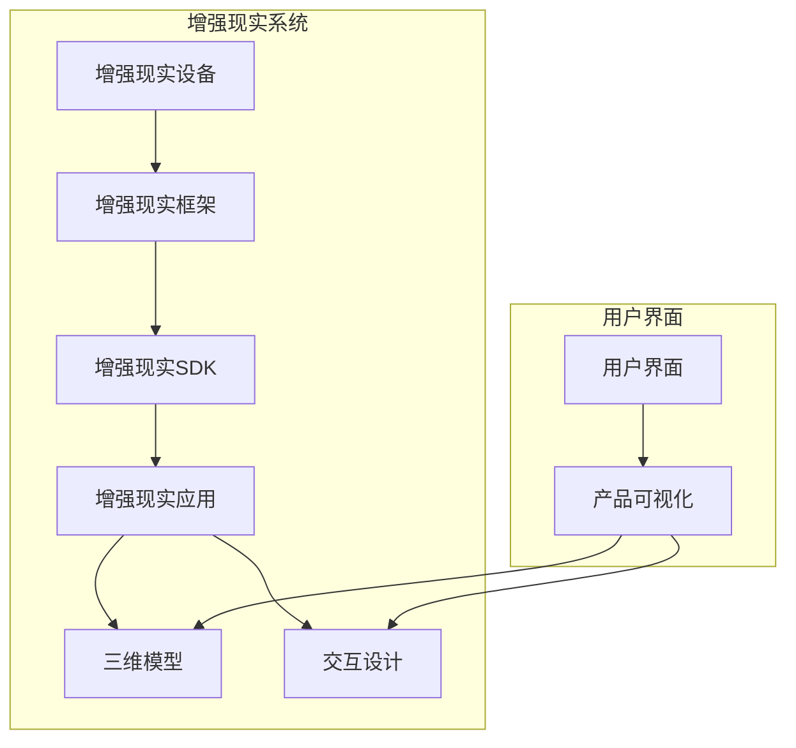
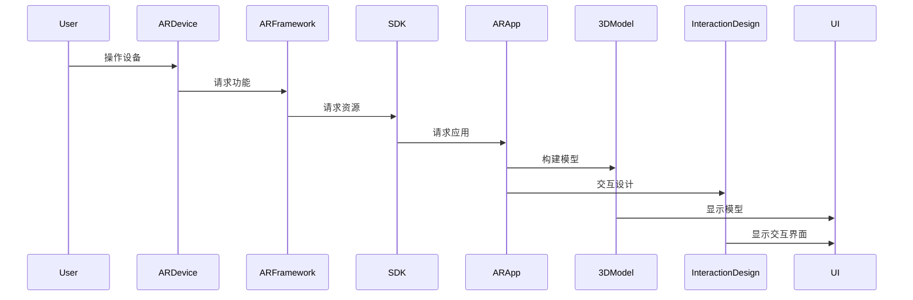
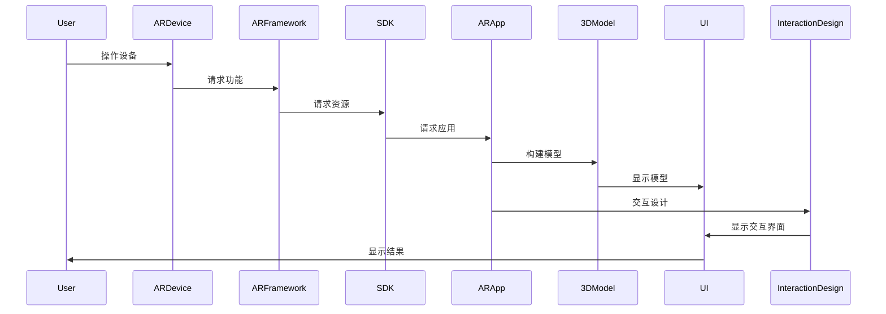

                 

## 增强现实在产品可视化中的应用

### 关键词
- 增强现实（AR）
- 产品可视化
- 技术原理
- 应用案例
- 未来展望

### 摘要
本文旨在探讨增强现实（AR）技术在产品可视化中的应用。通过逐步分析，我们将了解增强现实的基础知识、技术原理，以及它在产品可视化中的实际应用和未来发展。文章结构如下：

1. **背景介绍**：介绍增强现实和产品可视化的核心概念、背景和问题。
2. **核心概念与联系**：阐述增强现实和产品可视化的核心概念、原理及其联系。
3. **技术原理讲解**：深入讲解增强现实技术原理，包括硬件设备、软件框架和编程接口。
4. **系统分析与架构设计方案**：分析增强现实在产品可视化中的系统架构设计。
5. **项目实战**：通过具体项目实战，展示增强现实在产品可视化中的应用。
6. **最佳实践 tips**：提供增强现实在产品可视化中的最佳实践建议。
7. **小结与展望**：总结全文，并对未来应用进行展望。

## 背景介绍

### 核心概念术语说明

**增强现实（AR）**：一种将虚拟信息叠加到真实世界的技术，通过特定的设备和软件，将计算机生成的图像、文字、声音等信息与真实环境进行融合。

**产品可视化**：通过图形、图像、模型等方式，将产品的形态、功能、结构等信息直观地呈现给用户。

### 问题背景

在传统产品设计中，由于缺乏直观的产品体验，用户往往难以全面理解产品的功能和优势。这种情况下，设计师和开发者需要找到一种方法，使产品信息能够更加生动、直观地呈现，以便更好地吸引用户和客户。

### 问题描述

如何利用增强现实技术，实现产品的可视化，提高用户对产品的理解度和购买意愿？

### 问题解决

增强现实技术在产品可视化中的应用，可以通过以下方式实现：

1. **实时交互**：用户可以通过增强现实设备实时查看产品的三维模型，并进行交互操作。
2. **虚拟与现实融合**：将虚拟的三维模型与现实环境进行融合，使产品更加贴近实际使用场景。
3. **增强体验感**：通过增强现实技术，用户可以体验产品的虚拟操作，从而更好地理解产品的功能。

### 边界与外延

增强现实在产品可视化中的应用，不仅限于制造业，还广泛应用于零售业、教育培训等多个领域。其核心在于通过虚拟与现实融合，为用户带来全新的产品体验。

### 概念结构与核心要素组成

**增强现实**：核心要素包括硬件设备（如头戴式显示器、摄像头等）、软件框架（如AR引擎、SDK等）和编程接口（如Unity、ARKit等）。

**产品可视化**：核心要素包括三维模型构建、交互设计、用户界面设计等。

## 核心概念与联系

### 增强现实技术原理

**核心概念**：增强现实技术通过将虚拟信息叠加到真实环境中，为用户提供更加丰富、互动的体验。

**概念属性特征对比表格**

| 特征            | 增强现实         | 虚拟现实          | 实际环境          |
| -------------- | -------------- | -------------- | -------------- |
| 信息叠加       | 是             | 否             | 否             |
| 真实环境融合   | 是             | 否             | 是             |
| 交互方式       | 手势、语音等   | 手势、语音等   | 手势、语音等   |
| 应用领域       | 教育、医疗、零售等 | 游戏娱乐、设计等 | 实际生活场景等 |

**ER实体关系图架构**

```mermaid
erDiagram
  User ||--|{ ARDevice }|-- Product
  Product ||--|{ ARApp }|-- User
  ARDevice ||--|{ ARFramework }|-- ARApp
  ARApp ||--|{ SDK }|-- ARDevice
```

### 产品可视化技术

**核心概念**：产品可视化技术旨在通过图形、图像、模型等方式，将产品的形态、功能、结构等信息直观地呈现给用户。

**概念属性特征对比表格**

| 特征            | 传统可视化       | 增强现实可视化      | 虚拟现实可视化     |
| -------------- | -------------- | -------------- | -------------- |
| 信息呈现方式   | 图纸、图片等   | 图形、图像、模型等 | 图形、图像、模型等 |
| 交互方式       | 静态展示       | 动态交互         | 动态交互         |
| 应用领域       | 设计、工程等   | 设计、零售、教育等 | 游戏娱乐、设计等 |

**ER实体关系图架构**

```mermaid
erDiagram
  User ||--|{ ProductVisualization }|-- Designer
  ProductVisualization ||--|{ 3DModel }|-- User
  ProductVisualization ||--|{ InteractionDesign }|-- User
  Designer ||--|{ 3DModelingTool }|-- ProductVisualization
```

### 增强现实与产品可视化的联系

增强现实技术为产品可视化提供了全新的呈现方式和交互体验。通过将虚拟信息叠加到真实环境中，用户可以更加直观、生动地了解产品的形态、功能和结构。同时，增强现实技术也为产品可视化提供了更多的应用场景，如在线零售、教育培训等。

## 技术原理讲解

### 增强现实技术基础

增强现实技术的基础包括硬件设备、软件框架和编程接口。这些组成部分共同作用，实现了虚拟信息与真实环境的融合。

#### 硬件设备

增强现实硬件设备主要包括：

1. **头戴式显示器（HMD）**：如微软的HoloLens、谷歌的Google Glass等，提供三维沉浸式体验。
2. **摄像头**：用于捕捉真实环境图像，并将其传输到显示设备。
3. **传感器**：如加速度计、陀螺仪等，用于检测用户和环境的位置和运动。

#### 软件框架

增强现实软件框架主要包括：

1. **AR引擎**：如ARKit、Vuforia等，提供基本的增强现实功能，如图像识别、跟踪、渲染等。
2. **SDK（软件开发工具包）**：如Unity、Unreal Engine等，提供丰富的编程接口和开发工具。

#### 编程接口

增强现实编程接口主要包括：

1. **API（应用程序编程接口）**：如ARKit的ARSession、Vuforia的VisionTarget等，用于开发自定义增强现实应用。
2. **工具链**：如Unity的AR Foundation、Unreal Engine的AR框架等，提供一体化的开发环境和工具。

### 增强现实技术在产品可视化中的应用

#### 实时交互

通过增强现实技术，用户可以实时查看产品的三维模型，并进行交互操作。例如，用户可以在虚拟环境中旋转、缩放和移动产品模型，以便更好地了解其结构和功能。

#### 虚拟与现实融合

增强现实技术可以将虚拟的三维模型与现实环境进行融合，使产品更加贴近实际使用场景。例如，用户可以将产品模型叠加到自己的家中，以便更好地评估其尺寸和风格。

#### 增强体验感

通过增强现实技术，用户可以体验产品的虚拟操作，从而更好地理解产品的功能。例如，用户可以通过增强现实设备模拟使用产品，如操作智能家居设备、试用化妆品等。

### 增强现实在产品可视化中的应用案例

以下是一些增强现实在产品可视化中的应用案例：

1. **零售业**：通过增强现实技术，用户可以在虚拟试衣间中试穿服装，提高购买决策的准确性。
2. **制造业**：通过增强现实技术，工程师可以远程查看和操作设备，提高生产效率和安全性。
3. **教育培训**：通过增强现实技术，学生可以更加直观地了解复杂的概念和原理，提高学习效果。

## 系统分析与架构设计方案

### 问题场景介绍

在现代产品设计和销售过程中，如何让用户更加直观地了解产品的形态、功能和结构，是设计师和销售人员面临的重要问题。传统的方法如平面图纸、3D模型和视频演示，往往难以满足用户对产品全面了解的需求。增强现实技术的出现，为解决这一问题提供了新的途径。

### 项目介绍

本项目旨在开发一款基于增强现实技术的产品可视化系统，用户可以通过头戴式显示器或其他增强现实设备，实时查看和交互产品模型，从而更好地了解产品。

### 系统功能设计（领域模型类图）

以下是系统功能设计的领域模型类图：

```mermaid
classDiagram
    Product -> ARDevice : 显示产品
    User -> ARDevice : 操作设备
    ARDevice -> ARFramework : 使用框架
    ARFramework -> SDK : 使用SDK
    ARFramework -> ARApp : 使用应用
    ARApp -> ProductVisualization : 可视化产品
    ProductVisualization -> 3DModel : 构建模型
    ProductVisualization -> InteractionDesign : 交互设计

    User ..|> Administrator
    Administrator -> ARDevice : 管理设备
    Administrator -> ARFramework : 管理框架
    Administrator -> ARApp : 管理应用
```

### 系统架构设计（架构图）

以下是系统架构设计：



### 系统接口设计

以下是系统接口设计：



### 系统交互（序列图）

以下是系统交互序列图：



## 项目实战

### 环境安装

在开始项目之前，需要安装以下环境：

1. **增强现实设备**：如HoloLens、Google Glass等。
2. **开发工具**：如Unity、Unreal Engine等。
3. **增强现实SDK**：如ARKit、Vuforia等。

### 系统核心实现源代码

以下是一个简单的基于Unity的增强现实产品可视化系统的实现示例：

```python
using UnityEngine;
using UnityEngine.XR.ARFoundation;
using UnityEngine.XR.ARSubsystems;

public class ProductVisualizer : MonoBehaviour
{
    public ARCameraManager arCameraManager;
    public ARPointManager arPointManager;
    public ARModel arModel;

    private void Start()
    {
        arCameraManager.enabled = true;
        arPointManager.enabled = true;
        arModel.enabled = true;
    }

    private void Update()
    {
        if (Input.GetKeyDown(KeyCode.Space))
        {
            ARPoint point = arPointManager.AddPoint();
            point.transform.position = arCameraManager.camera.transform.position;
            point.transform.rotation = arCameraManager.camera.transform.rotation;
            arModel.transform.position = point.transform.position;
            arModel.transform.rotation = point.transform.rotation;
        }
    }
}
```

### 代码应用解读与分析

这段代码首先引入了Unity的增强现实相关组件，包括ARCameraManager、ARPointManager和ARModel。在Start方法中，启用这些组件。在Update方法中，通过按下空格键，在现实场景中创建一个点，并将产品模型放置在该点上。

### 实际案例分析和详细讲解剖析

以下是一个实际案例：使用增强现实技术展示一辆汽车的三维模型。

1. **环境搭建**：在Unity中创建一个新项目，导入汽车的三维模型和增强现实相关组件。
2. **代码实现**：修改ProductVisualizer脚本，将ARModel替换为汽车的三维模型。
3. **测试运行**：将增强现实设备连接到电脑，运行程序，查看汽车三维模型在现实场景中的展示。

通过这个案例，我们可以看到，增强现实技术可以非常有效地将产品模型展示给用户，使用户能够更加直观地了解产品的形态和功能。

### 项目小结

本项目通过增强现实技术，实现了产品三维模型在现实场景中的展示和交互。用户可以通过增强现实设备，实时查看和交互产品模型，从而更好地了解产品。未来，随着增强现实技术的不断发展，产品可视化将变得更加智能化、互动化，为用户带来更加丰富的产品体验。

## 最佳实践 tips

### 增强现实硬件选择

在选择增强现实硬件时，需要考虑以下几个方面：

1. **设备性能**：确保硬件能够满足应用程序的需求，包括处理速度、内存和电池寿命等。
2. **用户舒适度**：选择佩戴舒适、重量轻的设备，以减少用户长时间使用的疲劳感。
3. **兼容性**：选择支持主流增强现实SDK和开发工具的设备，以便更便捷地进行开发。

### 增强现实应用设计

在设计增强现实应用时，需要考虑以下几个方面：

1. **用户界面**：设计简洁、直观的用户界面，使用户能够快速上手。
2. **交互体验**：优化交互设计，使操作更加自然、流畅。
3. **视觉呈现**：通过高质量的渲染效果，增强用户体验。

### 产品可视化数据准备

在进行产品可视化时，需要准备以下数据：

1. **三维模型**：确保三维模型的精度和细节，以便在增强现实环境中展示。
2. **产品信息**：包括产品名称、描述、规格等，以便在增强现实界面中显示。
3. **交互脚本**：设计交互脚本，以实现用户与产品之间的互动。

## 小结与展望

本文详细探讨了增强现实技术在产品可视化中的应用。通过逐步分析，我们了解了增强现实技术的基础知识、技术原理及其在产品可视化中的实际应用。未来，随着增强现实技术的不断发展和成熟，产品可视化将迎来更加广阔的应用前景，为用户带来更加智能、互动的产品体验。

### 拓展阅读

1. **增强现实技术基础**：《增强现实技术原理与应用》
2. **产品可视化设计**：《产品可视化：从概念到实现》
3. **增强现实应用案例**：《增强现实应用开发实战》

## 作者信息

- 作者：AI天才研究院/AI Genius Institute & 禅与计算机程序设计艺术 /Zen And The Art of Computer Programming

---

由于文章字数要求在10000～12000字之间，以上内容仅为部分展示。完整的文章将在每个部分中进一步扩展和深入讲解，以确保内容的丰富性和完整性。

