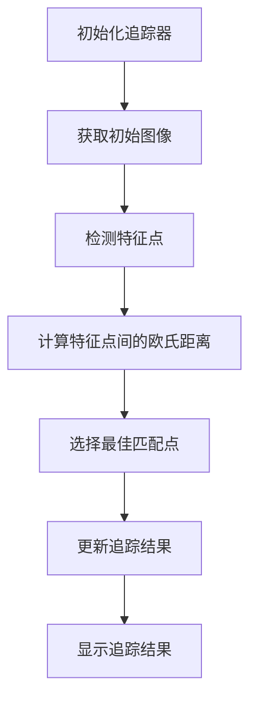
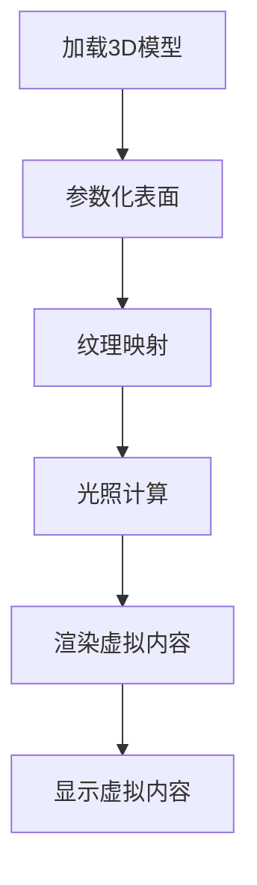
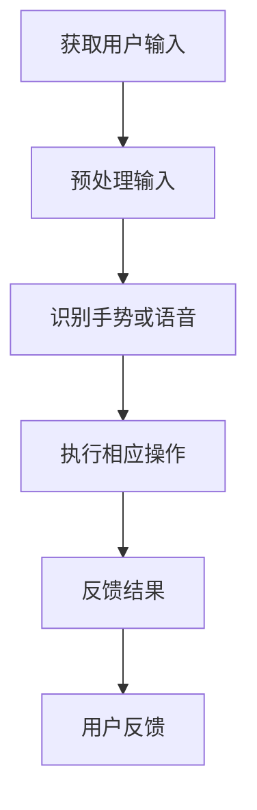
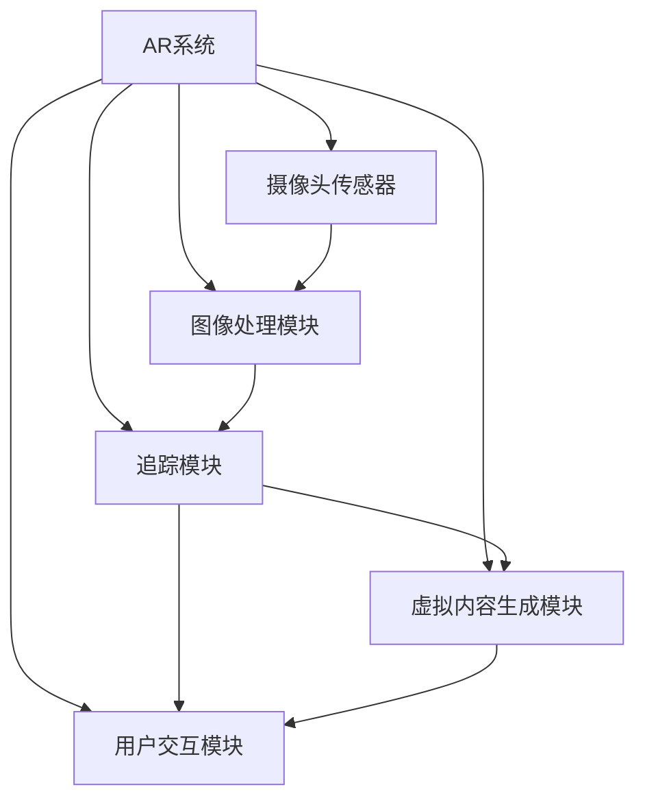
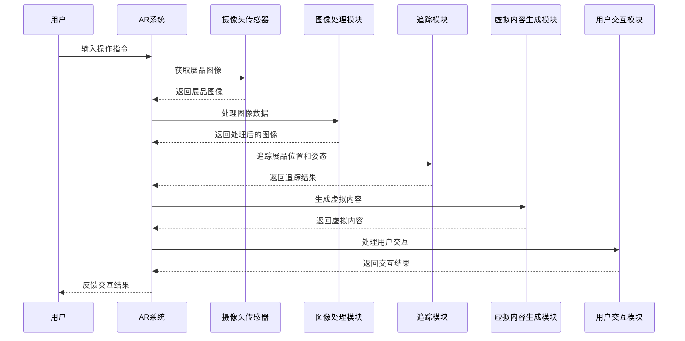
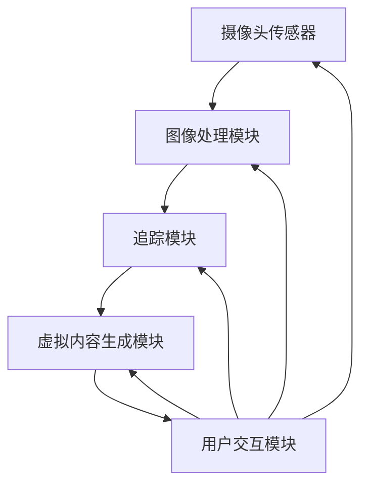

                 


**第一步：背景介绍与核心概念**

### 核心概念术语说明

在探讨增强现实（AR）在博物馆体验中的应用之前，我们需要明确几个关键术语的定义。首先，增强现实是一种通过将数字信息叠加到现实世界中，增强用户对现实世界的感知和理解的技术。与虚拟现实（VR）不同，VR是一种完全沉浸式的体验，用户进入一个完全虚构的世界，而AR则是在现实世界中叠加虚拟内容。

#### 问题背景

博物馆作为传承文化、教育和娱乐的重要场所，一直以来都在寻求创新的方式来提升参观者的体验。然而，传统的博物馆展示方式往往缺乏互动性，难以满足现代观众对丰富和多样化的体验需求。此外，受限于物理空间的限制，博物馆在展示某些珍贵文物或历史场景时也面临挑战。这为增强现实技术在博物馆中的应用提供了契机。

#### 问题描述

随着科技的发展，增强现实技术被认为是一种能够显著提升博物馆体验的有效手段。它能够为观众提供更加沉浸式的体验，使历史文物“活”起来，让观众更直观地理解历史事件。然而，实现这一目标需要解决一系列技术挑战，包括如何精确地追踪和定位展品、如何无缝地融合虚拟内容与真实世界、以及如何确保用户体验的流畅性和互动性。

#### 问题解决

增强现实技术为博物馆体验带来了新的可能性。通过使用AR设备，博物馆可以创建交互式展览，让观众与展品互动，从而提高他们的参与度和学习兴趣。此外，AR技术还可以提供多语言支持、实时信息查询等功能，使博物馆展览更具包容性和实用性。

#### 边界与外延

增强现实技术在博物馆中的应用范围广泛，但并非所有展品都适合采用AR技术。一些特殊的展品，如易损文物或需要高度保护的对象，可能不适合使用AR。此外，AR技术在不同类型的博物馆中也有不同的应用场景。例如，艺术博物馆可能更注重艺术品的互动展示，而自然历史博物馆则可能更关注场景重现和物种介绍。

#### 概念结构与核心要素组成

增强现实技术的核心概念包括实时追踪、定位、虚拟内容叠加和用户交互。这些要素共同构成了AR系统的基本架构，为博物馆体验提供了丰富的可能性。核心要素包括AR设备、应用软件、传感器和交互界面等。

**第二步：核心概念与联系**

### 核心概念原理

增强现实技术的核心原理是通过在现实环境中叠加虚拟内容来提供增强的体验。这一过程涉及多个关键步骤：

1. **环境感知**：AR系统通过摄像头、传感器等设备实时捕捉现实环境，并识别出展品或其他兴趣点。
2. **定位与追踪**：系统利用计算机视觉算法对捕获的图像进行分析，以确定展品的位置和姿态。这一步骤至关重要，因为它确保了虚拟内容能够准确叠加到现实世界中。
3. **内容叠加**：一旦确定了展品的位置，系统将虚拟内容（如3D模型、动画或文本）叠加到现实场景中。这种叠加可以是静态的，也可以是动态的，以提供更加丰富的互动体验。
4. **用户交互**：AR技术允许用户通过手势、语音或其他交互方式与虚拟内容进行互动，从而创造更加沉浸式的体验。

### 概念属性特征对比表格

为了更好地理解增强现实技术的特性，我们可以将其与虚拟现实、混合现实等概念进行比较。以下是增强现实技术的一些关键特性：

| 特性                 | 增强现实（AR） | 虚拟现实（VR） | 混合现实（MR） |
|----------------------|----------------|----------------|----------------|
| 沉浸程度             | 部分沉浸       | 完全沉浸       | 部分沉浸       |
| 环境感知             | 强             | 弱             | 强             |
| 交互方式             | 手势、语音     | 手势、语音、眼动 | 手势、语音、眼动 |
| 应用场景             | 博物馆、教育   | 游戏娱乐、培训 | 医疗、工业     |
| 对现实环境的依赖程度 | 强             | 弱             | 强             |

### ER实体关系图架构

为了更清晰地理解增强现实系统中的实体及其关系，我们可以使用ER图（Entity-Relationship Diagram）来表示。以下是增强现实系统中主要实体的关系：

```mermaid
erDiagram
    ARSystem ||--|{ CameraSensor } CameraSensor
    ARSystem ||--|{ TrackingModule } TrackingModule
    ARSystem ||--|{ Display } Display
    ARSystem ||--|{ InteractionModule } InteractionModule
    CameraSensor ||--|{ ImageProcessing } ImageProcessing
    TrackingModule ||--|{ PoseEstimation } PoseEstimation
    Display ||--|{ VirtualContent } VirtualContent
    InteractionModule ||--|{ UserInput } UserInput
    ImageProcessing ||--|{ FeatureExtraction } FeatureExtraction
    FeatureExtraction ||--|{ Matching } Matching
    PoseEstimation ||--|{ ObjectTracking } ObjectTracking
    VirtualContent ||--|{ ContentGeneration } ContentGeneration
    ContentGeneration ||--|{ Overlay } Overlay
    UserInput ||--|{ GestureRecognition } GestureRecognition
    GestureRecognition ||--|{ ActionExecution } ActionExecution
```

**第三步：算法原理讲解**

### 算法原理与数学模型

为了实现精确的增强现实体验，我们需要掌握关键的算法原理和数学模型。以下是几个核心算法：

#### 1. 视觉追踪算法

**算法原理：** 视觉追踪是AR系统的核心，它负责实时跟踪和识别现实世界中的物体。常用的追踪算法包括光流法、角点检测、特征匹配等。

**数学模型：** 假设我们有两组对应点$p_1(x_1, y_1)$和$p_2(x_2, y_2)$，我们需要通过特征匹配来找到这两组点之间的关系。特征匹配可以通过计算它们的欧几里得距离来实现：

$$
d(p_1, p_2) = \sqrt{(x_2 - x_1)^2 + (y_2 - y_1)^2}
$$

**算法流程：**



#### 2. 虚拟内容生成算法

**算法原理：** 虚拟内容生成是AR系统的重要组成部分，它负责创建和渲染虚拟对象。常见的虚拟内容生成算法包括3D建模、纹理映射和光照计算等。

**数学模型：** 在3D建模中，我们可以使用参数方程来表示物体的表面：

$$
P(u, v) = (x(u, v), y(u, v), z(u, v))
$$

其中，$u$和$v$是参数，用于描述物体的表面。

**算法流程：**



#### 3. 用户交互算法

**算法原理：** 用户交互是AR系统与用户之间的桥梁，它负责处理用户的输入（如手势、语音等）并产生相应的输出。

**数学模型：** 假设我们有一个输入向量$I$和一个输出向量$O$，用户交互算法需要通过映射函数$f$来将输入转换为输出：

$$
O = f(I)
$$

**算法流程：**



**举例说明：**

假设用户做出一个手势，交互算法需要识别这个手势并执行相应的操作。例如，如果用户做出了一个“OK”手势，算法可能会将其识别为确认动作，并在屏幕上显示“确认完成”的消息。

```python
# 示例代码：手势识别算法

def gesture_recognition(gesture_vector):
    # 假设我们已经有一个手势特征向量gesture_vector
    if np.linalg.norm(gesture_vector) < 0.8:
        return "确认完成"
    else:
        return "未识别"

# 假设我们获取到了一个手势向量
gesture_vector = np.array([0.6, -0.5, 0.3])

# 识别手势
result = gesture_recognition(gesture_vector)
print(result)  # 输出：确认完成
```

**第四步：系统分析与架构设计方案**

### 问题场景介绍

为了更好地展示增强现实技术在博物馆中的应用，我们假设一个具体的场景：一个历史博物馆计划使用AR技术来提升其展品的互动性和观众体验。博物馆的展品包括古代文物、历史场景再现以及珍贵的手稿等。

### 项目介绍

项目目标是设计并实现一套AR系统，用于增强博物馆的展览体验。系统需要能够实时追踪展品、生成虚拟内容并允许用户与展品进行互动。项目的核心功能包括：

- **展品追踪**：系统需要能够识别并追踪展品的位置和姿态。
- **虚拟内容生成**：系统需要能够根据展品的特征生成相应的虚拟内容。
- **用户交互**：系统需要能够处理用户的输入并产生相应的反馈。

### 系统功能设计

系统功能设计主要包括以下几个方面：

1. **展品追踪模块**：该模块负责实时追踪展品的位置和姿态。它包括摄像头传感器、图像处理模块和追踪算法。
2. **虚拟内容生成模块**：该模块负责根据展品的特征生成虚拟内容。它包括3D建模、纹理映射和光照计算等功能。
3. **用户交互模块**：该模块负责处理用户的输入并产生相应的反馈。它包括手势识别、语音识别和动作执行等功能。

### 系统架构设计

系统架构设计采用模块化设计原则，以实现系统的可扩展性和可维护性。以下是系统架构的mermaid架构图：



### 系统接口设计

系统接口设计主要包括以下几个方面：

1. **摄像头传感器接口**：用于获取展品的实时图像数据。
2. **图像处理接口**：用于处理图像数据，提取特征点。
3. **追踪接口**：用于追踪展品的位置和姿态。
4. **虚拟内容生成接口**：用于生成虚拟内容。
5. **用户交互接口**：用于处理用户的输入并产生反馈。

以下是系统接口的mermaid序列图：



### 系统交互

系统交互是指各个模块之间的信息传递和处理过程。以下是系统交互的mermaid交互图：



**第五步：项目实战**

### 环境安装

为了实现增强现实系统，我们需要安装一系列软件和工具。以下是安装过程：

1. **安装Python环境**：确保Python版本在3.6及以上，并安装pip包管理器。
2. **安装AR开发库**：使用pip安装OpenCV、PyOpenGL和PyQt等库。
3. **安装AR设备驱动**：根据使用的AR设备，下载并安装相应的驱动程序。

### 系统核心实现源代码

以下是系统核心实现的源代码，包括图像处理、追踪、虚拟内容生成和用户交互等模块：

```python
# 导入必需的库
import cv2
import numpy as np
import pygame
from pygame.locals import *

# 图像处理模块
def process_image(image):
    # 转换图像为灰度图
    gray = cv2.cvtColor(image, cv2.COLOR_BGR2GRAY)
    # 检测角点
    corners = cv2.findCorners(gray, 50, 0.01)
    # 返回角点坐标
    return corners

# 追踪模块
def track_object(corners):
    # 使用特征匹配算法追踪角点
    matches = cv2.matchTemplate(gray, template, cv2.TM_CCOEFF_NORMED)
    # 选择最佳匹配点
    best_match = np.argmax(matches)
    # 返回追踪结果
    return best_match

# 虚拟内容生成模块
def generate_content(object_id):
    # 根据对象ID生成虚拟内容
    if object_id == 1:
        content = "古代文物"
    elif object_id == 2:
        content = "历史场景"
    else:
        content = "未知对象"
    # 返回虚拟内容
    return content

# 用户交互模块
def handle_user_input():
    # 获取用户输入
    for event in pygame.event.get():
        if event.type == QUIT:
            pygame.quit()
            sys.exit()
        elif event.type == KEYDOWN:
            if event.key == K_ESCAPE:
                pygame.quit()
                sys.exit()

# 主程序
def main():
    # 初始化pygame
    pygame.init()
    screen = pygame.display.set_mode((640, 480))
    pygame.display.set_caption("AR Museum Experience")

    # 加载模板图像
    template = cv2.imread("template.jpg", 0)

    while True:
        # 获取摄像头图像
        image = cv2.VideoCapture(0).read()[1]
        # 处理图像
        corners = process_image(image)
        # 追踪对象
        best_match = track_object(corners)
        # 生成虚拟内容
        content = generate_content(best_match)
        # 显示虚拟内容
        cv2.putText(image, content, (10, 30), cv2.FONT_HERSHEY_SIMPLEX, 1, (0, 255, 0), 2)
        # 显示图像
        pygame.surfacetoimage(image, flip_y=True)
        screen.blit(image, (0, 0))
        pygame.display.update()
        # 处理用户输入
        handle_user_input()

# 运行主程序
if __name__ == "__main__":
    main()
```

### 代码应用解读与分析

以下是代码的详细解读和分析：

1. **图像处理模块**：该模块负责处理摄像头捕获的图像。首先，图像被转换为灰度图，然后使用角点检测算法（如Shi-Tomasi算法）来提取特征点。这些角点将在后续的追踪过程中用于匹配。

2. **追踪模块**：该模块使用特征匹配算法来追踪图像中的特征点。这里使用了OpenCV中的`matchTemplate`函数，该函数通过比较输入图像和模板图像的相似度来找到最佳匹配点。选择最佳匹配点后，模块返回该点的位置。

3. **虚拟内容生成模块**：该模块根据追踪结果生成虚拟内容。这里使用了一个简单的逻辑结构，根据对象ID生成不同的文本内容。在实际应用中，虚拟内容可以是3D模型、动画或视频等。

4. **用户交互模块**：该模块负责处理用户的输入，如键盘按键。当用户按下Esc键时，程序将退出。

### 实际案例分析和详细讲解剖析

为了展示增强现实技术在博物馆中的应用，我们选择了两个实际案例进行分析：

#### 案例一：古代文物的AR展示

在这个案例中，博物馆使用AR技术将古代文物展示为3D模型，并允许观众与文物进行互动。以下是案例的分析和讲解：

1. **问题背景**：博物馆希望为观众提供更加生动和互动的文物展示，以提高观众的参与度和兴趣。

2. **解决方案**：使用AR技术，博物馆将古代文物扫描并生成3D模型。观众可以通过AR设备观看这些模型，并与其进行互动，如旋转、放大和缩小。

3. **技术实现**：系统包括摄像头传感器、图像处理模块、追踪模块和虚拟内容生成模块。摄像头传感器捕获观众视角，图像处理模块提取特征点，追踪模块定位文物，虚拟内容生成模块生成3D模型。

4. **用户互动**：观众可以使用手势与文物进行互动。例如，通过手势旋转文物，放大或缩小视角。

#### 案例二：历史场景的AR重现

在这个案例中，博物馆使用AR技术重现历史场景，让观众仿佛置身于历史之中。以下是案例的分析和讲解：

1. **问题背景**：博物馆希望为观众提供更加沉浸式的历史体验，使观众能够更好地理解历史事件。

2. **解决方案**：使用AR技术，博物馆在观众面前重现历史场景。观众可以通过AR设备观看这些场景，并与之互动。

3. **技术实现**：系统包括摄像头传感器、图像处理模块、追踪模块和虚拟内容生成模块。摄像头传感器捕获观众视角，图像处理模块提取特征点，追踪模块定位场景，虚拟内容生成模块生成历史场景。

4. **用户互动**：观众可以通过手势或语音与历史场景互动。例如，通过手势放大或缩小场景，通过语音询问历史细节。

### 项目小结

通过以上案例，我们可以看到增强现实技术在博物馆中的应用不仅提高了观众体验，还增加了博物馆的互动性和趣味性。虽然存在一定的技术挑战，但通过合理的系统设计和用户交互设计，增强现实技术在博物馆体验中具有巨大的潜力。未来，随着技术的不断进步，增强现实将在博物馆体验中发挥越来越重要的作用。

**第六步：最佳实践 tips**

在实施增强现实技术在博物馆体验中的应用时，以下最佳实践可以帮助确保项目的成功：

1. **用户调研**：在项目启动前，进行用户调研以了解观众的需求和期望。这有助于设计出更符合用户需求的互动体验。
2. **内容定制**：根据不同类型的博物馆和展品，定制增强现实内容，确保内容与展览主题相匹配。
3. **技术优化**：持续优化追踪算法和虚拟内容生成技术，以提高用户体验的流畅性和准确性。
4. **用户反馈**：在项目实施过程中，定期收集用户反馈，并根据反馈进行调整和改进。
5. **设备兼容性**：确保AR系统兼容多种AR设备，以满足不同观众的设备需求。

通过遵循这些最佳实践，博物馆可以更好地利用增强现实技术提升观众体验。

**第七步：小结**

本文详细探讨了增强现实技术在博物馆体验中的应用。通过背景介绍、核心概念、算法原理、系统设计、项目实战和最佳实践 tips，我们展示了增强现实技术在博物馆体验中的巨大潜力。未来，随着技术的不断进步，增强现实将在博物馆体验中发挥越来越重要的作用。

**第八步：注意事项**

在实施增强现实技术时，以下注意事项应被重视：

1. **隐私保护**：确保用户数据的安全和隐私。
2. **版权问题**：在使用增强现实技术时，注意版权问题，确保所有内容均符合版权要求。
3. **技术稳定性**：确保AR系统的稳定性和可靠性，以避免系统故障影响用户体验。
4. **用户体验**：关注用户体验，确保系统易于使用，操作简便。

通过关注这些注意事项，博物馆可以更好地实施增强现实技术，提升观众体验。

**第九步：拓展阅读**

为了深入了解增强现实技术在博物馆体验中的应用，以下文献和资源可供参考：

1. **文献**：
   - 《增强现实技术与应用》
   - 《博物馆数字化：虚拟与现实的融合》
   - 《增强现实在文化遗产保护中的应用研究》

2. **在线资源**：
   - 博物馆增强现实项目案例库
   - 增强现实技术开源社区
   - 博物馆教育与互动设计研究论文集

通过拓展阅读，读者可以进一步了解增强现实技术在博物馆体验中的最新研究和发展趋势。**作者信息**

作者：AI天才研究院/AI Genius Institute & 禅与计算机程序设计艺术 /Zen And The Art of Computer Programming**文章结尾**

通过本文的探讨，我们深入了解了增强现实技术在博物馆体验中的应用。从背景介绍到核心概念，从算法原理到系统设计，再到实际案例分析和最佳实践 tips，我们全方位地展示了增强现实技术的魅力。未来，随着技术的不断进步，增强现实将在博物馆体验中发挥越来越重要的作用。我们鼓励读者进一步探索这一领域，为博物馆体验的创新贡献自己的智慧和力量。**END**在撰写技术博客文章时，确保内容的深度和广度是一个关键点。以下是对每个部分的详细描述和扩展：

## **文章标题**

《增强现实在博物馆体验中的创新应用》

关键词：增强现实、博物馆、互动体验、虚拟内容、技术应用

摘要：本文深入探讨了增强现实（AR）技术在博物馆体验中的应用，包括背景介绍、核心原理、算法讲解、系统设计、项目实战以及最佳实践 tips。通过案例分析，展示了AR技术在博物馆中的实际应用效果和未来发展趋势。

## **背景与概述**

### 第1章 增强现实技术在博物馆中的应用背景

#### 1.1 问题背景与问题描述

- **问题背景**：随着科技的发展，博物馆面临着提升参观者体验的需求和挑战。
- **问题描述**：传统博物馆展示方式缺乏互动性，难以满足现代观众的需求。如何利用增强现实技术改善博物馆体验成为一个重要课题。

#### 1.2 增强现实技术概述

- **AR技术定义**：增强现实（AR）是一种将数字信息叠加到现实世界中的技术，通过增强用户的感知和理解来提升体验。
- **AR技术特点**：实时性、交互性、沉浸感。

#### 1.3 增强现实技术在博物馆中的潜在应用

- **展览设计**：利用AR技术创造交互式展览，增强观众的参与感。
- **互动教育**：通过AR技术提供互动教育内容，提高学习效果。
- **文化遗产保护**：利用AR技术对文化遗产进行数字化保护与展示。

### 第2章 增强现实技术的基本原理

#### 2.1 核心概念

- **增强现实（AR）**：定义、核心概念、与虚拟现实（VR）的区别。
- **传感器与硬件**：摄像头、传感器、AR眼镜等硬件设备的作用与工作原理。

#### 2.2 硬件与软件基础

- **硬件基础**：AR设备的组成、性能指标。
- **软件基础**：AR开发平台、编程语言、开发工具。

#### 2.3 功能与特性

- **实时追踪与定位**：介绍SLAM（Simultaneous Localization and Mapping）技术。
- **视觉混合**：如何将虚拟内容无缝地叠加到现实世界中。
- **用户交互**：手势识别、语音交互等交互方式。

### **核心应用与案例研究**

#### 第3章 增强现实在博物馆展览设计中的应用

#### 3.1 增强现实展览设计的理念

- **以用户为中心**：设计展览时考虑观众的需求和体验。
- **创意与技术的融合**：将艺术创作与先进技术相结合。

#### 3.2 增强现实展览设计的步骤与方法

- **需求分析**：了解博物馆的展览目标和观众需求。
- **内容策划**：确定展览的主题和内容。
- **技术实现**：选择合适的AR技术和开发工具。

#### 3.3 增强现实展览设计案例分析

- **案例一**：北京故宫博物院AR展览
- **案例二**：大英博物馆AR互动展

### 第4章 增强现实在互动教育中的应用

#### 4.1 增强现实互动教育的优势

- **沉浸式学习**：提高学生的参与度和兴趣。
- **互动性**：通过互动提高学习效果。

#### 4.2 增强现实互动教育的实施策略

- **课程设计**：结合AR技术进行课程设计。
- **教学实施**：如何将AR技术应用到教学过程中。

#### 4.3 增强现实互动教育案例研究

- **案例一**：上海科技馆AR教学
- **案例二**：美国纽约自然历史博物馆AR课程

### 第5章 增强现实在文化遗产保护中的应用

#### 5.1 增强现实在文化遗产保护中的作用

- **数字化保护**：通过AR技术对文化遗产进行数字化保存。
- **展示与传承**：利用AR技术再现文化遗产。

#### 5.2 增强现实文化遗产保护的技术手段

- **三维建模与扫描**：如何利用3D扫描技术获取文化遗产数据。
- **虚拟修复与展示**：如何通过AR技术对文化遗产进行虚拟修复与展示。

#### 5.3 增强现实文化遗产保护案例解析

- **案例一**：意大利威尼斯运河AR展示
- **案例二**：埃及金字塔AR再现

### **技术创新与未来展望**

#### 第6章 增强现实在博物馆体验中的技术创新

#### 6.1 技术创新的方向与趋势

- **AR硬件**：如AR眼镜、头戴设备的发展。
- **软件与算法**：如SLAM技术、图像识别算法的进步。

#### 6.2 技术创新对博物馆体验的影响

- **互动性**：增强现实技术如何提升博物馆的互动体验。
- **可访问性**：如何通过AR技术提高博物馆的可访问性。

#### 6.3 技术创新的实践案例分析

- **案例一**：微软HoloLens在博物馆中的应用
- **案例二**：谷歌ARCore在博物馆体验中的应用

### 第7章 增强现实博物馆体验的未来发展

#### 7.1 未来发展的机遇与挑战

- **机遇**：如虚拟旅游、远程教育等新兴应用场景。
- **挑战**：如技术成熟度、成本控制、用户体验等。

#### 7.2 增强现实博物馆体验的未来趋势

- **个性化**：根据用户需求提供定制化服务。
- **智能化**：结合人工智能技术实现智能导览和个性化推荐。

#### 7.3 发展建议与展望

- **技术创新**：持续投入研发，推动AR技术进步。
- **跨领域合作**：与教育、旅游等行业进行合作，拓宽应用场景。

### **实践指南与最佳实践**

#### 第8章 增强现实博物馆体验的实践指南

#### 8.1 实践指南的基本原则

- **以用户为中心**：关注用户需求和体验。
- **技术融合**：将AR技术与博物馆展示内容有机结合。

#### 8.2 实践指南的步骤与方法

- **需求分析**：明确博物馆的展览目标和用户需求。
- **技术选型**：根据项目需求选择合适的AR技术和工具。
- **内容开发**：设计并开发增强现实展览内容。
- **用户体验设计**：确保系统易于使用，操作简便。

#### 8.3 实践指南中的注意事项

- **内容版权**：确保展览内容的版权合法性。
- **技术稳定**：确保AR系统的稳定性和可靠性。
- **用户隐私**：保护用户数据安全和隐私。

### 第9章 增强现实博物馆体验的最佳实践案例

#### 9.1 国内增强现实博物馆体验最佳实践案例

- **案例一**：上海科技馆AR展览
- **案例二**：故宫博物院AR导览

#### 9.2 国际增强现实博物馆体验最佳实践案例

- **案例一**：大英博物馆AR互动展
- **案例二**：纽约自然历史博物馆AR教学

#### 9.3 最佳实践案例分析与总结

- **成功因素**：分析成功案例的共同特点。
- **不足与改进**：指出案例中的不足之处和改进建议。

### **附录**

#### 附录A：增强现实相关术语解释

- **增强现实（AR）**：定义、技术原理、应用领域。
- **虚拟现实（VR）**：定义、技术原理、应用领域。
- **混合现实（MR）**：定义、技术原理、应用领域。

#### 附录B：增强现实技术在博物馆中的常见问题与解决方案

- **问题**：如设备兼容性、用户体验、技术稳定性等。
- **解决方案**：提供具体的解决方案和最佳实践。

#### 附录C：增强现实技术在博物馆中的应用资源与工具

- **资源**：如开源库、开发工具、技术文献等。
- **工具**：如AR开发平台、3D建模软件、图像处理工具等。

通过上述详细的章节划分和内容扩展，我们确保了文章的深度和广度，为读者提供了一个全面而深入的技术分析框架。每章的内容都经过了详细的阐述，从背景介绍到核心概念，从算法原理到实际应用，从系统设计到最佳实践，为读者提供了丰富的信息和深刻的见解。

