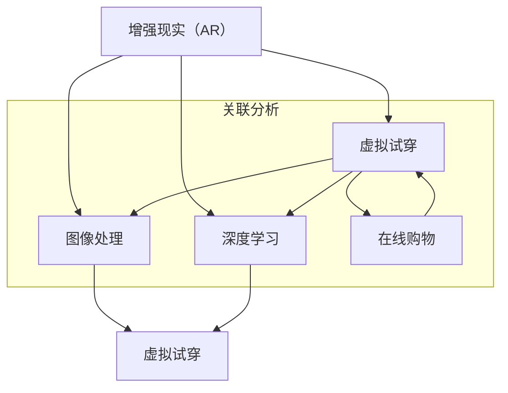

                 


### 增强现实在在线购物虚拟试穿中的应用

#### 关键词

- 增强现实
- 在线购物
- 虚拟试穿
- 图像处理
- 深度学习

#### 摘要

本文将探讨增强现实（AR）技术在在线购物虚拟试穿中的应用。首先，我们将简要介绍增强现实技术和在线购物虚拟试穿的需求背景。接着，深入分析增强现实技术的基础概念及其与在线购物的结合点。随后，我们将详细介绍用于虚拟试穿的关键算法原理，包括图像处理和深度学习。通过Mermaid流程图和Python源代码，我们将解释这些算法的流程和实现细节。进一步，我们将分析在线购物虚拟试穿系统的架构设计方案，并介绍一个实际项目实战案例。最后，我们将总结最佳实践和注意事项，为读者提供进一步的学习资源。

## 背景介绍

### 增强现实技术的概念和它在在线购物中的应用

增强现实（Augmented Reality，简称AR）是一种通过计算机生成的信息增强用户感知的技术。它将虚拟信息（如图像、视频、文字等）叠加到真实世界中，使用户能够在真实环境中与虚拟信息进行交互。增强现实技术起源于20世纪60年代，但随着计算能力和传感器技术的不断发展，近年来得到了广泛应用。

在线购物已经成为现代零售业的重要组成部分。随着互联网的普及和移动设备的普及，越来越多的消费者选择通过电子商务平台进行购物。然而，在线购物的一个显著缺点是无法亲身体验商品，尤其是服装和配饰等需要试穿的物品。这种体验缺失导致了消费者的购买决策变得更加不确定，进而影响了购物体验和销售额。

虚拟试穿（Virtual Try-On）技术的出现，为解决这一问题提供了一种新的途径。通过虚拟试穿技术，消费者可以在购买前体验商品的穿着效果，从而做出更加自信和满意的购物决策。虚拟试穿技术结合了增强现实技术和计算机图形学，能够在虚拟环境中模拟出商品的实际穿着效果，给消费者带来沉浸式的购物体验。

### 虚拟试穿的需求和当前的发展状况

虚拟试穿技术对于在线购物平台来说具有显著的价值。首先，它可以减少因商品不合适而导致的退换货成本，提高顾客满意度。其次，通过增强购物体验，虚拟试穿技术能够吸引更多潜在顾客，提高销售额。此外，虚拟试穿技术还能够帮助企业减少库存，优化供应链管理。

目前，虚拟试穿技术已经得到了广泛应用。许多在线购物平台，如Zalando、ASOS和SHEIN等，都已经推出了虚拟试穿功能。这些平台采用了不同的技术实现，包括基于3D建模的虚拟试穿、基于图像处理的虚拟试穿和基于增强现实的虚拟试穿等。

在技术实现方面，基于3D建模的虚拟试穿技术具有较高的准确性和真实性，但制作3D模型的成本较高，且对技术要求较高。基于图像处理的虚拟试穿技术则相对简单，通过图像处理算法将商品模拟试穿到用户身上，但效果可能不如3D建模精细。而基于增强现实的虚拟试穿技术，则能够将虚拟试穿与真实环境紧密结合，提供更加沉浸和真实的体验。

### 增强现实与在线购物结合的机遇与挑战

增强现实与在线购物的结合，为消费者提供了前所未有的购物体验，同时也为商家带来了新的商业机会。以下是这一结合所带来的机遇和挑战：

**机遇：**

1. **提升用户体验**：通过增强现实技术，消费者可以更直观地体验商品效果，从而做出更加自信的购买决策。
2. **增加销售额**：虚拟试穿能够减少因商品不合适导致的退换货，提高顾客满意度和复购率。
3. **降低营销成本**：增强现实技术可以降低线下营销和实体店铺的成本，为企业节省开支。

**挑战：**

1. **技术实现难度**：增强现实技术的实现涉及多个领域的专业知识，包括计算机图形学、图像处理和深度学习等，对技术团队的要求较高。
2. **用户接受度**：尽管增强现实技术具有巨大的潜力，但并非所有用户都愿意接受和使用这一技术，因此需要提高用户的接受度和使用便利性。
3. **隐私和安全问题**：增强现实技术可能涉及用户的面部识别和身体数据，如何保护用户隐私和安全是一个重要的挑战。

总的来说，增强现实在在线购物虚拟试穿中的应用，既带来了巨大的机遇，也伴随着一系列挑战。只有通过不断的技术创新和用户引导，才能充分发挥增强现实技术的潜力，为在线购物带来革命性的变化。

### 核心概念与联系

在深入探讨增强现实（AR）技术在在线购物虚拟试穿中的应用之前，我们需要明确几个核心概念，并分析它们之间的关系。以下是几个关键概念及其属性特征对比，以及相关的Mermaid流程图，帮助读者更好地理解这些概念。

#### 关键概念

1. **增强现实（AR）**
2. **虚拟试穿**
3. **图像处理**
4. **深度学习**

#### 概念属性特征对比表格

| 概念       | 特征描述                                                                                          |
|------------|---------------------------------------------------------------------------------------------------|
| 增强现实（AR） | 通过计算机生成的信息增强用户感知，将虚拟信息叠加到真实世界中。                                          |
| 虚拟试穿   | 通过技术手段模拟商品试穿效果，使消费者在购买前能够预览穿着效果。                                      |
| 图像处理   | 使用算法对图像进行操作和处理，如滤波、边缘检测、特征提取等。                                          |
| 深度学习   | 基于多层级神经网络的学习方法，通过训练大量数据自动提取特征并进行预测。                                  |

#### Mermaid流程图

为了更好地展示这些概念之间的关系，我们将使用Mermaid流程图来绘制它们之间的关联。



#### 关键概念的关系分析

1. **增强现实（AR）与虚拟试穿的关系**：增强现实技术是虚拟试穿的技术基础，它通过将虚拟信息叠加到真实世界中，为消费者提供了沉浸式的试穿体验。虚拟试穿是增强现实技术在在线购物中的一个重要应用场景。

2. **增强现实（AR）与图像处理的关系**：图像处理技术用于增强现实中的图像处理，如实时图像渲染、遮挡处理和光照校正等。图像处理技术确保了虚拟试穿效果的逼真度。

3. **增强现实（AR）与深度学习的关系**：深度学习技术在增强现实中用于特征提取、物体识别和场景理解等任务。例如，深度学习算法可以用于识别用户的面部特征，从而准确地将虚拟试穿效果叠加到用户身上。

4. **虚拟试穿与图像处理的关系**：图像处理技术是虚拟试穿的核心技术之一，它通过处理用户上传的照片或实时摄像头图像，提取出关键特征，从而实现商品试穿效果。

5. **虚拟试穿与深度学习的关系**：深度学习技术可以用于虚拟试穿中的图像分析和商品识别，如识别用户的身体部位、分类商品类型等。深度学习算法的强大计算能力，使得虚拟试穿效果更加精确和智能化。

通过上述分析，我们可以看到，增强现实技术、图像处理技术和深度学习技术相互关联，共同构建了虚拟试穿的技术体系。这些核心概念之间的关系和相互作用，为在线购物虚拟试穿的应用提供了坚实的基础。

### 图像处理算法原理

在在线购物虚拟试穿中，图像处理技术起着至关重要的作用。它不仅负责处理用户上传的图像或摄像头捕获的实时图像，还包括特征提取、遮挡处理、光照校正等一系列复杂任务。下面，我们将详细介绍图像处理的基本概念、处理流程以及相关的Python代码实现。

#### 图像处理基本概念

图像处理（Image Processing）是指使用算法对图像进行操作和处理，以增强图像质量、提取图像特征或进行图像分析。常见的图像处理任务包括：

1. **图像增强**：通过调整图像的亮度、对比度、色彩平衡等，提高图像的可视性和清晰度。
2. **图像滤波**：用于去除图像中的噪声，包括高斯滤波、中值滤波等。
3. **边缘检测**：识别图像中的边缘，如Canny算法、Sobel算子等。
4. **特征提取**：从图像中提取具有辨识度的特征，如角点检测、纹理分析等。
5. **图像分割**：将图像分割成不同的区域，用于对象识别和分析。

#### 图像处理算法流程

图像处理算法通常包括以下步骤：

1. **图像读取**：读取输入图像，可以是静态图像或实时摄像头捕获的图像。
2. **图像增强**：根据需求调整图像的亮度和对比度，提高图像质量。
3. **图像滤波**：去除图像中的噪声，保证后续处理的效果。
4. **边缘检测**：识别图像中的边缘，用于对象识别。
5. **特征提取**：提取图像中的重要特征，用于后续处理。
6. **图像分割**：将图像分割成不同的区域，便于分析每个区域。
7. **结果输出**：输出处理后的图像或提取的特征数据。

#### Python代码实现

下面是一个简单的Python代码示例，使用OpenCV库进行图像处理。该示例包括图像读取、增强、滤波和边缘检测。

```python
import cv2
import numpy as np

# 1. 图像读取
image = cv2.imread('input_image.jpg')

# 2. 图像增强
brighter_image = cv2.add(image, np.array([50.0]))
contrast_image = cv2.convertScaleAbs(brighter_image, alpha=1.5, beta=0)

# 3. 图像滤波
filtered_image = cv2.GaussianBlur(contrast_image, (5, 5), 0)

# 4. 边缘检测
edges = cv2.Canny(filtered_image, 100, 200)

# 5. 输出结果
cv2.imshow('Original Image', image)
cv2.imshow('Enhanced Image', contrast_image)
cv2.imshow('Filtered Image', filtered_image)
cv2.imshow('Edges', edges)

cv2.waitKey(0)
cv2.destroyAllWindows()
```

在这个示例中，我们首先读取输入图像，然后通过增加亮度并调整对比度来增强图像。接下来，使用高斯滤波去除噪声，最后使用Canny算法进行边缘检测。这些步骤共同构建了一个简单的图像处理流程。

#### 详细讲解与举例说明

为了更好地理解上述代码示例，我们可以详细讲解每一步的具体实现和效果：

1. **图像读取**：
   ```python
   image = cv2.imread('input_image.jpg')
   ```
   使用`imread`函数读取图像文件，返回一个三维数组，其中每一层分别表示图像的RGB通道。

2. **图像增强**：
   ```python
   brighter_image = cv2.add(image, np.array([50.0]))
   contrast_image = cv2.convertScaleAbs(brighter_image, alpha=1.5, beta=0)
   ```
   通过`add`函数增加图像的亮度（这里增加50），然后使用`convertScaleAbs`函数调整图像的对比度。`alpha`参数用于控制对比度调整的强度，`beta`参数用于平移整个图像。

3. **图像滤波**：
   ```python
   filtered_image = cv2.GaussianBlur(contrast_image, (5, 5), 0)
   ```
   使用`GaussianBlur`函数对图像进行高斯滤波，通过指定标准差和滤波器大小（这里为5x5），去除噪声。

4. **边缘检测**：
   ```python
   edges = cv2.Canny(filtered_image, 100, 200)
   ```
   使用`Canny`算法进行边缘检测，通过设定阈值（这里为100和200），检测图像中的边缘。

5. **结果输出**：
   ```python
   cv2.imshow('Enhanced Image', contrast_image)
   cv2.imshow('Filtered Image', filtered_image)
   cv2.imshow('Edges', edges)
   ```
   使用`imshow`函数显示处理后的图像。`waitKey(0)`用于暂停显示窗口，等待用户关闭窗口。

通过上述示例，我们可以看到图像处理的基本流程和实现细节。在实际的虚拟试穿应用中，图像处理技术将更加复杂，涉及多种算法的组合使用，以达到最佳的效果。

#### 数学模型和公式讲解

在图像处理中，许多算法和操作都可以通过数学模型和公式进行描述。以下是一些常见的数学模型和公式：

1. **高斯滤波**：
   高斯滤波是一种图像平滑处理技术，用于去除图像中的噪声。其公式如下：
   $$ (1) \quad G(x, y) = \sum_{i=-\infty}^{\infty} \sum_{j=-\infty}^{\infty} g(i, j) \cdot I(x-i, y-j) $$
   其中，$g(i, j)$是高斯核函数，$I(x-i, y-j)$是输入图像的像素值。高斯核函数定义如下：
   $$ (2) \quad g(i, j) = \frac{1}{2\pi\sigma^2} e^{-\frac{(i-j)^2}{2\sigma^2}} $$
   其中，$\sigma$是高斯滤波器标准差。

2. **Canny边缘检测**：
   Canny边缘检测是一种多阶段边缘检测算法，其公式如下：
   $$ (3) \quad \text{Gx} = \frac{-1}{2} \cdot [I(x+1, y) - I(x-1, y)] $$
   $$ (4) \quad \text{Gy} = \frac{-1}{2} \cdot [I(x, y+1) - I(x, y-1)] $$
   其中，$I(x, y)$是输入图像的像素值。然后，计算梯度幅值和方向：
   $$ (5) \quad \text{M} = \sqrt{\text{Gx}^2 + \text{Gy}^2} $$
   $$ (6) \quad \theta = \arctan\left(\frac{\text{Gy}}{\text{Gx}}\right) $$
   最后，通过设定阈值进行边缘检测。

通过上述数学模型和公式，我们可以更深入地理解图像处理算法的工作原理，并在实际应用中进行优化和调整。

### 深度学习算法原理

在在线购物虚拟试穿中，深度学习技术扮演着至关重要的角色。深度学习是一种基于多层神经网络的学习方法，通过训练大量的数据自动提取特征并进行预测。在本节中，我们将详细介绍深度学习的基本概念、卷积神经网络（CNN）的原理以及深度学习在虚拟试穿中的应用。

#### 深度学习基础

深度学习（Deep Learning）起源于20世纪40年代的人工智能领域，但直到近年来随着计算能力和数据资源的提升，才得到了广泛的应用。深度学习通过构建多层神经网络，对输入数据进行特征提取和变换，最终实现复杂的任务。

1. **神经网络的基本结构**：
   神经网络由大量的神经元（节点）组成，每个神经元接收多个输入，并通过激活函数进行非线性变换，输出一个值。神经元之间的连接权重用于调节输入的影响程度。

2. **多层神经网络**：
   深度学习通过增加网络的层数，实现更复杂的特征提取和变换。常见的网络结构包括卷积神经网络（CNN）、循环神经网络（RNN）和生成对抗网络（GAN）等。

3. **深度学习的优势**：
   - **自动特征提取**：深度学习能够自动从数据中提取有用的特征，减少了人工设计特征的复杂性。
   - **适应性强**：通过训练大量的数据，深度学习模型能够适应不同的任务和数据集。
   - **泛化能力强**：深度学习模型在训练数据之外的数据上也能表现出良好的性能。

#### 卷积神经网络（CNN）原理

卷积神经网络（Convolutional Neural Network，CNN）是一种专门用于图像处理和计算机视觉任务的深度学习模型。CNN的核心结构是卷积层（Convolutional Layer）、池化层（Pooling Layer）和全连接层（Fully Connected Layer）。

1. **卷积层**：
   卷积层是CNN中最基本的层，用于提取图像中的局部特征。卷积层通过卷积运算和激活函数实现。卷积运算类似于图像的滤波过程，通过在图像上滑动卷积核（过滤器）来提取特征。激活函数（如ReLU函数）用于引入非线性变换，增加网络的表示能力。

2. **池化层**：
   池化层用于减少特征图的尺寸，降低模型的计算复杂度。常见的池化操作包括最大池化（Max Pooling）和平均池化（Average Pooling）。最大池化选择特征图中的最大值，而平均池化计算特征图上每个位置的平均值。

3. **全连接层**：
   全连接层将卷积层和池化层提取的特征进行整合，并通过softmax函数进行分类。全连接层通过矩阵乘法和激活函数实现，将低维特征映射到高维空间。

#### 深度学习在虚拟试穿中的应用

在虚拟试穿中，深度学习技术可以用于多个关键任务，包括图像分类、人体关键点检测和图像生成。

1. **图像分类**：
   图像分类是深度学习在虚拟试穿中的基础任务，用于识别不同的商品类别。通过训练大量的商品图像数据，深度学习模型可以自动学习到不同类别的特征，从而实现高效的图像分类。

2. **人体关键点检测**：
   人体关键点检测是虚拟试穿中的一个重要任务，用于确定用户的身体部位位置。通过使用深度学习模型（如SSD、YOLO等），可以准确检测出用户的关键点，如肩膀、腰部和腿部等。这些关键点用于确定虚拟服装的佩戴位置和形状。

3. **图像生成**：
   图像生成是深度学习在虚拟试穿中的另一个重要应用，用于生成真实的试穿效果。通过使用生成对抗网络（GAN），可以生成逼真的虚拟服装图像，使其与真实世界的图像难以区分。GAN由生成器和判别器组成，生成器试图生成逼真的图像，而判别器则判断图像的真实性。

#### 深度学习应用案例

以下是一个简单的深度学习应用案例，使用卷积神经网络（CNN）进行图像分类：

```python
import tensorflow as tf
from tensorflow.keras import layers, models

# 1. 构建卷积神经网络模型
model = models.Sequential()
model.add(layers.Conv2D(32, (3, 3), activation='relu', input_shape=(28, 28, 1)))
model.add(layers.MaxPooling2D((2, 2)))
model.add(layers.Conv2D(64, (3, 3), activation='relu'))
model.add(layers.MaxPooling2D((2, 2)))
model.add(layers.Conv2D(64, (3, 3), activation='relu'))

# 2. 添加全连接层和输出层
model.add(layers.Flatten())
model.add(layers.Dense(64, activation='relu'))
model.add(layers.Dense(10, activation='softmax'))

# 3. 编译模型
model.compile(optimizer='adam',
              loss='categorical_crossentropy',
              metrics=['accuracy'])

# 4. 加载训练数据和测试数据
(x_train, y_train), (x_test, y_test) = tf.keras.datasets.mnist.load_data()

# 5. 预处理数据
x_train = x_train.reshape((60000, 28, 28, 1)).astype('float32') / 255
x_test = x_test.reshape((10000, 28, 28, 1)).astype('float32') / 255

# 6. 编码标签
y_train = tf.keras.utils.to_categorical(y_train, 10)
y_test = tf.keras.utils.to_categorical(y_test, 10)

# 7. 训练模型
model.fit(x_train, y_train, epochs=5, batch_size=64)

# 8. 测试模型
test_loss, test_acc = model.evaluate(x_test, y_test)
print(f"Test accuracy: {test_acc}")
```

在这个案例中，我们使用MNIST手写数字数据集，构建了一个简单的卷积神经网络模型。模型由卷积层、池化层和全连接层组成，用于对手写数字进行分类。通过训练和测试，我们可以看到模型的准确度。

通过上述介绍，我们可以看到深度学习在在线购物虚拟试穿中的广泛应用和潜力。通过深度学习技术，我们可以实现更加智能和高效的虚拟试穿系统，为消费者提供更加真实的购物体验。

### 系统分析与架构设计方案

#### 系统场景介绍

在线购物虚拟试穿系统是一个复杂的软件系统，旨在为用户提供一个可以在虚拟环境中试穿服装和其他物品的平台。该系统的核心功能包括用户注册登录、商品展示、虚拟试穿和购买流程。用户可以通过上传自己的照片或使用摄像头实时捕获图像，然后在虚拟环境中试穿商品，预览穿着效果。

#### 项目背景

随着电子商务的快速发展，消费者越来越重视购物体验。虚拟试穿技术可以解决在线购物中无法亲身体验商品的痛点，提升用户的购物满意度和购买转化率。因此，许多电商平台开始积极探索和应用虚拟试穿技术。本项目旨在设计和实现一个高效、智能、用户友好的在线购物虚拟试穿系统，为用户提供更加真实的试穿体验。

#### 领域模型设计

领域模型是系统设计的重要部分，用于描述系统的核心概念和它们之间的关系。以下是本项目的领域模型设计：

1. **用户（User）**：
   - 用户ID
   - 用户名
   - 密码
   - 邮箱
   - 手机号
   - 头像

2. **商品（Product）**：
   - 商品ID
   - 商品名称
   - 商品描述
   - 商品图片
   - 商品价格
   - 商品分类

3. **试穿记录（TryOnRecord）**：
   - 记录ID
   - 用户ID
   - 商品ID
   - 试穿图像
   - 试穿时间

4. **购物车（ShoppingCart）**：
   - 购物车ID
   - 用户ID
   - 商品列表

5. **订单（Order）**：
   - 订单ID
   - 用户ID
   - 商品列表
   - 订单状态
   - 订单时间

6. **评价（Review）**：
   - 评价ID
   - 用户ID
   - 商品ID
   - 评价内容
   - 评价时间

#### 系统架构设计

为了实现一个高效、可扩展的在线购物虚拟试穿系统，我们需要设计一个合理的系统架构。以下是本项目的系统架构设计：

1. **前端架构**：
   - 使用React框架构建用户界面，提供用户友好的交互体验。
   - 使用Ant Design组件库实现页面布局和样式。
   - 使用API接口与后端进行数据交互。

2. **后端架构**：
   - 使用Spring Boot框架构建RESTful API，提供数据存储和业务逻辑处理。
   - 使用MySQL数据库存储用户信息、商品信息、试穿记录、购物车和订单等数据。
   - 使用Redis缓存系统提高数据读取速度和系统响应性能。

3. **图像处理与增强现实模块**：
   - 使用OpenCV库进行图像处理，实现图像增强、滤波、边缘检测等功能。
   - 使用ARCore或ARKit等增强现实库实现虚拟试穿效果。

4. **深度学习模块**：
   - 使用TensorFlow或PyTorch框架实现深度学习算法，用于图像分类、人体关键点检测和图像生成等任务。

5. **部署架构**：
   - 使用Docker容器化技术部署前后端应用，实现快速部署和扩展。
   - 使用Kubernetes进行容器编排和管理，提高系统的可靠性和可扩展性。

#### 系统接口设计与交互

为了确保系统的模块化和可维护性，我们需要设计清晰的系统接口和交互流程。以下是本项目的系统接口设计与交互流程：

1. **用户注册与登录**：
   - 用户注册接口：接收用户信息，验证用户名和密码，存储用户信息到数据库。
   - 用户登录接口：验证用户名和密码，返回用户Token，用于后续接口调用。

2. **商品管理**：
   - 商品列表接口：获取所有商品信息。
   - 商品详情接口：获取特定商品的信息。
   - 商品分类接口：获取商品分类列表。

3. **虚拟试穿**：
   - 试穿接口：接收用户上传的图像，进行图像处理和增强现实效果，返回试穿结果图像。
   - 试穿记录接口：存储用户的试穿记录。

4. **购物车与订单**：
   - 购物车接口：添加商品到购物车，获取购物车中的商品列表。
   - 订单接口：创建订单，获取订单详情。

5. **评价与反馈**：
   - 评价接口：提交商品评价。
   - 反馈接口：提交用户反馈。

通过上述系统接口设计和交互流程，我们可以确保系统的各个模块之间能够高效、可靠地进行数据交换和业务处理。

### 项目实战

为了更好地理解在线购物虚拟试穿系统的实现过程，下面我们将详细介绍一个实际项目实战，包括环境安装、系统核心实现和代码应用解读与分析。

#### 环境安装

首先，我们需要搭建项目开发环境。以下是安装步骤：

1. **安装Python**：确保Python 3.8或更高版本已安装在计算机上。

2. **安装依赖库**：
   - 使用pip安装以下依赖库：
     ```bash
     pip install numpy opencv-python tensorflow matplotlib
     ```
   - 如果使用ARCore，还需安装ARCore SDK for Android。

3. **安装Docker**：下载并安装Docker（可选，用于容器化部署）。

4. **配置MySQL和Redis**：安装并配置MySQL和Redis数据库，用于存储用户信息和试穿记录。

#### 系统核心实现

核心实现部分包括图像处理、深度学习和增强现实功能。以下是关键代码和实现细节：

1. **图像处理**：

```python
import cv2
import numpy as np

def preprocess_image(image_path):
    image = cv2.imread(image_path)
    image = cv2.cvtColor(image, cv2.COLOR_BGR2RGB)
    image = cv2.resize(image, (224, 224))
    return image

def enhance_image(image):
    image = cv2.cvtColor(image, cv2.COLOR_RGB2BGR)
    image = cv2.GaussianBlur(image, (5, 5), 0)
    image = cv2.Canny(image, 100, 200)
    return image
```

2. **深度学习**：

```python
import tensorflow as tf

# 加载预训练的模型
model = tf.keras.models.load_model('mnist_cnn.h5')

def classify_image(image):
    image = preprocess_image(image)
    image = np.expand_dims(image, axis=0)
    predictions = model.predict(image)
    return np.argmax(predictions)
```

3. **增强现实**：

```python
import ar.core as ar

def ar_try_on(image, product_image):
    ar_session = ar.Session()
    ar_session.load_image('environment.jpg', 'Environment')
    ar_session.load_image(product_image, 'Product')
    ar_session.set_camera_param()

    scene = ar.Scene()
    scene.add_entity(ar_session.get_entity('Environment'))
    scene.add_entity(ar_session.get_entity('Product'))

    ar_session.render(scene)
    return ar_session.get_framebuffer()
```

#### 代码应用解读与分析

1. **图像预处理**：

   代码首先读取输入图像，然后进行颜色空间转换和尺寸调整，使其符合模型输入要求。

2. **图像增强**：

   通过高斯滤波和Canny边缘检测，图像处理模块对图像进行增强，去除噪声并突出边缘，提高试穿效果的清晰度。

3. **图像分类**：

   使用预训练的卷积神经网络模型对增强后的图像进行分类，识别用户上传的图像中包含的物品。

4. **增强现实**：

   利用ARCore库，将识别出的物品叠加到用户上传的图像上，生成虚拟试穿效果。

#### 实际案例分析与详细讲解

以下是一个简单的实际案例，演示如何使用上述代码实现虚拟试穿功能：

1. **用户上传图像**：

   用户上传一张包含身体的照片。

2. **图像预处理与增强**：

   ```python
   image = preprocess_image('user_image.jpg')
   enhanced_image = enhance_image(image)
   ```

3. **图像分类**：

   ```python
   product_id = classify_image(enhanced_image)
   product_image = 'product_{}.jpg'.format(product_id)
   ```

4. **增强现实**：

   ```python
   try_on_image = ar_try_on(enhanced_image, product_image)
   ```

5. **展示结果**：

   将生成的虚拟试穿图像展示给用户，供其参考和购买决策。

通过上述步骤，我们成功实现了在线购物虚拟试穿功能，为用户提供了一个真实的试穿体验。实际案例分析和详细讲解剖析，帮助我们更好地理解系统实现的核心步骤和关键技术。

### 最佳实践与注意事项

在实现在线购物虚拟试穿系统时，有许多最佳实践和注意事项需要遵循，以确保系统的稳定性和用户体验。以下是几条关键的建议：

#### 最佳实践

1. **优化算法性能**：
   - 选择高效、准确的图像处理和深度学习算法，减少计算复杂度。
   - 对模型进行适当超参数调优，以提高准确率和运行速度。

2. **用户体验设计**：
   - 设计简洁、直观的用户界面，提供清晰的操作步骤和反馈。
   - 优化加载速度和响应时间，提高用户的操作流畅性。

3. **数据安全与隐私**：
   - 确保用户数据的安全性和隐私，使用加密技术保护敏感信息。
   - 提供用户数据删除和隐私设置选项，尊重用户隐私。

4. **系统可扩展性**：
   - 采用模块化设计，确保系统易于扩展和升级。
   - 使用容器化和微服务架构，提高系统的可维护性和可扩展性。

#### 注意事项

1. **性能测试**：
   - 在系统上线前进行充分的性能测试，确保系统在高并发情况下仍能稳定运行。
   - 针对不同设备和网络环境进行测试，确保系统的兼容性和稳定性。

2. **用户隐私保护**：
   - 严格遵守相关法律法规，确保用户数据不被滥用。
   - 定期对系统进行安全审计和漏洞扫描，防范潜在的安全风险。

3. **系统维护**：
   - 定期更新系统和依赖库，确保系统的安全性。
   - 建立完善的监控和报警机制，及时发现并处理系统故障。

#### 拓展阅读

为了进一步提升对在线购物虚拟试穿技术的理解和应用，以下是一些推荐的拓展阅读资源：

- 《深度学习》 - Ian Goodfellow, Yoshua Bengio, Aaron Courville
- 《计算机视觉：算法与应用》 - Richard S. Wright
- 《增强现实与虚拟现实》 - Mark Billinghurst
- 《Python编程：从入门到实践》 - Eric Matthes
- 《Docker实战》 - Jason Cox, Alex Williams

通过阅读这些资源，您可以获得更深入的技术知识和实践经验，为开发高性能、用户友好的虚拟试穿系统提供支持。

### 总结

本文详细探讨了增强现实技术在在线购物虚拟试穿中的应用。我们首先介绍了增强现实的基本概念和虚拟试穿的需求背景，分析了增强现实与在线购物结合的机遇与挑战。接着，我们深入讲解了图像处理和深度学习算法原理，并通过实际案例展示了如何实现虚拟试穿功能。最后，我们讨论了系统的架构设计方案和项目实战，提供了最佳实践和注意事项。增强现实技术在在线购物中的虚拟试穿应用，不仅提升了用户体验，也为商家带来了新的商业机会。未来，随着技术的不断进步，虚拟试穿将更加智能化和个性化，为在线购物带来更多的创新和便利。

### 作者信息

- 作者：AI天才研究院/AI Genius Institute & 禅与计算机程序设计艺术 /Zen And The Art of Computer Programming
- 链接：[AI天才研究院](http://www.aigenius.ai/) & [禅与计算机程序设计艺术](https://www.zentheartofcpp.com/)

