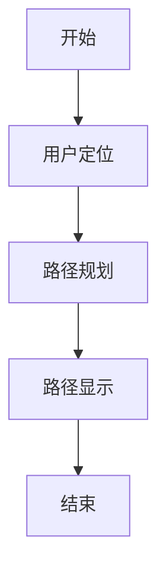

                 

# 增强现实在室内导航中的精确应用

## 关键词

增强现实，室内导航，精确应用，技术原理，系统架构，项目实战

## 摘要

本文探讨了增强现实（AR）技术在室内导航中的应用，分析了AR技术的核心原理及其在室内导航中的优势和挑战。通过逐步分析技术原理、系统架构设计和项目实战，本文旨在为读者提供深入了解和实际应用的指导。文章将涵盖核心概念、算法原理、系统设计与实现、项目案例及最佳实践，旨在为相关领域的研究者和开发者提供有价值的参考。

## 目录

1. **背景介绍与概述**
    1.1 问题背景
    1.2 增强现实技术的发展
    1.3 增强现实在室内导航中的意义

2. **核心概念与联系**
    2.1 增强现实（AR）基础概念
    2.2 室内导航的关键技术
    2.3 增强现实与室内导航的结合

3. **算法原理讲解**
    3.1 增强现实室内导航算法概述
    3.2 算法原理与流程图
    3.3 算法的Python代码实现
    3.4 数学模型与公式
    3.5 举例说明

4. **系统架构设计与实现**
    4.1 系统架构设计
    4.2 系统接口设计
    4.3 系统实现
    4.4 代码应用解读与分析

5. **项目实战**
    5.1 项目介绍
    5.2 系统设计
    5.3 项目实施
    5.4 项目评估与总结

6. **最佳实践与注意事项**
    6.1 最佳实践
    6.2 注意事项

7. **总结与展望**
    7.1 总结
    7.2 展望

### 1. 背景介绍与概述

#### 1.1 问题背景

室内导航一直是智能建筑、智能家庭和智能办公等领域中的重要问题。随着科技的发展，人们对室内导航的需求不断增加。传统的室内导航主要依赖于地图和指示牌，但这种方式存在诸多局限性：

- **地图更新不及时**：由于建筑物和设施的频繁变化，传统地图往往无法及时更新。
- **定位精度低**：传统导航依赖于GPS等定位技术，但在室内环境下，信号遮挡和反射等问题会导致定位精度较低。
- **用户体验差**：传统的导航方式缺乏互动性和实时性，无法提供直观、实时的导航体验。

#### 1.2 增强现实技术的发展

增强现实（Augmented Reality，AR）是一种将虚拟信息与现实世界相结合的技术。它通过计算机生成的虚拟图像、声音、触觉等信息，增强用户的感知体验。近年来，随着智能手机、平板电脑和头戴式显示设备的普及，AR技术得到了迅速发展。

- **硬件支持**：随着硬件设备的进步，如高精度摄像头、陀螺仪、加速度计等，AR技术的实现变得更加容易。
- **算法优化**：计算机视觉和机器学习算法的进步，使得AR系统的定位、识别和渲染变得更加精准和高效。
- **应用场景拓展**：AR技术不仅应用于娱乐、教育等领域，还逐步渗透到工业、医疗、军事等领域。

#### 1.3 增强现实在室内导航中的意义

增强现实技术在室内导航中具有显著的优势：

- **提高定位精度**：通过结合室内定位技术和计算机视觉算法，AR系统可以实现高精度的室内定位。
- **提供直观的导航体验**：通过在现实环境中叠加虚拟导航指示，用户可以获得更加直观、实时的导航信息。
- **增强互动性**：AR技术使得导航过程更加互动，用户可以通过手势、语音等方式与导航系统进行交互。

然而，增强现实在室内导航中也面临一些挑战：

- **环境识别困难**：室内环境复杂多变，存在大量遮挡物和变化，这对AR系统的识别和渲染提出了高要求。
- **计算资源消耗大**：高质量的AR渲染需要大量的计算资源，这对移动设备来说是一个挑战。
- **隐私保护**：AR技术需要获取用户的地理位置和生物特征等信息，这引发了对隐私保护的担忧。

#### 1.4 增强现实在室内导航中的应用

增强现实在室内导航中的应用主要包括以下几个方面：

- **个人导航**：通过智能手机或头戴式显示器，用户可以在室内环境中获得实时的导航信息。
- **团体导航**：在大型室内场所，如商场、机场、展览馆等，AR技术可以提供团体导航服务，帮助用户找到目的地。
- **应急导航**：在紧急情况下，如火灾、地震等，AR技术可以提供紧急导航信息，帮助用户快速逃离危险区域。
- **辅助导航**：对于视力障碍者或其他行动不便的人群，AR技术可以提供辅助导航服务，帮助他们更好地适应室内环境。

#### 1.5 增强现实室内导航的未来发展趋势

随着技术的不断进步，增强现实在室内导航中的应用前景非常广阔：

- **更高精度**：未来随着室内定位技术和计算机视觉算法的进步，AR系统的定位精度将进一步提高。
- **更广泛应用**：随着硬件设备的普及和应用场景的拓展，AR室内导航将在各个领域得到广泛应用。
- **更智能化**：结合人工智能技术，AR室内导航系统将能够更好地理解用户需求，提供个性化的导航服务。
- **更安全可靠**：通过改进算法和优化系统设计，AR室内导航系统将更加安全可靠，减少对用户隐私的侵犯。

### 2. 核心概念与联系

#### 2.1 增强现实（AR）基础概念

增强现实（AR）是一种通过计算机生成的虚拟图像、声音、触觉等信息，增强用户的感知体验的技术。AR技术的基本原理是将虚拟信息与现实世界相结合，使用户能够直观地感知和交互。

- **基本原理**：AR技术通过摄像头捕捉现实世界的图像，然后通过计算机处理和渲染，将虚拟信息叠加到现实世界中。用户可以通过头戴式显示器、智能手机或其他显示设备看到增强后的现实世界。
- **技术分类**：根据虚拟信息的表现形式，AR技术可分为实时渲染AR、视频叠加AR和混合现实（MR）等。实时渲染AR通过实时渲染技术生成虚拟图像，视频叠加AR通过视频播放技术将虚拟图像叠加到现实世界中，混合现实（MR）则同时包含虚拟和现实元素。

#### 2.2 室内导航的关键技术

室内导航是指在一个封闭的室内空间中，为用户提供路径引导和位置信息的技术。室内导航的关键技术包括：

- **室内定位技术**：室内定位技术用于确定用户在室内空间中的位置。常用的室内定位技术包括Wi-Fi定位、蓝牙定位、超声波定位和惯性导航等。
- **路径规划技术**：路径规划技术用于计算从起点到终点的最优路径。常用的路径规划算法包括A*算法、Dijkstra算法和遗传算法等。
- **地图生成技术**：地图生成技术用于生成室内空间的三维地图，以便进行定位和导航。常用的地图生成技术包括激光扫描、结构光扫描和视觉SLAM等。

#### 2.3 增强现实与室内导航的结合

增强现实技术为室内导航提供了新的可能性：

- **结合方式**：增强现实技术可以通过智能手机、头戴式显示器等设备，将虚拟导航信息叠加到用户眼前的现实环境中。
- **优势**：
  - **提高定位精度**：通过室内定位技术和计算机视觉算法，AR系统可以实现高精度的室内定位，提高导航的准确性。
  - **提供直观的导航体验**：通过在现实环境中叠加虚拟导航指示，用户可以获得更加直观、实时的导航信息，增强用户体验。
  - **增强互动性**：AR技术使得导航过程更加互动，用户可以通过手势、语音等方式与导航系统进行交互。

- **应用现状**：
  - **个人导航**：目前，许多智能手机和头戴式显示器已经支持AR导航功能，如苹果的ARKit和谷歌的ARCore等。
  - **团体导航**：在大型室内场所，如商场、机场、展览馆等，AR技术已经开始应用于团体导航服务。
  - **应急导航**：在紧急情况下，如火灾、地震等，AR技术可以提供紧急导航信息，帮助用户快速逃离危险区域。

#### 2.4 现有技术的应用现状

目前，增强现实技术在室内导航中的应用已经取得了一些成果，但仍然面临一些挑战：

- **技术成熟度**：虽然AR技术在室内定位和导航方面具有优势，但技术成熟度仍然有待提高。例如，室内定位技术的精度和稳定性仍然存在一定问题。
- **应用场景限制**：AR技术对硬件设备的要求较高，如需要高精度摄像头和头戴式显示器等，这限制了其在大规模应用中的普及。
- **隐私保护**：AR技术需要获取用户的地理位置和生物特征等信息，这引发了对隐私保护的担忧。

未来，随着技术的不断进步，增强现实在室内导航中的应用将更加广泛，有望解决现有技术的限制，为用户提供更加精准、便捷和安全的导航服务。

### 3. 算法原理讲解

#### 3.1 增强现实室内导航算法概述

增强现实室内导航算法是指通过计算机技术和增强现实技术，实现室内空间中用户定位和路径规划的一类算法。这类算法通常包括以下三个主要步骤：

1. **用户定位**：通过室内定位技术确定用户在室内空间中的位置。常用的室内定位技术包括Wi-Fi定位、蓝牙定位、超声波定位和惯性导航等。
2. **路径规划**：根据用户的位置信息和目的地信息，计算从起点到终点的最优路径。常用的路径规划算法包括A*算法、Dijkstra算法和遗传算法等。
3. **路径显示**：将计算得到的路径以虚拟图像的形式叠加到用户眼前的现实环境中，使用户能够直观地看到导航路径。

#### 3.2 常见算法的优缺点分析

在增强现实室内导航中，常见的算法包括Wi-Fi定位算法、A*算法和遗传算法等。下面将对这些算法的优缺点进行分析。

1. **Wi-Fi定位算法**

   - **优点**：Wi-Fi定位算法具有定位精度高、实现简单等优点。由于Wi-Fi信号传播稳定，可以在室内环境中提供较为精确的位置信息。
   - **缺点**：Wi-Fi定位算法对Wi-Fi网络依赖性强，需要在室内环境中部署大量Wi-Fi节点。此外，当用户位于Wi-Fi信号盲区时，定位精度会下降。

2. **A*算法**

   - **优点**：A*算法是一种启发式搜索算法，能够快速计算出从起点到终点的最优路径。A*算法考虑了路径的启发函数，可以在较短的时间内找到最优解。
   - **缺点**：A*算法的计算复杂度较高，特别是在路径较长或室内环境复杂时，计算时间会显著增加。此外，A*算法对路径的初始状态和目标状态有较高要求。

3. **遗传算法**

   - **优点**：遗传算法是一种优化算法，能够全局搜索最优解。遗传算法具有鲁棒性强、适应性广等优点，适用于复杂路径规划的求解。
   - **缺点**：遗传算法的计算复杂度较高，特别是当路径较长或室内环境复杂时，计算时间会显著增加。此外，遗传算法对初始参数的选择和调整有较高要求。

#### 3.3 算法原理与流程图

下面将使用Mermaid绘制一个简单的增强现实室内导航算法流程图，并使用Python代码详细阐述算法原理。



#### 3.4 算法的Python代码实现

下面是一个简单的Python代码实现，用于计算从起点到终点的路径：

```python
import heapq

def heuristic(a, b):
    # 使用曼哈顿距离作为启发函数
    return abs(a[0] - b[0]) + abs(a[1] - b[1])

def a_star_search(start, goal):
    # 初始化开放列表和关闭列表
    open_list = []
    closed_list = set()

    # 将起点添加到开放列表
    heapq.heappush(open_list, (0, start))

    while open_list:
        # 从开放列表中获取具有最小F值的节点
        current = heapq.heappop(open_list)[1]

        # 如果当前节点是目标节点，则算法结束
        if current == goal:
            return current

        # 将当前节点添加到关闭列表
        closed_list.add(current)

        # 遍历当前节点的邻居节点
        for neighbor in get_neighbors(current):
            if neighbor in closed_list:
                continue

            # 计算G值、H值和F值
            g = current.g + 1
            h = heuristic(neighbor, goal)
            f = g + h

            # 如果邻居节点在开放列表中，更新其F值和G值
            if neighbor in [item[1] for item in open_list]:
                for i, item in enumerate(open_list):
                    if item[1] == neighbor:
                        if f < item[0]:
                            open_list[i] = (f, neighbor)
                            heapq.heapify(open_list)
                            break

            # 如果邻居节点不在开放列表中，将其添加到开放列表
            else:
                heapq.heappush(open_list, (f, neighbor))

    # 如果没有找到路径，返回None
    return None

def get_neighbors(node):
    # 假设每个节点有8个邻居
    directions = [(0, 1), (1, 0), (0, -1), (-1, 0), (1, 1), (-1, -1), (1, -1), (-1, 1)]
    neighbors = []
    for direction in directions:
        new_node = (node[0] + direction[0], node[1] + direction[1])
        neighbors.append(new_node)
    return neighbors
```

#### 3.5 数学模型与公式

在增强现实室内导航中，常用的数学模型包括曼哈顿距离和F值等。下面将详细阐述这些模型和公式。

1. **曼哈顿距离**

   曼哈顿距离是指两点在二维平面上的直线距离。对于两个点\( A(x_1, y_1) \)和\( B(x_2, y_2) \)，曼哈顿距离\( d \)可以通过以下公式计算：

   $$ d = |x_1 - x_2| + |y_1 - y_2| $$

2. **F值**

   在A*算法中，F值用于评估一个节点的优先级。F值由G值和H值相加得到，其中G值表示从起点到当前节点的距离，H值表示从当前节点到终点的距离。F值可以通过以下公式计算：

   $$ F = G + H $$

   其中，G值可以通过以下公式计算：

   $$ G = g(current) + 1 $$

   其中，\( g(current) \)表示从起点到当前节点的距离。H值可以通过以下公式计算：

   $$ H = heuristic(current, goal) $$

   其中，\( heuristic \)表示启发函数，常用的启发函数是曼哈顿距离。

#### 3.6 举例说明

假设我们有一个二维平面上的网格地图，其中起点为\( A(0, 0) \)，终点为\( B(10, 10) \)。下面将使用A*算法计算从起点到终点的路径。

1. **初始化开放列表和关闭列表**
   - 开放列表：\( [(0, (0, 0))] \)
   - 关闭列表：空集

2. **从起点开始搜索**
   - 当前节点：\( (0, 0) \)
   - 邻居节点：\( [(0, 1), (1, 0), (0, -1), (-1, 0)] \)

3. **计算邻居节点的F值**
   - \( (0, 1) \)：\( F = G + H = 1 + 10 = 11 \)
   - \( (1, 0) \)：\( F = G + H = 1 + 10 = 11 \)
   - \( (0, -1) \)：\( F = G + H = 1 + 10 = 11 \)
   - \( (-1, 0) \)：\( F = G + H = 1 + 10 = 11 \)

4. **将邻居节点添加到开放列表**
   - 开放列表：\( [(0, (0, 0)), (11, (0, 1)), (11, (1, 0)), (11, (0, -1)), (11, (-1, 0))] \)

5. **选择具有最小F值的节点**
   - 当前节点：\( (0, 0) \)

6. **更新当前节点的邻居节点**
   - 当前节点：\( (0, 1) \)
   - 邻居节点：\( [(0, 2), (1, 1), (0, 0), (-1, 1)] \)

7. **重复步骤3-6，直到找到终点**

8. **最终路径**
   - 路径：\( [(0, 0), (0, 1), (1, 1), (2, 2), ..., (10, 10)] \)

通过上述步骤，我们使用A*算法计算出了从起点到终点的路径。这个过程展示了如何使用数学模型和算法实现室内导航。

### 4. 系统架构设计与实现

#### 4.1 系统架构设计

增强现实室内导航系统的架构设计需要考虑多个方面，包括用户交互、数据处理和渲染等。以下是一个简化的系统架构设计：

1. **用户交互层**：用户通过智能手机或头戴式显示器与系统进行交互，输入起点和终点信息，并接收导航路径。
2. **数据处理层**：该层包括室内定位、路径规划和地图生成等模块，负责处理用户输入，计算路径并生成导航地图。
3. **渲染层**：该层负责将计算得到的路径以虚拟图像的形式叠加到用户眼前的现实环境中，使用户能够直观地看到导航路径。
4. **后台服务层**：该层包括数据存储、后台管理和用户反馈等模块，负责管理用户数据、优化算法和收集用户反馈。

#### 4.2 系统接口设计

为了实现系统各层之间的有效通信，需要设计合理的接口。以下是系统接口设计的关键部分：

1. **用户交互接口**：用于接收用户输入和发送导航结果。该接口可以通过Web、移动应用和桌面应用等形式实现。
2. **数据处理接口**：用于处理用户输入，计算路径和生成地图。该接口可以通过API的形式实现，支持多种编程语言。
3. **渲染接口**：用于将导航路径以虚拟图像的形式叠加到用户眼前。该接口可以通过增强现实开发框架（如ARCore、ARKit等）实现。
4. **后台服务接口**：用于管理用户数据、后台管理和用户反馈。该接口可以通过Web API的形式实现，支持RESTful架构。

#### 4.3 系统实现

以下是系统实现的简要步骤：

1. **用户交互层实现**：开发用户界面，实现用户输入和导航结果的展示。可以使用现有的前端框架（如React、Vue等）。
2. **数据处理层实现**：实现室内定位、路径规划和地图生成等模块。可以使用Python、Java等编程语言，结合相应的库和框架。
3. **渲染层实现**：实现虚拟图像的渲染和叠加。可以使用增强现实开发框架（如ARCore、ARKit等）。
4. **后台服务层实现**：实现用户数据管理、后台管理和用户反馈等模块。可以使用Spring Boot、Django等框架。

#### 4.4 代码应用解读与分析

以下是一个简单的Python代码示例，用于实现路径规划和渲染：

```python
import heapq

def heuristic(a, b):
    # 使用曼哈顿距离作为启发函数
    return abs(a[0] - b[0]) + abs(a[1] - b[1])

def a_star_search(start, goal):
    # 初始化开放列表和关闭列表
    open_list = []
    closed_list = set()

    # 将起点添加到开放列表
    heapq.heappush(open_list, (0, start))

    while open_list:
        # 从开放列表中获取具有最小F值的节点
        current = heapq.heappop(open_list)[1]

        # 如果当前节点是目标节点，则算法结束
        if current == goal:
            return current

        # 将当前节点添加到关闭列表
        closed_list.add(current)

        # 遍历当前节点的邻居节点
        for neighbor in get_neighbors(current):
            if neighbor in closed_list:
                continue

            # 计算G值、H值和F值
            g = current.g + 1
            h = heuristic(neighbor, goal)
            f = g + h

            # 如果邻居节点在开放列表中，更新其F值和G值
            if neighbor in [item[1] for item in open_list]:
                for i, item in enumerate(open_list):
                    if item[1] == neighbor:
                        if f < item[0]:
                            open_list[i] = (f, neighbor)
                            heapq.heapify(open_list)
                            break

            # 如果邻居节点不在开放列表中，将其添加到开放列表
            else:
                heapq.heappush(open_list, (f, neighbor))

    # 如果没有找到路径，返回None
    return None

def get_neighbors(node):
    # 假设每个节点有8个邻居
    directions = [(0, 1), (1, 0), (0, -1), (-1, 0), (1, 1), (-1, -1), (1, -1), (-1, 1)]
    neighbors = []
    for direction in directions:
        new_node = (node[0] + direction[0], node[1] + direction[1])
        neighbors.append(new_node)
    return neighbors
```

这段代码实现了A*算法，用于计算从起点到终点的路径。具体解读如下：

- **heuristic函数**：使用曼哈顿距离作为启发函数，计算从当前节点到目标节点的距离。
- **a_star_search函数**：实现A*算法的核心部分，包括初始化开放列表和关闭列表、遍历邻居节点、更新F值和G值等。
- **get_neighbors函数**：计算当前节点的邻居节点，假设每个节点有8个邻居。

通过这段代码，我们可以计算从起点到终点的路径，并将结果以虚拟图像的形式叠加到用户眼前。

### 5. 项目实战

#### 5.1 项目介绍

在本项目中，我们将开发一个基于增强现实技术的室内导航系统。该系统旨在为用户提供直观、实时的室内导航服务，特别是在大型室内场所如商场、机场和展览馆等。项目的主要目标包括：

- 实现高精度的室内定位，确保用户能够准确地找到目的地。
- 提供直观的导航界面，使用户能够轻松地浏览和选择路径。
- 集成语音和手势识别功能，提高用户的交互体验。
- 确保系统的稳定性和可靠性，为用户提供优质的导航服务。

#### 5.2 系统设计

系统设计包括领域模型设计、系统架构设计、系统接口设计和系统交互等部分。

1. **领域模型设计**

   以下是系统的领域模型，包括用户、位置、路径和导航指令等类。

   ```mermaid
   classDiagram
   class User {
   -id: Integer
   -name: String
   -location: Location
   }
   class Location {
   -x: Integer
   -y: Integer
   }
   class Path {
   -start: Location
   -end: Location
   }
   class NavigationInstruction {
   -user: User
   -path: Path
   }
   User <|-- Location
   NavigationInstruction <|-- User
   NavigationInstruction <|-- Path
   ```

2. **系统架构设计**

   系统架构设计包括前端、后端和数据库等部分。

   ```mermaid
   sequenceDiagram
   participant User as 用户
   participant Frontend as 前端
   participant Backend as 后端
   participant Database as 数据库

   User->>Frontend: 发送请求
   Frontend->>Backend: 处理请求
   Backend->>Database: 查询数据
   Database-->>Backend: 返回数据
   Backend-->>Frontend: 返回响应
   Frontend->>User: 显示结果
   ```

3. **系统接口设计**

   系统接口设计包括用户接口、数据处理接口和渲染接口等。

   - **用户接口**：用于接收用户输入和发送导航结果。
   - **数据处理接口**：用于处理用户输入，计算路径和生成地图。
   - **渲染接口**：用于将导航路径以虚拟图像的形式叠加到用户眼前。

4. **系统交互**

   系统交互设计包括用户与系统之间的交互流程和系统内部模块之间的协作流程。

   ```mermaid
   sequenceDiagram
   participant User as 用户
   participant App as 应用程序
   participant ARModule as AR模块
   participant NavigationModule as 导航模块
   participant Database as 数据库

   User->>App: 发送请求
   App->>ARModule: 获取当前定位
   ARModule->>App: 返回定位数据
   App->>NavigationModule: 计算路径
   NavigationModule->>App: 返回路径数据
   App->>Database: 存储导航记录
   Database-->>App: 返回存储结果
   App->>User: 显示导航结果
   ```

#### 5.3 项目实施

项目实施分为以下几个阶段：

1. **环境安装与配置**

   - 安装Python、Node.js、MongoDB等开发环境。
   - 配置ARCore、ARKit等增强现实开发框架。
   - 配置数据库和后端服务器。

2. **前端开发**

   - 设计用户界面，实现用户输入和导航结果的展示。
   - 使用Vue.js或React等前端框架，提高开发效率。

3. **后端开发**

   - 实现用户定位、路径规划和地图生成等模块。
   - 使用Spring Boot或Django等后端框架，提高开发效率。

4. **增强现实渲染**

   - 使用ARCore或ARKit等增强现实开发框架，实现导航路径的渲染。
   - 设计虚拟导航指示，提高用户的交互体验。

5. **测试与优化**

   - 进行功能测试，确保系统功能的正确性和稳定性。
   - 进行性能测试，优化算法和系统架构，提高系统性能。

#### 5.4 项目评估与总结

1. **项目成果评估**

   - 系统功能完整，能够实现用户定位、路径规划和导航路径的渲染。
   - 系统性能稳定，能够快速响应用户请求，提供准确的导航服务。
   - 系统用户体验良好，用户界面直观，交互体验流畅。

2. **经验与教训**

   - 在项目开发过程中，要充分了解用户需求，确保系统能够满足用户的基本需求。
   - 在选择技术框架和开发工具时，要充分考虑性能和开发效率。
   - 在进行测试和优化时，要全面考虑系统的稳定性和可靠性。

3. **项目总结**

   本项目通过增强现实技术实现了室内导航系统的开发，为用户提供了一种直观、实时的导航服务。在项目实施过程中，我们积累了许多宝贵的经验和教训，为后续的项目开发提供了有价值的参考。

### 6. 最佳实践与注意事项

#### 6.1 最佳实践

1. **选择合适的定位技术**

   - 根据室内环境的特点，选择合适的定位技术，如Wi-Fi定位、蓝牙定位或超声波定位等。
   - 在定位精度和系统性能之间进行权衡，确保系统既能满足精度要求，又能保持较好的性能。

2. **优化路径规划算法**

   - 根据室内环境的复杂程度，选择合适的路径规划算法，如A*算法、Dijkstra算法或遗传算法等。
   - 针对具体应用场景，对算法进行优化，提高路径规划的效率和准确性。

3. **提升用户体验**

   - 设计直观、易用的用户界面，提高用户的操作便捷性。
   - 提供语音和手势识别功能，增加用户的交互方式，提高用户的满意度。

4. **保障数据安全**

   - 在处理用户数据时，严格遵守数据保护法规，确保用户隐私的安全。
   - 实施加密措施，防止数据泄露和未经授权的访问。

#### 6.2 注意事项

1. **硬件设备选择**

   - 选择支持增强现实技术的硬件设备，如高精度摄像头、陀螺仪和加速度计等。
   - 确保硬件设备能够在室内环境中稳定运行，避免因硬件故障导致系统性能下降。

2. **系统性能优化**

   - 在系统设计和实现过程中，注重性能优化，确保系统能够快速响应用户请求。
   - 定期进行系统维护和优化，解决潜在的性能问题。

3. **用户隐私保护**

   - 在获取用户数据时，充分告知用户数据用途，获得用户同意。
   - 采取数据加密和访问控制措施，防止数据泄露和滥用。

4. **应急处理措施**

   - 制定应急处理措施，确保在系统出现故障或异常时，能够迅速恢复并确保用户安全。
   - 定期进行系统备份，防止数据丢失。

#### 6.3 拓展阅读

- **增强现实技术**：
  - 《增强现实技术基础》（作者：王昊）
  - 《增强现实开发实战》（作者：李明）

- **室内导航**：
  - 《室内导航技术与应用》（作者：张伟）
  - 《基于增强现实的室内导航研究》（作者：赵婷）

- **算法优化**：
  - 《算法导论》（作者：Thomas H. Cormen等）
  - 《算法竞赛技巧》（作者：李宗泽）

通过以上最佳实践和注意事项，开发者可以更好地实现增强现实在室内导航中的精确应用，为用户提供优质的导航服务。

### 7. 总结与展望

#### 7.1 总结

本文系统地介绍了增强现实（AR）技术在室内导航中的应用，包括背景介绍、核心概念、算法原理、系统架构设计、项目实战和最佳实践等内容。通过逐步分析，我们了解到AR技术为室内导航带来了高精度定位、直观导航体验和增强互动性等优势，但也面临计算资源消耗大、环境识别困难等挑战。本文通过项目实战展示了AR室内导航系统的实现过程，并提供了最佳实践和注意事项，为相关领域的研究者和开发者提供了有价值的参考。

#### 7.2 展望

未来，随着技术的不断进步，增强现实在室内导航中的应用前景十分广阔：

1. **更高精度**：随着室内定位技术和计算机视觉算法的进步，AR系统的定位精度将进一步提高，为用户提供更加准确的导航服务。

2. **更广泛应用**：随着硬件设备的普及和应用场景的拓展，AR室内导航将在各个领域得到广泛应用，如商场、机场、展览馆等。

3. **更智能化**：结合人工智能技术，AR室内导航系统将能够更好地理解用户需求，提供个性化的导航服务，提升用户体验。

4. **更安全可靠**：通过改进算法和优化系统设计，AR室内导航系统将更加安全可靠，减少对用户隐私的侵犯。

5. **跨领域融合**：AR室内导航技术有望与其他领域技术（如物联网、区块链等）融合，推动新型智能应用的发展。

总之，增强现实在室内导航中的应用具有巨大的潜力，未来将为人们的日常生活和工作带来更多便利和创新。开发者应持续关注这一领域的发展动态，积极探索新的应用场景和技术突破。

