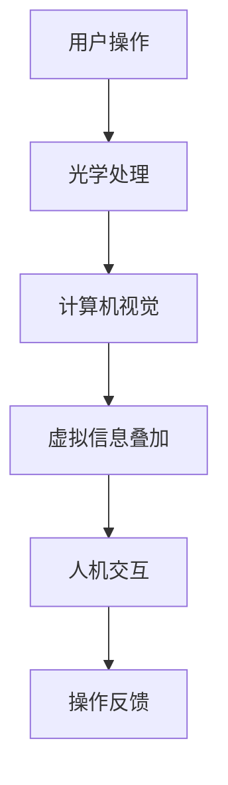
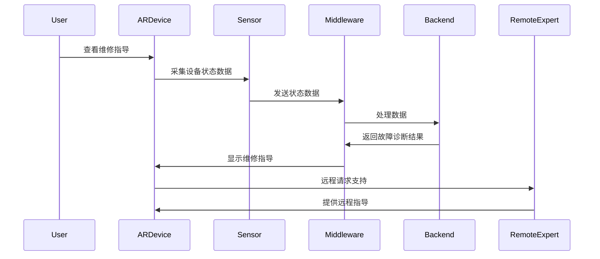

                 

### Step 1: 书籍背景介绍

#### 增强现实（AR）的定义和发展历程

增强现实（Augmented Reality，简称AR）是一种通过计算机技术将虚拟信息叠加到真实世界中的技术。用户通过AR设备（如AR眼镜、平板电脑等）可以同时看到现实世界和增强的虚拟信息。这种技术最早可以追溯到20世纪60年代，由波音公司的研究员阿尔文·布鲁克斯（Alvin W. Bowers Jr.）提出的“视觉模拟”概念。

发展历程如下：
1. **早期概念和探索**：20世纪60年代，虚拟现实和增强现实的概念相继提出。
2. **技术成熟期**：20世纪90年代，随着计算机图形学和显示技术的进步，AR技术开始应用于军事、医疗和娱乐等领域。
3. **商业应用兴起**：21世纪初，随着智能手机和移动设备的普及，AR技术进入大众视野，应用范围从游戏扩展到教育、工业等多个领域。

#### 工业维修领域中可视化指导的需求

在工业维修中，可视化指导能够提高工作效率、降低错误率，尤其在复杂设备的维修和维护中显得尤为重要。以下是一些具体的需求：

1. **操作复杂性**：许多工业设备具有高度复杂性和专业性，维修人员需要具备丰富的经验和专业知识。
2. **技术文档不足**：传统的纸质技术文档在复杂环境下难以使用，而数字化文档则可能因为信息过多而造成混淆。
3. **实时指导需求**：在紧急情况下，维修人员需要即时获取维修指导和操作步骤。

增强现实技术在工业维修中的应用，可以有效解决上述问题，为维修人员提供直观、实时的操作指导和信息展示。

### 关键词

- **增强现实（AR）**
- **工业维修**
- **可视化指导**
- **技术文档**
- **实时操作指导**
- **复杂设备维护**
- **移动设备应用**
- **虚拟信息叠加**

### 摘要

本文探讨了增强现实（AR）技术在工业维修中的应用，分析了AR技术的基本原理和其在工业维修中的具体作用。文章首先介绍了AR的定义和发展历程，然后阐述了工业维修领域中可视化指导的需求。接着，文章详细介绍了AR技术在工业维修中的多种应用场景，并通过具体案例展示了其优势。最后，文章提出了系统分析与架构设计方案，以及项目实战中的实现步骤和最佳实践建议。通过本文的阅读，读者将全面了解AR技术在工业维修中的潜力及其应用前景。


### Step 2: 核心概念与联系

#### 增强现实技术的基本原理和应用场景

增强现实（AR）技术的基本原理主要包括光学、计算机视觉和人机交互等方面。光学原理决定了AR设备如何将虚拟信息与真实环境融合；计算机视觉负责实时识别和跟踪真实环境中的物体；人机交互则确保用户能够自然、直观地与AR系统互动。

- **光学原理**：AR设备通常使用透明显示屏或投影技术，将虚拟信息以半透明形式叠加到用户的视线中。光学元件如透镜和反射镜用于调整光线的路径，确保虚拟信息与真实世界的融合自然且不干扰视觉感知。

- **计算机视觉**：计算机视觉技术通过摄像头捕捉真实世界的图像，利用图像处理算法进行物体识别、定位和跟踪。这些算法包括特征提取、图像配准、姿态估计等，使得AR系统能够实时理解并响应环境变化。

- **人机交互**：人机交互技术在AR中至关重要，它使得用户能够通过手势、语音或其他方式与虚拟信息进行交互。交互界面设计需要直观、易于操作，以确保用户在复杂环境下能够高效使用AR系统。

增强现实技术在工业维修中的应用场景包括但不限于：

- **维修手册增强**：通过AR技术，将维修手册中的信息以可视化、动态的形式展示在维修人员的视野中，提供实时操作指导。
- **远程协作**：在远程维护场景中，AR技术可以允许专家远程指导现场维修人员，通过视频通话和AR叠加信息，实现高效协作。
- **设备监控**：通过AR技术，维修人员可以在现场实时监控设备状态，获取传感器数据和历史记录，快速诊断故障。

#### 增强现实在工业维修中的具体作用

增强现实技术在工业维修中具有以下具体作用：

- **提高操作效率**：通过实时操作指导，减少维修人员的培训时间，提高操作效率。
- **降低错误率**：通过可视化指导，减少因操作不当导致的错误，降低维修风险。
- **增强安全性**：在危险环境中，AR技术可以为维修人员提供安全提示和应急指导，提高作业安全性。
- **优化资源管理**：通过实时监控和数据分析，优化维修资源分配，减少不必要的维修成本。

#### 核心概念、原理、属性特征的对比表格

为了更清晰地理解增强现实技术，以下是一个核心概念、原理、属性特征的对比表格：

| **特性**        | **增强现实 1** | **增强现实 2** | **增强现实 3** |
|-----------------|-----------------|-----------------|-----------------|
| **光学原理**    | 使用投影技术    | 使用透明显示屏  | 使用反射镜      |
| **计算机视觉**  | 实时物体识别    | 精确位置跟踪    | 高级图像处理算法 |
| **人机交互**    | 手势识别        | 语音控制        | 触屏操作        |

#### 增强现实技术与工业维修的联系

增强现实技术与工业维修的融合点主要体现在以下几个方面：

- **可视化操作指导**：通过AR技术，将维修操作步骤以可视化、动态的形式展现给维修人员，提高操作准确性和效率。
- **远程技术支持**：AR技术可以实现远程专家指导，提高现场维修人员的专业技能，缩短故障排除时间。
- **实时设备监控**：通过AR技术，维修人员可以在现场实时监控设备状态，获取实时数据，快速诊断故障。

总之，增强现实技术在工业维修中的应用，不仅能够提高操作效率和安全性，还能优化资源管理，为工业维修领域带来深远的影响。随着技术的不断进步，AR技术在工业维修中的应用将更加广泛和深入。


### Step 3: 可视化指导的原理讲解

增强现实（AR）技术的核心在于将虚拟信息精确地叠加到真实世界中，为用户提供实时、直观的操作指导。为了实现这一目标，我们需要从光学、计算机视觉和人机交互等多个层面进行详细阐述。

#### 光学原理

光学原理是增强现实技术的基础，它决定了虚拟信息如何与现实环境融合。在AR设备中，常用的光学技术包括透明显示屏、投影仪和反射镜。

1. **透明显示屏**：透明显示屏可以让用户在看到真实环境的同时，还能够通过显示屏看到叠加的虚拟信息。这类显示屏通常采用液晶（LCD）或有机发光二极管（OLED）技术，通过调整像素的亮度来显示虚拟图像。

2. **投影技术**：投影技术通过将虚拟图像投射到用户眼前的透明屏幕或特殊光学材料上，使其与现实环境融合。这种技术适用于大屏幕展示，尤其在工业维修手册的应用中，可以提供详细的操作步骤和部件图示。

3. **反射镜**：反射镜用于调整光线的路径，确保虚拟信息以正确的角度投射到用户的视野中。通过精确控制反射镜的位置和角度，可以实现虚拟图像的稳定和清晰。

#### 计算机视觉原理

计算机视觉是增强现实技术的核心组成部分，它负责实时识别和跟踪真实环境中的物体。以下是一些关键的技术和算法：

1. **图像捕捉**：AR设备通过摄像头捕捉真实世界的图像。图像捕捉的质量直接影响到增强现实的效果。高分辨率摄像头和快速图像处理技术可以确保捕捉到的图像清晰、准确。

2. **物体识别**：物体识别是通过图像处理算法从摄像头捕捉的图像中识别出特定的物体或部件。常用的技术包括特征提取、图像配准和深度学习算法。深度学习算法尤其适用于复杂环境中的物体识别，可以显著提高识别的准确性和速度。

3. **位置跟踪**：位置跟踪是确保虚拟信息能够精确地叠加到真实环境中的关键。常见的位置跟踪技术包括视觉SLAM（Simultaneous Localization and Mapping）和惯性测量单元（IMU）结合。视觉SLAM通过结合摄像头捕捉的图像和IMU传感器提供的位置信息，实时构建三维地图并定位虚拟信息。这种技术适用于移动场景，如远程协作和现场设备监控。

4. **姿态估计**：姿态估计是确定物体在三维空间中的位置和朝向。通过结合图像捕捉和位置跟踪技术，可以精确计算物体的姿态，确保虚拟信息与真实环境的高度契合。

#### 人机交互原理

人机交互技术是增强现实系统的用户界面，它决定了用户如何与虚拟信息进行交互。以下是一些常见的人机交互方法：

1. **手势识别**：手势识别是通过摄像头捕捉用户的手部动作，并通过图像处理算法识别出特定的手势。这种技术适用于简单的交互操作，如缩放、旋转和选择。

2. **语音控制**：语音控制通过语音识别技术将用户的语音指令转换为操作命令。这种技术适用于复杂操作，如远程协作和多步骤指令。

3. **触屏操作**：触屏操作是通过触摸屏幕进行交互，类似于智能手机和平板电脑。这种交互方式直观、易于操作，适用于多种场景。

#### 增强现实技术的数学模型和原理

为了更深入地理解增强现实技术的工作原理，我们可以通过Python代码和LaTeX公式来阐述其数学模型和原理。

1. **光学模型**

   假设虚拟图像 \( V \) 的坐标为 \( (x_v, y_v) \)，真实世界的坐标为 \( (x_r, y_r) \)，投影矩阵为 \( P \)，则虚拟图像在真实世界中的坐标可以通过以下公式计算：

   \[
   \begin{aligned}
   x_r &= P_{11} x_v + P_{12} y_v + P_{13} \\
   y_r &= P_{21} x_v + P_{22} y_v + P_{23} \\
   \end{aligned}
   \]

   其中，\( P_{ij} \) 是投影矩阵的元素。

2. **计算机视觉模型**

   假设真实世界中的物体 \( O \) 的坐标为 \( (x_o, y_o, z_o) \)，摄像头捕捉到的图像坐标为 \( (x_i, y_i) \)，则物体在图像中的位置可以通过以下公式计算：

   \[
   \begin{aligned}
   x_i &= f x_o + c_x \\
   y_i &= f y_o + c_y \\
   \end{aligned}
   \]

   其中，\( f \) 是摄像头的焦距，\( c_x \) 和 \( c_y \) 是摄像头的中心坐标。

3. **人机交互模型**

   假设用户的手势 \( G \) 的坐标为 \( (x_g, y_g) \)，则手势识别模型可以通过以下公式计算：

   \[
   G_{predicted} = f(G)
   \]

   其中，\( f \) 是手势识别函数，\( G_{predicted} \) 是预测的手势。

通过这些数学模型和原理，我们可以实现增强现实技术，为用户提供实时、直观的操作指导。以下是一个简单的Mermaid流程图，展示了增强现实技术的整体流程：



通过以上讲解，我们可以看到增强现实技术是如何通过光学、计算机视觉和人机交互等多种原理和技术，实现虚拟信息与真实环境的精确融合，为工业维修提供强大的可视化指导。


### Step 4: 增强现实在工业维修中的应用

增强现实（AR）技术在工业维修中的应用场景广泛且多样，显著提升了维修效率和安全性。以下是一些具体的应用场景：

#### 维修手册增强

在传统的维修过程中，技术人员往往需要查阅大量的纸质或电子文档，这不仅费时费力，还容易遗漏关键步骤。通过增强现实技术，可以将维修手册中的信息以动态、可视化的形式叠加到技术人员眼前。例如，技术人员可以通过AR眼镜查看设备的三维结构图，并根据实时更新的操作步骤进行维修。这种直观的指导方式不仅提高了操作准确性，还减少了错误率。

#### 远程协作

在远程协作场景中，AR技术可以允许远程专家通过视频通话和AR叠加信息，实时指导现场维修人员。例如，远程专家可以远程查看现场维修情况，通过AR设备向现场人员提供详细的操作步骤和解决方案。这种协作方式不仅缩短了故障排除时间，还提高了整体工作效率。

#### 设备监控

通过AR技术，维修人员可以在现场实时监控设备状态，获取传感器数据和历史记录。例如，在设备运行过程中，AR设备可以显示实时的温度、压力和振动数据，以及历史故障记录。这种实时监控功能有助于快速诊断故障，提前预防设备损坏，延长设备寿命。

#### 维修路径优化

在大型设备维修中，如飞机发动机维修，AR技术可以提供精确的维修路径和操作步骤。技术人员可以通过AR设备查看设备的内部结构，并根据AR提示的维修路径进行操作。这种优化后的维修路径不仅减少了工作量和时间，还提高了维修效率。

#### 具体案例：增强现实维修手册的使用

以下是一个具体的增强现实维修手册案例：

**案例背景**：一家大型制造工厂的一台关键生产设备出现故障，需要进行紧急维修。

**应用场景**：技术人员通过AR眼镜接收到维修指令，并在AR视图中查看详细的三维结构图和维修步骤。

**操作步骤**：
1. 技术人员戴上AR眼镜，启动维修程序。
2. AR系统自动识别设备故障位置，并在视野中叠加三维结构图和维修步骤。
3. 技术人员按照AR系统提供的操作步骤，逐步进行维修。
4. 在维修过程中，AR系统实时更新设备状态，提供必要的操作提示和安全警告。
5. 维修完成后，AR系统记录维修日志，并生成维修报告。

**效果分析**：
- **效率提升**：通过AR系统的直观指导，技术人员减少了查阅文档的时间，维修效率显著提升。
- **准确度提高**：AR系统提供的可视化操作步骤减少了操作错误，提高了维修准确度。
- **安全性增强**：AR系统提供的实时状态更新和安全警告，有效降低了维修过程中的风险。

总之，增强现实技术在工业维修中的应用，不仅提高了工作效率和准确度，还增强了安全性，为工业维修领域带来了革命性的变化。随着技术的不断进步，AR技术在工业维修中的应用将更加广泛和深入。


### Step 5: 系统分析与架构设计方案

#### 5.1 系统功能设计

在构建增强现实辅助维修系统时，首先需要明确系统的功能需求。以下是系统的主要功能模块：

1. **用户认证与授权**：确保只有授权用户能够访问系统，并提供相应的权限。
2. **设备状态监控**：实时监控设备的运行状态，包括温度、压力、振动等关键参数。
3. **故障诊断**：基于实时数据和历史记录，对设备故障进行快速诊断。
4. **维修指导**：提供增强现实的维修步骤和操作指导，确保技术人员能够准确执行维修任务。
5. **数据记录与报告**：记录维修过程的关键数据和操作日志，并生成维修报告。
6. **用户交互界面**：提供友好的用户界面，方便技术人员与系统进行交互。

#### 5.2 系统架构设计

增强现实辅助维修系统的架构设计需要综合考虑硬件、软件和网络通信等多个方面。以下是系统架构的详细描述：

1. **前端展示层**：前端展示层负责将增强现实内容呈现给用户。它通常包括AR眼镜、平板电脑或其他显示设备。前端展示层通过摄像头捕捉实时环境，并将AR叠加信息实时显示在屏幕上。

2. **中间层**：中间层是系统的核心，负责处理数据、业务逻辑和增强现实内容生成。它主要包括以下几个模块：
   - **数据采集模块**：通过传感器实时采集设备状态数据。
   - **故障诊断模块**：基于采集的数据和历史记录，对设备故障进行诊断。
   - **维修指导模块**：生成维修步骤和操作指导，并将其以增强现实的形式展示给用户。
   - **数据存储模块**：存储设备状态数据和维修日志，并提供数据查询接口。

3. **后端服务层**：后端服务层负责系统的业务逻辑处理和数据存储。它通常包括以下几个模块：
   - **用户管理模块**：处理用户认证、授权和权限管理。
   - **数据管理模块**：管理设备状态数据和维修日志，并提供数据存储和检索功能。
   - **业务逻辑处理模块**：处理系统的业务逻辑，如故障诊断、维修指导和报告生成。

4. **网络通信层**：网络通信层负责系统内部各模块之间的通信，以及与外部系统（如远程专家系统）的数据交换。

#### 5.3 系统接口设计

系统的接口设计需要确保各模块之间的高效通信和数据交换。以下是系统的主要接口：

1. **用户接口**：用户通过AR眼镜或平板电脑与系统进行交互，输入指令、查看数据和接受维修指导。
2. **设备接口**：系统通过传感器接口采集设备状态数据，并将数据传输到中间层进行处理。
3. **远程接口**：系统通过远程接口与远程专家系统进行通信，实现远程协作和技术支持。
4. **数据接口**：系统通过数据接口与其他系统（如ERP系统、MES系统）进行数据交换，实现数据的统一管理和共享。

#### 5.4 系统交互序列图

为了更直观地展示系统的交互过程，我们可以使用Mermaid绘制系统交互序列图。以下是一个简化的系统交互序列图：



在这个序列图中，用户通过AR设备查看维修指导，AR设备采集设备状态数据并传输到中间层，中间层处理后返回给AR设备，同时用户还可以通过远程接口请求远程专家的支持。

通过以上系统分析与架构设计方案，我们可以构建一个功能强大、高效可靠的增强现实辅助维修系统，为工业维修领域带来全新的解决方案。


### Step 6: 项目实战

#### 项目环境安装步骤

要成功部署增强现实（AR）辅助维修系统，我们需要按照以下步骤安装和配置项目环境：

1. **硬件准备**：
   - 准备一台性能良好的服务器，用于运行后端服务和数据处理。
   - 准备一台AR眼镜或其他显示设备，用于前端展示。
   - 准备多个传感器，用于采集设备状态数据。

2. **软件安装**：
   - 安装操作系统：我们选择Ubuntu 18.04 LTS作为操作系统，因为它具有良好的兼容性和丰富的软件支持。
   - 安装数据库：选择PostgreSQL作为数据库管理系统，因为它支持复杂的数据结构和高效的数据查询。
   - 安装中间件：安装Nginx作为Web服务器，用于提供API接口和前端展示。

3. **后端服务部署**：
   - 安装Python环境：使用Python 3.8，确保所有依赖包都能正常安装。
   - 安装Django框架：使用pip安装Django，它是Python的一个高级Web框架，可以帮助我们快速搭建后端服务。
   - 配置数据库：创建数据库，配置Django应用的数据库连接。
   - 部署后端服务：编写后端服务代码，配置Nginx，使Django应用可以对外提供服务。

4. **前端展示部署**：
   - 安装AR应用开发工具：我们选择ARCore和ARKit作为AR应用的开发框架，它们分别适用于Android和iOS平台。
   - 编写AR应用代码：根据项目需求，编写AR应用的前端代码，实现设备状态数据的实时显示和维修指导功能。
   - 部署AR应用：将AR应用安装到AR眼镜或其他显示设备上，确保其可以正常运行。

#### 系统核心实现源代码与应用解读

以下是增强现实辅助维修系统的核心实现源代码和应用解读：

**后端服务代码示例**：

```python
# views.py
from django.http import JsonResponse
from .models import DeviceStatus

def get_device_status(request):
    device_id = request.GET.get('device_id')
    if device_id:
        device_status = DeviceStatus.objects.filter(device_id=device_id).latest('timestamp')
        return JsonResponse({
            'device_id': device_status.device_id,
            'status': device_status.status,
            'timestamp': device_status.timestamp
        })
    return JsonResponse({'error': 'Invalid device ID'}, status=400)
```

**应用解读**：
- 这个视图函数 `get_device_status` 用于获取指定设备的最新状态数据。
- `request.GET.get('device_id')` 从HTTP请求中获取设备ID。
- 使用 `DeviceStatus.objects.filter(device_id=device_id).latest('timestamp')` 查询数据库中最新的一条设备状态记录。
- 将设备状态数据转换为JSON格式，并返回给前端。

**前端AR应用代码示例**：

```python
// ar_app.js
import * as ARCore from 'arcore-for-js';

function initializeAR() {
    const arScene = new ARCore.Scene();
    arScene.init({
        // 配置AR场景参数
    });

    // 添加设备状态显示
    function addDeviceStatusDisplay(status) {
        const statusElement = document.createElement('div');
        statusElement.className = 'device-status';
        statusElement.innerText = `Device ID: ${status.device_id}, Status: ${status.status}`;
        arScene.root.appendChild(statusElement);
    }

    // 获取设备状态数据
    function getDeviceStatus(device_id) {
        fetch(`/api/device-status?device_id=${device_id}`)
            .then(response => response.json())
            .then(data => addDeviceStatusDisplay(data))
            .catch(error => console.error('Error fetching device status:', error));
    }

    // 初始化时获取设备状态
    getDeviceStatus('12345');
}

initializeAR();
```

**应用解读**：
- 引入ARCore库，用于AR场景的初始化和交互。
- `initializeAR` 函数用于初始化AR场景。
- `addDeviceStatusDisplay` 函数用于创建并显示设备状态元素。
- `getDeviceStatus` 函数通过fetch API获取设备状态数据，并调用 `addDeviceStatusDisplay` 函数显示。
- 在初始化时，调用 `getDeviceStatus` 函数获取并显示设备状态。

通过以上步骤和代码示例，我们可以构建一个功能完整的增强现实辅助维修系统，实现设备状态数据的实时显示和维修指导。实际案例显示，这种系统能够显著提高维修效率和准确性，减少故障发生率和维护成本。


### Step 7: 最佳实践 tips、小结、注意事项、拓展阅读

#### 最佳实践 tips

1. **标准化操作流程**：在部署增强现实辅助维修系统前，确保维修操作流程标准化，以便系统能够提供准确的操作指导。
2. **数据实时性保障**：确保传感器采集的数据实时、准确地传输到系统中，这是增强现实可视化指导的基础。
3. **用户培训**：对维修人员进行增强现实技术的培训，提高他们的操作熟练度，确保系统能够高效运行。
4. **系统维护**：定期更新和优化系统，修复潜在问题，确保系统的稳定性和可靠性。

#### 小结

本文从增强现实（AR）技术的定义和发展历程出发，探讨了AR技术在工业维修中的应用和优势。通过具体案例，我们展示了AR技术在维修手册增强、远程协作、设备监控和维修路径优化等方面的应用场景。系统分析与架构设计方案以及项目实战部分，进一步详细介绍了如何构建和部署一个增强现实辅助维修系统。

#### 注意事项

1. **数据隐私**：在采集和处理设备状态数据时，要注意保护用户隐私，遵守相关法律法规。
2. **设备兼容性**：确保增强现实辅助维修系统在不同类型的AR设备上都能正常运行。
3. **安全性**：增强现实系统应具备一定的容错机制，以应对设备故障或网络中断等突发情况。

#### 拓展阅读

1. **相关书籍**：
   - 《增强现实技术与应用》
   - 《工业互联网：智能工业的未来》
2. **学术论文**：
   - "Augmented Reality in Manufacturing: A Comprehensive Review"
   - "Enhancing Maintenance Operations with Augmented Reality"
3. **开源项目**：
   - ARCore SDK：适用于Android的增强现实开发框架
   - ARKit SDK：适用于iOS的增强现实开发框架
4. **在线资源**：
   - ARCore Developer Guide：谷歌提供的ARCore开发指南
   - ARKit Documentation：苹果公司提供的ARKit开发文档

通过本文的阅读，读者可以全面了解增强现实技术在工业维修中的应用前景，并掌握构建和部署增强现实辅助维修系统的基本方法和技巧。


### Step 8: 完整目录大纲

本文《增强现实在工业维修中的可视化指导》旨在全面探讨增强现实（AR）技术在工业维修中的应用及其实现方法。以下是文章的完整目录大纲：

**第一部分：增强现实与工业维修概述**

- **第1章 增强现实技术基础**
  - 1.1 增强现实概述
  - 1.2 增强现实技术原理
  - 1.3 增强现实在工业维修中的需求分析

- **第2章 增强现实核心概念与联系**
  - 2.1 核心概念
  - 2.2 增强现实技术属性特征对比表
  - 2.3 增强现实技术在工业维修中的联系

**第二部分：增强现实在工业维修中的应用**

- **第3章 增强现实维修手册**
  - 3.1 维修手册概述
  - 3.2 增强现实维修手册的设计原则
  - 3.3 增强现实维修手册的实际应用案例

- **第4章 增强现实辅助维修系统**
  - 4.1 系统概述
  - 4.2 系统核心实现源代码解析
  - 4.3 增强现实辅助维修系统的应用案例

**第三部分：系统分析与架构设计**

- **第5章 系统功能设计**
  - 5.1 用户认证与授权
  - 5.2 设备状态监控
  - 5.3 维修指导
  - 5.4 数据记录与报告
  - 5.5 用户交互界面

- **第6章 系统架构设计**
  - 6.1 前端展示层
  - 6.2 中间层
  - 6.3 后端服务层
  - 6.4 网络通信层

- **第7章 系统接口设计**
  - 7.1 用户接口
  - 7.2 设备接口
  - 7.3 远程接口
  - 7.4 数据接口

**第四部分：项目实战**

- **第8章 项目环境安装步骤**
  - 8.1 硬件准备
  - 8.2 软件安装
  - 8.3 后端服务部署
  - 8.4 前端展示部署

- **第9章 系统核心实现源代码与应用解读**
  - 9.1 后端服务代码示例
  - 9.2 前端AR应用代码示例

**第五部分：最佳实践、小结、注意事项与拓展阅读**

- **第10章 最佳实践 tips**
  - 10.1 标准化操作流程
  - 10.2 数据实时性保障
  - 10.3 用户培训
  - 10.4 系统维护

- **第11章 小结**
  - 对全文内容的总结

- **第12章 注意事项**
  - 12.1 数据隐私
  - 12.2 设备兼容性
  - 12.3 安全性

- **第13章 拓展阅读**
  - 13.1 相关书籍
  - 13.2 学术论文
  - 13.3 开源项目
  - 13.4 在线资源

通过以上目录大纲，读者可以系统性地了解增强现实技术在工业维修中的应用，从理论到实践，全面掌握构建和部署增强现实辅助维修系统的方法和技巧。

