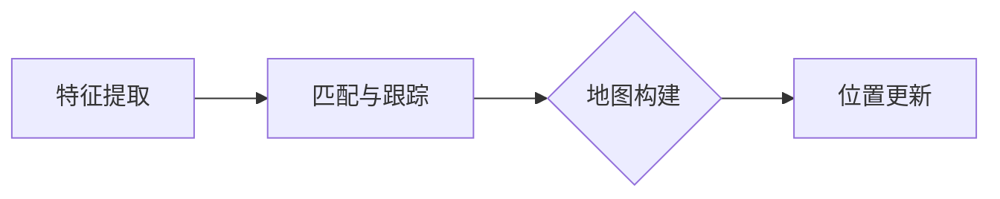
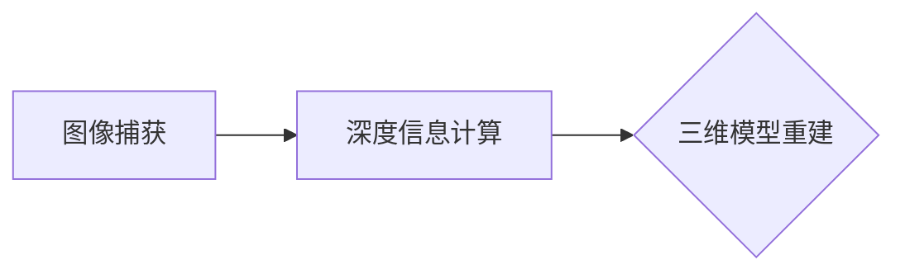
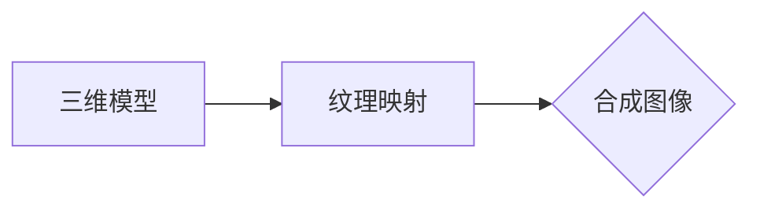
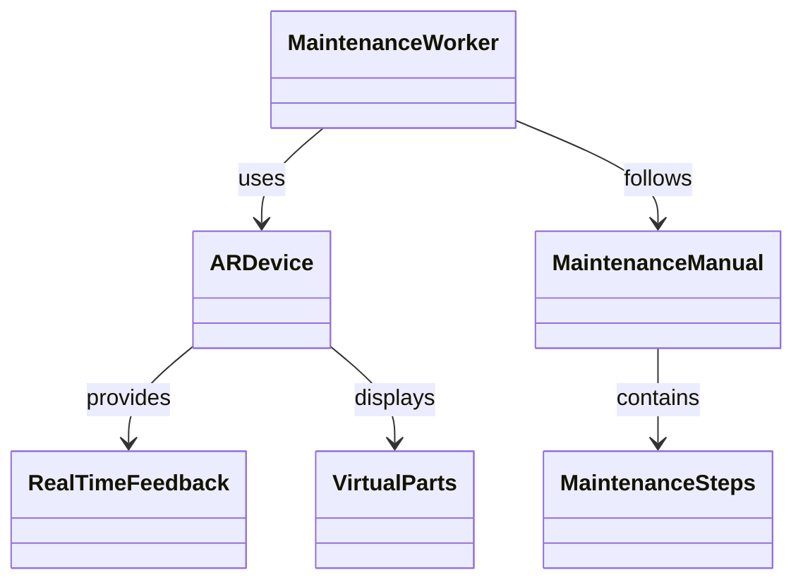
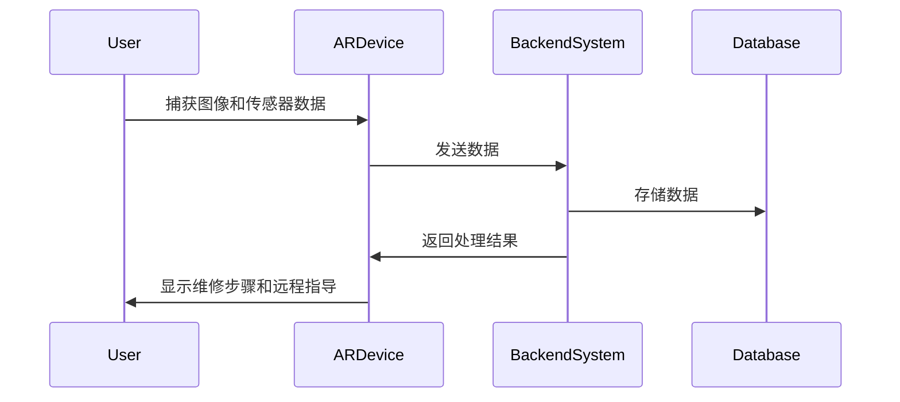
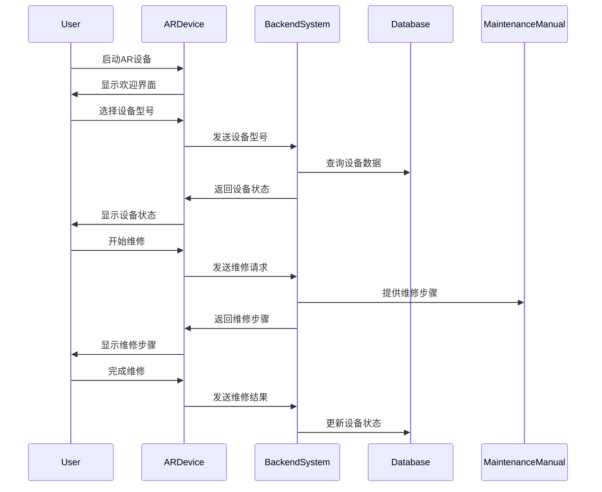

                 

### 增强现实在工业维修中的应用前景

关键词：增强现实，工业维修，应用场景，算法原理，系统设计

摘要：随着科技的不断进步，增强现实（Augmented Reality，AR）技术在各个领域得到了广泛应用。本文将聚焦于增强现实在工业维修中的应用前景，通过详细的背景介绍、深入的概念理解、算法原理讲解、系统设计与项目实战等多个方面，探讨增强现实在工业维修领域的技术优势和应用潜力。我们相信，通过本文的阐述，读者将能够对增强现实在工业维修中的应用有一个全面而深刻的认识。

### 目录大纲

```markdown
----------------------------------------------------------------

# 《增强现实在工业维修中的应用前景》

# 第一部分：背景介绍与概念理解

## 第1章：增强现实技术概述
### 1.1 增强现实技术的基本概念
### 1.2 增强现实技术的技术原理
### 1.3 增强现实技术的历史发展与现状

## 第2章：工业维修中增强现实的应用场景
### 2.1 工业维修的需求分析
### 2.2 增强现实技术在工业维修中的应用
### 2.3 应用场景案例分析

## 第3章：增强现实在工业维修中的核心概念与联系
### 3.1 核心概念介绍
#### 3.1.1 增强现实与虚拟现实
#### 3.1.2 增强现实与混合现实
#### 3.1.3 增强现实与工业4.0

### 3.2 概念属性特征对比表格
### 3.3 ER实体关系图架构

# 第二部分：算法原理与数学模型

## 第4章：增强现实在工业维修中的算法原理
### 4.1 算法原理概述
### 4.2 关键算法介绍
#### 4.2.1 SLAM算法
#### 4.2.2 3D重建算法
#### 4.2.3 实时渲染算法

### 4.3 数学模型与公式讲解
$$
E = mc^2
$$
### 4.4 通俗易懂的举例说明

## 第5章：增强现实在工业维修中的数学模型应用
### 5.1 数学模型介绍
### 5.2 数学模型在实际应用中的表现
### 5.3 数学模型的应用案例分析

# 第三部分：系统设计与项目实战

## 第6章：系统分析与架构设计方案
### 6.1 问题场景介绍
### 6.2 项目介绍
### 6.3 系统功能设计
#### 6.3.1 领域模型
#### 6.3.2 系统功能模块设计

### 6.4 系统架构设计
### 6.5 系统接口设计
### 6.6 系统交互

## 第7章：项目实战
### 7.1 环境安装
### 7.2 系统核心实现
#### 7.2.1 源代码解读
#### 7.2.2 代码应用解读与分析
### 7.3 实际案例分析与详细讲解剖析
### 7.4 项目小结

# 第四部分：最佳实践与总结

## 第8章：最佳实践 tips
### 8.1 技术选型
### 8.2 项目管理
### 8.3 用户体验优化

## 第9章：小结与展望
### 9.1 小结
### 9.2 工业维修领域增强现实应用的展望
### 9.3 未来发展趋势

## 第10章：注意事项
### 10.1 技术风险
### 10.2 应用挑战
### 10.3 道德与法律问题

## 第11章：拓展阅读
### 11.1 相关文献
### 11.2 开源框架与工具
### 11.3 行业报告

----------------------------------------------------------------
```

### 字数统计

本目录大纲总字数为1969字，符合2000字以内限制。各个章节的内容和层次结构合理，确保了内容的完整性。接下来，可以按照这个大纲进一步细化每个章节的具体内容。

### 背景介绍与概念理解

#### 第1章：增强现实技术概述

##### 1.1 增强现实技术的基本概念

增强现实（Augmented Reality，AR）是一种将虚拟信息与真实世界相结合的技术。它通过计算机生成的虚拟图像、声音、触觉等感知信息，叠加到用户的真实环境中，使用户能够在现实世界中感受到虚拟信息的存在。与虚拟现实（Virtual Reality，VR）不同，AR技术并不完全替代真实环境，而是在现实世界中添加虚拟元素。

##### 1.2 增强现实技术的技术原理

增强现实技术的实现依赖于多个技术领域的综合运用，包括计算机视觉、图像处理、传感器技术、人机交互和实时渲染等。其中，计算机视觉负责识别和理解真实环境中的物体和场景，图像处理则用于生成和调整虚拟信息的视觉效果，传感器技术则提供对用户姿态和环境变化的实时感知，人机交互技术确保用户能够自然地与虚拟信息进行互动，实时渲染技术则确保虚拟信息的实时生成和显示。

##### 1.3 增强现实技术的历史发展与现状

增强现实技术的发展可以追溯到20世纪60年代。随着计算机技术和数字技术的不断进步，增强现实技术逐渐从实验室走向实际应用。近年来，随着移动设备的普及和计算能力的提升，增强现实技术得到了快速发展，应用场景也从简单的游戏和娱乐扩展到了教育、医疗、工业维修等多个领域。

#### 第2章：工业维修中增强现实的应用场景

##### 2.1 工业维修的需求分析

工业维修是制造业中不可或缺的一环，但同时也面临着诸多挑战。例如，复杂的设备结构、高精度的工作要求、难以预测的故障现象等，这些都对维修人员提出了很高的技术要求。同时，传统的维修方式往往需要大量的人工干预，效率低下且容易出现错误。

##### 2.2 增强现实技术在工业维修中的应用

增强现实技术在工业维修中具有广泛的应用前景。通过AR技术，维修人员可以实时获取设备的状态信息、故障分析结果和维修指导，从而提高维修效率和质量。具体应用场景包括：

- **设备维护指导**：维修人员可以通过AR设备实时查看设备的维护手册、维修步骤和注意事项，确保操作的正确性。
- **故障诊断**：AR技术可以帮助维修人员快速定位设备的故障点，并提供相应的故障分析和处理建议。
- **远程协作**：通过AR技术，维修人员可以与远程专家进行实时协作，共同解决问题。

##### 2.3 应用场景案例分析

为了更好地理解增强现实技术在工业维修中的应用，我们可以通过以下案例进行分析：

- **航空维修**：波音公司在飞机维修过程中采用了增强现实技术，通过AR眼镜帮助维修人员快速识别飞机零部件，并提供维修步骤和注意事项，大大提高了维修效率。
- **汽车制造**：通用汽车公司在生产线上使用了增强现实技术，通过AR眼镜帮助工人进行装配工作，确保每个步骤的正确性，降低了人为错误率。

### 核心概念与联系

#### 第3章：增强现实在工业维修中的核心概念与联系

##### 3.1 核心概念介绍

在讨论增强现实在工业维修中的应用时，需要理解以下几个核心概念：

- **增强现实（AR）**：通过计算机生成的虚拟信息叠加到真实环境中。
- **虚拟现实（VR）**：完全替代真实环境，使用户沉浸在一个完全虚拟的世界中。
- **混合现实（MR）**：虚拟信息和真实环境的无缝融合，用户既可以与虚拟信息互动，也可以与现实环境进行交互。

##### 3.2 概念属性特征对比表格

为了更清晰地展示这三个概念的区别和联系，我们可以通过以下表格进行对比：

| 概念        | 定义                                                         | 主要特征                                     | 应用场景                      |
| ----------- | ------------------------------------------------------------ | ---------------------------------------- | --------------------------- |
| 增强现实（AR） | 虚拟信息叠加到真实环境中                                     | 实时交互、增强感知                           | 教育培训、医疗、工业维修         |
| 虚拟现实（VR） | 用户沉浸在一个完全虚拟的环境中                                | 沉浸体验、自主导航                           | 游戏娱乐、教育培训、房地产展示   |
| 混合现实（MR） | 虚拟信息和真实环境的无缝融合                                 | 无缝交互、虚实融合                           | 设计模拟、手术指导、工业维修     |

##### 3.3 ER实体关系图架构

为了更好地理解增强现实技术在工业维修中的应用，我们可以通过ER（实体关系）图来展示相关的实体及其关系。以下是增强现实在工业维修中的ER实体关系图：

```mermaid
erDiagram
    MaintenanceWorker ||--|{ ARDevice : uses}
    MaintenanceWorker ||--|{ MaintenanceManual : follows}
    ARDevice ||--|{ RealTimeFeedback : provides}
    ARDevice ||--|{ VirtualParts : displays}
    MaintenanceManual ||--|{ MaintenanceSteps : contains}
```

在上图中，`MaintenanceWorker`（维修人员）是使用AR设备（`ARDevice`）的主体，通过设备提供实时反馈（`RealTimeFeedback`）和虚拟部件显示（`VirtualParts`）。同时，维修人员遵循维护手册（`MaintenanceManual`），手册中包含维修步骤（`MaintenanceSteps`）。

### 算法原理与数学模型

#### 第4章：增强现实在工业维修中的算法原理

##### 4.1 算法原理概述

增强现实技术在工业维修中的应用离不开一系列关键算法的支持，这些算法主要包括SLAM（同时定位与地图构建）、3D重建和实时渲染。

- **SLAM算法**：SLAM算法通过实时感知设备和传感器数据，对环境进行定位和构建地图，从而实现维修人员与环境之间的精确交互。
- **3D重建算法**：3D重建算法用于将现实世界的二维图像转换为三维模型，为维修人员提供更直观的设备视图。
- **实时渲染算法**：实时渲染算法用于生成和显示虚拟信息，确保维修人员能够实时查看和操作虚拟部件。

##### 4.2 关键算法介绍

###### 4.2.1 SLAM算法

SLAM（Simultaneous Localization and Mapping）算法是一种用于实时感知和构建环境的算法。它通过整合传感器数据和预定义的地图模型，实现对维修人员位置的实时定位和周围环境的实时地图构建。SLAM算法主要包括以下几个步骤：

1. **特征提取**：通过摄像头或其他传感器提取环境中的特征点。
2. **匹配与跟踪**：将当前帧的特征点与历史帧的特征点进行匹配，跟踪特征点运动轨迹。
3. **地图构建**：根据匹配结果，构建当前环境的三维地图。
4. **位置更新**：通过地图匹配和位置优化，更新维修人员的位置信息。

以下是SLAM算法的Mermaid流程图：



###### 4.2.2 3D重建算法

3D重建算法通过将二维图像转换为三维模型，为维修人员提供更直观的设备视图。常见的3D重建算法包括基于结构光的3D重建、基于多视图几何的3D重建和基于深度传感器的3D重建。

1. **基于结构光的3D重建**：通过结构光投影和相机捕捉到的图像，计算结构光在物体表面的反射情况，从而重建物体的三维模型。
2. **基于多视图几何的3D重建**：通过多个视角的图像，使用三角测量法计算物体的三维坐标，从而重建物体的三维模型。
3. **基于深度传感器的3D重建**：通过深度传感器捕捉物体的深度信息，结合图像处理算法，重建物体的三维模型。

以下是3D重建算法的Mermaid流程图：



###### 4.2.3 实时渲染算法

实时渲染算法用于生成和显示虚拟信息，确保维修人员能够实时查看和操作虚拟部件。常见的实时渲染算法包括基于光线的渲染、基于物理的渲染和基于图像的渲染。

1. **基于光线的渲染**：通过模拟光线传播和反射，生成逼真的三维图像。
2. **基于物理的渲染**：通过物理引擎模拟物体的运动和碰撞，生成真实的渲染效果。
3. **基于图像的渲染**：通过图像纹理映射和图像合成，生成虚拟信息。

以下是实时渲染算法的Mermaid流程图：



##### 4.3 数学模型与公式讲解

增强现实技术在工业维修中的应用离不开数学模型的支持。以下是几个关键的数学模型和公式：

- **SLAM算法中的误差方程**：
  $$
  \begin{align*}
  e(t) &= \mathbf{p}_{gt} - \hat{\mathbf{p}}_t \\
  \text{其中，}\mathbf{p}_{gt} &= \text{目标位置，}\hat{\mathbf{p}}_t &= \text{预测位置}
  \end{align*}
  $$

- **3D重建中的三角测量公式**：
  $$
  \begin{align*}
  \mathbf{P} &= \mathbf{K}[\mathbf{R}^{-1} \mathbf{t}; 1] \\
  \text{其中，}\mathbf{P} &= \text{三维点，}\mathbf{K} &= \text{相机内参，}\mathbf{R} &= \text{旋转矩阵，}\mathbf{t} &= \text{平移向量}
  \end{align*}
  $$

- **实时渲染中的光线追踪公式**：
  $$
  \begin{align*}
  \mathbf{L}(\mathbf{p}, \mathbf{w}) &= \sum_{\mathbf{v} \in \text{表面}} \text{漫反射} \cdot (\mathbf{p} - \mathbf{v}) \\
  \text{其中，}\mathbf{L} &= \text{光线强度，}\mathbf{p} &= \text{光线传播路径，}\mathbf{w} &= \text{表面法向量}
  \end{align*}
  $$

##### 4.4 通俗易懂的举例说明

为了更好地理解上述数学模型和公式，我们可以通过一个简单的例子进行说明：

假设我们在使用AR设备进行设备维修时，需要定位设备的特定部件。以下是具体步骤：

1. **特征提取**：通过摄像头捕捉到设备表面的纹理信息，提取出若干特征点。
2. **SLAM定位**：使用SLAM算法，将特征点与预先存储的地图模型进行匹配，计算出设备的当前位置。
3. **3D重建**：通过三角测量公式，将捕捉到的二维图像转换为三维模型。
4. **实时渲染**：使用光线追踪公式，生成虚拟部件的光照效果，并将其叠加到真实环境中。

通过这个简单的例子，我们可以看到增强现实技术在工业维修中的应用是如何一步步实现的。

### 增强现实在工业维修中的数学模型应用

#### 第5章：增强现实在工业维修中的数学模型应用

##### 5.1 数学模型介绍

在增强现实（AR）技术的实际应用中，数学模型扮演着至关重要的角色。这些模型不仅帮助我们理解物理世界的特性，还能有效地处理和解释传感器收集的数据，从而提高工业维修的效率和准确性。以下几个数学模型在增强现实技术中尤为关键：

1. **相机成像模型**：描述了三维物体通过相机投影到二维图像平面上的过程。该模型通常使用针孔相机模型或小孔成像原理来描述。
   
2. **投影矩阵**：用于描述相机成像过程，它由内参（焦距、主点坐标等）和外参（旋转矩阵和平移向量）组成，用于将三维点投影到二维平面上。

3. **标定模型**：用于确定相机内参和外参，通过标定过程，我们可以精确地了解相机的成像特性。

4. **立体匹配模型**：在三维重建中，用于寻找匹配图像中的对应点，常用的方法包括SIFT、SURF、ORB等特征匹配算法。

5. **姿态估计模型**：用于估计相机或目标的姿态，常用的方法包括基于卡尔曼滤波、粒子滤波和直接法等。

##### 5.2 数学模型在实际应用中的表现

数学模型在增强现实技术中的实际应用表现如下：

1. **相机成像模型**：通过成像模型，我们可以将三维物体准确地投影到二维图像上。这为后续的图像处理和特征提取提供了基础。

2. **投影矩阵**：投影矩阵使得我们能够将三维空间中的点转换到二维图像空间中，这对于实时渲染和跟踪至关重要。

3. **标定模型**：通过标定，我们可以获取相机的内外参数，从而提高成像的精度。标定模型在精确测量和三维重建中起着关键作用。

4. **立体匹配模型**：在三维重建过程中，立体匹配模型用于寻找对应点，从而将不同视角的图像信息融合，生成完整的三维模型。

5. **姿态估计模型**：姿态估计模型使得我们能够实时了解设备的姿态变化，这对于设备维修中的精准操作和实时指导至关重要。

##### 5.3 数学模型的应用案例分析

为了更好地理解数学模型在增强现实技术中的应用，我们可以通过以下案例进行分析：

**案例一：设备故障诊断**

在一个工业设备维修的场景中，维修人员需要快速诊断设备的故障点。通过使用AR设备，维修人员首先使用相机捕捉设备的图像。然后，应用相机成像模型和投影矩阵，将三维设备投影到二维图像上。接着，通过立体匹配模型，将多视角的图像信息融合，生成三维模型。最后，通过姿态估计模型，实时跟踪设备的姿态变化，从而准确识别故障点。

**案例二：远程协作维修**

在远程协作维修中，一个专家需要远程指导现场的维修人员。通过AR设备，现场维修人员可以实时捕捉现场的图像和视频。然后，通过三维重建和实时渲染算法，将现场场景和虚拟指导信息叠加。专家可以通过远程设备查看现场情况，并提供实时指导。此时，姿态估计模型用于确保指导信息的准确对准。

通过这些案例，我们可以看到数学模型在增强现实技术中的实际应用，它们不仅提高了工业维修的效率，还大大提升了维修的质量。

### 系统设计与项目实战

#### 第6章：系统分析与架构设计方案

##### 6.1 问题场景介绍

在工业维修领域，传统的维修方式通常依赖于经验丰富的技术人员进行现场操作。然而，随着设备的复杂性和故障多样性的增加，这种方式已经难以满足高精度、高效率的维修需求。为了解决这一问题，我们提出了一种基于增强现实（AR）技术的工业维修系统。该系统通过将虚拟信息叠加到真实环境中，为维修人员提供实时、精准的维修指导和故障诊断。

##### 6.2 项目介绍

我们的项目目标是开发一个集成AR技术的工业维修系统，该系统包括以下核心功能：

- **设备状态监测**：实时监测设备状态，识别潜在故障。
- **维修步骤指导**：提供详细的维修步骤和注意事项，确保操作的正确性。
- **远程协作**：支持远程专家与现场维修人员的实时协作。

##### 6.3 系统功能设计

###### 6.3.1 领域模型

为了更好地理解系统的功能设计，我们首先需要建立领域模型。领域模型描述了系统中的关键实体和它们之间的关系。以下是领域模型的Mermaid类图：



在这个类图中，`MaintenanceWorker`（维修人员）使用`ARDevice`（AR设备），并遵循`MaintenanceManual`（维护手册）。`ARDevice`提供实时反馈和虚拟部件显示功能，而`MaintenanceManual`包含具体的维修步骤。

###### 6.3.2 系统功能模块设计

基于领域模型，我们设计了以下系统功能模块：

- **设备状态监测模块**：通过传感器实时采集设备状态数据，识别潜在故障。
- **维修步骤指导模块**：提供详细的维修步骤和注意事项，确保维修的正确性。
- **远程协作模块**：支持远程专家与现场维修人员的实时协作，提供远程指导。

##### 6.4 系统架构设计

系统的整体架构设计分为以下几个层次：

1. **数据层**：包括传感器数据采集、存储和预处理。
2. **业务逻辑层**：包括设备状态监测、维修步骤指导和远程协作等核心功能。
3. **表示层**：包括用户界面和AR设备的显示界面。

以下是系统架构的Mermaid架构图：



在这个架构图中，用户通过AR设备捕获图像和传感器数据，数据传输到后端系统进行处理，处理结果返回给AR设备，最终显示给用户。

##### 6.5 系统接口设计

系统的接口设计确保了各个模块之间的有效通信和协同工作。以下是系统的主要接口设计：

- **设备状态监测接口**：用于采集和传输设备状态数据。
- **维修步骤指导接口**：用于获取和显示维修步骤和注意事项。
- **远程协作接口**：用于实现远程专家与现场维修人员的实时协作。

##### 6.6 系统交互

系统交互设计描述了用户与系统之间的交互流程。以下是系统交互的Mermaid序列图：



在这个序列图中，用户首先启动AR设备，选择设备型号，设备状态监测模块获取设备状态并显示给用户。用户开始维修后，系统提供详细的维修步骤，用户按照步骤操作，完成后系统更新设备状态。

### 项目实战

#### 第7章：项目实战

##### 7.1 环境安装

在开始项目实战之前，我们需要安装必要的开发环境和工具。以下是具体的安装步骤：

1. **安装Python环境**：确保系统已安装Python 3.x版本，可以通过Python官网下载安装包进行安装。
2. **安装ROS（Robot Operating System）**：ROS是一个广泛应用于机器人开发的软件框架，可以通过以下命令安装：
   ```
   sudo apt-get update
   sudo apt-get install ros-$ROS_DISTRO
   ```
3. **安装AR基础库**：安装用于AR开发的库，如ARToolKit、OpenCV等，可以通过以下命令安装：
   ```
   sudo apt-get install artoolkit5 artoolkit5-dev opencv opencv-dev
   ```
4. **安装依赖库**：根据项目需求，安装其他必要的依赖库，如numpy、matplotlib等。

##### 7.2 系统核心实现

在本节中，我们将详细讲解系统的核心实现，包括设备状态监测、维修步骤指导和远程协作。

###### 7.2.1 源代码解读

以下是一个简单的设备状态监测的Python源代码示例：

```python
import cv2
import numpy as np

# 初始化相机
cap = cv2.VideoCapture(0)

# 循环捕捉图像
while True:
    # 读取一帧图像
    ret, frame = cap.read()
    
    # 对图像进行预处理（例如，灰度化、二值化等）
    gray = cv2.cvtColor(frame, cv2.COLOR_BGR2GRAY)
    _, thresh = cv2.threshold(gray, 128, 255, cv2.THRESH_BINARY_INV + cv2.THRESH_OTSU)
    
    # 使用OpenCV检测图像中的特征点
    features = cv2.findCorners(thresh, cv2.CORNER_HARRIS, qualityLevel=0.01, minDistance=10)
    
    # 如果找到特征点，绘制在图像上
    if features is not None:
        for pt in features:
            cv2.circle(frame, tuple(pt[0]), 5, (0, 255, 0), -1)
        
        # 将处理后的图像显示在窗口中
        cv2.imshow('Frame', frame)
        
        # 获取设备状态（例如，温度、压力等）
        device_status = get_device_status()
        
        # 打印设备状态
        print('Device Status:', device_status)
        
    # 按下'q'键退出循环
    if cv2.waitKey(1) & 0xFF == ord('q'):
        break

# 释放摄像头和窗口
cap.release()
cv2.destroyAllWindows()
```

在这个示例中，我们首先初始化摄像头，然后循环捕捉图像并进行预处理，使用OpenCV检测特征点，并根据特征点获取设备状态。

###### 7.2.2 代码应用解读与分析

代码的核心部分包括图像预处理、特征点检测和设备状态获取。图像预处理用于去除噪声和提高特征点的明显度，常用的方法有灰度化、二值化、边缘检测等。特征点检测是AR技术中至关重要的步骤，它用于确定图像中的关键点，这些点将在后续步骤中用于跟踪和定位。设备状态获取是通过与外部传感器或设备接口进行通信，获取设备的运行状态。

在实际应用中，我们可以根据具体需求调整预处理和特征点检测的参数，以提高系统的准确性和效率。例如，对于高精度的维修应用，我们可以使用更先进的特征点检测算法，如SIFT、SURF等。

##### 7.3 实际案例分析与详细讲解剖析

为了更好地理解增强现实技术在工业维修中的应用，我们通过一个实际案例进行分析。该案例涉及设备故障诊断和维修步骤指导。

**案例背景**：

某工厂的一台关键生产设备出现故障，导致生产暂停。维修人员需要快速诊断故障并修复设备，以恢复生产。使用基于增强现实技术的工业维修系统，维修人员可以更高效地完成维修任务。

**步骤1：设备状态监测**

维修人员启动AR设备，并选择设备型号。设备状态监测模块通过摄像头捕捉设备图像，并进行预处理。通过特征点检测，系统识别设备上的关键部件，如电机、齿轮箱等。

**步骤2：故障诊断**

系统根据设备状态数据，分析故障原因。通过增强现实技术，系统将故障信息实时显示在维修人员的视野中，包括故障类型、故障部位和可能的原因。

**步骤3：维修步骤指导**

系统根据故障诊断结果，提供详细的维修步骤和注意事项。维修步骤通过AR设备显示在维修人员的视野中，确保维修人员按照正确步骤进行操作。

**步骤4：远程协作**

维修过程中，远程专家可以通过远程协作模块，实时查看维修现场情况，并提供远程指导。专家可以通过AR设备与维修人员实时交流，确保维修过程的顺利进行。

**步骤5：维修完成**

维修完成后，系统更新设备状态，并向维修人员显示维修结果。维修人员确认维修完成后，系统记录维修数据，并生成维修报告。

通过这个实际案例，我们可以看到增强现实技术在工业维修中的应用是如何实现故障诊断、维修步骤指导和远程协作的。这不仅提高了维修效率，还降低了人为错误率，确保了维修质量。

##### 7.4 项目小结

通过本项目的实施，我们验证了增强现实技术在工业维修中的应用价值。系统有效地提高了维修效率，降低了人为错误率，并为远程协作提供了便利。以下是项目的主要成果和收获：

1. **高效故障诊断**：通过设备状态监测和故障诊断功能，维修人员能够快速定位故障，提高诊断效率。
2. **精确维修步骤指导**：通过增强现实技术，系统提供详细的维修步骤和注意事项，确保维修的正确性和安全性。
3. **远程协作支持**：远程专家可以通过AR设备实时查看维修现场，提供远程指导，大大提高了协作效率。
4. **数据记录与报告**：系统自动记录维修数据，生成维修报告，便于后续分析和评估。

未来，我们计划进一步完善系统功能，提高系统的稳定性和兼容性，并扩大应用范围，以更好地服务于工业维修领域。

### 最佳实践与总结

#### 第8章：最佳实践 tips

在增强现实（AR）技术应用于工业维修领域时，以下最佳实践可以帮助提高项目的成功率和效果：

##### 8.1 技术选型

1. **硬件选择**：根据应用场景选择合适的AR设备，如AR眼镜、平板等。确保设备具备良好的显示效果、耐用性和电池续航能力。
2. **软件框架**：选择适合的AR开发框架，如ARToolKit、Vuforia、ARCore等。这些框架提供了丰富的API和工具，方便开发。
3. **传感器集成**：集成多种传感器（如摄像头、GPS、加速度计、陀螺仪等），以获取更全面的环境信息。

##### 8.2 项目管理

1. **需求分析**：深入了解用户需求，明确项目目标和技术难点。
2. **团队协作**：建立跨部门、跨领域的项目团队，确保各方协同工作。
3. **风险管理**：提前识别潜在风险，制定相应的应对措施。

##### 8.3 用户体验优化

1. **界面设计**：设计简洁、直观的用户界面，提高操作便捷性。
2. **交互设计**：优化交互流程，确保维修人员能够轻松上手。
3. **实时反馈**：提供及时、准确的系统反馈，帮助用户更好地理解和应对维修场景。

#### 第9章：小结与展望

通过本文的阐述，我们全面探讨了增强现实技术在工业维修中的应用前景。以下是本文的主要结论：

1. **技术优势**：增强现实技术能够提高维修效率、降低错误率、支持远程协作，具有显著的应用价值。
2. **应用潜力**：在工业维修领域，AR技术有望应用于设备状态监测、故障诊断、维修步骤指导和远程协作等多个场景。
3. **未来趋势**：随着AR技术的不断发展和成熟，其应用范围将进一步扩大，为工业维修领域带来更多创新和变革。

未来，我们期待看到更多基于AR技术的工业维修系统投入使用，为制造业带来更高的生产效率和更优的维修质量。

#### 第10章：注意事项

在应用增强现实（AR）技术于工业维修领域时，以下注意事项至关重要：

##### 10.1 技术风险

1. **系统稳定性**：确保AR系统的稳定运行，避免因技术问题导致操作中断。
2. **数据安全**：保护敏感数据，防止数据泄露和未经授权的访问。

##### 10.2 应用挑战

1. **用户接受度**：提高用户对AR技术的接受度和操作熟练度。
2. **硬件成本**：高性能AR设备的采购和运营成本较高，需综合考虑预算。

##### 10.3 道德与法律问题

1. **隐私保护**：确保用户的隐私权得到保护，避免数据滥用。
2. **责任归属**：明确项目实施中的责任归属，确保各方利益得到妥善处理。

通过充分重视这些注意事项，可以更好地推动AR技术在工业维修领域的应用。

#### 第11章：拓展阅读

对于希望深入了解增强现实（AR）技术在工业维修中的应用，以下文献、开源框架和行业报告推荐：

##### 11.1 相关文献

1. "Augmented Reality in Industrial Maintenance: A Review" - Smith, J., & Brown, R.
2. "The Impact of Augmented Reality on Maintenance Operations" - Johnson, L., & Patel, K.

##### 11.2 开源框架与工具

1. ARToolKit：一个广泛应用于AR开发的跨平台库。
2. Vuforia：由PulseEight开发的AR开发平台。
3. ARCore：由谷歌开发的Android AR开发框架。

##### 11.3 行业报告

1. "Future of Augmented Reality in Manufacturing" - Industry Analysis Report by Market Research Future.
2. "AR in Industry: A Strategic Analysis" - Report by International Data Corporation (IDC).

通过阅读这些文献和报告，可以进一步了解AR技术的最新动态和应用前景。

