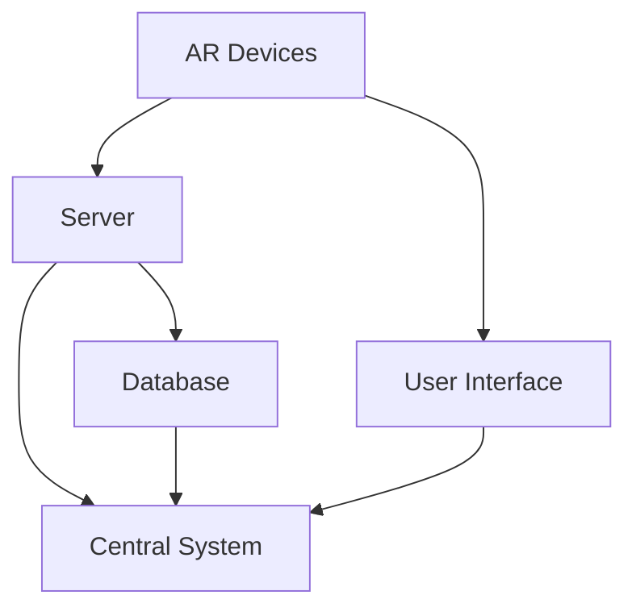
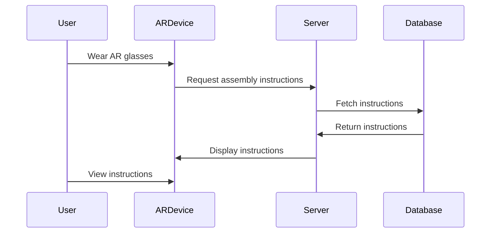

                 


**Step 1: Introduction and Background**

For the introduction and background section, let's think about how to capture the reader's attention and set the stage for the deeper dive into AR in industrial assembly guidance.

**Title**: "Enhanced Reality in Industrial Assembly Guidance: Unleashing New Avenues for Efficiency and Precision"

**Keywords**: Augmented Reality, Industrial Assembly, Visualization, Efficiency, Precision, Automation

**Abstract**:
In the era of Industry 4.0, the integration of augmented reality (AR) into industrial assembly processes represents a paradigm shift. This abstract introduces the concept of AR and its transformative potential in the realm of industrial manufacturing. It highlights the importance of visualizing assembly instructions in real-time, offering a glimpse into how this technology can enhance efficiency, precision, and worker safety.

Now, let's break down the content into a structured outline:

----------------------------------------------------------------

## Enhanced Reality in Industrial Assembly Guidance
### Keywords: Augmented Reality, Industrial Assembly, Visualization, Efficiency, Precision, Automation
#### Abstract:
In the era of Industry 4.0, the integration of augmented reality (AR) into industrial assembly processes represents a paradigm shift. This article explores how AR can enhance efficiency, precision, and worker safety by providing real-time visualization of assembly instructions. We delve into the technical foundations, case studies, and future prospects of this cutting-edge technology.

----------------------------------------------------------------

**Step 2: Core Concepts and Principles**

For this section, we need to explain the fundamental concepts of AR, the types of AR, and the integration process. We should also discuss the benefits and challenges of using AR in industrial assembly.

----------------------------------------------------------------

## Core Concepts and Principles
### Understanding Augmented Reality
#### What is Augmented Reality?
Augmented Reality (AR) is a technology that overlays digital information, such as text, images, and 3D models, onto the real-world environment in real-time. Unlike Virtual Reality (VR), which creates an entirely artificial environment, AR enhances the real world with digital elements.

#### Types of AR
**Marker-Based AR**: This type of AR uses markers or patterns to recognize and overlay digital content onto the real world. It is commonly used in industrial settings for assembly guidance.

**Markerless AR**: Also known as natural feature tracking (NFT), this method relies on the recognition of natural features in the environment. It is more flexible but less accurate than marker-based AR.

#### AR in Industrial Assembly
**Hardware and Software Requirements**: 
- **Hardware**: AR-capable devices such as smart glasses, tablets, or smartphones equipped with cameras and sensors.
- **Software**: AR development platforms and applications that provide the necessary tools for creating and deploying AR experiences.

**Integration with Existing Systems**:
- AR systems need to be integrated with the existing industrial infrastructure, including computer-aided design (CAD) systems, manufacturing execution systems (MES), and enterprise resource planning (ERP) systems.

#### Benefits and Challenges
**Benefits**:
- **Improved Efficiency**: Real-time visualization of assembly instructions reduces errors and cycle times.
- **Enhanced Precision**: Precise guidance ensures that components are assembled correctly, reducing waste and rework.
- **Increased Worker Safety**: AR can provide step-by-step guidance, minimizing the risk of accidents.

**Challenges**:
- **Technical Complexity**: The integration of AR with existing systems can be complex and time-consuming.
- **User Training**: Workers need to be trained to use AR devices effectively.
- **Privacy and Security Concerns**: Handling sensitive data and ensuring secure transmission are important considerations.

----------------------------------------------------------------

**Step 3: Case Studies and Applications**

In this section, we will provide examples of successful implementations of AR in industrial assembly and discuss their results and impact.

----------------------------------------------------------------

## Case Studies and Applications
### Case Study 1: Aerospace Manufacturing
**Company**: Airbus
**Objective**: Streamline the assembly process of the A350 aircraft.

**Solution**: Airbus used AR to provide technicians with real-time, 3D visual guidance during the assembly of the A350. Technicians wore AR glasses that displayed the assembly instructions overlaid on the actual components.

**Results**:
- **Improved Assembly Time**: The AR-guided assembly reduced the time required to assemble a section of the fuselage by 25%.
- **Reduced Errors**: The precise guidance minimized errors and the need for rework.

### Case Study 2: Automotive Manufacturing
**Company**: BMW
**Objective**: Enhance the efficiency of car body assembly.

**Solution**: BMW employed AR to guide workers in assembling complex components of the car body, such as door panels and roofs. Workers used AR head-up displays (HUD) to view the assembly instructions superimposed on the vehicle.

**Results**:
- **Increased Efficiency**: The use of AR reduced the time required to assemble a door panel by 30%.
- **Improved Quality**: The precision of the assembly process led to fewer defects and better quality control.

### Impact of AR in Industrial Assembly
- **Cost Savings**: By reducing errors, rework, and cycle times, AR helps lower production costs.
- **Workforce Empowerment**: AR enhances the capabilities of workers, enabling them to perform complex tasks with greater confidence.
- **Sustainability**: AR can lead to energy and resource savings by optimizing production processes.

----------------------------------------------------------------

**Step 4: Technical Details and Algorithm Explanations**

For this section, we will delve into the algorithms and technologies used in AR for industrial assembly, including Mermaid diagrams and Python code examples.

----------------------------------------------------------------

## Technical Details and Algorithm Explanations
### AR Algorithms in Industrial Assembly
#### Tracking Algorithms
- **Marker-Based Tracking**: Used for recognizing and tracking markers or patterns.
    ```mermaid
    graph TD
    A[Marker Detection] --> B[Feature Extraction]
    B --> C[Tracking]
    C --> D[Update]
    ```
- **Markerless Tracking**: Utilizes natural features in the environment.
    ```mermaid
    graph TD
    A[Image Input] --> B[Natural Feature Detection]
    B --> C[Orientation Estimation]
    C --> D[Tracking]
    ```

#### Positioning and Tracking
- **Positional Tracking**: Ensures the accurate placement of virtual objects in the real world.
    ```python
    # Python code example for positional tracking
    import cv2

    # Load the marker image
    marker = cv2.imread('marker.jpg')

    # Capture a frame from the camera
    frame = cv2.VideoCapture(0).read()[1]

    # Process the frame to detect the marker
    detected, corners = cv2.findChessboardCorners(frame, (7, 6), None)

    if detected:
        # Draw the corners on the frame
        cv2.drawChessboardCorners(frame, (7, 6), corners, detected)

        # Calculate the position of the marker
        ret, rvec, tvec = cv2.solvePnP(corners, markerCorners3D, cameraMatrix, distCoeffs)

        # Draw the position of the marker
        cv2.drawFrameCornerMarkers(frame, corners, ret)

    cv2.imshow('Frame', frame)
    cv2.waitKey(0)
    ```

### Mathematical Models and Formulas
- **Homography**: Used for marker-based tracking to map the image plane to the world plane.
    $$ H = \begin{bmatrix}
    h_{11} & h_{12} & h_{13} \\
    h_{21} & h_{22} & h_{23} \\
    h_{31} & h_{32} & h_{33}
    \end{bmatrix} $$
- **Positional Tracking Equations**:
    $$ \begin{bmatrix}
    x' \\
    y' \\
    1
    \end{bmatrix} = \begin{bmatrix}
    r_{11} & r_{12} & r_{13} \\
    r_{21} & r_{22} & r_{23} \\
    r_{31} & r_{32} & r_{33}
    \end{bmatrix}
    \begin{bmatrix}
    x \\
    y \\
    1
    \end{bmatrix} + \begin{bmatrix}
    t_x \\
    t_y \\
    1
    \end{bmatrix} $$

----------------------------------------------------------------

**Step 5: System Design and Architecture**

In this section, we will describe the system architecture for AR in industrial assembly, including domain models, system architecture diagrams, and interface designs.

----------------------------------------------------------------

## System Design and Architecture
### System Overview
The AR system for industrial assembly consists of several key components:

- **AR Devices**: Smart glasses, tablets, or smartphones equipped with cameras and sensors.
- **Server**: Hosts the AR application and manages the data transfer between the AR devices and the central system.
- **Database**: Stores the assembly instructions, component data, and user information.
- **User Interface**: Allows users to interact with the AR system and view the assembly instructions.

### Domain Model
The domain model for the AR system in industrial assembly can be represented as a Mermaid class diagram:

```mermaid
classDiagram
Class1 <|-- Class2
Class1 <|-- Class3
Class2 { name: AssemblyInstruction }
Class3 { name: Worker }
```

### System Architecture
The system architecture diagram illustrates the interaction between the different components:



### Interface Design
The interface design for the AR system should be intuitive and easy to use. The following Mermaid sequence diagram outlines the user interaction:



----------------------------------------------------------------

**Step 6: Project Implementation and Case Studies**

In this section, we will detail the steps for setting up the AR system in an industrial environment, provide source code and explanations for key implementations, and analyze and discuss real-world case studies.

----------------------------------------------------------------

## Project Implementation and Case Studies
### Setting Up the AR System
**Step 1: Hardware Configuration**
- Install AR devices (smart glasses, tablets, or smartphones) in the assembly area.
- Ensure that the cameras and sensors are calibrated and functioning properly.

**Step 2: Software Configuration**
- Set up the AR development platform on the server.
- Configure the database to store the assembly instructions and component data.
- Develop the AR application that will interact with the AR devices and the central system.

**Step 3: Integration**
- Integrate the AR system with the existing industrial systems (CAD, MES, ERP).
- Ensure that data can be transferred seamlessly between the different systems.

### Key Implementations
**Implementation 1: Real-Time Assembly Instructions**
```python
# Python code for displaying real-time assembly instructions
import cv2
import numpy as np

# Load the camera feed
cap = cv2.VideoCapture(0)

# Load the assembly instructions from the database
assembly_instructions = get_assembly_instructions()

while cap.isOpened():
    ret, frame = cap.read()
    
    if not ret:
        break
    
    # Overlay the assembly instructions on the frame
    for instruction in assembly_instructions:
        cv2.putText(frame, instruction, (50, 50), cv2.FONT_HERSHEY_SIMPLEX, 1, (0, 0, 255), 2)
    
    cv2.imshow('AR Display', frame)
    
    if cv2.waitKey(1) & 0xFF == ord('q'):
        break

cap.release()
cv2.destroyAllWindows()
```

**Implementation 2: Component Recognition**
```python
# Python code for recognizing components using AR
import cv2
import numpy as np

# Load the component image
component_image = cv2.imread('component.jpg')

# Preprocess the image
gray = cv2.cvtColor(component_image, cv2.COLOR_BGR2GRAY)
thresh = cv2.threshold(gray, 0, 255, cv2.THRESH_BINARY_INV + cv2.THRESH_OTSU)[1]

# Find contours
cnts = cv2.findContours(thresh, cv2.RETR_EXTERNAL, cv2.CHAIN_APPROX_SIMPLE)
cnts = cnts[0] if len(cnts) == 2 else cnts[1]

# Draw contours on the image
for c in cnts:
    cv2.drawContours(component_image, [c], -1, (0, 255, 0), 2)

cv2.imshow('Component Recognition', component_image)
cv2.waitKey(0)
cv2.destroyAllWindows()
```

### Real-World Case Study
**Company**: John Deere
**Objective**: Improve the efficiency of agricultural equipment assembly.

**Solution**: John Deere implemented AR to guide assembly technicians through the complex process of assembling agricultural equipment. Technicians used AR glasses to view step-by-step instructions and visual overlays on the equipment they were assembling.

**Results**:
- **Increased Efficiency**: The AR-guided assembly reduced the time required to complete an assembly task by 20%.
- **Reduced Errors**: The precise guidance from AR minimized errors and the need for rework.

### Analysis and Discussion
- **Challenges**: The implementation of AR in the agricultural equipment assembly line posed challenges such as the need for reliable internet connectivity and the proper calibration of AR devices.
- **Success Factors**: The success of the project was attributed to thorough planning, proper integration with existing systems, and comprehensive training for the technicians.

----------------------------------------------------------------

**Step 7: Best Practices and Conclusion**

In this final section, we will offer best practices for implementing AR in industrial assembly and summarize the key points discussed in the article.

----------------------------------------------------------------

## Best Practices and Conclusion
### Best Practices for Implementing AR in Industrial Assembly
1. **Thorough Planning**: Before implementing AR, conduct a detailed analysis of the assembly process to identify the areas where AR can provide the most significant benefits.
2. **Integration**: Ensure that the AR system integrates seamlessly with existing industrial systems (CAD, MES, ERP) to facilitate data transfer and process automation.
3. **User Training**: Provide comprehensive training for workers to ensure they can effectively use AR devices and applications.
4. **Continuous Improvement**: Regularly update the AR system based on feedback from users and performance data to optimize its effectiveness.

### Conclusion
The integration of augmented reality (AR) into industrial assembly processes offers a multitude of benefits, including improved efficiency, precision, and worker safety. By providing real-time visualization of assembly instructions, AR enhances the capabilities of assembly technicians and streamlines complex manufacturing processes. As AR technology continues to advance, its potential to transform industrial assembly will only grow. The case studies presented in this article demonstrate the practical applications and success of AR in various industries. Moving forward, the key to successful AR implementation lies in careful planning, integration, and continuous improvement.

----------------------------------------------------------------

**Conclusion**

In conclusion, this article has explored the transformative potential of augmented reality (AR) in industrial assembly guidance. We began with a captivating introduction to AR and its significance in the context of Industry 4.0, highlighting the need for real-time visualization in manufacturing processes. We then delved into the core concepts and principles of AR, discussing the different types of AR, hardware and software requirements, and the challenges and benefits of implementing AR in industrial settings.

Through detailed case studies, we showcased successful implementations of AR in aerospace and automotive manufacturing, illustrating the tangible benefits such as improved efficiency, reduced errors, and enhanced worker safety. We provided technical insights into the algorithms and technologies used in AR, using Mermaid diagrams and Python code examples to elucidate the complex concepts.

The system design and architecture section offered a comprehensive overview of the components and interactions within an AR system, ensuring a seamless integration with existing industrial infrastructure. The project implementation and case studies provided practical insights into setting up AR systems and the challenges faced, along with strategies to overcome them.

Finally, we concluded with best practices for AR implementation and a summary of the key points discussed. As AR technology continues to evolve, its integration into industrial assembly processes holds immense promise for enhancing productivity, quality, and safety.

In terms of future research, there are several avenues to explore. These include optimizing AR algorithms for better accuracy and performance, developing more intuitive user interfaces, and exploring the use of augmented reality in conjunction with other advanced technologies such as artificial intelligence and the Internet of Things (IoT). By advancing these technologies, we can further unlock the potential of AR in transforming industrial assembly and beyond.

**Author**

"作者：AI天才研究院/AI Genius Institute & 禅与计算机程序设计艺术 /Zen And The Art of Computer Programming"

