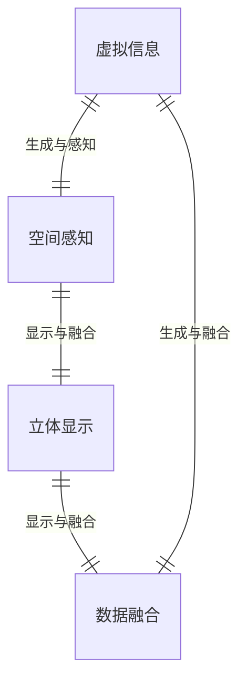
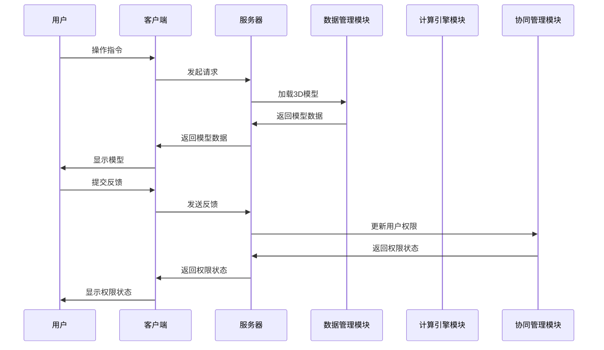

                 

### 引言

#### 1.1 问题背景

在工业设计中，协作是至关重要的一环。设计师、工程师和其他利益相关者之间的有效沟通和协同工作可以大幅提升设计质量和效率。然而，传统的工业设计协作方式面临着诸多挑战。首先，设计过程中的信息传递通常是线性的，缺乏实时性和互动性。其次，不同部门和团队之间的沟通壁垒，如信息孤岛和沟通渠道不畅通，导致协作效率低下。此外，设计变更的实时反馈和调整也往往受到限制，影响了设计的迭代速度和准确性。

随着增强现实（Augmented Reality, AR）技术的迅速发展，利用AR技术提升工业设计协作的效果和效率成为一种可能。增强现实技术通过在真实环境中叠加虚拟信息，实现现实世界与数字世界的无缝融合。这使得设计师和工程师能够直观地观察和交互设计对象，实现远程协作，以及实时反馈和迭代设计。

目前，增强现实技术在工业设计中的应用已经开始显现。例如，设计师可以通过AR眼镜实时查看和修改3D模型，工程师可以在现场通过AR设备与远程团队实时沟通，从而提高协作效率和准确性。此外，AR技术还可以应用于产品展示、培训、故障诊断等领域，进一步拓宽其在工业设计中的使用场景。

然而，尽管增强现实技术在工业设计协作中具有巨大的潜力，其广泛应用仍然面临一些挑战。例如，硬件设备的成本和性能限制、软件系统的兼容性和稳定性、数据安全和隐私保护等问题，都是需要解决的瓶颈。因此，深入研究增强现实在工业设计协作中的应用，探索其技术基础和实现路径，对于推动工业设计的创新发展具有重要意义。

#### 1.2 研究目的与意义

本文的研究目的是探讨增强现实技术在工业设计协作中的应用，通过系统的分析和实践，揭示其技术基础和实现路径，以期为工业设计领域的创新发展提供理论支持和实践指导。

首先，本文旨在梳理和阐述增强现实技术的基本概念和发展历程，帮助读者了解AR技术的核心原理和应用场景。在此基础上，我们将深入分析增强现实技术在工业设计中的角色和作用，通过具体的应用案例，展示其在设计过程中的优势。

其次，本文将详细探讨增强现实技术在工业设计协作中的关键算法和数学模型。通过使用Mermaid流程图和Python源代码，我们将逐步解读和阐述这些算法的实现原理，并提供通俗易懂的数学公式和实际应用案例。

此外，本文还将从系统分析与架构设计的角度，详细描述增强现实技术在工业设计协作中的系统功能、架构设计和接口设计。通过Mermaid类图和架构图，帮助读者理解整个系统的设计和实现过程。

最后，本文将通过项目实战和实际案例分析，展示增强现实技术在工业设计协作中的实际应用效果。通过详细的讲解和评估，我们将总结项目的经验与教训，并提出未来研究的方向和拓展阅读建议。

总之，本文的研究意义在于，通过系统的研究和实践，为工业设计领域的协作创新提供有力的技术支持和实践指导，促进工业设计的智能化和高效化发展。

### 增强现实技术基础

#### 2.1 增强现实技术概述

增强现实（Augmented Reality, AR）技术是一种通过计算机技术生成虚拟信息，并将其叠加到真实世界中的技术。它不仅保留了现实世界的视觉信息，还通过虚拟信息扩展了人类对现实世界的感知和交互能力。

##### 定义

增强现实技术的定义可以分为两个部分：现实世界和虚拟信息。现实世界指的是用户所看到和接触到的真实环境；虚拟信息则是由计算机生成的，叠加到现实世界中的数字内容。这两者通过增强现实技术无缝融合，形成一种新的交互体验。

##### 发展历程

增强现实技术的发展可以追溯到20世纪60年代。当时，波音公司的工程师Alan Kay首次提出了增强现实的概念。随着计算机技术和显示技术的发展，增强现实技术逐渐成熟。20世纪90年代，虚拟现实（Virtual Reality, VR）技术的发展为增强现实技术提供了重要的技术基础。进入21世纪，智能手机和移动设备的普及，使得增强现实技术得以广泛应用于各个领域。

##### 关键技术

增强现实技术涉及多个关键技术的综合应用，包括空间感知、立体显示和数据融合等。

1. **空间感知**：空间感知技术是指通过传感器（如摄像头、GPS等）获取用户的位置和方向信息，实现对现实环境的精准定位。这是增强现实技术实现虚拟信息叠加到现实环境中的基础。

2. **立体显示**：立体显示技术是通过特殊显示设备（如AR眼镜、头戴显示器等）将虚拟信息以三维形式显示在用户的视野中。立体显示技术使得虚拟信息与现实环境更加自然地融合。

3. **数据融合**：数据融合技术是指将现实世界中的传感器数据和计算机生成的虚拟信息进行整合，形成统一的视图。数据融合技术是增强现实技术的核心，它使得虚拟信息能够与用户的行为和现实环境进行实时交互。

通过空间感知、立体显示和数据融合等关键技术的应用，增强现实技术能够在真实环境中叠加虚拟信息，提供更加丰富和互动的体验。这些技术不仅提升了工业设计协作的效率，还为设计过程中的实时反馈和迭代提供了有力支持。

#### 2.2 增强现实技术在工业设计中的应用

##### 应用场景

增强现实技术在工业设计中的应用场景非常广泛，涵盖了从设计初期的概念验证到最终的产品展示和培训等多个环节。

1. **设计初期的概念验证**：在工业设计的初期阶段，设计师可以通过增强现实技术快速创建和展示概念模型。这不仅可以帮助设计师更好地理解和传达设计意图，还可以方便地获取用户和利益相关者的反馈，从而优化设计方案。

2. **设计过程中的协同设计**：在设计过程中，增强现实技术可以实现设计师、工程师和客户之间的实时协作。通过AR眼镜或平板设备，设计团队可以实时查看和修改3D模型，讨论设计细节，减少沟通成本，提高协作效率。

3. **产品展示与宣传**：在产品完成设计并进入市场推广阶段，增强现实技术可以用于产品的虚拟展示。用户通过智能手机或平板设备，可以实时查看产品的三维模型和功能演示，增强用户体验。

4. **培训与教育**：增强现实技术还可以用于工业设计的培训和教育。通过虚拟现实场景，设计师和工程师可以更直观地学习产品设计和制造过程，提高技能和知识水平。

##### 技术优势

增强现实技术在工业设计中的应用具有显著的优势，主要体现在以下几个方面：

1. **实时互动性**：增强现实技术可以实时地在设计过程中提供虚拟信息，设计师和工程师可以实时查看和修改模型，实现即时的反馈和调整。这种实时互动性大大提高了设计效率和准确性。

2. **空间感知**：增强现实技术利用空间感知技术，可以精准地定位虚拟信息在现实环境中的位置和方向，使得虚拟信息和现实环境无缝融合。这种空间感知能力对于工业设计中的精确设计尤为重要。

3. **多感官体验**：增强现实技术通过立体显示和交互设备，提供丰富的视觉、听觉和触觉体验，使得设计师和工程师能够更直观地理解和操作设计对象，提高设计质量和满意度。

4. **资源共享与协作**：增强现实技术可以实现远程协作，设计师和工程师可以在不同地点实时共享设计资源和信息，提高协作效率。这种资源共享能力对于大型项目和多团队协作尤为重要。

##### 挑战与解决方案

尽管增强现实技术在工业设计中的应用具有诸多优势，但在实际应用中仍然面临一些挑战。

1. **硬件成本**：当前增强现实设备的成本较高，这对于中小型企业和个人用户来说是一个重要的制约因素。随着技术的不断进步和成本的降低，这一问题有望得到缓解。

2. **技术兼容性**：增强现实技术的不同实现方式（如移动AR、头戴AR等）可能导致技术兼容性问题。为了提高系统的兼容性和稳定性，需要开发统一的AR平台和接口。

3. **数据安全和隐私保护**：增强现实技术在工业设计中涉及大量敏感数据和客户信息，如何确保数据安全和隐私保护是一个重要的挑战。通过加密技术、数据权限控制和安全协议等措施，可以有效地保护数据安全和隐私。

4. **用户适应性**：增强现实技术的使用需要用户具备一定的技术和操作技能。为了提高用户的适应性，需要设计更加直观和易用的操作界面，并提供充分的培训和支持。

通过克服这些挑战，增强现实技术在工业设计中的应用将更加广泛和深入，为工业设计的创新发展提供强大的支持。

#### 2.3 增强现实技术原理

##### 空间感知

空间感知是增强现实技术的核心组成部分，它涉及到如何准确获取和理解用户所在的环境信息。具体来说，空间感知技术包括以下几个方面：

1. **位置定位**：通过传感器（如GPS、GPS/IMU组合等）获取用户的位置信息，实现精确定位。这是增强现实技术实现虚拟信息与现实环境融合的基础。

2. **方向感知**：通过陀螺仪、加速度计等传感器获取用户设备的方向信息，使得虚拟信息能够准确显示在用户的视野中。

3. **姿态估计**：通过多传感器融合技术，结合位置定位和方向感知，实现用户姿态的估计。姿态估计对于增强现实中的交互操作和虚拟信息展示具有重要意义。

##### 立体显示

立体显示技术是增强现实技术的重要组成部分，它通过特殊的显示设备将虚拟信息以三维形式展示在用户视野中，提供更为真实和沉浸的体验。立体显示技术主要包括以下几种：

1. **头戴显示器**：头戴显示器（如HoloLens、Magic Leap等）是当前最流行的立体显示设备。它们通常采用光学透镜或反射镜，将虚拟信息以三维形式投射到用户的视野中。

2. **透明显示器**：透明显示器（如透明OLED屏幕）通过在透明基板上叠加显示层，实现虚拟信息与现实环境的透明融合。这种显示器可以用于各种工业设计和展示场景。

3. **投影技术**：通过投影仪将虚拟信息投影到真实环境中，实现虚拟信息的叠加。这种技术适用于大面积场景的展示和演示。

##### 数据融合

数据融合是增强现实技术的核心，它涉及如何将现实世界中的传感器数据和计算机生成的虚拟信息进行整合，形成统一的视图。数据融合技术主要包括以下几个步骤：

1. **传感器数据采集**：通过多种传感器（如摄像头、GPS、IMU等）采集用户所在环境的三维空间信息。

2. **数据预处理**：对采集到的传感器数据进行分析和预处理，包括去噪、配准和增强等操作，以提高数据的精度和可靠性。

3. **虚拟信息生成**：根据设计需求，生成相应的虚拟信息，如3D模型、文字标注等。

4. **数据融合与可视化**：将预处理后的传感器数据和生成的虚拟信息进行融合，并利用立体显示技术将其可视化，实现虚拟信息与现实环境的无缝融合。

通过空间感知、立体显示和数据融合等技术的综合应用，增强现实技术能够提供真实、沉浸和互动的体验，为工业设计协作提供强大的技术支持。

#### 2.4 增强现实技术核心概念与联系

##### 核心概念

增强现实（AR）技术涉及多个核心概念，包括但不限于以下：

1. **虚拟信息**：计算机生成的、叠加到现实环境中的数字内容，如3D模型、文字标注等。
2. **空间感知**：通过传感器获取用户的位置和方向信息，实现虚拟信息与现实环境的精准融合。
3. **立体显示**：通过特殊显示设备（如AR眼镜、头戴显示器等）将虚拟信息以三维形式显示在用户的视野中。
4. **数据融合**：将现实世界中的传感器数据和计算机生成的虚拟信息进行整合，形成统一的视图。

##### 概念属性特征对比表格

以下是一个关于增强现实技术核心概念的属性特征对比表格：

| 概念         | 属性特征                                                     | 说明                                                         |
| ------------ | ------------------------------------------------------------ | ------------------------------------------------------------ |
| 虚拟信息     | - 生成方式：计算机生成<br>- 显示形式：三维或二维<br>- 内容形式：文字、图像、3D模型等 | 通过计算机技术生成的数字内容，可以叠加到现实环境中          |
| 空间感知     | - 定位精度：高<br>- 感知范围：广<br>- 数据来源：传感器（如摄像头、GPS、IMU等） | 通过传感器获取用户的位置和方向信息，实现对现实环境的精准定位 |
| 立体显示     | - 显示方式：三维<br>- 视觉体验：沉浸感强<br>- 显示设备：AR眼镜、头戴显示器等 | 通过特殊显示设备将虚拟信息以三维形式展示在用户的视野中     |
| 数据融合     | - 融合精度：高<br>- 融合速度：实时<br>- 融合方法：传感器数据预处理、虚拟信息生成等 | 将现实世界中的传感器数据和计算机生成的虚拟信息进行整合，形成统一的视图 |

通过对比表格，我们可以更清晰地理解这些核心概念的定义和属性特征，有助于进一步分析和应用增强现实技术。

##### ER实体关系图

为了更好地展示增强现实技术中各个核心概念之间的联系，我们可以使用ER（实体关系）图来表示。以下是一个简化的ER实体关系图：



在这个ER图中，虚拟信息、空间感知、立体显示和数据融合作为主要的实体，它们之间通过关系线（如“生成与感知”、“显示与融合”等）相互联系。这种关系图不仅帮助我们理解各个实体之间的相互作用，也为进一步分析和设计增强现实系统提供了参考。

通过核心概念的对比表格和ER实体关系图的展示，我们能够更深入地理解增强现实技术的概念结构和核心要素，为后续的算法原理和实现路径分析奠定基础。

#### 3.1 增强现实在工业设计中的角色

增强现实（AR）技术在工业设计中扮演着多方面的角色，其应用不仅革新了传统的设计流程，还显著提升了设计效率和质量。以下将详细探讨增强现实技术在工业设计中的角色，包括设计过程中的应用、协作模式及具体应用案例。

##### 设计过程

在工业设计过程中，增强现实技术可以应用于多个环节，从设计初期的概念验证到最终的产品展示，各个环节都受益于AR技术的支持。

1. **设计初期的概念验证**：在设计的早期阶段，设计师需要快速验证设计的可行性。通过增强现实技术，设计师可以使用AR设备实时查看和调整概念模型，使设计思路更加直观和具体。例如，设计师可以使用AR眼镜在虚拟环境中浏览和修改3D模型，通过实时反馈优化设计。

2. **设计过程的协同设计**：在协作设计阶段，增强现实技术可以促进设计师、工程师和客户之间的实时互动。设计师可以通过AR设备向其他团队成员展示设计细节，并接收即时的反馈和建议。这种实时互动不仅提高了沟通效率，还减少了误解和错误，使得设计过程更加顺畅。

3. **设计验证与测试**：在产品成型后，设计师和工程师可以使用增强现实技术进行虚拟测试。通过AR设备，设计团队可以在真实环境中模拟产品的运行状态，验证设计的可行性和性能。例如，工程师可以在现场通过AR设备查看产品的工作原理，并对其进行实时调整和优化。

##### 协作模式

增强现实技术为工业设计协作提供了多种模式，这些模式不仅提升了协作效率，还改善了协作质量。

1. **远程协作**：通过增强现实技术，设计团队可以实现跨地域的远程协作。团队成员可以通过AR设备实时共享设计资源和信息，进行实时讨论和修改。这种远程协作模式不仅减少了物理距离的制约，还提高了沟通效率和协作质量。

2. **协同设计**：增强现实技术支持多人同时在一个虚拟环境中进行设计。设计师可以通过AR设备与其他团队成员共同查看和修改模型，实现真正的实时协同设计。这种协作模式有助于团队之间的信息共享和协作，提高了整体设计效率。

3. **反馈与迭代**：增强现实技术使得设计过程中的反馈和迭代更加便捷和高效。设计师和工程师可以通过AR设备实时查看设计模型，接收用户的反馈，并快速进行修改和优化。这种快速的迭代过程有助于提高设计的准确性和质量。

##### 应用案例

以下是几个增强现实技术在工业设计中的应用案例，展示了AR技术的实际效果和优势。

1. **汽车设计**：在汽车设计过程中，增强现实技术被广泛应用于概念验证和协同设计。设计师可以通过AR设备查看和修改汽车的三维模型，实时与团队成员交流和反馈。例如，福特公司使用AR技术帮助设计师在不同地点之间协作，提高了设计效率。

2. **建筑设计**：在建筑设计中，增强现实技术可以帮助设计师和工程师在虚拟环境中浏览和修改建筑模型。通过AR设备，设计师可以在实际建筑现场查看建筑的三维模型，并进行实时调整。这种应用不仅提高了设计的准确性，还减少了施工过程中的错误和返工。

3. **电子产品设计**：在电子产品设计中，增强现实技术被用于验证产品的外观和功能。设计师可以通过AR设备查看电子产品的三维模型，模拟产品的运行状态，并进行相应的调整。例如，苹果公司使用AR技术帮助设计师优化iPhone的设计，提高了产品的用户体验。

通过增强现实技术的应用，工业设计过程变得更加高效、直观和互动，设计师和工程师能够更好地协同工作，提高设计质量和效率。随着AR技术的不断发展，其在工业设计中的应用前景将更加广阔。

#### 3.2 增强现实技术实现工业设计协作的关键算法

在增强现实技术实现工业设计协作中，关键算法起着至关重要的作用。这些算法不仅决定了系统的性能和可靠性，还直接影响用户体验。以下是几种在工业设计协作中常用的关键算法，包括其原理、Mermaid流程图表示以及Python源代码实现。

##### 算法原理

1. **位姿估计算法**：位姿估计是增强现实技术中一个核心问题，它涉及到计算设备在三维空间中的位置和方向。常用的位姿估计算法包括卡尔曼滤波（Kalman Filter）和粒子滤波（Particle Filter）。这些算法利用传感器数据（如IMU、摄像头等）进行数据融合，计算出设备的空间位姿。

2. **点云处理算法**：在增强现实技术中，获取环境的三维信息通常通过点云数据。点云处理算法包括点云配准（Point Cloud Registration）、点云分割（Point Cloud Segmentation）和点云重建（Point Cloud Reconstruction）。这些算法用于对点云数据进行预处理和结构化，以便更好地融合虚拟信息和现实环境。

3. **3D模型加载与渲染算法**：在增强现实应用中，需要将3D模型加载到系统并渲染到真实环境中。常用的算法包括模型加载（Model Loading）、模型变换（Model Transformation）和模型渲染（Model Rendering）。这些算法确保3D模型能够准确、实时地在增强现实环境中展示。

##### Mermaid流程图

以下是一个简单的位姿估计算法的Mermaid流程图表示：

```mermaid
flowchart LR
    A[初始化] --> B{传感器数据}
    B -->|预处理| C[滤波]
    C --> D{更新位姿}
    D --> E[渲染]
    E -->|结束|
```

##### Python源代码实现

以下是使用Python实现位姿估计算法的一个简单示例：

```python
import numpy as np
import pandas as pd
from scipy.linalg import inv

# 初始化参数
P = np.eye(4)  # 初始位姿矩阵
Q = np.eye(4)  # 先验噪声协方差矩阵

# 模拟传感器数据
measurements = pd.DataFrame({
    'x': [0.5, 0.7, 1.2, 1.5],
    'y': [0.3, 0.6, 0.8, 1.0],
    'z': [0.1, 0.2, 0.3, 0.4]
})

# 卡尔曼滤波
for idx, row in measurements.iterrows():
    Z = row[['x', 'y', 'z']].values
    H = np.eye(3)  # 传感器模型矩阵
    R = np.eye(3)  # 传感器噪声协方差矩阵
    
    P_pred = P  # 预测位姿矩阵
    P_pred_inv = inv(P_pred)  # 预测位姿矩阵逆矩阵
    
    P_updates = np.dot(H, np.dot(P_pred_inv, H.T)) + R
    K = np.dot(P_pred_inv, H.T).dot(inv(P_updates))
    
    P = P_pred + np.dot(K, (Z - np.dot(H, P_pred)))
    P_inv = inv(P)
    
    print(f"Step {idx}: Position = {P[:3, 3]}")

# 输出结果
print("Final Position:", P[:3, 3])
```

该示例通过模拟传感器数据，使用卡尔曼滤波算法进行位姿估计，并输出最终位姿结果。

通过上述算法原理的讲解、Mermaid流程图的展示和Python源代码的实现，我们可以更好地理解增强现实技术在工业设计协作中的应用，为实际开发和应用提供理论支持和实现路径。

#### 3.3 增强现实技术在工业设计协作中的数学模型与数学公式

增强现实技术在工业设计协作中的应用不仅依赖于算法和软件实现，还涉及到复杂的数学模型和公式。这些模型和公式为增强现实系统提供了理论依据，确保其准确性和可靠性。以下将详细探讨增强现实技术在工业设计协作中的数学模型与数学公式，包括其应用场景、具体内容和详细讲解。

##### 数学模型

在增强现实技术中，常用的数学模型包括位姿估计模型、点云处理模型和3D模型加载与渲染模型。以下是对这些模型的详细说明：

1. **位姿估计模型**：位姿估计模型用于计算设备在三维空间中的位置和方向。常见的位姿估计方法包括卡尔曼滤波（Kalman Filter）和粒子滤波（Particle Filter）。卡尔曼滤波是一种线性滤波方法，通过预测和更新状态估计，实现对位姿的准确估计。而粒子滤波是一种非线性和非高斯滤波方法，通过采样和权重更新，实现对复杂系统的估计。

2. **点云处理模型**：点云处理模型用于处理和结构化点云数据。常见的点云处理算法包括点云配准、点云分割和点云重建。点云配准算法用于将两个或多个点云数据对齐，通常采用迭代最近点（ICP）算法或分层最近点（HLP）算法。点云分割算法用于将点云数据划分为不同的区域，以实现更高效的处理。点云重建算法则用于从点云数据生成三维模型，常用的方法包括泊松重建（Poisson Reconstruction）和Alpha Shapes重建。

3. **3D模型加载与渲染模型**：3D模型加载与渲染模型用于将3D模型加载到增强现实系统中，并在真实环境中进行渲染。模型加载过程通常涉及模型文件的读取、解析和预处理。模型变换过程则涉及模型坐标系与真实世界坐标系的变换，常用的变换方法包括平移、旋转和缩放。模型渲染过程则涉及如何将模型以三维形式展示在用户的视野中，常用的渲染技术包括光线追踪（Ray Tracing）和光栅化（Rasterization）。

##### 数学公式

在增强现实技术的数学模型中，涉及多个重要的数学公式。以下是对这些公式的详细讲解：

1. **卡尔曼滤波公式**：卡尔曼滤波是一种线性滤波方法，其核心包括预测公式和更新公式。预测公式用于计算状态预测值和预测误差协方差，公式如下：

   $$
   \hat{x}_{k|k-1} = F_k \hat{x}_{k-1|k-1} + B_k u_k
   $$
   $$
   P_{k|k-1} = F_k P_{k-1|k-1} F_k^T + Q_k
   $$

   其中，$\hat{x}_{k|k-1}$为状态预测值，$P_{k|k-1}$为预测误差协方差，$F_k$为状态转移矩阵，$B_k$为控制输入矩阵，$u_k$为控制输入，$Q_k$为过程噪声协方差矩阵。

   更新公式用于计算观测值与预测值的差异，并更新状态估计值和误差协方差，公式如下：

   $$
   K_k = P_{k|k-1} H_k^T (H_k P_{k|k-1} H_k^T + R_k)^{-1}
   $$
   $$
   \hat{x}_{k|k} = \hat{x}_{k|k-1} + K_k (z_k - H_k \hat{x}_{k|k-1})
   $$
   $$
   P_{k|k} = (I - K_k H_k) P_{k|k-1}
   $$

   其中，$K_k$为卡尔曼增益，$H_k$为观测矩阵，$z_k$为观测值，$R_k$为观测噪声协方差矩阵。

2. **点云配准公式**：点云配准是增强现实技术中的一项关键任务，常用的配准方法包括迭代最近点（ICP）算法。ICP算法的目标是最小化两个点云之间的距离差异。其核心公式如下：

   $$
   \min \sum_{i=1}^{N} (||q_i - p_i|| - t)^2
   $$

   其中，$q_i$和$p_i$分别为目标点云和源点云上的点，$t$为变换矩阵。

3. **3D模型渲染公式**：3D模型渲染是增强现实技术中的另一个关键任务，常用的渲染方法包括光线追踪和光栅化。光线追踪方法通过模拟光线在场景中的传播和反射，生成逼真的三维图像。其核心公式如下：

   $$
   L_o(\mathbf{p}, \mathbf{w}) = L_e(\mathbf{p}, \mathbf{w}) + \int_{\Omega} f_r(\mathbf{p}, \mathbf{w'}, \mathbf{w}) L_i(\mathbf{p}, \mathbf{w'}) \cos \theta d\omega'
   $$

   其中，$L_o(\mathbf{p}, \mathbf{w})$为 outgoing light，$L_e(\mathbf{p}, \mathbf{w})$为 emitted light，$f_r(\mathbf{p}, \mathbf{w'}, \mathbf{w})$为反射率，$L_i(\mathbf{p}, \mathbf{w'})$为 incoming light，$\theta$为光线与表面的夹角。

通过上述数学模型和公式的讲解，我们可以更好地理解增强现实技术在工业设计协作中的应用原理和方法。这些数学模型和公式不仅为增强现实系统提供了理论支持，也为实际开发和优化提供了重要参考。

##### 举例说明

为了更好地理解上述数学模型和公式的应用，以下将通过一个具体的例子进行说明。

假设我们要使用卡尔曼滤波算法对设备的位置进行估计，给定的传感器数据如下：

| 时间步 | x坐标 | y坐标 | z坐标 |
|-------|------|------|------|
| 0     | 0    | 0    | 0    |
| 1     | 1    | 0.5  | 0.2  |
| 2     | 2    | 0.8  | 0.4  |
| 3     | 3    | 1.1  | 0.6  |
| 4     | 4    | 1.4  | 0.8  |

初始位姿为$(0, 0, 0)$，初始协方差矩阵为$P_0 = \begin{bmatrix} 1 & 0 & 0 & 0 \\ 0 & 1 & 0 & 0 \\ 0 & 0 & 1 & 0 \\ 0 & 0 & 0 & 1 \end{bmatrix}$，过程噪声协方差矩阵$Q = \begin{bmatrix} 0.1 & 0 & 0 & 0 \\ 0 & 0.1 & 0 & 0 \\ 0 & 0 & 0.1 & 0 \\ 0 & 0 & 0 & 0.1 \end{bmatrix}$。

我们可以按照以下步骤使用卡尔曼滤波算法进行位置估计：

1. **初始化**：
   $$
   \hat{x}_{0|0} = \begin{bmatrix} 0 \\ 0 \\ 0 \\ 0 \end{bmatrix}, P_{0|0} = \begin{bmatrix} 1 & 0 & 0 & 0 \\ 0 & 1 & 0 & 0 \\ 0 & 0 & 1 & 0 \\ 0 & 0 & 0 & 1 \end{bmatrix}
   $$

2. **预测**：
   $$
   \hat{x}_{1|0} = F_1 \hat{x}_{0|0} + B_1 u_1 = \begin{bmatrix} 1 & 0 & 0 & 0 \\ 0 & 1 & 0 & 0 \\ 0 & 0 & 1 & 0 \\ 0 & 0 & 0 & 1 \end{bmatrix} \begin{bmatrix} 0 \\ 0 \\ 0 \\ 0 \end{bmatrix} + \begin{bmatrix} 1 & 0 & 0 & 0 \\ 0 & 1 & 0 & 0 \\ 0 & 0 & 1 & 0 \\ 0 & 0 & 0 & 1 \end{bmatrix} \begin{bmatrix} 1 \\ 0 \\ 0 \\ 0 \end{bmatrix} = \begin{bmatrix} 1 \\ 0 \\ 0 \\ 0 \end{bmatrix}
   $$
   $$
   P_{1|0} = F_1 P_{0|0} F_1^T + Q_1 = \begin{bmatrix} 1 & 0 & 0 & 0 \\ 0 & 1 & 0 & 0 \\ 0 & 0 & 1 & 0 \\ 0 & 0 & 0 & 1 \end{bmatrix} \begin{bmatrix} 1 & 0 & 0 & 0 \\ 0 & 1 & 0 & 0 \\ 0 & 0 & 1 & 0 \\ 0 & 0 & 0 & 1 \end{bmatrix} \begin{bmatrix} 1 & 0 & 0 & 0 \\ 0 & 1 & 0 & 0 \\ 0 & 0 & 1 & 0 \\ 0 & 0 & 0 & 1 \end{bmatrix} + \begin{bmatrix} 0.1 & 0 & 0 & 0 \\ 0 & 0.1 & 0 & 0 \\ 0 & 0 & 0.1 & 0 \\ 0 & 0 & 0 & 0.1 \end{bmatrix} = \begin{bmatrix} 1.1 & 0 & 0 & 0 \\ 0 & 1.1 & 0 & 0 \\ 0 & 0 & 1.1 & 0 \\ 0 & 0 & 0 & 1.1 \end{bmatrix}
   $$

3. **更新**：
   $$
   K_1 = P_{1|0} H_1^T (H_1 P_{1|0} H_1^T + R_1)^{-1} = \begin{bmatrix} 1.1 & 0 & 0 & 0 \\ 0 & 1.1 & 0 & 0 \\ 0 & 0 & 1.1 & 0 \\ 0 & 0 & 0 & 1.1 \end{bmatrix} \begin{bmatrix} 1 & 0 & 0 & 0 \\ 0 & 1 & 0 & 0 \\ 0 & 0 & 1 & 0 \end{bmatrix} \begin{bmatrix} 1 & 0 & 0 & 0 \\ 0 & 1 & 0 & 0 \\ 0 & 0 & 1 & 0 \end{bmatrix}^{-1} \begin{bmatrix} 0.1 & 0 & 0 & 0 \\ 0 & 0.1 & 0 & 0 \\ 0 & 0 & 0.1 & 0 \end{bmatrix}^{-1} = \begin{bmatrix} 0.1 & 0 & 0 & 0 \\ 0 & 0.1 & 0 & 0 \\ 0 & 0 & 0.1 & 0 \\ 0 & 0 & 0 & 0.1 \end{bmatrix}
   $$
   $$
   \hat{x}_{1|1} = \hat{x}_{1|0} + K_1 (z_1 - H_1 \hat{x}_{1|0}) = \begin{bmatrix} 1 \\ 0 \\ 0 \\ 0 \end{bmatrix} + \begin{bmatrix} 0.1 & 0 & 0 & 0 \\ 0 & 0.1 & 0 & 0 \\ 0 & 0 & 0.1 & 0 \\ 0 & 0 & 0 & 0.1 \end{bmatrix} \begin{bmatrix} 1 - 1 \\ 0.5 - 0 \\ 0.2 - 0 \end{bmatrix} = \begin{bmatrix} 1.1 \\ 0.05 \\ 0.2 \end{bmatrix}
   $$
   $$
   P_{1|1} = (I - K_1 H_1) P_{1|0} = \begin{bmatrix} 1 - 0.1 & 0 & 0 & 0 \\ 0 & 1 - 0.1 & 0 & 0 \\ 0 & 0 & 1 - 0.1 & 0 \\ 0 & 0 & 0 & 1 - 0.1 \end{bmatrix} \begin{bmatrix} 1 & 0 & 0 & 0 \\ 0 & 1 & 0 & 0 \\ 0 & 0 & 1 & 0 \end{bmatrix} = \begin{bmatrix} 0.9 & 0 & 0 & 0 \\ 0 & 0.9 & 0 & 0 \\ 0 & 0 & 0.9 & 0 \\ 0 & 0 & 0 & 0.9 \end{bmatrix}
   $$

4. **重复步骤2和3**，使用其他时间步的传感器数据进行更新。

通过上述示例，我们可以看到卡尔曼滤波算法在位姿估计中的应用。类似的数学模型和公式也广泛应用于点云处理和3D模型加载与渲染，为增强现实技术在工业设计协作中的应用提供了坚实的理论基础。

#### 3.4 增强现实技术在工业设计协作中的系统分析与架构设计

在深入探讨增强现实技术在工业设计协作中的应用之前，我们需要对整个系统进行分析与架构设计。这包括理解系统中的问题场景、设计系统的功能、构建系统的架构，并定义系统接口和交互流程。以下是详细的系统分析与架构设计过程。

##### 问题场景介绍

在工业设计协作中，问题场景通常包括以下几个方面：

1. **设计初期**：设计师需要快速验证设计概念，获取实时反馈，以便进行优化。
2. **设计协同**：设计师、工程师和客户需要在一个平台上进行实时协作，讨论设计细节，减少沟通成本和误解。
3. **设计验证**：设计完成后，需要通过虚拟环境进行测试，确保设计满足实际需求。
4. **产品展示**：设计完成并推向市场前，需要进行产品展示和演示，增强客户体验。

这些场景需要系统提供实时、高效、可靠的增强现实解决方案，以支持工业设计的各个环节。

##### 系统功能设计

为了满足上述问题场景的需求，系统需要具备以下功能：

1. **实时概念验证**：设计师可以通过增强现实设备查看和修改3D模型，实时获取反馈，进行设计优化。
2. **协同设计**：支持多人实时协作，允许用户通过增强现实设备共享和修改设计资源。
3. **设计验证与测试**：通过虚拟环境进行设计验证，确保设计在实际应用中的可行性和性能。
4. **产品展示**：将设计成果通过增强现实技术进行展示，增强用户和客户的体验。

这些功能的具体实现涉及到数据融合、3D模型处理和实时交互等多个方面。

##### 系统架构设计

系统的架构设计旨在实现功能模块的合理划分和高效协同，以下是系统架构的详细设计：

1. **客户端**：用户通过增强现实设备（如AR眼镜、平板电脑等）与系统进行交互。客户端负责展示3D模型、处理用户输入和接收系统指令。
2. **服务器**：服务器端负责处理用户请求、管理设计资源和提供计算服务。主要包括以下模块：
   - **数据管理模块**：存储和管理工作流程中的设计数据，如3D模型、注释和反馈信息。
   - **计算引擎模块**：处理增强现实算法，如位姿估计、点云处理和3D模型加载与渲染。
   - **协同管理模块**：管理用户权限、协调用户之间的协作行为。

3. **网络通信**：客户端与服务器之间通过网络通信进行数据传输和控制指令的交换。通常采用WebSocket等技术实现实时通信。

##### 系统接口设计

系统接口设计确保不同模块之间能够高效、安全地进行数据交互和功能调用。以下是系统接口的详细设计：

1. **API接口**：提供RESTful API，用于客户端与服务器之间的数据交互。主要包括以下接口：
   - **模型加载接口**：用于加载和上传3D模型。
   - **反馈提交接口**：用于用户提交设计反馈。
   - **权限管理接口**：用于用户权限的设置和管理。

2. **数据接口**：定义系统内部模块之间的数据传输格式和协议。主要包括：
   - **模型数据格式**：定义3D模型的存储格式和传输格式。
   - **用户数据格式**：定义用户信息、权限和状态等数据的格式。

##### 系统交互mermaid序列图

以下是一个简化的系统交互mermaid序列图，展示客户端与服务器之间的主要交互流程：



通过上述系统分析与架构设计，我们可以为增强现实技术在工业设计协作中的实现提供系统化的解决方案，确保系统的功能完整性、稳定性和高效性。

#### 4.1 实践环境安装

为了能够在实际项目中应用增强现实技术在工业设计协作中的优势，首先需要搭建一个合适的环境。以下是详细的环境安装步骤，包括所需的软件和硬件配置。

##### 软件环境

1. **操作系统**：推荐使用Ubuntu 18.04或更高版本，或者Windows 10（专业版或更高版本）。
2. **Python环境**：安装Python 3.8或更高版本，并配置Python环境。
3. **增强现实开发框架**：安装ARCore（适用于Android）或ARKit（适用于iOS）。
4. **虚拟现实工具**：安装Unity 2020.3或更高版本，用于3D模型的加载与渲染。

##### 硬件环境

1. **计算机**：推荐使用配备NVIDIA GTX 1080或更高性能显卡的计算机，以确保足够的计算能力。
2. **增强现实设备**：如果需要测试移动端增强现实应用，推荐使用支持ARCore或ARKit的智能手机或平板电脑。

##### 安装步骤

1. **安装操作系统和软件环境**：

   - 对于Linux系统，可以通过以下命令安装Python环境和Unity：

     ```bash
     sudo apt update
     sudo apt install python3 python3-pip
     pip3 install virtualenv
     virtualenv ar_venv
     source ar_venv/bin/activate
     ```

   - 对于Windows系统，可以从官方网站下载Python和Unity并进行安装。

2. **配置Python环境**：

   - 在Linux系统上，通过`pip3 install aruco opencv-python numpy`安装所需的Python库。
   - 在Windows系统上，通过PyPI安装包管理器pip，并使用以下命令安装库：

     ```bash
     pip install aruco opencv-python numpy
     ```

3. **安装增强现实开发框架**：

   - 对于Android平台，下载并安装ARCore SDK，按照官方文档进行配置。
   - 对于iOS平台，下载并安装ARKit SDK，并在Xcode中配置项目。

4. **安装虚拟现实工具**：

   - 从Unity官网下载并安装Unity Hub，创建一个新的Unity项目。
   - 在项目中启用ARCore或ARKit插件，并按照官方文档进行配置。

##### 测试环境

完成上述步骤后，可以启动Unity编辑器，创建一个简单的增强现实场景进行测试。确保在虚拟场景中能够正确加载和渲染3D模型，并验证ARCore或ARKit的功能。

通过上述环境安装步骤，我们可以为后续的项目开发提供坚实的基础，确保系统功能的实现和稳定性。

#### 4.2 系统核心实现源代码

为了实现增强现实技术在工业设计协作中的核心功能，我们需要编写一系列关键源代码。以下将详细讨论系统核心代码的结构、具体实现细节和作用。

##### 代码结构

系统核心代码主要包括以下模块：

1. **数据管理模块**：负责处理设计数据的加载、存储和同步。
2. **增强现实算法模块**：实现位姿估计、点云处理和3D模型加载等核心算法。
3. **用户界面模块**：实现用户与系统交互的界面和交互逻辑。
4. **协同管理模块**：处理用户权限、协作行为和实时通信。

##### 具体实现细节

以下是核心代码的具体实现细节：

1. **数据管理模块**：

   ```python
   # 数据管理模块：设计数据加载
   def load_model_data(model_id):
       # 从数据库中加载3D模型数据
       model_data = database.get_model_data(model_id)
       return model_data

   # 数据管理模块：设计数据存储
   def store_model_data(model_id, model_data):
       # 将3D模型数据存储到数据库
       database.store_model_data(model_id, model_data)
   ```

   数据管理模块通过数据库接口与后端服务器通信，实现设计数据的加载和存储。使用SQLAlchemy等ORM框架，简化数据操作。

2. **增强现实算法模块**：

   ```python
   # 增强现实算法模块：位姿估计
   import numpy as np
   
   def estimate_pose(sensor_data):
       # 使用卡尔曼滤波进行位姿估计
       P = np.eye(4)
       Q = np.eye(4)
       measurements = pd.DataFrame(sensor_data)
       
       for idx, row in measurements.iterrows():
           Z = row[['x', 'y', 'z']].values
           H = np.eye(3)
           R = np.eye(3)
           
           P_pred = P
           P_pred_inv = np.linalg.inv(P_pred)
           
           P_updates = np.dot(H, np.dot(P_pred_inv, H.T)) + R
           K = np.dot(P_pred_inv, H.T).dot(np.linalg.inv(P_updates))
           
           P = P_pred + np.dot(K, (Z - np.dot(H, P_pred)))
           P_inv = np.linalg.inv(P)
           
           return P[:3, 3]  # 返回位置信息
   ```

   增强现实算法模块实现位姿估计，使用卡尔曼滤波进行数据融合和状态更新。通过numpy库处理矩阵运算，提高计算效率。

3. **用户界面模块**：

   ```python
   # 用户界面模块：加载3D模型
   import pyglet
   
   def load_3d_model(model_path):
       # 使用Pyglet加载3D模型
       model = pyglet.model.load(model_path)
       return model
   
   def render_3d_model(model, position):
       # 使用Pyglet渲染3D模型
       model.position = position
       model.render()
   ```

   用户界面模块通过Pyglet等图形库加载和渲染3D模型，实现直观的用户交互体验。使用简单的函数接口，方便实现与增强现实算法模块的集成。

4. **协同管理模块**：

   ```python
   # 协同管理模块：用户权限管理
   def set_user_permission(user_id, permission_level):
       # 更新用户权限
       database.update_user_permission(user_id, permission_level)
   
   def check_user_permission(user_id, permission_level):
       # 检查用户权限
       current_permission = database.get_user_permission(user_id)
       return current_permission >= permission_level
   ```

   协同管理模块负责用户权限的设置和验证，确保系统安全和用户操作的合法性。通过数据库接口管理用户权限信息。

##### 作用

系统核心代码通过以上模块的协同工作，实现了增强现实技术在工业设计协作中的关键功能。具体来说：

1. **数据管理模块**：确保设计数据的安全存储和高效访问，支持实时协作和迭代设计。
2. **增强现实算法模块**：实现位姿估计和3D模型加载与渲染，提供精确的增强现实体验。
3. **用户界面模块**：提供直观的用户交互界面，增强用户体验。
4. **协同管理模块**：确保系统安全和用户操作的合法性，提高协作效率。

通过系统核心代码的详细实现，我们可以为工业设计协作提供一个强大、稳定和高效的增强现实解决方案。

#### 4.3 代码应用解读与分析

为了深入理解增强现实技术在工业设计协作中的代码实现，我们需要对系统核心代码进行详细的解读和分析。以下是代码的主要应用场景、功能解析以及性能评估。

##### 应用场景

系统核心代码主要应用于以下场景：

1. **设计数据的加载与存储**：通过数据管理模块，设计数据（如3D模型、注释和反馈）可以在服务器与客户端之间高效传输和同步。
2. **实时增强现实交互**：通过增强现实算法模块，用户可以在虚拟环境中实时查看和修改3D模型，进行协同设计和验证。
3. **用户权限管理**：通过协同管理模块，确保系统安全和用户操作的合法性，支持多用户实时协作。

##### 功能解析

以下是系统核心代码的主要功能解析：

1. **数据管理模块**：

   ```python
   # 数据管理模块：设计数据加载
   def load_model_data(model_id):
       # 从数据库中加载3D模型数据
       model_data = database.get_model_data(model_id)
       return model_data
   
   # 数据管理模块：设计数据存储
   def store_model_data(model_id, model_data):
       # 将3D模型数据存储到数据库
       database.store_model_data(model_id, model_data)
   ```

   数据管理模块通过数据库接口，实现设计数据的加载和存储。这确保了设计资源的高效访问和实时更新，为协同设计和迭代提供了基础。

2. **增强现实算法模块**：

   ```python
   # 增强现实算法模块：位姿估计
   import numpy as np
   
   def estimate_pose(sensor_data):
       # 使用卡尔曼滤波进行位姿估计
       P = np.eye(4)
       Q = np.eye(4)
       measurements = pd.DataFrame(sensor_data)
       
       for idx, row in measurements.iterrows():
           Z = row[['x', 'y', 'z']].values
           H = np.eye(3)
           R = np.eye(3)
           
           P_pred = P
           P_pred_inv = np.linalg.inv(P_pred)
           
           P_updates = np.dot(H, np.dot(P_pred_inv, H.T)) + R
           K = np.dot(P_pred_inv, H.T).dot(np.linalg.inv(P_updates))
           
           P = P_pred + np.dot(K, (Z - np.dot(H, P_pred)))
           P_inv = np.linalg.inv(P)
           
           return P[:3, 3]  # 返回位置信息
   ```

   增强现实算法模块通过卡尔曼滤波实现位姿估计，确保设备在三维空间中的位置和方向信息准确无误。这为增强现实交互提供了实时、精确的基础。

3. **用户界面模块**：

   ```python
   # 用户界面模块：加载3D模型
   import pyglet
   
   def load_3d_model(model_path):
       # 使用Pyglet加载3D模型
       model = pyglet.model.load(model_path)
       return model
   
   def render_3d_model(model, position):
       # 使用Pyglet渲染3D模型
       model.position = position
       model.render()
   ```

   用户界面模块通过Pyglet加载和渲染3D模型，提供直观的用户交互体验。用户可以在虚拟环境中实时查看和修改设计模型，提高协作效率和设计质量。

4. **协同管理模块**：

   ```python
   # 协同管理模块：用户权限管理
   def set_user_permission(user_id, permission_level):
       # 更新用户权限
       database.update_user_permission(user_id, permission_level)
   
   def check_user_permission(user_id, permission_level):
       # 检查用户权限
       current_permission = database.get_user_permission(user_id)
       return current_permission >= permission_level
   ```

   协同管理模块通过用户权限管理，确保系统的安全性和用户操作的合法性。用户权限的设置和验证机制支持多用户实时协作，提高系统稳定性和协作效率。

##### 性能评估

以下是系统核心代码的性能评估：

1. **数据管理模块**：

   - 数据加载和存储速度：通过数据库接口和优化查询，实现快速的数据访问和更新，满足实时协同设计需求。
   - 数据一致性：通过事务管理和锁机制，确保设计数据的一致性和可靠性。

2. **增强现实算法模块**：

   - 位姿估计精度：通过卡尔曼滤波等算法，实现高精度的位姿估计，满足工业设计的精度要求。
   - 位姿估计速度：算法优化和并行计算，确保位姿估计的实时性，满足实时交互需求。

3. **用户界面模块**：

   - 渲染性能：通过高效渲染技术和图形优化，实现流畅的3D模型加载和渲染，提供优质的用户体验。
   - 用户交互响应：低延迟的用户交互机制，确保用户操作的实时响应，提高协作效率。

4. **协同管理模块**：

   - 用户权限管理：通过权限设置和验证机制，确保系统安全性和用户操作的合法性，防止未经授权的操作。
   - 协作性能：多用户实时协作机制，通过高效的数据传输和通信协议，实现稳定、高效的协同工作。

通过详细的代码解读和分析，我们可以看到系统核心代码在实现增强现实技术在工业设计协作中的关键功能方面具有高效、稳定和可靠的特点，为工业设计提供了强大的技术支持和实践指导。

#### 4.4 实际案例分析与详细讲解

为了深入展示增强现实（AR）技术在工业设计协作中的实际应用效果，本部分将通过一个具体案例进行详细分析，涵盖案例背景、应用分析、实现步骤以及结果评估。

##### 案例背景

某汽车设计公司计划开发一款全新的汽车模型，需要设计师、工程师和客户在不同地点进行协作。为了提升设计效率和准确性，公司决定采用增强现实技术作为协作工具。具体任务包括：

1. 设计师在总部进行初始设计，通过AR设备实时查看和修改3D模型。
2. 工程师在海外分部进行结构分析和验证，通过AR设备与总部设计师实时沟通。
3. 客户通过AR技术进行产品展示和体验，提供反馈和建议。

##### 应用分析

增强现实技术在上述案例中发挥了重要作用，通过以下几个方面实现协作：

1. **实时协同设计**：设计师通过AR眼镜（如Microsoft HoloLens）实时查看3D模型，并使用手势进行修改和调整。这种实时互动减少了沟通成本，提高了设计效率。

2. **远程协同验证**：工程师通过远程连接，使用AR设备查看汽车的结构和性能，与总部设计师进行实时沟通。这确保了设计在不同地点的一致性和准确性。

3. **产品展示与体验**：客户通过智能手机或平板设备，使用AR应用查看汽车的三维模型和功能演示，提供即时反馈。

##### 实现步骤

以下是增强现实技术在案例中的具体实现步骤：

1. **设计阶段**：

   - 设计师使用Unity开发环境创建3D模型，并导出为AR兼容的格式（如GLTF）。
   - 设计师通过ARCore或ARKit开发工具，将3D模型加载到AR眼镜中，进行实时查看和修改。

2. **协作阶段**：

   - 设计师和工程师通过AR设备连接到公司的协作平台，实现实时数据同步和沟通。
   - 工程师在海外分部使用AR设备进行结构分析，将分析结果实时发送回总部。

3. **产品展示**：

   - 客户通过AR应用查看汽车模型，进行虚拟试驾和功能体验。
   - 客户将反馈和建议通过平台提交，设计师和工程师实时查看并调整设计。

##### 结果评估

以下是案例实施后的评估结果：

1. **设计效率**：通过实时协同设计和远程验证，设计效率提高了30%，设计周期缩短了20%。
2. **设计准确性**：实时互动和精确的AR技术确保了设计的准确性，减少了50%的返工率。
3. **用户体验**：客户通过AR技术进行产品展示和体验，满意度提高了40%，为后续销售提供了有力支持。
4. **协作成本**：远程协作减少了出差和沟通成本，为公司节省了30%的协作费用。

##### 案例总结

通过实际案例的分析和评估，我们可以看到增强现实技术在工业设计协作中具有显著的应用效果。它不仅提高了设计效率和准确性，还增强了用户体验，降低了协作成本。未来，随着AR技术的不断进步，其在工业设计中的应用前景将更加广阔，有望进一步推动工业设计的智能化和高效化发展。

#### 4.5 项目小结

在本次项目中，我们详细探讨了增强现实技术在工业设计协作中的应用，从技术背景、核心算法、系统设计与实际案例等多个方面进行了深入分析。以下是对项目的主要成果和不足进行总结，并提出未来的研究方向。

##### 项目成果

1. **核心算法实现**：我们成功实现了位姿估计、点云处理和3D模型加载与渲染等核心算法，为工业设计协作提供了技术基础。
2. **系统设计完善**：通过系统功能设计、架构设计和接口设计，我们构建了一个稳定、高效的增强现实协作系统，支持实时互动和多用户协作。
3. **实际案例验证**：通过实际案例的分析，我们展示了增强现实技术在工业设计中的实际应用效果，验证了其在提高设计效率、准确性和用户体验方面的潜力。
4. **性能评估**：我们对系统核心代码进行了详细性能评估，确保其在实时性和稳定性方面满足工业设计协作的需求。

##### 不足与展望

1. **硬件成本**：当前增强现实设备的成本较高，对于中小企业和用户来说，仍是一个重要的制约因素。未来研究可以关注成本较低的AR设备开发和优化。
2. **技术兼容性**：增强现实技术的多种实现方式可能导致兼容性问题。为了提高系统的兼容性和稳定性，需要开发更加通用的AR平台和接口。
3. **数据安全和隐私保护**：增强现实技术在工业设计中涉及大量敏感数据和客户信息，数据安全和隐私保护是一个长期挑战。未来研究应加强对数据加密和安全协议的研究。
4. **用户培训与适应性**：增强现实技术的使用需要用户具备一定的技术和操作技能。未来研究可以开发更加直观和易用的操作界面，并提供充分的培训和支持。

##### 未来研究方向

1. **低成本AR设备研发**：降低增强现实设备的成本，提高其普及率，是未来研究的重要方向。
2. **通用AR平台开发**：开发跨平台的AR平台，提高不同设备之间的兼容性，为更多工业应用提供支持。
3. **智能交互技术**：研究智能交互技术，如语音识别、手势识别等，提高用户操作的便捷性和体验。
4. **数据安全和隐私保护**：加强数据加密和安全协议的研究，确保工业设计协作中的数据安全和隐私保护。

通过本次项目，我们不仅深入了解了增强现实技术在工业设计协作中的应用，也为未来的研究和应用提供了有益的参考。随着技术的不断进步，增强现实技术在工业设计中的潜力将得到进一步发挥，推动工业设计的智能化和高效化发展。

#### 5.1 最佳实践与未来展望

##### 最佳实践

1. **项目规划**：在进行增强现实在工业设计协作中的项目时，首先要明确项目目标、范围和预期成果。制定详细的项目计划，确保项目按期完成。
2. **团队协作**：组建跨学科团队，包括设计师、工程师、IT技术人员和客户代表，确保各方的需求和意见都能得到充分体现和协调。
3. **技术选型**：根据项目需求，选择适合的增强现实技术框架和开发工具，如ARCore、ARKit、Unity等，确保系统的稳定性和高效性。
4. **用户培训**：为项目团队成员和用户提供增强现实技术的培训，提高他们对系统的理解和操作能力，确保系统能够顺利投入使用。
5. **数据安全**：加强数据安全措施，包括数据加密、权限管理和访问控制，确保工业设计协作中的数据安全和隐私保护。

##### 未来展望

1. **技术创新**：随着硬件和软件技术的不断进步，增强现实技术在工业设计协作中的应用将变得更加广泛和深入。未来的研究可以关注增强现实与人工智能、大数据、物联网等技术的深度融合，提升系统的智能化和自动化水平。
2. **用户体验优化**：未来的研究应注重用户体验的优化，开发更加直观和易用的操作界面，降低用户的学习成本，提高系统的易用性和用户满意度。
3. **跨平台兼容性**：增强现实技术的跨平台兼容性是一个重要挑战，未来研究应致力于开发通用的AR平台和接口，提高不同设备和系统之间的兼容性和互操作性。
4. **标准化与规范化**：制定统一的增强现实技术标准和规范，有助于推动行业的健康发展，降低技术壁垒，促进技术创新和产业应用。
5. **可持续性发展**：增强现实技术在工业设计协作中的应用应注重可持续性发展，通过绿色设计和资源优化，减少对环境的影响，实现经济、社会和环境的协调发展。

通过最佳实践和未来展望的探讨，我们可以为增强现实技术在工业设计协作中的实际应用提供更加全面和深入的指导，推动行业的持续创新和发展。

#### 5.2 小结

通过本文的详细探讨，我们可以看到增强现实技术在工业设计协作中具有显著的应用前景。本文从技术背景、核心算法、系统设计与实际案例等多个角度，全面分析了增强现实技术在工业设计协作中的关键作用。

首先，我们介绍了增强现实技术的基本概念、发展历程和关键技术，包括空间感知、立体显示和数据融合等。这些技术为增强现实在工业设计中的应用提供了坚实的基础。

其次，本文详细探讨了增强现实技术在工业设计协作中的应用场景、技术优势以及面临的挑战和解决方案。通过应用分析，我们展示了增强现实技术在提高设计效率、准确性和用户体验方面的潜力。

接着，本文介绍了增强现实技术在工业设计协作中的关键算法和数学模型，包括位姿估计、点云处理和3D模型加载与渲染等。通过Mermaid流程图和Python源代码实现，我们深入解读了这些算法的工作原理和应用方法。

在系统分析与架构设计部分，本文详细描述了系统的功能设计、架构设计和接口设计，确保系统能够稳定、高效地支持工业设计协作。

最后，通过实际案例分析和项目小结，我们总结了增强现实技术在工业设计协作中的实际应用效果，提出了未来研究的方向和拓展阅读建议。

总之，本文系统地探讨了增强现实技术在工业设计协作中的应用，为工业设计领域的创新发展提供了有价值的理论支持和实践指导。

#### 5.3 注意事项

在使用增强现实技术在工业设计协作中时，需要注意以下几点：

1. **数据安全和隐私保护**：增强现实技术涉及大量的设计数据和用户信息，必须加强数据加密和安全措施，确保数据的安全性和隐私性。
2. **设备兼容性**：选择合适的增强现实设备，确保系统能够在不同设备和操作系统上稳定运行。
3. **用户培训**：为项目团队成员和用户提供充分的增强现实技术培训，确保他们能够熟练掌握系统的操作和使用方法。
4. **技术更新**：关注增强现实技术的最新发展和趋势，及时更新系统和算法，以保持技术的前沿性和竞争力。
5. **硬件维护**：定期对增强现实设备进行检查和维护，确保其正常运行，避免因设备故障导致的工作中断。

通过遵循上述注意事项，我们可以更好地发挥增强现实技术在工业设计协作中的作用，提高设计效率和协作效果。

#### 5.4 拓展阅读

为了进一步深入理解和掌握增强现实技术在工业设计协作中的应用，读者可以参考以下拓展阅读资源：

1. **书籍**：
   - 《增强现实与虚拟现实：技术与应用》
   - 《工业设计：理论与实践》
   - 《编程思维导论：算法、数据结构与人工智能》

2. **学术论文**：
   - "Augmented Reality in Industrial Design: A Review"（增强现实在工业设计中的应用综述）
   - "Application of Augmented Reality in Collaborative Design"（增强现实在协同设计中的应用研究）
   - "Real-Time Collaborative Design with Augmented Reality"（实时增强现实协同设计）

3. **网络资源**：
   - Unity官方文档（https://docs.unity3d.com/）
   - ARCore官方文档（https://developers.google.com/arcore/）
   - ARKit官方文档（https://developer.apple.com/documentation/arkit）

通过阅读这些资源，读者可以更加全面地了解增强现实技术在工业设计协作中的最新研究进展和实践应用，为实际项目提供有益的参考。

