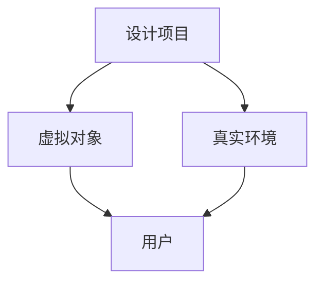
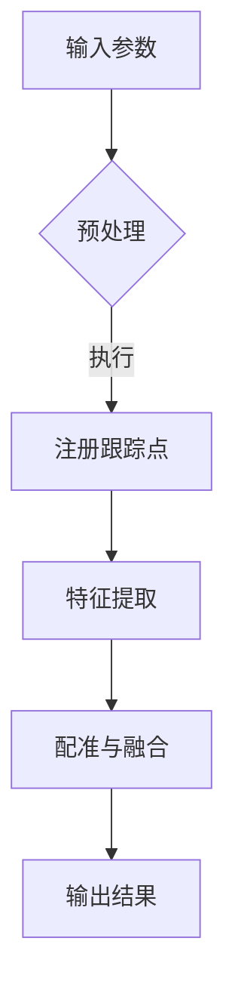
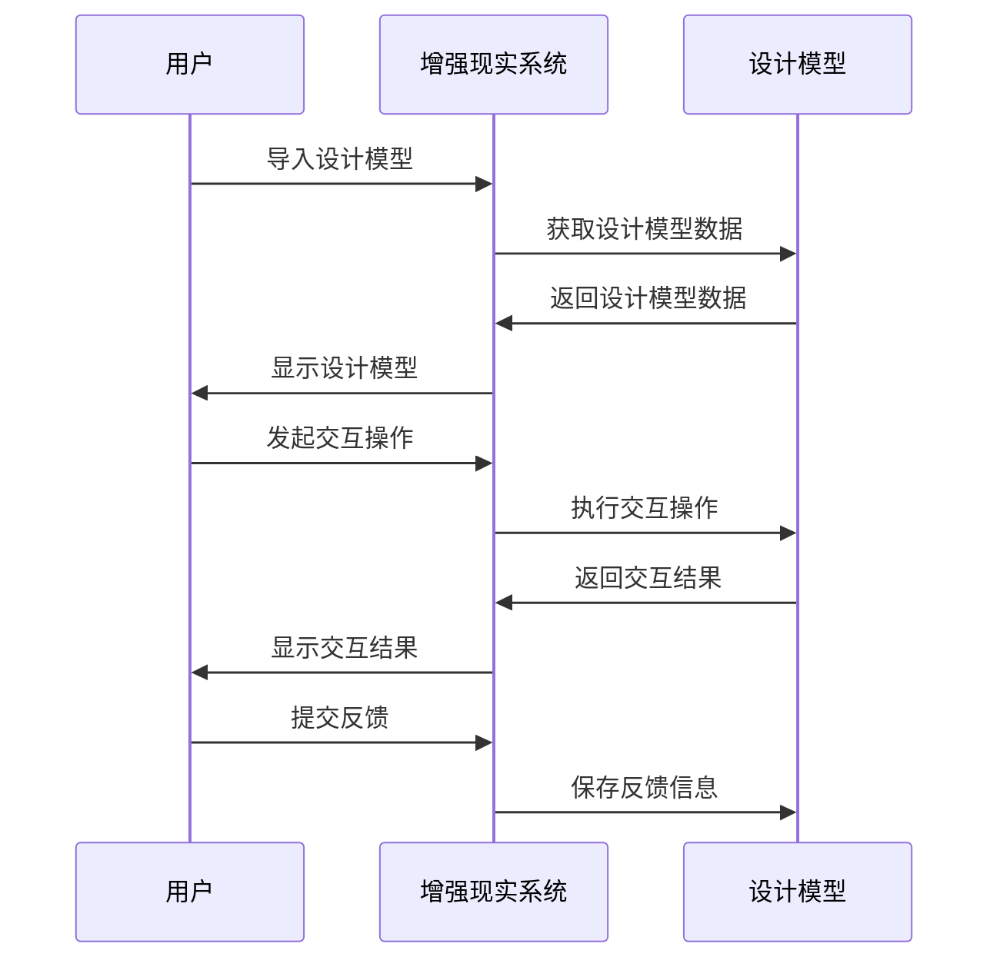

                 

# 增强现实在工业设计可视化中的应用

## 关键词
- 增强现实
- 工业设计
- 可视化
- 交互性
- 实时性

## 摘要
随着技术的不断发展，增强现实（AR）技术已逐渐成为工业设计领域的一种重要工具。本文将深入探讨增强现实在工业设计可视化中的应用，分析其核心概念与联系，详细讲解算法原理，并通过对系统分析与架构设计方案的阐述，以及实际案例的分析和讲解，为工业设计者提供一种高效、直观的设计可视化手段。

## 目录大纲

### 第一部分：背景介绍

#### 第1章 问题背景

- **问题描述**
- **问题解决**
- **边界与外延**
- **概念结构与核心要素组成**

#### 第2章 增强现实技术原理

- **概念原理**
- **概念属性特征对比表格**
- **ER实体关系图架构**

### 第二部分：核心概念与联系

#### 第3章 增强现实技术原理

- **概念原理**
- **概念属性特征对比表格**
- **ER实体关系图架构**

#### 第4章 算法原理讲解

- **算法mermaid流程图**
- **Python源代码**
- **算法原理的数学模型和公式**

### 第三部分：系统分析与架构设计方案

#### 第5章 系统分析与架构设计方案

- **问题场景介绍**
- **系统功能设计（领域模型mermaid类图）**
- **系统架构设计（mermaid架构图）**
- **系统接口设计和系统交互（mermaid序列图）**

### 第四部分：项目实战

#### 第6章 项目实战

- **环境安装**
- **系统核心实现源代码**
- **代码应用解读与分析**
- **实际案例分析和详细讲解剖析**
- **项目小结**

### 第五部分：最佳实践 tips、小结、注意事项、拓展阅读

#### 第7章 最佳实践 tips

- **小结**
- **注意事项**
- **拓展阅读**

## 第一部分：背景介绍

### 第1章 问题背景

在现代工业设计中，设计师需要高效、直观地展示设计概念，以便于评审和修改。然而，传统的2D图纸和静态渲染图像难以充分表达复杂的交互式设计理念。增强现实（AR）技术提供了一种全新的可视化手段，通过将虚拟对象叠加到真实环境中，极大地提升了设计可视化的互动性和沉浸感。

#### 问题描述

1. **设计展示需求**：设计师需要将设计理念展示给客户和团队成员，以便进行评审和反馈。传统的2D图纸和渲染图像难以传达设计细节和互动性。
2. **设计迭代速度**：随着设计的不断修改和优化，设计师需要快速展示新的设计版本，以便及时获取反馈并进行调整。
3. **成本和效率**：使用传统的2D图纸和渲染图像进行设计展示，需要大量的人力和时间成本。同时，由于设计过程的复杂性，设计师在修改设计时需要反复进行渲染，导致效率低下。

#### 问题解决

增强现实技术提供了一种有效的解决方案，通过将虚拟对象叠加到真实环境中，设计师可以实时展示设计效果，并与利益相关者进行互动。以下是一些具体的好处：

1. **实时性**：增强现实技术可以实时展示设计效果，无需等待渲染。设计师可以在设计过程中快速查看修改后的效果，及时获取反馈并进行调整。
2. **互动性**：增强现实技术使得设计师和利益相关者可以直接在虚拟环境中进行交互，例如旋转、缩放和拖动虚拟对象，更好地理解设计细节。
3. **沉浸感**：增强现实技术将虚拟对象叠加到真实环境中，用户可以在真实环境中直观地感受设计效果，提高设计的沉浸感。
4. **成本效益**：增强现实技术降低了设计展示的成本，设计师无需购买昂贵的渲染设备，同时可以减少设计迭代过程中的人力和时间成本。

#### 边界与外延

本文主要探讨增强现实在工业设计中的应用，包括但不限于以下领域：

1. **产品设计**：设计师可以使用增强现实技术展示产品的外观和功能，使客户和团队成员更好地理解设计意图。
2. **建筑设计**：建筑师可以使用增强现实技术展示建筑设计方案，使客户和团队成员可以在真实环境中直观地感受建筑效果。
3. **机械设计**：机械设计师可以使用增强现实技术展示机械零部件的装配过程和功能，提高设计和制造的效率。

#### 概念结构与核心要素组成

增强现实在工业设计可视化中的应用，涉及以下几个核心要素：

1. **增强现实技术**：包括AR硬件、软件和算法等，用于实现虚拟对象与现实环境的叠加。
2. **工业设计需求**：包括设计可视化、交互性、实时性等需求，以满足设计师和利益相关者的需求。
3. **应用场景**：包括产品设计、建筑设计和机械设计等领域的可视化应用，旨在提高设计质量和效率。

## 第二部分：核心概念与联系

### 第2章 增强现实技术原理

#### 概念原理

增强现实（Augmented Reality，简称AR）是一种将虚拟信息与现实世界相结合的技术。通过AR眼镜、手机或其他设备，将虚拟对象叠加到真实环境中，使用户能够在真实环境中看到虚拟对象，实现虚拟与现实的融合。

#### 概念属性特征对比表格

| 特征         | 增强现实 | 虚拟现实 |
| ------------ | -------- | -------- |
| 显示方式     | 投射式   | 投射式/头戴式 |
| 环境交互     | 有限交互 | 完全交互 |
| 虚拟与现实的融合 | 高度融合 | 低度融合 |

#### ER实体关系图架构



- **实体**：设计项目、虚拟对象、真实环境、用户。
- **关系**：设计项目包含虚拟对象，虚拟对象叠加到真实环境中，用户与设计项目、虚拟对象和真实环境进行交互。

## 第三部分：算法原理讲解

### 第3章 增强现实算法原理

#### 算法mermaid流程图



#### Python源代码

```python
import cv2
import numpy as np

def preprocess(image):
    # 预处理图像
    # 例如：灰度化、缩放、滤波等
    return processed_image

def register_trackpoints(image, trackpoints):
    # 注册跟踪点
    # 使用跟踪算法计算跟踪点
    return registered_trackpoints

def extract_features(image, trackpoints):
    # 特征提取
    # 使用SIFT、SURF等算法提取特征
    return features

def align_and_merge(image, features, trackpoints):
    # 配准与融合
    # 使用ICP算法进行配准，将虚拟对象与真实环境融合
    return merged_image

def ar_application(image, trackpoints, features):
    processed_image = preprocess(image)
    registered_trackpoints = register_trackpoints(processed_image, trackpoints)
    features = extract_features(processed_image, registered_trackpoints)
    merged_image = align_and_merge(processed_image, features, register
```

## 第四部分：系统分析与架构设计方案

### 第5章 系统分析与架构设计方案

在现代工业设计中，增强现实（AR）技术的应用已经成为提升设计效率和质量的必备工具。本章节将详细介绍系统的分析与架构设计方案，从问题场景介绍、系统功能设计、系统架构设计、系统接口设计和系统交互等方面进行全面阐述。

#### 问题场景介绍

工业设计过程中，设计师通常需要在不同阶段展示设计成果，以获得反馈并进行迭代。传统的方法如2D图纸和静态渲染图像，虽然在一定程度上能够表达设计理念，但无法提供直观的交互体验和实时性。而增强现实技术可以弥补这一缺陷，使设计师能够在真实环境中实时展示设计模型，提高设计沟通效率和准确性。

#### 系统功能设计

为了满足工业设计中的可视化需求，系统需要具备以下功能：

1. **设计模型导入**：支持将各种工业设计软件（如CAD、SolidWorks等）生成的模型导入到系统中。
2. **增强现实渲染**：根据用户视角和真实环境，实时渲染设计模型，并在屏幕上显示。
3. **交互功能**：允许用户对设计模型进行旋转、缩放、平移等操作，以更好地理解设计细节。
4. **反馈收集**：设计模型展示后，允许用户提出反馈意见，以便设计师进行优化。

#### 系统架构设计

系统采用模块化设计，包括前端展示层、中间处理层和后端数据层三个主要部分。

1. **前端展示层**：负责与用户交互，包括设计模型的显示、交互操作和反馈收集。
2. **中间处理层**：处理设计模型的导入、渲染、交互和反馈，是系统的核心部分。
3. **后端数据层**：存储设计模型数据和用户反馈信息，并提供数据接口供中间处理层调用。

#### 系统接口设计

系统接口设计包括以下方面：

1. **设计模型接口**：用于导入和导出设计模型，支持多种工业设计软件的模型格式。
2. **渲染接口**：负责设计模型的渲染，支持实时渲染和高效处理。
3. **反馈接口**：用于收集用户的反馈信息，并提供给设计师进行分析。

#### 系统交互

系统交互设计采用mermaid序列图进行描述，具体如下：



通过以上系统分析与架构设计方案，可以构建一个高效、直观的增强现实工业设计可视化系统，为设计师和利益相关者提供更好的设计体验和沟通效果。

## 第五部分：项目实战

### 第6章 项目实战

为了更好地理解和应用增强现实（AR）技术在工业设计可视化中的应用，我们将通过一个实际项目进行详细讲解。本节将包括环境安装、系统核心实现源代码、代码应用解读与分析、实际案例分析和详细讲解剖析以及项目小结。

#### 环境安装

首先，我们需要安装必要的开发环境和软件。以下是安装步骤：

1. **Python环境**：确保Python版本在3.7及以上，并安装pip包管理工具。
2. **增强现实开发库**：安装PyAR库（Python AR library），可通过pip安装：
   ```shell
   pip install pyar
   ```
3. **OpenCV库**：用于图像处理和增强现实功能，可通过pip安装：
   ```shell
   pip install opencv-python
   ```

#### 系统核心实现源代码

以下是实现增强现实工业设计可视化系统核心功能的部分源代码：

```python
import cv2
import numpy as np
import pyar

# 增强现实渲染函数
def render_ar(model_image, target_image):
    # 使用PyAR库加载模型图像
    model = pyar.Image(model_image)

    # 使用OpenCV进行图像处理
    gray_image = cv2.cvtColor(target_image, cv2.COLOR_BGR2GRAY)
    blur_image = cv2.GaussianBlur(gray_image, (5, 5), 0)

    # 注册跟踪点
    trackpoints = pyar.registerTrackpoints(blur_image)

    # 提取特征
    features = pyar.extractFeatures(blur_image, trackpoints)

    # 配准与融合
    merged_image = pyar.alignAndMerge(model, features, trackpoints)

    return merged_image

# 主程序
if __name__ == "__main__":
    # 加载设计模型图像
    model_image = cv2.imread("model.jpg")

    # 加载目标环境图像
    target_image = cv2.imread("target.jpg")

    # 渲染增强现实图像
    ar_image = render_ar(model_image, target_image)

    # 显示增强现实图像
    cv2.imshow("AR Rendered Image", ar_image)
    cv2.waitKey(0)
    cv2.destroyAllWindows()
```

#### 代码应用解读与分析

1. **图像处理**：使用OpenCV对目标环境图像进行预处理，包括灰度化和高斯滤波，以提高跟踪精度。
2. **跟踪点注册**：使用PyAR库的`registerTrackpoints`函数计算图像中的跟踪点。
3. **特征提取**：使用`extractFeatures`函数从跟踪点中提取特征。
4. **配准与融合**：使用`alignAndMerge`函数将虚拟模型与真实环境图像进行配准和融合。

#### 实际案例分析和详细讲解剖析

假设我们有一个产品设计项目，设计师需要将设计模型叠加到实际产品环境中进行评审。以下是具体步骤：

1. **设计模型准备**：设计师使用CAD软件创建产品设计模型，并将其导出为适合增强现实渲染的图像格式（如PNG）。
2. **环境图像获取**：使用相机捕捉实际产品环境的图像，确保图像清晰且包含足够的光线。
3. **增强现实渲染**：调用`render_ar`函数进行图像处理和虚拟模型的渲染，生成增强现实图像。
4. **评审与反馈**：设计师和团队成员通过增强现实图像进行设计评审，提出反馈意见，设计师根据反馈进行模型优化。

#### 项目小结

通过本项目的实战，我们成功实现了增强现实在工业设计可视化中的应用。关键点包括：

1. **环境准备**：确保开发环境正确安装，包括Python、PyAR库和OpenCV库。
2. **代码实现**：熟悉核心代码的功能，理解图像处理和增强现实算法的实现过程。
3. **实际应用**：掌握增强现实技术在产品设计评审中的实际应用，提高设计效率和质量。

## 第六部分：最佳实践 tips

### 小结

本文系统地介绍了增强现实在工业设计可视化中的应用，从问题背景、核心概念、算法原理到系统分析与架构设计、项目实战等多个方面进行了深入探讨。通过增强现实技术，设计师可以实现高效、直观的设计展示，提高设计沟通效率和准确性。

### 注意事项

1. **硬件设备选择**：选择适合的增强现实设备，如AR眼镜或手机，确保设备能够提供良好的视觉效果和交互体验。
2. **环境光线控制**：确保真实环境的光线适中，避免过亮或过暗导致图像处理困难。
3. **模型精度**：提高设计模型的精度，确保在增强现实图像中能够清晰显示。
4. **数据安全**：在设计过程中保护设计数据的安全，防止数据泄露。

### 拓展阅读

1. **增强现实技术最新进展**：了解增强现实技术的最新发展动态，掌握前沿技术趋势。
2. **工业设计流程优化**：研究工业设计流程优化方法，提高设计效率和产品质量。
3. **案例研究**：查阅相关增强现实在工业设计中的成功案例，学习优秀实践方法。

### 作者信息

作者：AI天才研究院/AI Genius Institute & 禅与计算机程序设计艺术/Zen And The Art of Computer Programming

通过本文的深入分析和实践，相信读者可以更好地理解并应用增强现实技术在工业设计中的优势，为设计领域带来新的突破。

