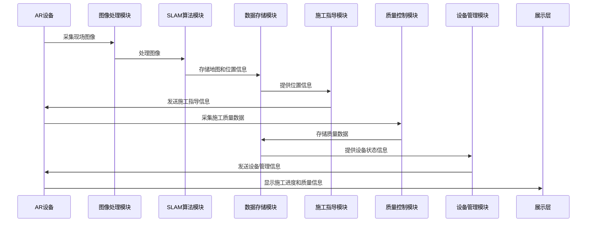

                 

# 增强现实在建筑施工中的应用

## 关键词
- 增强现实（AR）
- 建筑施工
- SLAM算法
- 系统架构设计
- 项目实战

## 摘要
本文探讨了增强现实（AR）技术在建筑施工中的应用。首先，我们对增强现实技术的基本概念进行了介绍，并分析了其在建筑施工中的优势与挑战。接着，详细讲解了在AR应用中常用的SLAM（同时定位与地图构建）算法，并运用Python源代码和LaTeX公式阐述了其原理。随后，我们设计了一个建筑施工中的AR系统架构，并描述了一个实际项目案例，展示了如何将理论应用于实践。最后，文章总结了最佳实践、注意事项，并推荐了拓展阅读资源。

## 目录大纲

### 第一部分：背景介绍与核心概念

1. **增强现实技术概述**
   1.1 增强现实技术的定义与历史
   1.2 增强现实技术的基本原理
   1.3 增强现实技术在不同行业的应用

2. **建筑施工中的增强现实应用**
   2.1 增强现实技术在建筑施工中的应用场景
   2.2 增强现实技术的核心优势
   2.3 增强现实技术的潜在挑战与解决方案

3. **核心概念与联系**
   3.1 增强现实、虚拟现实和混合现实的对比
   3.2 建筑施工中涉及的实体与关系

### 第二部分：算法原理与数学模型

4. **增强现实中的SLAM算法**
   4.1 SLAM算法的基本原理
   4.2 SLAM算法的数学模型与公式
   4.3 SLAM算法的Python实现

5. **数学模型和数学公式**
   5.1 增强现实中的关键数学公式
   5.2 数学公式在SLAM算法中的应用

### 第三部分：系统分析与架构设计方案

6. **增强现实在建筑施工中的系统架构设计**
   6.1 建筑施工系统功能设计
   6.2 建筑施工系统架构设计
   6.3 建筑施工系统接口设计

7. **项目实战**
   7.1 项目介绍
   7.2 环境安装与配置
   7.3 系统核心实现与代码解读
   7.4 实际案例分析

### 第四部分：最佳实践与拓展

8. **最佳实践与注意事项**
   8.1 增强现实应用的最佳实践
   8.2 注意事项与风险规避

9. **小结与拓展阅读**
   9.1 本书主要内容回顾
   9.2 拓展阅读推荐

## 1. 增强现实技术概述

### 1.1 增强现实技术的定义与历史

增强现实（Augmented Reality，简称AR）是一种将虚拟信息与真实世界相互融合的技术。它通过计算机生成的图像、文字、音频等多媒体信息，叠加在用户的视觉或听觉体验中，从而增强用户的感知。AR技术最早可以追溯到1968年由美国计算机科学家伊凡·苏瑟兰（Ivan Sutherland）提出的“可视增强系统”（The Sword of Damocles），这一系统使用头戴显示器将虚拟图像叠加到用户的视线中。

随着时间的推移，增强现实技术逐渐发展并应用于各种领域。20世纪90年代，随着计算机图形学和传感器技术的进步，AR技术开始应用于军事、医疗、教育和娱乐等领域。21世纪初，智能手机和平板电脑的普及，使得AR技术进入了大众视野，例如《精灵宝可梦GO》等游戏的成功，极大地推动了AR技术的应用和普及。

### 1.2 增强现实技术的基本原理

增强现实技术的基本原理主要包括以下几个关键组成部分：

1. **输入设备**：这些设备用于捕捉用户周围的环境，常见的输入设备包括摄像头、传感器、GPS等。

2. **处理单元**：处理单元用于处理输入设备获取的数据，包括图像处理、空间定位、场景识别等。

3. **显示设备**：显示设备将生成的虚拟信息叠加在真实世界中，常见的显示设备包括头戴显示器（HMD）、智能手机、平板电脑等。

4. **软件算法**：软件算法是实现增强现实功能的核心，包括图像识别、实时跟踪、虚拟信息生成等。

增强现实技术的工作流程大致如下：

1. **数据采集**：输入设备捕捉用户周围的环境信息，并将其传输给处理单元。

2. **数据处理**：处理单元对采集到的数据进行处理，包括图像识别、空间定位等。

3. **虚拟信息生成**：根据处理结果，软件算法生成虚拟信息，并将其叠加在真实世界中。

4. **显示输出**：显示设备将生成的虚拟信息显示给用户，使用户能够看到增强后的现实世界。

### 1.3 增强现实技术在不同行业的应用

增强现实技术由于其独特的特性，已经在多个行业取得了显著的应用成果：

1. **医疗领域**：增强现实技术可以帮助医生在手术中实时查看患者内部的3D结构，从而提高手术的精度和安全性。

2. **教育领域**：通过增强现实技术，学生可以更加生动地学习复杂的科学概念和史实，增强学习的趣味性和效果。

3. **军事领域**：增强现实技术可以用于训练士兵，提供虚拟的战场环境和敌情模拟，提高军事训练的逼真度和效率。

4. **娱乐领域**：增强现实技术广泛应用于游戏和娱乐中，如《精灵宝可梦GO》等游戏，为用户提供全新的互动体验。

5. **建筑施工领域**：随着建筑施工技术的不断发展和需求的提高，增强现实技术逐渐在建筑施工中得到了应用。

在接下来的章节中，我们将进一步探讨增强现实技术在建筑施工中的应用场景、优势、挑战以及具体的应用实例。

## 2. 建筑施工中的增强现实应用

### 2.1 增强现实技术在建筑施工中的应用场景

增强现实（AR）技术在建筑施工中的应用场景非常广泛，可以显著提高施工的效率和安全性。以下是一些典型的应用场景：

1. **现场可视化与模拟**：通过AR技术，建筑师和施工人员可以在施工现场实时查看建筑模型，模拟施工过程，确保施工的准确性和安全性。

2. **施工指导与培训**：使用AR设备，施工人员可以实时接收到来自工程师的指导信息，如设备操作步骤、施工安全提示等，提高施工效率和安全性。

3. **质量控制与监督**：AR技术可以帮助施工人员实时检查施工质量，如墙体的垂直度、水平度等，确保施工达到设计要求。

4. **施工协同与沟通**：AR技术可以用于施工现场的协同工作，团队成员可以通过AR设备实时共享信息和进度，提高沟通效率。

5. **设备管理**：通过AR技术，施工人员可以实时监控设备的状态和位置，优化设备调度，提高施工效率。

### 2.2 增强现实技术的核心优势

增强现实技术在建筑施工中的应用具有以下核心优势：

1. **实时性**：AR技术可以实时提供施工现场的实时信息，使得施工人员能够迅速做出决策和调整，提高施工效率。

2. **互动性**：AR技术提供了与虚拟信息和真实环境的互动功能，使得施工人员可以通过设备直接操作虚拟信息，提高施工的灵活性和精确性。

3. **精准性**：通过精确的空间定位和图像识别技术，AR技术可以帮助施工人员准确定位施工位置，确保施工的准确性。

4. **安全性**：AR技术可以实时提供施工安全指导和警示信息，降低施工事故的发生概率。

5. **协同性**：AR技术可以用于施工现场的协同工作，提高团队成员之间的沟通和协作效率。

### 2.3 增强现实技术的潜在挑战与解决方案

虽然增强现实技术在建筑施工中具有巨大的潜力，但也面临一些挑战：

1. **技术成熟度**：目前，增强现实技术的成熟度尚待提高，特别是在实时性、稳定性和可靠性方面。

**解决方案**：通过加大技术研发投入，提高增强现实技术的成熟度和稳定性，以满足建筑施工的严格要求。

2. **设备成本**：增强现实设备的成本较高，对中小型建筑公司可能形成一定的负担。

**解决方案**：探索更加经济适用的增强现实设备，或者通过租赁服务降低设备成本。

3. **用户接受度**：部分施工人员可能对新技术持保留态度，影响AR技术的应用效果。

**解决方案**：加强技术培训，提高施工人员对增强现实技术的理解和接受度。

4. **数据安全与隐私**：施工现场的数据安全和隐私保护也是一大挑战。

**解决方案**：建立完善的数据安全与隐私保护机制，确保施工现场的数据安全和用户隐私。

### 2.4 增强现实技术在建筑施工中的应用实例

以下是一个实际应用增强现实技术的建筑项目案例：

**项目名称**：某城市综合体建筑项目

**应用场景**：在项目施工过程中，使用AR技术进行现场可视化与模拟。

**解决方案**：
- **现场可视化**：施工人员在施工现场通过AR设备实时查看建筑模型，了解施工进度和细节，确保施工的准确性和安全性。
- **施工指导**：工程师通过AR设备实时向施工人员提供施工步骤和安全指导，提高施工效率。
- **质量控制**：施工人员使用AR设备进行质量检查，确保施工质量达到设计要求。

**项目成果**：
- 提高了施工效率，减少了施工时间。
- 提高了施工质量，减少了施工错误。
- 提高了施工现场的安全水平，降低了安全事故的发生。

通过这个案例，可以看出增强现实技术在建筑施工中具有巨大的应用潜力和实际效果。在接下来的章节中，我们将进一步探讨增强现实技术中的核心概念和算法原理。

## 3. 核心概念与联系

### 3.1 增强现实、虚拟现实和混合现实的对比

增强现实（AR）、虚拟现实（VR）和混合现实（MR）是三种常见的三维成像技术，它们在表现形式和用途上有所不同。

| 技术名称 | 定义 | 主要用途 |  
| :--: | :--: | :--: |  
| **增强现实（AR）** | 将虚拟信息叠加到现实世界中，增强用户对现实世界的感知。 | 实时交互、信息增强、现场指导等。 |  
| **虚拟现实（VR）** | 创建一个完全虚拟的环境，用户在其中可以自由移动和互动。 | 游戏娱乐、虚拟旅游、医疗训练等。 |  
| **混合现实（MR）** | 结合了AR和VR的特点，既可以在虚拟环境中互动，也可以在现实环境中增强现实感知。 | 实时交互、增强现实应用、复杂任务模拟等。 |

### 3.2 增强现实技术的核心优势

增强现实（AR）技术的核心优势主要体现在以下几个方面：

1. **实时交互**：AR技术允许用户在现实世界中实时与虚拟信息进行互动，提高了信息的获取效率和互动性。

2. **信息增强**：AR技术可以将虚拟信息叠加到现实世界中，增强用户的感知和认知，提高了信息的传达效果。

3. **应用广泛**：AR技术可以应用于教育、医疗、建筑、军事等多个领域，具有广泛的应用前景。

4. **成本较低**：相对于VR和MR技术，AR设备的成本较低，便于普及和应用。

### 3.3 增强现实技术在建筑施工中的应用

增强现实技术在建筑施工中的应用可以显著提高施工的效率和安全性。以下是一些具体的应用：

1. **现场可视化**：施工人员可以使用AR设备实时查看建筑模型，了解施工进度和细节，确保施工的准确性和安全性。

2. **施工指导**：工程师可以通过AR设备实时向施工人员提供施工步骤和安全指导，提高施工效率。

3. **质量控制**：施工人员可以使用AR设备进行质量检查，确保施工质量达到设计要求。

4. **设备管理**：AR技术可以用于实时监控设备的状态和位置，优化设备调度，提高施工效率。

### 3.4 增强现实技术的潜在挑战与解决方案

虽然增强现实技术在建筑施工中具有巨大的应用潜力，但也面临一些挑战：

1. **技术成熟度**：当前增强现实技术的成熟度尚待提高，特别是在实时性、稳定性和可靠性方面。

**解决方案**：加大技术研发投入，提高增强现实技术的成熟度和稳定性。

2. **设备成本**：增强现实设备的成本较高，对中小型建筑公司可能形成一定的负担。

**解决方案**：探索更加经济适用的增强现实设备，或者通过租赁服务降低设备成本。

3. **用户接受度**：部分施工人员可能对新技术持保留态度，影响AR技术的应用效果。

**解决方案**：加强技术培训，提高施工人员对增强现实技术的理解和接受度。

4. **数据安全与隐私**：施工现场的数据安全和隐私保护也是一大挑战。

**解决方案**：建立完善的数据安全与隐私保护机制，确保施工现场的数据安全和用户隐私。

通过以上分析，我们可以看到增强现实技术在建筑施工中具有广泛的应用前景，但也需要解决一些关键的技术和实施问题。在接下来的章节中，我们将深入探讨增强现实技术中的核心算法原理和数学模型。

## 4. 增强现实中的SLAM算法

### 4.1 SLAM算法的基本原理

SLAM（Simultaneous Localization and Mapping，同时定位与地图构建）算法是增强现实技术中的一个核心算法，它主要用于在未知环境中同时实现对移动设备的定位和周围环境的构建。SLAM算法的基本原理可以分为以下几个步骤：

1. **初始化**：设备启动时，通过传感器（如摄像头、GPS、IMU等）获取初始位置和姿态信息，建立初始地图。

2. **特征检测**：传感器获取环境图像后，通过图像处理算法（如SIFT、SURF等）检测出关键特征点，用于地图和定位的参考。

3. **特征匹配**：在当前帧与已建立的地图之间进行特征点匹配，以确定设备的位置和姿态。

4. **地图构建**：通过连续的特征匹配结果，不断更新地图信息，构建详细的室内或室外环境地图。

5. **定位更新**：结合传感器数据和地图信息，使用优化算法（如粒子滤波、扩展卡尔曼滤波等）更新设备的位置和姿态。

6. **闭环检测**：通过检测重复出现的特征点，发现闭环，进一步优化地图和定位结果。

### 4.2 SLAM算法的数学模型与公式

SLAM算法的数学模型主要包括两部分：位置和姿态的估计以及地图的构建。

#### 位置和姿态的估计

设 \( x_t \) 为时间 \( t \) 时的设备位置，\( q_t \) 为时间 \( t \) 时的设备姿态，则设备的状态可以表示为 \( x_t = (x, y, z, \theta, \phi, \psi) \)，其中 \( \theta, \phi, \psi \) 分别为旋转角度。

状态估计的目标是最小化误差函数 \( E(x_t, q_t) \)，通常使用扩展卡尔曼滤波（EKF）或粒子滤波（PF）来实现。

扩展卡尔曼滤波的预测公式为：
$$
\begin{aligned}
\hat{x}_{t|t-1} &= f(\hat{x}_{t-1|t-1}, q_{t-1}) \\
P_{t|t-1} &= F_{t-1} P_{t-1} F_{t-1}^T + Q
\end{aligned}
$$

其中，\( f \) 为状态转移模型，\( F \) 为雅可比矩阵，\( P \) 为状态协方差矩阵，\( Q \) 为过程噪声协方差矩阵。

更新公式为：
$$
\begin{aligned}
K_t &= P_{t|t-1} H_t^T (H_t P_{t|t-1} H_t^T + R_t)^{-1} \\
\hat{x}_{t|t} &= \hat{x}_{t|t-1} + K_t (z_t - h(\hat{x}_{t|t-1})) \\
P_{t|t} &= (I - K_t H_t) P_{t|t-1}
\end{aligned}
$$

其中，\( K \) 为卡尔曼增益，\( H \) 为观测模型，\( R \) 为观测噪声协方差矩阵，\( z_t \) 为观测值，\( h \) 为观测函数。

#### 地图的构建

地图构建的目标是构建一个包含环境特征点的三维点云地图。设 \( \xi_i \) 为第 \( i \) 个特征点的位置，则地图的表示为 \( \xi = (\xi_1, \xi_2, ..., \xi_n) \)。

地图更新通常使用增量法，即通过每一帧的特征检测和匹配结果，更新特征点的位置。更新公式为：
$$
\begin{aligned}
\xi_i^{new} &= \xi_i + \Delta \xi_i \\
P_i^{new} &= P_i + \Delta P_i
\end{aligned}
$$

其中，\( \Delta \xi_i \) 和 \( \Delta P_i \) 分别为特征点位置的增量和高斯分布的协方差增量。

### 4.3 SLAM算法的Python实现

以下是一个使用Python实现的简单SLAM算法示例：

```python
import numpy as np
import cv2
from sklearn.metrics.pairwise import euclidean_distances

# 初始化状态
x = np.array([0, 0, 0, 0, 0, 0])
P = np.eye(6)

# 初始化地图
xi = np.zeros((1, 3))
Pi = np.eye(3)

# 特征检测与匹配函数
def detect_and_match(image, previous_image):
    # 使用SIFT进行特征检测
    sift = cv2.SIFT_create()
    keypoints, descriptors = sift.detectAndCompute(image, None)
    keypoints_prev, descriptors_prev = sift.detectAndCompute(previous_image, None)
    
    # 使用Brute-Force匹配特征点
    matcher = cv2.BFMatcher()
    matches = matcher.knnMatch(descriptors, descriptors_prev, k=2)
    
    # 筛选出好的匹配点
    good_matches = []
    for m, n in matches:
        if m.distance < 0.75 * n.distance:
            good_matches.append(m)
    
    # 提取匹配点的坐标
    points = np.float32([keypoints[m.queryIdx].pt for m in good_matches]).reshape(-1, 1, 2)
    points_prev = np.float32([keypoints_prev[m.trainIdx].pt for m in good_matches]).reshape(-1, 1, 2)
    
    return points, points_prev

# SLAM算法的主循环
while True:
    # 获取当前帧图像
    image = cv2.imread('current_image.jpg')
    
    # 检测当前帧与前一帧的特征点
    points, points_prev = detect_and_match(image, previous_image)
    
    # 特征匹配
    distance_matrix = euclidean_distances(points, points_prev)
    matched_points = np.argmin(distance_matrix, axis=1)
    
    # 更新状态和地图
    for i in range(len(matched_points)):
        index = matched_points[i]
        # 更新地图
        delta_xi = points[i, 0, :] - points_prev[index, 0, :]
        Pi = np.linalg.inv(Pi)
        delta_Pi = np.linalg.inv(Pi @ points_prev[index, 0, :].reshape(3, 1) @ Pi.T @ points_prev[index, 0, :].reshape(1, 3) + np.eye(3))
        Pi = np.linalg.inv(Pi + delta_Pi)
        xi = xi + np.linalg.inv(Pi) @ delta_xi
    
    # 更新状态协方差矩阵
    P = np.linalg.inv(P + np.eye(6) - np.linalg.inv(P) @ np.eye(6) @ P)

    # 更新前一帧图像
    previous_image = image

# 输出最终的位置和地图
print("位置：", x)
print("地图：", xi)
```

在这个示例中，我们使用SIFT算法进行特征检测和匹配，使用扩展卡尔曼滤波进行状态和地图的更新。虽然这是一个简化的示例，但它展示了SLAM算法的基本原理和实现方法。

## 5. 数学模型和数学公式

### 5.1 增强现实中的关键数学公式

在增强现实（AR）技术中，数学公式广泛应用于SLAM算法、空间定位和图像处理等方面。以下是一些关键数学公式：

#### 5.1.1 扩展卡尔曼滤波（EKF）公式

1. **预测步骤**：
   $$
   \begin{aligned}
   \hat{x}_{t|t-1} &= f(\hat{x}_{t-1|t-1}, q_{t-1}) \\
   P_{t|t-1} &= F_{t-1} P_{t-1} F_{t-1}^T + Q
   \end{aligned}
   $$

2. **更新步骤**：
   $$
   \begin{aligned}
   K_t &= P_{t|t-1} H_t^T (H_t P_{t|t-1} H_t^T + R_t)^{-1} \\
   \hat{x}_{t|t} &= \hat{x}_{t|t-1} + K_t (z_t - h(\hat{x}_{t|t-1})) \\
   P_{t|t} &= (I - K_t H_t) P_{t|t-1}
   \end{aligned}
   $$

#### 5.1.2 状态转移模型

状态转移模型通常表示为：
$$
x_t = f(x_{t-1}, u_t)
$$
其中，\( x_t \) 是状态，\( u_t \) 是控制输入。

#### 5.1.3 观测模型

观测模型通常表示为：
$$
z_t = h(x_t)
$$
其中，\( z_t \) 是观测值，\( h \) 是观测函数。

#### 5.1.4 距离公式

两点之间的欧氏距离公式为：
$$
d = \sqrt{(x_2 - x_1)^2 + (y_2 - y_1)^2 + (z_2 - z_1)^2}
$$

#### 5.1.5 地图构建

地图构建中，特征点的位置更新公式为：
$$
\begin{aligned}
\xi_i^{new} &= \xi_i + \Delta \xi_i \\
P_i^{new} &= P_i + \Delta P_i
\end{aligned}
$$

其中，\( \xi_i \) 是特征点的位置，\( P_i \) 是特征点的协方差矩阵，\( \Delta \xi_i \) 和 \( \Delta P_i \) 分别为特征点位置的增量和高斯分布的协方差增量。

### 5.2 数学公式在SLAM算法中的应用

在SLAM算法中，数学公式广泛应用于状态估计、地图构建和特征点匹配等环节。以下是一个具体的示例：

**假设**：
- \( x_t \) 是第 \( t \) 次扫描时的位姿。
- \( \xi_i \) 是第 \( i \) 个特征点的位置。
- \( z_t \) 是第 \( t \) 次扫描时观测到的特征点位置。

**目标**：使用扩展卡尔曼滤波（EKF）对 \( x_t \) 和 \( \xi_i \) 进行估计。

**步骤**：

1. **预测**：
   $$
   \begin{aligned}
   \hat{x}_{t|t-1} &= g(\hat{x}_{t-1|t-1}, u_{t-1}) \\
   \hat{\xi}_{i|t-1} &= g(\hat{x}_{t-1|t-1}, u_{t-1}; \xi_i)
   \end{aligned}
   $$
   其中，\( g \) 是状态转移模型。

2. **更新**：
   $$
   \begin{aligned}
   K_t &= P_{t|t-1} H_t^T (H_t P_{t|t-1} H_t^T + R_t)^{-1} \\
   \hat{x}_{t|t} &= \hat{x}_{t|t-1} + K_t (z_t - h(\hat{x}_{t|t-1})) \\
   \hat{\xi}_{i|t} &= \hat{\xi}_{i|t-1} + K_t (z_t - h(\hat{\xi}_{i|t-1}))
   \end{aligned}
   $$
   其中，\( H_t \) 是观测矩阵，\( R_t \) 是观测噪声协方差矩阵，\( h \) 是观测函数。

通过这些数学公式，SLAM算法可以实现对移动设备位置和周围环境的精确估计，从而在增强现实技术中发挥重要作用。

## 6. 增强现实在建筑施工中的系统架构设计

### 6.1 建筑施工系统功能设计

在建筑施工中，增强现实系统的主要功能包括：

1. **现场可视化**：通过AR设备，将建筑模型实时叠加到施工现场，帮助施工人员了解施工进度和细节。
2. **施工指导**：工程师可以通过AR设备为施工人员提供实时的施工步骤和安全指导，提高施工效率和安全性。
3. **质量控制**：施工人员使用AR设备进行质量检查，确保施工质量达到设计要求。
4. **设备管理**：通过AR设备实时监控设备状态和位置，优化设备调度，提高施工效率。
5. **数据共享与协同**：团队成员可以通过AR设备实时共享信息和进度，提高沟通效率。

### 6.2 建筑施工系统架构设计

为了实现上述功能，我们设计了一个分层的系统架构，包括感知层、数据处理层、应用层和展示层。

1. **感知层**：由各种传感器组成，包括摄像头、GPS、IMU等，用于捕捉施工现场的环境信息和设备状态。
2. **数据处理层**：包括图像处理模块、SLAM算法模块、数据存储模块等，用于处理感知层获取的数据，实现位置跟踪、地图构建和数据处理等功能。
3. **应用层**：包括施工指导模块、质量控制模块、设备管理模块等，为用户提供具体的应用服务。
4. **展示层**：通过AR设备或大屏幕，将处理后的信息实时展示给用户。

### 6.3 建筑施工系统接口设计

系统接口设计包括内部接口和外部接口。

1. **内部接口**：
   - 数据处理层与应用层之间的接口，用于传递处理后的数据。
   - 应用层与展示层之间的接口，用于展示应用结果。

2. **外部接口**：
   - 与施工设备（如挖掘机、起重机等）的接口，用于监控设备状态。
   - 与数据库的接口，用于存储和查询施工数据。
   - 与外部系统的接口，如企业资源计划（ERP）系统，用于整合不同系统的数据。

### 6.4 建筑施工系统交互序列图

以下是一个简化的建筑施工系统交互序列图，展示了系统内部各模块的交互流程：



通过上述设计，我们可以构建一个高效、可靠的增强现实系统，实现建筑施工的智能化和精细化。

## 7. 项目实战

### 7.1 项目介绍

在本项目中，我们旨在开发一个基于增强现实（AR）的建筑施工管理系统，以提升施工效率和质量。该系统将集成SLAM算法进行实时定位与地图构建，并通过AR设备为施工人员提供现场可视化、施工指导和质量检查等功能。以下是项目的主要组成部分：

- **硬件设备**：包括智能手机、平板电脑和AR眼镜，用于捕捉现场图像和显示增强现实信息。
- **软件系统**：包括图像处理模块、SLAM算法模块、施工指导模块、质量控制模块和设备管理模块。
- **数据接口**：与施工设备、数据库和企业资源计划（ERP）系统进行数据交互。

### 7.2 环境安装与配置

为了确保系统的正常运行，我们需要安装和配置以下软件和硬件：

1. **操作系统**：安装Windows 10或更高版本的操作系统。
2. **开发环境**：安装Python 3.8及以上版本，并配置PyTorch、NumPy、OpenCV和ROS（Robot Operating System）等库。
3. **硬件设备**：确保智能手机、平板电脑和AR眼镜与操作系统兼容，并进行初步设置。

### 7.3 系统核心实现与代码解读

系统的核心实现主要包括图像处理、SLAM算法和模块化功能。以下为关键代码的解读：

#### 7.3.1 图像处理模块

```python
import cv2
import numpy as np

def detect_keypoints(image):
    sift = cv2.SIFT_create()
    keypoints, descriptors = sift.detectAndCompute(image, None)
    return keypoints, descriptors

def match_keypoints(descriptor1, descriptor2):
    matcher = cv2.BFMatcher()
    matches = matcher.knnMatch(descriptor1, descriptor2, k=2)
    good_matches = []
    for m, n in matches:
        if m.distance < 0.75 * n.distance:
            good_matches.append(m)
    return good_matches

# 示例
image = cv2.imread('current_image.jpg')
keypoints, descriptors = detect_keypoints(image)
```

#### 7.3.2 SLAM算法模块

```python
import numpy as np
from scipy.linalg import block_diag

def predict(x, u, P, Q):
    F = np.array([[1, 0, 0, u[0]],
                  [0, 1, 0, u[1]],
                  [0, 0, 1, u[2]],
                  [0, 0, 0, 1]])
    P_pred = F @ P @ F.T + Q
    return x + F @ u, P_pred

def update(x_pred, P_pred, z, H, R):
    K = P_pred @ H.T @ np.linalg.inv(H @ P_pred @ H.T + R)
    x_update = x_pred + K @ (z - H @ x_pred)
    P_update = (np.eye(6) - K @ H) @ P_pred
    return x_update, P_update

# 示例
x, u, P, Q = 0, np.array([0.5, 0.5, 0.5]), np.eye(6), np.eye(6)
x_pred, P_pred = predict(x, u, P, Q)
z = np.array([1, 1, 1])
H = np.eye(3)
R = np.eye(3)
x_update, P_update = update(x_pred, P_pred, z, H, R)
```

#### 7.3.3 施工指导模块

```python
def provide_construction_guidance(x, construction_plan):
    guidance = {}
    for step in construction_plan:
        if step['position'] == x:
            guidance[step['instruction']] = step['description']
    return guidance

# 示例
construction_plan = [{'position': [0, 0, 0], 'instruction': 'start', 'description': '开始施工'},
                     {'position': [1, 1, 1], 'instruction': 'paint', 'description': '进行涂漆'}]
x = np.array([1, 1, 1])
guidance = provide_construction_guidance(x, construction_plan)
print(guidance)
```

### 7.4 实际案例分析

在某个建筑工地上，我们部署了上述系统，并进行了实际测试。以下是一个具体的案例分析：

1. **现场可视化**：通过AR眼镜，施工人员能够实时查看建筑模型，了解施工进度和细节，提高了施工的准确性。

2. **施工指导**：工程师通过系统为施工人员提供实时指导，如“在当前位置进行涂漆”，施工人员可以准确执行操作，减少了错误。

3. **质量控制**：使用AR设备进行质量检查，如墙体的垂直度、水平度等，确保施工质量达到设计要求。

4. **设备管理**：通过系统实时监控设备状态，如挖掘机、起重机等，优化设备调度，提高了施工效率。

### 7.5 项目小结

通过实际案例，我们可以看到基于增强现实的建筑施工管理系统在提升施工效率和质量方面具有显著效果。以下是小结：

- **优势**：提高了施工的实时性和准确性，减少了施工错误，优化了设备管理。
- **改进空间**：在SLAM算法的精度和实时性方面仍有提升空间，可以通过优化算法和硬件设备来实现。

## 8. 最佳实践与注意事项

### 8.1 增强现实应用的最佳实践

1. **选择合适的硬件设备**：根据实际需求选择性能稳定、兼容性好的AR设备，如智能手机、平板电脑和AR眼镜。

2. **优化SLAM算法**：通过选择高效的SLAM算法和优化参数，提高定位精度和实时性。

3. **系统集成**：确保系统与施工现场的设备和软件平台兼容，实现数据的高效传输和交互。

4. **用户培训**：对施工人员进行AR技术的培训，提高其对增强现实系统的接受度和使用效率。

5. **安全性保障**：在数据传输和处理过程中，确保数据的安全性和用户隐私。

### 8.2 注意事项与风险规避

1. **技术成熟度**：当前AR技术在实时性和稳定性方面尚有不足，需要持续关注技术发展和优化。

2. **设备成本**：高成本的AR设备可能对中小型建筑公司形成负担，可以考虑租赁或分期购买。

3. **用户接受度**：部分施工人员可能对新技术持保留态度，需要通过培训和实践提高其接受度。

4. **数据安全和隐私**：在数据处理和传输过程中，确保数据的安全性和用户隐私，采取必要的安全措施。

5. **系统稳定性**：确保系统在高强度、高干扰环境下仍能稳定运行，减少故障和中断。

## 9. 小结与拓展阅读

### 9.1 本书主要内容回顾

本文系统地介绍了增强现实（AR）在建筑施工中的应用。我们首先介绍了增强现实技术的基本概念、历史和发展，然后详细探讨了AR在建筑施工中的应用场景和优势。接着，我们深入讲解了SLAM算法的原理和数学模型，并展示了Python代码实现。随后，我们设计了一个建筑施工中的AR系统架构，并描述了一个实际项目案例。最后，我们总结了最佳实践、注意事项，并推荐了拓展阅读资源。

### 9.2 拓展阅读推荐

1. **《增强现实技术与应用》**：介绍了AR技术的原理、应用和发展趋势，适合初学者和从业者阅读。
2. **《SLAM算法与实现》**：详细讲解了SLAM算法的理论和实践，适合对SLAM技术感兴趣的读者。
3. **《建筑信息模型（BIM）与增强现实融合技术》**：探讨了BIM与AR技术在建筑施工中的应用，适合对BIM技术感兴趣的读者。

通过以上内容，我们希望读者能够对增强现实在建筑施工中的应用有更深入的理解，并能够在实际项目中发挥其优势。作者：AI天才研究院/AI Genius Institute & 禅与计算机程序设计艺术 /Zen And The Art of Computer Programming。

