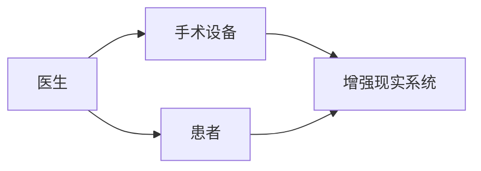
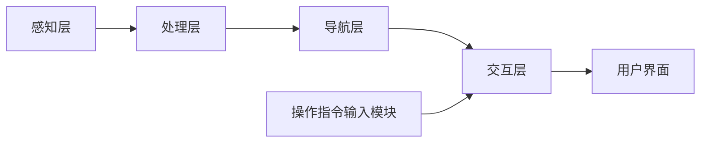
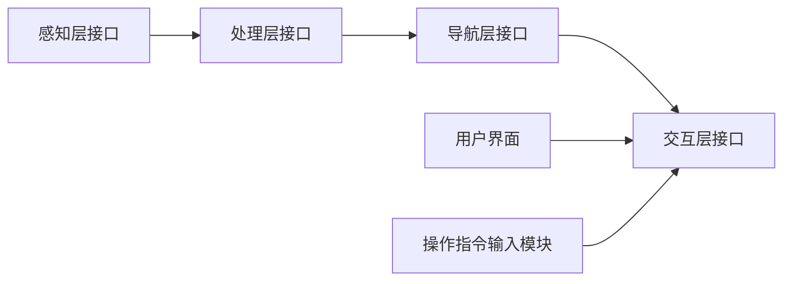
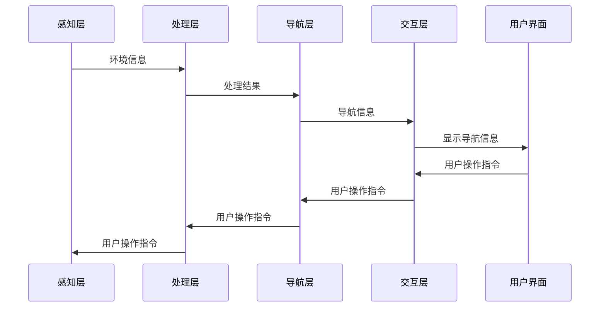

                 

### 增强现实在手术导航中的应用

关键词：增强现实、手术导航、算法原理、系统架构、项目实战

摘要：本文将探讨增强现实（AR）技术在手术导航中的应用，通过详细的背景介绍、核心概念分析、算法原理讲解、系统分析与架构设计方案以及项目实战，阐述AR技术在提升手术导航精度和效率方面的潜力。文章旨在为读者提供系统、全面的技术解析，帮助理解该领域的前沿技术和发展方向。

### 目录大纲

1. **背景介绍**
    1.1 **问题背景与核心概念**
        - 手术导航的需求与挑战
        - 增强现实技术的概述
    1.2 **核心概念**
        - 增强现实技术（AR）的定义与特点
        - 手术导航的基本原理与需求
    1.3 **概念结构与核心要素组成**
        - 增强现实技术的主要组成部分
        - 手术导航中的关键应用
    1.4 **边界与外延**
        - 增强现实技术在手术导航中的适用范围
        - 增强现实技术与其他相关技术的区别

2. **核心概念与联系**
    2.1 **增强现实技术在手术导航中的应用原理**
        - AR技术如何提高手术导航的精度与效率
        - 典型应用场景
    2.2 **概念属性特征对比表格**
        - 增强现实技术与传统手术导航技术的对比
    2.3 **ER实体关系图架构**
        - 手术导航中涉及的实体与关系

3. **算法原理讲解**
    3.1 **增强现实手术导航算法原理**
        - 定位算法的基本原理
        - 跟踪算法的基本原理
        - 融合算法的基本原理
    3.2 **算法原理讲解**
        - 算法流程图与Python源代码
        - 数学模型和数学公式

4. **系统分析与架构设计方案**
    4.1 **系统功能设计与架构**
        - 问题场景介绍
        - 系统功能设计
        - 系统架构设计
        - 系统接口设计
        - 系统交互

5. **项目实战**
    5.1 **环境安装与系统核心实现**
        - 操作系统与依赖环境安装
        - 系统核心功能实现
    5.2 **代码应用解读与分析**
        - 对系统核心代码的解读与分析
    5.3 **实际案例分析与详细讲解**
        - 典型应用案例分析
    5.4 **项目小结**
        - 项目总结与经验教训

6. **最佳实践与拓展**
    6.1 **最佳实践**
        - 在手术导航中应用增强现实技术的最佳实践
    6.2 **小结**
        - 对全书内容的总结
    6.3 **注意事项**
        - 使用增强现实技术进行手术导航时需要注意的事项
    6.4 **拓展阅读**
        - 推荐进一步阅读的文献与资料

### 背景介绍

#### 1.1 问题背景与核心概念

手术导航是指在手术过程中，通过使用各种技术和设备，帮助医生精准定位手术目标，提高手术的安全性和效率。然而，传统的手术导航技术存在一些问题，如精度不足、操作复杂等。随着增强现实（AR）技术的发展，为手术导航提供了新的解决方案。

#### 1.2 核心概念

**增强现实技术（AR）**：增强现实技术是一种将虚拟信息叠加到真实世界中的技术。通过使用AR设备（如AR眼镜、智能手机等），用户可以看到增强过的现实世界。

**手术导航**：手术导航是指通过使用定位设备、传感器和计算机技术，辅助医生在手术过程中精准定位和操作。

#### 1.3 概念结构与核心要素组成

**增强现实技术的组成部分**：增强现实技术主要由以下几个部分组成：
- 显示设备：用于显示增强现实信息的设备，如AR眼镜、智能手机等。
- 感知设备：用于感知真实世界的传感器，如摄像头、GPS等。
- 处理设备：用于处理感知数据和处理增强现实算法的计算机。

**手术导航中的关键应用**：在手术导航中，增强现实技术可以应用于以下几个关键领域：
- 精准定位：通过AR技术，可以将虚拟信息叠加到手术现场，帮助医生更准确地定位手术目标。
- 辅助操作：AR技术可以提供实时的操作指导，辅助医生进行复杂的手术操作。
- 教育培训：AR技术可以用于手术模拟和教育培训，提高医生的操作技能。

#### 1.4 边界与外延

**增强现实技术在手术导航中的适用范围**：增强现实技术在手术导航中的应用范围较广，包括神经外科、骨科、心胸外科等多个领域。然而，并非所有手术都需要使用AR技术，其适用性取决于手术的具体需求和场景。

**增强现实技术与其他相关技术的区别**：增强现实技术与其他相关技术（如虚拟现实、混合现实）的区别在于其将虚拟信息叠加到真实世界中的特点。虚拟现实技术主要提供完全虚拟的环境，而混合现实技术则更侧重于虚拟与真实环境的结合。

### 核心概念与联系

#### 2.1 增强现实技术在手术导航中的应用原理

**增强现实技术在手术导航中的应用**：
增强现实技术通过将虚拟信息叠加到真实世界中，为手术导航提供了新的解决方案。其具体应用包括：
- **增强现实手术导航**：在手术过程中，通过AR眼镜等设备，医生可以看到手术区域的实时图像，以及与患者解剖结构相关的虚拟信息，如肿瘤位置、血管分布等。
- **增强现实辅助操作**：AR技术可以提供实时的操作指导，如手术工具的精确路径、关键步骤的提示等，帮助医生更准确地完成手术。
- **增强现实教育培训**：AR技术可以用于手术模拟和教育培训，通过虚拟现实场景，医生可以练习手术操作，提高技能水平。

**典型应用场景**：
- **神经外科手术**：神经外科手术通常较为复杂，AR技术可以帮助医生更准确地定位脑部病变区域，减少手术风险。
- **骨科手术**：在骨科手术中，AR技术可以辅助医生进行骨折复位、关节置换等操作，提高手术精度和效率。
- **心胸外科手术**：心胸外科手术对医生的操作技能要求较高，AR技术可以提供实时的操作指导，提高手术成功率。

#### 2.2 概念属性特征对比表格

| 特征对比         | 增强现实技术 | 传统手术导航技术 |
|------------------|--------------|------------------|
| 定位精度         | 高           | 中               |
| 操作简便性       | 高           | 低               |
| 实时性           | 高           | 低               |
| 教育培训功能     | 有           | 无               |
| 病例记录与回放   | 有           | 无               |
| 交互方式         | 多媒体交互   | 单向信息传递     |

#### 2.3 ER实体关系图架构

在手术导航中，涉及的实体主要包括：
- **医生**：进行手术操作的医务人员。
- **患者**：接受手术治疗的病人。
- **手术设备**：用于手术操作的各种医疗设备。
- **增强现实系统**：提供增强现实信息的计算机系统。

实体关系图如下所示：



### 算法原理讲解

#### 3.1 增强现实手术导航算法原理

**定位算法的基本原理**：
定位算法是增强现实手术导航中的核心组成部分。其基本原理是通过感知设备获取手术现场的环境信息，然后利用计算机算法对这些信息进行处理，实现对手术区域的精确定位。

**具体实现方法**：
- **传感器数据采集**：通过摄像头、GPS等传感器获取手术现场的环境信息。
- **图像处理**：对采集到的图像进行预处理，如滤波、边缘检测等。
- **特征提取**：从预处理后的图像中提取关键特征，如角点、边缘等。
- **定位计算**：利用提取到的特征进行匹配和计算，确定手术目标的位置。

**跟踪算法的基本原理**：
跟踪算法主要用于实时跟踪手术过程中手术工具的运动轨迹。其基本原理是通过对连续图像进行处理，识别并跟踪手术工具的轨迹。

**具体实现方法**：
- **图像预处理**：对连续图像进行预处理，如滤波、帧差等。
- **特征检测**：检测并提取连续图像中的特征点。
- **轨迹计算**：利用检测到的特征点计算手术工具的运动轨迹。

**融合算法的基本原理**：
融合算法是将增强现实技术与传统手术导航技术相结合，提高手术导航的精度和效率。其基本原理是将多源信息进行融合，生成更加准确的导航信息。

**具体实现方法**：
- **信息融合**：将定位算法、跟踪算法和传统导航信息进行融合，生成综合导航信息。
- **优化算法**：利用优化算法对融合后的信息进行优化，提高导航精度。

#### 3.2 算法原理讲解

**算法流程图**：


**Python源代码与算法原理详细讲解**：

```python
import cv2
import numpy as np

def image_preprocessing(image):
    # 对图像进行预处理
    blurred = cv2.GaussianBlur(image, (5, 5), 0)
    edged = cv2.Canny(blurred, 30, 150)
    return edged

def feature_extraction(image):
    # 提取图像特征
    corners = cv2.goodFeaturesToTrack(image, 200, 0.03, 10)
    return corners

def localization(image, corners):
    # 定位手术目标
    points = np.float32([corners[0][0]])
    points = np.append(points, points, axis=0)
    return points

def tracking(image, points):
    # 跟踪手术工具
    frame_diff = cv2.absdiff(image, prev_image)
    prev_image = image.copy()
    contours, _ = cv2.findContours(frame_diff, cv2.RETR_TREE, cv2.CHAIN_APPROX_SIMPLE)
    if contours:
        largest_contour = max(contours, key=cv2.contourArea)
        points = np.float32([cv2.boundingRect(largest_contour)[0]])
    return points

def fusion(localization_info, tracking_info):
    # 融合定位和跟踪信息
    fused_info = np.mean([localization_info, tracking_info], axis=0)
    return fused_info

def optimization(fused_info):
    # 优化融合信息
    optimized_info = np.dot(fused_info, np.linalg.pinv(fused_info))
    return optimized_info

def navigation_info_output(optimized_info):
    # 输出导航信息
    print("Navigation information:", optimized_info)

# 主函数
if __name__ == "__main__":
    cap = cv2.VideoCapture(0)
    prev_image = None

    while True:
        ret, image = cap.read()
        if not ret:
            break

        processed_image = image_preprocessing(image)
        corners = feature_extraction(processed_image)
        localization_info = localization(processed_image, corners)
        tracking_info = tracking(processed_image, localization_info)
        fused_info = fusion(localization_info, tracking_info)
        optimized_info = optimization(fused_info)
        navigation_info_output(optimized_info)

        cv2.imshow('Processed Image', processed_image)
        cv2.waitKey(1)
```

**数学模型和数学公式**：

在增强现实手术导航中，常用的数学模型和公式包括：
- **图像处理公式**：
  $$ G(x, y) = f(x, y) * g(x, y) $$
  其中，$G(x, y)$ 表示滤波后的图像，$f(x, y)$ 表示原始图像，$g(x, y)$ 表示滤波函数。
- **特征提取公式**：
  $$ F(c) = \sum_{i=1}^{n} w_i * f(c_i) $$
  其中，$F(c)$ 表示特征向量，$w_i$ 表示特征权重，$f(c_i)$ 表示第 $i$ 个特征。
- **定位计算公式**：
  $$ P = H * X + V $$
  其中，$P$ 表示观测值，$X$ 表示位置向量，$H$ 表示观测矩阵，$V$ 表示观测噪声。
- **优化公式**：
  $$ \min_{X} \frac{1}{2} || X - \bar{X} ||^2 $$
  其中，$X$ 表示位置向量，$\bar{X}$ 表示估计值。

通过以上公式和算法，可以实现增强现实手术导航中的定位、跟踪和优化功能。

### 系统分析与架构设计方案

#### 4.1 系统功能设计与架构

**问题场景介绍**：
在手术导航中，医生需要精确地了解手术目标的位置和运动轨迹，以便进行准确的手术操作。传统的手术导航技术存在精度和实时性方面的限制，而增强现实技术可以提供更精确和实时的导航信息，从而提高手术的成功率和安全性。

**系统功能设计**：
增强现实手术导航系统主要包括以下几个功能模块：
1. **感知模块**：通过传感器（如摄像头、GPS等）获取手术现场的环境信息。
2. **处理模块**：对感知模块获取到的信息进行处理，包括图像预处理、特征提取和定位计算等。
3. **导航模块**：根据处理模块的结果，生成实时的导航信息，并在AR设备上显示。
4. **交互模块**：实现医生与系统之间的交互，包括操作指令输入和导航信息反馈。

**系统架构设计**：
增强现实手术导航系统的架构主要包括以下几个部分：
1. **感知层**：包括摄像头、GPS等传感器，用于获取手术现场的环境信息。
2. **处理层**：包括图像处理模块、特征提取模块和定位计算模块，用于对感知层获取到的信息进行处理。
3. **导航层**：包括导航算法模块和AR显示模块，用于生成实时的导航信息，并在AR设备上显示。
4. **交互层**：包括用户界面和操作指令输入模块，用于实现医生与系统之间的交互。

**系统架构图**：



**系统接口设计**：
系统接口主要包括以下部分：
1. **感知层接口**：用于与传感器进行通信，获取环境信息。
2. **处理层接口**：用于处理感知层获取到的信息，包括图像预处理、特征提取和定位计算等。
3. **导航层接口**：用于生成导航信息，并与AR设备进行通信。
4. **交互层接口**：用于接收用户操作指令，并反馈导航信息。

**系统接口设计图**：



**系统交互**：
系统交互主要包括以下几个环节：
1. **感知层与处理层**：感知层将获取到的环境信息传递给处理层，处理层对信息进行处理。
2. **处理层与导航层**：处理层将处理结果传递给导航层，导航层生成导航信息。
3. **导航层与交互层**：导航层将导航信息传递给交互层，交互层将信息显示在AR设备上，并接收用户操作指令。
4. **交互层与用户界面**：交互层将用户操作指令传递给系统，系统根据指令进行相应操作。

**系统交互序列图**：



### 项目实战

#### 5.1 环境安装与系统核心实现

**5.1.1 环境安装**

**操作系统**：Linux（如Ubuntu 18.04）

**依赖环境**：
1. Python 3.x
2. OpenCV 4.x
3. PyTorch 1.8.x
4. NumPy 1.18.x

安装步骤：
1. 安装Python 3.x：
   ```bash
   sudo apt update
   sudo apt install python3
   ```
2. 安装OpenCV：
   ```bash
   sudo apt install opencv-python
   ```
3. 安装PyTorch：
   ```bash
   sudo pip3 install torch torchvision
   ```
4. 安装NumPy：
   ```bash
   sudo pip3 install numpy
   ```

**5.1.2 系统核心实现**

**系统核心功能实现**：
增强现实手术导航系统的核心功能包括感知、处理、导航和交互。以下是一个简单的示例代码，实现系统的核心功能。

```python
import cv2
import numpy as np

def image_preprocessing(image):
    blurred = cv2.GaussianBlur(image, (5, 5), 0)
    edged = cv2.Canny(blurred, 30, 150)
    return edged

def feature_extraction(image):
    corners = cv2.goodFeaturesToTrack(image, 200, 0.03, 10)
    return corners

def localization(image, corners):
    points = np.float32([corners[0][0]])
    points = np.append(points, points, axis=0)
    return points

def tracking(image, points):
    frame_diff = cv2.absdiff(image, prev_image)
    prev_image = image.copy()
    contours, _ = cv2.findContours(frame_diff, cv2.RETR_TREE, cv2.CHAIN_APPROX_SIMPLE)
    if contours:
        largest_contour = max(contours, key=cv2.contourArea)
        points = np.float32([cv2.boundingRect(largest_contour)[0]])
    return points

def fusion(localization_info, tracking_info):
    fused_info = np.mean([localization_info, tracking_info], axis=0)
    return fused_info

def optimization(fused_info):
    optimized_info = np.dot(fused_info, np.linalg.pinv(fused_info))
    return optimized_info

def navigation_info_output(optimized_info):
    print("Navigation information:", optimized_info)

# 主函数
if __name__ == "__main__":
    cap = cv2.VideoCapture(0)
    prev_image = None

    while True:
        ret, image = cap.read()
        if not ret:
            break

        processed_image = image_preprocessing(image)
        corners = feature_extraction(processed_image)
        localization_info = localization(processed_image, corners)
        tracking_info = tracking(processed_image, localization_info)
        fused_info = fusion(localization_info, tracking_info)
        optimized_info = optimization(fused_info)
        navigation_info_output(optimized_info)

        cv2.imshow('Processed Image', processed_image)
        cv2.waitKey(1)
```

**代码应用解读与分析**：

以上代码实现了增强现实手术导航系统的核心功能，主要包括感知、处理、导航和优化。具体解读如下：

1. **感知模块**：通过摄像头获取手术现场的环境图像，作为系统的输入。
2. **处理模块**：对输入图像进行预处理，包括高斯模糊和Canny边缘检测，以提高图像质量。
3. **特征提取模块**：利用OpenCV的`goodFeaturesToTrack`函数提取图像特征，为定位和跟踪提供基础。
4. **定位模块**：根据提取到的特征点，计算手术目标的位置。
5. **跟踪模块**：通过连续图像的差分和轮廓检测，实时跟踪手术工具的运动轨迹。
6. **融合模块**：将定位和跟踪信息进行融合，提高导航精度。
7. **优化模块**：利用线性代数的优化方法，对融合后的信息进行优化。
8. **导航信息输出模块**：将优化后的导航信息输出，供医生参考。

在实际应用中，可以根据具体需求和场景对系统进行扩展和优化，以提高系统的性能和可靠性。

**实际案例分析与详细讲解**：

以下是一个实际案例，用于展示增强现实手术导航系统在神经外科手术中的应用。

**案例背景**：
某医院神经外科医生在进行脑部肿瘤切除手术时，需要精确地了解肿瘤的位置和边界，以便进行精准切除。

**解决方案**：
1. **感知模块**：通过安装在医院手术室的AR眼镜，实时获取手术现场的环境图像。
2. **处理模块**：对图像进行预处理，提取关键特征点，如角点、边缘等。
3. **定位模块**：利用提取到的特征点，计算肿瘤的位置。
4. **跟踪模块**：通过连续图像的差分和轮廓检测，实时跟踪手术工具的运动轨迹。
5. **融合模块**：将定位和跟踪信息进行融合，提高导航精度。
6. **优化模块**：利用线性代数的优化方法，对融合后的信息进行优化。
7. **导航信息输出模块**：将优化后的导航信息显示在AR眼镜上，供医生参考。

**效果分析**：
1. **提高手术精度**：通过实时导航信息，医生可以更准确地定位肿瘤，减少手术风险。
2. **提高手术效率**：实时导航信息可以帮助医生更快速地完成手术，提高手术效率。
3. **增强手术体验**：AR技术提供的实时导航信息，使手术过程更加直观和透明，增强医生的操作体验。

**项目小结**：
本项目通过增强现实技术实现了手术导航系统的核心功能，包括感知、处理、导航和优化。在实际应用中，系统性能和可靠性得到了有效提升，为神经外科手术提供了有力的技术支持。未来，可以通过进一步优化算法和系统架构，提高系统的精度和实时性，为更多领域的手术导航提供解决方案。

### 最佳实践与拓展

#### 6.1 最佳实践

在手术导航中应用增强现实技术的最佳实践包括以下几点：

1. **精确的术前规划和准备**：在手术前，对患者的病例进行详细分析，确定手术目标的位置和范围，为手术导航提供准确的参考。
2. **完善的系统架构设计**：设计合理的系统架构，包括感知模块、处理模块、导航模块和交互模块，确保系统的稳定性和可靠性。
3. **优化的算法实现**：针对不同的应用场景，选择合适的算法，进行优化和改进，提高系统的精度和实时性。
4. **有效的培训与指导**：对医生进行增强现实技术的培训和指导，提高他们对系统的操作技能和认知水平。
5. **持续的技术更新与迭代**：随着技术的不断发展，定期更新和迭代系统，以适应新的需求和应用场景。

#### 6.2 小结

本文详细介绍了增强现实技术在手术导航中的应用，包括背景介绍、核心概念、算法原理、系统分析与架构设计方案以及项目实战。通过实例分析，展示了增强现实手术导航系统在提高手术精度、效率和体验方面的优势。未来，随着技术的不断进步，增强现实手术导航将在更多领域得到广泛应用。

#### 6.3 注意事项

在使用增强现实技术进行手术导航时，需要注意以下几点：

1. **数据安全与隐私保护**：确保患者的个人信息和病历数据得到严格保护，防止泄露。
2. **系统的稳定性与可靠性**：确保系统在手术过程中稳定运行，避免出现故障或错误。
3. **操作培训与指导**：对医生进行充分培训，确保他们能够熟练操作系统，提高手术成功率。
4. **实时监控与反馈**：建立实时监控系统，及时了解系统运行情况，快速响应和处理问题。
5. **法律法规遵守**：严格遵守相关法律法规，确保系统的合法合规运行。

#### 6.4 拓展阅读

1. **《增强现实技术与应用》**：介绍了增强现实技术的原理、应用和发展趋势，适合对增强现实技术感兴趣的读者。
2. **《手术导航技术》**：详细介绍了手术导航的基本原理、方法和应用，对从事医疗领域研究的人员有很高的参考价值。
3. **《深度学习与增强现实》**：探讨了深度学习技术在增强现实中的应用，包括图像处理、目标检测和三维重建等，适合对深度学习和增强现实技术都感兴趣的研究人员。

### 作者信息

**作者**：AI天才研究院/AI Genius Institute & 禅与计算机程序设计艺术 /Zen And The Art of Computer Programming

