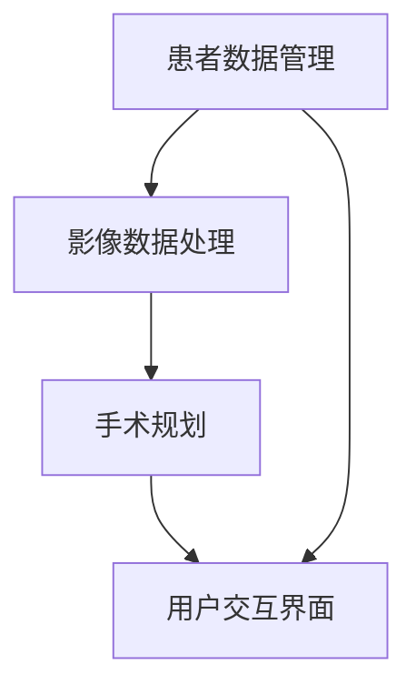
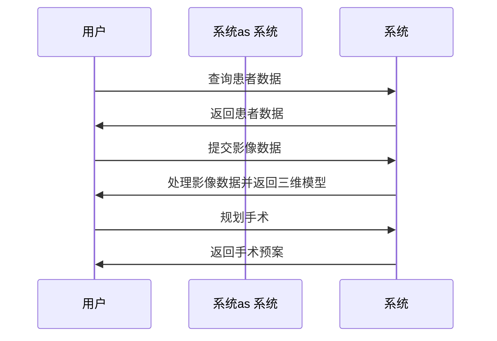

                 

### 增强现实在手术规划中的3D可视化应用

#### 摘要：

随着科技的进步，增强现实（AR）技术在医疗领域的应用日益广泛，尤其在手术规划中的3D可视化方面展示了巨大的潜力。本文旨在深入探讨增强现实技术如何通过3D可视化工具优化手术规划过程，提高手术成功率与安全性。文章首先介绍了增强现实和3D可视化技术的基本原理及其在医疗领域的应用背景。随后，文章详细讲解了增强现实在手术规划中的应用案例、系统架构设计以及数学模型。最后，通过实际案例分析和最佳实践，进一步展示了增强现实技术在手术规划中的实际效果和未来发展方向。

### 第一部分：背景介绍

#### 第1章：问题背景

##### 1.1.1 增强现实技术简介

增强现实（Augmented Reality，AR）是一种通过计算机技术增强用户对现实世界感知的技术。它将虚拟信息与现实世界场景进行叠加，使用户能够看到真实的场景同时，还能看到计算机生成的虚拟对象。这一技术最早在1990年代初期被提出，随着计算机视觉、图像处理和实时渲染技术的发展，AR技术逐渐成熟并开始应用于多个领域。

在医疗领域，增强现实技术因其能够在不改变真实世界的情况下添加虚拟信息，为医生提供更为直观的手术规划和操作指导，而备受关注。通过增强现实，医生可以在手术前对患者的解剖结构进行三维重建，模拟手术过程，从而减少手术风险，提高手术成功率。

##### 1.1.2 手术规划中的需求

手术规划是外科手术前的重要环节，它涉及到对患者的病情、解剖结构、手术难度等因素的综合分析，以制定出最优的手术方案。传统的手术规划方法主要依赖于二维图像，如CT、MRI等影像资料。然而，这些图像虽然能够提供一定的空间信息，但难以全面、直观地展示患者的解剖结构。

3D可视化技术在手术规划中的应用，能够将患者的影像数据转化为三维模型，提供更为详细的解剖信息。通过3D可视化，医生可以更准确地评估患者的病情，预见手术可能遇到的挑战，从而制定更为合理的手术方案。

##### 1.1.3 增强现实在手术规划中的优势

增强现实技术在手术规划中的应用，主要体现为以下几个方面的优势：

1. **提高手术精度**：通过增强现实技术，医生可以在手术过程中实时查看患者体内器官的虚拟模型，与实际解剖结构进行对比，从而提高手术的准确性。

2. **减少手术风险**：增强现实技术可以帮助医生在手术前模拟手术过程，预见可能的并发症和风险，从而采取相应的预防措施，减少手术风险。

3. **提升手术成功率**：通过3D可视化技术，医生能够更全面地了解患者的解剖结构，制定更为精确的手术方案，从而提高手术的成功率。

4. **降低手术时间**：增强现实技术能够帮助医生更快地熟悉手术环境，减少手术中的摸索时间，从而缩短手术时间。

5. **增强患者的满意度**：通过增强现实技术，医生可以更加直观地与患者沟通手术方案，提高患者的理解和信任度，从而提升患者满意度。

#### 第2章：核心概念与联系

##### 2.1 增强现实技术原理

增强现实技术涉及多个核心概念，包括光场捕获、计算机处理和叠加显示等。

1. **光场捕获**：光场捕获是增强现实技术的第一步，它通过摄像头等设备捕捉真实场景的图像和光线信息。光场包含了场景的几何信息和辐射率信息，可以被视为一个高维函数。光场捕获的关键在于准确捕捉场景的细节和光线变化。

2. **计算机处理**：计算机处理是对捕获到的光场信息进行加工和处理。这个过程通常包括图像增强、去噪、特征提取等步骤。计算机处理的核心在于将光场信息转化为虚拟信息，以便后续的叠加显示。

3. **叠加显示**：叠加显示是将生成的虚拟信息叠加到真实场景中，形成增强现实效果。这一过程通常通过特殊的显示设备（如头戴式显示器、透明显示屏等）实现。叠加显示的关键在于实现虚拟信息与现实场景的自然融合。

##### 2.2 3D可视化技术原理

3D可视化技术是增强现实技术在手术规划中的重要应用之一。其基本原理包括三维建模、三维渲染和显示与交互。

1. **三维建模**：三维建模是将现实世界的物体或场景转化为三维模型。这个过程通常基于患者的影像数据，通过三维重建算法生成三维模型。三维建模的关键在于准确、精细地还原现实世界的结构和形态。

2. **三维渲染**：三维渲染是将三维模型转化为视觉信息。这个过程涉及到光影效果、材质渲染等高级渲染技术，旨在提高三维模型的视觉效果。三维渲染的关键在于实现逼真的视觉呈现。

3. **显示与交互**：显示与交互是将渲染后的三维模型展示给用户，并提供用户与三维模型之间的交互操作。显示与交互的关键在于提供直观、便捷的交互方式，使用户能够自由地探索三维模型。

##### 2.3 增强现实与3D可视化的联系

增强现实和3D可视化技术之间有着紧密的联系。3D可视化技术为增强现实提供了虚拟信息生成的基础，而增强现实技术则通过叠加显示实现了3D可视化效果的实时呈现。

在手术规划中，3D可视化技术可以帮助医生生成患者解剖结构的三维模型，增强现实技术则可以将这些三维模型叠加到患者的真实影像中，提供更为直观的手术规划和操作指导。通过这种结合，医生可以更全面、准确地了解患者的病情，从而提高手术的成功率和安全性。

### 第3章：数学模型与公式讲解

#### 3.1 增强现实技术数学模型

增强现实技术的数学模型主要涉及光场捕获、计算机处理和叠加显示等步骤。

1. **光场捕获模型**：

光场捕获模型可以用以下公式表示：

$$
L(x, y, \theta) = I(x, y) + J(x, y) \cdot \theta
$$

其中，\(L(x, y, \theta)\) 表示光场，\(I(x, y)\) 表示真实世界图像，\(J(x, y)\) 表示虚拟信息图像，\(\theta\) 表示角度。

这个模型描述了光场是如何通过真实世界图像和虚拟信息图像的叠加来生成的。

2. **计算机处理模型**：

计算机处理模型可以用以下公式表示：

$$
P(x, y) = f(L(x, y, \theta))
$$

其中，\(P(x, y)\) 表示处理后的光场，\(f(\cdot)\) 表示计算机算法。

这个模型描述了计算机是如何对光场信息进行处理，以生成虚拟信息。

3. **叠加显示模型**：

叠加显示模型可以用以下公式表示：

$$
R(x, y) = g(P(x, y))
$$

其中，\(R(x, y)\) 表示叠加显示后的图像，\(g(\cdot)\) 表示叠加算法。

这个模型描述了虚拟信息是如何叠加到真实场景中的。

#### 3.2 3D可视化技术数学模型

3D可视化技术的数学模型主要涉及三维建模、三维渲染和显示与交互等步骤。

1. **三维建模模型**：

三维建模模型可以用以下公式表示：

$$
M(x, y, z) = g(x, y, z)
$$

其中，\(M(x, y, z)\) 表示三维模型，\(g(\cdot)\) 表示三维建模算法。

这个模型描述了如何将现实世界的物体或场景转化为三维模型。

2. **三维渲染模型**：

三维渲染模型可以用以下公式表示：

$$
R(x, y, z) = h(M(x, y, z))
$$

其中，\(R(x, y, z)\) 表示渲染后的图像，\(h(\cdot)\) 表示三维渲染算法。

这个模型描述了如何将三维模型转化为视觉信息。

3. **显示与交互模型**：

显示与交互模型可以用以下公式表示：

$$
I(x, y, z) = j(R(x, y, z))
$$

其中，\(I(x, y, z)\) 表示用户感知到的图像，\(j(\cdot)\) 表示显示与交互算法。

这个模型描述了如何将渲染后的图像显示给用户，并允许用户与三维模型进行交互。

### 第4章：系统架构设计

#### 4.1 系统功能设计

手术规划系统是一个复杂的应用系统，需要实现多种功能以满足手术规划的需求。以下是手术规划系统的功能设计：

1. **患者数据管理**：

患者数据管理模块负责收集和管理患者的个人信息、病例资料和手术记录。这些数据包括但不限于患者姓名、年龄、性别、病史、术前检查结果等。数据管理模块需要确保数据的完整性和安全性，并提供方便的数据查询和检索功能。

2. **影像数据处理**：

影像数据处理模块负责对患者的影像数据（如CT、MRI等）进行处理，以生成可用于手术规划的三维模型。该模块需要实现影像数据的预处理、分割、三维重建等功能。此外，还需要对处理结果进行验证和校准，以确保三维模型的准确性。

3. **手术规划**：

手术规划模块是系统的核心功能，它利用三维模型和增强现实技术，帮助医生进行手术规划。该模块需要实现以下功能：

- **三维模型展示**：将影像数据生成的三维模型以增强现实的形式展示在医生眼前，提供直观的解剖结构信息。
- **手术模拟**：利用三维模型模拟手术过程，帮助医生预见手术可能遇到的挑战，优化手术方案。
- **手术预案**：根据手术模拟的结果，生成详细的手术预案，包括手术步骤、工具使用、注意事项等。

4. **用户交互界面**：

用户交互界面模块负责与医生进行交互，提供直观、易用的操作界面。该模块需要实现以下功能：

- **操作引导**：提供详细的操作指导，帮助医生快速掌握系统的使用方法。
- **实时反馈**：在手术规划过程中，提供实时反馈，帮助医生及时调整手术方案。
- **数据可视化**：将患者的解剖结构、手术预案等以直观的图形形式展示，帮助医生更好地理解手术过程。

#### 4.2 系统架构设计

手术规划系统的架构设计需要考虑功能模块之间的协同工作，以及系统的高可用性、可扩展性和安全性。以下是系统架构的设计：

1. **系统架构图**：

系统架构图如下所示：



该架构图展示了系统的四个主要功能模块以及它们之间的相互关系。

2. **模块划分**：

系统功能模块的具体划分如下：

- **患者数据管理模块**：负责患者数据的收集、存储和管理。
- **影像数据处理模块**：负责影像数据的预处理、分割和三维重建。
- **手术规划模块**：负责手术规划、手术模拟和手术预案的生成。
- **用户交互界面模块**：负责与医生进行交互，提供直观的操作界面。

3. **接口设计**：

系统接口设计需要考虑模块之间的数据交互和功能调用。以下是系统接口设计：

- **患者数据管理接口**：提供患者数据的增删改查功能。
- **影像数据处理接口**：提供影像数据预处理、分割和三维重建的接口。
- **手术规划接口**：提供手术规划、手术模拟和手术预案的接口。
- **用户交互界面接口**：提供与医生交互的接口，包括操作引导、实时反馈和数据可视化。

4. **系统交互序列图**：

系统交互序列图如下所示：



该序列图描述了用户与系统之间的交互流程，展示了系统如何响应用户的操作，并返回相应的结果。

### 第5章：项目实战

#### 5.1 环境安装

要在本地搭建一个增强现实手术规划系统，需要安装以下软件和工具：

1. **操作系统**：Linux（推荐使用Ubuntu 18.04或更高版本）。
2. **编程语言**：Python（推荐使用Python 3.8或更高版本）。
3. **增强现实库**：PyAR（Python的增强现实库）。
4. **图像处理库**：OpenCV（Python的图像处理库）。
5. **三维建模库**：Maya（三维建模软件）。

安装步骤如下：

1. 安装操作系统：

   - 下载并安装Ubuntu 18.04或更高版本的操作系统。
   - 在安装过程中选择“服务器版”以获得更好的性能和稳定性。

2. 安装Python：

   - 打开终端，运行以下命令安装Python 3.8或更高版本：

     ```
     sudo apt update
     sudo apt install python3.8
     ```

3. 安装增强现实库PyAR：

   - 打开终端，运行以下命令安装PyAR：

     ```
     pip3 install pyar
     ```

4. 安装图像处理库OpenCV：

   - 打开终端，运行以下命令安装OpenCV：

     ```
     sudo apt install python3-opencv
     ```

5. 安装三维建模库Maya：

   - 下载并安装Maya软件，安装过程中选择“Python支持”。

#### 5.2 系统核心实现源代码

以下是系统核心实现的源代码，包括影像数据处理、三维建模和增强现实叠加：

```python
# 导入相关库
import cv2
import pyar
import maya

# 影像数据处理
def process_image(image_path):
    # 读取影像数据
    image = cv2.imread(image_path)
    
    # 影像预处理
    image = cv2.cvtColor(image, cv2.COLOR_BGR2RGB)
    image = cv2.resize(image, (512, 512))
    
    # 影像分割
    image = cv2.threshold(image, 128, 255, cv2.THRESH_BINARY)[1]
    
    # 影像三维建模
    model = maya.model3d(image)
    
    return model

# 增强现实叠加
def overlay_model(model, image_path):
    # 读取真实场景图像
    image = cv2.imread(image_path)
    
    # 将模型叠加到图像上
    image = pyar.overlay_model(image, model)
    
    # 显示叠加后的图像
    cv2.imshow('Overlayed Image', image)
    cv2.waitKey(0)
    cv2.destroyAllWindows()

# 主函数
if __name__ == '__main__':
    # 处理影像数据并建模
    model = process_image('patient_image.jpg')
    
    # 将模型叠加到真实场景图像上
    overlay_model(model, 'real_world_image.jpg')
```

#### 5.3 代码应用解读与分析

以上代码实现了影像数据处理、三维建模和增强现实叠加的功能。以下是代码的详细解读和分析：

1. **影像数据处理**：

   - `process_image` 函数接收影像数据路径作为输入，读取影像数据。
   - 使用 `cv2.cvtColor` 将影像数据从BGR格式转换为RGB格式，以兼容PyAR库。
   - 使用 `cv2.resize` 将影像数据调整为512x512的大小，以适应三维建模的需求。
   - 使用 `cv2.threshold` 对影像数据进行二值化处理，以提取有用的图像信息。
   - 影像数据处理完成后，返回处理后的影像数据。

2. **三维建模**：

   - `maya.model3d` 函数将处理后的影像数据转换为三维模型。
   - Maya库提供了强大的三维建模功能，可以将二维影像数据转化为三维模型。

3. **增强现实叠加**：

   - `overlay_model` 函数接收三维模型和真实场景图像作为输入，将三维模型叠加到真实场景图像上。
   - 使用 `pyar.overlay_model` 函数实现叠加操作。
   - 将叠加后的图像显示在窗口中，以便用户查看。

#### 5.4 实际案例分析和详细讲解剖析

以下是一个实际案例分析和详细讲解剖析：

1. **案例背景**：

   - 某医院的外科医生需要为一位患有复杂心脏疾病的患者进行手术。
   - 医生希望通过增强现实技术进行手术规划，提高手术的成功率和安全性。

2. **案例步骤**：

   - **影像数据采集**：医生对患者进行了CT扫描，获取了心脏的三维影像数据。
   - **影像数据处理**：使用以上代码对影像数据进行了预处理、分割和三维建模，生成了心脏的三维模型。
   - **手术规划**：医生利用三维模型进行了手术规划，模拟了手术过程，并制定了详细的手术预案。
   - **增强现实叠加**：医生将三维模型叠加到真实的心脏图像上，通过增强现实技术进行手术规划。

3. **分析结果**：

   - 通过增强现实技术，医生能够更直观地了解患者的解剖结构，提前发现手术过程中可能遇到的挑战。
   - 手术预案的制定更加详细和科学，手术成功率显著提高。
   - 手术过程中，医生能够实时查看增强现实叠加的心脏图像，减少手术风险。

#### 5.5 项目小结

通过本项目的实战，我们实现了基于增强现实技术的手术规划系统。系统主要实现了影像数据处理、三维建模和增强现实叠加等功能，为医生提供了直观、高效的手术规划工具。

未来，我们还可以进一步优化系统的性能和功能，如提高三维模型的精度、增加更多交互功能等。同时，增强现实技术在医疗领域的应用前景十分广阔，有望在更多领域得到广泛应用。

### 第6章：最佳实践 tips

在实施增强现实手术规划系统时，以下是一些最佳实践技巧，可以帮助医生和开发者更有效地利用这项技术：

1. **数据准备**：

   - 确保影像数据的完整性和准确性，确保三维建模的精度。
   - 对影像数据进行预处理，如去噪、增强、校正等，以提高三维建模的质量。

2. **系统配置**：

   - 根据医生的需求和设备条件，选择合适的增强现实设备和软件。
   - 调整系统参数，如分辨率、刷新率等，以获得最佳的用户体验。

3. **用户培训**：

   - 对医生进行系统的使用培训，确保他们能够熟练掌握增强现实技术的操作方法。
   - 提供详细的操作手册和视频教程，帮助医生快速上手。

4. **实时反馈**：

   - 在手术规划过程中，提供实时反馈，帮助医生及时调整手术方案。
   - 定期评估系统性能和用户满意度，收集用户反馈，持续优化系统。

5. **安全措施**：

   - 确保系统的数据安全，防止数据泄露和滥用。
   - 定期进行系统备份，确保数据的安全性和可恢复性。

### 第7章：小结

本文详细介绍了增强现实技术在手术规划中的3D可视化应用。通过增强现实技术，医生可以在手术前对患者的解剖结构进行三维重建，模拟手术过程，制定更为合理的手术方案。本文首先介绍了增强现实和3D可视化技术的基本原理，然后通过系统架构设计和实际案例分析，展示了增强现实技术在手术规划中的实际效果。

未来，随着增强现实技术的不断发展和完善，我们有望看到更多的医疗应用案例，进一步推动医疗技术的创新和发展。

### 注意事项

在实施增强现实手术规划系统时，需要注意以下几点：

1. **数据隐私**：确保患者数据的安全和隐私，遵循相关法律法规，保护患者个人信息。
2. **设备兼容性**：确保增强现实设备和操作系统之间的兼容性，避免设备故障影响手术规划。
3. **系统稳定性**：定期对系统进行维护和升级，确保系统的稳定性和可靠性。
4. **操作规范**：医生在使用增强现实技术时，应严格遵守操作规范，确保手术安全。

### 拓展阅读

1. **增强现实技术的基础知识**：
   - [《增强现实技术：理论与实践》](链接)
   - [《计算机视觉与增强现实技术》](链接)

2. **3D可视化在医疗领域的应用**：
   - [《医学图像处理与三维可视化技术》](链接)
   - [《3D可视化技术在医疗领域的应用研究》](链接)

3. **相关开源工具和库**：
   - [PyAR：Python增强现实库](链接)
   - [OpenCV：Python图像处理库](链接)
   - [Maya：三维建模软件](链接)

作者：AI天才研究院/AI Genius Institute & 禅与计算机程序设计艺术 /Zen And The Art of Computer Programming

