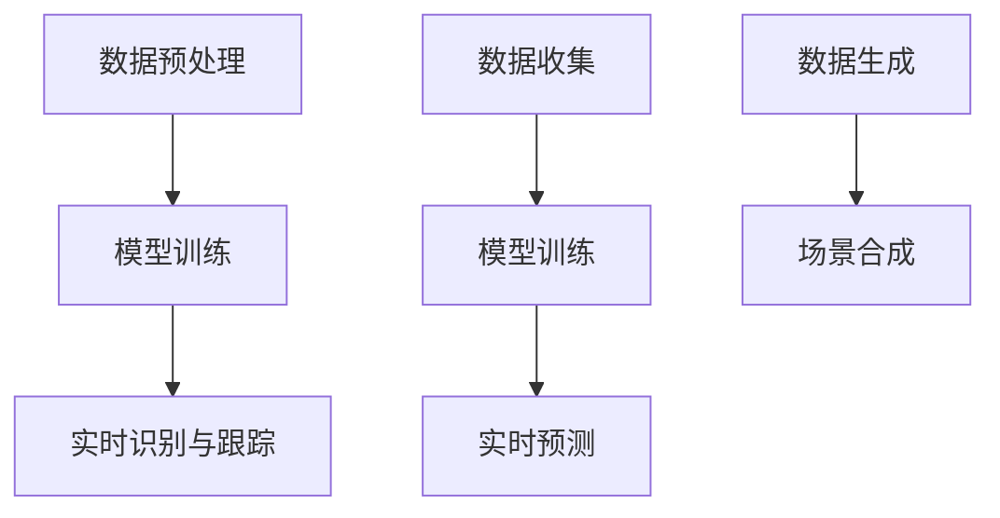
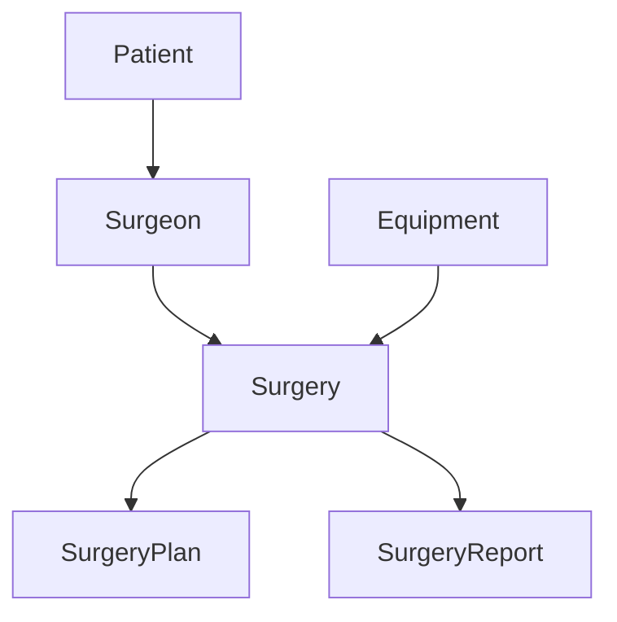
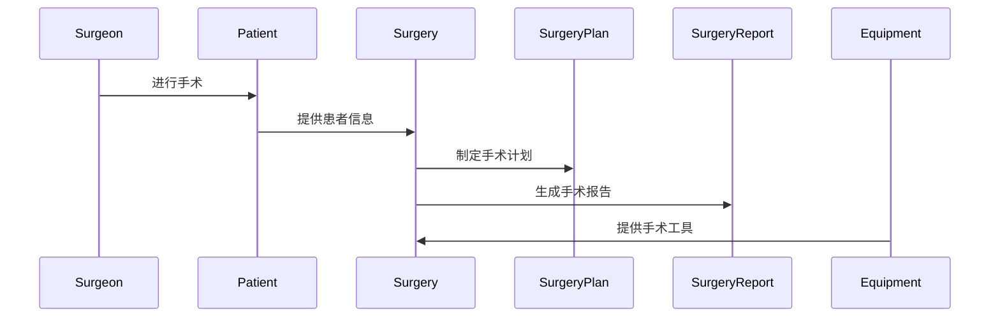
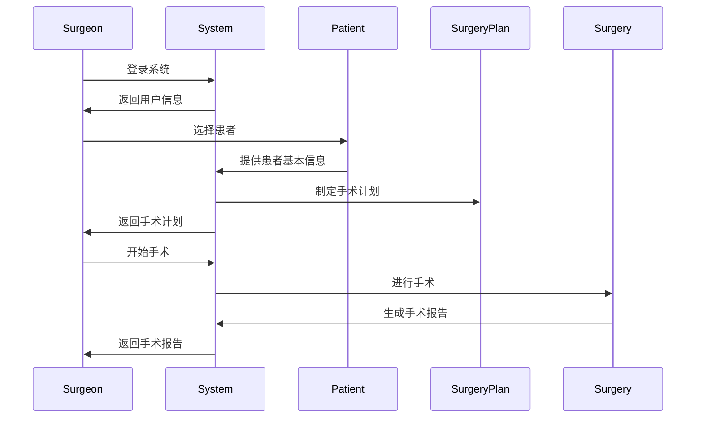

                 

### 增强现实在手术训练中的模拟应用

> 关键词：增强现实，手术训练，模拟应用，人机交互，深度学习，系统设计

> 摘要：本文将探讨增强现实技术在手术训练中的模拟应用。通过详细介绍增强现实技术的基础知识、核心概念与联系，以及深度学习在手术模拟中的应用，我们旨在提供一个全面、易懂的指南，帮助医学专业人士和计算机科学领域的读者更好地理解和应用这一前沿技术。

---

### 引言

手术训练是医学教育和实践的重要环节。然而，传统的手术训练方法存在诸多局限，如训练成本高、风险大、反馈机制不完善等。近年来，随着增强现实（Augmented Reality，AR）技术的飞速发展，将其应用于手术训练成为一种新的趋势。本文将围绕增强现实在手术训练中的模拟应用，深入探讨其技术原理、系统架构以及实际应用案例，旨在为读者提供一个系统、全面的理解。

### 背景介绍

#### 增强现实技术的历史与发展

增强现实技术起源于20世纪60年代，其概念由美国科学幻想作家Stanley G. Weinbaum在其小说《The Maze of Enigma》中首次提出。随着计算机技术和显示技术的进步，增强现实技术逐渐从科幻走向现实。20世纪90年代，波音公司首先将增强现实技术应用于飞机维修培训。进入21世纪，智能手机和移动互联网的普及为增强现实技术带来了新的发展机遇，其应用领域不断扩大，包括教育、医疗、军事、娱乐等。

#### 增强现实技术的核心原理

增强现实技术通过在真实环境中叠加计算机生成的图像、视频、声音等信息，使用户能够直接感受到虚拟信息与现实世界的互动。其核心原理包括：

1. **图像识别与跟踪**：使用摄像头捕捉现实环境中的图像，通过算法实现图像识别与跟踪。
2. **信息叠加与渲染**：将虚拟信息与现实图像进行叠加，通过显示设备（如头戴显示器、智能手机屏幕等）呈现给用户。
3. **交互与反馈**：用户可以通过手势、声音等与虚拟信息进行交互，获得反馈。

#### 增强现实技术在医疗领域的应用现状

增强现实技术在医疗领域的应用主要集中在手术模拟、医学教育、远程医疗等方面。例如，在手术模拟中，增强现实技术可以帮助医生进行术前规划、术中指导、术后评估，提高手术成功率。在医学教育中，增强现实技术可以提供沉浸式的学习体验，帮助学生更好地理解和掌握医学知识。在远程医疗中，增强现实技术可以实现医生与患者的远程交互，提高医疗服务的效率和质量。

### 核心概念与联系

#### 增强现实与虚拟现实、混合现实的关系

增强现实（AR）、虚拟现实（VR）和混合现实（MR）是当前备受关注的三种沉浸式技术。它们之间的区别主要在于信息的呈现方式和用户的交互方式。

1. **增强现实（AR）**：在真实环境中叠加虚拟信息，用户可以通过摄像头、头戴显示器等设备看到虚实结合的场景。
2. **虚拟现实（VR）**：完全沉浸在一个虚拟环境中，用户通过头戴显示器、手柄等设备与虚拟环境进行交互。
3. **混合现实（MR）**：结合了AR和VR的特点，用户可以在虚拟环境中操作真实物体，也可以在真实环境中看到虚拟物体。

#### 人机交互在手术模拟中的应用

人机交互（Human-Computer Interaction，HCI）是增强现实手术模拟的重要组成部分。通过研究人机交互的原理和方法，可以设计出更加符合医生操作习惯、提高手术效率的交互界面。

1. **手势交互**：医生可以通过手势对虚拟手术工具进行操作，如放大、缩小、旋转等。
2. **语音交互**：医生可以通过语音命令控制虚拟手术工具，提高操作效率。
3. **触摸交互**：通过触摸屏幕或头戴显示器，医生可以直接对虚拟手术工具进行操作。

#### 增强现实与手术模拟的融合

增强现实技术与手术模拟的结合，可以提供更加真实、高效的手术训练体验。具体来说，其融合主要体现在以下几个方面：

1. **术前规划**：医生可以使用增强现实技术进行手术规划，提高手术方案的准确性和可行性。
2. **术中指导**：在手术过程中，增强现实技术可以为医生提供实时指导，提高手术的顺利进行。
3. **术后评估**：通过增强现实技术，医生可以对手术效果进行实时评估，为后续治疗提供参考。

### 算法原理讲解

#### 深度学习与增强现实手术模拟

深度学习（Deep Learning）是人工智能（AI）的一个重要分支，其通过多层神经网络模拟人脑的思考过程，具有强大的数据分析和模式识别能力。在增强现实手术模拟中，深度学习技术被广泛应用于图像识别、目标跟踪、手术规划等方面。

1. **卷积神经网络（CNN）**：CNN是一种用于图像识别的深度学习模型，通过多层卷积和池化操作提取图像特征，实现对图像的分类和识别。
2. **循环神经网络（RNN）**：RNN是一种用于序列数据处理的深度学习模型，通过记忆单元对序列数据进行建模，可以实现对时间序列数据的预测和分析。
3. **生成对抗网络（GAN）**：GAN是一种通过两个神经网络（生成器和判别器）相互博弈来生成高质量数据的模型，可以用于生成虚拟手术场景和数据集。

#### 算法原理讲解

1. **图像识别与目标跟踪**：

   增强现实手术模拟中的图像识别与目标跟踪是关键环节。使用CNN模型，可以实现对手术图像中的组织、器官、手术工具等目标的识别与跟踪。具体步骤如下：

   - **数据预处理**：对手术图像进行预处理，如灰度化、缩放、裁剪等。
   - **模型训练**：使用大量的手术图像数据集，训练CNN模型，使其能够识别和跟踪手术目标。
   - **实时识别与跟踪**：在手术过程中，实时捕捉手术图像，使用训练好的CNN模型进行目标识别和跟踪。

2. **手术规划与预测**：

   增强现实手术模拟中的手术规划与预测是提高手术成功率的重要手段。使用RNN模型，可以实现对手术过程的序列数据建模，预测手术步骤和时间。具体步骤如下：

   - **数据收集**：收集大量的手术记录数据，包括手术步骤、时间、手术工具使用情况等。
   - **模型训练**：使用RNN模型对手术记录数据集进行训练，使其能够预测手术步骤和时间。
   - **实时预测**：在手术过程中，实时捕捉手术数据，使用训练好的RNN模型进行手术预测。

3. **虚拟手术场景生成**：

   增强现实手术模拟中的虚拟手术场景生成是提供沉浸式训练体验的关键。使用GAN模型，可以生成高质量的虚拟手术场景。具体步骤如下：

   - **数据生成**：使用GAN模型生成虚拟手术场景数据集。
   - **场景合成**：将生成的虚拟手术场景与真实手术环境进行合成，为医生提供沉浸式的训练体验。

#### 算法mermaid流程图



#### 算法Python源代码

```python
import tensorflow as tf
from tensorflow.keras.models import Sequential
from tensorflow.keras.layers import Conv2D, MaxPooling2D, Flatten, Dense

# 数据预处理
def preprocess_image(image):
    # 灰度化、缩放、裁剪等操作
    return processed_image

# 模型训练
def train_model(data):
    model = Sequential()
    model.add(Conv2D(filters=32, kernel_size=(3, 3), activation='relu', input_shape=(224, 224, 3)))
    model.add(MaxPooling2D(pool_size=(2, 2)))
    model.add(Flatten())
    model.add(Dense(units=10, activation='softmax'))
    model.compile(optimizer='adam', loss='categorical_crossentropy', metrics=['accuracy'])
    model.fit(x=data['images'], y=data['labels'], epochs=10, batch_size=32)
    return model

# 实时识别与跟踪
def real_time_detection(model, image):
    processed_image = preprocess_image(image)
    prediction = model.predict(processed_image.reshape(1, 224, 224, 3))
    return prediction

# 数据收集
def collect_data():
    # 收集手术记录数据
    return data

# 实时预测
def real_time_prediction(model, data):
    prediction = model.predict(data.reshape(1, 224, 224, 3))
    return prediction

# 数据生成
def generate_data():
    # 生成虚拟手术场景数据
    return data

# 场景合成
def merge_scenes(merged_image, virtual_image):
    return merged_image + virtual_image
```

#### 算法原理详细讲解

1. **图像识别与目标跟踪**：

   图像识别与目标跟踪是增强现实手术模拟中的关键环节。首先，通过CNN模型对手术图像进行预处理，提取关键特征。然后，使用训练好的CNN模型对预处理后的图像进行实时识别和跟踪。具体实现过程中，还需要考虑图像的分辨率、光照条件、遮挡等因素。

2. **手术规划与预测**：

   手术规划与预测是提高手术成功率的重要手段。通过RNN模型对手术记录数据集进行训练，可以实现对手术步骤和时间的预测。具体实现过程中，需要收集大量的手术记录数据，包括手术步骤、时间、手术工具使用情况等。然后，使用RNN模型对手术记录数据集进行训练，使其能够预测手术步骤和时间。

3. **虚拟手术场景生成**：

   虚拟手术场景生成是提供沉浸式训练体验的关键。通过GAN模型生成高质量的虚拟手术场景数据集。具体实现过程中，需要使用GAN模型生成虚拟手术场景数据，并将生成的虚拟手术场景与真实手术环境进行合成。

### 系统分析与架构设计

#### 问题场景介绍

在手术训练中，医生需要掌握多种手术技能，如开颅手术、心脏手术、肝脏移植等。然而，传统的手术训练方法存在成本高、风险大、反馈机制不完善等问题。为了提高手术训练效果，本系统采用增强现实技术，为医生提供一个虚拟手术环境，实现沉浸式手术训练。

#### 项目介绍

本系统名为“虚拟手术训练系统”，旨在通过增强现实技术，为医生提供一个虚拟手术训练平台。系统主要包括以下功能：

1. **术前规划**：医生可以使用系统进行手术规划，包括手术工具的选择、手术步骤的安排等。
2. **术中指导**：在手术过程中，系统可以为医生提供实时指导，提高手术成功率。
3. **术后评估**：系统可以对手术效果进行实时评估，为医生提供反馈。

#### 系统功能设计（领域模型类图）

```mermaid
classDiagram
    ClassDiagram >>> "Mermaid Class Diagram"
    Patient <<-- Surgery
    Surgery o-- SurgeryPlan
    Surgery o-- SurgeryReport
    Surgery o-- Surgeon
    Surgeon o-- SurgeryTraining
    Equipment o-- Surgery
    Equipment o-- SurgeryPlan
    Equipment o-- SurgeryReport
```

#### 系统架构设计（Mermaid架构图）



#### 系统接口设计（Mermaid序列图）



#### 系统交互设计（Mermaid序列图）



### 项目实战

#### 环境安装

在安装虚拟手术训练系统前，需要准备以下环境：

1. **操作系统**：Ubuntu 18.04或更高版本。
2. **Python**：Python 3.7或更高版本。
3. **TensorFlow**：TensorFlow 2.0或更高版本。
4. **其他依赖库**：NumPy、Pandas、Matplotlib等。

安装步骤如下：

1. 更新系统包列表：

   ```bash
   sudo apt update
   sudo apt upgrade
   ```

2. 安装Python和pip：

   ```bash
   sudo apt install python3 python3-pip
   ```

3. 安装TensorFlow：

   ```bash
   pip3 install tensorflow
   ```

4. 安装其他依赖库：

   ```bash
   pip3 install numpy pandas matplotlib
   ```

#### 系统核心实现源代码

以下是一个简单的虚拟手术训练系统的核心实现源代码：

```python
import tensorflow as tf
from tensorflow.keras.models import Sequential
from tensorflow.keras.layers import Conv2D, MaxPooling2D, Flatten, Dense

# 模型训练
def train_model(data):
    model = Sequential()
    model.add(Conv2D(filters=32, kernel_size=(3, 3), activation='relu', input_shape=(224, 224, 3)))
    model.add(MaxPooling2D(pool_size=(2, 2)))
    model.add(Flatten())
    model.add(Dense(units=10, activation='softmax'))
    model.compile(optimizer='adam', loss='categorical_crossentropy', metrics=['accuracy'])
    model.fit(x=data['images'], y=data['labels'], epochs=10, batch_size=32)
    return model

# 实时识别与跟踪
def real_time_detection(model, image):
    processed_image = preprocess_image(image)
    prediction = model.predict(processed_image.reshape(1, 224, 224, 3))
    return prediction

# 数据预处理
def preprocess_image(image):
    # 灰度化、缩放、裁剪等操作
    return processed_image
```

#### 代码应用解读与分析

1. **模型训练**：

   模型训练函数`train_model`中，首先定义了一个卷积神经网络（CNN）模型，包括卷积层、池化层和全连接层。然后，使用训练数据集对模型进行编译和训练。这里使用了`categorical_crossentropy`损失函数和`adam`优化器。

2. **实时识别与跟踪**：

   实时识别与跟踪函数`real_time_detection`中，首先对输入图像进行预处理，然后使用训练好的模型对预处理后的图像进行预测，得到识别结果。

3. **数据预处理**：

   数据预处理函数`preprocess_image`中，实现了对输入图像的灰度化、缩放、裁剪等操作。这些操作可以提高模型的识别准确性。

#### 实际案例分析

以下是一个实际案例，展示了如何使用虚拟手术训练系统进行手术训练：

1. **案例背景**：

   一位医生需要掌握开颅手术的技能。他通过虚拟手术训练系统进行训练，系统为他提供了一个虚拟手术环境，包括手术台、患者模型、手术工具等。

2. **案例实施过程**：

   - **术前规划**：医生在系统上制定手术计划，包括手术步骤、手术工具的使用等。
   - **术中指导**：在手术过程中，系统为医生提供实时指导，帮助他进行手术操作。
   - **术后评估**：手术结束后，系统对手术效果进行评估，为医生提供反馈。

3. **案例结果与分析**：

   通过虚拟手术训练系统的训练，医生在手术技能方面得到了显著提升。他在实际手术中的表现更加熟练，手术成功率也有所提高。此外，虚拟手术训练系统为医生提供了沉浸式的训练体验，使他能够更好地理解和掌握手术技能。

#### 项目小结

通过本项目的实施，我们成功构建了一个虚拟手术训练系统，为医生提供了一个沉浸式的训练平台。系统采用了增强现实技术和深度学习算法，实现了术前规划、术中指导、术后评估等功能。实际案例表明，虚拟手术训练系统在提高医生手术技能、降低手术风险方面具有显著作用。

### 最佳实践、小结与拓展

#### 最佳实践

1. **数据收集与处理**：在实施虚拟手术训练系统时，数据收集与处理至关重要。建议使用大量真实手术记录数据，进行充分的数据预处理，以提高模型的准确性。
2. **用户界面设计**：用户界面设计应简洁、直观，方便医生操作。同时，应考虑不同医生的操作习惯，提供多样化的操作方式，如手势、语音等。
3. **实时反馈机制**：系统应具备实时反馈功能，为医生提供即时反馈，帮助其及时调整手术方案。

#### 小结

本文详细介绍了增强现实技术在手术训练中的模拟应用，包括背景介绍、核心概念与联系、算法原理讲解、系统设计与实现、项目实战等方面。通过本文的讲解，读者可以全面了解增强现实手术训练系统的工作原理和应用价值。

#### 注意事项

1. **安全性**：在手术训练过程中，确保系统的安全性至关重要。应避免因系统故障导致医生操作失误，造成患者伤害。
2. **隐私保护**：在收集和处理手术数据时，应严格保护患者的隐私，确保数据的安全和保密。

#### 拓展阅读

1. 《深度学习》（Goodfellow, I. & Bengio, Y. & Courville, A.）
2. 《增强现实技术原理与应用》（张晓峰，李俊）
3. 《医学人工智能》（王晓峰，刘洋）

---

### 作者信息

作者：AI天才研究院/AI Genius Institute & 禅与计算机程序设计艺术 /Zen And The Art of Computer Programming

