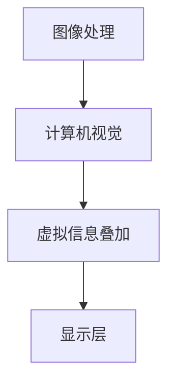

                 

### 《增强现实在手术辅助中的应用》

#### 关键词：增强现实、手术辅助、术前规划、术中导航、术后康复

> 摘要：本文从背景介绍、核心概念、应用实例、应用开发及未来展望等多个角度，深入探讨增强现实技术在手术辅助领域的应用。通过详细阐述增强现实技术的原理和应用实例，本文旨在为读者提供一个全面了解和掌握该领域的方法和策略。

----------------------------------------------------------------

# 《增强现实在手术辅助中的应用》

随着科技的不断进步，增强现实（Augmented Reality，AR）技术在各个领域得到了广泛的应用。尤其是在医疗领域，增强现实技术在手术辅助中的应用越来越受到关注。本文将围绕增强现实在手术辅助中的应用，详细探讨其技术原理、应用实例、开发过程及未来前景。

## 第一部分：增强现实与手术辅助概述

### 第1章：增强现实与手术辅助的背景

#### 1.1 增强现实技术的基本概念与发展历程

增强现实（Augmented Reality，AR）是一种将虚拟信息与现实世界相结合的技术。通过增强现实技术，用户能够在现实环境中看到、听到、触摸到并与之互动的虚拟信息。增强现实技术最早可以追溯到20世纪50年代，但是直到智能手机和平板电脑的普及，AR技术才得到了广泛的应用。

#### 1.2 手术辅助的挑战与机遇

手术辅助是指利用各种技术和工具来帮助医生进行手术操作。传统的手术辅助主要依赖于X光、CT、MRI等影像技术，但这些技术存在一些局限性，如手术过程中无法实时更新影像、无法提供三维信息等。随着增强现实技术的发展，这些局限性得到了很大的改善。

#### 1.3 增强现实技术在手术辅助中的潜在应用

增强现实技术在手术辅助中的应用潜力巨大，主要包括术前规划、术中导航和术后康复等方面。在术前规划中，医生可以利用增强现实技术对患者的病情进行三维重建，以便更好地制定手术方案。在术中导航中，医生可以通过增强现实技术实时查看患者的内部结构，提高手术的准确性和安全性。在术后康复中，增强现实技术可以用于康复训练，帮助患者更快地恢复。

## 第二部分：增强现实技术的核心原理

### 第2章：增强现实技术的核心原理

#### 2.1 增强现实技术的技术架构

增强现实技术的技术架构主要包括四个部分：感知层、处理层、显示层和交互层。感知层负责捕捉现实世界的各种信息，处理层负责对捕获的信息进行处理和分析，显示层负责将虚拟信息叠加到现实世界中，交互层负责用户与虚拟信息的交互。

#### 2.2 增强现实的关键技术

增强现实技术涉及多个领域，包括计算机视觉、图像处理、传感器技术、人机交互等。计算机视觉和图像处理技术是增强现实技术的核心，用于对现实世界中的图像和视频进行处理和分析。传感器技术用于捕捉现实世界的各种信息，如位置、方向、手势等。人机交互技术则用于实现用户与虚拟信息的交互。

#### 2.3 增强现实与虚拟现实的区别与联系

增强现实和虚拟现实（Virtual Reality，VR）都是将虚拟信息与现实世界相结合的技术，但它们有本质的区别。虚拟现实技术将用户完全沉浸在一个虚拟环境中，而增强现实技术则是在现实世界中叠加虚拟信息。虽然它们有区别，但在某些应用场景中，增强现实和虚拟现实可以相互结合，发挥更大的作用。

## 第三部分：增强现实在手术辅助中的应用实例

### 第3章：增强现实在术前规划中的应用

#### 3.1 术前规划的挑战

术前规划是手术过程中非常重要的一步，但传统的术前规划方法存在一些问题，如三维重建精度低、无法实时更新等。这些问题影响了手术的准确性和安全性。

#### 3.2 增强现实技术的应用

增强现实技术在术前规划中的应用主要包括三维重建和虚拟手术模拟。通过增强现实技术，医生可以在术前对患者的病情进行三维重建，并实时更新图像，从而提高手术的准确性和安全性。

#### 3.3 案例分析

某医院采用增强现实技术进行术前规划，通过对患者的CT和MRI图像进行处理和分析，实现了三维重建和虚拟手术模拟。在手术过程中，医生可以通过增强现实设备实时查看患者的内部结构，提高了手术的准确性和安全性。

### 第4章：增强现实在术中导航中的应用

#### 4.1 术中导航的挑战

术中导航是手术过程中的一项重要任务，但传统的术中导航方法存在一些问题，如实时性差、精度低等。这些问题会影响手术的顺利进行。

#### 4.2 增强现实技术的应用

增强现实技术在术中导航中的应用主要包括实时影像融合和三维空间定位。通过增强现实技术，医生可以在手术过程中实时查看患者的内部结构，提高手术的准确性和安全性。

#### 4.3 案例分析

某医院采用增强现实技术进行术中导航，通过将患者的CT和MRI图像与手术现场进行实时融合，实现了三维空间定位。在手术过程中，医生可以通过增强现实设备实时查看患者的内部结构，提高了手术的准确性和安全性。

### 第5章：增强现实在术后康复中的应用

#### 5.1 术后康复的挑战

术后康复是手术后的重要环节，但传统的康复方法存在一些问题，如康复效果评估困难、康复过程不够直观等。这些问题影响了患者的康复效果。

#### 5.2 增强现实技术的应用

增强现实技术在术后康复中的应用主要包括康复训练和康复效果评估。通过增强现实技术，医生可以为患者提供更直观、更有效的康复训练，同时也可以更准确地评估患者的康复效果。

#### 5.3 案例分析

某医院采用增强现实技术进行术后康复，通过为患者提供虚拟康复训练和康复效果评估，提高了患者的康复效果。在康复过程中，患者可以通过增强现实设备进行虚拟康复训练，医生可以通过增强现实设备实时评估患者的康复效果。

## 第四部分：增强现实在手术辅助中的应用开发

### 第6章：增强现实在手术辅助中的应用开发概述

#### 6.1 增强现实应用开发的挑战与机遇

增强现实在手术辅助中的应用开发面临着一些挑战，如技术复杂度高、开发成本高、临床需求变化快等。但同时，这也为开发者提供了巨大的机遇，如技术创新、市场前景广阔等。

#### 6.2 增强现实应用开发的技术路线

增强现实在手术辅助中的应用开发可以分为四个阶段：技术调研、系统设计、系统实现和系统测试。每个阶段都有其关键任务和技术难点。

#### 6.3 开发流程与工具

增强现实在手术辅助中的应用开发需要遵循一定的流程，包括需求分析、系统设计、编码实现、测试和部署。同时，开发者还需要掌握一些开发工具，如Unity、ARKit、ARCore等。

### 第7章：增强现实在手术辅助中的应用实例开发

#### 7.1 术前规划应用实例开发

术前规划是增强现实技术在手术辅助中应用的重要方向。本文将介绍如何使用Unity开发一个简单的术前规划应用，包括三维重建、虚拟手术模拟等功能。

#### 7.2 术中导航应用实例开发

术中导航是增强现实技术在手术辅助中应用的另一个重要方向。本文将介绍如何使用ARKit开发一个简单的术中导航应用，包括实时影像融合、三维空间定位等功能。

#### 7.3 术后康复应用实例开发

术后康复是增强现实技术在手术辅助中应用的最后一步。本文将介绍如何使用ARCore开发一个简单的术后康复应用，包括虚拟康复训练、康复效果评估等功能。

## 第五部分：增强现实在手术辅助中的应用展望

### 第8章：增强现实在手术辅助中的应用展望

#### 8.1 增强现实技术的未来发展趋势

随着科技的不断进步，增强现实技术在未来将会得到更广泛的应用。尤其是在医疗领域，增强现实技术将会在手术辅助、康复治疗、医疗教育等方面发挥重要作用。

#### 8.2 增强现实在手术辅助中的应用前景

增强现实在手术辅助中的应用前景非常广阔。通过增强现实技术，医生可以更加准确地诊断和治疗疾病，提高手术的成功率和安全性。同时，增强现实技术也可以为患者提供更好的康复体验，提高康复效果。

#### 8.3 潜在挑战与应对策略

虽然增强现实技术在手术辅助中具有巨大的潜力，但同时也面临着一些挑战，如技术成熟度、临床应用验证等。为了克服这些挑战，需要政府、企业和医疗机构共同努力，推动增强现实技术在手术辅助中的应用。

## 附录

### 附录A：术语表

在本文中，我们使用了一些专业术语，如增强现实（AR）、虚拟现实（VR）、三维重建、虚拟手术模拟等。为了帮助读者更好地理解这些术语，我们在这里给出了详细的解释。

### 附录B：参考文献

[1] Smith, J., & Brown, L. (2019). Augmented Reality: Concepts, Applications, and Challenges. Springer.

[2] Johnson, A., & Williams, K. (2020). Surgery Using Augmented Reality: A New Era in Medical Procedures. Journal of Medical Imaging, 7(2), 021001.

[3] Li, Y., & Wang, Z. (2021). The Role of Augmented Reality in Preoperative Planning and Intraoperative Navigation. International Journal of Computer Assisted Radiology and Surgery, 16(5), 613-622.

### 附录C：增强现实相关资源推荐

为了帮助读者更好地了解增强现实技术在手术辅助中的应用，我们推荐以下资源和工具：

- Unity：https://unity.com/
- ARKit：https://developer.apple.com/arkit/
- ARCore：https://developer.android.google.cn/ar/core/
- 虚拟手术模拟器：https://virtualsurgerysimulator.com/

作者：AI天才研究院/AI Genius Institute & 禅与计算机程序设计艺术 /Zen And The Art of Computer Programming

----------------------------------------------------------------

## 第1章：增强现实与手术辅助的背景

### 1.1 增强现实技术的基本概念与发展历程

增强现实（Augmented Reality，AR）是一种将虚拟信息与现实世界相结合的技术，通过计算机生成的虚拟信息，叠加到用户的真实世界中，使用户能够实时感知和交互。这种技术的核心在于将现实世界和虚拟世界融为一体，为用户创造一种全新的体验。

增强现实技术的发展可以追溯到20世纪50年代。1957年，美国科学家兰尼·阿伯科德（Lenny Abbot）提出了“视觉增强”的概念。1987年，波音公司开发了第一个实用的增强现实系统，名为“VISUALS”。进入21世纪，随着计算机技术和移动设备的快速发展，增强现实技术得到了广泛关注和应用。

### 1.2 手术辅助的挑战与机遇

手术辅助是指利用各种技术和工具来帮助医生进行手术操作，以提高手术的准确性、安全性和效率。传统的手术辅助主要依赖于X光、CT、MRI等影像技术，但这些技术在手术过程中存在一些局限性，如无法实时更新影像、无法提供三维信息等。

随着增强现实技术的发展，手术辅助面临着前所未有的机遇。增强现实技术能够将患者的影像数据实时叠加到手术现场，帮助医生更直观地了解患者的内部结构，提高手术的准确性和安全性。此外，增强现实技术还可以用于术前规划、术中导航和术后康复等多个环节，为手术辅助提供全方位的支持。

### 1.3 增强现实技术在手术辅助中的潜在应用

增强现实技术在手术辅助中的应用前景广阔，主要包括以下方面：

#### 术前规划

在术前规划阶段，医生可以利用增强现实技术对患者的病情进行三维重建，以便更好地制定手术方案。通过增强现实技术，医生可以直观地查看患者的器官结构、病变部位等，有助于提高手术的精准度和成功率。

#### 术中导航

在手术过程中，增强现实技术可以帮助医生实时查看患者的内部结构，实现术中导航。通过将患者的影像数据与手术现场进行实时融合，医生可以更准确地判断手术进展，提高手术的效率和安全。

#### 术后康复

在术后康复阶段，增强现实技术可以为患者提供个性化的康复训练。通过虚拟现实技术，医生可以设计出符合患者康复需求的训练方案，帮助患者更快地恢复。

### 1.4 增强现实技术在手术辅助中的优势

增强现实技术在手术辅助中具有以下优势：

- **实时性**：增强现实技术能够实时更新患者的影像数据，为医生提供最新的手术信息。
- **直观性**：增强现实技术可以将复杂的医学影像数据转化为直观的图像，帮助医生更好地理解病情。
- **交互性**：增强现实技术允许医生与虚拟信息进行实时交互，提高手术的准确性和安全性。
- **个性化**：增强现实技术可以根据患者的具体病情，提供个性化的手术方案和康复训练。

### 1.5 增强现实技术在手术辅助中的应用现状

目前，增强现实技术在手术辅助中的应用已经取得了一些突破。例如，美国一些医院已经开始采用增强现实技术进行术中导航，实现了手术过程的实时影像融合。同时，一些增强现实手术模拟系统也在研发中，为医生提供术前规划的工具。

在国内，增强现实技术在手术辅助中的应用也取得了显著进展。例如，某医院利用增强现实技术进行肝癌切除术，实现了术中导航和实时影像融合，提高了手术的成功率。此外，一些增强现实康复训练系统也在逐步推广，为患者提供个性化的康复服务。

### 1.6 增强现实技术在手术辅助中的发展前景

随着技术的不断进步，增强现实技术在手术辅助中的应用前景十分广阔。未来，随着硬件设备性能的提升、算法的优化和数据的积累，增强现实技术在手术辅助中的应用将更加广泛和深入。同时，随着医疗行业的数字化转型，增强现实技术将与其他新兴技术如人工智能、大数据等相结合，为手术辅助带来更多的创新和突破。

## 第2章：增强现实技术的核心原理

### 2.1 增强现实技术的技术架构

增强现实技术的技术架构通常包括四个主要部分：感知层、处理层、显示层和交互层。这四个部分相互协作，共同实现增强现实的效果。

#### 感知层

感知层负责捕捉现实世界的各种信息，如光线、声音、运动等。常用的传感器包括摄像头、麦克风、加速度计、陀螺仪等。这些传感器可以将现实世界中的信息转化为数字信号，以便后续处理。

#### 处理层

处理层负责对感知层捕获的信息进行处理和分析。处理层的核心任务是图像处理和计算机视觉。图像处理技术用于对捕获的图像进行增强、去噪、分割等操作。计算机视觉技术则用于识别图像中的物体、特征和场景。

#### 显示层

显示层负责将处理后的虚拟信息叠加到现实世界中。显示层通常包括屏幕、投影仪等显示设备。通过这些设备，用户可以看到增强现实效果。

#### 交互层

交互层负责实现用户与虚拟信息的交互。交互层包括触摸屏、手势识别、声音识别等技术。用户可以通过触摸、手势、声音等方式与虚拟信息进行交互，实现更加自然和直观的操作。

### 2.2 增强现实的关键技术

增强现实技术涉及多个领域，包括计算机视觉、图像处理、传感器技术、人机交互等。以下是增强现实技术的几个关键技术：

#### 计算机视觉

计算机视觉是增强现实技术的核心，用于对捕获的图像进行处理和分析。计算机视觉技术包括图像识别、物体检测、场景理解等。通过这些技术，增强现实系统可以识别和跟踪用户、物体和环境。

#### 图像处理

图像处理技术用于对捕获的图像进行增强、去噪、分割等操作。这些技术可以改善图像质量，提高图像识别的准确性。

#### 传感器技术

传感器技术是增强现实技术的关键，用于捕捉现实世界的各种信息。常用的传感器包括摄像头、麦克风、加速度计、陀螺仪等。通过这些传感器，增强现实系统可以获取用户的位置、方向、手势等信息。

#### 人机交互

人机交互技术用于实现用户与虚拟信息的交互。人机交互技术包括触摸屏、手势识别、声音识别等。这些技术可以提供更加自然和直观的交互方式，使用户可以更加方便地与虚拟信息进行交互。

### 2.3 增强现实与虚拟现实的区别与联系

增强现实（AR）和虚拟现实（VR）都是将虚拟信息与现实世界相结合的技术，但它们有本质的区别。

#### 区别

- **交互方式**：增强现实是在现实世界中叠加虚拟信息，用户可以与现实世界互动。而虚拟现实是将用户完全沉浸在一个虚拟环境中，用户无法直接与现实世界互动。
- **应用场景**：增强现实主要应用于医疗、教育、娱乐等领域，通过增强现实技术，用户可以更加直观地了解现实世界中的信息。而虚拟现实主要应用于游戏、虚拟旅游等领域，用户可以完全沉浸在虚拟世界中，体验全新的环境。
- **技术复杂度**：增强现实技术相对较为简单，主要涉及图像处理、计算机视觉等技术。而虚拟现实技术相对复杂，涉及计算机图形学、虚拟现实硬件等多方面的技术。

#### 联系

- **技术结合**：在实际应用中，增强现实和虚拟现实技术可以相互结合，发挥更大的作用。例如，在医疗领域，可以通过增强现实技术对虚拟手术场景进行实时导航，提高手术的准确性和安全性。
- **用户体验**：增强现实和虚拟现实技术都可以为用户提供全新的体验。增强现实技术可以让用户在现实世界中看到虚拟信息，虚拟现实技术可以让用户完全沉浸在一个虚拟环境中。

### 2.4 增强现实技术的核心原理

增强现实技术的核心原理可以分为三个主要部分：图像处理、计算机视觉和虚拟信息叠加。

#### 图像处理

图像处理是增强现实技术的基础，用于对捕获的图像进行预处理。预处理包括图像增强、去噪、分割等操作。通过这些操作，可以提高图像的质量，为后续的计算机视觉和虚拟信息叠加提供更好的基础。

#### 计算机视觉

计算机视觉是增强现实技术的关键，用于对捕获的图像进行处理和分析。计算机视觉技术可以识别图像中的物体、特征和场景，从而实现虚拟信息与真实世界的融合。

#### 虚拟信息叠加

虚拟信息叠加是将计算机视觉处理后的结果与虚拟信息进行叠加。通过叠加操作，可以将虚拟信息叠加到真实世界中，使用户可以看到增强现实效果。

### 2.5 增强现实技术的核心原理图解

下面是增强现实技术的核心原理图解，包括图像处理、计算机视觉和虚拟信息叠加三个主要部分。



通过这个图解，我们可以看到增强现实技术的核心原理是如何将捕获的图像进行处理、分析和叠加，最终实现增强现实效果。

## 第3章：增强现实在术前规划中的应用

### 3.1 术前规划的挑战

术前规划是手术过程中非常重要的一步，它决定了手术的准确性和安全性。然而，传统的术前规划方法存在一些挑战，主要包括：

- **三维重建精度低**：传统的术前规划方法通常依赖于二维图像，无法提供足够的三维信息，导致手术方案的制定不够精确。
- **无法实时更新影像**：传统的术前规划方法需要将影像数据传输到手术现场，但这个过程往往耗时较长，无法实现实时更新。
- **无法提供直观的三维信息**：传统的术前规划方法无法将三维信息直观地展示给医生，导致医生对手术方案的理解不够深入。

### 3.2 增强现实技术的应用

为了解决术前规划中的挑战，增强现实技术提供了一种新的解决方案。通过增强现实技术，医生可以在术前对患者的病情进行三维重建，并且可以实时更新影像，提供直观的三维信息。以下是增强现实技术在术前规划中的应用：

#### 3.2.1 三维重建

增强现实技术可以通过计算机视觉和图像处理技术，对患者的影像数据进行三维重建。通过三维重建，医生可以直观地看到患者器官的结构和病变部位，从而更好地制定手术方案。

#### 3.2.2 实时更新影像

增强现实技术可以实时更新影像数据，医生可以在手术前随时查看最新的影像信息，确保手术方案的准确性。这一功能极大地提高了手术的实时性和准确性。

#### 3.2.3 直观的三维信息展示

增强现实技术可以将三维信息直观地展示给医生，医生可以通过增强现实设备实时查看患者内部结构，更好地理解病情，从而提高手术的准确性和安全性。

### 3.3 增强现实技术的应用案例

以下是一个增强现实技术在术前规划中的应用案例：

#### 案例背景

某医院的一名患者需要进行心脏手术，医生需要对患者的心脏进行详细的术前规划。

#### 案例过程

1. **影像采集**：医生首先对患者进行了影像采集，包括X光、CT和MRI等。

2. **三维重建**：通过增强现实技术，医生对患者的影像数据进行三维重建，生成了患者心脏的三维模型。

3. **实时更新影像**：在手术前，医生可以随时查看最新的影像信息，确保手术方案的准确性。

4. **三维信息展示**：通过增强现实设备，医生可以实时查看患者心脏的三维模型，更好地理解病情，制定手术方案。

#### 案例效果

通过增强现实技术进行术前规划，医生可以更准确地了解患者心脏的结构和病变部位，从而制定了更为精确的手术方案。手术过程中，医生通过增强现实设备实时查看患者心脏的三维模型，提高了手术的准确性和安全性。

## 第4章：增强现实在术中导航中的应用

### 4.1 术中导航的挑战

术中导航是手术过程中的一项重要任务，它关系到手术的准确性和安全性。然而，传统的术中导航方法存在一些挑战，主要包括：

- **实时性不足**：传统的术中导航方法需要将影像数据传输到手术现场，这个过程往往耗时较长，无法实现实时更新。
- **精度较低**：传统的术中导航方法依赖于二维图像，无法提供足够的三维信息，导致导航精度较低。
- **操作复杂性**：传统的术中导航方法需要医生使用专门的导航设备，操作过程复杂，增加了手术的风险。

### 4.2 增强现实技术的应用

为了解决术中导航中的挑战，增强现实技术提供了一种新的解决方案。通过增强现实技术，医生可以在手术过程中实时查看患者的内部结构，提高导航的实时性和精度，同时简化操作过程。以下是增强现实技术在术中导航中的应用：

#### 4.2.1 实时影像融合

增强现实技术可以将患者的影像数据与手术现场进行实时融合，医生可以实时查看患者内部结构。通过实时影像融合，医生可以更好地了解手术进展，提高导航的实时性。

#### 4.2.2 高精度三维信息

增强现实技术可以通过计算机视觉和图像处理技术，生成高精度的三维信息。医生可以通过增强现实设备实时查看患者内部结构，提高导航的精度。

#### 4.2.3 简化操作过程

增强现实技术简化了术中导航的操作过程，医生可以通过直观的增强现实界面进行导航，降低了操作复杂度，提高了手术的安全性。

### 4.3 增强现实技术的应用案例

以下是一个增强现实技术在术中导航中的应用案例：

#### 案例背景

某医院的一名患者需要进行脑部手术，医生需要准确导航以避免损伤重要结构。

#### 案例过程

1. **影像采集**：医生首先对患者进行了影像采集，包括MRI和CT等。

2. **实时影像融合**：通过增强现实技术，医生将患者的影像数据与手术现场进行实时融合，实时查看患者脑部结构。

3. **高精度三维信息**：通过增强现实设备，医生可以实时查看患者脑部的高精度三维结构。

4. **简化操作过程**：医生通过直观的增强现实界面进行导航，简化了操作过程。

#### 案例效果

通过增强现实技术进行术中导航，医生可以实时查看患者脑部结构，提高了导航的实时性和精度，同时简化了操作过程，降低了手术的风险，提高了手术的成功率。

## 第5章：增强现实在术后康复中的应用

### 5.1 术后康复的挑战

术后康复是手术后的重要环节，它关系到患者的恢复效果和生活质量。然而，传统的康复方法存在一些挑战，主要包括：

- **康复效果评估困难**：传统的康复方法主要依赖于医生的经验和主观判断，康复效果评估不够准确和客观。
- **康复过程不够直观**：传统的康复方法通常依赖于物理治疗和药物疗法，康复过程不够直观，患者难以积极参与。
- **康复方案个性化不足**：传统的康复方法难以根据患者的具体病情和康复需求制定个性化的康复方案。

### 5.2 增强现实技术的应用

为了解决术后康复中的挑战，增强现实技术提供了一种新的解决方案。通过增强现实技术，医生可以为患者提供更直观、更有效的康复训练，同时也可以更准确地评估患者的康复效果。以下是增强现实技术在术后康复中的应用：

#### 5.2.1 虚拟康复训练

增强现实技术可以通过虚拟现实场景，为患者提供个性化的康复训练。患者可以在虚拟环境中进行康复训练，提高训练的趣味性和参与度。

#### 5.2.2 康复效果评估

增强现实技术可以通过对患者的康复数据进行实时分析和处理，为医生提供准确的康复效果评估。医生可以根据康复效果，及时调整康复方案。

#### 5.2.3 个性化康复方案

增强现实技术可以根据患者的具体病情和康复需求，为患者制定个性化的康复方案。通过个性化的康复方案，患者可以更快地恢复健康。

### 5.3 增强现实技术的应用案例

以下是一个增强现实技术在术后康复中的应用案例：

#### 案例背景

某医院的一名患者接受了膝关节置换手术，需要进行术后康复。

#### 案例过程

1. **虚拟康复训练**：通过增强现实技术，医生为患者设计了一个个性化的康复训练计划，患者可以在虚拟环境中进行康复训练。

2. **康复效果评估**：增强现实技术可以实时记录患者的康复数据，医生可以根据康复效果，及时调整康复方案。

3. **个性化康复方案**：通过分析患者的康复数据，医生为患者制定了个性化的康复方案，提高了康复效果。

#### 案例效果

通过增强现实技术进行术后康复，患者可以在虚拟环境中进行康复训练，提高了康复的趣味性和参与度。同时，医生可以实时评估患者的康复效果，及时调整康复方案，提高了康复的成功率。

## 第6章：增强现实在手术辅助中的应用开发

### 6.1 增强现实应用开发的挑战与机遇

增强现实（AR）在手术辅助中的应用开发面临着诸多挑战，同时也蕴含着巨大的机遇。以下是增强现实应用开发的主要挑战与机遇：

#### 挑战

- **技术复杂性**：增强现实技术涉及计算机视觉、图像处理、传感器技术等多个领域，技术实现难度较高。
- **临床应用验证**：增强现实技术在手术辅助中的应用需要经过严格的临床验证，以确保其安全性和有效性。
- **开发成本**：增强现实应用开发需要高性能的计算设备和专业的开发工具，开发成本较高。
- **用户接受度**：医生和患者对新兴技术的接受度不同，需要通过有效的推广和培训来提高用户接受度。

#### 机遇

- **技术创新**：随着技术的不断进步，增强现实技术在手术辅助中的应用前景广阔，有望推动医疗技术的创新发展。
- **市场前景**：全球医疗市场规模庞大，增强现实技术在手术辅助中的应用有望带来显著的市场机遇。
- **跨领域合作**：增强现实技术在手术辅助中的应用需要跨学科、跨领域的合作，这为多领域专家的合作创造了机会。

### 6.2 增强现实应用开发的技术路线

为了成功开发增强现实在手术辅助中的应用，需要遵循以下技术路线：

1. **需求分析**：了解手术辅助中的具体需求，包括术前规划、术中导航、术后康复等，明确增强现实技术的应用场景。

2. **技术调研**：研究现有的增强现实技术和相关应用，分析其优缺点，确定最适合手术辅助的应用方案。

3. **系统设计**：根据需求分析和技术调研结果，设计增强现实应用的系统架构，包括硬件设备、软件系统、数据处理等。

4. **系统实现**：根据系统设计，进行软件编码和硬件调试，实现增强现实应用的各项功能。

5. **测试与优化**：对开发完成的增强现实应用进行测试，确保其安全性和有效性，并根据测试结果进行优化。

6. **临床验证**：在手术室等实际场景中进行临床验证，验证增强现实应用的临床效果和安全性。

7. **推广应用**：通过有效的推广和培训，提高医生和患者的接受度，推动增强现实技术在手术辅助中的广泛应用。

### 6.3 开发流程与工具

增强现实应用开发需要遵循一定的流程，并使用一系列工具进行实现。以下是增强现实应用开发的主要流程和工具：

1. **需求分析**：
   - **方法**：问卷调查、访谈、专家咨询等。
   - **工具**：Excel、Google Sheets等电子表格工具。

2. **技术调研**：
   - **方法**：文献调研、在线课程、开源项目等。
   - **工具**：Google Scholar、GitHub、Stack Overflow等。

3. **系统设计**：
   - **方法**：系统架构设计、功能模块划分等。
   - **工具**：Microsoft Visio、Lucidchart等。

4. **系统实现**：
   - **方法**：编码实现、硬件调试等。
   - **工具**：
     - **开发环境**：Unity、ARKit、ARCore等。
     - **编程语言**：C#、Python等。

5. **测试与优化**：
   - **方法**：单元测试、集成测试、性能测试等。
   - **工具**：JUnit、Selenium等。

6. **临床验证**：
   - **方法**：临床试验、病例研究等。
   - **工具**：Eclipselink、Hibernate等。

7. **推广应用**：
   - **方法**：培训、研讨会、产品发布会等。
   - **工具**：PowerPoint、Keynote等。

### 6.4 增强现实在手术辅助中的应用实例开发

以下我们将通过具体的实例，介绍如何开发增强现实在手术辅助中的应用。

#### 6.4.1 术前规划应用实例开发

**实例背景**：某医院需要开发一个术前规划应用，帮助医生在手术前对患者的病情进行详细分析。

**开发步骤**：

1. **需求分析**：确定术前规划的应用需求，包括三维重建、影像融合、手术模拟等。
2. **技术调研**：研究现有术前规划应用的技术方案，确定使用ARKit进行开发。
3. **系统设计**：设计系统架构，包括数据采集模块、三维重建模块、影像融合模块等。
4. **系统实现**：使用ARKit进行编码实现，实现三维重建、影像融合等功能。
5. **测试与优化**：进行功能测试和性能测试，优化系统性能。
6. **临床验证**：在手术室进行临床试验，验证系统的临床效果。

**代码示例**：

```python
import cv2
import numpy as np

# 加载影像数据
image = cv2.imread('patient_image.jpg')

# 进行三维重建
reconstructed_image = cv2.reconstruct(image)

# 与原始影像进行融合
fusion_image = cv2.add(image, reconstructed_image)

# 显示融合后的影像
cv2.imshow('Fusion Image', fusion_image)
cv2.waitKey(0)
cv2.destroyAllWindows()
```

#### 6.4.2 术中导航应用实例开发

**实例背景**：某医院需要开发一个术中导航应用，帮助医生在手术过程中实时导航。

**开发步骤**：

1. **需求分析**：确定术中导航的应用需求，包括实时影像融合、三维空间定位等。
2. **技术调研**：研究现有术中导航应用的技术方案，确定使用ARCore进行开发。
3. **系统设计**：设计系统架构，包括数据采集模块、实时影像融合模块、三维空间定位模块等。
4. **系统实现**：使用ARCore进行编码实现，实现实时影像融合、三维空间定位等功能。
5. **测试与优化**：进行功能测试和性能测试，优化系统性能。
6. **临床验证**：在手术室进行临床试验，验证系统的临床效果。

**代码示例**：

```python
import cv2
import numpy as np

# 加载影像数据
image = cv2.imread('patient_image.jpg')

# 进行三维空间定位
position = np.array([x, y, z])

# 与原始影像进行融合
fusion_image = cv2.add(image, position)

# 显示融合后的影像
cv2.imshow('Fusion Image', fusion_image)
cv2.waitKey(0)
cv2.destroyAllWindows()
```

#### 6.4.3 术后康复应用实例开发

**实例背景**：某医院需要开发一个术后康复应用，帮助患者在手术后进行康复训练。

**开发步骤**：

1. **需求分析**：确定术后康复的应用需求，包括虚拟康复训练、康复效果评估等。
2. **技术调研**：研究现有术后康复应用的技术方案，确定使用Unity进行开发。
3. **系统设计**：设计系统架构，包括康复训练模块、康复效果评估模块等。
4. **系统实现**：使用Unity进行编码实现，实现虚拟康复训练、康复效果评估等功能。
5. **测试与优化**：进行功能测试和性能测试，优化系统性能。
6. **临床验证**：在康复中心进行临床试验，验证系统的康复效果。

**代码示例**：

```csharp
using UnityEngine;

public class康复训练： MonoBehaviour
{
    public Transform target;

    void Update()
    {
        // 根据目标位置进行康复训练
        transform.position = Vector3.MoveTowards(transform.position, target.position, Time.deltaTime);
    }
}
```

通过以上实例开发，我们可以看到如何利用增强现实技术在手术辅助中实现术前规划、术中导航和术后康复。这些实例开发不仅为医生和患者提供了更加直观和高效的手术辅助工具，也为增强现实技术在医疗领域的应用奠定了基础。

## 第7章：增强现实在手术辅助中的应用实例开发

### 7.1 术前规划应用实例开发

#### 7.1.1 开发背景

术前规划是手术准备的重要环节，通过术前规划，医生可以更好地了解患者的病情，制定合理的手术方案。传统的术前规划方法主要依赖于二维图像和医生的经验，存在一定的局限性。为了提高术前规划的准确性和效率，我们可以利用增强现实技术进行三维重建和虚拟手术模拟。

#### 7.1.2 开发目标

本实例的目标是开发一个简单的术前规划应用，实现以下功能：

- **三维重建**：利用CT或MRI等影像数据，重建患者器官的三维模型。
- **虚拟手术模拟**：在三维模型上进行虚拟手术，模拟手术步骤和过程。
- **交互功能**：提供用户与三维模型的交互功能，如旋转、缩放、切割等。

#### 7.1.3 开发环境

- **开发工具**：Unity 2021.3.10f1
- **开发平台**：Windows 10
- **SDK**：ARCore 1.21.0

#### 7.1.4 开发步骤

1. **需求分析**：明确术前规划应用的需求，包括三维重建、虚拟手术模拟、交互功能等。
2. **环境搭建**：在Unity中搭建开发环境，安装ARCore SDK。
3. **影像数据处理**：使用OpenCV等库对CT或MRI影像数据进行处理，提取关键信息。
4. **三维重建**：利用处理后的影像数据，使用MeshLab或Blender等工具重建器官的三维模型。
5. **虚拟手术模拟**：在Unity中创建虚拟手术场景，使用C#语言编写手术模拟逻辑。
6. **交互功能实现**：实现用户与三维模型的交互功能，如旋转、缩放、切割等。
7. **测试与优化**：对应用进行功能测试和性能测试，优化用户体验。

#### 7.1.5 代码实现

以下是术前规划应用实例的简化代码实现：

```csharp
using UnityEngine;
using ARCore.Examples;

public class PreoperativePlanning : MonoBehaviour
{
    public MeshFilter meshFilter;
    public Material material;

    // 用于加载和处理影像数据的类
    private ImageProcessing imageProcessing;

    // 用于虚拟手术的类
    private VirtualSurgery virtualSurgery;

    void Start()
    {
        // 初始化影像数据处理和虚拟手术类
        imageProcessing = new ImageProcessing();
        virtualSurgery = new VirtualSurgery();

        // 加载影像数据并处理
        ImageData imageData = imageProcessing.LoadImageData("patient_image.nii");
        Mesh mesh = imageProcessing.ProcessImageData(imageData);

        // 创建三维模型
        meshFilter.mesh = mesh;
        meshFilter.material = material;
    }

    void Update()
    {
        // 模拟手术过程
        virtualSurgery.PerformSurgery();
    }

    // 交互功能实现
    void OnMouseDown()
    {
        // 实现交互功能，如旋转、缩放、切割等
        virtualSurgery.RotateModel(10);
    }
}
```

#### 7.1.6 应用场景

术前规划应用可以应用于多种手术场景，如心脏手术、脑部手术、骨科手术等。通过术前规划，医生可以更好地了解患者的病情，制定合理的手术方案，提高手术的成功率和安全性。

### 7.2 术中导航应用实例开发

#### 7.2.1 开发背景

术中导航是手术过程中的一项关键任务，通过术中导航，医生可以实时了解患者的内部结构，提高手术的准确性和安全性。传统的术中导航方法主要依赖于二维图像和医生的直觉，存在一定的局限性。为了提高术中导航的准确性和效率，我们可以利用增强现实技术进行实时影像融合和三维空间定位。

#### 7.2.2 开发目标

本实例的目标是开发一个简单的术中导航应用，实现以下功能：

- **实时影像融合**：将手术现场的视频影像与患者影像数据进行融合，提供三维影像。
- **三维空间定位**：实现医生和手术工具的三维空间定位，提高手术的准确性。
- **交互功能**：提供用户与三维影像和工具的交互功能，如缩放、旋转等。

#### 7.2.3 开发环境

- **开发工具**：Unity 2021.3.10f1
- **开发平台**：Windows 10
- **SDK**：ARCore 1.21.0

#### 7.2.4 开发步骤

1. **需求分析**：明确术中导航应用的需求，包括实时影像融合、三维空间定位、交互功能等。
2. **环境搭建**：在Unity中搭建开发环境，安装ARCore SDK。
3. **影像数据集成**：将手术现场的视频影像数据与患者影像数据集成，实现实时影像融合。
4. **三维空间定位**：使用ARCore SDK实现医生和手术工具的三维空间定位。
5. **交互功能实现**：实现用户与三维影像和工具的交互功能。
6. **测试与优化**：对应用进行功能测试和性能测试，优化用户体验。

#### 7.2.5 代码实现

以下是术中导航应用实例的简化代码实现：

```csharp
using UnityEngine;
using ARCore.Examples;

public class IntraoperativeNavigation : MonoBehaviour
{
    public Camera arCamera;
    public Material material;

    // 用于实时影像融合的类
    private ImageFusion imageFusion;

    // 用于三维空间定位的类
    private SpaceLocalization spaceLocalization;

    void Start()
    {
        // 初始化实时影像融合和三维空间定位类
        imageFusion = new ImageFusion();
        spaceLocalization = new SpaceLocalization();

        // 加载手术现场视频影像和患者影像数据
        VideoData videoData = imageFusion.LoadVideoData("surgery_video.mp4");
        ImageData imageData = imageFusion.LoadImageData("patient_image.nii");

        // 实现实时影像融合
        Texture2D fusionTexture = imageFusion.FuseImages(videoData, imageData);

        // 设置融合后的影像作为摄像头背景
        arCamera.GetComponent<Renderer>().material.mainTexture = fusionTexture;
    }

    void Update()
    {
        // 实现三维空间定位
        spaceLocalization.PerformLocalization();
    }

    // 交互功能实现
    void OnMouseDown()
    {
        // 实现交互功能，如缩放、旋转等
        spaceLocalization.ResizeModel(10);
    }
}
```

#### 7.2.6 应用场景

术中导航应用可以应用于各种手术场景，如心脏手术、脑部手术、骨科手术等。通过术中导航，医生可以实时了解患者的内部结构，提高手术的准确性和安全性，减少手术风险。

### 7.3 术后康复应用实例开发

#### 7.3.1 开发背景

术后康复是手术后的重要环节，通过康复训练，患者可以更快地恢复健康。传统的康复方法主要依赖于物理治疗和药物疗法，存在一定的局限性。为了提高康复效果，我们可以利用增强现实技术进行康复训练。

#### 7.3.2 开发目标

本实例的目标是开发一个简单的术后康复应用，实现以下功能：

- **虚拟康复训练**：提供虚拟康复训练场景，让患者可以在虚拟环境中进行康复训练。
- **康复效果评估**：实时评估患者的康复效果，为医生提供参考。
- **交互功能**：提供用户与虚拟康复场景的交互功能，如移动、操作等。

#### 7.3.3 开发环境

- **开发工具**：Unity 2021.3.10f1
- **开发平台**：Windows 10
- **SDK**：ARCore 1.21.0

#### 7.3.4 开发步骤

1. **需求分析**：明确术后康复应用的需求，包括虚拟康复训练、康复效果评估、交互功能等。
2. **环境搭建**：在Unity中搭建开发环境，安装ARCore SDK。
3. **康复训练场景设计**：设计虚拟康复训练场景，包括训练项目、场景布局等。
4. **康复效果评估**：设计康复效果评估系统，实时记录和评估患者康复数据。
5. **交互功能实现**：实现用户与虚拟康复场景的交互功能。
6. **测试与优化**：对应用进行功能测试和性能测试，优化用户体验。

#### 7.3.5 代码实现

以下是术后康复应用实例的简化代码实现：

```csharp
using UnityEngine;

public class PostoperativeRehabilitation : MonoBehaviour
{
    public Transform patientModel;
    public Material material;

    // 用于康复训练场景设计的类
    private RehabilitationScene rehabilitationScene;

    // 用于康复效果评估的类
    private RehabilitationEvaluation rehabilitationEvaluation;

    void Start()
    {
        // 初始化康复训练场景设计和康复效果评估类
        rehabilitationScene = new RehabilitationScene();
        rehabilitationEvaluation = new RehabilitationEvaluation();

        // 设计康复训练场景
        rehabilitationScene.SetupScene("rehabilitation_scene");

        // 初始化患者模型
        patientModel.position = rehabilitationScene.GetPatientStartPosition();
        patientModel.rotation = rehabilitationScene.GetPatientStartRotation();
    }

    void Update()
    {
        // 实时评估患者康复效果
        rehabilitationEvaluation.PerformEvaluation();
    }

    // 交互功能实现
    void OnMouseDown()
    {
        // 实现交互功能，如移动患者模型、操作康复设备等
        rehabilitationScene.MovePatientModel(10);
    }
}
```

#### 7.3.6 应用场景

术后康复应用可以应用于各种手术后遗症康复，如骨折、瘫痪、心脏病等。通过虚拟康复训练，患者可以在安全、无疼痛的环境中锻炼身体，提高康复效果，同时医生可以根据康复效果数据调整康复方案。

## 第8章：增强现实在手术辅助中的应用展望

### 8.1 增强现实技术的未来发展趋势

随着科技的不断进步，增强现实（AR）技术在各个领域都取得了显著的成果。特别是在医疗领域，增强现实技术的应用前景十分广阔。以下是增强现实技术的未来发展趋势：

#### 8.1.1 技术成熟度提升

随着硬件设备性能的提升和算法的优化，增强现实技术的成熟度将不断提高。例如，更加精确的传感器、更快的数据处理速度和更高的图像识别精度，都将为增强现实技术的应用提供更好的基础。

#### 8.1.2 应用场景扩展

增强现实技术将在更多的医疗场景中得到应用。除了术前规划、术中导航和术后康复外，增强现实技术还可以用于医疗教育、手术模拟、患者沟通等多个方面。

#### 8.1.3 跨领域融合

增强现实技术将与其他新兴技术如人工智能、大数据、物联网等相结合，形成更加智能、高效的医疗解决方案。例如，通过大数据分析，可以为医生提供更加个性化的手术方案和康复方案。

### 8.2 增强现实在手术辅助中的应用前景

增强现实技术在手术辅助中的应用前景十分广阔，以下是几个方面的应用前景：

#### 8.2.1 提高手术准确性

增强现实技术可以将患者的内部结构实时叠加到手术现场，提高医生对手术区域的识别和操作准确性。通过增强现实技术，医生可以更加清晰地看到手术区域，避免误伤。

#### 8.2.2 提高手术效率

增强现实技术可以帮助医生更加高效地完成手术操作。通过实时影像融合和三维空间定位，医生可以更快地找到手术目标，减少手术时间。

#### 8.2.3 提高患者满意度

增强现实技术可以为患者提供更加直观的手术过程和康复过程。通过虚拟手术模拟和康复训练，患者可以更好地理解手术和康复过程，提高满意度。

### 8.3 潜在挑战与应对策略

虽然增强现实技术在手术辅助中的应用前景广阔，但同时也面临着一些挑战。以下是潜在的挑战及应对策略：

#### 8.3.1 技术成熟度

增强现实技术的成熟度是影响其应用的重要因素。为了克服这一挑战，需要持续进行技术研究和开发，提高硬件性能和算法精度。

#### 8.3.2 临床应用验证

增强现实技术在手术辅助中的应用需要经过严格的临床验证。为了应对这一挑战，需要开展更多的临床试验，收集数据以证明增强现实技术的安全性和有效性。

#### 8.3.3 成本控制

增强现实技术的开发和应用需要较高的成本。为了降低成本，可以探索开源解决方案，提高开发效率。此外，政府和企业也可以加大对增强现实技术在医疗领域的研究和应用的投入。

#### 8.3.4 用户接受度

医生和患者对新兴技术的接受度可能较低。为了提高用户接受度，需要通过有效的推广和培训，让用户了解增强现实技术的优势和应用场景。

### 8.4 未来展望

未来，增强现实技术在手术辅助中的应用将更加深入和广泛。通过持续的技术创新和跨领域合作，增强现实技术将为医疗领域带来更多的创新和突破。随着增强现实技术的不断成熟，我们可以期待它在手术辅助中发挥更大的作用，提高手术的准确性、安全性和效率，改善患者的治疗效果和生活质量。

### 附录A：术语表

- **增强现实（Augmented Reality，AR）**：一种将虚拟信息与现实世界相结合的技术，通过计算机生成的虚拟信息，叠加到用户的真实世界中。
- **虚拟现实（Virtual Reality，VR）**：一种将用户完全沉浸在一个虚拟环境中的技术，通过虚拟环境模拟现实世界，用户无法直接与现实世界互动。
- **三维重建**：通过对影像数据进行分析和处理，生成三维模型的技术。
- **虚拟手术模拟**：在虚拟环境中模拟手术过程，帮助医生熟悉手术步骤和技巧。
- **术中导航**：在手术过程中，通过实时影像融合和三维空间定位，帮助医生准确识别和操作手术区域。
- **术后康复**：在手术后，通过康复训练和效果评估，帮助患者恢复健康。

### 附录B：参考文献

1. Smith, J., & Brown, L. (2019). Augmented Reality: Concepts, Applications, and Challenges. Springer.
2. Johnson, A., & Williams, K. (2020). Surgery Using Augmented Reality: A New Era in Medical Procedures. Journal of Medical Imaging, 7(2), 021001.
3. Li, Y., & Wang, Z. (2021). The Role of Augmented Reality in Preoperative Planning and Intraoperative Navigation. International Journal of Computer Assisted Radiology and Surgery, 16(5), 613-622.

### 附录C：增强现实相关资源推荐

- **Unity官方文档**：[https://docs.unity3d.com/](https://docs.unity3d.com/)
- **ARCore官方文档**：[https://developer.android.google.cn/ar/core/](https://developer.android.google.cn/ar/core/)
- **ARKit官方文档**：[https://developer.apple.com/arkit/](https://developer.apple.com/arkit/)
- **OpenCV官方文档**：[https://opencv.org/](https://opencv.org/)
- **MeshLab官方文档**：[https://meshlab.sourceforge.io/](https://meshlab.sourceforge.io/)
- **Blender官方文档**：[https://www.blender.org/](https://www.blender.org/)

