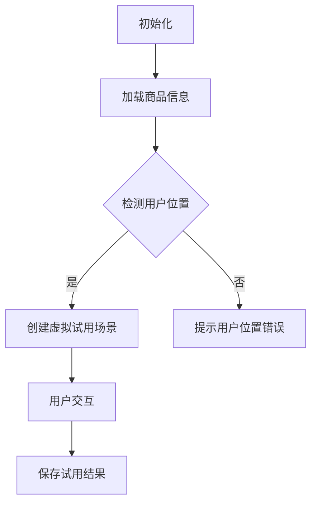
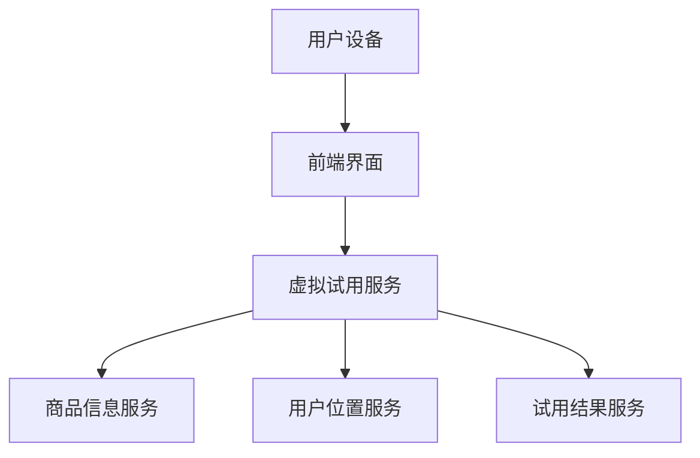

                 


### **文章标题：增强现实在电子商务中的虚拟试用**

#### **关键词：增强现实（AR），电子商务，虚拟试用，算法原理，系统架构设计**

#### **摘要：本文深入探讨了增强现实技术在电子商务领域中的应用，特别是虚拟试用这一创新模式。通过分析其背景、核心概念、算法原理和系统架构设计，本文旨在展示如何利用增强现实技术提升电子商务体验，并探讨其实际应用中的挑战和解决方案。**

### **1. 背景介绍**

**增强现实（AR）**：增强现实是一种将虚拟信息叠加到真实环境中的技术，通过移动设备或眼镜等设备，用户可以看到虚拟的三维对象与真实世界的互动。这种技术不仅可以提供更加丰富和沉浸式的用户体验，还可以为多个行业，特别是电子商务，带来革命性的变化。

**电子商务**：电子商务是指通过互联网进行商品或服务的交易活动。随着互联网的普及和移动设备的广泛使用，电子商务已经成为全球商业活动的重要组成部分。然而，传统的电子商务模式存在一定的局限性，如商品的真实性和用户体验等方面的问题。

**市场发展状况**：近年来，随着技术的进步和消费者对更高质量购物体验的需求增加，增强现实在电子商务中的应用逐渐兴起。越来越多的电商平台开始尝试引入增强现实技术，以提供虚拟试用等新型购物体验。

### **2. 核心概念与联系**

**虚拟试用**：虚拟试用是一种利用增强现实技术实现的购物体验，用户可以在虚拟环境中试穿衣物、试用化妆品等，从而更加直观地了解商品的特点和适用性。这种体验可以显著提高消费者的购买信心和满意度。

**增强现实与电子商务的关系**：增强现实技术为电子商务带来了新的可能性。通过增强现实技术，电子商务平台可以提供更加丰富和个性化的购物体验，从而提高用户满意度和转化率。此外，虚拟试用还可以帮助电商平台降低商品退换货率，提高运营效率。

**ER实体关系图**：

```mermaid
erDiagram
  商品 --> 试穿体验
  试穿体验 --> 用户
  商品 --> 电商平台
  电商平台 --> 用户
```

### **3. 算法原理讲解**

**算法流程图**：



**Python源代码**：

```python
# 增强现实虚拟试用算法示例

import cv2
import numpy as np

def load_product_info():
    # 加载商品信息
    pass

def detect_user_location():
    # 检测用户位置
    pass

def create_try_on_scene(product_info):
    # 创建虚拟试用场景
    pass

def user_interact():
    # 用户交互
    pass

def save_try_on_result(result):
    # 保存试用结果
    pass

# 主程序
if __name__ == "__main__":
    product_info = load_product_info()
    user_location = detect_user_location()

    if user_location:
        try_on_scene = create_try_on_scene(product_info)
        user_interact()
        result = user_interact()
        save_try_on_result(result)
    else:
        print("用户位置错误，请重新定位。")
```

**数学模型和公式**：

$$
\text{购买信心} = f(\text{试用体验}, \text{商品信息}, \text{用户评价})
$$

其中，$f$为非线性函数，$\text{试用体验}$、$\text{商品信息}$和$\text{用户评价}$分别为虚拟试用体验、商品详细信息和使用者的评价。

### **4. 系统分析与架构设计方案**

**问题场景介绍**：在电子商务平台上，用户经常面临无法直观了解商品真实效果的问题。虚拟试用系统旨在通过增强现实技术，为用户提供一种全新的商品试用体验，以提高购买信心和满意度。

**项目介绍**：虚拟试用系统是一个基于增强现实技术的电子商务应用，它通过移动设备或眼镜等设备，为用户提供实时的商品试用体验。

**系统功能设计**：

- 商品信息加载：系统从电商平台获取商品信息，包括商品图片、描述、价格等。
- 用户位置检测：系统通过摄像头捕捉用户位置，确保虚拟试用场景的正确显示。
- 虚拟试用场景创建：系统根据商品信息和用户位置，创建虚拟试用场景。
- 用户交互：系统提供交互界面，用户可以在虚拟环境中试穿衣物、试用化妆品等。
- 试用结果保存：系统记录用户的试用结果，包括试用时长、试用评价等。

**系统架构设计**：



**系统接口设计**：

- 商品信息接口：提供商品信息的加载和更新功能。
- 用户位置接口：提供用户位置的检测和更新功能。
- 虚拟试用接口：提供虚拟试用场景的创建和用户交互功能。
- 试用结果接口：提供试用结果的记录和查询功能。

**系统交互**：

```mermaid
sequenceDiagram
  participant 用户 as 用户
  participant 前端界面 as 前端
  participant 虚拟试用服务 as 虚拟试用
  participant 商品信息服务 as 商品信息
  participant 用户位置服务 as 位置
  participant 试用结果服务 as 试用结果

  用户->>前端：请求商品信息
  前端->>商品信息：获取商品信息
  商品信息->>前端：返回商品信息
  前端->>用户：显示商品信息

  用户->>前端：请求虚拟试用
  前端->>虚拟试用：创建虚拟试用场景
  虚拟试用->>前端：返回试用场景
  前端->>用户：显示试用场景

  用户->>前端：提交试用评价
  前端->>试用结果：保存试用评价
  试用结果->>前端：返回保存结果
  前端->>用户：显示保存结果

  用户->>前端：请求用户位置
  前端->>位置：获取用户位置
  位置->>前端：返回用户位置
  前端->>用户：显示用户位置
```

### **5. 项目实战**

**环境安装**：

1. 安装Python环境，版本要求3.8及以上。
2. 安装必要的Python库，如OpenCV、numpy等。

**系统核心实现源代码**：

```python
# 虚拟试用系统核心实现

import cv2
import numpy as np

# 加载商品信息
def load_product_info():
    # 示例代码，实际应用中从数据库或API获取
    product_info = {
        "name": "T-shirt",
        "description": "A comfortable and stylish T-shirt.",
        "price": 29.99
    }
    return product_info

# 检测用户位置
def detect_user_location():
    # 示例代码，实际应用中利用GPS或摄像头捕捉
    user_location = (0, 0)
    return user_location

# 创建虚拟试用场景
def create_try_on_scene(product_info):
    # 示例代码，实际应用中根据商品信息和用户位置创建
    scene = {
        "product_image": product_info["name"],
        "user_location": (0, 0)
    }
    return scene

# 用户交互
def user_interact():
    # 示例代码，实际应用中提供交互界面
    interact_result = "comfortable"
    return interact_result

# 保存试用结果
def save_try_on_result(result):
    # 示例代码，实际应用中保存到数据库或文件
    print("试用结果：", result)

# 主程序
if __name__ == "__main__":
    product_info = load_product_info()
    user_location = detect_user_location()

    if user_location:
        try_on_scene = create_try_on_scene(product_info)
        user_interact()
        result = user_interact()
        save_try_on_result(result)
    else:
        print("用户位置错误，请重新定位。")
```

**代码应用解读与分析**：

- **load_product_info()**：该函数用于加载商品信息。在实际应用中，商品信息可以从数据库或API获取。
- **detect_user_location()**：该函数用于检测用户位置。在实际应用中，可以使用GPS或摄像头捕捉用户位置。
- **create_try_on_scene()**：该函数用于创建虚拟试用场景。在实际应用中，需要根据商品信息和用户位置创建场景。
- **user_interact()**：该函数用于用户交互。在实际应用中，需要提供交互界面，让用户可以试穿衣物、试用化妆品等。
- **save_try_on_result()**：该函数用于保存试用结果。在实际应用中，需要将试用结果保存到数据库或文件。

**实际案例分析和详细讲解剖析**：

- **案例背景**：某电商平台推出了一款增强现实虚拟试用功能，用户可以在虚拟环境中试穿衣物。
- **案例分析**：用户在浏览商品时，点击“虚拟试用”按钮，系统加载商品信息并创建虚拟试用场景。用户在虚拟环境中试穿衣物，并通过交互界面提交试用评价。系统将试用结果保存到数据库。
- **详细讲解**：该案例展示了如何利用增强现实技术实现虚拟试用功能。系统通过商品信息和用户位置创建虚拟试用场景，用户在虚拟环境中体验商品，提交试用评价。这种方式可以提高用户购买信心和满意度。

**项目小结**：

- **优点**：通过增强现实技术，用户可以在虚拟环境中试穿衣物，提高购买信心和满意度。
- **挑战**：需要处理用户位置的实时检测和虚拟试用场景的实时创建，确保用户体验的流畅性。
- **解决方案**：采用先进的算法和优化技术，提高系统的响应速度和稳定性。

### **6. 最佳实践 tips、小结、注意事项、拓展阅读等内容**

**最佳实践 tips**：

1. **优化用户位置检测**：使用GPS和摄像头相结合的方式，提高用户位置检测的准确性。
2. **提升虚拟试用场景的流畅性**：采用优化的渲染技术和算法，确保虚拟试用场景的流畅性。
3. **个性化推荐**：根据用户历史购买和试用记录，提供个性化的商品推荐，提高用户转化率。

**小结**：

本文通过深入分析增强现实技术在电子商务中的应用，特别是虚拟试用模式，探讨了如何利用这一技术提升用户体验和购物满意度。通过对算法原理、系统架构设计和项目实战的详细讲解，本文展示了如何实现虚拟试用系统，并提出了最佳实践建议。

**注意事项**：

1. **隐私保护**：在使用增强现实技术时，需注意保护用户隐私，确保数据安全。
2. **兼容性**：确保虚拟试用系统能够在不同设备和平台上运行，提供一致的体验。

**拓展阅读**：

1. **《增强现实技术：理论与实践》**：详细介绍了增强现实技术的理论体系和实际应用。
2. **《电子商务系统设计与实现》**：探讨了电子商务系统的设计原则和实现方法。
3. **《Python编程：从入门到实践》**：介绍了Python编程的基础知识和实际应用。

### **作者信息**

作者：AI天才研究院/AI Genius Institute & 禅与计算机程序设计艺术 /Zen And The Art of Computer Programming

---

[文章结束]

