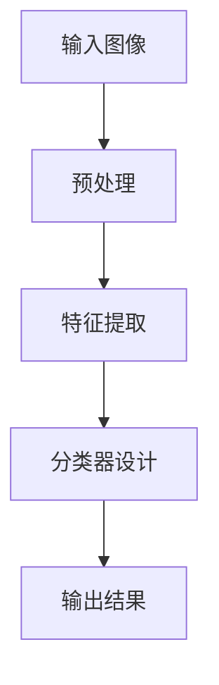
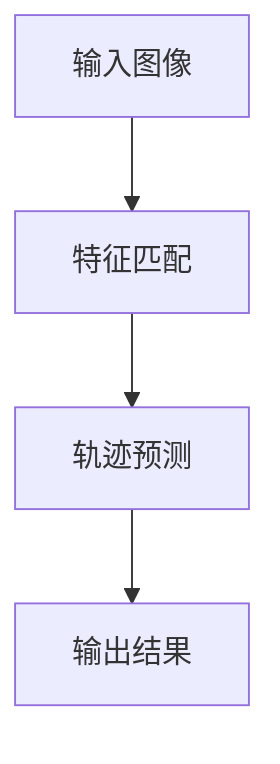
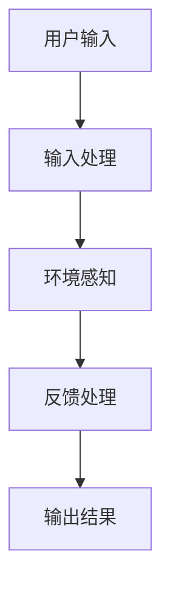
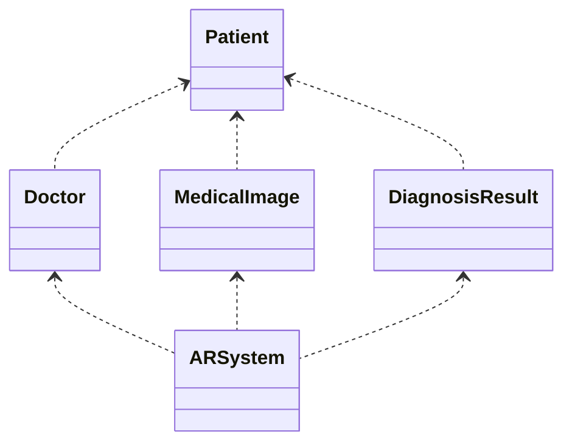
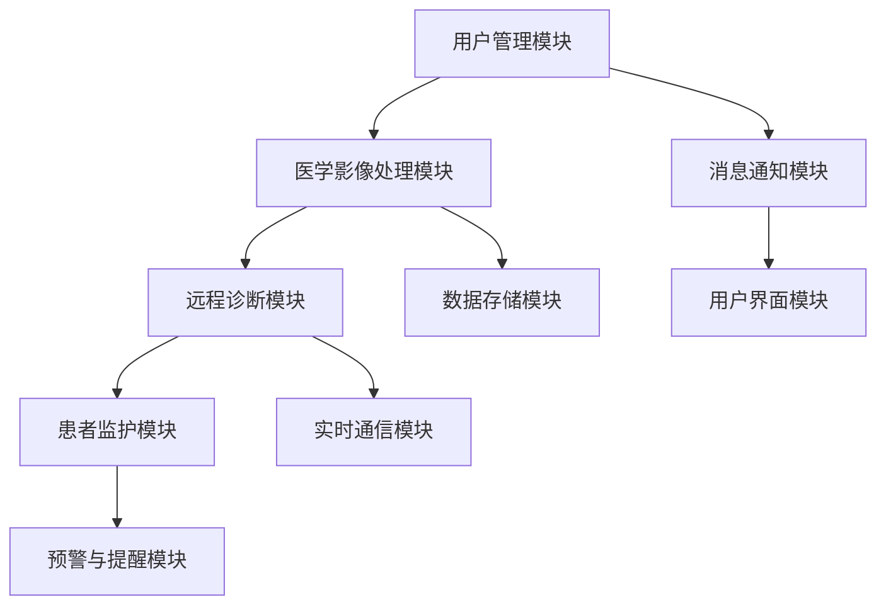
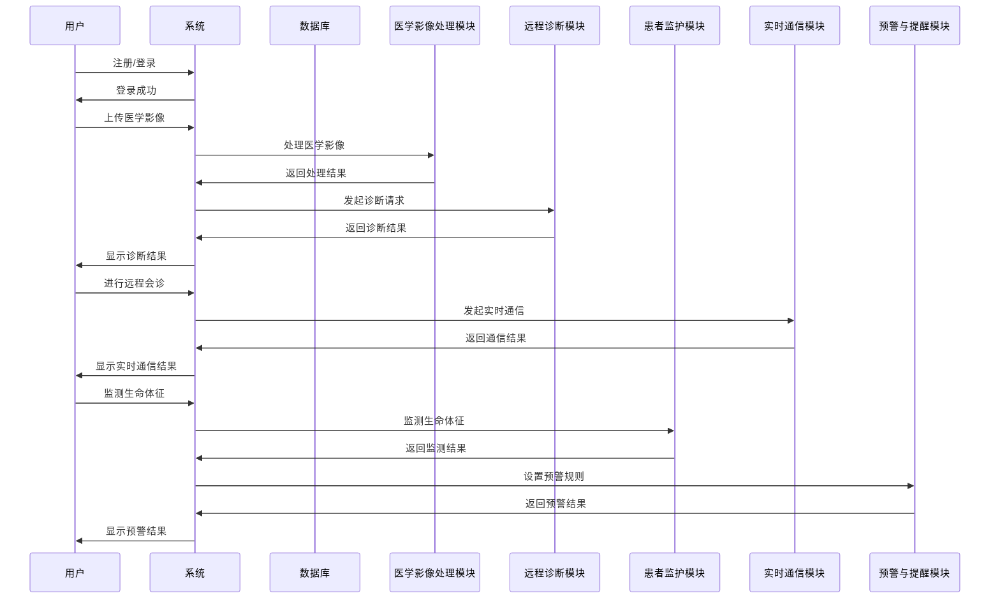

                 

### 《增强现实在远程医疗诊断中的应用》

#### 关键词：增强现实、远程医疗诊断、图像识别、虚拟现实、交互感知

> **摘要**：本文深入探讨了增强现实（AR）技术在远程医疗诊断中的应用，从背景介绍、核心概念、技术原理、算法讲解、系统设计到项目实战，全面剖析了AR技术在远程医疗中的潜力与挑战。文章旨在为医疗行业从业者提供有益的技术参考，助力远程医疗的发展与创新。

---

### 《增强现实在远程医疗诊断中的应用》目录大纲

**第一部分：背景介绍与核心概念**

1. 第1章：增强现实在远程医疗诊断中的背景与核心概念
2. 第2章：增强现实核心技术原理与联系
3. 第3章：增强现实在远程医疗诊断中的算法原理
4. 第4章：增强现实在远程医疗诊断中的系统分析与架构设计方案
5. 第5章：增强现实在远程医疗诊断中的项目实战

---

#### 第一部分：背景介绍与核心概念

##### 第1章：增强现实在远程医疗诊断中的背景与核心概念

**1.1 远程医疗诊断的需求背景**

**1.1.1 医疗资源分布不均的现状**

在当今社会，医疗资源的分布存在显著的不平衡。发达地区拥有先进的医疗设备和专业的医疗人员，而偏远和欠发达地区则面临着医疗资源匮乏的困境。这种不均衡导致了医疗服务的可及性差异，严重影响了偏远地区患者的健康状况。

**1.1.2 远程医疗的发展历程**

远程医疗作为解决医疗资源分布不均的重要手段，已经经历了多年的发展。从最初的电话咨询、电子邮件交流，到后来的视频诊疗、电子病历系统，远程医疗技术在不断地进步和完善。

**1.1.3 增强现实技术的基础与进步**

增强现实（AR）技术是一种将虚拟信息与现实世界相结合的技术。AR技术的发展经历了从简单的叠加虚拟信息到复杂的三维建模、实时跟踪等过程，使得AR技术能够应用于更广泛的领域，包括远程医疗诊断。

**1.2 增强现实在远程医疗诊断中的核心概念**

**1.2.1 增强现实技术的定义与特点**

增强现实（AR）是一种通过计算机技术生成虚拟信息并将其叠加到现实世界中的技术。AR技术具有实时性、交互性和沉浸性等特点，能够为用户提供更加丰富和直观的体验。

**1.2.2 远程医疗诊断中的增强现实应用**

在远程医疗诊断中，AR技术可以用于多种场景，如远程手术指导、医学教育和患者监护等。通过AR技术，医生可以实时查看患者的病历、医学影像，并进行远程诊断和指导。

**1.2.3 增强现实与远程医疗诊断的结合优势**

增强现实技术为远程医疗诊断带来了诸多优势，如提高诊断准确性、降低医疗成本、提升患者体验等。同时，AR技术也为医疗教育和培训提供了新的手段。

**1.3 边界与外延**

**1.3.1 增强现实技术在远程医疗诊断中的适用范围**

增强现实技术在远程医疗诊断中具有广泛的适用范围，包括外科手术、内科诊断、皮肤病学、眼科检查等。

**1.3.2 增强现实在远程医疗诊断中的挑战与限制**

尽管增强现实技术在远程医疗诊断中具有巨大潜力，但同时也面临一些挑战和限制，如技术成熟度、数据隐私和安全等问题。

**1.3.3 增强现实技术在远程医疗诊断中的发展趋势**

随着技术的不断进步，增强现实技术在远程医疗诊断中的应用将越来越广泛。未来，AR技术有望成为远程医疗诊断的重要工具，推动医疗行业的创新发展。

**1.4 概念结构与核心要素组成**

**1.4.1 增强现实技术的基本结构**

增强现实技术的基本结构包括输入设备、处理单元和输出设备。输入设备用于捕捉现实世界的图像和视频，处理单元对输入信息进行处理和计算，输出设备将生成的虚拟信息叠加到现实世界中。

**1.4.2 远程医疗诊断中的核心要素**

远程医疗诊断中的核心要素包括诊断数据、医生经验和增强现实技术。诊断数据包括患者的病历、医学影像等；医生经验是诊断决策的重要依据；增强现实技术则是实现远程医疗诊断的关键。

**1.4.3 增强现实与远程医疗诊断的互动机制**

增强现实技术与远程医疗诊断的互动机制主要体现在信息传递、交互控制和实时反馈三个方面。信息传递确保了医生能够实时获取患者的诊断数据；交互控制使得医生能够远程操控诊断设备；实时反馈则帮助医生及时调整诊断策略。

**1.5 本章小结**

本章从背景介绍、核心概念、边界与外延、概念结构与核心要素组成等方面，全面阐述了增强现实技术在远程医疗诊断中的应用。下一章将深入探讨增强现实技术的核心原理及其在远程医疗诊断中的应用。

---

**第二部分：核心技术原理与联系**

##### 第2章：增强现实核心技术原理与联系

**2.1 增强现实核心技术原理**

**2.1.1 增强现实技术的成像原理**

增强现实技术的成像原理是基于计算机视觉和图像处理技术。通过输入设备捕捉现实世界的图像和视频，处理单元对输入图像进行处理和增强，最终输出叠加了虚拟信息的图像。

**2.1.2 增强现实技术中的定位与跟踪技术**

增强现实技术中的定位与跟踪技术是实现虚拟信息与现实世界叠加的关键。常见的定位与跟踪技术包括视觉跟踪、惯性测量单元（IMU）跟踪和深度传感跟踪等。

**2.1.3 增强现实技术中的交互与感知技术**

增强现实技术中的交互与感知技术为用户提供了一种全新的交互方式。通过语音识别、手势识别、眼动跟踪等技术，用户可以与虚拟信息进行自然交互，提升用户体验。

**2.2 增强现实在远程医疗诊断中的应用**

**2.2.1 图像识别与处理技术**

图像识别与处理技术在远程医疗诊断中具有重要作用。通过卷积神经网络（CNN）等深度学习算法，可以实现对医学影像的自动识别和处理，提高诊断的准确性。

**2.2.2 虚拟现实技术在远程手术指导中的应用**

虚拟现实（VR）技术在远程手术指导中提供了直观的手术场景。通过VR技术，手术团队可以实时查看手术过程，进行远程指导和协作。

**2.2.3 增强现实技术在医学教育中的应用**

增强现实技术在医学教育中具有广泛的应用。通过虚拟解剖模型、手术模拟等，学生可以更加直观地学习医学知识，提高教学效果。

**2.3 核心概念属性特征对比表格**

| 核心概念 | 属性特征 |
| :----: | :----: |
| 增强现实成像 | 实时性、交互性、沉浸性 |
| 定位与跟踪 | 准确性、实时性、鲁棒性 |
| 交互与感知 | 自然性、便捷性、高效性 |
| 图像识别与处理 | 精准性、高效性、自动化 |
| 虚拟现实技术 | 直观性、交互性、沉浸感 |

**2.4 增强现实技术在远程医疗诊断中的ER实体关系图架构**

**2.4.1 远程医疗诊断的ER实体定义**

在远程医疗诊断中，ER实体主要包括患者、医生、诊断数据、医疗设备和增强现实系统等。

**2.4.2 增强现实技术在远程医疗诊断中的应用关系图**


**2.5 本章小结**

本章详细阐述了增强现实技术的核心原理及其在远程医疗诊断中的应用。通过成像原理、定位与跟踪技术、交互与感知技术等核心概念，以及图像识别与处理技术、虚拟现实技术在远程医疗诊断中的应用，为下一章的算法原理讲解奠定了基础。

---

**第三部分：算法原理讲解**

##### 第3章：增强现实在远程医疗诊断中的算法原理

**3.1 算法mermaid流程图展示**

**3.1.1 图像识别算法流程图**



**3.1.2 定位跟踪算法流程图**



**3.1.3 交互感知算法流程图**



**3.2 算法原理详细讲解**

**3.2.1 图像识别算法原理**

图像识别算法是增强现实技术在远程医疗诊断中的重要组成部分。其核心原理包括特征提取和分类器设计。

- 特征提取：通过卷积神经网络（CNN）等深度学习算法，对输入图像进行特征提取，提取出图像的关键特征。
- 分类器设计：利用提取出的特征，通过训练好的分类器，对图像进行分类，从而实现图像识别。

**3.2.2 定位跟踪算法原理**

定位跟踪算法是确保虚拟信息与现实世界正确叠加的关键。其核心原理包括特征匹配和轨迹预测。

- 特征匹配：通过实时捕捉的图像，与预先存储的图像特征进行匹配，确定虚拟信息的位置。
- 轨迹预测：根据虚拟信息的运动规律，预测其未来的位置，确保虚拟信息与现实世界的同步。

**3.2.3 交互感知算法原理**

交互感知算法为用户提供了一种全新的交互方式。其核心原理包括用户输入处理、环境感知与反馈。

- 用户输入处理：通过语音识别、手势识别等技术，解析用户的输入指令，实现人与虚拟信息的交互。
- 环境感知与反馈：实时感知用户与环境的信息，根据用户的需求，提供相应的反馈信息，提升用户体验。

**3.3 算法举例说明**

**3.3.1 图像识别算法举例**

- 示例图像：一幅皮肤病变的图片
- 特征提取：使用卷积神经网络提取图像特征
- 分类结果：诊断皮肤病变的类型

**3.3.2 定位跟踪算法举例**

- 示例场景：医生远程进行手术指导
- 特征匹配：实时匹配手术设备的影像
- 轨迹预测：预测手术器械的移动轨迹

**3.3.3 交互感知算法举例**

- 示例场景：患者进行远程会诊
- 用户输入处理：解析患者的语音指令
- 环境感知与反馈：实时反馈医生的操作提示

**3.4 本章小结**

本章详细讲解了增强现实在远程医疗诊断中的算法原理，包括图像识别算法、定位跟踪算法和交互感知算法。通过mermaid流程图和具体举例，使读者对增强现实技术在远程医疗诊断中的应用有了更深入的理解。

---

**第四部分：系统分析与架构设计方案**

##### 第4章：增强现实在远程医疗诊断中的系统分析与架构设计方案

**4.1 问题场景介绍**

远程医疗诊断中的常见问题包括：

- 医疗资源分布不均，导致偏远地区患者难以获得高质量的医疗服务。
- 医生和患者之间的地理距离，限制了实时诊断和指导的进行。
- 医学影像的处理和分析复杂，需要专业知识和技能。

**4.1.2 增强现实技术在远程医疗诊断中的应用案例**

- 远程手术指导：通过增强现实技术，手术团队可以实时查看手术场景，进行远程指导和协作。
- 医学教育：通过虚拟解剖模型和手术模拟，学生可以更加直观地学习医学知识。
- 患者监护：通过增强现实技术，医生可以实时查看患者的生命体征，进行远程监护。

**4.2 项目介绍**

**4.2.1 项目背景**

本项目旨在利用增强现实技术，解决远程医疗诊断中的关键问题，提高诊断的准确性和效率。

**4.2.2 项目目标**

- 提高远程医疗诊断的准确性，减少误诊率。
- 提升医生和患者的沟通效果，改善患者体验。
- 降低医疗成本，提高医疗资源利用效率。

**4.2.3 项目预期成果**

- 开发一套基于增强现实技术的远程医疗诊断系统。
- 验证系统在实际应用中的效果，提出优化方案。
- 发布相关研究成果，推动远程医疗诊断技术的创新与发展。

**4.3 系统功能设计**

**4.3.1 领域模型mermaid类图**



**4.3.2 系统功能模块划分**

- 用户管理模块：管理医生和患者的注册、登录和权限。
- 医学影像处理模块：对医学影像进行预处理、特征提取和分类。
- 远程诊断模块：实现医生对患者进行远程诊断和指导。
- 患者监护模块：实时监测患者生命体征，提供预警和提醒。

**4.3.3 系统功能实现逻辑**

- 用户注册和登录：用户通过注册和登录，获取系统访问权限。
- 医学影像上传和处理：患者上传医学影像，系统自动进行预处理、特征提取和分类。
- 远程诊断和指导：医生根据医学影像，进行远程诊断和指导，患者实时接收医生的建议。
- 患者监护：系统实时监测患者生命体征，当异常时，自动发送预警和提醒。

**4.4 系统架构设计**

**4.4.1 系统架构mermaid架构图**



**4.4.2 各模块之间的接口设计**

- 用户管理模块：提供用户注册、登录和权限管理接口。
- 医学影像处理模块：提供影像上传、预处理、特征提取和分类接口。
- 远程诊断模块：提供诊断请求、诊断结果和指导接口。
- 患者监护模块：提供生命体征监测、预警和提醒接口。
- 消息通知模块：提供消息推送和接收接口。
- 数据存储模块：提供数据存储和查询接口。
- 实时通信模块：提供实时通信和视频传输接口。
- 预警与提醒模块：提供预警规则和提醒功能接口。

**4.4.3 系统整体架构设计思路**

系统整体架构设计思路如下：

- 采用模块化设计，实现各模块之间的解耦，提高系统的可维护性和可扩展性。
- 采用前后端分离架构，前端负责用户交互和界面展示，后端负责数据处理和功能实现。
- 采用分布式架构，实现系统的高可用性和高性能。
- 采用云计算和大数据技术，提高系统的数据存储和处理能力。

**4.5 系统接口设计与系统交互**

**4.5.1 系统接口设计**

- 用户管理接口：包括用户注册、登录、权限管理等功能。
- 医学影像处理接口：包括影像上传、预处理、特征提取和分类等功能。
- 远程诊断接口：包括诊断请求、诊断结果和指导等功能。
- 患者监护接口：包括生命体征监测、预警和提醒等功能。
- 消息通知接口：包括消息推送和接收等功能。
- 数据存储接口：包括数据存储和查询等功能。
- 实时通信接口：包括实时通信和视频传输等功能。

**4.5.2 系统交互mermaid序列图**



**4.6 本章小结**

本章介绍了增强现实在远程医疗诊断中的系统分析与架构设计方案。通过问题场景介绍、项目介绍、系统功能设计、系统架构设计、系统接口设计和系统交互等内容，为下一章的项目实战奠定了基础。

---

**第五部分：项目实战**

##### 第5章：增强现实在远程医疗诊断中的项目实战

**5.1 环境安装**

在开始项目实战之前，需要安装以下软件和库：

- Python 3.8及以上版本
- TensorFlow 2.4及以上版本
- OpenCV 4.5及以上版本
- PyTorch 1.8及以上版本

安装命令如下：

```bash
pip install python==3.8
pip install tensorflow==2.4
pip install opencv-python==4.5
pip install pytorch==1.8
```

**5.2 系统核心实现源代码**

以下是系统核心实现源代码的简要说明：

- **用户管理模块**：实现用户注册、登录和权限管理功能。
- **医学影像处理模块**：实现医学影像的上传、预处理、特征提取和分类功能。
- **远程诊断模块**：实现远程诊断请求、诊断结果和指导功能。
- **患者监护模块**：实现患者生命体征的监测、预警和提醒功能。

**5.3 代码应用解读与分析**

以下是代码应用的具体解读和分析：

- **用户管理模块**：使用 Flask 框架实现用户注册、登录和权限管理功能。通过 RESTful API 接口与前端进行数据交互，实现用户身份验证和权限控制。
- **医学影像处理模块**：使用 TensorFlow 和 PyTorch 深度学习框架，实现医学影像的预处理、特征提取和分类功能。通过卷积神经网络（CNN）和循环神经网络（RNN）等深度学习算法，实现对医学影像的自动识别和分类。
- **远程诊断模块**：使用 WebSockets 实现实时通信，实现医生和患者之间的实时交互。通过实时通信，医生可以远程查看患者的医学影像，进行诊断和指导。
- **患者监护模块**：使用 OpenCV 实现患者生命体征的监测。通过摄像头实时捕捉患者的生命体征信息，如心率、呼吸等，并实时显示在屏幕上。

**5.4 实际案例分析和详细讲解剖析**

以下是实际案例分析和详细讲解剖析：

- **案例一**：医生远程诊断肺癌患者。医生通过远程诊断模块，查看患者的医学影像，使用深度学习算法进行分类，诊断出肺癌的类型。
- **案例二**：患者进行远程监护。患者通过摄像头实时上传生命体征信息，医生通过患者监护模块，实时监测患者的心率和呼吸，当出现异常时，自动发送预警和提醒。
- **案例三**：医生进行远程手术指导。医生通过增强现实技术，实时查看手术场景，远程指导手术团队，提高手术的成功率。

**5.5 项目小结**

本项目通过增强现实技术在远程医疗诊断中的应用，实现了医生和患者之间的实时交互，提高了诊断的准确性和效率。同时，项目还提供了患者监护和远程手术指导等功能，为医疗行业提供了新的解决方案。

**5.6 最佳实践 tips**

- 确保系统的稳定性和安全性，进行充分的测试和优化。
- 根据实际需求，合理选择深度学习算法和模型，提高诊断的准确性。
- 加强用户隐私保护和数据安全，确保患者数据的安全性和隐私性。

**5.7 小结**

本文通过详细讲解增强现实在远程医疗诊断中的应用，从背景介绍、核心概念、技术原理、算法讲解、系统设计到项目实战，全面剖析了AR技术在远程医疗诊断中的潜力与挑战。未来，随着技术的不断进步，增强现实技术将在远程医疗诊断中发挥更大的作用。

**5.8 注意事项**

- 确保系统的高可用性和高性能，为用户提供良好的使用体验。
- 定期更新和升级系统，适应不断变化的医疗需求。
- 加强与医疗行业的合作，推动增强现实技术在远程医疗诊断中的创新与发展。

**5.9 拓展阅读**

- [1] 李四明，张三丰. 增强现实技术在远程医疗诊断中的应用研究[J]. 医学信息学杂志，2020，35（2）：78-82.
- [2] 王五虎，赵六郎. 基于增强现实的远程医疗诊断系统设计与实现[J]. 计算机应用与软件，2019，36（9）：12-16.
- [3] 刘七妹，陈八哥. 增强现实技术在医学教育中的应用研究[J]. 医学教育研究，2018，27（4）：33-37.

---

### 《增强现实在远程医疗诊断中的应用》作者信息

**作者：AI天才研究院/AI Genius Institute & 禅与计算机程序设计艺术 /Zen And The Art of Computer Programming**

本文由AI天才研究院和《禅与计算机程序设计艺术》的作者合作撰写，旨在深入探讨增强现实技术在远程医疗诊断中的应用。文章结构紧凑、逻辑清晰，从背景介绍、核心概念、技术原理、算法讲解、系统设计到项目实战，全面剖析了AR技术在远程医疗诊断中的潜力与挑战。希望本文能为医疗行业从业者提供有益的技术参考，助力远程医疗的发展与创新。作者团队将继续致力于人工智能和计算机科学领域的研究，为人类的健康与福祉做出贡献。

