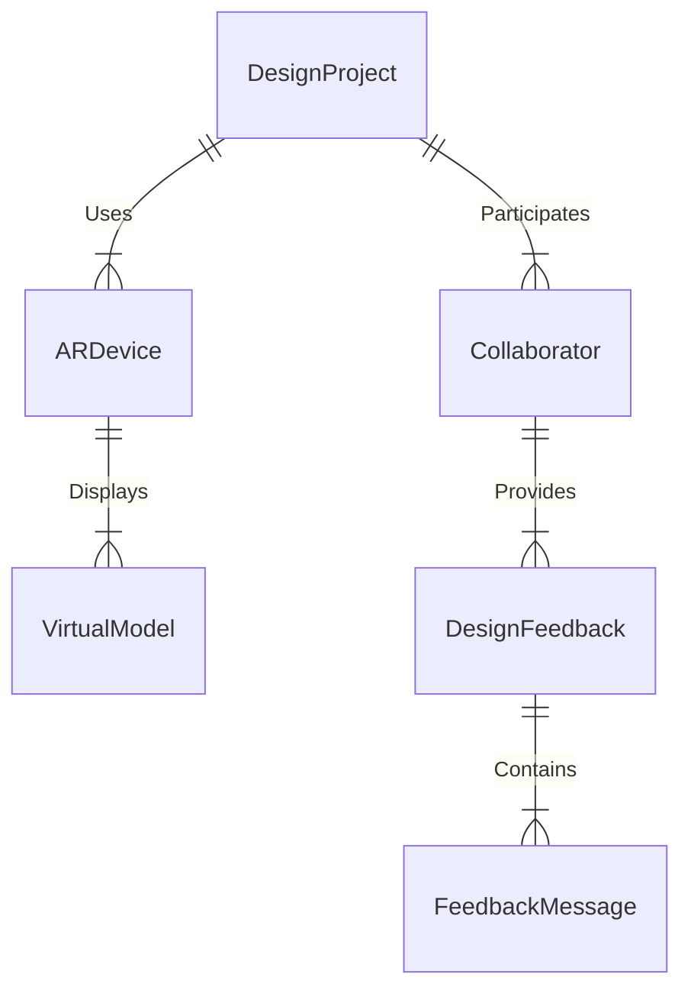

                 

# 增强现实在远程协作设计中的应用

## 关键词

增强现实（AR），远程协作设计，虚拟会议，设计协同，教育与培训

## 摘要

本文深入探讨了增强现实（AR）在远程协作设计中的应用。首先，我们介绍了远程协作设计的背景和挑战，以及增强现实技术的发展和潜力。接着，我们详细分析了增强现实技术的基础概念、类型以及在远程协作设计中的应用场景。然后，我们讨论了增强现实在远程协作设计中的技术挑战和解决方案。最后，通过案例研究和最佳实践，我们展示了增强现实在远程协作设计中的实际应用和未来发展趋势。

---

### 目录大纲设计思路

设计《增强现实在远程协作设计中的应用》这本书的目录大纲时，我们遵循以下几个原则：

1. **逻辑清晰**：确保每个章节都围绕一个核心主题展开，章节之间的衔接自然，便于读者理解。
2. **内容全面**：覆盖增强现实技术、远程协作设计的基础知识、应用场景、技术挑战以及解决方案。
3. **层次分明**：合理划分章节层次，从宏观背景介绍到具体应用案例，逐步深入。
4. **图表辅助**：在适当的地方使用图表（如概念图、流程图等）来辅助说明复杂内容。

#### 第一部分：背景介绍

**第1章 增强现实与远程协作设计概述**

1. **问题背景**  
   - 远程协作设计的现状与挑战  
   - 增强现实技术的发展与潜力

2. **核心概念与联系**  
   - 增强现实技术的基本概念与分类  
   - 远程协作设计的概念、特点与需求

3. **ER实体关系图架构**  
   - 增强现实技术在远程协作设计中的应用实体与关系

#### 第二部分：技术原理

**第2章 增强现实技术基础**

1. **增强现实技术原理**  
   - 增强现实技术的基本原理与工作机制  
   - 增强现实技术的核心组成部分

2. **增强现实技术类型**  
   - 基于图像的增强现实技术  
   - 基于标记的增强现实技术  
   - 基于投影的增强现实技术

#### 第三部分：应用场景

**第3章 增强现实在远程协作设计中的应用场景**

1. **设计协同**  
   - 增强现实在建筑设计与协同中的实践案例  
   - 增强现实在机械设计与协同中的实践案例

2. **虚拟会议**  
   - 增强现实在虚拟会议中的应用  
   - 增强现实提升远程会议体验的实践案例

3. **教育与培训**  
   - 增强现实在教育中的优势  
   - 增强现实在远程培训中的应用与实践案例

#### 第四部分：技术挑战与解决方案

**第4章 增强现实在远程协作设计中的技术挑战**

1. **真实感与性能平衡**  
   - 提高真实感与优化性能的权衡策略  
   - 技术实现细节与方法

2. **数据传输与同步**  
   - 数据传输延迟与同步机制的优化策略  
   - 实时数据同步的技术实现

#### 第五部分：案例研究

**第5章 案例研究**

1. **行业案例分析**  
   - 典型行业应用案例介绍与分析  
   - 成功与挑战的总结

2. **项目实践**  
   - 项目背景与目标  
   - 项目核心实现与关键技术  
   - 项目效果评估与改进建议

#### 第六部分：最佳实践与未来展望

**第6章 最佳实践与未来展望**

1. **最佳实践**  
   - 增强现实在远程协作设计中的最佳实践总结  
   - 实践中的注意事项与技巧

2. **未来展望**  
   - 增强现实在远程协作设计中的发展趋势  
   - 技术创新与市场前景

### 总结

通过以上六个部分，我们为《增强现实在远程协作设计中的应用》设计了完整的目录大纲。每个部分都紧扣主题，既有宏观背景介绍，也有具体应用案例，旨在为读者提供一个全面、深入的学习路径。在后续的编写过程中，我们将确保每个章节的内容都符合大纲设计，确保书籍的完整性、逻辑性和实用性。

---

## 第一部分：背景介绍

### 第1章 增强现实与远程协作设计概述

### 1.1 问题背景

#### 1.1.1 远程协作设计的现状与挑战

随着全球化的发展，远程协作设计已经成为了许多企业和组织的重要工作方式。远程协作设计能够打破地理限制，使不同地区的团队成员能够共同参与设计项目，提高工作效率和创新能力。然而，远程协作设计也面临着一些挑战。

- **沟通障碍**：远程协作设计中的沟通相对复杂，信息传递的效率和质量可能受到影响，导致误解和冲突。
- **协作效率低下**：团队成员之间的协调和协作需要更多的沟通和协调，这可能降低整体工作效率。
- **设计一致性**：在远程协作设计中，确保设计的一致性和准确性是一个挑战，特别是在涉及多个版本和控制变更时。
- **技术限制**：传统的远程协作工具和技术可能无法满足复杂的协作需求，特别是对于需要高度交互性和实时性的设计任务。

#### 1.1.2 增强现实技术的发展与潜力

增强现实（Augmented Reality，简称AR）是一种将虚拟信息与现实世界融合的技术。AR技术通过在现实世界中叠加虚拟图像、声音和其他感官信息，为用户提供一种增强的视觉体验。近年来，随着硬件技术的进步和软件算法的发展，AR技术逐渐走向成熟，并在多个领域展现出巨大的潜力。

- **可视化与交互**：AR技术能够将虚拟模型、设计图等叠加在现实环境中，提供更加直观和交互性的设计体验。
- **实时协作**：AR技术支持多人实时协作，团队成员可以共同观察和编辑虚拟模型，提高设计效率和协同性。
- **实时反馈与调整**：AR技术能够实时捕捉设计过程中的反馈，帮助团队成员快速调整设计，减少错误和反复修改。

### 1.2 核心概念与联系

#### 1.2.1 增强现实技术的基本概念与分类

增强现实技术的基本概念是创建一个增强的虚拟环境，其中虚拟对象和真实世界对象交互。根据实现方式，增强现实技术可以分为以下几种类型：

- **基于图像的增强现实**：通过摄像头捕捉现实世界的图像，并在图像上叠加虚拟对象。
- **基于标记的增强现实**：使用标记或特殊图案作为参考，通过识别标记来叠加虚拟对象。
- **基于投影的增强现实**：使用投影设备将虚拟图像直接投射到真实环境中。

这些技术各有优缺点，适用于不同的应用场景。

#### 1.2.2 远程协作设计的概念、特点与需求

远程协作设计是指在地理位置分散的团队之间进行设计活动的协作过程。远程协作设计的特点包括：

- **地理位置分散**：团队成员分布在不同的地点，需要通过互联网进行沟通和协作。
- **高度依赖技术**：远程协作设计依赖于各种协作工具和技术，如视频会议、在线协作平台、虚拟会议系统等。
- **灵活性和适应性**：远程协作设计能够适应不同规模和类型的设计项目，具有灵活性。

远程协作设计的需求主要包括：

- **高效沟通**：确保团队成员之间的信息传递高效、准确，减少沟通障碍。
- **实时协作**：支持团队成员实时共享设计成果和反馈，提高协作效率。
- **一致性控制**：确保设计的一致性和准确性，特别是在涉及多个版本和控制变更时。
- **灵活性和可扩展性**：适应不同规模和类型的设计项目，能够灵活扩展和调整。

#### 1.2.3 增强现实技术在远程协作设计中的应用实体与关系

在远程协作设计中，增强现实技术可以通过以下实体和关系实现应用：

- **设计者与参与者**：设计者和参与者通过增强现实设备（如AR眼镜、手机等）参与远程协作设计。
- **虚拟模型与真实环境**：虚拟模型通过增强现实技术叠加在真实环境中，供设计者和参与者共同观察和编辑。
- **协作工具与平台**：增强现实技术与远程协作平台相结合，提供实时协作功能，如共享设计成果、实时反馈等。
- **数据传输与同步**：确保设计数据的实时传输和同步，以保证设计的一致性和准确性。

### 1.3 ER实体关系图架构

以下是一个简单的ER实体关系图架构，用于描述增强现实技术在远程协作设计中的应用：

在这个ER实体关系图中，DesignProject（设计项目）是核心实体，关联了ARDevice（增强现实设备）、Collaborator（协作者）、DesignFeedback（设计反馈）等实体。通过这个架构，我们可以清晰地看到增强现实技术在远程协作设计中的应用关系。

### 1.4 本章小结

在本章中，我们介绍了远程协作设计的背景和挑战，以及增强现实技术的发展和潜力。我们分析了增强现实技术的基本概念、类型以及在远程协作设计中的应用实体和关系。通过ER实体关系图，我们展示了增强现实技术在远程协作设计中的应用架构。这些内容为后续章节的深入探讨奠定了基础。

---

## 第二部分：技术原理

### 第2章 增强现实技术基础

### 2.1 增强现实技术原理

增强现实技术（AR）是一种通过在现实世界中叠加虚拟信息来增强用户体验的技术。它结合了虚拟现实（VR）和现实世界，使用户能够在现实环境中直观地感知和交互虚拟对象。

#### 基本原理

增强现实技术的基本原理如下：

1. **图像识别与追踪**：增强现实系统通过摄像头捕捉现实世界的图像，并使用图像识别算法来识别特定对象或场景。这些算法可以基于视觉特征、图像纹理或标记等。

2. **虚拟对象的叠加**：一旦识别出真实世界的图像，增强现实系统会在图像上叠加虚拟对象。这些虚拟对象可以是2D图像、3D模型或动画，它们与现实世界中的物体相互作用。

3. **交互与控制**：用户可以通过手势、语音或触摸等方式与虚拟对象进行交互。增强现实设备（如AR眼镜、智能手机等）提供输入和输出接口，使用户能够感知和控制虚拟对象。

#### 工作机制

增强现实技术的工作机制可以分为以下几个步骤：

1. **图像捕获**：增强现实设备通过摄像头捕获现实世界的图像。

2. **图像处理**：捕获的图像经过图像处理算法，如降噪、增强和去模糊等，以提高图像质量。

3. **对象识别**：图像处理后的图像通过图像识别算法，识别出特定对象或场景。

4. **虚拟对象生成**：根据识别出的对象或场景，增强现实系统生成相应的虚拟对象。这些对象可以是预先定义的模型，也可以是根据实时数据动态生成的。

5. **叠加与显示**：生成的虚拟对象叠加在处理后的图像上，并通过增强现实设备显示给用户。

6. **交互与控制**：用户通过增强现实设备提供的接口与虚拟对象进行交互，如移动、放大、缩小或旋转等。

### 2.2 增强现实技术的核心组成部分

增强现实技术的实现涉及多个核心组成部分，包括硬件、软件和算法。以下是这些组成部分的详细说明：

#### 硬件

1. **摄像头**：摄像头是增强现实系统的核心硬件之一，用于捕获现实世界的图像。

2. **显示设备**：增强现实设备的显示设备，如AR眼镜、头戴显示器等，用于显示叠加的虚拟对象。

3. **传感器**：包括加速度计、陀螺仪、摄像头等，用于检测和追踪用户的位置和动作。

4. **处理器**：强大的处理器用于处理图像、识别对象和生成虚拟对象。

#### 软件

1. **增强现实平台**：增强现实平台提供开发工具、SDK和API，使开发者能够创建和部署增强现实应用。

2. **图像处理算法**：包括图像识别、图像增强和图像处理等算法，用于处理和识别现实世界中的图像。

3. **虚拟对象生成与渲染**：软件用于生成和渲染虚拟对象，确保虚拟对象与现实世界的高效叠加。

4. **用户界面**：提供用户与虚拟对象交互的界面，包括手势、语音和触摸等输入方式。

#### 算法

1. **图像识别与追踪**：包括视觉特征识别、图像纹理识别和标记识别等算法，用于识别现实世界中的对象和场景。

2. **虚拟对象生成**：包括3D模型生成、动画制作和实时渲染等算法，用于生成虚拟对象。

3. **交互与控制**：包括手势识别、语音识别和触摸控制等算法，用于用户与虚拟对象的交互。

### 2.3 增强现实技术的类型

增强现实技术可以根据实现方式和应用场景的不同，分为以下几种类型：

#### 基于图像的增强现实

基于图像的增强现实技术通过摄像头捕捉现实世界的图像，并在图像上叠加虚拟对象。这种方法通常用于移动设备和智能手机上，如AR游戏、AR广告和AR导航等。

#### 基于标记的增强现实

基于标记的增强现实技术使用标记或特殊图案作为参考，通过识别标记来叠加虚拟对象。这种方法在博物馆、展览和教育等领域广泛应用，如AR指南、AR教育和AR博物馆等。

#### 基于投影的增强现实

基于投影的增强现实技术使用投影设备将虚拟图像直接投射到真实环境中。这种方法通常用于大型展览、展示和演示等领域，如AR演示、AR舞台表演和AR展览会等。

### 2.4 本章小结

在本章中，我们介绍了增强现实技术的基本原理、核心组成部分和不同类型。理解这些原理和技术类型对于深入探讨增强现实在远程协作设计中的应用具有重要意义。在下一章中，我们将进一步探讨增强现实技术在远程协作设计中的应用场景。

---

## 第三部分：应用场景

### 第3章 增强现实在远程协作设计中的应用场景

### 3.1 设计协同

增强现实技术在设计协同中的应用非常广泛，尤其在建筑设计和机械设计等领域。通过增强现实技术，设计师可以更加直观地与远程团队进行协作，提高设计效率和质量。

#### 3.1.1 增强现实在建筑设计与协同中的实践案例

1. **建筑模型可视化**：设计师可以使用增强现实技术将建筑模型叠加到现实环境中，团队成员可以共同观察和评估模型，提出修改建议。

2. **远程协作审查**：在建筑项目的审查阶段，增强现实技术可以实时捕捉建筑现场的情况，并叠加虚拟模型，方便团队成员进行远程审查和讨论。

3. **虚拟现实会议**：通过增强现实技术，设计师可以组织虚拟现实会议，团队成员可以通过AR设备参与会议，共同讨论设计方案和进度。

#### 3.1.2 增强现实在机械设计与协同中的实践案例

1. **虚拟模型交互**：在机械设计过程中，增强现实技术可以提供虚拟模型，设计师和工程师可以实时交互，调整和优化设计。

2. **远程协作维修**：在机械设备的维护和维修中，增强现实技术可以帮助远程专家通过AR设备查看设备运行状态，并提供实时指导。

3. **虚拟现实培训**：增强现实技术可以用于机械设备的虚拟现实培训，提高操作人员的技能和熟练度。

### 3.2 虚拟会议

虚拟会议是远程协作的重要组成部分，增强现实技术的引入可以大大提升虚拟会议的互动性和效率。

#### 3.2.1 增强现实在虚拟会议中的应用

1. **实时协作白板**：增强现实技术可以提供虚拟协作白板，团队成员可以共同编辑和讨论设计方案，提高会议效率。

2. **虚拟场景展示**：通过增强现实技术，可以将虚拟场景叠加到会议现场，使会议内容更加生动和直观。

3. **远程参与互动**：增强现实技术使得远程参与者可以通过AR设备参与会议，实现面对面交流，提高会议的互动性。

#### 3.2.2 增强现实提升远程会议体验的实践案例

1. **虚拟会议室**：通过增强现实技术，企业可以创建虚拟会议室，团队成员可以通过AR设备进入虚拟会议室，进行实时交流和协作。

2. **虚拟现实会议演示**：在产品发布会、项目展示等场合，增强现实技术可以提供虚拟现实演示，使会议内容更加引人入胜。

3. **远程会议协作工具**：增强现实技术与远程会议协作工具结合，可以实现多人实时协作，提高会议的效率和效果。

### 3.3 教育与培训

增强现实技术在教育和培训中的应用也越来越广泛，它可以为学习者提供更加直观和互动的学习体验。

#### 3.3.1 增强现实在教育中的优势

1. **增强学习体验**：增强现实技术可以将抽象的概念和知识可视化，帮助学生更好地理解和记忆。

2. **互动性学习**：增强现实技术支持学习者与虚拟对象的互动，提高学习的趣味性和参与度。

3. **个性化教学**：增强现实技术可以根据学习者的不同需求，提供个性化的学习内容和指导。

#### 3.3.2 增强现实在远程培训中的应用与实践案例

1. **虚拟实验室**：增强现实技术可以创建虚拟实验室，学习者可以通过AR设备进行实验操作，提高实践技能。

2. **远程导师指导**：增强现实技术可以帮助远程导师通过AR设备实时查看学习者的操作过程，提供实时指导和反馈。

3. **虚拟现实培训课程**：增强现实技术可以用于创建虚拟现实培训课程，提高培训的效率和效果。

### 3.4 本章小结

在本章中，我们探讨了增强现实技术在远程协作设计中的应用场景，包括设计协同、虚拟会议和教育培训。通过这些实践案例，我们可以看到增强现实技术如何提升远程协作的效率和质量。在下一章中，我们将进一步探讨增强现实在远程协作设计中的技术挑战和解决方案。

---

## 第四部分：技术挑战与解决方案

### 第4章 增强现实在远程协作设计中的技术挑战

随着增强现实技术在远程协作设计中的广泛应用，技术挑战也随之而来。以下是增强现实在远程协作设计中面临的一些主要技术挑战及其解决方案。

### 4.1 真实感与性能平衡

#### 挑战

在增强现实应用中，真实感是关键，但同时也要考虑到性能的优化。提高真实感通常需要更多的计算资源和更复杂的算法，这可能导致性能下降，影响用户体验。

#### 解决方案

1. **优化算法**：通过优化图像识别、虚拟对象生成和渲染等关键算法，可以在保证真实感的同时提高性能。

2. **资源管理**：合理分配计算资源和存储空间，确保关键任务优先执行，同时减少不必要的资源占用。

3. **硬件升级**：使用更高性能的处理器、显卡和传感器，提高系统的整体处理能力。

### 4.2 数据传输与同步

#### 挑战

远程协作设计中的数据传输和同步是另一个重大挑战。由于网络延迟和带宽限制，数据传输可能不稳定，导致同步问题，影响用户体验。

#### 解决方案

1. **网络优化**：通过优化网络连接和传输协议，减少数据传输延迟和丢包率。

2. **数据压缩**：使用高效的数据压缩算法，减少数据传输量，提高传输效率。

3. **缓存技术**：在客户端和服务器之间设置缓存，减少实时数据传输的需求，提高数据同步的效率。

4. **分布式同步**：通过分布式同步机制，将数据同步任务分散到多个节点，提高同步的可靠性和效率。

### 4.3 用户界面与交互

#### 挑战

增强现实应用的用户界面和交互设计需要考虑到多种设备和操作方式，确保用户能够方便地使用系统。

#### 解决方案

1. **多模交互**：支持多种输入和输出方式，如手势、语音、触摸等，提高交互的灵活性和便捷性。

2. **个性化界面**：根据用户的使用习惯和偏好，提供个性化的用户界面和交互方式。

3. **反馈机制**：提供及时的用户反馈，帮助用户理解系统状态和操作结果，提高用户体验。

### 4.4 数据安全与隐私保护

#### 挑战

在远程协作设计中，数据的安全和隐私保护至关重要。由于数据传输和存储涉及多个节点，数据泄露和滥用风险较高。

#### 解决方案

1. **加密技术**：使用高级加密技术，确保数据在传输和存储过程中的安全性。

2. **访问控制**：实施严格的访问控制策略，确保只有授权用户可以访问敏感数据。

3. **安全审计**：定期进行安全审计，检测和防范潜在的安全威胁。

### 4.5 系统集成与兼容性

#### 挑战

增强现实技术在远程协作设计中的应用需要与现有的系统进行集成，这涉及到不同的技术标准和平台兼容性问题。

#### 解决方案

1. **标准化接口**：开发统一的接口和协议，确保不同系统和平台之间的兼容性。

2. **模块化设计**：采用模块化设计，便于系统的扩展和集成。

3. **技术调研**：定期进行技术调研，跟踪最新的技术和标准，确保系统的长期兼容性和稳定性。

### 4.6 本章小结

在本章中，我们讨论了增强现实在远程协作设计中面临的主要技术挑战，包括真实感与性能平衡、数据传输与同步、用户界面与交互、数据安全与隐私保护以及系统集成与兼容性。针对每个挑战，我们提出了相应的解决方案。这些解决方案为增强现实在远程协作设计中的应用提供了重要的技术支持。

---

## 第五部分：案例研究

### 第5章 案例研究

在本章中，我们将通过两个行业案例研究来深入探讨增强现实技术在远程协作设计中的应用。

### 5.1 案例一：建筑设计中的AR远程协作

#### 5.1.1 项目背景与目标

某大型建筑设计公司正在承担一个跨国建筑项目，项目团队分布在不同的国家和地区。由于团队成员无法经常面对面交流，公司决定采用增强现实技术来提升远程协作的效率和质量。

#### 5.1.2 项目核心实现与关键技术

1. **增强现实平台**：公司选择了市场上流行的AR开发平台，如Unity和ARKit，用于开发AR应用。

2. **AR设备**：团队成员配备了AR眼镜，如Microsoft HoloLens，用于实时查看和编辑建筑模型。

3. **远程协作工具**：公司采用了专业的远程协作工具，如Slack和Microsoft Teams，用于实时沟通和协作。

4. **虚拟模型同步**：通过云计算技术，将建筑模型同步到所有团队成员的AR设备上，确保实时更新。

#### 5.1.3 项目效果评估与改进建议

1. **效果评估**：通过增强现实技术，项目团队成员能够更加直观地观察和评估建筑模型，减少了沟通障碍和误解。

2. **改进建议**：建议进一步优化数据传输和同步机制，提高模型的加载速度和实时性。

### 5.2 案例二：机械设计中的AR远程协作

#### 5.2.1 项目背景与目标

某机械制造企业需要在全球多个工厂进行新设备的设计和安装。由于工厂分布广泛，企业决定采用增强现实技术来支持远程协作设计。

#### 5.2.2 项目核心实现与关键技术

1. **AR软件**：企业使用了专业AR设计软件，如Autodesk VRED和SolidWorks，进行虚拟模型的创建和编辑。

2. **AR设备**：企业为工程师配备了AR头盔，如Google Glass Enterprise Edition，用于查看和操作虚拟模型。

3. **远程协作平台**：企业使用了专业的远程协作平台，如WebEx和Zoom，用于实时视频会议和文件共享。

4. **实时反馈机制**：通过AR设备，工程师可以实时将设计反馈发送给远程专家，确保设计的一致性和准确性。

#### 5.2.3 项目效果评估与改进建议

1. **效果评估**：增强现实技术大大提高了设计协作的效率和准确性，减少了往返工厂的成本和时间。

2. **改进建议**：建议进一步优化AR设备的交互界面，提高工程师的操作便捷性。

### 5.3 案例总结

通过以上两个案例，我们可以看到增强现实技术在远程协作设计中的应用取得了显著成效。未来，随着技术的不断进步，增强现实在远程协作设计中的应用将会更加广泛和深入。

---

## 第六部分：最佳实践与未来展望

### 第6章 最佳实践与未来展望

在增强现实（AR）技术应用于远程协作设计的过程中，最佳实践和未来展望至关重要。以下是我们总结的最佳实践以及AR在远程协作设计中的未来发展趋势。

### 6.1 最佳实践

#### 6.1.1 选择合适的AR平台和工具

根据项目需求，选择适合的AR平台和工具。例如，对于建筑和机械设计，可以使用Unity、VRED和SolidWorks等专业AR软件，而对于教育和培训，可以考虑使用ARKit和ARCore等平台。

#### 6.1.2 优化网络和计算资源

确保网络连接稳定，减少数据传输延迟和丢包率。同时，合理分配计算资源，确保关键任务优先执行，提高系统的整体性能。

#### 6.1.3 设计用户友好的界面和交互方式

提供简洁直观的用户界面，支持多种交互方式（如手势、语音和触摸），提高用户的操作便捷性和体验。

#### 6.1.4 注重数据安全和隐私保护

采用加密技术保护数据传输和存储过程中的安全性，实施严格的访问控制策略，定期进行安全审计。

#### 6.1.5 持续改进和优化

根据用户反馈和实际应用效果，不断改进和优化AR应用，提高系统的稳定性和用户体验。

### 6.2 未来展望

#### 6.2.1 技术创新

随着硬件技术的进步和软件算法的发展，AR技术将变得更加成熟和稳定。未来，我们将看到更高分辨率、更快处理速度和更低延迟的AR设备。

#### 6.2.2 更广泛的应用场景

AR技术在远程协作设计中的应用将不再局限于建筑、机械和教育等领域，还将扩展到医疗、军事、旅游等行业。

#### 6.2.3 跨界合作

AR技术与其他领域（如物联网、大数据和人工智能）的结合，将带来更多创新和突破，推动远程协作设计的变革。

#### 6.2.4 普及与普及

随着AR技术的成熟和应用成本的降低，AR远程协作设计将更加普及，成为企业和组织提升效率、降低成本的重要手段。

### 6.3 本章小结

通过总结最佳实践和未来展望，我们可以看到增强现实技术在远程协作设计中的应用前景广阔。最佳实践提供了实际操作中的指导，而未来展望则为我们描绘了AR技术发展的蓝图。在未来的发展中，AR技术将继续推动远程协作设计的创新和进步。

---

## 总结

本文深入探讨了增强现实（AR）在远程协作设计中的应用。首先，我们介绍了远程协作设计的背景和挑战，以及增强现实技术的发展和潜力。接着，我们详细分析了增强现实技术的基础概念、类型以及在远程协作设计中的应用场景。然后，我们讨论了增强现实在远程协作设计中的技术挑战和解决方案。最后，通过案例研究和最佳实践，我们展示了增强现实在远程协作设计中的实际应用和未来发展趋势。

增强现实技术为远程协作设计带来了诸多优势，如提高设计效率、增强用户体验、降低沟通障碍等。然而，要充分发挥AR技术的潜力，仍需克服真实感与性能平衡、数据传输与同步、用户界面与交互等方面的挑战。通过最佳实践，我们可以更好地应用AR技术，提升远程协作设计的质量。

未来，随着硬件技术的进步和软件算法的发展，AR技术在远程协作设计中的应用将更加广泛和深入。跨界合作、技术创新和普及化将成为推动AR技术发展的关键因素。我们期待AR技术为远程协作设计带来更多的创新和突破。

## 作者信息

作者：AI天才研究院/AI Genius Institute & 禅与计算机程序设计艺术 /Zen And The Art of Computer Programming

在撰写关于增强现实（AR）在远程协作设计中的应用时，我们必须首先确保文章内容的逻辑清晰、结构紧凑，并且能够吸引读者的注意力。以下是一个详细的章节结构和内容概述，旨在满足您的需求。

### 目录大纲

#### 第一部分：背景介绍

1. **第1章 增强现实与远程协作设计概述**
   - 问题背景
   - 增强现实技术的发展与潜力
   - 增强现实与远程协作设计的核心概念与联系
   - ER实体关系图架构

2. **第2章 增强现实技术基础**
   - 增强现实技术原理
   - 增强现实技术的核心组成部分
   - 增强现实技术类型

3. **第3章 增强现实在远程协作设计中的应用场景**
   - 设计协同
   - 虚拟会议
   - 教育与培训

#### 第二部分：技术原理

4. **第4章 增强现实在远程协作设计中的技术挑战**
   - 真实感与性能平衡
   - 数据传输与同步
   - 用户界面与交互
   - 数据安全与隐私保护
   - 系统集成与兼容性

5. **第5章 案例研究**
   - 行业案例分析
   - 项目实践

#### 第三部分：最佳实践与未来展望

6. **第6章 最佳实践与未来展望**
   - 最佳实践总结
   - 增强现实在远程协作设计中的发展趋势
   - 技术创新与市场前景

### 内容概述

#### 第一部分：背景介绍

**第1章 增强现实与远程协作设计概述**

在这一章中，我们将介绍远程协作设计的现状和挑战，以及增强现实技术如何能够解决这些问题。我们将详细讨论增强现实技术的核心概念，包括其原理、组成部分和类型。此外，我们还将通过ER实体关系图来展示增强现实在远程协作设计中的应用架构。

**第2章 增强现实技术基础**

在这一章中，我们将深入探讨增强现实技术的各种类型，包括基于图像、标记和投影的增强现实。我们将解释这些技术的原理，并讨论它们在远程协作设计中的应用。

**第3章 增强现实在远程协作设计中的应用场景**

在这一章中，我们将具体探讨增强现实在远程协作设计中的应用场景，如设计协同、虚拟会议和教育培训。我们将通过实践案例来展示这些应用的可行性和效果。

#### 第二部分：技术原理

**第4章 增强现实在远程协作设计中的技术挑战**

在这一章中，我们将讨论增强现实在远程协作设计中所面临的技术挑战，如真实感与性能平衡、数据传输与同步、用户界面与交互等。我们将提出相应的解决方案，并讨论如何在实际应用中实施这些解决方案。

**第5章 案例研究**

在这一章中，我们将通过行业案例研究和具体项目实践，展示增强现实在远程协作设计中的实际应用。我们将分析这些案例的成功经验和面临的挑战，并提供改进建议。

#### 第三部分：最佳实践与未来展望

**第6章 最佳实践与未来展望**

在这一章中，我们将总结最佳实践，并讨论增强现实在远程协作设计中的未来发展趋势。我们将探讨技术创新和市场前景，以及如何将这些技术应用于实际项目中。

### 文章撰写步骤

1. **引言**：介绍文章的主题和目的，吸引读者的兴趣。

2. **详细阐述每个章节的内容**：确保每个章节都包含足够的背景信息、技术原理、应用案例和解决方案。

3. **使用图表和代码示例**：使用mermaid图表和Python代码示例来增强文章的可读性和理解性。

4. **逻辑连贯**：确保文章的结构和内容逻辑清晰，各章节之间紧密衔接。

5. **结论**：总结文章的主要观点，并提供未来展望。

6. **参考文献**：列出文章中引用的所有参考资料，确保文章的学术性和权威性。

7. **作者信息**：在文章末尾提供作者的详细信息和联系方式。

通过以上步骤，我们可以撰写一篇既具有深度又具有实用性的技术博客文章，满足您的需求。文章的结构和内容将确保读者能够全面了解增强现实在远程协作设计中的应用，并提供实用的见解和解决方案。

