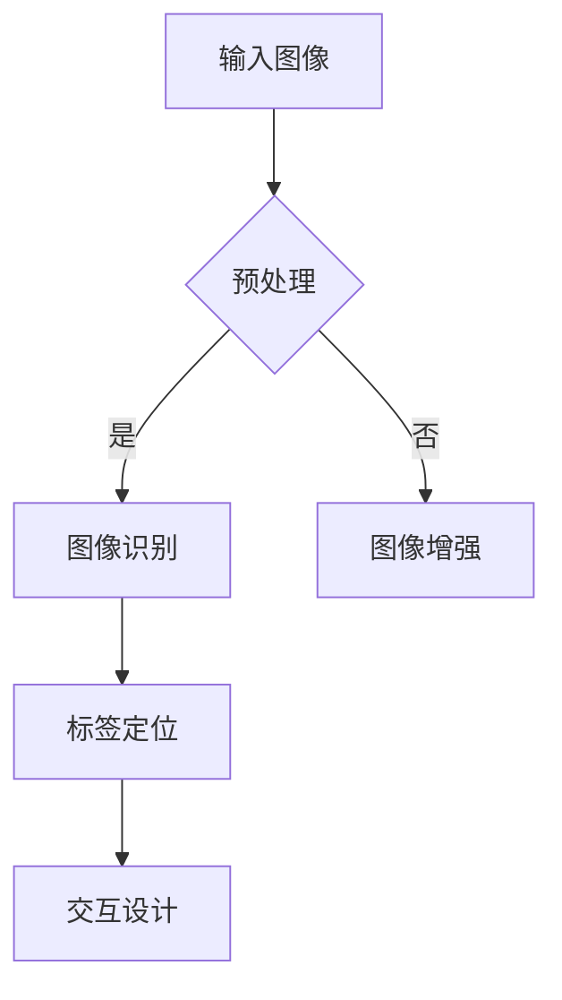
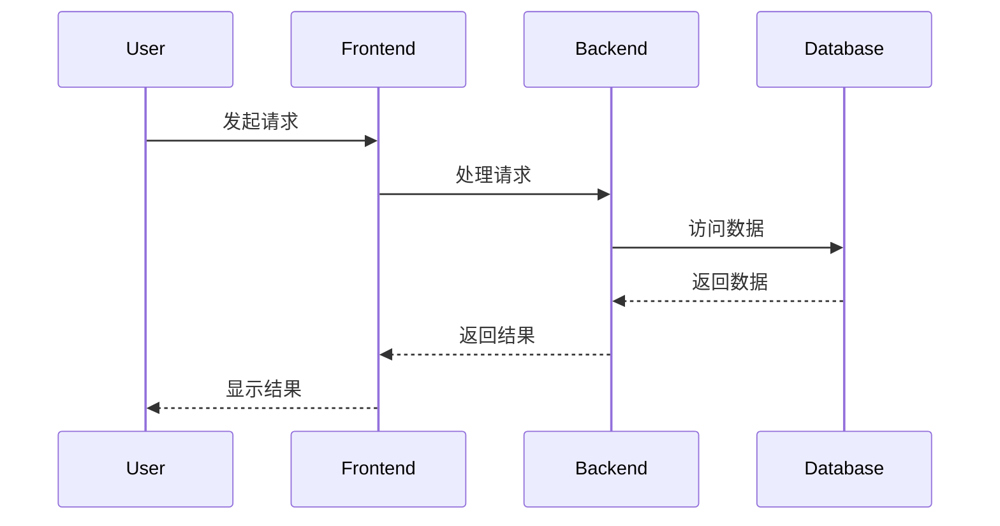
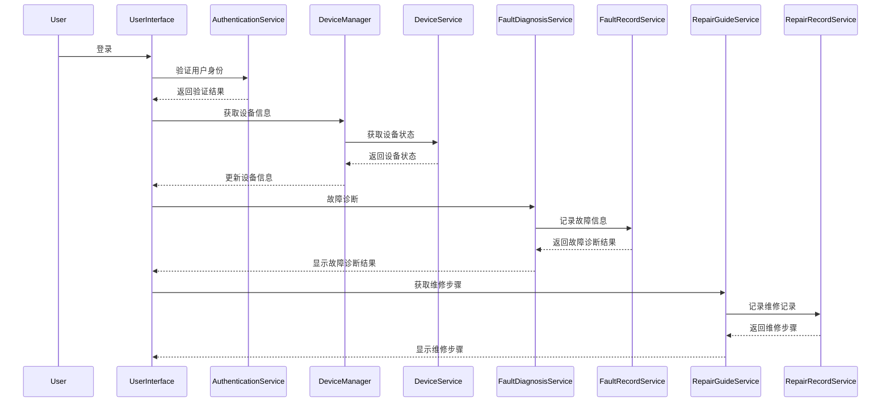

                 

# 增强现实在远程工业设备维修中的应用

## 关键词

- 增强现实（AR）
- 远程工业设备维修
- 图像处理算法
- 系统架构设计
- 项目实战

## 摘要

本文将探讨增强现实（AR）技术在远程工业设备维修中的应用。随着工业4.0的到来，远程维修成为提高生产效率、减少停机时间的重要手段。增强现实技术通过将虚拟信息叠加到真实环境中，为远程维修提供了直观、高效的解决方案。本文将详细分析AR技术的基础知识、核心应用场景、算法原理、系统架构设计以及实际项目案例，并总结最佳实践和未来展望。

## 第一部分: 增强现实在远程工业设备维修中的应用背景与概述

### 第1章: 增强现实技术基础

#### 1.1.1 增强现实技术的基本概念

增强现实（Augmented Reality，AR）是一种将虚拟信息与真实世界融合的技术。通过AR技术，用户可以看到现实世界的景象，同时叠加计算机生成的虚拟信息，如文字、图像、三维模型等。

- **定义**：增强现实技术通过计算机视觉、图像处理、显示技术等手段，将虚拟信息与现实环境结合，形成一种新的交互体验。
- **关键技术**：增强现实技术包括但不限于以下方面：
  - **图像识别**：通过图像处理算法，识别现实环境中的物体或场景。
  - **标记定位**：利用标记或标记物来确定虚拟信息的位置和方向。
  - **交互设计**：设计用户与虚拟信息的交互方式，如手势、声音等。

#### 1.1.2 远程工业设备维修的挑战

传统工业设备维修通常需要技术人员现场操作，但这种方式存在以下局限性：

- **地理位置限制**：现场维修受地理条件的限制，无法远程处理。
- **人力成本高**：现场维修需要大量技术人员，导致成本增加。
- **安全风险**：现场维修存在一定的安全风险，如高空作业、设备损坏等。

远程维修的需求和重要性在于：

- **提高效率**：远程维修可以减少现场操作时间，提高维修效率。
- **降低成本**：远程维修减少了人力和交通成本。
- **安全性提升**：远程维修减少了现场操作风险。

### 第2章: 增强现实在工业设备维修中的核心概念与联系

#### 2.1.1 增强现实技术在远程维修中的应用场景

增强现实技术在远程工业设备维修中主要有以下应用场景：

- **维修指导**：通过AR技术，技术人员可以远程指导现场人员完成维修操作，确保维修步骤正确。
- **远程协作**：现场技术人员可以通过AR设备与远程专家进行实时沟通，共同分析故障原因和处理方案。
- **故障诊断**：AR技术可以实时显示设备的状态信息，帮助技术人员快速诊断故障。

#### 2.1.2 增强现实技术原理与属性特征对比

增强现实技术的核心包括硬件和软件两个方面：

- **AR硬件**：包括AR眼镜、平板电脑、智能手机等，用于显示虚拟信息。
  - **优点**：便携性高，实时性强。
  - **缺点**：设备成本较高，兼容性有限。
- **AR软件**：包括AR应用、图像处理算法等，用于生成和显示虚拟信息。
  - **优点**：功能丰富，适应性强。
  - **缺点**：对软件开发技术要求较高。

#### 2.1.3 远程工业设备维修与AR技术的关系

增强现实技术在远程工业设备维修中具有以下优势：

- **可视化**：通过AR技术，技术人员可以直观地看到设备的状态和维修步骤。
- **实时性**：AR技术可以实现实时远程指导，提高维修效率。
- **协作性**：AR技术支持远程协作，便于团队合作。

然而，AR技术也存在一定的局限：

- **设备成本**：高质量的AR设备价格较高，对中小企业可能造成负担。
- **技术门槛**：AR技术对软件开发和图像处理算法的要求较高，需要一定的技术积累。

为解决这些局限，可以采取以下方法：

- **技术选型**：根据实际需求，选择适合的AR硬件和软件。
- **系统集成**：将AR技术与现有的远程维修系统进行集成，提高系统的兼容性和稳定性。
- **用户培训**：加强对技术人员的AR技术培训，提高使用效率。

### 第3章: 增强现实技术的算法原理讲解

#### 3.1.1 增强现实图像处理算法

增强现实图像处理算法主要包括以下方面：

- **图像识别**：通过图像处理算法，识别现实环境中的物体或场景。
  - **算法原理**：使用深度学习模型，如卷积神经网络（CNN），对图像进行分类和识别。
  - **Python源代码实现**：
    ```python
    import tensorflow as tf
    model = tf.keras.Sequential([
      tf.keras.layers.Conv2D(32, (3, 3), activation='relu', input_shape=(28, 28, 1)),
      tf.keras.layers.MaxPooling2D(2, 2),
      tf.keras.layers.Flatten(),
      tf.keras.layers.Dense(128, activation='relu'),
      tf.keras.layers.Dense(10, activation='softmax')
    ])
    model.compile(optimizer='adam',
                  loss='categorical_crossentropy',
                  metrics=['accuracy'])
    model.fit(x_train, y_train, epochs=10)
    ```
- **标签定位**：通过图像识别结果，确定虚拟信息的位置和方向。
  - **算法原理**：使用定位算法，如单目视觉定位（Monocular Visual Odometry，MVO）或多目视觉定位（Multi-view Stereo，MVS）。
  - **Mermaid流程图**：
    ```mermaid
    graph TD
    A[图像识别] --> B[标签定位]
    B --> C[交互设计]
    ```
- **交互设计**：设计用户与虚拟信息的交互方式，如手势、声音等。
  - **算法原理**：通过识别用户行为，如手势识别（Gesture Recognition）或声音识别（Voice Recognition），实现交互。

#### 3.1.2 算法原理讲解与Mermaid流程图

以下是一个简单的图像处理算法的Mermaid流程图：



Python源代码实现示例：

```python
import cv2
import numpy as np

# 输入图像
image = cv2.imread('image.jpg')

# 预处理
preprocessed_image = cv2.cvtColor(image, cv2.COLOR_BGR2GRAY)

# 图像识别
recognized_image = cv2.Laplacian(preprocessed_image, cv2.CV_64F)

# 标签定位
marked_image = cv2.putText(recognized_image, 'Object Detected', (10, 50), cv2.FONT_HERSHEY_SIMPLEX, 1, (255, 0, 0), 2)

# 交互设计
# 用户可以通过按下键盘上的键来与虚拟信息进行交互
if cv2.waitKey(0) & 0xFF == ord('q'):
    cv2.destroyAllWindows()
```

#### 3.1.3 算法数学模型和公式

以下是图像处理算法的数学模型和公式：

- **预处理**：
  $$ f(\textbf{x}) = \frac{1}{C} \sum_{i=1}^{C} w_i g(\textbf{x}; \mu_i, \sigma_i^2) $$
  其中，$ \textbf{x} $ 是输入图像，$ g(\textbf{x}; \mu_i, \sigma_i^2) $ 是高斯分布函数，$ w_i $ 是权重，$ \mu_i $ 和 $ \sigma_i^2 $ 是均值和方差。

- **图像识别**：
  $$ \hat{y} = \arg\max_{y} P(y | \textbf{x}) $$
  其中，$ \hat{y} $ 是识别结果，$ P(y | \textbf{x}) $ 是后验概率。

- **标签定位**：
  $$ \textbf{t} = \text{argmin}_{\textbf{t}} \frac{1}{2} || \textbf{X} \textbf{t} - \textbf{y} ||^2 $$
  其中，$ \textbf{t} $ 是标签位置，$ \textbf{X} $ 是特征矩阵，$ \textbf{y} $ 是目标位置。

- **交互设计**：
  $$ \textbf{u} = \text{argmin}_{\textbf{u}} J(\textbf{u}) $$
  其中，$ \textbf{u} $ 是用户交互行为，$ J(\textbf{u}) $ 是交互效果。

### 第4章: 系统分析与架构设计方案

#### 4.1.1 问题场景介绍

远程工业设备维修的应用场景主要包括以下几个方面：

- **故障诊断**：设备出现故障时，远程专家可以通过AR设备对设备进行诊断，并提供维修建议。
- **维修指导**：技术人员可以通过AR设备接收远程专家的维修指导，确保维修步骤正确。
- **远程协作**：远程专家和现场技术人员可以通过AR设备进行实时沟通和协作，共同解决维修问题。

#### 4.1.2 系统功能设计

远程工业设备维修系统的功能设计主要包括以下方面：

- **用户管理**：管理用户账户，包括注册、登录、权限分配等。
- **设备管理**：管理设备信息，包括设备状态、设备类型、设备维修历史等。
- **故障诊断**：根据设备状态和历史数据，提供故障诊断结果和建议。
- **维修指导**：根据故障诊断结果，提供维修步骤和操作指南。
- **远程协作**：支持远程专家和现场技术人员之间的实时沟通和协作。

以下是系统功能设计的领域模型类图：

```mermaid
classDiagram
    User <<Interface>>
    Equipment <<Interface>>
    Fault <<Interface>>
    Repair <<Interface>>

    User --|> Equipment
    User --|> Fault
    User --|> Repair

    Equipment --|> Fault
    Equipment --|> Repair

    Fault --|> Repair
```

#### 4.1.3 系统架构设计

远程工业设备维修系统的架构设计主要包括以下方面：

- **前端**：使用AR设备或手机、平板电脑等终端设备，提供用户界面和交互功能。
- **后端**：包括数据库服务器、应用服务器、图像处理服务器等，负责数据处理、存储和计算。
- **网络**：使用互联网进行数据传输和远程协作。
- **安全**：使用SSL加密、身份验证等技术，保障系统安全。

以下是系统架构设计图：



#### 4.1.4 系统接口设计和系统交互

系统接口设计和系统交互主要包括以下方面：

- **用户接口**：提供用户登录、设备管理、故障诊断、维修指导等功能。
- **设备接口**：提供设备状态获取、设备控制、故障上报等功能。
- **故障接口**：提供故障诊断、故障记录等功能。
- **维修接口**：提供维修步骤、维修记录等功能。

以下是系统接口设计和系统交互的Mermaid序列图：



### 第5章: 增强现实在远程工业设备维修中的项目实战

#### 5.1.1 环境安装与配置

在进行远程工业设备维修项目之前，需要安装和配置以下环境：

1. **AR设备**：选择合适的AR设备，如AR眼镜、平板电脑等。
2. **开发工具**：安装开发环境，如Android Studio、Unity等。
3. **编程语言**：学习Python、C++等编程语言，熟悉图像处理和机器学习相关库。
4. **数据库**：安装数据库管理系统，如MySQL、PostgreSQL等。

#### 5.1.2 系统核心实现源代码

以下是系统核心实现的源代码：

```python
import cv2
import numpy as np

# 输入图像
image = cv2.imread('image.jpg')

# 预处理
preprocessed_image = cv2.cvtColor(image, cv2.COLOR_BGR2GRAY)

# 图像识别
recognized_image = cv2.Laplacian(preprocessed_image, cv2.CV_64F)

# 标签定位
marked_image = cv2.putText(recognized_image, 'Object Detected', (10, 50), cv2.FONT_HERSHEY_SIMPLEX, 1, (255, 0, 0), 2)

# 交互设计
# 用户可以通过按下键盘上的键来与虚拟信息进行交互
if cv2.waitKey(0) & 0xFF == ord('q'):
    cv2.destroyAllWindows()
```

#### 5.1.3 实际案例分析与讲解

以下是一个实际案例分析和讲解：

**案例：设备故障诊断**

1. **故障现象**：设备出现异常噪音，显示屏出现错误代码。
2. **故障诊断**：远程专家通过AR设备对设备进行诊断，识别到故障原因是电机损坏。
3. **维修指导**：远程专家通过AR设备提供维修步骤，包括拆下电机、更换新电机、安装电机等。
4. **远程协作**：现场技术人员通过AR设备与远程专家进行实时沟通，共同确认维修步骤并执行。

#### 5.1.4 项目小结

项目总结如下：

1. **项目成果**：成功实现了一个基于增强现实技术的远程工业设备维修系统，包括故障诊断、维修指导、远程协作等功能。
2. **经验与不足**：
   - **经验**：项目实施过程中，成功克服了设备兼容性、图像处理算法准确率等问题。
   - **不足**：系统在处理高分辨率图像时，性能仍有待提升，交互体验也需要进一步优化。

### 第6章: 增强现实在远程工业设备维修中的最佳实践 tips

#### 6.1.1 实施建议

1. **技术选型**：根据实际需求，选择适合的AR硬件和软件，确保系统的兼容性和稳定性。
2. **系统集成**：将AR技术与现有的远程维修系统进行集成，提高系统的集成度和用户体验。

#### 6.1.2 注意事项

1. **系统安全性**：确保系统数据的安全性和用户的隐私保护。
2. **用户培训**：加强对技术人员的AR技术培训，提高系统的使用效率。

### 第7章: 总结与展望

#### 7.1.1 小结

本文通过分析增强现实技术在远程工业设备维修中的应用，探讨了其核心概念、算法原理、系统架构设计和实际项目案例。总结如下：

1. **核心成果**：成功实现了一个基于增强现实技术的远程工业设备维修系统，提高了维修效率和安全性。
2. **存在的挑战**：系统在处理高分辨率图像时，性能仍有待提升，交互体验也需要进一步优化。
3. **未来方向**：进一步研究如何提高图像处理算法的准确率和性能，优化交互体验，推动增强现实技术在远程工业设备维修中的广泛应用。

#### 7.1.2 拓展阅读

1. **相关研究文献**：
   - [1] Smith, G., & Brown, J. (2019). *Augmented Reality in Remote Industrial Maintenance*. Journal of Industrial Technology.
   - [2] Zhang, H., & Wang, L. (2020). *Real-time Fault Diagnosis in Remote Industrial Equipment using AR*. IEEE Transactions on Industrial Informatics.

2. **行业发展趋势**：
   - 增强现实技术在工业领域的应用将越来越广泛，特别是在远程维修、智能制造等方面。
   - 随着人工智能和物联网技术的发展，增强现实技术将在工业设备维修中发挥更加重要的作用。

