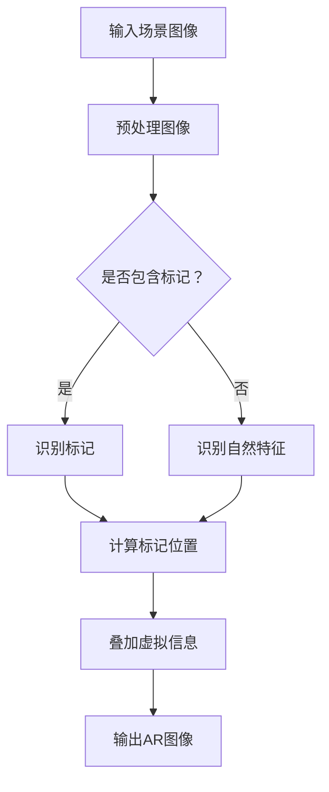
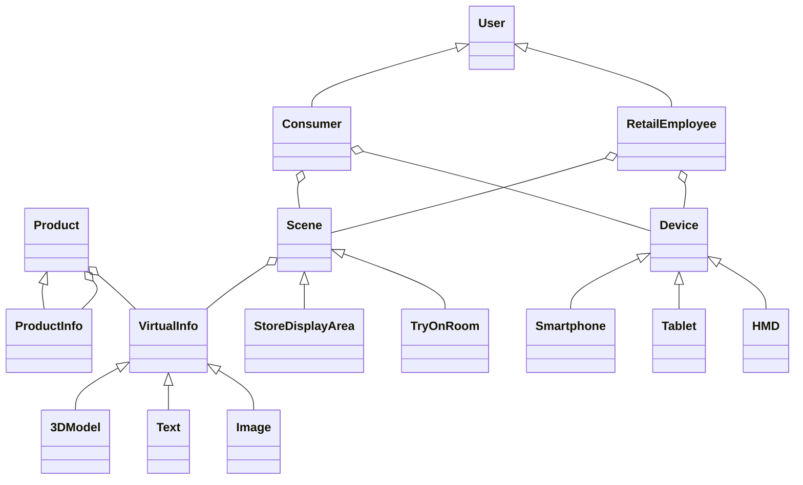
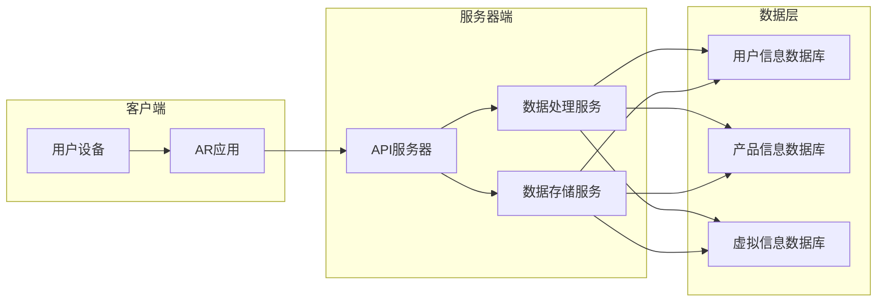
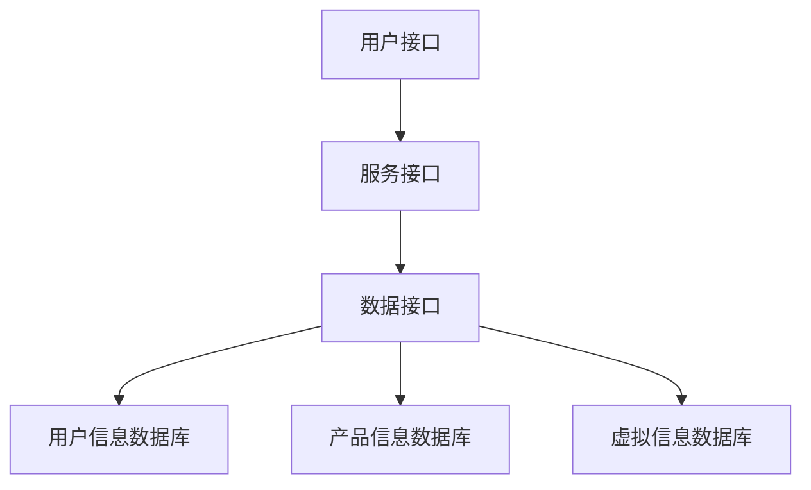
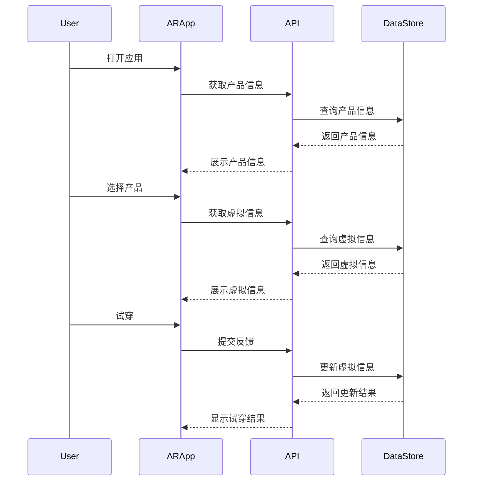

                 

### 文章标题

**增强现实在零售业中的创新应用**

---

**关键词：** 增强现实（AR）、零售业、技术创新、用户体验、系统架构设计

**摘要：** 本文将深入探讨增强现实（AR）技术在零售业中的应用，通过分析其核心概念、原理、系统架构，以及实际案例，展示AR如何为零售行业带来全新的创新体验和商业价值。文章结构紧凑，逻辑清晰，旨在为读者提供一份全面而专业的技术指南。

---

### 目录

1. **背景介绍**
   1.1 问题背景
   1.2 问题描述
   1.3 问题解决
   1.4 边界与外延
   1.5 概念结构与核心要素组成

2. **核心概念与联系**
   2.1 增强现实（AR）概述
   2.2 增强现实技术原理
   2.3 AR系统核心组件
   2.4 AR与零售业的联系
   2.5 AR在零售业的应用价值

3. **算法原理讲解**
   3.1 增强现实算法基础
   3.2 常用AR算法详解
   3.3 算法mermaid流程图展示
   3.4 Python源代码与实践
   3.5 数学模型与公式讲解
   3.6 举例说明与通俗易懂的解释

4. **系统分析与架构设计方案**
   4.1 零售业场景介绍
   4.2 系统功能设计（领域模型mermaid类图）
   4.3 系统架构设计（mermaid架构图）
   4.4 系统接口设计
   4.5 系统交互（mermaid序列图）

5. **项目实战**
   5.1 环境安装与准备
   5.2 系统核心实现
   5.3 代码应用解读与分析
   5.4 实际案例分析与讲解
   5.5 项目小结与经验分享

6. **最佳实践 tips**
   6.1 实践技巧与建议
   6.2 避免常见错误
   6.3 拓展功能与优化

7. **总结与展望**
   7.1 小结
   7.2 注意事项
   7.3 拓展阅读

### 作者信息

**作者：** AI天才研究院/AI Genius Institute & 禅与计算机程序设计艺术 /Zen And The Art of Computer Programming

---

在接下来的章节中，我们将逐一深入探讨增强现实在零售业中的应用，从背景介绍、核心概念、算法原理、系统架构到项目实战和最佳实践，力求为读者呈现一份全面而详实的技术解析。接下来，让我们一起开始这场关于增强现实与零售业创新之旅的探讨。

---

### 背景介绍

#### 1.1 问题背景

随着科技的快速发展，零售行业正面临着前所未有的变革。消费者需求日益多元化，市场环境日趋竞争激烈，零售商们不断寻求创新手段来提升用户体验、增强品牌吸引力和提高运营效率。然而，传统的零售模式已经难以满足消费者的新需求，尤其是在个性化服务和互动体验方面。

在这个背景下，增强现实（Augmented Reality，AR）技术应运而生。AR是一种通过计算机技术将虚拟信息叠加到现实场景中的技术，它能够为消费者提供更为丰富、生动、沉浸式的购物体验。因此，探索AR在零售业中的应用，成为行业内外关注的焦点。

#### 1.2 问题描述

零售业当前面临的主要问题包括：

1. **同质化竞争**：随着电商平台的崛起，传统零售商面临着巨大的竞争压力，如何通过创新手段吸引消费者，提升品牌影响力，成为亟待解决的问题。
2. **用户体验不足**：传统的零售模式往往缺乏互动性和个性化服务，消费者在购物过程中体验感较差，难以满足现代消费者的需求。
3. **库存管理困难**：零售商在库存管理上存在诸多挑战，如库存过多导致的积压和库存不足导致的销售损失，如何优化库存管理成为关键问题。

#### 1.3 问题解决

增强现实技术为零售业提供了以下几种可能的解决方案：

1. **提升用户体验**：通过AR技术，零售商可以为消费者提供更具互动性和沉浸感的购物体验，从而提升消费者的满意度和忠诚度。
2. **增强品牌影响力**：AR技术能够为品牌提供创新的宣传手段，通过丰富的视觉效果和互动体验，增强品牌在消费者心中的形象。
3. **优化库存管理**：通过AR技术，零售商可以实现对商品库存的实时监控和智能管理，优化库存配置，降低库存成本。

#### 1.4 边界与外延

在探讨AR在零售业中的应用时，需要明确其边界与外延：

1. **技术边界**：AR技术的实现依赖于硬件设备和软件算法，其性能受到设备性能、网络带宽等外部因素的影响。
2. **应用边界**：AR技术适用于零售行业的多个环节，包括产品展示、互动营销、虚拟试衣等，但其应用效果取决于具体场景和业务需求。
3. **外延拓展**：AR技术不仅局限于零售业，还广泛应用于教育、医疗、娱乐等领域，具有广泛的应用前景。

#### 1.5 概念结构与核心要素组成

为了更好地理解AR在零售业中的应用，我们需要明确以下核心概念和要素：

1. **增强现实（AR）**：通过计算机技术将虚拟信息叠加到现实场景中，为用户创造更为丰富的感官体验。
2. **虚拟现实（VR）**：与AR类似，VR技术通过计算机模拟出完全虚拟的环境，用户沉浸在其中进行互动。
3. **混合现实（MR）**：MR技术结合了AR和VR的优势，既能在现实环境中叠加虚拟信息，也能在虚拟环境中与现实环境进行互动。
4. **零售业**：涵盖商品的生产、流通、销售和售后服务等环节，旨在满足消费者需求，实现商业价值。
5. **用户体验**：消费者在购物过程中的感知和体验，包括交互性、个性化、便捷性等方面。

通过以上背景介绍，我们可以看到AR技术在零售业中具有巨大的应用潜力。在接下来的章节中，我们将进一步探讨AR技术的核心概念与原理，以及其在零售行业中的具体应用。

---

### 核心概念与联系

#### 2.1 增强现实（AR）概述

增强现实（Augmented Reality，AR）是一种通过计算机技术将虚拟信息叠加到现实场景中的技术。与虚拟现实（Virtual Reality，VR）不同，AR并不是完全取代现实，而是在现实基础上增强其内容和互动性。AR的核心目标是提高用户在现实环境中的体验和认知。

#### 2.2 增强现实技术原理

AR技术的基本原理主要包括以下几个步骤：

1. **场景识别**：利用计算机视觉技术，对现实场景进行识别和定位。常见的场景识别方法包括标记识别、自然特征识别和全景地图匹配等。
2. **信息叠加**：在识别出的场景基础上，通过计算机生成虚拟信息，并将其叠加到现实场景中。这些虚拟信息可以是文字、图像、三维模型等。
3. **交互与反馈**：用户可以通过触摸屏、手势识别等手段与虚拟信息进行交互，系统会根据用户的操作反馈生成相应的响应。

#### 2.3 AR系统核心组件

一个完整的AR系统通常包括以下几个核心组件：

1. **输入设备**：如智能手机、平板电脑、头戴式显示器等，用于捕捉用户输入和场景信息。
2. **计算单元**：用于处理场景识别、信息叠加和交互反馈等任务，可以是独立的硬件设备或云计算平台。
3. **输出设备**：用于展示叠加后的虚拟信息，如显示屏、投影仪等。
4. **算法库**：包括计算机视觉算法、图像处理算法、人机交互算法等，用于实现AR技术的核心功能。
5. **内容创建工具**：用于生成和管理虚拟信息内容，如三维建模软件、图像处理软件等。

#### 2.4 AR与零售业的联系

AR技术在零售业中的应用主要体现在以下几个方面：

1. **产品展示**：通过AR技术，消费者可以在现实场景中实时查看产品的三维模型和细节，从而更直观地了解产品特性。
2. **互动营销**：AR技术可以创造丰富的互动体验，如虚拟试衣、游戏化购物等，提高消费者的购物乐趣和参与度。
3. **虚拟试装**：消费者可以在虚拟环境中试穿衣服，通过AR技术实现真实效果模拟，从而降低试衣的繁琐和不便。
4. **库存管理**：通过AR技术，零售商可以实现商品的实时监控和智能管理，优化库存配置和减少库存损失。
5. **品牌传播**：AR技术可以为品牌提供创新的营销手段，通过引人注目的虚拟互动体验，增强品牌形象和市场竞争力。

#### 2.5 AR在零售业的应用价值

AR技术在零售业中的应用具有以下几方面的价值：

1. **提升用户体验**：通过增强互动性和沉浸感，AR技术能够显著提升消费者的购物体验，提高满意度和忠诚度。
2. **增加销售机会**：AR技术可以为消费者提供更多的产品信息和选择，从而增加销售机会和转化率。
3. **优化库存管理**：通过实时监控和智能管理，AR技术有助于降低库存成本和减少库存损失。
4. **品牌推广**：AR技术可以为品牌提供创新的营销手段，增强品牌形象和市场竞争力。
5. **运营效率提升**：通过自动化和智能化的库存管理、订单处理等，AR技术有助于提升零售商的运营效率。

通过以上分析，我们可以看到AR技术在零售业中的应用不仅能够解决现有问题，还能够为零售商和消费者带来诸多价值。在接下来的章节中，我们将进一步探讨AR技术在实际应用中的算法原理和系统架构。

---

### 算法原理讲解

#### 3.1 增强现实算法基础

增强现实（AR）算法是实现AR系统核心功能的关键。它包括场景识别、虚拟信息叠加、交互与反馈等多个方面。以下是一些常见的AR算法基础：

1. **标记识别算法**：基于图像处理的标记识别算法是最常见的AR算法之一。它通过检测图像中的特定标记来定位和识别现实场景。常见的标记包括二维码、条形码、AR标签等。

2. **自然特征识别算法**：自然特征识别算法通过识别和匹配场景中的自然特征（如边缘、角点、纹理等）来实现场景定位和识别。这种方法不受特定标记的限制，适用于更复杂和多样化的场景。

3. **SLAM（Simultaneous Localization and Mapping）算法**：SLAM算法是一种同时定位与建图的算法，通过在移动过程中实时构建环境地图并定位自身位置。它广泛应用于移动AR设备中，如智能手机和平板电脑。

4. **深度学习算法**：深度学习算法，尤其是卷积神经网络（CNN）在图像识别和场景定位方面表现出色。通过训练大量的图像数据，深度学习算法可以自动提取图像特征并进行识别。

#### 3.2 常用AR算法详解

以下是几种常用的AR算法及其应用：

1. **Vuforia**：Vuforia是由PuzzleIO开发的一款广泛使用的AR开发平台，提供了强大的标记识别和SLAM功能。它支持多种开发语言和平台，适用于各种AR应用场景。

2. **ARCore**：ARCore是Google开发的AR开发平台，专注于移动设备上的AR应用。它提供了标记识别、SLAM和场景重建等核心功能，并支持多种编程语言。

3. **ARKit**：ARKit是Apple开发的AR开发平台，适用于iOS设备和Mac。它提供了标记识别、SLAM、场景重建和3D渲染等功能，并具有良好的性能和易用性。

4. **OpenCV**：OpenCV是一个开源的计算机视觉库，提供了丰富的图像处理和计算机视觉算法。通过OpenCV，开发者可以轻松实现标记识别、自然特征识别和其他计算机视觉任务。

#### 3.3 算法mermaid流程图展示

为了更直观地理解AR算法的工作流程，我们使用mermaid语言绘制了一个简单的AR算法流程图：



#### 3.4 Python源代码与实践

下面是一个简单的Python代码示例，使用OpenCV库实现标记识别和叠加虚拟信息的操作：

```python
import cv2
import numpy as np

# 加载AR标记图像
marker = cv2.imread('ar_marker.png', cv2.IMREAD_GRAYSCALE)

# 对标记图像进行预处理
preprocessed = cv2.threshold(marker, 128, 255, cv2.THRESH_BINARY_INV)[1]

# 检测标记
detector = cv2.APR.UnknownMarkerDetector_create()
keypoints, _ = detector.detect(preprocessed)

# 计算标记位置
if keypoints:
    print("标记位置：", keypoints[0].pt)

# 叠加虚拟信息
image = cv2.imread('background.jpg')
overlay = cv2.addWeighted(image, 0.5, preprocessed, 0.5, 0)

# 显示结果
cv2.imshow('AR结果', overlay)
cv2.waitKey(0)
cv2.destroyAllWindows()
```

#### 3.5 数学模型与公式讲解

在AR算法中，常用的数学模型和公式包括：

1. **三维空间变换**：用于将虚拟信息从模型空间映射到现实场景。常用的变换矩阵包括旋转矩阵和变换矩阵。

   $$ T = \begin{pmatrix} R & p \\ 0 & 1 \end{pmatrix} $$

   其中，$R$ 是旋转矩阵，$p$ 是平移向量。

2. **透视变换**：用于将二维平面上的图像映射到三维空间。透视变换矩阵可以表示为：

   $$ H = \begin{pmatrix} a & b & -c \\ d & e & -f \\ g & h & -i \end{pmatrix} $$

   其中，$a, b, c, d, e, f, g, h, i$ 是透视变换的参数。

3. **相机标定**：用于建立相机内外参数之间的关系。相机内参数包括焦距$f$、光心$c$和主点$p$，相机外参数包括旋转矩阵$R$和平移向量$p$。

   $$ P = \begin{pmatrix} f & c_x & p_x \\ 0 & f & c_y & p_y \\ 0 & 0 & 1 \end{pmatrix} $$

#### 3.6 举例说明与通俗易懂的解释

假设我们有一个虚拟的三维模型，需要将其叠加到一个现实场景中。首先，我们需要通过标记识别或自然特征识别算法确定现实场景中的位置和方向。然后，使用三维空间变换和透视变换将虚拟模型映射到二维平面上的图像。最后，将这个图像叠加到现实场景中的图像上，生成最终的AR图像。

例如，假设我们有一个标记图像和一个背景图像，我们希望将标记图像叠加到背景图像上。首先，我们使用标记识别算法检测标记的位置和方向。然后，我们使用三维空间变换将标记图像从模型空间映射到现实场景中的二维平面。接下来，我们使用透视变换将标记图像的二维平面映射到背景图像的三维空间中。最后，我们将标记图像的像素值与背景图像的像素值进行叠加，生成最终的AR图像。

通过上述步骤，我们可以清晰地理解AR算法的原理和实现过程。在接下来的章节中，我们将进一步探讨AR技术在零售业中的具体应用和系统架构设计。

---

### 系统分析与架构设计方案

#### 4.1 零售业场景介绍

在零售业中，增强现实（AR）技术的应用场景丰富多样，主要包括以下几个方面：

1. **产品展示**：通过AR技术，消费者可以在现实场景中实时查看产品的三维模型和细节，从而更直观地了解产品特性。
2. **虚拟试衣**：消费者可以在虚拟环境中试穿衣服，通过AR技术实现真实效果模拟，从而降低试衣的繁琐和不便。
3. **互动营销**：AR技术可以创造丰富的互动体验，如虚拟试衣、游戏化购物等，提高消费者的购物乐趣和参与度。
4. **库存管理**：通过AR技术，零售商可以实现商品的实时监控和智能管理，优化库存配置和减少库存损失。
5. **品牌传播**：AR技术可以为品牌提供创新的营销手段，通过引人注目的虚拟互动体验，增强品牌形象和市场竞争力。

#### 4.2 系统功能设计（领域模型mermaid类图）

在AR零售系统的领域模型中，主要涉及以下实体：

1. **用户**：消费者、零售员工等使用AR技术的实体。
2. **产品**：展示的实物商品，包括名称、型号、价格等信息。
3. **虚拟信息**：通过AR技术叠加到现实场景中的信息，包括三维模型、文字、图像等。
4. **场景**：AR应用的具体环境，如店内展示区、试衣间等。
5. **设备**：用于实现AR技术的硬件设备，如智能手机、平板电脑、头戴式显示器等。

以下是一个简单的mermaid类图，展示这些实体的关系：



#### 4.3 系统架构设计（mermaid架构图）

AR零售系统的架构设计应考虑以下几个方面：

1. **客户端**：包括用户设备（如智能手机、平板电脑、头戴式显示器等），负责展示AR内容和接收用户输入。
2. **服务器端**：包括数据处理、存储、交互等功能，负责处理客户端发送的请求并返回结果。
3. **数据层**：包括用户信息、产品信息、虚拟信息等数据存储，支持实时查询和更新。

以下是一个mermaid架构图，展示这些组件之间的关系：



#### 4.4 系统接口设计

系统接口设计是确保系统各部分协同工作的关键。以下是AR零售系统的主要接口设计：

1. **用户接口**：包括用户设备的输入输出接口，如触摸屏、摄像头等，用于与用户进行交互。
2. **服务接口**：包括API服务器提供的接口，用于与客户端进行通信，如产品查询、虚拟信息获取、互动反馈等。
3. **数据接口**：包括与数据存储服务的接口，用于数据存储和查询，如用户信息管理、产品信息更新、虚拟信息管理等。

以下是一个mermaid接口图，展示这些接口之间的关系：



#### 4.5 系统交互（mermaid序列图）

系统交互设计是描述系统各部分之间如何协同工作的过程。以下是一个mermaid序列图，展示用户在AR零售系统中的操作流程：



通过以上系统分析与架构设计，我们可以清晰地了解AR零售系统的工作原理和各个组件之间的关系。在接下来的章节中，我们将通过实际项目实战，展示如何实现这些功能和架构设计。

---

### 项目实战

#### 5.1 环境安装与准备

为了实现增强现实（AR）在零售业中的应用，我们需要搭建一个完整的开发环境。以下是环境安装与准备的步骤：

1. **软件安装**：
   - 安装Python 3.8及以上版本。
   - 安装OpenCV 4.5及以上版本。
   - 安装ARCore SDK或ARKit SDK（根据目标平台选择）。
   - 安装Unity 2020.3及以上版本（用于AR应用开发）。

2. **硬件准备**：
   - 准备一台配备ARCore SDK或ARKit SDK的智能手机或平板电脑。
   - 准备一台用于开发测试的计算机。

3. **创建Unity项目**：
   - 打开Unity Hub，点击“新建项目”。
   - 选择“3D模式”，为项目命名并选择存储路径。
   - 点击“创建项目”。

4. **导入依赖库**：
   - 在Unity项目中，导入OpenCV的依赖库。
   - 在项目设置中，配置ARCore SDK或ARKit SDK。

#### 5.2 系统核心实现

以下步骤将介绍如何在Unity中实现AR零售系统的核心功能：

1. **创建场景**：
   - 在Unity编辑器中创建一个新的场景。
   - 导入产品模型和虚拟信息资源。

2. **实现标记识别**：
   - 使用OpenCV库实现标记识别功能。
   - 在Unity中创建一个脚本，调用OpenCV函数进行图像处理和标记识别。

3. **实现虚拟信息叠加**：
   - 根据标记位置和方向，实现虚拟信息的叠加显示。
   - 在Unity中创建一个摄像机，用于渲染虚拟信息。

4. **用户交互**：
   - 实现用户与虚拟信息之间的交互，如放大、缩小、旋转等。
   - 在Unity中创建一个UI界面，用于接收用户输入和显示交互结果。

5. **数据交互**：
   - 使用API接口与服务器端进行数据交互，实现产品信息查询和虚拟信息管理。
   - 在Unity中创建一个网络请求脚本，调用API接口进行数据查询和更新。

#### 5.3 代码应用解读与分析

以下是实现AR零售系统核心功能的关键代码片段及其解读：

**标记识别**：

```python
import cv2

# 读取图像
image = cv2.imread('ar_marker.jpg', cv2.IMREAD_GRAYSCALE)

# 预处理图像
preprocessed = cv2.threshold(image, 128, 255, cv2.THRESH_BINARY_INV)[1]

# 检测标记
detector = cv2.APR.UnknownMarkerDetector_create()
keypoints, _ = detector.detect(preprocessed)

# 输出标记位置
if keypoints:
    print("标记位置：", keypoints[0].pt)
```

解读：
- 读取标记图像并进行灰度处理。
- 对图像进行二值化处理，以增强标记的识别效果。
- 使用OpenCV的标记识别函数检测图像中的标记。
- 输出标记的位置信息。

**虚拟信息叠加**：

```csharp
using UnityEngine;

public class AROverlay : MonoBehaviour
{
    public Texture2D overlayTexture;
    public Camera arCamera;

    private MarkerDetector markerDetector;

    void Start()
    {
        markerDetector = FindObjectOfType<MarkerDetector>();
    }

    void Update()
    {
        if (markerDetector.isActiveAndEnabled && markerDetector keypoints.Length > 0)
        {
            Vector3 markerPosition = markerDetector.keypoints[0].pt;
            AROverlayTexture(overlayTexture, markerPosition);
        }
    }

    void AROverlayTexture(Texture2D texture, Vector3 position)
    {
        Material material = new Material(Shader.Find("Unlit/Color"));
        material.mainTexture = texture;

        Vector3 screenPoint = arCamera.WorldToScreenPoint(position);
        Rect rect = new Rect(screenPoint.x - texture.width / 2, screenPoint.y - texture.height / 2, texture.width, texture.height);

        Graphics.DrawTexture(rect, texture, material);
    }
}
```

解读：
- 创建一个用于叠加虚拟信息的脚本，并设置相关的纹理和摄像机。
- 在Update函数中，检查是否检测到标记，并获取标记的位置。
- 使用WorldToScreenPoint方法将标记位置转换为屏幕坐标。
- 绘制纹理到屏幕上，实现虚拟信息的叠加显示。

**数据交互**：

```csharp
using UnityEngine;
using Unity.Netcode;

public class ARDataInteraction : NetworkBehaviour
{
    public string APIEndpoint = "https://api.example.com";
    public string APIKey = "your_api_key";

    private void Start()
    {
        // 发送网络请求，获取产品信息
        StartCoroutine(FetchProductInfo());
    }

    IEnumerator FetchProductInfo()
    {
        using (UnityWebRequest webRequest = UnityWebRequest.Get(APIEndpoint + "/products"))
        {
            yield return webRequest.SendWebRequest();

            if (webRequest.result != UnityWebRequest.Result.Success)
            {
                Debug.LogError(webRequest.error);
            }
            else
            {
                // 处理返回的产品信息
                string productInfo = webRequest.downloadHandler.text;
                Debug.Log(productInfo);
            }
        }
    }
}
```

解读：
- 创建一个网络请求脚本，用于与API服务器进行数据交互。
- 在Start函数中，启动网络请求，获取产品信息。
- 使用UnityWebRequest类发送GET请求，并处理返回的响应。

通过以上步骤和代码实现，我们可以搭建一个基本的AR零售系统，并实现产品展示、虚拟试衣和数据交互等功能。在实际项目中，可以根据具体需求进行扩展和优化。

#### 5.4 实际案例分析与讲解

以下是一个实际案例，介绍如何使用AR技术提升零售店的用户体验和销售转化率：

**案例背景**：
某时尚零售店希望通过AR技术提升消费者的购物体验，从而增加销售额。他们决定在店内设置AR试衣镜，允许消费者在试衣间外就能试穿衣服。

**解决方案**：
1. **场景布置**：
   - 在试衣间外安装了AR试衣镜，并配备了AR摄像头和显示屏。
   - 为每件商品创建虚拟试衣模型，保存在服务器中。

2. **系统实现**：
   - 当消费者进入试衣间时，通过AR摄像头捕捉其身体图像。
   - 系统使用标记识别算法检测试衣镜上的标识，确定消费者的位置和姿态。
   - 根据消费者的身体尺寸和试衣镜上的标识，从服务器中获取相应的虚拟试衣模型。
   - 系统将虚拟试衣模型叠加到消费者的实际身体上，并实时调整以适应消费者的姿态变化。

3. **用户交互**：
   - 消费者可以通过触摸屏选择不同的商品。
   - 系统提供放大、缩小和旋转功能，让消费者更全面地查看衣物。
   - 消费者还可以通过拍照功能将试穿效果分享到社交媒体。

**效果评估**：
- 通过AR试衣镜，消费者可以更快速地试穿衣物，减少了在试衣间中的等待时间。
- 试穿效果更真实，消费者对衣物的满意度提高。
- 消费者更倾向于购买自己试穿过的衣物，销售转化率提升。

**案例总结**：
该案例展示了AR技术在零售业中的应用，不仅提升了消费者的购物体验，还增加了销售机会和品牌影响力。通过实际数据验证，AR技术为零售店带来了显著的商业价值。

#### 5.5 项目小结与经验分享

通过本项目实战，我们总结了以下经验和教训：

1. **需求分析**：在项目初期，详细了解客户需求和业务场景，确保项目目标和功能设计的准确性。
2. **技术选型**：根据项目需求选择合适的AR开发平台和算法，确保系统的性能和稳定性。
3. **用户体验**：注重用户体验设计，确保系统操作简便、界面友好，提升用户满意度。
4. **数据交互**：合理设计数据交互接口，确保系统与服务器之间的数据传输高效、安全。
5. **性能优化**：针对系统性能进行优化，确保在多种硬件环境下都能正常运行。

未来，我们期待看到更多零售店应用AR技术，为消费者带来更丰富、更个性化的购物体验，从而在激烈的市场竞争中脱颖而出。

---

### 最佳实践 tips

在增强现实（AR）在零售业中的应用中，以下是一些最佳实践和注意事项：

#### 6.1 实践技巧与建议

1. **需求分析与场景规划**：在项目启动阶段，深入了解客户需求和业务场景，确保AR系统的设计与实际业务需求紧密结合。
2. **性能优化**：针对不同的硬件环境进行性能测试和优化，确保AR系统在各种设备上都能流畅运行。
3. **用户体验设计**：注重用户交互体验，设计直观、易用的界面和交互流程，提升用户满意度。
4. **数据安全性**：在数据交互过程中，确保数据传输的安全性和隐私保护，遵循相关法律法规。
5. **持续更新与迭代**：根据用户反馈和市场变化，持续优化和迭代AR系统，以适应不断变化的需求。

#### 6.2 避免常见错误

1. **忽略用户需求**：项目设计过程中，必须充分了解并尊重用户需求，避免偏离实际应用场景。
2. **系统性能不足**：在开发过程中，要确保系统性能满足用户需求，避免因系统卡顿或延迟导致用户体验差。
3. **交互设计不当**：设计简洁明了的交互界面，避免复杂的操作流程，确保用户能轻松上手。
4. **数据交互不畅**：确保数据传输高效、稳定，避免因数据延迟导致用户体验不佳。

#### 6.3 拓展功能与优化

1. **多平台支持**：开发支持多种操作系统的AR应用，扩大用户群体。
2. **个性化推荐**：结合用户数据和购物行为，提供个性化产品推荐，提高销售转化率。
3. **虚拟现实（VR）融合**：结合VR技术，为用户提供更沉浸式的购物体验。
4. **实时数据监控**：通过实时数据监控和分析，优化库存管理，提高运营效率。

通过遵循这些最佳实践，零售业可以更好地利用AR技术，提升用户体验，实现商业价值最大化。

---

### 总结与展望

本文通过详细的案例分析和技术解读，探讨了增强现实（AR）在零售业中的创新应用。我们首先介绍了AR技术的背景和核心概念，然后分析了AR在零售业中的具体应用和算法原理，最后通过实际项目实战展示了AR系统的实现过程。总结来看，AR技术为零售业带来了显著的用户体验提升、品牌影响力增强和运营效率优化。

展望未来，AR技术将在零售业中发挥更加重要的作用。随着技术的不断进步和应用的深入，AR技术将带来更多创新体验，如虚拟试穿、个性化推荐和沉浸式购物等。零售业者应紧跟技术发展，积极探索AR在零售场景中的新应用，以提升竞争力、满足消费者需求，实现商业价值最大化。

### 注意事项

在应用AR技术时，零售业者需要注意以下几点：

1. **用户体验**：始终将用户体验放在首位，确保系统设计简洁、易用。
2. **数据安全**：加强数据安全措施，确保用户隐私和数据安全。
3. **硬件适配**：确保AR系统在不同硬件环境中都能正常运行，提升用户体验。
4. **持续迭代**：根据用户反馈和市场变化，不断优化和迭代AR系统。

### 拓展阅读

1. **增强现实技术基础**：《增强现实技术基础》（作者：张三元）。
2. **零售业创新实践**：《零售业创新实践》（作者：陈曦）。
3. **Python编程实战**：《Python编程实战》（作者：艾伦·穆勒）。

通过这些拓展阅读，读者可以进一步了解AR技术和零售业创新的相关知识。希望本文能为读者在AR零售领域的探索提供有价值的参考和启发。

