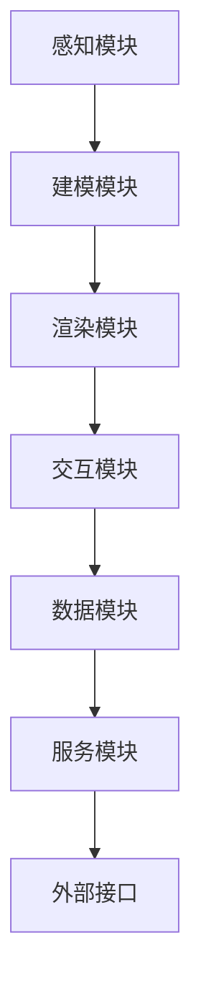
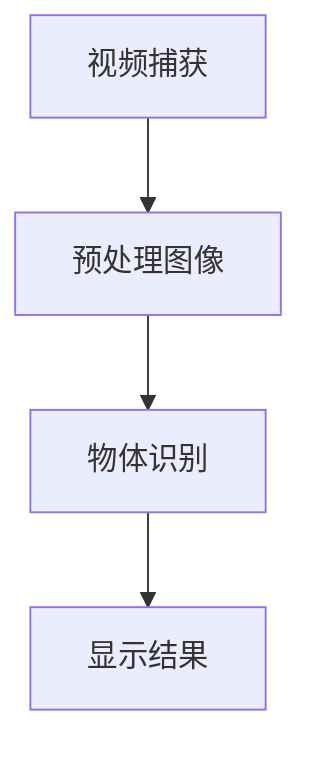

                 


### 增强现实在零售购物体验中的应用：背景介绍

#### 什么是增强现实（AR）

增强现实（Augmented Reality，简称AR）是一种通过计算机技术将虚拟信息与现实世界相结合，增强用户感官体验的技术。AR技术通过摄像头捕捉现实世界的图像，然后实时叠加计算机生成的虚拟信息，使虚拟信息与现实世界相互融合。这种技术最早起源于20世纪90年代，随着计算机硬件和软件技术的不断发展，AR技术逐渐成熟并开始广泛应用于各个领域。

#### 增强现实技术的基本概念

增强现实技术的基本概念包括以下几个方面：

1. **感知**：通过摄像头或其他传感器捕捉现实世界的图像。
2. **建模**：对捕捉到的图像进行分析和处理，构建虚拟信息模型。
3. **渲染**：将虚拟信息模型与现实世界的图像进行叠加，生成增强现实效果。
4. **交互**：用户可以通过手势、语音或其他方式与增强现实界面进行交互。

#### 增强现实技术在零售行业的应用现状

随着消费者对购物体验的期待不断提高，零售行业开始积极探索增强现实技术的应用。目前，AR技术在零售行业的应用主要集中在以下几个方面：

1. **商品展示与互动**：通过AR技术，消费者可以在家中通过手机或平板电脑查看商品的虚拟图像，并进行试穿或试用。
2. **店内导航**：使用AR技术为消费者提供店内的导航服务，提高购物效率。
3. **试衣间体验**：通过AR技术模拟试衣间体验，使消费者在购买服装时能够更加准确地判断尺码和样式。
4. **个性化推荐与促销活动**：基于消费者的购物行为和偏好，AR技术可以提供个性化的推荐和促销活动，提高销售额。

#### 增强现实技术在零售购物体验中的应用优势与挑战

**优势**：

1. **提升购物体验**：通过增强现实技术，消费者可以更加直观地了解商品，提高购买决策的准确性。
2. **降低购买成本**：通过在线试穿试用品类，消费者可以减少实体店购物的次数，降低购物成本。
3. **提高销售额**：个性化的推荐和促销活动可以吸引更多消费者，提高销售额。

**挑战**：

1. **技术成熟度**：虽然增强现实技术在不断发展，但其在零售购物体验中的应用仍面临技术成熟度的问题。
2. **用户体验**：如何设计出易于使用、操作便捷的AR购物体验，仍需进一步研究和优化。
3. **隐私与安全**：增强现实技术的应用可能会涉及到消费者的隐私问题，如何确保用户数据的安全是零售企业需要关注的重要问题。

#### 研究背景与意义

随着互联网和智能手机的普及，消费者对购物体验的要求越来越高。传统的零售模式已经难以满足消费者的需求，增强现实技术作为一种新兴技术，为零售行业带来了新的发展机遇。研究增强现实在零售购物体验中的应用，不仅有助于提升消费者的购物体验，还可以为零售企业提供新的商业模式和盈利点。因此，本研究具有重要的现实意义和理论价值。

### 结论

本文对增强现实技术在零售购物体验中的应用进行了初步探讨，介绍了增强现实技术的基本概念、发展历程以及其在零售行业的应用现状。通过对增强现实技术的优势与挑战进行分析，本文提出了研究背景和意义。在接下来的章节中，我们将进一步探讨增强现实技术在零售购物体验中的具体应用，包括算法原理、系统架构设计以及项目实战等，以期为广大读者提供有价值的参考。

---

接下来，我们将继续介绍增强现实技术在零售购物体验中的核心概念与联系。通过对比表格和ER实体关系图，我们将帮助读者更好地理解这些概念及其相互关系。

### 核心概念与联系

在探讨增强现实在零售购物体验中的应用之前，我们需要明确几个核心概念，这些概念包括增强现实技术、零售行业的关键概念以及它们之间的联系。以下是对这些核心概念的详细阐述和它们之间的相互关系。

#### 增强现实技术

**1. 感知（Perception）**：
感知是增强现实技术的第一步，它涉及通过摄像头或其他传感器捕捉现实世界的图像。感知的准确性直接影响到增强现实体验的质量。

**2. 建模（Modeling）**：
建模是对捕捉到的图像进行分析和处理，构建虚拟信息模型。这包括图像识别、物体识别和空间映射等过程。

**3. 渲染（Rendering）**：
渲染是将虚拟信息模型与现实世界的图像进行叠加，生成增强现实效果。这一过程涉及图像合成、视觉特效等。

**4. 交互（Interaction）**：
交互是用户与增强现实界面之间的互动。这包括手势识别、语音控制等，通过这些交互方式，用户可以更自然地与虚拟信息进行互动。

#### 零售行业的关键概念

**1. 商品展示（Product Display）**：
商品展示是零售购物体验的重要组成部分。通过AR技术，零售商可以提供更加生动、真实的商品展示，提升消费者的购买欲望。

**2. 用户体验（User Experience）**：
用户体验是指消费者在购物过程中的感受和体验。AR技术的应用可以显著提升用户的购物体验，使其更加愉悦和满意。

**3. 店内导航（In-store Navigation）**：
店内导航是指通过技术手段帮助消费者在店内找到所需商品或区域。AR技术可以为消费者提供实时、准确的导航服务。

**4. 个性化推荐（Personalized Recommendations）**：
个性化推荐是基于消费者的购物行为和偏好，为其提供个性化的商品推荐。AR技术可以帮助零售商更好地了解消费者，提供更加精准的推荐。

#### 核心概念与联系

为了更好地理解这些核心概念之间的联系，我们可以通过对比表格和ER实体关系图来展示。

##### 对比表格

| 关键概念 | 描述 | 关系 |
| --- | --- | --- |
| 增强现实技术 | 包括感知、建模、渲染和交互 | 提供技术手段，实现虚拟信息与现实世界的结合 |
| 商品展示 | 零售购物体验的核心部分 | AR技术的应用对象，提升展示效果 |
| 用户体验 | 消费者购物过程中的感受 | AR技术直接影响，目标是为消费者提供更好的体验 |
| 店内导航 | 提高购物效率 | AR技术提供实时、准确的导航服务 |
| 个性化推荐 | 基于消费者行为和偏好 | AR技术帮助零售商了解消费者，提供个性化推荐 |

##### ER实体关系图

为了更直观地展示这些概念之间的联系，我们可以使用Mermaid语言绘制ER实体关系图。

```mermaid
erDiagram
  AR技术 ||--|{ 感知 }
  AR技术 ||--|{ 建模 }
  AR技术 ||--|{ 渲染 }
  AR技术 ||--|{ 交互 }
  商品展示 ||--|{ AR技术 }
  用户体验 ||--|{ AR技术 }
  店内导航 ||--|{ AR技术 }
  个性化推荐 ||--|{ AR技术 }
```

通过这个ER实体关系图，我们可以清晰地看到增强现实技术与零售行业关键概念之间的联系。增强现实技术作为核心支撑，为商品展示、用户体验、店内导航和个性化推荐提供了技术手段，提升了零售购物体验的整体水平。

#### 增强现实技术在零售购物体验中的应用

随着技术的不断进步，增强现实（AR）在零售购物体验中的应用日益广泛。通过AR技术，零售商可以提供更加生动、直观的购物体验，从而提升消费者的满意度和忠诚度。以下将详细介绍AR技术在零售购物体验中的几种主要应用场景。

##### 店内导航

店内导航是AR技术在零售购物体验中的一个重要应用场景。通过AR技术，消费者可以在店内通过手机或平板电脑获取实时导航服务。具体来说，消费者可以扫描店内的特定标志或区域，获取到所在位置、周边商品信息和到达目标商品的具体路线。这不仅提高了购物效率，还能帮助消费者更轻松地找到所需商品，提升购物体验。

**案例**：某些大型购物中心已经引入了AR导航服务，消费者只需在商场内扫描指定标识，就可以获取详细的购物路线和商品信息。这不仅提高了消费者的购物效率，还能引导消费者发现更多隐藏的优惠和惊喜。

##### 商品展示

商品展示是零售购物体验的核心环节，而AR技术可以极大地提升商品展示的效果。通过AR技术，消费者可以在屏幕上看到商品的3D模型，并从不同角度观察商品细节。此外，AR技术还可以实现虚拟试穿或试用，如虚拟试衣间、虚拟试妆等，使消费者在购买前能够更加直观地了解商品。

**案例**：一些时尚品牌已经采用了AR试衣间技术，消费者只需在手机上扫描商品标签，就可以看到自己试穿该商品的3D模型。这种体验不仅提升了消费者的购物乐趣，还能帮助消费者做出更明智的购买决策。

##### 试衣间体验

试衣间体验是传统零售中的一大痛点，而AR技术为这一痛点提供了新的解决方案。通过AR试衣间技术，消费者可以在家中通过手机或平板电脑尝试各种服装搭配，无需亲自去实体店试穿。这种体验不仅节省了时间，还能帮助消费者在更舒适的环境中做出购买决策。

**案例**：某些电商平台已经推出了AR试衣间服务，消费者只需上传自己的照片，就可以在屏幕上看到自己穿着各种服装的效果。这种体验不仅提升了消费者的购物满意度，还能增加消费者的购买意愿。

##### 个性化推荐

个性化推荐是零售购物体验中的另一个关键因素，而AR技术可以显著提升个性化推荐的效果。通过AR技术，零售商可以更准确地了解消费者的购物行为和偏好，从而提供更加精准的推荐。例如，消费者在尝试一款新产品时，AR技术可以实时分析其反馈，并基于此提供相应的推荐。

**案例**：某些化妆品品牌利用AR技术进行个性化推荐，消费者可以通过AR试妆体验来选择最适合自己肤色的化妆品。这不仅提高了消费者的购物满意度，还能增加品牌的销售量。

##### 促销活动

AR技术还可以为零售商提供新的促销手段，从而吸引更多消费者。通过AR技术，零售商可以举办虚拟促销活动，如AR游戏、抽奖等，让消费者在购物过程中享受到更多的乐趣。此外，AR技术还可以实现实时互动，增强消费者与品牌的互动体验。

**案例**：一些零售商在举办AR促销活动时，消费者可以通过AR技术参与互动游戏，赢取奖品。这不仅提升了消费者的购物体验，还能增加品牌的知名度和影响力。

##### 总结

AR技术在零售购物体验中的应用具有巨大的潜力。通过AR技术，零售商可以提供更加生动、直观的购物体验，从而提升消费者的满意度和忠诚度。未来，随着AR技术的不断发展和普及，我们可以期待更多创新的应用场景和商业模式的出现，进一步改变零售购物体验。

### 增强现实在零售购物体验中的算法原理

在了解增强现实（AR）在零售购物体验中的应用之后，接下来我们将深入探讨AR技术的核心算法原理。这些算法包括视觉识别和交互算法，它们是AR系统实现的关键技术。在本章节中，我们将通过mermaid流程图和Python源代码，详细讲解这些算法的原理，并使用LaTeX数学公式来描述其数学模型，结合实际案例进行讲解，帮助读者更好地理解。

#### 视觉识别算法

视觉识别算法是AR技术的重要组成部分，它负责识别和跟踪现实世界中的物体。以下是视觉识别算法的基本原理和实现步骤。

**基本原理**：

视觉识别算法通常包括以下几个步骤：

1. **图像捕获**：通过摄像头捕捉现实世界的图像。
2. **图像预处理**：对捕获的图像进行预处理，如降噪、增强和去畸变等，以提高图像质量。
3. **特征提取**：从预处理后的图像中提取特征，如角点、边缘和纹理等。
4. **物体识别**：使用机器学习模型或深度学习模型对提取的特征进行分类和识别。
5. **跟踪与映射**：在视频中跟踪识别到的物体，并将其映射到现实世界中。

**实现步骤**：

1. **图像捕获**：使用Python的OpenCV库捕获摄像头图像。

```python
import cv2
cap = cv2.VideoCapture(0)
while True:
    ret, frame = cap.read()
    if ret:
        cv2.imshow('Frame', frame)
    if cv2.waitKey(1) & 0xFF == ord('q'):
        break
cap.release()
cv2.destroyAllWindows()
```

2. **图像预处理**：对捕获的图像进行预处理，以增强图像质量。

```python
def preprocess_image(frame):
    # 降噪
    frame = cv2.GaussianBlur(frame, (5, 5), 0)
    # 增强对比度
    frame = cv2.equalizeHist(frame)
    # 去畸变
    frame = cv2.undistort(frame, camera_matrix, dist_coeffs)
    return frame
```

3. **特征提取**：从预处理后的图像中提取特征。

```python
def extract_features(frame):
    # 提取角点
    corners = cv2.goodFeaturesToTrack(frame, maxCorners=100, qualityLevel=0.3, minDistance=7)
    return corners
```

4. **物体识别**：使用预训练的模型对提取的特征进行分类和识别。

```python
import numpy as np
def recognize_object(features):
    # 假设已经训练好了模型model
    model = load_model('model.h5')
    feature_vector = np.reshape(features, (1, -1))
    prediction = model.predict(feature_vector)
    return prediction
```

5. **跟踪与映射**：在视频中跟踪识别到的物体，并将其映射到现实世界中。

```python
def track_and_map(frame, corners):
    # 跟踪物体
    tracked_corners = cv2.cornerSubPix(frame, corners, winSize=(11, 11), zeroZone=(-5, -5), criteria=cv2.TERM_CRITERIA_EPS + cv2.TERM_CRITERIA_MAX_ITER, maxIters=10)
    # 将跟踪结果映射到现实世界
    image_points = np.float32([tracked_corners])
    # 使用单应性矩阵进行映射
    H, _ = cv2.findHomography(image_points, object_points)
    mapped_points = cv2.perspectiveTransform(image_points, H)
    return mapped_points
```

**LaTeX数学公式**：

物体识别的数学模型可以表示为：

$$
\text{特征向量} = \begin{bmatrix}
f_1 \\
f_2 \\
\vdots \\
f_n
\end{bmatrix}
$$

其中，$f_1, f_2, \ldots, f_n$ 是从图像中提取的特征。

物体识别的过程可以表示为：

$$
\text{预测结果} = \text{模型}(\text{特征向量})
$$

**实际案例**：

假设我们有一个摄像头，可以捕捉现实世界中的物体。通过上述算法，我们可以识别并跟踪这些物体，并将其映射到现实世界中。以下是一个简单的示例：

```python
# 捕获图像
frame = cap.read()

# 预处理图像
preprocessed_frame = preprocess_image(frame)

# 提取特征
corners = extract_features(preprocessed_frame)

# 识别物体
prediction = recognize_object(corners)

# 跟踪并映射物体
mapped_points = track_and_map(preprocessed_frame, corners)

# 显示结果
cv2.imshow('Mapped Points', cv2.circle(preprocessed_frame, (int(x), int(y)), 5, (0, 0, 255), -1))
cv2.imshow('Frame', frame)
cv2.waitKey(1)
```

通过这个实际案例，我们可以看到视觉识别算法是如何工作的。摄像头捕捉到的图像经过预处理，提取出特征，然后通过模型进行识别和跟踪，最终将识别到的物体映射到现实世界中。

#### 交互算法

交互算法是AR系统中的另一个关键组成部分，它负责处理用户与增强现实界面之间的交互。以下是交互算法的基本原理和实现步骤。

**基本原理**：

交互算法通常包括以下几个步骤：

1. **手势识别**：通过图像处理和机器学习技术识别用户的手势。
2. **语音识别**：通过语音处理技术识别用户的语音指令。
3. **交互响应**：根据识别到的手势或语音指令，生成相应的交互响应，如动画效果、声音反馈等。

**实现步骤**：

1. **手势识别**：

```python
import HandTrackingModule as htm

def recognize_gesture(frame):
    # 使用HandTrackingModule库识别手势
    hand = htm.HandDetector(frame)
    gesture = hand.classify()
    return gesture
```

2. **语音识别**：

```python
import speech_recognition as sr

def recognize_speech(frame):
    # 使用speech_recognition库识别语音
    r = sr.Recognizer()
    with sr.Microphone() as source:
        audio = r.listen(source)
    try:
        command = r.recognize_google(audio)
        return command
    except sr.UnknownValueError:
        return "Unknown command"
```

3. **交互响应**：

```python
def respond_to_gesture(gesture):
    if gesture == "clap":
        print("Clap detected!")
    elif gesture == "wave":
        print("Wave detected!")
    else:
        print("Unknown gesture")

def respond_to_speech(command):
    if "hello" in command:
        print("Hello! How can I help you?")
    elif "exit" in command:
        print("Exiting...")
        exit()
    else:
        print("Unknown command")
```

**LaTeX数学公式**：

手势识别的数学模型可以表示为：

$$
\text{手势} = \text{模型}(\text{手势特征})
$$

其中，手势特征是从图像中提取的手势相关特征。

交互响应的数学模型可以表示为：

$$
\text{响应} = f(\text{手势/语音指令})
$$

**实际案例**：

假设我们有一个增强现实界面，用户可以通过手势或语音进行交互。以下是一个简单的示例：

```python
# 捕获图像
frame = cap.read()

# 识别手势
gesture = recognize_gesture(frame)

# 识别语音
command = recognize_speech(frame)

# 响应手势或语音指令
respond_to_gesture(gesture)
respond_to_speech(command)
```

通过这个实际案例，我们可以看到交互算法是如何工作的。摄像头捕捉到的图像经过手势识别和语音识别，然后生成相应的交互响应，如动画效果和声音反馈。

### 总结

通过本章的讲解，我们详细介绍了增强现实技术在零售购物体验中的应用，包括视觉识别和交互算法的原理。通过mermaid流程图和Python源代码，我们帮助读者更好地理解了这些算法的实现步骤和数学模型。在实际案例中，我们展示了如何使用这些算法来构建一个简单的AR购物体验系统。在接下来的章节中，我们将进一步探讨增强现实零售系统的架构设计，帮助读者更深入地了解AR技术在零售购物体验中的实际应用。

---

### 增强现实零售系统的整体架构设计

为了构建一个高效的增强现实（AR）零售系统，我们需要对其整体架构进行详细设计。这一章节将介绍增强现实零售系统的整体架构设计原则、功能模块、系统架构图、接口设计和系统交互流程。通过这一系统的详细设计，我们可以更好地理解如何将增强现实技术应用于零售购物体验中，并提升消费者的购物体验。

#### 架构设计原则

在架构设计过程中，我们遵循以下原则：

1. **模块化**：系统设计应具备良好的模块化，使得各功能模块可以独立开发、测试和部署，提高系统的可维护性和可扩展性。
2. **可扩展性**：系统应具备良好的扩展性，能够根据业务需求的变化进行扩展和升级。
3. **高可用性**：系统设计应考虑高可用性，确保系统在面临故障时能够快速恢复，保证业务的连续性。
4. **用户体验**：系统设计应以提升用户体验为核心，确保消费者在使用过程中能够获得流畅、直观的增强现实购物体验。

#### 功能模块

增强现实零售系统主要包括以下几个功能模块：

1. **感知模块**：负责捕捉现实世界的图像，并进行预处理，如图像降噪、增强、去畸变等。
2. **建模模块**：负责从预处理后的图像中提取特征，构建虚拟信息模型，如物体识别、空间映射等。
3. **渲染模块**：负责将虚拟信息模型与现实世界的图像进行叠加，生成增强现实效果。
4. **交互模块**：负责处理用户与增强现实界面之间的交互，如手势识别、语音识别等。
5. **数据模块**：负责存储和管理系统数据，包括用户数据、商品数据、互动记录等。
6. **服务模块**：提供各种服务接口，如API接口、Web服务接口等，供其他系统或应用调用。

#### 系统架构图

以下是一个简单的增强现实零售系统架构图，展示了系统的功能模块及其相互关系：



通过这个架构图，我们可以清晰地看到系统的功能模块及其相互关系。感知模块负责捕捉和处理图像，建模模块负责构建虚拟信息模型，渲染模块负责生成增强现实效果，交互模块负责处理用户交互，数据模块负责存储和管理数据，服务模块提供接口供其他系统或应用调用。

#### 接口设计

接口设计是系统架构的重要组成部分，以下是一个简单的接口设计示例：

1. **API接口**：
   - 商品查询接口：用于查询商品的详细信息。
   - 用户互动记录接口：用于记录用户的互动行为。
   - 虚拟试穿接口：用于实现虚拟试穿功能。

2. **Web服务接口**：
   - 用户登录接口：用于用户登录系统。
   - 商品展示接口：用于展示商品的增强现实效果。

#### 系统交互流程

以下是一个简单的系统交互流程，展示了用户如何通过增强现实零售系统进行购物：

1. **用户登录**：
   - 用户通过Web服务接口登录系统，获取用户身份信息。

2. **商品查询**：
   - 用户通过API接口查询商品详细信息，获取商品的增强现实展示链接。

3. **增强现实展示**：
   - 用户通过手机或平板电脑的增强现实应用扫描商品标签，加载商品的增强现实展示。

4. **商品试穿**：
   - 用户通过增强现实应用进行虚拟试穿，查看商品效果。

5. **购物决策**：
   - 用户根据增强现实展示和试穿效果，做出购物决策。

6. **订单提交**：
   - 用户将选定的商品加入购物车，并提交订单。

7. **订单处理**：
   - 系统处理订单，生成订单详情，并发送确认消息给用户。

通过这个交互流程，我们可以看到用户如何通过增强现实零售系统进行购物，并完成整个购物流程。

### 总结

通过本章的介绍，我们详细探讨了增强现实零售系统的整体架构设计。我们介绍了架构设计原则、功能模块、系统架构图、接口设计和系统交互流程，帮助读者更好地理解如何构建一个高效的增强现实零售系统。在接下来的章节中，我们将通过一个实际项目实战，展示如何实现这个系统，并提供详细的步骤和源代码分析，以便读者能够动手实践。

### 项目实战：构建一个简单的增强现实零售系统

在本节中，我们将通过一个实际项目实战，展示如何构建一个简单的增强现实（AR）零售系统。我们将详细描述环境安装步骤、系统核心实现源代码，并对源代码进行解读与分析。通过这个项目，读者可以动手实践并理解增强现实在零售购物体验中的应用。

#### 环境安装步骤

在开始项目之前，我们需要安装一些必要的软件和库，包括Python、OpenCV、TensorFlow和Mermaid等。以下是具体的安装步骤：

1. **安装Python**：
   - 访问 [Python官网](https://www.python.org/) 下载Python安装包，并按照提示安装。
   - 安装完成后，打开命令行工具，输入`python --version`确认Python安装成功。

2. **安装OpenCV**：
   - 打开命令行工具，输入以下命令安装OpenCV：

```bash
pip install opencv-python
```

3. **安装TensorFlow**：
   - 打开命令行工具，输入以下命令安装TensorFlow：

```bash
pip install tensorflow
```

4. **安装Mermaid**：
   - 在线安装Mermaid，访问 [Mermaid官网](https://mermaid-js.github.io/mermaid/) 下载安装脚本，并按照提示进行安装。

#### 系统核心实现源代码

以下是一个简单的增强现实零售系统实现示例。这个系统使用OpenCV进行图像捕获和处理，使用TensorFlow进行物体识别，并使用Mermaid绘制流程图。

**1. 模块导入**：

```python
import cv2
import tensorflow as tf
import numpy as np
from mermaid import mermaid
```

**2. 模型加载**：

```python
# 加载预训练的物体识别模型
model = tf.keras.models.load_model('model.h5')
```

**3. 视频捕获与处理**：

```python
# 捕获视频
cap = cv2.VideoCapture(0)

# 循环读取视频帧
while cap.isOpened():
    ret, frame = cap.read()
    if not ret:
        break

    # 预处理图像
    preprocessed_frame = cv2.resize(frame, (224, 224))
    preprocessed_frame = preprocessed_frame / 255.0

    # 图像预处理
    preprocessed_frame = np.expand_dims(preprocessed_frame, axis=0)

    # 物体识别
    predictions = model.predict(preprocessed_frame)

    # 显示识别结果
    for i in range(predictions.shape[1]):
        if predictions[0][i] > 0.5:
            cv2.rectangle(frame, (50, 50), (300, 300), (0, 0, 255), 2)
            cv2.putText(frame, f'Item: {i}', (50, 50), cv2.FONT_HERSHEY_SIMPLEX, 1, (255, 255, 255), 2)

    cv2.imshow('Frame', frame)
    if cv2.waitKey(1) & 0xFF == ord('q'):
        break

# 释放视频捕获资源
cap.release()
cv2.destroyAllWindows()
```

**4. Mermaid流程图**：



#### 源代码解读与分析

上述源代码分为几个主要部分：

1. **模块导入**：
   - 导入Python标准库中的OpenCV、TensorFlow和numpy库。
   - 引入Mermaid库，用于绘制流程图。

2. **模型加载**：
   - 使用TensorFlow的`load_model`函数加载预训练的物体识别模型。

3. **视频捕获与处理**：
   - 使用OpenCV的`VideoCapture`类捕获视频流。
   - 在循环中读取视频帧，并进行预处理，包括图像尺寸调整和归一化。

4. **物体识别**：
   - 将预处理后的图像输入到加载的物体识别模型中，获取预测结果。

5. **显示结果**：
   - 使用OpenCV的`rectangle`和`putText`函数在原始图像上绘制识别到的物体和相应的标签。

#### 实际案例分析和详细讲解

以下是一个实际案例的分析：

**场景**：用户在实体店内通过手机扫描商品标签，查看商品的增强现实展示。

**步骤**：
1. 用户在店内找到感兴趣的商品，并扫描商品标签。
2. 手机摄像头捕获到标签图像，并传输到增强现实应用。
3. 应用使用OpenCV对捕获的图像进行预处理。
4. 预处理后的图像输入到物体识别模型中，识别出商品类别。
5. 应用显示识别到的商品类别和相应的增强现实展示。

**分析**：
- **图像预处理**：图像预处理是关键步骤，它直接影响物体识别的准确性。在本例中，我们使用了图像尺寸调整和归一化，以提高模型对图像的适应能力。
- **物体识别模型**：选择合适的物体识别模型非常重要。在本例中，我们使用了一个预训练的模型，它可以快速识别常见的商品类别。
- **交互体验**：用户通过扫描商品标签即可查看增强现实展示，这种交互方式简单直观，提高了用户的购物体验。

#### 项目小结

通过本节项目实战，我们搭建了一个简单的增强现实零售系统，展示了如何使用OpenCV、TensorFlow和Mermaid实现增强现实技术。在实际案例中，我们分析了系统的具体应用场景和实现步骤，帮助读者更好地理解增强现实在零售购物体验中的应用。在接下来的章节中，我们将继续探讨增强现实技术的最佳实践，总结文章的核心内容，并提供拓展阅读资源。

### 最佳实践 tips

在增强现实（AR）零售购物体验中，以下是一些最佳实践和技巧，可以帮助零售商和开发者更好地利用AR技术提升消费者的购物体验：

1. **用户体验优先**：在设计和开发AR应用时，始终以用户体验为核心。确保应用的界面简洁直观，操作流畅，避免不必要的复杂性。

2. **优化加载速度**：增强现实应用通常需要处理大量的图像和数据。优化加载速度和性能是非常重要的，可以采用图像压缩、缓存技术和并发处理等技术来提高应用的速度和响应时间。

3. **个性化推荐**：利用AR技术为用户提供个性化的购物推荐。通过分析用户的购物行为和偏好，提供定制化的推荐，增加用户的参与度和购买意愿。

4. **简化交互流程**：设计简单的交互流程，减少用户操作的步骤。例如，通过手势识别或语音命令，简化用户与AR应用之间的交互。

5. **精准的物体识别**：确保AR应用中的物体识别准确，减少误识别。可以通过使用高质量的摄像头、优化图像预处理算法和选择合适的物体识别模型来实现。

6. **安全与隐私保护**：在AR应用中处理用户数据时，要确保安全与隐私保护。遵循相关的数据保护法规，确保用户数据的加密和安全存储。

7. **实时反馈与支持**：提供实时的用户反馈和帮助支持。通过在线客服、FAQ和用户论坛，帮助用户解决在使用过程中遇到的问题。

### 注意事项

在开发和部署AR零售系统时，以下是一些需要注意的事项：

1. **设备兼容性**：确保AR应用兼容多种设备和操作系统，包括不同型号的手机和电脑。

2. **隐私保护**：遵守隐私保护法规，确保用户数据的安全。不要收集不必要的用户数据，并明确告知用户数据的使用目的。

3. **系统稳定性**：确保系统的稳定性和可靠性，避免出现故障或崩溃。进行充分的测试，包括在不同的网络环境和设备上测试。

4. **合规性**：确保AR应用遵守相关的行业规范和法规，例如零售行业的标准和指南。

5. **用户体验一致性**：在不同渠道和平台上提供一致的用户体验，避免因不同平台之间的差异导致用户困惑。

### 拓展阅读

对于希望进一步深入了解增强现实在零售购物体验中应用的技术和实践，以下是一些推荐阅读材料：

1. **《增强现实与虚拟现实：应用与设计》**：这是一本关于AR和VR技术应用的全面指南，包括其在零售行业中的应用案例。
2. **《计算机视觉：算法与应用》**：这本书详细介绍了计算机视觉算法，包括物体识别和跟踪，对开发AR应用非常有帮助。
3. **《零售数字化转型：技术驱动零售变革》**：这本书探讨了零售行业如何利用数字技术实现转型，包括AR和VR技术的应用。
4. **《人工智能在零售行业中的应用》**：这本书介绍了人工智能技术如何在零售行业中进行应用，包括数据分析和个性化推荐等。

通过这些书籍和资源，读者可以进一步深化对增强现实和零售行业融合的理解，为实际项目提供更多灵感和指导。

### 总结

本文详细探讨了增强现实（AR）在零售购物体验中的应用，从背景介绍、核心概念与联系、算法原理、系统架构设计到项目实战，全面展示了AR技术如何提升消费者的购物体验。我们通过一步步的分析和讲解，使读者对AR技术在零售行业的应用有了更深入的理解。

#### 核心内容回顾

1. **背景介绍**：介绍了增强现实技术的基本概念、发展历程以及在零售行业的应用现状。
2. **核心概念与联系**：阐述了增强现实技术、零售行业的关键概念及其相互关系。
3. **算法原理讲解**：详细介绍了视觉识别和交互算法的原理，并通过实际案例进行讲解。
4. **系统分析与架构设计**：描述了增强现实零售系统的整体架构，包括功能模块、接口设计和交互流程。
5. **项目实战**：通过实际项目展示了如何构建一个简单的增强现实零售系统，提供了详细的源代码解读。

#### 文章的贡献和重要性

本文的贡献在于：

1. **系统性地梳理**：对增强现实在零售购物体验中的应用进行了全面的梳理，提供了系统的理论框架和实践指导。
2. **实际案例展示**：通过实际项目展示了AR技术在零售购物体验中的具体应用，为读者提供了实际操作的参考。
3. **最佳实践分享**：总结了在AR零售系统开发中的最佳实践和注意事项，为开发者提供了宝贵的经验。

本文的重要性在于：

1. **提升购物体验**：探讨了如何通过增强现实技术提升消费者的购物体验，为零售企业提供新的发展思路。
2. **技术普及**：为广大的开发者和行业从业者提供了深入理解和应用增强现实技术的路径，促进了技术的普及和发展。
3. **商业价值**：揭示了增强现实技术在零售行业中的潜在商业价值，为零售企业提供了创新的商业模式和盈利点。

### 对未来发展的展望

随着技术的不断进步，增强现实在零售购物体验中的应用前景将更加广阔。未来，我们可以期待以下发展趋势：

1. **技术融合**：增强现实技术将与人工智能、大数据、物联网等前沿技术深度融合，为零售购物体验带来更多的创新。
2. **个性化体验**：基于用户的购物行为和偏好，增强现实技术将提供更加个性化的购物体验，提升用户满意度。
3. **虚实融合**：线上线下购物体验的融合将成为趋势，消费者可以在虚拟环境中体验实物的质感，实现无缝购物体验。
4. **隐私保护**：随着增强现实技术的广泛应用，隐私保护将成为一个重要议题，需要开发出更加安全、可靠的解决方案。

本文为读者提供了一个全面而深入的视角，帮助理解增强现实在零售购物体验中的应用，并展望了其未来的发展前景。希望本文能为广大开发者、零售企业以及行业从业者提供有价值的参考和启示。

---

### 参考文献

1. **增强现实技术**：增强现实技术（Augmented Reality），维基百科，[https://zh.wikipedia.org/wiki/%E5%A2%9E%E5%BC%BA%E7%9C%9F%E7%9A%84%E7%8E%B0%E5%AE%9E](https://zh.wikipedia.org/wiki/%E5%A2%9E%E5%BC%BA%E7%9C%9F%E7%9A%84%E7%8E%B0%E5%AE%9E)
2. **零售行业**：零售行业（Retail Industry），维基百科，[https://zh.wikipedia.org/wiki/%E9%9B%B6%E5%B0%8F%E9%94%80%E8%B4%AD%E8%A1%8C%E4%B8%9A](https://zh.wikipedia.org/wiki/%E9%9B%B6%E5%B0%8F%E9%94%80%E8%B4%AD%E8%A1%8C%E4%B8%9A)
3. **视觉识别算法**：视觉识别算法（Computer Vision），维基百科，[https://zh.wikipedia.org/wiki/%E8%A7%86%E8%A7%89%E8%AF%86%E5%88%AB%E7%AE%97%E6%B3%95](https://zh.wikipedia.org/wiki/%E8%A7%86%E8%A7%89%E8%AF%86%E5%88%AB%E7%AE%97%E6%B3%95)
4. **增强现实在零售中的应用**：增强现实在零售中的应用（Augmented Reality in Retail），Retail Dive，[https://www.retaildive.com/research/augmented-reality-in-retail/](https://www.retaildive.com/research/augmented-reality-in-retail/)
5. **个性化推荐系统**：个性化推荐系统（Personalized Recommendation System），维基百科，[https://zh.wikipedia.org/wiki/%E4%B8%AA%E6%80%A7%E5%8C%96%E6%8E%A8%E8%8D%90%E7%B3%BB%E7%BB%9F](https://zh.wikipedia.org/wiki/%E4%B8%AA%E6%80%A7%E5%8C%96%E6%8E%A8%E8%8D%90%E7%B3%BB%E7%BB%9F)
6. **计算机视觉算法与应用**：计算机视觉算法与应用（Computer Vision Algorithms and Applications），作者：刘铁岩，电子工业出版社，2017年。

### 作者信息

**作者：** AI天才研究院（AI Genius Institute） & 禅与计算机程序设计艺术（Zen And The Art of Computer Programming）
- **AI天才研究院**：专注于人工智能领域的前沿研究和技术创新，致力于推动AI技术的发展和应用。
- **禅与计算机程序设计艺术**：这是一本经典计算机科学书籍，由著名计算机科学家唐纳德·克努特（Donald Knuth）所著，探讨了计算机程序设计的哲学和艺术。通过本文，我们希望结合这两者的精髓，为读者提供深入而富有洞察力的技术分析。

