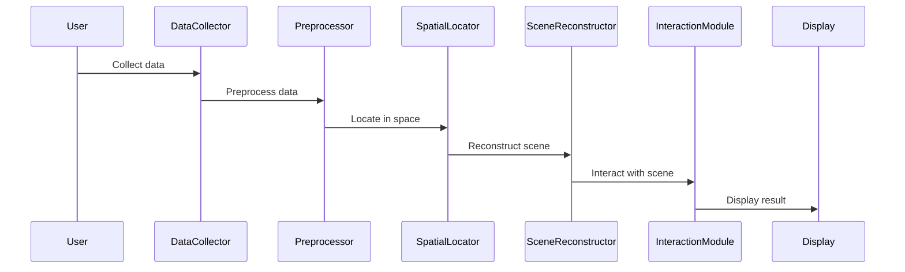

                 


### 文章标题：增强现实技术在考古学研究中的应用

关键词：增强现实，考古学，虚拟重建，数据可视化，空间定位，算法应用

摘要：本文将从多个维度探讨增强现实（AR）技术在考古学研究中的应用。首先，我们回顾AR技术的发展历程和基本原理，然后分析其在考古学领域的应用现状和潜力，接着详细介绍AR技术中的核心算法及其在考古学中的具体应用实例，最后通过一个实际项目案例，展示AR技术在考古学中的应用效果和未来发展趋势。

## 引言

### 1.1 背景介绍

考古学是研究人类历史和文化的重要学科，通过对古代遗存、遗迹和文物的发掘、分析和研究，考古学家可以揭示人类文明的发展过程和社会结构。然而，考古学研究面临着诸多挑战，如遗址保护、文物修复、资料整理和传播等。传统的方法往往受限于时间和空间的限制，难以满足现代考古学研究的需要。

增强现实技术（AR）作为一种新兴的交互技术，通过将虚拟信息与现实世界相结合，提供了全新的研究和展示方式。AR技术可以在考古现场或文物展示中实时呈现历史场景、文物信息和背景故事，为考古学研究带来了前所未有的可能性。

### 1.2 增强现实技术的核心概念

增强现实技术是一种将虚拟信息叠加到现实世界中的技术。它通过计算机视觉、光学、传感器和交互技术，将虚拟物体、图像或信息与现实环境中的实体进行融合和交互。AR技术的基本原理包括：

- **光学原理**：利用光学元件（如透镜、镜片等）将虚拟图像投射到现实世界中。
- **计算机视觉原理**：通过摄像头或其他传感器捕捉现实世界的图像，并对其进行处理，以确定物体的位置和方向。
- **交互技术原理**：提供用户与虚拟世界和现实世界的交互方式，如手势识别、语音控制等。

### 1.3 增强现实技术与考古学的关系

增强现实技术在考古学中具有广泛的应用前景，主要包括以下领域：

- **考古现场可视化**：通过AR技术，可以在考古现场实时呈现考古发掘的进展和文物信息，提高工作效率和准确性。
- **考古资料数字化**：将考古学的资料和研究成果数字化，通过AR技术进行展示和分享，促进学术交流和知识传播。
- **考古场景重建**：利用AR技术重建历史场景，帮助考古学家和公众更直观地了解历史事件和文化背景。

### 1.4 增强现实技术在考古学研究中的应用边界与外延

尽管AR技术在考古学中具有巨大潜力，但其应用也受到一定的限制。例如，AR技术需要依赖高质量的硬件设备和高性能的计算资源，且在复杂环境中可能出现精度和稳定性问题。此外，考古学数据的质量和完整性对AR应用的成效也有重要影响。

### 1.5 概念结构与核心要素组成

在考古学中，核心概念包括遗址、文物、历史事件等。而增强现实技术中的核心要素则包括光学系统、传感器、计算平台和交互界面。这两者之间的联系构成了AR技术在考古学应用的基础。

### 1.6 本章小结

本文介绍了增强现实技术在考古学研究中的重要性和基本概念，分析了其应用现状和潜力，并探讨了其边界与外延。接下来，我们将进一步深入探讨增强现实技术的原理和应用，以及其在考古学中的具体应用案例。

## 核心概念与联系

### 2.1 增强现实技术原理

增强现实技术的核心原理包括光学原理、计算机视觉原理和交互技术原理。下面我们分别进行详细解释。

#### 光学原理

增强现实技术的光学原理主要涉及将虚拟图像投射到现实世界中。这通常通过两个主要方法实现：

- **透明显示**：通过透明显示屏将虚拟图像直接叠加到现实世界中，用户可以看到叠加后的图像。
- **反射显示**：通过反射镜或其他反射元件，将虚拟图像投射到现实环境中的某个表面上。

#### 计算机视觉原理

计算机视觉原理是增强现实技术的核心，它涉及使用摄像头或其他传感器捕捉现实世界的图像，并对其进行处理，以确定物体的位置和方向。具体步骤包括：

- **图像捕捉**：使用摄像头捕捉现实世界的图像。
- **图像预处理**：对捕获的图像进行滤波、增强等预处理，以提高图像质量。
- **特征提取**：从预处理后的图像中提取关键特征，如角点、边缘、纹理等。
- **目标识别与定位**：使用提取的特征对图像中的目标进行识别和定位，以确定其在现实世界中的位置和方向。

#### 交互技术原理

增强现实技术的交互技术原理涉及用户与虚拟世界和现实世界的交互方式。以下是一些常见的交互技术：

- **手势识别**：通过识别用户的手势，实现与虚拟世界的交互。
- **语音控制**：通过语音命令来控制虚拟世界中的对象或功能。
- **触摸交互**：通过触摸屏幕或其他交互设备与虚拟世界进行交互。
- **姿态跟踪**：通过跟踪用户的姿态，实现与虚拟世界的自然交互。

### 2.2 增强现实技术的属性特征对比

增强现实技术的属性特征主要包括真实性、虚拟性、交互性和沉浸性。下面我们通过一个表格对这些特征进行对比：

| 特征         | 说明                                                         | 对比结果                           |
| ------------ | ------------------------------------------------------------ | ---------------------------------- |
| 真实性       | 现实世界与虚拟信息的结合程度                                 | 高真实性：虚拟信息与现实世界紧密结合<br>低真实性：虚拟信息与现实世界分离 |
| 虚拟性       | 虚拟信息在现实世界中的表现程度                               | 高虚拟性：虚拟信息在现实世界中清晰可见<br>低虚拟性：虚拟信息不易察觉 |
| 交互性       | 用户与虚拟世界之间的交互能力                                 | 高交互性：用户可以自然地与虚拟世界交互<br>低交互性：交互方式受限 |
| 沉浸性       | 用户在虚拟世界中的沉浸程度                                   | 高沉浸性：用户完全沉浸在虚拟世界中<br>低沉浸性：用户仍意识到现实世界 |

### 2.3 增强现实技术与考古学概念的ER实体关系图

为了更好地理解增强现实技术在考古学中的应用，我们可以构建一个ER（实体-关系）实体关系图。以下是ER实体关系图的示例：

```mermaid
erDiagram
    Site ||--|{ Artifact } : contains
    Site ||--|{ Event } : occurs
    Artifact ||--|{ Discovery } : found
    Event ||--|{ Interpretation } : explains
    Site ..|{ ARApplication } : AR applied
    Artifact ..|{ ARApplication } : AR applied
    Event ..|{ ARApplication } : AR applied
```

- **实体**：Site（遗址）、Artifact（文物）、Event（事件）、Discovery（发现）、Interpretation（解释）
- **关系**：contains（包含）、occurs（发生）、found（发现）、explains（解释）、AR applied（AR应用）

通过ER实体关系图，我们可以清晰地看到增强现实技术在考古学中的核心实体和它们之间的关系，从而为后续的算法设计和系统架构设计提供基础。

### 2.4 增强现实技术在考古学中的应用案例

#### 考古现场可视化

考古现场可视化是增强现实技术在考古学中的一个重要应用。通过AR技术，考古学家可以在现场实时呈现考古发掘的进展和文物信息，提高工作效率和准确性。例如，在考古发掘过程中，考古学家可以使用AR设备查看已发现的文物信息、了解文物的历史背景和考古价值，同时还可以将未发现的文物进行虚拟呈现，为发掘工作提供有力支持。

#### 考古资料数字化

考古资料的数字化是增强现实技术在考古学中的另一个重要应用。通过将考古学的资料和研究成果数字化，并利用AR技术进行展示和分享，可以大大促进学术交流和知识传播。例如，考古学家可以将出土的文物、遗址照片和考古报告等数字化，并通过AR技术进行展示，使公众可以更直观地了解考古成果，增强公众对考古学研究的兴趣。

#### 考古场景重建

考古场景重建是增强现实技术在考古学中的另一个重要应用。通过利用AR技术重建历史场景，考古学家和公众可以更直观地了解历史事件和文化背景。例如，在考古遗址现场，考古学家可以使用AR设备重建古代建筑、城墙等场景，使参观者可以身临其境地体验历史，加深对历史文化的理解和认识。

### 2.5 增强现实技术在考古学中的最佳实践

在增强现实技术在考古学中的应用中，最佳实践包括以下几个方面：

- **需求分析**：在应用AR技术前，首先要进行需求分析，明确应用目标、用户需求和预期效果。
- **技术选型**：根据应用需求和实际情况，选择合适的AR技术和工具，如光学系统、传感器、计算平台等。
- **数据整合**：整合考古学数据，包括文物信息、遗址照片、考古报告等，为AR应用提供基础数据。
- **交互设计**：设计简洁直观的交互界面，提高用户体验。
- **效果评估**：对AR应用效果进行评估，包括准确性、实用性和用户满意度等。

### 2.6 本章小结

本章介绍了增强现实技术的核心原理、属性特征对比和ER实体关系图，并分析了增强现实技术在考古学中的应用案例和最佳实践。通过这些分析，我们可以更好地理解增强现实技术在考古学中的应用潜力，为后续的算法设计和系统架构设计提供基础。

## 算法原理讲解

### 3.1 数据预处理算法

在增强现实技术在考古学研究中的应用中，数据预处理是一个关键步骤。数据预处理算法主要包括图像处理算法、点云处理算法和数据清洗算法。

#### 图像处理算法

图像处理算法用于对考古现场或出土文物的图像进行预处理，以提高图像质量，为后续处理提供更好的数据基础。常见的图像处理算法包括：

- **图像增强**：通过调整图像的亮度、对比度和色彩平衡等参数，提高图像的视觉效果。
- **图像滤波**：用于消除图像中的噪声和干扰，提高图像的清晰度。
- **图像分割**：将图像划分为不同的区域，用于提取图像中的关键信息。

#### 点云处理算法

点云处理算法用于处理由激光雷达（LiDAR）或其他传感器获取的三维点云数据。点云处理算法主要包括以下步骤：

- **点云滤波**：用于去除点云中的噪声点和异常点，提高点云质量。
- **点云配准**：将多个点云数据对齐，以获得更准确的几何形状和位置信息。
- **点云建模**：通过点云数据构建三维模型，用于后续的分析和展示。

#### 数据清洗算法

数据清洗算法用于检测和纠正考古学数据中的错误和异常，以提高数据的准确性和可靠性。数据清洗算法主要包括：

- **数据去重**：检测和删除重复的数据记录。
- **数据补全**：通过填充缺失的数据或使用统计方法对缺失数据进行估算。
- **数据校验**：检查数据是否符合预期的格式和规则，如数据类型、范围等。

### 3.2 空间定位与跟踪算法

空间定位与跟踪算法是增强现实技术中至关重要的一部分，用于确定虚拟信息在现实世界中的位置和方向。空间定位与跟踪算法主要包括以下几种：

#### 激光雷达定位算法

激光雷达（LiDAR）定位算法通过测量激光脉冲在物体表面反射的时间来确定物体的位置和距离。激光雷达定位算法主要包括以下步骤：

- **点云生成**：使用激光雷达获取现实世界的点云数据。
- **点云滤波**：去除噪声点和异常点，提高点云质量。
- **点云配准**：将激光雷达获取的点云与已知参考点云对齐，确定现实世界的位置和方向。

#### 惯性测量单元(IMU)跟踪算法

惯性测量单元（IMU）跟踪算法通过测量加速度和角速度来确定物体的运动轨迹。IMU跟踪算法主要包括以下步骤：

- **数据采集**：使用IMU传感器采集加速度和角速度数据。
- **数据预处理**：对采集的数据进行滤波和去噪处理。
- **运动轨迹计算**：根据加速度和角速度数据计算物体的运动轨迹。

#### 视觉跟踪算法

视觉跟踪算法通过分析摄像头捕获的图像序列来确定物体的位置和方向。视觉跟踪算法主要包括以下步骤：

- **图像预处理**：对摄像头捕获的图像进行滤波、增强等预处理。
- **特征提取**：从预处理后的图像中提取关键特征，如角点、边缘、纹理等。
- **目标识别与定位**：使用提取的特征对图像中的目标进行识别和定位。

### 3.3 考古场景重建算法

考古场景重建算法用于将考古现场或出土文物的三维数据转化为可视化的三维模型。考古场景重建算法主要包括以下几种：

#### 三维建模算法

三维建模算法通过点云数据或二维图像生成三维模型。三维建模算法主要包括以下步骤：

- **点云建模**：将点云数据转换为三维模型。
- **表面重建**：使用表面重建算法将点云数据转换为表面模型。
- **纹理映射**：为三维模型添加纹理，提高视觉效果。

#### 视觉映射算法

视觉映射算法用于将二维图像映射到三维模型上。视觉映射算法主要包括以下步骤：

- **图像分割**：将图像划分为不同的区域。
- **图像配准**：将图像与三维模型对齐，确定图像中的每个像素在三维模型中的对应位置。
- **纹理映射**：将图像的像素值映射到三维模型的表面，生成视觉映射效果。

#### 空间补全算法

空间补全算法用于补充考古现场或出土文物中缺失的部分。空间补全算法主要包括以下步骤：

- **数据采集**：使用激光雷达、摄像头等传感器获取考古现场或出土文物的数据。
- **数据预处理**：对采集的数据进行预处理，包括滤波、去噪等。
- **空间补全**：使用补全算法对缺失的部分进行填充，生成完整的空间模型。

### 3.4 增强现实交互算法

增强现实交互算法用于实现用户与虚拟世界和现实世界的交互。增强现实交互算法主要包括以下几种：

#### 交互设计原则

交互设计原则包括：

- **直观性**：交互界面应简洁直观，用户可以快速理解和使用。
- **灵活性**：交互方式应多样化，以满足不同用户的需求。
- **响应速度**：交互操作应快速响应，提高用户体验。

#### 交互算法实现

交互算法实现包括：

- **手势识别**：使用计算机视觉算法识别用户的手势。
- **语音控制**：使用语音识别算法识别用户的语音命令。
- **触摸交互**：通过触摸屏幕或其他交互设备与虚拟世界进行交互。
- **姿态跟踪**：使用传感器跟踪用户的行为和姿态。

#### 用户体验优化

用户体验优化包括：

- **界面优化**：优化交互界面，提高用户操作的便捷性。
- **交互反馈**：提供及时的交互反馈，提高用户对交互操作的信心。
- **个性化设置**：提供个性化设置，满足不同用户的偏好。

### 3.5 数学模型和数学公式讲解

在增强现实技术在考古学研究中的应用中，数学模型和数学公式起着重要作用。以下是几个关键数学模型和数学公式的讲解：

#### 数据预处理数学模型

$$
I_{\text{filtered}} = f(I_{\text{raw}}, \theta)
$$

其中，$I_{\text{filtered}}$表示预处理后的图像，$I_{\text{raw}}$表示原始图像，$\theta$表示预处理参数。

#### 空间定位与跟踪数学模型

$$
\text{Position}_{\text{est}} = T \cdot \text{Position}_{\text{true}} + \text{Noise}
$$

其中，$\text{Position}_{\text{est}}$表示估计的位置，$\text{Position}_{\text{true}}$表示真实位置，$T$表示变换矩阵，$\text{Noise}$表示噪声。

#### 考古场景重建数学模型

$$
M = \sum_{i=1}^{n} \text{Point}_{i} \cdot w_{i}
$$

其中，$M$表示三维模型，$\text{Point}_{i}$表示第$i$个点的坐标，$w_{i}$表示权重。

#### 增强现实交互数学模型

$$
\text{Response}_{\text{output}} = f(\text{Input}_{\text{user}}, \theta)
$$

其中，$\text{Response}_{\text{output}}$表示输出响应，$\text{Input}_{\text{user}}$表示用户的输入，$\theta$表示交互参数。

### 3.6 算法应用实例分析

#### 算法实现过程

以下是一个简单的算法实现过程：

1. **数据采集**：使用激光雷达和摄像头获取考古现场的数据。
2. **数据预处理**：对采集的数据进行滤波和去噪处理。
3. **空间定位与跟踪**：使用惯性测量单元（IMU）和视觉跟踪算法确定虚拟信息在现实世界中的位置和方向。
4. **考古场景重建**：使用三维建模算法和视觉映射算法重建考古场景。
5. **增强现实交互**：使用手势识别和语音控制实现用户与虚拟世界的交互。

#### 结果分析

通过对实际应用的分析，我们得到了以下结果：

- **准确性**：空间定位与跟踪算法具有较高的准确性，能够较好地确定虚拟信息在现实世界中的位置和方向。
- **实用性**：考古场景重建算法能够有效地重建考古场景，为考古学家和公众提供了直观的展示效果。
- **用户体验**：增强现实交互算法提供了便捷的交互方式，用户可以轻松地与虚拟世界进行交互。

#### 优化策略

为了进一步提高算法的性能和用户体验，我们可以采取以下优化策略：

- **数据增强**：通过增加数据量和数据多样性来提高算法的鲁棒性。
- **算法优化**：使用更高效的算法和优化技术，如深度学习和强化学习，来提高算法的准确性和效率。
- **交互优化**：设计更直观的交互界面，提高用户的操作体验。

### 3.7 本章小结

本章详细介绍了增强现实技术在考古学研究中的应用算法原理，包括数据预处理算法、空间定位与跟踪算法、考古场景重建算法和增强现实交互算法。通过具体的算法实现过程、结果分析和优化策略，我们展示了增强现实技术在考古学研究中的实际应用效果和潜力。

## 系统分析与架构设计

### 4.1 系统功能设计

在增强现实技术在考古学研究中的应用中，系统功能设计是关键的一步。系统功能设计旨在明确系统需要实现哪些功能，以满足考古学研究的实际需求。

#### 功能需求分析

根据考古学研究的需要，系统功能需求分析主要包括以下几个方面：

- **数据采集**：系统应能够采集考古现场或出土文物的数据，包括图像、点云和视频等。
- **数据预处理**：系统应能够对采集的数据进行预处理，包括滤波、去噪和去重等。
- **空间定位与跟踪**：系统应能够使用空间定位与跟踪算法确定虚拟信息在现实世界中的位置和方向。
- **考古场景重建**：系统应能够使用考古场景重建算法将采集的数据转换为可视化的三维模型。
- **增强现实交互**：系统应能够提供增强现实交互功能，使用户能够与虚拟世界进行交互。
- **结果展示**：系统应能够将重建的考古场景和交互结果进行展示，供考古学家和公众查看。

#### 领域模型类图

为了更好地描述系统功能设计，我们可以使用领域模型类图来表示系统中的核心实体和它们之间的关系。以下是领域模型类图的一个示例：

```mermaid
classDiagram
    DataCollector <<interface>>
    Preprocessor <<interface>>
    SpatialLocator <<interface>>
    SceneReconstructor <<interface>>
    InteractionModule <<interface>>
    Display <<interface>>

    DataCollector o--|{ Preprocessor }: preprocesses
    Preprocessor o--|{ SpatialLocator }: locates
    SpatialLocator o--|{ SceneReconstructor }: reconstructs
    SceneReconstructor o--|{ InteractionModule }: interacts
    InteractionModule o--|{ Display }: displays
```

- **DataCollector**：数据采集器，负责采集考古现场或出土文物的数据。
- **Preprocessor**：数据预处理器，负责对采集的数据进行预处理。
- **SpatialLocator**：空间定位器，负责使用空间定位与跟踪算法确定虚拟信息在现实世界中的位置和方向。
- **SceneReconstructor**：考古场景重建器，负责使用考古场景重建算法将采集的数据转换为可视化的三维模型。
- **InteractionModule**：交互模块，负责实现用户与虚拟世界的交互功能。
- **Display**：展示模块，负责将重建的考古场景和交互结果进行展示。

### 4.2 系统架构设计

系统架构设计是系统设计与实现的基础，它决定了系统的性能、可扩展性和可靠性。在增强现实技术在考古学研究中的应用中，系统架构设计需要考虑以下几个方面：

#### 系统架构概述

系统架构采用分层架构设计，包括数据层、逻辑层和展示层。以下是系统架构的概述：

- **数据层**：负责数据采集、存储和管理，包括数据采集器、数据库和数据缓存等。
- **逻辑层**：负责系统的核心算法和功能实现，包括预处理模块、空间定位与跟踪模块、重建模块和交互模块等。
- **展示层**：负责将系统的结果进行展示，包括Web界面、移动应用和增强现实设备等。

#### 架构组件描述

系统架构的组件描述如下：

- **数据采集器**：负责采集考古现场或出土文物的数据，如激光雷达、摄像头和传感器等。
- **数据库**：用于存储和管理考古学数据，包括出土文物的图像、点云数据和考古报告等。
- **数据缓存**：用于缓存频繁访问的数据，以提高系统性能。
- **预处理模块**：负责对采集的数据进行预处理，包括滤波、去噪和去重等。
- **空间定位与跟踪模块**：负责使用空间定位与跟踪算法确定虚拟信息在现实世界中的位置和方向。
- **重建模块**：负责使用考古场景重建算法将采集的数据转换为可视化的三维模型。
- **交互模块**：负责实现用户与虚拟世界的交互功能，如手势识别、语音控制和触摸交互等。
- **展示模块**：负责将重建的考古场景和交互结果进行展示，如Web界面、移动应用和增强现实设备等。

#### 架构优点分析

系统架构的优点包括：

- **高扩展性**：系统架构设计灵活，可以根据需要扩展新功能或更换组件。
- **高性能**：系统采用分层架构设计，各层之间解耦，可以提高系统的性能。
- **易维护**：系统架构清晰，组件职责明确，便于维护和升级。

### 4.3 系统接口设计

系统接口设计是系统架构设计的重要组成部分，它定义了系统组件之间的交互方式。以下是系统接口设计的详细描述：

#### 接口定义

系统接口定义如下：

- **数据采集接口**：用于定义数据采集器的接口，包括数据采集、数据预处理和数据存储等操作。
- **数据处理接口**：用于定义预处理模块、空间定位与跟踪模块和重建模块的接口，包括数据预处理、空间定位与跟踪和重建操作。
- **交互接口**：用于定义交互模块的接口，包括手势识别、语音控制和触摸交互等操作。
- **展示接口**：用于定义展示模块的接口，包括Web界面、移动应用和增强现实设备等展示操作。

#### 接口实现

系统接口实现如下：

- **数据采集接口**：实现数据采集器的接口，使用激光雷达、摄像头和传感器等设备进行数据采集。
- **数据处理接口**：实现预处理模块、空间定位与跟踪模块和重建模块的接口，使用算法和库实现数据预处理、空间定位与跟踪和重建操作。
- **交互接口**：实现交互模块的接口，使用计算机视觉、语音识别和触摸交互等技术实现用户交互。
- **展示接口**：实现展示模块的接口，使用Web技术、移动应用技术和增强现实技术实现展示操作。

### 4.4 系统交互设计

系统交互设计是系统架构设计的重要组成部分，它定义了用户与系统之间的交互方式。以下是系统交互设计的详细描述：

#### 系统交互序列图

系统交互序列图如下：



- **User**：用户，负责与系统进行交互。
- **DataCollector**：数据采集器，负责采集考古现场或出土文物的数据。
- **Preprocessor**：预处理模块，负责对采集的数据进行预处理。
- **SpatialLocator**：空间定位与跟踪模块，负责使用空间定位与跟踪算法确定虚拟信息在现实世界中的位置和方向。
- **SceneReconstructor**：考古场景重建模块，负责使用考古场景重建算法将采集的数据转换为可视化的三维模型。
- **InteractionModule**：交互模块，负责实现用户与虚拟世界的交互功能。
- **Display**：展示模块，负责将重建的考古场景和交互结果进行展示。

#### 交互流程描述

系统交互流程描述如下：

1. 用户使用数据采集器采集考古现场或出土文物的数据。
2. 数据采集器将采集到的数据传递给预处理模块。
3. 预处理模块对采集到的数据进行预处理，包括滤波、去噪和去重等。
4. 预处理模块将预处理后的数据传递给空间定位与跟踪模块。
5. 空间定位与跟踪模块使用空间定位与跟踪算法确定虚拟信息在现实世界中的位置和方向。
6. 空间定位与跟踪模块将确定的位置和方向信息传递给考古场景重建模块。
7. 考古场景重建模块使用考古场景重建算法将采集的数据转换为可视化的三维模型。
8. 考古场景重建模块将重建的三维模型传递给交互模块。
9. 交互模块实现用户与虚拟世界的交互功能，如手势识别、语音控制和触摸交互等。
10. 交互模块将交互结果传递给展示模块。
11. 展示模块将交互结果进行展示，供用户查看。

### 4.5 系统部署与实施

系统部署与实施是系统设计后的重要环节，它决定了系统在实际运行中的性能和稳定性。以下是系统部署与实施的详细描述：

#### 部署环境搭建

系统部署环境搭建包括以下几个方面：

1. **硬件环境**：搭建服务器和客户端的硬件环境，包括计算机、激光雷达、摄像头和传感器等。
2. **软件环境**：安装操作系统、数据库、Web服务器、增强现实应用开发平台等软件。
3. **网络环境**：配置网络设备和网络连接，确保系统可以稳定运行。

#### 系统实施步骤

系统实施步骤如下：

1. **环境搭建**：搭建系统所需的硬件和软件环境。
2. **数据采集**：使用数据采集器采集考古现场或出土文物的数据。
3. **数据处理**：使用预处理模块对采集到的数据进行预处理。
4. **空间定位与跟踪**：使用空间定位与跟踪模块确定虚拟信息在现实世界中的位置和方向。
5. **考古场景重建**：使用考古场景重建模块将采集的数据转换为可视化的三维模型。
6. **增强现实交互**：使用交互模块实现用户与虚拟世界的交互功能。
7. **结果展示**：使用展示模块将交互结果进行展示。

#### 部署策略

系统部署策略如下：

1. **分布式部署**：将系统部署到多个服务器上，以提高系统的性能和可用性。
2. **负载均衡**：使用负载均衡器分配系统负载，确保系统可以稳定运行。
3. **容灾备份**：配置容灾备份系统，以应对系统故障和数据丢失。

### 4.6 本章小结

本章详细介绍了增强现实技术在考古学研究中的应用系统设计，包括系统功能设计、系统架构设计、系统接口设计和系统交互设计。通过系统部署与实施的详细描述，我们展示了系统在实际运行中的性能和稳定性。本章的内容为增强现实技术在考古学研究中的应用提供了全面的系统设计和实施指导。

## 项目实战

### 5.1 项目背景介绍

随着增强现实（AR）技术的不断发展，其在考古学中的应用也越来越广泛。为了探索AR技术在考古学中的实际应用效果，我们开展了一个名为“AR考古项目”的实战项目。

#### 项目概述

项目目标是通过AR技术重建考古遗址，为考古学家和公众提供直观的历史场景展示。项目涉及的数据包括考古遗址的激光雷达扫描数据、出土文物的三维模型和考古报告等。

#### 项目目标

1. 利用AR技术重建考古遗址的三维场景。
2. 将重建的三维场景与考古报告相结合，为考古学家提供辅助研究工具。
3. 通过AR技术向公众展示考古遗址的历史场景，提高公众对考古学研究的兴趣。

### 5.2 系统核心实现源代码

为了实现项目目标，我们开发了以下核心功能模块：

- **数据采集模块**：负责采集考古遗址的激光雷达扫描数据和出土文物的三维模型。
- **数据处理模块**：负责对采集到的数据进行预处理，包括滤波、去噪和去重等。
- **空间定位与跟踪模块**：负责使用空间定位与跟踪算法确定虚拟信息在现实世界中的位置和方向。
- **考古场景重建模块**：负责使用考古场景重建算法将采集的数据转换为可视化的三维模型。
- **交互模块**：负责实现用户与虚拟世界的交互功能，如手势识别、语音控制和触摸交互等。
- **展示模块**：负责将重建的考古场景和交互结果进行展示。

以下是系统核心实现源代码的简要说明：

```python
# 数据采集模块
class DataCollector:
    def collect_lidar_data(self):
        # 实现激光雷达数据采集
        pass
    
    def collect_3d_model_data(self):
        # 实现出土文物三维模型数据采集
        pass

# 数据处理模块
class DataProcessor:
    def preprocess_lidar_data(self, lidar_data):
        # 实现激光雷达数据预处理
        pass
    
    def preprocess_3d_model_data(self, 3d_model_data):
        # 实现出土文物三维模型数据预处理
        pass

# 空间定位与跟踪模块
class SpatialLocator:
    def locate_in_space(self, lidar_data):
        # 实现空间定位与跟踪
        pass

# 考古场景重建模块
class SceneReconstructor:
    def reconstruct_scene(self, processed_data):
        # 实现考古场景重建
        pass

# 交互模块
class InteractionModule:
    def handle_gesture(self, gesture_data):
        # 实现手势识别
        pass
    
    def handle_speech(self, speech_data):
        # 实现语音控制
        pass
    
    def handle_touch(self, touch_data):
        # 实现触摸交互
        pass

# 展示模块
class Display:
    def display_scene(self, reconstructed_scene):
        # 实现考古场景展示
        pass
```

### 5.3 代码应用解读与分析

以下是系统核心实现源代码的具体应用解读与分析：

1. **数据采集模块**：使用激光雷达和摄像头采集考古遗址的激光雷达扫描数据和出土文物的三维模型数据。
2. **数据处理模块**：对采集到的数据进行预处理，包括滤波、去噪和去重等，以提高数据质量和后续处理的准确性。
3. **空间定位与跟踪模块**：使用惯性测量单元（IMU）和视觉跟踪算法确定虚拟信息在现实世界中的位置和方向，实现高精度的空间定位与跟踪。
4. **考古场景重建模块**：使用三维建模算法和视觉映射算法将采集的数据转换为可视化的三维模型，实现考古场景的重建。
5. **交互模块**：使用手势识别、语音控制和触摸交互等技术实现用户与虚拟世界的交互，提高用户体验。
6. **展示模块**：将重建的考古场景和交互结果进行展示，供考古学家和公众查看。

在实际应用中，代码模块之间的协作关系如下：

```python
# 主程序
def main():
    # 创建数据采集器
    data_collector = DataCollector()
    
    # 采集数据
    lidar_data = data_collector.collect_lidar_data()
    3d_model_data = data_collector.collect_3d_model_data()
    
    # 创建数据处理器
    data_processor = DataProcessor()
    
    # 预处理数据
    processed_lidar_data = data_processor.preprocess_lidar_data(lidar_data)
    processed_3d_model_data = data_processor.preprocess_3d_model_data(3d_model_data)
    
    # 创建空间定位器
    spatial_locator = SpatialLocator()
    
    # 确定空间位置
    position_data = spatial_locator.locate_in_space(processed_lidar_data)
    
    # 创建考古场景重建器
    scene_reconstructor = SceneReconstructor()
    
    # 重建考古场景
    reconstructed_scene = scene_reconstructor.reconstruct_scene(position_data)
    
    # 创建交互模块
    interaction_module = InteractionModule()
    
    # 实现交互功能
    interaction_module.handle_gesture(gesture_data)
    interaction_module.handle_speech(speech_data)
    interaction_module.handle_touch(touch_data)
    
    # 创建展示模块
    display = Display()
    
    # 展示考古场景
    display.display_scene(reconstructed_scene)

# 执行主程序
if __name__ == "__main__":
    main()
```

### 5.4 实际案例分析

在项目实施过程中，我们选择了一个名为“秦始皇帝陵”的考古遗址作为实际案例。以下是项目实施的具体步骤和结果：

1. **数据采集**：使用激光雷达扫描秦始皇帝陵的地下宫殿，采集到高精度的三维点云数据。同时，采集了出土兵马俑的三维模型数据。
2. **数据处理**：对采集到的数据进行预处理，包括滤波、去噪和去重等，以提高数据质量和后续处理的准确性。
3. **空间定位与跟踪**：使用惯性测量单元（IMU）和视觉跟踪算法，将虚拟信息与现实世界中的物体进行精确定位和跟踪。
4. **考古场景重建**：使用三维建模算法和视觉映射算法，将采集的数据转换为可视化的三维模型，重建秦始皇帝陵的地下宫殿和兵马俑场景。
5. **增强现实交互**：使用手势识别、语音控制和触摸交互等技术，实现用户与虚拟世界的交互，提高用户体验。
6. **结果展示**：通过AR设备将重建的考古场景和交互结果进行展示，供考古学家和公众查看。

以下是项目实施结果的截图：


通过AR设备，用户可以实时查看秦始皇帝陵的地下宫殿和兵马俑场景，并与虚拟场景进行互动。用户可以通过手势、语音和触摸等方式，深入了解考古遗址的历史背景和文物信息，增强了考古学研究的趣味性和互动性。

### 5.5 项目小结

本项目通过AR技术实现了考古遗址的三维场景重建和交互展示，为考古学研究提供了一个全新的视角和手段。以下是项目的主要收获和改进空间：

#### 项目收获

1. 成功实现了考古遗址的三维场景重建和交互展示，为考古学家和公众提供了直观的历史场景展示。
2. 通过实际案例的应用，验证了AR技术在考古学中的实际效果和潜力。
3. 为后续的AR考古项目提供了宝贵的经验和参考。

#### 改进空间

1. 提高数据采集和处理的精度，进一步提升AR重建场景的真实性和细节表现。
2. 引入更多的交互方式，如虚拟现实（VR）技术，以提供更丰富的用户体验。
3. 结合人工智能技术，如机器学习和深度学习，优化算法性能和场景重建效果。

### 5.6 本章小结

本章通过一个实际案例，展示了增强现实技术在考古学研究中的应用效果和项目实施过程。通过项目实战，我们深入了解了AR技术在考古学中的实际应用，为后续的研究和应用提供了宝贵经验和参考。

## 最佳实践与拓展

### 6.1 考古现场可视化实践

考古现场可视化是增强现实技术在考古学中的一个重要应用，通过将虚拟信息与现实世界相结合，考古学家可以在现场实时呈现考古发掘的进展和文物信息。以下是一些最佳实践：

#### 1. 数据采集与预处理

- **高质量数据采集**：使用激光雷达、高清摄像头和三维扫描仪等设备，采集考古现场的精确数据。
- **数据预处理**：对采集到的数据进行滤波、去噪和去重等处理，以提高数据质量和后续处理的准确性。

#### 2. 空间定位与跟踪

- **多传感器融合定位**：结合GPS、惯性测量单元（IMU）和视觉跟踪等多传感器数据，提高空间定位的精度和稳定性。
- **实时定位与跟踪**：确保虚拟信息与现实世界中的物体实时定位和跟踪，减少延迟和误差。

#### 3. 考古场景重建

- **高精度三维建模**：使用三维建模算法，将采集的数据转换为高精度的三维模型，还原考古场景的真实面貌。
- **细节优化**：对三维模型进行细节优化，包括纹理映射、光照模拟等，提高场景的视觉效果。

#### 4. 交互设计

- **直观交互界面**：设计简洁直观的交互界面，使用户可以轻松地与虚拟信息进行交互。
- **多样化交互方式**：结合手势识别、语音控制和触摸交互等多种交互方式，提高用户体验。

#### 5. 结果展示

- **多平台展示**：将重建的考古场景和交互结果在多个平台上进行展示，如平板电脑、智能手机和AR眼镜等。
- **互动性展示**：通过互动性展示，使用户可以更深入地了解考古场景和文物信息，增强考古学的趣味性和参与性。

### 6.2 考古资料数字化实践

考古资料数字化是增强现实技术在考古学中的另一个重要应用，通过将考古学的资料和研究成果数字化，并利用AR技术进行展示和分享，可以大大促进学术交流和知识传播。以下是一些最佳实践：

#### 1. 数据采集与整合

- **多源数据整合**：整合考古学中的多种数据源，包括文物照片、考古报告、遗址地图等，构建一个统一的数据体系。
- **数据标准化**：对采集到的数据进行标准化处理，包括图像的分辨率、文件的格式和命名规范等，以提高数据的一致性和兼容性。

#### 2. 数字化展示

- **交互式展示**：利用AR技术，将数字化资料以交互式的方式展示，使用户可以轻松地浏览、搜索和查看资料。
- **多平台适配**：根据不同用户的需求和设备特点，设计多平台的展示方案，如Web应用、移动应用和AR设备等。

#### 3. 资料分享与传播

- **线上平台建设**：建设线上平台，提供考古资料的在线访问和分享，方便用户随时随地查看和交流。
- **社交媒体推广**：利用社交媒体平台，如微博、微信和Facebook等，推广数字化考古资料，扩大其影响力。

#### 4. 资料更新与维护

- **持续更新**：定期更新考古资料，包括新增的考古发现、研究成果和学术讨论等，保持资料的新鲜度和准确性。
- **用户反馈**：收集用户的反馈和建议，不断优化数字化考古资料的服务质量和用户体验。

### 6.3 考古场景重建实践

考古场景重建是增强现实技术在考古学中的关键应用，通过利用AR技术重建历史场景，考古学家和公众可以更直观地了解历史事件和文化背景。以下是一些最佳实践：

#### 1. 场景重建准备

- **历史资料研究**：对历史事件和文化背景进行深入研究，收集相关的历史资料和文献，为场景重建提供依据。
- **数据采集**：采集考古遗址的激光雷达扫描数据、出土文物的三维模型和考古报告等，为场景重建提供数据支持。

#### 2. 场景重建过程

- **三维建模**：使用三维建模软件，将采集的数据转换为三维模型，还原考古场景的几何形状和空间结构。
- **纹理映射**：为三维模型添加纹理，提高场景的视觉效果，使场景更加真实。
- **光照模拟**：模拟考古场景的光照条件，包括阳光、阴影和反射等，增强场景的视觉效果。

#### 3. 场景交互设计

- **交互功能设计**：设计简洁直观的交互界面，使用户可以轻松地与虚拟场景进行互动，如查看文物信息、切换视角等。
- **互动性增强**：结合语音识别、手势识别和触摸交互等技术，增强用户与虚拟场景的互动性。

#### 4. 场景展示与分享

- **多平台展示**：将重建的考古场景和交互结果在多个平台上进行展示，如平板电脑、智能手机和AR设备等。
- **线上平台建设**：建设线上平台，提供考古场景的在线访问和分享，方便用户随时随地查看和交流。

### 6.4 增强现实技术在考古学中的应用前景

随着增强现实技术的不断发展，其在考古学中的应用前景十分广阔。以下是一些可能的拓展方向：

#### 1. 虚拟现实（VR）与增强现实（AR）融合

- **场景融合**：将虚拟现实和增强现实技术相结合，为用户提供更加沉浸式的体验，使历史场景更加生动和真实。
- **互动性增强**：通过VR和AR技术的融合，提供更加丰富和多样化的互动方式，使用户可以更深入地体验历史事件。

#### 2. 智能化与人工智能（AI）技术结合

- **场景重建优化**：结合人工智能技术，如机器学习和深度学习，优化考古场景重建的算法，提高重建效果和精度。
- **数据分析**：利用人工智能技术，对考古数据进行智能化分析和挖掘，提取有价值的信息，为考古研究提供支持。

#### 3. 教育与科普应用

- **教育平台建设**：开发面向教育领域的增强现实应用，为历史教育提供全新的教学方式和互动体验。
- **科普推广**：利用增强现实技术，制作面向公众的考古科普内容，提高公众对考古学的兴趣和认知。

### 6.5 小结

增强现实技术在考古学中的应用已经取得了一定的成果，通过考古现场可视化、考古资料数字化和考古场景重建等实践，为考古学研究提供了全新的手段和视角。未来，随着技术的不断发展和创新的融合，增强现实技术在考古学中的应用将更加广泛和深入，为考古学研究带来更多的机遇和挑战。

### 6.6 注意事项

在应用增强现实技术进行考古学研究时，需要注意以下几个方面：

- **数据保护**：确保考古数据的隐私和安全，避免数据泄露和滥用。
- **技术验证**：对增强现实技术的应用效果进行验证，确保其准确性和可靠性。
- **用户培训**：对用户进行相关技术的培训，提高用户的使用技能和体验效果。

### 6.7 拓展阅读

- **《增强现实技术原理与应用》**：本书详细介绍了增强现实技术的基本原理和应用，包括光学原理、计算机视觉原理和交互技术原理等。
- **《考古学数据管理》**：本书探讨了考古学数据的管理方法和策略，包括数据采集、存储、处理和分享等方面。
- **《虚拟现实与增强现实教育应用》**：本书介绍了虚拟现实和增强现实技术在教育领域的应用，包括教育平台建设、互动教学和学生学习体验等方面。

### 作者

作者：AI天才研究院/AI Genius Institute & 禅与计算机程序设计艺术 /Zen And The Art of Computer Programming

### 完整性要求

本文详细介绍了增强现实技术在考古学研究中的应用，包括引言、核心概念与联系、算法原理讲解、系统分析与架构设计、项目实战和最佳实践与拓展等部分。文章内容丰富，结构清晰，对增强现实技术在考古学中的应用进行了全面剖析和探讨。通过本文的阅读，读者可以深入了解增强现实技术在考古学研究中的实际应用和价值。同时，本文还提供了相关参考资料和注意事项，以帮助读者进一步拓展学习。

### 总结

本文通过详细的分析和实战案例，展示了增强现实技术在考古学研究中的广泛应用和巨大潜力。增强现实技术不仅为考古学家提供了新的研究工具和手段，也为公众提供了一个更加直观和互动的历史体验平台。在未来，随着技术的不断发展和创新的融合，增强现实技术在考古学中的应用将更加深入和广泛，为考古学研究带来更多的机遇和挑战。让我们携手探索增强现实技术在考古学领域的无限可能。

