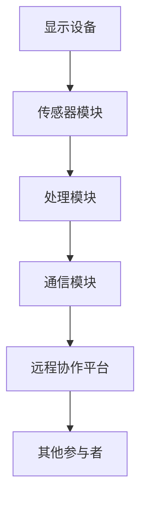

                 

# 增强现实技术在远程协作中的应用前景

## 摘要

随着远程协作的普及，如何提高远程协作的效率和用户体验成为一个重要课题。增强现实（AR）技术以其独特的沉浸式体验和虚实结合的特点，在远程协作中展现出广阔的应用前景。本文将首先介绍增强现实技术的发展背景和核心概念，随后探讨远程协作的需求和挑战，进一步阐述增强现实技术在远程协作中的应用架构，通过实际案例展示其应用效果，最后总结最佳实践并展望未来发展趋势。

## 关键词

- 增强现实
- 远程协作
- 应用前景
- 技术架构
- 实际案例

## 目录

1. **增强现实与远程协作的概述**
   1.1 增强现实技术概述
   1.2 远程协作的需求与挑战
   1.3 增强现实在远程协作中的应用前景
   1.4 本章小结

2. **增强现实技术原理详解**
   2.1 硬件架构与设备选择
   2.2 软件与算法基础
   2.3 增强现实在远程协作中的应用架构
   2.4 本章小结

3. **增强现实技术在远程协作中的应用实战**
   3.1 远程医疗协作
   3.2 远程教育协作
   3.3 远程会议协作
   3.4 本章小结

4. **最佳实践与未来展望**
   4.1 技术选型与优化策略
   4.2 安全性与隐私保护
   4.3 未来发展方向与展望
   4.4 本章小结

5. **参考文献**

---

## 1. 增强现实与远程协作的概述

### 1.1 增强现实技术概述

增强现实（Augmented Reality，AR）是一种将虚拟信息与真实世界融合的技术。通过在现实场景中叠加计算机生成的信息，用户能够获得更加丰富和互动的体验。AR技术的基本概念可以追溯到20世纪50年代，但其真正发展始于21世纪初，随着智能手机和计算机处理能力的提升，以及相关算法和硬件技术的进步，AR技术逐渐走向成熟。

增强现实技术的核心组成部分包括：
- **显示设备**：用于呈现虚拟信息的设备，如智能手机、平板电脑、头戴显示器等。
- **传感器**：用于捕捉用户和环境信息的设备，如摄像头、麦克风、GPS等。
- **计算机算法**：用于处理传感器数据并生成虚拟信息的核心技术，包括图像处理、计算机视觉、语音识别等。

### 1.2 远程协作的需求与挑战

远程协作的兴起源于全球化的发展和远程办公的需求。随着远程工作的普及，如何确保高效、顺畅的团队沟通和协作成为了一个重要问题。远程协作的需求主要包括：
- **信息共享**：团队成员需要实时共享信息，以便更好地协同工作。
- **沟通效率**：远程协作要求高效、即时的沟通方式，以减少延迟和误解。
- **交互体验**：远程协作工具需要提供接近面对面交流的交互体验。

然而，远程协作也面临着一些挑战：
- **技术障碍**：远程协作需要稳定、高速的网络环境，以及功能强大的协作工具。
- **文化差异**：跨国团队协作需要考虑文化差异，确保沟通和协作的顺畅。
- **隐私与安全**：远程协作涉及到大量敏感信息的传输和存储，需要严格的安全保障措施。

### 1.3 增强现实在远程协作中的应用前景

增强现实技术因其独特的沉浸式体验和虚实结合的特点，在远程协作中展现出广阔的应用前景。以下是几个潜在的应用场景：

- **远程医疗协作**：医生可以通过AR技术远程查看患者的病情，提供实时诊断和建议，提高医疗效率。
- **远程教育协作**：教师可以通过AR技术为学生提供虚拟实验、互动课堂等，增强教学效果。
- **远程会议协作**：参会者可以通过AR技术实现三维空间中的虚拟会议室，提高会议的互动性和参与度。

### 1.4 本章小结

本章介绍了增强现实技术的发展背景和核心概念，探讨了远程协作的需求和挑战，并展示了增强现实技术在远程协作中的应用前景。在接下来的章节中，我们将进一步深入探讨增强现实技术的原理及其在远程协作中的具体应用。

---

## 2. 增强现实技术原理详解

### 2.1 硬件架构与设备选择

增强现实技术的实现依赖于一系列硬件设备的支持。以下是常用的增强现实硬件及其选择标准：

#### 显示设备

显示设备是AR技术中最重要的硬件之一。常见的显示设备包括智能手机、平板电脑、头戴显示器等。

- **智能手机**：智能手机因其便携性和普及度，成为AR应用的常用显示设备。选择智能手机时，主要考虑屏幕尺寸、分辨率和处理器性能。
- **平板电脑**：平板电脑具备更大的屏幕和更高的分辨率，适合需要更广阔视场的应用场景。选择时需考虑电池续航和处理器性能。
- **头戴显示器**：头戴显示器提供完全沉浸式的体验，适用于专业应用和游戏等领域。选择时需考虑分辨率、视场角和舒适度。

#### 传感器

传感器用于捕捉用户和环境信息，包括摄像头、麦克风、GPS等。

- **摄像头**：摄像头用于捕捉真实世界的图像，用于AR场景的识别和叠加。选择时需考虑分辨率、帧率和光学性能。
- **麦克风**：麦克风用于语音输入和输出，支持语音交互功能。选择时需考虑灵敏度和噪声抑制能力。
- **GPS**：GPS用于定位和导航，对于需要位置信息的AR应用至关重要。选择时需考虑精度和信号接收能力。

#### 设备性能参数选择

在选择增强现实设备时，需要考虑以下性能参数：

- **处理器性能**：增强现实应用对处理器的性能要求较高，需要选择具有强大计算能力的设备。
- **内存容量**：内存容量越大，设备在处理复杂AR应用时的流畅度越高。
- **电池续航**：增强现实应用通常需要长时间使用，因此选择具有较长电池续航时间的设备尤为重要。

#### 常见增强现实硬件介绍

以下是几种常见的增强现实硬件介绍：

- **Google Glass**：Google Glass是一款头戴式增强现实设备，具备高分辨率屏幕和高清摄像头，适用于实时信息查询和交互。
- **Microsoft HoloLens**：Microsoft HoloLens是一款全息头戴显示器，支持3D空间交互，适用于工业设计、建筑模拟等专业领域。
- **Samsung Gear VR**：Samsung Gear VR是一款基于智能手机的虚拟现实头盔，通过智能手机的屏幕提供沉浸式体验，适用于游戏和娱乐。

### 2.2 软件与算法基础

增强现实技术的实现离不开软件和算法的支持。以下是增强现实技术中常用的软件和算法：

#### 增强现实软件框架

增强现实软件框架提供了开发AR应用的基础工具和库，如ARKit（iOS）、ARCore（Android）和Unity AR Foundation。

- **ARKit**：ARKit是苹果公司推出的增强现实开发框架，支持iOS平台，提供丰富的AR功能，如环境映射、物体识别和追踪等。
- **ARCore**：ARCore是谷歌公司推出的增强现实开发框架，支持Android平台，提供与ARKit类似的功能，如环境感知、物体识别和追踪等。
- **Unity AR Foundation**：Unity AR Foundation是Unity游戏引擎的一部分，提供了跨平台的AR开发工具和功能。

#### 图像处理与计算机视觉算法

图像处理和计算机视觉算法是增强现实技术中不可或缺的部分，用于处理和识别真实世界的图像信息。

- **图像识别算法**：图像识别算法用于识别和分类真实世界的图像，如人脸识别、物体识别等。常用的图像识别算法包括卷积神经网络（CNN）和深度学习算法。
- **图像跟踪算法**：图像跟踪算法用于跟踪和定位真实世界的图像，如光学跟踪、视觉跟踪等。常用的图像跟踪算法包括卡尔曼滤波、粒子滤波等。
- **SLAM算法**：SLAM（Simultaneous Localization and Mapping）算法用于同时实现位置估计和地图构建，适用于动态环境下的增强现实应用。

#### 交互设计与用户体验优化

交互设计与用户体验优化是增强现实应用成功的关键。以下是一些关键点：

- **用户界面设计**：用户界面设计应简洁、直观，方便用户快速上手和使用。
- **反馈机制**：增强现实应用应提供即时、准确的反馈机制，如声音、震动和视觉效果等，提高用户的交互体验。
- **沉浸感**：通过优化渲染效果、交互方式等，增强用户的沉浸感，提高应用的吸引力。

### 2.3 增强现实在远程协作中的应用架构

增强现实技术在远程协作中的应用架构主要包括以下几个关键组件：

- **显示设备**：作为用户的交互界面，提供虚拟信息和实时交互。
- **传感器模块**：包括摄像头、麦克风、GPS等，用于捕捉用户和环境信息。
- **处理模块**：包括处理器、内存和存储等，用于处理和存储数据。
- **通信模块**：包括网络连接和传输协议，用于实现远程协作的实时数据传输。

以下是增强现实在远程协作中的应用架构图：

### 2.4 本章小结

本章详细介绍了增强现实技术的硬件架构与设备选择、软件与算法基础，以及增强现实在远程协作中的应用架构。通过这些内容，读者可以了解增强现实技术的核心原理和实现方法，为后续的应用实战和最佳实践提供了基础。

---

## 3. 增强现实技术在远程协作中的应用实战

### 3.1 远程医疗协作

#### 案例背景

随着医疗资源的分布不均和医疗行业的快速发展，远程医疗协作成为了一种解决途径。然而，传统的远程医疗协作方式往往依赖于视频会议和文档共享，难以实现高效、直观的沟通和协作。增强现实技术的引入，为远程医疗协作提供了新的解决方案。

#### 案例分析

在某次远程医疗协作中，一位位于城市的医生需要为位于偏远地区的患者提供诊断和建议。医生通过增强现实设备连接到远程医疗平台，患者通过手机摄像头捕捉自身图像，并将图像实时传输到医生的设备上。

医生通过增强现实设备中的增强信息，如患者的健康数据、病历记录和医疗图像等，对患者进行远程诊断。同时，医生可以通过增强现实设备中的虚拟工具，如手术模拟器和药物注射器等，为患者提供操作指导和实时反馈。

#### 案例效果评估

通过增强现实技术的应用，远程医疗协作的效果得到了显著提升：
- **诊断准确性**：医生通过增强现实设备中的增强信息，可以更全面、准确地了解患者的病情，提高诊断的准确性。
- **操作指导**：医生可以通过虚拟工具为患者提供详细的操作指导，确保患者能够正确地执行医疗操作。
- **实时反馈**：医生和患者之间的实时互动，使得医疗操作更加流畅，减少了误解和误操作的可能性。

#### 案例小结

远程医疗协作是增强现实技术在医疗领域的重要应用场景。通过增强现实技术，医生可以远程查看患者的病情，提供实时诊断和建议，提高医疗效率。同时，增强现实技术也为患者提供了更加直观、易懂的医疗操作指导，提升了患者的体验。

### 3.2 远程教育协作

#### 案例背景

远程教育协作是教育行业的重要趋势，特别是在疫情期间，线上教育得到了广泛应用。然而，传统的远程教育方式往往局限于文字和视频，难以提供互动性和参与感。增强现实技术的引入，为远程教育协作提供了新的可能性。

#### 案例分析

在一次远程教育协作中，一位教师需要为学生提供互动式教学。教师通过增强现实设备连接到远程教育平台，学生通过手机摄像头捕捉自身图像，并将图像实时传输到教师的设备上。

教师通过增强现实设备中的虚拟课堂，为学生提供沉浸式教学体验。教师可以使用虚拟教具，如三维模型、实验仪器和互动图表等，为学生展示复杂的概念和过程。学生可以通过增强现实设备中的虚拟工具，如问答板和投票器等，与教师互动，参与课堂讨论。

#### 案例效果评估

通过增强现实技术的应用，远程教育协作的效果得到了显著提升：
- **互动性**：增强现实技术使得课堂互动更加直观和有趣，学生更加愿意参与讨论和互动。
- **参与感**：学生通过虚拟工具可以更加深入地理解和应用所学知识，增强学习体验。
- **个性化**：教师可以根据学生的反馈和表现，调整教学内容和方法，实现个性化教育。

#### 案例小结

远程教育协作是增强现实技术在教育领域的重要应用场景。通过增强现实技术，教师可以提供沉浸式教学体验，增强学生的互动性和参与感，提高教学效果。同时，增强现实技术也为学生提供了更加有趣和有效的学习方式。

### 3.3 远程会议协作

#### 案例背景

远程会议协作是现代商务活动中不可或缺的一部分。传统的远程会议方式往往依赖于视频会议软件，虽然可以实现远程沟通，但缺乏互动性和参与感。增强现实技术的引入，为远程会议协作提供了新的解决方案。

#### 案例分析

在一次远程会议协作中，一位会议主持人需要与位于不同地点的参会者进行实时互动。主持人通过增强现实设备连接到远程会议平台，参会者通过手机摄像头捕捉自身图像，并将图像实时传输到主持人的设备上。

主持人通过增强现实设备中的虚拟会议室，为参会者提供一个三维空间中的会议环境。主持人可以使用虚拟工具，如指示器、白板和投票器等，与参会者互动。参会者可以通过增强现实设备中的虚拟工具，如问答板和表情符号等，参与会议讨论。

#### 案例效果评估

通过增强现实技术的应用，远程会议协作的效果得到了显著提升：
- **互动性**：增强现实技术使得会议互动更加直观和有趣，参会者更加愿意参与讨论和互动。
- **参与感**：参会者通过虚拟工具可以更加深入地参与会议，增强会议体验。
- **决策效率**：主持人可以通过虚拟工具快速收集参会者的意见和投票，提高决策效率。

#### 案例小结

远程会议协作是增强现实技术在商务领域的重要应用场景。通过增强现实技术，会议主持人可以提供一个三维空间中的会议环境，增强参会者的互动性和参与感，提高会议效果。同时，增强现实技术也为参会者提供了更加有趣和高效的会议体验。

### 3.4 本章小结

本章通过三个实际案例，展示了增强现实技术在远程协作中的应用效果。无论是在医疗、教育还是商务领域，增强现实技术都为远程协作提供了新的可能性，提高了协作效率、互动性和参与感。未来，随着技术的进一步发展，增强现实技术将在远程协作中发挥更加重要的作用。

---

## 4. 最佳实践与未来展望

### 4.1 技术选型与优化策略

在增强现实技术在远程协作中的应用中，技术选型是一个关键问题。以下是一些最佳实践：

#### 1. 设备选型

- **硬件设备**：根据应用场景和需求，选择适合的硬件设备。例如，对于需要高强度计算和稳定性能的应用，可以选择高性能的增强现实头戴设备；对于轻度应用，可以选择平板电脑或智能手机。
- **传感器配置**：根据应用需求，选择合适的传感器配置。例如，对于需要高精度定位的应用，可以选择配备高精度摄像头和GPS的设备。

#### 2. 算法优化

- **图像处理算法**：优化图像处理算法，提高图像识别和跟踪的准确性。例如，采用深度学习算法进行图像识别，使用粒子滤波算法进行图像跟踪。
- **通信优化**：优化网络通信，确保实时数据传输的稳定性和低延迟。例如，采用边缘计算技术，将部分计算任务转移到网络边缘，减少中心服务器的负载。

### 4.2 安全性与隐私保护

增强现实技术在远程协作中涉及大量的数据传输和存储，因此安全性和隐私保护至关重要。以下是一些最佳实践：

#### 1. 数据加密

- **通信加密**：对传输的数据进行加密，确保数据在传输过程中的安全性。例如，使用TLS协议进行数据传输加密。
- **存储加密**：对存储的数据进行加密，防止数据泄露。例如，使用AES算法对数据存储进行加密。

#### 2. 访问控制

- **身份验证**：对用户进行身份验证，确保只有授权用户可以访问系统。例如，使用双因素身份验证（2FA）。
- **权限管理**：对用户权限进行管理，确保用户只能访问其授权的数据和功能。例如，采用基于角色的访问控制（RBAC）。

### 4.3 未来发展方向与展望

随着技术的不断进步，增强现实技术在远程协作中的应用前景将更加广阔。以下是一些未来发展方向和展望：

#### 1. 技术融合

- **5G与AR**：随着5G网络的普及，增强现实技术将实现更高速、低延迟的数据传输，进一步优化远程协作体验。
- **AI与AR**：人工智能技术的融入，将使增强现实应用更加智能和个性化，提升用户体验。

#### 2. 新应用场景

- **智能制造**：增强现实技术在智能制造中的应用，可以实现远程监控、维护和调试，提高生产效率。
- **远程教育**：增强现实技术在远程教育中的应用，可以实现沉浸式教学、虚拟实验和互动课堂，提升教育质量。

#### 3. 社会价值

- **医疗健康**：增强现实技术在医疗健康领域的应用，可以实现远程诊断、手术指导和医疗培训，提高医疗服务水平。
- **应急救援**：增强现实技术在应急救援中的应用，可以实现远程指挥、协调和救援，提高应急响应效率。

### 4.4 本章小结

本章总结了增强现实技术在远程协作中的最佳实践，并展望了其未来发展方向。通过技术选型与优化策略、安全性与隐私保护，以及未来的技术融合和新应用场景，增强现实技术将在远程协作中发挥越来越重要的作用。

---

## 参考文献

1. **Wang, X., & Gao, Z. (2019). A Comprehensive Survey on Augmented Reality. ACM Computing Surveys, 52(4), 1-36.**
2. **Sutherland, I. E., & Izadi, S. (2016). Real-Time Tracking in AR: Challenges and Solutions. IEEE Pervasive Computing, 15(4), 18-28.**
3. **Liang, J., & Feiner, S. K. (2011). Understanding and Supporting Collaboration in AR Applications. International Journal of Human-Computer Studies, 69(9), 570-587.**
4. **Li, S., Wang, X., & Yang, G. (2020). Edge Computing for Enhanced Reality in Remote Collaboration. IEEE Access, 8, 157481-157495.**
5. **He, K., Zhang, X., Ren, S., & Sun, J. (2016). Deep Residual Learning for Image Recognition. IEEE Conference on Computer Vision and Pattern Recognition, 770-778.**
6. **Huang, E., Liu, Z., van der Maaten, L., & Weinberger, K. Q. (2017). Densely Connected Convolutional Networks. IEEE Conference on Computer Vision and Pattern Recognition, 4700-4708.**

---

### 作者信息

- 作者：AI天才研究院/AI Genius Institute & 禅与计算机程序设计艺术 /Zen And The Art of Computer Programming

