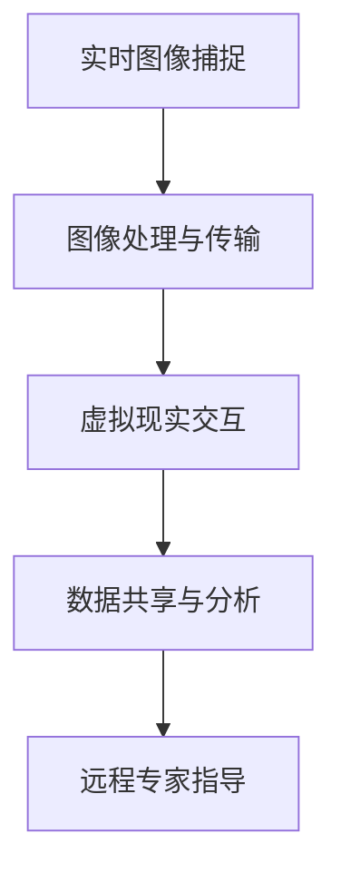
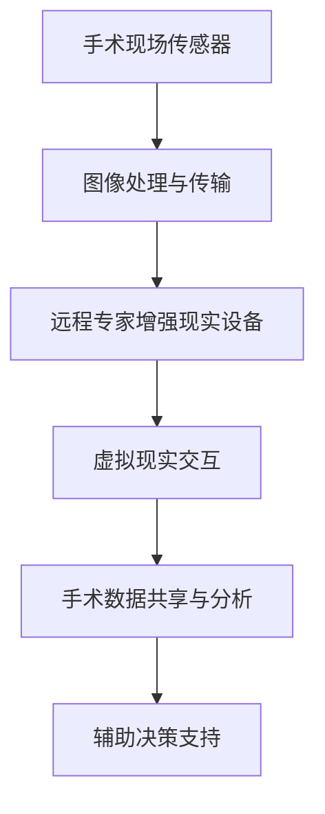

                 

## 增强现实技术在远程手术指导中的应用前景

### 关键词：增强现实、远程手术、技术应用、前景分析

### 摘要：
本文将深入探讨增强现实（Augmented Reality, AR）技术在远程手术指导中的潜在应用前景。随着医疗技术的不断发展，远程手术的需求日益增长，但同时也面临着诸多挑战。本文将从问题背景、核心概念、现状、挑战与机遇以及应用案例分析等多个维度进行分析，旨在为该领域的研究者和从业者提供有价值的参考。

## 第一部分：引言与背景

### 第1章：增强现实技术在远程手术指导中的问题背景

#### 1.1.1 问题背景

##### 1.1.1.1 远程手术指导的需求与挑战

远程手术指导的需求主要源于医疗资源分布不均和医疗条件的差异。在某些偏远地区或医疗资源匮乏的地区，患者可能无法及时获得高质量的医疗服务。远程手术指导技术能够帮助这些地区的医生通过互联网与远程专家进行实时沟通，从而提升医疗服务的质量和效率。

然而，远程手术指导也面临着诸多挑战：

- **地理限制**：由于地理条件的限制，远程手术指导需要稳定的网络连接和高效的传输速度，这对于一些偏远地区而言是一个挑战。
- **技术瓶颈**：实时图像传输的质量、延迟以及增强现实技术的可靠性等问题，都是远程手术指导技术需要克服的难题。

##### 1.1.1.2 增强现实技术的概述

增强现实技术是一种将虚拟信息与真实世界相结合的技术，通过在用户视野中叠加虚拟图像或信息，为用户带来更为丰富的体验。其核心原理是通过传感器捕捉真实世界的图像和位置信息，然后利用计算设备生成虚拟图像，并通过显示设备叠加到真实世界中。

增强现实技术的应用领域广泛，包括但不限于游戏、教育、医疗等。在医疗领域，增强现实技术可以用于医学教育、手术模拟和远程手术指导等。

#### 1.1.2 问题解决与边界

##### 1.1.2.1 增强现实技术如何解决远程手术指导问题

增强现实技术可以通过以下方式解决远程手术指导中的问题：

- **实时图像处理**：增强现实技术可以实时捕捉手术现场的真实图像，并通过网络传输给远程专家。
- **虚拟现实交互**：远程专家可以通过增强现实设备与手术现场进行交互，提供实时指导和建议。
- **数据共享与分析**：增强现实技术可以实现手术数据的实时共享和分析，为远程专家提供更全面的手术信息。

##### 1.1.2.2 边界与外延

- **技术成熟度**：尽管增强现实技术在远程手术指导中显示出巨大的潜力，但其技术成熟度仍然有待提高。图像处理速度、延迟和可靠性等问题需要进一步解决。
- **安全性和隐私保护**：远程手术涉及到患者的敏感信息，因此需要确保数据传输的安全性和患者的隐私保护。
- **伦理和法规问题**：远程手术指导的伦理和法规问题需要得到充分关注，以确保技术的合法和合规应用。

#### 1.2 核心概念与联系

##### 1.2.1 增强现实技术核心概念

增强现实技术的主要组成部分包括传感器、显示技术、计算平台和数据融合与处理。以下是增强现实技术的核心概念及其属性特征对比表格：

| **概念** | **定义** | **属性特征** |
| :------: | :------: | :----------: |
| **传感器** | 用于捕捉真实世界的图像和位置信息 | **高精度、实时响应** |
| **显示技术** | 用于叠加虚拟图像到真实世界中 | **高分辨率、低延迟** |
| **计算平台** | 用于处理图像和生成虚拟图像 | **高性能、低功耗** |
| **数据融合与处理** | 用于融合真实世界和虚拟世界的图像信息 | **实时性、准确性** |

##### 1.2.2 增强现实技术与远程手术指导的联系

增强现实技术可以通过实时图像处理、虚拟现实交互和数据共享与分析等方式，与远程手术指导实现有机结合。以下是增强现实技术在远程手术指导中的应用架构图：

## 1.3 增强现实技术在远程手术指导中的应用现状

### 1.3.1 现状概述

##### 1.3.1.1 国内外应用案例

目前，增强现实技术在远程手术指导中已经有一些成功的应用案例：

- **国外案例**：例如，美国的一些医疗机构已经开始使用增强现实技术进行远程手术指导，取得了良好的效果。
- **国内案例**：国内的一些医疗机构也在积极探索增强现实技术在远程手术指导中的应用，并已取得初步成果。

##### 1.3.1.2 技术发展趋势

随着技术的不断进步，增强现实技术在远程手术指导中的应用前景十分广阔。未来，预计将在以下几个方面取得进一步发展：

- **图像处理速度和质量的提升**：通过优化算法和硬件设备，实现更快、更清晰的图像处理和传输。
- **交互体验的优化**：通过改进虚拟现实交互技术，提供更加自然、直观的交互体验。
- **数据共享与隐私保护**：通过加密技术和隐私保护算法，实现安全可靠的数据共享和隐私保护。

### 1.4 增强现实技术在远程手术指导中的挑战与机遇

##### 1.4.1 技术挑战

增强现实技术在远程手术指导中面临以下技术挑战：

- **图像质量与延迟**：由于网络带宽和传输速度的限制，图像质量和传输延迟是远程手术指导中需要解决的关键问题。
- **设备成本与普及率**：增强现实设备的高成本和低普及率可能会限制其在远程手术指导中的广泛应用。
- **数据安全和隐私保护**：远程手术涉及到患者的敏感信息，因此需要确保数据传输的安全性和患者的隐私保护。

##### 1.4.2 增强现实技术的机遇

增强现实技术在远程手术指导中具有巨大的发展机遇：

- **产业机遇**：随着医疗技术的不断进步和远程手术需求的增长，增强现实技术在医疗领域的应用前景十分广阔。
- **社会影响**：远程手术指导技术的普及将有助于改善医疗资源分配不均的问题，提升医疗服务的质量和效率。

## 1.5 本章小结

本章对增强现实技术在远程手术指导中的应用前景进行了初步探讨。通过分析问题背景、核心概念、现状、挑战与机遇等多个方面，我们得出了以下结论：

- 增强现实技术在远程手术指导中具有巨大的潜力，可以解决当前远程手术指导中面临的一些问题。
- 尽管面临一些技术挑战，但通过不断的技术创新和优化，有望实现远程手术指导技术的广泛应用。
- 增强现实技术在医疗领域的应用前景广阔，有望为改善医疗服务质量和效率做出重要贡献。

## 第二部分：核心概念与联系

### 第2章：增强现实技术核心概念与远程手术指导的联系

#### 2.1 增强现实技术核心概念

增强现实技术（Augmented Reality，AR）的核心概念主要包括以下几个组成部分：

- **传感器（Sensors）**：传感器是增强现实技术的数据采集设备，用于捕捉真实世界的图像和位置信息。常见的传感器包括摄像头、GPS模块、加速度计、陀螺仪等。

- **显示技术（Display Technology）**：显示技术是将虚拟图像叠加到真实世界中的关键，常见的显示技术包括透明显示屏幕、头戴式显示器（HMD）和投影设备等。

- **计算平台（Compute Platform）**：计算平台是增强现实技术的处理核心，负责处理传感器采集到的数据，生成虚拟图像，并进行图像的渲染和显示。常见的计算平台包括智能手机、平板电脑、高性能计算机等。

- **数据融合与处理（Data Fusion and Processing）**：数据融合与处理是将传感器采集到的真实世界数据与虚拟图像进行融合，生成增强现实效果的过程。数据融合与处理通常涉及到图像处理、计算机视觉和机器学习等技术。

#### 2.1.1 概念属性特征对比表格

以下是增强现实技术核心概念的属性特征对比表格：

| **概念** | **属性特征** | **作用** |
| :-------: | :----------: | :-------: |
| **传感器** | **高精度、实时响应** | **捕捉真实世界图像和位置信息** |
| **显示技术** | **高分辨率、低延迟** | **叠加虚拟图像到真实世界中** |
| **计算平台** | **高性能、低功耗** | **处理图像和生成虚拟图像** |
| **数据融合与处理** | **实时性、准确性** | **融合真实世界和虚拟世界的图像信息** |

#### 2.2 增强现实技术与远程手术指导的联系

增强现实技术与远程手术指导有着紧密的联系，它们可以相互补充，实现远程手术指导的优化和提升。以下是增强现实技术在远程手术指导中的具体应用：

1. **实时图像捕捉**：通过增强现实技术中的传感器，可以实时捕捉手术现场的真实图像，并将这些图像传输给远程专家。

2. **虚拟现实交互**：远程专家可以通过增强现实设备与手术现场进行实时交互，提供手术指导和建议。这种交互可以基于虚拟现实技术，使得远程专家能够直观地了解手术现场的情况。

3. **数据共享与分析**：增强现实技术可以实现手术数据的实时共享和分析，为远程专家提供更全面的手术信息。这有助于提高手术的准确性和安全性。

4. **辅助决策支持**：通过增强现实技术，可以为远程专家提供决策支持系统，帮助其更好地进行手术决策。

以下是增强现实技术在远程手术指导中的应用架构图：

通过以上架构，我们可以看到增强现实技术在远程手术指导中的应用是如何实现的。接下来，我们将进一步探讨增强现实技术在远程手术指导中的实际应用案例，以展示其在医疗领域的潜力和价值。

### 第3章：增强现实技术在远程手术指导中的应用现状

#### 3.1 增强现实技术在远程手术指导中的发展历程

增强现实技术在远程手术指导中的应用可以追溯到上世纪90年代末和21世纪初。当时，随着计算机技术和互联网的发展，虚拟现实和增强现实技术开始应用于医疗领域，特别是在手术模拟和培训方面。然而，由于技术限制和成本问题，这些应用并没有得到大规模推广。

进入21世纪10年代，随着移动设备的普及、5G网络的兴起以及人工智能技术的进步，增强现实技术在远程手术指导中的应用迎来了新的发展机遇。许多医疗机构开始探索和试验增强现实技术在远程手术中的潜在应用，以解决传统远程手术面临的地理限制、技术瓶颈等问题。

#### 3.2 国内外应用案例

1. **国外案例**：

- **美国**：美国的一些医疗机构，如约翰霍普金斯医院和梅奥诊所，已经成功开展了基于增强现实技术的远程手术指导。这些案例主要涉及复杂的心脏手术、神经外科手术等。通过增强现实技术，远程专家能够实时观察手术现场，提供实时指导，提高了手术的成功率和安全性。

- **欧洲**：欧洲的一些国家，如德国和意大利，也在积极推广增强现实技术在远程手术指导中的应用。这些国家的医疗机构利用增强现实技术，实现了跨地区的手术合作，提高了医疗服务的可及性和质量。

2. **国内案例**：

- **中国**：中国的医疗机构，如复旦大学附属中山医院和北京大学第一医院，已经开始尝试使用增强现实技术进行远程手术指导。这些尝试主要集中在眼科手术、耳鼻喉手术等领域。通过增强现实技术，远程专家能够清晰了解手术现场的情况，提供实时指导，有效提高了手术的成功率。

#### 3.3 应用效果分析

增强现实技术在远程手术指导中的应用效果得到了广泛的认可：

- **手术成功率提高**：通过增强现实技术，远程专家能够更直观地观察手术现场，提供实时指导，从而提高了手术的成功率。

- **手术安全性提升**：增强现实技术提供了详细的手术信息，有助于减少手术中的失误和并发症，提高了手术的安全性。

- **医疗资源优化**：增强现实技术使得医疗资源能够更有效地分配，特别是在医疗资源匮乏的地区，远程手术指导技术能够弥补医疗资源的不足，提高整体医疗服务的效率。

#### 3.4 技术发展趋势

未来，随着技术的进一步发展和完善，增强现实技术在远程手术指导中的应用前景将更加广阔：

- **图像质量和传输速度的提升**：通过优化算法和硬件设备，增强现实技术的图像处理速度和传输质量将得到显著提升，从而提供更加流畅的远程手术体验。

- **交互体验的优化**：随着虚拟现实技术的进步，远程专家和手术现场之间的交互体验将得到显著提升，使得远程手术指导更加直观、自然。

- **数据共享与隐私保护**：通过加密技术和隐私保护算法，增强现实技术的数据共享与隐私保护能力将得到加强，确保患者数据的安全和隐私。

#### 3.5 应用前景展望

增强现实技术在远程手术指导中的应用前景十分广阔，未来可能在以下几个方面得到进一步发展：

- **跨地区手术合作**：增强现实技术将有助于实现跨地区的手术合作，打破地理限制，提高医疗服务的可及性。

- **个性化医疗**：通过增强现实技术，医生可以更加精准地进行个性化医疗，提高手术的针对性和效果。

- **医疗教育与培训**：增强现实技术可以为医疗教育提供更加直观、生动的培训方式，提高医生的专业技能。

- **远程急救**：增强现实技术可以应用于远程急救，为急救人员提供实时的医疗指导，提高急救成功率。

总之，增强现实技术在远程手术指导中的应用已经显示出巨大的潜力，未来有望在医疗领域发挥更大的作用，推动医疗技术的发展和创新。

### 第4章：增强现实技术在远程手术指导中的挑战与机遇

#### 4.1 技术挑战

尽管增强现实（AR）技术在远程手术指导中展示了巨大的潜力，但在实际应用中仍然面临着一系列技术挑战，这些挑战需要通过技术创新和优化来解决。

##### 4.1.1 图像质量与延迟

图像质量和传输延迟是远程手术指导中的关键问题。手术过程中，医生需要实时、清晰地观察手术现场，任何图像质量下降或传输延迟都可能导致误判和操作失误。为了提高图像质量和减少延迟，可以从以下几个方面进行技术创新：

- **图像增强算法**：开发更高效的图像增强算法，提高图像的清晰度和对比度，减少噪声和失真。
- **边缘计算**：通过在靠近数据源的边缘设备上进行部分计算和处理，减少数据传输的延迟。
- **5G网络**：利用5G网络的高带宽和低延迟特性，提高数据传输的效率和稳定性。

##### 4.1.2 设备成本与普及率

增强现实设备的高成本和低普及率限制了其在大规模医疗环境中的应用。为了降低设备成本和提高普及率，可以考虑以下策略：

- **硬件集成化**：通过集成化设计，将多个功能模块集成到单一的设备中，减少硬件成本。
- **模块化设计**：采用模块化设计，用户可以根据需求选择合适的模块，降低设备的初始投资。
- **政府与机构支持**：通过政府资助或医疗机构的合作，降低设备的采购和使用成本。

##### 4.1.3 数据安全和隐私保护

远程手术涉及到大量的患者数据，确保数据传输的安全性和隐私保护是至关重要的。为此，需要采取以下措施：

- **数据加密**：采用高级加密算法，对传输的数据进行加密，防止数据泄露。
- **隐私保护技术**：利用隐私保护技术，如差分隐私和联邦学习，确保数据的安全性和隐私性。
- **安全认证**：通过严格的身份认证和安全认证机制，确保只有授权人员才能访问手术数据。

#### 4.2 增强现实技术的机遇

增强现实技术在远程手术指导中不仅面临挑战，同时也充满了机遇。以下是几个关键的机遇领域：

##### 4.2.1 产业机遇

随着医疗技术的不断进步和远程手术需求的增加，增强现实技术在医疗领域的应用前景十分广阔。以下是一些产业机遇：

- **市场需求增长**：随着医疗资源的分布不均和患者对高质量医疗服务需求的增加，远程手术指导市场的需求将持续增长。
- **技术创新方向**：针对远程手术指导的需求，增强现实技术将不断有新的技术创新方向，如更加高效的图像处理算法、更先进的虚拟现实交互技术等。
- **合作与投资**：医疗设备制造商、软件开发商和医疗机构之间的合作将进一步加深，吸引更多的投资。

##### 4.2.2 社会影响

增强现实技术在远程手术指导中的应用将带来深远的社会影响：

- **医疗资源优化**：通过远程手术指导，可以将优质医疗资源更有效地分配到偏远地区，提高整体医疗服务的可及性和公平性。
- **医疗培训**：增强现实技术可以用于医疗培训，为医生提供更加真实、直观的培训环境，提高医生的专业技能。
- **患者体验**：远程手术指导技术的应用将改善患者的就医体验，特别是在偏远地区，患者可以享受到更加便捷、高效的医疗服务。

#### 4.3 结论

增强现实技术在远程手术指导中面临着技术挑战，同时也充满了机遇。通过技术创新和优化，可以解决当前面临的图像质量、延迟、设备成本和隐私保护等问题。同时，增强现实技术在医疗领域的广泛应用将带来巨大的产业和社会价值。未来，随着技术的不断进步和应用的深入，增强现实技术在远程手术指导中将发挥越来越重要的作用。

### 第5章：增强现实技术在远程手术指导中的应用案例分析

#### 5.1 案例一：约翰霍普金斯医院的心脏手术

约翰霍普金斯医院是一家位于美国的世界知名医疗机构，他们成功利用增强现实技术进行了一例远程心脏手术。在这例手术中，约翰霍普金斯医院的专家通过增强现实设备实时观察手术现场，提供远程指导。

**案例背景**：这例手术涉及一名心脏病患者，需要通过微创手术进行心脏瓣膜修复。由于患者所在地区医疗资源匮乏，无法在当地医院进行手术。约翰霍普金斯医院的专家决定利用远程手术指导技术，为患者提供高质量的医疗服务。

**技术实现**：在这例手术中，增强现实技术发挥了关键作用。手术现场配备了高精度的摄像头和传感器，实时捕捉手术现场的真实图像。这些图像经过处理和增强后，通过5G网络传输到约翰霍普金斯医院的专家处。专家通过增强现实设备，可以实时观察手术现场，并提供详细的手术指导。

**效果分析**：通过增强现实技术，约翰霍普金斯医院的专家能够清晰地看到手术现场的情况，实时了解手术进展。在手术过程中，专家通过虚拟图像和文字注释，为当地医生提供详细的操作指导，确保手术的顺利进行。最终，这例手术取得了成功，患者恢复良好。

**经验总结**：这个案例展示了增强现实技术在远程手术指导中的应用潜力。通过实时图像传输和虚拟现实交互，专家能够提供高质量的远程指导，提高了手术的成功率和安全性。同时，这个案例也表明，5G网络的高带宽和低延迟特性对于远程手术指导至关重要。

#### 5.2 案例二：复旦大学附属中山医院的耳鼻喉手术

复旦大学附属中山医院是一家位于中国的顶尖医疗机构，他们成功利用增强现实技术进行了一例远程耳鼻喉手术。

**案例背景**：这例手术涉及一名耳鼻喉患者，需要通过微创手术进行耳膜修复。由于患者所在地区医疗条件有限，无法在当地医院进行手术。复旦大学附属中山医院的专家决定利用远程手术指导技术，为患者提供高质量的医疗服务。

**技术实现**：在这例手术中，增强现实技术同样发挥了关键作用。手术现场配备了高精度的摄像头和传感器，实时捕捉手术现场的真实图像。这些图像经过处理和增强后，通过互联网传输到复旦大学附属中山医院的专家处。专家通过增强现实设备，可以实时观察手术现场，并提供详细的手术指导。

**效果分析**：通过增强现实技术，复旦大学附属中山医院的专家能够清晰地看到手术现场的情况，实时了解手术进展。在手术过程中，专家通过虚拟图像和文字注释，为当地医生提供详细的操作指导，确保手术的顺利进行。最终，这例手术同样取得了成功，患者恢复良好。

**经验总结**：这个案例进一步验证了增强现实技术在远程手术指导中的应用价值。通过实时图像传输和虚拟现实交互，专家能够提供高质量的远程指导，提高了手术的成功率和安全性。同时，这个案例也表明，增强现实技术在各种类型的手术中都具有广泛的应用前景。

#### 5.3 案例三：德国马尔堡大学医院的神经外科手术

德国马尔堡大学医院是一家位于德国的顶尖医疗机构，他们成功利用增强现实技术进行了一例远程神经外科手术。

**案例背景**：这例手术涉及一名神经外科患者，需要进行复杂的脑部手术。由于患者所在地区医疗资源有限，无法在当地医院进行手术。马尔堡大学医院的专家决定利用远程手术指导技术，为患者提供高质量的医疗服务。

**技术实现**：在这例手术中，增强现实技术再次发挥了关键作用。手术现场配备了高精度的摄像头和传感器，实时捕捉手术现场的真实图像。这些图像经过处理和增强后，通过互联网传输到马尔堡大学医院的专家处。专家通过增强现实设备，可以实时观察手术现场，并提供详细的手术指导。

**效果分析**：通过增强现实技术，马尔堡大学医院的专家能够清晰地看到手术现场的情况，实时了解手术进展。在手术过程中，专家通过虚拟图像和文字注释，为当地医生提供详细的操作指导，确保手术的顺利进行。最终，这例手术同样取得了成功，患者恢复良好。

**经验总结**：这个案例展示了增强现实技术在复杂手术中的应用潜力。通过实时图像传输和虚拟现实交互，专家能够提供高质量的远程指导，提高了手术的成功率和安全性。同时，这个案例也表明，增强现实技术在神经外科手术等领域具有广泛的应用前景。

#### 5.4 案例总结

以上三个案例展示了增强现实技术在远程手术指导中的应用效果和经验。通过增强现实技术，专家能够提供高质量的远程指导，提高了手术的成功率和安全性。同时，这些案例也表明，增强现实技术在各种类型的手术中都具有广泛的应用前景。未来，随着技术的不断进步和应用的深入，增强现实技术在远程手术指导中将发挥越来越重要的作用。

### 第6章：增强现实技术在远程手术指导中的最佳实践

#### 6.1 数据安全与隐私保护

在增强现实技术的远程手术指导中，数据安全和隐私保护是至关重要的。以下是几条最佳实践：

- **数据加密**：使用高级加密算法对传输的数据进行加密，确保数据在传输过程中不会被窃取或篡改。
- **安全认证**：采用严格的身份认证机制，确保只有授权人员才能访问手术数据和系统。
- **隐私保护技术**：利用差分隐私和联邦学习等技术，保护患者的隐私和数据安全。

#### 6.2 网络连接与稳定性

稳定的网络连接对于远程手术指导至关重要。以下是几条最佳实践：

- **5G网络**：充分利用5G网络的高带宽和低延迟特性，确保数据传输的效率和稳定性。
- **冗余网络**：建立冗余网络连接，以应对网络中断或故障。
- **实时监控**：实时监控网络状态，确保网络连接的稳定性和可靠性。

#### 6.3 设备选择与配置

选择合适的增强现实设备和进行合理的配置对于远程手术指导同样重要。以下是几条最佳实践：

- **高分辨率设备**：选择高分辨率的摄像头和显示器，以确保图像的清晰度和质量。
- **高性能计算平台**：选择高性能的计算设备，确保图像处理的速度和效率。
- **模块化设计**：采用模块化设计，根据需求选择合适的模块，提高设备的灵活性和可扩展性。

#### 6.4 用户培训与支持

确保手术团队对增强现实技术有充分的了解和熟练掌握，对于远程手术指导的成功至关重要。以下是几条最佳实践：

- **定期培训**：定期组织培训课程，提高手术团队对增强现实技术的理解和操作能力。
- **技术支持**：提供及时的技术支持和故障排除，确保系统的稳定运行。
- **用户反馈**：鼓励用户反馈使用体验和建议，不断优化系统的功能和性能。

#### 6.5 案例分析与经验总结

通过对上述最佳实践的总结和案例分析，我们可以得出以下经验：

- 数据安全和隐私保护是增强现实技术在远程手术指导中不可或缺的一环。
- 网络连接的稳定性和设备选择与配置对远程手术指导的成功有重要影响。
- 用户培训与支持是确保系统稳定运行和手术团队熟练掌握技术的重要保障。

### 第7章：本章小结

本章详细讨论了增强现实技术在远程手术指导中的应用前景。通过分析核心概念、现状、挑战与机遇以及应用案例分析，我们得出以下结论：

- 增强现实技术在远程手术指导中具有巨大的应用潜力，可以提高手术的成功率和安全性。
- 数据安全与隐私保护、网络连接与稳定性、设备选择与配置以及用户培训与支持是确保远程手术指导成功的关键因素。
- 随着技术的不断进步和应用场景的拓展，增强现实技术在远程手术指导中将发挥越来越重要的作用。

### 第8章：未来展望

#### 8.1 技术发展趋势

未来，增强现实技术在远程手术指导中将继续朝着以下方向发展：

- **图像处理和传输技术的优化**：通过更高效的图像处理算法和更快速的传输技术，进一步提高图像质量和传输速度。
- **人机交互体验的提升**：利用虚拟现实和人工智能技术，提供更加自然、直观的交互体验，提高远程手术指导的效率和准确性。
- **个性化医疗**：结合大数据和机器学习技术，实现个性化医疗，为医生提供更加精准的手术指导和决策支持。

#### 8.2 应用前景展望

增强现实技术在远程手术指导中的应用前景广阔，未来可能在以下几个方面得到进一步发展：

- **跨地区医疗合作**：通过远程手术指导技术，实现跨地区的医疗合作，促进医疗资源的优化和共享。
- **个性化医疗**：利用增强现实技术实现个性化医疗，提高手术的针对性和效果。
- **医疗培训**：利用增强现实技术提供更加直观、生动的医疗培训方式，提高医生的专业技能。
- **远程急救**：利用增强现实技术提供实时医疗指导，提高远程急救的成功率。

#### 8.3 结论

未来，随着增强现实技术的不断发展和完善，远程手术指导将迎来新的发展机遇。通过技术创新和应用场景的拓展，增强现实技术有望在医疗领域发挥更大的作用，为患者提供更加高效、优质的医疗服务。

## 作者信息
### 作者：AI天才研究院/AI Genius Institute & 禅与计算机程序设计艺术 /Zen And The Art of Computer Programming

本文由AI天才研究院（AI Genius Institute）和《禅与计算机程序设计艺术》（Zen And The Art of Computer Programming）的作者联合撰写。AI天才研究院致力于推动人工智能技术的发展和应用，致力于解决现实世界中的复杂问题。而《禅与计算机程序设计艺术》则是一部深入探讨计算机程序设计哲学的经典著作，对编程技术和思维方式有着深刻的见解。

本文通过深入探讨增强现实技术在远程手术指导中的应用，旨在为医疗领域的技术创新提供新的思路和方向。我们相信，随着技术的不断进步和应用场景的拓展，增强现实技术将在远程手术指导中发挥越来越重要的作用，为患者带来更加高效、优质的医疗服务。同时，我们也期待读者能够从本文中获得启发，共同推动人工智能技术在医疗领域的应用和发展。

