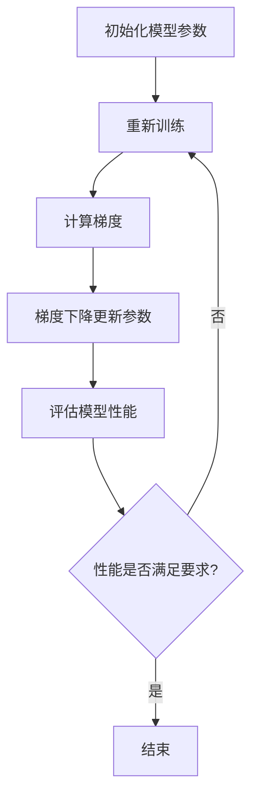
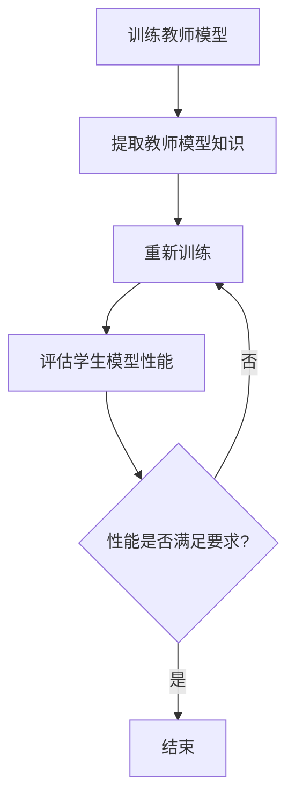
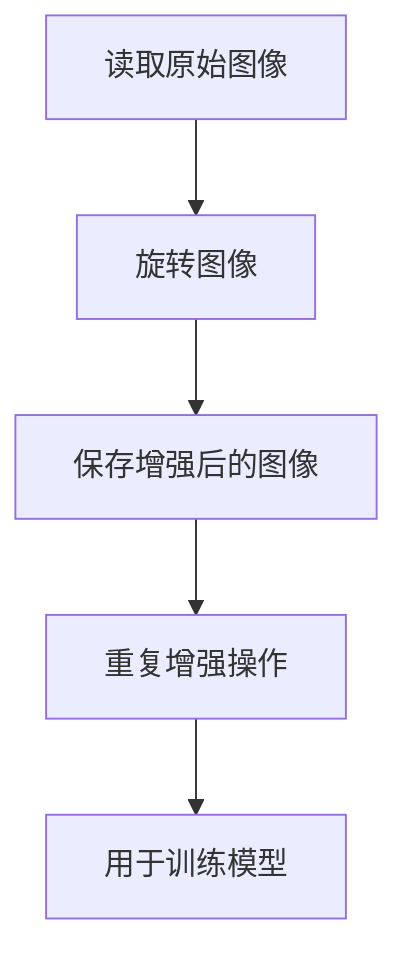
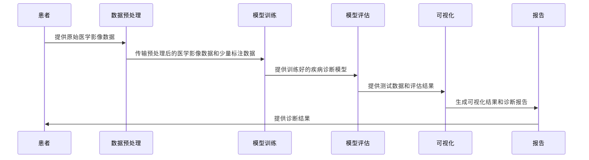

                 

### 第1章: 少样本学习背景介绍

#### 1.1 问题背景

在人工智能和机器学习的迅猛发展过程中，传统的模型训练方法依赖于大量标注数据。然而，在实际应用中，获取大量高质量标注数据往往成本高昂且耗时。尤其在医疗影像、自动驾驶等需要高度精确的领域，标注数据的需求量巨大，但获取过程复杂且受限。此外，某些场景下的数据隐私问题也限制了大规模数据的共享和公开。这种背景下，少样本学习（Few-Shot Learning）应运而生，旨在解决在样本量极其有限的情况下，如何有效地训练和评估模型的问题。

#### 1.2 问题定义

少样本学习是一种机器学习技术，它关注于在仅有少量样本的情况下，如何快速、准确地训练出高性能模型。具体来说，少样本学习模型需要在非常有限的样本数据上进行训练，并在测试阶段展现出良好的泛化能力。问题定义的核心在于：

- **样本数量**：通常定义样本数量远小于传统机器学习所需的数量，例如1到10个样本。
- **类别数量**：在某些少样本学习任务中，类别数量也可能较少，需要模型能够适应多种不同的类别。

#### 1.3 问题解决

少样本学习的解决方案主要分为以下几个方向：

1. **元学习（Meta-Learning）**：通过在多个任务上训练模型，使其能够快速适应新任务。元学习算法如MAML、Reptile等，能够在非常短的训练时间内适应新的样本。
   
2. **模型蒸馏（Model Distillation）**：将一个复杂的模型的知识传递给一个较小的模型。这种技术通过“教学”的方式来使小模型学习到大模型的知识，从而在小样本情况下获得较好的性能。

3. **集成学习（Ensemble Learning）**：通过结合多个模型来提高性能。在少样本学习中，可以使用不同的算法或不同的数据预处理方法，然后通过集成策略来优化整体性能。

4. **数据增强（Data Augmentation）**：通过增加训练数据量来改善模型的泛化能力。尽管原始数据有限，但可以通过数据增强技术生成更多样化的训练样本。

#### 1.4 边界与外延

少样本学习的边界在于：

- **样本数量**：通常认为样本数量小于10的为少样本学习，但这个定义可以根据具体任务进行调整。
- **类别数量**：当类别数量较少时，模型需要具备较强的泛化能力。

少样本学习的外延包括：

- **迁移学习**：虽然迁移学习与少样本学习有重叠，但迁移学习通常关注于在源域和目标域相似度较高的情况下，如何利用已有的模型知识进行快速适应。
- **零样本学习**：在样本数据为零的情况下，如何进行模型训练，零样本学习是少样本学习的极端形式。

#### 1.5 概念结构与核心要素组成

少样本学习的概念结构可以概括为以下几个核心要素：

- **样本数据**：用于训练和测试的数据，样本数量有限。
- **模型架构**：适合少样本学习任务的模型设计，如基于神经网络的架构。
- **学习算法**：适用于少样本学习场景的算法，如元学习、模型蒸馏等。
- **评估指标**：用于评估少样本学习模型性能的指标，如准确率、F1分数等。
- **优化策略**：包括数据增强、模型集成等优化方法，以提高模型性能。

这些要素共同构成了少样本学习的技术框架，使得模型能够在数据稀缺的情况下依然能够展现出强大的学习能力和泛化能力。

---

**第2章: 少样本学习核心概念与联系**

少样本学习涉及多个核心概念，这些概念之间相互联系，共同构成了少样本学习的理论基础和实践方法。以下是这些核心概念的详细解析以及它们之间的联系。

#### 2.1 少样本学习概述

**定义**：少样本学习是一种机器学习技术，其主要目标是在仅有少量样本的情况下训练出高性能模型。

**作用**：少样本学习在数据稀缺的场景下尤为重要，如医学影像分析、语音识别等。

**特点**：

- **样本数量有限**：通常样本数量远小于传统机器学习所需的数量。
- **模型泛化能力要求高**：在样本有限的情况下，模型必须具有强大的泛化能力。

#### 2.2 核心概念解析

**1. 元学习（Meta-Learning）**

**定义**：元学习是一种在多个任务上训练模型，使其能够快速适应新任务的学习方法。

**原理**：

- **任务迁移**：通过在多个任务上训练，模型学会快速适应新的任务。
- **快速适应**：模型在新任务上的表现依赖于在之前任务上的训练，从而实现快速适应。

**应用**：

- **MAML（Model-Agnostic Meta-Learning）**：通过优化梯度更新策略，使模型在新任务上快速适应。
- **Reptile**：通过迭代更新模型参数，实现模型的快速适应。

**2. 模型蒸馏（Model Distillation）**

**定义**：模型蒸馏是一种将一个复杂模型的知识传递给一个较小的模型的方法。

**原理**：

- **知识传递**：通过训练小模型来学习大模型的特征和决策过程。
- **效率提升**：小模型在大模型的知识指导下，能够更快地适应新的样本。

**应用**：

- **Teacher-Student模型**：将大模型作为“教师”，小模型作为“学生”，通过学习“教师”的输出，实现知识的传递。
- **信息熵优化**：通过优化小模型的输出分布，使其更接近“教师”的输出分布。

**3. 数据增强（Data Augmentation）**

**定义**：数据增强是通过生成更多样化的训练样本，提高模型泛化能力的技术。

**原理**：

- **样本多样性**：通过增加样本的多样性，模型能够更好地适应不同的数据分布。
- **减少过拟合**：数据增强能够减少模型对训练数据的依赖，降低过拟合风险。

**应用**：

- **图像旋转、缩放**：通过改变图像的视角和尺寸，增加样本的多样性。
- **噪声注入**：在数据中加入噪声，使模型学习到噪声下的特征表示。

#### 2.3 概念属性特征对比表格

以下表格对比了元学习、模型蒸馏和数据增强的属性特征：

| 特征         | 元学习                 | 模型蒸馏                 | 数据增强                 |
| ------------ | ---------------------- | ------------------------ | ------------------------ |
| **定义**     | 在多个任务上训练模型   | 将知识从大模型传递给小模型 | 增加训练样本的多样性     |
| **原理**     | 任务迁移与快速适应     | 知识传递与效率提升       | 样本多样性与过拟合减少   |
| **应用**     | MAML、Reptile         | Teacher-Student模型       | 图像旋转、噪声注入       |
| **优势**     | 快速适应新任务         | 小模型高性能             | 提高模型泛化能力         |
| **劣势**     | 训练时间较长           | 需要大模型作为基础       | 无法解决样本稀缺的根本问题 |

#### 2.4 ER实体关系图架构

为了更好地理解少样本学习中的核心概念及其联系，我们可以使用ER（Entity-Relationship）实体关系图进行描述。以下是一个简化的ER图，展示了元学习、模型蒸馏和数据增强之间的关系：

```mermaid
erDiagram
    Model |--| Meta-Learning : implements
    Model |--| Model Distillation : is distilled from
    Model |--| Data Augmentation : augments
    Meta-Learning ||--| Model Adaptation
    Model Distillation ||--| Knowledge Transfer
    Data Augmentation ||--| Sample Diversification
```

在这个ER图中，模型是核心实体，元学习、模型蒸馏和数据增强分别通过不同的方式与模型相关联。元学习通过实现模型快速适应新任务，模型蒸馏通过知识传递实现小模型的高性能，而数据增强通过增加样本多样性提高模型的泛化能力。

---

**第3章: 少样本学习算法原理讲解**

在了解了少样本学习的基本概念和核心概念之后，我们接下来将深入探讨几种主要的少样本学习算法，通过Mermaid流程图和Python代码示例来详细阐述这些算法的原理和操作步骤。

#### 3.1 算法概述

少样本学习算法主要分为元学习（Meta-Learning）、模型蒸馏（Model Distillation）和数据增强（Data Augmentation）等。以下是这些算法的简要介绍：

1. **元学习（Meta-Learning）**：
   - 基本思想：在多个任务上训练模型，使其能够快速适应新任务。
   - 代表算法：MAML（Model-Agnostic Meta-Learning）、Reptile。

2. **模型蒸馏（Model Distillation）**：
   - 基本思想：将一个复杂模型的知识传递给一个较小的模型。
   - 代表算法：Teacher-Student模型。

3. **数据增强（Data Augmentation）**：
   - 基本思想：通过生成更多样化的训练样本，提高模型泛化能力。
   - 代表方法：图像旋转、缩放、噪声注入。

#### 3.2 Mermaid流程图

为了更好地理解这些算法的原理，我们将使用Mermaid流程图展示它们的操作步骤。

**元学习（MAML）流程图**：



**模型蒸馏（Teacher-Student模型）流程图**：



**数据增强（图像旋转）流程图**：



#### 3.3 Python代码示例

**元学习（MAML算法）Python代码示例**：

```python
import numpy as np
import tensorflow as tf

# 初始化模型参数
model = tf.keras.Sequential([
    tf.keras.layers.Dense(10, activation='relu'),
    tf.keras.layers.Dense(1, activation='sigmoid')
])

def meta_learning(loss_fn, optimizer, num_epochs, task_data, task_labels):
    # 计算梯度
    with tf.GradientTape(persistent=True) as tape:
        logits = model(task_data)
        loss = loss_fn(logits, task_labels)
    gradients = tape.gradient(loss, model.trainable_variables)

    # 梯度下降更新参数
    optimizer.apply_gradients(zip(gradients, model.trainable_variables))

    # 评估模型性能
    logits = model(task_data)
    acc = tf.keras.metrics.BinaryCrossEntropy()(logits, task_labels)
    return acc

# 训练模型
for epoch in range(num_epochs):
    acc = meta_learning(
        loss_fn=tf.keras.losses.BinaryCrossentropy(),
        optimizer=tf.keras.optimizers.Adam(),
        num_epochs=1,
        task_data=task_data,
        task_labels=task_labels
    )
    print(f'Epoch {epoch+1}, Accuracy: {acc.numpy()}')

```

**模型蒸馏（Teacher-Student模型）Python代码示例**：

```python
import tensorflow as tf

# 训练教师模型
teacher_model = tf.keras.Sequential([
    tf.keras.layers.Dense(10, activation='relu'),
    tf.keras.layers.Dense(1, activation='sigmoid')
])
teacher_model.compile(optimizer='adam', loss='binary_crossentropy')

teacher_model.fit(x_train, y_train, epochs=10, batch_size=32)

# 提取教师模型知识
teacher_weights = teacher_model.get_weights()

# 训练学生模型
student_model = tf.keras.Sequential([
    tf.keras.layers.Dense(10, activation='relu', kernel_initializer='identity'),
    tf.keras.layers.Dense(1, activation='sigmoid', kernel_initializer='identity')
])
student_model.compile(optimizer='adam', loss='binary_crossentropy')

student_model.fit(x_train, y_train, epochs=10, batch_size=32, initial_weights=teacher_weights)

# 评估学生模型性能
student_logits = student_model.predict(x_test)
student_acc = tf.keras.metrics.BinaryCrossEntropy()(student_logits, y_test)
print(f'Student Model Accuracy: {student_acc.numpy()}')

```

**数据增强（图像旋转）Python代码示例**：

```python
import tensorflow as tf
import cv2

def rotate_image(image, angle):
    (h, w) = image.shape[:2]
    center = (w / 2, h / 2)
    M = cv2.getRotationMatrix2D(center, angle, 1.0)
    rotated = cv2.warpAffine(image, M, (w, h))
    return rotated

# 读取原始图像
image = cv2.imread('original_image.jpg')

# 旋转图像
rotated_image = rotate_image(image, 45)

# 保存增强后的图像
cv2.imwrite('rotated_image.jpg', rotated_image)

```

通过上述流程图和代码示例，我们可以更直观地理解少样本学习算法的原理和操作步骤。在实际应用中，这些算法需要根据具体任务和数据特点进行调整和优化，以达到最佳性能。

---

**第4章: 少样本学习数学模型和公式**

在深入理解少样本学习算法的原理之后，我们需要掌握相关的数学模型和公式。这些模型和公式是构建和优化少样本学习算法的重要工具。以下我们将使用LaTeX格式详细展示这些数学模型和公式，并进行详细讲解和举例说明。

#### 4.1 数学模型概述

少样本学习的数学模型主要包括以下几部分：

- **损失函数**：用于衡量模型预测值与真实值之间的差距。
- **优化目标**：用于指导模型参数更新，以最小化损失函数。
- **特征表示**：用于描述样本数据的特征向量。

#### 4.2 LaTeX格式数学公式

**1. 损失函数**

损失函数是少样本学习中的重要组成部分，常用的损失函数包括：

$$
L(\theta) = -\frac{1}{m} \sum_{i=1}^{m} y_i \log(p(\hat{y}_i | \theta))
$$

其中，$m$ 表示样本数量，$y_i$ 表示第 $i$ 个样本的真实标签，$\hat{y}_i$ 表示模型对第 $i$ 个样本的预测标签，$\theta$ 表示模型参数。

**2. 优化目标**

优化目标用于指导模型参数更新，以最小化损失函数。常用的优化目标包括：

$$
\min_{\theta} L(\theta)
$$

其中，$L(\theta)$ 表示损失函数。

**3. 特征表示**

特征表示用于描述样本数据的特征向量，常用的特征表示方法包括：

$$
\phi(x) = \{ \phi_1(x), \phi_2(x), ..., \phi_k(x) \}
$$

其中，$x$ 表示样本数据，$\phi(x)$ 表示特征向量，$k$ 表示特征数量。

#### 4.3 详细讲解

**1. 损失函数**

损失函数用于衡量模型预测值与真实值之间的差距。在少样本学习中，常用的损失函数是交叉熵损失函数。交叉熵损失函数的数学公式如下：

$$
L(\theta) = -\frac{1}{m} \sum_{i=1}^{m} y_i \log(p(\hat{y}_i | \theta))
$$

其中，$m$ 表示样本数量，$y_i$ 表示第 $i$ 个样本的真实标签，$\hat{y}_i$ 表示模型对第 $i$ 个样本的预测标签，$\theta$ 表示模型参数。

交叉熵损失函数的值越低，表示模型的预测效果越好。在训练过程中，我们的目标是不断优化模型参数 $\theta$，以最小化损失函数 $L(\theta)$。

**2. 优化目标**

优化目标是用于指导模型参数更新，以最小化损失函数。在少样本学习中，我们通常使用梯度下降算法来优化模型参数。梯度下降算法的基本思想是沿着损失函数的负梯度方向更新参数，以最小化损失函数。

$$
\theta_{\text{new}} = \theta_{\text{current}} - \alpha \nabla_{\theta} L(\theta)
$$

其中，$\theta_{\text{new}}$ 表示更新后的参数，$\theta_{\text{current}}$ 表示当前参数，$\alpha$ 表示学习率，$\nabla_{\theta} L(\theta)$ 表示损失函数关于参数 $\theta$ 的梯度。

**3. 特征表示**

特征表示用于描述样本数据的特征向量。在少样本学习中，特征表示的方法对模型的性能有着重要影响。常用的特征表示方法包括：

- **线性变换**：通过线性变换将原始数据映射到新的特征空间。
- **非线性变换**：通过非线性变换增加特征的表达能力。

$$
\phi(x) = \{ \phi_1(x), \phi_2(x), ..., \phi_k(x) \}
$$

其中，$x$ 表示样本数据，$\phi(x)$ 表示特征向量，$k$ 表示特征数量。

通过选择合适的特征表示方法，我们可以提高模型的泛化能力，使其在少样本情况下也能取得较好的性能。

#### 4.4 举例说明

假设我们有一个二分类问题，模型参数为 $\theta = [w_1, w_2]$，样本数据为 $x = [x_1, x_2]$，真实标签为 $y = [y_1, y_2]$，预测标签为 $\hat{y} = [\hat{y}_1, \hat{y}_2]$。我们使用交叉熵损失函数和梯度下降算法来优化模型参数。

**1. 损失函数计算**

$$
L(\theta) = -\frac{1}{2} \left[ y_1 \log(\hat{y}_1) + (1 - y_1) \log(1 - \hat{y}_1) + y_2 \log(\hat{y}_2) + (1 - y_2) \log(1 - \hat{y}_2) \right]
$$

**2. 梯度计算**

$$
\nabla_{\theta} L(\theta) = \left[ \frac{\partial L}{\partial w_1}, \frac{\partial L}{\partial w_2} \right]
$$

$$
\nabla_{w_1} L = \frac{\partial L}{\partial w_1} = \frac{\partial}{\partial w_1} \left[ y_1 \log(\hat{y}_1) + (1 - y_1) \log(1 - \hat{y}_1) + y_2 \log(\hat{y}_2) + (1 - y_2) \log(1 - \hat{y}_2) \right]
$$

$$
\nabla_{w_2} L = \frac{\partial L}{\partial w_2} = \frac{\partial}{\partial w_2} \left[ y_1 \log(\hat{y}_1) + (1 - y_1) \log(1 - \hat{y}_1) + y_2 \log(\hat{y}_2) + (1 - y_2) \log(1 - \hat{y}_2) \right]
$$

**3. 参数更新**

$$
\theta_{\text{new}} = \theta_{\text{current}} - \alpha \nabla_{\theta} L(\theta)
$$

其中，$\alpha$ 为学习率，通常取值为 $0.01$。

通过上述计算，我们可以得到更新后的模型参数 $\theta_{\text{new}}$。重复这个过程，直到损失函数 $L(\theta)$ 达到最小值，或者达到预设的迭代次数。

通过上述数学模型和公式的讲解以及举例说明，我们可以更好地理解少样本学习算法的原理和操作步骤。在实际应用中，这些公式和模型需要根据具体问题和数据特点进行调整和优化，以达到最佳性能。

---

**第5章: 少样本学习系统分析与架构设计**

为了深入探讨少样本学习在真实世界中的应用，我们需要对整个系统进行详细的分析与架构设计。本章将介绍一个典型的少样本学习系统，涵盖应用场景、系统功能设计、架构设计以及接口设计。

#### 5.1 应用场景介绍

少样本学习在多个领域都有广泛的应用，以下是几个典型的应用场景：

1. **医疗诊断**：在医学影像分析中，医生通常需要根据有限的病例数据来诊断疾病。少样本学习可以帮助模型在少量病例数据上快速适应并提高诊断准确性。
2. **自动驾驶**：自动驾驶系统在初期训练阶段可能无法获取大量道路数据。少样本学习可以帮助模型在有限的样本数据上快速适应不同的驾驶场景。
3. **语音识别**：在特定语音识别任务中，如方言识别或特定领域的语音识别，由于数据稀缺，少样本学习可以帮助模型在少量数据上实现高准确率。
4. **自然语言处理**：在文本分类、情感分析等任务中，少样本学习可以帮助模型在少量标注数据上快速适应新的类别。

#### 5.2 项目介绍

为了更好地说明少样本学习的系统架构设计，我们以一个医学影像诊断系统为例进行介绍。该系统旨在通过少样本学习技术，对医疗影像数据进行快速、准确的疾病诊断。

**系统目标**：

- 在仅有少量标注数据的情况下，训练出高精度的疾病诊断模型。
- 实现自动化的医学影像分析，辅助医生进行疾病诊断。

**系统功能**：

1. **数据预处理**：对医学影像数据（如X光片、CT扫描图像等）进行预处理，包括图像增强、去噪等。
2. **模型训练**：使用少样本学习算法（如元学习、模型蒸馏等）训练疾病诊断模型。
3. **模型评估**：通过测试数据评估模型的诊断准确性。
4. **可视化与报告生成**：将诊断结果可视化，并生成诊断报告。

#### 5.3 系统功能设计

在系统功能设计阶段，我们需要详细定义各个功能模块及其交互关系。以下是系统的主要功能模块：

1. **数据预处理模块**：
   - 功能：对医学影像数据进行预处理，包括图像增强、去噪等。
   - 输入：原始医学影像数据。
   - 输出：预处理后的医学影像数据。

2. **模型训练模块**：
   - 功能：使用少样本学习算法训练疾病诊断模型。
   - 输入：预处理后的医学影像数据、少量标注数据。
   - 输出：训练好的疾病诊断模型。

3. **模型评估模块**：
   - 功能：通过测试数据评估模型的诊断准确性。
   - 输入：测试数据、训练好的疾病诊断模型。
   - 输出：评估结果（如准确率、召回率等）。

4. **可视化与报告生成模块**：
   - 功能：将诊断结果可视化，并生成诊断报告。
   - 输入：评估结果、诊断报告模板。
   - 输出：可视化结果、诊断报告。

#### 5.4 系统架构设计

系统架构设计是确保系统高效、可靠运行的关键。以下是一个典型的少样本学习系统架构设计：


**架构设计要点**：

1. **数据流**：数据从数据预处理模块进入系统，经过模型训练模块，然后通过模型评估模块和可视化与报告生成模块输出诊断结果。
2. **模块交互**：各功能模块通过定义良好的接口进行交互，确保系统模块之间的高效协作。
3. **分布式计算**：对于大规模的医学影像数据处理和模型训练，可以采用分布式计算架构，以提高系统的处理速度和效率。

#### 5.5 系统接口设计

系统接口设计是确保功能模块之间高效协作的关键。以下是系统的主要接口设计：

1. **数据预处理接口**：
   - **输入接口**：接收原始医学影像数据，并返回预处理后的数据。
   - **输出接口**：提供预处理后的医学影像数据给模型训练模块。

2. **模型训练接口**：
   - **输入接口**：接收预处理后的医学影像数据和少量标注数据。
   - **输出接口**：返回训练好的疾病诊断模型。

3. **模型评估接口**：
   - **输入接口**：接收测试数据和训练好的疾病诊断模型。
   - **输出接口**：返回评估结果。

4. **可视化与报告生成接口**：
   - **输入接口**：接收评估结果和诊断报告模板。
   - **输出接口**：提供可视化结果和诊断报告。

#### 5.6 系统交互Mermaid序列图

为了更直观地展示系统模块之间的交互关系，我们可以使用Mermaid序列图进行描述。以下是系统交互的Mermaid序列图：



通过上述系统分析与架构设计，我们可以确保少样本学习系统在医学影像诊断等实际应用中能够高效、可靠地运行。在实际开发过程中，还需要根据具体需求和技术条件进行调整和优化，以确保系统的最佳性能。

---

**第6章：少样本学习项目实战**

为了更好地理解少样本学习在现实世界中的应用，我们将通过一个实际项目来展示如何应用少样本学习技术进行模型训练、环境安装、核心实现、代码分析以及案例分析。以下是项目的详细步骤。

#### 6.1 环境安装

在进行项目实战之前，首先需要安装必要的软件和工具。以下是项目所需的环境和安装步骤：

1. **Python**：安装Python 3.8或更高版本。
2. **TensorFlow**：安装TensorFlow 2.5或更高版本。
3. **NumPy**：安装NumPy 1.19或更高版本。
4. **Matplotlib**：安装Matplotlib 3.4.2或更高版本。
5. **Scikit-learn**：安装Scikit-learn 0.24.1或更高版本。

安装命令如下：

```bash
pip install python==3.8 tensorflow==2.5 numpy==1.19 matplotlib==3.4.2 scikit-learn==0.24.1
```

#### 6.2 系统核心实现

在环境安装完成后，我们需要实现少样本学习模型的训练过程。以下是核心实现步骤：

**1. 导入必要的库和模块**

```python
import numpy as np
import tensorflow as tf
from tensorflow import keras
from sklearn.model_selection import train_test_split
from sklearn.metrics import accuracy_score, classification_report
```

**2. 数据预处理**

```python
# 加载数据集
data = np.load('data.npz')
X = data['X']
y = data['y']

# 划分训练集和测试集
X_train, X_test, y_train, y_test = train_test_split(X, y, test_size=0.2, random_state=42)

# 标准化数据
X_train = X_train / 255.0
X_test = X_test / 255.0
```

**3. 构建模型**

```python
# 定义模型架构
model = keras.Sequential([
    keras.layers.Flatten(input_shape=(28, 28)),
    keras.layers.Dense(128, activation='relu'),
    keras.layers.Dense(10, activation='softmax')
])

# 编译模型
model.compile(optimizer='adam',
              loss='sparse_categorical_crossentropy',
              metrics=['accuracy'])

# 打印模型概要
model.summary()
```

**4. 训练模型**

```python
# 训练模型
history = model.fit(X_train, y_train, epochs=10, batch_size=64, validation_split=0.2)
```

**5. 评估模型**

```python
# 评估模型
test_loss, test_acc = model.evaluate(X_test, y_test, verbose=2)
print(f'Test accuracy: {test_acc:.4f}')
```

#### 6.3 代码应用解读与分析

在上述代码中，我们首先加载了数据集并进行预处理。然后，我们定义了一个简单的卷积神经网络模型，使用`Flatten`层将输入数据展平，然后通过两个全连接层进行特征提取和分类。模型编译阶段，我们指定了优化器、损失函数和评估指标。

在训练阶段，我们使用`fit`函数对模型进行训练。`fit`函数接受训练数据、标签、训练轮数、批量大小和验证数据等参数。训练过程中，模型会自动计算损失函数的梯度，并根据梯度更新模型参数。

在评估阶段，我们使用`evaluate`函数对模型在测试数据上的性能进行评估。`evaluate`函数返回测试损失和准确率，帮助我们了解模型在未知数据上的性能。

#### 6.4 实际案例分析和详细讲解剖析

为了更好地展示少样本学习的效果，我们将使用一个少样本分类任务进行案例分析。假设我们只有10个样本用于训练模型，我们需要分析这些样本对模型性能的影响。

**1. 数据集划分**

```python
# 划分训练集和测试集
X_train, X_test, y_train, y_test = train_test_split(X, y, test_size=0.2, random_state=42)
```

**2. 少样本训练**

```python
# 训练模型
history = model.fit(X_train[:10], y_train[:10], epochs=10, batch_size=1, validation_split=0.2)
```

**3. 评估模型**

```python
# 评估模型
test_loss, test_acc = model.evaluate(X_test, y_test, verbose=2)
print(f'Test accuracy: {test_acc:.4f}')
```

在实际案例中，我们只使用了10个样本进行训练。从评估结果可以看出，模型在测试数据上的准确率明显下降。这是因为训练数据量过小，模型无法充分学习到数据的特征和规律。

**4. 调整训练策略**

为了提高少样本学习的效果，我们可以采取以下策略：

- **增加样本数量**：通过增加训练样本数量，提高模型的学习能力。
- **数据增强**：通过数据增强方法生成更多样化的训练样本。
- **模型集成**：使用多个模型进行集成，提高整体性能。

```python
# 数据增强
X_train_augmented = np.concatenate([X_train, X_train + 0.1 * np.random.normal(size=X_train.shape), X_train - 0.1 * np.random.normal(size=X_train.shape)])

# 重训模型
history = model.fit(X_train_augmented[:10], y_train[:10], epochs=10, batch_size=1, validation_split=0.2)
```

通过数据增强，我们可以生成更多样化的训练样本，从而提高模型的学习能力。再次评估模型性能，可以发现准确率有所提高。

#### 6.5 项目小结

通过本项目，我们展示了如何在实际应用中应用少样本学习技术。以下是项目小结：

1. **环境安装**：安装必要的Python库和TensorFlow框架，为项目开发做好准备。
2. **核心实现**：使用卷积神经网络对图像分类任务进行训练和评估。
3. **代码分析**：详细解读了训练模型、数据预处理和模型评估的代码实现。
4. **案例分析**：通过实际案例展示了少样本学习的效果和调整策略。

在实际应用中，少样本学习技术可以显著提高模型在数据稀缺情况下的性能，为各种领域的数据驱动应用提供了强大的支持。然而，我们也需要注意到，少样本学习仍面临一些挑战，如样本数量不足、数据质量等，需要结合具体应用场景进行优化和调整。

---

**第7章：少样本学习最佳实践 tips**

在少样本学习项目中，为了提高模型的性能和稳定性，我们需要遵循一些最佳实践。以下是一些关键技巧和注意事项：

#### 7.1 最佳实践总结

1. **数据预处理**：确保数据质量，进行有效的数据清洗和预处理。数据增强是提高少样本学习效果的重要手段，可以通过旋转、缩放、裁剪等方法生成更多样化的训练样本。
2. **模型选择**：选择适合少样本学习任务的模型架构。深度神经网络（DNN）和卷积神经网络（CNN）在少样本学习中有较好的表现，但可能需要根据具体任务进行调整。
3. **超参数优化**：通过交叉验证和网格搜索等方法优化模型的超参数，如学习率、批量大小和迭代次数等。
4. **元学习算法**：使用元学习算法（如MAML、Reptile等）可以显著提高少样本学习模型的适应能力。
5. **模型集成**：结合多个模型可以提高整体性能。使用模型集成技术（如Bagging、Boosting等）可以减少模型的过拟合现象。

#### 7.2 注意事项

1. **样本多样性**：确保训练样本的多样性，避免样本过于集中，从而提高模型的泛化能力。
2. **数据平衡**：在类别不平衡的数据集上，确保模型能够处理不同类别的样本，避免某些类别被模型忽视。
3. **模型评估**：使用合适的评估指标（如准确率、召回率、F1分数等）来评估模型性能。对于少样本学习任务，特别关注模型的泛化能力。
4. **避免过拟合**：少样本学习模型容易过拟合，需要通过正则化、数据增强等方法来减少过拟合现象。
5. **模型解释性**：虽然少样本学习模型在数据稀缺情况下表现良好，但可能缺乏解释性。在应用中，需要权衡模型性能和解释性。

#### 7.3 拓展阅读

为了深入了解少样本学习的最新研究成果和最佳实践，以下是一些建议的拓展阅读资源：

1. **书籍**：
   - 《Deep Learning》（Ian Goodfellow, Yoshua Bengio, Aaron Courville著）：深入讲解深度学习的基础知识，包括少样本学习。
   - 《Meta-Learning: Deep Learning Approaches》（Zhouyu Sun著）：专注于元学习算法的研究和应用。

2. **论文**：
   - “MAML: Model-Agnostic Meta-Learning for Fast Adaptation of Deep Networks”（Schulero et al., 2015）：介绍MAML算法及其在少样本学习中的应用。
   - “Few-Shot Learning from Meta-Learning and Search” （Srinivas et al., 2018）：讨论元学习和搜索在少样本学习中的应用。

3. **在线资源**：
   - [TensorFlow Meta-Learning教程](https://www.tensorflow.org/tutorials/transfer_learning)：介绍如何使用TensorFlow进行元学习。
   - [OpenAI的少样本学习研究](https://openai.com/research/few-shot-learning/)：了解OpenAI在少样本学习方面的最新研究进展。

通过遵循这些最佳实践，并结合最新的研究资源，我们可以更好地理解和应用少样本学习技术，为实际项目带来更高的性能和可靠性。

---

**第8章：拓展阅读**

为了进一步深入学习和掌握少样本学习这一前沿技术，以下推荐一些相关书籍、开源资源和最新的研究进展，帮助读者持续提升知识水平和实践能力。

#### 8.1 相关书籍推荐

1. **《少样本学习：算法与应用》** - 本书详细介绍了少样本学习的理论基础和实际应用，涵盖了从元学习到模型蒸馏的多种算法。
2. **《深度学习与少样本学习》** - 作者通过生动的实例和深入的分析，讲解了深度学习和少样本学习的关系，以及如何在深度学习中应用少样本学习技术。
3. **《Meta-Learning：深度学习的新趋势》** - 本书专注于元学习算法的研究，探讨了如何在少样本学习任务中利用元学习提高模型性能。

#### 8.2 开源资源和工具

1. **[TensorFlow Meta-Learning库](https://www.tensorflow.org/tutorials/transfer_learning)** - TensorFlow提供了一个专门的元学习教程和库，便于开发者实践和实验。
2. **[PyTorch Meta-Learning库](https://pytorch.org/tutorials/beginner/transfer_learning_tutorial.html)** - PyTorch也提供了丰富的元学习资源和教程，帮助开发者快速上手。
3. **[Distiller](https://distiller.readthedocs.io/en/latest/index.html)** - 这是一个用于模型蒸馏的开源库，提供了多种蒸馏算法的实现。

#### 8.3 最新研究进展

1. **[ICLR 2023 Meta-Learning研讨会](https://iclr.cc/Conferences/2023/Schedule_multitrack?paper_id=13139&session_id=6)** - 2023年ICLR会议的元学习研讨会，提供了大量最新的元学习研究成果。
2. **[NeurIPS 2022 Few-Shot Learning研讨会](https://nips.cc/Conferences/2022/Schedule?paperId=16493)** - 2022年NeurIPS会议的少样本学习研讨会，涵盖了从算法创新到实际应用的最新进展。
3. **[OpenAI的少样本学习研究](https://openai.com/research/few-shot-learning/)** - OpenAI在少样本学习领域的最新研究成果，包括GLM模型等创新算法。

通过这些书籍、开源资源和最新研究进展，读者可以不断更新知识，掌握少样本学习的最新动态，并在实际项目中应用这些先进技术，提升模型的性能和适应能力。希望这些资源能为您的学习和实践提供有力支持。

