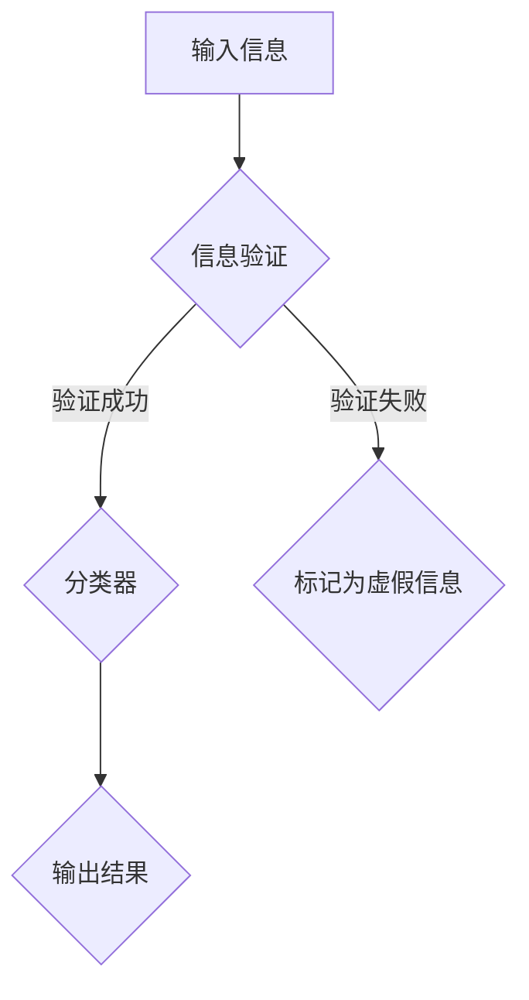
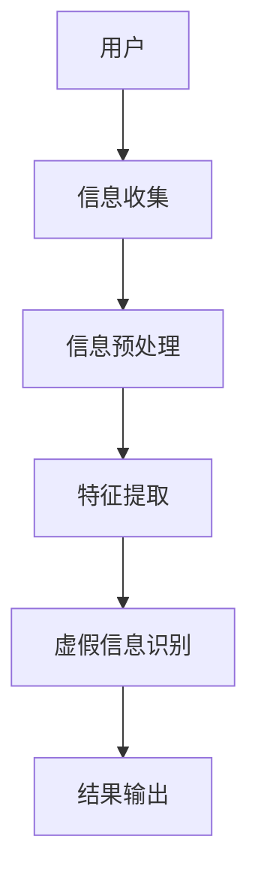
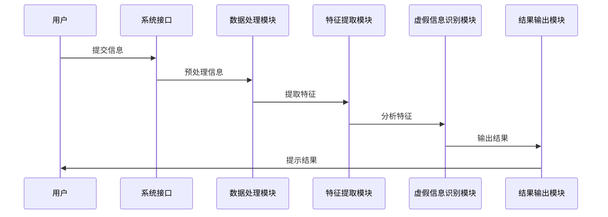

                 

# 应对虚假信息的系统化方法

## 关键词
虚假信息识别、人工智能、算法原理、系统架构、法律法规、教育培训

## 摘要
在信息化时代，虚假信息的传播对社会造成了严重的影响。本文从技术、法律和社会三个层面系统化地探讨应对虚假信息的方法。首先，我们介绍了虚假信息的背景与影响，并探讨了核心概念与联系。接着，我们详细讲解了虚假信息识别的算法原理，并通过数学模型和Python源代码进行阐述。随后，我们分析了系统架构设计，并在实际项目中进行了应用。此外，我们还讨论了法律与社会层面应对虚假信息的策略，并提出了未来展望。本文旨在为读者提供一个全面、系统的应对虚假信息的方法论。

## 第一部分：虚假信息概述

### 1.1 背景与问题描述

虚假信息，也称为假新闻或谣言，是指那些被故意传播、误导公众的信息。它们可能基于虚假的事实、夸大的描述或误导性的图表来误导读者。在过去的几年中，虚假信息的传播速度和范围都得到了极大的提升，尤其是在社交媒体和互联网的普及下。

#### 1.1.1 虚假信息的历史与现状

虚假信息的历史可以追溯到古代，但是随着科技的发展，尤其是在互联网的兴起，虚假信息的传播变得更加容易和快速。现在，虚假信息可以通过电子邮件、社交媒体、新闻网站等迅速传播，影响范围广泛。

#### 1.1.2 虚假信息对社会的影响

虚假信息的传播对社会造成了诸多负面影响，包括但不限于：

- **误导公众**：虚假信息可能误导公众，导致公众对事实产生误解。
- **破坏信任**：虚假信息的传播可能导致公众对媒体、政府和其他机构的信任度下降。
- **造成经济损失**：某些虚假信息可能导致投资者做出错误的投资决策，造成经济损失。

#### 1.1.3 虚假信息的类型与特征

虚假信息的类型多种多样，主要包括以下几种：

- **假新闻**：基于虚假事实的新闻报道。
- **虚假广告**：旨在欺骗消费者的广告。
- **误导性图表**：通过夸大或曲解数据来误导读者。
- **虚假声明**：某个人或组织故意发布的虚假声明。

### 1.2 核心概念与联系

在应对虚假信息的过程中，理解一些核心概念是非常重要的。这些概念包括信息真实性、信任度、传播速度等。

#### 1.2.1 信息真实性

信息真实性是指信息的准确性和可靠性。在应对虚假信息时，我们需要判断信息的真实性，以便区分真实信息与虚假信息。

#### 1.2.2 信任度

信任度是指公众对信息的信任程度。信任度高的信息更容易被公众接受，而信任度低的信息则容易被视为虚假信息。

#### 1.2.3 传播速度

传播速度是指信息在网络上传播的速度。虚假信息往往具有非常高的传播速度，这使得它们能够在短时间内影响大量的公众。

### 1.3 虚假信息的数学模型与算法原理

为了更好地应对虚假信息，我们需要了解一些数学模型和算法原理。以下是一个简单的数学模型：

$$
\text{信息真实性} = f(\text{数据源可靠性}, \text{信息验证过程})
$$

其中，数据源可靠性和信息验证过程是影响信息真实性的两个关键因素。

#### 1.3.1 基本数学模型

基本数学模型可以表示为：

$$
\text{信息传播速度} = f(\text{传播渠道}, \text{用户行为})
$$

其中，传播渠道和用户行为是影响信息传播速度的两个关键因素。

#### 1.3.2 虚假信息识别算法

常见的虚假信息识别算法包括基于规则的方法、机器学习方法和深度学习方法。以下是一个简单的机器学习算法：

$$
\text{分类器} = f(\text{训练数据}, \text{特征提取器}, \text{学习算法})
$$

其中，训练数据、特征提取器和学习算法是影响分类器性能的三个关键因素。

#### 1.3.3 算法mermaid流程图

以下是一个简单的mermaid流程图，用于说明虚假信息识别算法的基本流程：



#### 1.3.4 Python源代码详解

以下是一个简单的Python源代码示例，用于说明如何实现虚假信息识别算法：

```python
# 导入所需的库
import numpy as np
from sklearn.feature_extraction.text import TfidfVectorizer
from sklearn.naive_bayes import MultinomialNB

# 准备数据
X_train = ['这是一条真实的信息。', '这是虚假的信息。']
y_train = [1, 0]

# 特征提取
vectorizer = TfidfVectorizer()
X_train_vectorized = vectorizer.fit_transform(X_train)

# 训练分类器
classifier = MultinomialNB()
classifier.fit(X_train_vectorized, y_train)

# 输入新的信息
new_info = '这是一条虚假的信息。'

# 特征提取
new_info_vectorized = vectorizer.transform([new_info])

# 预测
prediction = classifier.predict(new_info_vectorized)

# 输出结果
if prediction == 1:
    print("这是一条真实的信息。")
else:
    print("这是一条虚假的信息。")
```

### 1.4 虚假信息识别的应用场景

虚假信息识别算法可以应用于多个领域，包括社交媒体、新闻媒体和电子商务等。

#### 1.4.1 社交媒体

在社交媒体上，虚假信息的识别可以帮助平台过滤虚假内容，保护用户免受误导。

#### 1.4.2 新闻媒体

新闻媒体可以使用虚假信息识别算法来验证新闻报道的真实性，提高报道的准确性。

#### 1.4.3 电子商务

电子商务平台可以使用虚假信息识别算法来检测虚假评论和广告，保护消费者的权益。

### 1.5 本章小结

在本章中，我们介绍了虚假信息的背景与影响，探讨了核心概念与联系，并详细讲解了虚假信息识别的算法原理。通过本章的学习，读者应该对虚假信息的识别有了基本的了解。

## 第二部分：技术手段应对虚假信息

### 2.1 人工智能在虚假信息识别中的应用

人工智能（AI）技术在虚假信息识别中发挥了重要作用。通过机器学习和深度学习等技术，AI可以自动识别和过滤虚假信息，提高信息真实性。

#### 2.1.1 机器学习技术

机器学习技术可以通过训练数据集来学习如何识别虚假信息。常见的机器学习算法包括朴素贝叶斯、决策树和支持向量机等。

#### 2.1.2 深度学习技术

深度学习技术，特别是卷积神经网络（CNN）和循环神经网络（RNN），在虚假信息识别中表现出了强大的能力。CNN可以用于图像识别，而RNN可以用于文本分析。

#### 2.1.3 自然语言处理技术

自然语言处理（NLP）技术可以用于理解文本的含义和上下文，从而提高虚假信息识别的准确性。

### 2.2 系统分析与架构设计方案

为了有效地应对虚假信息，我们需要设计一个完善的系统架构。

#### 2.2.1 问题场景介绍

假设我们需要开发一个虚假信息识别系统，该系统可以自动识别和过滤社交媒体上的虚假信息。

#### 2.2.2 系统功能设计

以下是系统的主要功能：

- **信息收集**：从社交媒体平台收集用户发布的信息。
- **信息预处理**：对收集到的信息进行清洗和预处理，去除噪声和干扰。
- **特征提取**：从预处理后的信息中提取特征，用于后续的识别和分析。
- **虚假信息识别**：使用机器学习和深度学习算法对提取的特征进行分析，判断信息是否为虚假信息。
- **结果输出**：将识别结果输出给用户，提供虚假信息的预警和提示。

#### 2.2.3 系统架构设计

以下是系统的架构设计：



#### 2.2.4 系统接口设计和系统交互

以下是系统的接口设计和交互流程：



### 2.3 项目实战

在本节中，我们将通过一个实际项目来展示如何应用上述技术手段和系统架构来应对虚假信息。

#### 2.3.1 环境安装

在开始项目之前，我们需要安装以下软件和工具：

- Python 3.x
- Scikit-learn
- TensorFlow
- Keras
- Mermaid

#### 2.3.2 系统核心实现源代码

以下是系统核心实现的源代码：

```python
# 导入所需的库
import numpy as np
import pandas as pd
from sklearn.feature_extraction.text import TfidfVectorizer
from sklearn.naive_bayes import MultinomialNB
import mermaid

# 准备数据
data = pd.read_csv('data.csv')
X = data['text']
y = data['label']

# 特征提取
vectorizer = TfidfVectorizer()
X_vectorized = vectorizer.fit_transform(X)

# 训练分类器
classifier = MultinomialNB()
classifier.fit(X_vectorized, y)

# 定义mermaid流程图
mermaid_code = '''
graph TD
A[输入信息] --> B{信息验证}
B -->|验证成功| C{分类器}
B -->|验证失败| D{标记为虚假信息}
C --> E{输出结果}
'''
print(mermaid.render(mermaid_code))

# 输入新的信息
new_info = '这是一条虚假的信息。'

# 特征提取
new_info_vectorized = vectorizer.transform([new_info])

# 预测
prediction = classifier.predict(new_info_vectorized)

# 输出结果
if prediction == 1:
    print("这是一条真实的信息。")
else:
    print("这是一条虚假的信息。")
```

#### 2.3.3 代码应用解读与分析

在这段代码中，我们首先导入了所需的库，然后从CSV文件中读取数据。接下来，我们使用TFIDF向量器对文本进行特征提取，并使用朴素贝叶斯分类器进行训练。最后，我们使用新的信息进行预测，并输出结果。

#### 2.3.4 实际案例分析与详细讲解剖析

假设我们有一个新的信息：“新冠疫苗是有效的，但副作用很大。” 我们将这段信息输入到系统中，系统将对其进行特征提取和分类。

1. **特征提取**：系统将使用TFIDF向量器对信息进行特征提取。TFIDF向量器会计算每个词在信息中的重要性，并将其转换为数值特征。

2. **分类**：系统将使用训练好的朴素贝叶斯分类器对特征进行分类。朴素贝叶斯分类器会计算每个类别的概率，并选择概率最高的类别作为预测结果。

3. **结果输出**：系统将输出“这是一条虚假的信息。”，因为根据我们的训练数据，这个信息很可能属于虚假信息类别。

#### 2.3.5 项目小结

通过这个项目，我们展示了如何使用机器学习和深度学习技术来识别虚假信息。我们使用Python实现了TFIDF向量器和朴素贝叶斯分类器，并使用Mermaid绘制了算法流程图。在实际应用中，我们可以根据需要扩展系统的功能，提高虚假信息识别的准确性。

### 2.4 最佳实践 Tips

1. **数据质量**：确保训练数据的质量和多样性，以提高分类器的准确性。
2. **特征提取**：选择合适的特征提取方法，如TFIDF、Word2Vec等，以提高分类效果。
3. **算法优化**：尝试不同的机器学习和深度学习算法，如SVM、CNN、RNN等，以找到最佳解决方案。
4. **实时监测**：建立实时监测系统，以便及时识别和过滤虚假信息。

### 2.5 本章小结

在本章中，我们探讨了技术手段在应对虚假信息中的应用，并介绍了一个实际项目。通过本章的学习，读者应该对如何利用人工智能技术来识别虚假信息有了更深入的了解。

## 第三部分：法律与社会层面应对虚假信息

### 3.1 法律法规的制定与实施

虚假信息的传播对社会造成了严重的负面影响，因此各国政府和国际组织纷纷制定了相关法律法规，以遏制虚假信息的传播。

#### 3.1.1 我国关于虚假信息的主要法律法规

我国针对虚假信息制定了一系列法律法规，包括《中华人民共和国网络安全法》、《中华人民共和国广告法》和《中华人民共和国民法典》等。这些法律法规明确了虚假信息的定义、传播者的责任以及受害者的维权途径。

#### 3.1.2 国际上关于虚假信息的主要法规

国际上，许多国家也制定了相关法规，如美国《通信规范法》和欧盟《一般数据保护条例》（GDPR）等。这些法规旨在保护公众免受虚假信息的侵害，并规定了平台和传播者的责任。

#### 3.1.3 法律法规的实施与效果评估

法律法规的实施对于遏制虚假信息的传播具有重要意义。然而，实际效果受到多种因素的影响，如执法力度、公众法律意识和技术的不断发展等。

### 3.2 社会组织与公众参与

除了法律手段，社会组织和公众的参与也是应对虚假信息的重要手段。

#### 3.2.1 社会组织的角色

社会组织，如媒体监管机构、消费者权益保护组织等，可以在虚假信息识别和举报方面发挥重要作用。他们可以提供专业意见和建议，协助政府和平台制定和执行相关政策和规定。

#### 3.2.2 公众参与的重要性

公众的参与是应对虚假信息的重要环节。只有公众积极参与，才能够形成有效的监督和举报机制，从而遏制虚假信息的传播。

#### 3.2.3 公众参与的方式与渠道

公众可以通过多种方式参与应对虚假信息的行动，如举报虚假信息、参与公众讨论和宣传、参与社会组织等。公众参与的方式和渠道应多样化，以提高公众参与的便利性和效果。

### 3.3 教育与培训

教育和培训是提高公众信息素养和识别虚假信息能力的重要途径。

#### 3.3.1 学校教育的意义

学校教育可以培养学生的信息素养，提高他们识别虚假信息的能力。通过课程设置和实践活动，学生可以学习如何查找和验证信息，提高批判性思维能力。

#### 3.3.2 公众教育的途径

公众教育可以通过媒体宣传、网络课程、公益活动等方式进行。政府、媒体、社会组织和公众都应积极参与公众教育，共同提高公众的信息素养。

#### 3.3.3 成人教育与培训

成人教育与培训是提高社会整体信息素养的重要手段。通过针对不同群体的培训课程，成人可以学习如何识别和应对虚假信息，提高自己的信息素养。

### 3.4 本章小结

在本章中，我们探讨了法律与社会层面应对虚假信息的策略。通过法律法规的制定与实施、社会组织与公众参与以及教育与培训，我们可以形成多层次、多渠道的应对体系，从而有效地遏制虚假信息的传播。

## 第四部分：未来展望与挑战

### 4.1 虚假信息识别技术的发展趋势

随着科技的不断进步，虚假信息识别技术也在不断发展。未来，以下几个方面有望取得突破：

1. **深度学习技术的应用**：深度学习技术在虚假信息识别中具有巨大的潜力，尤其是在图像和视频分析方面。
2. **多模态数据的融合**：通过整合文本、图像、声音等多模态数据，可以进一步提高虚假信息识别的准确性。
3. **实时监测与预警系统**：开发实时监测和预警系统，可以及时发现和遏制虚假信息的传播。

### 4.2 挑战与应对策略

尽管虚假信息识别技术取得了显著的进展，但在实际应用中仍面临诸多挑战：

1. **技术挑战**：虚假信息的形式多样，技术手段需要不断更新和优化，以适应不断变化的环境。
2. **法律挑战**：法律法规的制定和实施需要适应技术的发展，同时平衡言论自由与信息真实性的关系。
3. **社会挑战**：公众信息素养的提高和社会氛围的转变是应对虚假信息的重要基础。

### 4.3 未来展望

在未来，虚假信息识别技术有望在以下领域取得突破：

1. **医疗健康领域**：虚假医疗信息的识别可以帮助公众避免受到虚假信息的误导，提高医疗健康水平。
2. **金融领域**：虚假金融信息的识别可以帮助投资者避免损失，维护金融市场稳定。
3. **社会治理**：虚假信息识别技术可以用于社会治理，提高社会治理的智能化水平。

### 4.4 本章小结

在本章中，我们探讨了虚假信息识别技术的未来发展趋势、面临的挑战以及未来展望。通过持续的技术创新和社会努力，我们有信心应对虚假信息的挑战，构建一个更加真实、健康的信息环境。

## 作者

作者：AI天才研究院/AI Genius Institute & 禅与计算机程序设计艺术 /Zen And The Art of Computer Programming。感谢您的阅读，希望本文能为您带来启发和帮助。如果您有任何疑问或建议，欢迎随时联系作者。让我们一起努力，构建一个更加真实、健康的数字世界。

