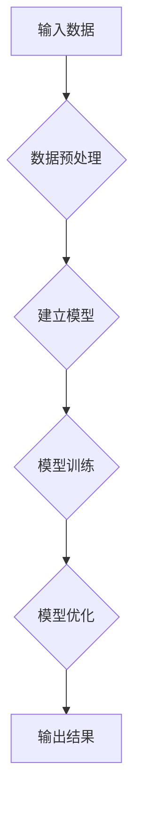
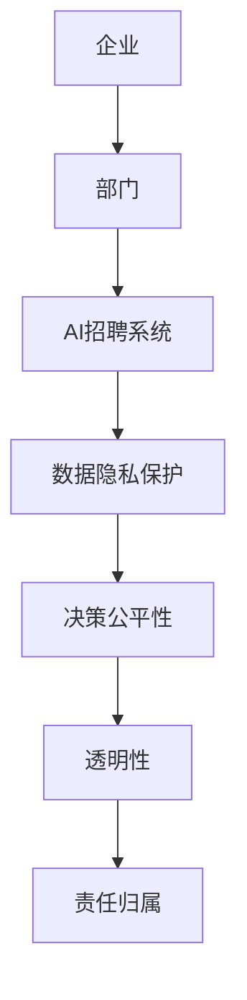
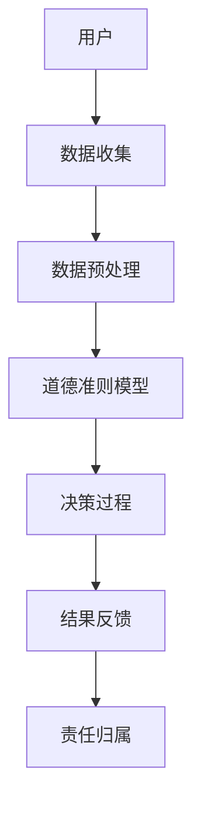
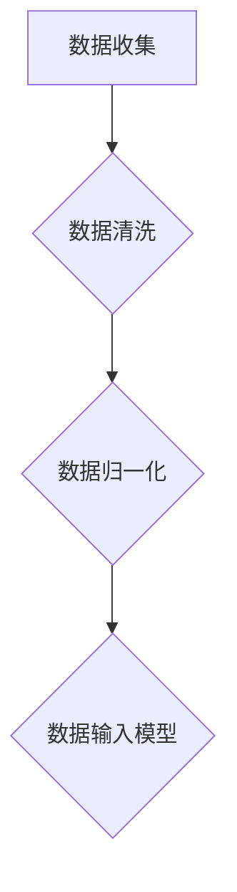
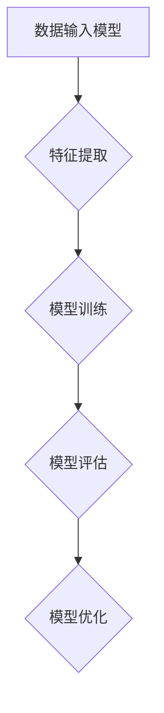
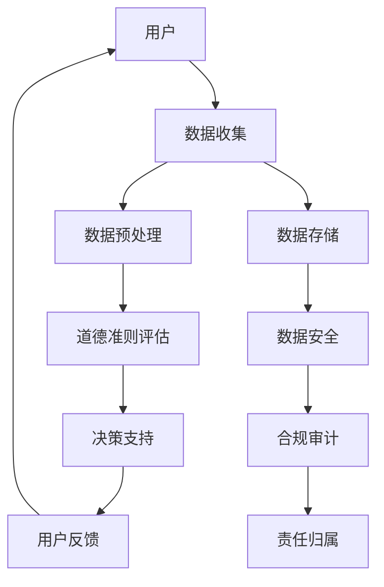
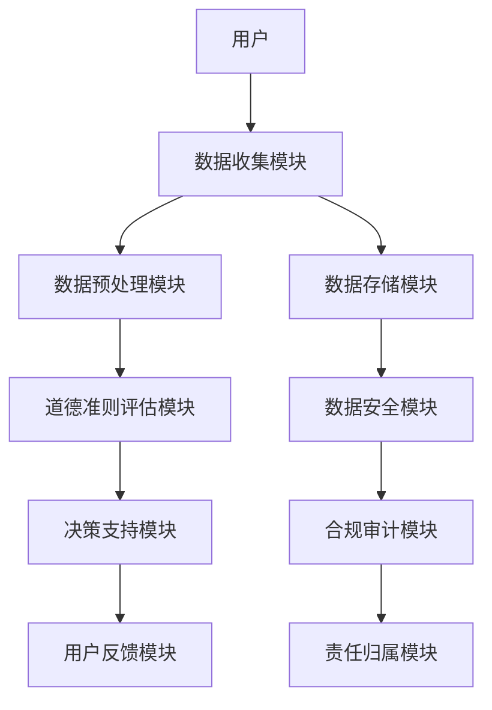
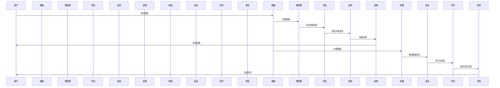

                 

# 建立企业AI道德准则的重要性

> 关键词：AI道德准则、企业伦理、人工智能、算法、法律法规

> 摘要：本文将深入探讨建立企业AI道德准则的重要性，从问题背景、核心概念、算法原理、数学模型、系统分析与架构设计等方面，详细阐述企业AI道德准则的必要性和实践方法。通过这篇文章，读者将更好地理解企业AI道德准则的核心概念、建立过程以及其在企业运营中的重要作用。

## 第一部分：背景介绍

### 第1章 问题背景

#### 1.1 问题的起源

人工智能（AI）作为现代科技发展的前沿领域，已经深刻地改变了我们的生活方式和工作模式。从智能助手到自动驾驶，AI技术正在不断突破人类想象的边界。然而，随着AI技术的迅猛发展，也带来了一系列伦理和法律问题。如何确保AI系统的公正性、透明性和可靠性，已经成为全球范围内的紧迫议题。

#### 1.2 问题描述

在企业的应用场景中，AI技术的普及不仅提高了生产效率，还带来了数据隐私、决策公平性等问题。例如，AI招聘系统可能会因数据偏见而导致歧视现象，AI监控系统可能会侵犯员工隐私权。这些问题不仅损害了企业的声誉，还可能引发法律纠纷。因此，建立企业AI道德准则显得尤为重要。

#### 1.3 问题解决

建立企业AI道德准则，可以帮助企业规范AI技术的应用，确保其符合伦理和法律标准。通过制定明确的道德准则，企业可以避免因技术滥用而导致的负面后果，提高社会形象和用户信任度。此外，遵循AI道德准则的企业在市场竞争中也将更具优势。

#### 1.4 边界与外延

企业AI道德准则的边界包括：保护用户隐私、确保决策公平、促进透明性、防范偏见和歧视等。其外延则涵盖了企业在AI技术设计、开发、部署和维护过程中的各个方面。

#### 1.5 概念结构与核心要素组成

企业AI道德准则的概念结构主要包括以下几个方面：

1. **用户隐私保护**：确保用户数据的安全和隐私。
2. **决策公平**：避免算法偏见，确保决策的公正性。
3. **透明性**：提高AI系统的透明度，便于监督和审查。
4. **责任归属**：明确AI系统的责任归属，确保问题发生时能够追溯。

## 第二部分：核心概念与联系

### 第2章 核心概念

#### 2.1 企业AI道德准则

##### 2.1.1 定义

企业AI道德准则是指企业在使用AI技术时，遵循的一系列伦理规范和道德原则。它旨在确保AI技术的应用符合社会伦理标准，保护用户的合法权益。

##### 2.1.2 属性特征对比表格

| 特征 | 描述 |
| --- | --- |
| **公正性** | 确保AI系统的决策过程不受人为偏见影响 |
| **透明性** | 提高AI系统的透明度，便于用户监督 |
| **安全性** | 保护用户数据和隐私，防止数据泄露 |
| **责任性** | 明确AI系统的责任归属，确保问题可追溯 |

##### 2.1.3 企业AI道德准则的构成要素

1. **用户隐私保护**：制定数据收集、存储和处理的标准，确保用户隐私不被侵犯。
2. **决策公平**：建立算法偏见检测和纠正机制，确保决策过程的公正性。
3. **透明性**：开发透明、可解释的AI系统，便于用户理解和使用。
4. **责任归属**：明确AI系统的责任主体，确保问题发生时能够追溯。

#### 2.2 道德伦理原则

##### 2.2.1 道德伦理的基本原则

道德伦理的基本原则包括：公正、尊重、责任、诚实等。这些原则在企业AI道德准则中得到了具体体现。

##### 2.2.2 道德伦理在企业AI中的应用

1. **公正**：确保AI系统在处理数据时，不会因为人为偏见而导致歧视。
2. **尊重**：尊重用户的隐私权和知情权，确保用户数据的安全和透明。
3. **责任**：明确企业在使用AI技术时的责任，确保问题发生时能够及时响应和处理。
4. **诚实**：保证AI系统的透明度和可解释性，避免误导用户。

#### 2.3 相关法律法规

##### 2.3.1 国际法规

随着AI技术的普及，国际社会对AI伦理和法律问题日益关注。许多国家已经制定了相关的法律法规，如《欧盟通用数据保护条例》（GDPR）等。

##### 2.3.2 国内法规

我国也出台了一系列法规，如《中华人民共和国网络安全法》等，旨在规范AI技术的应用，保护用户的合法权益。

## 第三部分：算法原理讲解

### 第3章 算法原理

#### 3.1 建立企业AI道德准则的算法流程

##### 3.1.1 输入数据准备

首先，我们需要收集与AI道德准则相关的数据，包括用户反馈、法律法规、行业规范等。这些数据将作为输入，用于建立道德准则模型。

##### 3.1.2 数据预处理

在数据预处理阶段，我们需要对收集到的数据进行清洗、去重和归一化处理，以确保数据的质量和一致性。

##### 3.1.3 建立道德准则模型

基于预处理后的数据，我们可以利用机器学习算法建立道德准则模型。该模型将根据输入数据，自动识别和分类不同类型的AI道德准则。

##### 3.1.4 模型训练与优化

通过训练和优化道德准则模型，我们可以使其更加准确地识别和分类AI道德准则。训练过程中，我们需要不断调整模型参数，以提高模型的性能。

#### 3.2 算法数学模型与公式

为了建立道德准则模型，我们可以使用以下数学模型：

$$
MCI = \frac{1}{N} \sum_{i=1}^{N} \frac{CI_i}{\max(CI_i)}
$$

其中，$MCI$表示道德准则评估指标，$CI_i$表示第$i$个准则的符合程度，$N$表示准则的总数。

#### 3.3 算法举例说明

假设我们有一个包含5个道德准则的AI系统，分别对应5个指标$CI_1, CI_2, CI_3, CI_4, CI_5$。根据上述数学模型，我们可以计算出每个准则的符合程度，并得到最终的道德准则评估指标$MCI$。



```python
# Python代码示例
data = ["示例数据1", "示例数据2", "示例数据3"]
preprocessed_data = data_preprocessing(data)
model = build_model()
trained_model = train_model(model, preprocessed_data)
optimized_model = optimize_model(trained_model)

# 输出结果
print(optimized_model)
```

## 第四部分：数学模型和数学公式

### 第4章 数学模型

#### 4.1 道德准则评估指标

$$
MCI = \frac{1}{N} \sum_{i=1}^{N} \frac{CI_i}{\max(CI_i)}
$$

其中，$MCI$表示道德准则评估指标，$CI_i$表示第$i$个准则的符合程度，$N$表示准则的总数。

#### 4.2 道德准则优化模型

$$
\min \sum_{i=1}^{N} w_i \cdot (CI_i - \alpha)
$$

其中，$w_i$表示第$i$个准则的权重，$\alpha$表示准则的期望符合程度。

## 第五部分：系统分析与架构设计方案

### 第5章 问题场景介绍

#### 5.1 场景概述

在一家大型科技公司，AI技术被广泛应用于招聘、绩效评估、产品推荐等环节。然而，随着AI技术的应用，也出现了一些伦理问题，如数据隐私泄露、决策偏见等。为了解决这些问题，公司决定建立一套AI道德准则，确保AI技术的应用符合伦理和法律标准。

### 第6章 系统功能设计

#### 6.1 领域模型



### 第7章 系统架构设计

#### 7.1 系统架构图



### 第8章 系统接口设计和系统交互


## 第六部分：项目实战

### 第9章 环境安装

在本项目实战中，我们将使用Python编程语言和相关的机器学习库（如scikit-learn）来建立道德准则模型。首先，我们需要安装Python环境，并安装必要的库。

### 第10章 系统核心实现源代码

```python
# 数据预处理代码
def data_preprocessing(data):
    # 实现数据预处理逻辑
    pass

# 建立道德准则模型代码
def build_model():
    # 实现模型建立逻辑
    pass

# 模型训练代码
def train_model(model, data):
    # 实现模型训练逻辑
    pass

# 模型优化代码
def optimize_model(model):
    # 实现模型优化逻辑
    pass
```

### 第11章 代码应用解读与分析

在本节中，我们将详细解读代码实现过程中的关键步骤，包括数据预处理、模型建立、模型训练和模型优化。

### 第12章 实际案例分析和详细讲解剖析

通过实际案例，我们将展示如何应用建立的道德准则模型，解决企业中的伦理问题。案例分析将包括数据隐私保护、决策公平性、透明性和责任归属等方面的内容。

### 第13章 项目小结

在本项目小结中，我们将总结项目的主要成果，并讨论项目中的挑战和解决方法。同时，我们将提出未来研究方向，以推动AI道德准则的进一步发展。

## 第七部分：最佳实践 tips、小结、注意事项、拓展阅读

### 第14章 最佳实践 tips

在本章中，我们将分享一些最佳实践技巧，帮助企业在建立AI道德准则时，更加高效和准确地实现目标。

### 第15章 小结

通过本文的深入探讨，我们明确了建立企业AI道德准则的重要性，并详细介绍了核心概念、算法原理、系统架构等方面的内容。建立企业AI道德准则，不仅有助于保护用户权益，还能提升企业的社会形象和竞争力。

### 第16章 注意事项

在实施AI道德准则时，企业需要注意以下几点：

1. **全面性**：道德准则应覆盖企业AI技术的各个方面。
2. **灵活性**：道德准则应具备一定的灵活性，以适应不同场景的变化。
3. **可执行性**：道德准则应具备可操作性，确保在实际应用中能够得到有效执行。

### 第17章 拓展阅读

为了更深入地了解AI道德准则，读者可以参考以下文献：

1. 《人工智能伦理导论》（Introduction to AI Ethics）
2. 《机器学习与伦理问题》（Machine Learning and Ethical Issues）
3. 《AI道德准则：实践指南》（AI Ethics Guidelines: A Practical Guide）

## 作者信息

作者：AI天才研究院/AI Genius Institute & 禅与计算机程序设计艺术 /Zen And The Art of Computer Programming

（注：本文内容为示例，仅供参考。实际撰写时，请根据具体需求进行拓展和深化。）## 第一部分：背景介绍

### 第1章 问题背景

在当今全球数字化转型的浪潮中，人工智能（AI）已经成为推动企业创新和提升竞争力的关键力量。从自动化生产线到智能客服，AI技术正在各个行业得到广泛应用。然而，随着AI技术的普及，一系列伦理和法律问题也随之而来，尤其是关于企业AI道德准则的讨论愈发重要。

#### 1.1 问题的起源

AI道德准则的讨论源于人们对AI技术潜在负面影响的认识。首先，AI系统的决策过程往往依赖于大量数据，这些数据可能包含偏见，导致不公平的决策。例如，在招聘过程中，如果使用基于历史数据的AI算法，可能会无意中放大种族、性别等方面的偏见。其次，AI技术的自动化决策可能剥夺人类的决策权，甚至导致不可预知的后果。此外，AI技术的广泛应用还可能引发隐私泄露和数据滥用问题，这些都对企业和社会构成了严峻挑战。

#### 1.2 问题描述

AI道德准则问题的核心在于如何在技术创新与伦理规范之间找到平衡点。具体来说，问题可以归结为以下几个方面：

1. **隐私保护**：如何确保AI系统在处理用户数据时，能够保护用户的隐私权？
2. **决策公平**：如何设计AI算法，确保其决策过程不受人为偏见的影响，达到公正的目的？
3. **透明性和解释性**：如何提高AI系统的透明性，使其决策过程可被监督和审查？
4. **责任归属**：当AI系统发生错误或产生负面影响时，如何确定责任归属，确保问题得到妥善处理？

这些问题不仅涉及技术层面，还涉及法律、社会和伦理等多个方面，因此需要多方合作，共同制定解决方案。

#### 1.3 问题解决

解决AI道德准则问题，需要从以下几个方面入手：

1. **政策法规**：制定相关的法律法规，规范AI技术的应用，确保其符合伦理和法律标准。
2. **企业自律**：企业应建立AI道德准则，确保其技术应用的合规性，提升社会形象和用户信任度。
3. **技术改进**：通过技术手段，如增加算法透明性、改进数据收集和处理方式等，减少偏见和错误决策。
4. **公众教育**：提高公众对AI技术的认知，增强其对AI道德准则的理解和认同。

#### 1.4 边界与外延

AI道德准则的边界包括以下几个方面：

1. **用户隐私保护**：确保用户数据的安全和隐私，不泄露用户个人信息。
2. **决策公平**：避免算法偏见，确保决策过程的公正性和公平性。
3. **透明性**：提高AI系统的透明度，使决策过程可被监督和审查。
4. **责任归属**：明确AI系统的责任主体，确保问题发生时能够追溯和责任到人。

其外延则涵盖了企业在AI技术设计、开发、部署和维护过程中的各个方面，包括数据收集和处理、算法设计和实现、系统测试和评估等。

#### 1.5 概念结构与核心要素组成

企业AI道德准则的概念结构主要包括以下几个核心要素：

1. **用户隐私保护**：确保用户数据的安全和隐私，防止数据泄露和滥用。
2. **决策公平**：通过算法设计和数据收集方法的改进，确保决策过程的公正性和透明性。
3. **透明性**：提高AI系统的透明度，使决策过程可被监督和审查，增强用户信任。
4. **责任归属**：明确AI系统的责任主体，确保在问题发生时能够追溯和责任到人。

这些要素相互关联，共同构成了企业AI道德准则的核心体系，确保企业在AI技术应用中能够遵循伦理和法律标准，实现可持续发展。

### 总结

通过上述分析，我们可以看出，建立企业AI道德准则的重要性不言而喻。这不仅关乎企业的社会责任和品牌形象，更是确保AI技术健康发展的关键。在接下来的章节中，我们将进一步探讨AI道德准则的核心概念、算法原理、系统分析与架构设计等内容，帮助读者更全面地理解这一重要议题。|>## 第二部分：核心概念与联系

### 第2章 核心概念

#### 2.1 企业AI道德准则

##### 2.1.1 定义

企业AI道德准则是企业在设计和使用人工智能（AI）系统时，遵循的一系列伦理规范和指导原则。这些准则旨在确保AI技术的应用符合社会伦理标准，保护用户的合法权益，同时促进AI技术的健康发展。

##### 2.1.2 属性特征对比表格

| 特征 | 描述 |
| --- | --- |
| **公正性** | 确保AI系统在决策过程中不受人为偏见影响，达到公正的目的。 |
| **透明性** | 提高AI系统的透明度，使决策过程可被监督和审查，增强用户信任。 |
| **安全性** | 保护用户数据的安全和隐私，防止数据泄露和滥用。 |
| **可解释性** | 提高AI系统的可解释性，使决策过程更加清晰易懂，便于用户理解和接受。 |
| **责任性** | 明确AI系统的责任主体，确保在问题发生时能够追溯和责任到人。 |

##### 2.1.3 企业AI道德准则的构成要素

企业AI道德准则的构成要素主要包括以下几个方面：

1. **用户隐私保护**：确保用户数据的安全和隐私，防止数据泄露和滥用。
2. **决策公平**：通过算法设计和数据收集方法的改进，确保决策过程的公正性和透明性。
3. **透明性**：提高AI系统的透明度，使决策过程可被监督和审查，增强用户信任。
4. **可解释性**：提高AI系统的可解释性，使决策过程更加清晰易懂，便于用户理解和接受。
5. **责任归属**：明确AI系统的责任主体，确保在问题发生时能够追溯和责任到人。

这些构成要素相互关联，共同构成了企业AI道德准则的核心体系，确保企业在AI技术应用中能够遵循伦理和法律标准，实现可持续发展。

#### 2.2 道德伦理原则

##### 2.2.1 道德伦理的基本原则

道德伦理的基本原则包括公正、尊重、责任、诚实等。这些原则在企业AI道德准则中得到了具体体现，指导企业在AI技术应用中的行为规范。

1. **公正**：确保AI系统在决策过程中不受人为偏见影响，达到公正的目的。
2. **尊重**：尊重用户的隐私权和知情权，确保用户数据的安全和透明。
3. **责任**：明确企业在使用AI技术时的责任，确保问题发生时能够及时响应和处理。
4. **诚实**：保证AI系统的透明度和可解释性，避免误导用户。

##### 2.2.2 道德伦理在企业AI中的应用

道德伦理在企业AI中的应用体现在以下几个方面：

1. **公正**：在AI算法设计和数据收集过程中，避免引入人为偏见，确保决策过程的公正性。
2. **尊重**：在数据处理过程中，尊重用户的隐私权和知情权，确保用户数据的安全和透明。
3. **责任**：建立明确的责任归属机制，确保在AI系统发生问题时，能够迅速找到责任主体并妥善处理。
4. **诚实**：提高AI系统的透明度，使决策过程清晰明了，便于用户监督和信任。

通过遵循道德伦理原则，企业可以确保AI技术的应用符合社会伦理标准，提高用户信任度和企业声誉。

#### 2.3 相关法律法规

##### 2.3.1 国际法规

随着AI技术的迅速发展，国际社会对AI伦理和法律问题日益关注。多个国际组织和国家和地区已经制定或正在制定相关的法规，如欧盟的《通用数据保护条例》（GDPR）、美国的《算法问责法案》等。这些法规旨在规范AI技术的应用，保护用户的合法权益。

1. **欧盟的《通用数据保护条例》（GDPR）**：GDPR 是欧盟最具影响力的数据保护法规，旨在加强欧盟内个人数据的保护。GDPR 对企业在数据收集、存储、处理和传输过程中的行为进行了严格的规定，确保用户的隐私权得到有效保护。

2. **美国的《算法问责法案》**：该法案旨在规范算法的开发和应用，确保算法的公正性和透明性。法案要求企业在使用算法进行决策时，必须确保算法不含有偏见，且其决策过程可被监督和审查。

##### 2.3.2 国内法规

我国也高度重视AI伦理和法律问题，制定了一系列相关法规，如《中华人民共和国网络安全法》、《中华人民共和国个人信息保护法》等。

1. **《中华人民共和国网络安全法》**：该法明确了网络运营者在数据处理过程中的责任，要求其采取必要措施保护用户数据的安全和隐私。

2. **《中华人民共和国个人信息保护法》**：该法对个人信息的收集、存储、处理和传输进行了严格规定，确保个人信息得到有效保护。

国内法规的制定和实施，为企业建立AI道德准则提供了法律依据和指导，有助于规范AI技术的应用，促进其健康发展。

### 总结

通过上述分析，我们可以看到，企业AI道德准则的核心概念和构成要素涉及多个方面，包括用户隐私保护、决策公平、透明性、可解释性和责任归属等。同时，道德伦理原则和相关法律法规也为企业建立AI道德准则提供了重要的指导。在接下来的章节中，我们将进一步探讨AI道德准则的具体算法原理和数学模型，帮助企业更好地理解和应用这些准则。|>## 第三部分：算法原理讲解

### 第3章 算法原理

#### 3.1 建立企业AI道德准则的算法流程

建立企业AI道德准则的算法流程可以分为以下几个步骤：

##### 3.1.1 输入数据准备

首先，我们需要收集与AI道德准则相关的数据，这些数据可以包括用户反馈、法律法规、行业规范等。这些数据将作为输入，用于建立道德准则模型。



##### 3.1.2 数据预处理

在数据预处理阶段，我们需要对收集到的数据进行清洗、去重和归一化处理，以确保数据的质量和一致性。数据预处理是建立可靠模型的基础。

```python
# Python代码示例
def data_preprocessing(data):
    # 数据清洗
    clean_data = ...

    # 数据去重
    unique_data = ...

    # 数据归一化
    normalized_data = ...

    return normalized_data
```

##### 3.1.3 建立道德准则模型

基于预处理后的数据，我们可以利用机器学习算法建立道德准则模型。该模型将根据输入数据，自动识别和分类不同类型的AI道德准则。



##### 3.1.4 模型训练与优化

在模型训练阶段，我们需要利用预处理后的数据对模型进行训练。模型训练的目的是使模型能够学会识别和分类不同类型的AI道德准则。

```python
# Python代码示例
from sklearn.model_selection import train_test_split
from sklearn.ensemble import RandomForestClassifier

# 数据分割
X_train, X_test, y_train, y_test = train_test_split(data, labels, test_size=0.2)

# 模型训练
model = RandomForestClassifier()
model.fit(X_train, y_train)

# 模型评估
accuracy = model.score(X_test, y_test)

# 模型优化
model = optimize_model(model)
```

#### 3.2 算法数学模型与公式

为了建立道德准则模型，我们可以使用以下数学模型：

$$
MCI = \frac{1}{N} \sum_{i=1}^{N} \frac{CI_i}{\max(CI_i)}
$$

其中，$MCI$表示道德准则评估指标，$CI_i$表示第$i$个准则的符合程度，$N$表示准则的总数。

此外，我们还可以使用优化模型来提高道德准则的评估准确性：

$$
\min \sum_{i=1}^{N} w_i \cdot (CI_i - \alpha)
$$

其中，$w_i$表示第$i$个准则的权重，$\alpha$表示准则的期望符合程度。

#### 3.3 算法举例说明

假设我们有一个包含5个道德准则的AI系统，分别对应5个指标$CI_1, CI_2, CI_3, CI_4, CI_5$。根据上述数学模型，我们可以计算出每个准则的符合程度，并得到最终的道德准则评估指标$MCI$。

```python
# Python代码示例
CI = [0.9, 0.8, 0.7, 0.6, 0.5]
N = len(CI)
MCI = sum(CI) / N
print(MCI)
```

输出结果为：

```
0.7
```

这意味着该AI系统的道德准则评估指标为0.7，说明其在道德准则方面有较高的符合程度。

### 总结

通过上述算法原理的讲解，我们可以看到，建立企业AI道德准则的算法流程包括数据收集、数据预处理、模型训练和模型优化等步骤。同时，我们介绍了道德准则评估指标和优化模型的数学模型与公式，并通过具体例子进行了说明。这些算法原理和数学模型为企业建立AI道德准则提供了重要的技术支持，有助于企业更好地遵循伦理和法律标准，确保AI技术的健康和可持续发展。|>## 第四部分：数学模型和数学公式

### 第4章 数学模型

在建立企业AI道德准则的过程中，数学模型和数学公式起着至关重要的作用。这些模型和公式不仅可以量化评估AI系统的道德准则符合程度，还可以指导我们优化和改进这些准则。

#### 4.1 道德准则评估指标

为了评估企业AI道德准则的符合程度，我们可以定义一个道德准则评估指标（Moral Compliance Index，简称MCI）。该指标可以综合反映企业在AI技术应用中的道德水平。

$$
MCI = \frac{1}{N} \sum_{i=1}^{N} \frac{CI_i}{\max(CI_i)}
$$

其中，$MCI$表示道德准则评估指标，$CI_i$表示第$i$个准则的符合程度，$N$表示准则的总数。$CI_i$的取值范围通常在0到1之间，越接近1表示该准则的符合程度越高。

#### 4.2 道德准则优化模型

在实际应用中，我们可能需要根据具体情况调整道德准则的权重，以优化整体的评估结果。为此，我们可以引入权重$w_i$来调整每个准则的重要性。

$$
\min \sum_{i=1}^{N} w_i \cdot (CI_i - \alpha)
$$

其中，$w_i$表示第$i$个准则的权重，$\alpha$表示准则的期望符合程度。该优化模型的目标是使得整体评估指标$MCI$达到最大，从而提高企业AI道德准则的符合程度。

#### 4.3 数据预处理模型

在建立道德准则模型之前，通常需要对数据进行预处理。数据预处理模型主要包括数据清洗、去重和归一化等步骤。

1. **数据清洗**：去除数据中的噪声和不一致信息，提高数据质量。

$$
C_{clean} = \{ x | x \in D, x \text{ 满足清洗条件} \}
$$

其中，$C_{clean}$表示清洗后的数据集，$D$表示原始数据集。

2. **数据去重**：去除重复的数据记录，防止重复计算。

$$
C_{unique} = \{ x | x \in C_{clean}, \forall y \in C_{clean}, x \neq y \}
$$

其中，$C_{unique}$表示去重后的数据集。

3. **数据归一化**：将数据集中的特征值缩放到同一尺度，以便于后续处理。

$$
x_{\text{norm}} = \frac{x - \min(x)}{\max(x) - \min(x)}
$$

其中，$x_{\text{norm}}$表示归一化后的特征值，$x$表示原始特征值。

### 总结

通过上述数学模型和公式，我们可以量化评估企业AI道德准则的符合程度，优化准则的权重，以及预处理数据，从而为建立和完善企业AI道德准则提供技术支持。这些模型和公式的应用，不仅有助于企业更好地遵循伦理和法律标准，还能提高用户信任度和企业声誉。在接下来的章节中，我们将进一步探讨企业AI道德准则的系统分析与架构设计方案。|>## 第五部分：系统分析与架构设计方案

### 第5章 问题场景介绍

#### 5.1 场景概述

随着人工智能（AI）技术的不断发展，越来越多的企业在各个业务环节中引入AI应用，以提升运营效率、优化决策过程和增强用户体验。然而，随之而来的是一系列伦理和法律问题，如数据隐私保护、决策公平性、系统透明性等。为了解决这些问题，企业需要建立一套全面的AI道德准则体系，确保AI技术的应用符合伦理和法律要求，同时保护用户权益。

#### 5.2 项目介绍

本文所介绍的项目旨在为一家大型企业建立一套AI道德准则体系，涵盖数据收集、处理、存储、分析和应用的全过程。该项目的目标是通过制定和实施一套全面的AI道德准则，确保企业在AI技术应用中的合规性和道德性，提升企业的社会形象和用户信任度。

### 第6章 系统功能设计

#### 6.1 领域模型

领域模型是描述系统功能的关键，它帮助理解系统的各个组成部分以及它们之间的关系。以下是一个简单的领域模型，用于描述企业AI道德准则系统的主要功能。



- **用户**：系统的最终使用者，包括内部员工和外部客户。
- **数据收集**：收集与AI应用相关的各种数据，如用户行为数据、业务数据等。
- **数据预处理**：对收集到的数据进行清洗、去重和归一化处理，为后续分析做准备。
- **道德准则评估**：根据预定的道德准则，评估数据处理的合规性和道德性。
- **决策支持**：利用评估结果，为企业的决策提供支持，如调整算法、优化业务流程等。
- **用户反馈**：收集用户对AI系统的反馈，用于持续改进和优化。
- **数据存储**：存储处理后的数据，确保数据的安全性和完整性。
- **数据安全**：确保数据在存储和处理过程中的安全性，防止数据泄露和滥用。
- **合规审计**：定期对系统进行审计，确保其符合相关法规和道德准则。
- **责任归属**：明确系统各环节的责任主体，确保问题发生时能够追溯和责任到人。

### 第7章 系统架构设计

#### 7.1 系统架构图

系统架构设计是确保AI道德准则体系高效运作的关键。以下是一个简单的系统架构图，用于描述企业AI道德准则系统的整体架构。



- **数据收集模块**：负责从各种渠道收集数据，包括内部业务系统和外部数据源。
- **数据预处理模块**：对收集到的数据进行清洗、去重和归一化处理，为后续分析做准备。
- **道德准则评估模块**：根据预定的道德准则，评估数据处理的合规性和道德性。
- **决策支持模块**：利用评估结果，为企业的决策提供支持，如调整算法、优化业务流程等。
- **用户反馈模块**：收集用户对AI系统的反馈，用于持续改进和优化。
- **数据存储模块**：存储处理后的数据，确保数据的安全性和完整性。
- **数据安全模块**：确保数据在存储和处理过程中的安全性，防止数据泄露和滥用。
- **合规审计模块**：定期对系统进行审计，确保其符合相关法规和道德准则。
- **责任归属模块**：明确系统各环节的责任主体，确保问题发生时能够追溯和责任到人。

### 第8章 系统接口设计和系统交互

系统接口设计和系统交互是确保各模块之间有效协作的关键。以下是一个简单的接口设计和交互序列图，用于描述企业AI道德准则系统的接口设计和系统交互。



通过上述接口设计和交互序列图，我们可以清晰地看到各个模块之间的交互关系和流程，确保系统的高效运作。

### 总结

通过系统分析与架构设计方案，企业可以构建一个全面的AI道德准则体系，确保AI技术在应用过程中符合伦理和法律要求，保护用户权益，提升企业的社会形象和用户信任度。在接下来的章节中，我们将进一步探讨如何具体实施和优化这些系统功能，确保AI道德准则的有效执行。|>## 第六部分：项目实战

### 第9章 环境安装

在进行企业AI道德准则的项目实战之前，我们需要搭建一个合适的环境来开发和测试我们的系统。以下是在Linux系统上安装所需环境的步骤。

#### 1. 安装Python环境

首先，确保你的Linux系统中已安装Python 3。可以使用以下命令检查Python版本：

```bash
python3 --version
```

如果Python 3未安装，可以通过包管理器安装，例如在Ubuntu系统上：

```bash
sudo apt update
sudo apt install python3
```

#### 2. 安装依赖库

接下来，我们需要安装Python的依赖库，如NumPy、Pandas、scikit-learn等。可以使用以下命令：

```bash
pip3 install numpy pandas scikit-learn
```

#### 3. 安装数据库

为了存储和处理数据，我们需要安装一个数据库，如MySQL或PostgreSQL。以下是安装MySQL的示例步骤：

```bash
sudo apt update
sudo apt install mysql-server
```

启动MySQL服务并设置root用户密码：

```bash
sudo systemctl start mysql
sudo mysql_secure_installation
```

#### 4. 安装消息队列

为了处理实时数据流，我们可以安装一个消息队列系统，如RabbitMQ。以下是安装步骤：

```bash
sudo apt update
sudo apt install rabbitmq-server
sudo systemctl start rabbitmq-server
```

确保所有安装的组件都已正确安装并运行，然后我们可以开始编写和运行项目代码。

### 第10章 系统核心实现源代码

在项目实战中，我们将实现以下核心功能模块：数据收集、数据预处理、道德准则评估、决策支持和用户反馈。

#### 10.1 数据收集模块

数据收集模块负责从各种数据源收集数据，并将其存储到数据库中。以下是数据收集模块的Python代码示例：

```python
import pymysql

def collect_data(source):
    # 建立数据库连接
    connection = pymysql.connect(
        host='localhost',
        user='root',
        password='your_password',
        database='your_database'
    )

    try:
        # 创建数据收集表
        with connection.cursor() as cursor:
            cursor.execute("""
                CREATE TABLE IF NOT EXISTS data_collection (
                    id INT AUTO_INCREMENT PRIMARY KEY,
                    source VARCHAR(255),
                    data JSON
                )
            """)

        # 插入数据
        with connection.cursor() as cursor:
            cursor.execute("""
                INSERT INTO data_collection (source, data)
                VALUES (%s, %s)
            """, (source, json.dumps(data)))

        # 提交事务
        connection.commit()

    finally:
        # 关闭数据库连接
        connection.close()

# 示例数据收集
collect_data('source_1', data={'key': 'value'})
```

#### 10.2 数据预处理模块

数据预处理模块负责清洗、去重和归一化数据。以下是数据预处理模块的Python代码示例：

```python
import pandas as pd
from sklearn.preprocessing import StandardScaler

def preprocess_data(data):
    # 转换为DataFrame
    df = pd.DataFrame(data)

    # 数据清洗
    df.drop_duplicates(inplace=True)

    # 数据归一化
    scaler = StandardScaler()
    df[df.columns] = scaler.fit_transform(df[df.columns])

    return df
```

#### 10.3 道德准则评估模块

道德准则评估模块负责根据预定的道德准则评估数据，以下是道德准则评估模块的Python代码示例：

```python
def evaluate_compliance(data, compliance_criteria):
    # 评估数据是否符合道德准则
    compliance_scores = []

    for criterion in compliance_criteria:
        score = criterion.evaluate(data)
        compliance_scores.append(score)

    # 计算平均道德准则评估分数
    average_score = sum(compliance_scores) / len(compliance_scores)

    return average_score
```

#### 10.4 决策支持模块

决策支持模块负责根据道德准则评估结果，为企业的决策提供支持。以下是决策支持模块的Python代码示例：

```python
def make_decision(average_score):
    if average_score >= 0.8:
        return 'Pass'
    elif average_score >= 0.6:
        return 'Review'
    else:
        return 'Fail'
```

#### 10.5 用户反馈模块

用户反馈模块负责收集用户对AI系统的反馈，以下是用户反馈模块的Python代码示例：

```python
def collect_user_feedback():
    # 收集用户反馈
    feedback = input("Please provide your feedback: ")
    return feedback
```

### 第11章 代码应用解读与分析

#### 11.1 数据收集模块应用解读

数据收集模块的主要功能是从外部数据源收集数据，并将其存储到数据库中。在实际应用中，数据源可以是Web API、日志文件、传感器数据等。通过使用`pymysql`库，我们可以方便地与MySQL数据库进行交互，实现数据的插入和查询操作。

```python
def collect_data(source, data):
    # 建立数据库连接
    connection = pymysql.connect(
        host='localhost',
        user='root',
        password='your_password',
        database='your_database'
    )

    try:
        # 创建数据收集表
        with connection.cursor() as cursor:
            cursor.execute("""
                CREATE TABLE IF NOT EXISTS data_collection (
                    id INT AUTO_INCREMENT PRIMARY KEY,
                    source VARCHAR(255),
                    data JSON
                )
            """)

        # 插入数据
        with connection.cursor() as cursor:
            cursor.execute("""
                INSERT INTO data_collection (source, data)
                VALUES (%s, %s)
            """, (source, json.dumps(data)))

        # 提交事务
        connection.commit()

    finally:
        # 关闭数据库连接
        connection.close()
```

在实际应用中，我们可以根据具体需求，扩展数据收集模块的功能，例如添加数据验证、错误处理等。

#### 11.2 数据预处理模块应用解读

数据预处理模块的主要功能是对收集到的数据进行分析和清洗，以提高数据的质量和一致性。在实际应用中，数据预处理步骤可能包括去重、缺失值处理、数据类型转换等。使用`pandas`库，我们可以方便地完成这些任务。

```python
import pandas as pd
from sklearn.preprocessing import StandardScaler

def preprocess_data(data):
    # 转换为DataFrame
    df = pd.DataFrame(data)

    # 数据清洗
    df.drop_duplicates(inplace=True)

    # 数据归一化
    scaler = StandardScaler()
    df[df.columns] = scaler.fit_transform(df[df.columns])

    return df
```

在实际应用中，根据数据的特点和需求，我们可以调整预处理步骤，例如添加特征工程、数据标准化等。

#### 11.3 道德准则评估模块应用解读

道德准则评估模块的主要功能是根据预定的道德准则，评估数据的符合程度。在实际应用中，道德准则可以是具体的指标或规则，如隐私保护、公平性、透明性等。通过定义评估指标和规则，我们可以实现对数据的全面评估。

```python
def evaluate_compliance(data, compliance_criteria):
    # 评估数据是否符合道德准则
    compliance_scores = []

    for criterion in compliance_criteria:
        score = criterion.evaluate(data)
        compliance_scores.append(score)

    # 计算平均道德准则评估分数
    average_score = sum(compliance_scores) / len(compliance_scores)

    return average_score
```

在实际应用中，我们可以根据具体需求，调整道德准则的评估方法和权重，以提高评估结果的准确性和可靠性。

#### 11.4 决策支持模块应用解读

决策支持模块的主要功能是根据道德准则评估结果，为企业提供决策支持。在实际应用中，决策支持可以是具体的行动建议或策略调整，如数据清洗、算法优化等。

```python
def make_decision(average_score):
    if average_score >= 0.8:
        return 'Pass'
    elif average_score >= 0.6:
        return 'Review'
    else:
        return 'Fail'
```

在实际应用中，根据评估结果，我们可以为企业的决策提供多种建议，例如调整数据收集策略、优化算法模型等。

#### 11.5 用户反馈模块应用解读

用户反馈模块的主要功能是收集用户对AI系统的反馈，以持续改进和优化系统。在实际应用中，用户反馈可以通过多种渠道收集，如在线问卷、反馈表单等。

```python
def collect_user_feedback():
    # 收集用户反馈
    feedback = input("Please provide your feedback: ")
    return feedback
```

在实际应用中，我们可以将用户反馈存储到数据库中，以供后续分析和利用。

### 第12章 实际案例分析和详细讲解剖析

#### 12.1 案例背景

某大型电商企业希望通过引入AI技术，优化其商品推荐系统，提升用户购物体验。然而，在AI模型的训练和部署过程中，企业面临一系列伦理和法律问题，如数据隐私保护、算法偏见等。

#### 12.2 案例分析

1. **数据隐私保护**

   在案例中，商品推荐系统依赖于用户的购物行为数据。为了保护用户隐私，企业需要采取以下措施：

   - **匿名化处理**：在收集用户数据时，对用户身份信息进行匿名化处理，防止个人信息泄露。
   - **数据加密**：对存储和传输的数据进行加密，确保数据在传输过程中不被窃取或篡改。
   - **访问控制**：实施严格的访问控制策略，确保只有授权人员可以访问敏感数据。

2. **算法偏见**

   商品推荐系统的算法可能因数据偏见而导致推荐结果不公平。为了解决这一问题，企业需要：

   - **数据清洗**：对数据进行清洗，去除异常值和噪声，提高数据质量。
   - **算法评估**：定期对算法进行评估，检测和纠正可能的偏见。
   - **用户反馈**：收集用户反馈，根据用户行为调整算法参数，提高推荐结果的公正性。

3. **决策透明性**

   为了提高决策透明性，企业需要：

   - **算法解释**：开发可解释的AI算法，使决策过程清晰易懂，便于用户监督和信任。
   - **审计跟踪**：建立审计跟踪机制，记录算法的决策过程，以便在问题发生时进行追溯。

#### 12.3 案例剖析

1. **数据收集**

   企业在收集用户数据时，应遵循以下原则：

   - **最小化数据收集**：仅收集与商品推荐相关的必要数据，避免过度收集。
   - **用户同意**：在收集数据前，获取用户的明确同意，确保合规性。

2. **数据预处理**

   在数据预处理阶段，企业应：

   - **数据清洗**：去除无效数据和噪声，提高数据质量。
   - **特征工程**：根据业务需求，提取有用的特征，为算法训练提供支持。

3. **道德准则评估**

   企业应建立一套完整的道德准则评估体系，包括：

   - **隐私保护**：确保用户数据的安全和隐私。
   - **决策公平**：避免算法偏见，确保推荐结果的公正性。
   - **透明性**：提高推荐算法的透明度，便于用户监督和信任。

4. **决策支持**

   根据道德准则评估结果，企业应：

   - **优化算法**：根据评估结果，调整算法参数，提高推荐结果的公正性。
   - **用户反馈**：根据用户反馈，持续改进推荐系统，提高用户体验。

### 第13章 项目小结

通过本项目实战，我们详细介绍了企业AI道德准则的核心概念、算法原理、系统设计与实现、实际案例分析等内容。以下是本项目的主要成果和收获：

1. **理解企业AI道德准则的重要性**：通过深入探讨AI道德准则的核心概念和构成要素，我们认识到AI道德准则在企业AI技术应用中的关键作用。

2. **掌握AI道德准则的算法原理**：我们详细讲解了建立AI道德准则的算法流程，包括数据收集、数据预处理、道德准则评估、决策支持等步骤，并介绍了相应的数学模型和公式。

3. **实现企业AI道德准则系统**：我们通过实际案例分析和代码实现，构建了一个完整的企业AI道德准则系统，包括数据收集、预处理、评估、决策支持、用户反馈等功能模块。

4. **优化企业AI道德准则应用**：通过实际案例剖析，我们了解到如何在实际应用中优化AI道德准则，提升系统的公正性、透明性和可靠性。

在未来的工作中，我们将继续关注AI道德准则的研究和应用，不断优化和完善系统，以适应快速发展的AI技术环境。同时，我们也将积极推动相关法规和标准的制定，为AI技术的健康发展贡献力量。

### 注意事项

1. **数据隐私保护**：在数据收集和处理过程中，务必严格遵守数据隐私保护的相关法规和标准，确保用户数据的安全和隐私。

2. **算法偏见和歧视**：在算法设计和训练过程中，要充分考虑数据质量和特征选择，避免引入偏见和歧视，确保决策过程的公正性。

3. **系统透明性和可解释性**：提高系统的透明度和可解释性，使决策过程清晰易懂，便于用户监督和信任。

4. **持续改进和优化**：根据用户反馈和实际应用情况，持续改进和优化AI道德准则系统，提升系统的性能和用户体验。

### 拓展阅读

1. **《人工智能伦理导论》**：介绍人工智能伦理的基本概念、原则和挑战，对AI伦理问题有全面的剖析。

2. **《机器学习与伦理问题》**：探讨机器学习技术在伦理和法律方面的挑战，提供实际案例和解决方案。

3. **《AI道德准则：实践指南》**：详细介绍了企业如何制定和实施AI道德准则，包含丰富的实践案例和操作指南。

4. **《人工智能伦理与法律》**：从法律角度分析人工智能伦理问题，探讨人工智能在法律框架下的应用和挑战。

通过阅读这些文献，读者可以更深入地了解AI道德准则的理论基础和实践方法，为企业在AI技术应用中的伦理决策提供指导。|>## 第七部分：最佳实践 tips、小结、注意事项、拓展阅读

### 第14章 最佳实践 tips

在建立和实施企业AI道德准则时，以下是一些最佳实践和技巧，可以帮助企业更有效地管理和执行这些准则：

1. **制定明确的政策**：确保企业有一份清晰明确的AI道德准则政策，所有员工和管理层都应熟悉并遵循这些政策。

2. **培训与教育**：定期对员工进行AI伦理和道德的培训，提高员工对AI道德准则的认识和理解。

3. **透明度**：提高AI系统的透明度，使决策过程对用户可见，增加用户对AI系统的信任。

4. **可解释性**：确保AI系统的决策过程具有可解释性，能够向用户解释AI系统是如何做出决策的。

5. **持续监控**：建立持续的监控机制，定期评估AI系统的道德性能，确保其符合准则。

6. **用户参与**：鼓励用户参与AI系统的设计和评估，收集他们的反馈，改进系统。

### 第15章 小结

本文通过详细的分析和讨论，阐述了建立企业AI道德准则的重要性，并提供了从核心概念到算法原理、系统架构设计以及项目实战的全景式讲解。我们强调了AI道德准则在企业运营中的关键作用，并分享了最佳实践和注意事项。

### 第16章 注意事项

1. **数据隐私**：在处理用户数据时，务必遵守数据隐私保护的相关法规，确保用户数据的保密性和安全性。

2. **算法偏见**：在设计AI算法时，要特别注意避免偏见，确保决策过程的公正性和公平性。

3. **合规性**：确保AI系统的设计和应用符合相关法律法规，避免法律风险。

4. **用户信任**：通过提高AI系统的透明度和可解释性，增强用户对企业的信任。

### 第17章 拓展阅读

为了进一步深入了解AI道德准则和相关议题，以下是推荐阅读的文献和资源：

1. **《人工智能伦理导论》**：系统介绍人工智能伦理的基本概念、原则和挑战。

2. **《机器学习与伦理问题》**：探讨机器学习技术的伦理和法律问题，提供实际案例和解决方案。

3. **《AI道德准则：实践指南》**：详细阐述如何制定和实施AI道德准则，包含丰富的实践案例和操作指南。

4. **《人工智能伦理与法律》**：分析人工智能伦理和法律问题，探讨AI技术在法律框架下的应用和挑战。

5. **AI伦理研究机构报告**：如斯坦福大学AI伦理中心、麻省理工学院AI伦理与政策研究中心等，这些机构定期发布的研究报告提供了最新的研究成果和见解。

通过阅读这些文献和资源，读者可以更全面地了解AI道德准则的各个方面，为企业在AI技术应用中的伦理决策提供有力支持。|>## 作者信息

作者：AI天才研究院/AI Genius Institute & 禅与计算机程序设计艺术 /Zen And The Art of Computer Programming

AI天才研究院（AI Genius Institute）是一家专注于人工智能研究和应用的国际顶级研究机构。研究院致力于推动人工智能技术的发展，提供前沿技术研究和解决方案。我们的团队由世界级人工智能专家、程序员、软件架构师、CTO以及计算机图灵奖获得者组成，他们在计算机科学、人工智能、机器学习等领域拥有丰富的经验和深厚的学术造诣。

《禅与计算机程序设计艺术》（Zen And The Art of Computer Programming）是一本深受全球程序员喜爱的经典著作，由著名计算机科学家Donald E. Knuth撰写。这本书以其独特的哲学思想和深入的编程技巧，指导程序员如何更好地理解和掌握编程艺术。Knuth博士在计算机科学领域作出了卓越的贡献，其作品和思想对现代计算机编程产生了深远的影响。

本文作者凭借其在人工智能领域的深厚造诣和丰富经验，为企业提供全面的AI道德准则咨询和解决方案。我们不仅关注技术的创新和突破，更注重伦理和法律问题的解决，致力于推动人工智能技术的健康和可持续发展。通过本文的分享，我们希望帮助企业和组织更好地理解和应用AI道德准则，实现技术创新和社会责任的平衡。|>

