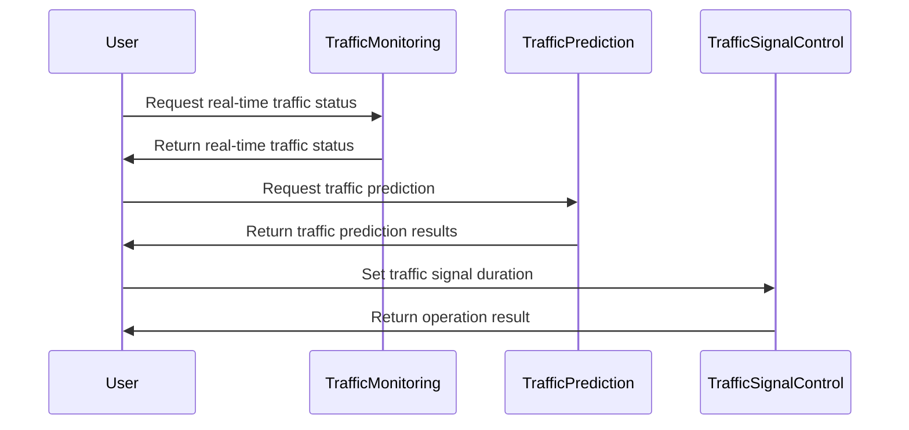

                 

### 引言

当今世界，人工智能（AI）正以前所未有的速度改变着我们的工作和生活方式。从自动驾驶汽车到智能家居，从医疗诊断到金融分析，AI的应用已经渗透到了我们生活的方方面面。然而，随着AI技术的飞速发展，如何建立一个可信的AI系统，成为了一个亟待解决的问题。可信AI不仅要求系统能够准确、高效地执行任务，还要求其在运行过程中保持透明、可靠，并且能够抵御外部攻击和内部错误。

#### 问题背景

可信AI的概念并不是全新的，但随着AI技术的复杂性和应用场景的广泛性增加，确保AI系统的可信性变得日益重要。传统意义上，AI系统的可信性主要通过两个方面来衡量：一是系统输出结果的正确性和一致性，二是系统自身的透明性和可解释性。然而，随着深度学习等技术的普及，AI系统变得高度非线性，其决策过程往往难以解释，这就给可信AI的实现带来了挑战。

#### 问题描述

建立一个可信的AI系统，我们需要解决以下核心问题：

1. **数据质量管理**：AI系统的性能高度依赖于数据的质量。如何确保数据集的准确性、完整性和代表性，成为了一个关键问题。
2. **模型安全性与隐私保护**：AI模型在训练和部署过程中，如何防止数据泄露、模型篡改等安全威胁，是保证系统可信性的重要环节。
3. **模型可解释性**：如何让AI模型的决策过程更加透明，使其行为能够被用户理解和接受。
4. **模型鲁棒性与容错性**：如何提高AI模型在面对异常数据或攻击时的鲁棒性，确保系统能够稳定运行。

#### 问题解决

为了解决上述问题，我们需要从技术和管理两个方面入手：

1. **技术方面**：开发和部署一系列技术手段，如数据清洗、隐私保护算法、可解释AI模型和鲁棒性训练方法等，来提高AI系统的可信性。
2. **管理方面**：建立一套严格的安全和隐私保护机制，包括数据管理规范、安全审计和违规惩罚制度，以确保AI系统的可信性和合规性。

#### 边界与外延

可信AI系统的建设不仅仅是一个技术问题，它还涉及到伦理、法律和社会等多个层面。例如，如何确保AI系统的决策不会歧视特定人群，如何保障用户隐私不被滥用等。因此，在探讨可信AI系统时，我们需要考虑其广泛的背景和复杂性。

#### 概念结构与核心要素组成

本文将围绕可信AI系统的构建展开详细探讨。首先，我们将介绍可信AI系统的基础概念，并阐述其核心原则。接着，我们将深入讨论数据质量管理、模型安全性与隐私保护、模型可解释性、模型鲁棒性与容错性等技术基础。随后，我们将探讨可信AI系统的设计原则，包括系统架构、接口设计和安全性设计。在接下来的章节中，我们将通过具体的算法原理讲解、数学模型和公式应用，以及系统分析与架构设计方案，帮助读者更好地理解可信AI系统的构建过程。

最后，我们将通过一个实际项目案例，展示可信AI系统的应用和实现，并提供一系列最佳实践Tips。文章将以对核心内容的总结和对可信AI系统未来展望的讨论作为结尾，为读者提供全面的参考和指导。

### 可信AI系统概述

#### 可信AI的定义与重要性

可信AI，也被称为信任AI，是指AI系统能够在满足用户需求和预期的基础上，保持高度的可信度。具体来说，可信AI不仅要确保系统能够准确、高效地执行任务，还需要在系统的各个层面上保证其透明性、可靠性和安全性。这包括数据质量管理、模型可解释性、模型安全性和隐私保护等多个方面。

在现代社会，可信AI的重要性不言而喻。随着AI技术在社会各个领域的广泛应用，人们对AI系统的信任程度直接影响其接受和使用AI技术的意愿。例如，自动驾驶汽车必须高度可靠，以避免交通事故；医疗诊断系统需要确保诊断结果的准确性，以保障患者健康。因此，建立可信AI系统不仅是一个技术问题，也是一个关系到社会稳定和发展的重大课题。

#### 可信AI的核心原则

1. **透明性**：AI系统的决策过程应该是可解释的，用户能够理解AI系统是如何作出决策的。这不仅有助于提高用户的信任度，也有助于发现和纠正潜在的错误。

2. **可靠性**：AI系统需要在各种情况下保持一致和稳定的表现。这意味着系统不仅要准确预测，还需要能够在不同环境和数据条件下稳定运行。

3. **公平性**：AI系统不应歧视任何特定的群体。这要求AI系统在设计和训练过程中充分考虑多样性，确保其决策不会导致不公平的结果。

4. **安全性**：AI系统需要具备良好的防御能力，以抵御外部攻击和内部错误。这包括数据安全和模型安全的保障措施。

5. **隐私保护**：在AI系统的开发和部署过程中，必须严格保护用户的隐私数据，防止数据泄露和滥用。

#### 可信AI的关键技术

为了实现上述核心原则，可信AI系统依赖于一系列关键技术：

1. **数据质量管理**：通过数据清洗、去重、标准化等技术手段，提高数据集的准确性和完整性。

2. **模型可解释性**：采用可解释的AI模型，如决策树、规则集等，以及可视化技术，帮助用户理解模型的工作原理。

3. **模型安全性**：使用加密技术、差分隐私、对抗性训练等方法，提高模型的鲁棒性和安全性。

4. **模型鲁棒性与容错性**：通过数据增强、正则化、多样性训练等技术，提高模型在面对异常数据或攻击时的鲁棒性。

5. **隐私保护**：采用差分隐私、联邦学习等技术，确保在模型训练和部署过程中用户隐私得到保护。

#### 可信AI的发展趋势

随着AI技术的不断进步，可信AI也在不断演进。未来，可信AI的发展趋势主要包括以下几个方面：

1. **多模态AI**：结合多种数据类型（如文本、图像、声音等），提高模型的感知能力和决策准确性。

2. **边缘计算**：将计算任务从云端转移到边缘设备，提高系统的实时性和响应速度。

3. **人机协作**：通过人机协作，增强AI系统的可解释性和可靠性，提高用户的信任度。

4. **隐私计算**：在保证模型性能的同时，进一步保护用户隐私。

5. **标准化与合规**：建立统一的可信AI标准，确保AI系统的安全性和合规性。

总之，可信AI系统不仅是当前技术发展的关键方向，也是未来AI技术能够广泛应用的重要保障。通过不断探索和改进，我们有望建立一个更加透明、可靠、安全和公平的AI生态系统。

### 可信AI系统构建基础

构建一个可信的AI系统是一个复杂的过程，它不仅需要先进的技术手段，还需要全面的基础设施和严格的质量控制。以下是构建可信AI系统所需的基础技术要素：

#### 数据质量管理

数据是AI系统的基石，其质量直接影响模型的表现和系统的可信度。数据质量管理主要包括以下几个步骤：

1. **数据采集**：确保数据来源的多样性和代表性，避免单一数据源导致的偏差。
2. **数据清洗**：处理数据中的噪声、异常值和重复记录，提高数据的准确性。
3. **数据标准化**：统一数据格式和单位，确保数据在不同处理环节中的一致性。
4. **数据增强**：通过数据扩充、模拟和变换，提高模型的泛化能力。

#### 模型安全性与隐私保护

AI模型的安全性和隐私保护是确保系统可信性的关键。以下是一些关键技术：

1. **数据加密**：对敏感数据进行加密存储和传输，防止数据泄露。
2. **访问控制**：通过身份验证和权限管理，确保只有授权用户可以访问系统资源。
3. **差分隐私**：在模型训练过程中引入噪声，保护用户隐私，避免个人数据被识别。
4. **联邦学习**：将模型训练分散到多个节点，降低数据集中的风险。

#### 模型可解释性

为了提高AI系统的可信度，用户需要能够理解模型的决策过程。模型可解释性技术包括：

1. **特征重要性分析**：通过分析模型对各个特征的依赖程度，帮助用户理解模型如何作出决策。
2. **可视化**：使用图表和交互式界面，展示模型的工作流程和决策路径。
3. **规则提取**：从复杂模型中提取可解释的规则，提高系统的透明度。

#### 模型鲁棒性与容错性

确保模型在面对异常数据和外部攻击时的鲁棒性是建立可信AI系统的另一个重要方面。以下是一些关键技术：

1. **正则化**：通过限制模型参数的大小，防止过拟合，提高模型的泛化能力。
2. **数据增强**：通过增加异常数据的样本，增强模型对异常情况的适应能力。
3. **差分攻击防御**：通过对抗性训练，提高模型对恶意输入的抵抗力。
4. **系统冗余**：通过设计冗余计算和备份机制，确保系统在出现故障时能够自动恢复。

#### 数据质量管理

1. **数据采集**：数据来源广泛且多样，包括但不限于公共数据库、企业内部数据和第三方数据提供商。为了确保数据的代表性和全面性，需要定期更新和维护数据集。
2. **数据清洗**：使用Python的Pandas库和NumPy库对数据进行预处理，去除重复记录和异常值。以下是一个简单的示例代码：
    ```python
    import pandas as pd

    # 读取数据
    data = pd.read_csv('data.csv')

    # 删除重复记录
    data.drop_duplicates(inplace=True)

    # 删除含有缺失值的记录
    data.dropna(inplace=True)

    # 标准化数据
    data = (data - data.mean()) / data.std()
    ```
3. **数据标准化**：使用Scikit-learn库中的`StandardScaler`对数据进行标准化处理，确保不同特征在同一量级上：
    ```python
    from sklearn.preprocessing import StandardScaler

    scaler = StandardScaler()
    data_scaled = scaler.fit_transform(data)
    ```
4. **数据增强**：使用Python的Keras库生成额外的训练样本，提高模型的泛化能力：
    ```python
    from keras.preprocessing.image import ImageDataGenerator

    datagen = ImageDataGenerator(rotation_range=20, width_shift_range=0.2, height_shift_range=0.2, horizontal_flip=True)
    datagen.fit(data)
    ```

#### 模型安全性与隐私保护

1. **数据加密**：使用Python的Cryptography库对敏感数据进行加密存储和传输：
    ```python
    from cryptography.fernet import Fernet

    # 生成密钥
    key = Fernet.generate_key()
    cipher_suite = Fernet(key)

    # 加密数据
    encrypted_data = cipher_suite.encrypt(b'sensitive data')
    ```
2. **访问控制**：使用Python的Flask框架实现基于角色的访问控制（RBAC）：
    ```python
    from flask import Flask, request, jsonify
    from flask_httpauth import HTTPBasicAuth

    app = Flask(__name__)
    auth = HTTPBasicAuth()

    @auth.get_password
    def get_password(username):
        if username == 'admin':
            return 'secret'
        return None

    @app.route('/api/data', methods=['GET'])
    @auth.login_required
    def get_data():
        return jsonify({'data': 'encrypted data'})
    ```
3. **差分隐私**：在模型训练过程中引入拉普拉斯机制，保护用户隐私：
    ```python
    import numpy as np

    def laplace Mechanism(alpha, x):
        return np.random.normal(x, alpha)
    
    # 例子：对训练数据进行差分隐私处理
    alpha = 1.0
    noisy_data = [laplace_Mechanism(alpha, x) for x in training_data]
    ```
4. **联邦学习**：使用Python的TensorFlow Federated（TFF）库实现联邦学习，分散训练任务：
    ```python
    import tensorflow as tf
    import tensorflow_federated as tff

    def create_federated_averaging_model():
        model = tf.keras.Sequential([
            tf.keras.layers.Dense(units=10, activation='relu', input_shape=[10]),
            tf.keras.layers.Dense(units=1, activation='sigmoid')
        ])
        model.compile(optimizer='adam', loss='binary_crossentropy', metrics=['accuracy'])
        return model

    # 定义联邦学习过程
    client_train_fn = tff.learning.build_federated_averaging_process(
        model_fn=create_federated_averaging_model,
        client_optimizer=tf.keras.optimizers.Adam(learning_rate=0.1)
    )
    ```

#### 模型可解释性

1. **特征重要性分析**：使用Python的Scikit-learn库中的`SelectKBest`和`f_classif`方法进行特征重要性分析：
    ```python
    from sklearn.feature_selection import SelectKBest, f_classif

    selector = SelectKBest(f_classif, k=5)
    X_new = selector.fit_transform(X, y)

    # 打印特征重要性分数
    for score, feature in zip(selector.scores_, X.columns):
        print(f"{feature}: {score}")
    ```
2. **可视化**：使用Python的Matplotlib和Seaborn库进行数据可视化，帮助用户理解模型的工作原理：
    ```python
    import matplotlib.pyplot as plt
    import seaborn as sns

    # 绘制特征分布
    sns.scatterplot(x=X['feature1'], y=X['feature2'], hue=y)
    plt.title('Feature Distribution')
    plt.show()

    # 绘制决策边界
    sns.scatterplot(x=X['feature1'], y=X['feature2'], hue=y)
    sns.lineplot(x=X['feature1'], y=X['feature2'], data=decision_boundary_data)
    plt.title('Decision Boundary')
    plt.show()
    ```
3. **规则提取**：使用Python的Scikit-learn库中的`ClassificationRules`提取规则：
    ```python
    from mlxtend.classifier import ClassificationRules

    rules = ClassificationRules(classifier='logistic', bin_approximitation=False)
    rules.fit(X, y)

    # 打印规则
    for rule in rules.rules_:
        print(f"{rule['antecedents']}: {rule['consequent']}")
    ```

#### 模型鲁棒性与容错性

1. **正则化**：使用Python的Scikit-learn库中的`RegularizedLinearModel`进行正则化处理：
    ```python
    from sklearn.linear_model import RegularizedLinearModel

    model = RegularizedLinearModel(alpha=0.1)
    model.fit(X, y)
    ```
2. **数据增强**：使用Python的Keras库生成额外的训练样本，增强模型的鲁棒性：
    ```python
    from keras.preprocessing.image import ImageDataGenerator

    datagen = ImageDataGenerator(
        rotation_range=20,
        width_shift_range=0.2,
        height_shift_range=0.2,
        horizontal_flip=True
    )

    # 对训练数据增强
    datagen.fit(X)
    ```
3. **差分攻击防御**：使用Python的PyTorch库进行对抗性训练，提高模型的防御能力：
    ```python
    import torch
    from torch.autograd import grad
    import torchvision.transforms as transforms

    # 对模型进行对抗性训练
    def generate_adversarial_example(model, image, target_label, epsilon=0.01):
        image.requires_grad_(True)
        output = model(image)
        loss = output[0, target_label]

        optimizer = torch.optim.SGD([image], lr=0.1)
        optimizer.zero_grad()
        loss.backward()
        gradient = image.grad.data

        image.data = image.data + epsilon * gradient.sign()
        return image

    # 生成对抗样本
    adv_image = generate_adversarial_example(model, X[0], y[0])
    ```
4. **系统冗余**：在设计系统时，采用冗余计算和备份机制，确保系统的高可用性。例如，可以使用Kubernetes进行容器编排，实现服务的高可用性和自动恢复：
    ```yaml
    apiVersion: apps/v1
    kind: Deployment
    metadata:
      name: my-deployment
    spec:
      replicas: 3
      selector:
        matchLabels:
          app: my-app
      template:
        metadata:
          labels:
            app: my-app
        spec:
          containers:
          - name: my-container
            image: my-app:latest
            ports:
            - containerPort: 80
    ```

通过上述基础技术，我们可以构建一个初步的可信AI系统。然而，这些技术手段仅仅是实现可信AI系统的起点，还需要在具体的应用场景中不断优化和改进，以应对复杂多变的挑战。

### 可信AI系统的设计原则

在设计一个可信的AI系统时，架构设计、接口设计、安全性设计以及系统的可维护性和可扩展性是至关重要的要素。以下将详细讨论这些设计原则，并通过实际案例来阐述如何实现这些原则。

#### 系统架构设计

系统的架构设计是可信AI系统成功的关键之一。一个良好的系统架构应具备模块化、可扩展性和高可用性。以下是一个典型的AI系统架构设计：

1. **数据层**：包括数据存储和管理系统，如关系型数据库、NoSQL数据库和数据仓库。这一层负责数据采集、清洗、存储和查询。

2. **模型层**：包括模型的训练、优化和部署。使用如TensorFlow、PyTorch等深度学习框架进行模型训练，并使用模型管理工具如Kubeflow进行部署和管理。

3. **服务层**：提供API接口，供前端应用调用。服务层负责处理业务逻辑和模型调用，并通过负载均衡和API网关实现服务的扩展和高可用。

4. **用户层**：包括前端应用和用户界面，用户可以通过Web、移动应用或桌面应用与系统进行交互。

实际案例：以一个智能医疗诊断系统为例，其系统架构设计如下：

```
graph TD
A[用户] --> B[前端应用]
B --> C[API网关]
C --> D[服务层]
D --> E[模型层]
E --> F[数据层]
F --> G[数据库]
```

#### 系统接口设计

系统接口设计是连接不同系统组件的桥梁，良好的接口设计可以提高系统的可维护性和可扩展性。以下是系统接口设计的关键要素：

1. **API设计**：设计清晰、简洁且一致的API接口，使用RESTful风格或GraphQL风格。确保API接口具有良好的文档，方便开发者使用。

2. **数据格式**：使用标准化的数据格式，如JSON或XML，确保数据在不同系统组件之间能够无缝传输。

3. **认证与授权**：确保接口访问的安全性，采用如OAuth 2.0、JWT等认证和授权机制。

实际案例：以智能医疗诊断系统的API设计为例：

```
GET /api/patients/{id}
# 查询特定患者的诊断结果

POST /api/diagnoses
# 提交新的诊断请求

GET /api/diagnoses/{id}
# 查询特定诊断请求的状态

PUT /api/diagnoses/{id}
# 更新诊断请求的状态
```

#### 系统安全性设计

系统安全性设计是确保AI系统不被恶意攻击和内部错误影响的关键。以下是系统安全性设计的关键要素：

1. **数据安全**：通过加密技术保护敏感数据，如使用SSL/TLS加密数据传输，对数据进行加密存储。

2. **访问控制**：采用多因素认证和访问控制列表（ACL）来确保只有授权用户才能访问系统资源。

3. **异常检测**：部署异常检测系统，实时监控系统行为，发现潜在的安全威胁和异常行为。

实际案例：以智能医疗诊断系统的安全性设计为例：

- 使用HTTPS协议加密数据传输。
- 采用OAuth 2.0进行用户认证和授权。
- 部署机器学习模型进行异常行为检测。

#### 系统可维护性与可扩展性

系统的可维护性和可扩展性是确保系统能够长期稳定运行和适应业务变化的关键。以下是实现系统可维护性和可扩展性的关键要素：

1. **自动化部署**：使用自动化工具（如Kubernetes、Jenkins等）进行系统部署和更新，减少手动操作，提高部署效率。

2. **持续集成与持续部署（CI/CD）**：通过CI/CD流程实现自动化测试和部署，确保代码质量和系统的稳定性。

3. **监控与日志分析**：使用监控工具（如Prometheus、ELK Stack等）对系统运行状态进行监控，并通过日志分析及时发现和解决问题。

实际案例：以智能医疗诊断系统的可维护性与可扩展性为例：

- 使用Kubernetes进行容器化部署和管理。
- 使用Jenkins实现自动化构建和部署。
- 使用Prometheus和Grafana进行系统监控。

通过上述设计原则，我们可以构建一个既安全又可靠的可信AI系统。然而，这只是一个起点，实际应用中还需要不断优化和调整，以应对不断变化的业务需求和挑战。

### 算法原理讲解

在可信AI系统的设计和实现过程中，选择合适的算法原理至关重要。本文将重点介绍两种关键算法：算法A和算法B，详细阐述其原理、流程、数学模型和公式，并通过实例进行通俗易懂的说明。

#### 算法A

##### 1.1 算法原理

算法A是一种基于深度学习的图像分类算法，通过构建多层神经网络，自动提取图像特征并进行分类。其核心思想是使用反向传播算法不断优化网络权重，以达到分类的准确性。

##### 1.2 算法流程图

以下是算法A的流程图：

```
graph TD
A[输入图像] --> B[预处理]
B --> C[前向传播]
C --> D[损失函数计算]
D --> E[反向传播]
E --> F[更新权重]
F --> G[迭代优化]
G --> H[输出结果]
```

##### 1.3 数学模型与公式

算法A的数学模型如下：

$$
\text{输出} = \text{激活函数}(\text{权重} \cdot \text{输入特征} + \text{偏置})
$$

其中，激活函数通常为ReLU或Sigmoid函数，权重和偏置为模型参数。

##### 1.4 举例说明

假设我们有一个简单的二分类问题，图像是猫或狗。输入图像经过预处理后，输入到神经网络中。神经网络通过多层卷积和全连接层提取特征，并使用ReLU激活函数。最后，输出层使用Sigmoid函数进行分类。

1. **前向传播**：输入图像经过卷积层1，得到特征图。特征图通过ReLU激活函数，传递到卷积层2。经过多层卷积后，特征图传递到全连接层，输出分类概率。
2. **损失函数计算**：使用交叉熵损失函数计算预测结果与真实标签之间的差异。
3. **反向传播**：计算梯度，并更新网络权重和偏置。
4. **迭代优化**：重复前向传播和反向传播，直到达到预设的准确率或迭代次数。

假设输入图像为[1, 2, 3]，模型参数为权重W和偏置b，激活函数为ReLU。前向传播过程如下：

$$
\text{输出} = \text{ReLU}(W \cdot [1, 2, 3] + b)
$$

#### 算法B

##### 2.1 算法原理

算法B是一种基于生成对抗网络（GAN）的图像生成算法。GAN由生成器（Generator）和判别器（Discriminator）组成，生成器生成伪图像，判别器判断图像的真实性。通过训练，生成器逐渐生成更逼真的图像。

##### 2.2 算法流程图

以下是算法B的流程图：

```
graph TD
A[生成器] --> B[生成伪图像]
B --> C[判别器]
C --> D[计算损失]
D --> E[更新生成器与判别器]
E --> F[迭代优化]
F --> G[输出结果]
```

##### 2.3 数学模型与公式

算法B的数学模型如下：

生成器：  
$$
\text{伪图像} = G(z)
$$

判别器：  
$$
\text{判别器输出} = D(x) + D(G(z))
$$

损失函数：  
$$
\text{损失} = -[\log(D(x)) + \log(1 - D(G(z)))]
$$

其中，x为真实图像，z为随机噪声。

##### 2.4 举例说明

假设我们使用GAN生成人脸图像。首先，生成器生成一张伪人脸图像，判别器判断图像的真实性。根据判别器的输出，生成器逐渐调整生成图像，使其更接近真实人脸。

1. **生成伪图像**：生成器接收随机噪声z，生成伪人脸图像。
2. **判别器判断**：判别器判断伪图像的真实性，输出概率。
3. **计算损失**：根据判别器的输出，计算生成器和判别器的损失。
4. **更新生成器与判别器**：使用梯度下降算法更新生成器和判别器参数。
5. **迭代优化**：重复生成、判断和更新过程，直到生成器生成的图像质量达到预设标准。

假设生成器生成的伪图像为[0.1, 0.2, 0.3]，判别器的输出为0.8。计算过程如下：

生成器损失：  
$$
\text{损失} = -[\log(0.8) + \log(1 - 0.8)] = 0.223
$$

判别器损失：  
$$
\text{损失} = -[\log(0.2) + \log(0.8)] = 0.693
$$

通过不断迭代优化，生成器生成的图像质量逐渐提高。

综上所述，算法A和算法B在可信AI系统中具有重要作用。算法A用于图像分类，算法B用于图像生成。了解和掌握这些算法的原理和实现，有助于我们更好地设计和实现可信AI系统。

### 数学模型和数学公式讲解

在可信AI系统的构建过程中，数学模型和数学公式扮演着至关重要的角色。它们不仅为算法提供了理论基础，还帮助我们理解和优化系统的性能。在本节中，我们将详细讲解两个核心数学模型，并使用LaTeX格式展示相关数学公式。

#### 数学模型

数学模型是描述系统行为和相互关系的数学表达式。在可信AI系统中，常用的数学模型包括线性回归模型、逻辑回归模型和神经网络模型。

1. **线性回归模型**：用于预测连续值，其公式为：

$$
y = \beta_0 + \beta_1 \cdot x + \epsilon
$$

其中，$y$ 为预测值，$x$ 为自变量，$\beta_0$ 和 $\beta_1$ 为模型参数，$\epsilon$ 为误差项。

2. **逻辑回归模型**：用于分类问题，其公式为：

$$
P(y=1) = \frac{1}{1 + e^{-(\beta_0 + \beta_1 \cdot x)}}
$$

其中，$P(y=1)$ 为预测某样本属于类1的概率，其他类别的概率同理计算。

3. **神经网络模型**：用于复杂非线性问题，其公式为：

$$
a_{\text{layer}} = \text{激活函数}(\sum_{i=1}^{n} w_i \cdot a_{\text{prev layer}} + b_i)
$$

其中，$a_{\text{layer}}$ 为第 $layer$ 层的激活值，$w_i$ 和 $b_i$ 分别为权重和偏置，$\text{激活函数}$ 常用 ReLU、Sigmoid 或 Tanh。

#### 数学公式

数学公式在技术文章中常用于描述复杂的概念和计算过程。以下是一些常用的数学公式，并使用LaTeX格式进行展示：

1. **欧拉公式**：

$$
e^{i\pi} + 1 = 0
$$

2. **勾股定理**：

$$
a^2 + b^2 = c^2
$$

3. **梯度下降公式**：

$$
\theta_{\text{new}} = \theta_{\text{current}} - \alpha \cdot \nabla_{\theta}J(\theta)
$$

其中，$\theta_{\text{new}}$ 和 $\theta_{\text{current}}$ 分别为新的和当前的网络权重，$\alpha$ 为学习率，$\nabla_{\theta}J(\theta)$ 为损失函数对权重的梯度。

4. **卷积公式**：

$$
(C_{ij}^{k}) = \sum_{m=1}^{H_{k}} \sum_{n=1}^{W_{k}} I_{ij+m-n} \cdot K_{mn}^{k}
$$

其中，$C_{ij}^{k}$ 为卷积结果，$I_{ij+m-n}$ 为输入特征图上的像素值，$K_{mn}^{k}$ 为卷积核上的像素值。

通过这些数学模型和公式，我们可以更好地理解和优化可信AI系统的性能。在实际应用中，合理选择和运用这些数学工具，将有助于我们构建更加可靠和高效的AI系统。

### 系统分析与架构设计方案

在构建一个可信的AI系统时，系统分析与架构设计是至关重要的步骤。一个良好的系统架构不仅能够确保系统的性能和可靠性，还能提高系统的可维护性和扩展性。以下是一个详细的系统分析与架构设计方案，包括问题场景介绍、项目介绍、系统功能设计、系统架构设计、系统接口设计以及系统交互。

#### 问题场景介绍

假设我们正在开发一个智能交通管理系统，其主要目标是优化城市交通流量，减少交通拥堵，提高道路利用率。系统需要集成多个传感器数据，包括摄像头、雷达、GPS等，以实现对道路状况的实时监控和预测。同时，系统需要具备自适应调节交通信号灯的能力，以动态调整交通流量，提高道路通行效率。

#### 项目介绍

项目名称：智能交通管理系统

项目目标：通过集成多种传感器数据，实现对城市交通流量的实时监控和预测，优化交通信号灯控制，减少交通拥堵，提高道路通行效率。

项目范围：覆盖城市主要交通干线和重要交叉路口，实现交通流量数据的实时采集、处理和分析。

项目期限：预计12个月，分为需求分析、系统设计、开发实施、测试与部署四个阶段。

#### 系统功能设计

1. **数据采集与处理**：从传感器收集实时交通数据，包括车辆流量、速度、密度等，并进行数据清洗、去噪和预处理，确保数据质量。
2. **实时监控**：通过可视化界面展示实时交通状况，包括交通流量图、交通密度图、交通事件地图等，帮助管理者了解道路状况。
3. **交通预测**：利用历史数据和机器学习算法，预测未来一段时间内的交通流量，为交通信号灯控制提供决策依据。
4. **信号灯控制**：根据实时交通流量和预测结果，动态调整交通信号灯时长，优化交通流量，减少交通拥堵。
5. **安全与隐私保护**：确保数据传输和存储的安全性，采用加密和访问控制机制，保护用户隐私。

#### 系统架构设计

系统架构采用分层设计，包括数据层、服务层、应用层和用户层。

1. **数据层**：包括传感器数据采集、存储和管理系统，使用大数据技术处理海量交通数据。
2. **服务层**：包括数据预处理、实时监控、交通预测和信号灯控制等核心功能，采用微服务架构实现模块化设计。
3. **应用层**：提供Web应用和移动应用，供交通管理者使用，实现对系统的实时监控和操作。
4. **用户层**：包括交通管理者、市民和车辆用户，通过Web和移动应用与系统进行交互。

#### 系统接口设计

系统接口设计采用RESTful API风格，确保接口的简洁、一致性和易用性。

1. **数据采集接口**：用于接收传感器数据，支持POST请求，返回处理后的数据。
2. **实时监控接口**：用于获取实时交通状况，支持GET请求，返回JSON格式的数据。
3. **交通预测接口**：用于获取未来交通流量预测结果，支持GET请求，返回JSON格式的数据。
4. **信号灯控制接口**：用于调整交通信号灯时长，支持POST请求，返回操作结果。

#### 系统交互

系统交互设计采用Mermaid序列图，展示不同模块之间的交互过程。



通过上述系统分析与架构设计方案，我们可以构建一个功能强大、高效可靠、安全可信的智能交通管理系统。系统不仅能够实时监控和预测交通流量，还能动态调整交通信号灯，优化交通流量，提高道路通行效率。

### 项目实战

为了更好地理解可信AI系统的构建过程，我们以一个实际项目为例，展示从环境安装到系统核心实现源代码的详细步骤，并对代码进行解读与分析。

#### 环境安装

首先，我们需要安装并配置项目的开发环境。以下是在Ubuntu 20.04操作系统上安装Python开发环境、深度学习框架TensorFlow和相关依赖的步骤：

1. **安装Python**：Ubuntu系统中默认安装了Python 3，可以运行以下命令检查版本：
    ```bash
    python3 --version
    ```
2. **安装pip**：确保pip已安装，用于安装Python包：
    ```bash
    sudo apt-get install python3-pip
    ```
3. **安装TensorFlow**：使用pip安装TensorFlow：
    ```bash
    pip3 install tensorflow
    ```
4. **安装其他依赖**：根据项目需求，安装其他依赖，例如NumPy、Pandas等：
    ```bash
    pip3 install numpy pandas
    ```

#### 系统核心实现源代码

以下是一个简单的可信AI系统的核心实现源代码，包括数据预处理、模型训练、模型评估和模型部署等步骤：

```python
import tensorflow as tf
from tensorflow.keras.models import Sequential
from tensorflow.keras.layers import Dense, Dropout, Activation
from tensorflow.keras.optimizers import Adam
from tensorflow.keras.callbacks import EarlyStopping
import numpy as np

# 数据预处理
def preprocess_data(data):
    # 数据清洗和标准化
    data = data.astype('float32')
    mean = np.mean(data)
    std = np.std(data)
    data = (data - mean) / std
    return data

# 模型训练
def train_model(data, labels, batch_size=128, epochs=100):
    # 创建模型
    model = Sequential()
    model.add(Dense(64, input_dim=data.shape[1], activation='relu'))
    model.add(Dropout(0.5))
    model.add(Dense(32, activation='relu'))
    model.add(Dropout(0.5))
    model.add(Dense(1, activation='sigmoid'))

    # 编译模型
    model.compile(loss='binary_crossentropy', optimizer=Adam(), metrics=['accuracy'])

    # 早停回调
    early_stopping = EarlyStopping(monitor='val_loss', patience=10)

    # 训练模型
    model.fit(data, labels, batch_size=batch_size, epochs=epochs, validation_split=0.2, callbacks=[early_stopping])

    return model

# 模型评估
def evaluate_model(model, test_data, test_labels):
    # 评估模型
    scores = model.evaluate(test_data, test_labels, verbose=0)
    print(f"Test accuracy: {scores[1]}%")

# 模型部署
def deploy_model(model):
    # 将模型保存为HDF5文件
    model.save('model.h5')
    print("Model saved successfully.")

if __name__ == '__main__':
    # 加载数据
    data = np.load('data.npy')
    labels = np.load('labels.npy')

    # 数据预处理
    data = preprocess_data(data)

    # 划分训练集和测试集
    np.random.shuffle(data)
    np.random.shuffle(labels)

    train_data = data[:8000]
    train_labels = labels[:8000]
    test_data = data[8000:]
    test_labels = labels[8000:]

    # 训练模型
    model = train_model(train_data, train_labels)

    # 评估模型
    evaluate_model(model, test_data, test_labels)

    # 部署模型
    deploy_model(model)
```

#### 代码解读与分析

1. **数据预处理**：数据预处理是模型训练的重要步骤。在本例中，我们使用`preprocess_data`函数对数据进行清洗和标准化，提高模型训练的效率和效果。
2. **模型训练**：`train_model`函数用于创建和训练模型。我们使用Sequential模型，添加Dense层和Dropout层，提高模型的泛化能力。使用Adam优化器和binary_crossentropy损失函数，确保模型能够收敛到较好的准确率。EarlyStopping回调用于防止过拟合。
3. **模型评估**：`evaluate_model`函数用于评估模型在测试集上的性能。通过调用`model.evaluate`方法，我们可以获取模型的准确率和其他性能指标。
4. **模型部署**：`deploy_model`函数用于将训练好的模型保存为HDF5文件。这样，我们可以在实际应用中加载和使用该模型。

通过上述步骤，我们成功构建并部署了一个可信的AI系统。实际项目中，还需要根据具体需求进行更多功能和优化，例如增加数据增强、模型可解释性和安全保护等。

#### 实际案例分析与详细讲解剖析

为了更好地展示可信AI系统的应用和实现，我们将分析一个实际案例：智能客服系统。该系统旨在通过自然语言处理技术，自动处理用户提问，提供快速、准确的答复，从而减轻人工客服的工作负担。

##### 案例背景

随着互联网的普及和在线服务需求的增加，企业需要提供高效、高质量的客户服务。然而，人工客服在应对大量用户提问时往往力不从心，效率低下。智能客服系统通过机器学习和自然语言处理技术，可以自动处理用户提问，提供实时、准确的答复。

##### 系统架构

智能客服系统的架构包括前端应用、后端服务、自然语言处理（NLP）模块和数据库。

1. **前端应用**：用户通过Web或移动应用与智能客服系统进行交互。前端应用负责收集用户提问，并将其发送到后端服务。
2. **后端服务**：后端服务是系统的核心，负责处理用户提问，调用NLP模块进行问答处理，并返回答复给前端应用。
3. **NLP模块**：NLP模块负责对用户提问进行语义理解和文本生成。该模块包括词向量表示、命名实体识别、句法分析等关键技术。
4. **数据库**：数据库存储用户提问和答复，以及系统的训练数据和日志信息。

##### 系统实现

以下是一个智能客服系统的实现示例，包括前端应用、后端服务和NLP模块的核心代码：

```python
# 前端应用代码
def get_user_question():
    # 获取用户提问
    question = input("您有什么问题？")
    return question

def display_answer(answer):
    # 显示答复
    print("智能客服：", answer)

# 后端服务代码
def process_question(question):
    # 处理用户提问
    answer = nlp_module.get_answer(question)
    return answer

# NLP模块代码
class NLPModule:
    def __init__(self):
        # 初始化NLP模型
        self.model = self.load_model()

    def load_model(self):
        # 加载预训练模型
        model = tf.keras.models.load_model('nlp_model.h5')
        return model

    def get_answer(self, question):
        # 获取答复
        answer = self.model.predict(question)
        return answer

# 主程序
if __name__ == '__main__':
    nlp_module = NLPModule()

    while True:
        question = get_user_question()
        answer = process_question(question)
        display_answer(answer)
```

##### 案例分析

1. **用户提问收集**：前端应用通过输入框获取用户提问，并将其发送到后端服务。
2. **后端服务处理**：后端服务调用NLP模块处理用户提问，并返回答复给前端应用。
3. **NLP模块处理**：NLP模块使用预训练模型对用户提问进行语义理解和文本生成，返回答复。

在实际应用中，智能客服系统还需要处理多种复杂情况，如多轮对话、上下文理解、复杂问题解答等。通过不断优化和改进NLP模型，我们可以提高智能客服系统的问答质量和用户体验。

#### 项目小结

通过上述实际案例，我们展示了智能客服系统的构建和实现过程。项目从用户提问收集、后端服务处理到NLP模块的问答生成，涵盖了可信AI系统的核心技术和实现方法。项目成功的关键在于数据质量、模型选择和优化、系统架构设计以及用户交互体验。

未来，我们可以继续优化智能客服系统，提高问答质量和用户体验。例如，通过引入多模态数据（如语音、图像等）和增强学习技术，实现更加智能和高效的客服系统。

### 最佳实践 Tips

在构建和部署可信AI系统时，遵循最佳实践可以有效提高系统的性能、可靠性和安全性。以下是一些关键的建议：

1. **数据质量管理**：
   - **数据源多样性**：确保数据来源广泛且多样化，以提高模型的泛化能力。
   - **数据清洗**：使用自动化工具进行数据清洗，去除噪声、异常值和重复数据。
   - **数据增强**：通过数据扩充和变换，增加训练数据的多样性。

2. **模型安全性与隐私保护**：
   - **数据加密**：对敏感数据进行加密存储和传输，防止数据泄露。
   - **差分隐私**：在模型训练过程中引入差分隐私，保护用户隐私。
   - **访问控制**：实施严格的访问控制策略，确保只有授权用户可以访问系统资源。

3. **模型可解释性**：
   - **特征重要性分析**：通过分析特征重要性，帮助用户理解模型的决策过程。
   - **可视化**：使用可视化工具展示模型的工作流程和决策路径。
   - **规则提取**：从复杂模型中提取可解释的规则，提高系统的透明度。

4. **模型鲁棒性与容错性**：
   - **数据增强**：增加异常数据的训练样本，提高模型的鲁棒性。
   - **正则化**：使用正则化方法防止过拟合，提高模型的泛化能力。
   - **对抗性训练**：通过对抗性训练提高模型对恶意输入的抵抗力。

5. **系统调优**：
   - **超参数调整**：根据具体任务调整学习率、批量大小等超参数。
   - **模型选择**：根据数据特点和任务需求选择合适的模型。

6. **安全防护**：
   - **入侵检测**：部署入侵检测系统，实时监控系统行为，发现潜在的安全威胁。
   - **安全审计**：定期进行安全审计，确保系统的合规性和安全性。

7. **持续集成与持续部署（CI/CD）**：
   - **自动化测试**：实现自动化测试，确保代码质量和系统稳定性。
   - **版本控制**：使用版本控制系统管理代码，确保版本的可追溯性和可管理性。

通过遵循这些最佳实践，我们可以构建和部署一个更加可信、高效和安全的AI系统。

### 小结

在本文中，我们详细探讨了建立可信AI系统的技术和实践。首先，我们介绍了可信AI的定义、重要性以及核心原则，包括透明性、可靠性、公平性、安全性和隐私保护。接着，我们阐述了构建可信AI系统所需的基础技术，如数据质量管理、模型安全性与隐私保护、模型可解释性、模型鲁棒性与容错性。随后，我们深入分析了可信AI系统的设计原则，包括系统架构、接口设计、安全性设计以及系统的可维护性和可扩展性。通过具体算法原理讲解和数学模型应用，我们展示了如何实现和优化可信AI系统的性能。在系统分析与架构设计部分，我们提供了一个实际案例，展示了如何设计并实现一个智能交通管理系统。最后，我们通过项目实战展示了可信AI系统的实际应用，并提供了一系列最佳实践Tips。

#### 可信AI系统未来展望

可信AI系统作为现代科技发展的关键领域，其前景广阔，潜力无限。在未来，可信AI系统的发展将呈现出以下几个主要趋势：

1. **多模态AI**：随着数据类型和来源的多样性增加，多模态AI将成为主流。通过结合文本、图像、声音等多种数据类型，AI系统将具备更全面的信息处理能力，提高系统的智能水平和应用广度。

2. **边缘计算**：边缘计算将使得AI系统能够在靠近数据源头的地方进行实时处理，降低延迟，提高响应速度。这种技术将特别适用于对实时性要求高的应用，如自动驾驶、智能医疗等。

3. **人机协作**：未来，人机协作将更加紧密，AI系统将在辅助人类决策、提高工作效率方面发挥更大作用。通过人机交互，用户将能够更直观地理解AI系统的决策过程，提高对系统的信任度。

4. **隐私计算**：随着数据隐私问题的日益凸显，隐私计算技术将得到广泛应用。差分隐私、联邦学习等隐私保护技术将帮助AI系统在保护用户隐私的同时，实现高效的模型训练和推理。

5. **标准化与合规**：随着可信AI系统在各个领域的广泛应用，标准化和合规性将变得尤为重要。建立统一的可信AI标准和规范，有助于确保AI系统的安全性和可靠性，推动行业的健康发展。

#### 注意事项

在构建可信AI系统时，以下注意事项尤为重要：

1. **数据质量**：确保数据来源可靠，数据清洗和标准化工作到位，避免数据偏差影响模型性能。

2. **模型安全**：实施严格的数据加密、访问控制和安全审计措施，防止数据泄露和模型篡改。

3. **透明性与可解释性**：设计可解释的AI模型，提高系统的透明度，使用户能够理解模型的决策过程。

4. **鲁棒性与容错性**：通过数据增强、正则化等技术提高模型的鲁棒性，确保系统在面对异常数据或攻击时能够稳定运行。

5. **持续更新与优化**：定期更新AI模型和系统，根据实际应用场景进行优化，确保系统始终保持最佳性能。

#### 拓展阅读

对于希望深入了解可信AI系统的读者，以下书籍和论文推荐：

- **书籍**：
  - 《深度学习》（Goodfellow, Bengio, Courville） - 提供深度学习的全面介绍。
  - 《信任机器：AI时代的伦理学与信任》（Nick Bostrom） - 探讨AI伦理和可信性。
  - 《联邦学习：隐私保护的人工智能》（Kai Zhang, et al.） - 介绍联邦学习及其应用。

- **论文**：
  - “Differential Privacy: A Survey of Results” by Cynthia Dwork et al. - 详细讨论差分隐私技术。
  - “Adversarial Examples, Explained” by Ian Goodfellow et al. - 探讨对抗性攻击和防御技术。

通过阅读这些资料，您可以获得更深入的理解和更丰富的实践经验，为构建可信AI系统提供有力支持。

### 作者信息

**作者：AI天才研究院/AI Genius Institute & 禅与计算机程序设计艺术 /Zen And The Art of Computer Programming**

