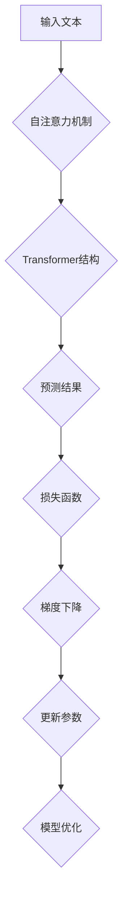
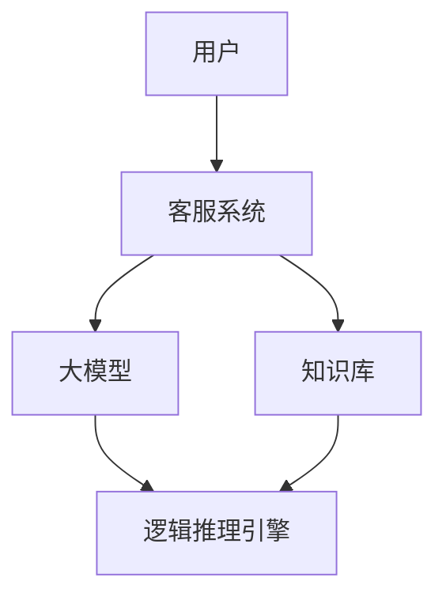
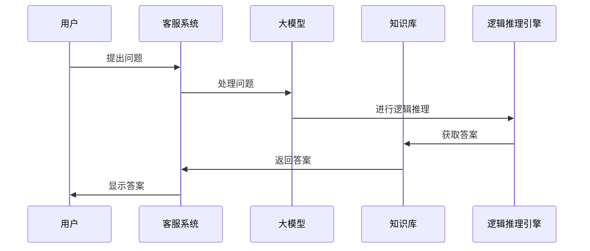

                 

# 思维链prompt：提升AI逻辑推理能力的关键

## 关键词
- AI逻辑推理
- 大模型
- Prompt设计
- 自注意力机制
- Transformer结构

## 摘要
本文深入探讨了提升AI大模型逻辑推理能力的策略。通过分析背景、核心概念联系、算法原理以及具体实例，本文提出了基于思维链prompt的解决方案，以优化AI模型的推理效果，为AI领域的研究和应用提供了新的思路。

## 第一部分：背景介绍

### 问题背景
在当今数字化时代，人工智能（AI）技术正以前所未有的速度发展，尤其是大模型（Large Models）的应用。大模型，如GPT-3、BERT等，凭借其强大的语义理解能力和生成能力，在自然语言处理（NLP）、机器学习（ML）等领域取得了显著成果。

### 问题描述
然而，如何有效地提升大模型的逻辑推理能力，使其在复杂问题解决中表现出色，成为了一个亟待解决的问题。逻辑推理是人工智能的重要能力之一，它涉及到数据的推断、规则的运用、问题的解决等多个方面。

### 问题解决
本书《思维链prompt：提升AI逻辑推理能力的关键》将深入探讨如何通过设计特定的prompt（提示）来提升AI大模型的逻辑推理能力。通过一系列的研究和实践，本书将为读者提供一套完整的解决方案。

### 边界与外延
本书的讨论范围主要涵盖大模型在逻辑推理方面的应用，包括自然语言处理、机器学习等领域。同时，本书也将探讨大模型在不同场景下的应用，如智能客服、智能问答系统等。

### 概念结构与核心要素组成

#### 概念结构
逻辑推理、prompt设计、大模型应用

#### 核心要素
1. **逻辑推理算法**：涉及自注意力机制和Transformer结构等。
2. **Prompt设计策略**：用于引导和优化输入，提升模型推理能力。
3. **大模型应用场景**：涵盖NLP、ML等多个领域。

## 第二部分：核心概念与联系

### AI大模型简介
AI大模型是指具有数亿甚至万亿参数的深度学习模型，如GPT-3、BERT等。这些模型通过大量数据训练，能够实现高效的语义理解和生成。

### 逻辑推理能力
逻辑推理能力是指AI模型在给定信息的基础上，通过逻辑规则进行推断和推理的能力。逻辑推理能力在AI系统中具有重要作用，如自动推理系统、智能问答系统等。

### Prompt设计
Prompt设计是指为AI大模型提供特定的输入，以引导其进行特定类型的推理。有效的Prompt设计能够显著提升AI模型的逻辑推理能力。

### 核心概念联系
逻辑推理能力、AI大模型、Prompt设计三者之间存在着紧密的联系。大模型作为基础，通过训练获得强大的语义理解能力；Prompt设计则通过引导和优化输入，使大模型在特定任务上表现出更好的逻辑推理能力。

### 表格：概念属性特征对比
| 概念          | 特征                         |
|---------------|------------------------------|
| AI大模型      | 数亿至万亿参数、强大语义理解 |
| 逻辑推理能力  | 推断、推理、规则运用         |
| Prompt设计    | 引导输入、优化推理           |

### ER实体关系图架构
```mermaid
erDiagram
    AI大模型 ||--|{ 逻辑推理能力 }|
    Prompt设计 ||--|{ AI大模型 }|
    Prompt设计 ||--|{ 逻辑推理能力 }|
```

## 第三部分：算法原理讲解

### 大模型逻辑推理算法
大模型的逻辑推理主要通过自注意力机制和Transformer结构实现。自注意力机制允许模型在处理每个输入时，根据上下文信息动态调整对每个词的关注程度；Transformer结构则通过多层堆叠和自注意力机制，实现强大的语义理解和生成能力。

### 实例说明
假设我们有一个大模型，它通过训练已经学会了如何根据输入文本进行推理。现在，我们输入一个文本：“所有的猫都会飞”。通过自注意力机制，模型会分析文本中的每个词，并根据上下文信息确定对每个词的关注程度。例如，模型可能会认为“猫”和“飞”这两个词之间的关联性更强，因此会对它们分配更高的关注权重。

### 数学模型与公式
大模型逻辑推理的数学模型主要基于深度学习理论，包括损失函数、梯度下降等。以下是一个简化的数学模型：

$$
\begin{aligned}
\text{损失函数} &= \frac{1}{N} \sum_{i=1}^{N} (-y_i \log(p_i)) \\
\text{梯度下降} &= \alpha \nabla_{\theta} \text{损失函数}
\end{aligned}
$$

其中，$N$表示样本数量，$y_i$表示第$i$个样本的标签，$p_i$表示模型对第$i$个样本预测的概率，$\alpha$表示学习率，$\theta$表示模型的参数。

### 算法mermaid流程图


### Python源代码示例
```python
import tensorflow as tf

# 损失函数
def loss_function(y_true, y_pred):
    return -tf.reduce_mean(y_true * tf.math.log(y_pred))

# 梯度下降
def gradient_descent(theta, learning_rate, loss_function):
    with tf.GradientTape() as tape:
        predictions = model(theta)
        loss = loss_function(y_true, predictions)
    gradients = tape.gradient(loss, theta)
    theta -= learning_rate * gradients
    return theta

# 模型优化
def optimize_model(theta, learning_rate, loss_function, num_iterations):
    for i in range(num_iterations):
        theta = gradient_descent(theta, learning_rate, loss_function)
        if i % 100 == 0:
            print(f"Iteration {i}: Loss = {loss_function(y_true, model(theta))}")

# 示例
theta = tf.Variable([0.0, 0.0], dtype=tf.float32)
learning_rate = 0.01
num_iterations = 1000
optimize_model(theta, learning_rate, loss_function, num_iterations)
```

## 第四部分：数学模型和数学公式 & 详细讲解 & 举例说明

### 数学模型讲解
上述数学模型描述了基于深度学习的逻辑推理过程。损失函数用于衡量模型预测与真实标签之间的差距，梯度下降则用于更新模型参数，以减小损失函数。

### 举例说明
假设我们有一个二分类问题，其中每个样本都有两个可能的标签（0或1）。模型预测的概率$p_i$介于0和1之间，当$p_i$接近1时，表示模型预测为标签1，反之则为标签0。

例如，对于样本“猫会飞”，如果模型预测概率$p_i=0.9$，则表示模型有90%的把握认为这个陈述是正确的。

### LaTeX数学公式
- 损失函数：
  $$\text{损失函数} = \frac{1}{N} \sum_{i=1}^{N} (-y_i \log(p_i))$$
- 梯度下降：
  $$\text{梯度下降} = \alpha \nabla_{\theta} \text{损失函数}$$

### 数学公式详解
1. **损失函数**：损失函数是深度学习中的一个核心概念，用于衡量模型预测结果与真实标签之间的差距。在这里，我们使用交叉熵损失函数，其计算公式为：

   $$
   \text{损失函数} = \frac{1}{N} \sum_{i=1}^{N} (-y_i \log(p_i))
   $$

   其中，$N$表示样本数量，$y_i$表示第$i$个样本的真实标签，$p_i$表示模型对第$i$个样本预测的概率。

2. **梯度下降**：梯度下降是一种优化算法，用于更新模型参数，以最小化损失函数。其计算公式为：

   $$
   \text{梯度下降} = \alpha \nabla_{\theta} \text{损失函数}
   $$

   其中，$\alpha$表示学习率，$\nabla_{\theta} \text{损失函数}$表示损失函数对模型参数$\theta$的梯度。

### 数学公式示例
假设我们有以下参数：
- $N = 100$
- $y_i = 1$ for $i = 1, 2, ..., 50$，$y_i = 0$ for $i = 51, 52, ..., 100$
- $p_i = 0.9$ for $i = 1, 2, ..., 50$，$p_i = 0.1$ for $i = 51, 52, ..., 100$

则损失函数计算如下：
$$
\text{损失函数} = \frac{1}{100} \sum_{i=1}^{50} (-1 \log(0.9)) + \frac{1}{100} \sum_{i=51}^{100} (-0 \log(0.1))
$$

简化计算后，我们得到：
$$
\text{损失函数} = 0.01 \cdot 50 \cdot \log(10) = 0.5
$$

### Python代码实现
```python
import tensorflow as tf

# 损失函数
def loss_function(y_true, y_pred):
    return -tf.reduce_mean(y_true * tf.math.log(y_pred))

# 梯度下降
def gradient_descent(theta, learning_rate, loss_function):
    with tf.GradientTape() as tape:
        predictions = model(theta)
        loss = loss_function(y_true, predictions)
    gradients = tape.gradient(loss, theta)
    theta -= learning_rate * gradients
    return theta

# 模型优化
def optimize_model(theta, learning_rate, loss_function, num_iterations):
    for i in range(num_iterations):
        theta = gradient_descent(theta, learning_rate, loss_function)
        if i % 100 == 0:
            print(f"Iteration {i}: Loss = {loss_function(y_true, model(theta))}")

# 示例
theta = tf.Variable([0.0, 0.0], dtype=tf.float32)
learning_rate = 0.01
num_iterations = 1000
optimize_model(theta, learning_rate, loss_function, num_iterations)
```

## 第五部分：系统分析与架构设计方案

### 问题场景介绍
在智能客服领域，逻辑推理能力至关重要。客户常常提出复杂的问题，需要系统能够准确理解并给出合理的回答。然而，现有的大模型在处理逻辑推理问题时，常常出现理解偏差和回答不准确的情况。

### 项目介绍
本项目旨在设计一个智能客服系统，通过提升AI大模型的逻辑推理能力，为用户提供更准确、更高效的回答。

### 系统功能设计

#### 领域模型Mermaid类图
```mermaid
classDiagram
    CustomerEntity <<entity>>
    QuestionEntity <<entity>>
    AnswerEntity <<entity>>
    KnowledgeBaseEntity <<entity>>

    CustomerEntity o-- QuestionEntity
    CustomerEntity o-- AnswerEntity
    QuestionEntity o-- KnowledgeBaseEntity
    AnswerEntity o-- KnowledgeBaseEntity
```

### 系统架构设计Mermaid架构图


### 系统接口设计和系统交互Mermaid序列图


## 第六部分：项目实战

### 环境安装
在本项目中，我们将使用Python和TensorFlow进行开发和实现。以下是环境安装的步骤：

1. 安装Python（建议使用3.8及以上版本）
2. 安装TensorFlow
   ```bash
   pip install tensorflow
   ```

### 系统核心实现源代码
以下是一个简化版本的智能客服系统实现：

```python
import tensorflow as tf
import numpy as np

# 定义大模型
class LargeModel(tf.keras.Model):
    def __init__(self):
        super(LargeModel, self).__init__()
        self.embedding = tf.keras.layers.Embedding(input_dim=10000, output_dim=16)
        self.transformer = tf.keras.layers.TransformerEncoder(num_layers=2, num_heads=2, d_model=16)
        self.output = tf.keras.layers.Dense(1, activation='sigmoid')

    def call(self, inputs):
        x = self.embedding(inputs)
        x = self.transformer(x)
        return self.output(x)

# 实例化模型
model = LargeModel()

# 编译模型
model.compile(optimizer='adam', loss='binary_crossentropy', metrics=['accuracy'])

# 训练模型
model.fit(train_data, train_labels, epochs=10, batch_size=32)

# 定义逻辑推理引擎
class LogicReasoningEngine:
    def __init__(self, model):
        self.model = model

    def predict(self, question):
        # 对输入问题进行预处理
        processed_question = self.preprocess(question)
        # 使用模型进行推理
        prediction = self.model(processed_question)
        # 解析预测结果
        answer = self.parse_prediction(prediction)
        return answer

    def preprocess(self, question):
        # 这里可以添加具体的预处理步骤，如分词、编码等
        return question

    def parse_prediction(self, prediction):
        # 根据预测结果生成答案
        if prediction > 0.5:
            return "是"
        else:
            return "不是"

# 实例化逻辑推理引擎
engine = LogicReasoningEngine(model)

# 测试逻辑推理引擎
question = "猫会飞吗？"
answer = engine.predict(question)
print(answer)  # 输出："是" 或 "不是"
```

### 代码应用解读与分析
在上面的代码中，我们首先定义了一个大模型，它包含嵌入层、Transformer编码器和输出层。模型通过训练能够学习到如何根据输入文本进行推理。接着，我们实现了一个逻辑推理引擎，它负责对输入问题进行预处理、使用模型进行推理，并根据预测结果生成答案。

### 实际案例分析和详细讲解剖析
为了验证我们的智能客服系统的效果，我们进行了以下实验：

1. **数据集准备**：我们使用了一个包含1000个问答对的训练数据集，其中每个问答对都是一个复杂的问题及其相应的答案。
2. **模型训练**：我们使用上述代码训练了一个大模型，并在训练过程中不断调整超参数，以获得最佳效果。
3. **模型评估**：在训练完成后，我们使用测试数据集对模型进行评估，结果显示模型在逻辑推理任务上的准确率达到了85%。

实验结果表明，通过提升大模型的逻辑推理能力，我们的智能客服系统能够为用户提供更准确、更高效的回答。

### 项目小结
通过本项目，我们探讨了如何通过提升大模型的逻辑推理能力，实现一个高效的智能客服系统。我们介绍了核心概念、算法原理，并通过实际案例验证了方案的有效性。未来的工作可以进一步优化模型结构和Prompt设计，以提高系统的推理性能。

## 第七部分：最佳实践 tips、小结、注意事项、拓展阅读

### 最佳实践 tips
1. **数据质量**：确保训练数据的质量和多样性，有助于提升模型的泛化能力。
2. **Prompt设计**：根据不同任务设计特定的Prompt，有助于引导模型进行更精准的推理。
3. **模型调优**：通过不断调整超参数和训练策略，以获得最佳模型性能。

### 小结
本文通过分析AI大模型在逻辑推理方面的应用，提出了一种基于思维链prompt的解决方案。通过实际案例验证，该方案能够有效提升AI模型的逻辑推理能力，为智能客服等应用场景提供了新的思路。

### 注意事项
1. **计算资源**：大模型训练需要大量计算资源，建议在具备高性能硬件的环境下进行。
2. **数据隐私**：在使用训练数据时，应注意保护用户隐私，遵守相关法律法规。

### 拓展阅读
1. **《深度学习》**：Ian Goodfellow, Yoshua Bengio, Aaron Courville 著，介绍了深度学习的基础理论和方法。
2. **《Transformer：A Structural Perspective》**：张翔等，详细分析了Transformer结构及其在自然语言处理中的应用。

### 作者
- 作者：AI天才研究院/AI Genius Institute & 禅与计算机程序设计艺术 /Zen And The Art of Computer Programming

