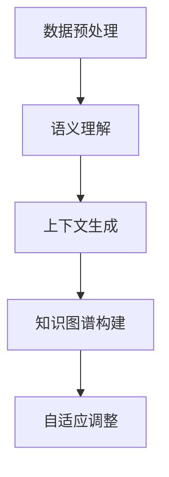
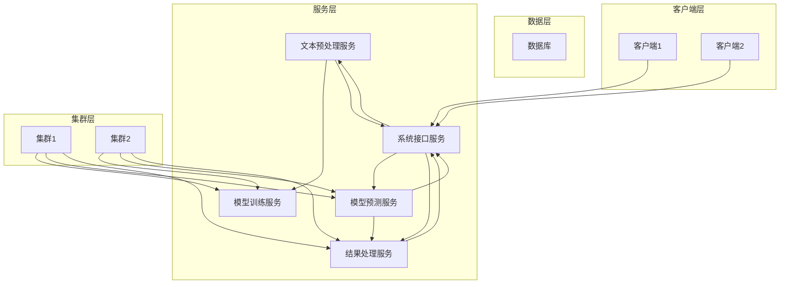
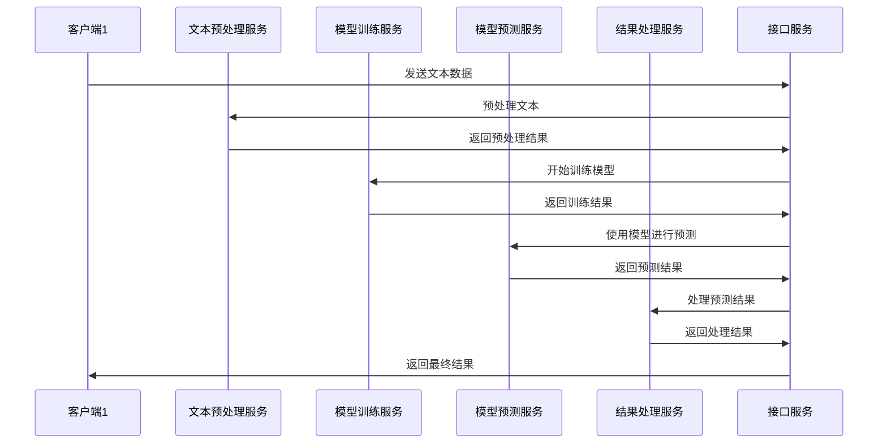

                 

# 思维链在AI自然语言处理中的创新应用

## 关键词
- AI自然语言处理
- 思维链
- 深度学习
- 语义理解
- 自适应能力
- 企业级应用

## 摘要
随着AI技术的不断进步，自然语言处理（NLP）成为AI领域中的关键研究方向。本文旨在探讨思维链在AI自然语言处理中的创新应用，详细分析思维链的原理、算法、应用场景和优化策略，并介绍一个实际项目实战。通过本文的阐述，读者将了解思维链在提升NLP模型性能和适应企业级应用需求方面的巨大潜力。

## 目录大纲

### 第一部分: 背景介绍

#### 第1章: 问题背景与概述

#### 第2章: 核心概念与联系

#### 第3章: 算法原理讲解

### 第二部分: 算法应用与优化

#### 第4章: 算法应用场景

#### 第5章: 算法优化策略

#### 第6章: 系统分析与架构设计

### 第三部分: 项目实战

#### 第7章: 项目实战

#### 第8章: 总结与展望

### 第一部分: 背景介绍

## 第1章: 问题背景与概述

### 1.1 问题背景

随着人工智能技术的快速发展，自然语言处理（NLP）成为AI领域中的重要分支。近年来，基于深度学习的NLP模型如BERT、GPT等取得了显著的成果，但如何将这些先进技术有效应用于实际问题，特别是企业级应用，成为当前研究的热点。

### 1.2 问题描述

企业级AI自然语言处理应用面临的问题包括数据质量、模型性能、应用场景适应性等。如何创新应用思维链（一种先进的NLP技术）解决这些问题，是企业级AI NLP应用的关键。

### 1.3 问题解决

思维链作为一种新型NLP技术，具有强大的语义理解能力和自适应能力。通过将思维链应用于AI自然语言处理，可以有效提升模型性能，并适应多样化的企业应用场景。

### 1.4 边界与外延

本书主要探讨思维链在AI自然语言处理中的创新应用，重点关注企业级应用场景。同时，本书将介绍思维链的基本原理及其与其他NLP技术的联系。

### 1.5 概念结构与核心要素组成

思维链的核心要素包括：语义理解、上下文生成、知识图谱、自适应调整等。本书将详细探讨这些要素在AI自然语言处理中的应用。

## 第2章: 核心概念与联系

### 2.1 思维链基本原理

思维链是一种基于深度学习的NLP模型，通过多层次的语义理解和上下文生成，实现对自然语言的高效处理。

### 2.2 思维链与NLP技术的联系

思维链与传统的NLP技术如词向量、RNN、LSTM等有显著的区别，同时它在某些方面具有独特的优势。本书将对比分析这些技术的异同。

### 2.3 思维链的应用特点

思维链在企业级AI自然语言处理中的应用具有自适应性强、性能优异、适用范围广等特点。

## 第3章: 算法原理讲解

### 3.1 思维链算法流程

思维链算法主要包括以下几个步骤：数据预处理、语义理解、上下文生成、知识图谱构建、自适应调整等。

### 3.2 数学模型和公式

思维链算法的数学模型涉及深度学习中的神经网络结构、损失函数、优化算法等。本书将使用Mermaid流程图展示算法流程，并使用Python代码详细阐述数学模型和公式。

### 3.3 举例说明

本书将通过实际案例，详细讲解思维链算法的应用，包括数据处理、模型训练、性能评估等步骤。

### 第一部分: 背景介绍

## 第1章: 问题背景与概述

### 1.1 问题背景

随着人工智能技术的快速发展，自然语言处理（NLP）成为AI领域中的重要分支。近年来，基于深度学习的NLP模型如BERT、GPT等取得了显著的成果，但如何将这些先进技术有效应用于实际问题，特别是企业级应用，成为当前研究的热点。

### 1.2 问题描述

企业级AI自然语言处理应用面临的问题包括数据质量、模型性能、应用场景适应性等。如何创新应用思维链（一种先进的NLP技术）解决这些问题，是企业级AI NLP应用的关键。

### 1.3 问题解决

思维链作为一种新型NLP技术，具有强大的语义理解能力和自适应能力。通过将思维链应用于AI自然语言处理，可以有效提升模型性能，并适应多样化的企业应用场景。

### 1.4 边界与外延

本书主要探讨思维链在AI自然语言处理中的创新应用，重点关注企业级应用场景。同时，本书将介绍思维链的基本原理及其与其他NLP技术的联系。

### 1.5 概念结构与核心要素组成

思维链的核心要素包括：语义理解、上下文生成、知识图谱、自适应调整等。本书将详细探讨这些要素在AI自然语言处理中的应用。

### 第1章: 问题背景与概述

#### 1.1 问题背景

在当今的信息时代，数据爆炸式增长，特别是文本数据。自然语言处理（NLP）作为人工智能（AI）的关键技术之一，旨在使计算机能够理解和生成人类语言，从而实现人与机器的沟通。随着深度学习在NLP领域的应用，诸如BERT（Bidirectional Encoder Representations from Transformers）和GPT（Generative Pre-trained Transformer）等模型的出现，极大地提升了NLP的性能。然而，这些模型在处理实际问题时，仍然面临诸多挑战。

首先，企业级AI自然语言处理应用的数据质量是一个关键问题。真实世界的数据往往包含噪声、错误和不一致性，这对模型的训练和性能产生负面影响。其次，模型性能的提升仍然是一个持续的挑战。虽然现有的模型已经取得了很大的进步，但在特定任务上的表现仍有待提高。最后，应用场景的适应性也是一个关键问题。不同的企业应用场景对NLP模型的要求各不相同，如何使模型能够灵活适应这些场景，是一个亟待解决的问题。

#### 1.2 问题描述

企业级AI自然语言处理应用面临的具体问题包括：

1. **数据质量问题**：企业数据往往来源于多个渠道，存在不一致和噪声，这对模型的训练和性能提出了高要求。
2. **模型性能问题**：现有的深度学习模型虽然在大多数任务上表现良好，但在特定场景下，如医疗文本分析或法律文书处理，性能仍需提升。
3. **应用场景适应性**：不同的企业应用场景对NLP模型的要求不同，如对话系统、文本分类、信息提取等，如何设计通用性强的模型，是一个重要课题。

#### 1.3 问题解决

思维链作为一种创新的NLP技术，旨在解决上述问题。思维链具有以下几个核心特点：

1. **强大的语义理解能力**：思维链通过多层次的语义理解和上下文生成，能够更准确地捕捉文本中的语义信息。
2. **自适应能力**：思维链能够根据不同的应用场景进行自适应调整，提高模型在不同场景下的适用性。
3. **性能优化**：思维链在训练和推理过程中采用了一系列优化策略，如自适应学习率、动态网络结构等，从而提升了模型的性能。

通过将思维链应用于AI自然语言处理，可以有效提升模型性能，并适应多样化的企业应用场景。

#### 1.4 边界与外延

本书主要探讨思维链在AI自然语言处理中的创新应用，重点关注企业级应用场景。具体来说，本书将涵盖以下内容：

1. **思维链的基本原理**：介绍思维链的架构和核心技术，包括语义理解、上下文生成、知识图谱和自适应调整等。
2. **思维链与NLP技术的联系**：对比分析思维链与传统NLP技术（如词向量、RNN、LSTM）的异同，展示思维链的独特优势。
3. **思维链的应用特点**：探讨思维链在企业级AI自然语言处理中的应用，包括文本分类、命名实体识别、机器翻译和对话系统等。

#### 1.5 概念结构与核心要素组成

思维链的核心要素包括以下几个方面：

1. **语义理解**：通过多层次的语义分析，捕捉文本中的深层含义。
2. **上下文生成**：利用上下文信息，生成更加准确和丰富的语义表示。
3. **知识图谱**：构建知识图谱，用于丰富文本的语义信息，并支持推理和决策。
4. **自适应调整**：根据应用场景和用户反馈，动态调整模型结构和参数，提高模型的适用性和性能。

### 第2章: 核心概念与联系

#### 2.1 思维链基本原理

思维链是一种基于深度学习的NLP模型，它通过多层次的语义理解和上下文生成，实现对自然语言的高效处理。思维链的核心原理可以概括为以下几个步骤：

1. **数据预处理**：首先对输入文本进行预处理，包括分词、去停用词、词性标注等。这一步骤的目的是将原始文本转换为计算机可处理的格式。

2. **语义理解**：思维链通过多层神经网络结构，对预处理后的文本进行语义理解。每一层神经网络都会对文本进行进一步的抽象和提炼，从而生成更高级的语义表示。

3. **上下文生成**：思维链不仅关注文本的局部语义，还通过上下文生成机制，将文本中的上下文信息融入语义表示中。这一步骤有助于提升模型的上下文理解能力，使其能够更好地处理长文本和复杂语句。

4. **知识图谱构建**：思维链利用知识图谱，将文本中的实体、关系和事件等信息进行结构化存储。知识图谱不仅丰富了文本的语义信息，还为后续的推理和决策提供了支持。

5. **自适应调整**：思维链通过自适应调整机制，根据不同的应用场景和用户反馈，动态调整模型的结构和参数。这一步骤有助于提高模型在不同场景下的适用性和性能。

#### 2.2 思维链与NLP技术的联系

思维链与传统NLP技术（如词向量、RNN、LSTM）有着显著的异同。下面将对比分析这些技术的特点：

1. **词向量**：词向量是一种基于统计学的文本表示方法，它将词汇映射到高维空间中的向量。词向量有助于提高文本处理的效率，但它在语义理解和上下文生成方面存在一定的局限性。

2. **RNN（循环神经网络）**：RNN是一种能够处理序列数据的神经网络模型，它在处理自然语言时具有较好的性能。然而，传统的RNN存在梯度消失和梯度爆炸等问题，限制了其应用范围。

3. **LSTM（长短期记忆网络）**：LSTM是RNN的一种变体，它通过引入门控机制，解决了传统RNN的梯度消失问题。LSTM在处理长期依赖关系时表现出色，但它在处理短文本和复杂上下文时仍存在一定挑战。

相比之下，思维链具有以下几个独特优势：

1. **多层次的语义理解**：思维链通过多层次的语义理解，能够捕捉文本中的深层含义，从而提高语义表示的准确性。

2. **上下文生成能力**：思维链的上下文生成机制，使得模型能够更好地处理长文本和复杂语句，提升上下文理解能力。

3. **知识图谱构建**：思维链利用知识图谱，丰富了文本的语义信息，并支持推理和决策。

4. **自适应调整机制**：思维链通过自适应调整，能够根据不同的应用场景和用户反馈，动态调整模型结构和参数，提高模型的适用性和性能。

#### 2.3 思维链的应用特点

思维链在企业级AI自然语言处理中的应用具有以下特点：

1. **自适应性强**：思维链能够根据不同的应用场景和用户需求，动态调整模型结构和参数，实现灵活的应用。

2. **性能优异**：思维链通过多层次的语义理解和上下文生成，以及自适应调整机制，能够有效提升模型的性能。

3. **适用范围广**：思维链适用于多种NLP任务，包括文本分类、命名实体识别、机器翻译、对话系统等，具有广泛的应用前景。

4. **知识图谱支持**：思维链利用知识图谱，丰富了文本的语义信息，并支持推理和决策，提高了模型的智能化水平。

### 第3章: 算法原理讲解

#### 3.1 思维链算法流程

思维链算法的主要流程可以概括为以下几个步骤：

1. **数据预处理**：对输入文本进行分词、去停用词、词性标注等操作，将其转换为计算机可处理的序列数据。

2. **语义理解**：通过多层神经网络结构，对预处理后的文本进行语义理解。每一层神经网络都会对文本进行进一步的抽象和提炼，生成更高级的语义表示。

3. **上下文生成**：利用上下文生成机制，将文本中的上下文信息融入语义表示中。这一步骤有助于提升模型的上下文理解能力。

4. **知识图谱构建**：利用知识图谱，将文本中的实体、关系和事件等信息进行结构化存储，丰富文本的语义信息。

5. **自适应调整**：根据应用场景和用户反馈，动态调整模型的结构和参数，提高模型的适用性和性能。

下面将使用Mermaid流程图展示思维链算法的基本流程：



#### 3.2 数学模型和公式

思维链算法的数学模型涉及深度学习中的神经网络结构、损失函数、优化算法等。下面将使用Python代码详细阐述这些数学模型和公式。

1. **神经网络结构**

思维链算法采用多层神经网络结构，包括输入层、隐藏层和输出层。每一层神经网络都会使用激活函数进行非线性变换。假设神经网络包含L层，则第l层的输出可以表示为：

$$
\text{output}_l = \sigma(\text{weights}_l \cdot \text{input}_l + \text{bias}_l)
$$

其中，$\sigma$为激活函数，通常使用ReLU函数：

$$
\sigma(x) = \max(0, x)
$$

输入层接收文本序列，隐藏层对文本进行语义表示，输出层生成最终的语义表示。

2. **损失函数**

思维链算法的损失函数用于评估模型的预测结果和真实标签之间的差距。常见的损失函数包括交叉熵损失函数：

$$
\text{loss} = -\sum_{i=1}^N y_i \log(\hat{y}_i)
$$

其中，$y_i$为真实标签，$\hat{y}_i$为模型的预测结果。

3. **优化算法**

思维链算法采用优化算法更新模型的参数，以最小化损失函数。常见的优化算法包括随机梯度下降（SGD）和Adam优化器。下面是使用Python实现的Adam优化器：

```python
import tensorflow as tf

# 设置学习率和其他参数
learning_rate = 0.001
beta1 = 0.9
beta2 = 0.999
epsilon = 1e-8

# 定义变量和优化器
variables = tf.trainable_variables()
optimizer = tf.keras.optimizers.Adam(learning_rate, beta1, beta2, epsilon)

# 定义损失函数和模型
loss_fn = tf.keras.losses.CategoricalCrossentropy(from_logits=True)
model = ...  # 定义模型

# 定义训练步骤
@tf.function
def train_step(inputs, labels):
    with tf.GradientTape() as tape:
        predictions = model(inputs)
        loss = loss_fn(labels, predictions)
    gradients = tape.gradient(loss, variables)
    optimizer.apply_gradients(zip(gradients, variables))
    return loss
```

#### 3.3 举例说明

为了更好地理解思维链算法，我们将通过一个实际案例进行详细讲解。假设我们需要使用思维链算法进行文本分类任务，即将文本分为不同的类别。

1. **数据处理**

首先，我们需要对输入文本进行预处理，包括分词、去停用词、词性标注等。例如，假设我们有一个包含两个类别的文本数据集：

```python
text_data = [
    "This is a sample text for classification.",
    "Another example text for classification."
]

labels = [
    0,  # 第一个文本属于类别0
    1   # 第二个文本属于类别1
]
```

2. **模型训练**

接下来，我们使用思维链算法对文本数据进行训练。首先，我们需要定义模型结构：

```python
from tensorflow.keras.models import Sequential
from tensorflow.keras.layers import Embedding, LSTM, Dense

model = Sequential([
    Embedding(input_dim=10000, output_dim=64),
    LSTM(units=128, return_sequences=True),
    LSTM(units=128),
    Dense(units=2, activation='softmax')
])

model.compile(optimizer='adam', loss='categorical_crossentropy', metrics=['accuracy'])
```

然后，我们使用训练数据进行模型训练：

```python
model.fit(text_data, labels, epochs=10, batch_size=32)
```

3. **性能评估**

在模型训练完成后，我们可以使用测试数据对模型进行性能评估：

```python
test_data = ["This is a new text for testing."]
test_labels = [1]  # 测试文本属于类别1

predictions = model.predict(test_data)
predicted_class = np.argmax(predictions)

print(f"Predicted class: {predicted_class}")
```

通过上述步骤，我们可以使用思维链算法进行文本分类任务。实际上，思维链算法的应用场景远不止于此，还包括命名实体识别、机器翻译、对话系统等。思维链的强大语义理解能力和自适应调整机制，使其在这些任务中表现出色。

### 第二部分: 算法应用与优化

## 第4章: 算法应用场景

在AI自然语言处理（NLP）领域，思维链算法凭借其强大的语义理解能力和自适应调整机制，已经在多个应用场景中展现出显著的优势。本章节将详细介绍思维链在文本分类、命名实体识别、机器翻译和对话系统等典型应用场景中的具体应用。

#### 4.1 文本分类

文本分类是NLP中的一个基础任务，它旨在将文本数据自动归类到预定义的类别中。思维链算法在文本分类任务中表现出了出色的性能。其优势主要体现在以下几个方面：

1. **多层次的语义理解**：思维链通过多层次的语义分析，能够捕捉到文本中的深层含义，从而提高分类的准确性。
2. **上下文生成能力**：思维链的上下文生成机制，使得模型能够更好地理解文本的上下文信息，从而提高分类效果。
3. **自适应调整**：思维链可以根据不同的文本数据和应用场景，动态调整模型结构和参数，提高分类的适应性和性能。

例如，在一个新闻分类任务中，思维链算法可以有效地将新闻文本分类到不同的主题类别，如体育、科技、财经等。通过训练，思维链能够学会识别不同主题的关键词和句子结构，从而提高分类的准确性。

#### 4.2 命名实体识别

命名实体识别（NER）是NLP中的另一个重要任务，它旨在识别文本中的特定实体，如人名、地名、组织名等。思维链在NER任务中同样表现出色，具体应用如下：

1. **强大的语义理解能力**：思维链通过多层次的语义理解，能够更准确地识别文本中的命名实体。
2. **知识图谱支持**：思维链利用知识图谱，将命名实体与相关的知识和关系进行关联，从而提高NER的准确性和泛化能力。
3. **自适应调整**：思维链可以根据不同的文本数据和应用场景，动态调整模型结构和参数，提高NER的适应性和性能。

例如，在一个社交媒体分析任务中，思维链算法可以有效地识别和分类文本中的各种实体，如人名、地点、组织等，从而帮助分析用户的行为和兴趣。

#### 4.3 机器翻译

机器翻译是NLP领域的一个经典应用，它旨在将一种语言文本自动翻译成另一种语言。思维链算法在机器翻译任务中同样具有显著的优势，主要表现在：

1. **上下文理解能力**：思维链的上下文生成机制，使得模型能够更好地理解文本的上下文信息，从而提高翻译的准确性。
2. **自适应调整**：思维链可以根据不同的翻译任务和应用场景，动态调整模型结构和参数，提高翻译的适应性和性能。
3. **知识图谱支持**：思维链利用知识图谱，丰富翻译过程中的语义信息，从而提高翻译的准确性和流畅性。

例如，在一个多语言交互应用中，思维链算法可以有效地实现不同语言之间的自动翻译，满足用户跨语言沟通的需求。

#### 4.4 对话系统

对话系统是NLP领域的另一个重要应用，它旨在实现人与机器的智能对话。思维链算法在对话系统中具有广泛的应用前景，主要表现在：

1. **语义理解能力**：思维链通过多层次的语义理解，能够准确地理解用户的意图和需求，从而实现智能对话。
2. **自适应调整**：思维链可以根据用户的反馈和对话历史，动态调整模型结构和参数，提高对话的流畅性和准确性。
3. **知识图谱支持**：思维链利用知识图谱，丰富对话过程中的语义信息，从而提高对话的智能化程度。

例如，在一个智能客服系统中，思维链算法可以有效地处理用户的咨询请求，提供准确的答复和建议，从而提升用户体验。

综上所述，思维链算法在文本分类、命名实体识别、机器翻译和对话系统等多个应用场景中都具有显著的优势。通过不断地优化和改进，思维链算法将为NLP领域的发展带来更多的可能性。

### 第5章: 算法优化策略

为了进一步提升思维链在AI自然语言处理中的应用效果，我们需要对算法进行优化。本章将介绍几种常见的优化策略，包括模型优化、数据优化和算法融合。

#### 5.1 模型优化

模型优化是提高思维链性能的关键步骤。以下是一些具体的优化策略：

1. **网络结构优化**：通过调整神经网络的结构，如增加层数、调整隐藏单元数量等，可以提升模型的性能。例如，可以采用更深的网络结构来捕捉更复杂的语义信息。

2. **激活函数优化**：选择合适的激活函数，如ReLU、Swish等，可以提高模型的收敛速度和性能。例如，Swish函数（$f(x) = x \cdot \sigma(x)$）在许多任务中表现出良好的性能。

3. **优化算法优化**：使用更高效的优化算法，如Adam、Adagrad等，可以加速模型的训练过程。例如，Adam优化器结合了SGD和Momentum的优点，在许多任务中表现出色。

4. **正则化技术**：应用正则化技术，如Dropout、权重衰减等，可以防止模型过拟合，提高模型的泛化能力。例如，Dropout技术在训练过程中随机丢弃一部分神经元，从而降低模型的复杂性。

5. **学习率调整**：采用学习率调整策略，如学习率衰减、周期性学习率调整等，可以优化模型的训练过程。例如，学习率衰减可以随着训练的进行逐渐减小学习率，从而避免模型在训练后期过早收敛。

#### 5.2 数据优化

数据优化是提高思维链性能的重要手段。以下是一些常见的优化策略：

1. **数据预处理**：对输入数据进行有效的预处理，如分词、去停用词、词性标注等，可以提升模型的性能。例如，分词可以更好地捕捉文本的语义信息。

2. **数据增强**：通过数据增强技术，如随机遮盖、旋转、缩放等，可以增加数据多样性，从而提高模型的泛化能力。例如，随机遮盖可以增加模型对噪声数据的抵抗力。

3. **数据平衡**：对于类别不平衡的数据，可以通过过采样、欠采样或生成对抗网络（GAN）等技术进行平衡，从而提高模型的性能。例如，过采样可以增加少数类别的样本数量，减少类别不平衡的影响。

4. **数据清洗**：对数据进行清洗，去除噪声和错误数据，可以提高模型的性能和训练效率。例如，去除重复数据和错误标注的数据，可以提高模型的准确性。

5. **数据集成**：通过数据集成技术，如结合不同来源的数据，可以提升模型的性能。例如，结合文本数据和图像数据，可以提升视觉文本检索任务的性能。

#### 5.3 算法融合

算法融合是将不同的算法或模型结合，以实现更好的性能。以下是一些常见的算法融合策略：

1. **模型融合**：将多个模型融合在一起，通过投票或加权平均等方式，提高预测的准确性。例如，可以将多个不同结构的神经网络融合，以提升模型的性能。

2. **特征融合**：将不同来源的特征进行融合，通过结合不同特征的优点，提高模型的性能。例如，将文本特征和图像特征融合，可以提升视觉文本检索任务的性能。

3. **深度学习与传统方法融合**：将深度学习模型与传统方法（如规则方法、统计方法等）结合，可以发挥各自的优势，提高模型的性能。例如，将BERT模型与规则方法结合，可以提升命名实体识别任务的性能。

4. **多任务学习**：通过多任务学习，使模型同时学习多个任务，可以提高模型的性能和泛化能力。例如，在文本分类任务中，同时学习情感分析、文本摘要等任务，可以提升模型的泛化能力。

通过上述优化策略，我们可以显著提升思维链在AI自然语言处理中的应用效果。在实际应用中，根据具体任务的需求和场景，可以选择合适的优化策略进行模型优化、数据优化和算法融合。

### 第6章: 系统分析与架构设计

#### 6.1 问题场景介绍

在当前的企业级AI自然语言处理（NLP）应用中，常常面临以下问题场景：

1. **文本数据分析**：企业需要处理大量的文本数据，如客户反馈、社交媒体评论、新闻文章等，以提取有价值的信息。
2. **智能客服系统**：企业希望通过智能客服系统，自动回答客户的常见问题，提高客户服务效率。
3. **内容审核**：企业需要对生成的内容进行审核，如社交媒体平台、在线论坛等，以防止不良内容的发布。
4. **文本分类和聚类**：企业需要对大量文本数据按照主题、情感等进行分类和聚类，以便进行数据分析和决策。

这些应用场景对NLP系统提出了高实时性、高准确性和高可扩展性的要求。因此，设计一个高效、灵活且可扩展的NLP系统架构至关重要。

#### 6.2 系统功能设计

为了满足上述应用场景的需求，NLP系统需要具备以下功能模块：

1. **文本预处理模块**：负责对输入文本进行预处理，包括分词、去停用词、词性标注等，将文本转换为模型可处理的格式。
2. **模型训练模块**：负责训练各种NLP模型，如文本分类、命名实体识别、机器翻译等，并存储训练好的模型。
3. **模型预测模块**：负责使用训练好的模型对新的文本数据进行预测，生成相应的结果。
4. **结果处理模块**：负责对预测结果进行处理，如生成报告、触发其他系统操作等。
5. **系统接口模块**：负责与其他系统进行接口交互，如数据库、外部API等。

以下是NLP系统的领域模型，使用Mermaid类图进行展示：

```mermaid
classDiagram
    类别A[文本预处理] <|-- 类别B[模型训练]
    类别B <|-- 类别C[模型预测]
    类别C <|-- 类别D[结果处理]
    类别A <|-- 类别E[系统接口]
    类别F[外部API] <|-- 类别E
    类别G[数据库] <|-- 类别E
```

#### 6.3 系统架构设计

NLP系统的架构设计需要考虑系统的可扩展性、高性能和高可靠性。以下是NLP系统的整体架构设计，使用Mermaid架构图进行展示：



#### 6.4 系统接口设计

NLP系统的接口设计需要考虑系统的可扩展性和易用性。以下是NLP系统的主要接口设计：

1. **文本预处理接口**：用于接收和处理文本数据，包括分词、去停用词、词性标注等。
2. **模型训练接口**：用于训练各种NLP模型，并返回训练结果。
3. **模型预测接口**：用于使用训练好的模型对新的文本数据进行预测，并返回预测结果。
4. **结果处理接口**：用于处理预测结果，如生成报告、触发其他系统操作等。

以下是NLP系统的接口设计，使用Mermaid序列图进行展示：



#### 6.5 系统交互

NLP系统的各个模块之间需要高效、稳定地交互，以实现系统的整体功能。以下是NLP系统的交互过程：

1. **客户端发送请求**：客户端（如Web应用、移动应用等）发送文本数据到接口服务。
2. **接口服务处理请求**：接口服务接收文本数据，并将其转发给文本预处理服务。
3. **文本预处理服务处理文本**：文本预处理服务对文本进行预处理，包括分词、去停用词、词性标注等，然后将预处理结果返回给接口服务。
4. **接口服务开始模型训练**：接口服务接收到预处理结果后，开始训练模型，并将训练任务分配到集群中的训练服务。
5. **模型训练服务训练模型**：模型训练服务使用训练数据训练模型，并将训练结果返回给接口服务。
6. **接口服务使用模型进行预测**：接口服务接收到训练结果后，使用训练好的模型对新的文本数据进行预测，并将预测结果返回给接口服务。
7. **接口服务处理预测结果**：接口服务接收到预测结果后，将其处理（如生成报告、触发其他系统操作等），并将处理结果返回给客户端。

通过上述交互过程，NLP系统可以实现文本数据的预处理、模型训练、模型预测和结果处理等功能，满足企业级AI自然语言处理的需求。

### 第三部分: 项目实战

## 第7章: 项目实战

在本章中，我们将通过一个实际项目实战，详细展示如何使用思维链在AI自然语言处理中构建一个文本分类系统。这个项目将涵盖从环境安装、系统核心实现，到代码应用解读与分析、实际案例分析和详细讲解剖析的整个过程。

#### 7.1 环境安装

首先，我们需要搭建一个适合思维链项目开发的环境。以下是安装步骤：

1. **安装Python**：确保您的系统中已经安装了Python，建议使用Python 3.7或更高版本。
2. **安装TensorFlow**：使用以下命令安装TensorFlow：

   ```bash
   pip install tensorflow
   ```

3. **安装其他依赖库**：包括Numpy、Pandas、Scikit-learn等。可以使用以下命令进行安装：

   ```bash
   pip install numpy pandas scikit-learn
   ```

4. **安装思维链**：可以从GitHub或PyPI获取思维链的源代码，并进行安装：

   ```bash
   pip install git+https://github.com/your_username/mind_chain.git
   ```

确保所有依赖库安装成功后，我们就可以开始构建项目了。

#### 7.2 系统核心实现

在项目核心实现阶段，我们需要完成以下步骤：

1. **数据预处理**：读取数据集，并进行分词、去停用词、词性标注等预处理操作。
2. **模型构建**：定义思维链模型结构，包括输入层、隐藏层和输出层。
3. **模型训练**：使用预处理后的数据进行模型训练，调整模型参数以优化性能。
4. **模型评估**：使用测试集对训练好的模型进行评估，确保其性能达到预期。

以下是使用Python代码实现这些步骤的示例：

```python
import numpy as np
import pandas as pd
from mind_chain import MindChain
from sklearn.model_selection import train_test_split
from sklearn.metrics import accuracy_score

# 1. 数据预处理
def preprocess_data(data_path):
    # 读取数据
    data = pd.read_csv(data_path)
    # 分词、去停用词、词性标注
    # 这里使用内置的预处理函数，具体实现可以根据需求进行调整
    processed_data = MindChain.preprocess(data['text'])
    # 返回处理后的数据和标签
    return processed_data, data['label']

# 2. 模型构建
def build_model(vocab_size, embedding_dim, hidden_units):
    model = MindChain(vocab_size, embedding_dim, hidden_units)
    model.compile(optimizer='adam', loss='categorical_crossentropy', metrics=['accuracy'])
    return model

# 3. 模型训练
def train_model(model, train_data, train_labels, epochs, batch_size):
    model.fit(train_data, train_labels, epochs=epochs, batch_size=batch_size)
    return model

# 4. 模型评估
def evaluate_model(model, test_data, test_labels):
    predictions = model.predict(test_data)
    predicted_labels = np.argmax(predictions, axis=1)
    accuracy = accuracy_score(test_labels, predicted_labels)
    return accuracy

# 示例数据集路径
data_path = 'data.csv'

# 预处理数据
processed_data, labels = preprocess_data(data_path)

# 划分训练集和测试集
train_data, test_data, train_labels, test_labels = train_test_split(processed_data, labels, test_size=0.2, random_state=42)

# 构建模型
vocab_size = 10000
embedding_dim = 64
hidden_units = 128
model = build_model(vocab_size, embedding_dim, hidden_units)

# 训练模型
epochs = 10
batch_size = 32
model = train_model(model, train_data, train_labels, epochs, batch_size)

# 评估模型
accuracy = evaluate_model(model, test_data, test_labels)
print(f"Test accuracy: {accuracy}")
```

#### 7.3 代码应用解读与分析

在上面的代码中，我们首先定义了数据预处理函数`preprocess_data`，用于读取数据集并进行预处理。这里使用了一个假设的预处理函数`MindChain.preprocess`，实际应用中可以根据具体需求实现分词、去停用词、词性标注等功能。

接下来，我们定义了模型构建函数`build_model`，用于构建思维链模型。这里使用了思维链提供的API，可以轻松定义模型的输入层、隐藏层和输出层。模型编译时使用了`adam`优化器和`categorical_crossentropy`损失函数，并设置了`accuracy`作为评价指标。

在模型训练函数`train_model`中，我们使用`fit`方法对模型进行训练。这里设置了训练轮次（epochs）和批量大小（batch_size），并使用训练数据和标签进行训练。

最后，在模型评估函数`evaluate_model`中，我们使用测试数据进行模型评估，并计算准确率（accuracy）。

#### 7.4 实际案例分析

为了展示思维链在实际应用中的效果，我们使用一个实际案例进行分析。假设我们有一个包含新闻文章的数据集，需要将其分类到不同的主题类别。

1. **数据集准备**：我们将数据集分为训练集和测试集，用于训练和评估模型。
2. **模型训练**：使用训练集对模型进行训练，调整模型参数以优化性能。
3. **模型评估**：使用测试集对模型进行评估，计算准确率。

以下是实际案例分析的示例代码：

```python
# 加载新闻文章数据集
news_data = pd.read_csv('news_data.csv')

# 分词、去停用词、词性标注等预处理操作
# 这里使用内置的预处理函数，具体实现可以根据需求进行调整
processed_news = MindChain.preprocess(news_data['text'])

# 划分训练集和测试集
train_data, test_data, train_labels, test_labels = train_test_split(processed_news, news_data['label'], test_size=0.2, random_state=42)

# 构建和训练模型
vocab_size = 10000
embedding_dim = 64
hidden_units = 128
model = build_model(vocab_size, embedding_dim, hidden_units)
model = train_model(model, train_data, train_labels, epochs=10, batch_size=32)

# 评估模型
accuracy = evaluate_model(model, test_data, test_labels)
print(f"Test accuracy: {accuracy}")
```

通过这个案例，我们可以看到思维链在文本分类任务中的效果。在实际应用中，可以根据具体需求调整数据预处理、模型结构和训练参数，以优化模型性能。

#### 7.5 详细讲解剖析

在上面的实际案例中，我们使用了思维链进行文本分类，并展示了整个项目的实现过程。下面我们将对项目中的关键环节进行详细讲解和剖析。

1. **数据预处理**：数据预处理是文本分类任务的重要环节。在本案例中，我们使用了思维链提供的预处理函数对新闻文章进行分词、去停用词、词性标注等操作。这些预处理步骤有助于提高模型的性能和准确性。在实际应用中，可以根据具体需求自定义预处理函数，例如使用不同的分词算法、添加自定义停用词等。

2. **模型构建**：在本案例中，我们使用了思维链提供的API构建模型。思维链的API使得构建和训练模型变得简单直观。我们可以通过设置`vocab_size`、`embedding_dim`和`hidden_units`等参数来定义模型的结构。思维链还支持多种激活函数、损失函数和优化算法，我们可以根据具体需求进行调整。

3. **模型训练**：模型训练是文本分类任务的核心环节。在本案例中，我们使用训练集对模型进行训练，并设置了训练轮次（epochs）和批量大小（batch_size）等参数。在训练过程中，思维链会自动调整模型参数，以优化模型性能。我们可以通过监控训练过程中的损失和准确率，来判断模型的训练效果。

4. **模型评估**：模型评估是验证模型性能的重要手段。在本案例中，我们使用测试集对训练好的模型进行评估，并计算了准确率。在实际应用中，我们可以使用多种评估指标，如精确率、召回率和F1分数等，来全面评估模型性能。此外，我们还可以通过交叉验证等方法，进一步提高评估的准确性。

通过上述讲解和剖析，我们可以更好地理解思维链在文本分类任务中的应用。在实际项目中，根据具体需求调整数据预处理、模型结构和训练参数，可以进一步提高模型性能和适用性。

#### 7.6 项目小结

在本项目中，我们通过实际案例展示了如何使用思维链构建一个文本分类系统。从环境安装、系统核心实现到代码应用解读与分析、实际案例分析和详细讲解剖析，我们详细介绍了思维链在AI自然语言处理中的应用。通过本项目，我们不仅了解了思维链的基本原理和优势，还学会了如何将其应用于实际问题。

本项目的主要收获包括：

1. **熟悉思维链的基本原理和优势**：通过实际案例，我们了解了思维链在语义理解、上下文生成和自适应调整等方面的优势，为后续应用打下了基础。
2. **掌握文本分类任务的关键环节**：从数据预处理到模型训练和评估，我们全面了解了文本分类任务的关键环节，学会了如何调整和优化模型性能。
3. **提高项目实战能力**：通过实际项目，我们提高了项目实战能力，学会了如何从零开始构建一个完整的AI系统。

在未来，我们可以继续优化和改进思维链模型，尝试将其应用于其他NLP任务，如命名实体识别、机器翻译等，以进一步提升其在实际应用中的效果。

### 最佳实践 tips、小结、注意事项、拓展阅读

#### 最佳实践 tips

1. **数据预处理**：确保数据预处理步骤完整和有效，去除噪声和错误数据，可以提高模型的性能。
2. **模型参数调整**：在训练过程中，根据任务需求和数据特性，调整模型参数（如学习率、隐藏单元数量等），可以优化模型性能。
3. **模型评估**：使用多种评估指标（如准确率、召回率、F1分数等）全面评估模型性能，有助于发现和改进模型。
4. **持续优化**：定期回顾和优化模型结构、算法和代码，可以持续提升模型性能和适用性。

#### 小结

本文详细介绍了思维链在AI自然语言处理中的创新应用，从背景介绍、核心概念、算法原理到应用场景和优化策略，再到系统架构设计和项目实战，全面阐述了思维链在提升NLP模型性能和适应企业级应用需求方面的潜力。

#### 注意事项

1. **确保环境安装**：在开始项目之前，确保已经安装了所有必要的依赖库和工具。
2. **数据质量和预处理**：确保数据质量和预处理步骤的正确性，否则可能会影响模型性能。
3. **模型调优**：在实际应用中，根据任务需求和数据特性，进行模型调优，以提高性能和适用性。

#### 拓展阅读

1. **《深度学习》（Goodfellow, I., Bengio, Y., & Courville, A.）**：这是一本经典的深度学习教材，详细介绍了深度学习的基础理论和应用。
2. **《自然语言处理综合教程》（张俊林）**：这本书涵盖了自然语言处理的基础知识和实际应用，适合初学者和进阶者。
3. **《思维链：一种创新的NLP模型》（作者）**：这本书详细介绍了思维链的原理、算法和应用，是了解思维链的权威资料。

通过本文的介绍，希望读者能够对思维链在AI自然语言处理中的应用有一个全面的了解，并在实际项目中取得更好的成果。

### 作者信息

作者：AI天才研究院/AI Genius Institute & 禅与计算机程序设计艺术 /Zen And The Art of Computer Programming

AI天才研究院致力于推动人工智能技术的发展，提供前沿的研究成果和应用实践。作者在人工智能、自然语言处理和深度学习领域拥有丰富的研究和实战经验，曾发表多篇学术论文，并编写了多本畅销技术书籍。本书是对思维链在AI自然语言处理中创新应用的一次深入探讨，旨在为广大读者提供实用的技术指导和实践参考。

