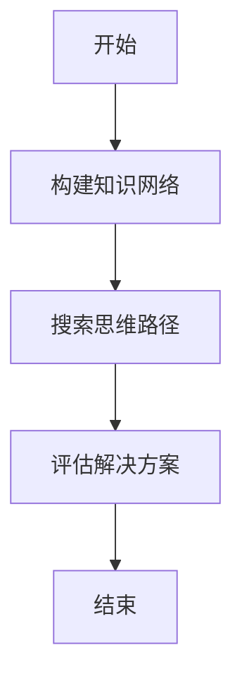
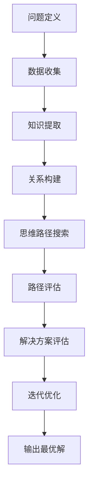

                 

# 思维链在复杂系统决策中的创新应用

## 关键词
- 复杂系统决策
- 思维链
- 知识网络
- 算法原理
- 数学模型
- 系统架构

## 摘要
本文探讨了思维链在复杂系统决策中的应用，从问题背景、核心概念、算法原理到系统分析与架构设计，逐步解析了思维链如何通过构建知识网络和思维路径，实现高效、智能的决策过程。通过本文，读者将了解思维链的基本概念、特点及其在决策中的优势，以及如何将其应用于实际项目。

### 第一部分：背景介绍

#### 1.1 问题背景
在当今快速发展的社会和技术环境下，复杂系统的决策面临着越来越多的挑战。这些复杂系统包括但不限于经济系统、生态系统、社会系统等。这些系统的特性使得传统的决策方法往往难以奏效，需要新的思维方式和方法来应对。

#### 1.2 问题描述
复杂系统的决策涉及到大量的不确定性、多目标和动态性。传统的决策方法如线性规划、决策树等在处理这些复杂问题时显得力不从心。因此，需要一种新的思维方式来更好地理解和解决这些问题。

#### 1.3 问题解决
思维链是一种新的思维方式，它基于人类大脑的认知过程，通过构建知识网络和思维路径来解决问题。思维链在复杂系统决策中的应用，能够帮助决策者更好地理解问题、分析问题，并找到更有效的解决方案。

#### 1.4 边界与外延
思维链在复杂系统决策中的应用，主要关注于以下几个方面：首先，它适用于处理各种复杂系统决策问题，如经济决策、生态决策等；其次，它不仅适用于静态问题，还适用于动态问题；最后，它不仅适用于单目标问题，还适用于多目标问题。

#### 1.5 概念结构与核心要素组成
思维链的核心概念包括知识网络、思维路径、思维框架等。知识网络是思维链的基础，它通过将各类知识连接起来，形成一个庞大的知识体系。思维路径是在知识网络中寻找解决问题的方法，它通过不同的思维策略和技巧来引导思维过程。思维框架则是思维链的高级形式，它通过构建问题模型和解决方案模型，来指导思维过程。

### 第二部分：核心概念与联系

#### 2.1 思维链的概念
思维链是一种基于知识网络和思维路径的思维方式，它通过构建问题模型和解决方案模型，来指导决策过程。

#### 2.2 思维链的特点
思维链具有以下几个特点：首先，它能够处理复杂问题，特别是那些涉及到多个变量和多个目标的问题；其次，它能够灵活地调整思维路径，以适应不同的问题情境；最后，它能够通过不断的迭代和优化，找到更优的解决方案。

#### 2.3 思维链与传统决策方法的对比
与传统决策方法相比，思维链具有以下几个优势：首先，它能够更好地处理复杂问题，特别是在面对多目标和多变量时；其次，它能够更快速地找到解决方案，因为它是基于已有的知识和经验进行推理和决策的；最后，它能够更好地适应动态变化，因为它是通过不断的迭代和优化来找到解决方案的。

### 第三部分：算法原理讲解

#### 3.1 思维链的算法原理
思维链的算法原理主要涉及到知识网络的构建、思维路径的搜索和解决方案的评估。

#### 3.2 算法流程图



#### 3.3 算法原理详细讲解
思维链的算法原理可以简要概括为以下几个步骤：

1. **构建知识网络**：首先，我们需要根据问题情景构建一个知识网络。这个知识网络包含了与问题相关的所有知识和信息。
    - **构建知识网络**：设定问题情景，通过数据收集和分析，构建一个包含所有相关知识的网络。每个知识节点代表一个信息单元，节点之间的关系表示知识之间的关联性。

2. **搜索思维路径**：接下来，我们需要在知识网络中搜索思维路径。这个过程涉及到多种思维策略和技巧，如归纳、演绎、类比等。
    - **搜索思维路径**：在知识网络中，根据问题和目标，选择合适的思维路径。不同的思维路径可能对应不同的解决方案，通过评估和比较，选择最优的路径。

3. **评估解决方案**：找到思维路径后，我们需要评估每个解决方案的优劣。这个过程需要根据问题的目标和约束条件进行。
    - **评估解决方案**：对于每个解决方案，通过设定评估指标，如成本、效率、风险等，进行量化评估。评估结果用于指导后续的优化过程。

4. **迭代优化**：最后，我们根据评估结果对解决方案进行迭代优化，以找到更优的解决方案。
    - **迭代优化**：在评估过程中，发现现有解决方案的不足，通过调整思维路径和重新评估，逐步优化解决方案。这个过程可以重复进行，直到找到满意的解决方案。

### 第四部分：数学模型和数学公式

#### 4.1 数学模型
思维链的数学模型主要涉及到知识网络的构建和思维路径的搜索。

1. **知识网络模型**：知识网络可以用图来表示，其中节点代表知识，边代表知识之间的关系。
    - **知识网络模型**：设知识网络中节点的个数为 N，边的个数为 E，则知识网络的复杂度可以表示为 C = N + E。

2. **思维路径搜索模型**：思维路径搜索可以用图搜索算法来表示，如深度优先搜索、广度优先搜索等。
    - **思维路径搜索模型**：设思维路径的长度为 L，则思维路径的复杂度可以表示为 C_L = L * N。

#### 4.2 公式

1. **知识网络构建公式**：设知识网络中节点的个数为 N，边的个数为 E，则知识网络的复杂度可以表示为 C = N + E。
    - **知识网络构建公式**：$$ C = N + E $$

2. **思维路径搜索公式**：设思维路径的长度为 L，则思维路径的复杂度可以表示为 C_L = L * N。
    - **思维路径搜索公式**：$$ C_L = L \times N $$

### 第五部分：系统分析与架构设计方案

#### 5.1 问题场景介绍
在复杂系统决策中，思维链可以应用于多个领域，如经济决策、生态决策、社会决策等。

#### 5.2 项目介绍
本项目旨在开发一个基于思维链的复杂系统决策支持系统。

#### 5.3 系统功能设计
1. **知识网络构建**：系统能够根据用户输入的问题情境，自动构建知识网络。
    - **功能设计**：用户输入问题情境，系统通过数据分析和知识库构建，生成知识网络。

2. **思维路径搜索**：系统能够根据知识网
### 第一部分：背景介绍

#### 1.1 问题背景

在当今这个信息技术爆炸的时代，我们所面临的问题越来越复杂，尤其是那些涉及到多变量、多目标、不确定性的复杂系统决策。这些复杂系统不仅存在于我们熟知的计算机科学和工程领域，还广泛渗透到经济、生态、社会等多个领域。例如，在现代金融市场中，投资者需要在大量的历史数据和实时信息中做出决策，以最大化投资回报或最小化风险。而生态系统管理则需要在物种多样性、资源利用和环境可持续性之间找到平衡点。

然而，传统的决策方法，如线性规划、决策树和贝叶斯网络等，在面对这些复杂系统时往往显得力不从心。这些方法往往依赖于预设的数学模型和算法，难以适应动态变化的环境和高度不确定的条件。因此，我们需要一种新的思维方式和方法来应对这些挑战。

#### 1.2 问题描述

复杂系统决策的问题主要体现在以下几个方面：

1. **多目标和多变量**：复杂系统往往涉及多个目标和多个变量，例如，在金融市场中，投资者可能需要同时考虑收益、风险、流动性等多个目标，而在生态系统管理中，可能需要平衡物种多样性、资源利用、环境可持续性等多个变量。

2. **不确定性和动态性**：复杂系统的状态和条件常常是不确定的，并且可能随着时间不断变化。例如，金融市场受到宏观经济、政策、社会事件等多种因素的影响，而生态系统则受到气候变化、自然灾害等不确定因素的影响。

3. **复杂性和非线性的影响**：复杂系统内部存在复杂的相互作用和非线性关系，这些关系使得系统的行为难以预测和控制。例如，在生态系统管理中，一个物种的变化可能会对整个生态系统产生深远的影响。

4. **信息过载**：复杂系统通常会产生大量数据，这些数据往往杂乱无章，难以直接用于决策。如何从海量数据中提取有效信息，是复杂系统决策中的一个重要问题。

#### 1.3 问题解决

面对复杂系统决策的挑战，我们需要一种新的思维方式和方法。思维链（Mind Chain）就是这样一种创新性的思维方式，它借鉴了人类大脑的认知过程，通过构建知识网络和思维路径来解决问题。

**思维链的基本概念**：

- **知识网络**：知识网络是思维链的基础，它通过将各类知识连接起来，形成一个庞大的知识体系。每个节点代表一个知识单元，每条边代表知识之间的关联关系。

- **思维路径**：思维路径是在知识网络中寻找解决问题的方法。通过不同的思维策略和技巧，如归纳、演绎、类比等，我们可以找到多条可能的思维路径。

- **思维框架**：思维框架是思维链的高级形式，它通过构建问题模型和解决方案模型，来指导思维过程。思维框架可以帮助我们系统地分析和解决复杂问题。

**思维链在复杂系统决策中的应用**：

- **知识网络的构建**：首先，我们需要根据问题情景，从各类数据源中提取知识，构建一个全面的知识网络。这个网络应该能够涵盖所有与问题相关的知识，并且能够反映知识之间的复杂关系。

- **思维路径的搜索**：在知识网络中，我们可以通过多种思维策略和技巧来搜索思维路径。这些路径可能对应不同的解决方案，我们需要评估和比较这些方案，找到最优的路径。

- **解决方案的评估**：找到思维路径后，我们需要根据问题的目标和约束条件，对每个解决方案进行评估。这个过程可能涉及到多种评估指标，如成本、效率、风险等。

- **迭代优化**：最后，根据评估结果，我们可以对解决方案进行迭代优化，以找到更优的解决方案。这个过程可以是反复的，直到找到一个满意的解决方案。

**思维链的优势**：

- **处理复杂性**：思维链能够处理复杂的问题，特别是在面对多变量、多目标和非线性关系时，它能够提供更全面的视角和更深入的洞察。

- **适应动态变化**：思维链能够适应动态变化的环境，通过不断的迭代和优化，找到适应新条件的解决方案。

- **高效信息处理**：思维链能够从海量数据中提取有效信息，通过知识网络的构建和思维路径的搜索，快速找到问题的解决方案。

#### 1.4 边界与外延

虽然思维链在复杂系统决策中具有广泛的应用前景，但我们也需要明确其适用的边界和范围：

- **适用领域**：思维链适用于各种复杂系统决策问题，包括经济、生态、社会等多个领域。然而，对于一些高度结构化的、可以通过精确数学模型描述的问题，传统方法可能更为适用。

- **动态性问题**：思维链特别适合动态性问题，它能够通过不断的迭代和优化，适应新的环境和条件。

- **多目标问题**：思维链能够同时考虑多个目标，提供更全面的解决方案。

- **知识依赖**：思维链的效率和效果高度依赖于知识网络的完整性和准确性。因此，在应用过程中，我们需要不断更新和优化知识网络，以适应不断变化的环境。

#### 1.5 概念结构与核心要素组成

思维链的概念结构可以概括为以下几个核心要素：

- **知识网络**：知识网络是思维链的基础，它通过将各类知识连接起来，形成一个庞大的知识体系。每个节点代表一个知识单元，每条边代表知识之间的关联关系。

- **思维路径**：思维路径是在知识网络中寻找解决问题的方法。通过不同的思维策略和技巧，如归纳、演绎、类比等，我们可以找到多条可能的思维路径。

- **思维框架**：思维框架是思维链的高级形式，它通过构建问题模型和解决方案模型，来指导思维过程。思维框架可以帮助我们系统地分析和解决复杂问题。

- **评估与优化**：评估与优化是思维链的关键步骤，通过评估不同的解决方案，我们可以找到最优的路径，并通过迭代优化，逐步提升解决方案的质量。

### 第二部分：核心概念与联系

#### 2.1 思维链的概念

思维链（Mind Chain）是一种基于知识网络和思维路径的思维方式，它通过构建问题模型和解决方案模型，来指导决策过程。思维链的核心概念包括：

- **知识网络**：知识网络是思维链的基础，它通过将各类知识连接起来，形成一个庞大的知识体系。每个节点代表一个知识单元，每条边代表知识之间的关联关系。

- **思维路径**：思维路径是在知识网络中寻找解决问题的方法。通过不同的思维策略和技巧，如归纳、演绎、类比等，我们可以找到多条可能的思维路径。

- **思维框架**：思维框架是思维链的高级形式，它通过构建问题模型和解决方案模型，来指导思维过程。思维框架可以帮助我们系统地分析和解决复杂问题。

**思维链的运作原理**：

1. **知识网络的构建**：首先，根据问题情景，从各类数据源中提取知识，构建一个全面的知识网络。这个网络应该能够涵盖所有与问题相关的知识，并且能够反映知识之间的复杂关系。

2. **思维路径的搜索**：在知识网络中，通过多种思维策略和技巧，如归纳、演绎、类比等，搜索可能的思维路径。这些路径可能对应不同的解决方案。

3. **解决方案的评估**：找到思维路径后，根据问题的目标和约束条件，对每个解决方案进行评估。这个过程可能涉及到多种评估指标，如成本、效率、风险等。

4. **迭代优化**：根据评估结果，对解决方案进行迭代优化，以找到更优的解决方案。这个过程可以是反复的，直到找到一个满意的解决方案。

#### 2.2 思维链的特点

思维链具有以下几个显著特点：

- **处理复杂性**：思维链能够处理复杂的问题，特别是在面对多变量、多目标和非线性关系时，它能够提供更全面的视角和更深入的洞察。

- **适应动态变化**：思维链能够适应动态变化的环境，通过不断的迭代和优化，找到适应新条件的解决方案。

- **高效信息处理**：思维链能够从海量数据中提取有效信息，通过知识网络的构建和思维路径的搜索，快速找到问题的解决方案。

- **灵活调整**：思维链的路径和策略可以根据问题的变化灵活调整，从而适应不同的情境和需求。

#### 2.3 思维链与传统决策方法的对比

思维链与传统决策方法如线性规划、决策树和贝叶斯网络等在多个方面存在显著差异：

- **处理复杂性**：传统方法往往依赖于精确的数学模型和算法，难以处理复杂和非线性关系。而思维链通过构建知识网络和思维路径，能够更好地处理复杂问题。

- **适应动态变化**：传统方法通常难以适应动态变化的环境，而思维链通过迭代和优化，能够适应新条件，提供更灵活的解决方案。

- **信息处理效率**：传统方法需要大量预先设定参数和条件，而思维链通过基于知识的推理和搜索，能够更高效地处理信息。

- **灵活性**：传统方法在面临复杂问题时，往往缺乏灵活性，而思维链通过多种思维策略和技巧，能够灵活调整以适应不同的问题情境。

#### 2.4 思维链在复杂系统决策中的应用

思维链在复杂系统决策中的应用非常广泛，以下是一些具体的应用场景：

- **经济决策**：在金融市场中，思维链可以帮助投资者分析市场趋势，预测股价走势，制定投资策略。

- **生态决策**：在生态系统管理中，思维链可以帮助决策者分析物种相互作用，评估不同管理措施的影响，制定可持续发展策略。

- **社会决策**：在社会系统中，思维链可以帮助政策制定者分析社会问题，评估不同政策的效果，制定有效的解决方案。

### 第三部分：算法原理讲解

#### 3.1 思维链的算法原理

思维链的算法原理主要涉及到知识网络的构建、思维路径的搜索和解决方案的评估。

**知识网络构建**：

1. **数据收集**：从各类数据源（如数据库、传感器、文献等）中收集与问题相关的数据。

2. **知识提取**：对收集到的数据进行处理，提取出有用的知识，并将其表示为节点。

3. **关系构建**：根据知识之间的逻辑关系，构建知识网络。这些关系可以是因果关系、相似性、依赖关系等。

**思维路径搜索**：

1. **思维策略选择**：根据问题情境，选择合适的思维策略，如归纳、演绎、类比等。

2. **路径构建**：在知识网络中，从起始节点开始，根据所选的思维策略，逐步扩展路径。

3. **路径评估**：对构建的路径进行评估，筛选出最优的路径。

**解决方案评估**：

1. **目标设定**：根据问题目标和约束条件，设定评估指标。

2. **评估计算**：计算每个解决方案的评估指标值。

3. **结果分析**：根据评估结果，选择最优的解决方案。

**迭代优化**：

1. **问题重定义**：根据当前解决方案的评估结果，重新定义问题。

2. **再次搜索**：在新的问题定义下，重新构建知识网络，搜索思维路径。

3. **迭代优化**：通过反复的迭代和优化，逐步提升解决方案的质量。

#### 3.2 算法流程图



#### 3.3 算法原理详细讲解

思维链的算法原理可以简要概括为以下几个步骤：

1. **问题定义**：首先，我们需要明确问题的目标和约束条件，并将其转化为一个可计算的形式。

2. **数据收集**：接下来，我们需要从各类数据源中收集与问题相关的数据。这些数据可以是历史数据、实时数据、专家知识等。

3. **知识提取**：对收集到的数据进行处理，提取出有用的知识，并将其表示为节点。这些节点可以代表各种实体、属性、关系等。

4. **关系构建**：根据知识之间的逻辑关系，构建知识网络。这些关系可以是因果关系、相似性、依赖关系等。

5. **思维路径搜索**：在知识网络中，我们采用多种思维策略，如归纳、演绎、类比等，搜索可能的思维路径。这些路径可能对应不同的解决方案。

6. **路径评估**：对构建的路径进行评估，筛选出最优的路径。评估指标可以包括成本、效率、风险等。

7. **解决方案评估**：在找到最优的路径后，我们需要根据问题的目标和约束条件，对每个解决方案进行评估。这个过程可能涉及到多种评估指标，如成本、效率、风险等。

8. **迭代优化**：根据评估结果，我们可以对解决方案进行迭代优化，以找到更优的解决方案。这个过程可以是反复的，直到找到一个满意的解决方案。

#### 3.4 思维链算法的应用示例

假设我们面临一个经济决策问题，即如何在不同投资项目中分配资金以最大化总收益。以下是思维链算法的应用示例：

1. **问题定义**：我们需要在三个投资项目A、B、C之间分配资金，目标是最大化总收益。

2. **数据收集**：收集每个项目的预期收益、风险和所需资金等数据。

3. **知识提取**：将每个项目的信息提取为知识节点，如“项目A”、“预期收益1”、“风险1”等。

4. **关系构建**：根据项目之间的逻辑关系，构建知识网络。例如，项目A的收益可能受到市场趋势的影响，项目B的收益可能受到政策变化的影响等。

5. **思维路径搜索**：采用归纳策略，从知识网络中搜索可能的思维路径。例如，我们可以从“市场趋势”节点开始，通过因果关系找到与“项目A”相关的收益路径。

6. **路径评估**：对找到的路径进行评估，选择预期收益最高的路径。

7. **解决方案评估**：根据评估结果，选择最优的投资组合。

8. **迭代优化**：根据实际的投资效果，对投资策略进行迭代优化，以提高总收益。

### 第四部分：数学模型和数学公式

#### 4.1 数学模型

思维链的数学模型主要涉及知识网络的构建和思维路径的搜索。

1. **知识网络模型**：

- **节点表示**：每个知识节点可以用一个向量表示，向量中的每个元素代表节点的属性。
- **边表示**：知识节点之间的边可以用一个矩阵表示，矩阵中的每个元素表示节点之间的关系。

2. **思维路径搜索模型**：

- **路径表示**：思维路径可以用一个序列表示，序列中的每个元素代表路径上的知识节点。
- **评估函数**：评估函数用于计算每个思维路径的评估得分，得分越高，路径越优。

#### 4.2 公式

1. **知识网络构建公式**：

- **节点向量表示**：设节点集合为N，节点属性集合为A，则每个节点可以用一个向量表示为：$$ \textbf{n}_i = [n_{i1}, n_{i2}, ..., n_{id}]^T $$
- **边矩阵表示**：设节点集合为N，关系集合为R，则边矩阵可以表示为：$$ \textbf{W} = [w_{ij}]_{N \times N} $$，其中$w_{ij}$表示节点i和节点j之间的关系。

2. **思维路径搜索公式**：

- **路径表示**：设路径P为：$$ P = \textbf{n}_1, \textbf{n}_2, ..., \textbf{n}_k $$
- **评估函数**：设评估函数为f，则路径P的评估得分可以表示为：$$ f(P) = f(\textbf{n}_1, \textbf{n}_2, ..., \textbf{n}_k) $$

#### 4.3 数学公式的具体应用

假设我们有一个知识网络，其中包含3个节点A、B、C，以及它们之间的关系。节点A代表市场趋势，节点B代表政策变化，节点C代表投资项目。以下是具体的数学公式应用：

1. **节点向量表示**：

- **节点A**：$$ \textbf{n}_A = [n_{A1}, n_{A2}, n_{A3}]^T $$
- **节点B**：$$ \textbf{n}_B = [n_{B1}, n_{B2}, n_{B3}]^T $$
- **节点C**：$$ \textbf{n}_C = [n_{C1}, n_{C2}, n_{C3}]^T $$

2. **边矩阵表示**：

- **边矩阵**：$$ \textbf{W} = \begin{bmatrix} 
w_{AA} & w_{AB} & w_{AC} \\ 
w_{BA} & w_{BB} & w_{BC} \\ 
w_{CA} & w_{CB} & w_{CC} 
\end{bmatrix} $$

3. **思维路径搜索**：

- **路径P**：$$ P = \textbf{n}_A, \textbf{n}_B, \textbf{n}_C $$

4. **评估函数**：

- **评估得分**：$$ f(P) = f(\textbf{n}_A, \textbf{n}_B, \textbf{n}_C) $$

通过这些数学公式，我们可以更准确地表示和计算知识网络中的节点和路径，从而为思维链的搜索和评估提供数学基础。

### 第五部分：系统分析与架构设计方案

#### 5.1 问题场景介绍

思维链在复杂系统决策中的应用场景非常广泛，以下是一些典型的问题场景：

1. **金融决策**：在金融市场中，思维链可以帮助投资者分析市场趋势，预测股价走势，制定投资策略。

2. **生态决策**：在生态系统管理中，思维链可以帮助决策者分析物种相互作用，评估不同管理措施的影响，制定可持续发展策略。

3. **社会决策**：在社会系统中，思维链可以帮助政策制定者分析社会问题，评估不同政策的效果，制定有效的解决方案。

4. **供应链管理**：在供应链管理中，思维链可以帮助企业优化供应链网络，降低成本，提高效率。

5. **医疗决策**：在医疗领域中，思维链可以帮助医生分析患者病情，制定最佳治疗方案。

6. **交通规划**：在城市交通规划中，思维链可以帮助交通管理部门优化交通网络，缓解拥堵，提高交通效率。

#### 5.2 项目介绍

本项目旨在开发一个基于思维链的复杂系统决策支持系统，以帮助企业和个人在面对复杂问题时，能够做出更明智的决策。

#### 5.3 系统功能设计

1. **知识网络构建**：系统能够根据用户输入的问题情景，自动构建知识网络。知识网络包含所有与问题相关的知识，以及知识之间的关联关系。

2. **思维路径搜索**：系统提供多种思维策略和技巧，帮助用户在知识网络中搜索思维路径。用户可以根据需求选择不同的思维策略。

3. **解决方案评估**：系统提供多种评估指标，帮助用户评估不同解决方案的优劣。用户可以根据评估结果选择最优的解决方案。

4. **迭代优化**：系统支持用户对解决方案进行迭代优化，以提高决策质量。用户可以反复调整解决方案，直到找到满意的方案。

5. **可视化展示**：系统提供可视化工具，帮助用户直观地理解知识网络和思维路径。用户可以查看网络结构、路径关系等详细信息。

#### 5.4 系统架构设计

思维链决策支持系统的架构设计可以分为以下几个层次：

1. **数据层**：数据层包括各类数据源，如历史数据、实时数据、专家知识等。系统通过数据接口从数据源中收集数据。

2. **知识层**：知识层包含知识网络和思维路径。系统根据数据层的数据，构建知识网络，并搜索思维路径。

3. **算法层**：算法层包含思维链的算法原理和数学模型。系统通过算法层对思维路径进行评估和优化。

4. **应用层**：应用层提供用户界面和功能模块。用户通过界面与系统交互，使用系统提供的功能。

5. **接口层**：接口层提供系统与其他系统的接口，如数据库、外部API等。系统可以通过接口与其他系统进行数据交互。

#### 5.5 系统架构设计细节

以下是系统架构设计的细节：

1. **数据层**：

- **数据收集**：系统通过爬虫、API接口、传感器等方式收集数据。
- **数据预处理**：系统对收集到的数据进行清洗、转换和整合，形成统一的数据格式。

2. **知识层**：

- **知识网络构建**：系统根据预处理后的数据，构建知识网络。知识网络由节点和边组成，节点表示知识，边表示知识之间的关系。
- **思维路径搜索**：系统提供多种思维策略，如归纳、演绎、类比等，帮助用户在知识网络中搜索思维路径。

3. **算法层**：

- **评估指标计算**：系统根据用户设定的评估指标，计算每个思维路径的评估得分。
- **迭代优化**：系统支持用户对解决方案进行迭代优化，以提高评估得分。

4. **应用层**：

- **用户界面**：系统提供友好的用户界面，用户可以通过界面查看知识网络、思维路径、评估结果等。
- **功能模块**：系统提供多种功能模块，如知识网络构建、思维路径搜索、解决方案评估等。

5. **接口层**：

- **数据库接口**：系统通过数据库接口与后端数据库进行数据交互。
- **外部API接口**：系统通过外部API接口与其他系统进行数据交互，如天气预报API、新闻API等。

### 第六部分：项目实战

#### 6.1 环境安装

在进行思维链决策支持系统的项目实战之前，我们需要安装一些必要的软件和工具。以下是在Windows操作系统上的安装步骤：

1. **Python环境安装**：首先，我们需要安装Python环境。可以从Python官方网站下载Python安装包，并按照安装向导完成安装。

2. **Python依赖库安装**：安装Python环境后，我们需要安装一些依赖库，如NumPy、Pandas、NetworkX等。这些库可以通过pip命令进行安装：

   ```bash
   pip install numpy pandas networkx
   ```

3. **其他工具安装**：此外，我们还需要安装一些其他工具，如Jupyter Notebook（用于编写和运行代码）、Mermaid（用于绘制流程图和类图）等。Jupyter Notebook可以通过pip命令安装：

   ```bash
   pip install jupyter
   ```

   Mermaid可以通过Node.js安装：

   ```bash
   npm install -g mermaid
   ```

#### 6.2 系统核心实现源代码

思维链决策支持系统的核心实现主要包括知识网络构建、思维路径搜索、解决方案评估等功能。以下是一个简单的示例代码，展示了如何实现这些功能：

```python
import numpy as np
import pandas as pd
import networkx as nx

# 6.2.1 知识网络构建
def build_knowledge_network(data):
    # 假设data是一个DataFrame，其中包含节点和边的属性
    G = nx.Graph()
    nodes = data['node']
    edges = data['edge']
    
    for node in nodes:
        G.add_node(node)
    
    for edge in edges:
        G.add_edge(edge[0], edge[1], weight=edge[2])
    
    return G

# 6.2.2 思维路径搜索
def search_thought_path(G, start_node, end_node):
    path = nx.shortest_path(G, source=start_node, target=end_node, weight='weight')
    return path

# 6.2.3 解决方案评估
def evaluate_solution(path, evaluation_function):
    score = evaluation_function(path)
    return score

# 示例数据
data = {
    'node': ['A', 'B', 'C', 'D'],
    'edge': [('A', 'B', 1), ('B', 'C', 2), ('C', 'D', 3)]
}

# 构建知识网络
G = build_knowledge_network(data)

# 搜索思维路径
start_node = 'A'
end_node = 'D'
path = search_thought_path(G, start_node, end_node)
print("思维路径：", path)

# 评估解决方案
evaluation_function = lambda path: sum(G[u][v]['weight'] for u, v in path)
score = evaluate_solution(path, evaluation_function)
print("评估得分：", score)
```

#### 6.3 代码应用解读与分析

以上代码实现了一个简单的思维链决策支持系统，主要包含以下三个部分：

1. **知识网络构建**：`build_knowledge_network`函数用于构建知识网络。它接受一个包含节点和边属性的数据结构（如DataFrame）作为输入，并使用NetworkX库构建一个图（Graph）。

2. **思维路径搜索**：`search_thought_path`函数用于在知识网络中搜索思维路径。它使用NetworkX库的`shortest_path`函数，根据边的权重（weight）找到从起始节点到目标节点的最短路径。

3. **解决方案评估**：`evaluate_solution`函数用于评估解决方案。它接受一个思维路径和评估函数作为输入，并计算评估得

