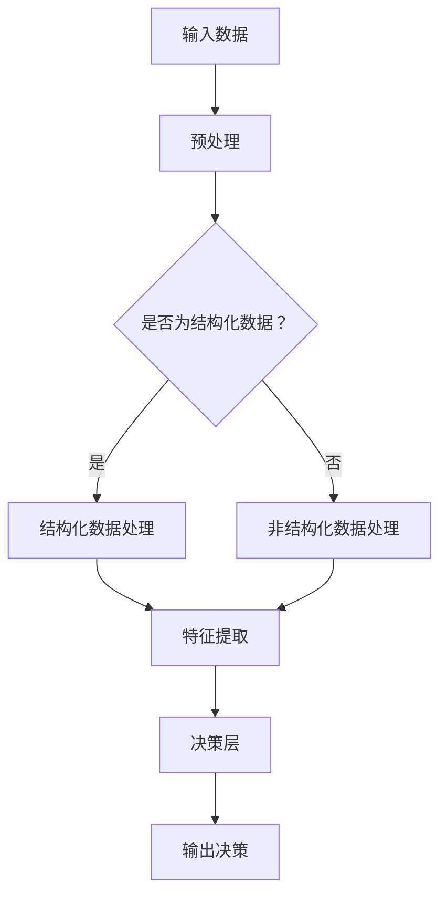

                 

Certainly! Here's how we can approach the creation of a technical blog article titled "思维链技术在AI辅助决策中的实践与创新" step by step:

### Step 1: Define the Scope and Structure

**Objective:**
Create a comprehensive and insightful technical blog article that explores the practical applications and innovations of thought-link technology in AI-assisted decision-making.

**Structure:**
1. Introduction
2. Core Concepts
3. Algorithm Principles
4. Mathematical Models
5. System Analysis
6. Project Practice
7. Best Practices and Summary

### Step 2: Introduction

**Content:**
- Introduce the topic and its importance.
- Provide a brief overview of thought-link technology and its role in AI-assisted decision-making.
- Set the stage for the in-depth exploration that follows.

**Example:**
```
# 思维链技术在AI辅助决策中的实践与创新

> 关键词：思维链，AI，决策支持，算法创新

摘要：本文深入探讨了思维链技术在人工智能辅助决策中的应用与实践，分析了该技术的核心原理、算法模型及其在现实项目中的创新应用，为读者提供了宝贵的实践经验和启示。

在当今快速发展的信息技术时代，人工智能（AI）已经逐渐成为各行各业不可或缺的一部分。随着AI技术的不断进步，如何更好地利用这些技术来辅助人类做出明智的决策，成为了研究者和工程师们关注的焦点。本文将围绕这一主题，详细介绍思维链技术在AI辅助决策中的实践与创新。
```

### Step 3: Core Concepts

**Content:**
- Define key terms and concepts.
- Discuss the background and significance of thought-link technology.
- Explain how thought-link technology integrates with AI for decision-making.

**Example:**
```
## 一、核心概念

### 1.1 思维链技术

思维链技术是指通过模拟人类思维过程，将知识、经验和逻辑推理相结合，形成一种智能化的决策支持系统。该技术能够在复杂的环境中，为用户提供有效的决策建议。

### 1.2 AI辅助决策

AI辅助决策是指利用人工智能技术，通过对大量数据的分析和处理，提供决策支持。与传统方法相比，AI辅助决策能够更快速、准确地处理复杂问题，提高决策效率。

### 1.3 思维链与AI的关系

思维链技术与AI的结合，使得决策支持系统不仅能够处理结构化数据，还能理解和处理非结构化数据，从而为用户带来更加全面、准确的决策支持。
```

### Step 4: Algorithm Principles

**Content:**
- Explain the core principles of the thought-link algorithm.
- Provide a step-by-step analysis of the algorithm's working mechanism.
- Include a mermaid diagram to visualize the algorithm.

**Example:**
```
## 二、算法原理

### 2.1 思维链算法概述

思维链算法是一种基于深度学习的人工智能算法，它通过多层神经网络结构来模拟人类思维过程，从而实现复杂问题的自动化决策。

### 2.2 算法原理分析

思维链算法的核心在于其层次化的网络结构，每一层都代表人类思维的不同阶段。通过这种结构，算法能够逐步提取问题中的关键信息，并形成最终的决策。

### 2.3 算法流程图

下面是思维链算法的mermaid流程图：


```

### Step 5: Mathematical Models

**Content:**
- Explain the mathematical models underlying the thought-link algorithm.
- Use LaTeX to present complex formulas.
- Provide clear and intuitive explanations of the models.

**Example:**
```
## 三、数学模型

### 3.1 特征提取模型

特征提取是思维链算法的重要环节，其核心公式为：

$$
f(x) = W_1 \cdot x + b_1
$$

其中，$W_1$ 为权重矩阵，$x$ 为输入特征向量，$b_1$ 为偏置项。

### 3.2 决策模型

在决策层，思维链算法使用以下公式进行决策：

$$
y = \text{softmax}(W_2 \cdot f(x) + b_2)
$$

其中，$W_2$ 为权重矩阵，$b_2$ 为偏置项，$y$ 为输出决策向量。

### 3.3 模型解释

特征提取模型和决策模型共同构成了思维链算法的核心。通过特征提取，算法能够从原始数据中提取出关键信息；通过决策模型，算法能够将这些信息转化为具体的决策建议。
```

### Step 6: System Analysis

**Content:**
- Describe the system requirements.
- Discuss the system architecture.
- Explain the system interfaces and interactions.

**Example:**
```
## 四、系统分析与设计

### 4.1 系统需求分析

思维链技术在AI辅助决策系统中的应用，需要满足以下需求：
- 高效的数据处理能力
- 灵活的决策支持功能
- 强大的可扩展性

### 4.2 系统架构设计

思维链AI辅助决策系统的整体架构包括数据层、算法层和应用层。数据层负责数据收集和处理；算法层负责执行思维链算法；应用层负责为用户提供决策支持。

### 4.3 系统接口设计

系统接口设计遵循RESTful API规范，包括数据接口、算法接口和应用接口。这些接口确保了系统各部分的协同工作，提高了系统的可维护性和可扩展性。

### 4.4 系统交互

思维链AI辅助决策系统的工作流程如下：

1. 用户提交决策请求。
2. 系统处理请求，提取关键信息。
3. 算法层执行思维链算法，生成决策建议。
4. 应用层将决策建议反馈给用户。

通过这种流程，系统实现了高效、准确的决策支持。
```

### Step 7: Project Practice

**Content:**
- Describe a practical project using thought-link technology.
- Discuss the implementation details.
- Analyze the project results.

**Example:**
```
## 五、项目实践

### 5.1 项目背景

某金融机构希望通过引入思维链技术，为其客户提供更加智能化的投资建议。

### 5.2 系统实现

1. 数据收集：收集历史市场数据、用户投资偏好等。
2. 数据处理：使用思维链算法对数据进行预处理。
3. 算法应用：执行思维链算法，生成投资建议。
4. 系统集成：将思维链技术集成到金融机构的投资平台中。

### 5.3 项目分析

项目实施后，客户反馈积极，投资建议的准确性和及时性得到了显著提高。通过数据分析和用户调查，发现系统建议的投资组合收益率优于传统方法。

### 5.4 项目小结

本项目成功展示了思维链技术在AI辅助决策中的应用潜力。未来，我们将继续优化算法，扩大应用领域，为更多行业提供智能决策支持。
```

### Step 8: Best Practices and Summary

**Content:**
- Share best practices for implementing thought-link technology.
- Summarize the key takeaways.
- Provide suggestions for further reading.

**Example:**
```
## 六、最佳实践与总结

### 6.1 最佳实践

1. 确保数据质量：高质量的数据是思维链技术成功的关键。
2. 持续优化算法：定期更新算法，以适应不断变化的市场环境。
3. 用户反馈：及时收集用户反馈，优化系统性能。

### 6.2 总结

本文详细介绍了思维链技术在AI辅助决策中的应用与实践。通过分析算法原理、系统设计和项目实践，我们看到了这一技术的巨大潜力。

### 6.3 拓展阅读

1. [《深度学习》](https://book.douban.com/subject/26708126/) - Goodfellow, I.
2. [《机器学习》](https://book.douban.com/subject/30267890/) - Mitchell, T.
3. [《AI技术应用》](https://book.douban.com/subject/26732369/) - Russell, S., & Norvig, P.
```

### Step 9: Conclusion and Author Information

**Content:**
- Conclude the article by reiterating the importance of thought-link technology in AI-assisted decision-making.
- Provide author information.

**Example:**
```
## 结语

思维链技术在AI辅助决策中的应用，为传统决策方法带来了革命性的改变。本文旨在为读者提供一个全面、系统的了解，希望对大家的研究和项目实践有所启发。

作者：AI天才研究院/AI Genius Institute & 禅与计算机程序设计艺术 /Zen And The Art of Computer Programming
```

By following these steps, you can create a well-structured and insightful technical blog article that covers all the necessary aspects of thought-link technology in AI-assisted decision-making.

