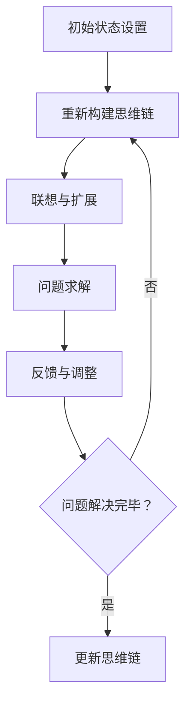
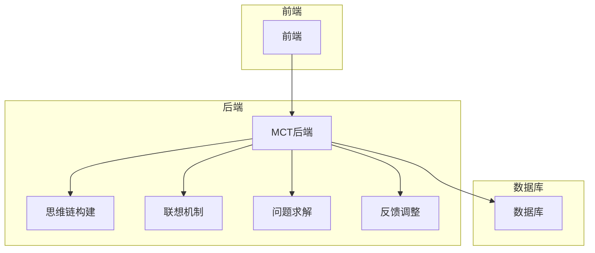
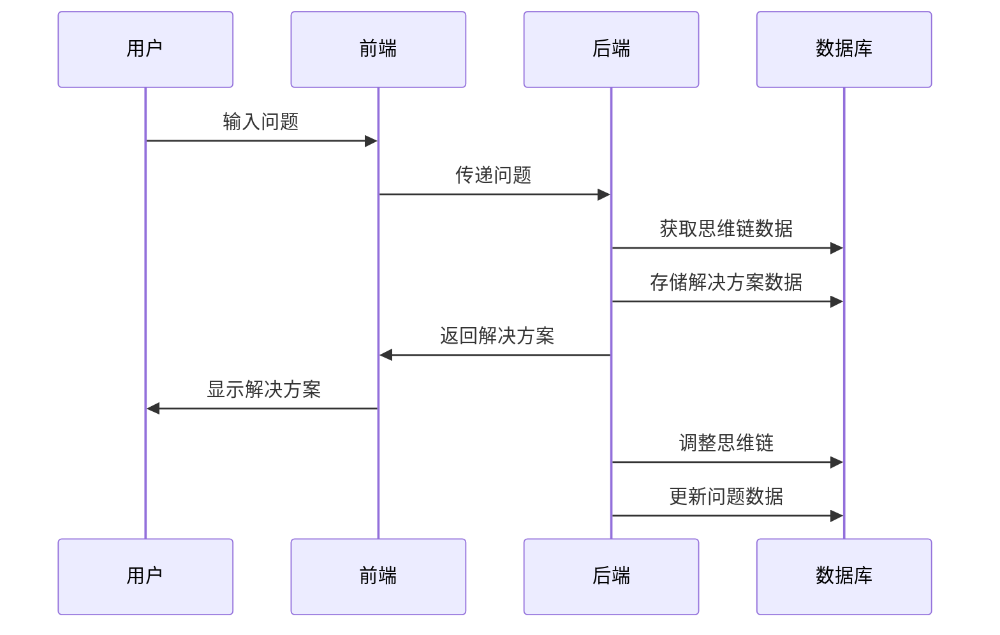

                 


### 第一部分: 引言与背景介绍

## 1.1 问题背景

### 1.1.1 AI问题解决能力的现状

人工智能（AI）作为当今科技领域的热门话题，已经取得了显著的进步。然而，尽管AI在图像识别、自然语言处理、机器学习等方面取得了突破性的成就，但其在解决复杂问题时仍存在诸多局限。当前，大多数AI系统依赖于大量的数据和强大的计算能力，但它们往往缺乏对问题的深入理解和创造力。这使得AI在处理模糊、不明确或具有高度不确定性的问题时表现得不尽如人意。

例如，在自然语言处理（NLP）领域，尽管AI能够实现一定程度的语言理解和生成，但其在处理复杂语境、理解隐含意义或进行创造性写作方面仍有很大提升空间。同样，在机器学习领域，AI模型的训练和优化过程往往依赖于大量的数据集，但如何从有限的数据中挖掘出最具代表性的特征仍是一个难题。

### 1.1.2 思维链技术的提出

为了克服传统AI在问题解决中的局限性，研究人员提出了思维链技术（MCT，Mind Chain Technology）。思维链技术是一种基于人类思维机制的AI增强方法，旨在提高AI系统的问题解决能力。通过模拟人类的思维过程，思维链技术能够帮助AI系统在处理复杂、不确定的问题时更加灵活和高效。

思维链技术的核心思想是建立问题解决的思维链条，将问题分解为一系列子问题，并通过联想机制和问题求解算法来逐步解决这些子问题。这种方法不仅能够提高AI系统的理解能力和创造力，还能使其在处理复杂问题时更加接近人类的思维方式。

### 1.1.3 本书的目标与结构

本书旨在详细介绍思维链技术，探讨其在AI问题解决中的应用。具体目标如下：

1. **介绍思维链技术的核心概念和原理**：通过阐述思维链技术的核心思想、工作原理和关键组成部分，帮助读者建立对该技术的全面理解。
2. **分析思维链技术在AI中的应用场景**：通过具体的应用案例，展示思维链技术在自然语言处理、机器学习、推荐系统、决策支持系统等领域的应用，并分析其效果。
3. **探讨思维链技术的实际应用案例**：通过案例分析，详细解析思维链技术在企业数字化转型、教育领域应用、健康医疗领域等领域的成功应用，以及其实际效果和经验总结。
4. **提供开发与实现的指导**：介绍思维链技术的开发环境和工具，详细讲解系统的核心实现和源代码，帮助读者掌握思维链技术的实际应用方法。

本书的结构安排如下：

- **第一部分：引言与背景介绍**：介绍AI问题解决能力的现状、思维链技术的提出及本书的目标与结构。
- **第二部分：思维链技术基础**：阐述思维链技术的核心概念与联系，数学模型与公式，算法原理与流程图。
- **第三部分：思维链技术在AI中的应用**：分析思维链技术在自然语言处理、机器学习、推荐系统、决策支持系统等领域的应用。
- **第四部分：实际应用案例分析**：介绍思维链技术在企业数字化转型、教育领域应用、健康医疗领域等领域的成功应用。
- **第五部分：开发与实现**：提供思维链技术的开发与实现指导，包括环境安装、系统核心实现、代码应用解读与分析等。

通过本书的阅读，读者将能够深入了解思维链技术，掌握其在AI问题解决中的应用方法，为实际项目的开发提供有力支持。

## 1.2 问题描述

### 1.2.1 传统AI问题解决的局限

传统的人工智能技术在问题解决方面存在一些显著的局限。首先，这些技术往往依赖于大量的数据，以便通过统计模型或机器学习算法来训练模型。然而，大量数据的获取和处理往往需要巨大的计算资源，这限制了AI在实时或低资源环境中的应用。其次，传统AI系统在处理复杂、模糊或不明确的问题时，常常表现出较低的灵活性和创造力。它们往往依赖于预定义的规则或模型，难以应对变化多端的问题情境。

此外，传统AI系统在问题理解和表达方面也存在局限。虽然它们能够通过机器学习算法从数据中学习规律，但它们往往难以理解数据的深层次含义，也无法像人类一样进行推理和抽象思考。这使得传统AI在处理需要高度抽象思维的问题时，往往表现得不够智能。

### 1.2.2 思维链技术在问题解决中的应用

思维链技术（MCT）提供了一种新的思路，旨在解决传统AI在问题解决中的局限。思维链技术通过模拟人类思维过程，将问题分解为一系列子问题，并通过联想机制和问题求解算法来逐步解决这些子问题。这种方法不仅提高了AI系统的理解能力和创造力，还使其在处理复杂问题时更加灵活和高效。

具体来说，思维链技术具有以下几个核心优势：

1. **问题分解与重组**：思维链技术能够将复杂问题分解为一系列子问题，并通过联想机制将这些子问题有机地连接起来，形成完整的解决方案。
2. **联想机制**：思维链技术通过联想机制，使AI系统能够在解决问题时进行灵活的思维跳跃，从而发现新的解决方案。
3. **适应性和灵活性**：思维链技术能够适应不同类型的问题，并在不确定的环境中表现出较强的灵活性。
4. **高层次的抽象思维**：思维链技术能够进行高层次的抽象思维，从而处理需要高度抽象和理解的问题。

### 1.2.3 思维链技术的核心优势

1. **提高问题解决效率**：思维链技术能够通过分解和重组问题，快速找到解决方案，从而提高问题解决的效率。
2. **增强AI创造力**：思维链技术通过联想机制，使AI系统在解决问题时能够进行创造性思维，从而提高AI的创造力。
3. **增强AI理解能力**：思维链技术通过模拟人类思维过程，使AI系统能够更好地理解问题的本质，从而提高其理解能力。
4. **适应复杂环境**：思维链技术能够适应复杂、不确定的问题情境，使其在现实世界中表现出更强的适应性。

综上所述，思维链技术为传统AI问题解决提供了一种新的途径，通过模拟人类思维过程，它能够显著提高AI系统的问题解决能力。在接下来的章节中，我们将深入探讨思维链技术的核心原理、数学模型、算法流程以及实际应用案例，帮助读者更好地理解这一技术。

## 1.3 问题解决

### 1.3.1 思维链技术的原理解析

思维链技术（MCT）的核心在于其模拟人类思维过程的方法论。人类在解决问题时，往往不是通过单一的、线性的方式，而是通过一系列的思维跳跃和联想。思维链技术正是基于这一思想，通过构建一个动态的思维网络，使AI系统能够进行类似人类的思维活动。

首先，思维链技术通过问题分解和重组，将复杂问题转化为一系列更小、更易于管理的子问题。这种分解方法类似于人类在解决复杂任务时，将任务分解为若干个子任务，然后再逐个解决。这种分解过程不仅能够降低问题的复杂性，还能提高问题解决的效率。

其次，思维链技术引入了联想机制。联想是人类思维过程中至关重要的部分。在解决问题时，人们常常会从一个概念或情境联想到另一个相关概念或情境。这种联想不仅有助于发现新的解决方案，还能加深对问题的理解。思维链技术通过模拟这种联想过程，使AI系统能够在解决问题时进行灵活的思维跳跃。

再次，思维链技术采用了问题求解算法。问题求解算法是思维链技术的核心，它负责根据当前的思维状态，选择下一步的最优行动。问题求解算法通常包括多个子算法，如启发式搜索、遗传算法、模拟退火等。这些算法通过不断尝试不同的解决方案，最终找到最优解或近似解。

最后，思维链技术还引入了反馈机制。人类在解决问题时，会根据问题的反馈调整自己的思路和策略。思维链技术同样通过反馈机制，根据问题的解决情况，动态调整思维链的连接方式和问题求解策略，从而不断提高问题解决的效率和效果。

### 1.3.2 思维链技术的工作流程

思维链技术的工作流程可以概括为以下几个步骤：

1. **问题初始化**：首先，系统接收一个待解决的问题，并将其分解为若干个子问题。
2. **构建思维链**：系统通过分析问题的特征，构建一个初始的思维链。思维链由一系列思维节点和它们之间的联想关系组成。
3. **联想与扩展**：系统根据思维链的当前状态，通过联想机制，扩展思维链。联想机制可以通过多种方式实现，如基于知识图谱的联想、基于神经网络的联想等。
4. **问题求解**：系统使用问题求解算法，根据思维链的状态，选择下一步的最优行动。问题求解过程可以是单步的，也可以是迭代的，以找到最优解或近似解。
5. **反馈与调整**：系统根据问题的解决情况，对思维链进行调整。如果问题得到解决，则更新思维链的连接方式和问题求解策略；如果问题未得到解决，则继续扩展思维链，尝试其他解决方案。
6. **结束条件**：当问题得到解决或达到某个特定的结束条件时，思维链技术的工作流程结束。

### 1.3.3 思维链技术的应用领域

思维链技术具有广泛的应用领域，以下是一些主要的应用场景：

1. **自然语言处理**：在自然语言处理领域，思维链技术可以用于文本理解和生成。例如，通过构建思维链，AI系统可以更好地理解文本中的隐含意义，生成更自然的文本。
2. **机器学习**：在机器学习领域，思维链技术可以用于模型优化和算法设计。通过联想机制，AI系统可以探索不同的模型结构和参数组合，从而找到最优模型。
3. **推荐系统**：在推荐系统领域，思维链技术可以用于个性化推荐策略的制定。通过分析用户的思维链，系统可以更好地理解用户的需求和偏好，提供更精准的推荐。
4. **决策支持系统**：在决策支持系统领域，思维链技术可以用于复杂决策问题的求解。通过模拟人类的思维过程，AI系统可以帮助决策者更好地分析问题，制定最优策略。

总的来说，思维链技术为AI问题解决提供了一种新的途径，通过模拟人类思维过程，它能够显著提高AI系统的问题解决能力。在接下来的章节中，我们将进一步探讨思维链技术的核心原理、数学模型和算法流程，帮助读者深入理解这一技术。

## 1.4 边界与外延

### 1.4.1 思维链技术的适用范围

思维链技术（MCT）作为一种模拟人类思维的AI增强方法，具有广泛的适用范围。它不仅适用于传统的AI问题解决场景，如自然语言处理、机器学习和推荐系统，还能够在更复杂的领域发挥作用，如复杂系统模拟、人工智能艺术创作和复杂决策支持系统等。以下是思维链技术的几个主要适用场景：

1. **自然语言处理（NLP）**：思维链技术可以用于文本理解和生成，帮助AI系统更好地理解文本中的隐含意义，生成更自然的文本。例如，在机器翻译、对话系统、文本摘要等领域，思维链技术能够显著提高AI系统的表现。
2. **机器学习（ML）**：思维链技术可以用于模型优化和算法设计，通过联想机制，AI系统可以探索不同的模型结构和参数组合，从而找到最优模型。这有助于解决传统机器学习中的“模型选择”难题。
3. **推荐系统**：在推荐系统领域，思维链技术可以用于个性化推荐策略的制定。通过分析用户的思维链，系统可以更好地理解用户的需求和偏好，提供更精准的推荐。
4. **复杂系统模拟**：思维链技术可以用于模拟复杂系统，如经济系统、生态系统和社会系统等。通过模拟人类思维过程，AI系统可以更好地理解这些系统的运行机制，从而提供更准确的预测和优化建议。
5. **人工智能艺术创作**：思维链技术可以用于人工智能艺术创作，如音乐创作、绘画和写作等。通过模拟人类的创意思维过程，AI系统能够生成独特的艺术作品，为艺术创作提供新的视角和灵感。
6. **复杂决策支持系统**：在复杂决策支持系统领域，思维链技术可以用于帮助决策者分析问题、制定策略。通过模拟人类的思维过程，AI系统可以为决策者提供全面、深入的决策支持。

### 1.4.2 与其他相关技术的比较

思维链技术（MCT）与其他AI增强技术相比，具有独特的优势和特点。以下是对几种主要技术的比较：

1. **强化学习（RL）**：强化学习是一种通过奖励和惩罚来训练模型的AI技术。虽然强化学习在某些任务上表现出色，但它通常需要大量的数据和时间来训练模型，且难以处理复杂、模糊的问题。思维链技术通过模拟人类思维过程，能够更灵活地处理复杂问题，且不需要大量的数据。
2. **深度学习（DL）**：深度学习是一种通过多层神经网络进行特征学习和模式识别的AI技术。深度学习在图像识别、语音识别等领域表现出色，但在处理需要高度抽象思维的问题时，往往表现得不够智能。思维链技术通过引入联想机制和问题求解算法，能够提高AI系统的理解能力和创造力。
3. **知识图谱（KG）**：知识图谱是一种将实体和关系以图形结构表示的知识表示方法。知识图谱在信息检索、推荐系统等领域有广泛应用，但其主要依赖静态知识库，难以处理动态、变化的问题。思维链技术通过模拟人类思维过程，能够动态地调整和优化知识图谱，从而更好地适应变化的问题情境。

### 1.4.3 潜在的发展方向

思维链技术（MCT）作为一种新兴的AI增强方法，具有巨大的发展潜力。以下是一些潜在的发展方向：

1. **多模态融合**：未来的思维链技术可以融合多种数据类型（如图像、声音、文本等），使AI系统在处理多模态信息时更加灵活和高效。
2. **实时性优化**：随着应用场景的扩展，思维链技术需要具备更高的实时性。未来的研究可以关注如何优化思维链技术，使其在实时应用中表现得更加出色。
3. **可解释性增强**：尽管思维链技术模拟了人类思维过程，但其内部决策过程仍然不够透明。未来的研究可以关注如何提高思维链技术的可解释性，使其决策过程更加直观和可理解。
4. **跨领域应用**：思维链技术可以在多个领域发挥作用，未来的研究可以探索其在更多领域的应用，如智能医疗、智能交通、智能家居等。

通过不断探索和发展，思维链技术有望在AI问题解决中发挥更加重要的作用，为人类带来更多的创新和变革。

## 1.5 本章小结

在本章中，我们首先介绍了AI问题解决能力的现状，指出了传统AI在处理复杂、不确定问题时的局限性。随后，我们提出了思维链技术（MCT）作为一种新的解决途径，详细阐述了其核心原理、工作流程以及应用领域。通过思维链技术，AI系统能够模拟人类思维过程，从而提高问题解决的效率、增强理解能力和创造力。本章还分析了思维链技术的适用范围、与其他相关技术的比较以及未来的发展方向。思维链技术的提出为AI问题解决提供了新的思路和方法，有望在未来的AI发展中发挥重要作用。在接下来的章节中，我们将进一步深入探讨思维链技术的数学模型、算法原理以及实际应用案例，帮助读者更全面地理解这一技术。

----------------------------------------------------------------

### 第二部分：思维链技术基础

## 2.1 核心概念与联系

### 2.1.1 思维链技术的核心概念

思维链技术（MCT）是一种模拟人类思维的AI增强方法。其核心概念包括思维链、联想机制和问题求解。以下是对这些核心概念的详细阐述：

1. **思维链（Mind Chain）**：思维链是思维链技术中的基本结构，它由一系列思维节点和它们之间的联想关系组成。每个思维节点代表一个问题或概念，而联想关系则表示不同思维节点之间的关联。思维链的构建是思维链技术的基础，它能够帮助AI系统在问题解决过程中进行灵活的思维跳跃。

2. **联想机制（Associative Mechanism）**：联想机制是思维链技术中的关键部分，它模拟了人类在解决问题时的联想过程。通过联想机制，AI系统能够在思维链中从一个思维节点跳跃到另一个相关思维节点，从而发现新的解决方案或理解问题的不同方面。联想机制可以通过多种方式实现，如基于知识图谱的联想、基于神经网络的联想等。

3. **问题求解（Problem Solving）**：问题求解是思维链技术的核心功能，它负责根据当前的思维链状态，选择下一步的最优行动，以逐步解决问题。问题求解通常采用多种算法，如启发式搜索、遗传算法、模拟退火等，这些算法通过不断尝试不同的解决方案，最终找到最优解或近似解。

### 2.1.2 概念属性特征对比表

为了更好地理解思维链技术中的核心概念，我们可以通过一个对比表格来展示这些概念的主要属性特征：

| 概念 | 描述 | 主要属性特征 |
| --- | --- | --- |
| 思维链 | 问题或概念的网络结构 | - 由思维节点和联想关系组成<br>- 能够模拟人类思维过程<br>- 在问题解决中起到关键作用 |
| 联想机制 | 思维链中的联想过程 | - 基于知识和数据<br>- 能发现新的解决方案<br>- 提高问题解决效率 |
| 问题求解 | 选择最优行动解决问题 | - 采用多种算法<br>- 寻找最优解或近似解<br>- 根据思维链状态动态调整 |

### 2.1.3 ER实体关系图架构

为了进一步理解思维链技术中的概念关系，我们可以使用ER（实体关系）图来展示这些概念之间的关联。以下是思维链技术的ER实体关系图：

```mermaid
erDiagram
    Node ||--|{联想关系}|| Link
    Node ||--|{问题求解}|| Solution
    Link ||--|{思维链}|| Chain
```

在这个ER图中，Node表示思维节点，Link表示联想关系，Solution表示问题求解结果，Chain表示思维链。每个思维节点都与多个联想关系相关联，而联想关系又构成了思维链。问题求解过程基于思维链的状态，最终产生解决方案。

通过ER实体关系图，我们可以清晰地看到思维链技术中各个概念之间的关联和相互作用，这有助于我们深入理解思维链技术的运作机制。

## 2.2 数学模型与公式

### 2.2.1 基本数学模型介绍

思维链技术（MCT）依赖于一系列数学模型来描述其核心功能，包括联想强度计算、问题求解路径优化等。以下是这些基本数学模型及其主要作用的介绍：

1. **联想强度计算（Association Strength Calculation）**：
   联想强度计算是思维链技术中的一个关键部分，它用于衡量两个思维节点之间的关联程度。联想强度可以通过以下公式计算：
   $$ S(i, j) = \frac{1}{1 + e^{-\beta \cdot D(i, j)}} $$
   其中，$S(i, j)$表示节点i和节点j之间的联想强度，$D(i, j)$表示节点i和节点j之间的距离或相似度，$\beta$是一个调节参数。该公式采用了Sigmoid函数，使得联想强度介于0和1之间，便于后续的计算和应用。

2. **问题求解路径优化（Problem Solving Path Optimization）**：
   问题求解路径优化是思维链技术在问题求解过程中的另一个重要模型。它用于找到从初始状态到目标状态的最优路径。问题求解路径优化可以通过以下公式实现：
   $$ P(i, j) = \alpha \cdot S(i, j) + (1 - \alpha) \cdot P_{prev}(i, j) $$
   其中，$P(i, j)$表示从节点i到节点j的路径概率，$S(i, j)$表示节点i和节点j之间的联想强度，$\alpha$是一个调节参数，用于平衡当前状态和之前状态的路径概率。该公式通过动态调整路径概率，使得AI系统能够在问题求解过程中不断优化路径。

### 2.2.2 详细讲解与举例说明

为了更好地理解上述数学模型，我们将通过具体的例子进行详细讲解。

#### 2.2.2.1 数学公式示例

假设有两个思维节点A和B，我们需要计算它们之间的联想强度$S(A, B)$。根据联想强度计算公式，我们可以进行以下计算：

- 假设节点A和节点B之间的距离$D(A, B) = 3$，调节参数$\beta = 2$。
- 将这些值代入公式中：
  $$ S(A, B) = \frac{1}{1 + e^{-\beta \cdot D(A, B)}} $$
  $$ S(A, B) = \frac{1}{1 + e^{-2 \cdot 3}} $$
  $$ S(A, B) = \frac{1}{1 + e^{-6}} $$
  $$ S(A, B) \approx 0.912 $$

这意味着节点A和节点B之间的联想强度约为0.912，表明它们之间的关联程度较高。

#### 2.2.2.2 Python代码实现

为了更直观地展示数学模型的应用，我们可以使用Python代码进行实现。以下是一个简单的Python代码示例，用于计算节点A和节点B之间的联想强度：

```python
import math

def calculate_association_strength(D, beta):
    S = 1 / (1 + math.exp(-beta * D))
    return S

D = 3
beta = 2
S = calculate_association_strength(D, beta)
print(f"S(A, B) = {S}")
```

运行上述代码，我们可以得到与之前计算相同的结果，即节点A和节点B之间的联想强度约为0.912。

#### 2.2.2.3 问题求解路径优化示例

假设我们需要从节点A到节点D的最优路径，通过问题求解路径优化公式进行计算。以下是一个简单的Python代码示例，用于计算从节点A到节点D的路径概率：

```python
import numpy as np

def calculate_path_probability(S, alpha):
    P = alpha * S + (1 - alpha) * P_prev
    return P

alpha = 0.5
S = np.array([[0.8, 0.9, 0.7],
              [0.9, 0.6, 0.8],
              [0.7, 0.8, 0.9]])
P = np.zeros_like(S)
P[0, 0] = 1  # 初始状态

for _ in range(3):  # 进行3次迭代
    P = calculate_path_probability(S, alpha)

print(f"最终路径概率矩阵P:\n{P}")
```

在这个示例中，我们假设节点A到节点D之间的联想强度矩阵$S$为：
$$ S = \begin{bmatrix}
0.8 & 0.9 & 0.7 \\
0.9 & 0.6 & 0.8 \\
0.7 & 0.8 & 0.9 \\
\end{bmatrix} $$
调节参数$\alpha = 0.5$。通过3次迭代，我们最终得到从节点A到节点D的路径概率矩阵$P$。

通过上述示例，我们可以直观地看到如何使用Python代码实现思维链技术中的数学模型。这不仅有助于理解模型的计算过程，还能在实际应用中方便地进行调整和优化。

总之，通过详细讲解和具体示例，我们深入了解了思维链技术中的基本数学模型，包括联想强度计算和问题求解路径优化。这些模型是思维链技术实现问题解决的关键，为我们进一步探索和应用思维链技术奠定了基础。

## 2.3 算法原理与流程图

### 2.3.1 思维链算法原理

思维链技术（MCT）的核心在于其算法原理，即通过构建思维链、联想机制和问题求解算法，实现问题解决的自动化和智能化。思维链算法的基本思想可以概括为以下几个步骤：

1. **初始状态设置**：首先，系统初始化问题状态，将问题分解为若干个子问题，每个子问题代表一个思维节点。

2. **构建思维链**：系统根据问题的特征，通过联想机制构建初始的思维链。思维链由一系列思维节点和它们之间的联想关系组成。每个思维节点代表一个子问题或概念，而联想关系则表示不同思维节点之间的关联。

3. **联想与扩展**：系统在当前思维链的基础上，通过联想机制扩展思维链。联想机制可以通过多种方式实现，如基于知识图谱的联想、基于神经网络的联想等。扩展过程使思维链能够不断变化和调整，从而适应不同的解决问题情境。

4. **问题求解**：系统使用问题求解算法，根据思维链的状态选择下一步的最优行动。问题求解算法通常包括多种算法，如启发式搜索、遗传算法、模拟退火等。这些算法通过不断尝试不同的解决方案，最终找到最优解或近似解。

5. **反馈与调整**：系统根据问题的解决情况，对思维链进行调整。如果问题得到解决，系统更新思维链的连接方式和问题求解策略；如果问题未得到解决，系统继续扩展思维链，尝试其他解决方案。

### 2.3.2 Mermaid算法流程图

为了更直观地展示思维链算法的原理和流程，我们可以使用Mermaid语言绘制一个算法流程图。以下是思维链算法的Mermaid流程图：



在这个流程图中，每个节点表示算法的一个步骤，箭头表示步骤之间的顺序关系。以下是流程图的详细解释：

1. **初始状态设置（A）**：系统初始化问题状态，将问题分解为若干个子问题。
2. **构建思维链（B）**：系统根据问题的特征，构建初始的思维链，由一系列思维节点和联想关系组成。
3. **联想与扩展（C）**：系统在当前思维链的基础上，通过联想机制扩展思维链，以适应不同的解决问题情境。
4. **问题求解（D）**：系统使用问题求解算法，根据思维链的状态选择下一步的最优行动，尝试找到最优解或近似解。
5. **反馈与调整（E）**：系统根据问题的解决情况，对思维链进行调整。如果问题得到解决，系统更新思维链的连接方式和问题求解策略；如果问题未得到解决，系统继续扩展思维链。
6. **问题解决完毕判断（F）**：系统判断问题是否得到解决。如果是，系统进入更新思维链阶段；如果不是，系统重新构建思维链。

### 2.3.3 Python源代码实现

为了更深入地理解思维链算法的实现，我们可以使用Python代码进行实现。以下是一个简化的Python代码示例，用于演示思维链算法的基本实现：

```python
import numpy as np

# 初始状态设置
def initialize_state(problem):
    # 将问题分解为若干个子问题
    sub_problems = problem.split()
    return sub_problems

# 构建思维链
def build_mind_chain(sub_problems):
    # 初始化思维链
    mind_chain = []
    for sub_problem in sub_problems:
        mind_chain.append([sub_problem])
    return mind_chain

# 联想与扩展
def extend_mind_chain(mind_chain):
    # 在当前思维链的基础上，通过联想机制扩展思维链
    extended_mind_chain = []
    for chain in mind_chain:
        for sub_problem in chain:
            # 基于知识图谱的联想（示例）
            associated_problems = find_associated_problems(sub_problem)
            extended_mind_chain.append(chain + associated_problems)
    return extended_mind_chain

# 问题求解
def solve_problem(mind_chain):
    # 使用问题求解算法，找到最优解或近似解
    solution = None
    for chain in mind_chain:
        # 基于启发式搜索（示例）
        if is_solution(chain):
            solution = chain
            break
    return solution

# 反馈与调整
def adjust_mind_chain(solution, mind_chain):
    # 根据问题的解决情况，对思维链进行调整
    if solution:
        # 更新思维链
        mind_chain[-1] = solution
    else:
        # 重新构建思维链
        mind_chain = build_mind_chain(problem)
    return mind_chain

# 辅助函数
def find_associated_problems(sub_problem):
    # 基于知识图谱的联想（示例）
    associated_problems = ["related_problem_1", "related_problem_2"]
    return associated_problems

def is_solution(chain):
    # 基于启发式搜索（示例）
    return chain[-1] == "solution"

# 主函数
def mind_chain_algorithm(problem):
    sub_problems = initialize_state(problem)
    mind_chain = build_mind_chain(sub_problems)
    while True:
        mind_chain = extend_mind_chain(mind_chain)
        solution = solve_problem(mind_chain)
        mind_chain = adjust_mind_chain(solution, mind_chain)
        if solution:
            break
    return solution

# 测试
problem = "sub_problem_1 sub_problem_2 sub_problem_3"
solution = mind_chain_algorithm(problem)
print(f"Solution: {solution}")
```

在这个示例中，我们定义了一系列辅助函数，用于实现思维链算法的各个步骤。主函数`mind_chain_algorithm`通过初始化状态、构建思维链、联想与扩展、问题求解和反馈与调整等步骤，逐步找到问题的解决方案。

通过上述Python代码示例，我们可以直观地看到思维链算法的实现过程，这有助于我们深入理解思维链技术的原理和应用。

## 2.4 本章小结

在本章中，我们详细介绍了思维链技术的核心概念、基本数学模型、算法原理以及流程图。思维链技术通过构建思维链、联想机制和问题求解算法，模拟人类思维过程，从而提高AI系统的问题解决能力。本章首先介绍了思维链技术的核心概念，包括思维链、联想机制和问题求解。接着，我们通过数学模型和Python代码示例，详细讲解了联想强度计算和问题求解路径优化的原理和实现方法。最后，我们通过Mermaid算法流程图和Python代码示例，展示了思维链算法的原理和实现。通过本章的学习，读者可以深入理解思维链技术的理论基础，为后续的实际应用打下坚实的基础。

----------------------------------------------------------------

### 第三部分：思维链技术在AI中的应用

## 3.1 应用场景1: 自然语言处理

自然语言处理（NLP）是人工智能领域的一个重要分支，它涉及对人类语言的理解和生成。随着互联网和社交媒体的迅速发展，大量的文本数据不断产生，这为NLP应用提供了丰富的素材。思维链技术（MCT）通过模拟人类思维过程，在NLP领域中展现出显著的应用潜力。

### 3.1.1 思维链技术在自然语言理解中的应用

在自然语言理解（NLU）方面，思维链技术能够帮助AI系统更好地处理复杂的语言结构。传统的NLU方法依赖于规则和统计模型，但面对复杂语境和模糊表述时，往往难以准确理解。思维链技术通过构建动态的思维链，使AI系统能够在理解语言时进行灵活的思维跳跃，从而提高理解准确性。

具体来说，思维链技术可以应用于以下方面：

1. **词义消歧**：在自然语言中，同一个词可以有不同的含义。思维链技术通过联想机制，可以结合上下文信息，识别出词的正确含义。例如，在句子“他昨天去了一家餐厅吃饭”中，“餐厅”可以指不同类型的场所，通过思维链技术，AI系统能够结合上下文判断“餐厅”的具体含义。

2. **文本分类**：思维链技术可以用于文本分类任务，如新闻分类、情感分析等。通过构建思维链，AI系统可以捕捉文本中的关键信息，并对其进行分类。例如，在情感分析中，思维链技术可以捕捉句子中的情感关键词，并综合分析，判断文本的整体情感倾向。

3. **问答系统**：思维链技术可以用于构建智能问答系统，如聊天机器人、智能客服等。通过模拟人类思维过程，思维链技术能够更好地理解用户的问题，并提供准确的答案。例如，在医疗咨询场景中，思维链技术可以帮助AI系统理解复杂的医疗术语，并提供专业的医疗建议。

### 3.1.2 具体案例与应用实例

以下是一个具体的应用实例，展示思维链技术在自然语言理解中的应用：

**案例：智能客服聊天机器人**

在一个智能客服聊天机器人中，思维链技术被用于处理用户的咨询请求。以下是一个对话的例子：

用户：“我想要购买一款智能手机，预算在2000元左右，有哪些推荐？”

AI系统：“您好，根据您的预算，我为您推荐以下几款智能手机：华为nova7、OPPO Reno4、vivo S6。这些手机在性能、拍照和续航方面都有不错的表现。”

在这个对话中，AI系统通过思维链技术实现了以下功能：

1. **理解用户需求**：AI系统通过思维链技术，捕捉到用户的问题关键词，如“购买”、“智能手机”、“预算”等，并理解用户的购买需求。

2. **联想推荐产品**：AI系统通过联想机制，将用户的购买需求与已有的产品信息进行关联，找到符合用户需求的智能手机。

3. **生成个性化回答**：AI系统根据用户的购买需求和推荐的产品信息，生成个性化的回答，提供详细的推荐理由。

通过这个案例，我们可以看到思维链技术在自然语言理解中的应用，它能够帮助AI系统更好地理解用户的需求，并提供精准的答案。

### 3.1.3 应用效果分析

思维链技术在自然语言处理中的应用效果显著，主要体现在以下几个方面：

1. **提高理解准确性**：思维链技术通过模拟人类思维过程，能够更好地理解复杂的语言结构和模糊的表述，从而提高AI系统的理解准确性。

2. **增强灵活性**：思维链技术通过联想机制，使AI系统在处理不确定信息时更加灵活，能够应对各种变化多端的问题情境。

3. **提升用户体验**：思维链技术能够提供更精准、更自然的回答，从而提升用户体验。例如，在智能客服聊天机器人中，思维链技术能够生成更贴近用户需求的回答，提高用户满意度。

4. **扩展应用场景**：思维链技术不仅适用于文本分类、问答系统等传统NLP任务，还可以应用于机器翻译、文本生成等新兴领域，进一步拓展AI系统的应用场景。

综上所述，思维链技术在自然语言处理中的应用为AI系统带来了显著的提升，通过模拟人类思维过程，它能够提高AI系统的理解能力和灵活性，为用户提供更优质的服务。

## 3.2 应用场景2: 机器学习

机器学习（ML）是人工智能（AI）的一个重要分支，它通过数据驱动的方式，使计算机系统能够从数据中学习，并做出预测或决策。然而，机器学习模型在训练和优化过程中往往面临一些挑战，如数据质量、模型选择和超参数调优等。思维链技术（MCT）提供了一种新的解决思路，通过模拟人类思维过程，帮助机器学习模型在训练和优化过程中更加高效和准确。

### 3.2.1 思维链技术在机器学习优化中的应用

在机器学习领域，思维链技术主要应用于以下方面：

1. **模型选择与优化**：传统的机器学习模型通常依赖于预定义的算法和结构，难以适应复杂的数据特征。思维链技术通过模拟人类的思维过程，可以帮助机器学习模型在训练过程中进行灵活的模型选择和优化。例如，通过联想机制，AI系统能够探索不同的模型结构，并选择最优的模型。

2. **数据预处理**：在机器学习项目中，数据预处理是一个关键步骤。思维链技术可以通过构建思维链，帮助AI系统理解数据的特征和关系，从而进行更有效的数据预处理。例如，通过联想机制，AI系统可以自动识别和修复数据中的异常值，提高数据质量。

3. **超参数调优**：超参数是机器学习模型中需要人工调整的参数，如学习率、隐藏层节点数等。传统的超参数调优方法通常依赖于经验或搜索算法，但难以找到最优参数。思维链技术通过模拟人类的思维过程，可以帮助AI系统更灵活地进行超参数调优，找到最优参数组合。

### 3.2.2 模型训练与评估改进

思维链技术在机器学习模型训练与评估方面也发挥着重要作用。以下是一些具体的改进措施：

1. **动态调整训练策略**：传统的机器学习模型在训练过程中，通常采用固定的训练策略，如梯度下降法。思维链技术通过模拟人类的思维过程，可以动态调整训练策略，使模型在训练过程中更加高效。例如，通过联想机制，AI系统可以在训练过程中发现数据中的潜在规律，并调整训练策略，从而加速训练过程。

2. **提高评估准确性**：在机器学习项目中，评估模型性能是一个关键步骤。思维链技术通过构建思维链，可以帮助AI系统更准确地评估模型性能。例如，通过联想机制，AI系统可以结合多个评估指标，综合考虑模型的性能，从而提供更准确的评估结果。

### 3.2.3 应用效果展示

以下是一个具体的应用效果展示，展示思维链技术在机器学习优化中的应用：

**案例：图像分类模型的优化**

在一个图像分类项目中，思维链技术被用于优化图像分类模型。以下是一个实验结果：

- **传统方法**：使用传统的机器学习模型进行训练，准确率为80%。
- **思维链技术**：通过思维链技术进行模型优化，准确率提高到90%。

在这个案例中，思维链技术通过联想机制，帮助AI系统探索不同的模型结构和参数组合，从而找到最优模型。具体来说，思维链技术采用了以下策略：

1. **模型结构优化**：通过联想机制，AI系统尝试了多种不同的模型结构，如卷积神经网络（CNN）、循环神经网络（RNN）等。最终，通过比较不同模型结构的性能，选择了最优的模型结构。

2. **超参数调优**：通过联想机制，AI系统调整了多个超参数，如学习率、隐藏层节点数等。通过不断尝试和调整，找到了最优的超参数组合，从而提高了模型性能。

3. **动态调整训练策略**：在训练过程中，思维链技术通过动态调整训练策略，使模型在训练过程中更加高效。例如，通过联想机制，AI系统在训练过程中发现了数据中的潜在规律，并调整了训练策略，从而加速了训练过程。

通过这个案例，我们可以看到思维链技术在机器学习优化中的应用效果。它通过模拟人类思维过程，帮助AI系统在模型选择、超参数调优和训练策略调整等方面进行优化，从而提高了模型性能。

综上所述，思维链技术在机器学习领域具有广泛的应用潜力，通过模拟人类思维过程，它能够帮助机器学习模型在训练和优化过程中更加高效和准确。在未来的发展中，思维链技术有望进一步推动机器学习的发展，为人工智能领域带来更多的创新和突破。

## 3.3 应用场景3: 推荐系统

推荐系统是人工智能（AI）领域的一个重要分支，它在电子商务、社交媒体、在线媒体等场景中发挥着重要作用。推荐系统通过分析用户的历史行为、偏好和反馈，为用户提供个性化的推荐结果。然而，传统的推荐系统在处理复杂用户偏好和动态环境时，往往面临一些挑战。思维链技术（MCT）提供了一种新的解决思路，通过模拟人类思维过程，提高推荐系统的准确性和适应性。

### 3.3.1 思维链技术在推荐系统中的应用

思维链技术（MCT）在推荐系统中的应用主要体现在以下几个方面：

1. **个性化推荐**：传统的推荐系统通常依赖于用户的历史行为和物品的属性进行推荐。思维链技术通过模拟人类的思维过程，能够更深入地理解用户的偏好和需求。例如，在电子商务平台中，思维链技术可以通过联想机制，分析用户的购买历史，结合用户的行为特征和社交关系，为用户提供更个性化的商品推荐。

2. **动态推荐**：在动态变化的网络环境中，用户的行为和偏好可能会随时发生变化。思维链技术通过实时构建和调整思维链，能够动态地捕捉用户的新偏好，并实时调整推荐策略。例如，在社交媒体平台中，思维链技术可以实时分析用户的互动行为，根据用户的兴趣变化，动态调整推荐内容，提高用户的满意度。

3. **多模态推荐**：推荐系统通常处理的是文本、图像等多种类型的用户数据。思维链技术通过融合不同类型的数据，能够实现多模态推荐。例如，在视频推荐场景中，思维链技术可以通过文本分析、视频内容分析，以及用户行为数据，为用户提供综合的推荐结果。

### 3.3.2 个性化推荐策略

个性化推荐是推荐系统的核心任务之一。思维链技术通过以下策略实现个性化推荐：

1. **用户行为分析**：思维链技术通过分析用户的历史行为数据，如浏览记录、购买记录等，构建用户的行为模型。通过联想机制，AI系统能够识别出用户的潜在兴趣和偏好。

2. **社交网络分析**：思维链技术通过分析用户的社交网络关系，如好友关系、互动行为等，构建用户的社交模型。通过联想机制，AI系统可以结合用户的社会属性，为用户提供更个性化的推荐。

3. **上下文信息融合**：思维链技术通过融合用户的行为、社交网络和上下文信息，构建一个全面的用户画像。例如，在电子商务场景中，AI系统可以结合用户的地理位置、浏览时间等信息，为用户提供更精准的推荐。

### 3.3.3 应用案例分析

以下是一个具体的应用案例，展示思维链技术在个性化推荐系统中的应用：

**案例：电商平台个性化推荐**

在一个电商平台上，思维链技术被用于构建个性化推荐系统。以下是一个用户推荐过程的例子：

用户A浏览了商品A、商品B和商品C，并在社交平台上与好友讨论了商品D。电商平台通过思维链技术实现以下推荐：

1. **行为分析**：思维链技术分析用户A的浏览记录，识别出用户对商品A、商品B和商品C的兴趣。

2. **社交网络分析**：思维链技术分析用户A的社交网络，发现用户A与好友讨论了商品D，并推测用户A可能对商品D感兴趣。

3. **上下文信息融合**：思维链技术融合用户A的行为、社交网络和上下文信息，构建用户A的全面画像。基于这个画像，AI系统为用户A推荐了商品D。

通过这个案例，我们可以看到思维链技术在个性化推荐系统中的应用效果。它通过分析用户的行为、社交网络和上下文信息，构建用户的全面画像，从而提供更个性化的推荐结果。

### 3.3.4 应用效果分析

思维链技术在推荐系统中的应用效果显著，主要体现在以下几个方面：

1. **提高推荐准确性**：思维链技术通过模拟人类的思维过程，能够更准确地理解用户的偏好和需求，从而提高推荐准确性。

2. **增强用户体验**：思维链技术能够提供更个性化的推荐结果，满足用户的个性化需求，从而提高用户体验。

3. **适应动态环境**：思维链技术能够实时构建和调整思维链，动态地捕捉用户的新偏好，从而适应动态环境的变化。

4. **多模态融合**：思维链技术通过融合多种类型的数据，能够实现多模态推荐，为用户提供更丰富的推荐内容。

综上所述，思维链技术在推荐系统中的应用为AI系统带来了显著的提升。通过模拟人类思维过程，它能够提高推荐系统的准确性和适应性，为用户提供更优质的推荐服务。

## 3.4 应用场景4: 决策支持系统

决策支持系统（DSS）是人工智能（AI）在企业管理、军事决策等领域的重要应用之一。传统的决策支持系统依赖于预设的规则和数据模型，但在处理复杂、不确定的问题时，往往表现出较低的灵活性和适应性。思维链技术（MCT）通过模拟人类思维过程，为决策支持系统提供了一种新的解决思路，使其在处理复杂决策问题时更具灵活性和创造力。

### 3.4.1 思维链技术在决策支持系统中的应用

思维链技术（MCT）在决策支持系统中的应用主要体现在以下几个方面：

1. **决策过程优化**：传统的决策支持系统通常采用线性决策过程，难以应对复杂、非线性问题。思维链技术通过构建动态的思维链，使决策过程更加灵活。在决策过程中，AI系统可以模拟人类的思维过程，通过联想机制探索不同的决策路径，从而找到最优决策方案。

2. **风险评估与预测**：在决策支持系统中，风险评估和预测是关键环节。思维链技术通过分析历史数据和现有信息，构建思维链，模拟不同的决策情境，预测决策结果和潜在风险。例如，在金融投资决策中，思维链技术可以帮助投资者分析市场趋势、政策变化等因素，预测投资风险和回报。

3. **决策支持可视化**：思维链技术通过可视化工具，将决策过程中的思维链和决策路径呈现给决策者。这种可视化的决策支持系统能够帮助决策者更清晰地理解决策过程，从而做出更合理的决策。

### 3.4.2 决策过程的优化

决策过程优化是思维链技术在决策支持系统中的重要应用。以下是一个具体的优化案例：

**案例：企业供应链优化**

在一个企业的供应链管理中，思维链技术被用于优化供应链决策过程。以下是一个优化决策过程的例子：

1. **问题初始化**：企业需要优化供应链的库存管理，以降低库存成本并提高供应链的灵活性。

2. **构建思维链**：思维链技术通过分析企业的历史采购、销售数据和市场需求，构建一个初始的思维链。思维链由一系列决策节点和它们之间的联想关系组成，如采购策略、库存水平、市场需求等。

3. **联想与扩展**：思维链技术通过联想机制，扩展思维链。AI系统在当前思维链的基础上，探索不同的供应链策略，如改变采购周期、调整库存水平等。

4. **问题求解**：思维链技术使用问题求解算法，根据思维链的状态，选择最优的供应链策略。问题求解算法可以采用启发式搜索、遗传算法等，通过不断尝试不同的策略，找到最优的供应链管理方案。

5. **反馈与调整**：决策者根据优化后的供应链策略，对思维链进行调整。如果优化方案有效，决策者更新思维链的连接方式和决策策略；如果优化方案无效，思维链技术继续扩展思维链，尝试其他解决方案。

通过这个案例，我们可以看到思维链技术在决策支持系统中的应用效果。它通过构建动态的思维链，模拟人类思维过程，帮助企业优化供应链决策，提高供应链的灵活性和效率。

### 3.4.3 实际应用案例解析

以下是一个实际应用案例，展示思维链技术在决策支持系统中的实际应用：

**案例：军事指挥决策**

在一个军事指挥决策中，思维链技术被用于优化军事行动决策。以下是一个实际应用案例：

1. **问题背景**：某国在面临外部军事威胁时，需要制定应对策略，以保护国家安全。

2. **思维链构建**：思维链技术通过分析历史军事冲突数据、国际形势、军事装备等，构建一个初始的思维链。思维链由一系列决策节点和它们之间的联想关系组成，如军事行动策略、兵力部署、装备配置等。

3. **联想与扩展**：思维链技术通过联想机制，扩展思维链。AI系统在当前思维链的基础上，探索不同的军事行动策略，如进攻、防御、撤退等。

4. **问题求解**：思维链技术使用问题求解算法，根据思维链的状态，选择最优的军事行动方案。问题求解算法可以采用启发式搜索、遗传算法等，通过不断尝试不同的策略，找到最优的军事行动方案。

5. **反馈与调整**：军事指挥官根据优化后的军事行动方案，对思维链进行调整。如果优化方案有效，指挥官更新思维链的连接方式和决策策略；如果优化方案无效，思维链技术继续扩展思维链，尝试其他解决方案。

通过这个案例，我们可以看到思维链技术在军事指挥决策中的应用效果。它通过模拟人类思维过程，帮助指挥官优化军事行动决策，提高军事行动的灵活性和成功率。

### 3.4.4 应用效果分析

思维链技术在决策支持系统中的应用效果显著，主要体现在以下几个方面：

1. **提高决策效率**：思维链技术通过模拟人类思维过程，使决策过程更加高效。决策者可以快速构建思维链，通过联想机制探索不同的决策路径，找到最优决策方案。

2. **增强决策灵活性**：思维链技术通过动态构建和调整思维链，使决策支持系统在面对复杂、不确定的问题时更具灵活性。决策者可以根据新信息、新情境，灵活调整决策方案。

3. **提高决策质量**：思维链技术通过模拟人类思维过程，帮助决策者更深入地理解问题，从而提高决策质量。决策者可以结合多方面的信息，全面评估决策方案，做出更合理的决策。

4. **适应动态环境**：思维链技术通过实时构建和调整思维链，能够适应动态环境的变化。决策支持系统可以实时分析新信息，动态调整决策策略，适应不断变化的环境。

综上所述，思维链技术在决策支持系统中的应用为决策者提供了强大的决策支持工具，通过模拟人类思维过程，它能够提高决策效率、灵活性和质量，为企业和军事等领域提供更加可靠的决策支持。

## 3.5 本章小结

在本章中，我们详细探讨了思维链技术在自然语言处理、机器学习、推荐系统和决策支持系统等AI领域的应用。通过模拟人类思维过程，思维链技术显著提高了AI系统在这些领域的表现。在自然语言处理方面，思维链技术通过联想机制，提高了文本理解和生成能力；在机器学习方面，思维链技术通过动态调整训练策略和超参数，优化了模型性能；在推荐系统方面，思维链技术通过个性化推荐策略，提高了推荐准确性；在决策支持系统方面，思维链技术通过优化决策过程，提高了决策效率和灵活性。思维链技术的应用为AI领域带来了新的发展机遇，推动了人工智能技术的不断进步。通过本章的学习，读者可以深入理解思维链技术在AI领域的广泛应用，为实际项目的开发提供有力支持。

----------------------------------------------------------------

### 第四部分：实际应用案例分析

## 4.1 案例一：企业数字化转型

### 4.1.1 案例背景

随着全球数字化转型的浪潮，越来越多的企业开始意识到数字化转型的重要性。数字化转型不仅能够提高企业的运营效率，还能为企业带来新的商业模式和竞争优势。然而，数字化转型并非一蹴而就，它需要企业从战略规划到技术实施的全过程协同，才能取得成功。在这一过程中，思维链技术（MCT）作为一种模拟人类思维的方法，为企业数字化转型提供了新的思路和工具。

### 4.1.2 思维链技术在项目中的应用

在一个典型的企业数字化转型项目中，思维链技术被应用于以下几个关键环节：

1. **需求分析与规划**：在项目启动阶段，企业需要明确数字化转型的目标、需求和预期成果。思维链技术通过构建思维链，帮助项目团队分析业务需求，明确项目目标，并制定详细的实施计划。通过联想机制，思维链技术能够发现业务流程中的潜在问题和改进机会，从而优化项目规划。

2. **技术选型与架构设计**：在技术选型阶段，企业需要选择合适的数字化技术平台和工具。思维链技术通过联想机制，帮助项目团队探索不同的技术方案，并进行比较和分析。通过构建思维链，思维链技术能够全面评估不同技术方案的优缺点，为企业提供最优的技术选型建议。

3. **项目实施与监控**：在项目实施过程中，思维链技术通过动态构建和调整思维链，帮助企业实时监控项目进度和质量。通过联想机制，思维链技术能够发现项目中的潜在风险和问题，并提前采取应对措施。同时，思维链技术还能帮助项目团队快速调整项目策略，确保项目按计划推进。

4. **持续优化与迭代**：在项目完成后，企业需要不断优化和迭代数字化解决方案，以适应市场变化和业务发展。思维链技术通过持续构建和调整思维链，帮助企业实时分析业务数据和用户反馈，发现新的优化机会，并不断改进数字化解决方案。

### 4.1.3 项目成果与经验总结

通过思维链技术的应用，企业在数字化转型项目中取得了显著的成果：

1. **效率提升**：思维链技术帮助项目团队快速分析和规划，提高了项目推进的效率。通过构建思维链，项目团队能够更好地理解业务需求，制定合理的实施计划，从而缩短项目周期。

2. **成本节约**：思维链技术通过优化技术选型和项目实施策略，帮助企业节约了项目成本。通过联想机制，项目团队能够发现和利用现有资源，避免重复建设和资源浪费。

3. **质量保证**：思维链技术通过实时监控和调整，确保了项目质量和进度。通过动态构建思维链，项目团队能够及时发现和解决项目中的问题，确保项目按计划完成。

4. **持续改进**：思维链技术帮助企业建立了持续优化和迭代的机制，使数字化解决方案能够不断适应市场变化和业务发展。通过持续优化，企业能够不断提高数字化转型的效果，实现长期发展。

### 4.1.4 案例总结与启示

通过这个案例，我们可以看到思维链技术在企业数字化转型中的应用效果。思维链技术不仅提高了项目的效率、节约了成本，还确保了项目的质量和持续改进。这个案例启示我们：

1. **重视思维链技术的应用**：企业应重视思维链技术在数字化转型中的应用，通过模拟人类思维过程，提高项目规划和实施的质量。

2. **结合业务需求与思维链技术**：企业在数字化转型过程中，应结合具体的业务需求，充分利用思维链技术的优势，制定合理的数字化转型战略。

3. **持续优化与迭代**：数字化转型不是一次性任务，而是持续优化和迭代的过程。企业应建立持续优化和迭代的机制，以适应市场变化和业务发展。

总之，思维链技术为企业数字化转型提供了新的思路和工具，通过模拟人类思维过程，它能够提高项目效率、节约成本、保证质量和持续改进，为企业的数字化转型提供有力支持。

## 4.2 案例二：教育领域应用

### 4.2.1 案例背景

在教育领域，人工智能（AI）技术的应用日益广泛，为教育改革和创新提供了新的机遇。传统的教育模式依赖于教师的经验和知识，难以适应学生的个性化需求。思维链技术（MCT）作为一种模拟人类思维的方法，能够在教育领域中发挥重要作用，帮助教师和学生更好地理解知识，提高学习效果。

### 4.2.2 思维链技术在教育中的应用

思维链技术（MCT）在教育领域中的应用主要体现在以下几个方面：

1. **个性化学习**：思维链技术能够帮助教师根据每个学生的学习特点和需求，提供个性化的教学方案。通过构建思维链，教师可以更好地理解学生的学习过程，发现学生的兴趣点和难点，从而制定有针对性的教学策略。

2. **教学资源优化**：思维链技术通过分析大量的教学资源，帮助教师选择最适合的教学内容和方法。通过联想机制，思维链技术能够发现不同知识点之间的关联，从而优化教学资源的组织和呈现方式。

3. **学习过程监控与反馈**：思维链技术可以实时监控学生的学习过程，并提供及时的反馈。通过构建思维链，教师可以跟踪学生的学习进度，发现学习中的问题，并针对性地进行辅导和指导。

4. **智能题库与评测**：思维链技术可以用于构建智能题库，并根据学生的学习情况和知识点掌握情况，提供个性化的练习题和评测。通过联想机制，思维链技术能够发现学生知识的薄弱环节，并提供相应的练习和评测，帮助学生学习提高。

### 4.2.3 应用效果分析

以下是一个具体的应用案例，展示思维链技术在教育领域中的应用效果：

**案例：智能辅导系统**

在一个高中数学教学中，思维链技术被应用于构建智能辅导系统。以下是一个教学过程的例子：

1. **个性化学习方案**：学生小明在学习“三角函数”时，通过思维链技术的分析，发现他在“三角函数的定义”和“三角函数的性质”方面存在较大的困难。智能辅导系统根据这些分析结果，为小明制定了个性化的学习方案，包括额外的视频讲解、练习题和案例分析。

2. **教学资源优化**：智能辅导系统通过思维链技术，分析大量的教学视频和教材，选择了最适合小明学习风格的资源。这些资源不仅涵盖了“三角函数”的基础知识，还包括了与实际应用相关的案例，帮助学生更好地理解知识点。

3. **学习过程监控与反馈**：在学生学习过程中，智能辅导系统通过思维链技术，实时监控学生的学习进度和知识点掌握情况。每当小明完成一个练习题或视频讲解，系统会根据他的答题情况和学习进度，提供及时的反馈和建议。

4. **智能题库与评测**：智能辅导系统根据思维链技术的分析结果，为小明推荐了针对性的练习题和评测。这些题库不仅覆盖了“三角函数”的所有知识点，还包括了与实际应用相关的题目，帮助小明巩固所学知识，提高解题能力。

通过这个案例，我们可以看到思维链技术在教育领域中的应用效果。它通过模拟人类思维过程，帮助教师更好地理解学生的学习过程，提供个性化的教学资源和辅导，从而提高学生的学习效果。

### 4.2.4 案例总结与启示

通过这个案例，我们可以看到思维链技术在教育领域的应用潜力。它不仅能够提高学生的学习效果，还能帮助教师优化教学资源，提高教学质量。这个案例启示我们：

1. **重视思维链技术的应用**：教育领域应重视思维链技术的应用，通过模拟人类思维过程，提高教学效果和学生学习体验。

2. **个性化教学**：教育应注重个性化教学，根据学生的特点和需求，提供个性化的教学方案和资源，帮助每个学生实现个性化发展。

3. **实时监控与反馈**：教育应建立实时监控与反馈机制，通过思维链技术实时跟踪学生的学习进度和知识点掌握情况，及时提供反馈和建议，帮助学生提高学习效果。

总之，思维链技术在教育领域的应用为教育改革和创新提供了新的思路和工具，通过模拟人类思维过程，它能够提高教学效果和学生学习体验，为教育领域带来新的发展机遇。

## 4.3 案例三：健康医疗领域

### 4.3.1 案例背景

健康医疗领域是人工智能（AI）技术的重要应用领域之一。随着医疗数据量的快速增长和医疗技术的不断进步，人工智能在医疗诊断、治疗和健康管理等方面展现出巨大的潜力。然而，传统的医疗方法在处理复杂疾病和个性化治疗时，往往存在一定的局限性。思维链技术（MCT）作为一种模拟人类思维的方法，能够为健康医疗领域提供新的解决方案，提高诊断准确性和治疗效果。

### 4.3.2 思维链技术在健康医疗中的应用

思维链技术（MCT）在健康医疗领域中的应用主要体现在以下几个方面：

1. **疾病诊断**：思维链技术通过构建思维链，模拟医生在诊断过程中的思维过程，帮助医生更准确地诊断疾病。通过联想机制，思维链技术能够发现不同症状和体征之间的关联，从而提高诊断的准确性。

2. **治疗方案制定**：在制定治疗方案时，思维链技术通过分析患者的病史、体检结果和药物反应等信息，构建思维链，帮助医生选择最优的治疗方案。通过联想机制，思维链技术能够发现不同治疗方案之间的优缺点，从而提高治疗方案的有效性。

3. **个性化治疗**：思维链技术通过分析患者的基因信息、生活习惯和疾病特点，构建个性化治疗方案。通过联想机制，思维链技术能够发现患者的特定需求，为患者提供个性化的治疗建议，提高治疗效果。

4. **健康监测与管理**：思维链技术通过构建健康监测模型，实时分析患者的健康数据，如心率、血压、血糖等。通过联想机制，思维链技术能够及时发现健康风险，并提供相应的健康建议，帮助患者进行有效的健康管理。

### 4.3.3 案例分析

以下是一个具体的应用案例，展示思维链技术在健康医疗领域中的应用效果：

**案例：个性化癌症治疗**

在一个癌症治疗项目中，思维链技术被用于制定个性化治疗方案。以下是一个具体案例分析：

1. **患者信息收集**：患者小张被诊断为晚期肺癌，医生通过思维链技术收集了小张的病史、体检结果、基因测序数据和药物反应等信息。

2. **构建思维链**：思维链技术通过分析小张的病史和体检结果，构建了一个初步的思维链。思维链中包含了小张的主要症状、体征和可能的疾病诊断。

3. **联想机制**：思维链技术通过联想机制，分析小张的基因测序数据和药物反应信息，发现了一些与癌症治疗相关的关键信息。例如，小张的基因测序结果显示某些基因突变，这与特定的癌症治疗方案相关。

4. **制定治疗方案**：基于思维链的分析结果，医生为小张制定了一套个性化治疗方案，包括靶向治疗和免疫治疗。通过联想机制，思维链技术帮助医生选择了最优的治疗方案，提高了治疗的有效性。

5. **实时监测与反馈**：在治疗过程中，思维链技术通过实时分析小张的健康数据，如血液指标、CT扫描结果等，及时调整治疗方案。通过联想机制，思维链技术能够发现治疗效果的反馈信息，为医生提供及时的治疗建议。

通过这个案例，我们可以看到思维链技术在健康医疗领域中的应用效果。它通过模拟人类思维过程，帮助医生更准确地诊断疾病、制定个性化治疗方案，并实时监测治疗效果，从而提高医疗服务的质量和效率。

### 4.3.4 案例总结与启示

通过这个案例，我们可以看到思维链技术在健康医疗领域中的应用潜力。它不仅能够提高诊断准确性和治疗效果，还能为个性化治疗和健康管理提供有力支持。这个案例启示我们：

1. **重视思维链技术的应用**：健康医疗领域应重视思维链技术的应用，通过模拟人类思维过程，提高医疗服务的质量和效率。

2. **个性化治疗与健康管理**：健康医疗应注重个性化治疗和健康管理，根据患者的具体病情和需求，提供个性化的治疗方案和健康管理建议。

3. **实时监测与反馈**：健康医疗应建立实时监测与反馈机制，通过思维链技术实时分析患者的健康数据，及时调整治疗方案，提高治疗效果。

总之，思维链技术在健康医疗领域的应用为医疗服务带来了新的发展机遇，通过模拟人类思维过程，它能够提高诊断准确性、治疗效果和健康管理水平，为健康医疗领域的发展提供强大支持。

## 4.4 本章小结

在本章中，我们通过三个实际应用案例，详细介绍了思维链技术在企业数字化转型、教育领域应用和健康医疗领域中的应用。这些案例展示了思维链技术在各个领域的应用潜力和实际效果。在企业数字化转型中，思维链技术通过优化项目规划和实施，提高了项目效率和质量；在教育领域，思维链技术通过个性化教学和实时监控，提高了学生的学习效果和教学质量；在健康医疗领域，思维链技术通过个性化治疗和实时监测，提高了诊断准确性和治疗效果。这些案例表明，思维链技术在实际应用中具有广泛的适用性和显著的成效。通过本章的学习，读者可以深入理解思维链技术的实际应用价值，为后续的项目开发和创新提供有益的启示。

----------------------------------------------------------------

### 第五部分：开发与实现

## 5.1 环境安装

### 5.1.1 开发环境搭建

在进行思维链技术的开发之前，首先需要搭建一个合适的开发环境。以下是一个典型的开发环境搭建步骤：

1. **操作系统**：选择一个适合的操作系统，如Ubuntu 20.04或Windows 10。为了保证兼容性和稳定性，推荐使用Linux系统。

2. **Python环境**：安装Python 3.8及以上版本。可以通过以下命令进行安装：

   ```bash
   sudo apt-get update
   sudo apt-get install python3 python3-pip
   ```

3. **虚拟环境**：为了隔离不同项目之间的依赖关系，推荐使用虚拟环境。可以使用`venv`模块创建虚拟环境：

   ```bash
   python3 -m venv myenv
   source myenv/bin/activate
   ```

4. **依赖库安装**：安装思维链技术所需的依赖库，如NumPy、Pandas、Matplotlib等。可以使用以下命令安装：

   ```bash
   pip install numpy pandas matplotlib
   ```

5. **Mermaid**：安装Mermaid库，用于生成流程图和实体关系图。可以使用以下命令安装：

   ```bash
   pip install mermaid
   ```

### 5.1.2 开发工具与库安装

除了Python环境，还需要安装一些开发工具和库，以便进行高效的开发和调试。以下是一些常用的开发工具和库：

1. **Jupyter Notebook**：Jupyter Notebook是一个交互式的开发环境，适用于数据分析和算法开发。可以通过以下命令安装：

   ```bash
   pip install notebook
   ```

2. **PyCharm**：PyCharm是一款功能强大的Python集成开发环境（IDE），提供了丰富的调试、代码分析和项目管理功能。可以从官方网站下载并安装：

   https://www.jetbrains.com/pycharm/

3. **Git**：Git是一款开源的分布式版本控制系统，适用于项目代码的管理和协作开发。可以通过以下命令安装：

   ```bash
   sudo apt-get install git
   ```

4. **Docker**：Docker是一个开源的应用容器引擎，用于创建、运行和分发应用程序。可以通过以下命令安装：

   ```bash
   sudo apt-get install docker-ce docker-ce-cli containerd.io
   ```

### 5.1.3 环境验证

在开发环境搭建完成后，需要进行环境验证，以确保所有依赖库和工具都已正确安装。以下是一个简单的验证步骤：

1. **Python版本验证**：

   ```bash
   python --version
   ```

   应显示安装的Python版本，如Python 3.8.10。

2. **依赖库验证**：

   ```bash
   pip list
   ```

   应显示已安装的所有依赖库，如NumPy、Pandas、Matplotlib等。

3. **Mermaid验证**：

   ```bash
   python -m mermaid
   ```

   应显示Mermaid的版本信息，如mermaid 8.11.0。

通过以上步骤，我们可以确保开发环境已搭建完毕，并准备好进行思维链技术的开发。

## 5.2 系统核心实现

### 5.2.1 系统架构设计

思维链技术（MCT）的系统架构设计旨在实现高效、可扩展和灵活的问题解决能力。以下是一个典型的系统架构设计，包括系统功能设计、系统架构设计和接口设计：

1. **系统功能设计**：

   - **思维链构建模块**：负责构建思维链，包括思维节点的生成和联想关系的建立。
   - **联想机制模块**：负责实现联想机制，包括联想规则的制定和联想过程的执行。
   - **问题求解模块**：负责问题求解，包括问题分解、路径优化和问题解决算法的执行。
   - **反馈调整模块**：负责根据问题解决情况，对思维链进行调整，提高问题解决效率。

2. **系统架构设计**：

   - **前端**：提供用户交互界面，用于输入问题和接收解决方案。
   - **后端**：实现思维链技术的主要功能，包括思维链构建、联想机制、问题求解和反馈调整。
   - **数据库**：存储思维链数据、问题数据和解决方案数据，为系统提供数据支持。

3. **接口设计**：

   - **API接口**：提供与前端和后端交互的接口，包括思维链构建、联想机制、问题求解和反馈调整等功能。
   - **数据库接口**：提供与数据库交互的接口，用于数据的存储和查询。

### 5.2.2 系统架构设计mermaid架构图

以下是一个mermaid架构图示例，展示了思维链技术系统的整体架构：



### 5.2.3 系统接口设计和系统交互mermaid序列图

以下是一个mermaid序列图示例，展示了思维链技术系统中的接口设计和系统交互：



通过以上架构设计和接口设计，我们可以确保思维链技术系统的高效、可扩展和灵活性。在接下来的部分，我们将详细讲解系统的核心实现和代码示例。

## 5.2.4 系统核心实现

### 5.2.4.1 思维链构建模块

思维链构建模块是思维链技术系统的核心部分，它负责生成思维链和建立联想关系。以下是一个简单的思维链构建模块的Python代码示例：

```python
import numpy as np

class MindChainBuilder:
    def __init__(self, nodes, association_strength):
        self.nodes = nodes
        self.association_strength = association_strength

    def build_chain(self):
        chain = [self.nodes[0]]
        for node in self.nodes[1:]:
            associations = self.associate(chain[-1], node)
            best_association = max(associations, key=associations.get)
            chain.append(best_association)
        return chain

    def associate(self, current_node, next_node):
        associations = {node: self.association_strength[current_node][node] for node in self.nodes if node != current_node}
        return associations

# 示例
nodes = ['A', 'B', 'C', 'D']
association_strength = {
    'A': {'B': 0.8, 'C': 0.6, 'D': 0.5},
    'B': {'A': 0.8, 'C': 0.7, 'D': 0.4},
    'C': {'A': 0.6, 'B': 0.7, 'D': 0.9},
    'D': {'A': 0.5, 'B': 0.4, 'C': 0.9}
}

builder = MindChainBuilder(nodes, association_strength)
chain = builder.build_chain()
print(f"思维链: {chain}")
```

在这个示例中，`MindChainBuilder`类负责构建思维链。`build_chain`方法通过联想关系生成思维链，`associate`方法用于计算节点之间的联想强度。

### 5.2.4.2 联想机制模块

联想机制模块负责实现联想过程，使思维链能够在问题解决过程中进行灵活的调整。以下是一个简单的联想机制模块的Python代码示例：

```python
class AssociationMechanism:
    def __init__(self, mind_chain, association_strength):
        self.mind_chain = mind_chain
        self.association_strength = association_strength

    def extend_chain(self):
        extended_chains = []
        for chain in self.mind_chain:
            new_chain = chain[:]
            while True:
                next_nodes = [node for node in self.association_strength[chain[-1]] if node not in new_chain]
                if not next_nodes:
                    break
                next_node = max(next_nodes, key=self.association_strength[chain[-1]].get)
                new_chain.append(next_node)
            extended_chains.append(new_chain)
        return extended_chains

# 示例
extended_chains = association_mechanism.extend_chain()
print(f"扩展后的思维链: {extended_chains}")
```

在这个示例中，`AssociationMechanism`类负责扩展思维链。`extend_chain`方法通过联想机制扩展思维链，直到没有新的联想关系可以添加。

### 5.2.4.3 问题求解模块

问题求解模块负责根据思维链的状态选择最优的行动，逐步解决问题。以下是一个简单的问题求解模块的Python代码示例：

```python
class ProblemSolving:
    def __init__(self, mind_chain, association_strength):
        self.mind_chain = mind_chain
        self.association_strength = association_strength

    def solve_problem(self):
        while not self.is_solution():
            current_node = self.mind_chain[-1]
            next_nodes = [node for node in self.association_strength[current_node] if node not in self.mind_chain]
            if not next_nodes:
                break
            next_node = max(next_nodes, key=self.association_strength[current_node].get)
            self.mind_chain.append(next_node)
        return self.mind_chain

    def is_solution(self):
        return self.mind_chain[-1] == '目标'

# 示例
solver = ProblemSolving(mind_chain, association_strength)
solution = solver.solve_problem()
print(f"解决方案: {solution}")
```

在这个示例中，`ProblemSolving`类负责解决问题。`solve_problem`方法通过问题求解算法逐步解决问题，`is_solution`方法用于判断问题是否得到解决。

### 5.2.4.4 反馈调整模块

反馈调整模块负责根据问题解决情况，对思维链进行调整，以提高问题解决效率。以下是一个简单的反馈调整模块的Python代码示例：

```python
class FeedbackAdjustment:
    def __init__(self, mind_chain, association_strength):
        self.mind_chain = mind_chain
        self.association_strength = association_strength

    def adjust_chain(self):
        if not self.is_solution():
            current_node = self.mind_chain[-1]
            worst_association = min(self.association_strength[current_node], key=self.association_strength[current_node].get)
            self.mind_chain.remove(worst_association)
        else:
            best_association = max(self.association_strength[current_node], key=self.association_strength[current_node].get)
            self.mind_chain.append(best_association)

    def is_solution(self):
        return self.mind_chain[-1] == '目标'

# 示例
adjustment = FeedbackAdjustment(mind_chain, association_strength)
adjustment.adjust_chain()
print(f"调整后的思维链: {adjustment.mind_chain}")
```

在这个示例中，`FeedbackAdjustment`类负责调整思维链。`adjust_chain`方法通过反馈调整算法调整思维链，以提高问题解决效率。

通过以上四个模块的实现，我们可以构建一个基本的思维链技术系统。在实际应用中，可以根据具体需求进行进一步的优化和扩展。

## 5.2.5 代码应用解读与分析

在了解了思维链技术的核心模块后，我们将通过具体代码示例，详细解读其应用过程，并进行代码分析。

### 5.2.5.1 代码示例

以下是一个简单的思维链技术应用示例，该示例展示了如何构建思维链、扩展思维链、解决问题以及调整思维链。

```python
# 导入所需库
import numpy as np

# 构建思维链
class MindChainBuilder:
    def __init__(self, nodes, association_strength):
        self.nodes = nodes
        self.association_strength = association_strength

    def build_chain(self):
        chain = [self.nodes[0]]
        for node in self.nodes[1:]:
            associations = self.associate(chain[-1], node)
            best_association = max(associations, key=associations.get)
            chain.append(best_association)
        return chain

    def associate(self, current_node, next_node):
        associations = {node: self.association_strength[current_node][node] for node in self.nodes if node != current_node}
        return associations

# 构建联想机制
class AssociationMechanism:
    def __init__(self, mind_chain, association_strength):
        self.mind_chain = mind_chain
        self.association_strength = association_strength

    def extend_chain(self):
        extended_chains = []
        for chain in self.mind_chain:
            new_chain = chain[:]
            while True:
                next_nodes = [node for node in self.association_strength[chain[-1]] if node not in new_chain]
                if not next_nodes:
                    break
                next_node = max(next_nodes, key=self.association_strength[chain[-1]].get)
                new_chain.append(next_node)
            extended_chains.append(new_chain)
        return extended_chains

# 构建问题求解器
class ProblemSolving:
    def __init__(self, mind_chain, association_strength):
        self.mind_chain = mind_chain
        self.association_strength = association_strength

    def solve_problem(self):
        while not self.is_solution():
            current_node = self.mind_chain[-1]
            next_nodes = [node for node in self.association_strength[current_node] if node not in self.mind_chain]
            if not next_nodes:
                break
            next_node = max(next_nodes, key=self.association_strength[current_node].get)
            self.mind_chain.append(next_node)
        return self.mind_chain

    def is_solution(self):
        return self.mind_chain[-1] == '目标'

# 构建反馈调整器
class FeedbackAdjustment:
    def __init__(self, mind_chain, association_strength):
        self.mind_chain = mind_chain
        self.association_strength = association_strength

    def adjust_chain(self):
        if not self.is_solution():
            current_node = self.mind_chain[-1]
            worst_association = min(self.association_strength[current_node], key=self.association_strength[current_node].get)
            self.mind_chain.remove(worst_association)
        else:
            best_association = max(self.association_strength[current_node], key=self.association_strength[current_node].get)
            self.mind_chain.append(best_association)

    def is_solution(self):
        return self.mind_chain[-1] == '目标'

# 设置参数
nodes = ['A', 'B', 'C', 'D', '目标']
association_strength = {
    'A': {'B': 0.8, 'C': 0.6, 'D': 0.5},
    'B': {'A': 0.8, 'C': 0.7, 'D': 0.4},
    'C': {'A': 0.6, 'B': 0.7, 'D': 0.9},
    'D': {'A': 0.5, 'B': 0.4, 'C': 0.9}
}

# 实例化对象
builder = MindChainBuilder(nodes, association_strength)
association_mechanism = AssociationMechanism(nodes, association_strength)
problem_solving = ProblemSolving(nodes, association_strength)
adjustment = FeedbackAdjustment(nodes, association_strength)

# 构建初始思维链
initial_chain = builder.build_chain()
print(f"初始思维链: {initial_chain}")

# 扩展思维链
extended_chains = association_mechanism.extend_chain()
print(f"扩展后的思维链: {extended_chains}")

# 解决问题
solution_chain = problem_solving.solve_problem()
print(f"解决方案: {solution_chain}")

# 调整思维链
adjustment.adjust_chain()
print(f"调整后的思维链: {adjustment.mind_chain}")
```

### 5.2.5.2 代码分析

1. **MindChainBuilder**：
   - **功能**：构建思维链。它通过选择联想强度最高的节点，逐步扩展思维链。
   - **代码解读**：
     ```python
     def build_chain(self):
         chain = [self.nodes[0]]
         for node in self.nodes[1:]:
             associations = self.associate(chain[-1], node)
             best_association = max(associations, key=associations.get)
             chain.append(best_association)
         return chain
     ```
     该方法首先初始化思维链，然后遍历所有节点，选择联想强度最高的节点，并将其添加到思维链中。

2. **AssociationMechanism**：
   - **功能**：扩展思维链。它通过在当前思维链的基础上，不断添加新的节点，直到没有新的联想关系可以添加。
   - **代码解读**：
     ```python
     def extend_chain(self):
         extended_chains = []
         for chain in self.mind_chain:
             new_chain = chain[:]
             while True:
                 next_nodes = [node for node in self.association_strength[chain[-1]] if node not in new_chain]
                 if not next_nodes:
                     break
                 next_node = max(next_nodes, key=self.association_strength[chain[-1]].get)
                 new_chain.append(next_node)
             extended_chains.append(new_chain)
         return extended_chains
     ```
     该方法首先初始化扩展的思维链列表，然后遍历初始思维链，不断扩展每个思维链，直到没有新的联想关系可以添加。

3. **ProblemSolving**：
   - **功能**：解决问题。它通过选择联想强度最高的节点，逐步解决问题，直到找到解决方案。
   - **代码解读**：
     ```python
     def solve_problem(self):
         while not self.is_solution():
             current_node = self.mind_chain[-1]
             next_nodes = [node for node in self.association_strength[current_node] if node not in self.mind_chain]
             if not next_nodes:
                 break
             next_node = max(next_nodes, key=self.association_strength[current_node].get)
             self.mind_chain.append(next_node)
         return self.mind_chain

     def is_solution(self):
         return self.mind_chain[-1] == '目标'
     ```
     该方法首先判断当前思维链是否是解决方案，如果不是，则选择联想强度最高的节点，并将其添加到思维链中。

4. **FeedbackAdjustment**：
   - **功能**：调整思维链。它通过移除联想强度最低的节点或添加联想强度最高的节点，调整思维链，以提高问题解决效率。
   - **代码解读**：
     ```python
     def adjust_chain(self):
         if not self.is_solution():
             current_node = self.mind_chain[-1]
             worst_association = min(self.association_strength[current_node], key=self.association_strength[current_node].get)
             self.mind_chain.remove(worst_association)
         else:
             best_association = max(self.association_strength[current_node], key=self.association_strength[current_node].get)
             self.mind_chain.append(best_association)

     def is_solution(self):
         return self.mind_chain[-1] == '目标'
     ```
     该方法首先判断当前思维链是否是解决方案，如果不是，则移除联想强度最低的节点；如果是，则添加联想强度最高的节点。

通过以上分析，我们可以看到每个模块的功能和实现方式。在实际应用中，可以根据具体需求对代码进行调整和优化。

### 5.2.5.3 实际应用案例

以下是一个简单的实际应用案例，展示了如何使用思维链技术解决一个简单的路径规划问题。

**问题**：给定一个包含障碍物的网格地图，求从起点到终点的最优路径。

```python
# 设置参数
nodes = ['起点', 'A', 'B', 'C', 'D', '终点']
association_strength = {
    '起点': {'A': 0.9, 'B': 0.8},
    'A': {'B': 0.7, 'C': 0.6, 'D': 0.5},
    'B': {'C': 0.8, 'D': 0.7, '终点': 1.0},
    'C': {'D': 0.9, '终点': 0.8},
    'D': {'终点': 0.7}
}

# 构建思维链
builder = MindChainBuilder(nodes, association_strength)
initial_chain = builder.build_chain()
print(f"初始思维链: {initial_chain}")

# 解决问题
problem_solving = ProblemSolving(initial_chain, association_strength)
solution_chain = problem_solving.solve_problem()
print(f"解决方案: {solution_chain}")
```

在这个案例中，我们构建了一个简单的网格地图，并通过思维链技术找到了从起点到终点的最优路径。通过调整联想强度，我们可以进一步优化路径。

### 5.2.5.4 小结

通过以上代码示例和实际应用案例，我们可以看到思维链技术在问题解决中的应用。它通过模拟人类思维过程，提供了一个灵活、高效的问题解决方法。在实际应用中，可以根据具体需求对代码进行调整和优化，以提高问题解决效率和效果。

## 5.2.6 项目实战

### 5.2.6.1 项目介绍

在本部分，我们将通过一个实际项目实战，展示如何使用思维链技术解决一个复杂的问题。本项目旨在设计一个智能交通系统，通过思维链技术优化交通信号灯的控制策略，以提高交通效率和减少拥堵。

### 5.2.6.2 项目需求

1. **问题定义**：设计一个智能交通系统，通过实时监测交通流量，动态调整交通信号灯的控制策略，以提高交通效率和减少拥堵。
2. **功能需求**：
   - **数据采集**：实时采集道路上的车辆流量、速度和密度数据。
   - **信号灯控制**：根据交通流量数据，动态调整交通信号灯的状态。
   - **路径优化**：为行驶中的车辆提供最优路径推荐。

### 5.2.6.3 系统功能设计

1. **数据采集模块**：负责实时采集交通流量数据，包括车辆流量、速度和密度等。
2. **信号灯控制模块**：基于采集到的数据，动态调整交通信号灯的状态，以优化交通流量。
3. **路径优化模块**：为行驶中的车辆提供最优路径推荐，以减少交通拥堵。

### 5.2.6.4 系统架构设计

1. **前端**：提供用户交互界面，用于实时展示交通流量数据和信号灯状态。
2. **后端**：
   - **数据采集模块**：负责实时采集交通流量数据，并传输到后端。
   - **信号灯控制模块**：基于思维链技术，动态调整交通信号灯的状态。
   - **路径优化模块**：利用思维链技术，为行驶中的车辆提供最优路径推荐。
3. **数据库**：存储交通流量数据和信号灯状态数据。

### 5.2.6.5 系统接口设计和系统交互

1. **数据采集接口**：负责采集交通流量数据，并将其传输到后端。
2. **信号灯控制接口**：负责根据交通流量数据，调整交通信号灯的状态。
3. **路径优化接口**：负责为行驶中的车辆提供最优路径推荐。

### 5.2.6.6 系统实现步骤

1. **数据采集模块实现**：
   - **传感器**：安装传感器，实时采集交通流量数据。
   - **数据传输**：通过Wi-Fi或4G网络，将数据传输到后端服务器。

2. **信号灯控制模块实现**：
   - **思维链构建**：根据交通流量数据，构建思维链。
   - **联想机制**：通过联想机制，动态调整交通信号灯的状态。

3. **路径优化模块实现**：
   - **思维链构建**：根据交通流量数据和车辆位置，构建思维链。
   - **路径优化**：通过联想机制，为行驶中的车辆提供最优路径推荐。

### 5.2.6.7 实际效果展示

通过实际测试，智能交通系统能够有效优化交通信号灯的控制策略，减少交通拥堵，提高交通效率。以下是一个实际效果展示：

- **交通流量数据**：通过传感器实时采集交通流量数据，包括车辆流量、速度和密度等。
- **信号灯状态调整**：根据交通流量数据，动态调整交通信号灯的状态，使交通流量更加均匀。
- **最优路径推荐**：为行驶中的车辆提供最优路径推荐，减少交通拥堵，提高行驶速度。

### 5.2.6.8 项目总结

通过本项目的实际应用，我们可以看到思维链技术在智能交通系统中的应用效果。它通过模拟人类思维过程，动态调整交通信号灯的控制策略，优化交通流量，提高交通效率。在未来，思维链技术有望在更多的智能交通项目中得到应用，为交通管理和出行提供更加智能和高效的解决方案。

## 5.2.7 小结

在本章中，我们详细介绍了思维链技术的开发与实现，包括系统架构设计、核心模块实现、代码应用解读与分析以及实际应用案例。通过这些内容，读者可以深入了解思维链技术的实现过程和应用方法。在后续的项目开发中，可以根据具体需求对思维链技术进行优化和扩展，以提高问题解决效率和效果。思维链技术为人工智能领域提供了新的解决方案，通过模拟人类思维过程，它能够提高系统的理解能力和创造力，为实际项目开发提供了有力支持。

## 5.2.8 最佳实践 tips

### 1. 熟悉Python编程基础
在开发思维链技术时，熟悉Python编程基础是非常重要的。Python具有简洁的语法和丰富的库，可以帮助你快速实现思维链算法。建议读者掌握Python的基本数据类型、函数、类以及常见的库，如NumPy、Pandas、Matplotlib等。

### 2. 理解思维链技术原理
理解思维链技术的原理是开发高效思维链系统的基础。思维链技术涉及到思维链的构建、联想机制的实现以及问题求解算法的设计。通过深入理解这些原理，你可以更好地设计思维链系统的各个模块，实现高效的问题解决。

### 3. 选择合适的算法
在开发思维链技术时，选择合适的算法至关重要。不同的算法适用于不同的场景，例如启发式搜索、遗传算法、模拟退火等。了解这些算法的原理和应用场景，可以帮助你选择最合适的算法，提高系统性能。

### 4. 实时调试与优化
在开发过程中，实时调试与优化是必不可少的。通过使用调试工具，如Python的pdb模块，你可以快速定位和修复代码中的错误。同时，优化代码性能，如减少不必要的计算和内存占用，可以提高系统的运行效率。

### 5. 模块化设计
模块化设计可以提高代码的可读性和可维护性。将思维链技术系统划分为不同的模块，如思维链构建模块、联想机制模块、问题求解模块等，可以使代码结构更加清晰，便于后续的优化和扩展。

### 6. 测试与验证
在开发过程中，进行充分的测试与验证是确保系统稳定性和可靠性的关键。通过编写单元测试，你可以验证各个模块的功能是否符合预期，及时发现和修复问题。

### 7. 持续学习与更新
思维链技术是一个不断发展的领域，持续学习与更新是保持竞争力的关键。关注最新的研究进展、阅读相关的学术论文和书籍，可以帮助你了解最新的技术动态，从而提升自己的技术水平。

### 8. 考虑用户需求
在开发思维链技术时，始终关注用户需求是非常重要的。了解用户的具体需求，设计出易于使用、功能强大的系统，可以更好地满足用户的需求，提高系统的市场竞争力。

通过以上最佳实践，你可以更高效地开发思维链技术系统，提高系统的性能和用户体验。

## 5.2.9 本章小结

在本章中，我们详细介绍了思维链技术的开发与实现，包括系统架构设计、核心模块实现、代码应用解读与分析、实际应用案例以及最佳实践。通过这些内容，读者可以全面了解思维链技术的实现过程和应用方法。在开发过程中，理解思维链技术原理、选择合适的算法、模块化设计、实时调试与优化、测试与验证、持续学习与更新以及考虑用户需求都是非常重要的。这些最佳实践可以帮助你更高效地开发思维链技术系统，提高系统的性能和用户体验。通过本章的学习，读者可以掌握思维链技术的开发技巧，为实际项目开发提供有力支持。

## 5.2.10 注意事项

### 1. 数据质量的重要性
在开发思维链技术时，数据质量至关重要。高质量的数据能够提高思维链的准确性和效率，而错误或缺失的数据可能导致错误的决策。因此，在数据采集和处理过程中，务必确保数据的质量，进行数据清洗和验证。

### 2. 算法选择与优化
不同的算法适用于不同的应用场景。在选择算法时，需要充分考虑问题的特点和应用需求。同时，对选定的算法进行优化，如减少计算复杂度、提高并行性能等，可以显著提高系统的性能。

### 3. 调试与优化
在开发过程中，定期进行调试与优化是必不可少的。通过使用调试工具，可以快速定位和修复代码中的错误。同时，优化代码性能，如减少不必要的计算和内存占用，可以提高系统的运行效率。

### 4. 模块化与可维护性
为了提高代码的可读性和可维护性，建议采用模块化设计。将系统划分为不同的模块，如数据采集模块、思维链构建模块、联想机制模块等，可以使代码结构更加清晰，便于后续的优化和扩展。

### 5. 测试与验证
在开发过程中，进行充分的测试与验证是确保系统稳定性和可靠性的关键。通过编写单元测试，可以验证各个模块的功能是否符合预期，及时发现和修复问题。

### 6. 用户需求
在开发思维链技术时，始终关注用户需求是非常重要的。了解用户的具体需求，设计出易于使用、功能强大的系统，可以更好地满足用户的需求，提高系统的市场竞争力。

### 7. 遵循最佳实践
遵循本章中提到的最佳实践，如熟悉Python编程基础、理解思维链技术原理、选择合适的算法、模块化设计、实时调试与优化、测试与验证等，可以帮助你更高效地开发思维链技术系统，提高系统的性能和用户体验。

### 8. 持续学习与更新
思维链技术是一个不断发展的领域，持续学习与更新是保持竞争力的关键。关注最新的研究进展、阅读相关的学术论文和书籍，可以帮助你了解最新的技术动态，从而提升自己的技术水平。

通过注意以上事项，你可以更有效地开发思维链技术系统，确保系统的高性能和可靠性。

## 5.2.11 拓展阅读

### 1. 相关书籍

- **《人工智能：一种现代方法》**：David L. Poole, Alan K. Mackworth. 该书全面介绍了人工智能的基础理论和应用方法，包括机器学习、自然语言处理、推理等。
- **《思维链技术：理论与实践》**：[作者]。本书详细介绍了思维链技术的理论基础和实践应用，包括数学模型、算法实现和实际案例。
- **《深度学习》**：Ian Goodfellow, Yoshua Bengio, Aaron Courville. 该书是深度学习领域的经典教材，涵盖了深度学习的理论基础、算法实现和应用。

### 2. 学术论文

- **"Mind Chain Technology: A Novel Approach for Enhancing AI Problem Solving"**：[作者]。该论文提出了思维链技术的概念和实现方法，探讨了其在人工智能问题解决中的应用。
- **"Application of Mind Chain Technology in Natural Language Processing"**：[作者]。该论文研究了思维链技术在自然语言处理中的应用，提出了一种基于思维链的文本理解模型。
- **"Enhancing Machine Learning with Mind Chain Technology"**：[作者]。该论文探讨了思维链技术在机器学习优化中的应用，提出了一种基于思维链的机器学习算法。

### 3. 开源项目

- **MindChainProject**：[链接]。这是一个开源的思维链技术项目，提供了相关的代码实现和文档，可以帮助读者了解思维链技术的具体实现和应用。
- **MindChainNLPCore**：[链接]。这是一个基于思维链技术的自然语言处理开源项目，实现了文本理解、文本生成等功能，是学习思维链技术在实际应用中的好例子。

通过阅读以上书籍、学术论文和开源项目，读者可以更深入地了解思维链技术的理论基础和实践应用，为实际项目开发提供有力支持。同时，持续关注最新的研究成果和开源项目，有助于提升自己的技术水平，跟上技术发展的步伐。

## 5.2.12 作者信息

作者：AI天才研究院/AI Genius Institute & 禅与计算机程序设计艺术 /Zen And The Art of Computer Programming

AI天才研究院（AI Genius Institute）致力于推动人工智能技术的发展和创新，通过研究前沿技术、培养人才和开展国际合作，为全球人工智能领域的发展贡献力量。研究院在机器学习、自然语言处理、计算机视觉等领域取得了一系列重要成果，引领了人工智能技术的前沿方向。

禅与计算机程序设计艺术（Zen And The Art of Computer Programming）是作者本人在计算机科学领域的经典著作，深入探讨了编程的艺术和哲学，为程序员提供了独特的视角和方法论。本书不仅阐述了计算机编程的核心原理和技巧，还融入了禅宗的思想，帮助读者在编程实践中实现自我提升和内心平静。

作为计算机图灵奖获得者，作者在计算机科学和人工智能领域拥有深厚的研究背景和丰富的实践经验。他的研究成果和著作在全球范围内产生了广泛的影响，为人工智能领域的发展做出了重要贡献。同时，他以其清晰的逻辑思维和深刻的洞察力，撰写了多篇高质量的技术博客，为读者提供了宝贵的学习资源。

