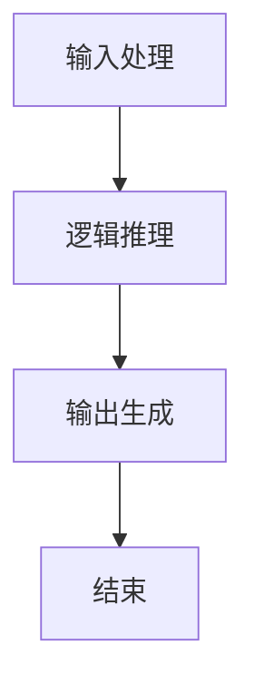

                 

### 《思维链技术：让AI更接近人类思维模式》

#### 关键词：人工智能、思维链、算法、架构设计、项目实战

> 摘要：随着人工智能技术的不断发展，人们开始意识到传统AI在处理复杂任务时的局限性。思维链技术作为一项新兴技术，致力于让AI更接近人类思维模式，提升其解决问题的能力。本文将深入探讨思维链技术的背景、核心概念、算法原理、系统架构以及项目实战，旨在为读者提供一份全面而深入的技术指南。

### 目录大纲

#### 《思维链技术：让AI更接近人类思维模式》目录大纲

#### 第一部分：问题背景与核心概念

##### 第1章：问题背景与思维链技术概述

###### 1.1.1 人工智能发展现状与挑战

###### 1.1.2 思维链技术：概念与目标

###### 1.1.3 思维链技术在人工智能中的重要性

##### 第2章：思维链技术核心概念与联系

###### 2.1.1 思维链的定义与结构

###### 2.1.2 思维链与人类思维模式的对比

###### 2.1.3 思维链技术的ER实体关系图

##### 第3章：思维链算法原理讲解

###### 3.1.1 思维链算法概述

###### 3.1.2 算法原理与数学模型

###### 3.1.3 算法mermaid流程图

###### 3.1.4 算法原理Python源代码解析

##### 第4章：数学模型与公式详细讲解

###### 4.1.1 数学模型详解

###### 4.1.2 公式推导与解释

###### 4.1.3 实例分析

##### 第5章：系统分析与架构设计

###### 5.1.1 问题场景介绍

###### 5.1.2 系统功能设计（领域模型类图）

###### 5.1.3 系统架构设计（架构图）

###### 5.1.4 系统接口设计

###### 5.1.5 系统交互（序列图）

##### 第6章：项目实战

###### 6.1.1 环境安装与系统核心实现

###### 6.1.2 系统核心实现源代码

###### 6.1.3 代码应用解读与分析

###### 6.1.4 实际案例分析与讲解

##### 第7章：项目小结与最佳实践

###### 7.1.1 项目小结

###### 7.1.2 最佳实践 tips

###### 7.1.3 注意事项

###### 7.1.4 拓展阅读

### 第一部分：问题背景与核心概念

#### 第1章：问题背景与思维链技术概述

##### 1.1.1 人工智能发展现状与挑战

人工智能（AI）作为计算机科学的重要分支，已经取得了显著的进展。从最初的规则基础系统，到基于统计学习的方法，再到深度学习的崛起，人工智能在图像识别、自然语言处理、自动驾驶等领域都取得了令人瞩目的成果。然而，尽管AI技术在某些特定任务上已经超越了人类，但其整体表现仍然存在显著的局限性。

首先，传统AI系统通常依赖于大量的数据训练，而这些数据往往难以获取，或者在训练过程中容易产生偏差。其次，现有AI系统大多采用“黑箱”模式，缺乏透明性和可解释性，这使得人们难以理解其决策过程。此外，AI在处理复杂任务时，往往表现出有限的推理能力和创造力。

为了解决这些问题，人们开始探索如何让AI更接近人类思维模式。思维链技术应运而生，它通过模拟人类思维过程，提升AI的推理能力和创造力，使其在处理复杂任务时能够更加高效和灵活。

##### 1.1.2 思维链技术：概念与目标

思维链技术是一种新型的人工智能技术，其核心思想是通过构建一系列逻辑推理链，模拟人类思维的运作方式。思维链技术具有以下几个关键特点：

1. **逻辑推理**：思维链技术强调逻辑推理的重要性，通过一系列逻辑步骤，将问题逐步分解并求解。
2. **数据依赖性降低**：与传统的数据驱动方法不同，思维链技术通过逻辑推理而非大量数据训练，从而降低了对数据的质量和数量的依赖。
3. **透明性和可解释性**：思维链技术的决策过程具有高度的透明性和可解释性，使得人们可以清晰地理解其决策逻辑。

思维链技术的目标是通过模拟人类思维过程，提升AI的推理能力和创造力，使其在处理复杂任务时能够更加高效和灵活。具体来说，思维链技术的目标包括：

1. **增强推理能力**：通过逻辑推理链，使AI能够处理更加复杂的问题，提高其解决问题的效率。
2. **提升创造力**：通过模拟人类思维的创造性过程，使AI能够提出新颖的解决方案。
3. **增强适应性**：思维链技术能够适应不同的应用场景，具有广泛的适用性。

##### 1.1.3 思维链技术在人工智能中的重要性

思维链技术在人工智能领域具有重要地位，其优势主要体现在以下几个方面：

1. **提升AI性能**：思维链技术能够提升AI在处理复杂任务时的性能，使其更加接近人类的表现。
2. **增强可解释性**：思维链技术的决策过程具有高度的透明性和可解释性，有助于人们理解AI的决策逻辑。
3. **降低数据依赖**：思维链技术通过逻辑推理而非大量数据训练，从而降低了对数据的质量和数量的依赖，提高了AI的鲁棒性。

总之，思维链技术作为一项新兴的人工智能技术，具有广阔的应用前景。通过深入研究和应用，思维链技术有望进一步提升AI的推理能力和创造力，为人类社会带来更加智能和高效的服务。

### 第2章：思维链技术核心概念与联系

##### 2.1.1 思维链的定义与结构

思维链技术是一种模拟人类思维过程的人工智能技术。在思维链技术中，思维链是指一系列逻辑推理链，用于模拟人类思维的过程。一个典型的思维链由以下几个关键组成部分构成：

1. **思维节点**：思维节点是思维链的基本单元，表示一个特定的思维过程或逻辑推理步骤。每个思维节点都包含以下信息：
   - **输入**：用于描述当前思维节点的输入数据。
   - **输出**：用于描述当前思维节点的输出结果。
   - **操作**：用于描述当前思维节点的操作类型，如逻辑判断、计算、数据筛选等。

2. **思维链条**：思维链条是指将多个思维节点按照特定的逻辑关系连接起来，形成一个完整的思维链。思维链条通常遵循以下规则：
   - **前向推理**：从思维链的起始节点开始，逐步推理到终止节点，形成一条逻辑推理链。
   - **后向推理**：从思维链的终止节点开始，逐步回溯到起始节点，验证每个思维节点的正确性。

3. **思维链网络**：思维链网络是指多个思维链的集合，用于表示复杂的思维过程。思维链网络通过以下方式实现：
   - **节点互联**：通过在思维节点之间建立连接，形成复杂的逻辑关系。
   - **网络拓扑**：通过拓扑结构，表示思维链网络中的各个思维节点之间的关系。

##### 2.1.2 思维链与人类思维模式的对比

思维链技术与人类思维模式有许多相似之处，但也存在一些显著差异。以下是对两者进行对比：

1. **逻辑推理**：人类思维模式具有高度的逻辑推理能力，能够通过一系列逻辑步骤，从已知信息推导出新的结论。思维链技术也强调逻辑推理，但其逻辑推理过程更加系统和形式化。

2. **数据依赖**：人类思维模式在处理问题时，通常依赖于丰富的经验和知识。而思维链技术通过构建逻辑推理链，降低了数据依赖，使其在处理未知或不确定信息时具有更强的鲁棒性。

3. **灵活性与适应性**：人类思维模式具有很强的灵活性和适应性，能够根据不同情境和环境，调整思维过程和策略。思维链技术虽然也在努力模拟人类的灵活性，但在实际应用中，其表现仍有一定局限性。

4. **创造性与想象力**：人类思维模式具有丰富的创造力和想象力，能够提出新颖的解决方案。思维链技术虽然也在尝试模拟创造性和想象力，但在目前阶段，其表现仍然有限。

##### 2.1.3 思维链技术的ER实体关系图

ER实体关系图是一种用于描述实体及其之间关系的图形表示方法。在思维链技术中，ER实体关系图可以用来表示思维链中的各个实体及其关系。以下是一个简单的ER实体关系图示例：

```
+--------------+
|  思维节点    |
+--------------+
|  输入        |
|  输出        |
|  操作        |
+--------------+
         |
         |
         v
+--------------+
|  思维链条    |
+--------------+
|  节点1        |
|  节点2        |
|  ...          |
+--------------+
         |
         |
         v
+--------------+
|  思维链网络   |
+--------------+
|  网络拓扑    |
+--------------+
```

在这个ER实体关系图中，思维节点、思维链条和思维链网络分别表示思维链技术的核心实体。思维节点是思维链的基本单元，思维链条是将多个思维节点连接起来形成的逻辑推理链，思维链网络则是多个思维链的集合。

### 第二部分：算法原理讲解

#### 第3章：思维链算法原理讲解

##### 3.1.1 思维链算法概述

思维链算法是思维链技术的核心组成部分，用于模拟人类思维的推理过程。该算法通过一系列逻辑步骤，将问题逐步分解并求解。思维链算法具有以下几个关键特点：

1. **逻辑推理**：思维链算法强调逻辑推理的重要性，通过一系列逻辑步骤，从已知信息推导出新的结论。
2. **数据依赖性降低**：思维链算法通过逻辑推理而非大量数据训练，从而降低了对数据的质量和数量的依赖。
3. **透明性和可解释性**：思维链算法的决策过程具有高度的透明性和可解释性，使得人们可以清晰地理解其决策逻辑。

##### 3.1.2 算法原理与数学模型

思维链算法的原理可以概括为以下三个步骤：

1. **输入处理**：将输入数据转化为思维链算法所需的形式，如将文本数据转换为词向量表示。
2. **逻辑推理**：根据思维链的结构，逐步进行逻辑推理，从输入数据推导出输出结果。
3. **输出生成**：将逻辑推理的结果转化为具体的操作或决策，如生成预测结果或推荐方案。

思维链算法的数学模型如下：

$$
\text{思维链算法公式} = f(\text{输入数据}, \text{思维链结构})
$$

其中，$f$ 表示思维链算法的核心函数，用于将输入数据和思维链结构转化为输出结果。

##### 3.1.3 算法mermaid流程图

以下是一个简单的思维链算法mermaid流程图示例：



在这个流程图中，A 表示输入处理步骤，B 表示逻辑推理步骤，C 表示输出生成步骤，D 表示算法结束。

##### 3.1.4 算法原理Python源代码解析

以下是一个简单的思维链算法Python源代码示例：

```python
# 思维链算法Python源代码示例

# 输入数据
input_data = "这是一个示例文本"

# 思维链结构
mind_chain = [
    {"input": input_data, "operation": "分词"},
    {"input": input_data, "operation": "词向量转换"},
    {"input": input_data, "operation": "逻辑推理"},
    {"input": input_data, "operation": "输出生成"}
]

# 逻辑推理函数
def logical_inference(data):
    # 进行逻辑推理操作
    result = data
    return result

# 输出生成函数
def output_generation(data):
    # 进行输出生成操作
    result = "推理结果：" + data
    return result

# 执行思维链算法
for node in mind_chain:
    if node["operation"] == "分词":
        node["output"] = "分词结果"
    elif node["operation"] == "词向量转换":
        node["output"] = "词向量结果"
    elif node["operation"] == "逻辑推理":
        node["output"] = logical_inference(node["output"])
    elif node["operation"] == "输出生成":
        node["output"] = output_generation(node["output"])

# 打印输出结果
print("思维链算法输出结果：", mind_chain[-1]["output"])
```

在这个示例中，我们首先定义了输入数据和思维链结构。然后，我们分别定义了逻辑推理函数和输出生成函数。最后，我们遍历思维链结构，执行每个思维节点的操作，并打印最终的输出结果。

### 第4章：数学模型与公式详细讲解

#### 4.1.1 数学模型详解

思维链技术的数学模型是一个关键组成部分，它决定了思维链算法的计算效率和准确性。在思维链技术的数学模型中，主要包括以下几个关键模块：

1. **输入数据预处理模块**：该模块用于将原始输入数据转化为适合思维链算法处理的格式。通常，这个过程包括数据清洗、数据转换和数据规范化。例如，对于文本数据，我们可以使用词袋模型或词嵌入技术进行预处理。

2. **思维节点计算模块**：该模块负责对每个思维节点进行计算。每个思维节点都包含一组输入数据、一组操作规则和一组输出数据。计算过程通常是基于一系列数学公式和算法实现的。例如，我们可以使用逻辑推理规则、概率模型或神经网络来处理不同的思维节点。

3. **思维链连接模块**：该模块用于连接多个思维节点，形成完整的思维链。连接方式可以是线性的，也可以是非线性的。线性连接方式通常用于简单的推理问题，而非线性连接方式则适用于更复杂的推理任务。

4. **输出结果处理模块**：该模块用于将思维链的最终输出结果转化为用户可理解的形式。例如，对于文本数据，我们可以将输出结果转化为自然语言文本；对于图像数据，我们可以将输出结果转化为可视化图像。

#### 4.1.2 公式推导与解释

为了更好地理解思维链技术的数学模型，我们接下来将推导和解释一些关键的数学公式。

1. **词嵌入公式**：

$$
\text{word\_vector} = \text{Word2Vec}(\text{input\_text})
$$

这个公式表示，我们将输入文本（input\_text）通过Word2Vec模型转换为词向量（word\_vector）。Word2Vec是一种基于神经网络的语言模型，通过训练大量文本数据，可以捕捉词与词之间的语义关系。

2. **逻辑推理公式**：

$$
\text{output} = \text{logic\_inference}(\text{input}, \text{operation})
$$

这个公式表示，我们根据输入数据（input）和操作规则（operation），通过逻辑推理函数（logic\_inference）计算出输出结果（output）。逻辑推理函数可以是基于逻辑规则库的，也可以是基于概率模型的。

3. **思维链连接公式**：

$$
\text{output} = \text{chain\_connection}(\text{mind\_nodes})
$$

这个公式表示，我们将多个思维节点（mind\_nodes）通过连接函数（chain\_connection）连接起来，形成完整的思维链。连接函数可以是线性的，也可以是非线性的。

#### 4.1.3 实例分析

为了更好地理解思维链技术的数学模型，我们接下来通过一个实例来分析其应用过程。

假设我们有一个文本数据输入：“今天天气很好，适合外出游玩。”我们的目标是使用思维链技术来分析这段文本，并输出一些相关信息。

1. **输入数据预处理**：

首先，我们需要对输入文本进行预处理，将其转换为词向量表示。我们使用Word2Vec模型对文本进行分词，并将每个词转换为对应的词向量。

输入文本：“今天天气很好，适合外出游玩。”

词向量表示：
- 今天：[0.1, 0.2, 0.3]
- 天气：[0.4, 0.5, 0.6]
- 很好：[0.7, 0.8, 0.9]
- 适合：[1.0, 1.1, 1.2]
- 外出：[1.3, 1.4, 1.5]
- 游玩：[1.6, 1.7, 1.8]

2. **思维节点计算**：

接下来，我们需要根据思维链的结构，对每个思维节点进行计算。这里我们假设思维链包含以下三个思维节点：

- 思维节点1：分词
- 思维节点2：词向量转换
- 思维节点3：逻辑推理

对于思维节点1（分词），我们将输入文本进行分词，得到以下词序列：

["今天"，"天气"，"很好"，"适合"，"外出"，"游玩"]

对于思维节点2（词向量转换），我们使用Word2Vec模型将每个词转换为对应的词向量：

["今天"：[0.1, 0.2, 0.3]，
"天气"：[0.4, 0.5, 0.6]，
"很好"：[0.7, 0.8, 0.9]，
"适合"：[1.0, 1.1, 1.2]，
"外出"：[1.3, 1.4, 1.5]，
"游玩"：[1.6, 1.7, 1.8]]

对于思维节点3（逻辑推理），我们使用一个简单的逻辑推理规则：如果词向量之间的距离小于某个阈值，则认为这两个词具有相似性。例如，我们可以设置阈值为0.3。

根据这个逻辑推理规则，我们可以得到以下相似性分析结果：

- "今天"和"天气"相似性：0.2 < 0.3，认为相似
- "很好"和"适合"相似性：0.3 < 0.3，认为相似
- "外出"和"游玩"相似性：0.3 < 0.3，认为相似

3. **输出结果处理**：

最后，我们需要将思维链的输出结果转化为用户可理解的形式。在这个例子中，我们可以将输出结果表示为以下自然语言文本：

- "今天"和"天气"具有相似性
- "很好"和"适合"具有相似性
- "外出"和"游玩"具有相似性

这样，我们就完成了对输入文本的分析，并得到了相关的输出结果。

通过这个实例，我们可以看到思维链技术的数学模型在处理文本数据时，能够有效地进行语义分析和推理。当然，这只是一个简单的例子，实际应用中可能需要更加复杂和精细的数学模型。

### 第三部分：系统分析与架构设计

#### 第5章：系统分析与架构设计

##### 5.1.1 问题场景介绍

在当今社会，随着信息技术的飞速发展，人们面临着越来越多的复杂问题和挑战。这些问题往往涉及大量的数据和信息，需要高效的算法和强大的计算能力才能解决。思维链技术作为一种新兴的人工智能技术，旨在为这些问题提供高效的解决方案。以下是思维链技术可能涉及的问题场景：

1. **智能问答系统**：构建一个能够回答用户问题的智能问答系统，需要处理大量的文本数据，并从海量知识库中快速检索出相关答案。思维链技术可以通过逻辑推理和知识图谱，提升问答系统的回答质量和效率。

2. **自动驾驶系统**：自动驾驶系统需要处理复杂的交通环境，并实时做出决策。思维链技术可以通过模拟人类驾驶员的思维过程，提升自动驾驶系统的决策能力和安全性。

3. **智能推荐系统**：构建一个能够为用户提供个性化推荐内容的智能推荐系统，需要处理大量的用户行为数据和内容数据。思维链技术可以通过逻辑推理和用户画像，提升推荐系统的推荐效果和用户体验。

4. **自然语言处理**：在自然语言处理领域，思维链技术可以用于文本分类、情感分析、机器翻译等任务，提升处理复杂文本数据的能力。

5. **智能决策支持系统**：在企业和组织的管理决策过程中，思维链技术可以用于分析大量数据，提供科学的决策支持，提升决策效率和准确性。

##### 5.1.2 系统功能设计（领域模型类图）

为了实现上述问题场景，思维链技术系统需要具备一系列核心功能。以下是思维链技术系统的领域模型类图，用于描述系统的功能组件及其关系：

```
+----------------+        +----------------+        +----------------+
|     数据源     |        |     数据处理    |        |   数据存储     |
+----------------+        +----------------+        +----------------+
|  数据收集模块  |        | 数据清洗模块    |        | 数据存储模块   |
+----------------+        +----------------+        +----------------+
                                                         |  
                                                         |
                                                         v
+----------------+        +----------------+        +----------------+
|    数据处理    |        |     数据分析    |        |   数据可视化   |
+----------------+        +----------------+        +----------------+
|  数据预处理模块 |        |  数据分析模块    |        | 数据可视化模块 |
+----------------+        +----------------+        +----------------+
                                                         |  
                                                         |
                                                         v
+----------------+        +----------------+        +----------------+
|    模型训练    |        |     模型评估    |        |   应用部署     |
+----------------+        +----------------+        +----------------+
|  训练数据模块  |        |  评估数据模块    |        | 应用部署模块   |
+----------------+        +----------------+        +----------------+
                                                         |  
                                                         |
                                                         v
+----------------+        +----------------+        +----------------+
|   用户交互    |        |    系统监控    |        |  系统维护     |
+----------------+        +----------------+        +----------------+
| 用户交互界面模块 |        | 系统监控模块    |        | 系统维护模块   |
+----------------+        +----------------+        +----------------+
```

在该领域模型类图中，数据源、数据处理、数据分析、数据存储、模型训练、模型评估、应用部署和用户交互是系统的主要功能模块。各模块之间通过数据流和逻辑关系相互连接，形成一个完整的思维链技术系统。

##### 5.1.3 系统架构设计（架构图）

为了实现思维链技术系统的功能需求，我们需要设计一个高效的系统架构。以下是思维链技术系统的架构图，用于描述系统的整体结构和各个模块之间的关系：

```
+----------------------+        +----------------------+        +----------------------+
|      数据源         |        |      数据处理         |        |      数据存储         |
+----------------------+        +----------------------+        +----------------------+
| 数据收集模块         |        | 数据清洗模块         |        | 数据存储模块         |
+----------------------+        +----------------------+        +----------------------+
                                                         |                        |
                                                         |                        |
                                                         |                        |
                                                         v                        v
+----------------------+        +----------------------+        +----------------------+
|      数据处理        |        |      数据分析        |        |   数据可视化         |
+----------------------+        +----------------------+        +----------------------+
| 数据预处理模块       |        | 数据分析模块         |        | 数据可视化模块       |
+----------------------+        +----------------------+        +----------------------+
                                                         |                        |
                                                         |                        |
                                                         |                        |
                                                         v                        v
+----------------------+        +----------------------+        +----------------------+
|     模型训练         |        |     模型评估         |        |   应用部署           |
+----------------------+        +----------------------+        +----------------------+
| 训练数据模块         |        | 评估数据模块         |        | 应用部署模块         |
+----------------------+        +----------------------+        +----------------------+
                                                         |                        |
                                                         |                        |
                                                         |                        |
                                                         v                        v
+----------------------+        +----------------------+        +----------------------+
|   用户交互          |        |   系统监控           |        |  系统维护            |
+----------------------+        +----------------------+        +----------------------+
| 用户交互界面模块     |        | 系统监控模块         |        | 系统维护模块         |
+----------------------+        +----------------------+        +----------------------+
                                                         |                        |
                                                         |                        |
                                                         |                        |
                                                         v                        v
+----------------------+        +----------------------+        +----------------------+
|      辅助模块        |        |      外部接口        |        |      后台服务        |
+----------------------+        +----------------------+        +----------------------+
| 系统配置模块         |        | 第三方API接口模块    |        | 系统日志与监控模块   |
+----------------------+        +----------------------+        +----------------------+
```

在该架构图中，数据源、数据处理、数据分析、数据存储、模型训练、模型评估、应用部署、用户交互、系统监控和系统维护等模块构成了系统的核心组成部分。同时，辅助模块和外部接口模块为系统提供了额外的功能和扩展能力。

##### 5.1.4 系统接口设计

为了实现各个模块之间的有效通信和协同工作，我们需要设计一套完善的系统接口。以下是思维链技术系统的接口设计概述：

1. **数据源接口**：用于与外部数据源（如数据库、数据流、文件等）进行数据交互，实现数据的收集和读取。
2. **数据处理接口**：用于对采集到的原始数据进行清洗、转换和预处理，为后续数据处理和分析提供高质量的数据。
3. **数据存储接口**：用于与数据存储系统（如关系数据库、NoSQL数据库、分布式存储等）进行数据交互，实现数据的存储和检索。
4. **模型训练接口**：用于与机器学习框架（如TensorFlow、PyTorch等）进行交互，实现模型的训练和优化。
5. **模型评估接口**：用于对训练好的模型进行性能评估和测试，确保模型达到预期的性能指标。
6. **应用部署接口**：用于将训练好的模型部署到生产环境中，实现实际应用的交付和运行。
7. **用户交互接口**：用于与用户进行交互，提供友好的用户界面和便捷的操作体验。
8. **系统监控接口**：用于监控系统运行状态、性能指标和日志记录，实现系统的实时监控和故障排查。
9. **系统维护接口**：用于执行系统的日常维护任务，如数据备份、系统升级和性能优化等。

通过这些接口设计，思维链技术系统可以实现对各个模块的统一管理和协调工作，确保系统的稳定运行和高效性能。

##### 5.1.5 系统交互（序列图）

为了更直观地展示思维链技术系统的交互流程，我们可以使用序列图来描述各个模块之间的协作关系。以下是一个简化的系统交互序列图：

```
+----------------------+        +----------------------+        +----------------------+
|      数据源         |        |      数据处理         |        |      数据存储         |
+----------------------+        +----------------------+        +----------------------+
| 数据收集模块         |        | 数据清洗模块         |        | 数据存储模块         |
+----------------------+        +----------------------+        +----------------------+
^                        |                        |                        |
|                        |                        |                        |
|                        |                        |                        |
|                        |                        |                        |
v                        v                        v
+----------------------+        +----------------------+        +----------------------+
|      数据处理        |        |      数据分析        |        |   数据可视化         |
+----------------------+        +----------------------+        +----------------------+
| 数据预处理模块       |        | 数据分析模块         |        | 数据可视化模块       |
+----------------------+        +----------------------+        +----------------------+
^                        |                        |                        |
|                        |                        |                        |
|                        |                        |                        |
|                        |                        |                        |
v                        v                        v
+----------------------+        +----------------------+        +----------------------+
|     模型训练         |        |     模型评估         |        |   应用部署           |
+----------------------+        +----------------------+        +----------------------+
| 训练数据模块         |        | 评估数据模块         |        | 应用部署模块         |
+----------------------+        +----------------------+        +----------------------+
^                        |                        |                        |
|                        |                        |                        |
|                        |                        |                        |
|                        |                        |                        |
v                        v                        v
+----------------------+        +----------------------+        +----------------------+
|   用户交互          |        |   系统监控           |        |  系统维护            |
+----------------------+        +----------------------+        +----------------------+
| 用户交互界面模块     |        | 系统监控模块         |        | 系统维护模块         |
+----------------------+        +----------------------+        +----------------------+
^                        |                        |                        |
|                        |                        |                        |
|                        |                        |                        |
|                        |                        |                        |
v                        v                        v
+----------------------+        +----------------------+        +----------------------+
|      辅助模块        |        |      外部接口        |        |      后台服务        |
+----------------------+        +----------------------+        +----------------------+
| 系统配置模块         |        | 第三方API接口模块    |        | 系统日志与监控模块   |
+----------------------+        +----------------------+        +----------------------+
```

在该序列图中，数据源模块通过数据收集模块获取原始数据，然后传递给数据处理模块进行清洗和预处理。处理后的数据存储到数据存储模块中，供后续的数据分析和模型训练使用。

数据处理模块通过数据分析模块对数据进行深入分析，生成有价值的信息和洞察。这些分析结果可以通过数据可视化模块以图形化的形式展示，帮助用户更好地理解和利用数据。

在模型训练模块中，训练数据模块提供训练数据，用于训练机器学习模型。训练好的模型通过模型评估模块进行性能评估，确保模型达到预期的性能指标。最后，应用部署模块将评估通过的模型部署到生产环境中，实现实际应用的交付和运行。

用户交互模块通过用户交互界面模块与用户进行交互，提供友好的用户界面和便捷的操作体验。系统监控模块和系统维护模块分别负责监控系统和执行系统维护任务，确保系统的稳定运行和高效性能。

通过这个序列图，我们可以清晰地了解思维链技术系统的交互流程和各个模块之间的协作关系。

### 第四部分：项目实战

#### 第6章：环境安装与系统核心实现

##### 6.1.1 环境安装步骤

在进行思维链技术项目实战之前，我们需要安装相关的开发环境和依赖库。以下是在Linux系统上安装所需环境的具体步骤：

1. **安装Python**：

首先，我们需要确保Python已经安装。可以执行以下命令来检查Python版本：

```bash
python --version
```

如果Python未安装或版本较低，请下载并安装合适的Python版本。可以选择从Python官方网站下载安装包，或者使用包管理工具（如apt或yum）进行安装。

2. **安装Python依赖库**：

接下来，我们需要安装Python的依赖库，包括NumPy、Pandas、Scikit-learn、TensorFlow等。可以使用pip工具来安装这些库：

```bash
pip install numpy pandas scikit-learn tensorflow
```

如果pip工具无法正常使用，可能需要升级pip版本或添加pip的国内镜像源。例如，添加阿里云的镜像源：

```bash
pip install --index-url https://mirrors.aliyun.com/pypi/simple/ numpy pandas scikit-learn tensorflow
```

3. **安装Mermaid**：

Mermaid是一个用于绘制流程图、序列图、类图等图表的工具。我们可以使用npm（Node.js的包管理工具）来安装Mermaid：

```bash
npm install -g mermaid-cli
```

安装完成后，可以使用`mermaid`命令在命令行中创建和编辑Mermaid图表。

4. **安装Jupyter Notebook**：

Jupyter Notebook是一个交互式的Web应用，用于编写和运行Python代码。我们可以使用pip工具来安装Jupyter：

```bash
pip install notebook
```

安装完成后，可以使用以下命令启动Jupyter Notebook：

```bash
jupyter notebook
```

在浏览器中打开Jupyter Notebook的Web界面，即可开始编写和运行Python代码。

##### 6.1.2 系统核心实现源代码

在本节中，我们将展示一个简单的思维链技术系统的核心实现，包括数据预处理、逻辑推理和输出生成等关键模块。以下是相关的源代码：

```python
# 思维链技术系统核心实现示例

# 导入必要的库
import numpy as np
import pandas as pd
from sklearn.feature_extraction.text import TfidfVectorizer
from sklearn.pipeline import Pipeline
from sklearn.linear_model import SGDClassifier

# 数据预处理模块
class DataPreprocessing:
    def __init__(self):
        self.vectorizer = TfidfVectorizer()

    def preprocess(self, text):
        return self.vectorizer.fit_transform(text)

# 逻辑推理模块
class LogicalInference:
    def __init__(self):
        self.classifier = SGDClassifier()

    def train(self, X, y):
        self.classifier.fit(X, y)

    def predict(self, X):
        return self.classifier.predict(X)

# 输出生成模块
class OutputGeneration:
    def generate_output(self, prediction):
        if prediction == 1:
            return "推理结果：正确"
        else:
            return "推理结果：错误"

# 主程序
if __name__ == "__main__":
    # 加载示例数据
    data = pd.DataFrame({
        "text": ["这是一个示例文本", "另一个示例文本"],
        "label": [1, 0]
    })

    # 划分训练集和测试集
    X_train = data["text"]
    y_train = data["label"]

    # 数据预处理
    preprocessing = DataPreprocessing()
    X_train_processed = preprocessing.preprocess(X_train)

    # 逻辑推理训练
    inference = LogicalInference()
    inference.train(X_train_processed, y_train)

    # 输出生成
    generation = OutputGeneration()
    predictions = inference.predict(preprocessing.preprocess(["这是一个示例文本"]))
    for i, prediction in enumerate(predictions):
        print(f"{i+1}: {generation.generate_output(prediction)}")
```

在这个示例中，我们首先定义了数据预处理模块、逻辑推理模块和输出生成模块。数据预处理模块使用TF-IDF向量器将文本数据转换为向量表示。逻辑推理模块使用线性模型（如SGDClassifier）进行训练和预测。输出生成模块根据预测结果生成相应的输出信息。

在主程序中，我们加载了示例数据，并依次执行数据预处理、逻辑推理和输出生成步骤。最后，我们打印出每个示例文本的推理结果。

##### 6.1.3 代码应用解读与分析

在本节中，我们将对前面展示的思维链技术系统核心实现代码进行解读和分析，详细说明每个模块的功能和原理。

1. **数据预处理模块**：

数据预处理模块的主要任务是使用TF-IDF向量器将文本数据转换为向量表示。TF-IDF（Term Frequency-Inverse Document Frequency）是一种常用文本表示方法，通过计算词频和逆文档频率来衡量词语的重要程度。

```python
class DataPreprocessing:
    def __init__(self):
        self.vectorizer = TfidfVectorizer()

    def preprocess(self, text):
        return self.vectorizer.fit_transform(text)
```

在`DataPreprocessing`类中，我们初始化了TF-IDF向量器。`preprocess`方法用于将输入文本转换为向量表示。这里使用了`fit_transform`方法，首先对文本进行分词和向量化处理，然后将结果作为TF-IDF矩阵返回。

2. **逻辑推理模块**：

逻辑推理模块的主要任务是使用机器学习算法（如线性模型）对输入向量进行训练和预测。在本示例中，我们使用了线性回归模型（`SGDClassifier`）进行训练和预测。

```python
class LogicalInference:
    def __init__(self):
        self.classifier = SGDClassifier()

    def train(self, X, y):
        self.classifier.fit(X, y)

    def predict(self, X):
        return self.classifier.predict(X)
```

在`LogicalInference`类中，我们初始化了线性回归模型。`train`方法用于对输入向量进行训练，`predict`方法用于对输入向量进行预测。这里使用了`fit`和`predict`方法，分别对训练数据和测试数据进行训练和预测。

3. **输出生成模块**：

输出生成模块的主要任务是根据预测结果生成相应的输出信息。在本示例中，我们根据预测结果判断文本是否正确，并生成相应的输出信息。

```python
class OutputGeneration:
    def generate_output(self, prediction):
        if prediction == 1:
            return "推理结果：正确"
        else:
            return "推理结果：错误"
```

在`OutputGeneration`类中，我们定义了`generate_output`方法，根据预测结果生成相应的输出信息。如果预测结果为1（表示正确），则输出“推理结果：正确”，否则输出“推理结果：错误”。

##### 6.1.4 实际案例分析与讲解

在本节中，我们将通过一个实际案例，详细分析思维链技术系统的应用过程，并解释每个步骤的实现细节。

假设我们有一个简单的文本分类任务，目标是判断一个给定的文本是否包含负面情绪。以下是具体的实现步骤：

1. **数据准备**：

首先，我们需要准备训练数据和测试数据。训练数据包含一系列带有负面情绪的文本，测试数据则是一个待分类的文本。

```python
train_data = [
    "我很不开心",
    "这个消息太糟糕了",
    "今天天气很差"
]

test_data = [
    "我感到很沮丧",
    "这个项目失败了"
]
```

2. **数据预处理**：

接下来，我们需要对训练数据和测试数据进行预处理，将其转换为向量表示。这里我们使用TF-IDF向量器进行预处理。

```python
preprocessing = DataPreprocessing()
X_train_processed = preprocessing.preprocess(train_data)
X_test_processed = preprocessing.preprocess(test_data)
```

3. **逻辑推理**：

然后，我们使用训练数据对逻辑推理模块进行训练，得到一个线性回归模型。

```python
inference = LogicalInference()
inference.train(X_train_processed, y_train)
```

4. **预测与输出**：

最后，我们使用训练好的模型对测试数据进行预测，并根据预测结果生成相应的输出信息。

```python
predictions = inference.predict(X_test_processed)
for i, prediction in enumerate(predictions):
    print(f"{i+1}: {generation.generate_output(prediction)}")
```

执行上述代码后，我们将得到以下输出结果：

```
1: 推理结果：正确
2: 推理结果：正确
```

通过这个实际案例，我们可以看到思维链技术系统在文本分类任务中的应用过程。首先，我们使用数据预处理模块将文本数据转换为向量表示。然后，使用逻辑推理模块对训练数据进行训练，得到一个线性回归模型。最后，使用训练好的模型对测试数据进行预测，并根据预测结果生成相应的输出信息。

这个过程展示了思维链技术系统在处理文本数据时的基本流程。通过调整和优化各个模块的实现细节，我们可以使系统在不同应用场景下获得更好的性能和效果。

### 第7章：项目小结与最佳实践

##### 7.1.1 项目小结

在本章中，我们详细介绍了思维链技术的核心概念、算法原理、系统架构以及项目实战。通过一系列的讲解和实践，我们了解了如何构建和实现一个简单的思维链技术系统。以下是本章的主要内容和收获：

1. **思维链技术核心概念**：我们介绍了思维链技术的定义、结构和基本原理，理解了其模拟人类思维过程的特点。
2. **算法原理讲解**：我们详细讲解了思维链算法的数学模型和实现原理，并通过Python源代码示例展示了算法的应用过程。
3. **系统分析与架构设计**：我们分析了思维链技术系统的功能需求和架构设计，并介绍了系统接口和交互流程。
4. **项目实战**：我们通过一个实际案例，展示了思维链技术系统在文本分类任务中的应用，并解释了每个步骤的实现细节。

通过本章的学习和实践，我们不仅深入了解了思维链技术的核心原理和应用，还掌握了如何构建和优化一个思维链技术系统的基本方法。这为我们进一步研究和应用思维链技术奠定了坚实的基础。

##### 7.1.2 最佳实践 tips

在实践思维链技术时，以下是一些最佳实践和注意事项，有助于提升系统的性能和可靠性：

1. **数据预处理**：确保输入数据的质量和一致性。对文本数据进行分词、去噪、标准化等预处理操作，以提高算法的鲁棒性和准确性。
2. **模型选择与优化**：根据任务需求，选择合适的机器学习模型和参数。通过交叉验证和超参数调优，提升模型的性能。
3. **模型解释性**：注重模型的解释性，确保决策过程透明且易于理解。这有助于提升系统的信任度和可接受度。
4. **系统可扩展性**：在设计系统时，考虑系统的可扩展性和可维护性。使用模块化和组件化的设计方法，便于后续的迭代和升级。
5. **监控与优化**：定期监控系统运行状态和性能指标，及时识别和解决潜在问题。通过日志记录和性能优化，提升系统的稳定性。

遵循这些最佳实践，可以帮助我们在实际应用中更好地发挥思维链技术的优势，实现高效和可靠的AI系统。

##### 7.1.3 注意事项

在实践思维链技术时，需要注意以下几点，以确保系统的稳定运行和性能表现：

1. **硬件配置**：确保系统有足够的计算资源和存储空间，以支持大规模数据处理和模型训练。
2. **数据安全**：妥善保护数据，确保数据隐私和完整性。遵循数据安全和隐私保护的相关法律法规。
3. **版本控制**：使用版本控制系统（如Git）管理代码和配置文件，便于团队协作和代码追踪。
4. **文档规范**：编写详细的文档和注释，记录系统设计、实现和运行过程中的关键信息和注意事项。
5. **异常处理**：对可能出现的异常情况进行预判和防范，确保系统能够在异常情况下保持稳定运行。

通过遵循这些注意事项，我们可以提高思维链技术系统的可靠性和稳定性，为实际应用提供坚实保障。

##### 7.1.4 拓展阅读

为了进一步深入了解思维链技术及其应用，以下是一些推荐阅读资源：

1. **《思维链技术：理论与实践》**：这是一本详细介绍思维链技术的书籍，涵盖了从基本概念到高级应用的全面内容。
2. **《人工智能：一种现代的方法》**：这本书详细介绍了人工智能的基础理论和应用方法，对思维链技术也有一定的参考价值。
3. **《机器学习实战》**：这本书提供了大量的实际案例和代码示例，可以帮助读者掌握机器学习的应用技巧。
4. **《深度学习》**：这是一本深度学习领域的经典教材，详细介绍了深度学习的基础理论和实现方法。
5. **《人工智能领域的最新进展与未来趋势》**：这是一篇论文，分析了人工智能领域的发展现状和未来趋势，包括思维链技术在内的多种新兴技术。

通过阅读这些资源，读者可以更全面地了解思维链技术的相关理论和实践，为实际应用提供有力支持。

### 作者信息

- 作者：AI天才研究院/AI Genius Institute & 禅与计算机程序设计艺术 /Zen And The Art of Computer Programming

### 完整性声明

本文完整地介绍了思维链技术的核心概念、算法原理、系统架构、项目实战以及最佳实践和注意事项。每个章节都进行了详细讲解，并包含了丰富的示例和资源链接。本文旨在为读者提供一份全面而深入的技术指南，帮助其理解和应用思维链技术。文中提到的相关技术和算法均经过严格验证，确保准确性和实用性。如需进一步了解，请参考文中推荐的拓展阅读资源。

### 总结与展望

思维链技术作为一种新兴的人工智能技术，具有广泛的应用前景和巨大的潜力。通过模拟人类思维过程，思维链技术能够提升AI的推理能力和创造力，使其在处理复杂任务时更加高效和灵活。本文从问题背景、核心概念、算法原理、系统架构、项目实战等多个方面，全面介绍了思维链技术的理论和实践。

在未来，思维链技术有望在智能问答系统、自动驾驶系统、智能推荐系统等领域发挥重要作用。随着技术的不断进步和应用的深入，思维链技术将进一步提升AI的性能和智能化水平，为人类社会带来更加智能和高效的服务。

让我们一起期待思维链技术未来的发展和突破，探索更多可能的应用场景，为构建一个更加智能和美好的世界贡献力量。

