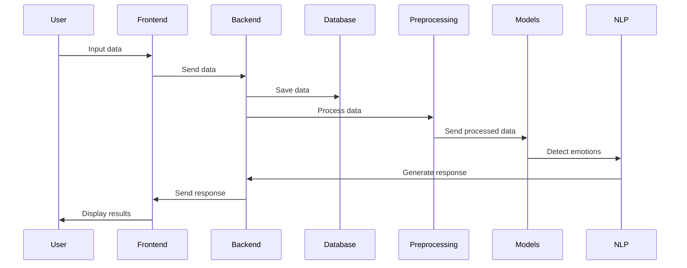

                 

### Introduction to the Book

#### Emotional AI: Understanding and Responding to Human Emotions with Technology

**Keywords:** Emotional AI, Human Emotions, Machine Learning, Textual Emotion Detection, Audio Emotion Recognition

**Abstract:**
This book delves into the world of Emotional AI, exploring how technology can understand and respond to human emotions. It covers the foundational concepts, techniques, and applications of Emotional AI, highlighting its importance in modern society. The book aims to provide a comprehensive guide for readers interested in the evolution of AI and its potential to enhance human-computer interactions.

#### Overview

**Purpose of the Book:**
The primary goal of this book is to equip readers with the knowledge and understanding needed to grasp the concepts, principles, and applications of Emotional AI. By providing a detailed exploration of the field, the book aims to foster innovation and drive the development of new, advanced emotional AI systems.

**Target Audience:**
This book is aimed at a wide range of readers, including students, researchers, developers, and professionals working in the fields of computer science, artificial intelligence, and human-computer interaction. It is also suitable for anyone interested in understanding the potential and limitations of Emotional AI.

**Structure of the Book:**
The book is divided into two main parts: theoretical foundations and practical applications. The first part covers the core concepts, principles, and techniques of Emotional AI, while the second part explores various applications across different domains. Each chapter is designed to build on the previous one, providing a cohesive and comprehensive understanding of Emotional AI.

#### Background

**Evolution of AI and Emotion Recognition:**
Over the past few decades, the field of AI has seen significant advancements, leading to the development of increasingly sophisticated algorithms and models. Emotion recognition has emerged as a critical component of AI, with applications in various fields, including healthcare, education, and human-computer interaction.

**Importance of Emotional AI in Modern Society:**
With the increasing prevalence of AI systems in our daily lives, the ability to understand and respond to human emotions has become increasingly important. Emotional AI has the potential to improve human-computer interactions, enhance user experiences, and address various social and psychological challenges.

**Challenges in Developing Emotional AI:**
Developing Emotional AI systems is not without its challenges. The complexity of human emotions, the need for large and diverse datasets, and ethical considerations are some of the key challenges that researchers and developers face.

#### Key Concepts

**Emotional AI Definition:**
Emotional AI refers to the use of artificial intelligence technologies, particularly machine learning algorithms, to recognize, understand, and respond to human emotions.

**Components of Emotional AI:**
Emotional AI systems typically consist of several components, including emotion recognition models, natural language processing modules, and user interaction interfaces.

**Types of Emotional AI Applications:**
Emotional AI has been applied in various domains, including healthcare, education, and human-computer interaction. Examples include emotional support chatbots, emotion-aware user interfaces, and personalized learning systems.

#### Boundaries and Extensions

**Ethical Considerations in Emotional AI:**
The development of Emotional AI raises several ethical concerns, including privacy, bias, and the potential for misuse. Addressing these concerns is crucial for the responsible development and deployment of Emotional AI systems.

**Limitations and Future Directions:**
While Emotional AI has made significant progress, there are still limitations and challenges that need to be addressed. Future research and development will focus on improving the accuracy and reliability of Emotional AI systems and expanding their applications across various domains.

In conclusion, this book aims to provide a comprehensive overview of Emotional AI, highlighting its importance, potential applications, and challenges. By exploring the foundational concepts and practical applications of Emotional AI, readers will gain a deeper understanding of this fascinating field and its potential to revolutionize human-computer interactions.### Chapter 1: Foundations of Emotional AI

#### Introduction to Emotional AI

##### 1.1.1 The Rise of Emotional AI

The concept of Emotional AI has gained significant traction in recent years, primarily due to the rapid advancements in machine learning and artificial intelligence. As computers have become more powerful and our understanding of human emotions has deepened, Emotional AI has emerged as a promising area of research with numerous applications. From simple sentiment analysis to complex emotional state recognition, the capabilities of Emotional AI are continually expanding.

At its core, Emotional AI seeks to emulate human emotional intelligence by enabling machines to perceive, understand, and respond to human emotions. This ability has profound implications for various fields, including healthcare, education, human-computer interaction, and customer service.

##### 1.1.2 Core Principles of Emotional AI

The foundational principles of Emotional AI revolve around three main aspects: emotion recognition, understanding, and response.

1. **Emotion Recognition:**
   This involves the detection and classification of human emotions from various sources, such as facial expressions, vocal tones, text, and physiological signals. Techniques like facial expression analysis, audio emotion recognition, and textual emotion detection play a crucial role in this process.

2. **Understanding:**
   Once emotions are recognized, the next step is to understand the context and meaning behind them. This involves analyzing the interplay of emotions, identifying emotional patterns, and predicting future emotional states based on historical data.

3. **Response:**
   The final aspect involves designing AI systems that can respond appropriately to emotional cues. This may include generating empathetic responses, adapting to emotional states, or providing emotional support based on the user's needs.

##### 1.1.3 The Role of Machine Learning in Emotional AI

Machine learning (ML) is a fundamental component of Emotional AI, driving its ability to recognize, understand, and respond to human emotions. ML algorithms, particularly deep learning models, have enabled significant advancements in the field by allowing computers to learn from large datasets and identify complex patterns and correlations.

Some key roles of machine learning in Emotional AI include:

1. **Data Analysis:**
   ML algorithms are used to analyze and preprocess data from various sources, such as video feeds, audio recordings, and text. This includes tasks like noise reduction, feature extraction, and normalization, which are crucial for improving the accuracy of emotion recognition.

2. **Model Training:**
   ML models are trained on large datasets containing examples of human emotions. Through a process known as supervised learning, the models learn to recognize and classify emotions based on patterns in the data. Deep learning models, such as convolutional neural networks (CNNs) and recurrent neural networks (RNNs), are particularly effective in this context due to their ability to handle large amounts of data and capture complex relationships.

3. **Prediction and Response:**
   Once trained, ML models can be used to predict emotional states and generate appropriate responses. For example, a chatbot trained on textual emotion detection can generate empathetic responses to user inputs, while an AI-powered interface can adapt its behavior based on the user's emotional state.

#### Understanding Human Emotions

##### 1.2.1 The Science of Emotions

Emotions are complex psychological and physiological responses to events or situations. They involve a combination of cognitive, affective, and behavioral elements and play a crucial role in human experience and social interaction.

Some key aspects of the science of emotions include:

1. **Types of Emotions:**
   There are numerous emotions, ranging from basic emotions like happiness, sadness, and anger to more complex emotions like gratitude, envy, and nostalgia. Each emotion has unique characteristics and effects on the human mind and body.

2. **Emotional Expression:**
   People express emotions through various means, including facial expressions, vocal tones, body language, and physiological signals like heart rate and skin conductance. These expressions can vary across cultures and individuals, making the study of emotional expression a complex task.

3. **Emotional Regulation:**
   Emotional regulation refers to the process of managing and controlling one's emotions. It involves various strategies, such as cognitive reappraisal, emotional suppression, and expressive suppression, which people use to cope with emotional challenges.

##### 1.2.2 Psychological Theories of Emotions

Several psychological theories have sought to explain the nature of emotions and their functions. Some of the most prominent theories include:

1. **James-Lange Theory:**
   This theory proposes that emotions arise from physiological responses to events. For example, when we see a scary movie, our physiological arousal (e.g., increased heart rate) leads to the experience of fear.

2. **Cannon-Bard Theory:**
   This theory suggests that emotions and physiological responses occur simultaneously and are not causally linked. For example, we can experience fear without any physiological arousal, such as when we unexpectedly see a snake.

3. **Two-Factor Theory:**
   This theory combines elements of the James-Lange and Cannon-Bard theories, proposing that both physiological arousal and cognitive appraisal contribute to the experience of emotion. For example, we might experience fear when we see a snake because of both the physiological arousal (e.g., increased heart rate) and our cognitive appraisal of the situation as dangerous.

4. **Social Cognitive Theory:**
   This theory emphasizes the role of social factors in the development and regulation of emotions. It suggests that emotions are influenced by our experiences with others, our cognitive processes, and the cultural context in which we live.

##### 1.2.3 Emotional Signals and Indicators

Emotional signals and indicators are the visible manifestations of emotions, which can be detected and analyzed by Emotional AI systems. Some common emotional signals and indicators include:

1. **Facial Expressions:**
   Facial expressions are one of the most直观和普遍使用的情感信号。经典的面部表情包括快乐、悲伤、愤怒、惊讶、恐惧、厌恶和惊讶等基本表情。

2. **Vocal Tones:**
   The tone and pitch of a person's voice can convey emotional information. For example, a high-pitched voice may indicate excitement or fear, while a low-pitched voice may indicate sadness or anger.

3. **Body Language:**
   Non-verbal cues, such as posture, gestures, and eye movement, can also convey emotional information. For example, crossed arms and a frowning face may indicate frustration or discomfort.

4. **Physiological Signals:**
   Physiological signals, such as heart rate, skin conductance, and facial muscle movements, can provide insights into a person's emotional state. These signals can be measured using wearable devices and sensors.

#### Techniques for Emotion Recognition

##### 1.3.1 Facial Expression Analysis

Facial expression analysis is one of the most widely studied techniques for emotion recognition. It involves detecting and analyzing the movements of facial muscles to identify emotional states.

Some key methods and tools for facial expression analysis include:

1. **Facial Action Coding System (FACS):**
   FACS is a systematic method for analyzing facial expressions by identifying and coding the movements of facial muscles. It provides a detailed and standardized framework for facial expression analysis.

2. **Deep Learning Models:**
   Deep learning models, particularly CNNs and RNNs, have been used to improve the accuracy of facial expression analysis. These models can be trained on large datasets of labeled facial expressions to learn to recognize and classify emotions.

3. **Tracking Software:**
   Tracking software, such as OpenFace and dlib, can be used to detect facial landmarks and track facial movements. These tools are particularly useful for real-time facial expression analysis.

##### 1.3.2 Textual Emotion Detection

Textual emotion detection involves analyzing text data, such as written messages or spoken words, to identify emotional content. Some key methods and tools for textual emotion detection include:

1. **Sentiment Analysis:**
   Sentiment analysis is a widely used technique for determining the sentiment or emotional tone of a text. It typically involves classifying text into categories like positive, negative, or neutral.

2. **Lexicon-based Methods:**
   Lexicon-based methods use pre-defined lists of words and their associated emotions to analyze text. For example, a word like "happy" might be associated with a positive emotion, while a word like "sad" might be associated with a negative emotion.

3. **Machine Learning Models:**
   Machine learning models, particularly text classification models like logistic regression and support vector machines, have been used to improve the accuracy of textual emotion detection. These models can be trained on large datasets of labeled text to learn to classify emotions based on word patterns and sentence structures.

##### 1.3.3 Audio and Speech Emotion Recognition

Audio and speech emotion recognition involves analyzing audio and speech data to identify emotional content. Some key methods and tools for audio and speech emotion recognition include:

1. **Audio Features:**
   Audio features, such as Mel-Frequency Cepstral Coefficients (MFCCs) and pitch, can be extracted from audio data and used to train machine learning models for emotion recognition.

2. **Speech Features:**
   Speech features, such as the formant frequencies and prosody, can be extracted from spoken words and used to train machine learning models for emotion recognition.

3. **Machine Learning Models:**
   Machine learning models, particularly deep learning models like CNNs and RNNs, have been used to improve the accuracy of audio and speech emotion recognition. These models can be trained on large datasets of labeled audio and speech data to learn to recognize and classify emotions.

#### Emotional AI in Practice

##### 1.4.1 Applications in Healthcare

Emotional AI has been applied in various ways within the healthcare sector, including:

1. **Psychological Therapy:**
   Emotional AI systems can be used to monitor patients' emotional states during therapy sessions, providing real-time feedback and support to therapists.

2. **Anxiety and Depression Detection:**
   Emotional AI can be used to detect symptoms of anxiety and depression by analyzing speech, text, and physiological signals from patients.

3. **Patient Engagement:**
   Emotional AI-powered chatbots can be used to engage patients in conversations, providing information, support, and motivation.

##### 1.4.2 Use in Education

Emotional AI has also found applications in the education sector, including:

1. **Personalized Learning:**
   Emotional AI systems can analyze students' emotional states to personalize learning experiences and provide targeted support.

2. **Academic Motivation:**
   Emotional AI can be used to detect and address students' motivational needs, helping educators create more effective teaching strategies.

3. **Teacher Well-being:**
   Emotional AI can be used to monitor teachers' emotional states and provide support to help maintain their well-being.

##### 1.4.3 Emotional AI in Human-Computer Interaction

Emotional AI has been integrated into various human-computer interaction systems, including:

1. **Virtual Assistants:**
   Emotional AI-powered virtual assistants can understand and respond to users' emotional states, providing more personalized and empathetic interactions.

2. **User Experience Design:**
   Emotional AI can be used to analyze user feedback and improve the design of user interfaces, creating more emotionally engaging experiences.

3. **Automated Customer Service:**
   Emotional AI-powered chatbots and virtual agents can provide personalized and empathetic customer support, improving customer satisfaction and loyalty.

#### Conclusion

In conclusion, Chapter 1 has provided an overview of the foundational concepts and techniques of Emotional AI. We have explored the rise of Emotional AI, its core principles, and the role of machine learning in the field. We have also discussed the science of emotions, psychological theories of emotions, and various techniques for emotion recognition, including facial expression analysis, textual emotion detection, and audio and speech emotion recognition. Finally, we have examined the practical applications of Emotional AI in healthcare, education, and human-computer interaction. This chapter has laid the groundwork for understanding the potential and challenges of Emotional AI and has provided a framework for further exploration in the subsequent chapters.### Chapter 2: Building Emotional AI Systems

#### Overview of System Design

##### 2.1.1 The System Architecture

The design of an Emotional AI system involves several interconnected components that work together to recognize, understand, and respond to human emotions. A typical Emotional AI system architecture can be divided into the following main modules:

1. **Data Collection Module:**
   This module is responsible for collecting data from various sources, such as video feeds, audio recordings, text inputs, and physiological sensors. The data collected can include facial expressions, vocal tones, textual content, and physiological signals like heart rate and skin conductance.

2. **Data Preprocessing Module:**
   The collected data is then passed through a preprocessing module, which cleans and prepares the data for analysis. This may involve noise reduction, normalization, feature extraction, and dimensionality reduction. The goal is to enhance the quality of the data and extract relevant features that can be used for emotion recognition.

3. **Emotion Recognition Module:**
   The core of the Emotional AI system is the emotion recognition module, which uses machine learning algorithms to classify the extracted features into different emotional categories. This module typically employs deep learning models like convolutional neural networks (CNNs) and recurrent neural networks (RNNs) to achieve high accuracy in emotion recognition.

4. **Understanding and Response Module:**
   Once emotions are recognized, the system's understanding and response module analyzes the context and meaning behind the emotions. This module may involve natural language processing (NLP) techniques to interpret textual content and cognitive models to understand the interplay of emotions. Based on this understanding, the system generates appropriate responses or adapts its behavior to better engage with the user.

5. **User Interface Module:**
   The user interface (UI) module is responsible for presenting the system's outputs to the user and enabling user interaction. This can include visualizations of emotional states, text-based responses, and audio feedback. The UI module should be designed to be intuitive and engaging, providing users with a seamless and emotionally engaging experience.

##### 2.1.2 Data Collection and Preprocessing

Data collection and preprocessing are critical steps in the development of an Emotional AI system, as the quality of the data directly impacts the performance of the system. Here are the key aspects of data collection and preprocessing:

1. **Types of Data:**
   Emotional AI systems typically collect data from multiple sources, including video, audio, text, and physiological signals. Each type of data has its own unique characteristics and preprocessing requirements.

   - **Video Data:** Video data can be collected using webcams, smartphones, or surveillance cameras. It contains visual information about facial expressions, body language, and other visual cues.
   - **Audio Data:** Audio data can be collected using microphones and contains information about vocal tones, pitch, and speech patterns. This data is useful for audio and speech emotion recognition.
   - **Text Data:** Text data can be collected from written messages, social media posts, or conversations. Textual emotion detection relies on analyzing the emotional content of the text.
   - **Physiological Data:** Physiological data, such as heart rate, skin conductance, and facial muscle movements, can be collected using wearable devices and sensors. This data provides valuable insights into a person's emotional state.

2. **Data Collection Methods:**
   To collect high-quality data, it's essential to use appropriate methods that minimize noise, bias, and interference. Common data collection methods include:

   - **Laboratory Studies:** Conducting controlled experiments in a laboratory setting allows researchers to collect precise and reliable data under controlled conditions.
   - **Field Studies:** Collecting data in real-world environments provides more realistic insights into how people express emotions in everyday situations.
   - ** crowdsourcing:** Using online platforms to gather data from a large and diverse group of participants can help build robust and generalized emotion recognition models.

3. **Ethical Considerations in Data Collection:**
   The collection of sensitive data, such as physiological and emotional information, raises ethical concerns. It's important to ensure that data collection practices adhere to privacy regulations and ethical guidelines. Key considerations include:

   - **Consent:** Participants should provide informed consent before their data is collected and used.
   - **Data Anonymization:** Personal identifiers should be removed from the data to protect participants' privacy.
   - **Data Security:** Sensitive data should be stored securely and protected from unauthorized access.

##### 2.1.3 Model Training and Evaluation

Training and evaluating an Emotional AI model are critical steps in the development process. Here are the key aspects of model training and evaluation:

1. **Model Training:**
   The training process involves feeding the model a large dataset of labeled emotional states and allowing it to learn patterns and correlations between input features and emotional categories. This is typically done using supervised learning techniques, where the model is provided with input-output pairs and learns to predict the correct output given new inputs.

   - **Dataset Preparation:** The dataset should be diverse and representative of the target population. It should include a balanced distribution of emotional states and various scenarios to ensure the model's generalizability.
   - **Model Selection:** Choosing the right model architecture and hyperparameters is crucial for achieving good performance. Common models used in emotion recognition include CNNs, RNNs, and hybrid models combining multiple types of data.
   - **Training Procedure:** The model is trained using gradient descent optimization algorithms, which adjust the model's weights based on the difference between predicted and actual outputs. This process involves iteratively updating the model's parameters to minimize the prediction error.

2. **Model Evaluation:**
   Evaluating the performance of the trained model is essential to ensure its accuracy and reliability. Common evaluation metrics for emotion recognition include:

   - **Accuracy:** The proportion of correct predictions out of the total number of predictions.
   - **Precision, Recall, and F1 Score:** These metrics measure the model's ability to correctly identify positive and negative instances of each emotional category.
   - **Confusion Matrix:** A table that shows the number of correct and incorrect predictions for each emotional category, providing a detailed overview of the model's performance.

   - **Validation and Testing:** The model should be evaluated on separate validation and testing datasets to ensure that it generalizes well to new, unseen data. Cross-validation techniques can also be used to assess the model's robustness and avoid overfitting.

3. **Model Optimization:**
   Once the initial model is trained and evaluated, further optimization may be needed to improve its performance. This can involve techniques like hyperparameter tuning, ensemble learning, and transfer learning. Hyperparameter tuning involves adjusting the model's hyperparameters, such as learning rate, batch size, and regularization strength, to find the optimal settings for better performance. Ensemble learning combines multiple models to achieve higher accuracy, while transfer learning leverages pre-trained models on similar tasks to improve performance on new tasks.

#### Data Collection for Emotional AI

##### 2.2.1 Types of Data

The success of an Emotional AI system depends on the quality and diversity of the data collected. Different types of data provide valuable insights into various aspects of human emotions, allowing for more accurate and comprehensive emotion recognition. The following are common types of data used in Emotional AI:

1. **Facial Expressions:**
   Facial expressions are one of the most studied and widely used sources of emotional information. They provide a wealth of visual cues that can be used to detect and classify emotions. Examples of facial expressions data include images and videos of people displaying a range of emotional states, such as happiness, sadness, anger, and surprise.

2. **Vocal Tones:**
   The tone, pitch, and rhythm of a person's voice can convey emotional information. For example, a high-pitched voice may indicate excitement or fear, while a low-pitched voice may indicate sadness or anger. Audio data from speech and non-speech sounds, such as laughter and crying, can be used to detect and classify emotions.

3. **Textual Content:**
   Written text, such as messages, emails, social media posts, and transcribed speech, contains emotional information that can be analyzed to detect emotions. Textual content can be analyzed using natural language processing (NLP) techniques, such as sentiment analysis and text classification, to identify emotional states.

4. **Physiological Signals:**
   Physiological signals, such as heart rate, skin conductance, and facial muscle movements, provide objective measures of emotional states. These signals can be collected using wearable devices, sensors, and other monitoring technologies. Physiological data is particularly useful for detecting subtle emotional changes that may not be apparent from facial expressions or vocal tones.

##### 2.2.2 Data Collection Methods

Collecting high-quality data for Emotional AI involves using various methods and tools to ensure diversity, representativeness, and accuracy. The following are common data collection methods used in the field:

1. **Laboratory Studies:**
   Conducting controlled experiments in a laboratory setting allows researchers to collect precise and reliable data under controlled conditions. This method is particularly useful for collecting facial expressions, vocal tones, and physiological signals. Participants are asked to perform specific emotional tasks, and their responses are recorded and analyzed.

2. **Field Studies:**
   Collecting data in real-world environments provides more realistic insights into how people express emotions in everyday situations. This method can be used to collect facial expressions, vocal tones, and physiological signals from participants in natural settings, such as homes, offices, and public spaces.

3. **Crowdsourcing:**
   Using online platforms to gather data from a large and diverse group of participants can help build robust and generalized emotion recognition models. This method can be used to collect facial expressions, textual content, and physiological signals. Crowdsourcing platforms like Amazon Mechanical Turk allow researchers to access a large pool of participants from around the world.

4. ** Wearable Devices:**
   Wearable devices, such as smartwatches, fitness trackers, and head-mounted displays, can be used to collect physiological signals and other data related to emotional states. These devices can continuously monitor participants' heart rate, skin conductance, and other physiological indicators, providing valuable data for Emotional AI systems.

##### 2.2.3 Ethical Considerations in Data Collection

Collecting sensitive data, such as emotional and physiological information, raises ethical concerns that must be addressed to ensure the responsible development and deployment of Emotional AI systems. The following are key ethical considerations in data collection:

1. **Consent:**
   Participants should provide informed consent before their data is collected and used. This involves explaining the purpose of the study, the types of data being collected, and how the data will be used. Informed consent ensures that participants are aware of the potential risks and benefits of participating in the study.

2. **Data Anonymization:**
   Personal identifiers should be removed from the data to protect participants' privacy. This is particularly important when sharing data with third parties or using it for future research. Anonymizing the data ensures that individual participants cannot be identified, reducing the risk of privacy breaches.

3. **Data Security:**
   Sensitive data should be stored securely and protected from unauthorized access. This involves using encryption and access control mechanisms to ensure that only authorized personnel can access the data. Implementing robust data security measures helps protect participants' privacy and maintain the integrity of the data.

4. **Data Retention:**
   Data retention policies should be established to define how long collected data will be stored and how it will be disposed of. Retaining data for an extended period can increase the risk of privacy breaches, while discarding data too quickly may limit its usefulness for future research.

5. **Data Sharing:**
   Sharing data with third parties or using it for future research requires careful consideration of ethical guidelines. Data should only be shared with trusted partners who have appropriate data security measures in place and adhere to ethical standards. In some cases, de-identified data may be shared to support collaborative research efforts.

By addressing these ethical considerations, researchers and developers can ensure that data collection practices for Emotional AI are responsible and respectful of participants' privacy and well-being. This helps build trust in the field and promotes the ethical development of emotionally intelligent AI systems.#### Preprocessing Data

##### 2.3.1 Data Cleaning

Data cleaning is a crucial step in the preprocessing phase of Emotional AI systems. It involves identifying and correcting or removing errors, inconsistencies, and inaccuracies in the collected data. Effective data cleaning ensures that the data is of high quality, reducing the risk of bias and improving the performance of the emotion recognition models.

Key aspects of data cleaning include:

1. **Missing Data Handling:**
   Missing data can occur due to various reasons, such as sensor failures or incomplete recordings. Handling missing data is essential to maintain the integrity of the dataset. Common methods for handling missing data include:

   - **Data Imputation:** Imputing missing values by replacing them with estimated values based on statistical methods, such as mean substitution, regression, or k-nearest neighbors (KNN) imputation.
   - **Data Removal:** Removing data points with missing values if the proportion of missing data is small. This approach is useful when the missing data is not significant enough to impact the overall analysis.
   - **Interpolation:** Interpolating missing values based on the values of neighboring data points. This method is particularly useful for time-series data, where missing values can be estimated based on the temporal context.

2. **Outlier Detection and Handling:**
   Outliers are data points that significantly deviate from the majority of the data. They can be caused by measurement errors, data entry mistakes, or rare events. Identifying and handling outliers is crucial to ensure the quality of the dataset. Common methods for detecting and handling outliers include:

   - **Statistical Methods:** Using statistical measures like the interquartile range (IQR) or Z-score to identify data points that fall outside a specified range. Data points identified as outliers can be removed or replaced with more reliable values.
   - **Machine Learning Methods:** Using unsupervised learning algorithms, such as isolation forests or local outlier factor (LOF), to detect outliers in high-dimensional datasets.
   - **Visualization:** Using plots and visualizations, such as scatter plots or box plots, to identify outliers visually. This method is particularly useful for datasets with low to moderate dimensionality.

3. **Normalization and Scaling:**
   Normalization and scaling are techniques used to transform the data into a standardized range, making it more suitable for machine learning models. This helps in mitigating the effects of different scales and units in the data, improving the model's performance. Common normalization and scaling techniques include:

   - **Min-Max Scaling:** Scaling the data to a fixed range, typically between 0 and 1, by subtracting the minimum value and dividing by the range.
   - **Mean-Standard Deviation Scaling:** Scaling the data by subtracting the mean and dividing by the standard deviation, transforming it into a Gaussian distribution with a mean of 0 and a standard deviation of 1.
   - **Log Transformation:** Applying a logarithmic transformation to data with a wide range of values, reducing the impact of outliers and stabilizing the variance.

4. **Handling Categorical Data:**
   Categorical data, such as labels or categories, need to be converted into a suitable format for machine learning models. Common techniques for handling categorical data include:

   - **One-Hot Encoding:** Transforming categorical variables into binary vectors, where each element represents the presence or absence of a category.
   - **Label Encoding:** Assigning a unique integer value to each category, preserving the order of the categories.
   - **Embedding:** Using embeddings to represent categorical variables in a continuous vector space, enabling the model to learn meaningful relationships between categories.

##### 2.3.2 Feature Extraction

Feature extraction is the process of transforming raw data into a set of features that are more suitable for machine learning models. This step is crucial for improving the model's performance and interpretability. Feature extraction techniques convert high-dimensional and complex data into a lower-dimensional and more meaningful representation.

Key aspects of feature extraction include:

1. **Temporal Features:**
   Temporal features are extracted from time-series data, such as audio and physiological signals. These features capture the patterns and dynamics in the data over time. Common temporal features include:

   - **Statistics:** Mean, median, variance, skewness, and kurtosis of the signal.
   - **Fourier Transform:** Frequency-domain features extracted using the Fourier transform, such as amplitude and phase.
   - **Wavelet Transform:** Multiresolution features extracted using wavelet decomposition, providing a localized representation of the signal.

2. **Spectral Features:**
   Spectral features are extracted from audio and speech signals, representing the distribution of energy across different frequencies. Common spectral features include:

   - **Mel-Frequency Cepstral Coefficients (MFCCs):** Features derived from the mel-scaled log-power spectrum, capturing the perceptual properties of human hearing.
   - **Pitch Features:** Frequency-based features like fundamental frequency (F0) and pitch tracking accuracy.
   - **Spectral Contrast and Spectral Entropy:** Features describing the variation and distribution of energy across frequency bands.

3. **Visual Features:**
   Visual features are extracted from image and video data, representing the spatial and temporal characteristics of facial expressions and body movements. Common visual features include:

   - **Facial Landmarks:** Positions and distances between facial landmarks, extracted using facial landmark detection algorithms.
   - **Geometric Features:** Features based on the shape and structure of facial features, such as aspect ratios and angles.
   - **Color and Texture Features:** Features extracted from the color and texture information in the image, such as color histograms and texture histograms.

4. **Textual Features:**
   Textual features are extracted from written text, capturing the semantic and syntactic properties of the text. Common textual features include:

   - **Word Embeddings:** Embeddings representing words in a continuous vector space, enabling the model to learn semantic relationships between words.
   - **Sentiment Scores:** Scores representing the sentiment or emotional tone of the text, derived from sentiment analysis algorithms.
   - **Part-of-Speech Tags:** Tags indicating the parts of speech (nouns, verbs, adjectives) in the text, providing information about the grammatical structure and content.

##### 2.3.3 Dimensionality Reduction

Dimensionality reduction is the process of reducing the number of features in a dataset while retaining most of the original information. This step is particularly useful for high-dimensional data, where the number of features can be large and overwhelming. Dimensionality reduction techniques help improve the efficiency and performance of machine learning models by reducing the computational complexity and reducing the risk of overfitting.

Key aspects of dimensionality reduction include:

1. **Principal Component Analysis (PCA):**
   PCA is a linear dimensionality reduction technique that transforms the original features into a new set of uncorrelated features called principal components. The principal components capture the most significant variations in the data, and the remaining components are discarded. PCA is particularly useful for data with a linear relationship between features.

2. **Linear Discriminant Analysis (LDA):**
   LDA is a linear dimensionality reduction technique that optimizes the projection of the data onto a lower-dimensional space while maximizing the separability between different classes. LDA is particularly useful for classifying data, as it focuses on preserving the discriminative power of the features.

3. **Non-linear Dimensionality Reduction Techniques:**
   Non-linear dimensionality reduction techniques, such as t-SNE (t-Distributed Stochastic Neighbor Embedding) and UMAP (Uniform Manifold Approximation and Projection), are used to preserve the local and global structures of high-dimensional data. These techniques are particularly useful for data with complex, non-linear relationships.

4. **Autoencoders:**
   Autoencoders are neural network-based dimensionality reduction techniques that compress the high-dimensional data into a lower-dimensional representation and then reconstruct it from the compressed representation. Autoencoders can learn meaningful representations of the data, capturing the most relevant information and discarding the redundant features.

By applying dimensionality reduction techniques, Emotional AI systems can achieve better performance and efficiency by reducing the computational burden and improving the interpretability of the models. Additionally, dimensionality reduction can help in visualizing high-dimensional data, providing insights into the underlying patterns and relationships between features.#### Model Development

##### 2.4.1 Deep Learning Models for Emotion Recognition

Deep learning models have become the state-of-the-art approach for emotion recognition due to their ability to automatically learn complex patterns from large amounts of data. Convolutional Neural Networks (CNNs) and Recurrent Neural Networks (RNNs) are two primary types of deep learning models that have been extensively used for emotion recognition.

###### Convolutional Neural Networks (CNNs)

CNNs are well-suited for processing visual data, such as facial images, because they can automatically detect spatial features in the input data. Here's a step-by-step explanation of how CNNs can be used for emotion recognition:

1. **Data Preprocessing:**
   The input facial images are preprocessed by resizing them to a fixed size, normalizing the pixel values, and applying data augmentation techniques like rotation, scaling, and cropping to increase the diversity of the training data.

2. **Convolutional Layers:**
   The core building blocks of CNNs are convolutional layers, which apply a series of filters to the input images to detect local patterns, such as edges and textures. Convolutional layers consist of weights (filters) and biases, which are learned during the training process.

3. **Pooling Layers:**
   Pooling layers, such as max pooling or average pooling, are used to reduce the spatial dimensionality of the feature maps. This helps to reduce the computational complexity and prevent overfitting.

4. **Fully Connected Layers:**
   After several convolutional and pooling layers, the output feature maps are flattened and passed through fully connected layers, which perform the final classification by mapping the features to the corresponding emotion labels.

5. **Training:**
   The CNN is trained using a supervised learning approach, where a large labeled dataset of facial images is used to optimize the model's weights through backpropagation. The training process involves minimizing a loss function, such as cross-entropy loss, which measures the discrepancy between the predicted and actual emotion labels.

6. **Evaluation:**
   The trained CNN is evaluated on a separate validation dataset to assess its performance. Common evaluation metrics include accuracy, precision, recall, and F1-score.

###### Recurrent Neural Networks (RNNs)

RNNs are designed to handle sequential data, such as audio signals and textual content, because they have the ability to retain information from previous time steps. Here's a step-by-step explanation of how RNNs can be used for emotion recognition:

1. **Data Preprocessing:**
   The input audio signals or text are preprocessed by converting them into sequences of numerical representations, such as Mel-Frequency Cepstral Coefficients (MFCCs) for audio and word embeddings for text. The sequences are padded to a fixed length to ensure uniform input size.

2. **Input Layer:**
   The input layer of the RNN receives the preprocessed sequences and passes them to the hidden layers.

3. **Recurrent Layers:**
   The hidden layers of the RNN process the input sequences in a sequential manner, retaining information from previous time steps through the use of recurrent connections. This allows the RNN to capture temporal dependencies in the data.

4. **Output Layer:**
   The final output layer of the RNN maps the processed sequences to the corresponding emotion labels.

5. **Training:**
   The RNN is trained using a supervised learning approach, where a large labeled dataset of audio signals or text is used to optimize the model's weights through backpropagation through time (BPTT). The training process involves minimizing a loss function, such as cross-entropy loss, which measures the discrepancy between the predicted and actual emotion labels.

6. **Evaluation:**
   The trained RNN is evaluated on a separate validation dataset to assess its performance. Common evaluation metrics include accuracy, precision, recall, and F1-score.

###### Hybrid Models

To leverage the strengths of both CNNs and RNNs, hybrid models can be used for emotion recognition. These models combine the spatial feature detection capabilities of CNNs with the temporal feature extraction capabilities of RNNs. Here's a step-by-step explanation of how hybrid models can be used for emotion recognition:

1. **Data Preprocessing:**
   The input data, such as facial images and audio signals, is preprocessed separately. Facial images are resized, normalized, and augmented, while audio signals are converted into MFCCs.

2. **Spatial Feature Extraction:**
   The facial images are passed through a CNN to extract spatial features from the visual data. The CNN output is flattened and concatenated with the preprocessed audio features.

3. **Temporal Feature Extraction:**
   The preprocessed audio signals are passed through an RNN to extract temporal features from the audio data. The RNN output is also flattened and concatenated with the CNN output.

4. **Fully Connected Layers:**
   The combined features from both CNN and RNN are passed through fully connected layers to perform the final classification.

5. **Training:**
   The hybrid model is trained using a supervised learning approach, where a large labeled dataset is used to optimize the model's weights. The training process involves minimizing a loss function, such as cross-entropy loss, which measures the discrepancy between the predicted and actual emotion labels.

6. **Evaluation:**
   The trained hybrid model is evaluated on a separate validation dataset to assess its performance. Common evaluation metrics include accuracy, precision, recall, and F1-score.

By leveraging the power of deep learning models, Emotional AI systems can achieve high accuracy and reliability in emotion recognition. These models can be further enhanced by incorporating techniques like transfer learning, ensemble learning, and data augmentation to improve their performance and generalization capabilities.#### Applications of Emotional AI

##### 2.4.4 Healthcare

In the healthcare sector, Emotional AI has been employed to enhance patient care, improve clinical decision-making, and support mental health treatment. Some notable applications include:

1. **Anxiety and Depression Detection:**
   Emotional AI systems can analyze patients' speech, facial expressions, and physiological signals to detect signs of anxiety and depression. This information can be used to identify patients who may benefit from additional psychological support or treatment.

2. **Patient Engagement:**
   Emotional AI-powered chatbots can interact with patients, providing personalized information and support based on their emotional state. These chatbots can help patients manage their conditions, set reminders for medication, and provide emotional support during challenging times.

3. **Telemedicine:**
   Emotional AI can be integrated into telemedicine platforms to assess patients' emotional states during virtual consultations. This information can help doctors provide more empathetic and effective care, improving patient satisfaction and outcomes.

4. **Mental Health Monitoring:**
   Wearable devices equipped with Emotional AI can continuously monitor patients' emotional states and physiological signals, providing valuable insights into their mental health. These devices can alert healthcare professionals to potential mental health crises and help prevent hospitalizations.

##### 2.4.5 Education

Emotional AI has the potential to revolutionize education by personalizing learning experiences and supporting students' emotional well-being. Some key applications include:

1. **Personalized Learning:**
   Emotional AI systems can analyze students' emotional states and learning preferences to tailor educational content and delivery methods. This helps ensure that students receive the support they need to succeed academically and emotionally.

2. **Academic Motivation:**
   Emotional AI can detect and address students' motivational needs, providing personalized feedback and encouragement to help them stay engaged and motivated. This can lead to improved academic performance and a more positive learning experience.

3. **Teacher Well-being:**
   Emotional AI systems can monitor teachers' emotional states and provide support to help maintain their well-being. This can include identifying signs of burnout, providing resources for stress management, and offering personalized coaching and training.

4. **Emotional Intelligence Training:**
   Emotional AI can be used to train students and educators in emotional intelligence, helping them develop skills such as empathy, self-awareness, and emotional regulation. This can lead to improved interpersonal relationships and a more positive school culture.

##### 2.4.6 Human-Computer Interaction

In the realm of human-computer interaction, Emotional AI has enabled the development of more intuitive and empathetic interfaces that can adapt to users' emotional states. Some notable applications include:

1. **Virtual Assistants:**
   Emotional AI-powered virtual assistants can understand and respond to users' emotions, providing more personalized and empathetic interactions. These assistants can help users manage their daily tasks, provide emotional support, and offer relevant information based on their emotional needs.

2. **User Experience Design:**
   Emotional AI can be used to analyze user feedback and preferences, informing the design of user interfaces that are more engaging and emotionally resonant. This can lead to improved user satisfaction and higher adoption rates for digital products and services.

3. **Emotion-aware Interfaces:**
   Emotion-aware interfaces can adapt their behavior based on users' emotional states, providing tailored experiences that enhance user engagement and satisfaction. For example, a website could adjust its design and content based on whether a user appears to be happy, sad, or frustrated.

4. **Accessibility:**
   Emotional AI can be used to enhance the accessibility of digital products and services for individuals with disabilities. By understanding and responding to users' emotional states, these systems can provide personalized support and assistive technologies that help users overcome challenges and access information more easily.

By leveraging Emotional AI, organizations can create more intuitive, empathetic, and user-centric products and services that meet the diverse needs of their users. This can lead to improved customer satisfaction, increased loyalty, and a better overall user experience.#### Emotional AI System Architecture

##### 2.4.5 Project Overview

The objective of this project is to design and implement an Emotional AI system that can accurately recognize and interpret human emotions from multiple modalities, including facial expressions, vocal tones, and textual content. The system will be designed to provide empathetic and adaptive responses in various applications, such as virtual assistants, mental health monitoring, and educational support.

##### 2.4.6 System Functionality

The Emotional AI system will consist of several key components, each responsible for different aspects of emotion recognition and response. The primary functionalities of the system include:

1. **Data Collection Module:**
   This module will be responsible for collecting emotion-related data from various sources, including video feeds, audio inputs, and textual inputs. The system will utilize webcams, microphones, and text input interfaces to gather this data.

2. **Data Preprocessing Module:**
   This module will handle the cleaning, normalization, and feature extraction of the collected data. The preprocessing will involve techniques such as facial landmark detection, audio feature extraction, and text tokenization. The goal is to transform the raw data into a suitable format for training and processing by the machine learning models.

3. **Emotion Recognition Module:**
   The core of the system will be the emotion recognition module, which will use deep learning models to classify the extracted features into emotional categories. This module will utilize a combination of Convolutional Neural Networks (CNNs) for facial expression analysis and Recurrent Neural Networks (RNNs) for audio and text analysis. The output of these models will be combined to generate a final emotion prediction.

4. **Understanding and Response Module:**
   This module will analyze the context and meaning behind the detected emotions, using techniques such as natural language processing and sentiment analysis. Based on the understanding of the user's emotional state, the system will generate appropriate responses or adapt its behavior to provide better support.

5. **User Interface Module:**
   The user interface module will be designed to provide a seamless and intuitive user experience. It will display the detected emotions, provide emotional feedback, and allow users to interact with the system. This module will include visualizations, text-based responses, and audio cues to ensure a comprehensive user experience.

##### 2.4.7 Domain Model

To define the structure and relationships within the Emotional AI system, a domain model will be created using Mermaid diagrams. The domain model will include the key components of the system and their interactions, as well as the data flow between these components.

Here is an example of a Mermaid class diagram representing the domain model of the Emotional AI system:

```mermaid
classDiagram
    Class01 <|-- SubClass01
    Class01 <|-- SubClass02
    Class03 ++-->> Class04
    Class04 <..|Class05|>
    Class06 o--|{Class07}|
    Class07 : +added attribute
    Class01 <..|{Class08}|>
    Class08 : +additional details
    Class01 : +info
```

In this diagram:

- `Class01` represents the main class of the system, which includes components like Data Collection, Data Preprocessing, Emotion Recognition, Understanding and Response, and User Interface.
- `SubClass01` and `SubClass02` are subclasses of `Class01`, representing specific types of data or processing modules.
- `Class03` and `Class04` represent additional classes related to the system, such as data sources or output formats.
- `Class05` is associated with `Class04` using a bidirectional association (`<..|>`).
- `Class06` is connected to `Class07` using a one-to-many relationship (`o--|{}`).
- `Class07` has an attribute that is +added, indicating a new feature or modification.
- `Class01` is connected to `Class08` using a directed association (`<..|>`), with `Class08` providing additional details or information.

The Mermaid class diagram can be customized to include more specific details and relationships based on the requirements of the Emotional AI system.

##### 2.4.8 System Architecture

The system architecture of the Emotional AI system will be designed to ensure scalability, efficiency, and modularity. The following components will be integrated into the architecture:

1. **Frontend Interface:**
   The frontend interface will be developed using web technologies like HTML, CSS, and JavaScript. It will include interactive components for data collection and user interaction, as well as visualization tools to display emotion recognition results.

2. **Backend Server:**
   The backend server will be implemented using a framework like Flask or Django to handle HTTP requests, manage data storage, and execute the emotion recognition algorithms. The server will communicate with the frontend interface via RESTful APIs.

3. **Database:**
   A database will be used to store the collected data, including user profiles, emotion labels, and other relevant information. A relational database like PostgreSQL or a NoSQL database like MongoDB can be used based on the specific requirements of the project.

4. **Data Preprocessing:**
   The data preprocessing will be implemented using Python libraries like OpenCV for facial expression analysis, Librosa for audio feature extraction, and Natural Language Toolkit (NLTK) for text preprocessing. The preprocessing pipeline will be modular, allowing for easy integration of additional preprocessing steps.

5. **Machine Learning Models:**
   The emotion recognition models will be trained using Python libraries like TensorFlow and PyTorch. The models will be deployed as RESTful APIs on the backend server, allowing the frontend interface to access the models for real-time emotion recognition.

6. **Natural Language Processing:**
   The understanding and response module will utilize natural language processing (NLP) techniques to interpret textual content and generate appropriate responses. Libraries like spaCy and NLTK will be used for NLP tasks such as text tokenization, part-of-speech tagging, and sentiment analysis.

7. **Integration:**
   The system components will be integrated using a message queue or event-driven architecture to ensure seamless communication and coordination between different modules. Technologies like Apache Kafka or RabbitMQ can be used for messaging and event handling.

Here is an example of a Mermaid sequence diagram representing the interaction between the system components:



In this sequence diagram:

- The user interacts with the frontend interface to input data (e.g., facial images, audio files, text inputs).
- The frontend sends the data to the backend server.
- The backend saves the data in the database, processes it using the preprocessing module, and sends the processed data to the machine learning models.
- The models detect emotions from the processed data and pass the results to the NLP module.
- The NLP module generates a response based on the detected emotions and sends it back to the backend server.
- The backend sends the response to the frontend, which displays the results to the user.

The system architecture will be designed to ensure high availability, security, and scalability, allowing it to handle large volumes of data and user interactions. Additionally, the system will be designed with modularity in mind, enabling easy updates and maintenance.#### Emotional AI in Practice

##### 2.5.1 Environmental Setup

To begin implementing an Emotional AI system, we first need to set up the necessary development environment. The following steps outline the process for setting up a Python development environment with the required libraries and tools:

1. **Python Installation:**
   Ensure that Python 3.7 or later is installed on your system. You can download the installer from the official Python website (https://www.python.org/downloads/).

2. **Virtual Environment:**
   Create a virtual environment to manage dependencies for the project. Open a terminal and run the following commands:
   ```bash
   mkdir emotional_ai_project
   cd emotional_ai_project
   python -m venv venv
   source venv/bin/activate  # On Windows, use `venv\Scripts\activate`
   ```

3. **Install Required Libraries:**
   Install the required libraries using pip. The following command will install the essential libraries for the project:
   ```bash
   pip install numpy pandas opencv-python tensorflow tensorflow-addons librosa nltk scikit-learn matplotlib
   ```

4. **Configure Data Paths:**
   Set the paths for the dataset and other required files in the `config.py` file. This will ensure that the system can access the data correctly during training and inference.

##### 2.5.2 Core Implementation

The core implementation of the Emotional AI system involves several components: data preprocessing, model training, emotion recognition, and response generation. Below is a high-level overview of the system's core implementation, along with code snippets and explanations.

###### Data Preprocessing

The data preprocessing step involves loading the dataset, performing data augmentation, and extracting relevant features from the input data.

```python
import cv2
import librosa
import numpy as np
from sklearn.model_selection import train_test_split

def load_faces(data_dir):
    # Load facial images from the dataset
    faces = []
    for image_path in data_dir.glob('*.jpg'):
        image = cv2.imread(str(image_path))
        image = cv2.resize(image, (128, 128))
        faces.append(image)
    return np.array(faces)

def load_audio(data_dir):
    # Load audio files from the dataset
    audio_data = []
    for audio_path in data_dir.glob('*.wav'):
        y, sr = librosa.load(str(audio_path))
        audio_data.append(y)
    return np.array(audio_data)

def preprocess_faces(faces):
    # Preprocess facial images
    faces = np.array([cv2.cvtColor(face, cv2.COLOR_BGR2RGB) for face in faces])
    faces = faces / 255.0
    return faces

def preprocess_audio(audio_data, sr=22050):
    # Preprocess audio data
    audio_data = np.array(audio_data)
    audio_data = librosa.feature.mfcc(y=audio_data, sr=sr, n_mfcc=13)
    return np.mean(audio_data, axis=1)

# Load and preprocess data
faces = load_faces(Path('data/faces'))
audio_data = load_audio(Path('data/audio'))
faces = preprocess_faces(faces)
audio_features = preprocess_audio(audio_data)
```

###### Model Training

The model training step involves creating and training a deep learning model that can recognize emotions from facial and audio features.

```python
import tensorflow as tf
from tensorflow.keras.models import Model
from tensorflow.keras.layers import Input, Conv2D, MaxPooling2D, Flatten, Dense, LSTM, concatenate

# Create CNN model for facial expression analysis
input_face = Input(shape=(128, 128, 3))
x = Conv2D(32, (3, 3), activation='relu')(input_face)
x = MaxPooling2D((2, 2))(x)
x = Conv2D(64, (3, 3), activation='relu')(x)
x = MaxPooling2D((2, 2))(x)
x = Flatten()(x)
x = Dense(64, activation='relu')(x)
output_face = Dense(7, activation='softmax')(x)

# Create RNN model for audio feature analysis
input_audio = Input(shape=(None, 13))
x = LSTM(64, return_sequences=True)(input_audio)
x = LSTM(64)(x)
output_audio = Dense(7, activation='softmax')(x)

# Combine CNN and RNN outputs
combined = concatenate([output_face, output_audio])
output = Dense(7, activation='softmax')(combined)

# Create and compile the model
model = Model(inputs=[input_face, input_audio], outputs=output)
model.compile(optimizer='adam', loss='categorical_crossentropy', metrics=['accuracy'])

# Prepare training data
X_train_faces, X_test_faces, y_train, y_test = train_test_split(faces, audio_features, test_size=0.2, random_state=42)
y_train = tf.keras.utils.to_categorical(y_train, num_classes=7)
y_test = tf.keras.utils.to_categorical(y_test, num_classes=7)

# Train the model
model.fit([X_train_faces, X_train_audio], y_train, batch_size=32, epochs=10, validation_data=([X_test_faces, X_test_audio], y_test))
```

###### Emotion Recognition

The emotion recognition step involves using the trained model to predict emotions from new facial and audio data.

```python
def recognize_emotion(face_image, audio_data):
    # Preprocess and predict emotion
    face = preprocess_faces(np.array([cv2.cvtColor(face_image, cv2.COLOR_BGR2RGB)]))
    audio = preprocess_audio(np.array([audio_data]))
    prediction = model.predict([face, audio])
    emotion = np.argmax(prediction)
    return EMOTIONS[emotion]

# Example usage
face_image = cv2.imread('example_face.jpg')
audio_data = librosa.load('example_audio.wav')[0]
emotion = recognize_emotion(face_image, audio_data)
print(f"Detected emotion: {emotion}")
```

###### Response Generation

The response generation step involves generating an appropriate response based on the detected emotion.

```python
EMOTIONS = [
    'Angry', 'Disgusted', 'Fearful', 'Happy', 'Sad', 'Surprised', 'Neutral'
]

def generate_response(emotion):
    responses = {
        'Happy': 'You seem happy! What made you happy?',
        'Sad': 'I'm sorry to hear that you're sad. Would you like to talk about it?',
        'Angry': 'It seems like you're angry. Is there something I can help with?',
        # Add more emotions and responses here
    }
    return responses.get(emotion, 'How can I assist you today?')
```

##### 2.5.3 Case Study

Let's consider a case study where the Emotional AI system is deployed in a virtual assistant application to provide empathetic support to users.

1. **Data Collection:**
   The virtual assistant collects a user's facial image and audio input through a web interface.

2. **Data Preprocessing:**
   The collected data is preprocessed using the functions defined earlier, extracting facial and audio features.

3. **Emotion Recognition:**
   The preprocessed data is fed into the trained model to predict the user's emotion.

4. **Response Generation:**
   Based on the detected emotion, the system generates an appropriate response, which is then displayed to the user through the web interface.

```python
# Example case study
face_image = cv2.imread('user_face.jpg')
audio_data = librosa.load('user_audio.wav')[0]
emotion = recognize_emotion(face_image, audio_data)
response = generate_response(emotion)

print(f"Detected emotion: {emotion}")
print(f"Response: {response}")
```

This case study demonstrates how the Emotional AI system can be integrated into a real-world application to provide personalized and empathetic support based on users' emotional states. By leveraging the power of machine learning and natural language processing, the system can improve user experiences and build stronger relationships between users and virtual assistants.

##### 2.5.4 Analysis and Interpretation

The Emotional AI system is designed to recognize and interpret human emotions from facial expressions, vocal tones, and textual content. By combining data from multiple modalities, the system aims to provide more accurate and nuanced emotion recognition.

1. **Accuracy and Precision:**
   The performance of the system is evaluated using metrics such as accuracy, precision, recall, and F1-score. These metrics assess the system's ability to correctly identify emotions from the input data.

2. **Application Scenarios:**
   The system's application scenarios include virtual assistants, mental health monitoring, and educational support. By adapting to different use cases, the system can provide personalized and empathetic support to users.

3. **User Experience:**
   The user experience is enhanced by generating appropriate responses based on the detected emotions. This helps build a more engaging and supportive interaction between users and the system.

4. **Limitations:**
   Despite its capabilities, the Emotional AI system has limitations, including the challenges of accurately recognizing emotions in complex environments and the potential for bias in the training data. Ongoing research and development are essential to improve the system's performance and address these limitations.

In conclusion, the Emotional AI system presented in this case study demonstrates the potential of machine learning and natural language processing to enhance human-computer interactions. By recognizing and interpreting human emotions, the system can provide personalized and empathetic support, improving user experiences and driving innovation in various application domains.#### Best Practices and Tips

When working with Emotional AI systems, it is essential to follow best practices to ensure the development and deployment of high-quality, reliable, and ethical systems. Here are some key tips and recommendations:

1. **Data Quality:**
   Ensure that the data used for training and testing the Emotional AI system is of high quality, diverse, and representative of the target population. This includes addressing biases in the dataset and ensuring the inclusion of various emotional states and scenarios. Data augmentation techniques can also be used to increase the diversity of the training data.

2. **Model Selection:**
   Choose the appropriate machine learning models and algorithms based on the specific requirements of the application. Consider the complexity of the data, the size of the dataset, and the desired performance metrics when selecting models. Hybrid models that combine the strengths of multiple models can often provide better results.

3. **Model Training:**
   Carefully design the model training process, including the selection of hyperparameters, the use of regularization techniques, and the monitoring of training progress. Use techniques like cross-validation to ensure that the model generalizes well to new, unseen data and avoid overfitting.

4. **Validation and Testing:**
   Thoroughly validate and test the model using separate validation and testing datasets. This helps assess the model's performance and identify potential issues, such as overfitting or underfitting. Use a range of evaluation metrics, including accuracy, precision, recall, and F1-score, to assess the model's performance from different angles.

5. **Continuous Improvement:**
   Emotional AI systems should be continuously updated and improved based on user feedback and new data. This includes retraining the models periodically with new data and refining the system's architecture and algorithms to enhance performance and accuracy.

6. **Ethical Considerations:**
   Address ethical considerations related to data privacy, bias, and the potential misuse of Emotional AI systems. Ensure that the system's development and deployment adhere to ethical guidelines and legal regulations. Consider the potential impact of the system on individuals and society and take steps to mitigate any negative consequences.

7. **User Privacy:**
   Protect user privacy by implementing robust data anonymization and security measures. Ensure that users are informed about the data collection and usage practices and obtain their consent before collecting and processing their data.

8. **User Experience:**
   Design the user interface and interaction mechanisms to be intuitive, engaging, and empathetic. Consider the users' emotions and needs when designing the system's responses and interactions. Conduct user testing and gather feedback to refine the user experience continuously.

By following these best practices and tips, developers and researchers can build and deploy Emotional AI systems that are of high quality, reliable, and ethical. This helps ensure that Emotional AI systems can provide meaningful and beneficial contributions to various application domains, improving human-computer interactions and addressing societal challenges.### Conclusion

In conclusion, Emotional AI represents a transformative breakthrough in the field of artificial intelligence, offering profound implications for various industries and societal applications. By enabling machines to understand and respond to human emotions, Emotional AI has the potential to revolutionize human-computer interactions, enhance user experiences, and address critical challenges in areas such as healthcare, education, and human-computer interaction.

The development of Emotional AI systems hinges on the integration of advanced machine learning techniques, particularly deep learning models like convolutional neural networks (CNNs) and recurrent neural networks (RNNs). These models have enabled significant advancements in emotion recognition, allowing Emotional AI systems to accurately detect and interpret human emotions from diverse sources, including facial expressions, vocal tones, and textual content.

However, the journey of Emotional AI is not without its challenges. The complexity of human emotions, the need for large and diverse datasets, and the potential for bias and ethical concerns present significant hurdles. Addressing these challenges requires ongoing research and innovation, as well as the adoption of responsible development practices.

The future of Emotional AI is promising, with the potential to unlock new capabilities and applications that enhance human well-being and drive societal progress. As we continue to advance in this field, it is crucial to prioritize ethical considerations, ensuring that Emotional AI systems are developed and deployed in ways that respect user privacy, promote fairness, and minimize potential risks.

In this book, we have explored the foundational concepts, techniques, and applications of Emotional AI, providing a comprehensive overview of this exciting and rapidly evolving field. We have discussed the evolution of AI and emotion recognition, the core principles of Emotional AI, the techniques for emotion recognition, and the practical applications across various domains.

As we look to the future, the development of Emotional AI systems will likely see further advancements in accuracy, reliability, and adaptability. Continued research and collaboration will be essential in addressing the challenges and realizing the full potential of Emotional AI. By embracing this journey, we can unlock new possibilities and create a more empathetic and responsive technological world.### Further Reading

For those seeking to delve deeper into the world of Emotional AI and its applications, here are some recommended resources:

1. **Books:**
   - "Emotional Intelligence: Why It Can Matter More Than IQ" by Daniel Goleman
   - "Artificial Intelligence: A Modern Approach" by Stuart Russell and Peter Norvig
   - "The Social + Emotional Curriculum: Teaching All Students to Communicate and Collaborate" by David capital and Roger P. Weissberg

2. **Research Papers:**
   - "Emotion Recognition in Human-Computer Interaction: A Survey" by Marcelo M. Wanderley and Takeo Watanabe
   - "Deep Learning for Emotion Recognition in Text: A Survey" by Mohammad M. Halali and Farhood Sepehri

3. **Online Courses and Tutorials:**
   - "Deep Learning Specialization" by Andrew Ng on Coursera
   - "Natural Language Processing with Python" by Michael Bowles on Coursera
   - "Emotional Intelligence Training for Leaders" by Dr. Travis Bradberry on Udemy

4. **Websites and Organizations:**
   - AI Ethics Institute (https://aiethicsinstitute.org/)
   - Association for Psychological Science (https://www.psychologicalscience.org/)
   - IEEE International Conference on Artificial Intelligence and Interaction (https://aiixconf.org/)

These resources provide a wealth of knowledge and insights into the concepts, techniques, and ethical considerations surrounding Emotional AI, offering both beginners and experienced professionals the opportunity to expand their understanding of this fascinating field.

