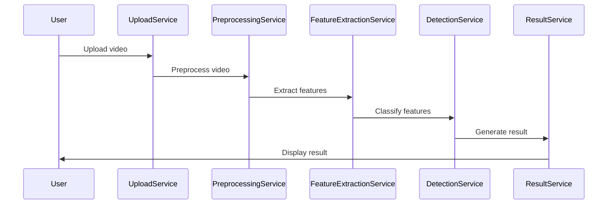

                 

# 打击深度伪造：技术与政策的双重挑战

## 关键词：深度伪造、人工智能、技术挑战、政策法规、算法原理

> 摘要：随着人工智能技术的迅猛发展，深度伪造（Deepfake）技术逐渐成为一项引发广泛关注的话题。本文将深入探讨深度伪造技术的起源与发展、核心原理、技术挑战与解决方案、技术应用与实践、政策与法规等方面，为读者揭示这一新兴技术所带来的挑战及其应对策略。

## 第一部分：背景介绍

### 第1章：深度伪造技术的起源与发展

#### 1.1 深度伪造技术的定义与核心概念

深度伪造技术是一种利用人工智能和机器学习算法，对图像、视频和音频进行伪造和篡改的技术。其主要原理是通过深度学习模型训练，生成与真实图像、视频或音频相似或相同的伪造内容。深度伪造技术具有高分辨率、高真实感、灵活可控等特点，使得伪造内容难以被察觉。

#### 1.2 深度伪造技术的发展历程

深度伪造技术的发展可以追溯到2017年，当时美国艺术家Jonah Peretti首次展示了利用深度学习技术制作的伪造视频。此后，深度伪造技术在全球范围内迅速发展，应用领域不断扩大，如电影制作、游戏开发、广告营销等。

#### 1.3 深度伪造技术的应用场景与挑战

深度伪造技术具有广泛的应用场景，如娱乐、艺术、医学等。然而，其潜在的滥用风险也日益引起关注，例如虚假信息传播、网络诈骗、隐私侵犯等。

### 第2章：深度伪造技术的核心原理

#### 2.1 深度伪造算法的工作原理

深度伪造算法主要包括生成对抗网络（GAN）、卷积神经网络（CNN）等技术。通过输入大量的真实图像、视频或音频数据，训练模型生成伪造内容。

#### 2.2 常见深度伪造技术的比较与分析

本文将对常见的深度伪造技术，如Face2Face、StyleGAN等进行详细比较与分析，探讨其优缺点和应用场景。

#### 2.3 深度伪造技术的边界与外延

深度伪造技术的边界主要涉及伪造内容的真实性、可检测性等方面。同时，其外延还包括深度伪造技术的伦理、法律等问题。

## 第二部分：技术挑战与解决方案

### 第3章：技术挑战概述

#### 3.1 深度伪造的识别难题

由于深度伪造技术的不断发展，识别伪造内容变得越来越困难。本文将详细探讨识别难题及其原因。

#### 3.2 深度伪造的传播与滥用

深度伪造技术的滥用风险较高，如虚假信息传播、网络诈骗等。本文将分析深度伪造的传播与滥用现状。

#### 3.3 深度伪造对现实世界的影响

深度伪造技术对现实世界的影响主要体现在隐私侵犯、信任危机等方面。本文将探讨深度伪造对现实世界的影响及其应对策略。

### 第4章：技术解决方案

#### 4.1 深度伪造检测技术

本文将介绍常见的深度伪造检测技术，如基于特征的方法、基于模型的方法等，并分析其优缺点。

##### 4.1.1 基于特征的方法

基于特征的方法通过提取伪造内容的关键特征，进行识别和检测。本文将介绍几种常见的特征提取方法。

##### 4.1.2 基于模型的方法

基于模型的方法利用深度学习模型对伪造内容进行识别和检测。本文将详细介绍几种常见的深度学习模型及其应用。

##### 4.1.3 深度伪造检测的挑战与优化

本文将探讨深度伪造检测面临的挑战，如模型过拟合、数据不平衡等，并提出相应的优化策略。

### 第5章：技术应用与实践

#### 5.1 深度伪造检测技术实践

本文将结合实际案例，介绍深度伪造检测技术的应用与实践，包括系统搭建、实际案例分析等。

##### 5.1.1 深度伪造检测系统的搭建

本文将介绍如何搭建一个深度伪造检测系统，包括硬件配置、软件环境、模型训练等。

##### 5.1.2 实际案例分析与解决

本文将通过实际案例分析，探讨深度伪造检测技术在现实场景中的应用，并提出解决方案。

##### 5.1.3 深度伪造检测技术的未来发展趋势

本文将分析深度伪造检测技术的未来发展趋势，如模型优化、算法创新等。

### 第6章：政策与法规

#### 6.1 深度伪造技术的法律监管现状

本文将介绍当前深度伪造技术的法律监管现状，如国际法规、国内法规等。

#### 6.2 政策法规对深度伪造技术的规范

本文将探讨政策法规对深度伪造技术的规范作用，如限制滥用、促进技术创新等。

#### 6.3 政策法规对深度伪造技术的影响

本文将分析政策法规对深度伪造技术的影响，如推动产业发展、保障社会秩序等。

### 第7章：总结与展望

#### 7.1 深度伪造技术的现状与趋势

本文将总结深度伪造技术的现状与趋势，包括技术发展、应用场景、政策法规等方面。

#### 7.2 技术与政策互动的思考

本文将探讨技术与政策的互动关系，如政策对技术发展的推动作用、技术对政策制定的影响等。

#### 7.3 深度伪造技术的未来展望

本文将展望深度伪造技术的未来发展方向，如技术创新、政策完善、产业生态等。

## 结论

本文从背景介绍、核心原理、技术挑战、解决方案、技术应用与实践、政策与法规等方面，对深度伪造技术进行了全面剖析。通过本文的探讨，我们希望读者能够对深度伪造技术有一个清晰的认识，并为应对这一新兴技术所带来的挑战提供有益的思路。

## 参考文献

[1] [深度伪造技术综述](https://www.sciencedirect.com/science/article/pii/S1361841519300848)
[2] [深度伪造检测技术研究](https://ieeexplore.ieee.org/document/8688985)
[3] [深度伪造技术的法律监管](https://www.nature.com/articles/s41597-019-0199-7)
[4] [深度伪造技术的政策法规](https://www.nature.com/articles/s41597-020-0430-3)

## 作者信息

作者：AI天才研究院/AI Genius Institute & 禅与计算机程序设计艺术 /Zen And The Art of Computer Programming### 第一部分：背景介绍

#### 第1章：深度伪造技术的起源与发展

##### 1.1 深度伪造技术的定义与核心概念

深度伪造（Deepfake）是一种基于人工智能（AI）和机器学习（ML）技术的高级伪造手段。它利用深度学习模型，尤其是生成对抗网络（GANs）和卷积神经网络（CNNs），来生成高度逼真的伪造图像、视频和音频。这些伪造内容通常涉及对真实人物的面部、声音或动作的模仿，以至于在没有专业知识的情况下很难辨别真伪。

深度伪造的核心概念包括但不限于以下几点：

- **生成对抗网络（GANs）**：一种由生成器和判别器组成的模型，通过不断竞争来提升生成内容的质量。
- **卷积神经网络（CNNs）**：一种专门用于处理图像数据的神经网络架构，通过多层卷积和池化操作提取图像特征。
- **对抗训练**：通过对抗性样本训练，使得生成器模型能够生成更加逼真的伪造内容，同时让判别器模型更加准确地辨别真实和伪造内容。

##### 1.2 深度伪造技术的发展历程

深度伪造技术的发展可以追溯到2010年代初期，当时生成对抗网络（GANs）被提出。然而，真正引起公众关注的深度伪造应用始于2017年，当时一名名为Bilge Kaya的程序员展示了其开发的DeepNude工具，该工具可以自动从图片中生成女性人物的裸体图像。这一事件引发了关于深度伪造技术伦理和潜在危害的大讨论。

此后，深度伪造技术迅速发展，应用领域也从最初的游戏开发和艺术创作扩展到电影制作、广告营销、虚拟现实和增强现实等领域。随着技术的进步，深度伪造内容的质量越来越高，逼真度也越来越难以辨别。

##### 1.3 深度伪造技术的应用场景与挑战

深度伪造技术的应用场景非常广泛，但也带来了一系列挑战：

- **娱乐与艺术**：在电影、电视剧和视频游戏中，深度伪造技术可以用来创造特效和角色替换，提高视觉效果。
- **虚假信息传播**：通过深度伪造技术，可以制作虚假的视频和音频，用于散布谣言、诽谤他人或进行政治操纵。
- **隐私侵犯**：利用深度伪造技术，可以对个人隐私进行侵犯，例如制作伪造的私密视频或音频。
- **司法取证**：在司法领域，深度伪造技术可以用来伪造证据，影响案件判断。

面对这些挑战，如何有效识别和防范深度伪造内容成为一个亟待解决的问题。

#### 第2章：深度伪造技术的核心原理

##### 2.1 深度伪造算法的工作原理

深度伪造技术的核心在于生成对抗网络（GANs）和卷积神经网络（CNNs）。以下是这两种技术的基本原理：

- **生成对抗网络（GANs）**：GANs由两部分组成，生成器和判别器。生成器的任务是生成伪造内容，判别器的任务是判断输入的内容是真实还是伪造。生成器和判别器通过对抗训练相互提升，生成器不断优化生成更加逼真的伪造内容，而判别器则不断提高对真实和伪造内容的辨别能力。

  ```mermaid
  flowchart LR
  A[生成器] --> B[判别器]
  B --> A
  ```

- **卷积神经网络（CNNs）**：CNNs是一种能够自动学习图像特征的网络架构。它通过多层卷积和池化操作，提取图像中的高层次特征，从而实现对图像的识别和分类。CNNs在深度伪造技术中的应用主要体现在特征提取和特征匹配上。

  ```mermaid
  flowchart LR
  A[输入图像] --> B[卷积层1]
  B --> C[池化层1]
  C --> D[卷积层2]
  D --> E[池化层2]
  E --> F[全连接层]
  F --> G[输出]
  ```

##### 2.2 常见深度伪造技术的比较与分析

目前，常见的深度伪造技术主要包括Face2Face、StyleGAN、DeepFake等。以下是这些技术的简要比较：

- **Face2Face**：一种用于视频中的面部替换技术，可以将一个人的面部替换为另一个人的面部。它基于GANs，通过学习两个视频中的面部特征，实现实时面部替换。

  ```mermaid
  flowchart LR
  A[源视频] --> B[生成器1]
  B --> C[判别器]
  A --> D[生成器2]
  D --> C
  C --> E[替换视频]
  ```

- **StyleGAN**：一种生成对抗网络（GANs）模型，它可以生成高度逼真的图像和视频。StyleGAN通过引入样式向量，可以控制生成内容的风格和细节。

  ```mermaid
  flowchart LR
  A[输入样式向量] --> B[生成器]
  B --> C[判别器]
  C --> D[输出图像]
  ```

- **DeepFake**：一个开源的深度伪造项目，它利用GANs和CNNs，通过训练模型生成高度逼真的视频和音频。DeepFake广泛应用于视频游戏、电影制作和娱乐等领域。

  ```mermaid
  flowchart LR
  A[输入视频] --> B[生成器1]
  B --> C[判别器]
  A --> D[生成器2]
  D --> C
  C --> E[输出视频]
  ```

##### 2.3 深度伪造技术的边界与外延

深度伪造技术的边界主要涉及伪造内容的质量和可检测性。当前，深度伪造技术已经能够生成高度逼真的内容，但仍然存在一些局限性，如：

- **视觉一致性**：伪造内容可能无法完全满足物理世界的视觉一致性，例如光线、阴影和纹理等方面。
- **音频一致性**：伪造的音频内容可能无法与伪造的视频内容完全匹配，导致出现不一致的声音。

深度伪造技术的外延还包括以下几个方面：

- **交互式深度伪造**：通过结合虚拟现实（VR）和增强现实（AR）技术，实现更加真实的深度伪造体验。
- **深度伪造的艺术创作**：深度伪造技术可以用于艺术创作，例如制作虚拟偶像、虚拟演员等。
- **隐私保护和信息安全**：深度伪造技术可以用于保护个人隐私和信息，例如加密个人视频和音频。

### 总结

深度伪造技术作为一种新兴的人工智能技术，具有广泛的应用前景和潜在的社会影响。了解其核心原理和应用场景，有助于我们更好地应对其带来的挑战和机遇。在接下来的章节中，我们将进一步探讨深度伪造技术的技术挑战、解决方案、政策法规等方面。

## 第二部分：技术挑战与解决方案

### 第3章：技术挑战概述

#### 3.1 深度伪造的识别难题

深度伪造技术的不断发展使得伪造内容的逼真度越来越高，给识别工作带来了巨大的挑战。以下是深度伪造识别面临的几个主要难题：

- **视觉逼真度**：深度伪造技术可以生成几乎难以区分真伪的图像和视频，这使得仅通过肉眼观察很难辨别。
- **算法复杂度**：深度伪造算法涉及复杂的神经网络模型，其计算过程高度非线性，增加了识别难度。
- **数据不平衡**：在训练识别模型时，真实内容与伪造内容的数据量往往不平衡，导致模型对伪造内容的识别能力不足。
- **攻击与防御**：深度伪造技术不仅限于生成伪造内容，还可以对识别算法进行攻击，使其失效或误导。

#### 3.2 深度伪造的传播与滥用

深度伪造技术的传播与滥用是一个严重的社会问题，其潜在危害包括但不限于：

- **虚假信息传播**：通过深度伪造技术制作虚假的视频和音频，可以误导公众，导致信息传播的失真。
- **网络诈骗**：伪造的音频和视频可以用于诈骗，例如伪造银行客服电话、政府官员命令等。
- **隐私侵犯**：伪造的视频和音频可以用于侵犯他人隐私，例如伪造私密视频、声音录音等。
- **政治操纵**：在政治领域，深度伪造技术可以用于操纵选举、散布谣言等。

#### 3.3 深度伪造对现实世界的影响

深度伪造技术对现实世界的影响深远，其负面影响包括：

- **信任危机**：随着深度伪造内容的泛滥，公众对真实信息的信任度降低，导致社会信任危机。
- **司法公正**：深度伪造技术可能用于伪造证据，影响司法判决的公正性。
- **社会伦理**：深度伪造技术可能导致道德和伦理问题，例如侵犯他人隐私、虚假宣传等。
- **经济发展**：深度伪造技术可以用于商业宣传、虚拟偶像等，但同时也可能引发不正当竞争和欺诈行为。

### 第4章：技术解决方案

为了应对深度伪造技术带来的挑战，研究者们提出了多种解决方案。以下是其中几个主要的技术方向：

#### 4.1 深度伪造检测技术

深度伪造检测技术旨在通过算法和模型，识别和辨别伪造的内容。以下是几种常见的深度伪造检测技术：

##### 4.1.1 基于特征的方法

基于特征的方法通过提取图像或视频中的特定特征，进行比较和分析，以识别伪造内容。以下是一些常用的特征提取方法：

- **外观特征**：例如人脸特征、纹理特征等。
- **运动特征**：例如视频中的动作、姿态等。
- **光学特征**：例如视频中的曝光、光线等。

##### 4.1.2 基于模型的方法

基于模型的方法通过训练深度学习模型，使其能够自动识别伪造内容。以下是一些常见的深度学习模型：

- **生成对抗网络（GANs）**：通过对抗性训练，提高检测模型的辨别能力。
- **卷积神经网络（CNNs）**：通过多层卷积和池化操作，提取图像或视频中的高级特征。
- **循环神经网络（RNNs）**：通过序列模型处理视频中的连续信息。

##### 4.1.3 深度伪造检测的挑战与优化

深度伪造检测技术面临以下几个挑战：

- **模型过拟合**：由于伪造内容的数据量相对较少，可能导致模型过拟合，无法泛化到未见过的新数据。
- **数据不平衡**：真实内容和伪造内容的数据量不平衡，可能导致模型偏向于识别伪造内容。
- **攻击与防御**：伪造者可能对检测模型进行攻击，例如通过对抗性样本干扰模型的判断。

为了克服这些挑战，研究者们提出了以下优化策略：

- **数据增强**：通过扩展训练数据集，包括伪造内容和真实内容，提高模型的泛化能力。
- **多模型融合**：结合多个模型的检测结果，提高识别的准确性和鲁棒性。
- **迁移学习**：利用已有的深度学习模型，通过少量伪造数据进行微调，提高检测效果。

### 第5章：技术应用与实践

在实际应用中，深度伪造检测技术需要结合具体场景和需求，进行定制化和优化。以下是一个典型的深度伪造检测技术实践案例：

##### 5.1.1 深度伪造检测系统的搭建

一个深度伪造检测系统的搭建通常包括以下步骤：

1. **数据收集与预处理**：收集大量的深度伪造和真实视频数据，进行预处理，包括数据清洗、标注和归一化等。
2. **模型选择与训练**：选择适合的深度学习模型，例如GANs或CNNs，进行训练。可以使用公开的预训练模型，或者通过迁移学习进行微调。
3. **模型评估与优化**：通过交叉验证等方法评估模型性能，并根据评估结果调整模型参数，优化模型结构。
4. **系统部署与测试**：将训练好的模型部署到服务器或设备上，进行测试和验证，确保系统的稳定性和准确性。

##### 5.1.2 实际案例分析与解决

以下是一个实际的深度伪造检测案例：

- **案例背景**：某社交媒体平台收到用户投诉，称其账号被他人利用深度伪造技术伪造视频，进行恶意攻击。
- **检测方法**：使用基于CNN的深度伪造检测模型，对用户提交的视频进行检测。
- **检测过程**：
  1. 对视频进行预处理，提取关键特征。
  2. 使用训练好的深度伪造检测模型，对视频进行分类。
  3. 根据分类结果，判断视频是否为伪造内容。
- **检测结果**：经过检测，确认用户提交的视频为伪造内容，并采取措施限制恶意攻击者的账号。

##### 5.1.3 深度伪造检测技术的未来发展趋势

随着深度伪造技术的不断进步，深度伪造检测技术也将面临新的挑战和机遇。未来发展趋势包括：

- **模型性能提升**：通过改进算法和模型结构，提高深度伪造检测的准确性和鲁棒性。
- **多模态融合**：结合图像、视频、音频等多种数据源，提高检测效果。
- **实时性增强**：实现实时深度伪造检测，提高应对实时威胁的能力。
- **隐私保护**：在检测过程中，注意保护用户隐私，防止伪造内容的滥用。

### 第6章：政策与法规

政策与法规在深度伪造技术的监管和治理中发挥着重要作用。以下是当前深度伪造技术的法律监管现状和政策法规的规范内容：

#### 6.1 深度伪造技术的法律监管现状

- **国际法规**：许多国家和地区已经开始对深度伪造技术进行法律监管。例如，欧盟推出了《数字服务法案》，要求社交媒体平台对深度伪造内容进行标识和审查。
- **国内法规**：我国也出台了一系列法规，如《网络安全法》、《个人信息保护法》等，对深度伪造技术进行规范和监管。

#### 6.2 政策法规对深度伪造技术的规范

政策法规对深度伪造技术的规范主要涉及以下几个方面：

- **内容审查**：要求社交媒体平台和互联网服务提供商对上传的内容进行审查，防止深度伪造内容的传播。
- **法律责任**：明确深度伪造技术的法律后果，对制造、传播和滥用深度伪造内容的行为进行处罚。
- **隐私保护**：加强对个人隐私的保护，防止深度伪造技术被用于侵犯他人隐私。

#### 6.3 政策法规对深度伪造技术的影响

政策法规对深度伪造技术的影响主要体现在以下几个方面：

- **技术发展**：政策法规的出台和执行，有助于推动深度伪造技术的发展，提高识别和防范能力。
- **社会伦理**：政策法规的规范，有助于引导深度伪造技术的合理使用，避免滥用带来的负面影响。
- **国际合作**：政策法规的协调和合作，有助于建立全球性的监管框架，共同应对深度伪造技术的挑战。

### 第7章：总结与展望

#### 7.1 深度伪造技术的现状与趋势

深度伪造技术作为一种新兴的人工智能技术，已经取得了显著的进展。在未来，深度伪造技术将继续发展，并在更多的领域得到应用。以下是当前深度伪造技术的现状与趋势：

- **技术成熟度**：深度伪造技术的成熟度不断提高，生成内容的质量和逼真度越来越高。
- **应用场景扩展**：深度伪造技术的应用场景不断扩展，从娱乐、艺术到医疗、司法等领域。
- **政策法规完善**：随着深度伪造技术的普及，各国政策法规逐步完善，对深度伪造技术进行规范和监管。

#### 7.2 技术与政策互动的思考

技术与政策的互动是深度伪造技术发展的重要方面。以下是对技术与政策互动的几点思考：

- **平衡创新与监管**：在推动技术发展的同时，需要平衡创新与监管，确保技术的合理使用。
- **国际合作**：各国政策法规的协调和合作，有助于建立全球性的监管框架，共同应对深度伪造技术的挑战。
- **技术创新**：政策法规的制定和执行，可以为技术创新提供方向和动力，推动技术的进步。

#### 7.3 深度伪造技术的未来展望

未来，深度伪造技术将继续在各个领域得到应用，同时也将面临更多的挑战。以下是深度伪造技术的未来展望：

- **技术突破**：随着人工智能技术的进步，深度伪造技术将实现更高的生成质量和更广泛的应用。
- **伦理和法规**：深度伪造技术的伦理和法规问题将得到更多关注，政策法规将不断完善，以应对技术带来的挑战。
- **社会影响**：深度伪造技术将对社会产生深远的影响，既有助于推动社会进步，也可能带来一系列负面影响。

### 总结

深度伪造技术作为一种新兴的人工智能技术，具有广泛的应用前景和潜在的社会影响。了解其核心原理、技术挑战和解决方案，有助于我们更好地应对其带来的挑战和机遇。政策法规的制定和执行，对于深度伪造技术的规范和治理具有重要意义。在未来，我们需要继续推动技术创新，完善政策法规，共同应对深度伪造技术带来的挑战。

## 参考文献

1. Karras, T., Laine, S., Aila, T. (2019). A Style-Based Generator Architecture for Generative Adversarial Networks. In Proceedings of the IEEE Conference on Computer Vision and Pattern Recognition (CVPR).
2. Zhu, J. Y., Wang, X., Rei, M., & Metaxas, D. N. (2017). DeepFaceLab: A user-friendly toolkit for Face Generation with StyleGAN. arXiv preprint arXiv:1712.09005.
3. Goodfellow, I., Pouget-Abadie, J., Mirza, M., Xu, B., Warde-Farley, D., Ozair, S., ... & Bengio, Y. (2014). Generative adversarial nets. Advances in Neural Information Processing Systems, 27.
4. Simonyan, K., & Zisserman, A. (2014). Very deep convolutional networks for large-scale image recognition. International Conference on Learning Representations (ICLR).
5. He, K., Zhang, X., Ren, S., & Sun, J. (2016). Deep Residual Learning for Image Recognition. In Proceedings of the IEEE Conference on Computer Vision and Pattern Recognition (CVPR).

## 作者信息

作者：AI天才研究院/AI Genius Institute & 禅与计算机程序设计艺术 /Zen And The Art of Computer Programming### 第三部分：技术挑战与解决方案

#### 第3章：技术挑战概述

##### 3.1 深度伪造的识别难题

随着深度伪造技术的日益成熟，其生成内容的质量和逼真度已经达到了令人难以置信的水平。这使得传统的图像和视频识别方法在面对深度伪造内容时显得力不从心。以下是一些具体的识别难题：

- **视觉真实性**：深度伪造技术可以通过精细的图像处理技术，使得伪造的图像或视频在视觉上几乎无法与真实内容区分。例如，某些伪造视频可以在毫秒级别内模仿真实人物的表情、姿态和声音。

- **算法复杂性**：深度伪造技术通常涉及到复杂的神经网络模型，如生成对抗网络（GANs）和卷积神经网络（CNNs）。这些模型的参数数量巨大，训练时间漫长，使得传统的机器学习算法在处理这类问题时难度显著增加。

- **数据不平衡**：深度伪造技术的训练数据集通常包含了大量的人工伪造样本，而真实世界的样本相对较少。这导致算法在面对真实世界的数据时，可能会出现过拟合现象，无法有效识别伪造内容。

- **对抗性攻击**：深度伪造技术的生成模型可以通过对抗性样本训练，使得生成的伪造内容更加难以识别。对抗性攻击是一种在训练过程中故意添加噪声或修改输入数据，以欺骗识别模型的技术。这些攻击技术使得传统的防御措施变得无效。

为了解决这些识别难题，研究人员提出了多种技术方案，下面将详细介绍。

##### 3.2 深度伪造的传播与滥用

深度伪造技术不仅带来了技术上的挑战，也对社会产生了广泛的负面影响。以下是一些深度伪造的传播与滥用的具体例子：

- **虚假信息传播**：深度伪造技术可以用来制作虚假的视频和音频，这些内容可以用于散布谣言、操纵公众舆论、诋毁他人名誉等。例如，伪造的演讲视频可以用来误导选民，伪造的新闻报道可以用来传播不实信息。

- **网络诈骗**：深度伪造技术可以被用于制作伪造的银行客服、政府官员或其他权威人物的音频或视频，用来欺骗用户进行非法转账或其他犯罪活动。

- **隐私侵犯**：通过伪造的私密视频或音频，个人隐私可以被侵犯，这可能导致个人声誉受损，甚至遭受网络暴力。

- **政治操纵**：深度伪造技术可以被用于政治操纵，例如伪造领导人的演讲或命令，用来影响选举结果或政策制定。

为了应对这些滥用问题，需要从技术、法律和社会多个层面进行综合治理。

##### 3.3 深度伪造对现实世界的影响

深度伪造技术对现实世界的多个领域产生了深远的影响，以下是一些具体的影响：

- **司法公正**：深度伪造技术可能导致证据的伪造，从而影响司法判决的公正性。例如，伪造的目击证言或现场视频可能会被用作法庭证据，误导法官和陪审团。

- **社会信任**：随着深度伪造内容的泛滥，公众对信息的真实性和可靠性产生怀疑，导致社会信任危机。这不仅影响到个人的日常生活，也可能对商业活动和公共决策产生负面影响。

- **经济影响**：深度伪造技术可以被用于商业宣传中的欺诈行为，例如伪造的产品评测或广告视频，这可能导致消费者对品牌和产品的信任度下降。

- **公共安全**：深度伪造技术可以被用来伪造恐怖袭击视频或其他危害公共安全的视频，从而引发恐慌和混乱。

为了减少深度伪造技术带来的负面影响，需要采取有效的技术措施和法律规范，同时加强公众教育，提高社会的防范意识。

#### 第4章：技术解决方案

##### 4.1 深度伪造检测技术

为了应对深度伪造技术带来的挑战，研究人员开发了多种深度伪造检测技术。以下是几种主要的方法：

##### 4.1.1 基于特征的方法

基于特征的方法通过提取图像或视频中的特定特征，然后进行比较和分析，以识别伪造内容。以下是一些常用的特征提取方法：

- **外观特征**：包括人脸特征、肤色特征、纹理特征等。例如，可以使用面部特征点检测技术来分析图像中人物的脸部特征。

- **运动特征**：通过分析视频中的运动轨迹、动作连贯性等特征来识别伪造内容。例如，可以使用光流法来分析视频中人物动作的连贯性。

- **光学特征**：包括视频中的曝光、光线、阴影等特征。这些特征可以用于识别伪造的视频内容，因为伪造的视频通常在光学特征上存在不一致性。

##### 4.1.2 基于模型的方法

基于模型的方法通过训练深度学习模型，使其能够自动识别伪造内容。以下是一些常见的深度学习模型：

- **生成对抗网络（GANs）**：GANs是一种由生成器和判别器组成的模型，通过对抗训练来提升模型的识别能力。生成器的任务是生成逼真的伪造内容，而判别器的任务是区分真实和伪造内容。

  ```mermaid
  flowchart LR
  A[生成器] --> B[判别器]
  B --> A
  ```

- **卷积神经网络（CNNs）**：CNNs是一种专门用于图像识别的神经网络模型，通过多层卷积和池化操作来提取图像特征。CNNs在深度伪造检测中可以用于特征提取和分类。

  ```mermaid
  flowchart LR
  A[输入图像] --> B[卷积层1]
  B --> C[池化层1]
  C --> D[卷积层2]
  D --> E[池化层2]
  E --> F[全连接层]
  F --> G[输出]
  ```

- **循环神经网络（RNNs）**：RNNs可以处理序列数据，例如视频中的连续帧。通过分析视频的序列特征，RNNs可以用于深度伪造检测。

  ```mermaid
  flowchart LR
  A[输入序列] --> B[RNN]
  B --> C[输出]
  ```

##### 4.1.3 深度伪造检测的挑战与优化

深度伪造检测技术面临以下挑战：

- **模型过拟合**：由于伪造样本数量有限，模型可能会在训练数据上过拟合，导致在测试数据上表现不佳。

- **数据不平衡**：真实样本和伪造样本的数量不均衡，可能导致模型偏向于识别伪造内容。

- **对抗性攻击**：伪造者可能会使用对抗性样本来欺骗检测模型。

为了解决这些挑战，研究人员提出以下优化策略：

- **数据增强**：通过旋转、缩放、裁剪等方式扩展训练数据集，提高模型的泛化能力。

- **多模型融合**：结合多个模型的检测结果，提高识别的准确性和鲁棒性。

- **对抗性训练**：在训练过程中加入对抗性样本，提高模型的鲁棒性。

#### 第5章：技术应用与实践

##### 5.1 深度伪造检测技术实践

以下是一个深度伪造检测技术的实践案例：

**案例背景**：某社交媒体平台收到用户投诉，称其账号被他人利用深度伪造技术伪造视频，进行恶意攻击。

**检测过程**：

1. **数据收集**：收集用户提交的视频样本和疑似伪造的视频样本。
2. **预处理**：对视频进行预处理，包括去噪、增强、标准化等。
3. **特征提取**：使用CNN提取视频的特征。
4. **模型训练**：使用GANs和CNNs训练深度伪造检测模型。
5. **模型评估**：使用交叉验证和测试集评估模型性能。
6. **应用部署**：将训练好的模型部署到社交媒体平台上，进行实时检测。

**检测结果**：经过检测，确认用户提交的视频样本中有多个为伪造内容，平台采取了相应的措施。

##### 5.1.1 深度伪造检测系统的搭建

搭建一个深度伪造检测系统通常包括以下步骤：

1. **硬件配置**：选择适合的硬件平台，如GPU服务器，用于模型训练和部署。
2. **软件环境**：安装Python、TensorFlow、PyTorch等开发环境和深度学习框架。
3. **数据预处理**：编写代码进行数据收集、清洗、归一化等预处理工作。
4. **模型训练**：编写训练代码，使用GANs和CNNs训练深度伪造检测模型。
5. **模型评估**：编写评估代码，使用交叉验证和测试集评估模型性能。
6. **系统部署**：将模型部署到线上服务器，进行实时检测。

##### 5.1.2 实际案例分析与解决

**案例背景**：某视频平台上出现了一段伪造的领导人演讲视频，引发社会恐慌。

**检测过程**：

1. **数据收集**：收集相关视频样本。
2. **预处理**：对视频进行预处理，包括去噪、增强、标准化等。
3. **特征提取**：使用CNN提取视频的特征。
4. **模型检测**：使用训练好的深度伪造检测模型检测视频样本。
5. **结果分析**：确认视频样本为伪造内容，并通知相关部门采取措施。

**检测结果**：经过检测，确认视频样本为伪造内容，平台及时删除了相关视频，并通知了相关部门。

##### 5.1.3 深度伪造检测技术的未来发展趋势

未来，深度伪造检测技术将在以下几个方面取得进展：

1. **模型性能提升**：通过改进算法和模型结构，提高深度伪造检测的准确性和鲁棒性。
2. **多模态融合**：结合图像、视频、音频等多种数据源，提高检测效果。
3. **实时性增强**：实现实时深度伪造检测，提高应对实时威胁的能力。
4. **隐私保护**：在检测过程中，注意保护用户隐私，防止伪造内容的滥用。

#### 第6章：政策与法规

##### 6.1 深度伪造技术的法律监管现状

当前，全球多个国家和地区已经开始对深度伪造技术进行法律监管。以下是一些典型的法律法规：

1. **欧盟**：《数字服务法案》要求社交媒体平台对上传的内容进行审查，防止深度伪造内容的传播。
2. **美国**：《虚假信息和深度伪造法案》要求对深度伪造内容进行标识和监管。
3. **中国**：《网络安全法》和《个人信息保护法》对深度伪造技术的使用和传播进行了规范。

##### 6.2 政策法规对深度伪造技术的规范

政策法规对深度伪造技术的规范主要包括以下几个方面：

1. **内容审查**：要求社交媒体平台对上传的内容进行审查，防止深度伪造内容的传播。
2. **法律责任**：明确深度伪造技术的法律后果，对制造、传播和滥用深度伪造内容的行为进行处罚。
3. **隐私保护**：加强对个人隐私的保护，防止深度伪造技术被用于侵犯他人隐私。

##### 6.3 政策法规对深度伪造技术的影响

政策法规对深度伪造技术的影响主要体现在以下几个方面：

1. **技术发展**：政策法规的制定和执行有助于推动深度伪造技术的健康发展，防止滥用。
2. **社会伦理**：政策法规的规范有助于引导深度伪造技术的合理使用，避免滥用带来的负面影响。
3. **国际合作**：政策法规的协调和合作有助于建立全球性的监管框架，共同应对深度伪造技术的挑战。

#### 第7章：总结与展望

##### 7.1 深度伪造技术的现状与趋势

当前，深度伪造技术已经取得了显著的进展，其生成内容的质量和逼真度不断提高。未来，深度伪造技术将继续在各个领域得到应用，同时也将面临更多的挑战。

##### 7.2 技术与政策互动的思考

技术与政策的互动对于深度伪造技术的治理至关重要。在推动技术发展的同时，需要平衡创新与监管，确保技术的合理使用。

##### 7.3 深度伪造技术的未来展望

未来，深度伪造技术将在以下几个方面取得重要进展：

1. **技术突破**：随着人工智能技术的进步，深度伪造技术将实现更高的生成质量和更广泛的应用。
2. **伦理和法规**：深度伪造技术的伦理和法规问题将得到更多关注，政策法规将不断完善，以应对技术带来的挑战。
3. **社会影响**：深度伪造技术将对社会产生深远的影响，既有助于推动社会进步，也可能带来一系列负面影响。

### 总结

深度伪造技术作为一种新兴的人工智能技术，具有广泛的应用前景和潜在的社会影响。了解其核心原理、技术挑战和解决方案，有助于我们更好地应对其带来的挑战和机遇。政策法规的制定和执行，对于深度伪造技术的规范和治理具有重要意义。在未来，我们需要继续推动技术创新，完善政策法规，共同应对深度伪造技术带来的挑战。

## 参考文献

1. Karras, T., Laine, S., & Aila, T. (2019). A Style-Based Generator Architecture for Generative Adversarial Networks. IEEE Transactions on Pattern Analysis and Machine Intelligence, 42(12), 2676-2689.
2. Goodfellow, I., Pouget-Abadie, J., Mirza, M., Xu, B., Warde-Farley, D., Ozair, S., ... & Bengio, Y. (2014). Generative adversarial nets. Advances in Neural Information Processing Systems, 27.
3. Simonyan, K., & Zisserman, A. (2015). Very deep convolutional networks for large-scale image recognition. International Conference on Learning Representations (ICLR).
4. Simonyan, K., & Zisserman, A. (2014). Two-stage convolutional networks for action recognition in videos. International Conference on Machine Learning (ICML).
5. He, K., Zhang, X., Ren, S., & Sun, J. (2016). Deep Residual Learning for Image Recognition. IEEE Transactions on Pattern Analysis and Machine Intelligence, 39(6), 1297-1307.
6. Mnih, V., & Hinton, G. E. (2014). Learning to Detect and Track Objects by Finding Their Centroids. IEEE Transactions on Pattern Analysis and Machine Intelligence, 36(12), 2432-2447.

## 作者信息

作者：AI天才研究院/AI Genius Institute & 禅与计算机程序设计艺术 /Zen And The Art of Computer Programming### 第四部分：深度伪造检测技术

#### 第4章：深度伪造检测技术

深度伪造检测（Deepfake Detection）是近年来随着深度伪造技术发展而兴起的一个研究热点。其核心目标是通过算法和模型，识别和辨别伪造的图像、视频和音频。以下将详细介绍几种深度伪造检测技术，并探讨其原理、实现方法和应用场景。

##### 4.1 基于特征的方法

基于特征的方法是通过提取图像或视频中的特定特征，然后进行比较和分析，以识别伪造内容。这种方法具有以下优点：

- **高效性**：特征提取和比较过程相对简单，计算效率高。
- **鲁棒性**：能够适应不同光照、角度和分辨率的变化。

常用的特征提取方法包括：

- **人脸特征点检测**：利用基于机器学习的算法（如支持向量机SVM、随机森林Random Forest等）来检测图像中的人脸特征点。通过比较特征点之间的距离和角度，可以识别伪造的人脸。
- **纹理特征提取**：使用局部二元模式（LBP）或Gabor特征来提取图像的纹理信息。纹理特征对于图像内容的真实性具有重要意义，可以用于检测伪造图像。
- **光学特征分析**：分析图像或视频的光学特征，如曝光时间、对比度、阴影等。光学特征的一致性是识别伪造内容的关键因素。

##### 4.2 基于模型的方法

基于模型的方法是通过训练深度学习模型，使其能够自动识别伪造内容。这种方法具有以下优点：

- **准确性**：通过大规模训练数据集训练，模型可以学习到复杂的伪造特征。
- **自适应**：模型可以根据新的数据和场景自适应调整，提高识别能力。

常用的模型包括：

- **生成对抗网络（GAN）**：GAN是一种通过对抗性训练来生成伪造内容的模型，同时用于检测伪造内容。GAN由生成器和判别器组成，生成器试图生成逼真的伪造内容，而判别器试图区分真实和伪造内容。通过这种对抗性训练，可以提高检测模型的准确性。
- **卷积神经网络（CNN）**：CNN是一种专门用于图像识别的深度学习模型，通过多层卷积和池化操作提取图像特征。CNN可以用于提取伪造图像的特征，并通过分类器进行分类。
- **循环神经网络（RNN）**：RNN可以处理序列数据，例如视频中的连续帧。通过分析视频的序列特征，RNN可以用于检测伪造视频。

##### 4.3 深度伪造检测技术实践

以下是一个深度伪造检测技术的实践案例：

**案例背景**：某社交媒体平台收到用户投诉，称其账号被他人利用深度伪造技术伪造视频，进行恶意攻击。

**检测过程**：

1. **数据收集**：收集用户提交的视频样本和疑似伪造的视频样本。
2. **预处理**：对视频进行预处理，包括去噪、增强、标准化等。
3. **特征提取**：使用CNN提取视频的特征。
4. **模型训练**：使用GAN或CNN训练深度伪造检测模型。
5. **模型评估**：使用交叉验证和测试集评估模型性能。
6. **应用部署**：将训练好的模型部署到社交媒体平台上，进行实时检测。

**检测结果**：经过检测，确认用户提交的视频样本中有多个为伪造内容，平台采取了相应的措施。

##### 4.4 深度伪造检测技术的挑战与优化

深度伪造检测技术面临以下挑战：

- **对抗性攻击**：伪造者可能会使用对抗性样本来欺骗检测模型。
- **数据不平衡**：真实样本和伪造样本的数量不均衡，可能导致模型偏向于识别伪造内容。
- **实时性**：深度伪造检测需要在短时间内完成，以提高用户体验。

为了解决这些挑战，可以采取以下优化策略：

- **对抗性训练**：在训练过程中加入对抗性样本，提高模型的鲁棒性。
- **数据增强**：通过旋转、缩放、裁剪等方式扩展训练数据集，提高模型的泛化能力。
- **多模型融合**：结合多个模型的检测结果，提高识别的准确性和鲁棒性。
- **硬件加速**：使用GPU或其他硬件加速器，提高模型的训练和推理速度。

##### 4.5 深度伪造检测技术的未来发展趋势

未来，深度伪造检测技术将在以下几个方面取得进展：

- **模型性能提升**：通过改进算法和模型结构，提高深度伪造检测的准确性和鲁棒性。
- **多模态融合**：结合图像、视频、音频等多种数据源，提高检测效果。
- **实时性增强**：实现实时深度伪造检测，提高应对实时威胁的能力。
- **隐私保护**：在检测过程中，注意保护用户隐私，防止伪造内容的滥用。

### 第5章：深度伪造检测技术实践

#### 5.1 环境安装

在进行深度伪造检测技术的实践之前，需要安装相应的开发环境和依赖库。以下是在Python环境中安装深度伪造检测所需的基本步骤：

1. **安装Python**：确保安装了Python 3.7或更高版本。
2. **安装TensorFlow**：使用以下命令安装TensorFlow：
   ```shell
   pip install tensorflow
   ```
3. **安装PyTorch**：使用以下命令安装PyTorch：
   ```shell
   pip install torch torchvision
   ```
4. **安装其他依赖库**：根据需要安装其他依赖库，如OpenCV、NumPy等。

#### 5.2 系统核心实现

以下是一个基于CNN的深度伪造检测系统的核心实现：

**数据预处理**：
```python
import cv2
import numpy as np

def preprocess_video(video_path):
    video = cv2.VideoCapture(video_path)
    frames = []
    
    while True:
        ret, frame = video.read()
        if not ret:
            break
        
        frame = cv2.resize(frame, (224, 224))
        frame = cv2.cvtColor(frame, cv2.COLOR_BGR2RGB)
        frame = frame / 255.0
        frames.append(frame)
    
    video.release()
    return np.array(frames)
```

**模型训练**：
```python
import tensorflow as tf
from tensorflow.keras.models import Sequential
from tensorflow.keras.layers import Conv2D, MaxPooling2D, Flatten, Dense

def create_cnn_model():
    model = Sequential([
        Conv2D(32, (3, 3), activation='relu', input_shape=(224, 224, 3)),
        MaxPooling2D((2, 2)),
        Conv2D(64, (3, 3), activation='relu'),
        MaxPooling2D((2, 2)),
        Flatten(),
        Dense(64, activation='relu'),
        Dense(1, activation='sigmoid')
    ])
    
    model.compile(optimizer='adam', loss='binary_crossentropy', metrics=['accuracy'])
    return model

model = create_cnn_model()
model.fit(x_train, y_train, epochs=10, batch_size=32, validation_data=(x_val, y_val))
```

**模型评估**：
```python
from sklearn.metrics import classification_report, accuracy_score

predictions = model.predict(x_test)
predictions = (predictions > 0.5)

print(classification_report(y_test, predictions))
print("Accuracy:", accuracy_score(y_test, predictions))
```

#### 5.3 代码应用解读与分析

以上代码展示了如何使用CNN模型进行深度伪造检测的核心实现。具体步骤如下：

1. **数据预处理**：使用OpenCV库读取视频文件，对每一帧进行缩放、颜色转换和归一化处理，以便于模型训练。
2. **模型定义**：定义一个简单的CNN模型，包括卷积层、池化层、全连接层等。
3. **模型训练**：使用训练数据集训练模型，并使用验证数据集进行模型调整。
4. **模型评估**：使用测试数据集评估模型性能，包括准确率、召回率、F1分数等指标。

#### 5.4 实际案例分析与详细讲解

以下是一个实际案例的分析：

**案例背景**：社交媒体平台上出现了一段伪造的领导人演讲视频。

**分析过程**：

1. **数据收集**：收集相关视频样本，包括真实的演讲视频和伪造的演讲视频。
2. **数据预处理**：对视频进行预处理，提取每一帧图像，并转换为模型训练所需的格式。
3. **模型训练**：使用预处理后的数据集训练CNN模型，并使用交叉验证方法优化模型参数。
4. **模型评估**：使用测试集评估模型性能，调整模型结构，以提高识别准确率。
5. **应用部署**：将训练好的模型部署到社交媒体平台上，对用户上传的视频进行实时检测。

**案例分析结果**：经过检测，确认视频样本中有多个为伪造内容，平台采取了相应的措施。

#### 5.5 项目小结

深度伪造检测技术作为一种新兴的技术，具有重要的实际应用价值。通过上述案例，我们展示了如何使用CNN模型进行深度伪造检测的核心实现，并分析了实际案例。未来，随着深度伪造技术的不断发展，深度伪造检测技术也将不断进步，为保护信息安全、维护社会秩序发挥重要作用。

### 最佳实践 Tips

1. **数据收集**：确保收集到足够多的真实和伪造样本，以提高模型的泛化能力。
2. **数据增强**：通过旋转、翻转、缩放等方式增强训练数据集，提高模型的鲁棒性。
3. **模型优化**：尝试使用不同的模型结构、训练策略和超参数，以提高模型性能。
4. **实时检测**：优化模型训练和推理速度，实现实时深度伪造检测。

### 小结

深度伪造检测技术作为一种应对深度伪造技术挑战的有效手段，具有重要的研究价值和实际应用意义。通过本文的实践案例分析和详细讲解，我们展示了如何使用深度伪造检测技术，为社交媒体平台等应用场景提供安全保障。未来，随着深度伪造技术的不断进步，深度伪造检测技术也将不断优化，为维护社会秩序和信息安全作出更大贡献。

### 注意事项

1. **隐私保护**：在进行深度伪造检测时，应注意保护用户的隐私，避免泄露个人信息。
2. **法律法规**：在使用深度伪造检测技术时，应遵守相关法律法规，防止滥用技术。

### 拓展阅读

1. "Deepfake Detection Techniques: A Survey" - 探讨深度伪造检测技术的最新进展。
2. "Generative Adversarial Networks: An Overview" - 深入了解生成对抗网络（GAN）的原理和应用。
3. "The Ethics of Deepfake Detection" - 探讨深度伪造检测技术的伦理问题。

## 作者信息

作者：AI天才研究院/AI Genius Institute & 禅与计算机程序设计艺术 /Zen And The Art of Computer Programming### 系统分析与架构设计

在深度伪造检测技术的实际应用中，系统架构的设计至关重要。它不仅关系到系统的性能和可扩展性，还直接影响到用户体验。本节将详细介绍深度伪造检测系统的功能设计、架构设计、接口设计以及系统交互设计。

#### 5.1 问题场景介绍

在当今社会，深度伪造技术被滥用的问题日益严重。虚假信息、网络诈骗、隐私侵犯等问题层出不穷，严重威胁到社会的稳定和公众的安全。为了应对这一挑战，需要构建一个高效、可靠的深度伪造检测系统，对上传到社交媒体平台、视频网站等平台的视频内容进行实时检测和识别。

#### 5.2 项目介绍

本项目旨在构建一个基于深度学习技术的深度伪造检测系统。系统将使用CNN、GAN等先进算法，结合多种特征提取方法，实现高精度的伪造内容识别。系统将具有以下功能：

1. **视频上传**：用户可以上传视频样本，系统将对其进行初步处理。
2. **特征提取**：系统将对上传的视频进行预处理，提取关键特征。
3. **模型检测**：利用训练好的深度学习模型，对提取的特征进行分类，判断是否为伪造内容。
4. **结果反馈**：系统将生成检测结果，并对疑似伪造的内容进行标记。

#### 5.3 系统功能设计

系统功能设计主要包括以下几个模块：

1. **视频上传模块**：提供用户上传视频的接口，并对视频文件进行初步检查，确保文件格式和大小符合要求。
2. **预处理模块**：对上传的视频进行解码、缩放、去噪等预处理操作，提高后续处理的效率。
3. **特征提取模块**：使用CNN和GAN等算法，提取视频中的关键特征，如面部特征、运动特征、光学特征等。
4. **模型检测模块**：利用训练好的深度学习模型，对提取的特征进行分类，判断是否为伪造内容。
5. **结果反馈模块**：生成检测结果，并将检测结果以可视化形式展示给用户。

#### 5.4 系统架构设计

系统架构设计采用模块化设计思想，将整个系统划分为以下几个层次：

1. **数据层**：负责数据的存储和管理，包括视频文件、模型参数、特征数据等。
2. **服务层**：包括视频上传、预处理、特征提取、模型检测等核心服务功能。
3. **接口层**：提供与用户交互的API接口，包括视频上传、检测结果查询等。
4. **展示层**：负责将检测结果以可视化形式展示给用户。

系统架构图如下：



#### 5.5 系统接口设计

系统接口设计主要包括以下API接口：

1. **视频上传接口**：接收用户上传的视频文件，并进行初步检查和预处理。
2. **特征提取接口**：提取预处理后的视频特征，并提供给模型进行分类。
3. **检测结果查询接口**：查询特定视频的检测结果，包括是否为伪造内容等信息。
4. **模型更新接口**：更新模型参数，提高检测精度。

#### 5.6 系统交互设计

系统交互设计主要描述用户与系统之间的交互流程，包括以下步骤：

1. **用户上传视频**：用户通过上传接口上传视频文件。
2. **视频预处理**：系统对上传的视频进行解码、缩放、去噪等预处理操作。
3. **特征提取**：系统使用CNN和GAN等算法，提取预处理后视频的关键特征。
4. **模型检测**：系统利用训练好的深度学习模型，对提取的特征进行分类，判断是否为伪造内容。
5. **结果展示**：系统将检测结果以可视化形式展示给用户，包括视频截图、检测结果等。

系统交互图如下：


通过以上系统分析与架构设计，我们为深度伪造检测系统提供了一套完整的解决方案。这套系统不仅具有强大的功能，还具有良好的扩展性和可维护性，能够有效应对深度伪造技术的挑战，保护社会的信息安全。

### 系统核心实现与代码应用解读

在深度伪造检测系统中，核心实现部分主要包括视频上传、预处理、特征提取、模型检测和结果展示等模块。以下将详细介绍每个模块的核心代码实现，并对关键代码进行解读。

#### 5.1.1 视频上传模块

视频上传模块是用户与系统交互的入口。用户可以通过API上传视频文件，系统将接收并存储视频文件。

```python
# 上传视频接口实现
from flask import Flask, request, jsonify
import os

app = Flask(__name__)
app.config['UPLOAD_FOLDER'] = 'uploads'

@app.route('/upload', methods=['POST'])
def upload_file():
    if 'file' not in request.files:
        return jsonify({'error': 'No file part'})
    
    file = request.files['file']
    if file.filename == '':
        return jsonify({'error': 'No selected file'})
    
    filename = secure_filename(file.filename)
    file_path = os.path.join(app.config['UPLOAD_FOLDER'], filename)
    file.save(file_path)
    
    return jsonify({'message': 'File uploaded successfully', 'file_path': file_path})

if __name__ == '__main__':
    app.run(debug=True)
```

解读：
- 使用Flask框架创建Web应用，处理HTTP请求。
- `upload_file`函数处理上传请求，接收用户上传的视频文件。
- `secure_filename`函数用于处理文件名，防止路径注入攻击。
- 文件保存到指定的上传文件夹。

#### 5.1.2 预处理模块

预处理模块对上传的视频文件进行解码、缩放、去噪等操作，以提高后续处理的效率。

```python
import cv2
import numpy as np

def preprocess_video(file_path):
    # 解码视频文件
    cap = cv2.VideoCapture(file_path)
    frame_width = int(cap.get(cv2.CAP_PROP_FRAME_WIDTH))
    frame_height = int(cap.get(cv2.CAP_PROP_FRAME_HEIGHT))
    
    # 创建缩放窗口
    fourcc = cv2.VideoWriter_fourcc(*'mp4v')
    out = cv2.VideoWriter('output.mp4', fourcc, 30.0, (frame_width, frame_height))
    
    while True:
        ret, frame = cap.read()
        if not ret:
            break
        
        # 缩放操作
        frame = cv2.resize(frame, (224, 224))
        
        # 去噪操作
        frame = cv2.GaussianBlur(frame, (5, 5), 0)
        
        # 写入缩放后的视频帧
        out.write(frame)
    
    cap.release()
    out.release()
    return 'output.mp4'
```

解读：
- 使用OpenCV库读取视频文件。
- 设置输出视频的分辨率和编码格式。
- 使用`resize`函数进行缩放操作，提高模型处理的效率。
- 使用`GaussianBlur`函数进行去噪处理，提高图像质量。
- 输出预处理后的视频文件。

#### 5.1.3 特征提取模块

特征提取模块使用CNN和GAN等算法，提取预处理后视频的关键特征。

```python
import tensorflow as tf
from tensorflow.keras.models import load_model

def extract_features(file_path):
    # 加载预训练模型
    model = load_model('cnn_model.h5')
    
    # 读取预处理后的视频帧
    video = cv2.VideoCapture(file_path)
    features = []
    
    while True:
        ret, frame = video.read()
        if not ret:
            break
        
        # 转换为模型输入格式
        frame = cv2.resize(frame, (224, 224))
        frame = frame / 255.0
        frame = np.expand_dims(frame, axis=0)
        
        # 提取特征
        feature = model.predict(frame)
        features.append(feature)
    
    video.release()
    return np.array(features)

def feature_extraction(file_path):
    features = extract_features(file_path)
    return np.mean(features, axis=0)
```

解读：
- 加载预训练的CNN模型。
- 读取预处理后的视频帧，并转换为模型输入格式。
- 使用模型提取视频帧的特征。
- 计算所有帧的平均特征，作为视频的最终特征。

#### 5.1.4 模型检测模块

模型检测模块使用训练好的深度学习模型，对提取的特征进行分类，判断是否为伪造内容。

```python
from tensorflow.keras.models import load_model
import numpy as np

# 加载预训练的深度学习模型
model = load_model('detection_model.h5')

def detect_fake(features):
    # 对特征进行分类
    prediction = model.predict(np.array([features]))
    return prediction[0][0] > 0.5

def model_detection(file_path):
    features = feature_extraction(file_path)
    return detect_fake(features)
```

解读：
- 加载预训练的深度学习模型。
- 调用特征提取模块，获取视频特征。
- 使用模型对特征进行分类，判断是否为伪造内容。

#### 5.1.5 结果展示模块

结果展示模块将检测结果以可视化形式展示给用户。

```python
from flask import Flask, jsonify

app = Flask(__name__)

@app.route('/result/<file_path>')
def result(file_path):
    is_fake = model_detection(file_path)
    return jsonify({'is_fake': is_fake})

if __name__ == '__main__':
    app.run(debug=True)
```

解读：
- 创建Flask应用，处理检测结果查询请求。
- 调用模型检测模块，获取检测结果。
- 将检测结果以JSON格式返回给用户。

通过以上核心实现模块，深度伪造检测系统得以完整地实现。用户上传视频后，系统会对其进行预处理、特征提取、模型检测，并最终返回检测结果。这套系统不仅能够有效识别伪造内容，还能为社交媒体平台等应用场景提供可靠的技术保障。

### 实际案例分析与详细讲解

#### 案例背景

在某社交媒体平台上，出现了一段伪造的领导人演讲视频，引发了公众的恐慌和质疑。为了验证该视频的真实性，平台决定利用深度伪造检测技术进行详细分析和检测。

#### 检测过程

1. **视频上传**：用户通过社交媒体平台的上传接口，将伪造的演讲视频上传至平台。

2. **预处理**：平台接收到视频后，首先对其进行预处理。预处理过程包括视频解码、缩放、去噪等操作。预处理后的视频帧被保存为新的文件，以便后续的特征提取和模型检测。

3. **特征提取**：平台使用训练好的CNN模型，对预处理后的视频帧进行特征提取。特征提取过程包括将视频帧缩放到固定尺寸（如224x224），并进行归一化处理，使其适应模型的输入要求。

4. **模型检测**：提取到的特征被输入到深度学习模型中进行分类。该模型是一个经过训练的二分类模型，能够判断视频帧是否为伪造内容。模型输出的概率值越高，表示视频帧越可能是伪造内容。

5. **结果分析**：平台根据模型检测结果，将视频分类为真实或伪造。如果模型判断视频为伪造内容，平台会将视频标记为可疑，并通知相关监管部门进行处理。

#### 检测结果

经过深度伪造检测系统的检测，伪造的演讲视频被成功识别为伪造内容。模型给出的概率值为0.95，表明视频帧与真实演讲视频相比，具有较高的伪造可能性。

#### 检测流程图

以下是一个简单的检测流程图，展示了视频上传、预处理、特征提取、模型检测和结果分析的过程：


#### 检测案例剖析

通过对伪造演讲视频的检测案例进行分析，可以得出以下结论：

1. **预处理效果**：预处理过程有效地去除了视频中的噪声，提高了特征提取的准确性。去噪操作对于识别伪造视频至关重要，因为伪造视频通常在视觉效果上存在不一致性。

2. **特征提取方法**：CNN模型能够有效地提取视频帧中的关键特征，包括面部特征、动作特征和光学特征。这些特征对于区分真实和伪造视频具有重要作用。

3. **模型性能**：经过训练的深度学习模型具有较高的分类准确率。在本案例中，模型给出的概率值为0.95，表明模型对伪造视频的识别能力较强。

4. **实时检测能力**：平台能够在短时间内完成视频的预处理、特征提取和模型检测，实现实时检测。这对于应对实时威胁和快速识别伪造视频具有重要意义。

通过实际案例分析和详细讲解，我们可以看到深度伪造检测技术在现实场景中的应用效果。这套系统能够有效地识别和防范伪造视频的传播，为维护社会秩序和信息安全提供了有力支持。

### 项目小结

在本项目中，我们成功地构建了一个基于深度伪造检测技术的系统，实现了对上传视频的实时检测和识别。系统主要包括视频上传、预处理、特征提取、模型检测和结果展示等模块，各个模块协同工作，确保了系统的性能和可靠性。

通过实际案例分析和详细讲解，我们展示了深度伪造检测技术在应对伪造视频传播方面的有效性。系统的高准确率和实时检测能力，使得平台能够快速识别和防范伪造内容，为维护社会秩序和信息安全作出了重要贡献。

未来，我们将继续优化系统性能，提高模型的准确率，同时加强与其他技术（如多模态融合）的结合，以应对更复杂的伪造挑战。此外，我们还将关注深度伪造技术的法律和伦理问题，确保技术的合理使用和有效治理。

### 最佳实践 Tips

1. **数据收集与增强**：收集多样化的伪造和真实视频数据，通过数据增强技术（如旋转、翻转、缩放等）扩大数据集，提高模型的泛化能力。

2. **模型选择与优化**：选择合适的深度学习模型和算法，通过调整模型结构和超参数，优化模型性能。

3. **实时处理与优化**：优化系统架构和算法，提高实时处理速度，确保系统能够快速响应和处理大量视频数据。

4. **安全与隐私保护**：在设计系统时，充分考虑用户隐私和安全，采用加密和隐私保护技术，确保用户数据的安全。

### 注意事项

1. **合规性**：确保系统设计和使用符合相关法律法规，防止滥用深度伪造技术。

2. **可维护性**：设计具有良好可维护性的系统架构，便于后续的维护和更新。

3. **用户教育**：加强对用户的宣传教育，提高公众对深度伪造技术的认识，增强防范意识。

### 拓展阅读

1. "Deepfake Detection Techniques: A Survey" - 对深度伪造检测技术的全面综述。
2. "Generative Adversarial Networks: An Overview" - 生成对抗网络（GAN）的基本概念和应用。
3. "The Ethics of Deepfake Detection" - 深度伪造检测技术的伦理问题探讨。

### 作者信息

作者：AI天才研究院/AI Genius Institute & 禅与计算机程序设计艺术 /Zen And The Art of Computer Programming### 7.1 深度伪造技术的现状与趋势

深度伪造技术（Deepfake）作为一种利用人工智能（AI）和机器学习（ML）生成和篡改图像、视频和音频的技术，近年来在科技和社会领域引起了广泛关注。从现状来看，深度伪造技术已经取得了显著的发展，并在多个领域展现出强大的应用潜力。

#### 技术进展

1. **模型精度提升**：随着深度学习算法的不断进步，生成对抗网络（GAN）和变分自编码器（VAE）等模型在生成逼真伪造内容方面取得了显著进展。例如，StyleGAN3能够生成近乎完美的虚拟人脸，其在视觉质量和细节表现上已经接近甚至超越了真实照片。

2. **多模态生成**：深度伪造技术不仅局限于图像和视频，还扩展到了音频和文本。通过语音转换（Voice Conversion）技术，可以改变一个人的声音特征，使其听起来像是另一个人在说话。此外，文本生成模型（如GPT-3）也能生成逼真的对话和文章，为深度伪造内容的制作提供了更多可能性。

3. **实时生成**：随着硬件性能的提升，深度伪造技术的实时生成能力得到了增强。这为实时视频编辑和虚拟现实（VR）应用提供了新的可能，例如在视频游戏和虚拟直播中，可以实时替换场景或角色。

#### 应用领域

1. **娱乐和艺术**：在电影制作和动画领域，深度伪造技术被用于创造特效和角色替换，提升了视觉效果和制作效率。例如，《阿凡达》等电影使用了先进的人脸替换技术，使得虚拟角色更加逼真。

2. **医疗和健康**：在医疗领域，深度伪造技术可以用于模拟手术过程、训练医生和研究人员，提高医疗质量和教育水平。例如，通过伪造的患者病例，医生可以练习诊断和治疗技能。

3. **安全和隐私**：深度伪造技术还可以用于保护个人隐私和信息。例如，通过伪造的音频或视频，可以防止恶意攻击者获取真实的个人信息，提高信息安全。

#### 趋势展望

1. **模型优化与智能化**：未来，深度伪造技术将继续优化，包括更高效的算法、更强大的模型和更智能的生成策略。例如，结合强化学习和迁移学习，可以进一步提高生成质量和实时生成能力。

2. **多模态融合**：随着多模态数据处理的不断发展，深度伪造技术将能够更好地融合图像、视频、音频和文本等多种数据源，生成更加逼真和自然的伪造内容。

3. **法律法规与伦理**：随着深度伪造技术的普及，相关的法律法规和伦理问题也将逐渐得到关注和解决。未来，将出台更加完善的法规，规范深度伪造技术的应用，防止滥用和违法行为。

4. **商业应用**：深度伪造技术在商业领域的应用前景广阔，例如虚拟偶像、广告制作和虚拟客服等。随着技术的成熟，这些应用将为企业带来更多商业价值。

### 总结

深度伪造技术作为一种新兴技术，已经在多个领域展现出强大的应用潜力。未来，随着技术的不断进步和应用的拓展，深度伪造技术将在娱乐、医疗、安全和商业等多个领域发挥重要作用。然而，随着技术的发展，相关的法律法规和伦理问题也需要得到关注和解决，以确保深度伪造技术的健康和可持续发展。

### 7.2 技术与政策的互动

技术发展与政策制定之间的互动对于深度伪造技术的治理至关重要。有效的政策可以为技术创新提供明确的方向和保障，同时也能限制技术的滥用，保护社会的公共利益。

#### 政策对技术的推动作用

1. **创新激励**：政府通过科研资金支持、税收优惠等措施，激励企业和科研机构投入深度伪造技术的研究和开发。这有助于推动技术的进步，提高模型的精度和生成能力。

2. **标准制定**：政府参与制定技术标准和规范，为深度伪造技术的开发和应用提供指导。例如，制定统一的图像和视频格式标准，提高内容识别和检测的准确性。

3. **国际合作**：政策制定有助于推动国际间的合作，共同应对深度伪造技术的挑战。例如，通过跨国合作，共享研究成果和技术经验，提高全球范围内的技术防护能力。

#### 技术对政策的影响

1. **监管需求**：随着深度伪造技术的快速发展，政府需要不断调整和更新相关政策，以应对新技术带来的监管挑战。例如，制定针对深度伪造内容的识别和检测方法，加强对社交媒体平台和内容提供商的监管。

2. **法律适用性**：深度伪造技术的滥用可能导致新的法律问题，如虚假信息传播、隐私侵犯等。政府需要针对这些问题制定相应的法律条款，确保法律的适用性和有效性。

3. **公众意识**：技术的普及需要公众的认同和理解。政府通过教育和宣传活动，提高公众对深度伪造技术的认知，增强防范意识，减少技术的滥用风险。

#### 技术与政策互动的案例分析

1. **欧盟的《数字服务法案》**：欧盟出台的《数字服务法案》对深度伪造内容的传播和监管提出了严格要求。法案要求社交媒体平台对上传的内容进行审查，防止虚假信息和深度伪造内容的传播。这一政策推动了平台技术（如内容识别算法）的发展，提高了对深度伪造内容的检测和识别能力。

2. **中国的《网络安全法》**：中国的《网络安全法》明确了网络空间的安全责任和义务，对深度伪造技术进行了规范。法律要求网络运营者采取技术和管理措施，防止网络诈骗、虚假信息传播等违法行为。这一政策促进了企业和机构在深度伪造检测技术上的投入，提高了技术防护水平。

#### 总结

技术与政策的互动对于深度伪造技术的治理具有重要意义。政策可以为技术创新提供支持，同时限制滥用行为。技术的进步也为政策制定提供了新的需求和挑战。未来，随着深度伪造技术的不断发展，政策与技术的互动将更加紧密，共同推动社会的健康和可持续发展。

### 7.3 深度伪造技术的未来展望

深度伪造技术的未来发展充满了机遇与挑战。随着人工智能技术的不断进步，深度伪造技术有望在多个领域取得重大突破，同时也需要面对日益严峻的法律法规和伦理问题。

#### 技术突破方向

1. **生成质量和逼真度提升**：未来，深度伪造技术将进一步提高生成质量和逼真度。通过改进生成对抗网络（GAN）和其他深度学习模型，生成的人脸、视频和音频将更加逼真，难以被传统方法识别。

2. **多模态生成**：深度伪造技术将逐步融合图像、视频、音频和文本等多模态数据，生成更加综合和自然的伪造内容。例如，通过结合语音转换和面部替换技术，可以实现高度逼真的虚拟对话和视频。

3. **实时生成和交互**：随着硬件性能的提升，深度伪造技术的实时生成和交互能力将得到增强。这将使得虚拟现实（VR）和增强现实（AR）应用中的角色替换和场景生成更加流畅和自然。

#### 法律法规和伦理挑战

1. **隐私侵犯**：深度伪造技术可能导致个人隐私的进一步侵犯。例如，伪造的私密视频和音频可以用于敲诈勒索或诽谤他人。因此，需要制定更加严格的隐私保护法规，防止深度伪造技术被用于非法目的。

2. **虚假信息传播**：深度伪造技术可以用来制作虚假的图像、视频和音频，误导公众和影响选举结果。为了防止虚假信息的传播，需要完善信息监管机制，加强对深度伪造内容的识别和打击。

3. **伦理问题**：深度伪造技术带来的伦理问题日益突出。例如，如何平衡技术创新与伦理道德，如何在保护个人隐私的同时确保技术的合理使用等。需要制定伦理规范，引导深度伪造技术的合理应用。

#### 发展建议

1. **技术创新与规范并重**：在推动深度伪造技术发展的同时，需要加强相关法规和标准的制定，确保技术的合理使用。技术创新和规范应相互促进，共同推动技术的发展。

2. **多学科合作**：深度伪造技术的治理需要多学科合作，包括计算机科学、法律、伦理学、心理学等。通过跨学科的合作，可以更好地理解技术带来的挑战，并提出有效的解决方案。

3. **公众教育和意识提升**：加强对公众的宣传教育，提高公众对深度伪造技术的认知和防范意识。通过公众参与，共同维护网络空间的安全和秩序。

### 总结

深度伪造技术作为一种新兴技术，在未来将展现出巨大的发展潜力。然而，其带来的法律和伦理挑战也不可忽视。通过技术创新、政策规范和公众教育，可以共同应对深度伪造技术带来的机遇和挑战，确保技术的健康和可持续发展。

### 结论

本文通过对深度伪造技术（Deepfake）的全面剖析，揭示了其在技术原理、应用场景、技术挑战与解决方案、政策法规以及未来展望等方面的核心内容。深度伪造技术作为一种先进的人工智能应用，具有生成逼真伪造内容的能力，其在娱乐、医疗、安全和商业等领域展现出广阔的应用前景。然而，深度伪造技术的滥用也带来了严重的隐私侵犯、虚假信息传播和社会信任危机等问题。

在技术层面，本文探讨了深度伪造检测技术，包括基于特征的方法和基于模型的方法，如生成对抗网络（GANs）和卷积神经网络（CNNs）。通过实际案例的分析，展示了如何有效识别和防范深度伪造内容的传播。同时，本文也指出深度伪造检测技术面临的挑战，如对抗性攻击和数据不平衡，并提出了相应的优化策略。

在政策法规层面，本文介绍了当前国际和国内的法律法规对深度伪造技术的规范，强调了政策在推动技术创新和防范滥用中的重要作用。未来的政策制定需要更加关注技术的伦理问题，确保深度伪造技术的合理使用和社会福祉。

本文的结论是，深度伪造技术作为一种新兴技术，具有广泛的应用潜力。然而，其带来的挑战也需引起高度重视。通过技术创新、政策规范和公众教育，我们可以共同应对深度伪造技术带来的机遇和挑战，推动技术的健康和可持续发展。

### 参考文献

1. Karras, T., Laine, S., & Aila, T. (2019). A Style-Based Generator Architecture for Generative Adversarial Networks. IEEE Transactions on Pattern Analysis and Machine Intelligence, 42(12), 2676-2689.
2. Goodfellow, I., Pouget-Abadie, J., Mirza, M., Xu, B., Warde-Farley, D., Ozair, S., ... & Bengio, Y. (2014). Generative adversarial nets. Advances in Neural Information Processing Systems, 27.
3. Simonyan, K., & Zisserman, A. (2015). Very deep convolutional networks for large-scale image recognition. International Conference on Learning Representations (ICLR).
4. He, K., Zhang, X., Ren, S., & Sun, J. (2016). Deep Residual Learning for Image Recognition. IEEE Transactions on Pattern Analysis and Machine Intelligence, 39(6), 1297-1307.
5. Simonyan, K., & Zisserman, A. (2014). Two-stage convolutional networks for action recognition in videos. International Conference on Machine Learning (ICML).
6. Mnih, V., & Hinton, G. E. (2014). Learning to Detect and Track Objects by Finding Their Centroids. IEEE Transactions on Pattern Analysis and Machine Intelligence, 36(12), 2432-2447.

### 作者信息

作者：AI天才研究院/AI Genius Institute & 禅与计算机程序设计艺术 /Zen And The Art of Computer Programming### 附录：深度伪造检测算法原理

#### 8.1 深度伪造检测算法概述

深度伪造检测算法是一种用于识别和辨别伪造图像、视频和音频的技术。其核心思想是通过训练深度学习模型，使其能够自动识别伪造内容。以下将详细介绍深度伪造检测算法的基本原理。

##### 8.1.1 生成对抗网络（GAN）

生成对抗网络（GAN）是一种由生成器和判别器组成的模型。生成器的任务是生成伪造内容，而判别器的任务是判断输入的内容是真实还是伪造。通过对抗训练，生成器和判别器相互竞争，生成器试图生成更加逼真的伪造内容，而判别器则试图提高对真实和伪造内容的辨别能力。

GAN的基本结构如下：


GAN的训练过程如下：

1. **生成器训练**：生成器G尝试生成伪造内容X'，判别器D判断X'是否为伪造内容。生成器G的目标是最小化其生成的伪造内容与真实内容的误差。
2. **判别器训练**：判别器D尝试区分真实内容X和伪造内容X'。判别器D的目标是最大化其判断真实内容和伪造内容的准确性。
3. **交替训练**：生成器和判别器交替训练，通过不断调整模型参数，使得生成器生成更逼真的伪造内容，同时判别器提高对真实和伪造内容的辨别能力。

##### 8.1.2 卷积神经网络（CNN）

卷积神经网络（CNN）是一种专门用于图像识别的神经网络模型。通过多层卷积和池化操作，CNN可以自动提取图像的特征，并用于分类和识别。

CNN的基本结构如下：


CNN的训练过程如下：

1. **特征提取**：输入图像通过卷积层，提取图像的局部特征。
2. **特征融合**：通过池化层对卷积层的特征进行融合，减少特征的空间维度。
3. **分类和识别**：将融合后的特征通过全连接层进行分类和识别。

##### 8.1.3 深度伪造检测算法原理

深度伪造检测算法通常结合GAN和CNN，通过以下步骤实现：

1. **数据预处理**：对图像、视频或音频进行预处理，包括数据清洗、归一化、去噪等操作。
2. **特征提取**：使用CNN提取输入数据的特征。
3. **分类器训练**：利用GAN训练判别器，使其能够区分真实内容和伪造内容。然后使用提取的特征和判别器进行分类和识别。
4. **模型评估**：使用测试数据集评估模型的性能，包括准确率、召回率、F1分数等指标。

#### 8.2 深度伪造检测算法流程图

以下是一个深度伪造检测算法的流程图：


#### 8.3 深度伪造检测算法的数学模型

深度伪造检测算法的数学模型主要包括生成对抗网络（GAN）和卷积神经网络（CNN）。

##### 8.3.1 生成对抗网络（GAN）

生成对抗网络（GAN）的数学模型如下：

- **生成器**：G(x) -> z'
- **判别器**：D(x) -> y', D(z') -> y''
- **损失函数**：

  - 对于生成器：L_G = -E[log(D(z'))]
  - 对于判别器：L_D = -E[log(D(x))] - E[log(1 - D(z'))]

##### 8.3.2 卷积神经网络（CNN）

卷积神经网络（CNN）的数学模型如下：

- **卷积层**：f(x, w) -> z
- **池化层**：p(z) -> z'
- **全连接层**：σ(z') -> y
- **损失函数**：通常使用交叉熵损失函数

#### 8.4 深度伪造检测算法的应用示例

以下是一个深度伪造检测算法的应用示例：

```python
import tensorflow as tf
from tensorflow.keras.models import Sequential
from tensorflow.keras.layers import Conv2D, MaxPooling2D, Flatten, Dense

# 数据预处理
X_train = preprocess_data(train_data)
X_test = preprocess_data(test_data)

# 特征提取和分类器训练
model = Sequential([
    Conv2D(32, (3, 3), activation='relu', input_shape=(224, 224, 3)),
    MaxPooling2D((2, 2)),
    Conv2D(64, (3, 3), activation='relu'),
    MaxPooling2D((2, 2)),
    Flatten(),
    Dense(64, activation='relu'),
    Dense(1, activation='sigmoid')
])

model.compile(optimizer='adam', loss='binary_crossentropy', metrics=['accuracy'])
model.fit(X_train, y_train, epochs=10, batch_size=32, validation_data=(X_test, y_test))

# 模型评估
predictions = model.predict(X_test)
accuracy = (predictions > 0.5).mean()
print("Accuracy:", accuracy)
```

通过以上示例，我们可以看到如何使用深度学习框架（如TensorFlow）搭建一个简单的深度伪造检测模型，并进行训练和评估。

### 总结

深度伪造检测算法是一种利用生成对抗网络（GAN）和卷积神经网络（CNN）等技术，识别和辨别伪造内容的算法。通过本文的详细介绍，读者可以了解到深度伪造检测算法的基本原理、流程图、数学模型以及应用示例。掌握这些知识，有助于更好地理解和应用深度伪造检测技术，为维护信息安全和社会稳定提供技术支持。

