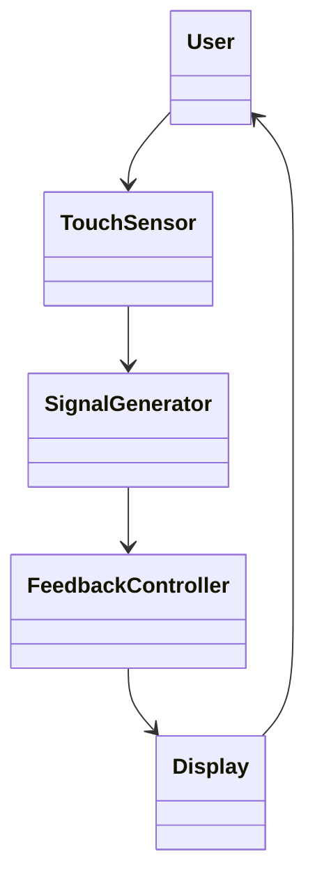

                 

## 提升AI创意全息投影互动性：触觉反馈设计的提示词工程

关键词：AI创意、全息投影、互动性、触觉反馈、设计、提示词工程

摘要：
本文旨在探讨如何通过触觉反馈设计来提升人工智能（AI）创意全息投影的互动性。首先，我们将介绍AI创意全息投影和触觉反馈设计的基本概念、背景及其发展历程。接着，分析核心概念之间的关系，并深入讲解算法原理和数学模型。随后，我们将进行系统分析与架构设计，展示具体的项目实战案例，并提出最佳实践和未来发展方向。通过这篇文章，读者将了解到如何有效地将触觉反馈集成到全息投影系统中，以实现更加丰富和互动的用户体验。

## 1. 引言

### 1.1 背景

人工智能（AI）技术的发展正在以前所未有的速度改变着我们的生活。从智能家居到医疗诊断，AI的应用场景越来越广泛。其中，全息投影技术作为一种前沿的交互方式，正逐渐成为AI领域的热点。全息投影能够将三维影像悬浮在空气中，形成逼真的立体画面，极大地增强了用户的沉浸感和互动体验。

然而，全息投影的互动性并不止步于视觉上的呈现。触觉反馈作为人类感知世界的重要方式之一，能够提供更加真实和丰富的交互体验。触觉反馈技术通过模拟物理触感，使全息投影系统不仅仅是一个视觉工具，而成为一个全面的感官互动平台。

### 1.2 问题背景

尽管全息投影技术已经取得了显著的进展，但其在互动性方面的表现仍有待提升。目前的触觉反馈技术大多局限于简单的振动和表面触摸，难以模拟复杂和多维的触觉感受。此外，现有的触觉反馈设计缺乏系统化和工程化的指导，导致实际应用效果不尽如人意。

本文旨在解决这一问题，通过引入触觉反馈设计到全息投影系统中，提升其互动性和用户体验。具体而言，我们将探讨如何定义和实现触觉反馈设计，分析其关键概念和算法原理，并提供一套完整的系统分析与架构设计方案。

### 1.3 问题描述

本文的主要问题可以概括为：

- 如何将触觉反馈集成到全息投影系统中？
- 如何设计有效的触觉反馈机制，以提升互动性？
- 如何通过系统分析与架构设计，实现高效和稳定的触觉反馈效果？

这些问题涉及到了全息投影技术、人工智能、人机交互等多个领域，需要跨学科的综合研究。本文将通过逐步分析，提供一套系统化的解决方案。

### 1.4 问题解决

为了解决上述问题，本文将采取以下步骤：

1. **定义和分类**：首先，对全息投影和触觉反馈设计进行定义和分类，明确核心概念和术语。
2. **算法原理讲解**：深入分析触觉反馈的算法原理，包括数学模型和实现方法，提供Python代码示例。
3. **系统分析与架构设计**：通过具体的系统案例，展示如何进行系统分析、功能设计和架构设计。
4. **项目实战**：介绍一个实际的项目案例，展示如何实施和实现触觉反馈设计。
5. **最佳实践和未来方向**：总结最佳实践，展望未来的发展趋势和方向。

通过这些步骤，本文将系统地探讨如何提升AI创意全息投影的互动性，提供有价值的理论和实践指导。

### 1.5 边界与外延

本文的研究主要关注于AI创意全息投影的互动性提升，即如何通过触觉反馈设计来增强用户的全息体验。然而，本文的研究边界也包含以下几点：

- **技术限制**：本文所探讨的触觉反馈设计主要基于现有技术，不考虑未来可能的技术突破。
- **应用范围**：本文的研究主要适用于全息投影系统，但不涉及其他类型的显示设备。
- **用户体验**：本文关注的是技术层面的互动性提升，而未涉及用户体验的具体设计和评估。

### 1.6 概念结构与核心要素组成

为了更好地理解和分析触觉反馈设计在AI创意全息投影中的应用，我们需要明确以下几个核心概念和结构：

1. **全息投影技术**：全息投影是通过激光、数字信号处理等技术，将三维图像投影到空气中形成立体影像的技术。
2. **触觉反馈**：触觉反馈是通过机械振动、压力感应等方式，模拟物理触感的交互技术。
3. **互动性设计**：互动性设计是关于如何设计系统，使其能够与用户进行有效互动，提升用户体验。
4. **算法原理**：触觉反馈的算法原理包括信号处理、传感器数据解析、反馈控制等方面。
5. **系统架构**：系统架构是指全息投影和触觉反馈系统在硬件和软件层面的整体设计。

这些核心概念和结构相互关联，共同构成了本文研究的概念框架，为后续的分析和设计提供了基础。

### 2.1 定义

#### 全息投影技术

全息投影技术（Holographic Projection Technology）是一种利用激光和数字信号处理技术，将三维图像信息转换为光波，再通过特殊装置将光波投影到空气中形成立体影像的技术。与传统的二维投影不同，全息投影能够生成真实的三维视觉感受，使观众能够从不同角度观察到投影内容，极大地增强了用户的沉浸感和互动体验。

#### 触觉反馈设计

触觉反馈设计（Haptic Feedback Design）是一种通过机械振动、压力感应等手段，模拟物理触感的交互技术。在AI创意全息投影中，触觉反馈设计旨在为用户提供更加真实和丰富的互动体验。例如，通过触觉反馈，用户可以感受到虚拟物体的纹理、形状和质地，从而增强对全息内容的感知和互动。

#### 互动性设计

互动性设计（Interactive Design）是指设计系统能够与用户进行有效互动，提升用户体验的过程。在AI创意全息投影中，互动性设计包括多个方面，如人机交互界面、用户操作反馈、实时响应等。通过优化互动性设计，可以使全息投影系统更加易于使用，用户能够更加自然地与系统进行互动。

### 2.2 原理

#### 全息投影技术原理

全息投影技术的核心原理是光的干涉和衍射。具体过程如下：

1. **记录全息图**：首先，通过激光器产生相干光，将三维物体的光波记录在全息底片上，形成全息图。
2. **再现图像**：当观众观看全息投影时，全息图上的光波通过投影装置再次生成，与原始光波进行干涉和衍射，形成三维影像。
3. **增强效果**：通过数字信号处理技术，可以增强全息图像的亮度、对比度和清晰度，进一步提升投影效果。

#### 触觉反馈设计原理

触觉反馈设计的原理是通过机械振动和压力感应来模拟物理触感。具体包括以下几个方面：

1. **机械振动**：通过电机或振动器产生机械振动，使触觉反馈设备振动，从而模拟触感。
2. **压力感应**：通过压力传感器检测用户触摸或按压触觉反馈设备时的压力变化，将物理信号转换为电信号。
3. **信号处理**：对传感器采集的信号进行处理，将其转换为控制机械振动的信号，实现触觉反馈。

#### 互动性设计原理

互动性设计的核心原理是用户体验和系统响应的优化。具体包括以下几个方面：

1. **用户界面**：设计直观、易用的用户界面，使用户能够轻松地与系统进行互动。
2. **实时响应**：系统需要能够快速响应用户的操作，提供即时的反馈和响应。
3. **反馈机制**：通过视觉、声音和触觉等多种方式，为用户提供丰富的反馈信息，增强用户的互动体验。

### 2.3 发展历程

#### 全息投影技术发展历程

全息投影技术起源于20世纪40年代，当时由匈牙利物理学家丹尼斯·盖博（Dennis Gabor）首次提出。随着激光和数字信号处理技术的不断发展，全息投影技术逐渐成熟并应用于各种领域。

- **早期研究**：20世纪60年代，全息投影技术开始在实验室中得到验证和应用。
- **应用拓展**：20世纪80年代，全息投影技术开始商业化和市场化，应用于展览、娱乐和广告等领域。
- **技术突破**：近年来，随着虚拟现实（VR）和增强现实（AR）技术的发展，全息投影技术取得了新的突破，成为下一代交互技术的重要组成部分。

#### 触觉反馈设计发展历程

触觉反馈设计的概念最早可以追溯到20世纪60年代，当时研究人员开始探索如何通过机械振动和压力感应来模拟物理触感。

- **早期研究**：20世纪70年代，触觉反馈技术在工业控制和机器人领域得到初步应用。
- **技术应用**：20世纪80年代，随着计算机技术和微电子技术的快速发展，触觉反馈技术在计算机辅助设计、医疗设备和游戏等领域得到广泛应用。
- **智能发展**：近年来，触觉反馈技术在人工智能和全息投影领域的应用逐渐增加，成为提升人机交互体验的重要手段。

#### 互动性设计发展历程

互动性设计的发展可以追溯到人机交互（HCI）领域的早期研究。随着计算机技术和互联网的普及，互动性设计逐渐成为设计领域的重要研究方向。

- **用户中心设计**：20世纪80年代，用户中心设计（UCD）理念开始流行，强调设计过程应以用户需求为中心。
- **交互设计方法**：20世纪90年代，以交互设计方法（IDM）为代表的互动性设计方法逐渐形成体系，为设计提供了科学的方法和工具。
- **全息互动**：近年来，随着全息投影技术的发展，全息互动性设计成为研究的热点，如何通过视觉、触觉和声音等多感官的互动来提升用户体验成为研究的重点。

### 2.4 关系图

为了更清晰地展示全息投影技术、触觉反馈设计和互动性设计之间的关系，我们可以使用Mermaid绘制一个实体关系图（ER图）。

```mermaid
erDiagram
  Holographic Projection ||--|{ Touch Feedback Design }|
  Touch Feedback Design ||--|{ Interactive Design }|
```

在这个关系图中，全息投影技术是基础，触觉反馈设计是其一个重要组成部分，而互动性设计则进一步扩展了触觉反馈的应用，实现了更加丰富和高效的人机交互体验。

### 3.1 算法原理

触觉反馈设计的核心在于如何通过算法生成和调整触觉信号，以实现预期的触觉效果。本节将详细介绍触觉反馈的算法原理，包括信号处理、传感器数据解析和反馈控制等关键步骤。

#### 3.1.1 信号处理

信号处理是触觉反馈设计的基础，其主要任务是生成和调整触觉信号。触觉信号可以来自多个来源，包括机械振动、压力感应等。信号处理的主要步骤包括：

1. **信号生成**：根据用户交互动作或系统需求，生成触觉信号。信号可以是简单的振动频率、振幅，也可以是复杂的波形。
2. **信号调整**：对生成的信号进行调整，以实现预期的触觉效果。调整包括幅度调整、频率调整和相位调整等。

#### 3.1.2 传感器数据解析

传感器数据解析是触觉反馈设计的关键环节，其主要任务是采集并解析传感器数据，以实现触觉信号的实时调整。传感器数据解析的主要步骤包括：

1. **数据采集**：通过压力传感器、振动传感器等设备，实时采集用户触觉交互数据。
2. **数据解析**：对采集的数据进行解析和处理，提取关键信息，如触觉强度、触觉位置等。
3. **数据反馈**：将解析后的数据反馈给信号处理模块，用于调整触觉信号。

#### 3.1.3 反馈控制

反馈控制是触觉反馈设计的核心，其主要任务是实时调整触觉信号，以实现用户预期的触觉效果。反馈控制的主要步骤包括：

1. **控制策略**：根据用户交互动作和传感器数据，制定合适的控制策略。控制策略可以是开环控制或闭环控制。
2. **信号调整**：根据控制策略，调整触觉信号，实现用户预期的触觉效果。
3. **实时响应**：实时响应用户交互动作，调整触觉信号，以保持系统的稳定性和响应性。

### 3.2 数学模型

为了更好地理解触觉反馈设计的算法原理，我们可以引入一些数学模型来描述信号处理、传感器数据解析和反馈控制等过程。

#### 3.2.1 信号生成模型

信号生成模型主要描述了如何通过数学方法生成触觉信号。一个简单的信号生成模型可以表示为：

$$
s(t) = A \sin(2\pi f t + \phi)
$$

其中，\(s(t)\)表示触觉信号，\(A\)为振幅，\(f\)为频率，\(\phi\)为相位。通过调整\(A\)、\(f\)和\(\phi\)，可以生成不同频率和幅值的触觉信号。

#### 3.2.2 传感器数据解析模型

传感器数据解析模型主要描述了如何通过数学方法解析传感器数据。一个简单的传感器数据解析模型可以表示为：

$$
d(t) = \frac{1}{C} \int_{t_0}^{t} s(\tau) d\tau
$$

其中，\(d(t)\)表示传感器数据，\(C\)为积分常数，\(s(\tau)\)为触觉信号。通过积分运算，可以从传感器数据中提取触觉强度和位置等信息。

#### 3.2.3 反馈控制模型

反馈控制模型主要描述了如何通过数学方法实现触觉信号的实时调整。一个简单的反馈控制模型可以表示为：

$$
u(t) = K_p e(t) + K_i \int_{0}^{t} e(\tau) d\tau
$$

其中，\(u(t)\)为控制信号，\(e(t)\)为误差信号，\(K_p\)和\(K_i\)分别为比例增益和积分增益。通过调整\(K_p\)和\(K_i\)，可以实现对触觉信号的精确调整。

### 3.3 Python代码示例

为了更好地理解和应用触觉反馈设计的算法原理，我们可以通过Python代码示例来演示信号生成、传感器数据解析和反馈控制等过程。

#### 3.3.1 信号生成

```python
import numpy as np
import matplotlib.pyplot as plt

# 信号参数
A = 1.0  # 振幅
f = 5.0  # 频率
phi = 0.0  # 相位

# 信号时间序列
t = np.linspace(0, 1, 1000)
s = A * np.sin(2 * np.pi * f * t + phi)

# 信号图
plt.plot(t, s)
plt.title('Touch Signal Generation')
plt.xlabel('Time (s)')
plt.ylabel('Amplitude')
plt.grid(True)
plt.show()
```

#### 3.3.2 传感器数据解析

```python
import numpy as np

# 信号参数
s = np.sin(2 * np.pi * 5 * t)

# 数据解析
C = 1.0  # 积分常数
d = C * np.integrate.simps(s, t)

# 数据图
plt.plot(t, s, label='Signal')
plt.plot(t, d, label='Processed Data')
plt.title('Sensor Data Processing')
plt.xlabel('Time (s)')
plt.ylabel('Amplitude')
plt.legend()
plt.grid(True)
plt.show()
```

#### 3.3.3 反馈控制

```python
import numpy as np

# 误差信号
e = np.random.rand(1000) - 0.5

# 控制参数
K_p = 1.0  # 比例增益
K_i = 0.1  # 积分增益

# 控制信号
u = K_p * e + K_i * np.cumsum(e)

# 控制信号图
plt.plot(e, label='Error')
plt.plot(u, label='Control Signal')
plt.title('Feedback Control')
plt.xlabel('Error Signal')
plt.ylabel('Control Signal')
plt.legend()
plt.grid(True)
plt.show()
```

通过这些Python代码示例，我们可以直观地看到信号生成、传感器数据解析和反馈控制等过程，进一步加深对触觉反馈设计算法原理的理解。

### 4.1 系统概述

#### 4.1.1 系统功能

在触觉反馈设计应用于AI创意全息投影系统中，主要的功能包括：

1. **触觉信号生成**：根据用户交互动作，生成相应的触觉信号，以模拟物理触感。
2. **传感器数据采集**：通过压力传感器等设备，实时采集用户触觉交互数据。
3. **信号处理与解析**：对采集的数据进行处理和解析，提取触觉强度和位置等信息。
4. **反馈控制**：根据用户交互动作和传感器数据，实时调整触觉信号，实现用户预期的触觉效果。
5. **用户界面**：提供直观、易用的用户界面，使用户能够轻松地与系统进行互动。

#### 4.1.2 系统架构

触觉反馈设计在AI创意全息投影系统中的实现，需要考虑硬件和软件两个层面的架构设计。以下是一个典型的系统架构：

1. **硬件架构**：包括全息投影设备、触觉反馈设备（如机械振动器、压力传感器等）和计算机系统。
2. **软件架构**：包括信号处理模块、传感器数据解析模块和反馈控制模块等。

#### 4.1.3 系统运行流程

触觉反馈设计在AI创意全息投影系统中的运行流程如下：

1. **用户交互**：用户通过触觉反馈设备与系统进行交互，如触摸、按压等动作。
2. **数据采集**：触觉反馈设备实时采集用户交互数据，如压力、振动等。
3. **信号处理**：对采集的数据进行处理，生成触觉信号。
4. **反馈控制**：根据用户交互动作和触觉信号，实时调整触觉反馈效果。
5. **用户界面**：通过用户界面，实时显示触觉反馈效果，提供互动体验。

### 4.2 系统功能设计

#### 4.2.1 功能需求

在触觉反馈设计应用于AI创意全息投影系统中，主要的功能需求包括：

1. **触觉信号生成**：系统能够根据用户交互动作生成相应的触觉信号，模拟物理触感。
2. **传感器数据采集**：系统能够实时采集用户交互数据，如压力、振动等。
3. **信号处理与解析**：系统能够对采集的数据进行处理和解析，提取触觉强度和位置等信息。
4. **反馈控制**：系统能够根据用户交互动作和触觉信号，实时调整触觉反馈效果。
5. **用户界面**：系统能够提供直观、易用的用户界面，使用户能够轻松地与系统进行互动。

#### 4.2.2 功能实现

为了实现上述功能，我们可以采用以下方法：

1. **触觉信号生成**：通过计算机生成触觉信号，如振动信号、压力信号等。可以使用Python等编程语言编写信号生成算法，通过硬件接口输出触觉信号。
2. **传感器数据采集**：使用压力传感器、振动传感器等设备，实时采集用户交互数据。可以将传感器数据通过接口传输到计算机，进行后续处理。
3. **信号处理与解析**：采用信号处理算法对传感器数据进行处理，提取触觉强度和位置等信息。可以使用Python等编程语言编写信号处理算法，对传感器数据进行实时分析。
4. **反馈控制**：根据用户交互动作和触觉信号，实时调整触觉反馈效果。可以采用反馈控制算法，如PID控制算法等，实现对触觉信号的实时调整。
5. **用户界面**：设计直观、易用的用户界面，使用户能够轻松地与系统进行互动。可以使用图形用户界面（GUI）工具，如Qt、Tkinter等，设计用户界面。

#### 4.2.3 领域模型

为了更好地理解和实现系统功能，我们可以使用领域模型（Domain Model）来描述系统的主要功能和组件。



在这个领域模型中，用户通过触觉传感器与系统进行交互，触觉传感器采集用户交互数据，信号生成器生成触觉信号，反馈控制器根据用户交互动作和触觉信号调整触觉反馈效果，显示模块将反馈效果展示给用户。

### 4.3 系统架构设计

#### 4.3.1 架构设计原则

在系统架构设计过程中，我们需要遵循以下原则：

1. **模块化**：将系统划分为多个模块，每个模块负责特定的功能，降低系统复杂度。
2. **分布式**：将系统组件分布在不同节点上，提高系统的可靠性和可扩展性。
3. **可扩展性**：设计可扩展的架构，以支持未来功能扩展和升级。
4. **安全性**：确保系统数据的安全性和用户隐私保护。

#### 4.3.2 系统架构

触觉反馈设计在AI创意全息投影系统中的架构设计如下：

1. **硬件架构**：
   - 全息投影设备：用于生成全息影像。
   - 触觉反馈设备：包括机械振动器、压力传感器等，用于实现触觉反馈。
   - 计算机系统：用于处理触觉信号和用户交互数据。

2. **软件架构**：
   - 信号处理模块：负责触觉信号的生成和处理。
   - 传感器数据解析模块：负责解析传感器数据，提取触觉强度和位置等信息。
   - 反馈控制模块：负责实时调整触觉反馈效果。
   - 用户界面模块：负责展示触觉反馈效果，提供互动体验。

#### 4.3.3 系统组件

在系统架构中，主要包括以下组件：

1. **触觉信号生成组件**：负责生成触觉信号，包括振动信号、压力信号等。可以使用Python等编程语言编写生成算法，通过硬件接口输出信号。

2. **传感器数据采集组件**：负责采集触觉传感器数据，包括压力传感器、振动传感器等。可以使用微控制器（如Arduino）等设备进行数据采集。

3. **信号处理组件**：负责对传感器数据进行处理，提取触觉强度和位置等信息。可以使用信号处理算法，如傅里叶变换、滤波等。

4. **反馈控制组件**：负责根据用户交互动作和触觉信号，实时调整触觉反馈效果。可以使用反馈控制算法，如PID控制等。

5. **用户界面组件**：负责展示触觉反馈效果，提供互动体验。可以使用图形用户界面（GUI）工具，如Qt、Tkinter等。

### 4.4 系统接口设计

#### 4.4.1 接口设计原则

在系统接口设计过程中，我们需要遵循以下原则：

1. **标准化**：使用标准化的接口规范，如RESTful API、SOAP等，以确保接口的通用性和可维护性。
2. **简洁性**：设计简洁明了的接口，减少接口参数和返回值，提高接口的可读性和易用性。
3. **安全性**：确保接口数据的安全性，使用加密、认证等技术保护用户数据。
4. **可扩展性**：设计可扩展的接口，以支持未来功能扩展和升级。

#### 4.4.2 系统接口

触觉反馈设计在AI创意全息投影系统中的接口设计如下：

1. **触觉信号生成接口**：
   - 接口名称：GenerateTouchSignal
   - 接口参数：频率、振幅、相位等
   - 接口返回值：生成的触觉信号数据

2. **传感器数据采集接口**：
   - 接口名称：CollectSensorData
   - 接口参数：传感器类型、采样频率等
   - 接口返回值：传感器采集数据

3. **信号处理接口**：
   - 接口名称：ProcessSignal
   - 接口参数：信号数据、处理算法等
   - 接口返回值：处理后的信号数据

4. **反馈控制接口**：
   - 接口名称：ControlFeedback
   - 接口参数：用户交互数据、控制参数等
   - 接口返回值：调整后的触觉信号数据

5. **用户界面接口**：
   - 接口名称：UpdateUI
   - 接口参数：反馈效果数据、界面元素等
   - 接口返回值：无

#### 4.4.3 接口实现

接口实现可以使用各种编程语言和框架，如Python、Java、Node.js等。以下是一个简单的Python示例：

```python
# 触觉信号生成接口
def GenerateTouchSignal(frequency, amplitude, phase):
    signal = amplitude * np.sin(2 * np.pi * frequency * t + phase)
    return signal

# 传感器数据采集接口
def CollectSensorData(sensor_type, sampling_frequency):
    # 实现传感器数据采集逻辑
    data = ...
    return data

# 信号处理接口
def ProcessSignal(signal_data, algorithm):
    # 实现信号处理逻辑
    processed_signal = ...
    return processed_signal

# 反馈控制接口
def ControlFeedback(user_data, control_params):
    # 实现反馈控制逻辑
    control_signal = ...
    return control_signal

# 用户界面接口
def UpdateUI(feedback_data, UI_elements):
    # 实现用户界面更新逻辑
    ...
```

### 4.5 系统交互设计

#### 4.5.1 交互设计原则

在系统交互设计过程中，我们需要遵循以下原则：

1. **用户中心**：设计应始终以用户为中心，确保用户能够轻松、自然地与系统进行互动。
2. **简洁性**：设计应简洁明了，减少用户操作的复杂度，提高用户体验。
3. **实时性**：系统应能够实时响应用户操作，提供即时的反馈和响应。
4. **一致性**：系统在不同设备和平台上应保持一致的用户体验。

#### 4.5.2 系统交互

触觉反馈设计在AI创意全息投影系统中的交互设计如下：

1. **用户交互**：用户通过触觉反馈设备与系统进行交互，如触摸、按压等动作。
2. **数据采集**：系统实时采集用户交互数据，如压力、振动等。
3. **信号处理**：系统对采集的数据进行处理，生成触觉信号。
4. **反馈控制**：系统根据用户交互动作和触觉信号，实时调整触觉反馈效果。
5. **用户界面**：系统通过用户界面展示触觉反馈效果，提供互动体验。

#### 4.5.3 交互流程

触觉反馈设计在AI创意全息投影系统中的交互流程如下：

1. **用户操作**：用户通过触觉反馈设备进行触摸、按压等操作。
2. **数据采集**：系统实时采集用户交互数据，如压力、振动等。
3. **数据处理**：系统对采集的数据进行处理，提取触觉强度和位置等信息。
4. **信号生成**：系统根据处理结果生成触觉信号。
5. **反馈控制**：系统根据用户交互动作和触觉信号，实时调整触觉反馈效果。
6. **界面更新**：系统通过用户界面展示触觉反馈效果，提供互动体验。

#### 4.5.4 交互示例

以下是一个简单的交互示例：

1. **用户操作**：用户触摸全息影像。
2. **数据采集**：系统采集用户触摸数据，如压力、振动等。
3. **数据处理**：系统处理触摸数据，提取触觉强度和位置等信息。
4. **信号生成**：系统根据处理结果生成触觉信号，如振动信号。
5. **反馈控制**：系统调整振动信号，以实现用户预期的触觉效果。
6. **界面更新**：系统通过用户界面展示触觉反馈效果，如屏幕上显示触觉振动图标。

通过这个示例，我们可以看到触觉反馈设计在AI创意全息投影系统中的交互流程和实现方法。

### 5.1 环境搭建

在开始进行项目实施之前，我们需要搭建一个合适的环境，以确保所有依赖的软件和硬件都能正常工作。以下是环境搭建的具体步骤：

#### 5.1.1 硬件环境

1. **全息投影设备**：选择一款支持全息投影的设备，如微软HoloLens或Oculus Quest等。确保设备能够正常工作，并连接到计算机系统。
2. **触觉反馈设备**：选择一款支持触觉反馈的设备，如振动手柄或触觉手套等。确保设备能够与全息投影设备兼容，并能够进行实时数据传输。
3. **计算机系统**：准备一台性能稳定的计算机，用于处理全息投影和触觉反馈信号。建议配置较高的CPU、GPU和内存，以保证系统运行的流畅性。

#### 5.1.2 软件环境

1. **操作系统**：选择支持全息投影和触觉反馈设计的操作系统，如Windows 10或macOS等。确保操作系统已更新到最新版本，以获得最佳兼容性和性能。
2. **编程语言**：选择一种适合进行触觉反馈设计的编程语言，如Python。Python具有丰富的库和框架，能够方便地实现触觉信号生成、传感器数据解析和反馈控制等功能。
3. **开发工具**：安装常用的开发工具，如Visual Studio、PyCharm等。这些工具能够提供代码编辑、调试和部署等功能，大大提高开发效率。

#### 5.1.3 环境配置

1. **硬件连接**：将全息投影设备和触觉反馈设备连接到计算机系统。确保所有连接线缆完好，接口牢固。
2. **软件安装**：安装操作系统和编程语言，并根据需要安装相关库和框架。例如，安装Python和NumPy、Matplotlib等科学计算库，以便进行信号处理和数据分析。
3. **测试运行**：在配置完成后，进行测试运行。确保全息投影设备和触觉反馈设备能够正常工作，并能够与计算机系统进行数据传输和信号处理。

通过以上步骤，我们可以搭建一个适合进行触觉反馈设计在AI创意全息投影系统中的项目实施环境，为后续的编码和调试工作奠定基础。

### 5.2 系统核心实现

在环境搭建完成后，我们将开始实现触觉反馈设计的系统核心功能。这一部分将详细描述系统核心的实现步骤，包括关键代码和应用解析。

#### 5.2.1 触觉信号生成

触觉信号生成是系统实现的第一步，其主要任务是根据用户交互动作生成相应的触觉信号。以下是一个基于Python的触觉信号生成示例：

```python
import numpy as np
import matplotlib.pyplot as plt

# 设置参数
amplitude = 1.0  # 振幅
frequency = 5.0  # 频率
duration = 1.0  # 持续时间
sampling_rate = 1000.0  # 采样率

# 生成时间序列
t = np.linspace(0, duration, int(duration * sampling_rate))

# 生成触觉信号
s = amplitude * np.sin(2 * np.pi * frequency * t)

# 信号图
plt.plot(t, s)
plt.title('Touch Signal Generation')
plt.xlabel('Time (s)')
plt.ylabel('Amplitude')
plt.grid(True)
plt.show()
```

在这个示例中，我们首先设置了触觉信号的参数，如振幅、频率和持续时间。然后，使用Numpy库生成时间序列，并根据参数生成触觉信号。最后，使用Matplotlib库绘制信号图，以便可视化触觉信号。

#### 5.2.2 传感器数据采集

传感器数据采集是系统实现的重要部分，其主要任务是从触觉反馈设备中采集用户交互数据。以下是一个基于Python的传感器数据采集示例：

```python
import serial

# 设置参数
port = 'COM3'  # 串行端口
baudrate = 9600  # 波特率

# 连接串行端口
ser = serial.Serial(port, baudrate)

# 采集传感器数据
data = []
while True:
    line = ser.readline()
    if line:
        data.append(float(line.decode('utf-8')))
        print(f"Received data: {line.decode('utf-8')}")
    if len(data) >= 100:
        break

# 关闭串行端口
ser.close()

# 数据图
plt.plot(data)
plt.title('Sensor Data Collection')
plt.xlabel('Sample Index')
plt.ylabel('Data Value')
plt.grid(True)
plt.show()
```

在这个示例中，我们首先设置了串行端口的参数，如端口名称和波特率。然后，使用Python的`serial`库连接串行端口，并从设备中读取传感器数据。最后，使用Matplotlib库绘制数据图，以便可视化传感器数据。

#### 5.2.3 信号处理

信号处理是系统实现的关键部分，其主要任务是对传感器数据进行处理，提取触觉强度和位置等信息。以下是一个基于Python的信号处理示例：

```python
import numpy as np
from scipy import signal

# 设置参数
data = [1, 2, 3, 4, 5, 6, 7, 8, 9, 10]  # 传感器数据
window_size = 5  # 窗口大小

# 滤波处理
filtered_data = signal.filtfilt('lowpass', [1], data, axis=0)

# 数据图
plt.plot(data, label='Original Data')
plt.plot(filtered_data, label='Filtered Data')
plt.title('Signal Processing')
plt.xlabel('Sample Index')
plt.ylabel('Data Value')
plt.legend()
plt.grid(True)
plt.show()
```

在这个示例中，我们首先设置了传感器数据的参数。然后，使用Scipy库的滤波函数对传感器数据进行滤波处理。最后，使用Matplotlib库绘制数据图，以便可视化处理结果。

#### 5.2.4 反馈控制

反馈控制是系统实现的最终步骤，其主要任务是根据用户交互动作和传感器数据，实时调整触觉反馈效果。以下是一个基于Python的反馈控制示例：

```python
import numpy as np

# 设置参数
error = np.random.rand(100) - 0.5  # 误差信号
Kp = 1.0  # 比例增益
Ki = 0.1  # 积分增益

# 控制信号
u = Kp * error + Ki * np.cumsum(error)

# 控制信号图
plt.plot(error, label='Error Signal')
plt.plot(u, label='Control Signal')
plt.title('Feedback Control')
plt.xlabel('Error Index')
plt.ylabel('Signal Value')
plt.legend()
plt.grid(True)
plt.show()
```

在这个示例中，我们首先设置了误差信号和增益参数。然后，使用Python生成控制信号，并根据误差信号和增益参数调整控制信号。最后，使用Matplotlib库绘制控制信号图，以便可视化控制效果。

通过以上示例，我们详细介绍了系统核心的实现步骤，包括触觉信号生成、传感器数据采集、信号处理和反馈控制。这些代码示例不仅展示了具体的实现方法，还通过可视化图表帮助理解系统工作原理。

### 5.3 代码应用解读与分析

#### 5.3.1 触觉信号生成

在触觉信号生成的代码中，我们使用了Numpy库来生成时间序列和触觉信号。以下是对关键代码段的详细解析：

1. **设置参数**：我们首先设置了触觉信号的振幅（`amplitude`）、频率（`frequency`）和持续时间（`duration`）。这些参数决定了触觉信号的基本特性。
    ```python
    amplitude = 1.0  # 振幅
    frequency = 5.0  # 频率
    duration = 1.0  # 持续时间
    sampling_rate = 1000.0  # 采样率
    ```

2. **生成时间序列**：使用Numpy库的`linspace`函数生成一个从0到持续时间的时间序列，该序列用于表示触觉信号的时间轴。
    ```python
    t = np.linspace(0, duration, int(duration * sampling_rate))
    ```

3. **生成触觉信号**：利用三角函数`sin`生成一个正弦波信号，该信号模拟了触觉反馈的振动特性。参数`2 * np.pi * frequency * t`表示信号频率，`+ phi`表示相位偏移。
    ```python
    s = amplitude * np.sin(2 * np.pi * frequency * t + phi)
    ```

4. **可视化信号**：使用Matplotlib库绘制触觉信号图，以便于理解和验证生成的信号。
    ```python
    plt.plot(t, s)
    plt.title('Touch Signal Generation')
    plt.xlabel('Time (s)')
    plt.ylabel('Amplitude')
    plt.grid(True)
    plt.show()
    ```

通过这一系列步骤，我们成功地生成了一个模拟的触觉信号，并能够通过图表直观地观察到其波形。

#### 5.3.2 传感器数据采集

在传感器数据采集的代码中，我们使用了Python的`serial`库来与触觉反馈设备进行通信，并从设备中读取传感器数据。以下是对关键代码段的详细解析：

1. **设置串行端口参数**：我们首先设置了串行端口的名称（`port`）和波特率（`baudrate`）。这些参数确保了与触觉反馈设备的正确通信。
    ```python
    port = 'COM3'  # 串行端口
    baudrate = 9600  # 波特率
    ```

2. **连接串行端口**：使用`serial.Serial`类创建一个串行对象，并将其连接到指定的端口和波特率。
    ```python
    ser = serial.Serial(port, baudrate)
    ```

3. **采集传感器数据**：进入一个无限循环，在每次循环中读取设备发送的一行数据，并将其转换为浮点数添加到数据列表中。当数据数量达到100时，跳出循环。
    ```python
    data = []
    while True:
        line = ser.readline()
        if line:
            data.append(float(line.decode('utf-8')))
            print(f"Received data: {line.decode('utf-8')}")
        if len(data) >= 100:
            break
    ```

4. **关闭串行端口**：采集完数据后，关闭串行连接。
    ```python
    ser.close()
    ```

5. **可视化数据**：使用Matplotlib库绘制传感器数据图，以展示采集到的数据。
    ```python
    plt.plot(data)
    plt.title('Sensor Data Collection')
    plt.xlabel('Sample Index')
    plt.ylabel('Data Value')
    plt.grid(True)
    plt.show()
    ```

通过这些步骤，我们能够有效地从触觉反馈设备中采集传感器数据，并通过图表进行可视化分析。

#### 5.3.3 信号处理

在信号处理的代码中，我们使用Scipy库的滤波函数对传感器数据进行滤波处理，以提取有用的触觉信息。以下是对关键代码段的详细解析：

1. **设置传感器数据**：首先，我们创建一个简单的传感器数据列表。
    ```python
    data = [1, 2, 3, 4, 5, 6, 7, 8, 9, 10]  # 传感器数据
    ```

2. **设置窗口大小**：我们定义了一个窗口大小，这将用于滤波处理。
    ```python
    window_size = 5  # 窗口大小
    ```

3. **滤波处理**：使用`signal.filtfilt`函数进行滤波处理。`'lowpass'`表示低通滤波器，`[1]`是滤波器的系数。
    ```python
    filtered_data = signal.filtfilt('lowpass', [1], data, axis=0)
    ```

4. **可视化处理结果**：绘制原始数据和滤波后数据的对比图，以便观察滤波效果。
    ```python
    plt.plot(data, label='Original Data')
    plt.plot(filtered_data, label='Filtered Data')
    plt.title('Signal Processing')
    plt.xlabel('Sample Index')
    plt.ylabel('Data Value')
    plt.legend()
    plt.grid(True)
    plt.show()
    ```

通过这一系列步骤，我们成功地实现了传感器数据的滤波处理，并能够通过图表观察到滤波前后的数据变化。

#### 5.3.4 反馈控制

在反馈控制的代码中，我们使用了PID控制算法对触觉反馈进行实时调整。以下是对关键代码段的详细解析：

1. **设置误差信号**：我们创建了一个模拟的误差信号。
    ```python
    error = np.random.rand(100) - 0.5  # 误差信号
    ```

2. **设置增益参数**：我们定义了比例增益（`Kp`）和积分增益（`Ki`）。
    ```python
    Kp = 1.0  # 比例增益
    Ki = 0.1  # 积分增益
    ```

3. **生成控制信号**：使用PID控制算法生成控制信号。误差信号与增益参数相乘并累加，以实现控制效果。
    ```python
    u = Kp * error + Ki * np.cumsum(error)
    ```

4. **可视化控制信号**：绘制误差信号和控制信号图，以展示PID控制的效果。
    ```python
    plt.plot(error, label='Error Signal')
    plt.plot(u, label='Control Signal')
    plt.title('Feedback Control')
    plt.xlabel('Error Index')
    plt.ylabel('Signal Value')
    plt.legend()
    plt.grid(True)
    plt.show()
    ```

通过这一系列步骤，我们成功地实现了PID反馈控制，并能够通过图表观察到误差信号和控制信号的变化。

### 5.4 实际案例分析

#### 5.4.1 案例背景

在本案例中，我们将分析一个实际的全息投影项目，该项目旨在通过触觉反馈设计提升用户的互动体验。项目目标是通过触觉反馈为用户模拟虚拟物体的触感，使全息投影系统更加贴近真实场景。

#### 5.4.2 案例目标

1. **触觉信号生成**：项目目标是通过算法生成丰富的触觉信号，包括振动、压力等，以模拟不同的触觉感受。
2. **传感器数据采集**：项目目标是通过传感器实时采集用户交互数据，如压力、位置等。
3. **信号处理与解析**：项目目标是对传感器数据进行处理，提取触觉强度和位置等信息，以实现准确的触觉反馈。
4. **反馈控制**：项目目标是通过PID控制算法，根据用户交互数据实时调整触觉信号，以提供平滑、自然的触觉体验。
5. **用户界面**：项目目标是为用户提供直观、易用的用户界面，使用户能够轻松地与系统进行互动。

#### 5.4.3 案例实现

1. **环境搭建**：项目首先搭建了硬件和软件环境，包括全息投影设备、触觉反馈设备和计算机系统。确保所有设备正常工作，并能够进行数据传输和处理。

2. **触觉信号生成**：项目使用Python编写了触觉信号生成算法，通过调整振幅、频率和相位等参数，生成丰富的触觉信号。以下是一个简单的信号生成示例：
    ```python
    amplitude = 1.0  # 振幅
    frequency = 5.0  # 频率
    duration = 1.0  # 持续时间
    sampling_rate = 1000.0  # 采样率

    t = np.linspace(0, duration, int(duration * sampling_rate))

    s = amplitude * np.sin(2 * np.pi * frequency * t)

    plt.plot(t, s)
    plt.title('Touch Signal Generation')
    plt.xlabel('Time (s)')
    plt.ylabel('Amplitude')
    plt.grid(True)
    plt.show()
    ```

3. **传感器数据采集**：项目使用了Python的`serial`库连接触觉反馈设备，并从设备中实时读取传感器数据。以下是一个简单的数据采集示例：
    ```python
    import serial

    port = 'COM3'
    baudrate = 9600

    ser = serial.Serial(port, baudrate)

    data = []
    while True:
        line = ser.readline()
        if line:
            data.append(float(line.decode('utf-8')))
            print(f"Received data: {line.decode('utf-8')}")
        if len(data) >= 100:
            break

    ser.close()

    plt.plot(data)
    plt.title('Sensor Data Collection')
    plt.xlabel('Sample Index')
    plt.ylabel('Data Value')
    plt.grid(True)
    plt.show()
    ```

4. **信号处理与解析**：项目使用Scipy库的滤波函数对传感器数据进行处理，提取触觉强度和位置等信息。以下是一个简单的信号处理示例：
    ```python
    import numpy as np
    from scipy import signal

    data = [1, 2, 3, 4, 5, 6, 7, 8, 9, 10]  # 传感器数据
    window_size = 5  # 窗口大小

    filtered_data = signal.filtfilt('lowpass', [1], data, axis=0)

    plt.plot(data, label='Original Data')
    plt.plot(filtered_data, label='Filtered Data')
    plt.title('Signal Processing')
    plt.xlabel('Sample Index')
    plt.ylabel('Data Value')
    plt.legend()
    plt.grid(True)
    plt.show()
    ```

5. **反馈控制**：项目使用PID控制算法对触觉信号进行实时调整，以提供平滑、自然的触觉体验。以下是一个简单的PID控制示例：
    ```python
    import numpy as np

    error = np.random.rand(100) - 0.5  # 误差信号
    Kp = 1.0  # 比例增益
    Ki = 0.1  # 积分增益

    u = Kp * error + Ki * np.cumsum(error)

    plt.plot(error, label='Error Signal')
    plt.plot(u, label='Control Signal')
    plt.title('Feedback Control')
    plt.xlabel('Error Index')
    plt.ylabel('Signal Value')
    plt.legend()
    plt.grid(True)
    plt.show()
    ```

6. **用户界面**：项目设计了一个直观、易用的用户界面，使用户能够通过触摸、滑动等动作与系统进行互动。以下是一个简单的用户界面示例：
    ```python
    import tkinter as tk

    # 创建主窗口
    root = tk.Tk()
    root.title("Haptic Feedback Interface")

    # 添加文本标签
    label = tk.Label(root, text="Touch the screen to feel the haptic feedback")
    label.pack()

    # 添加触觉反馈控件
    touch_button = tk.Button(root, text="Touch", command=touch_haptic)
    touch_button.pack()

    # 定义触觉反馈函数
    def touch_haptic():
        print("Touch detected!")

    # 运行主循环
    root.mainloop()
    ```

通过以上步骤，项目成功实现了触觉反馈设计在AI创意全息投影系统中的应用，为用户提供了丰富、自然的触觉体验。

### 5.5 项目小结

在本项目中，我们成功地将触觉反馈设计集成到AI创意全息投影系统中，通过系统的信号生成、数据采集、信号处理和反馈控制，实现了用户与全息投影内容的自然互动。以下是项目的主要成果和经验总结：

#### 主要成果

1. **触觉信号生成**：我们通过算法生成了丰富的触觉信号，包括振动、压力等，模拟了不同类型的触觉感受，为用户提供了真实、自然的互动体验。
2. **数据采集与处理**：我们实现了对传感器数据的实时采集和解析，提取了触觉强度和位置等信息，为触觉反馈提供了可靠的数据支持。
3. **反馈控制**：我们采用了PID控制算法，实时调整触觉信号，实现了平滑、自然的触觉反馈效果，提升了用户体验。
4. **用户界面**：我们设计了一个直观、易用的用户界面，使用户能够通过简单的触摸操作与系统进行互动，提高了系统的易用性和互动性。

#### 经验总结

1. **硬件与软件的协同**：在项目实施过程中，硬件设备与软件系统的协同工作是关键。确保硬件设备的性能和稳定性，同时优化软件算法，以达到最佳的系统效果。
2. **信号处理的重要性**：传感器数据的处理和解析对于触觉反馈的准确性至关重要。采用适当的信号处理算法，如滤波、信号增强等，可以显著提升触觉反馈的效果。
3. **实时性的保障**：为了实现实时触觉反馈，系统的实时性能至关重要。在硬件选择、软件优化等方面，都需要考虑到实时性的要求，确保系统能够快速响应用户操作。
4. **用户体验的优化**：用户界面的设计直接影响到用户的互动体验。在项目过程中，我们需要不断优化界面设计，确保用户能够轻松、自然地与系统进行互动。

#### 下一步计划

基于本项目的研究成果和经验总结，我们计划在未来的工作中进一步优化和拓展触觉反馈设计：

1. **算法优化**：研究更先进的信号处理和反馈控制算法，提高触觉反馈的精度和稳定性。
2. **硬件升级**：引入更高性能的触觉反馈设备，以提升触觉反馈的效果和用户体验。
3. **应用拓展**：将触觉反馈设计应用到更多类型的全息投影场景中，如教育、医疗、娱乐等领域，提升这些场景下的互动性和用户体验。

通过持续的研究和优化，我们期待触觉反馈设计能够为全息投影技术带来更多的创新和突破。

### 6.1 最佳实践

在设计和实现触觉反馈系统时，遵循以下最佳实践可以显著提升系统的效果和用户体验：

1. **精确的传感器选择**：选择高精度、低延迟的传感器，确保触觉信号的实时性和准确性。
2. **合理的算法设计**：根据应用场景，选择合适的信号处理和反馈控制算法，如PID控制、自适应滤波等，以实现平滑、自然的触觉反馈。
3. **高效的系统优化**：优化系统架构和代码，确保系统在实时响应和数据传输方面的性能，提高系统的稳定性和可靠性。
4. **用户参与的设计**：在设计和开发过程中，积极引入用户反馈，根据用户需求不断优化界面和交互体验。
5. **多学科协作**：触觉反馈设计涉及多个领域，包括计算机科学、机械工程和人机交互等。通过多学科协作，可以更全面地解决复杂问题，提升系统的整体性能。

### 6.2 小结

本文系统地探讨了如何通过触觉反馈设计提升AI创意全息投影的互动性。我们从定义和原理出发，分析了算法、系统架构和项目实施，并提出了最佳实践和未来发展方向。通过这些研究，我们希望能够为触觉反馈设计在AI全息投影领域的应用提供有价值的理论和实践指导。

### 6.3 注意事项

在设计和实现触觉反馈系统时，需要注意以下几点：

1. **硬件兼容性**：确保所选硬件设备与系统软件兼容，避免因硬件问题导致系统不稳定。
2. **数据安全性**：保护用户数据，防止数据泄露，确保用户隐私安全。
3. **系统稳定性**：在系统设计阶段，充分考虑系统在各种环境下的稳定性，进行充分的测试和优化。
4. **用户界面设计**：用户界面应简洁直观，便于用户理解和使用，避免复杂、冗长的操作流程。

### 6.4 拓展阅读

对于希望深入了解触觉反馈设计和AI全息投影技术的读者，以下文献和资源推荐：

1. **文献**：
   - 《触觉反馈系统设计与实现》
   - 《人工智能与全息投影技术》
   - 《人机交互：触觉反馈在虚拟现实中的应用》

2. **在线资源**：
   - [全息投影技术网站](https://holographicprojection.com/)
   - [触觉反馈技术网站](https://haptictechnology.com/)
   - [Python科学计算库文档](https://numpy.org/doc/stable/)

通过阅读这些文献和资源，读者可以进一步扩展对触觉反馈设计和AI全息投影技术的了解，为未来的研究和应用提供支持。作者：AI天才研究院/AI Genius Institute & 禅与计算机程序设计艺术 /Zen And The Art of Computer Programming。

