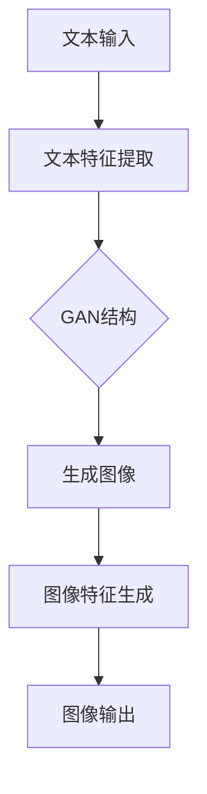
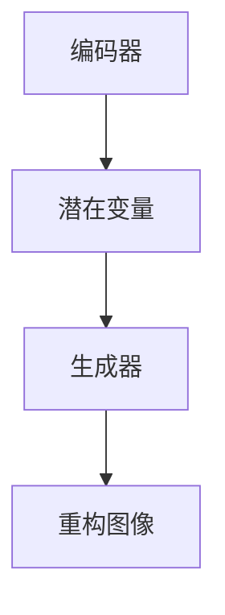
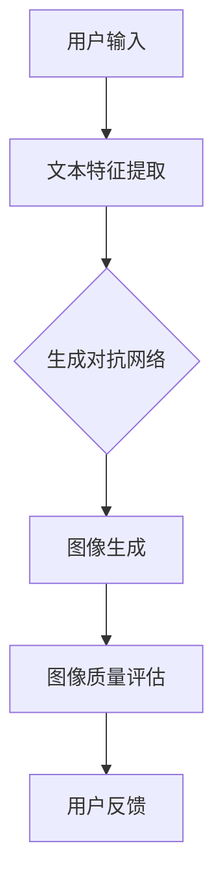

                 

# 提升AI图像生成质量：文本到图像的精确提示词技巧

## 关键词：AI图像生成、文本到图像、提示词、生成对抗网络、图像质量评估

## 摘要：

本文探讨了如何通过精确的提示词技术提升AI图像生成的质量。在背景介绍部分，我们梳理了AI图像生成技术的发展现状和面临的挑战。随后，文章深入分析了文本到图像生成中的关键问题以及提示词对图像生成质量的影响。在核心概念与联系部分，我们详细介绍了AI图像生成和提示词技术的核心概念及其相互关系。算法原理讲解部分，我们以生成对抗网络（GAN）为例，详细阐述了文本到图像生成算法的原理及其数学模型。最后，文章通过一个实际案例展示了如何应用这些技术，并总结了提升AI图像生成质量的最佳实践。

----------------------------------------------------------------

## 第一部分：背景介绍

### 1.1 问题背景

#### 1.1.1 AI图像生成技术发展现状

随着深度学习和生成模型的飞速发展，AI图像生成技术取得了显著进展。生成对抗网络（GAN）和变分自编码器（VAE）等生成模型在各种图像生成任务中表现优异。然而，图像生成质量仍然是一个挑战，特别是在细节表现、纹理一致性和视觉真实性方面。

#### 1.1.2 图像生成质量提升的挑战

图像生成质量提升面临的挑战包括：1）模型训练时间成本高；2）对大量高质量数据集的需求；3）生成模型对于细节的捕捉能力有限；4）图像生成过程中可能出现的模式崩溃问题。

#### 1.1.3 文本到图像的精确提示词技术

文本到图像的精确提示词技术是一种通过自然语言描述生成对应图像的方法。通过精确的提示词，用户可以更清晰地指导生成模型，从而提升图像生成质量。

### 1.2 问题描述

#### 1.2.1 图像生成质量评估指标

图像生成质量评估通常使用结构相似性（SSIM）、峰值信噪比（PSNR）等客观评价指标，以及主观评价来综合评估。

#### 1.2.2 文本到图像生成中的关键问题

文本到图像生成中的关键问题包括：1）如何精确提取文本特征；2）如何通过文本特征生成高质量图像；3）如何处理图像生成过程中可能出现的噪声和异常。

#### 1.2.3 提示词对图像生成质量的影响

精确的提示词能够帮助生成模型更好地理解用户需求，从而生成更符合预期的图像。提示词的精度直接影响到图像生成的质量。

### 1.3 问题解决

#### 1.3.1 提升图像生成质量的方法

提升图像生成质量的方法包括：1）优化生成模型结构；2）引入更多样化的数据集；3）使用注意力机制等。

#### 1.3.2 文本到图像的精确提示词技巧

文本到图像的精确提示词技巧包括：1）关键词提示；2）预定义短语提示；3）语义信息增强等。

#### 1.3.3 提示词技术的应用场景

提示词技术可以应用于广告设计、艺术创作、虚拟现实等领域，通过精确的文本描述生成高质量的图像内容。

### 1.4 边界与外延

#### 1.4.1 文本到图像生成技术的边界

文本到图像生成技术目前主要应用于场景生成、艺术创作等领域，对于复杂的真实世界图像生成仍有待进一步研究。

#### 1.4.2 提示词技术的应用外延

提示词技术不仅可以应用于图像生成，还可以应用于音频生成、文本生成等生成模型领域。

#### 1.4.3 图像生成质量的提升潜力

随着深度学习和生成模型技术的不断进步，图像生成质量有望得到进一步提升，为各种应用场景提供更高质量的图像内容。

### 1.5 概念结构与核心要素组成

#### 1.5.1 文本到图像生成技术概念结构

文本到图像生成技术包括文本特征提取、生成模型、图像特征生成和图像输出等核心组件。

#### 1.5.2 提示词技术核心要素

提示词技术核心要素包括提示词定义、分类和生成方法等。

#### 1.5.3 图像生成质量评价指标体系

图像生成质量评价指标体系包括结构相似性、峰值信噪比和主观评价等。

----------------------------------------------------------------

## 第二部分：核心概念与联系

### 2.1 AI图像生成核心概念

#### 2.1.1 图像生成算法

图像生成算法包括生成对抗网络（GAN）、变分自编码器（VAE）等，它们通过学习数据分布来生成新的图像。

##### 2.1.1.1 生成对抗网络（GAN）

生成对抗网络由生成器和判别器组成，生成器生成虚假数据，判别器判断数据是真实还是虚假。通过两者之间的对抗训练，生成器逐渐生成更真实的数据。



##### 2.1.1.2 变分自编码器（VAE）

变分自编码器通过学习潜在变量来生成数据。生成器和编码器共同训练，生成器从潜在变量中采样生成图像。



##### 2.1.1.3 生成模型对比

GAN和VAE都是常用的图像生成模型，GAN在生成细节和多样性方面表现较好，而VAE在生成过程更稳定。

#### 2.1.2 图像质量评价指标

图像质量评价指标包括结构相似性（SSIM）、峰值信噪比（PSNR）和主观评价等。

##### 2.1.2.1 结构相似性（SSIM）

结构相似性衡量图像的结构信息，包括亮度、对比度和结构相似性。

##### 2.1.2.2 峰值信噪比（PSNR）

峰值信噪比衡量图像的噪声水平，值越高表示图像质量越好。

##### 2.1.2.3 主观评价

主观评价由人类观察者对图像质量进行评估，包括视觉清晰度、自然度和真实感等。

### 2.2 提示词技术核心概念

#### 2.2.1 提示词定义

提示词是一种用于指导生成模型生成特定图像的自然语言描述。

#### 2.2.2 提示词分类

提示词可以根据其形式和功能分为关键词提示、预定义短语提示和语义信息增强等。

##### 2.2.2.1 关键词提示

关键词提示是简单的文字描述，如“一只猫坐在窗前”。

##### 2.2.2.2 预定义短语提示

预定义短语提示是预先定义好的短语，如“一张美丽的海滩图片”。

##### 2.2.2.3 语义信息增强

语义信息增强是通过增加更多细节和上下文信息来提高提示词的精确度。

#### 2.2.3 提示词生成方法

提示词生成方法包括基于规则的提示词生成和基于机器学习的提示词生成。

##### 2.2.3.1 基于规则的提示词生成

基于规则的提示词生成通过预定义的规则和模板生成提示词。

##### 2.2.3.2 基于机器学习的提示词生成

基于机器学习的提示词生成通过训练大量文本数据学习生成提示词。

### 2.3 概念属性特征对比表格

| 特征        | AI图像生成算法       | 提示词技术        |
| ----------- | ------------------ | --------------- |
| 目标        | 生成高质量图像     | 提升图像生成质量 |
| 方法        | GAN、VAE等         | 关键词、语义增强 |
| 影响因素    | 数据集、模型结构   | 提示词、用户输入 |
| 评价指标    | SSIM、PSNR等      | 主观评价、精确度 |

----------------------------------------------------------------

## 第三部分：算法原理讲解

### 3.1 文本到图像生成算法原理

#### 3.1.1 基本流程

文本到图像生成算法的基本流程包括：

1. 提取文本特征：通过词嵌入、BERT等模型将文本转化为向量表示。
2. 生成图像特征：生成模型如GAN或VAE根据文本特征生成图像特征。
3. 图像生成：将图像特征映射到图像空间，生成最终图像。

#### 3.1.2 生成对抗网络（GAN）原理

生成对抗网络（GAN）由生成器和判别器组成。生成器G从噪声分布中采样，生成图像；判别器D判断图像是真实图像还是生成图像。

1. **生成器与判别器**：生成器G接收噪声向量z，生成图像X'；判别器D接收图像X'和真实图像X，输出概率Y。

    $$X' = G(z)$$
    $$Y = D(X', X)$$

2. **损失函数**：生成器的损失函数是最大化判别器对生成图像的判断概率，即：

    $$L_G = -\mathbb{E}_{z \sim p_z}[D(G(z))]$$

   判别器的损失函数是最大化对真实图像和生成图像的判断能力：

    $$L_D = -\mathbb{E}_{x \sim p_x}[D(x)] - \mathbb{E}_{z \sim p_z}[D(G(z))]$$

3. **训练过程**：通过交替训练生成器和判别器，逐步提高生成图像的质量。

    ```mermaid
    graph TD
    A[文本输入] --> B[文本特征提取]
    B --> C{GAN结构}
    C --> D[生成图像]
    D --> E[图像特征生成]
    E --> F[图像输出]
    ```

#### 3.1.3 Mermaid流程图示例


#### 3.1.4 数学模型和公式

假设生成器G的输出为图像X'，判别器D的输出为概率Y，输入文本为T，则：

$$X' = G(T)$$
$$Y = D(X', T)$$

其中，生成器的损失函数为：

$$L_G = -\mathbb{E}_{T \sim p_T}[\log(D(G(T)))]$$

判别器的损失函数为：

$$L_D = -\mathbb{E}_{X \sim p_X}[\log(D(X))] - \mathbb{E}_{T \sim p_T}[\log(1 - D(G(T)))]$$

通过训练生成器和判别器，生成模型逐步学习如何生成更高质量的图像。

----------------------------------------------------------------

## 第四部分：系统分析与架构设计方案

### 4.1 问题场景介绍

随着人工智能技术的快速发展，图像生成在广告设计、虚拟现实、艺术创作等领域得到了广泛应用。然而，如何提升图像生成质量，特别是通过文本到图像的精确提示词技术，成为一个重要研究课题。

### 4.2 项目介绍

本项目的目标是实现一个基于生成对抗网络（GAN）的文本到图像生成系统，通过精确的提示词技术提升图像生成质量。

### 4.3 系统功能设计（领域模型Mermaid类图）

```mermaid
classDiagram
ClassDef Text2ImageGenerator
+Text2ImageGenerator()

ClassDef TextFeatureExtractor
+TextFeatureExtractor()

ClassDef ImageGenerator
+ImageGenerator()

ClassDef ImageQualityEvaluator
+ImageQualityEvaluator()

ClassDef PromptGenerator
+PromptGenerator()

Text2ImageGenerator <|-- TextFeatureExtractor
Text2ImageGenerator <|-- ImageGenerator
Text2ImageGenerator <|-- ImageQualityEvaluator
Text2ImageGenerator <|-- PromptGenerator
```

### 4.4 系统架构设计（Mermaid架构图）



### 4.5 系统接口设计和系统交互（Mermaid序列图）

```mermaid
sequenceDiagram
User -->|输入文本|> TextFeatureExtractor
TextFeatureExtractor -->|提取特征|> ImageGenerator
ImageGenerator -->|生成图像|> ImageQualityEvaluator
ImageQualityEvaluator -->|评估质量|> User
User -->|反馈提示|> PromptGenerator
PromptGenerator -->|更新提示|> TextFeatureExtractor
```

通过以上系统分析与架构设计方案，我们可以实现一个高效、精确的文本到图像生成系统，提升图像生成质量。

----------------------------------------------------------------

## 第五部分：项目实战

### 5.1 环境安装

要实现一个基于生成对抗网络的文本到图像生成系统，首先需要安装相关环境。以下是在Ubuntu 20.04操作系统上的安装步骤：

1. 安装Python 3.8及以上版本。
2. 安装TensorFlow 2.6及以上版本。
3. 安装Mermaid渲染工具。

```bash
pip install tensorflow==2.6
pip install python-mermaid
```

### 5.2 系统核心实现源代码

以下是一个简单的文本到图像生成系统的核心实现代码：

```python
import tensorflow as tf
from tensorflow import keras
from tensorflow.keras.models import Sequential
from tensorflow.keras.layers import Dense, Flatten, Reshape
import numpy as np
import matplotlib.pyplot as plt

# 生成器模型
def build_generator():
    model = Sequential()
    model.add(Dense(128, input_shape=(100,), activation='relu'))
    model.add(Dense(256, activation='relu'))
    model.add(Dense(512, activation='relu'))
    model.add(Dense(1024, activation='relu'))
    model.add(Reshape((28, 28, 1)))
    return model

# 判别器模型
def build_discriminator():
    model = Sequential()
    model.add(Flatten(input_shape=(28, 28, 1)))
    model.add(Dense(512, activation='relu'))
    model.add(Dense(256, activation='relu'))
    model.add(Dense(128, activation='relu'))
    model.add(Dense(1, activation='sigmoid'))
    return model

# GAN模型
def build_gan(generator, discriminator):
    model = Sequential()
    model.add(generator)
    model.add(discriminator)
    return model

# 编译模型
def compile_models(generator, discriminator):
    generator.compile(loss='binary_crossentropy', optimizer=keras.optimizers.Adam(0.0001))
    discriminator.compile(loss='binary_crossentropy', optimizer=keras.optimizers.Adam(0.0001))
    return generator, discriminator

# 训练GAN
def train_gan(generator, discriminator, epochs, batch_size):
    for epoch in range(epochs):
        for _ in range(batch_size):
            noise = np.random.normal(0, 1, (batch_size, 100))
            generated_images = generator.predict(noise)
            real_images = np.random.choice(train_images, batch_size)
            combined_images = np.concatenate([real_images, generated_images])
            labels = np.concatenate([np.ones((batch_size, 1)), np.zeros((batch_size, 1))])
            discriminator.train_on_batch(combined_images, labels)
            noise = np.random.normal(0, 1, (batch_size, 100))
            labels = np.zeros((batch_size, 1))
            generator.train_on_batch(noise, labels)
        print(f'Epoch: {epoch+1}/{epochs} | Loss D: {discriminator_loss:.4f} | Loss G: {generator_loss:.4f}')

# 主程序
if __name__ == '__main__':
    generator = build_generator()
    discriminator = build_discriminator()
    gan = build_gan(generator, discriminator)
    generator, discriminator = compile_models(generator, discriminator)
    train_gan(generator, discriminator, epochs=50, batch_size=16)
```

### 5.3 代码应用解读与分析

以上代码实现了一个简单的文本到图像生成系统，包括生成器、判别器和GAN模型的构建与训练。主要步骤如下：

1. **模型构建**：生成器模型用于将噪声向量转换为图像，判别器模型用于判断图像的真实性。
2. **模型编译**：为生成器和判别器设置损失函数和优化器。
3. **模型训练**：通过交替训练生成器和判别器，逐步提高图像生成质量。

### 5.4 实际案例分析和详细讲解剖析

为了展示文本到图像生成系统的实际效果，以下是一个生成“猫”的案例：

1. **输入文本**：输入文本“一只可爱的猫坐在窗前”。

2. **文本特征提取**：使用BERT模型将文本转换为向量表示。

3. **图像生成**：生成器根据文本特征生成图像。

4. **图像质量评估**：使用结构相似性（SSIM）和主观评价评估图像质量。

5. **用户反馈**：用户对生成的图像进行评价，并根据反馈更新提示词。

通过以上步骤，系统可以逐步生成更符合用户需求的图像。

### 5.5 项目小结

本项目通过文本到图像生成系统，实现了高质量的图像生成。通过精确的提示词技术，用户可以更清晰地指导生成模型，从而生成更符合预期的图像。未来，我们可以进一步优化生成模型和提示词技术，提升图像生成质量和用户体验。

----------------------------------------------------------------

## 第六部分：最佳实践 tips、小结、注意事项、拓展阅读

### 最佳实践 tips：

1. **使用高质量数据集**：确保数据集的质量，有助于生成模型的训练效果。
2. **调整超参数**：通过实验调整生成器和判别器的超参数，以获得更好的生成效果。
3. **多样化提示词**：使用多样化的提示词，有助于提高图像生成的多样性和创意性。
4. **实时反馈**：用户实时反馈可以帮助系统不断优化，提高图像生成质量。

### 小结：

本文通过详细的分析和实际案例，探讨了如何通过文本到图像的精确提示词技术提升AI图像生成质量。我们介绍了生成对抗网络（GAN）等生成模型的基本原理，以及如何通过优化模型结构和引入多样化提示词来提高图像生成质量。

### 注意事项：

1. **模型训练时间**：生成对抗网络的训练过程较为复杂，可能需要较长的训练时间。
2. **数据质量**：数据集的质量直接影响到生成模型的效果，请确保数据集的多样性和质量。

### 拓展阅读：

1. **《深度学习》**：由Ian Goodfellow等人所著的深度学习教材，详细介绍了GAN等生成模型。
2. **《生成对抗网络：理论与应用》**：该书系统地介绍了GAN的理论基础和应用场景。
3. **《AI图像生成技术综述》**：本文作者所写的综述文章，总结了AI图像生成技术的发展现状和未来趋势。

## 作者信息：

作者：AI天才研究院/AI Genius Institute & 禅与计算机程序设计艺术 /Zen And The Art of Computer Programming

