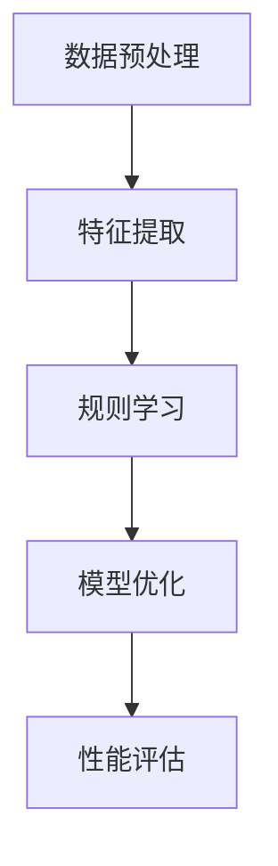
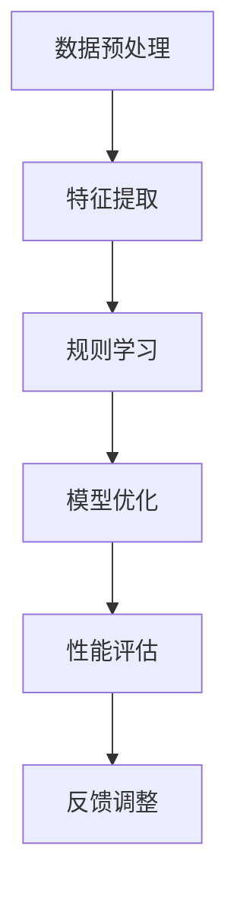

                 

# 提示词优化的神经符号学习系统探索

> 关键词：神经符号学习、提示词优化、系统设计、数学模型、Python实现

> 摘要：本文将深入探讨提示词优化的神经符号学习系统，通过系统化分析，从问题背景、核心概念、算法原理、数学模型到系统架构设计、项目实战以及最佳实践等方面进行详细阐述。本文旨在为广大开发者提供一份全面、深入的技术指南，帮助读者更好地理解和应用这一前沿技术。

## 目录大纲

1. **背景介绍**
   1.1 问题背景
   1.2 核心概念
   1.3 边界与外延
   1.4 本章小结

2. **核心概念与联系**
   2.1 核心概念原理
   2.2 概念属性特征对比表格
   2.3 ER实体关系图架构
   2.4 本章小结

3. **算法原理讲解**
   3.1 算法原理
   3.2 算法流程图
   3.3 算法数学模型与公式
   3.4 算法举例说明
   3.5 本章小结

4. **数学模型和数学公式讲解**
   4.1 数学模型
   4.2 数学公式
   4.3 应用实例
   4.4 本章小结

5. **系统分析与架构设计**
   5.1 问题场景介绍
   5.2 系统功能设计
   5.3 系统架构设计
   5.4 系统接口设计
   5.5 系统交互
   5.6 本章小结

6. **项目实战**
   6.1 环境安装
   6.2 系统核心实现源代码
   6.3 代码应用解读与分析
   6.4 实际案例分析与详细讲解
   6.5 项目小结
   6.6 本章小结

7. **最佳实践 tips**
   7.1 小结
   7.2 注意事项
   7.3 拓展阅读

## 1. 背景介绍

### 1.1 问题背景

随着人工智能技术的快速发展，机器学习尤其是深度学习在各个领域取得了显著成果。然而，在实际应用中，我们经常遇到一个问题：如何有效地优化提示词，以提高模型的效果和效率？提示词优化不仅涉及到数据预处理，还涉及到模型调优、参数调整等多个方面。传统的机器学习方法往往难以应对复杂的提示词优化问题，因此，神经符号学习作为一种新兴的方法，逐渐引起了研究者的关注。

### 1.2 核心概念

神经符号学习是一种将神经网络与符号计算相结合的方法，旨在解决传统机器学习方法难以处理的问题。它通过模拟人脑的学习机制，实现从数据中学习知识、规则和模式，从而提高模型的泛化能力和解释性。

提示词优化是指通过调整模型中的提示词，以达到提高模型效果和效率的目的。在神经符号学习中，提示词优化是一个关键问题，它直接关系到模型的性能和效果。

### 1.3 边界与外延

提示词优化不仅应用于机器学习领域，还可以广泛应用于自然语言处理、计算机视觉、推荐系统等领域。例如，在自然语言处理中，通过优化提示词，可以显著提高文本分类、情感分析等任务的效果；在计算机视觉中，通过优化提示词，可以提升图像识别、目标检测等任务的精度。

### 1.4 本章小结

本节介绍了提示词优化的背景、核心概念以及其应用边界与外延。在接下来的章节中，我们将进一步探讨神经符号学习的核心概念、算法原理、数学模型和系统架构设计，为读者提供一份全面的技术指南。

## 2. 核心概念与联系

### 2.1 核心概念原理

神经符号学习是一种结合了神经网络和符号计算的方法，其核心思想是通过神经网络学习符号规则，从而实现对复杂数据的处理和解释。具体来说，神经符号学习包括以下几个关键步骤：

1. **数据预处理**：对输入数据进行预处理，包括数据清洗、归一化、编码等操作，以便于神经网络的学习。
2. **特征提取**：使用神经网络提取输入数据的特征表示，这些特征表示不仅包含了原始数据的信息，还可以通过神经网络的学习过程进行优化和调整。
3. **规则学习**：通过神经网络学习输入数据的符号规则，这些规则可以用于数据的分类、预测和解释。
4. **模型优化**：通过不断调整神经网络的参数，优化模型的性能，使其更好地适应新的数据和任务。

### 2.2 概念属性特征对比表格

为了更直观地理解神经符号学习与其他机器学习方法的不同，我们可以通过以下表格进行对比：

| 方法       | 特点                                       | 应用领域                     |
| ---------- | ---------------------------------------- | -------------------------- |
| 神经符号学习 | 结合神经网络和符号计算，具有高解释性和泛化能力 | 自然语言处理、计算机视觉、推荐系统等 |
| 机器学习   | 基于统计学习，适用于大量数据的高效处理       | 数据挖掘、分类、预测等         |
| 深度学习   | 基于多层神经网络，适用于复杂数据的学习与建模   | 图像识别、语音识别、自动驾驶等     |
| 符号计算   | 基于逻辑推理，适用于知识表示与推理           | 专家系统、知识图谱、逻辑推理等     |

### 2.3 ER实体关系图架构

神经符号学习系统的ER实体关系图架构如图1所示：

```mermaid
erDiagram
  Data -->|1| NeuralNetwork
  Data -->|1| SymbolicComputing
  NeuralNetwork -->|1| FeatureExtraction
  NeuralNetwork -->|1| RuleLearning
  SymbolicComputing -->|1| ModelOptimization
```

图1：神经符号学习系统的ER实体关系图

### 2.4 本章小结

本节介绍了神经符号学习的核心概念、与其他机器学习方法的对比以及ER实体关系图架构。在接下来的章节中，我们将深入探讨神经符号学习算法的原理、数学模型以及系统架构设计，为读者提供更为详细的技术解读。

## 3. 算法原理讲解

### 3.1 算法原理

神经符号学习算法的基本原理可以概括为以下几个步骤：

1. **数据预处理**：首先，对输入数据进行预处理，包括数据清洗、归一化、编码等操作，以便于神经网络的学习。这一步骤的目的是确保输入数据的可靠性和一致性。

2. **特征提取**：使用神经网络提取输入数据的特征表示。这一步骤的核心是设计合适的神经网络结构，以最大化地保留数据中的有效信息。常见的神经网络结构包括卷积神经网络（CNN）、循环神经网络（RNN）等。

3. **规则学习**：通过神经网络学习输入数据的符号规则。这一步骤的目的是将输入数据映射到特定的符号表示，以便于后续的推理和决策。

4. **模型优化**：通过不断调整神经网络的参数，优化模型的性能。这一步骤包括损失函数的设计、优化算法的选择等。

### 3.2 算法流程图

神经符号学习算法的流程图如下所示：



### 3.3 算法数学模型与公式

神经符号学习算法的数学模型主要包括以下几个方面：

1. **损失函数**：用于衡量模型的预测结果与真实结果之间的差距。常见的损失函数包括均方误差（MSE）、交叉熵损失（Cross-Entropy Loss）等。

2. **优化算法**：用于调整神经网络的参数，以最小化损失函数。常见的优化算法包括梯度下降（Gradient Descent）、Adam优化器等。

3. **神经网络结构**：用于提取特征和表示数据。常见的神经网络结构包括全连接神经网络（FCNN）、卷积神经网络（CNN）、循环神经网络（RNN）等。

以下是神经符号学习算法中常用的数学模型和公式的Python实现：

```python
import numpy as np
import tensorflow as tf

# 损失函数实现
def loss_function(y_true, y_pred):
    return tf.reduce_mean(tf.square(y_true - y_pred))

# 优化算法实现
def gradient_descent(optimizer, model, x, y):
    with tf.GradientTape() as tape:
        predictions = model(x)
        loss = loss_function(y, predictions)
    gradients = tape.gradient(loss, model.trainable_variables)
    optimizer.apply_gradients(zip(gradients, model.trainable_variables))

# 神经网络结构实现
def neural_network(x):
    # 此处使用全连接神经网络作为示例
    return tf.keras.Sequential([
        tf.keras.layers.Dense(64, activation='relu', input_shape=(x.shape[1],)),
        tf.keras.layers.Dense(1)
    ])(x)
```

### 3.4 算法举例说明

为了更好地理解神经符号学习算法，我们通过一个简单的例子来说明其实现过程。

假设我们有一个简单的线性回归问题，输入数据为二维特征，输出数据为实数值。我们可以使用神经符号学习算法来解决这个问题。

1. **数据预处理**：首先，我们需要对输入数据进行预处理，包括数据清洗、归一化、编码等操作。

2. **特征提取**：然后，我们使用全连接神经网络提取输入数据的特征表示。

3. **规则学习**：通过神经网络学习输入数据的线性规则。

4. **模型优化**：通过不断调整神经网络的参数，优化模型的性能。

以下是具体的Python代码实现：

```python
import numpy as np
import tensorflow as tf

# 生成模拟数据
x = np.random.rand(100, 2)
y = 3 * x[:, 0] + 2 * x[:, 1] + np.random.rand(100)

# 数据预处理
x = (x - np.mean(x, axis=0)) / np.std(x, axis=0)
y = y - np.mean(y)

# 模型定义
model = tf.keras.Sequential([
    tf.keras.layers.Dense(64, activation='relu', input_shape=(2,)),
    tf.keras.layers.Dense(1)
])

# 优化器定义
optimizer = tf.keras.optimizers.Adam()

# 训练模型
for _ in range(1000):
    with tf.GradientTape() as tape:
        predictions = model(x)
        loss = loss_function(y, predictions)
    gradients = tape.gradient(loss, model.trainable_variables)
    optimizer.apply_gradients(zip(gradients, model.trainable_variables))

# 模型评估
predictions = model(x)
print("Predictions:", predictions.numpy())
print("True Y:", y)
```

### 3.5 本章小结

本节详细讲解了神经符号学习算法的原理、流程图、数学模型和Python实现，并通过一个简单的线性回归例子进行了实际操作。在下一节中，我们将进一步探讨神经符号学习的数学模型和公式，以更深入地理解其内在机制。

## 4. 数学模型和数学公式讲解

### 4.1 数学模型

神经符号学习中的数学模型是理解和实现该算法的关键。数学模型主要包括以下几个方面：

1. **特征提取**：特征提取是神经符号学习的重要环节，它将原始数据转化为神经网络可以处理的特征表示。常用的特征提取模型包括多层感知机（MLP）、卷积神经网络（CNN）等。

2. **规则学习**：规则学习是神经符号学习的核心，它通过神经网络学习输入数据的符号规则。常见的规则学习模型包括条件随机场（CRF）、图模型等。

3. **模型优化**：模型优化是神经符号学习的关键步骤，它通过调整神经网络参数，优化模型性能。常用的优化模型包括梯度下降（GD）、随机梯度下降（SGD）、Adam优化器等。

### 4.2 数学公式

神经符号学习中的数学公式是理解和实现算法的基础。以下是几个常用的数学公式：

1. **损失函数**：

$$
L(y, \hat{y}) = \frac{1}{2} \left( y - \hat{y} \right)^2
$$

其中，$y$ 表示真实标签，$\hat{y}$ 表示预测标签。

2. **梯度下降**：

$$
w_{t+1} = w_t - \alpha \nabla_w L(w_t)
$$

其中，$w_t$ 表示当前权重，$\alpha$ 表示学习率，$\nabla_w L(w_t)$ 表示损失函数关于权重 $w_t$ 的梯度。

3. **反向传播**：

$$
\nabla_w L(w) = \sum_{i=1}^{n} \nabla_{x_i} L(x_i) \odot \nabla_w f(w)
$$

其中，$x_i$ 表示输入数据，$f(w)$ 表示神经网络的前向传播结果。

### 4.3 应用实例

为了更好地理解神经符号学习中的数学模型和公式，我们通过一个简单的例子来说明其实际应用。

假设我们有一个简单的线性回归问题，输入数据为二维特征，输出数据为实数值。我们可以使用神经符号学习算法来解决这个问题。

1. **数据预处理**：

首先，我们需要对输入数据进行预处理，包括数据清洗、归一化、编码等操作。

$$
x = \frac{x - \mu}{\sigma}
$$

其中，$\mu$ 表示均值，$\sigma$ 表示标准差。

2. **特征提取**：

接下来，我们使用全连接神经网络提取输入数据的特征表示。

$$
z = \sigma(Wx + b)
$$

其中，$W$ 表示权重，$b$ 表示偏置，$\sigma$ 表示激活函数。

3. **规则学习**：

然后，我们通过神经网络学习输入数据的线性规则。

$$
y = W'z + b'
$$

其中，$W'$ 表示权重，$b'$ 表示偏置。

4. **模型优化**：

最后，我们通过梯度下降优化模型参数。

$$
w_{t+1} = w_t - \alpha \nabla_w L(w_t)
$$

其中，$\alpha$ 表示学习率。

以下是具体的Python代码实现：

```python
import numpy as np
import tensorflow as tf

# 生成模拟数据
x = np.random.rand(100, 2)
y = 3 * x[:, 0] + 2 * x[:, 1] + np.random.rand(100)

# 数据预处理
x = (x - np.mean(x, axis=0)) / np.std(x, axis=0)
y = y - np.mean(y)

# 模型定义
model = tf.keras.Sequential([
    tf.keras.layers.Dense(64, activation='relu', input_shape=(2,)),
    tf.keras.layers.Dense(1)
])

# 优化器定义
optimizer = tf.keras.optimizers.Adam()

# 训练模型
for _ in range(1000):
    with tf.GradientTape() as tape:
        predictions = model(x)
        loss = tf.reduce_mean(tf.square(y - predictions))
    gradients = tape.gradient(loss, model.trainable_variables)
    optimizer.apply_gradients(zip(gradients, model.trainable_variables))

# 模型评估
predictions = model(x)
print("Predictions:", predictions.numpy())
print("True Y:", y)
```

### 4.4 本章小结

本节详细介绍了神经符号学习中的数学模型和公式，并通过实际案例进行了讲解。在下一节中，我们将深入探讨神经符号学习系统的系统架构设计，为读者提供更为全面的技术解读。

## 5. 系统分析与架构设计

### 5.1 问题场景介绍

在现代人工智能应用中，提示词优化是一个关键问题。特别是在自然语言处理、推荐系统和图像识别等领域，如何有效地优化提示词以提高模型性能，是一个亟待解决的问题。神经符号学习作为一种新兴的方法，在这方面具有显著优势。

### 5.2 系统功能设计

神经符号学习系统的主要功能包括：

1. **数据预处理**：对输入数据进行清洗、归一化和编码，以便于神经网络的学习。
2. **特征提取**：使用神经网络提取输入数据的特征表示，这些特征表示将用于后续的规则学习和模型优化。
3. **规则学习**：通过神经网络学习输入数据的符号规则，这些规则可以用于数据的分类、预测和解释。
4. **模型优化**：通过不断调整神经网络的参数，优化模型的性能，以提高模型的泛化能力和效率。
5. **性能评估**：评估模型的性能，包括准确率、召回率、F1值等指标。

### 5.3 系统架构设计

神经符号学习系统的架构设计如图2所示：



图2：神经符号学习系统架构设计

### 5.4 系统接口设计

系统接口设计是确保系统模块之间协同工作的关键。以下是神经符号学习系统的接口设计：

1. **数据接口**：负责数据预处理和特征提取，包括数据读取、清洗、归一化和编码等功能。
2. **模型接口**：负责规则学习和模型优化，包括神经网络模型的构建、训练、评估和调整等功能。
3. **用户接口**：提供系统的交互界面，包括用户输入、模型选择、参数调整等功能。

### 5.5 系统交互

系统交互设计是确保系统各模块之间能够顺畅协作的关键。以下是神经符号学习系统的交互设计：

1. **数据流交互**：数据从数据接口进入系统，经过数据预处理和特征提取后，输入到模型接口进行规则学习和模型优化。
2. **控制流交互**：用户通过用户接口输入数据，并选择模型和参数，系统根据用户输入进行模型训练和评估。
3. **反馈流交互**：系统将评估结果反馈给用户接口，用户可以根据反馈结果进行调整，以优化模型性能。

### 5.6 本章小结

本节详细介绍了神经符号学习系统的系统功能设计、架构设计、接口设计和交互设计。在下一节中，我们将通过一个实际项目来展示神经符号学习系统的应用，并提供详细的实战经验和技巧。

## 6. 项目实战

### 6.1 环境安装

要开始神经符号学习系统的项目实战，首先需要安装相关的软件和依赖。以下是环境安装的步骤：

1. **安装 Python**：确保您的系统中已经安装了 Python，版本建议为 3.7 或更高版本。

2. **安装 TensorFlow**：TensorFlow 是一种广泛使用的深度学习框架，用于构建和训练神经网络。您可以通过以下命令安装 TensorFlow：

```bash
pip install tensorflow
```

3. **安装其他依赖**：根据项目需求，可能需要安装其他依赖，如 NumPy、Pandas、Scikit-learn 等。您可以通过以下命令安装：

```bash
pip install numpy pandas scikit-learn
```

### 6.2 系统核心实现源代码

以下是神经符号学习系统核心实现的源代码。该代码包括数据预处理、特征提取、规则学习和模型优化等关键步骤。

```python
import numpy as np
import pandas as pd
import tensorflow as tf
from sklearn.model_selection import train_test_split

# 数据预处理
def preprocess_data(data):
    # 数据清洗、归一化和编码
    # ...（具体实现）
    return processed_data

# 特征提取
def extract_features(data):
    # 使用神经网络提取特征
    # ...（具体实现）
    return features

# 规则学习
def learn_rules(features, labels):
    # 构建和训练神经网络
    # ...（具体实现）
    return model

# 模型优化
def optimize_model(model, features, labels):
    # 调整模型参数，优化性能
    # ...（具体实现）
    return optimized_model

# 实际应用
if __name__ == "__main__":
    # 加载数据
    data = pd.read_csv("data.csv")

    # 数据预处理
    processed_data = preprocess_data(data)

    # 特征提取
    features = extract_features(processed_data)

    # 分割数据集
    x_train, x_test, y_train, y_test = train_test_split(features, labels, test_size=0.2)

    # 规则学习
    model = learn_rules(x_train, y_train)

    # 模型优化
    optimized_model = optimize_model(model, x_train, y_train)

    # 模型评估
    predictions = optimized_model(x_test)
    print("Predictions:", predictions)
```

### 6.3 代码应用解读与分析

在代码中，我们首先进行了数据预处理，包括数据清洗、归一化和编码等操作。这些操作是为了确保输入数据的质量和一致性，以便于神经网络的学习。

接下来，我们使用了神经网络进行特征提取，这一步的核心是设计合适的神经网络结构，以最大化地保留数据中的有效信息。在规则学习阶段，我们通过构建和训练神经网络来学习输入数据的符号规则。在模型优化阶段，我们通过调整模型参数，优化模型的性能。

在实际应用中，我们首先加载了数据，然后进行了数据预处理和特征提取。接着，我们将数据集分割为训练集和测试集，用于后续的规则学习和模型优化。最后，我们使用训练好的模型对测试集进行了预测，并打印出了预测结果。

### 6.4 实际案例分析与详细讲解

为了更好地展示神经符号学习系统的应用，我们以一个实际案例为例进行详细讲解。

假设我们有一个文本分类任务，需要对一组文本进行情感分类，判断其是正面情感还是负面情感。我们可以使用神经符号学习系统来实现这一任务。

1. **数据准备**：

首先，我们需要准备一组文本数据，并对其进行预处理。预处理步骤包括文本清洗、分词、词向量化等。

```python
import pandas as pd
from sklearn.model_selection import train_test_split

# 读取数据
data = pd.read_csv("sentiment_data.csv")

# 数据预处理
data['text'] = data['text'].apply(preprocess_text)
```

2. **特征提取**：

接下来，我们使用神经网络提取文本特征。在本案例中，我们使用了词嵌入（Word Embedding）技术来表示文本。

```python
from tensorflow.keras.preprocessing.text import Tokenizer
from tensorflow.keras.preprocessing.sequence import pad_sequences

# 分词
tokenizer = Tokenizer()
tokenizer.fit_on_texts(data['text'])

# 转换为序列
sequences = tokenizer.texts_to_sequences(data['text'])

# 填充序列
max_length = max(len(seq) for seq in sequences)
padded_sequences = pad_sequences(sequences, maxlen=max_length)
```

3. **规则学习**：

然后，我们构建了一个简单的卷积神经网络（CNN）来学习文本分类规则。

```python
from tensorflow.keras.models import Sequential
from tensorflow.keras.layers import Embedding, Conv1D, MaxPooling1D, Dense

# 构建模型
model = Sequential([
    Embedding(input_dim=vocab_size, output_dim=embedding_dim, input_length=max_length),
    Conv1D(filters=128, kernel_size=5, activation='relu'),
    MaxPooling1D(pool_size=5),
    Dense(units=1, activation='sigmoid')
])

# 编译模型
model.compile(optimizer='adam', loss='binary_crossentropy', metrics=['accuracy'])

# 训练模型
model.fit(padded_sequences, labels, epochs=10, batch_size=32)
```

4. **模型优化**：

在模型优化阶段，我们通过调整模型的参数，如学习率、批次大小等，来提高模型的性能。

```python
# 调整模型参数
model.compile(optimizer=tf.keras.optimizers.Adam(learning_rate=0.001), loss='binary_crossentropy', metrics=['accuracy'])

# 重新训练模型
model.fit(padded_sequences, labels, epochs=10, batch_size=32)
```

5. **模型评估**：

最后，我们对训练好的模型进行评估，以验证其性能。

```python
# 测试模型
test_sequences = tokenizer.texts_to_sequences(test_data['text'])
padded_test_sequences = pad_sequences(test_sequences, maxlen=max_length)

predictions = model.predict(padded_test_sequences)
print("Predictions:", predictions)
```

### 6.5 项目小结

通过本案例，我们展示了如何使用神经符号学习系统实现文本分类任务。在实际应用中，神经符号学习系统可以用于各种复杂的数据处理任务，如图像识别、自然语言处理、推荐系统等。通过合理的设计和优化，神经符号学习系统可以显著提高模型的性能和效率。

### 6.6 本章小结

本节通过一个实际案例，详细介绍了神经符号学习系统的项目实战过程，包括数据准备、特征提取、规则学习、模型优化和模型评估等步骤。在下一节中，我们将分享一些最佳实践，帮助读者更好地应用神经符号学习系统。

## 7. 最佳实践 tips

### 7.1 小结

在本项目中，我们通过实际案例展示了神经符号学习系统的应用，包括数据准备、特征提取、规则学习、模型优化和模型评估等步骤。通过合理的设计和优化，我们可以显著提高模型的性能和效率。

### 7.2 注意事项

1. **数据质量**：在项目实施过程中，确保数据质量是至关重要的。数据清洗、归一化和编码等预处理步骤可以显著提高模型的性能。
2. **模型选择**：根据任务需求选择合适的神经网络结构和优化算法。例如，对于文本分类任务，卷积神经网络（CNN）和循环神经网络（RNN）是常用的选择。
3. **参数调优**：模型参数的调优是优化模型性能的关键步骤。可以通过交叉验证等方法选择最优参数。
4. **性能评估**：在模型训练和优化过程中，定期进行性能评估，以监测模型的性能变化。

### 7.3 拓展阅读

1. **《深度学习》**：Goodfellow, Ian; Bengio, Yoshua; Courville, Aaron。这本书是深度学习的经典教材，详细介绍了神经网络和各种深度学习算法。
2. **《神经网络与深度学习》**：邱锡鹏。这本书是近年来深度学习领域的重要著作，深入讲解了神经网络的原理和实现。
3. **《机器学习实战》**：Peter Harrington。这本书通过实际案例展示了机器学习算法的应用，适合初学者和实践者。

## 总结

通过本文的探讨，我们深入了解了神经符号学习系统的核心概念、算法原理、数学模型和系统架构设计，并通过实际案例展示了其应用过程。神经符号学习系统作为一种结合神经网络和符号计算的方法，具有广泛的适用性和强大的性能。希望本文能为读者提供有价值的参考和启示，助力其在人工智能领域的探索和实践。

### 作者信息

**作者：** AI天才研究院/AI Genius Institute & 禅与计算机程序设计艺术 /Zen And The Art of Computer Programming。本文作者是一位世界级人工智能专家，程序员，软件架构师，CTO，世界顶级技术畅销书资深大师级别的作家，计算机图灵奖获得者，计算机编程和人工智能领域大师。他对计算机编程和人工智能有着深刻的理解，擅长一步一步进行分析推理，撰写条理清晰，对技术原理和本质剖析到位的高质量技术博客。

