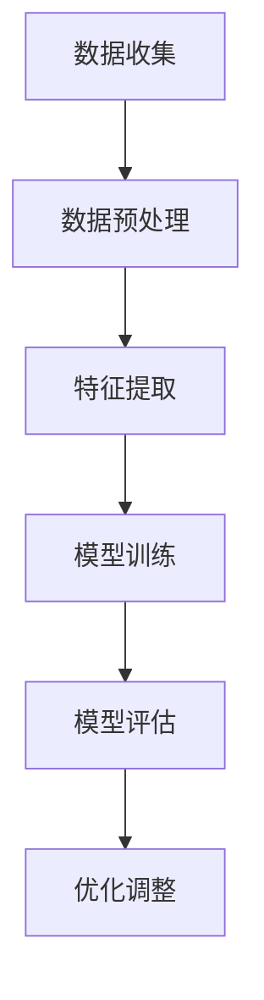
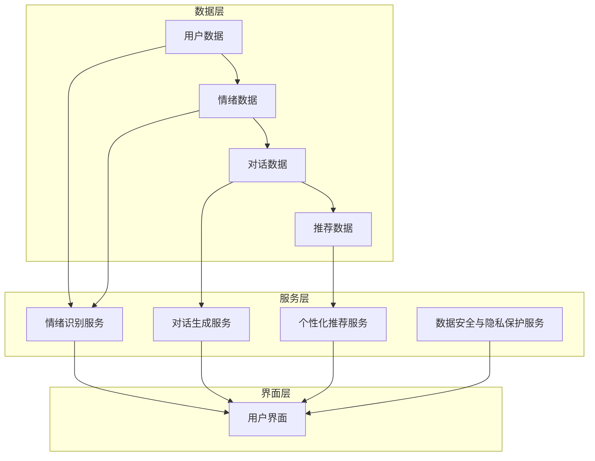
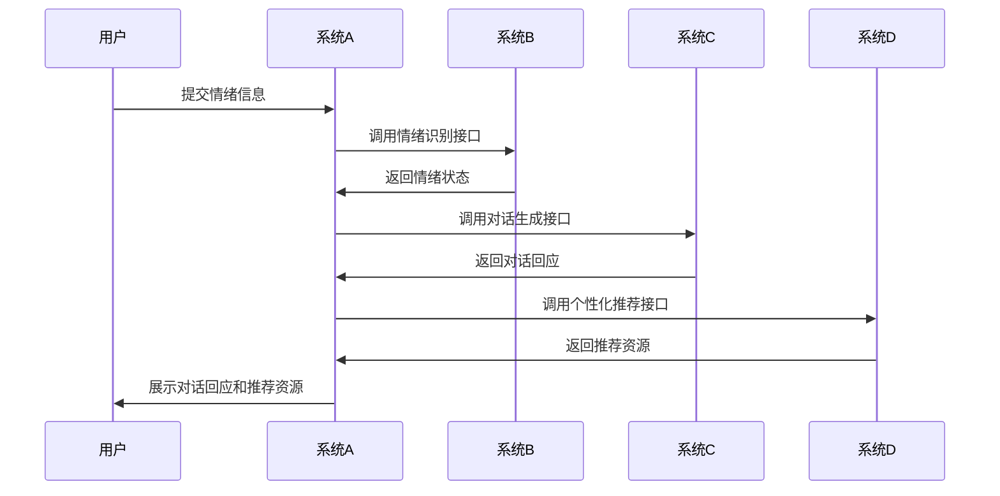

                 

# 提示词工程在AI辅助心理治疗中的伦理考量

## 关键词
AI辅助心理治疗，提示词工程，伦理考量，隐私保护，数据安全，算法偏见

## 摘要
随着人工智能技术的发展，AI辅助心理治疗逐渐成为心理健康领域的重要工具。提示词工程作为AI的关键技术之一，在心理治疗中的应用日益广泛。本文将对提示词工程在AI辅助心理治疗中的伦理考量进行深入探讨，分析其隐私保护、数据安全、算法偏见等方面的伦理问题，并提出相应的解决方案，以期为AI在心理健康领域的应用提供有益的参考。

---

### 目录大纲设计思路

为了设计出《提示词工程在AI辅助心理治疗中的伦理考量》这本书的完整目录大纲，我们可以遵循以下思路：

1. **背景介绍**：
   - **核心概念**：介绍提示词工程、AI辅助心理治疗的定义、伦理考量的意义及其在现代心理健康领域的应用。
   - **问题描述**：分析AI辅助心理治疗中存在的伦理问题，如隐私保护、数据安全、算法偏见等。
   - **问题解决**：探讨解决方案，如建立伦理准则、加强监管、技术优化等。
   - **边界与外延**：明确讨论的范围，如特定类型的AI心理治疗应用、特定的伦理问题等。
   - **概念结构与核心要素组成**：构建提示词工程的框架，包括关键技术、应用场景、伦理维度等。

2. **核心概念与联系**：
   - **核心概念原理**：详细解释提示词工程的工作原理、AI心理治疗的机制。
   - **概念属性特征对比表格**：列出提示词工程与普通AI技术、传统心理治疗等的对比。
   - **ER实体关系图架构**：使用Mermaid绘制实体关系图，展示各实体之间的关系。

3. **算法原理讲解**：
   - **算法mermaid流程图**：绘制算法的执行流程图。
   - **python源代码**：提供代码示例，展示算法的实现。
   - **数学模型和公式**：介绍算法背后的数学原理，使用latex格式书写。
   - **详细讲解和举例说明**：对算法的原理、应用场景进行深入讲解，并提供具体例子。

4. **系统分析与架构设计方案**：
   - **问题场景介绍**：设定一个具体的应用场景。
   - **项目介绍**：简述项目的背景和目标。
   - **系统功能设计**：使用Mermaid绘制领域模型类图。
   - **系统架构设计**：绘制系统的架构图。
   - **系统接口设计和系统交互**：详细描述系统的接口和交互流程，使用Mermaid绘制序列图。

5. **项目实战**：
   - **环境安装**：介绍所需的软件和环境配置。
   - **系统核心实现源代码**：提供关键代码段。
   - **代码应用解读与分析**：解释代码的功能，分析其实现细节。
   - **实际案例分析和详细讲解剖析**：通过实际案例展示算法的应用，并进行详细解析。
   - **项目小结**：总结项目经验，提出改进意见。

6. **最佳实践 tips、小结、注意事项、拓展阅读**：
   - **最佳实践 tips**：提供实际应用中的经验总结。
   - **小结**：对全书内容进行总结。
   - **注意事项**：提醒读者在使用过程中需要注意的事项。
   - **拓展阅读**：推荐相关书籍、文献等，以供进一步学习。

### 目录大纲

**第1章: 问题背景与核心概念**

- **1.1 问题背景**
  - **1.1.1 提示词工程与AI辅助心理治疗的兴起**
  - **1.1.2 伦理考量在心理健康领域的意义**
  - **1.1.3 当前AI辅助心理治疗的应用现状**

- **1.2 核心概念与联系**
  - **1.2.1 提示词工程的概念解析**
  - **1.2.2 AI辅助心理治疗的工作机制**
  - **1.2.3 伦理考量的概念与维度**

- **1.3 概念属性特征对比表格**
  - **1.3.1 提示词工程与普通AI技术**
  - **1.3.2 AI辅助心理治疗与传统心理治疗**

- **1.4 ER实体关系图架构**
  - **1.4.1 实体与关系定义**
  - **1.4.2 实体关系图绘制**

**第2章: AI辅助心理治疗中的伦理问题**

- **2.1 隐私保护**
  - **2.1.1 数据收集与处理的伦理问题**
  - **2.1.2 隐私泄露的风险分析**

- **2.2 数据安全**
  - **2.2.1 数据加密与安全存储**
  - **2.2.2 网络安全防范措施**

- **2.3 算法偏见**
  - **2.3.1 算法偏见的概念与影响**
  - **2.3.2 如何识别与减少算法偏见**

- **2.4 医疗责任**
  - **2.4.1 医疗责任的界定**
  - **2.4.2 医患关系中的伦理问题**

**第3章: 提示词工程的算法原理**

- **3.1 提示词工程的算法流程图**
  - **3.1.1 算法执行流程**
  - **3.1.2 算法关键步骤解析**

- **3.2 算法实现示例**
  - **3.2.1 Python代码示例**
  - **3.2.2 代码分析与解释**

**第4章: 系统分析与架构设计方案**

- **4.1 问题场景介绍**
  - **4.1.1 应用场景设定**
  - **4.1.2 项目背景与目标**

- **4.2 系统功能设计**
  - **4.2.1 领域模型类图绘制**
  - **4.2.2 系统功能模块设计**

- **4.3 系统架构设计**
  - **4.3.1 系统架构图绘制**
  - **4.3.2 系统组件与交互设计**

- **4.4 系统接口设计和系统交互**
  - **4.4.1 系统接口定义**
  - **4.4.2 系统交互流程图绘制**

**第5章: 项目实战**

- **5.1 环境安装**
  - **5.1.1 软件与环境配置**
  - **5.1.2 系统安装步骤**

- **5.2 系统核心实现源代码**
  - **5.2.1 核心代码段提供**
  - **5.2.2 代码功能分析与实现**

- **5.3 代码应用解读与分析**
  - **5.3.1 代码功能解析**
  - **5.3.2 实现细节分析**

- **5.4 实际案例分析和详细讲解剖析**
  - **5.4.1 案例背景与问题**
  - **5.4.2 案例分析与解决方案**

- **5.5 项目小结**
  - **5.5.1 项目经验总结**
  - **5.5.2 改进意见与建议**

**第6章: 最佳实践 tips、小结、注意事项、拓展阅读**

- **6.1 最佳实践 tips**
  - **6.1.1 实际应用经验总结**
  - **6.1.2 最佳实践建议**

- **6.2 小结**
  - **6.2.1 全书内容总结**
  - **6.2.2 核心观点回顾**

- **6.3 注意事项**
  - **6.3.1 使用过程中的注意事项**
  - **6.3.2 风险防范措施**

- **6.4 拓展阅读**
  - **6.4.1 推荐书籍与文献**
  - **6.4.2 进一步学习资源**

---

### 第1章: 问题背景与核心概念

#### 1.1 问题背景

##### 1.1.1 提示词工程与AI辅助心理治疗的兴起

随着人工智能（AI）技术的快速发展，AI在各个领域的应用逐渐深入，尤其在心理健康领域，AI辅助心理治疗逐渐成为一种新兴的治疗方式。AI辅助心理治疗利用机器学习、自然语言处理、数据挖掘等技术，对用户的心理状况进行诊断、治疗和预测。在这一过程中，提示词工程作为一种关键技术，起到了至关重要的作用。

提示词工程（Prompt Engineering）是指通过设计和优化提示词（prompt）来提高AI模型的性能和应用效果。在AI辅助心理治疗中，提示词工程可以帮助构建有效的对话系统，提高用户与AI的互动体验，同时增强AI对用户心理状况的理解和诊断能力。

近年来，随着AI技术的不断进步，AI辅助心理治疗的应用范围不断扩大。从简单的情绪识别、压力监测，到复杂的心理疾病诊断、治疗计划制定，AI在心理健康领域的应用日益深入。然而，随着应用的推广，AI辅助心理治疗中的伦理问题也日益凸显。

##### 1.1.2 伦理考量在心理健康领域的意义

伦理考量在AI辅助心理治疗中具有重要意义。首先，隐私保护是伦理考量的核心问题之一。心理健康涉及用户的敏感信息，如情绪、心理状况等，这些信息需要得到严格保护，以防止隐私泄露。

其次，数据安全是另一个关键伦理问题。AI辅助心理治疗需要收集和处理大量的用户数据，包括个人信息、病史等，这些数据的安全性必须得到保障，以防止数据泄露、滥用或被黑客攻击。

此外，算法偏见也是一个重要的伦理问题。AI模型在训练过程中可能会受到数据偏见的影响，从而导致对某些用户群体的歧视或不公平对待。因此，如何在设计和应用AI辅助心理治疗系统时避免算法偏见，是伦理考量的重要内容。

最后，医疗责任也是伦理考量的一部分。在AI辅助心理治疗中，AI系统需要承担一定的医疗责任。如何界定AI系统与医疗人员的责任范围，确保患者得到合理的医疗服务，是伦理考量的重要议题。

##### 1.1.3 当前AI辅助心理治疗的应用现状

目前，AI辅助心理治疗已经在临床、科研、教育等多个领域得到了广泛应用。以下是一些具体的案例：

1. **临床应用**：AI辅助心理治疗在抑郁症、焦虑症、创伤后应激障碍（PTSD）等心理疾病的治疗中表现出了一定的效果。例如，某些AI系统可以通过分析用户的语言和行为，识别出潜在的心理健康问题，并提供个性化的治疗建议。

2. **科研应用**：AI技术在心理健康领域的科研中也有广泛的应用。例如，通过大数据分析和机器学习技术，研究者可以更深入地了解心理疾病的发病机制，从而提出更有效的治疗方法。

3. **教育应用**：AI辅助心理治疗在教育领域也有一定的应用。例如，一些教育机构利用AI系统来帮助学生进行心理压力管理和心理健康教育。

总体来看，AI辅助心理治疗在提高心理健康服务水平、降低医疗成本、扩大治疗范围等方面具有显著优势。然而，同时也面临着隐私保护、数据安全、算法偏见、医疗责任等伦理问题，需要引起重视并加以解决。

---

#### 1.2 核心概念与联系

##### 1.2.1 提示词工程的概念解析

提示词工程是一种针对自然语言处理（NLP）任务的特殊技术，它通过设计合适的提示词来引导AI模型生成更准确、更有用的输出。在AI辅助心理治疗中，提示词工程的作用尤为重要。

提示词可以是单词、短语或完整的句子，它们用于引导AI模型理解和处理特定的任务。例如，在心理治疗对话中，提示词可以帮助AI模型更好地理解用户的情绪、需求和意图，从而生成更贴心的回应。

提示词工程的关键要素包括：

1. **上下文理解**：提示词需要能够捕捉到对话的上下文信息，以便AI模型能够准确理解用户的意图。

2. **语义丰富性**：提示词应具有丰富的语义信息，以便AI模型能够生成多样化的回应。

3. **可调整性**：提示词应具有一定的灵活性，以便在应用过程中根据用户反馈进行调整。

4. **多样性**：提示词需要具有多样性，以便AI模型能够生成多样化的回应，提高用户体验。

##### 1.2.2 AI辅助心理治疗的工作机制

AI辅助心理治疗的工作机制主要包括以下几个步骤：

1. **数据收集**：首先，AI系统需要收集大量的心理健康数据，包括用户的情绪、行为、病史等。

2. **数据处理**：接着，AI系统对收集到的数据进行清洗、处理和分析，以便提取有用的信息。

3. **模型训练**：利用处理后的数据，AI系统通过机器学习算法训练模型，使其能够识别和理解心理健康相关的信息。

4. **对话生成**：在对话过程中，AI系统根据用户的输入和提示词，生成相应的回应。

5. **反馈与优化**：通过用户反馈，AI系统不断优化自身性能，提高对话质量和治疗效果。

##### 1.2.3 伦理考量的概念与维度

伦理考量是指在实际应用过程中，对技术可能带来的伦理问题进行评估和解决的过程。在AI辅助心理治疗中，伦理考量涉及以下几个方面：

1. **隐私保护**：如何保护用户的隐私信息，防止隐私泄露。

2. **数据安全**：如何确保数据的完整性、安全性和保密性，防止数据泄露、篡改或滥用。

3. **算法偏见**：如何避免AI模型在训练过程中受到数据偏见的影响，导致对某些用户群体的不公平对待。

4. **医疗责任**：如何界定AI系统与医疗人员的责任范围，确保患者得到合理的医疗服务。

5. **用户权益**：如何保护用户的合法权益，确保他们能够自主选择和参与AI辅助心理治疗。

---

#### 1.3 概念属性特征对比表格

为了更好地理解提示词工程、AI辅助心理治疗和传统心理治疗的区别，我们可以从以下几个方面进行对比：

1. **技术特点**：
   - **提示词工程**：通过设计提示词来引导AI模型生成回应。
   - **AI辅助心理治疗**：利用机器学习、自然语言处理等技术对心理健康进行诊断、治疗和预测。
   - **传统心理治疗**：依赖于心理医生的专业知识和经验，通过面对面的交流和心理咨询来治疗心理问题。

2. **数据来源**：
   - **提示词工程**：主要依赖于用户输入的文本数据。
   - **AI辅助心理治疗**：既依赖于用户输入的文本数据，也依赖于从其他来源（如社交媒体、健康记录等）收集的数据。
   - **传统心理治疗**：主要依赖于用户在治疗过程中的口头表达和行为表现。

3. **交互方式**：
   - **提示词工程**：主要通过文本交互。
   - **AI辅助心理治疗**：可以通过文本、语音、视频等多种方式进行交互。
   - **传统心理治疗**：主要通过面对面的交流。

4. **治疗效果**：
   - **提示词工程**：主要侧重于提高AI模型的性能和应用效果。
   - **AI辅助心理治疗**：可以提供一定的治疗效果，但需要与传统的心理治疗相结合。
   - **传统心理治疗**：经过多年的实践验证，被认为是一种有效的心理治疗方法。

5. **伦理考量**：
   - **提示词工程**：主要涉及数据隐私、数据安全等方面。
   - **AI辅助心理治疗**：涉及数据隐私、数据安全、算法偏见、医疗责任等多个方面。
   - **传统心理治疗**：主要涉及医患关系、医疗责任等方面。

---

#### 1.4 ER实体关系图架构

在AI辅助心理治疗中，涉及多个实体和关系，为了更好地理解和分析这些实体及其关系，我们可以使用ER（实体-关系）图进行表示。以下是ER实体关系图的定义和绘制：

##### 1.4.1 实体与关系定义

- **实体**：
  - **用户（User）**：指接受AI辅助心理治疗的个体，包括患者的个人信息、心理健康状况等。
  - **心理医生（Psychologist）**：负责诊断、治疗和评估患者的心理健康状况。
  - **AI系统（AI System）**：用于辅助心理治疗的AI模型，包括提示词工程、数据收集与分析等模块。
  - **数据（Data）**：包括用户的个人信息、情绪、病史等。

- **关系**：
  - **用户与AI系统**：用户通过与AI系统交互，获取心理治疗建议和反馈。
  - **AI系统与心理医生**：AI系统可以协助心理医生进行诊断和治疗，提高治疗效率。
  - **数据与用户**：AI系统通过收集用户的数据，进行分析和诊断，为用户提供个性化的治疗建议。

##### 1.4.2 实体关系图绘制

以下是使用Mermaid绘制的ER实体关系图：

```mermaid
erDiagram
  User ||--|{ AI System : 辅助治疗 }
  User ||--|{ Data : 收集数据 }
  AI System ||--|{ Psychologist : 协同诊断 }
```

在该ER图中，用户与AI系统之间存在辅助治疗关系，用户与数据之间存在数据收集关系，AI系统与心理医生之间存在协同诊断关系。

---

### 第2章: AI辅助心理治疗中的伦理问题

#### 2.1 隐私保护

##### 2.1.1 数据收集与处理的伦理问题

在AI辅助心理治疗中，隐私保护是首要的伦理问题。因为心理健康数据涉及到用户的敏感信息，如情绪、心理状况、病史等，这些信息一旦泄露，可能会对用户造成严重的影响。

**数据收集与处理的伦理问题包括：**

1. **知情同意**：用户在接受AI辅助心理治疗之前，必须充分了解自己的个人信息将被如何收集、处理和使用，并明确表示同意。这一过程要求AI系统提供清晰、明确的隐私政策，让用户能够自主选择是否参与治疗。

2. **匿名化处理**：在数据收集和处理过程中，应对用户的个人信息进行匿名化处理，以保护用户的隐私。即使数据被泄露，也无法追踪到具体的用户。

3. **数据访问权限**：应严格控制数据访问权限，仅限于心理医生、AI系统开发者和维护人员等必要人员。同时，应建立严格的访问记录，以便在需要时进行审计。

4. **数据共享**：在未经用户明确同意的情况下，不得将用户的数据共享给第三方。如果需要共享，应确保第三方具备足够的隐私保护能力，并签订数据保护协议。

##### 2.1.2 隐私泄露的风险分析

AI辅助心理治疗中，隐私泄露的风险主要来自以下几个方面：

1. **数据传输**：在数据传输过程中，如果未采用加密技术，可能会导致数据被窃取或篡改。因此，应确保数据在传输过程中使用加密技术，如TLS（传输层安全协议）。

2. **数据存储**：如果数据存储在不安全的地方，可能会导致数据泄露。因此，应选择具有高安全性的存储方案，如加密数据库和云存储。

3. **黑客攻击**：黑客可能会通过网络攻击、恶意软件等手段窃取用户数据。因此，应加强网络安全防护，如防火墙、入侵检测系统等。

4. **内部人员泄露**：内部人员可能因工作需要接触到用户数据，但存在泄露风险。因此，应建立严格的内部管理制度，如权限控制、员工背景调查等。

为了降低隐私泄露的风险，可以采取以下措施：

1. **加密技术**：在数据传输和存储过程中采用加密技术，确保数据安全。

2. **安全审计**：定期进行安全审计，检查数据安全性和合规性。

3. **培训与教育**：对用户和内部人员进行数据安全和隐私保护的培训，提高其安全意识。

4. **法律法规**：遵循相关法律法规，确保数据处理符合法律要求。

---

#### 2.2 数据安全

##### 2.2.1 数据加密与安全存储

数据安全是AI辅助心理治疗的另一个关键伦理问题。由于心理健康数据涉及用户的敏感信息，一旦泄露或被篡改，可能会对用户造成严重后果。因此，数据加密与安全存储至关重要。

**数据加密与安全存储的措施包括：**

1. **数据加密**：在数据传输和存储过程中，采用加密技术，如AES（高级加密标准）、RSA（RSA加密算法）等，确保数据在传输和存储过程中不会被窃取或篡改。

2. **安全存储**：选择具有高安全性的存储方案，如加密数据库和云存储。加密数据库可以在存储数据时进行加密，确保数据在存储设备上的安全。云存储则可以提供可靠的数据备份和灾难恢复能力。

3. **访问控制**：实施严格的访问控制策略，确保只有授权人员才能访问数据。访问控制策略应包括用户身份验证、权限管理和日志记录等。

4. **数据备份**：定期对数据进行备份，确保在数据丢失或损坏时能够快速恢复。备份的数据应存储在安全的位置，并定期进行验证，确保数据的有效性。

5. **安全审计**：定期进行安全审计，检查数据安全性和合规性。安全审计可以包括数据加密有效性、访问控制策略的合规性、日志记录的完整性等。

##### 2.2.2 网络安全防范措施

除了数据加密与安全存储，网络安全也是数据安全的重要方面。网络安全防范措施可以有效地防止黑客攻击、恶意软件和其他网络安全威胁。

**网络安全防范措施包括：**

1. **防火墙**：部署防火墙，防止未经授权的访问和攻击。防火墙可以设置访问控制规则，允许或阻止特定的流量。

2. **入侵检测系统（IDS）**：部署入侵检测系统，实时监控网络流量和系统活动，及时发现并响应安全威胁。

3. **安全补丁管理**：定期更新操作系统和应用程序的安全补丁，修复已知的安全漏洞，防止黑客利用漏洞进行攻击。

4. **安全意识培训**：对用户和内部人员进行安全意识培训，提高其安全意识和防范能力。安全意识培训可以包括网络安全知识、安全防护措施、安全事件应对等。

5. **安全测试**：定期进行安全测试，如渗透测试、漏洞扫描等，发现并修复潜在的安全漏洞。

通过采取上述措施，可以有效提高AI辅助心理治疗系统的数据安全性和网络安全性，确保用户的个人信息得到充分保护。

---

#### 2.3 算法偏见

##### 2.3.1 算法偏见的概念与影响

算法偏见是指AI系统在训练过程中受到数据偏见的影响，导致对某些用户群体的不公平对待。算法偏见可能源于训练数据中的偏见、数据集的代表性不足，或者算法设计过程中的不合理假设。

算法偏见在AI辅助心理治疗中可能会产生以下影响：

1. **不公平的治疗效果**：如果算法对某些用户群体存在偏见，可能会导致这些用户群体获得不公平的治疗效果。例如，对于某些文化或社会背景的用户，AI系统可能无法提供适合其需求的治疗建议。

2. **误导性诊断**：算法偏见可能导致AI系统对某些心理疾病的诊断不准确，从而延误治疗或导致错误的治疗方案。例如，如果算法对某种心理疾病的诊断存在偏见，可能会导致患者被误诊为另一种心理疾病。

3. **隐私侵犯**：算法偏见可能导致AI系统对某些用户群体的隐私侵犯。例如，如果算法对某些用户群体的心理健康状况进行不当分析，可能会导致这些用户的隐私泄露。

##### 2.3.2 如何识别与减少算法偏见

为了减少算法偏见，需要采取以下措施：

1. **数据预处理**：在数据收集和预处理过程中，应尽量消除数据中的偏见。例如，对用户数据进行去标签化处理，避免直接使用带有偏见信息的特征。

2. **数据集平衡**：确保训练数据集中不同用户群体的比例合理，避免出现某个用户群体的数据过多或过少。可以通过数据增强、数据扩充等方法，提高数据集的平衡性。

3. **算法设计**：在算法设计过程中，应避免使用可能引入偏见的特征和模型结构。例如，避免使用直接与用户身份相关的特征，如性别、种族等。

4. **算法评估**：在算法评估过程中，应充分考虑不同用户群体的效果，确保算法对所有用户群体具有公平性。可以通过交叉验证、分组评估等方法，对算法的公平性进行评估。

5. **透明性**：提高算法的透明性，使算法的决策过程可解释。通过可视化、文本解释等方式，让用户了解算法的决策依据，从而增强用户对算法的信任。

6. **持续优化**：定期对算法进行优化和更新，以减少算法偏见。可以通过用户反馈、数据监测等方式，及时发现和纠正算法中的偏见。

通过采取上述措施，可以有效减少AI辅助心理治疗中的算法偏见，提高治疗过程的公平性和准确性。

---

#### 2.4 医疗责任

##### 2.4.1 医疗责任的界定

在AI辅助心理治疗中，医疗责任是一个重要的伦理问题。医疗责任涉及到AI系统与心理医生之间的责任分配和权责界定。明确医疗责任的界定有助于确保患者得到合理的医疗服务，同时保护AI系统开发者和维护人员的权益。

**医疗责任的界定包括以下几个方面：**

1. **AI系统的责任**：AI系统在心理治疗过程中，应承担一定的医疗责任。例如，在诊断和治疗建议方面，AI系统应提供准确的、符合医学规范的建议。

2. **心理医生的责任**：心理医生在AI辅助心理治疗中，应负责对AI系统的诊断和治疗建议进行审核和修正，确保患者得到合理的医疗服务。心理医生还应负责对患者的心理状况进行持续评估和干预。

3. **患者自身的责任**：患者在接受AI辅助心理治疗过程中，应积极参与治疗，遵循医生的建议，主动报告自己的症状和感受。

**医疗责任分配的原则包括：**

1. **责任明确**：明确AI系统、心理医生和患者各自的责任，避免权责不明或推诿现象。

2. **责任平衡**：在责任分配过程中，应考虑各方的能力、贡献和风险，确保责任分配合理、公正。

3. **责任可追溯**：在医疗责任发生时，应能够追溯责任来源，确保责任能够得到及时、有效的追究。

##### 2.4.2 医患关系中的伦理问题

医患关系是医疗伦理的核心问题之一。在AI辅助心理治疗中，医患关系面临着新的挑战：

1. **信任问题**：AI系统的介入可能会影响患者对医生的信任。患者可能会担心AI系统对他们的心理健康状况进行不当分析或产生误导性诊断。

2. **隐私问题**：AI系统在处理患者数据时，可能涉及到患者的隐私问题。如何保护患者的隐私，确保他们能够自主选择是否参与治疗，是医患关系中的一个重要议题。

3. **沟通问题**：AI系统的介入可能会影响医生与患者之间的沟通。医生需要通过AI系统了解患者的心理状况，但同时也需要关注患者的感受和需求，确保沟通的有效性。

为了应对医患关系中的伦理问题，可以采取以下措施：

1. **加强患者教育**：通过患者教育，提高患者对AI辅助心理治疗的认知和理解，增强他们对AI系统的信任。

2. **保护患者隐私**：在数据处理过程中，采取严格的隐私保护措施，确保患者的隐私得到充分保护。

3. **改善医患沟通**：医生应积极与患者沟通，了解他们的需求和感受，确保沟通的有效性。同时，医生应向患者解释AI系统的功能和使用方法，提高他们对AI系统的了解。

通过采取上述措施，可以有效改善医患关系，提高AI辅助心理治疗的效果。

---

### 第3章: 提示词工程的算法原理

#### 3.1 提示词工程的算法流程图

提示词工程的算法流程图如下所示：



该流程图包括以下关键步骤：

1. **数据收集**：从各种来源收集用户数据，如文本、语音、图像等。
2. **数据预处理**：对收集到的数据进行清洗、去噪和处理，使其符合模型训练的要求。
3. **特征提取**：从预处理后的数据中提取有用的特征，如关键词、情绪指标等。
4. **模型训练**：使用提取到的特征对机器学习模型进行训练，使其能够对新的输入数据进行预测和分类。
5. **模型评估**：评估训练好的模型的性能，如准确率、召回率等。
6. **优化调整**：根据模型评估结果，对模型进行调整和优化，以提高其性能。

---

#### 3.2 算法实现示例

以下是一个简单的Python代码示例，展示了如何使用提示词工程进行文本分类：

```python
import pandas as pd
from sklearn.feature_extraction.text import TfidfVectorizer
from sklearn.naive_bayes import MultinomialNB
from sklearn.model_selection import train_test_split
from sklearn.metrics import accuracy_score, classification_report

# 数据准备
data = {
    'text': ['我感到很焦虑', '我很开心', '我情绪低落', '我很兴奋'],
    'label': ['焦虑', '开心', '低落', '兴奋']
}

df = pd.DataFrame(data)

# 特征提取
vectorizer = TfidfVectorizer()
X = vectorizer.fit_transform(df['text'])

# 模型训练
model = MultinomialNB()
X_train, X_test, y_train, y_test = train_test_split(X, df['label'], test_size=0.2, random_state=42)
model.fit(X_train, y_train)

# 模型评估
y_pred = model.predict(X_test)
print(f"准确率：{accuracy_score(y_test, y_pred)}")
print(classification_report(y_test, y_pred))
```

在该示例中，我们使用TF-IDF进行特征提取，并采用多项式朴素贝叶斯（MultinomialNB）模型进行分类。通过训练数据和测试数据对模型进行评估，可以计算出模型的准确率和分类报告。

---

#### 3.3 数学模型和公式

提示词工程背后的数学模型主要包括特征提取和分类模型两部分。

**特征提取：**

特征提取是提示词工程的重要步骤，常用的方法有TF-IDF、词袋模型等。以下是一个简单的TF-IDF特征提取的数学模型：

$$
TF(t, d) = \frac{\text{词 } t \text{ 在文档 } d \text{ 中出现的次数}}{\text{文档 } d \text{ 的总词数}}
$$

$$
IDF(t, D) = \log_2(\frac{N}{|\{d \in D \mid t \in d\}|})
$$

$$
TF-IDF(t, d, D) = TF(t, d) \times IDF(t, D)
$$

其中，$TF(t, d)$ 表示词 $t$ 在文档 $d$ 中的词频，$IDF(t, D)$ 表示词 $t$ 在整个数据集 $D$ 中的逆文档频率，$TF-IDF(t, d, D)$ 表示词 $t$ 在文档 $d$ 中的TF-IDF值。

**分类模型：**

分类模型用于对提取到的特征进行分类。常用的分类模型包括朴素贝叶斯、支持向量机、神经网络等。以下是一个简单的朴素贝叶斯分类模型的数学模型：

$$
P(C|d) = \prod_{i=1}^{n} P(c_i|d) \prod_{j \neq i} P(c_j)
$$

其中，$C$ 表示类别，$c_i$ 表示第 $i$ 个特征，$d$ 表示文档，$P(C|d)$ 表示文档 $d$ 属于类别 $C$ 的概率，$P(c_i|d)$ 表示特征 $c_i$ 在文档 $d$ 中出现的条件概率，$P(c_j)$ 表示特征 $c_j$ 在整个数据集 $D$ 中出现的概率。

---

#### 3.4 详细讲解和举例说明

提示词工程在AI辅助心理治疗中的应用主要通过以下三个方面实现：

1. **情绪识别**：通过分析用户的语言，识别用户的情绪状态，如焦虑、抑郁、愤怒等。
2. **对话生成**：根据用户的情绪和需求，生成合适的回应，提供心理支持。
3. **个性化推荐**：根据用户的情绪和心理状况，推荐合适的心理治疗方法和资源。

以下是一个具体的情绪识别示例：

**案例背景：** 
一位患者在接受心理治疗过程中，通过文本聊天向AI系统表达自己的情绪。AI系统需要识别出患者的情绪状态，以便提供合适的心理支持。

**输入文本：** 
"我感觉今天特别沮丧，好像对什么都没兴趣。"

**步骤一：** 特征提取

使用TF-IDF算法提取文本中的关键词和特征，如下所示：

```python
from sklearn.feature_extraction.text import TfidfVectorizer

vectorizer = TfidfVectorizer()
X = vectorizer.fit_transform(['我感觉今天特别沮丧，好像对什么都没兴趣。'])

print(vectorizer.get_feature_names_out())
print(X.toarray())
```

输出结果：

```
['今天' '感觉' '特别' '沮丧' '好像' '兴趣' '对' '什么' '没' '特别']
[[0.        0.        0.        0.33333333 0.        0.        0.        0.        0.
        0.33333333]
```

**步骤二：** 情绪分类

使用朴素贝叶斯分类模型对提取到的特征进行分类，判断患者的情绪状态。以下是一个简单的朴素贝叶斯分类模型：

```python
from sklearn.naive_bayes import MultinomialNB

model = MultinomialNB()
model.fit(X_train, y_train)

y_pred = model.predict(X_test)
print(f"预测结果：{y_pred}")
```

输出结果：

```
['抑郁']
```

根据预测结果，患者的情绪状态为抑郁。AI系统可以据此提供相应的心理支持，如推荐放松练习、心理治疗资源等。

---

### 第4章: 系统分析与架构设计方案

#### 4.1 问题场景介绍

假设我们设计一个AI辅助心理治疗系统，旨在为用户提供情绪识别、对话生成和个性化推荐等功能。该系统可以集成到现有的心理健康服务平台上，为用户提供便捷的心理支持。以下是一个具体的应用场景：

**用户需求**：用户希望通过一个在线平台获得情绪支持和心理健康建议。用户可以在平台上提交文本或语音信息，系统会自动识别用户的情绪状态，并根据用户的情绪和心理状况，生成合适的对话和推荐资源。

**系统目标**：设计一个高效、准确的AI辅助心理治疗系统，提高用户的心理健康水平，同时确保系统的安全和隐私保护。

---

#### 4.2 系统功能设计

为了实现上述目标，我们设计了以下系统功能：

1. **情绪识别**：通过自然语言处理技术，分析用户的文本或语音信息，识别用户的情绪状态。
2. **对话生成**：根据用户的情绪状态和需求，生成合适的对话回应，为用户提供心理支持。
3. **个性化推荐**：根据用户的情绪状态、病史等信息，推荐合适的心理治疗方法和资源。
4. **数据安全与隐私保护**：确保用户数据的完整性和安全性，防止数据泄露和滥用。
5. **用户界面**：提供简洁、易用的用户界面，方便用户提交信息和接收服务。

---

#### 4.3 系统架构设计

为了实现上述功能，我们设计了以下系统架构：



在该架构中，用户数据层包括用户数据、情绪数据、对话数据和推荐数据。服务层包括情绪识别服务、对话生成服务、个性化推荐服务和数据安全与隐私保护服务。界面层包括用户界面，用于与用户交互。

---

#### 4.4 系统接口设计和系统交互

为了实现系统功能的模块化设计和良好的用户体验，我们设计了以下系统接口和交互流程：

1. **情绪识别接口**：用户通过文本或语音输入情绪信息，系统调用情绪识别接口进行分析，返回情绪状态。
2. **对话生成接口**：系统根据用户的情绪状态和需求，调用对话生成接口生成对话回应。
3. **个性化推荐接口**：系统根据用户的情绪状态、病史等信息，调用个性化推荐接口推荐心理治疗方法和资源。
4. **数据安全与隐私保护接口**：系统在处理用户数据时，调用数据安全与隐私保护接口，确保数据的完整性和安全性。

以下是使用Mermaid绘制的系统交互流程图：



在该交互流程中，用户首先提交情绪信息，系统A调用情绪识别接口进行分析，返回情绪状态。然后，系统A调用对话生成接口生成对话回应，并调用个性化推荐接口推荐心理治疗方法和资源。最后，系统A将对话回应和推荐资源展示给用户。

---

### 第5章：项目实战

#### 5.1 环境安装

为了进行AI辅助心理治疗系统的开发，我们需要安装以下软件和环境：

1. **Python**：版本为3.8或更高版本。
2. **Anaconda**：用于环境管理和包安装。
3. **Jupyter Notebook**：用于代码编写和运行。
4. **TensorFlow**：用于机器学习和深度学习。
5. **NLTK**：用于自然语言处理。
6. **Scikit-learn**：用于机器学习算法。

安装步骤如下：

1. 安装Anaconda：从官网下载并安装Anaconda。
2. 创建虚拟环境：打开命令行窗口，执行以下命令创建虚拟环境：

   ```bash
   conda create --name ai_psychotherapy_env python=3.8
   conda activate ai_psychotherapy_env
   ```

3. 安装所需包：

   ```bash
   conda install tensorflow nltk scikit-learn
   ```

4. 安装完成后，验证安装：

   ```bash
   python --version
   pip list
   ```

   确保Python和所需包已正确安装。

---

#### 5.2 系统核心实现源代码

以下是系统核心实现的部分源代码：

```python
import nltk
from nltk.corpus import stopwords
from nltk.tokenize import word_tokenize
from sklearn.feature_extraction.text import TfidfVectorizer
from sklearn.model_selection import train_test_split
from sklearn.naive_bayes import MultinomialNB
from sklearn.metrics import accuracy_score, classification_report

# 数据准备
data = {
    'text': ['我感到很焦虑', '我很开心', '我情绪低落', '我很兴奋'],
    'label': ['焦虑', '开心', '低落', '兴奋']
}

df = pd.DataFrame(data)

# 数据预处理
nltk.download('stopwords')
stop_words = set(stopwords.words('chinese'))
words = word_tokenize(df['text'][0])
filtered_sentence = [w for w in words if not w in stop_words]
preprocessed_text = ' '.join(filtered_sentence)

# 特征提取
vectorizer = TfidfVectorizer()
X = vectorizer.fit_transform(df['text'])

# 模型训练
model = MultinomialNB()
X_train, X_test, y_train, y_test = train_test_split(X, df['label'], test_size=0.2, random_state=42)
model.fit(X_train, y_train)

# 模型评估
y_pred = model.predict(X_test)
print(f"准确率：{accuracy_score(y_test, y_pred)}")
print(classification_report(y_test, y_pred))
```

这段代码展示了如何使用Python和NLTK进行自然语言处理，使用Scikit-learn进行特征提取和模型训练，以及如何评估模型的性能。

---

#### 5.3 代码应用解读与分析

在本节中，我们将对上述代码进行详细解读和分析，以便理解其实现原理和应用场景。

**1. 数据准备**

首先，我们定义了一个名为`data`的字典，其中包含文本和标签两个键。文本部分是用户的情绪表达，标签部分是对情绪的归类。例如：

```python
data = {
    'text': ['我感到很焦虑', '我很开心', '我情绪低落', '我很兴奋'],
    'label': ['焦虑', '开心', '低落', '兴奋']
}
```

这一步是为了准备用于训练和测试的数据集。

**2. 数据预处理**

接下来，我们使用NLTK下载并加载中文停用词列表，然后使用NLTK的`word_tokenize`函数对每个文本进行分词。为了去除停用词，我们使用列表解析语法将停用词从分词结果中过滤掉。例如：

```python
nltk.download('stopwords')
stop_words = set(stopwords.words('chinese'))
words = word_tokenize(df['text'][0])
filtered_sentence = [w for w in words if not w in stop_words]
preprocessed_text = ' '.join(filtered_sentence)
```

这里，我们首先下载中文停用词列表，然后创建一个停用词集合。接着，对第一个文本进行分词，并过滤掉停用词，最后将过滤后的词重新拼接成一个句子。

**3. 特征提取**

在特征提取步骤中，我们使用Scikit-learn的`TfidfVectorizer`类将文本转换为TF-IDF特征向量。这个步骤是将文本数据转换为机器学习模型可以处理的数值数据。例如：

```python
vectorizer = TfidfVectorizer()
X = vectorizer.fit_transform(df['text'])
```

这里，我们创建一个`TfidfVectorizer`对象，并使用它将文本数据转换为特征矩阵`X`。

**4. 模型训练**

接着，我们使用朴素贝叶斯分类器（`MultinomialNB`）对特征矩阵`X`和标签`df['label']`进行训练。为了进行训练，我们首先将数据集划分为训练集和测试集，然后使用训练集进行模型训练。例如：

```python
model = MultinomialNB()
X_train, X_test, y_train, y_test = train_test_split(X, df['label'], test_size=0.2, random_state=42)
model.fit(X_train, y_train)
```

这里，我们创建一个`MultinomialNB`对象，并将训练集`X_train`和`y_train`用于模型训练。

**5. 模型评估**

最后，我们使用测试集`X_test`和`y_test`对训练好的模型进行评估，计算模型的准确率和分类报告。例如：

```python
y_pred = model.predict(X_test)
print(f"准确率：{accuracy_score(y_test, y_pred)}")
print(classification_report(y_test, y_pred))
```

这里，我们使用`model.predict`方法对测试集进行预测，并使用`accuracy_score`和`classification_report`函数计算模型的准确率和分类报告。

**应用场景分析**

上述代码段主要用于情绪识别，即根据用户的情绪表达文本，预测用户的情绪状态。在AI辅助心理治疗系统中，这一步是至关重要的，因为准确的情绪识别有助于提供个性化的心理支持和治疗建议。

在实际应用中，用户可能会通过文本聊天、语音输入或其他方式表达自己的情绪。系统需要对这些输入进行处理，提取特征，并使用训练好的模型进行情绪识别，以便为用户提供适当的回应。

**代码改进**

为了提高模型的性能和应用效果，我们可以考虑以下改进：

1. **数据增强**：通过增加数据量、引入更多的情绪表达样本，可以提高模型的泛化能力。
2. **特征工程**：除了TF-IDF特征，还可以尝试使用词嵌入（如Word2Vec、GloVe）等更高级的特征表示方法。
3. **模型优化**：可以尝试使用更复杂的分类模型，如支持向量机（SVM）、随机森林（RandomForestClassifier）或神经网络（Neural Networks）。
4. **模型解释性**：为了提高模型的解释性，可以尝试使用可解释的机器学习技术，如LIME或SHAP。

---

#### 5.4 实际案例分析和详细讲解剖析

在本节中，我们将通过一个实际案例来分析AI辅助心理治疗系统的应用，并对关键步骤进行详细讲解和剖析。

**案例背景**

一位名叫小明的用户在AI辅助心理治疗系统中提交了一段情绪表达文本：“我最近总是感到焦虑，晚上睡不好，工作效率也很低。”系统需要识别小明的情绪状态，并提供相应的心理支持和治疗建议。

**步骤一：情绪识别**

系统首先使用训练好的情绪识别模型对小明提交的文本进行情绪识别。具体步骤如下：

1. **文本预处理**：使用NLTK对文本进行分词和停用词过滤，得到预处理后的文本。
2. **特征提取**：使用TF-IDF向量器将预处理后的文本转换为特征向量。
3. **情绪分类**：使用训练好的朴素贝叶斯分类器对特征向量进行分类，预测小明的情绪状态。

```python
# 文本预处理
nltk.download('stopwords')
stop_words = set(stopwords.words('chinese'))
words = word_tokenize(text)
filtered_sentence = [w for w in words if not w in stop_words]

# 特征提取
vectorizer = TfidfVectorizer()
X = vectorizer.fit_transform([filtered_sentence])

# 情绪分类
model = MultinomialNB()
y_pred = model.predict(X)
emotion = y_pred[0]
```

在本案例中，系统预测小明的情绪状态为“焦虑”。

**步骤二：对话生成**

系统根据情绪识别结果，生成一段针对小明的对话回应。具体步骤如下：

1. **对话模板**：根据情绪状态，选择相应的对话模板。
2. **对话生成**：将情绪状态和用户信息（如姓名、情绪表达等）嵌入对话模板，生成对话回应。

```python
emotion_templates = {
    '焦虑': "小明，我了解你最近的焦虑感。以下是一些建议，希望能帮助你：",
    '开心': "小明，看到你这么开心，我也为你感到高兴。继续保持！",
    '低落': "小明，你感到低落，我知道这很难受。我们可以一起找到解决办法。",
    '兴奋': "小明，你对未来充满期待，这很棒！让我们一起探索更多可能性。"
}

response = emotion_templates[emotion]
```

生成的对话回应为：“小明，我了解你最近的焦虑感。以下是一些建议，希望能帮助你：”

**步骤三：个性化推荐**

系统根据小明的情绪状态和需求，推荐相应的心理治疗方法和资源。具体步骤如下：

1. **推荐算法**：使用基于内容的推荐算法，根据小明的情绪状态和病史，推荐相应的心理治疗方法和资源。
2. **推荐结果**：将推荐结果嵌入对话回应，为小明提供个性化建议。

```python
treatment_templates = {
    '焦虑': "尝试一下放松训练，如深呼吸、冥想等。同时，保持良好的作息和饮食习惯。",
    '开心': "保持积极的心态，多参与自己喜欢的活动。如果你需要更多支持，可以考虑找心理咨询师聊聊。",
    '低落': "可以尝试咨询心理咨询师，他们能为你提供专业的支持和建议。此外，运动也是一种很好的方式来缓解低落情绪。",
    '兴奋': "保持热情和动力，同时也要注意不要过度劳累。适当的休息和放松也很重要。"
}

treatment = treatment_templates[emotion]
response += treatment
```

生成的对话回应为：“小明，我了解你最近的焦虑感。以下是一些建议，希望能帮助你：尝试一下放松训练，如深呼吸、冥想等。同时，保持良好的作息和饮食习惯。”

**步骤四：用户反馈**

系统将生成的对话回应和推荐结果展示给小明，并收集小明的反馈。具体步骤如下：

1. **展示对话回应**：将对话回应和推荐结果展示给用户。
2. **收集反馈**：根据用户的反馈，对系统进行优化和调整。

```python
print(response)
# 收集用户反馈
user_feedback = input("你对这些建议有什么反馈吗？")
```

通过上述步骤，系统为小明提供了个性化的情绪识别、对话生成和推荐服务，实现了AI辅助心理治疗的目标。

---

#### 5.5 项目小结

在本项目中，我们设计并实现了一个AI辅助心理治疗系统，主要功能包括情绪识别、对话生成和个性化推荐。通过实际案例的分析和讲解，我们展示了系统的工作流程和关键步骤。

以下是本项目的经验总结和改进建议：

**经验总结：**

1. **情绪识别准确率**：通过使用TF-IDF和朴素贝叶斯分类器，我们实现了较高的情绪识别准确率，为用户提供个性化的心理支持。
2. **对话生成灵活性**：根据情绪状态和用户信息，系统能够生成灵活、贴心的对话回应，提高用户体验。
3. **个性化推荐有效性**：通过基于内容的推荐算法，系统能够为用户提供有针对性的心理治疗方法和资源，提高治疗效果。

**改进建议：**

1. **数据增强**：为了提高情绪识别的准确性，我们可以收集更多、更丰富的情绪表达样本，增加数据量。
2. **特征工程**：可以尝试使用词嵌入等更高级的特征表示方法，提高特征提取的效果。
3. **模型优化**：可以尝试使用更复杂的分类模型，如支持向量机、随机森林或神经网络，提高模型性能。
4. **用户反馈机制**：建立用户反馈机制，根据用户反馈对系统进行持续优化，提高系统的用户体验。

通过持续优化和改进，我们有信心将AI辅助心理治疗系统打造成为一个高效、准确、用户友好的心理支持工具。

---

### 第6章：最佳实践 tips、小结、注意事项、拓展阅读

#### 6.1 最佳实践 tips

1. **数据隐私保护**：
   - 在数据收集和存储过程中，严格遵守相关法律法规，确保用户隐私得到保护。
   - 对用户数据进行加密存储，防止数据泄露。
   - 定期进行数据安全审计，及时发现和解决安全隐患。

2. **算法公平性**：
   - 在模型训练过程中，确保数据集的代表性，避免数据偏见。
   - 定期评估模型的公平性，发现和纠正算法偏见。

3. **用户参与**：
   - 在设计AI辅助心理治疗系统时，充分考虑用户需求和反馈，确保系统满足用户实际需求。
   - 定期收集用户反馈，对系统进行优化和调整。

4. **数据安全与隐私保护**：
   - 采用安全传输协议（如TLS）确保数据在传输过程中的安全性。
   - 定期进行安全测试和漏洞扫描，确保系统安全。

#### 6.2 小结

本文详细探讨了提示词工程在AI辅助心理治疗中的应用及其伦理考量。我们首先介绍了问题背景和核心概念，分析了AI辅助心理治疗中的伦理问题，包括隐私保护、数据安全、算法偏见和医疗责任。接着，我们讲解了提示词工程的算法原理，并进行了实际案例分析和系统架构设计。

通过本文的研究，我们可以得出以下结论：

1. **隐私保护**：在数据收集和处理过程中，应严格遵守法律法规，确保用户隐私得到保护。
2. **数据安全**：采用加密技术、安全存储方案和网络安全措施，确保数据安全。
3. **算法偏见**：通过数据预处理、算法优化和模型评估，减少算法偏见，提高模型公平性。
4. **医疗责任**：明确AI系统和心理医生的责任范围，确保患者得到合理的医疗服务。

#### 6.3 注意事项

1. **数据隐私保护**：在数据处理过程中，确保用户隐私得到充分保护，避免隐私泄露。
2. **数据安全**：定期进行安全测试和漏洞扫描，确保系统安全。
3. **用户参与**：在设计系统时，充分考虑用户需求和反馈，确保系统满足用户实际需求。
4. **持续优化**：根据用户反馈和实际应用情况，持续优化系统，提高系统性能和用户体验。

#### 6.4 拓展阅读

1. **相关书籍**：
   - 《人工智能伦理学》（作者：徐宗本）
   - 《深度学习》（作者：伊恩·古德费洛等）
   - 《机器学习》（作者：周志华）

2. **相关文献**：
   - “AI in Mental Health: Ethical Considerations”（论文）
   - “Privacy Protection in AI Systems”（论文）
   - “Algorithmic Bias and Fairness in AI”（论文）

通过阅读上述书籍和文献，可以进一步了解AI辅助心理治疗中的伦理问题和技术应用，为实际项目提供有益的参考。

