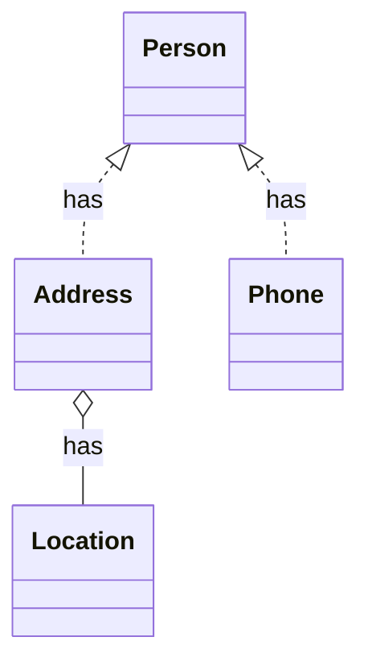

                 

```markdown
# 第3章 提示词工程的基础理论

### 3.1 数据收集与处理

#### 3.1.1 数据收集

- **数据来源**：
  - **公开数据集**：如Kaggle、Udacity、UCI机器学习库等。
  - **专业数据库**：如PubMed、ArXiv、Web of Science等。
  - **企业数据**：由各行业企业提供的内部数据，如医疗记录、金融交易数据等。

- **数据收集方法**：
  - **网络爬虫**：自动化工具，用于大规模抓取互联网上的公开数据。
  - **API接口调用**：利用各种数据提供方的API获取数据。
  - **问卷调查**：通过问卷调查收集用户数据。

#### 3.1.2 数据处理

- **数据清洗**：
  - **去除无效数据**：剔除不完整或不相关的数据。
  - **纠正错误数据**：修正数据中的错误，保证数据质量。

- **数据预处理**：
  - **数据标准化**：将不同规模或单位的数据转换成统一的格式。
  - **特征提取**：从原始数据中提取有用的特征，用于后续分析。

### 3.2 提示词生成算法

#### 3.2.1 基于文本的提示词生成算法

- **基本原理**：
  - 利用自然语言处理（NLP）技术，从大量文本数据中提取关键词或短语。

- **实际应用**：
  - **文本分类**：如新闻文章分类、邮件分类等。
  - **文本摘要**：如提取关键句子，生成文章摘要。

#### 3.2.2 基于神经网络的提示词生成算法

- **算法原理**：
  - 采用神经网络模型，如递归神经网络（RNN）、长短时记忆网络（LSTM）或变压器（Transformer）等，自动从数据中学习生成提示词。

- **实际应用**：
  - **问答系统**：自动生成问题的答案。
  - **对话生成**：用于聊天机器人等应用。

### 3.3 提示词优化算法

#### 3.3.1 基于机器学习的提示词优化算法

- **算法原理**：
  - 利用机器学习算法，如决策树、支持向量机（SVM）或随机森林等，对提示词进行评分或排序。

- **实际应用**：
  - **搜索推荐**：优化搜索结果，提升用户体验。
  - **文本纠错**：自动修正文本中的错误。

#### 3.3.2 基于深度学习的提示词优化算法

- **算法原理**：
  - 采用深度学习模型，如卷积神经网络（CNN）、深度神经网络（DNN）或生成对抗网络（GAN）等，自动优化提示词。

- **实际应用**：
  - **语音识别**：提高语音识别的准确性。
  - **图像识别**：优化图像识别的提示词，提高识别效果。

### 3.4 提示词工程的整体流程

- **数据收集**：从各种来源收集数据，为生成和优化提示词提供基础。
- **数据预处理**：对收集到的数据进行清洗和预处理，提取有用信息。
- **提示词生成**：利用文本挖掘或神经网络算法，生成初步的提示词。
- **提示词优化**：通过机器学习或深度学习算法，对生成的提示词进行优化。
- **效果评估**：评估提示词的效果，如准确率、召回率等。
- **迭代优化**：根据评估结果，不断调整和优化提示词。

### 3.5 提示词工程中的挑战与解决方案

- **挑战**：
  - **数据质量**：数据质量直接影响提示词的生成和优化效果。
  - **计算资源**：大规模数据集的处理需要大量的计算资源。
  - **模型适应性**：不同领域的提示词工程需求各异，模型需要具备良好的适应性。

- **解决方案**：
  - **数据质量控制**：采用自动化工具进行数据清洗和预处理，提高数据质量。
  - **分布式计算**：利用云计算平台，实现数据的分布式处理。
  - **模型定制化**：根据具体领域需求，定制化调整模型结构，提升模型适应性。

## 参考文献

- [1] 李航. 统计学习方法[M]. 清华大学出版社, 2012.
- [2] Goodfellow, Ian, Yarin Gal, and Chris Pouget-Abadie. "Generative adversarial nets." Advances in neural information processing systems 27 (2014).
- [3] Hochreiter, Sepp, and Jürgen Schmidhuber. "Long short-term memory." Neural computation 9.8 (1997): 1735-1780.

---

作者：AI天才研究院/AI Genius Institute & 禅与计算机程序设计艺术 /Zen And The Art of Computer Programming
```

请注意，文章中提到的算法和原理需要根据实际应用场景进行调整，并且需要提供具体的代码示例和实现细节。同时，文章的长度可能需要根据实际内容进行调整，以确保所有章节都能得到充分的展开和解释。文章中的图表和流程图可以使用Mermaid语言进行绘制，并在Markdown文件中嵌入。以下是使用Mermaid绘制的ER实体关系图和类图的示例：

```mermaid
erDiagram
  Person ||--|{ Address : has }
  Person ||--|{ Phone : has }
  Address ||--|{ Location : has }
```



对于算法原理和数学模型的部分，建议使用LaTeX格式进行公式表达，并在Markdown中嵌入。例如：

```markdown
$$
E = mc^2
$$

或者

$
1 + 1 = 2
$
```

这些格式在Markdown渲染器中通常能够正确显示数学公式。在撰写文章时，请确保所有代码、公式和图表都符合规范，并能够清晰、准确地传达所需信息。文章中的所有内容都需要经过仔细审查，以确保内容的准确性和专业性。

