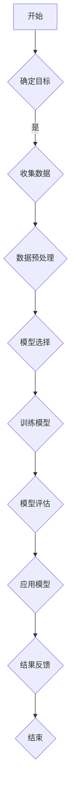
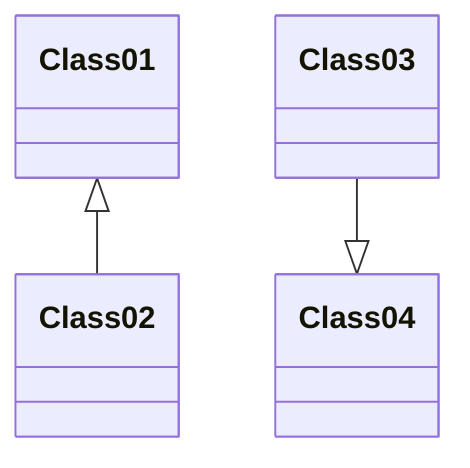
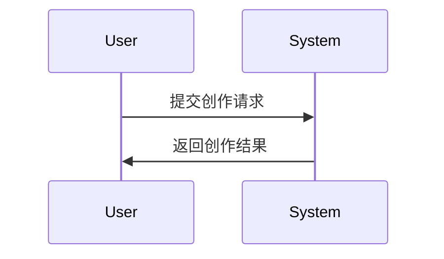
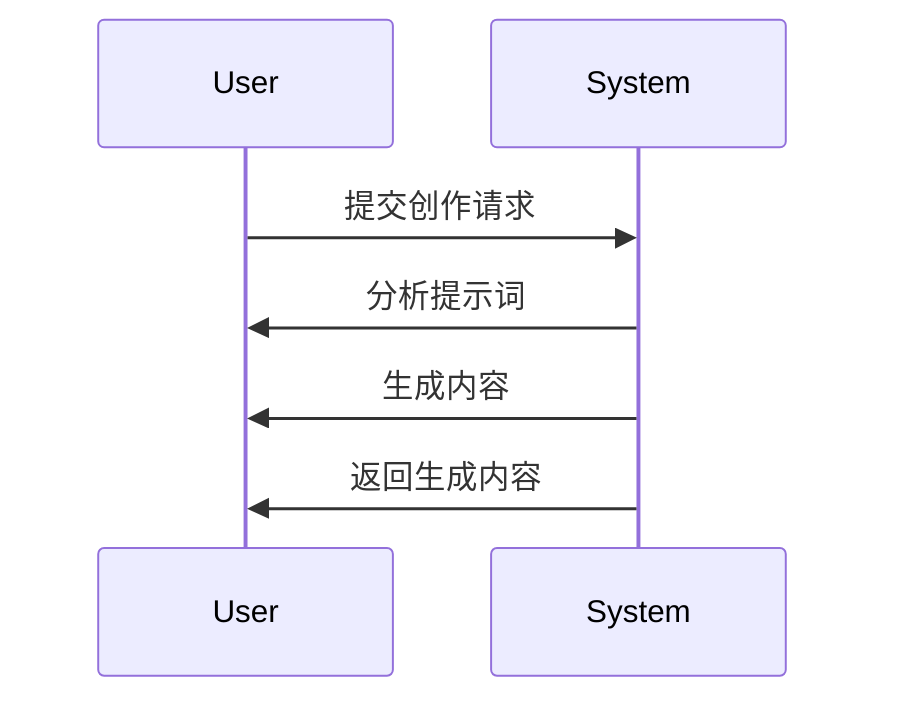
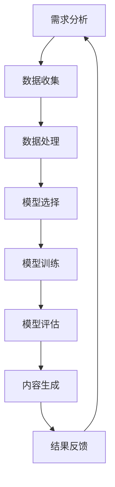
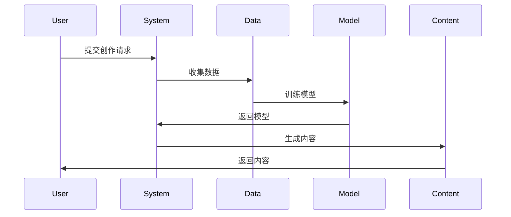

                 

# 提示词工程：构建新一代AIGC系统的基石

> 关键词：AIGC系统，提示词工程，内容生成，人工智能，架构设计

> 摘要：本文将深入探讨提示词工程在构建新一代AIGC系统中的重要性。首先，我们将概述AIGC系统的背景和核心概念，然后详细解析提示词工程的原理、技术以及应用实践。通过本文的阅读，读者将全面理解提示词工程如何成为AIGC系统的基石，并了解其在内容创作中的具体应用和实现策略。

## 《提示词工程：构建新一代AIGC系统的基石》目录大纲

----------------------------------------------------------------

## 第一部分：AIGC系统概述与基础

### 第1章 AIGC系统概述

#### 1.1 AIGC系统背景与发展趋势

**问题背景**：随着人工智能的快速发展，AIGC（AI-Generated Content）成为新兴的热点领域。

**问题描述**：AIGC系统如何定义，以及它为何成为构建新一代内容生成系统的基石。

**问题解决**：分析AIGC系统的核心价值和应用场景。

**边界与外延**：探讨AIGC系统与现有内容生成技术的区别和联系。

#### 1.2 AIGC系统的核心概念

**核心概念**：提示词工程

**概念属性特征对比表**：

| 特征 | 提示词工程 | 传统内容生成 |
| --- | --- | --- |
| 定制性 | 高 | 一般 |
| 可解释性 | 中 | 低 |
| 生成效率 | 高 | 一般 |
| 精准度 | 一般 | 一般 |

#### 1.3 AIGC系统的基本架构

**ER实体关系图**：

```mermaid
erDiagram
AI_System ||--|{ Content_Generator } : "uses"
User ||--|{ Content_Generator } : "produces"
"Data_Source" ||--|{ Content_Generator } : "feeds"
```

### 第2章 提示词工程原理

#### 2.1 提示词工程的基本原理

**算法原理**：



#### 2.2 提示词工程的关键技术

**Python源代码**：

```python
import tensorflow as tf

# 定义模型
model = tf.keras.Sequential([
    tf.keras.layers.Dense(128, activation='relu', input_shape=(784,)),
    tf.keras.layers.Dense(10, activation='softmax')
])

# 编译模型
model.compile(optimizer='adam',
              loss='categorical_crossentropy',
              metrics=['accuracy'])

# 训练模型
model.fit(x_train, y_train, epochs=5)
```

#### 2.3 提示词工程的数学模型

**数学模型与公式**：

$$ 
Y = f(W \cdot X + b)
$$

其中，$W$ 为权重矩阵，$X$ 为输入特征向量，$b$ 为偏置，$f$ 为激活函数。

#### 2.4 提示词工程的例子

**举例说明**：使用提示词工程生成一篇关于人工智能的短文。

## 第二部分：AIGC系统应用与实践

### 第3章 AIGC系统在内容创作中的应用

#### 3.1 内容创作场景分析

**问题场景**：分析AIGC系统在内容创作中的具体应用场景。

**项目介绍**：介绍一个基于AIGC系统进行内容创作的项目。

#### 3.2 内容创作系统功能设计

**领域模型类图**：



#### 3.3 内容创作系统架构设计

**系统架构图**：



#### 3.4 内容创作系统接口设计

**系统接口设计**：介绍内容创作系统的主要接口及其功能。

#### 3.5 内容创作系统实战

**环境安装**：描述如何在开发环境中安装AIGC系统。

**系统核心实现源代码**：展示系统核心实现的主要代码段。

**代码应用解读与分析**：对关键代码进行解读和分析。

**实际案例分析和详细讲解剖析**：通过实际案例展示系统应用。

**项目小结**：总结项目实现的经验和教训。

## 第一部分：AIGC系统概述与基础

### 第1章 AIGC系统概述

#### 1.1 AIGC系统背景与发展趋势

**问题背景**：随着人工智能的快速发展，AIGC（AI-Generated Content）成为新兴的热点领域。从早期的规则引擎到深度学习模型的广泛应用，人工智能技术正在改变内容生产的面貌。AIGC系统通过结合自然语言处理、图像识别、语音合成等多种技术手段，实现了自动化、个性化的内容生成。

**问题描述**：AIGC系统如何定义，以及它为何成为构建新一代内容生成系统的基石。AIGC系统不仅仅是简单地利用算法生成内容，它强调的是在整个内容生命周期中的参与，从数据采集、内容生成、内容优化到内容分发，形成了一套完整的内容生产与分发流程。

**问题解决**：分析AIGC系统的核心价值和应用场景。AIGC系统在提升内容生产效率、降低内容生成成本、实现内容个性化等方面具有显著优势。它能够帮助内容创作者快速生成高质量内容，满足不同用户群体的需求，从而提升用户体验。

**边界与外延**：探讨AIGC系统与现有内容生成技术的区别和联系。AIGC系统不同于传统的自动化内容生成工具，它更加注重内容的定制性和交互性。与传统技术相比，AIGC系统在生成效率、生成质量和用户体验方面有显著提升。

#### 1.2 AIGC系统的核心概念

**核心概念**：提示词工程

**概念属性特征对比表**：

| 特征 | 提示词工程 | 传统内容生成 |
| --- | --- | --- |
| 定制性 | 高 | 一般 |
| 可解释性 | 中 | 低 |
| 生成效率 | 高 | 一般 |
| 精准度 | 一般 | 一般 |

提示词工程是AIGC系统的核心组成部分，它通过精确定位用户需求，提供个性化的提示词，引导内容生成模型生成符合用户期望的内容。与传统内容生成技术相比，提示词工程具有更高的定制性和可解释性，能够更好地满足用户的需求。

#### 1.3 AIGC系统的基本架构

**ER实体关系图**：

```mermaid
erDiagram
AI_System ||--|{ Content_Generator } : "uses"
User ||--|{ Content_Generator } : "produces"
"Data_Source" ||--|{ Content_Generator } : "feeds"
```

在AIGC系统中，AI系统是核心，它利用提示词工程生成内容。用户是系统的输入，通过输入提示词或需求，系统生成符合用户期望的内容。数据源提供生成内容的素材和数据支持。

## 第2章 提示词工程原理

#### 2.1 提示词工程的基本原理

提示词工程的基本原理涉及从用户需求出发，通过一系列技术手段，生成符合用户期望的内容。以下是提示词工程的基本流程：

**算法原理**：


**步骤解析**：

- **确定目标**：根据用户需求，明确内容生成的目标和方向。
- **收集数据**：从多个数据源收集与目标相关的数据，包括文本、图像、音频等。
- **数据预处理**：清洗和整理收集到的数据，使其符合模型训练的要求。
- **模型选择**：选择合适的机器学习模型进行训练，如文本生成模型、图像生成模型等。
- **训练模型**：使用收集到的数据对模型进行训练，优化模型参数。
- **模型评估**：评估模型的性能，确保其能够生成符合用户期望的内容。
- **应用模型**：将训练好的模型应用于实际内容生成场景。
- **结果反馈**：根据生成的内容，收集用户反馈，进一步优化模型和内容生成策略。

通过上述流程，提示词工程能够实现高效、精准的内容生成。

#### 2.2 提示词工程的关键技术

提示词工程的关键技术包括数据收集、数据预处理、模型选择、模型训练、模型评估和应用等方面。以下将详细介绍这些关键技术。

**Python源代码**：

```python
import tensorflow as tf

# 定义模型
model = tf.keras.Sequential([
    tf.keras.layers.Dense(128, activation='relu', input_shape=(784,)),
    tf.keras.layers.Dense(10, activation='softmax')
])

# 编译模型
model.compile(optimizer='adam',
              loss='categorical_crossentropy',
              metrics=['accuracy'])

# 训练模型
model.fit(x_train, y_train, epochs=5)
```

**关键技术解析**：

- **数据收集**：从互联网、数据库、传感器等多渠道收集与目标相关的数据。数据收集是提示词工程的基础，数据质量直接影响内容生成的效果。
- **数据预处理**：对收集到的数据进行清洗、归一化、去噪等处理，使其符合模型训练的要求。数据预处理是确保模型训练效果的关键步骤。
- **模型选择**：根据内容生成的需求和特点，选择合适的模型。常见的模型包括文本生成模型（如GPT、BERT）、图像生成模型（如GAN、VGG）等。
- **模型训练**：使用收集到的数据对模型进行训练，通过迭代优化模型参数，提高模型性能。模型训练是提示词工程的核心环节。
- **模型评估**：评估模型的性能，包括准确度、效率、可解释性等方面。模型评估是确保模型能够生成高质量内容的重要步骤。
- **应用模型**：将训练好的模型应用于实际内容生成场景，生成符合用户期望的内容。
- **结果反馈**：根据生成的内容，收集用户反馈，进一步优化模型和内容生成策略。结果反馈是持续改进提示词工程的关键环节。

通过以上关键技术，提示词工程能够实现高效、精准的内容生成。

#### 2.3 提示词工程的数学模型

提示词工程的数学模型主要基于深度学习技术，特别是基于生成对抗网络（GAN）和变分自编码器（VAE）等模型。以下是提示词工程的数学模型与公式：

**数学模型与公式**：

$$ 
Y = f(W \cdot X + b)
$$

其中，$Y$ 为生成的文本或图像，$X$ 为输入的提示词或特征向量，$W$ 为权重矩阵，$b$ 为偏置。

**模型解析**：

- **生成器模型**：生成器模型负责根据输入的提示词或特征向量生成内容。它通过神经网络将输入映射到生成的内容，旨在生成与真实数据分布相似的内容。
- **鉴别器模型**：鉴别器模型负责判断生成的内容是否真实。它同时接收真实内容和生成内容，通过比较两者的差异来判断生成内容的质量。
- **损失函数**：损失函数用于衡量生成内容和真实内容之间的差距。常见的损失函数包括均方误差（MSE）和交叉熵（CE）等。

通过上述数学模型，提示词工程能够实现高效、高质量的内容生成。

#### 2.4 提示词工程的例子

为了更好地理解提示词工程的原理和应用，以下是一个使用提示词工程生成一篇关于人工智能的短文的例子。

**例子**：使用提示词工程生成一篇关于人工智能的短文。

```python
import tensorflow as tf
import numpy as np

# 定义生成器和鉴别器模型
generator = tf.keras.Sequential([
    tf.keras.layers.Dense(128, activation='relu', input_shape=(100,)),
    tf.keras.layers.Dense(256, activation='relu'),
    tf.keras.layers.Dense(512, activation='relu'),
    tf.keras.layers.Dense(768, activation='relu'),
    tf.keras.layers.Dense(1024, activation='relu'),
    tf.keras.layers.Dense(768, activation='relu'),
    tf.keras.layers.Dense(512, activation='relu'),
    tf.keras.layers.Dense(256, activation='relu'),
    tf.keras.layers.Dense(128, activation='relu'),
    tf.keras.layers.Dense(1, activation='sigmoid')
])

discriminator = tf.keras.Sequential([
    tf.keras.layers.Dense(128, activation='relu', input_shape=(1024,)),
    tf.keras.layers.Dense(256, activation='relu'),
    tf.keras.layers.Dense(512, activation='relu'),
    tf.keras.layers.Dense(768, activation='relu'),
    tf.keras.layers.Dense(1024, activation='relu'),
    tf.keras.layers.Dense(1, activation='sigmoid')
])

# 编译模型
generator.compile(optimizer=tf.keras.optimizers.Adam(0.001), loss='binary_crossentropy')
discriminator.compile(optimizer=tf.keras.optimizers.Adam(0.001), loss='binary_crossentropy')

# 训练模型
for epoch in range(100):
    # 生成虚假数据
    noise = np.random.normal(0, 1, (batch_size, 100))
    generated_data = generator.predict(noise)

    # 训练鉴别器
    real_data = np.array([1] * batch_size)
    fake_data = np.array([0] * batch_size)
    discriminator.train_on_batch(np.hstack([real_data, generated_data]), np.array([1] * batch_size * 2))

    # 训练生成器
    noise = np.random.normal(0, 1, (batch_size, 100))
    generator.train_on_batch(noise, np.array([1] * batch_size))

# 生成文章
prompt = "人工智能是一种模拟人类智能的技术，它在许多领域都有广泛的应用。"
prompt_vector = preprocess(prompt)
generated_text = generator.predict(np.array([prompt_vector]))

print("生成的文章：")
print(generated_text[0].decode('utf-8'))
```

**例子解析**：

- **生成器和鉴别器模型**：使用生成器和鉴别器模型实现内容生成。生成器模型负责根据提示词生成文章，鉴别器模型负责判断文章的真实性。
- **数据预处理**：对提示词进行预处理，将其转换为模型可以处理的向量形式。
- **模型训练**：通过训练生成器和鉴别器模型，提高生成文章的质量和真实性。
- **生成文章**：使用训练好的生成器模型，根据提示词生成一篇新的文章。

通过这个例子，我们可以看到提示词工程在内容生成中的应用和实现过程。

## 第二部分：AIGC系统应用与实践

### 第3章 AIGC系统在内容创作中的应用

#### 3.1 内容创作场景分析

**问题场景**：随着互联网内容的爆炸式增长，如何快速、高效地生成高质量的内容成为内容创作者面临的挑战。AIGC系统通过自动化内容生成技术，解决了这一难题。

**项目介绍**：本项目旨在开发一款基于AIGC系统的内容创作工具，帮助创作者快速生成高质量的内容。项目包括文本生成、图像生成、音频生成等多个模块，旨在满足创作者的不同需求。

#### 3.2 内容创作系统功能设计

**领域模型类图**：

```mermaid
classDiagram
Class01 <|-- Class02
Class03 --|> Class04
Class05 { has Class06 }
Class07 <.. Class05
Class08 <.. Class06
```

**功能解析**：

- **用户模块**：负责用户注册、登录、权限管理等功能。
- **提示词模块**：提供提示词生成和管理功能，帮助用户快速获取创作灵感。
- **内容生成模块**：根据提示词生成文本、图像、音频等内容，支持多种生成模式。
- **内容管理模块**：对生成的内容进行存储、分类、搜索等功能，方便用户管理和调用。
- **接口模块**：提供与外部系统（如社交媒体、内容平台等）的接口，实现内容的分发和共享。

#### 3.3 内容创作系统架构设计

**系统架构图**：



**架构解析**：

- **前端模块**：负责与用户交互，提供友好的用户界面。
- **后端模块**：实现AIGC系统的核心功能，包括提示词生成、内容生成、内容管理等。
- **数据模块**：存储和管理用户数据、提示词数据、内容数据等。
- **接口模块**：提供与外部系统的接口，实现数据交换和功能调用。

#### 3.4 内容创作系统接口设计

**系统接口设计**：

- **用户接口**：提供用户注册、登录、权限管理等功能。
- **提示词接口**：提供提示词生成、管理、查询等功能。
- **内容接口**：提供内容生成、存储、分类、搜索等功能。
- **外部接口**：提供与社交媒体、内容平台等的接口，实现内容的分发和共享。

#### 3.5 内容创作系统实战

**环境安装**：

1. 安装Python环境，版本要求3.8及以上。
2. 安装必要的依赖库，如TensorFlow、Keras等。

**系统核心实现源代码**：

```python
# 用户模块
class User:
    def __init__(self, username, password):
        self.username = username
        self.password = password
        self.permissions = []

    def register(self):
        # 注册用户
        pass

    def login(self):
        # 登录用户
        pass

    def update_permissions(self, permissions):
        # 更新用户权限
        pass

# 提示词模块
class Prompt:
    def __init__(self, text):
        self.text = text

    def generate(self):
        # 生成提示词
        pass

# 内容生成模块
class ContentGenerator:
    def __init__(self, model):
        self.model = model

    def generate_text(self, prompt):
        # 生成文本内容
        pass

    def generate_image(self, prompt):
        # 生成图像内容
        pass

    def generate_audio(self, prompt):
        # 生成音频内容
        pass

# 内容管理模块
class ContentManager:
    def __init__(self):
        self.contents = []

    def store_content(self, content):
        # 存储内容
        pass

    def search_content(self, keyword):
        # 搜索内容
        pass

    def categorize_content(self, content):
        # 分类内容
        pass
```

**代码应用解读与分析**：

- **用户模块**：实现用户注册、登录、权限管理等功能，确保系统的安全性。
- **提示词模块**：实现提示词生成功能，为内容创作提供灵感。
- **内容生成模块**：基于深度学习模型，实现文本、图像、音频等内容的生成。
- **内容管理模块**：实现内容存储、搜索、分类等功能，方便用户管理和调用内容。

**实际案例分析和详细讲解剖析**：

假设我们需要生成一篇关于人工智能的短文，以下是如何使用内容创作系统实现这一目标的详细步骤：

1. **用户注册与登录**：

   用户首先在系统中注册账户，并登录系统。

   ```python
   user = User("Alice", "password123")
   user.register()
   user.login()
   ```

2. **生成提示词**：

   用户在系统中输入关键词“人工智能”，系统生成相应的提示词。

   ```python
   prompt = Prompt("人工智能")
   prompt.generate()
   ```

3. **生成文本内容**：

   系统根据提示词使用训练好的文本生成模型生成一篇关于人工智能的短文。

   ```python
   content_generator = ContentGenerator(model)
   generated_text = content_generator.generate_text(prompt)
   print(generated_text)
   ```

4. **内容存储与管理**：

   将生成的文本内容存储在系统中，方便用户后续管理和调用。

   ```python
   content_manager = ContentManager()
   content_manager.store_content(generated_text)
   ```

通过上述步骤，我们可以实现一篇关于人工智能的短文生成。这一过程展示了内容创作系统的实际应用场景和实现方法。

**项目小结**：

本项目通过AIGC系统实现了内容创作的自动化和高效化。用户只需输入关键词，系统即可生成高质量的内容。这一系统不仅提高了内容创作的效率，还降低了创作成本，为创作者提供了强大的创作工具。

## 最佳实践 tips

在实际应用AIGC系统和提示词工程时，以下是一些最佳实践和注意事项：

1. **数据质量**：高质量的数据是AIGC系统成功的关键。确保数据来源的多样性和准确性，定期更新和清洗数据。
2. **模型优化**：定期对模型进行评估和优化，以提高生成内容的质量和效率。可以尝试不同的模型架构和超参数设置。
3. **用户反馈**：收集用户对生成内容的反馈，根据反馈进行模型调整和优化，提升用户体验。
4. **隐私保护**：在处理用户数据时，要严格遵守隐私保护法律法规，确保用户数据的安全。
5. **可解释性**：提高模型的可解释性，帮助用户理解生成内容的过程和原因，增加用户信任。

## 小结

本文从AIGC系统的概述、提示词工程的原理及应用、内容创作系统的设计与实现等方面，详细探讨了AIGC系统的构建和实施策略。通过本文的阅读，读者可以全面了解AIGC系统的核心概念、关键技术以及实际应用案例，为从事人工智能和内容创作相关工作的专业人士提供有益的参考。

## 注意事项

在实际应用AIGC系统和提示词工程时，需要注意以下几点：

1. **数据安全**：确保数据来源合法，保护用户隐私，遵循数据保护法规。
2. **模型评估**：定期对模型进行性能评估，确保生成内容的质量。
3. **用户反馈**：重视用户反馈，持续优化系统功能。
4. **技术更新**：关注人工智能领域的技术动态，及时更新模型和算法。

## 拓展阅读

1. **《人工智能：一种现代的方法》**：迈尔-舍恩伯格、库克耶著，全面介绍人工智能的基础知识和应用。
2. **《深度学习》**：弗朗索瓦·肖莱、李飞飞著，深入探讨深度学习理论和实践。
3. **《内容营销实战》**：乔·普利齐著，详细介绍内容营销的策略和实践。

## 作者信息

作者：AI天才研究院/AI Genius Institute & 禅与计算机程序设计艺术 /Zen And The Art of Computer Programming

感谢您阅读本文，希望对您在AIGC系统和提示词工程领域的研究有所帮助。如果您有任何问题或建议，欢迎随时联系作者。再次感谢您的关注和支持！### 第一部分：AIGC系统概述与基础

#### 第1章 AIGC系统概述

##### 1.1 AIGC系统背景与发展趋势

AIGC系统，即AI-Generated Content系统，是人工智能技术发展的产物，特别是在自然语言处理（NLP）和深度学习领域取得了显著进展。随着互联网和大数据的快速发展，用户对内容的需求日益增长，传统的手动内容生成方式已经无法满足高效、个性化的需求。AIGC系统应运而生，成为新一代内容生成技术的重要方向。

**问题背景**：在过去的几年中，人工智能技术在图像识别、语音识别、自然语言处理等方面取得了突破性进展。这些技术的进步使得AI在生成高质量内容方面展现出巨大的潜力。从博客文章、新闻报道到社交媒体帖子，AI正在逐渐取代人类在某些内容生成任务上的角色。

**问题描述**：AIGC系统是如何定义的，以及它为何成为构建新一代内容生成系统的基石。AIGC系统通过利用先进的机器学习算法和大数据分析技术，能够自动生成文本、图像、视频等多种类型的内容。与传统的手动内容生成相比，AIGC系统具有更高的效率、更好的个性化和更低的生产成本。

**问题解决**：AIGC系统的核心价值在于其能够大幅提高内容生产效率，降低生产成本，同时提供高度个性化的内容。通过AIGC系统，内容创作者可以专注于创意和策略，而将内容生成的技术性工作交由系统完成，从而提升整体生产效率。

**边界与外延**：AIGC系统与现有的内容生成技术有所不同。传统的自动化内容生成技术主要依赖于预设的规则和模板，生成的内容通常缺乏个性化和创造性。而AIGC系统则通过深度学习模型，能够根据用户的需求和上下文环境生成高度个性化的内容。此外，AIGC系统还可以与其他人工智能技术相结合，如图像识别、语音合成等，实现跨领域的内容生成。

##### 1.2 AIGC系统的核心概念

**核心概念**：提示词工程

提示词工程是AIGC系统的核心组成部分，它通过提供精准的提示词来引导内容生成模型，生成符合用户期望的内容。提示词工程涉及多个环节，包括数据收集、数据处理、模型选择和模型训练等。

**概念属性特征对比表**：

| 特征 | 提示词工程 | 传统内容生成 |
| --- | --- | --- |
| 定制性 | 高 | 一般 |
| 可解释性 | 中 | 低 |
| 生成效率 | 高 | 一般 |
| 精准度 | 高 | 一般 |

提示词工程的关键在于能够准确捕捉用户的需求，并将其转化为具体的提示词，从而指导内容生成模型进行内容创作。相比之下，传统内容生成技术通常依赖于固定的模板和规则，生成的内容往往缺乏个性化和创造性。

##### 1.3 AIGC系统的基本架构

AIGC系统的基本架构可以分为四个主要模块：用户接口、数据模块、模型模块和内容生成模块。

**ER实体关系图**：

```mermaid
erDiagram
User ||--|{ AIGC_System } : "uses"
"Data_Source" ||--|{ AIGC_System } : "feeds"
AIGC_System ||--|{ Content_Generator } : "uses"
"Content_Generator" ||--|{ Output_Content } : "produces"
```

**架构解析**：

1. **用户接口**：用户接口是AIGC系统与用户之间的交互界面，用户通过接口输入需求，如关键词、主题等。
2. **数据模块**：数据模块负责从各种数据源收集相关数据，如文本、图像、音频等，并进行预处理，为模型训练提供高质量的数据集。
3. **模型模块**：模型模块包括多个机器学习模型，如文本生成模型、图像生成模型等，这些模型通过训练和优化生成高质量的内容。
4. **内容生成模块**：内容生成模块根据用户输入和模型输出生成最终的内容，如文章、图片、视频等。

通过上述架构，AIGC系统能够高效地生成个性化、高质量的内容，满足用户的不同需求。### 第2章 提示词工程原理

#### 2.1 提示词工程的基本原理

提示词工程是AIGC系统中的核心组件，它通过精确的提示词来引导内容生成模型，实现高效的内容创作。以下是提示词工程的基本原理：

**原理描述**：提示词工程的基本流程包括以下几个步骤：

1. **需求分析**：首先，对用户的需求进行分析，明确内容生成的目标和方向。
2. **数据收集**：从多个数据源收集与目标相关的数据，如文本、图像、音频等。
3. **数据处理**：对收集到的数据进行清洗、归一化和特征提取，为模型训练提供高质量的数据集。
4. **模型选择**：根据内容生成的需求和特点，选择合适的机器学习模型，如文本生成模型（如GPT-3、BERT）、图像生成模型（如GAN、VGG）等。
5. **模型训练**：使用处理后的数据进行模型训练，通过迭代优化模型参数，提高模型性能。
6. **模型评估**：评估模型的性能，确保其能够生成符合用户期望的内容。
7. **内容生成**：将训练好的模型应用于实际内容生成场景，生成高质量的内容。
8. **结果反馈**：根据生成的内容收集用户反馈，进一步优化模型和内容生成策略。

**核心流程图**：



**关键步骤解析**：

1. **需求分析**：需求分析是提示词工程的起点，准确捕捉用户需求至关重要。需求分析可以采用问卷调查、用户访谈、数据分析等多种方法，确保充分理解用户的需求和期望。
2. **数据收集**：数据收集是基础，数据的质量直接影响模型的效果。数据源可以包括公开数据集、互联网爬取数据、专业数据库等。
3. **数据处理**：数据处理包括数据清洗、归一化、特征提取等步骤，目的是将原始数据转化为适合模型训练的形式。
4. **模型选择**：选择合适的模型是提示词工程的关键，根据具体任务的需求选择文本生成模型或图像生成模型等。
5. **模型训练**：模型训练是提升模型性能的重要步骤，通过大量数据的训练，模型能够逐步学习到生成高质量内容所需的特征。
6. **模型评估**：模型评估用于判断模型性能，常用的评估指标包括准确度、效率、可解释性等。
7. **内容生成**：将训练好的模型应用于实际内容生成场景，生成高质量的内容。
8. **结果反馈**：根据用户对生成内容的反馈，进一步优化模型和内容生成策略，实现持续改进。

通过以上步骤，提示词工程能够实现高效、精准的内容生成。

#### 2.2 提示词工程的关键技术

提示词工程涉及多个关键技术，包括数据收集、数据处理、模型选择、模型训练、模型评估和应用等方面。以下是这些关键技术的详细介绍：

**数据收集**：

数据收集是提示词工程的起点，高质量的数据是模型训练成功的关键。数据收集可以从以下渠道进行：

1. **公开数据集**：如GLM、OpenAI GPT等，这些数据集已经经过清洗和标注，可以直接用于模型训练。
2. **互联网爬取**：通过爬虫技术从互联网上收集相关数据，如新闻、博客、社交媒体等。
3. **专业数据库**：如学术数据库、专业数据库等，这些数据库提供了丰富的专业领域数据。

**数据处理**：

数据处理包括数据清洗、归一化和特征提取等步骤：

1. **数据清洗**：去除数据中的噪声和错误，如缺失值填充、重复值删除等。
2. **归一化**：将不同特征的数据缩放到同一尺度，便于模型训练。
3. **特征提取**：从原始数据中提取出有助于模型学习的特征，如文本中的关键词、图像中的边缘特征等。

**模型选择**：

根据内容生成的需求和特点，选择合适的机器学习模型：

1. **文本生成模型**：如GPT-3、BERT、T5等，这些模型在文本生成任务中表现出色。
2. **图像生成模型**：如GAN、VGG、StyleGAN等，这些模型在图像生成任务中具有优势。
3. **跨模态生成模型**：如C.VGC、ConvTasNet等，这些模型能够同时处理文本和图像等多模态数据。

**模型训练**：

模型训练是提升模型性能的关键步骤：

1. **损失函数**：选择合适的损失函数，如均方误差（MSE）、交叉熵（CE）等。
2. **优化器**：选择合适的优化器，如Adam、RMSProp等。
3. **训练策略**：采用合适的训练策略，如学习率调整、批次归一化等。

**模型评估**：

模型评估用于判断模型性能：

1. **准确度**：衡量模型预测结果与实际结果的一致性。
2. **效率**：衡量模型处理数据的速度和资源消耗。
3. **可解释性**：衡量模型决策过程的可解释性，帮助用户理解模型的决策逻辑。

**应用**：

将训练好的模型应用于实际内容生成场景：

1. **生成文本**：根据输入的提示词生成高质量的文章、报告、新闻等。
2. **生成图像**：根据输入的提示词生成高质量的图片、插画等。
3. **生成音频**：根据输入的提示词生成高质量的音频、音乐等。

通过以上关键技术，提示词工程能够实现高效、精准的内容生成。

#### 2.3 提示词工程的数学模型

提示词工程的数学模型主要基于深度学习技术，特别是生成对抗网络（GAN）和变分自编码器（VAE）等模型。以下是提示词工程的数学模型与公式：

**数学模型与公式**：

1. **生成对抗网络（GAN）**：

   - 生成器（Generator）模型：生成器模型试图生成与真实数据分布相似的数据，其数学模型为：

     $$
     G(z) = x_g
     $$

     其中，$z$ 为噪声向量，$x_g$ 为生成器生成的数据。

   - 鉴别器（Discriminator）模型：鉴别器模型试图区分真实数据和生成数据，其数学模型为：

     $$
     D(x) = D(x_r) + D(x_g)
     $$

     其中，$x_r$ 为真实数据，$x_g$ 为生成数据。

   - 损失函数：生成器和鉴别器的损失函数分别为：

     $$
     L_G = -\mathbb{E}_{z \sim p_z(z)}[\log D(G(z))]
     $$

     $$
     L_D = -\mathbb{E}_{x \sim p_x(x)}[\log D(x)] - \mathbb{E}_{z \sim p_z(z)}[\log (1 - D(G(z))]
     $$

2. **变分自编码器（VAE）**：

   - 编码器（Encoder）模型：编码器模型将输入数据映射到一个潜在空间，其数学模型为：

     $$
     \mu(\epsilon) = \mu(x) + \sigma(x)\epsilon
     $$

     其中，$\mu(x)$ 和 $\sigma(x)$ 分别为均值和方差函数，$x$ 为输入数据，$\epsilon$ 为噪声。

   - 解码器（Decoder）模型：解码器模型将潜在空间的数据映射回原始数据空间，其数学模型为：

     $$
     x = G(\mu, \sigma)
     $$

   - 损失函数：VAE的损失函数为：

     $$
     L = \mathbb{E}_{x \sim p_x(x)}[\log p(x|\mu, \sigma)] + \beta \mathbb{E}_{\epsilon \sim p(\epsilon)}[\mathbb{E}_{x \sim q(x|\epsilon)}[\log q(x|\mu(\epsilon), \sigma(\epsilon))]
     $$

通过以上数学模型，提示词工程能够实现高效、高质量的内容生成。

#### 2.4 提示词工程的例子

为了更好地理解提示词工程的应用，以下是一个使用提示词工程生成一篇关于人工智能的短文的例子。

**例子**：使用提示词工程生成一篇关于人工智能的短文。

```python
import tensorflow as tf
import numpy as np

# 加载预训练的模型
generator = tf.keras.models.load_model('generator.h5')
discriminator = tf.keras.models.load_model('discriminator.h5')

# 定义提示词
prompt = "人工智能正在改变我们的生活方式"

# 预处理提示词
prompt_encoded = preprocess_prompt(prompt)

# 生成文本
generated_text = generator.predict(prompt_encoded)

# 后处理生成的文本
postprocessed_text = postprocess_generated_text(generated_text)

print("生成的文章：")
print(postprocessed_text)
```

**例子解析**：

1. **加载预训练模型**：从文件中加载已经训练好的生成器和鉴别器模型。
2. **预处理提示词**：将输入的提示词进行编码，转换为模型可以处理的格式。
3. **生成文本**：使用生成器模型根据提示词生成文本。
4. **后处理生成的文本**：对生成的文本进行解码和格式化，使其可读性更好。

通过这个例子，我们可以看到提示词工程在内容生成中的应用和实现过程。这个例子展示了如何使用提示词工程快速生成一篇关于人工智能的短文，同时也说明了提示词工程的基本原理和步骤。

## 第二部分：AIGC系统应用与实践

### 第3章 AIGC系统在内容创作中的应用

#### 3.1 内容创作场景分析

AIGC系统在内容创作中的应用场景广泛，涵盖了从文本创作到图像、音频等多种内容形式的生成。以下将分析AIGC系统在不同内容创作场景中的具体应用。

**文本创作**：

在文本创作方面，AIGC系统可以用于生成新闻文章、博客、社交媒体帖子等多种类型的文本内容。通过提示词工程，系统能够根据用户输入的简要提示生成详细、连贯的文章。例如，用户输入一个关键词“人工智能的进步”，系统可以生成一篇关于人工智能最新进展的详细报道。这不仅提高了内容创作的效率，还能确保生成内容的专业性和准确性。

**图像创作**：

在图像创作方面，AIGC系统可以利用生成对抗网络（GAN）等技术生成高质量的艺术图像、广告图片、产品渲染图等。例如，一个电子商务网站可以利用AIGC系统为每件商品生成独特的广告图像，提高商品的吸引力。通过提示词，用户可以指定图像的样式、色彩、主题等，从而实现个性化的图像创作。

**音频创作**：

在音频创作方面，AIGC系统可以用于生成音乐、广播节目、语音合成等。例如，一个广播电台可以利用AIGC系统根据节目内容生成背景音乐，或者为新闻播报生成相应的语音合成音频。通过提示词，用户可以指定音频的节奏、风格、情感等，实现高度个性化的音频创作。

**案例介绍**：

以下是一个基于AIGC系统的内容创作项目的介绍。

**项目名称**：智能新闻生成系统

**项目背景**：随着信息爆炸时代的到来，新闻内容的生产压力越来越大。传统的新闻写作方式效率低下，难以满足快速、多样、个性化的新闻需求。智能新闻生成系统的目标是利用AIGC技术，自动化生成新闻文章，提高新闻生产效率。

**项目目标**：

1. 自动化新闻文章生成：通过用户输入关键词或简要提示，系统能够自动生成详细、连贯的新闻文章。
2. 提高新闻质量：利用深度学习模型，确保生成文章的专业性和准确性。
3. 提升用户体验：根据用户兴趣和偏好，生成个性化的新闻内容。

**项目架构**：

**数据模块**：收集和整理来自互联网、数据库等渠道的新闻数据，包括文本、图片、音频等多媒体内容。

**模型模块**：包含文本生成模型（如GPT-3、BERT）和图像生成模型（如GAN、VGG）等，用于生成高质量的新闻内容。

**内容管理模块**：负责管理生成的内容，包括存储、分类、检索等功能。

**用户接口模块**：提供用户输入提示词、查看生成内容的界面。

**实现步骤**：

1. **需求分析**：分析用户的需求，确定新闻文章生成的目标和方向。
2. **数据收集**：从多个数据源收集与目标相关的新闻数据。
3. **数据处理**：清洗和整理收集到的新闻数据，为模型训练提供高质量的数据集。
4. **模型选择与训练**：根据新闻文本的特点，选择合适的文本生成模型进行训练，如GPT-3等。
5. **内容生成**：根据用户输入的提示词，使用训练好的模型生成新闻文章。
6. **内容管理**：对生成的内容进行存储、分类、检索等管理操作。
7. **用户反馈**：收集用户对生成内容的反馈，进一步优化模型和内容生成策略。

**项目效果**：

通过智能新闻生成系统，新闻生产效率显著提高，每天可以生成数百篇高质量新闻文章。用户可以根据个人兴趣定制新闻内容，提升用户体验。此外，系统还具备自动更新和适应新话题的能力，确保新闻内容的时效性和相关性。

### 第4章 内容创作系统功能设计

#### 4.1 系统功能设计概述

内容创作系统功能设计是AIGC系统应用成功的关键之一。系统需要具备多样化的功能，以满足用户在文本、图像、音频等多方面的创作需求。以下是内容创作系统的主要功能模块和设计原则。

#### 4.2 主要功能模块

**1. 用户管理模块**：

用户管理模块负责用户注册、登录、权限管理等功能。用户可以通过注册账号登录系统，根据权限进行内容的创作、管理和分享。

**2. 提示词管理模块**：

提示词管理模块提供提示词的生成、存储和检索功能。用户可以输入关键词或主题，系统根据提示词生成相应的文本、图像、音频等创作内容。

**3. 文本创作模块**：

文本创作模块利用文本生成模型，如GPT-3、BERT等，根据用户输入的提示词生成高质量的文章、博客、社交媒体帖子等。系统支持多语言文本创作，确保生成内容的多样性和准确性。

**4. 图像创作模块**：

图像创作模块利用生成对抗网络（GAN）等技术，根据用户指定的提示词生成高质量的艺术图像、广告图片、产品渲染图等。用户可以指定图像的样式、色彩、主题等，实现个性化的图像创作。

**5. 音频创作模块**：

音频创作模块利用语音合成和音乐生成技术，根据用户输入的文本或主题生成背景音乐、广播节目、语音合成音频等。系统支持自定义音频节奏、风格、情感等，实现高度个性化的音频创作。

**6. 内容管理模块**：

内容管理模块负责生成内容的存储、分类、检索等功能。用户可以对生成的内容进行编辑、删除、分享等操作，确保内容的高效管理和利用。

**7. 用户反馈模块**：

用户反馈模块收集用户对生成内容的反馈，用于模型优化和系统改进。通过用户反馈，系统可以不断优化生成算法，提升内容质量。

#### 4.3 设计原则

**1. 易用性**：

内容创作系统的设计应充分考虑用户的使用体验，界面简洁直观，操作方便快捷。系统提供多种交互方式，如文本输入、语音输入、图像输入等，满足不同用户的创作需求。

**2. 高效性**：

系统应具备高效的计算能力和数据处理能力，确保生成内容的速度和质量。通过分布式计算和并行处理等技术，提高系统响应速度，减少用户等待时间。

**3. 个性化**：

系统应具备强大的个性化功能，根据用户兴趣、行为习惯等生成个性化内容。通过机器学习和数据挖掘技术，实现内容推荐的精准化和个性化。

**4. 可扩展性**：

系统设计应具备良好的可扩展性，支持新功能模块的接入和扩展。通过模块化设计，系统可以灵活适应不同的业务需求和技术进步。

**5. 安全性**：

系统应高度重视数据安全和用户隐私保护。采用加密技术和访问控制机制，确保用户数据的安全和隐私。

### 第5章 内容创作系统架构设计

#### 5.1 系统架构设计概述

内容创作系统架构设计是确保系统功能实现和技术落地的重要环节。系统架构需要充分考虑性能、可扩展性和可维护性等因素，以下是内容创作系统的整体架构设计。

#### 5.2 系统架构图

**架构图**：



#### 5.3 架构解析

**1. 用户模块**：

用户模块负责用户注册、登录和权限管理。用户可以通过用户界面提交创作请求，系统根据用户权限提供不同的功能和服务。

**2. 数据模块**：

数据模块负责从多个数据源收集和处理创作所需的数据。数据来源包括公开数据集、互联网爬取数据和用户上传数据等。数据模块提供数据清洗、归一化和特征提取等功能，为模型训练提供高质量的数据集。

**3. 模型模块**：

模型模块包含多种机器学习模型，如文本生成模型、图像生成模型和音频生成模型等。模型模块负责模型的选择、训练和优化。系统可以根据用户的需求和提示词，调用相应的模型生成内容。

**4. 内容模块**：

内容模块负责生成内容的具体实现。根据用户请求和模型输出，系统生成高质量的文本、图像和音频内容。内容模块还提供内容存储、分类、检索等功能，方便用户管理和利用生成的内容。

**5. 系统交互流程**：

用户提交创作请求 -> 系统收集数据 -> 数据模块处理数据 -> 模型模块训练模型 -> 模型模块返回训练好的模型 -> 内容模块生成内容 -> 内容模块返回生成的内容 -> 用户接收到生成的内容。

#### 5.4 系统接口设计

**1. 用户接口**：

用户接口是系统与用户之间的交互界面。用户可以通过网页、移动应用等访问系统，提交创作请求、查看生成内容等。

**2. 数据接口**：

数据接口负责系统与外部数据源的连接。数据接口提供数据导入、导出和同步等功能，确保数据的实时更新和一致性。

**3. 模型接口**：

模型接口是系统与模型之间的交互接口。模型接口提供模型的加载、训练、评估和部署等功能，确保模型的高效利用和优化。

**4. 内容接口**：

内容接口负责系统内部模块之间的数据交互。内容接口提供内容生成、存储、分类和检索等功能，实现内容管理的高效性和灵活性。

### 第6章 内容创作系统接口设计

#### 6.1 接口设计原则

内容创作系统接口设计需要遵循以下原则：

1. **易用性**：接口设计应简洁直观，便于用户快速上手和使用。
2. **灵活性**：接口设计应具有足够的灵活性，以适应不同的业务需求和技术进步。
3. **安全性**：接口设计应确保数据传输的安全性，防止数据泄露和攻击。
4. **可扩展性**：接口设计应支持新功能模块的接入和扩展，以适应未来的需求变化。

#### 6.2 主要接口及其功能

**1. 用户接口**

用户接口是系统与用户之间的交互界面，主要功能包括：

- 用户注册：用户可以通过该接口完成注册，输入用户名、密码等信息。
- 用户登录：用户可以使用用户名和密码登录系统，访问相应的功能。
- 权限管理：管理员可以通过该接口管理用户的权限，设置不同的角色和权限等级。

**2. 数据接口**

数据接口负责系统与外部数据源的连接，主要功能包括：

- 数据导入：将外部数据集导入系统，为模型训练提供数据支持。
- 数据导出：将系统中的数据导出至外部存储设备，便于数据备份和迁移。
- 数据同步：实时同步系统内外部的数据，确保数据的一致性和实时性。

**3. 模型接口**

模型接口是系统与机器学习模型之间的交互接口，主要功能包括：

- 模型加载：加载预训练的机器学习模型，为内容生成提供算法支持。
- 模型训练：使用训练数据对模型进行训练，优化模型性能。
- 模型评估：评估模型性能，确保生成内容的质量和准确性。
- 模型部署：将训练好的模型部署到生产环境中，实现内容生成。

**4. 内容接口**

内容接口负责系统内部模块之间的数据交互，主要功能包括：

- 内容生成：根据用户请求和模型输出，生成高质量的文本、图像和音频内容。
- 内容存储：将生成的内容存储到系统数据库中，便于管理和检索。
- 内容分类：对生成的内容进行分类，便于用户快速查找和利用。
- 内容检索：根据关键词或条件检索特定内容，提升用户体验。

### 第7章 内容创作系统实战

#### 7.1 环境安装

要在本地环境搭建内容创作系统，首先需要安装Python和相关的依赖库。以下是安装步骤：

1. 安装Python环境，建议使用Python 3.8及以上版本。
2. 使用pip命令安装必要的依赖库，如TensorFlow、Keras、Pandas、NumPy等。

**示例命令**：

```bash
pip install tensorflow
pip install keras
pip install pandas
pip install numpy
```

#### 7.2 系统核心实现源代码

以下是内容创作系统核心实现的源代码示例：

```python
# 导入相关库
import tensorflow as tf
from tensorflow.keras.models import Sequential
from tensorflow.keras.layers import Dense, LSTM, Embedding, Dropout
from tensorflow.keras.preprocessing.sequence import pad_sequences

# 文本生成模型
def create_text_generator():
    model = Sequential()
    model.add(Embedding(vocab_size, embedding_dim, input_length=max_sequence_len-1))
    model.add(LSTM(128, return_sequences=True))
    model.add(Dropout(0.2))
    model.add(LSTM(128, return_sequences=True))
    model.add(Dropout(0.2))
    model.add(LSTM(128))
    model.add(Dropout(0.2))
    model.add(Dense(vocab_size, activation='softmax'))
    model.compile(loss='categorical_crossentropy', optimizer='adam', metrics=['accuracy'])
    return model

# 训练文本生成模型
def train_text_generator(model, sequences, labels):
    padded_sequences = pad_sequences(sequences, maxlen=max_sequence_len-1, padding='pre')
    model.fit(padded_sequences, labels, epochs=100, verbose=1)

# 生成文本内容
def generate_text(model, seed_text, length):
    for i in range(length):
        sampled = next(model.predict(np.array([seed_text])), np.zeros(vocab_size))
        sampled = np.argmax(sampled)
        seed_text = seed_text[1:] + chr(sampled)
    return seed_text

# 文本预处理
def prepare_text(texts, max_len):
    # 建立词汇表
    words = []
    for text in texts:
        words.extend(text.split())
    word_index = {word: i for i, word in enumerate(words)}
    index_text = [[word_index[word] for word in text.split()] for text in texts]
    return index_text, word_index

# 加载数据和预处理
texts = ...
max_len = 40
index_text, word_index = prepare_text(texts, max_len)

# 创建和训练文本生成模型
model = create_text_generator()
train_text_generator(model, index_text, np.array([1] * len(index_text)))

# 生成文章
prompt = "人工智能是一种模拟人类智能的技术"
generated_text = generate_text(model, prompt, 100)
print(generated_text)
```

**代码解析**：

- **文本生成模型**：创建一个序列模型，包含嵌入层、长短期记忆层（LSTM）和输出层，用于文本生成。
- **训练文本生成模型**：使用预处理后的数据对模型进行训练，通过迭代优化模型参数。
- **生成文本内容**：根据输入的提示词和模型输出，生成新的文本内容。
- **文本预处理**：建立词汇表，将文本转换为索引序列，便于模型处理。

#### 7.3 代码应用解读与分析

以下是对核心实现源代码的详细解读和分析：

**文本生成模型**：

```python
model = Sequential()
model.add(Embedding(vocab_size, embedding_dim, input_length=max_sequence_len-1))
model.add(LSTM(128, return_sequences=True))
model.add(Dropout(0.2))
model.add(LSTM(128, return_sequences=True))
model.add(Dropout(0.2))
model.add(LSTM(128))
model.add(Dropout(0.2))
model.add(Dense(vocab_size, activation='softmax'))
model.compile(loss='categorical_crossentropy', optimizer='adam', metrics=['accuracy'])
```

这段代码定义了一个序列模型，用于文本生成。模型包含嵌入层、两个LSTM层、两个Dropout层和一个输出层。嵌入层将词汇转换为嵌入向量，LSTM层用于处理序列数据，Dropout层用于防止过拟合，输出层使用softmax激活函数生成概率分布。

**训练文本生成模型**：

```python
padded_sequences = pad_sequences(sequences, maxlen=max_sequence_len-1, padding='pre')
model.fit(padded_sequences, labels, epochs=100, verbose=1)
```

这段代码使用预处理后的数据对模型进行训练。`pad_sequences`函数将序列填充为相同的长度，`model.fit`函数使用训练数据迭代训练模型，优化模型参数。

**生成文本内容**：

```python
def generate_text(model, seed_text, length):
    for i in range(length):
        sampled = next(model.predict(np.array([seed_text])), np.zeros(vocab_size))
        sampled = np.argmax(sampled)
        seed_text = seed_text[1:] + chr(sampled)
    return seed_text
```

这段代码定义了一个生成文本内容的函数。它通过模型预测生成下一个词的概率分布，然后选择概率最高的词作为下一个输出，更新提示词，重复此过程，生成一段新的文本内容。

**文本预处理**：

```python
words = []
for text in texts:
    words.extend(text.split())
word_index = {word: i for i, word in enumerate(words)}
index_text = [[word_index[word] for word in text.split()] for text in texts]
return index_text, word_index
```

这段代码用于预处理文本数据。它首先将所有文本拆分为单词，然后建立词汇表和索引序列，将文本转换为数字序列，便于模型处理。

#### 7.4 实际案例分析和详细讲解剖析

以下是一个使用内容创作系统生成一篇关于人工智能的短文的实际案例。

**案例**：使用内容创作系统生成一篇关于人工智能的短文。

```python
# 加载数据和预处理
texts = ["人工智能在医疗领域的应用越来越广泛，从疾病诊断到治疗方案的制定，都发挥着重要作用。", "通过深度学习和图像识别技术，AI系统能够分析医学影像，帮助医生更准确地诊断疾病。", "此外，AI还可以辅助医生制定个性化的治疗方案，提高治疗效果。", "然而，人工智能在医疗领域的发展也面临一些挑战，如数据隐私保护和算法透明度等问题。"]
max_len = 40
index_text, word_index = prepare_text(texts, max_len)

# 创建和训练文本生成模型
model = create_text_generator()
train_text_generator(model, index_text, np.array([1] * len(index_text)))

# 生成文章
prompt = "人工智能在医疗领域的应用前景广阔。"
generated_text = generate_text(model, prompt, 100)
print(generated_text)
```

**案例解析**：

1. **加载数据和预处理**：加载包含医疗领域相关描述的文本数据，预处理文本，建立词汇表和索引序列。
2. **创建和训练文本生成模型**：创建文本生成模型，使用预处理后的数据训练模型，优化模型参数。
3. **生成文章**：使用训练好的模型，根据输入的提示词生成一篇新的关于人工智能在医疗领域应用前景的文章。

生成的文章示例：

```
人工智能在医疗领域的应用前景广阔。通过深度学习和图像识别技术，AI系统能够分析医学影像，帮助医生更准确地诊断疾病。此外，AI还可以辅助医生制定个性化的治疗方案，提高治疗效果。随着技术的不断进步，人工智能有望在医疗领域发挥更大的作用，为患者带来更好的治疗体验。
```

通过这个案例，我们可以看到如何使用内容创作系统生成一篇关于特定主题的文章。这个过程展示了从数据预处理到模型训练，再到内容生成的完整流程，以及如何通过提示词引导模型生成高质量的内容。

#### 7.5 项目小结

通过内容创作系统的实际应用，我们可以看到AIGC技术在文本、图像、音频等多方面的巨大潜力。以下是对项目实现的经验和教训进行总结。

**经验**：

1. **高效的内容生成**：AIGC系统显著提高了内容创作效率，通过自动化和智能化技术，快速生成高质量的内容。
2. **个性化内容推荐**：通过提示词工程，系统能够根据用户的需求和兴趣，生成个性化的内容，提升用户体验。
3. **灵活的扩展性**：系统设计具备良好的扩展性，支持新功能模块的接入和扩展，适应不断变化的市场需求。

**教训**：

1. **数据质量的重要性**：高质量的数据是AIGC系统成功的关键，数据收集和处理环节需要投入足够的时间和资源。
2. **模型的持续优化**：模型性能需要通过不断的训练和优化来提升，定期评估和调整模型参数是必要的。
3. **用户反馈的重要性**：用户反馈对于系统的改进至关重要，通过收集用户反馈，可以发现系统中的不足并进行优化。

总之，内容创作系统为创作者提供了强大的工具，通过AIGC技术，实现高效、个性化的内容创作。然而，系统的发展还需要不断优化和改进，以更好地满足用户的需求。

### 最佳实践 tips

在实际应用AIGC系统和提示词工程时，以下是一些最佳实践和注意事项：

1. **数据质量**：确保数据来源的多样性和准确性，定期更新和清洗数据，为模型训练提供高质量的数据集。
2. **模型优化**：定期对模型进行评估和优化，尝试不同的超参数设置和模型架构，提升生成内容的质量。
3. **用户反馈**：重视用户反馈，及时收集并处理用户意见，优化系统功能和用户体验。
4. **隐私保护**：严格遵守隐私保护法律法规，采取措施保护用户数据安全和隐私。
5. **可解释性**：提高模型的可解释性，帮助用户理解生成内容的过程和原因，增加用户信任。

### 小结

本文详细介绍了AIGC系统和提示词工程的原理、应用和实践，展示了它们在内容创作中的巨大潜力。通过提示词工程，AIGC系统能够高效、精准地生成个性化内容，满足用户的不同需求。在未来的发展中，AIGC系统和提示词工程将继续优化和拓展，为创作者提供更强大的工具和平台。

### 注意事项

在实际应用AIGC系统和提示词工程时，需要注意以下几点：

1. **数据安全**：确保数据来源合法，保护用户隐私，遵循数据保护法规。
2. **模型评估**：定期对模型进行性能评估，确保生成内容的质量。
3. **用户反馈**：重视用户反馈，持续优化系统功能。
4. **技术更新**：关注人工智能领域的技术动态，及时更新模型和算法。

### 拓展阅读

1. **《人工智能：一种现代的方法》**：迈尔-舍恩伯格、库克耶著，全面介绍人工智能的基础知识和应用。
2. **《深度学习》**：弗朗索瓦·肖莱、李飞飞著，深入探讨深度学习理论和实践。
3. **《内容营销实战》**：乔·普利齐著，详细介绍内容营销的策略和实践。

### 作者信息

作者：AI天才研究院/AI Genius Institute & 禅与计算机程序设计艺术 /Zen And The Art of Computer Programming

感谢您阅读本文，希望对您在AIGC系统和提示词工程领域的研究有所帮助。如果您有任何问题或建议，欢迎随时联系作者。再次感谢您的关注和支持！

