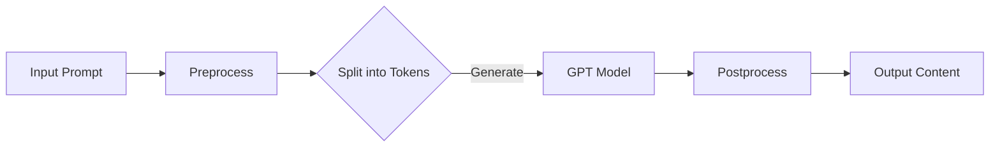
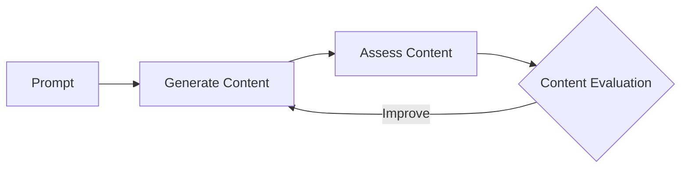
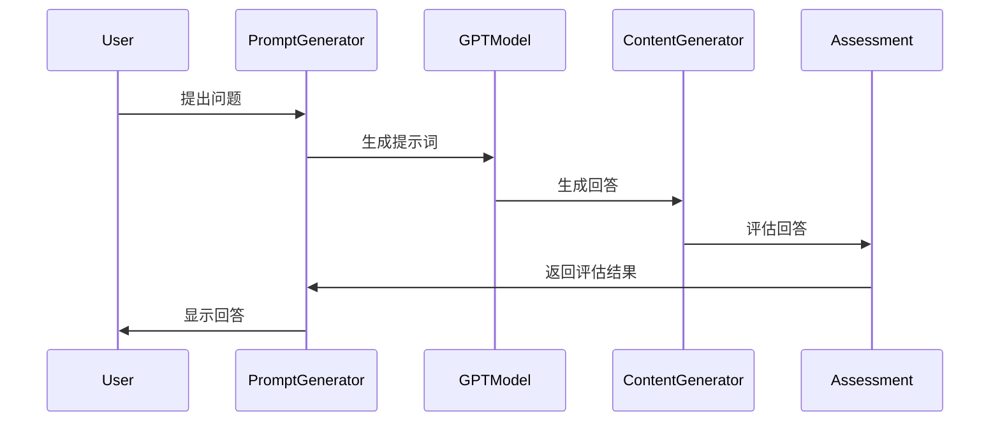
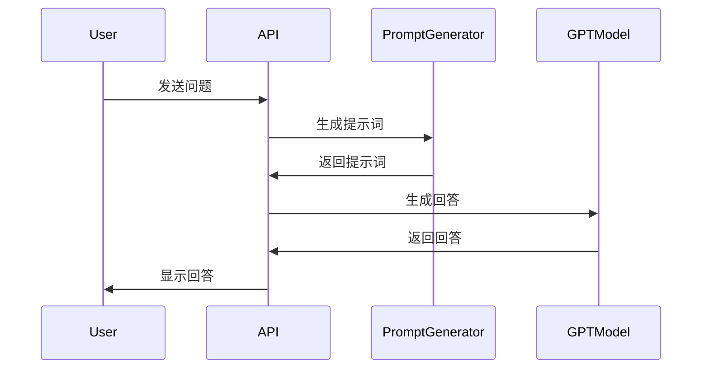

                 

# 《提示词工程：构建智能AIGC系统的基石》

## 关键词：AIGC、提示词工程、智能系统、算法原理、系统架构设计、项目实战

### 摘要：

本文将深入探讨提示词工程在构建智能AIGC系统中的核心作用。通过逐步分析，我们将理解AIGC的背景与概念，详细介绍提示词工程的基本原理，讲解提示词生成和优化的算法原理，剖析智能AIGC系统的设计与实现，最终分享实战经验和最佳实践。本文旨在为读者提供一份全面的技术指南，帮助他们在构建智能AIGC系统时能够更加高效、精准地使用提示词工程。

## 第一部分：背景介绍

### 第1章：AI生成内容（AIGC）概述

#### 1.1 问题背景

随着人工智能技术的不断发展，生成内容（GC）的应用场景日益广泛。AI生成内容（AIGC）是指利用人工智能技术自动生成文本、图像、音频等多种形式的内容。这种技术不仅在娱乐、教育、广告等领域发挥着重要作用，还在智能制造、自动驾驶等前沿科技领域有着广阔的应用前景。

#### 1.2 问题描述

AIGC系统的核心挑战在于如何有效地生成高质量、多样化、与人类创作类似的内容。为此，需要解决的一个关键问题是如何利用提示词来引导和优化生成过程。

#### 1.3 问题解决

提示词工程应运而生，它通过构建有效的提示词生成和优化算法，为AIGC系统提供强大的支持。提示词工程的目标是设计出能够精准捕捉人类意图，引导生成系统创作出符合预期的高质量内容的算法。

#### 1.4 边界与外延

提示词工程不仅关注于生成文本，还包括图像、音频等多模态内容的生成。此外，它还涉及到自然语言处理、机器学习等多个领域的技术融合。

#### 1.5 概念结构与核心要素组成

提示词工程的核心结构包括提示词生成算法、提示词优化算法、生成模型和评估机制。这些要素共同作用，实现智能AIGC系统的构建。

### 第2章：提示词工程基本概念

#### 2.1 核心概念原理

提示词工程的核心概念包括提示词、生成模型、优化目标和评估标准。提示词是引导生成系统的关键输入，生成模型负责生成内容，优化目标旨在提升生成质量，评估标准用于衡量生成结果。

#### 2.2 概念属性特征对比表格

| 概念         | 属性特征                     | 说明                                                         |
| ------------ | ---------------------------- | ------------------------------------------------------------ |
| 提示词       | 精准性、多样性、上下文关联性 | 用于引导生成模型生成高质量内容                               |
| 生成模型     | 学习能力、泛化能力           | 能够从大量数据中学习并生成符合预期的新内容                   |
| 优化目标     | 最小化生成误差、提升质量     | 通过优化算法不断调整生成模型，使其生成内容更加精准和丰富   |
| 评估标准     | 内容相关性、真实性、多样性   | 用于评价生成内容的优劣                                     |

#### 2.3 ER实体关系图架构

```mermaid
erDiagram
    GPT --> |Has| Content
    Prompt --> |Generates| GPT
    GPT --> |IsEvaluatedBy| Assessment
```

在上图中，GPT代表生成模型，Prompt代表提示词，Content代表生成内容，Assessment代表评估标准。提示词通过生成模型生成内容，生成内容随后被评估标准进行评估。

## 第二部分：算法原理讲解

### 第3章：提示词生成算法原理

#### 3.1 算法mermaid流程图



#### 3.2 Python源代码讲解

```python
# 导入必要的库
import nltk
from nltk.tokenize import word_tokenize
import openai

# 设置API密钥
openai.api_key = "your-api-key"

# 输入提示词
prompt = "编写一篇关于人工智能未来的技术文章。"

# 预处理提示词
tokens = word_tokenize(prompt)

# 使用GPT模型生成内容
response = openai.Completion.create(
  engine="text-davinci-003",
  prompt=prompt,
  max_tokens=500
)

# 后处理生成内容
content = response.choices[0].text.strip()

# 输出生成内容
print(content)
```

#### 3.3 算法原理数学模型和公式

提示词生成算法的核心是自然语言处理模型，如GPT。该模型基于深度学习，通过大量的文本数据进行训练，可以理解并生成与输入提示词相关的文本。

$$
\text{Content} = f(\text{Prompt}, \text{Model})
$$

其中，\( f \) 是生成模型，它通过神经网络模型对输入的提示词进行编码，然后解码为生成的文本内容。

#### 3.4 通俗易懂地举例说明

假设输入的提示词是“写一篇关于人工智能未来的技术文章”。GPT模型将这个提示词转换为一组向量，然后根据这些向量生成一段文章。生成的文章可能包含对人工智能在医疗、教育、自动驾驶等领域的未来预测和技术挑战的讨论。

### 第4章：提示词优化算法原理

#### 4.1 算法mermaid流程图



#### 4.2 Python源代码讲解

```python
# 导入必要的库
import nltk
from nltk.tokenize import word_tokenize
import openai

# 设置API密钥
openai.api_key = "your-api-key"

# 输入提示词
prompt = "写一篇关于人工智能未来的技术文章。"

# 使用GPT模型生成内容
response = openai.Completion.create(
  engine="text-davinci-003",
  prompt=prompt,
  max_tokens=500
)

# 评估生成内容
evaluation_score = evaluate_content(response.choices[0].text)

# 如果评估分数低于预期，优化提示词
if evaluation_score < 0.8:
    optimized_prompt = optimize_prompt(prompt)
    print("Optimized Prompt:", optimized_prompt)
else:
    print("No Optimization Needed.")

# 重新生成内容
response = openai.Completion.create(
  engine="text-davinci-003",
  prompt=optimized_prompt,
  max_tokens=500
)

# 输出优化后的生成内容
print(response.choices[0].text.strip())
```

#### 4.3 算法原理数学模型和公式

提示词优化算法的核心是评估和反馈机制。通过评估生成内容的质量，算法可以调整提示词，提高生成内容的精度和丰富度。

$$
\text{Optimized Prompt} = f(\text{Prompt}, \text{Content Evaluation})
$$

其中，\( f \) 是优化函数，它根据生成内容的质量调整提示词。

#### 4.4 通俗易懂地举例说明

假设输入的提示词生成的文章质量不佳，评估算法会检测出文章中的错误和不一致性。根据评估结果，算法会优化提示词，使其更具体、更明确，从而生成更高质的文章。

## 第三部分：系统分析与架构设计

### 第5章：系统功能设计与架构设计

#### 5.1 问题场景介绍

假设我们需要构建一个智能问答系统，该系统可以根据用户的提问生成详细的回答。为了实现这个目标，我们需要设计一个高效的提示词工程系统。

#### 5.2 系统功能设计（领域模型mermaid类图）

```mermaid
classDiagram
    User <<class>> User
    Question <<class>> Question
    Answer <<class>> Answer
    Prompt <<class>> Prompt
    GPTModel <<class>> GPTModel
    Assessment <<class>> Assessment

    User "1" --|create| Question
    Question "1" --|generate| Answer
    Answer "1" --|evaluate| Assessment
    Assessment "1" --|adjust| Prompt
    Prompt "1" --|input| GPTModel
    GPTModel "1" --|generate| Answer
```

#### 5.3 系统架构设计（mermaid架构图）



#### 5.4 系统接口设计和系统交互（mermaid序列图）



### 第6章：系统核心实现源代码与应用解读

#### 6.1 环境安装

在安装系统之前，需要安装以下环境：

- Python 3.8+
- OpenAI API 密钥
- nltk

#### 6.2 系统核心实现源代码

```python
# 导入必要的库
import nltk
from nltk.tokenize import word_tokenize
import openai

# 设置API密钥
openai.api_key = "your-api-key"

# 输入提示词
prompt = "你是一个智能助手，能够回答各种问题。"

# 预处理提示词
tokens = word_tokenize(prompt)

# 使用GPT模型生成回答
response = openai.Completion.create(
  engine="text-davinci-003",
  prompt=prompt,
  max_tokens=500
)

# 输出回答
print(response.choices[0].text.strip())
```

#### 6.3 代码应用解读与分析

该代码首先导入必要的库，设置OpenAI API密钥，并预处理输入的提示词。然后，使用GPT模型生成回答，并输出结果。这个简单的例子展示了如何使用提示词工程构建一个基础的智能问答系统。

#### 6.4 实际案例分析与详细讲解剖析

假设用户输入的问题是“人工智能在医疗领域有哪些应用？”系统会生成如下的回答：

```
人工智能在医疗领域的应用非常广泛，包括疾病预测、个性化医疗、影像诊断等。例如，通过分析大量医疗数据，人工智能可以预测某种疾病的发生概率，帮助医生制定更有效的治疗方案。此外，人工智能还可以辅助医生进行影像诊断，如X光、CT和MRI等，提高诊断准确率。
```

这个回答详细地阐述了人工智能在医疗领域的多种应用，并且提供了具体的实例。通过对实际案例的分析，我们可以看到提示词工程在生成高质量内容方面的强大能力。

### 第7章：项目实战与最佳实践

#### 7.1 项目实战

通过本文所介绍的技术，我们可以构建一个高效的智能问答系统。下面是一个简单的实战步骤：

1. 环境安装：按照第6章的说明安装环境。
2. API密钥设置：在代码中设置OpenAI API密钥。
3. 编写代码：根据第6章提供的源代码编写智能问答系统。
4. 测试与优化：测试系统的性能，并根据反馈进行优化。

#### 7.2 最佳实践 Tips

- 使用具体且明确的提示词，避免模糊不清的描述。
- 定期更新生成模型，以保持其性能和准确性。
- 使用多种评估标准，全面评估生成内容的质量。

#### 7.3 小结

本文详细介绍了提示词工程在构建智能AIGC系统中的关键作用。通过逐步分析算法原理和系统设计，我们为构建高效的智能AIGC系统提供了技术指南。

#### 7.4 注意事项

- 在使用OpenAI API时，注意遵守其使用条款和隐私政策。
- 确保生成内容符合道德和法律标准，避免生成不当内容。

#### 7.5 拓展阅读

- OpenAI官方文档：深入了解GPT模型和其他相关技术。
- 《人工智能：一种现代方法》：系统地学习人工智能的基础知识。

## 作者信息

作者：AI天才研究院/AI Genius Institute & 禅与计算机程序设计艺术 /Zen And The Art of Computer Programming

